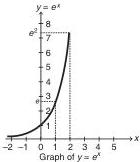
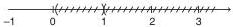
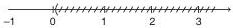
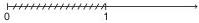
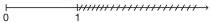
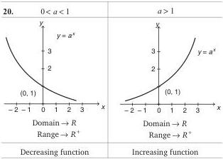

# CAT Quant — Logarithm

## 1. Concept Map

```
                        LOGARITHM
                            |
        +-------------------+-------------------+
        |                                       |
   Definition                              Properties
   a^x = b <=> log_a b = x                  (1)-(22)
        |                                       |
        +-------------------+-------------------+
                            |
              +-------------+-------------+
              |                           |
        Types of Logs              Characteristics
   Natural (ln) & Common        & Mantissa
              |                           |
              +-------------+-------------+
                            |
              +-------------+-------------+
              |                           |
        Applications                 Inequalities
   - Number of digits            - Base > 1: direction
   - Zeros after decimal           preserved
   - Solving equations           - Base < 1: direction
   - Comparing values              reversed
```

---

## 2. Foundations

### 2.1 The Exponential Function
For every $x \in \mathbb{R}$:
$$e^x = 1 + x + \frac{x^2}{2!} + \frac{x^3}{3!} + \dots = \sum_{n=0}^{\infty} \frac{x^n}{n!}$$

**Key properties of $e^x$:**
- $e^x > 0$ for all $x$, and $e^0 = 1$
- $e^a > e^b$ if $a > b$ (strictly increasing)
- $e^a \cdot e^b = e^{a+b}$
- $e^a \div e^b = e^{a-b}$
- $(e^a)^b = e^{ab}$
- $e^x$ is a **one-one function**



### 2.2 Definition of Logarithm
Let $a, b$ be positive real numbers. Then:
$$a^x = b \iff \log_a b = x, \quad a \neq 1, a > 0, b > 0$$

**Examples:**
- $2^5 = 32 \iff \log_2 32 = 5$
- $10^3 = 1000 \iff \log_{10} 1000 = 3$
- $3^{-4} = \frac{1}{81} \iff \log_3 \left(\frac{1}{81}\right) = -4$

### 2.3 Types of Logarithms
| Type | Base | Notation |
|------|------|----------|
| Natural (Naperian) | $e$ | $\ln N$ or $\log_e N$ |
| Common (Briggs's) | $10$ | $\log_{10} N$ or $\log N$ |

---

## 3. Core Formulas with Symbol Meanings

### 3.1 Fundamental Properties
Let $a > 0$, $a \neq 1$, $m > 0$, $n > 0$:

| # | Formula | Meaning |
|---|---------|---------|
| 1 | $\log_a 1 = 0$ | Log of 1 is always 0 |
| 2 | $\log_a a = 1$ | Log of base is 1 |
| 3 | $\log_a a^x = x$ | Log undoes exponent |
| 4 | $a^{\log_a x} = x$ | Exponent undoes log |
| 5 | $\log_a(mn) = \log_a m + \log_a n$ | Product → sum |
| 6 | $\log_a\left(\frac{m}{n}\right) = \log_a m - \log_a n$ | Quotient → difference |
| 7 | $\log_a(m^n) = n \cdot \log_a m$ | Power → multiplication |
| 8 | $\log_a\left(\frac{1}{m}\right) = -\log_a m$ | Reciprocal → negation |
| 9 | $\log_a b = \frac{1}{\log_b a} = \frac{\log_c b}{\log_c a}$ | Base change formula |

### 3.2 Advanced Properties

**Property 10 — Reciprocal relations:** If $\log_a b = x$, then:
- $\log_{1/a} b = -x$
- $\log_a (1/b) = -x$
- $\log_{1/a}(1/b) = x$

**Property 11 — Power of base:**
$$\log_{a^m} b = \frac{1}{m} \log_a b$$

**Properties 12–13 — Monotonicity:**
- $0 < a < 1$: $\log_a x$ is **decreasing**
- $a > 1$: $\log_a x$ is **increasing**

**Property 14 — Base restriction:** Base can never be 1. $\log_1 x$ is undefined for all $x$.




**Property 15 — Domain/Range:** For $f(x) = \log_a x$: Domain → $\mathbb{R}^+$, Range → $\mathbb{R}$

**Properties 17–18 — Comparison with 1:**

| Condition | $0 < a < 1$ | $a > 1$ |
|-----------|-------------|---------|
| $x < a$ | $\log_a x > 1$ | $\log_a x < 1$ |
| $x = a$ | $\log_a x = 1$ | $\log_a x = 1$ |
| $x > a$ | $\log_a x < 1$ | $\log_a x > 1$ |




**Property 19 — Comparison table:**

| $0 < a < 1$ | $a > 1$ |
|-------------|---------|
| $\log_a x$ is decreasing | $\log_a x$ is increasing |
| $\log_a x > \log_a y$ when $x < y$ | $\log_a x < \log_a y$ when $x < y$ |
| Positive for $0 < x < 1$ | Positive for $x > 1$ |



**Property 22 — Logarithmic inequalities:**

| $0 < a < 1$ | $a > 1$ |
|-------------|---------|
| $\log_a b \geq \log_a c \iff b \leq c$ | $\log_a b \geq \log_a c \iff b \geq c > 0$ |
| $\log_a b \geq c \iff b \leq a^c$ | $\log_a b \geq c \iff b \geq a^c$ |

### 3.3 Standard Values
- $\log_{10} 2 = 0.3010$
- $\log_{10} 3 = 0.4771$
- $e = 2.714$ (source value; standard is 2.718)

### 3.4 Series Expansions (for $|x| < 1$)
- $\log(1+x) = x - \frac{x^2}{2} + \frac{x^3}{3} - \frac{x^4}{4} + \dots$
- $\log(1-x) = -\left(x + \frac{x^2}{2} + \frac{x^3}{3} + \dots\right)$
- $\log\left(\frac{1+x}{1-x}\right) = 2\left[x + \frac{x^3}{3} + \frac{x^5}{5} + \dots\right]$

---

## 4. Characteristics and Mantissa

### 4.1 Definitions
- **Characteristic:** The integral part of a logarithm
- **Mantissa:** The decimal part (always positive)

**Example:** In $\log 3274 = 3.5150$:
- Characteristic = 3
- Mantissa = 0.5150

### 4.2 Finding the Characteristic of $\log_{10} x$

**Case (a): When $x > 1$**
$$\text{Characteristic} = (\text{number of digits left of decimal}) - 1$$

**Case (b): When $0 < x < 1$**
$$\text{Characteristic} = (\text{number of zeros between decimal and first significant digit}) + 1 \text{ (negative)}$$

### 4.3 Bar Notation
Negative characteristics use a bar: $-1 \to \bar{1}$, $-2 \to \bar{2}$, $-3 \to \bar{3}$

| Number | Characteristic | Number | Characteristic |
|--------|---------------|--------|---------------|
| 8.3145 | 0 | 0.457 | $\bar{1}$ |
| 74.8120 | 1 | 0.0546 | $\bar{2}$ |
| 568.31 | 2 | 0.001324 | $\bar{3}$ |

### 4.4 Critical Traps with Bar Notation

**Trap 1:** $\bar{2}.784 \neq -2.784$
- $\bar{2}.784 = (-2) + (0.784)$
- $-2.784 = (-2) - (0.784)$

**Trap 2 — Making mantissa positive:**
To convert a negative log to bar form: subtract 1 from integral part, add 1 to decimal part.

**Example:** $-2.5436 \to (-2) + (-0.5436) \to (-3) + (0.4564) \to \bar{3}.4564$

### 4.5 Key Results on Characteristics

1. **Number of integral values:** If $\log_a x$ has characteristic $n$, then number of possible integral values $= a^{n+1} - a^n$
   - Example: $\log_{10} x = 2.abcd \to 10^3 - 10^2 = 900$ integral values ($x = 100$ to $999$)

2. **Negative characteristic:** If characteristic of $\log_{10} x$ is $-n$, then number of zeros between decimal and first significant digit $= n - 1$
   - Example: $\log_{10} x = -3.abcd \to$ first two places after decimal are zeros

---

## 5. Fast CAT Methods

### Method 1: Convert to Exponential Form
When solving $\log_a b = x$, immediately rewrite as $a^x = b$.

**Example:** $\log_8 128 = x \Rightarrow 8^x = 128 \Rightarrow 2^{3x} = 2^7 \Rightarrow x = \frac{7}{3}$

### Method 2: Base Change to 10 or 2
When bases are different, convert everything to a common base.

**Example:** $\log_8 25$ given $\log_{10} 2 = 0.3010$
$$\log_8 25 = \frac{\log_{10} 25}{\log_{10} 8} = \frac{2\log_{10} 5}{3\log_{10} 2} = \frac{2(1 - 0.3010)}{3(0.3010)} = 1.5482$$

### Method 3: Option Substitution
For complex equations, substitute options directly. The source repeatedly recommends this.

### Method 4: Take Log of Both Sides
For equations with variables in exponents, take log of both sides.

**Example:** $x^{\log y - \log z} \cdot y^{\log z - \log x} \cdot z^{\log x - \log y}$
Taking log: all terms cancel → product = 1

### Method 5: AP/GP Conversions
If $a, b, c$ are in GP, then $\log a, \log b, \log c$ are in AP.

### Method 6: Number of Digits Shortcut
$$\text{Number of digits in } N = \lfloor \log_{10} N \rfloor + 1$$

**Example:** Digits in $3^{43}$:
$$\log_{10}(3^{43}) = 43 \times 0.4771 = 20.5153$$
Characteristic = 20 → digits = 21

### Method 7: Zeros After Decimal Shortcut
$$\text{Zeros after decimal} = |\text{characteristic}| - 1$$

**Example:** Zeros in $(0.5)^{100}$:
$$\log x = 100 \times \bar{1}.6990 = 100(-1 + 0.6990) = -31 + 0.90 = \bar{31}.90$$
Zeros = $31 - 1 = 30$

---

## 6. Worked Examples

### Easy Level

**Example 1:** Find $\log_{5\sqrt{5}} 125$

**Solution:**
$$(5\sqrt{5})^x = 125$$
$$5^{(3/2)x} = 5^3$$
$$\frac{3}{2}x = 3 \Rightarrow x = 2$$

**Example 2:** Evaluate $\log_5 \log_5 (3125)$

**Solution:**
$$\log_5 \log_5 (5^5) = \log_5 (5 \cdot \log_5 5) = \log_5 5 = 1$$

**Example 3:** Solve $\log_{10} x - \log_{10} \sqrt{x} = \frac{2}{\log_{10} x}$

**Solution:**
$$\log_{10}\left(\frac{x}{\sqrt{x}}\right) = \frac{2}{\log_{10} x}$$
$$\frac{1}{2}\log_{10} x = \frac{2}{\log_{10} x}$$
$$(\log_{10} x)^2 = 4$$
$$\log_{10} x = \pm 2 \Rightarrow x = 100 \text{ or } x = \frac{1}{100}$$

### Medium Level

**Example 4:** If $\log_a bc = x$, $\log_b ca = y$, $\log_c ab = z$, prove $\frac{1}{x+1} + \frac{1}{y+1} + \frac{1}{z+1} = 1$

**Solution:**
$$\frac{1}{x+1} = \frac{1}{\log_a bc + \log_a a} = \frac{1}{\log_a(abc)} = \log_{abc} a$$

Similarly:
$$\frac{1}{y+1} = \log_{abc} b, \quad \frac{1}{z+1} = \log_{abc} c$$

Sum $= \log_{abc} a + \log_{abc} b + \log_{abc} c = \log_{abc}(abc) = 1$

**Example 5:** Find $\log 45$ given $\log 2 = 0.3010$, $\log 3 = 0.4771$

**Solution:**
$$\log 45 = \log(3^2 \cdot 5) = 2\log 3 + \log\left(\frac{10}{2}\right)$$
$$= 2(0.4771) + 1 - 0.3010 = 1.6532$$

**Example 6:** Solve $\log_x(8x-3) - \log_x 4 = 2$

**Solution:**
$$\log_x\left(\frac{8x-3}{4}\right) = 2$$
$$x^2 = \frac{8x-3}{4}$$
$$4x^2 - 8x + 3 = 0$$
$$x = \frac{3}{2} \text{ or } x = \frac{1}{2}$$

### Advanced Level

**Example 7:** Solve $\log_{(2x^2+2x+3)}(x^2-2x) = 1$

**Solution:**
Since $\log_a b = 1 \Rightarrow a = b$:
$$x^2 - 2x = 2x^2 + 2x + 3$$
$$x^2 + 4x + 3 = 0$$
$$(x+1)(x+3) = 0$$
$$x = -1, -3$$

**Domain check:** At $x = -3$, the base makes log undefined.
**Final answer:** $x = -1$

**Example 8:** Solve $2\log_2 \log_2 x + \log_{1/2} \log_2(2\sqrt{2}x) = 1$

**Solution:**
Let $u = \log_2 x$:
$$2\log_2 u + \log_{1/2}\left(\frac{3}{2} + u\right) = 1$$
$$\log_2 u^2 - \log_2\left(\frac{3}{2} + u\right) = 1$$
$$\log_2\left(\frac{u^2}{3/2 + u}\right) = 1$$
$$u^2 = 2\left(\frac{3}{2} + u\right)$$
$$u^2 - 2u - 3 = 0$$
$$u = -1, 3 \Rightarrow x = \frac{1}{2}, 8$$

**Domain check:** At $x = \frac{1}{2}$, $2\log_2 \log_2 x$ is undefined.
**Final answer:** $x = 8$

**Example 9:** Find the least value of $2\log_{10} x - \log_x \frac{1}{100}$ for $x > 1$

**Solution:**
$$= 2\log_{10} x + \frac{2}{\log_{10} x} = 2\left(\log_{10} x + \frac{1}{\log_{10} x}\right)$$

By AM ≥ GM:
$$\frac{\log_{10} x + \frac{1}{\log_{10} x}}{2} \geq \sqrt{\log_{10} x \cdot \frac{1}{\log_{10} x}} = 1$$

Therefore, least value $= 2 \times 2 = 4$ (attained at $x = 10$)

**Example 10:** Solve $\log_{20} 3$ lies between which values?

**Solution:**
- $3 < 20^{1/2} \Rightarrow \log_{20} 3 < \frac{1}{2}$
- $3 > 20^{1/3} \Rightarrow \log_{20} 3 > \frac{1}{3}$

**Answer:** $\frac{1}{3} < \log_{20} 3 < \frac{1}{2}$

---

## 7. Decision Rules

### Rule 1: Base > 1 vs Base < 1
| Situation | Action |
|-----------|--------|
| Base > 1 | Inequality direction preserved |
| Base < 1 | Inequality direction reversed |

### Rule 2: Solving $\log_a b = c$
| Condition | Action |
|-----------|--------|
| $c = 1$ | $a = b$ |
| $c = 0$ | $b = 1$ |
| Otherwise | $b = a^c$ |

### Rule 3: Domain Check Priority
Always check in this order:
1. Base > 0
2. Base ≠ 1
3. Argument > 0

### Rule 4: Number of Digits
| Given | Formula |
|-------|---------|
| $N$ has $k$ digits | $k = \lfloor \log_{10} N \rfloor + 1$ |
| $\log_{10} N$ has characteristic $c$ | digits $= c + 1$ |

### Rule 5: Zeros After Decimal
| Given | Formula |
|-------|---------|
| $\log_{10} N = \bar{n}.f$ | zeros $= n - 1$ |

### Rule 6: Comparing Logs
| Situation | Method |
|-----------|--------|
| Same base | Compare arguments (watch base) |
| Different bases | Convert to common base or compare to integers |
| $\log_a b$ vs $\log_c d$ | Check if each is > or < 1, 2, etc. |

---

## 8. Common Traps

### Trap 1: Base Cannot Be 1
$\log_1 x$ is undefined for all $x$.

### Trap 2: Argument Must Be Positive
$\log$ of negative or zero is undefined. Always check domain after solving.

### Trap 3: Bar Notation Confusion
$\bar{2}.784 \neq -2.784$
- $\bar{2}.784 = -2 + 0.784 = -1.216$
- $-2.784 = -2 - 0.784$

### Trap 4: Mantissa Always Positive
Convert negative logs to bar form before reading mantissa.

### Trap 5: Reject Invalid Solutions
After solving, always verify each solution satisfies the domain.

**Example:** $\log_9(2x-5) = \log_3(x-4)$
$$\frac{1}{2}\log_3(2x-5) = \log_3(x-4)$$
$$2x-5 = (x-4)^2$$
$$x = 3 \text{ or } 7$$
$x = 3$ is **rejected** (makes $\log_9(2x-5)$ undefined)

### Trap 6: Inequality Direction
For $0 < a < 1$: $\log_a b \geq \log_a c \iff b \leq c$ (direction reverses!)

### Trap 7: Characteristic for Digits
Digits $=$ characteristic $+ 1$ (not just characteristic).

### Trap 8: Zeros After Decimal
Zeros $= |\text{characteristic}| - 1$ (not just the characteristic).

### Trap 9: $e$ Value
Source uses $e = 2.714$ (standard is 2.718). For CAT, use the source value.

---

## 9. Timed Strategy

### Time Allocation (per question)
| Difficulty | Time Budget |
|------------|-------------|
| Direct evaluation | 30–45 seconds |
| Given values, find expression | 45–60 seconds |
| Equations | 60–90 seconds |
| Inequalities | 60–90 seconds |
| Advanced (Level 2) | 90–120 seconds |

### Step-by-Step Approach

**Step 1: Identify type (5 seconds)**
- Direct evaluation?
- Equation solving?
- Inequality?
- Number of digits/zeros?
- Comparison?

**Step 2: Choose method (5 seconds)**
- Convert to exponential form
- Base change
- Option substitution
- Take log of both sides

**Step 3: Execute (30–60 seconds)**
- Apply properties systematically
- Watch domain constraints

**Step 4: Verify (10 seconds)**
- Check domain for all solutions
- Check if answer matches options

### Speed Techniques

1. **Memorize:** $\log_{10} 2 = 0.3010$, $\log_{10} 3 = 0.4771$
2. **Derive quickly:** $\log 5 = 1 - \log 2 = 0.6990$
3. **Use symmetry:** $\log_a b \cdot \log_b a = 1$
4. **Spot patterns:** Products of logs often telescope to 1

---

## 10. Final Revision Sheet

### Essential Formulas

$$\boxed{\log_a b = x \iff a^x = b}$$

$$\boxed{\log_a(mn) = \log_a m + \log_a n}$$

$$\boxed{\log_a\left(\frac{m}{n}\right) = \log_a m - \log_a n}$$

$$\boxed{\log_a(m^n) = n\log_a m}$$

$$\boxed{\log_a b = \frac{1}{\log_b a} = \frac{\log_c b}{\log_c a}}$$

$$\boxed{\log_{a^m} b = \frac{1}{m}\log_a b}$$

$$\boxed{a^{\log_a x} = x}$$

$$\boxed{\log_a 1 = 0, \quad \log_a a = 1}$$

### Standard Values
| Value | Number |
|-------|--------|
| $\log_{10} 2$ | 0.3010 |
| $\log_{10} 3$ | 0.4771 |
| $\log_{10} 5$ | 0.6990 |
| $e$ | 2.714 |

### Quick Reference Table

| Concept | Rule |
|---------|------|
| Digits in $N$ | $\lfloor \log_{10} N \rfloor + 1$ |
| Zeros after decimal | $\|$characteristic$\| - 1$ |
| Base > 1 | Increasing function |
| Base < 1 | Decreasing function |
| Base = 1 | Undefined |
| Argument ≤ 0 | Undefined |
| $\log_a b = 1$ | $a = b$ |
| $\log_a b = 0$ | $b = 1$ |

### Common Identities
$$\log_a b \cdot \log_b c \cdot \log_c a = 1$$

$$\frac{1}{\log_a bc + 1} = \log_{abc} a$$

$$\log_a x + \log_a y = \log_a(xy)$$

$$\log_a x - \log_a y = \log_a\left(\frac{x}{y}\right)$$

### Final Checklist
- [ ] Base > 0 and ≠ 1?
- [ ] Argument > 0?
- [ ] Inequality direction correct for base?
- [ ] Bar notation handled correctly?
- [ ] All solutions verified in domain?
- [ ] Answer matches options?
