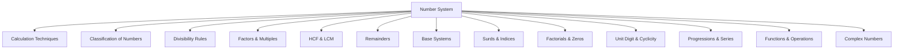

# CAT Quant — Number System: Complete Study Notes

## 1. Concept Map

---

## 2. Foundations: Classification of Numbers

### 2.1 The Number Line

The set of real numbers is a union of rational and irrational numbers. The hierarchy is:

$$\text{Complex} \supset \text{Real} \supset \text{Rational} \supset \text{Integer} \supset \text{Whole} \supset \text{Natural}$$

### 2.2 Key Definitions

| Set | Symbol | Definition | Examples |
|-----|--------|------------|----------|
| Natural Numbers | $\mathbb{N}$ | Counting numbers | $\{1, 2, 3, \dots\}$ |
| Whole Numbers | $\mathbb{W}$ | Natural + 0 | $\{0, 1, 2, 3, \dots\}$ |
| Integers | $\mathbb{Z}$ | Whole + negatives | $\{\dots, -2, -1, 0, 1, 2, \dots\}$ |
| Rational Numbers | $\mathbb{Q}$ | $\frac{p}{q}$, $q \neq 0$, $p, q$ integers | $\frac{1}{2}, 3, -0.75$ |
| Irrational Numbers | $\mathbb{Q}'$ | Cannot be expressed as $\frac{p}{q}$ | $\sqrt{2}, \pi, e$ |

### 2.3 Even and Odd Numbers

**Operations Table:**

| Operation | Result | Example |
|-----------|--------|---------|
| Even ± Even | Even | $4 + 6 = 10$ |
| Odd ± Odd | Even | $3 + 5 = 8$ |
| Even ± Odd | Odd | $4 + 3 = 7$ |
| Even × Even | Even | $4 \times 6 = 24$ |
| Odd × Odd | Odd | $3 \times 5 = 15$ |
| Even × Odd | Even | $4 \times 3 = 12$ |
| Even$^n$ | Even | $4^3 = 64$ |
| Odd$^n$ | Odd | $3^3 = 27$ |

> **Trap:** 0 is an even number.

### 2.4 Prime and Composite Numbers

- **Prime:** Divisible only by 1 and itself. 2 is the only even prime.
- **Composite:** Has more than 2 factors.
- **1 is neither prime nor composite.**

**Primes up to 100:**
$$2, 3, 5, 7, 11, 13, 17, 19, 23, 29, 31, 37, 41, 43, 47, 53, 59, 61, 67, 71, 73, 79, 83, 89, 97$$

**Primality Test:** For a number $n$, check divisibility by all primes $\leq \sqrt{n}$. If none divide, $n$ is prime.

**Example:** Is 241 prime?
- $\sqrt{241} \approx 15.5$, so check primes 2, 3, 5, 7, 11, 13.
- None divide 241 → **241 is prime**.

### 2.5 Special Number Types

| Type | Definition | Examples |
|------|------------|----------|
| Co-prime | HCF = 1 (numbers need not be prime) | (8, 9), (14, 25) |
| Twin Primes | Primes differing by 2 | (11, 13), (17, 19) |
| Perfect Number | Sum of factors (excluding itself) = number | 6, 28, 496 |
| Triangular Number | $\frac{n(n+1)}{2}$ | 1, 3, 6, 10, 15 |

---

## 3. Calculation Techniques

### 3.1 Multiplication by Powers of 5

$$K \times 5^n = \frac{K \times 10^n}{2^n} = \frac{K\underbrace{00\dots0}_{n \text{ zeros}}}{2^n}$$

**Example:** $369 \times 125 = 369 \times 5^3 = \frac{369000}{8} = 46125$

### 3.2 Multiplication by Numbers Ending in 9

$$K \times (10^n - 1) = K \times 10^n - K$$

**Example:** $287 \times 19 = 287 \times (20 - 1) = 5740 - 287 = 5453$

### 3.3 Multiplication When Unit Digits Sum to 10

**Condition:** Unit digits sum to 10, remaining digits are the same.

**Method:**
1. Multiply unit digits (write as 2-digit result).
2. Multiply left digits by (left digits + 1).

**Example:** $83 \times 87$
- $3 \times 7 = 21$
- $8 \times (8+1) = 72$
- **Answer:** 7221

> **Trap:** Write "09" not "9" for the unit digit product (e.g., $71 \times 79 = 5609$).

### 3.4 Multiplication When Difference is Even

$$N_1 \times N_2 = \left(\frac{N_1 + N_2}{2}\right)^2 - \left(\frac{N_2 - N_1}{2}\right)^2$$

**Example:** $76 \times 96$
- Midpoint: $\frac{76+96}{2} = 86$
- Difference/2: $\frac{96-76}{2} = 10$
- $86^2 - 10^2 = 7396 - 100 = 7296$

### 3.5 Squaring Numbers Ending in 5

$$(a5)^2 = [a(a+1)]25$$

**Example:** $125^2 = [12 \times 13]25 = 15625$

### 3.6 General Squaring Formula

If $B < N$: $(N)^2 = (B)^2 + d(B+N)$ where $d = N - B$

**Example:** $52^2 = 50^2 + 2(50+52) = 2500 + 204 = 2704$

---

## 4. Divisibility Rules

### 4.1 Basic Rules

| Divisor | Rule | Example |
|---------|------|---------|
| 2 | Last digit even | 395672 ✓ |
| 3 | Sum of digits divisible by 3 | 12375 (sum=18) ✓ |
| 4 | Last 2 digits divisible by 4 | 33932 (32) ✓ |
| 5 | Last digit 0 or 5 | 438915 ✓ |
| 8 | Last 3 digits divisible by 8 | 23456008 (008) ✓ |
| 9 | Sum of digits divisible by 9 | 7329753 (sum=36) ✓ |
| 10 | Last digit 0 | 2300 ✓ |
| 11 | Difference of odd/even place digit sums = 0 or multiple of 11 | 57945822 ✓ |

### 4.2 Divisibility by 99, 999, 9999 (Group Method)

**By 99:** Split into 2-digit pairs from right, sum them, check if sum divisible by 99.

**Example:** $757845 \rightarrow 75 + 78 + 45 = 198$ (divisible by 99) ✓

**By 999:** Split into 3-digit groups from right, sum, check divisibility by 999.

**By 9999:** Split into 4-digit groups from right, sum, check divisibility by 9999.

> **Trap:** The remainder of the sum of groups equals the remainder of the original number.

### 4.3 Osculator Method for 7, 13, 17, 19

**Concept:** Bring divisor closer to a multiple of 10 with difference of 1.

| Divisor | Oscillator | Type | Operation |
|---------|-----------|------|-----------|
| 7 | 2 | Negative | Subtract product |
| 13 | 4 | One more | Add product |
| 17 | 5 | Negative | Subtract product |
| 19 | 2 | One more | Add product |

**Example (Divisibility by 7):** Is 1071 divisible by 7?
- $107 - 1 \times 2 = 105$
- $10 - 5 \times 2 = 0$ ✓

### 4.4 Divisibility by Composite Numbers

The number must be divisible by all factors whose LCM is the divisor.

| Divisor | Check |
|---------|-------|
| 6 | Divisible by 2 AND 3 |
| 12 | Divisible by 4 AND 3 |
| 15 | Divisible by 3 AND 5 |
| 72 | Divisible by 8 AND 9 |

---

## 5. Factors and Multiples

### 5.1 Prime Factorization

Express a number as a product of prime powers.

**Example:** $72 = 2^3 \times 3^2$

### 5.2 Number of Factors

For $N = a^p \times b^q \times c^r$:

$$\text{Number of factors} = (p+1)(q+1)(r+1)$$

**Example:** $540 = 2^2 \times 3^3 \times 5^1$
- Factors = $(2+1)(3+1)(1+1) = 24$

> **Note:** A perfect square always has an odd number of factors.

### 5.3 Number of Odd and Even Factors

For $N = 2^p \times a^q \times b^r$ (where $a, b$ are odd primes):

$$\text{Odd factors} = (q+1)(r+1)$$
$$\text{Even factors} = \text{Total factors} - \text{Odd factors}$$

**Example:** $90 = 2 \times 3^2 \times 5$
- Odd factors = $(2+1)(1+1) = 6$
- Even factors = $12 - 6 = 6$

### 5.4 Sum of Factors

$$\text{Sum of factors} = \frac{(a^{p+1}-1)(b^{q+1}-1)(c^{r+1}-1)}{(a-1)(b-1)(c-1)}$$

**Example:** $24 = 2^3 \times 3^1$
- Sum = $\frac{(2^4-1)(3^2-1)}{(2-1)(3-1)} = \frac{15 \times 8}{1 \times 2} = 60$

### 5.5 Product of Factors

$$\text{Product of factors} = N^{n/2}$$

where $n$ = number of factors.

**Example:** $360 = 2^3 \times 3^2 \times 5$ has 24 factors.
- Product = $360^{12}$

### 5.6 Number of Co-Primes (Euler's Totient)

$$\phi(N) = N\left(1 - \frac{1}{a}\right)\left(1 - \frac{1}{b}\right)\left(1 - \frac{1}{c}\right)$$

**Example:** $\phi(336) = 336 \times \frac{1}{2} \times \frac{2}{3} \times \frac{6}{7} = 96$

**Sum of co-primes:** $\frac{N}{2} \times \phi(N)$

---

## 6. HCF and LCM

### 6.1 HCF (GCD)

**Definition:** Greatest number that divides all given numbers exactly.

**Methods:**
1. **Prime Factorization:** Take product of common prime factors with least exponents.
2. **Division Method:** Divide larger by smaller, then divisor by remainder, until remainder = 0.

**Shortcut:** HCF is a factor of the difference of the given numbers.

**Example:** HCF(63, 84)
- Difference = 21, both divisible by 21 → HCF = 21

### 6.2 LCM

**Definition:** Least common multiple of given numbers.

**Methods:**
1. **Prime Factorization:** Take product of all prime factors with highest exponents.
2. **Division Method:** Divide by common prime factors successively.

### 6.3 Key Formula

$$\text{HCF} \times \text{LCM} = \text{Product of two numbers}$$

### 6.4 HCF and LCM of Fractions

$$\text{HCF of fractions} = \frac{\text{HCF of Numerators}}{\text{LCM of Denominators}}$$

$$\text{LCM of fractions} = \frac{\text{LCM of Numerators}}{\text{HCF of Denominators}}$$

### 6.5 LCM with Remainders

**Case 1: Same remainder for all divisors**
$$\text{Number} = \text{LCM(divisors)} + \text{remainder}$$

**Case 2: Constant difference (divisor − remainder)**
$$\text{Number} = \text{LCM(divisors)} - \text{common difference}$$

**Example:** Remainders 2, 19, 26 for divisors 18, 35, 42.
- Differences: $18-2=16$, $35-19=16$, $42-26=16$
- LCM(18, 35, 42) = 630
- Number = $630 - 16 = 614$

### 6.6 HCF with Remainders

**Case 1: Different remainders:** Subtract remainders from respective numbers, find HCF of results.

**Case 2: Same remainder:** Subtract the common remainder from each number, find HCF.

**Case 3: Same remainder, unknown value:** Find HCF of differences of the numbers.

---

## 7. Remainders

### 7.1 Basic Remainder Theorem

$$\text{Dividend} = (\text{Divisor} \times \text{Quotient}) + \text{Remainder}$$

> **Note:** Remainder is always a non-negative integer less than the divisor.

### 7.2 Remainder of Sum/Product

- Remainder of $(a_1 + a_2 + \dots + a_n) \div d$ = Remainder of $(R_1 + R_2 + \dots + R_n) \div d$
- Remainder of $(a_1 \times a_2 \times \dots \times a_n) \div d$ = Remainder of $(R_1 \times R_2 \times \dots \times R_n) \div d$

**Example:** Remainder of $123 \times 1234 \div 15$
- $123 \div 15$ → remainder 3
- $1234 \div 15$ → remainder 4
- $3 \times 4 = 12$ → **Remainder = 12**

### 7.3 Special Results

1. $\frac{(a+1)^n}{a}$ always gives remainder **1**.
2. $\frac{a^n}{(a+1)}$ gives remainder **1** when $n$ is even, and remainder **a** when $n$ is odd.

**Example:** Remainder of $8^{1785} \div 7$
- $8 = 7 + 1$ → **Remainder = 1**

### 7.4 Pattern Method

Find the cyclic pattern of remainders, then map the exponent.

**Example:** Remainder of $5^{123} \div 7$
- Pattern: $5^1 \to 5$, $5^2 \to 4$, $5^3 \to 6$, $5^4 \to 2$, $5^5 \to 3$, $5^6 \to 1$
- Period = 6; $123 \div 6$ → remainder 3 → corresponds to $5^3$
- **Remainder = 6**

---

## 8. Factorials and Trailing Zeros

### 8.1 Definition

$$n! = 1 \times 2 \times 3 \times \dots \times (n-1) \times n$$

**Key facts:**
- $0! = 1$ and $1! = 1$
- $n!$ is even for $n \geq 2$
- $n!$ ends in zero for $n \geq 5$

### 8.2 Highest Power of $k$ in $n!$

$$\left\lfloor \frac{n}{k} \right\rfloor + \left\lfloor \frac{n}{k^2} \right\rfloor + \left\lfloor \frac{n}{k^3} \right\rfloor + \dots$$

**Shortcut (Successive Division):** Repeatedly divide by $k$ and add quotients.

**Example:** Highest power of 5 in 124!
- $\lfloor 124/5 \rfloor + \lfloor 124/25 \rfloor = 24 + 4 = 28$

### 8.3 Trailing Zeros in $n!$

Count the number of 5s (since 5s are fewer than 2s).

**Example:** Trailing zeros in 100!
- $\lfloor 100/5 \rfloor + \lfloor 100/25 \rfloor = 20 + 4 = 24$

### 8.4 Zeros at End of Product

For $2^k \times 5^l$:
- If $k < l$: $k$ zeros
- If $l < k$: $l$ zeros

**Example:** Zeros in $2^{222} \times 5^{555}$
- 2s are fewer → **222 zeros**

---

## 9. Unit Digit and Cyclicity

### 9.1 Basic Rules

- **Odd × number ending in 5** → unit digit 5
- **Even × number ending in 5** → unit digit 0
- Unit digit of sum/product depends only on unit digits of operands.

### 9.2 Cyclicity of Unit Digits

| Base | Period | Pattern |
|------|--------|---------|
| 0, 1, 5, 6 | 1 | Always same |
| 4, 9 | 2 | Alternates |
| 2, 3, 7, 8 | 4 | Cycles of 4 |

**Method:** Divide exponent by period; use remainder to find unit digit.

**Example:** Unit digit of $2^{35}$
- $35 \div 4$ → remainder 3
- Unit digit of $2^3 = 8$ → **Answer: 8**

### 9.3 Unit Digit of Factorials

For $k \geq 5$, $k!$ ends in 0, so $(k!)^n$ ends in 0.

**Example:** Unit digit of $(1!)^1 + (2!)^2 + (3!)^3 + \dots + (10!)^{10}$
- Unit digits: 1, 4, 6, 6, 0, 0, 0, 0, 0, 0
- Sum = 17 → **Unit digit = 7**

---

## 10. Surds and Indices

### 10.1 Laws of Indices

1. $a^m \times a^n = a^{m+n}$
2. $\frac{a^m}{a^n} = a^{m-n}$
3. $(ab)^n = a^n b^n$
4. $\left(\frac{a}{b}\right)^n = \frac{a^n}{b^n}$
5. $(a^m)^n = a^{mn}$
6. $a^0 = 1$ (where $a \neq 0$)
7. $a^{-n} = \frac{1}{a^n}$

> **Trap:** $a^{b^c} \neq (a^b)^c$

### 10.2 Key Results

- If $a^x = a^y$, then $x = y$ (where $a \neq 0, 1$)
- HCF of $(a^m - 1)$ and $(a^n - 1) = a^{\text{HCF}(m,n)} - 1$

**Example:** HCF of $(2^{315} - 1)$ and $(2^{25} - 1)$
- HCF(315, 25) = 5
- HCF = $2^5 - 1 = 31$

### 10.3 Surds

**Definition:** A root of a rational number that cannot be exactly obtained.

**Examples:** $\sqrt{2}, \sqrt[3]{3}, \sqrt[4]{5}$

**Not surds:** $\sqrt{4} = 2, \sqrt[3]{27} = 3$

**Key properties:**
- All surds are irrational, but not all irrationals are surds.
- $\sqrt{a} + \sqrt{b}$ and $\sqrt{a} - \sqrt{b}$ are conjugate surds.

### 10.4 Comparing Surds

Convert to same order using LCM of orders.

**Example:** Compare $\sqrt[3]{2}$ and $\sqrt[4]{3}$
- LCM(3, 4) = 12
- $\sqrt[3]{2} = 2^{4/12} = (16)^{1/12}$
- $\sqrt[4]{3} = 3^{3/12} = (27)^{1/12}$
- $\sqrt[3]{2} < \sqrt[4]{3}$

### 10.5 Rationalization

Multiply by the conjugate to simplify.

**Example:** $\frac{2 + \sqrt{3}}{2 - \sqrt{3}}$
- $= \frac{(2+\sqrt{3})^2}{4-3} = 7 + 4\sqrt{3}$

---

## 11. Base Systems

### 11.1 Common Bases

| Base | Name | Symbols |
|------|------|---------|
| 2 | Binary | 0, 1 |
| 8 | Octal | 0–7 |
| 10 | Decimal | 0–9 |
| 16 | Hexadecimal | 0–9, A–F |

### 11.2 Decimal to Another Base

Divide successively by the base; write remainders in reverse order.

**Example:** $(17)_{10} = (10001)_2$

### 11.3 Another Base to Decimal

Multiply each digit by its positional value.

**Example:** $(100101)_2 = 1 \times 2^5 + 0 + 0 + 1 \times 2^2 + 0 + 1 = 32 + 4 + 1 = 37$

### 11.4 Octal ↔ Binary

Each octal digit corresponds to 3 binary digits.

| Octal | 0 | 1 | 2 | 3 | 4 | 5 | 6 | 7 |
|-------|---|---|---|---|---|---|---|---|
| Binary | 000 | 001 | 010 | 011 | 100 | 101 | 110 | 111 |

### 11.5 Key Traps

- Digit must be less than the base (e.g., digit 5 is invalid in base 5).
- Subscripts denote base: $(25)_8$ means base 8.

---

## 12. Progressions and Series

### 12.1 Arithmetic Progression (AP)

$$T_n = a + (n-1)d$$
$$S_n = \frac{n}{2}[2a + (n-1)d]$$

**Key facts:**
- AM of odd number of consecutive terms = middle term
- If $a, b, c$ are in AP: $b = \frac{a+c}{2}$

### 12.2 Geometric Progression (GP)

$$T_n = ar^{n-1}$$
$$S_n = \frac{a(r^n - 1)}{r - 1} \quad (r > 1)$$
$$S_n = \frac{a(1 - r^n)}{1 - r} \quad (r < 1)$$

**Key facts:**
- GM of odd number of consecutive terms = middle term
- If $a, b, c$ are in GP: $b = \sqrt{ac}$

### 12.3 Important Series

1. Sum of first $n$ natural numbers: $\frac{n(n+1)}{2}$
2. Sum of first $n$ odd numbers: $n^2$
3. Sum of first $n$ even numbers: $n(n+1)$
4. Sum of squares: $\frac{n(n+1)(2n+1)}{6}$
5. Sum of cubes: $\left[\frac{n(n+1)}{2}\right]^2$

---

## 13. Functions and Operations

### 13.1 Defined Operations

CAT often defines custom operations. Follow the order of operations strictly.

**Example:** If $a \oplus b = a^3 + b^2 + 1$, find $(2 \oplus 3) \oplus (3 \oplus 5)$
- $2 \oplus 3 = 8 + 9 + 1 = 18$
- $3 \oplus 5 = 27 + 25 + 1 = 53$
- $18 \oplus 53 = 5832 + 2809 + 1 = 8642$

### 13.2 Greatest Integer (Floor) Function

$$\lfloor x \rfloor = \text{greatest integer} \leq x$$

**Examples:** $\lfloor 3.1 \rfloor = 3$, $\lfloor -0.45 \rfloor = -1$

### 13.3 Least Integer (Ceiling) Function

$$\lceil x \rceil = \text{least integer} \geq x$$

**Examples:** $\lceil 3.1 \rceil = 4$, $\lceil -0.45 \rceil = 0$

### 13.4 Modulus Function

$$|x| = \begin{cases} x & \text{if } x \geq 0 \\ -x & \text{if } x < 0 \end{cases}$$

**Key properties:**
- $|a + b| \leq |a| + |b|$
- $|ab| = |a||b|$
- If $|a| \leq k$, then $-k \leq a \leq k$

---

## 14. Algebraic Identities

### 14.1 Core Identities

1. $(a + b)^2 = a^2 + b^2 + 2ab$
2. $(a - b)^2 = a^2 + b^2 - 2ab$
3. $a^2 - b^2 = (a + b)(a - b)$
4. $(a + b)^3 = a^3 + b^3 + 3ab(a + b)$
5. $a^3 + b^3 = (a + b)(a^2 + b^2 - ab)$
6. $a^3 - b^3 = (a - b)(a^2 + b^2 + ab)$
7. $a^3 + b^3 + c^3 - 3abc = (a + b + c)(a^2 + b^2 + c^2 - ab - bc - ac)$

### 14.2 Special Result

If $a + b + c = 0$, then $a^3 + b^3 + c^3 = 3abc$.

### 14.3 Divisibility Rules for $a^n \pm b^n$

| Expression | Divisible by $(a+b)$ | Divisible by $(a-b)$ |
|------------|---------------------|---------------------|
| $a^n + b^n$ (n odd) | Yes | No |
| $a^n + b^n$ (n even) | No | No |
| $a^n - b^n$ (n any) | Only if n even | Yes |

---

## 15. Digital Sum

### 15.1 Definition

Sum digits repeatedly until a single digit remains.

**Example:** Digital sum of 7586902
- $7+5+8+6+9+0+2 = 37$
- $3+7 = 10$
- $1+0 = 1$

### 15.2 Key Properties

- Digital sum = remainder when divided by 9 (with 0 ≡ 9)
- Perfect square: digital sum is 1, 4, 7, or 9
- Perfect cube: digital sum is 1, 8, or 9
- Prime (except 3): digital sum is 1, 2, 4, 5, 7, or 8

> **Trap:** If digital sum is NOT 1, 4, 7, or 9, the number is definitely NOT a perfect square. But the converse is not always true.

---

## 16. Complex Numbers

### 16.1 Definition

$$z = a + ib$$

where $a, b$ are real and $i = \sqrt{-1}$.

**Key facts:**
- $i^0 = 1$, $i^1 = i$, $i^2 = -1$, $i^3 = -i$, $i^4 = 1$
- Sum of four consecutive powers of $i$ is zero.

### 16.2 Modulus and Conjugate

$$|z| = \sqrt{a^2 + b^2}$$
$$\bar{z} = a - ib$$

**Key properties:**
- $z\bar{z} = |z|^2$
- $|z_1 z_2| = |z_1||z_2|$
- $|z_1 + z_2| \leq |z_1| + |z_2|$

### 16.3 Cube Roots of Unity

$$1, \omega, \omega^2$$

where:
- $1 + \omega + \omega^2 = 0$
- $\omega^3 = 1$

---

## 17. Fast CAT Methods

### 17.1 Option Checking

When options are close together, verify each option directly.

**Example:** Which number is divisible by 99?
- Check each option using the pair method.

### 17.2 Substitution Method

Use convenient values (1, 2, −1, ½) to verify algebraic identities.

**Example:** If $a + b + c = 0$, find $a^3 + b^3 + c^3$
- Take $a = 1, b = -1, c = 0$: $1 - 1 + 0 = 0$ ✓
- $a^3 + b^3 + c^3 = 1 - 1 + 0 = 0 = 3abc$ ✓

### 17.3 Digital Root Verification

Use digital sums to quickly verify multiplication results.

**Example:** Is $174 \times 26 = 4524$?
- DS(174) = 3, DS(26) = 8, $3 \times 8 = 24$ → DS = 6
- DS(4524) = 6 ✓

### 17.4 HCF of Differences

For "same remainder" problems, find HCF of differences.

**Example:** Largest number dividing 76, 132, 160 with same remainder
- Differences: $132-76 = 56$, $160-132 = 28$, $160-76 = 84$
- HCF(56, 28, 84) = 28

---

## 18. Decision Rules

| Problem Type | Rule |
|--------------|------|
| Divisibility by composite | Check all factors whose LCM is the divisor |
| Same remainder | Number = LCM + remainder |
| Constant difference | Number = LCM − difference |
| Trailing zeros | Count 5s (limiting factor) |
| Unit digit | Use cyclicity (period 4 for 2, 3, 7, 8) |
| Comparing surds | Convert to same order |
| Perfect square check | Digital sum must be 1, 4, 7, or 9 |
| HCF of fractions | HCF of numerators / LCM of denominators |
| LCM of fractions | LCM of numerators / HCF of denominators |
| Number of factors | $(p+1)(q+1)(r+1)$ |
| Sum of factors | $\frac{(a^{p+1}-1)(b^{q+1}-1)}{(a-1)(b-1)}$ |

---

## 19. Common Traps

1. **0 is even** — not odd.
2. **1 is neither prime nor composite.**
3. **Co-prime numbers need not be prime.**
4. **Remainder is always non-negative.**
5. **Division by zero is undefined.**
6. **$a^{b^c} \neq (a^b)^c$**
7. **Digital sum of perfect square** must be 1, 4, 7, or 9 (but converse not always true).
8. **Unit digit product** in Case 5 multiplication: write "09" not "9".
9. **In base systems**, digit must be less than the base.
10. **For negative integers**, remainder is still non-negative (e.g., $-37 \div 5$: quotient = -8, remainder = 3).

---

## 20. Timed Strategy

### 20.1 Time Allocation (for 2-minute questions)

| Phase | Time | Action |
|-------|------|--------|
| Read & Understand | 15 sec | Identify problem type |
| Choose Method | 15 sec | Direct formula vs. option checking |
| Execute | 60 sec | Apply the method |
| Verify | 30 sec | Digital root or sanity check |

### 20.2 Question Selection

**Attempt first:**
- Direct formula applications (factors, HCF/LCM, divisibility)
- Unit digit/cyclicity problems
- Simple remainder problems

**Defer:**
- Complex multi-step word problems
- Problems with multiple constraints
- Questions requiring extensive enumeration

### 20.3 Speed Techniques

1. **Memorize:** Squares up to 30, cubes up to 15, primes up to 100.
2. **Use digital roots** for quick verification.
3. **Option elimination:** Check unit digits, divisibility, and parity first.
4. **For "which is NOT" questions:** Test the most likely option first.

---

## 21. Final Revision Sheet

### 21.1 Must-Know Formulas

| Concept | Formula |
|---------|---------|
| Number of factors | $(p+1)(q+1)(r+1)$ |
| Sum of factors | $\prod \frac{a^{p+1}-1}{a-1}$ |
| Euler's totient | $N\prod(1-\frac{1}{p})$ |
| HCF × LCM | $= a \times b$ |
| Trailing zeros in $n!$ | $\sum \lfloor n/5^k \rfloor$ |
| Highest power of $p$ in $n!$ | $\sum \lfloor n/p^k \rfloor$ |
| Sum of $n$ natural numbers | $\frac{n(n+1)}{2}$ |
| Sum of squares | $\frac{n(n+1)(2n+1)}{6}$ |
| Sum of cubes | $[\frac{n(n+1)}{2}]^2$ |
| $a^n + b^n$ divisible by $(a+b)$ | Only when $n$ is odd |
| $a^n - b^n$ divisible by $(a-b)$ | Always |

### 21.2 Quick Reference: Divisibility

| Divisor | Check |
|---------|-------|
| 2 | Last digit even |
| 3 | Sum of digits ÷ 3 |
| 4 | Last 2 digits ÷ 4 |
| 5 | Last digit 0 or 5 |
| 6 | Divisible by 2 and 3 |
| 8 | Last 3 digits ÷ 8 |
| 9 | Sum of digits ÷ 9 |
| 11 | Odd/even place digit sum difference = 0 or multiple of 11 |

### 21.3 Quick Reference: Unit Digits

| Base | Period | Pattern |
|------|--------|---------|
| 2 | 4 | 2, 4, 8, 6 |
| 3 | 4 | 3, 9, 7, 1 |
| 4 | 2 | 4, 6 |
| 7 | 4 | 7, 9, 3, 1 |
| 8 | 4 | 8, 4, 2, 6 |
| 9 | 2 | 9, 1 |

### 21.4 Key Numbers to Memorize

- **Primes up to 50:** 2, 3, 5, 7, 11, 13, 17, 19, 23, 29, 31, 37, 41, 43, 47
- **Squares up to 30:** $1^2=1$ through $30^2=900$
- **Cubes up to 15:** $1^3=1$ through $15^3=3375$
- **Factorials:** $5! = 120$, $6! = 720$, $7! = 5040$, $8! = 40320$
- **Special numbers:** 1729 (Ramanujan), 1001 = 7 × 11 × 13
