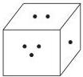

# Chapter 20: Probability — Complete Study Notes

## 1. Concept Map

```
                        PROBABILITY
                              |
        +---------------------+---------------------+
        |                     |                     |
   Basic Counting        Addition Theorem      Conditional
   Probability           (Union of Events)     Probability
        |                     |                     |
        |                     |                     |
   [P(E) = n(E)/n(S)]   [P(A∪B) = P(A)+P(B)   [P(A|B) = P(A∩B)/P(B)]
        |                  - P(A∩B)]                 |
        |                     |                     |
        +---------------------+---------------------+
                              |
                    Multiplication Theorem
                    P(A∩B) = P(A)·P(B|A)
                              |
              +---------------+---------------+
              |                               |
      Independent Events              Law of Total Probability
      P(A∩B) = P(A)·P(B)            P(A) = Σ P(Eᵢ)P(A|Eᵢ)
              |                               |
              +-------------------------------+
                              |
                        Bayes' Theorem
              P(Eᵢ|A) = P(Eᵢ)P(A|Eᵢ) / Σ P(Eⱼ)P(A|Eⱼ)
```

---

## 2. Foundations: Definitions and Terminology

### 2.1 Experiment and Sample Space

- **Experiment**: An operation producing well-defined outcomes.
- **Random Experiment**: An experiment that, when repeated under identical conditions, can produce different outcomes. Examples: tossing a coin, rolling a die, drawing a card from a shuffled pack.
- **Sample Space (S)**: The set of all possible outcomes of a random experiment. Each element is a **sample point**.

**Standard Sample Spaces:**

| Experiment | Sample Space | n(S) |
| :--- | :--- | :--- |
| Toss one coin | {H, T} | 2 |
| Toss two coins | {HH, HT, TH, TT} | 4 |
| Toss three coins | {HHH, HHT, HTH, THH, HTT, THT, TTH, TTT} | 8 |
| Roll one die | {1, 2, 3, 4, 5, 6} | 6 |
| Roll two dice | {(1,1), (1,2), ..., (6,6)} | 36 |
| Draw one card | 52 cards | 52 |

**Die Facts (NOTE box, p. 1171):**
- A die is a cubical solid with 6 faces, each having a unique number of holes (1 to 6).
- The sum of holes on opposite faces is always 7 (1+6, 2+5, 3+4).
- "Die" is singular; "dice" is plural.
- The outcome of a throw is the number on the uppermost face.



### 2.2 Events

- **Event (E)**: Any subset of the sample space S.
- **Elementary Event**: An event with only one sample point (e.g., {HH}).
- **Compound Event**: An event with more than one sample point (e.g., {HH, HT}).
- **Occurrence of an Event**: If the outcome of the experiment is an element of E, we say E has occurred.
- **Impossible Event (φ)**: An event with no sample points (e.g., getting a 7 on a die).
- **Sure/Certain Event (S)**: The event that always occurs (e.g., getting a number less than 7 on a die).
- **Equally Likely Events**: Events that have no preference over one another (e.g., outcomes of a fair coin).
- **Favourable Events**: The elementary events that constitute a given event E.
- **Complementary Event (Ē or E')**: The event that occurs only when E does not occur. $P(E) + P(\bar{E}) = 1$.

### 2.3 Algebra of Events

For events E, F, G ⊆ S:
1.  $\bar{E}$: E does not occur.
2.  $E \cup F$: E occurs, or F occurs, or both.
3.  $E \cap F$: Both E and F occur.
4.  $E \cap \bar{F}$: E occurs but F does not.
5.  $\bar{E} \cap \bar{F} = \overline{E \cup F}$: Neither E nor F occurs.
6.  $E \cup F \cup G$: At least one of E, F, G occurs.
7.  $E \cap F \cap G$: All three occur.
8.  $(E \cap \bar{F}) \cup (\bar{E} \cap F)$: Exactly one of E and F occurs.
9.  $(E \cap F \cap \bar{G}) \cup (E \cap \bar{F} \cap G) \cup (\bar{E} \cap F \cap G)$: Exactly two of E, F, G occur.

### 2.4 Mutually Exclusive and Exhaustive Events

- **Mutually Exclusive (ME)**: Events $E_1$ and $E_2$ are mutually exclusive if $E_1 \cap E_2 = \phi$. They cannot occur simultaneously.
- **Exhaustive System**: A set of events $E_1, E_2, ..., E_n$ is exhaustive if $E_1 \cup E_2 \cup ... \cup E_n = S$.
- **ME & Exhaustive System**: A set of events that satisfies both conditions. All elementary events of a sample space form such a system.

### 2.5 Pack of Cards Facts (p. 1174)

- A standard deck has **52 cards** in **4 suits**: Spades (♠), Clubs (♣), Hearts (♥), Diamonds (♦).
- **Spades and Clubs are black** (26 cards). **Hearts and Diamonds are red** (26 cards).
- Each suit has 13 cards: Ace, King, Queen, Jack, and 9 numbered cards (2-10).
- **Face cards** are Aces, Kings, Queens, and Jacks.

---

## 3. Core Formulas and Their Meanings

### 3.1 Basic Probability

$$P(E) = \frac{\text{Number of favourable outcomes}}{\text{Number of possible outcomes}} = \frac{n(E)}{n(S)}$$

**Properties:**
- $0 \le P(E) \le 1$
- $P(\phi) = 0$ (Impossible event)
- $P(S) = 1$ (Sure event)
- $P(\bar{E}) = 1 - P(E)$

**Odds:**
- **Odds in favour** of E = $m : n$, where $m$ = ways E occurs, $n$ = ways E does not occur. Then $P(E) = \frac{m}{m+n}$.
- **Odds against** E = $n : m$. Then $P(E) = \frac{n}{m+n}$.

### 3.2 Addition Theorem

**For two events A and B:**
$$P(A \cup B) = P(A) + P(B) - P(A \cap B)$$

- If A and B are **mutually exclusive** ($P(A \cap B) = 0$):
$$P(A \cup B) = P(A) + P(B)$$

**For three events A, B, C:**
$$P(A \cup B \cup C) = P(A) + P(B) + P(C) - P(A \cap B) - P(B \cap C) - P(A \cap C) + P(A \cap B \cap C)$$

**Important Derived Results:**
- **Exactly one of A, B occurs**: $P(A) + P(B) - 2P(A \cap B)$
- **Exactly one of A, B, C occurs**: $P(A) + P(B) + P(C) - 2[P(A \cap B) + P(B \cap C) + P(A \cap C)] + 3P(A \cap B \cap C)$
- **Exactly two of A, B, C occur**: $P(A \cap B) + P(B \cap C) + P(A \cap C) - 3P(A \cap B \cap C)$
- **At least two of A, B, C occur**: $P(A \cap B) + P(B \cap C) + P(A \cap C) - 2P(A \cap B \cap C)$

### 3.3 Conditional Probability

$$P(A|B) = \frac{P(A \cap B)}{P(B)}, \quad \text{where } P(B) \neq 0$$

This is the probability of A occurring given that B has already occurred.

### 3.4 Multiplication Theorem

$$P(A \cap B) = P(A) \cdot P(B|A) = P(B) \cdot P(A|B)$$

**General Form:**
$$P(A_1 \cap A_2 \cap ... \cap A_n) = P(A_1) \cdot P(A_2|A_1) \cdot P(A_3|A_1 \cap A_2) \cdots P(A_n|A_1 \cap ... \cap A_{n-1})$$

### 3.5 Independent Events

Two events A and B are **independent** if the occurrence of one does not affect the probability of the other.

**Theorem:** A and B are independent **if and only if**:
$$P(A \cap B) = P(A) \cdot P(B)$$

**For n independent events $A_1, A_2, ..., A_n$:**
- $P(A_1 \cap A_2 \cap ... \cap A_n) = P(A_1)P(A_2)...P(A_n)$
- $P(A_1 \cup A_2 \cup ... \cup A_n) = 1 - P(\bar{A_1})P(\bar{A_2})...P(\bar{A_n})$

**Key Result:** If A and B are independent, then so are $A$ and $\bar{B}$, $\bar{A}$ and $B$, and $\bar{A}$ and $\bar{B}$.

### 3.6 Law of Total Probability and Bayes' Theorem

If $E_1, E_2, ..., E_n$ are mutually exclusive and exhaustive events, and A is any event, then:

**Law of Total Probability:**
$$P(A) = P(E_1)P(A|E_1) + P(E_2)P(A|E_2) + ... + P(E_n)P(A|E_n)$$

**Bayes' Theorem:**
$$P(E_i|A) = \frac{P(E_i)P(A|E_i)}{\sum_{j=1}^{n} P(E_j)P(A|E_j)}$$

---

## 4. Fast CAT Methods and Decision Rules

### 4.1 The "At Least One" Shortcut

For independent events, the probability of at least one occurring is almost always easier to calculate as:
$$P(\text{at least one}) = 1 - P(\text{none})$$

**Example:** Probability of at least one head in 4 tosses of a coin = $1 - (1/2)^4 = 15/16$.

### 4.2 The "Exactly One" Shortcut

For two events A and B:
$$P(\text{exactly one}) = P(A) + P(B) - 2P(A \cap B)$$

### 4.3 The "Neither... Nor..." Shortcut

$$P(\text{neither A nor B}) = 1 - P(A \cup B) = P(\bar{A} \cap \bar{B})$$

### 4.4 The "At Least One of n Independent Events" Formula

$$P(\text{at least one}) = 1 - \prod_{i=1}^{n} P(\bar{A_i})$$

This is a direct application of the complement rule and is extremely fast for problems involving multiple independent attempts (e.g., multiple people solving a problem, multiple shooters hitting a target).

### 4.5 Decision Rules for Problem Types

| Problem Type | Key Action |
| :--- | :--- |
| **"With replacement"** | Events are **independent**. Use $P(A \cap B) = P(A) \cdot P(B)$. |
| **"Without replacement"** | Events are **dependent**. Use conditional probability or combinations. |
| **"At least one"** | Use complement: $1 - P(\text{none})$. |
| **"Exactly one"** | Use $P(A) + P(B) - 2P(A \cap B)$ for two events. |
| **"Either A or B"** | Use addition theorem: $P(A \cup B)$. |
| **"Given that"** | Use conditional probability: $P(A\|B) = P(A \cap B) / P(B)$. |
| **"Bayes' Theorem"** | Look for a "cause" (Eᵢ) and an "effect" (A). You are given $P(E_i)$ and $P(A\|E_i)$, and asked to find $P(E_i\|A)$. |
| **"Odds in favour/against"** | Convert odds to probability: $P = \frac{\text{favourable}}{\text{favourable} + \text{unfavourable}}$. |

---

## 5. Worked Examples: Easy to Advanced

### Example 1 (Easy): Basic Probability

**Problem:** A bag contains 5 red, 8 green, and 10 blue balls. If one ball is drawn at random, what is the probability that it is red or green?

**Solution:**
- Total balls, $n(S) = 5 + 8 + 10 = 23$.
- Favourable (red or green), $n(E) = 5 + 8 = 13$.
- $P(E) = \frac{13}{23}$.

### Example 2 (Easy): Addition Theorem

**Problem:** From a well-shuffled pack of 52 cards, one card is drawn. What is the probability that it is either a black card or a queen?

**Solution:**
- Let A = event of drawing a black card, B = event of drawing a queen.
- $P(A) = 26/52$, $P(B) = 4/52$, $P(A \cap B) = 2/52$ (black queens).
- $P(A \cup B) = P(A) + P(B) - P(A \cap B) = 26/52 + 4/52 - 2/52 = 28/52 = 7/13$.

### Example 3 (Medium): Conditional Probability

**Problem:** A pair of dice is thrown. Find the probability that the sum is 9, given that an odd number appears on the first die.

**Solution:**
- Let A = event of sum 9, B = event of odd number on first die.
- $n(B) = 18$ (3 odd numbers on first die × 6 outcomes on second).
- $n(A \cap B) = \{(3,6), (5,4)\} = 2$.
- $P(A|B) = \frac{n(A \cap B)}{n(B)} = \frac{2}{18} = \frac{1}{9}$.

### Example 4 (Medium): Multiplication Theorem

**Problem:** An urn contains 6 red and 9 green balls. Two balls are drawn without replacement. What is the probability that the first is red and the second is green?

**Solution:**
- Let A = event first is red, B = event second is green.
- $P(A) = 6/15 = 2/5$.
- $P(B|A) = 9/14$ (after drawing one red, 14 balls remain, 9 are green).
- $P(A \cap B) = P(A) \cdot P(B|A) = (2/5) \times (9/14) = 9/35$.

### Example 5 (Medium): Independent Events

**Problem:** The probability that A solves a problem is 2/3, and the probability that B solves it is 3/5. If they try independently, what is the probability that the problem is solved?

**Solution:**
- $P(A) = 2/3$, $P(B) = 3/5$.
- $P(\text{solved}) = 1 - P(\bar{A})P(\bar{B}) = 1 - (1/3)(2/5) = 1 - 2/15 = 13/15$.

### Example 6 (Advanced): Law of Total Probability

**Problem:** Bag I contains 4 white and 5 black balls. Bag II contains 5 white and 4 black balls. Two balls are transferred from Bag I to Bag II without noticing their colours. Then, two balls are drawn from Bag II. Find the probability that they are one white and one black.

**Solution:**
- Let $E_1$ = 2 white transferred, $E_2$ = 2 black transferred, $E_3$ = 1 white + 1 black transferred.
- $P(E_1) = \frac{^4C_2}{^9C_2} = \frac{6}{36} = \frac{1}{6}$.
- $P(E_2) = \frac{^5C_2}{^9C_2} = \frac{10}{36} = \frac{5}{18}$.
- $P(E_3) = \frac{^4C_1 \times ^5C_1}{^9C_2} = \frac{20}{36} = \frac{5}{9}$.
- Let A = event of drawing one white and one black from Bag II.
- $P(A|E_1) = \frac{^7C_1 \times ^4C_1}{^{11}C_2} = \frac{28}{55}$ (Bag II now has 7W, 4B).
- $P(A|E_2) = \frac{^5C_1 \times ^6C_1}{^{11}C_2} = \frac{30}{55} = \frac{6}{11}$ (Bag II now has 5W, 6B).
- $P(A|E_3) = \frac{^6C_1 \times ^5C_1}{^{11}C_2} = \frac{30}{55} = \frac{6}{11}$ (Bag II now has 6W, 5B).
- $P(A) = \frac{1}{6} \times \frac{28}{55} + \frac{5}{18} \times \frac{6}{11} + \frac{5}{9} \times \frac{6}{11} = \frac{14}{165} + \frac{5}{33} + \frac{10}{33} = \frac{89}{165}$.

### Example 7 (Advanced): Bayes' Theorem

**Problem:** Three boxes contain: Box 1: 6 red, 4 black; Box 2: 5 red, 5 black; Box 3: 4 red, 6 black. A box is chosen at random and a ball is drawn, which is found to be red. What is the probability that it was drawn from Box 1?

**Solution:**
- Let $E_1, E_2, E_3$ be the events of choosing Box 1, 2, 3. $P(E_1) = P(E_2) = P(E_3) = 1/3$.
- Let A = event of drawing a red ball.
- $P(A|E_1) = 6/10$, $P(A|E_2) = 5/10$, $P(A|E_3) = 4/10$.
- By Bayes' Theorem:
$$P(E_1|A) = \frac{P(E_1)P(A|E_1)}{P(E_1)P(A|E_1) + P(E_2)P(A|E_2) + P(E_3)P(A|E_3)}$$
$$= \frac{(1/3)(6/10)}{(1/3)(6/10) + (1/3)(5/10) + (1/3)(4/10)} = \frac{6}{6+5+4} = \frac{6}{15} = \frac{2}{5}$$

---

## 6. Common Traps and How to Avoid Them

1.  **Confusing "Mutually Exclusive" and "Independent"**:
    - Mutually exclusive: $P(A \cap B) = 0$. Events cannot happen together.
    - Independent: $P(A \cap B) = P(A)P(B)$. Occurrence of one does not affect the other.
    - **Trap**: Mutually exclusive events (with non-zero probabilities) are never independent.

2.  **Forgetting to Subtract the Intersection in Addition Theorem**:
    - When events are not mutually exclusive, always use $P(A \cup B) = P(A) + P(B) - P(A \cap B)$.

3.  **Incorrectly Handling "Without Replacement"**:
    - The denominator and numerator change after each draw. Use conditional probability or combinations.

4.  **Misinterpreting "At Least One"**:
    - Always consider the complement: $1 - P(\text{none})$.

5.  **Applying Bayes' Theorem Incorrectly**:
    - Ensure you correctly identify the "prior" probabilities $P(E_i)$ and the "likelihoods" $P(A|E_i)$. The denominator is the total probability of the effect A.

6.  **Ignoring the Condition in Conditional Probability**:
    - When asked $P(A|B)$, the sample space is reduced to B. The probability is $n(A \cap B) / n(B)$, not $n(A) / n(S)$.

7.  **Assuming Independence in "Without Replacement" Problems**:
    - Drawing cards or balls without replacement creates dependent events. The probability of the second event depends on the outcome of the first.

---

## 7. Timed Strategy for CAT

- **Time Allocation**: Probability questions in CAT are typically 1-2 marks and should take 1-2 minutes each. If a problem seems overly complex, it often has a shortcut.
- **Identify the Type**: Quickly classify the problem (basic, addition, conditional, independence, Bayes). This dictates the formula to use.
- **Look for Shortcuts**: Always check if the "at least one" or "neither... nor..." complement shortcut applies.
- **Use Visual Aids**: For dice and card problems, mentally or on scratch paper, list the sample space if it's small (e.g., two dice).
- **Practice Mental Math**: Be comfortable with combinations ($^nC_r$) and basic fraction arithmetic.
- **When to Skip**: If you are unable to identify a clear path within 60-90 seconds, mark it and move on. Return to it only if time permits.

---

## 8. Final Revision Sheet

### Key Formulas

| Concept | Formula |
| :--- | :--- |
| **Basic Probability** | $P(E) = \frac{n(E)}{n(S)}$ |
| **Complement** | $P(\bar{E}) = 1 - P(E)$ |
| **Addition (2 events)** | $P(A \cup B) = P(A) + P(B) - P(A \cap B)$ |
| **Addition (3 events)** | $P(A \cup B \cup C) = \sum P(A_i) - \sum P(A_i \cap A_j) + P(A \cap B \cap C)$ |
| **Conditional** | $P(A\|B) = \frac{P(A \cap B)}{P(B)}$ |
| **Multiplication** | $P(A \cap B) = P(A) \cdot P(B\|A)$ |
| **Independence** | $P(A \cap B) = P(A) \cdot P(B)$ |
| **At least one of n independent** | $1 - P(\bar{A_1})P(\bar{A_2})...P(\bar{A_n})$ |
| **Law of Total Probability** | $P(A) = \sum_{i=1}^{n} P(E_i)P(A\|E_i)$ |
| **Bayes' Theorem** | $P(E_i\|A) = \frac{P(E_i)P(A\|E_i)}{\sum_{j=1}^{n} P(E_j)P(A\|E_j)}$ |
| **Exactly one of A, B** | $P(A) + P(B) - 2P(A \cap B)$ |

### Standard Sample Spaces

- **1 Coin**: {H, T}, n(S) = 2
- **2 Coins**: {HH, HT, TH, TT}, n(S) = 4
- **3 Coins**: n(S) = 8
- **1 Die**: {1, 2, 3, 4, 5, 6}, n(S) = 6
- **2 Dice**: n(S) = 36
- **Pack of Cards**: n(S) = 52

### Quick Facts

- **Die**: Opposite faces sum to 7.
- **Cards**: 4 suits (2 black, 2 red), 13 cards per suit, 4 face cards per suit.
- **Leap Year**: 366 days = 52 weeks + 2 days. Probability of 53 Sundays is 2/7.
- **Non-Leap Year**: 365 days = 52 weeks + 1 day. Probability of 53 Sundays is 1/7.

### Common Traps

- Mutually exclusive ≠ Independent.
- "Without replacement" = dependent events.
- "At least one" = use complement.
- Conditional probability reduces the sample space.
- Bayes' Theorem: Identify priors and likelihoods correctly.
