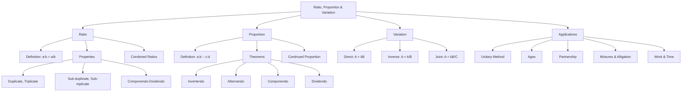

# CAT Quant — Ratio, Proportion & Variations

## 1. Concept Map



---

## 2. Foundations

### 2.1 Ratio (Pages 258–259)

A **ratio** is a comparison of two quantities of the same kind by division. It answers: *How many times is one quantity of the other?*

- **Notation**: $a : b$ or $\frac{a}{b}$
- **Antecedent**: $a$ (the first term)
- **Consequent**: $b$ (the second term)

**Critical Rules:**

1. **Order matters**: $5:3 \neq 3:5$
2. **Same units required**: Compare 90 cm to 1.5 m only after converting: $90 : 150 = 3:5$
3. **Ratio has no units**: It is a pure number.
4. **Cannot compare different kinds**: 8 boys vs 6 cows is meaningless as a ratio of quantities (though the *numbers* can be compared).

### 2.2 Proportion (Page 263)

An **equality of two ratios** is a proportion.

$$a : b :: c : d \quad \text{or} \quad \frac{a}{b} = \frac{c}{d}$$

- **Extremes**: $a$ and $d$
- **Means**: $b$ and $c$

**Fundamental Test**: $a \times d = b \times c$ (Product of extremes = Product of means)

### 2.3 Variation (Pages 267–268)

**Variation** describes how one quantity changes in response to another.

- **Direct Variation**: $A \propto B \implies A = kB$ (where $k$ is the constant of proportionality)
- **Inverse Variation**: $A \propto \frac{1}{B} \implies A = \frac{k}{B}$
- **Joint Variation**: $A \propto B$ and $A \propto \frac{1}{C} \implies A = \frac{kB}{C}$

---

## 3. Formulas with Symbol Meanings

### 3.1 Ratio Operations

| Operation | Formula | Meaning |
|-----------|---------|---------|
| **Compounded Ratio** | $\frac{a}{b} \times \frac{c}{d} \times \frac{e}{f}$ | Product of two or more ratios |
| **Duplicate Ratio** | $\left(\frac{a}{b}\right)^2 = \frac{a^2}{b^2}$ | Square of the ratio |
| **Triplicate Ratio** | $\left(\frac{a}{b}\right)^3 = \frac{a^3}{b^3}$ | Cube of the ratio |
| **Sub-duplicate Ratio** | $\sqrt{\frac{a}{b}} = \frac{\sqrt{a}}{\sqrt{b}}$ | Square root of the ratio |
| **Sub-triplicate Ratio** | $\sqrt[3]{\frac{a}{b}}$ | Cube root of the ratio |

### 3.2 Proportion Theorems

Given $\frac{a}{b} = \frac{c}{d}$:

| Theorem | Result |
|---------|--------|
| **Invertendo** | $\frac{b}{a} = \frac{d}{c}$ |
| **Alternando** | $\frac{a}{c} = \frac{b}{d}$ |
| **Componendo** | $\frac{a+b}{b} = \frac{c+d}{d}$ |
| **Dividendo** | $\frac{a-b}{b} = \frac{c-d}{d}$ |
| **Componendo & Dividendo** | $\frac{a+b}{a-b} = \frac{c+d}{c-d}$ |

### 3.3 Continued Proportion

If $a, b, c$ are in continued proportion: $\frac{a}{b} = \frac{b}{c}$

- **Mean Proportional**: $b = \sqrt{ac}$
- **Third Proportional**: $c = \frac{b^2}{a}$
- **Key Result**: $a : c = a^2 : b^2$ (Duplicate ratio of $a:b$)

### 3.4 Key Properties of Ratios

For $\frac{a}{b}$:

1. **Multiplication/Division**: $\frac{a}{b} = \frac{ka}{kb}$ (value unchanged)
2. **Property 7**: If $\frac{a}{b} > 1$, then $\frac{a+k}{b+k} < \frac{a}{b}$ (for positive $k$)
3. **Property 8**: If $\frac{a}{b} < 1$, then $\frac{a+k}{b+k} > \frac{a}{b}$ (for positive $k$)
4. **Property 9**: If $\frac{c}{d} > \frac{a}{b}$, then $\frac{a+c}{b+d} > \frac{a}{b}$
5. **Property 11**: If $\frac{a}{b} = \frac{c}{d} = \frac{e}{f} = k$, then $\frac{a+c+e}{b+d+f} = k$
6. **Property 12**: $\frac{a+c+e}{b+d+f}$ lies between the smallest and largest of the individual ratios

### 3.5 Combining Ratios

**Property 13**: If $a:b$ and $b:c$ are given:
$$a : b : c = (a \times b) : (b \times b) : (b \times c)$$

**Property 14**: For individual ratios $a:b$, $b:c$, $c:d$, $d:e$:
$$a : b : c : d : e = (a \cdot b \cdot c \cdot d) : (b \cdot b \cdot c \cdot d) : (b \cdot c \cdot c \cdot d) : (b \cdot c \cdot d \cdot d) : (b \cdot c \cdot d \cdot e)$$

**Shortcut**: In each step, keep the left term, adopt the right term.

### 3.6 Variation Formulas

| Type | Formula | Constant |
|------|---------|----------|
| Direct | $A = kB$ | $k = \frac{A}{B}$ |
| Inverse | $A = \frac{k}{B}$ | $k = AB$ |
| Joint | $A = \frac{kB}{C}$ | $k = \frac{AC}{B}$ |
| Joint (multiple) | $A = kBC$ | $k = \frac{A}{BC}$ |

### 3.7 Partnership

$$\text{Profit Share} \propto \text{Investment} \times \text{Time}$$

For partners A and B:
$$\frac{\text{Profit}_A}{\text{Profit}_B} = \frac{I_A \times T_A}{I_B \times T_B}$$

---

## 4. Fast CAT Methods

### 4.1 The "Assume Values" Method

When ratios are given and actual values are needed, assign a common multiplier.

**Example**: Divide ₹70 among A, B, C in ratio 2:4:8.
- Simplify: 2:4:8 = 1:2:4
- Total parts = 7
- A = $70 \times \frac{1}{7} = 10$, B = $70 \times \frac{2}{7} = 20$, C = $70 \times \frac{4}{7} = 40$

### 4.2 The "LCM" Method for Fractional Ratios

For ratios with fractions, multiply all terms by the LCM of denominators.

**Example**: Simplify $\frac{1}{6} : \frac{1}{8}$
- LCM of 6 and 8 = 24
- $\frac{24}{6} : \frac{24}{8} = 4 : 3$

### 4.3 The "Option Testing" Method

When options are given, test each option rather than solving algebraically.

**Example**: Sum of two natural numbers = 64. Which ratio is impossible?
- (a) 3:5 → $8x = 64 \rightarrow x = 8$ ✓
- (b) 1:3 → $4x = 64 \rightarrow x = 16$ ✓
- (c) 7:9 → $16x = 64 \rightarrow x = 4$ ✓
- (d) 3:4 → $7x = 64 \rightarrow x = \frac{64}{7}$ (not natural) ✗
- **Answer: (d)**

### 4.4 The "Substitution" Method

For expressions involving ratios, substitute the ratio values directly.

**Example**: If $\frac{a}{b} = \frac{3}{4}$, find $(7a - 4b) : (3a + b)$
- Substitute $a = 3$, $b = 4$
- $(21 - 16) : (9 + 4) = 5 : 13$

### 4.5 The "Reverse Engineering" Method

For problems with multiple transactions, work backwards from the final state.

**Example**: Four friends A, B, C, D each end with ₹48 after a series of money transfers. Work backwards to find initial amounts.

### 4.6 The "Alligation" Method

For mixture problems, use the alligation rule:

$$\text{Ratio} = \frac{\text{Required} - \text{Lower}}{\text{Higher} - \text{Required}}$$

**Example**: Mix two solutions with concentrations 40% and 28.57% to get 33.33%:
- Ratio = $\frac{33.33 - 28.57}{40 - 33.33} = \frac{4.76}{6.67} = 5:7$

### 4.7 The "Componendo-Dividendo" Shortcut

When both sides of a proportion have the form $\frac{a+b}{a-b}$, apply componendo-dividendo directly.

**Example**: If $\frac{a+b}{a-b} = \frac{15}{1}$, then:
- $\frac{a}{b} = \frac{15+1}{15-1} = \frac{16}{14} = \frac{8}{7}$
- $a^2 - b^2 = 64 - 49 = 15$

---

## 5. Worked Examples

### 5.1 Easy Level

**Example 1**: Divide 14 toffees in ratio 5:2.

**Solution**:
- Total parts = 5 + 2 = 7
- Ankita = $14 \times \frac{5}{7} = 10$
- Anshul = $14 \times \frac{2}{7} = 4$

**Example 2**: Find the mean proportional between 8 and 98.

**Solution**:
- $x^2 = 8 \times 98 = 784$
- $x = 28$

**Example 3**: A:B = 3:4, B:C = 5:2. Find A:B:C.

**Solution**:
- $A : B : C = (3 \times 5) : (4 \times 5) : (4 \times 2) = 15 : 20 : 8$

### 5.2 Medium Level

**Example 4**: Incomes of A and B are in ratio 4:3, savings in ratio 3:2. Each spends ₹600. Find incomes.

**Solution**:
- Let incomes be $4x$ and $3x$
- Savings: $4x - 600$ and $3x - 600$
- $\frac{4x - 600}{3x - 600} = \frac{3}{2}$
- $2(4x - 600) = 3(3x - 600)$
- $8x - 1200 = 9x - 1800$
- $x = 600$
- Incomes: A = ₹2400, B = ₹1800

**Example 5**: A, B, C have 40, x, y balls. B gives 20 to A, leaving B with half of C. Together they had 60 more than A initially, and average is 100.

**Solution**:
- $\frac{100 + x + y}{3} = 100 \implies x + y = 200$ ...(i)
- $\frac{x - 20}{y} = \frac{1}{2} \implies 2x - y = 40$ ...(ii)
- Solving: $x = 80$, $y = 120$
- $x : y = 2 : 3$

**Example 6**: A invests ₹26000 for 12 months, B ₹16000 for 9 months, C ₹25000 for some months. C's share = 3825/15453 of total profit. Find C's duration.

**Solution**:
- Ratio = $26000 \times 12 : 16000 \times 9 : 25000 \times t$
- = $312 : 144 : 25t$
- C's share = $\frac{25t}{456 + 25t} = \frac{3825}{15453}$
- $25t \times 15453 = 3825(456 + 25t)$
- $386325t = 1744200 + 95625t$
- $290700t = 1744200$
- $t = 6$ months

### 5.3 Advanced Level

**Example 7**: A diamond's value varies as the square of its weight. A diamond worth ₹14.4 lakh breaks into pieces in ratio 3:4:5. Find the loss.

**Solution**:
- Original weight = $12x$, Value = $k(12x)^2 = 144kx^2$
- Broken pieces: $k(9x^2 + 16x^2 + 25x^2) = 50kx^2$
- Loss = $144kx^2 - 50kx^2 = 94kx^2$
- Given loss = ₹9.4 lakh → $kx^2 = 0.1$ lakh
- Original value = $144 \times 0.1 = 14.4$ lakh ✓

**Example 8**: A vessel contains 120 L of milk-water mixture in ratio 2:1. How much water must be added to make the ratio 1:2?

**Solution**:
- Milk = $120 \times \frac{2}{3} = 80$ L, Water = 40 L
- Need milk:water = 1:2 → water should be $2 \times 80 = 160$ L
- Water to add = $160 - 40 = 120$ L

**Example 9**: Speed of a train varies as $\frac{\sqrt{F}}{W}$ where F = fuel and W = wagons. With F = 256, W = 10, speed = 192 km/h. Find fuel per km when speed = 200 km/h, W = 15.

**Solution**:
- $D = k \times \frac{\sqrt{F} \times T}{W}$
- $192 = k \times \frac{16 \times 20}{10} \implies k = 6$
- $200 = 6 \times \frac{\sqrt{F} \times 25}{15} \implies \sqrt{F} = 20 \implies F = 400$
- Fuel per km = $\frac{400}{200} = 2$ L/km

**Example 10**: Four friends A, B, C, D each end with ₹48 after sequential money transfers. A gave B what B had initially, B gave C what C had initially, C gave D what D had initially, D doubled A's money. Find initial amounts.

**Solution** (Reverse engineering):
- Final: All = 48
- Before D's action: A = 24, D = 72
- Before C's action: D = 36, C = 48 + 36 = 84
- Before B's action: C = 42, B = 48 + 42 = 90
- Before A's action: B = 45, A = 48 + 45 = 93
- Initial: A = 93, B = 45, C = 42, D = 36

---

## 6. Decision Rules

### 6.1 When to Use Which Method

| Problem Type | Method | When to Use |
|--------------|--------|-------------|
| Ratio simplification | LCM method | Fractional ratios |
| Proportion test | Cross-multiplication | Verify if $a:b = c:d$ |
| Combined ratios | Property 13/14 | Multiple pairwise ratios |
| Mixture problems | Alligation | Two or more mixtures |
| Variation problems | Constant $k$ method | Direct/inverse/joint variation |
| Partnership | Money-time ratio | Profit sharing |
| Age problems | Variable + equation | Present/future/past ages |
| Replacement problems | Formula: $Final = Initial(1 - \frac{r}{V})^n$ | Repeated replacement |

### 6.2 Identifying Direct vs Inverse Variation

| Clue | Type |
|------|------|
| "More A → More B" | Direct |
| "More A → Less B" | Inverse |
| "A varies as B" | Direct |
| "A varies inversely as B" | Inverse |
| "A varies jointly as B and C" | Joint |
| "A varies as B and inversely as C" | Joint (mixed) |

### 6.3 Partnership Decision Tree

```
Are investments for the same time?
├── YES → Profit ratio = Investment ratio
└── NO → Profit ratio = (Investment × Time) ratio

Is there a working partner?
├── YES → Deduct commission first, then divide
└── NO → Divide directly
```

---

## 7. Common Traps

### 7.1 Order of Terms

**Trap**: Writing 5:3 instead of 3:5.
**Fix**: Always read the question carefully — "A:B" means A is first.

### 7.2 Unit Mismatch

**Trap**: Comparing 90 cm to 1.5 m without conversion.
**Fix**: Always convert to the same unit before forming a ratio.

### 7.3 Natural Number Constraint

**Trap**: Assuming any ratio can represent natural numbers.
**Fix**: Check that the sum of ratio terms divides the total evenly.

### 7.4 Componendo-Dividendo Validity

**Trap**: Applying componendo-dividendo when $a = b$ or $c = d$.
**Fix**: The denominator becomes zero — check before applying.

### 7.5 Inverse vs Direct

**Trap**: Assuming direct variation when the problem states inverse.
**Fix**: Read carefully — "varies inversely" means $A \times B = k$ (constant).

### 7.6 Partnership Time Factor

**Trap**: Forgetting to multiply investment by time.
**Fix**: Always use money-time capital: $I \times T$.

### 7.7 "None of These" Options

**Trap**: Selecting a close but wrong option.
**Fix**: Verify calculations completely before choosing "none of these."

### 7.8 Replacement Formula

**Trap**: Using the wrong exponent for multiple replacements.
**Fix**: $Final = Initial \times \left(1 - \frac{r}{V}\right)^n$ where $n$ = number of replacements.

### 7.9 Equal Transfer Property

**Trap**: Assuming unequal proportions after equal transfers.
**Fix**: When equal volumes are exchanged between two mixtures, the final proportions are equal regardless of initial composition.

### 7.10 Data Insufficiency

**Trap**: Assuming values when the problem doesn't provide enough information.
**Fix**: If the answer is "cannot be determined," verify that no unique solution exists.

---

## 8. Timed Strategy

### 8.1 Time Allocation (for 2-minute CAT problems)

| Phase | Time | Action |
|-------|------|--------|
| Read & Identify | 15 sec | Identify problem type (ratio, proportion, variation, mixture, partnership) |
| Choose Method | 15 sec | Select the fastest method (alligation, substitution, options) |
| Execute | 60-75 sec | Apply the method |
| Verify | 15-30 sec | Check with options or sanity check |

### 8.2 Speed Hacks

1. **Option elimination**: For "which ratio is possible" questions, test options first.
2. **Assume values**: For ratio problems, assume $a = 3$, $b = 4$ when $a:b = 3:4$.
3. **LCM shortcut**: For fractional ratios, multiply by LCM of denominators.
4. **Componendo-dividendo**: Apply directly when the form matches.
5. **Alligation over algebra**: For mixture problems, alligation is faster.
6. **Reverse engineering**: For transaction problems, work backwards.

### 8.3 Question Selection Strategy

| Difficulty | Time Budget | Strategy |
|------------|-------------|----------|
| Easy (ratio simplification) | 45-60 sec | Solve directly |
| Medium (proportion, variation) | 60-90 sec | Apply formulas |
| Hard (mixtures, multi-step) | 90-120 sec | Use alligation/reverse engineering |
| Very Hard (complex variation) | 120+ sec | Skip if stuck, return later |

---

## 9. Final Revision Sheet

### 9.1 Core Formulas

| Concept | Formula |
|---------|---------|
| Ratio | $a : b = \frac{a}{b}$ |
| Compounded ratio | $\frac{a}{b} \times \frac{c}{d} \times \frac{e}{f}$ |
| Duplicate ratio | $\left(\frac{a}{b}\right)^2$ |
| Triplicate ratio | $\left(\frac{a}{b}\right)^3$ |
| Sub-duplicate | $\sqrt{\frac{a}{b}}$ |
| Sub-triplicate | $\sqrt[3]{\frac{a}{b}}$ |
| Proportion test | $a : b :: c : d \implies ad = bc$ |
| Invertendo | $\frac{a}{b} = \frac{c}{d} \implies \frac{b}{a} = \frac{d}{c}$ |
| Alternando | $\frac{a}{b} = \frac{c}{d} \implies \frac{a}{c} = \frac{b}{d}$ |
| Componendo | $\frac{a}{b} = \frac{c}{d} \implies \frac{a+b}{b} = \frac{c+d}{d}$ |
| Dividendo | $\frac{a}{b} = \frac{c}{d} \implies \frac{a-b}{b} = \frac{c-d}{d}$ |
| Componendo-Dividendo | $\frac{a}{b} = \frac{c}{d} \implies \frac{a+b}{a-b} = \frac{c+d}{c-d}$ |
| Continued proportion | $a : b = b : c \implies b^2 = ac$ |
| Mean proportional | $\sqrt{ab}$ |
| Third proportional | $\frac{b^2}{a}$ (for $a : b :: b : x$) |
| Direct variation | $A = kB$ |
| Inverse variation | $A = \frac{k}{B}$ |
| Joint variation | $A = \frac{kB}{C}$ |
| Partnership | Profit $\propto$ Investment $\times$ Time |
| Replacement | $Final = Initial \times \left(1 - \frac{r}{V}\right)^n$ |

### 9.2 Key Properties

1. $\frac{a}{b} = \frac{ka}{kb}$ (value unchanged)
2. If $\frac{a}{b} > 1$: $\frac{a+k}{b+k} < \frac{a}{b}$
3. If $\frac{a}{b} < 1$: $\frac{a+k}{b+k} > \frac{a}{b}$
4. If $\frac{c}{d} > \frac{a}{b}$: $\frac{a+c}{b+d} > \frac{a}{b}$
5. If $\frac{a}{b} = \frac{c}{d} = k$: $\frac{a+c}{b+d} = k$
6. $\frac{a+c}{b+d}$ lies between smallest and largest individual ratios

### 9.3 Quick Reference: Combined Ratios

| Given | Combined |
|-------|----------|
| $a:b$, $b:c$ | $a:b:c = (a \cdot b) : (b \cdot b) : (b \cdot c)$ |
| $a:b$, $b:c$, $c:d$ | $a:b:c:d = (a \cdot b \cdot c) : (b \cdot b \cdot c) : (b \cdot c \cdot c) : (b \cdot c \cdot d)$ |

### 9.4 Common CAT Patterns

| Pattern | Approach |
|---------|----------|
| "A:B = 2:3, B:C = 4:5" | Combine: A:B:C = 8:12:15 |
| "A = 2B, B = 3C" | Convert: A:B:C = 6:3:1 |
| "A is 20% more than B" | A:B = 120:100 = 6:5 |
| "A is 25% less than B" | A:B = 75:100 = 3:4 |
| "Profit sharing" | Ratio of (Investment × Time) |
| "Mixture replacement" | $Final = Initial(1 - \frac{r}{V})^n$ |

### 9.5 Error Checklist

- [ ] Units converted?
- [ ] Order of ratio correct?
- [ ] Natural number constraints satisfied?
- [ ] Componendo-dividendo valid (no zero denominators)?
- [ ] Direct vs inverse variation identified correctly?
- [ ] Partnership includes time factor?
- [ ] Replacement formula exponent correct?
- [ ] "None of these" verified with full calculation?

---

*End of Chapter 4 Study Notes*
