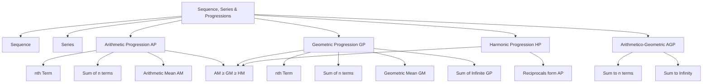

# CAT Quant — Sequence, Series & Progressions

## 1. Concept Map

---

## 2. Foundations

### 2.1 Sequence (Page 984)

A **sequence** is a set of numbers occurring in a definite order, following a rule. The numbers $a_1, a_2, a_3, \ldots, a_n$ are called **elements** or **terms** of the sequence.

- **Finite sequence**: Has a finite number of terms.
- **Infinite sequence**: Has an infinite number of terms, denoted by $\{a_n\}$.

**Example**: $1, \frac{1}{2}, \frac{1}{3}, \frac{1}{4}, \ldots, \frac{1}{n}$

**Key Insight**: A sequence is known if its $n$th term $a_n$ is given. For example, if $a_n = 2n$, the sequence is $2, 4, 6, 8, \ldots$

**Trap**: Not all sequences have a formula for the $n$th term. For instance, the sequence of prime numbers $2, 3, 5, 7, 11, \ldots$ has no simple formula.

### 2.2 Series (Pages 984–985)

A **series** is the sum of the terms of a sequence. If $u_1, u_2, u_3, \ldots, u_n$ is a sequence, then:

$$S_n = u_1 + u_2 + u_3 + \ldots + u_n$$

This is denoted by $\sum_{r=1}^{n} u_r$ (Sigma notation).

**Example**: $2 + 4 + 6 + \ldots + 30 = \sum_{n=1}^{15} (2n)$

### 2.3 Progressions

Progressions are sequences of special types. This chapter focuses on **Arithmetic Progression (AP)** and **Geometric Progression (GP)**, with an overview of **Harmonic Progression (HP)**.

---

## 3. Arithmetic Progression (AP)

### 3.1 Definition (Page 985)

A sequence is in AP if the difference between any two consecutive terms is constant. This constant is called the **common difference** ($d$).

$$a_2 - a_1 = a_3 - a_2 = \ldots = d$$

**Examples**:
| Progression | Common Difference |
|---|---|
| 1, 3, 5, 7, 9, ... | 2 |
| 12, 9, 6, 3, 0, -3, ... | -3 |
| 7, 12, 17, 22, ... | 5 |

### 3.2 General Term (nth Term)

$$T_n = a + (n-1)d$$

Where:
- $a$ = first term
- $d$ = common difference
- $n$ = term number

The last term $l$ of a finite AP is also given by $l = a + (n-1)d$.

**Worked Example (Exp. 1, Page 985)**: Find the 11th term of $-7, -2, 3, 8, 13, \ldots$

- $a = -7$, $d = 5$, $n = 11$
- $T_{11} = -7 + (11-1) \times 5 = -7 + 50 = 43$

### 3.3 Sum of First n Terms

$$S_n = \frac{n}{2}[2a + (n-1)d]$$

**Author's Preferred Formula** (Page 985):

$$S_n = \left(\frac{a + l}{2}\right)n$$

> **Note**: "In my own experience the alternative formula of $S_n$ is better for problem solving since in this formula we have to just take the product of average of first and last term with number of terms."

**Worked Example (Exp. 2, Page 985)**: Sum of 11 terms of $-7, -2, 3, 8, \ldots$

- $a = -7$, $l = -7 + (10) \times 5 = 43$
- $S_{11} = \frac{-7 + 43}{2} \times 11 = 18 \times 11 = 198$

### 3.4 Arithmetic Mean (AM) (Page 986)

When three quantities are in AP, the middle term is the **Arithmetic Mean** of the other two.

$$AM = \frac{a + b}{2}$$

**n Arithmetic Means between a and b**:
- Common difference: $d = \frac{b - a}{n + 1}$
- The means are: $m_1 = a + d$, $m_2 = a + 2d$, ..., $m_n = a + nd$

**Worked Example (Exp. 3, Page 986)**: Insert 3 arithmetic means between 5 and 21.

- $d = \frac{21 - 5}{3 + 1} = 4$
- Means: 9, 13, 17
- New sequence: 5, 9, 13, 17, 21

### 3.5 Properties of AP (Pages 986–987)

1. **Adding/subtracting a constant** to each term → resulting sequence is also AP with the same common difference.
2. **Multiplying/dividing each term** by a fixed non-zero constant → resulting sequence is also AP.
3. If two APs are added term-wise, the resulting sequence is also AP.
4. If two APs are subtracted term-wise, the resulting sequence is also AP.
5. **Odd number of terms in AP**: The middle term is the AM of all terms. The average of all terms equals the middle term.
6. **Even number of terms in AP**: $a_1 + a_n = a_2 + a_{n-1} = a_3 + a_{n-2} = \ldots$
7. **$S_n = n \times (AM)$** — The sum equals the number of terms times the average.
8. **Convenient term selection**:
   - Three terms in AP: $(m - k), m, (m + k)$
   - Five terms in AP: $(m - 2k), (m - k), m, (m + k), (m + 2k)$
9. **Four terms in AP**: $(m - 3k), (m - k), (m + k), (m + 3k)$ where common difference is $2k$.
   - Six terms: $(m - 5k), (m - 3k), (m - k), (m + k), (m + 3k), (m + 5k)$

**Worked Example (Exp. 4, Page 986)**: Sum of five terms of an AP is 75. Find the third term.

- Using property 8: $(m - 2k) + (m - k) + m + (m + k) + (m + 2k) = 75$
- $5m = 75 \Rightarrow m = 15$
- Third term = middle term = **15**

**Worked Example (Exp. 5, Page 987)**: Sum of 4 terms of an AP is 36. Find the AM.

- Using property 9: $(m - 3k) + (m - k) + (m + k) + (m + 3k) = 36$
- $4m = 36 \Rightarrow m = 9$
- $AM = \frac{S_4}{4} = 9$

### 3.6 Summation Formulas (Page 987)

| Property | Formula |
|---|---|
| Sum of first n natural numbers | $\Sigma n = \frac{n(n+1)}{2}$ |
| Sum of squares | $\Sigma n^2 = \frac{n(n+1)(2n+1)}{6}$ |
| Sum of cubes | $\Sigma n^3 = \left[\frac{n(n+1)}{2}\right]^2 = [\Sigma n]^2$ |
| Sum of first n odd numbers | $1 + 3 + 5 + \ldots + (2n-1) = n^2$ |
| Sum of first n even numbers | $2 + 4 + 6 + \ldots + 2n = n(n+1)$ |

---

## 4. Geometric Progression (GP)

### 4.1 Definition (Page 989)

A sequence is in GP if the ratio of any two consecutive terms is constant. This constant is called the **common ratio** ($r$). All terms must be non-zero.

$$\frac{a_2}{a_1} = \frac{a_3}{a_2} = \ldots = r$$

**Examples**:
- 2, 4, 8, 16, ... → $r = 2$
- -3, 6, -12, 24, ... → $r = -2$
- 64, 16, 4, 1, $\frac{1}{4}$, ... → $r = \frac{1}{4}$

### 4.2 General Term (nth Term)

$$T_n = a \cdot r^{(n-1)}$$

Where:
- $a$ = first term
- $r$ = common ratio
- $n$ = term number

**Worked Example (Exp. 1, Page 989)**: 7th term of 2, 10, 50, 250, ...

- $a = 2$, $r = 5$
- $T_7 = 2 \cdot (5)^6 = 31250$

### 4.3 Sum of First n Terms

$$S_n = \frac{a(r^n - 1)}{(r - 1)} \quad \text{if } r > 1$$

$$S_n = \frac{a(1 - r^n)}{(1 - r)} \quad \text{if } r < 1$$

$$S_n = \frac{lr - a}{r - 1}$$

> **Trap**: These formulas fail when $r = 1$ (form $\frac{0}{0}$ undefined). In that case, $S_n = n \cdot a$.

**Worked Example (Exp. 2, Page 989)**: Sum of first 6 terms of $3, \frac{9}{2}, \frac{27}{4}, \frac{81}{8}, \ldots$

- $a = 3$, $r = \frac{3}{2}$, $n = 6$
- $S_6 = \frac{3 \cdot \left[\left(\frac{3}{2}\right)^6 - 1\right]}{\left(\frac{3}{2} - 1\right)} = 62.34375$

### 4.4 Geometric Mean (GM) (Page 990)

When three quantities are in GP, the middle term is the **Geometric Mean** of the other two.

$$GM = \pm \sqrt{ab}$$

**General**: $GM = (a_1 \cdot a_2 \cdot \ldots \cdot a_n)^{1/n}$

**Worked Example (Exp. 4, Page 990)**: GM of 4, 12, 36

- $GM = (4 \times 12 \times 36)^{1/3} = (1728)^{1/3} = 12$

**n Geometric Means between a and b**:
- Common ratio: $r = \left(\frac{b}{a}\right)^{\frac{1}{n+1}}$
- The means are: $m_1 = ar$, $m_2 = ar^2$, ..., $m_n = ar^n$

**Worked Example (Exp. 6, Page 990)**: Insert 3 geometric means between 3 and 48.

- $r = \left(\frac{48}{3}\right)^{\frac{1}{4}} = (16)^{1/4} = 2$
- Means: 6, 12, 24
- New sequence: 3, 6, 12, 24, 48

### 4.5 Properties of GP (Pages 990–991)

1. **Multiplying/dividing each term** by a non-zero constant → resulting sequence is also GP.
2. If two GPs are multiplied or divided term-wise, the resulting sequence is also GP.
3. **Odd number of terms in GP**: The middle term is the GM of all terms.
4. **Even number of terms in GP**: $\sqrt{a_1 \cdot a_n} = \sqrt{a_2 \cdot a_{n-1}} = \ldots$ = GM
5. **Three terms in GP**: Take as $\frac{m}{k}, m, mk$
   - Five terms: $\frac{m}{k^2}, \frac{m}{k}, m, mk, mk^2$
6. **Four terms in GP**: Take as $\frac{m}{k^3}, \frac{m}{k}, mk, mk^3$ (common ratio $k^2$)
   - Six terms: $\frac{m}{k^5}, \frac{m}{k^3}, \frac{m}{k}, mk, mk^3, mk^5$
7. If $a_1, a_2, \ldots, a_n$ are in GP, then $a_1^m, a_2^m, \ldots, a_n^m$ are also in GP.
8. If $a_1, a_2, \ldots, a_n$ are in GP (all positive), then $\log a_1, \log a_2, \ldots$ are in AP (converse also true).

**Worked Example (Exp. 7, Page 991)**: Product of five consecutive GP terms is 1024. Find the third term.

- $\frac{m}{k^2} \times \frac{m}{k} \times m \times mk \times mk^2 = 1024$
- $m^5 = 1024 = 4^5 \Rightarrow m = 4$
- Third term = **4**

### 4.6 Sum of Infinite GP (Page 991)

$$S_\infty = \frac{a}{1-r} \quad \text{where } |r| < 1$$

**Worked Example (Exp. 9, Page 991)**: First term 28, second term 4.

- $a = 28$, $ar = 4 \Rightarrow r = \frac{1}{7}$
- $S_\infty = \frac{28}{1-\frac{1}{7}} = \frac{28}{6/7} = \frac{98}{3}$

---

## 5. Harmonic Progression (HP) (Page 994)

### 5.1 Definition

A sequence $a_1, a_2, a_3, \ldots, a_n$ is in HP when the reciprocals $\frac{1}{a_1}, \frac{1}{a_2}, \frac{1}{a_3}, \ldots, \frac{1}{a_n}$ are in AP (and vice versa).

> **Key Note**: There is **no general formula** for the sum of HP quantities. All HP questions are solved by inverting the terms and using AP properties.

### 5.2 Harmonic Mean (HM)

$$H = \frac{2ab}{a+b}$$

**Worked Example (Exp. 1, Page 994)**: 10th term of HP $1, \frac{1}{3}, \frac{1}{5}, \frac{1}{7}, \ldots$

- Reciprocals: 1, 3, 5, 7, ... are in AP
- $T_{10}$ of AP $= 1 + 9 \times 2 = 19$
- 10th term of HP $= \frac{1}{19}$

**Worked Example (Exp. 2, Page 994)**: 4th and 7th terms of HP are $\frac{1}{2}$ and $\frac{2}{7}$.

- 4th term in AP = 2, 7th term in AP = $\frac{7}{2}$
- $T_4 = a + 3d = 2$, $T_7 = a + 6d = \frac{7}{2}$
- $d = \frac{1}{2}$, $a = \frac{1}{2}$
- First term of HP = **2**

---

## 6. Arithmetico-Geometric Sequence (AGP) (Page 994)

### 6.1 Definition

If $a_1, a_2, a_3, \ldots$ are in AP and $b_1, b_2, b_3, \ldots$ are in GP, then $a_1b_1, a_2b_2, a_3b_3, \ldots$ is an AGP.

**Form**: $ab, (a+d)br, (a+2d)br^2, (a+3d)br^3, \ldots$

### 6.2 Sum Formulas

**Sum to n terms**:
$$S_n = \frac{ab}{1-r} + \frac{dbr(1-r^{n-1})}{(1-r)^2} - \frac{[a+(n-1)d]br^n}{1-r}$$

**Sum to infinity**:
$$S_\infty = \frac{ab}{1-r} + \frac{dbr}{(1-r)^2}$$

**Worked Example (Exp. 3, Page 994)**: Sum to n terms of $1 + \frac{4}{5} + \frac{7}{5^2} + \frac{10}{5^3} + \ldots$

- **Method**: Multiply by $\frac{1}{5}$ and subtract
- $\frac{4}{5}S_n = 1 + \frac{3}{5} + \frac{3}{5^2} + \ldots + \frac{3}{5^{n-1}} - \frac{3n-2}{5^n}$
- $= \frac{35}{16} - \frac{12n+7}{16(5^{n-1})}$

**Worked Example (Exp. 4, Page 994)**: Infinite sum of the same series.

- $S_\infty = \frac{1 \times 1}{1-\frac{1}{5}} + \frac{3 \times 1 \times \frac{1}{5}}{\left(1-\frac{1}{5}\right)^2} = \frac{5}{4} + \frac{15}{16} = \frac{35}{16}$

---

## 7. AM-GM-HM Relationships (Page 1015)

### 7.1 Key Inequality

$$\text{AM} \geq \text{GM} \geq \text{HM}$$

Equality holds when all numbers are equal.

**Proof sketch**:
- $AM \cdot HM = \frac{a+b}{2} \cdot \frac{2ab}{a+b} = ab = GM^2$
- $AM - GM = \frac{(\sqrt{a} - \sqrt{b})^2}{2} \geq 0$

**Verification**: For $a = 6$, $b = 24$:
- AM = 15, GM = 12, HM = 9.6
- $15 > 12 > 9.6$ ✓

### 7.2 Key Shortcut

$$GM^2 = AM \times HM$$

**Worked Example (IE 18.3, Q3, Page 994)**: AM = 10, GM = 8. Find HM.

- $HM = \frac{GM^2}{AM} = \frac{64}{10} = 6.4$

---

## 8. Fast CAT Methods

### 8.1 Substitution Method (Page 984)

> "Maximum problems must be attempted with the help of given choices. Most problems can be solved by substituting values of variables (e.g., n, x) for nth term or sum. This method reduces problem-solving time by up to 80% for complex problems."

**Example (IE 18.1, Q8, Page 988)**: If pth, qth, rth terms of an AP are a, b, c respectively, find $a(q-r) + b(r-p) + c(p-q)$.

- **Shortcut**: Substitute a simple AP (e.g., 2, 5, 8, 11, 14, 17, 20) with p=2, q=4, r=5
- $= 5(-1) + 11(3) + 14(-2) = -5 + 33 - 28 = 0$

### 8.2 Ratio of nth Terms of Two APs

For two APs with sums $S_n$ and $S'_n$:

$$\frac{T_n}{T'_n} = \frac{S_{2n-1}}{S'_{2n-1}}$$

**Worked Example (IE 18.1, Q32, Page 988)**: Sum of n terms of two APs is in ratio $\frac{7n+1}{4n+27}$. Find the ratio of their 11th terms.

- $\frac{T_{11}}{T'_{11}} = \frac{S_{21}}{S'_{21}} = \frac{7(21)+1}{4(21)+27} = \frac{148}{111} = \frac{4}{3}$

### 8.3 Telescoping Series

For series of the form $\frac{1}{\sqrt{a_1}+\sqrt{a_2}} + \frac{1}{\sqrt{a_2}+\sqrt{a_3}} + \ldots$ where $a_1, a_2, \ldots$ are in AP:

$$\text{Sum} = \frac{n-1}{\sqrt{a_1}+\sqrt{a_n}}$$

**Worked Example (Level 01, Q35, Page 1019)**: $\frac{1}{\sqrt{1}+\sqrt{3}} + \frac{1}{\sqrt{3}+\sqrt{5}} + \ldots + \frac{1}{\sqrt{2n-1}+\sqrt{2n+1}}$

- $= \frac{1}{2}[(\sqrt{3}-\sqrt{1}) + (\sqrt{5}-\sqrt{3}) + \ldots + (\sqrt{2n+1}-\sqrt{2n-1})]$
- $= \frac{1}{2}(\sqrt{2n+1} - 1)$

### 8.4 Maximum/Minimum Sum of AP

- **Maximum sum** of an AP with negative common difference: Occurs when all terms are non-negative.
- **Minimum sum** of an AP with positive common difference: Occurs when all terms are non-positive.

**Worked Example (IE 18.1, Q37, Page 989)**: Greatest possible sum of AP 17, 14, 11, ...

- $T_n \geq 0$: $17 + (n-1)(-3) \geq 0 \Rightarrow n \leq 6$
- $T_6 = 17 + 5(-3) = 2$
- $S_6 = \frac{17 + 2}{2} \times 6 = 57$

### 8.5 Harmonic Series Bounds

For $S = 1 + \frac{1}{2} + \frac{1}{3} + \ldots + \frac{1}{n}$:

$$\ln(n+1) \leq S \leq \ln(n) + 1$$

**Worked Example (Level 02, Q55, Page 1028)**: $S = 1 + \frac{1}{2} + \frac{1}{3} + \ldots + \frac{1}{2^{32}}$

- $\ln(2^{32}) = 32 \cdot \ln 2 = 32(0.693) = 22.18$
- $22.18 \leq S \leq 23.18$
- Answer: $17 < S < 32\frac{1}{2}$

---

## 9. Worked Examples (Easy to Advanced)

### 9.1 Easy: Direct Formula Application

**Problem**: Find the sum of even numbers from 222 to 888.

**Method 1 (Direct AP formula)**:
- Number of terms $= \frac{888-222}{2} + 1 = 334$
- $S_{334} = \frac{222+888}{2} \times 334 = 555 \times 334 = 185370$

**Method 2 (Alternative)**:
- $222 + 224 + \ldots + 888 = (2+4+\ldots+888) - (2+4+\ldots+220)$
- $= (444 \times 445) - (110 \times 111) = 185370$

### 9.2 Medium: Multiple Conditions

**Problem (Page 1007)**: Five terms $p, q, r, s, t$ are in AP. $p + r + t = -12$ and $p \cdot q \cdot r = 8$. Find $p$.

- Let $p = r - 2d$, $q = r - d$, $s = r + d$, $t = r + 2d$
- $p + r + t = 3r = -12 \Rightarrow r = -4$
- $p \cdot q \cdot r = 8 \Rightarrow p \cdot q = -2$
- $(r-2d)(r-d) = -2 \Rightarrow (-4-2d)(-4-d) = -2$
- $(2+d)(4+d) = -1 \Rightarrow d^2 + 6d + 9 = 0 \Rightarrow d = -3$
- $p = r - 2d = -4 - 2(-3) = 2$

### 9.3 Advanced: AM-GM-HM Iteration

**Problem (Level 02, Q48–50, Page 1027)**: Given two numbers, define $A_1, G_1, H_1$ as their AM, GM, HM. Then define $A_2, G_2, H_2$ as the AM, GM, HM of $A_1$ and $H_1$, and so on.

**Key Result**: $G_1 = G_2 = G_3 = \ldots$

**Proof**: $G_2 = \sqrt{A_1 \cdot H_1} = \sqrt{\frac{a+b}{2} \cdot \frac{2ab}{a+b}} = \sqrt{ab} = G_1$

**Also**: $A_1 > A_2 > A_3 > \ldots$ (strictly decreasing) and $H_1 < H_2 < H_3 < \ldots$ (strictly increasing)

### 9.4 Advanced: Coin Distribution (Binary Representation)

**Problem (Level 03, Q8–14, Page 1029)**: King Dashratha has 100 coins in 7 bags. He can give any integer amount from 1 to 100.

**Key Insight**: Use powers of 2: 1, 2, 4, 8, 16, 32, 37 (since $1+2+4+8+16+32 = 63$, and $100 - 63 = 37$).

**Verification**: Any amount from 1 to 100 can be formed using these denominations.

---

## 10. Decision Rules

| Scenario | Rule |
|---|---|
| Given $T_n$ and asked for $S_n$ | Use $S_n = \frac{n}{2}(a + l)$ where $l = T_n$ |
| Given $S_n$ and asked for $T_n$ | Use $T_n = S_n - S_{n-1}$ |
| Ratio of nth terms of two APs | Use $\frac{T_n}{T'_n} = \frac{S_{2n-1}}{S'_{2n-1}}$ |
| Sum of odd/even terms difference | $(S_{odd} - S_{even}) = \frac{n}{2} \times d$ |
| Maximum sum of AP (d < 0) | Find largest n with $T_n \geq 0$, then sum |
| Minimum sum of AP (d > 0) | Find largest n with $T_n \leq 0$, then sum |
| Infinite GP sum | Check $|r| < 1$ first, then use $S_\infty = \frac{a}{1-r}$ |
| HP problems | Always invert to AP first |
| AGP series | Multiply by common ratio and subtract |
| Telescoping series | Rationalize and cancel terms |
| AM, GM, HM given | Use $GM^2 = AM \times HM$ |
| Product of GP terms | Use middle term property: product $= m^n$ |

---

## 11. Common Traps

1. **Cannot determine sequence type from only two terms** (IE 18.1, Q4): With only 2, 4, ..., the 10th term cannot be determined without knowing if it's AP, GP, or another pattern.

2. **Multiple valid answers**: For $20 + 16 + 12 + \ldots$ summing to 48, both $n = 3$ and $n = 8$ work. Always check all options.

3. **GP sum formula fails when $r = 1$**: Must use $S_n = na$ instead.

4. **HP has no sum formula**: Always invert to AP.

5. **AM ≥ GM ≥ HM** for positive numbers. Equality only when all numbers are equal.

6. **Not all sequences have nth term formulas** (e.g., primes).

7. **Reject invalid n values**: Negative or fractional $n$ values from quadratic equations must be rejected.

8. **Polygon angles must be ≤ 180°**: When solving for number of sides, reject values that give angles > 180°.

9. **$|r| < 1$ required for infinite GP**: Always verify before applying the formula.

10. **$n = 0$ rejected** in $S_n = 0$ problems.

---

## 12. Timed Strategy

### 12.1 Time Allocation (for 2-minute questions)

| Question Type | Time Budget |
|---|---|
| Direct formula application | 30–45 seconds |
| Equation setup and solve | 60–90 seconds |
| Property-based logical | 45–60 seconds |
| Multi-concept integration | 90–120 seconds |

### 12.2 Approach Order

1. **Scan options first**: Many CAT questions can be solved by substituting options.
2. **Check for substitution**: If variables can be replaced with convenient numbers, do it immediately.
3. **Identify the progression type**: AP, GP, HP, or AGP?
4. **Apply the fastest method**: Options > Substitution > Formula > Derivation.
5. **Verify with a quick check**: Plug the answer back if time permits.

### 12.3 Practice Priorities

- **Must master**: AP nth term and sum, GP nth term and sum, infinite GP, AM-GM-HM relationship.
- **Should master**: HP conversion, AGP sum, telescoping series.
- **Good to know**: Harmonic series bounds, binary representation problems.

---

## 13. Final Revision Sheet

### AP Formulas
| Concept | Formula |
|---|---|
| nth term | $T_n = a + (n-1)d$ |
| Sum of n terms | $S_n = \frac{n}{2}[2a + (n-1)d] = \left(\frac{a+l}{2}\right)n$ |
| Arithmetic Mean | $AM = \frac{a+b}{2}$ |
| n AMs between a, b | $d = \frac{b-a}{n+1}$ |

### GP Formulas
| Concept | Formula |
|---|---|
| nth term | $T_n = a \cdot r^{n-1}$ |
| Sum (r > 1) | $S_n = \frac{a(r^n-1)}{r-1}$ |
| Sum (r < 1) | $S_n = \frac{a(1-r^n)}{1-r}$ |
| Sum (r = 1) | $S_n = na$ |
| Geometric Mean | $GM = \pm\sqrt{ab}$ |
| n GMs between a, b | $r = \left(\frac{b}{a}\right)^{\frac{1}{n+1}}$ |
| Infinite sum | $S_\infty = \frac{a}{1-r}$, $\|r\| < 1$ |

### HP Formulas
| Concept | Formula |
|---|---|
| Harmonic Mean | $H = \frac{2ab}{a+b}$ |
| HP ↔ AP | Reciprocals of HP terms form AP |

### AGP Formulas
| Concept | Formula |
|---|---|
| Sum to n terms | $S_n = \frac{ab}{1-r} + \frac{dbr(1-r^{n-1})}{(1-r)^2} - \frac{[a+(n-1)d]br^n}{1-r}$ |
| Sum to infinity | $S_\infty = \frac{ab}{1-r} + \frac{dbr}{(1-r)^2}$ |

### Summation Formulas
| Concept | Formula |
|---|---|
| $\Sigma n$ | $\frac{n(n+1)}{2}$ |
| $\Sigma n^2$ | $\frac{n(n+1)(2n+1)}{6}$ |
| $\Sigma n^3$ | $\left[\frac{n(n+1)}{2}\right]^2$ |
| Sum of odd numbers | $n^2$ |
| Sum of even numbers | $n(n+1)$ |

### Key Relationships
- $AM \geq GM \geq HM$ (equality iff all numbers equal)
- $GM^2 = AM \times HM$
- If $\log a, \log b, \log c$ are in AP, then $a, b, c$ are in GP
- If $a, b, c$ are in GP, then $\log a, \log b, \log c$ are in AP

### Key Shortcuts
1. $T_n = S_n - S_{n-1}$
2. $\frac{T_n}{T'_n} = \frac{S_{2n-1}}{S'_{2n-1}}$ for two APs
3. $(S_{odd} - S_{even}) = \frac{n}{2} \times d$
4. For AP with $S_p = q$, $S_q = p$: $S_{p+q} = -(p+q)$
5. For GP with $T_p = a$, $T_q = b$, $T_r = c$: $a^{q-r} \cdot b^{r-p} \cdot c^{p-q} = 1$
6. For AP with $T_p = a$, $T_q = b$, $T_r = c$: $p(b-c) + q(c-a) + r(a-b) = 0$
7. Telescoping: $\frac{1}{n(n+1)} = \frac{1}{n} - \frac{1}{n+1}$
8. $\frac{1}{\sqrt{a}+\sqrt{b}} = \frac{\sqrt{b}-\sqrt{a}}{b-a}$ (rationalization)
