# Chapter 15: Set Theory — Complete Study Notes

---

## 1. Concept Map

```
                        SET THEORY
                            │
        ┌───────────────────┼───────────────────┐
        │                   │                   │
   Definitions         Operations           Applications
        │                   │                   │
   • Set, element      • Union (∪)         • Two-set Venn
   • Subset            • Intersection (∩)  • Three-set Venn
   • Universal set     • Difference (−)    • Maxima/Minima
   • Power set         • Complement (′)    • Counting problems
   • Types of sets     • Symmetric diff (Δ)
```

---

## 2. Foundations — What Is a Set?

A **set** is a well-defined collection of distinct objects. The objects are called **members** or **elements**.

- **Membership**: $a \in A$ means $a$ belongs to set $A$; $a \notin A$ means $a$ does not belong to $A$.
- **Convention**: Sets are denoted by capital letters ($A, B, C$); elements by lowercase letters ($a, b, c$).

### Standard Number Sets (p. 888)

| Symbol | Meaning |
|--------|---------|
| $\mathbb{N}$ | Natural numbers |
| $\mathbb{Z}$ | Integers |
| $\mathbb{Z}^+$ | Positive integers |
| $\mathbb{Q}$ | Rational numbers |
| $\mathbb{Q}^+$ | Positive rational numbers |
| $\mathbb{R}$ | Real numbers |
| $\mathbb{R}^+$ | Positive real numbers |
| $\mathbb{C}$ | Complex numbers |

---

## 3. Methods of Representation (pp. 888–889)

### 3.1 Roster Method
List all elements in braces, separated by commas.

**Example**: Perfect squares ≤ 100:
$$\{0, 1, 4, 9, 16, 25, 36, 49, 64, 81, 100\}$$

> **Note**: Order of elements is **not** important. Repetition is **not** allowed.

### 3.2 Set Builder Method
Form: $P = \{x : P(x) \text{ holds}\}$ or $\{x \mid P(x) \text{ holds}\}$

The symbol $:$ or $\mid$ reads as **"such that"**.

**Examples**:
- $P = \{x : x \text{ is a perfect square}, 0 \le x \le 100, x \in \mathbb{N}\}$
- $A = \{x : x \in \mathbb{N}, x = 2n - 1, n \in \mathbb{N}\}$ (odd naturals)

---

## 4. Types of Sets (p. 889)

| Type | Definition | Example |
|------|-----------|---------|
| **Singleton** | Contains exactly one element | $\{7\}$ |
| **Empty/Null/Void** | Contains no elements; denoted $\phi$ | $\{x : x \in \mathbb{N}, 9 < x < 10\} = \phi$ |
| **Finite** | Has countable elements | Set of management institutes |
| **Infinite** | Not finite | Points on a circle arc |
| **Equivalent** | Same cardinal number: $n(A) = n(B)$ | $\{a,e,i,o,u\}$ and $\{1,3,5,7,9\}$ |
| **Equal** | Every element of $A$ is in $B$ and vice versa | $\{p,q,r\} = \{q,p,r\}$ |

### Critical Remarks (p. 889)
1. Order of elements is meaningless.
2. Repetition of elements is meaningless.
3. **$\phi \neq \{0\} \neq 0$** — $\phi$ is the empty set; $\{0\}$ is a singleton set containing zero; $0$ is not a set at all.
4. Equivalent sets are **not necessarily equal**; equal sets are **always equivalent**.

---

## 5. Subsets, Power Set, Universal Set (p. 889)

### 5.1 Subset
- $A \subseteq B$: every element of $A$ is in $B$.
- $B \supseteq A$: $B$ is a **superset** of $A$.
- $A \subset B$: **proper subset** — $A \subseteq B$ and $A \neq B$.
- **Comparable sets**: $A \subseteq B$ or $B \subseteq A$.

### 5.2 Key Results on Subsets
1. Empty set $\phi$ is a subset of **every** set.
2. Every set is a subset of itself.
3. **Number of subsets** of an $n$-element set $= 2^n$.
4. **Number of proper subsets** $= 2^n - 1$.
5. Power set $P(A)$ has $2^n$ elements if $A$ has $n$ elements.

### 5.3 Universal Set
The set containing all sets in a given context, denoted $U$.

**Example**: For $A = \{1,2,4\}$, $B = \{2,4,6\}$, $C = \{1,2,5,6,7\}$, we have $U = \{1,2,3,4,5,6,7\}$.

### 5.4 Power Set
The collection of **all** subsets of $A$. It is **always non-empty** (contains $\phi$ and $A$ itself).

**Example**: $A = \{1,2,3\} \Rightarrow P(A)$ has $2^3 = 8$ subsets.

---

## 6. Venn Diagrams (p. 890)

- **Origin**: Euler (Swiss) → Venn (British).
- **Structure**: Universal set $U$ = rectangle; subsets = closed curves (circles) inside.

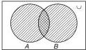

---

## 7. Operations on Sets (pp. 890–891)

| Operation | Notation | Definition | Example |
|-----------|----------|-----------|---------|
| **Union** | $A \cup B$ | Elements in $A$ or $B$ or both | $\{2,3,5\} \cup \{1,2,4,5\} = \{1,2,3,4,5\}$ |
| **Intersection** | $A \cap B$ | Elements in both $A$ and $B$ | $\{3,6,9,12,15,18\} \cap \{4,6,8,10,12,14,16,18\} = \{6,12,18\}$ |
| **Disjoint** | $A \cap B = \phi$ | No common elements | $\{1,3,5,7,9\}$ and $\{2,4,6,8,10\}$ |
| **Difference** | $A - B$ | Elements of $A$ not in $B$ | $\{1,2,3,4,5,6\} - \{2,4,6,8,10\} = \{1,3,5\}$ |
| **Symmetric difference** | $A \Delta B$ | $(A-B) \cup (B-A) = \{x : x \notin A \cap B\}$ | — |
| **Complement** | $A'$ or $A^c$ or $U - A$ | Elements of $U$ not in $A$ | $U$ = primes, $A = \{2\} \Rightarrow A' = \{3,5,7,11,13,\ldots\}$ |

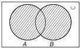
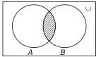
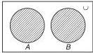
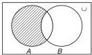
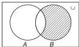
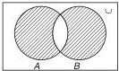
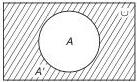

---

## 8. Algebraic Laws of Sets (p. 891)

1. **Idempotent**: $A \cup A = A$; $A \cap A = A$
2. **Identity**: $A \cup \phi = A$; $A \cap U = A$
3. **Commutative**: $A \cup B = B \cup A$; $A \cap B = B \cap A$
4. **Associative**: $(A \cup B) \cup C = A \cup (B \cup C)$; $A \cap (B \cap C) = (A \cap B) \cap C$
5. **Distributive**: $A \cup (B \cap C) = (A \cup B) \cap (A \cup C)$; $A \cap (B \cup C) = (A \cap B) \cup (A \cap C)$
6. **De-Morgan's**: $(A \cup B)' = A' \cap B'$; $(A \cap B)' = A' \cup B'$

---

## 9. Important Results on Operations (p. 891)

1. $A - B = A \cap B'$
2. $B - A = B \cap A'$
3. $A - B = A \iff A \cap B = \phi$
4. $(A - B) \cup B = A \cup B$
5. $(A - B) \cap B = \phi$
6. $A \subseteq B \iff B' \subseteq A'$
7. $(A - B) \cup (B - A) = (A \cup B) - (A \cap B)$

---

## 10. Formulas for Number of Elements (p. 891)

For finite sets $A, B, C$ with universal set $U$:

| Formula | Meaning |
|---------|---------|
| $n(A \cup B) = n(A) + n(B) - n(A \cap B)$ | Union formula |
| $n(A \cup B) = n(A) + n(B) \iff A, B$ disjoint | Disjoint condition |
| $n(A - B) = n(A) - n(A \cap B)$ | Difference formula |
| $n(A \Delta B) = n(A) + n(B) - 2n(A \cap B)$ | Exactly one of $A$ or $B$ |
| $n(A \cup B \cup C) = n(A) + n(B) + n(C) - n(A \cap B) - n(B \cap C) - n(A \cap C) + n(A \cap B \cap C)$ | Three-set union |
| Exactly two of $A,B,C$ $= n(A \cap B) + n(B \cap C) + n(C \cap A) - 3n(A \cap B \cap C)$ | Exactly two sets |
| Exactly one of $A,B,C$ $= n(A) + n(B) + n(C) - 2n(A \cap B) - 2n(B \cap C) - 2n(A \cap C) + 3n(A \cap B \cap C)$ | Exactly one set |
| $n(A' \cup B') = n[(A \cap B)'] = n(U) - n(A \cap B)$ | Complement union |
| $n(A' \cap B') = n[(A \cup B)'] = n(U) - n(A \cup B)$ | Complement intersection |

---

## 11. Two-Circle Venn Diagram — Worked Examples (pp. 892–893)

### Example 1 (p. 892): Language Survey
**Problem**: 1000 people surveyed; 700 speak English, 500 speak Hindi; all speak at least one language.

**Solution**:
- $n(E \cap H) = 700 + 500 - 1000 = \mathbf{200}$
- Exactly one language $= 1000 - 200 = \mathbf{800}$

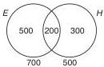

### Example 2 (p. 892): Exam Pass/Fail
**Problem**: 60% passed Maths, 70% passed English, 10% failed both, 300 passed both.

**Solution**:
- Failed at least one $= 30\% + 10\% + 20\% = 60\%$
- Passed both $= 40\%$
- $40x/100 = 300 \Rightarrow x = \mathbf{750}$ candidates

### Example 3 (p. 892–893): Physics/Maths
**Problem**: $\frac{1}{3}$ failed Maths, $\frac{1}{2}$ failed Physics, 60% of Physics-passers also passed Maths, 300 students.

**Solution**:
- Passed at least one $= 110 + 90 + 60 = 260$
- Failed both $= 300 - 260 = \mathbf{40}$

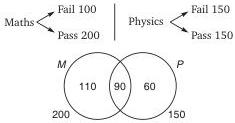

### Example 4 (p. 893): English/Hindi Exam
**Problem**: 49% failed English, 36% failed Hindi, 15% failed both, 630 passed English alone.

**Solution**:
- Failed at least one $= 34\% + 15\% + 21\% = 70\%$
- Passed both $= 30\%$; Passed English only $= 51\% - 30\% = 21\%$
- $21x/100 = 630 \Rightarrow x = \mathbf{3000}$ candidates

### Example 5 (p. 893): Movie Preferences
**Problem**: 69% like romantic, 61% like action.

**Solution**:
- $n(R \cap A) = (69 + 61) - 100 = \mathbf{30\%}$ (assuming all like at least one)

### Example 6 (p. 893): Prepaid Mobile Users
**Problem**: Radiance 25%, DSML 20%, both 8%; prepaid: 30% of Radiance-only, 40% of DSML-only, 50% of both.

**Solution**:
- Prepaid $= 30\% \text{ of } 17 + 40\% \text{ of } 12 + 50\% \text{ of } 8 = \mathbf{13.9\%}$

---

## 12. Three-Circle Venn Diagram — Component Notation (p. 893)

For books $P, Q, R$:
- $a, b, c$ = only $P$, only $Q$, only $R$
- $x, y, z$ = $P \cap Q$ only, $Q \cap R$ only, $P \cap R$ only
- $k$ = all three

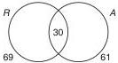

### Key Relationships
- $x + k$ = $P$ and $Q$ both; $y + k$ = $Q$ and $R$ both; $z + k$ = $P$ and $R$ both
- $a + x + k + z$ = total reading $P$; $b + x + k + y$ = total reading $Q$; $c + y + k + z$ = total reading $R$
- $a + x + b$ = $P$ or $Q$ but not $R$; $b + y + c$ = $Q$ or $R$ but not $P$; $c + z + a$ = $P$ or $R$ but not $Q$
- $a + b + c$ = only one book; $x + y + z$ = only two books; $k$ = all three
- $(a + b + c) + (x + y + z) + k$ = at least one book
- $(x + y + z) + k$ = at least two books

---

## 13. Three-Circle Venn — Worked Examples (pp. 894–896)

### Example 1 (p. 894): Sports Survey
**Problem**: 100 children; hockey 32%, football 64%, cricket 40%; H&F 14%, F&C 15%, H&C 13%; all three 6%.

**Solution**:
- (a) Only one game $= 11 + 41 + 18 = \mathbf{70}$
- (b) At least two $= (8+7+9) + 6 = \mathbf{30}$
- (c) Hockey or football but not cricket $= (11+41) + 8 = \mathbf{60}$

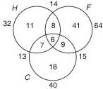

### Example 2 (p. 894): Academic Streams
**Problem**: 100 students; science 42, law 34, commerce 58; S&L 8, L&C 13, C&S 18.

**Solution**:
- $\alpha + \beta + \gamma = 100$; $\alpha + 2\beta + 3\gamma = 134$; $\beta + 3\gamma = 39$
- $\alpha + \beta = 134 - 39 = 95$; $\gamma = 100 - 95 = \mathbf{5}$
- Only science $= 42 - [(18+8) - 5] = 42 - 21 = \mathbf{21}$

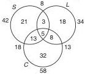

### Example 3 (p. 894): MBA Specializations
**Problem**: 100 students; M&HR 15, HR&S 17, M&S 16; only one field = 22 each.

**Solution**:
- $\alpha = 66$; $\beta + \gamma = 34$; $\beta + 3\gamma = 48$
- $2\gamma = 48 - 34 = 14 \Rightarrow \gamma = \mathbf{7}$ students in all three

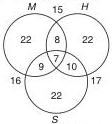

### Example 4 (p. 894–895): Music School
**Problem**: Trumpet 28, violin 30, guitar 32; T&V 6, V&G 8, G&T 10; only one = 54; only violin = 20.

**Solution**:
- $x + k + y = 10$; $(x+k) + (y+k) = 14 \Rightarrow 10 + k = 14 \Rightarrow k = 4$
- (a) Total $= (16+20+18) + (2+4+6) + 4 = \mathbf{70}$
- (b) Trumpet & guitar but not violin $= \mathbf{6}$

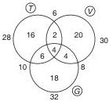

### Example 5 (p. 895): 180 Students
**Problem**: 7 failed all three; 144 passed only one; 21 passed only two.

**Solution**:
- $\alpha + \beta + \gamma = 173$; $\gamma = 173 - (144+21) = \mathbf{8}$
- (a) All three $= \mathbf{8}$
- (b) At least two $= 21 + 8 = \mathbf{29}$
- (c) At least one but at most two $= 144 + 21 = \mathbf{165}$

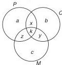

### Example 6 (p. 895): Marriage Party
**Problem**: 278 guests; P&D 20, D&S 23, P&S 21, all three 9; equal bottles of each kind.

**Solution**:
- Total bottles $= 278 + 55 = 333$; each kind $= 111$
- $a = 111 - (11+9+12) = 79$; $b = 111 - (11+9+14) = 77$; $c = 111 - (12+9+14) = 76$
- (a) Only one $= 79+77+76 = \mathbf{232}$
- (b) Dew or Sprite but not Pepsi $= 77+14+76 = \mathbf{167}$
- (c) Pepsi & Dew but not Sprite $= 20 - 9 = \mathbf{11}$

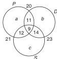

### Example 7 (p. 895–896): MOCK CAT
**Problem**: 250 students; 20 failed all; 66 passed all three; 24 did not qualify DI only; 12 did not qualify DI & Maths only.

**Solution**:
- $c = 36$; $x = 20$; $z = 40$
- $(a+12+36) + (20+24+40) + 66 = 230 \Rightarrow a = 32$
- At least two sections $= 84 + 66 = \mathbf{150}$

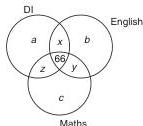

---

## 14. Maxima and Minima (pp. 896–897)

### Type 1: At Least One Elective Compulsory

**Problem**: 75% Marketing, 62% Finance, 88% HR.

**Solution**:
- (a) **Minimum all three**: $25 + 12 + 38 = 75\% \Rightarrow$ at least $\mathbf{25\%}$
- (b) **Maximum all three**: $(75-x) + (88-x) + (62-x) + x = 100 \Rightarrow x = \mathbf{62.5\%}$

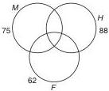

### Type 2: Optional Electives

**Problem**: 70% Marketing, 60% HR, 50% Finance; M&HR 30%, HR&F 40%, M&F 20%.

**Solution**:
- Total $= 70 + (x-10) + (40-x) + (x-10) = 90 + x$
- (a) **Minimum $x$** $= 10$ (so no category negative)
- (b) **Maximum $x$** $= 20$

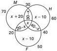

### Type 3: 250 Students — News, Sports, Music

**Problem**: news 120, sports 80, music 90; N&S 50, S&M 60, N&M 65.

**Solution**:
- Constraints: $x-30 \ge 0$, $x-35 \ge 0$, $50-x \ge 0$, $60-x \ge 0$, $65-x \ge 0$
- Total at least one $= 120 + (x-30) + (60-x) + (x-35) = 115 + x$
- (a) **Min at least one** $= 115 + 35 = \mathbf{150}$
- (b) **Max at least one** $= 115 + 50 = \mathbf{165}$
- (c) **Min all three** $= \mathbf{35}$
- (d) **Max all three** $= \mathbf{50}$

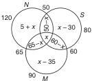

---

## 15. Fast CAT Methods

### Method 1: The "Total = Sum of Regions" Approach
For any three-set Venn diagram, always write:
$$\text{Total} = (\text{only one}) + (\text{only two}) + (\text{all three}) + (\text{none})$$

### Method 2: The "Exactly One" Shortcut
$$\text{Exactly one} = n(A) + n(B) + n(C) - 2n(A \cap B) - 2n(B \cap C) - 2n(A \cap C) + 3n(A \cap B \cap C)$$

### Method 3: The "Exactly Two" Shortcut
$$\text{Exactly two} = n(A \cap B) + n(B \cap C) + n(C \cap A) - 3n(A \cap B \cap C)$$

### Method 4: Maxima/Minima — The "Deficit" Method
For minimum all three: sum the percentages NOT in each set; if this exceeds 100%, the excess is the minimum in all three.

**Example**: 75% Marketing, 62% Finance, 88% HR
- Not in M: 25%; Not in F: 38%; Not in HR: 12%
- Sum $= 75\%$; Minimum all three $= 100\% - 75\% = 25\%$

### Method 5: Divisibility Counting
For "not divisible by 2, 3, or 5" problems:
$$\text{Not divisible} = n(U) - [n(2) + n(3) + n(5) - n(6) - n(15) - n(10) + n(30)]$$

---

## 16. Worked Examples — Easy to Advanced

### Easy: Two-Set Problem

**Problem**: In a class of 80 students, 50 play cricket and 40 play football. If 20 play both, how many play neither?

**Solution**:
- $n(C \cup F) = 50 + 40 - 20 = 70$
- Neither $= 80 - 70 = \mathbf{10}$

---

### Medium: Three-Set Problem

**Problem**: In a survey of 200 people: 120 read Times of India (T), 100 read Hindustan Times (H), 80 read Indian Express (E). T&H: 50, H&E: 40, T&E: 45, all three: 20. How many read exactly one newspaper?

**Solution**:
- Exactly one $= 120 + 100 + 80 - 2(50) - 2(40) - 2(45) + 3(20)$
- $= 300 - 100 - 80 - 90 + 60 = \mathbf{90}$

---

### Advanced: Maxima/Minima with Constraints

**Problem**: In a group of 120 people: 80 like tea, 70 like coffee, 60 like juice. Tea & Coffee: 50, Coffee & Juice: 40, Tea & Juice: 45. Find the minimum and maximum number who like all three.

**Solution**:
- Let $x$ = all three.
- Only T&C $= 50 - x$; Only C&J $= 40 - x$; Only T&J $= 45 - x$
- Constraints: $50 - x \ge 0$, $40 - x \ge 0$, $45 - x \ge 0 \Rightarrow x \le 40$
- Also: Only T $= 80 - (50-x) - (45-x) - x = x - 15 \ge 0 \Rightarrow x \ge 15$
- Only C $= 70 - (50-x) - (40-x) - x = x - 20 \ge 0 \Rightarrow x \ge 20$
- Only J $= 60 - (40-x) - (45-x) - x = x - 25 \ge 0 \Rightarrow x \ge 25$
- **Minimum $x = 25$**; **Maximum $x = 40$**

---

### Advanced: Combinatorial Counting

**Problem (Q33, p. 905)**: Find the number of unordered pairs of disjoint subsets of $S = \{1,2,3,4\}$.

**Solution**:
- Each element has 3 choices: in $X$, in $Y$, or in neither.
- Total ordered pairs $= 3^4 = 81$
- Exclude both empty: $81 - 1 = 80$
- Divide by 2 for unordered: $80/2 = 40$
- Add back the empty pair: $40 + 1 = \mathbf{41}$

---

### Advanced: AP Intersection

**Problem (Q34, p. 905)**: $A = \{1,5,9,13,17,\ldots, 100\text{th term}\}$; $B = \{3,10,17,24,31,\ldots, 100\text{th term}\}$. Find $n(A \cup B)$.

**Solution**:
- Common difference: $A = 4$, $B = 7$; common terms differ by LCM$(4,7) = 28$
- First common $= 17$; 100th term of $A = 397$; 100th term of $B = 696$
- $17 + (n-1)28 \le 397 \Rightarrow n \le 14$
- $n(S) = 100 + 100 - 14 = \mathbf{186}$

---

## 17. Decision Rules

| Situation | Rule |
|-----------|------|
| "At least one" stated or implied | Total $= n(A \cup B \cup C)$ |
| "None" given | Subtract from total first |
| "Exactly one" asked | Use the shortcut formula |
| "Exactly two" asked | Use the shortcut formula |
| "At least two" asked | Exactly two + all three |
| "At most two" asked | Total − all three |
| Maxima/minima of all three | Set up inequalities for each region ≥ 0 |
| "Not divisible by..." | Use inclusion-exclusion with LCM |
| Disjoint subsets counting | Each element has 3 choices (X, Y, neither) |

---

## 18. Common Traps

1. **$\phi \neq \{0\} \neq 0$** — Empty set, singleton containing zero, and zero are all different.
2. **Equivalent ≠ Equal** — Same cardinality doesn't mean same elements.
3. **"And" vs "Or"** — "And" = intersection; "or" = union.
4. **Negative regions** — In maxima/minima, ensure no region becomes negative.
5. **"At least one" assumption** — Assume all surveyed like at least one unless stated otherwise.
6. **Power set non-empty** — Always contains $\phi$ and the set itself.
7. **Roster method** — Order and repetition are meaningless.
8. **Complement notation** — $A'$, $A^c$, and $U - A$ all mean the same thing.
9. **Three-set formula** — Don't forget to add back $n(A \cap B \cap C)$ in the union formula.
10. **"Only" vs "Both"** — "Only A and B" means $A \cap B$ but not $C$; "A and B" includes those in all three.

---

## 19. Timed Strategy (2–3 questions in ~10 minutes)

| Time | Action |
|------|--------|
| 0:00–0:30 | Read the problem; identify: two-set or three-set? Max/min or direct? |
| 0:30–1:30 | Draw the Venn diagram; label all regions with variables |
| 1:30–3:00 | Write equations from given data; solve |
| 3:00–3:30 | Verify: do all regions sum to total? Any negative regions? |

**Speed Tips**:
- Memorize the "exactly one" and "exactly two" formulas.
- For maxima/minima, always check boundary constraints first.
- For divisibility problems, use the inclusion-exclusion formula directly.
- For "at least one" problems, the answer is often $100\% - \text{none}$.

---

## 20. Final Revision Sheet

### Core Formulas
$$n(A \cup B) = n(A) + n(B) - n(A \cap B)$$
$$n(A \cup B \cup C) = n(A) + n(B) + n(C) - n(A \cap B) - n(B \cap C) - n(A \cap C) + n(A \cap B \cap C)$$
$$\text{Exactly one} = n(A) + n(B) + n(C) - 2n(A \cap B) - 2n(B \cap C) - 2n(A \cap C) + 3n(A \cap B \cap C)$$
$$\text{Exactly two} = n(A \cap B) + n(B \cap C) + n(C \cap A) - 3n(A \cap B \cap C)$$

### Key Facts
- Number of subsets of $n$-element set $= 2^n$
- Number of proper subsets $= 2^n - 1$
- $\phi$ is a subset of every set
- $A - B = A \cap B'$
- $(A \cup B)' = A' \cap B'$; $(A \cap B)' = A' \cup B'$

### Max/Min Quick Rules
- **Min all three** $= n(A) + n(B) + n(C) - 2n(U)$ (when all in at least one)
- **Max all three** $= \min\{n(A), n(B), n(C)\}$ (bounded by smallest set)
- Always check: no region can be negative.

### Divisibility Counting
$$\text{Not divisible by } a, b, c = n(U) - \left\lfloor \frac{n(U)}{a} \right\rfloor - \left\lfloor \frac{n(U)}{b} \right\rfloor - \left\lfloor \frac{n(U)}{c} \right\rfloor + \left\lfloor \frac{n(U)}{\text{lcm}(a,b)} \right\rfloor + \left\lfloor \frac{n(U)}{\text{lcm}(b,c)} \right\rfloor + \left\lfloor \frac{n(U)}{\text{lcm}(a,c)} \right\rfloor - \left\lfloor \frac{n(U)}{\text{lcm}(a,b,c)} \right\rfloor$$

### Disjoint Subset Counting
Number of unordered pairs of disjoint subsets of an $n$-element set:
$$\frac{3^n - 1}{2} + 1$$

---

*End of Chapter 15 Study Notes*
