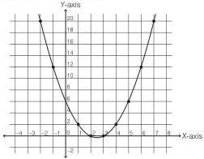

# CAT Quant — Theory of Equations

## 1. Concept Map

```
Theory of Equations
│
├── 1. Quadratic Equations (Degree 2)
│   ├── Standard Form: ax² + bx + c = 0 (a ≠ 0)
│   ├── Roots & Coefficients (Vieta's Formulas)
│   ├── Discriminant & Nature of Roots
│   ├── Methods of Solving
│   ├── Formation of Equations
│   ├── Max/Min Values
│   ├── Common Roots
│   ├── Inequalities
│   └── Position of Roots
│
├── 2. Higher-Degree Polynomials (Degree n)
│   ├── Standard Form & Properties
│   ├── End Behaviour
│   ├── Multiplicity of Roots
│   ├── Descartes' Rule of Signs
│   ├── Polynomial Inequalities
│   └── Root-Coefficient Relations
│
└── 3. Rational Polynomials (p(x)/q(x))
    ├── Domain & Critical Points
    ├── Asymptotes (Vertical, Horizontal, Slant, Curvilinear)
    ├── Holes
    ├── Intercepts
    ├── Graphing
    └── Inequalities
```

---

## 2. Foundations

### 2.1 The Quadratic Expression

The expression **$ax^2 + bx + c$** is quadratic **iff $a \neq 0$** (where $a, b, c$ are real numbers). If $a = 0$, it reduces to the linear expression $bx + c$. (p. 772)

**Nomenclature** (p. 772):

| Nomenclature | Format | Restriction |
|---|---|---|
| Quadratic Expression | $ax^2 + bx + c$ | — |
| Quadratic Function | $y = ax^2 + bx + c$ | Any value |
| Quadratic Equation | $ax^2 + bx + c = 0$ | Strictly equal to zero |
| Quadratic Inequation | $ax^2 + bx + c \ge 0$ | Non-negative values |
| Quadratic Inequation | $ax^2 + bx + c > 0$ | Positive values |
| Quadratic Inequation | $ax^2 + bx + c \le 0$ | Non-positive values |
| Quadratic Inequation | $ax^2 + bx + c < 0$ | Negative values |

**Note:** $y$ and $f(x)$ are interchangeable; $y = f(x)$ represents a function.

### 2.2 Properties of Quadratic Equations (p. 773)

1. Degree is always 2.
2. The value of $x$ satisfying $ax^2 + bx + c = 0$ is called a **root/zero/solution**.
3. Exactly **two roots** exist.
4. Cannot have more than two different roots.
5. Can have either **two or zero REAL roots**.
6. If $\alpha$ is a root, then $(x - \alpha)$ is a factor.
7. If $\alpha, \beta$ are roots: $ax^2 + bx + c = k(x - \alpha)(x - \beta) = 0$.
8. **KEY**: From any two given roots, infinite quadratic equations are possible: $k(x - \alpha)(x - \beta) = 0$ where $k$ is any real number.
9. If satisfied by more than two distinct numbers → becomes an identity ($a = b = c = 0$).

### 2.3 Graph of a Quadratic Function (p. 774)

- The graph is a **parabola**.
- It is always symmetric.
- The line splitting the parabola is the **axis of symmetry**: $x = -\frac{b}{2a}$.
- The axis is always **parallel to the Y-axis**.
- The **vertex** is the point on the axis of symmetry; it is the point of greatest curvature.
- The parabola opens **UP or DOWN only**.
- Opens up → vertex is the lowest point (minimum); opens down → vertex is the highest point (maximum).
- Vertex y-coordinate: $y = \frac{4ac - b^2}{4a} = -\frac{D}{4a}$.
- The graph must intersect the Y-axis once.
- The graph may exist anywhere across the X-axis.



---

## 3. Formulas with Symbol Meanings

### 3.1 The Quadratic Formula (Sridharacharya's Method) (p. 779)

$$x = \frac{-b \pm \sqrt{b^2 - 4ac}}{2a}$$

- $a$: coefficient of $x^2$
- $b$: coefficient of $x$
- $c$: constant term

### 3.2 Discriminant (p. 776)

$$D = b^2 - 4ac$$

- $D$: Discriminant
- Determines the nature of roots

### 3.3 Sum and Product of Roots (p. 778)

For roots $\alpha, \beta$ of $ax^2 + bx + c = 0$:

$$\alpha + \beta = -\frac{b}{a}$$

$$\alpha\beta = \frac{c}{a}$$

### 3.4 Axis of Symmetry and Vertex (p. 774)

$$\text{Axis of symmetry: } x = -\frac{b}{2a}$$

$$\text{Vertex y-coordinate: } y = \frac{4ac - b^2}{4a} = -\frac{D}{4a}$$

### 3.5 Formation of a Quadratic Equation (p. 782)

$$k[x^2 - (\text{sum of roots})x + (\text{product of roots})] = 0$$

$$k[x^2 - (\alpha + \beta)x + (\alpha\beta)] = 0$$

### 3.6 Common Roots Conditions (p. 792)

**One root common** between $ax^2 + bx + c = 0$ and $a'x^2 + b'x + c' = 0$:

$$(ab' - a'b)(bc' - b'c) = (ca' - c'a)^2$$

**Both roots common:**

$$\frac{a}{a'} = \frac{b}{b'} = \frac{c}{c'}$$

### 3.7 Higher-Degree Polynomials (p. 825)

For $f(x) = a_n x^n + a_{n-1}x^{n-1} + \dots + a_1 x + a_0$ with roots $\alpha_1, \alpha_2, \dots, \alpha_n$:

- $S_1 = \sum \alpha_i = -\frac{a_{n-1}}{a_n}$ (Sum of roots)
- $S_2 = \sum_{i \neq j} \alpha_i \alpha_j = \frac{a_{n-2}}{a_n}$ (Sum of products taken 2 at a time)
- $S_k = (-1)^k \frac{a_{n-k}}{a_n}$ (Sum of products taken k at a time)
- $S_n = \prod_{i=1}^n \alpha_i = (-1)^n \frac{a_0}{a_n}$ (Product of all roots)

**Formation of polynomial from roots:**

$$x^n - S_1 x^{n-1} + S_2 x^{n-2} - S_3 x^{n-3} + \dots + (-1)^n S_n = 0$$

### 3.8 Asymptotes of Rational Functions (p. 830)

For $f(x) = \frac{p(x)}{q(x)}$ where degree of $p(x) = n$ and degree of $q(x) = m$:

| Asymptote Type | Condition | Value |
|---|---|---|
| Vertical | Roots of denominator (in lowest terms) | $x = c$ |
| Horizontal | $n < m$ | $y = 0$ |
| Horizontal | $n = m$ | $y = \frac{a_n}{b_m}$ |
| Slant (Oblique) | $n = m + 1$ | $y = k(x)$ (linear quotient) |
| Curvilinear | $n > m + 1$ | $y = k(x)$ (polynomial quotient of degree ≥ 2) |

---

## 4. Fast CAT Methods

### 4.1 Solving Quadratics by Factorization (p. 776)

1. Write in standard form $ax^2 + bx + c = 0$.
2. Make coefficients integers.
3. Find product $ac$.
4. Find factor pairs of $ac$.
5. Choose pair $(m, n)$: if $ac$ positive → $m + n = b$; if $ac$ negative → $m - n = -b$.
6. Write as $ax^2 + (m+n)x + c = 0$ or $ax^2 + (m-n)x + c = 0$.
7. Group and factor.

**Limitation:** This technique fails for irrational roots; use the quadratic formula instead.

### 4.2 Sign of Roots — Quick Trick (p. 809)

For $ax^2 + bx + c = 0$ with roots $\alpha, \beta$:

| $b$ | $c$ | Signs of Roots |
|---|---|---|
| + | + | Both always negative |
| + | − | One positive, one negative |
| − | + | Both always positive |
| − | − | One positive, one negative |

### 4.3 Nature of Roots — Discriminant Table (p. 784)

| $D < 0$ | $D = 0$ | $D > 0$ (perfect square) | $D > 0$ (not perfect square) |
|---|---|---|---|
| Complex | Real | Real | Real |
| Non-zero imaginary parts | Rational | Rational | Irrational |
| Unequal (Conjugate pairs) | Equal | Unequal | Unequal (Conjugate pairs) |

**Key Rules:**
- Roots real only when $D \ge 0$.
- Roots rational only when $D$ is a perfect square.
- Roots equal only when $D = 0$.
- Irrational roots occur in conjugate pairs: $p + \sqrt{q}$, $p - \sqrt{q}$.
- Complex roots occur in conjugate pairs: $p + iq$, $p - iq$.

### 4.4 Quadratic Inequalities — Interval Method (p. 800)

1. Find roots $\alpha, \beta$ (treat expression as = 0).
2. Draw a number line, mark roots (smaller left, larger right).
3. Roots divide the number line into 3 regions.
4. For $a > 0$: outer regions positive, middle region negative.
5. For $a < 0$: outer regions negative, middle region positive.

| Inequality | $a > 0$ | $a < 0$ |
|---|---|---|
| $ax^2 + bx + c > 0$ | $x < \alpha$ and $x > \beta$ | $\alpha < x < \beta$ |
| $ax^2 + bx + c \ge 0$ | $x \le \alpha$ and $x \ge \beta$ | $\alpha \le x \le \beta$ |
| $ax^2 + bx + c < 0$ | $\alpha < x < \beta$ | $x < \alpha$ and $x > \beta$ |
| $ax^2 + bx + c \le 0$ | $\alpha \le x \le \beta$ | $x \le \alpha$ and $x \ge \beta$ |

### 4.5 Position of Roots Relative to a Number $k$ (p. 802)

For $f(x) = ax^2 + bx + c$ with roots $\alpha < \beta$:

| Condition | Requirements |
|---|---|
| $k < \alpha < \beta$ | (i) $D \ge 0$ (ii) $af(k) > 0$ (iii) $k < -\frac{b}{2a}$ |
| $\alpha < \beta < k$ | (i) $D \ge 0$ (ii) $af(k) > 0$ (iii) $k > -\frac{b}{2a}$ |
| $\alpha < k < \beta$ | (i) $D > 0$ (ii) $af(k) < 0$ |

### 4.6 Max/Min of Quadratic (p. 789)

- $a > 0$ → parabola opens upward → **minimum value** at $x = -\frac{b}{2a}$.
- $a < 0$ → parabola opens downward → **maximum value** at $x = -\frac{b}{2a}$.
- Value: $y = \frac{4ac - b^2}{4a} = -\frac{D}{4a}$.

### 4.7 Rational Inequalities — Seven-Step Method (p. 839)

1. Bring all values to the left side, leave 0 on the right.
2. Simplify to a single rational function.
3. Factorize numerator and denominator; determine critical points.
4. Mark critical points on a number line.
5. Test each interval for signs.
6. Select appropriate intervals based on inequality direction.
7. Apply boundary rules (strict vs. non-strict).

**⚠️ CRITICAL:** Critical points may NOT have alternating signs (unlike polynomial inequalities). **Always test each interval individually.**

### 4.8 Max/Min of Rational Expressions (p. 841)

1. Set the expression equal to $k$.
2. Form a quadratic in $x$.
3. Apply $D \ge 0$ for real $x$.
4. Solve the resulting inequality for $k$.

---

## 5. Worked Examples

### 5.1 Easy: Solving by Factorization (p. 776)

**Problem:** Solve $2x^2 + 3x - 9 = 0$.

**Solution:**
- $ac = 2 \times (-9) = -18$
- Choose 3 and 6 (difference = 3 = $b$)
- $2x^2 + (6x - 3x) - 9 = 0$
- $(2x^2 + 6x) - (3x + 9) = 0$
- $2x(x + 3) - 3(x + 3) = 0$
- $(x + 3)(2x - 3) = 0$
- $x = -3$ or $x = \frac{3}{2}$

### 5.2 Easy: Sum and Product of Roots (p. 778)

**Problem:** Find the sum and product of roots of $3x^2 + 15x + 12 = 0$.

**Solution:**
- $\alpha + \beta = -\frac{b}{a} = -\frac{15}{3} = -5$
- $\alpha\beta = \frac{c}{a} = \frac{12}{3} = 4$

### 5.3 Medium: Formation of Equation from Roots (p. 783)

**Problem:** Form a quadratic equation with roots $5 + 2\sqrt{7}$ and $5 - 2\sqrt{7}$.

**Solution:**
- Sum $= (5 + 2\sqrt{7}) + (5 - 2\sqrt{7}) = 10$
- Product $= (5 + 2\sqrt{7})(5 - 2\sqrt{7}) = 25 - 28 = -3$
- Equation: $k[x^2 - 10x - 3] = 0$
- Taking $k = 1$: $x^2 - 10x - 3 = 0$

### 5.4 Medium: Nature of Roots (p. 785)

**Problem:** Find the value of $k$ for which $9x^2 + 2kx + 4 = 0$ has equal roots.

**Solution:**
- For equal roots, $D = 0$:
- $(2k)^2 - 4 \times 9 \times 4 = 0$
- $4k^2 - 144 = 0$
- $k^2 = 36$
- $k = \pm 6$

### 5.5 Medium: Common Root (p. 793)

**Problem:** Find the common root of $x^2 - 8x + 15 = 0$ and $x^2 - 9x + 18 = 0$.

**Solution:**
- Subtract equations: $(x^2 - 8x + 15) - (x^2 - 9x + 18) = 0$
- $x - 3 = 0$
- $x = 3$
- **Verify:** $9 - 24 + 15 = 0$ ✓ and $9 - 27 + 18 = 0$ ✓
- Common root = 3

### 5.6 Medium: Quadratic Inequality (p. 800)

**Problem:** Solve $3x^2 - 3x - 6 \le 0$.

**Solution:**
- Factor: $3(x^2 - x - 2) = 3(x - 2)(x + 1) \le 0$
- Roots: $-1$ and $2$; $a = 3 > 0$
- For $a > 0$ and $y \le 0$: $\alpha \le x \le \beta$
- **Answer:** $-1 \le x \le 2$

### 5.7 Advanced: Position of Roots (p. 806)

**Problem:** Find the values of $p$ for which both roots of $x^2 - 6px + (3 - 4p + 9p^2) = 0$ exceed 4.

**Solution:**
- (i) $D \ge 0$: $(-6p)^2 - 4(3 - 4p + 9p^2) \ge 0$
  - $36p^2 - 12 + 16p - 36p^2 \ge 0$
  - $16p \ge 12 \Rightarrow p \ge \frac{3}{4}$
- (ii) $af(4) > 0$: $f(4) = 16 - 24p + 3 - 4p + 9p^2 = 9p^2 - 28p + 19 > 0$
  - $(p - 1)(9p - 19) > 0 \Rightarrow p \in (-\infty, 1) \cup (\frac{19}{9}, \infty)$
- (iii) $4 < -\frac{b}{2a}$: $4 < 3p \Rightarrow p > \frac{4}{3}$
- **Intersection:** $p > \frac{19}{9}$

### 5.8 Advanced: Rational Inequality (p. 839)

**Problem:** Solve $\frac{x+5}{x-6} \le 0$.

**Solution:**
- Critical points: $-5$ and $6$
- Test $x = -10$: $\frac{-5}{-16} > 0$ (positive)
- Test $x = 0$: $\frac{5}{-6} < 0$ (negative)
- Test $x = 10$: $\frac{15}{4} > 0$ (positive)
- $x = -5$ included (function = 0); $x = 6$ excluded (undefined)
- **Answer:** $[-5, 6)$ or $-5 \le x < 6$

### 5.9 Advanced: Max/Min of Rational Expression (p. 841)

**Problem:** Find the minimum value of $\frac{x^2 + x + 1}{x^2 - x + 1}$ for real $x$.

**Solution:**
- Let $\frac{x^2 + x + 1}{x^2 - x + 1} = k$
- $(1 - k)x^2 + (1 + k)x + (1 - k) = 0$
- For real $x$: $D \ge 0$
- $(1 + k)^2 - 4(1 - k)(1 - k) \ge 0$
- $-3k^2 + 10k - 3 \ge 0 \Rightarrow 3k^2 - 10k + 3 \le 0$
- $(k - 3)(3k - 1) \le 0$
- $\frac{1}{3} \le k \le 3$
- **Minimum value:** $\frac{1}{3}$

### 5.10 Advanced: Higher-Degree Polynomial (p. 825)

**Problem:** If $\alpha, \beta, \gamma$ are roots of $x^3 - x^2 + bx + c = 0$ and are in AP, find the intervals for $b$ and $c$.

**Solution:**
- Let roots be $a - d, a, a + d$
- Sum: $3a = 1 \Rightarrow a = \frac{1}{3}$
- $S_2 = 3a^2 - d^2 = b \Rightarrow \frac{1}{3} - d^2 = b$
- Since $d^2 \ge 0$: $b \le \frac{1}{3}$
- Product: $a(a^2 - d^2) = -c \Rightarrow c = \frac{d^2}{3} - \frac{1}{27}$
- Since $\frac{d^2}{3} \ge 0$: $c \ge -\frac{1}{27}$
- **Answer:** $-\infty < b \le \frac{1}{3}$ and $-\frac{1}{27} \le c < \infty$

---

## 6. Decision Rules

### 6.1 Which Method to Use?

| Situation | Method |
|---|---|
| Simple integer coefficients | Factorization |
| Irrational or complex roots | Sridharacharya formula |
| Roots given, find equation | Sum/product of roots |
| Nature of roots | Discriminant analysis |
| Inequality with quadratic | Interval method (sign of $a$) |
| Inequality with rational function | Test each interval individually |
| Max/min of quadratic | Vertex formula |
| Max/min of rational | Discriminant method |
| Common roots | Use common root formulas |
| Position of roots | $af(k)$ sign + axis position |

### 6.2 Sign of $af(k)$

- $af(k) < 0$ → $k$ lies **between** the roots.
- $af(k) > 0$ → $k$ lies **outside** the roots (need axis position to determine which side).

### 6.3 Exactly One Root Between $k_1$ and $k_2$

$$f(k_1) \cdot f(k_2) < 0$$

### 6.4 Both Roots Between $k_1$ and $k_2$

1. $D \ge 0$
2. $af(k_1) > 0$ and $af(k_2) > 0$
3. $k_1 < -\frac{b}{2a} < k_2$

### 6.5 Roots of Opposite Signs

$$af(0) < 0 \text{ (i.e., } ac < 0)$$

---

## 7. Common Traps

1. **Forgetting $a \neq 0$:** If $a = 0$, the equation is linear, not quadratic.
2. **Infinite equations from roots:** From given roots, infinitely many quadratics exist ($k$ can be any real number).
3. **Extraneous roots in radical equations:** Always check answers by substitution. (p. 781)
4. **Even multiplicity roots:** In polynomial inequalities, roots with even multiplicity do NOT change sign. (p. 819)
5. **Rational inequality sign alternation:** Critical points may NOT alternate signs — always test each interval. (p. 839)
6. **Holes vs. vertical asymptotes:** Compare powers of common factors: $u < v$ → asymptote; $u > v$ → hole on X-axis; $u = v$ → hole not on X-axis. (p. 829)
7. **X-intercepts of rational functions:** Require $p(x) = 0$ AND $q(x) \neq 0$. Holes and asymptotes cannot be x-intercepts. (p. 832)
8. **Non-real roots:** Never affect the sign of the graph and never create x-intercepts.
9. **Descartes' Rule:** Positive roots = sign changes in $f(x)$ (or less by even number); negative roots = sign changes in $f(-x)$ (or less by even number). (p. 819)
10. **Odd degree polynomial:** Must have at least one real root.
11. **Even degree with negative constant term and $a_n > 0$:** Must have at least two real roots (one positive, one negative).
12. **$f(p) \cdot f(q) > 0$:** Does NOT guarantee no root between $p$ and $q$ — could be 0 or 2 roots.
13. **Absolute value equations:** Always verify solutions in the original equation. (p. 874)
14. **Logarithmic equations:** Check domain restrictions; discard values making arguments non-positive. (p. 880)
15. **Graph may intersect non-vertical asymptote:** Unlike vertical asymptotes, the graph CAN cross horizontal/slant/curvilinear asymptotes. (p. 830)

---

## 8. Timed Strategy

### 8.1 Time Allocation (for 2-3 questions in CAT)

| Question Type | Time Budget |
|---|---|
| Simple quadratic solving | 30-45 seconds |
| Nature of roots / discriminant | 30-60 seconds |
| Sum/product of roots applications | 45-90 seconds |
| Common roots | 60-120 seconds |
| Inequalities | 60-120 seconds |
| Position of roots | 90-150 seconds |
| Rational functions/asymptotes | 90-150 seconds |
| Higher-degree polynomials | 60-120 seconds |

### 8.2 Quick Elimination Strategies

1. **Use options:** For root-finding, substitute option values into the equation.
2. **Test specific values:** For inequalities, test boundary values and a midpoint.
3. **Sign analysis:** For rational inequalities, check signs at critical points quickly.
4. **Vieta's formulas:** Use sum/product of roots to eliminate options rapidly.
5. **Discriminant shortcuts:** For "nature of roots" questions, compute $D$ mentally.

### 8.3 When to Skip

- Problems requiring extensive case analysis (e.g., multiple absolute values with parameters).
- Questions with heavy logarithmic/trigonometric combinations unless you spot a quick substitution.
- Problems where the discriminant of a parameterized quadratic becomes messy.

---

## 9. Final Revision Sheet

### 9.1 Core Formulas

| Concept | Formula |
|---|---|
| Quadratic formula | $x = \frac{-b \pm \sqrt{b^2 - 4ac}}{2a}$ |
| Discriminant | $D = b^2 - 4ac$ |
| Sum of roots | $\alpha + \beta = -\frac{b}{a}$ |
| Product of roots | $\alpha\beta = \frac{c}{a}$ |
| Axis of symmetry | $x = -\frac{b}{2a}$ |
| Vertex y-coordinate | $y = \frac{4ac - b^2}{4a} = -\frac{D}{4a}$ |
| Equation from roots | $k[x^2 - (\alpha+\beta)x + \alpha\beta] = 0$ |
| One common root | $(ab' - a'b)(bc' - b'c) = (ca' - c'a)^2$ |
| Both roots common | $\frac{a}{a'} = \frac{b}{b'} = \frac{c}{c'}$ |
| Cubic sum of roots | $\alpha + \beta + \gamma = -\frac{b}{a}$ |
| Cubic pairwise sum | $\alpha\beta + \beta\gamma + \gamma\alpha = \frac{c}{a}$ |
| Cubic product | $\alpha\beta\gamma = -\frac{d}{a}$ |

### 9.2 Nature of Roots Quick Reference

| Condition | Roots |
|---|---|
| $D > 0$, perfect square | Real, rational, unequal |
| $D > 0$, not perfect square | Real, irrational, unequal |
| $D = 0$ | Real, rational, equal |
| $D < 0$ | Complex conjugates |

### 9.3 Sign of Quadratic Expression

| Condition | $a > 0$ | $a < 0$ |
|---|---|---|
| $D < 0$ | Always positive | Always negative |
| $D = 0$ | $\ge 0$ (zero at root) | $\le 0$ (zero at root) |
| $D > 0$ | Positive outside roots, negative between | Negative outside roots, positive between |

### 9.4 Asymptote Quick Reference

| Condition | Asymptote |
|---|---|
| Denominator root (lowest terms) | Vertical: $x = c$ |
| $n < m$ | Horizontal: $y = 0$ |
| $n = m$ | Horizontal: $y = \frac{a_n}{b_m}$ |
| $n = m + 1$ | Slant: $y = k(x)$ (linear) |
| $n > m + 1$ | Curvilinear: $y = k(x)$ (degree ≥ 2) |

### 9.5 Key Identities

$$\alpha^2 + \beta^2 = (\alpha + \beta)^2 - 2\alpha\beta$$

$$\alpha^3 + \beta^3 = (\alpha + \beta)^3 - 3\alpha\beta(\alpha + \beta)$$

$$\alpha^3 + \beta^3 + \gamma^3 - 3\alpha\beta\gamma = (\alpha+\beta+\gamma)(\alpha^2+\beta^2+\gamma^2 - \alpha\beta-\beta\gamma-\gamma\alpha)$$

$$x^2 + \frac{1}{x^2} = \left(x + \frac{1}{x}\right)^2 - 2$$

$$x^2 + \frac{1}{x^2} = \left(x - \frac{1}{x}\right)^2 + 2$$

### 9.6 Descartes' Rule of Signs

- **Positive roots:** Number of sign changes in $f(x)$, or less by an even number.
- **Negative roots:** Number of sign changes in $f(-x)$, or less by an even number.

### 9.7 Multiplicity Rules

- **Odd multiplicity:** Graph crosses the X-axis; sign changes.
- **Even multiplicity:** Graph "kisses" the X-axis and bounces back; no sign change.

### 9.8 End Behaviour of Polynomials

| Degree | $a_n > 0$ | $a_n < 0$ |
|---|---|---|
| Odd | Ends in opposite directions (up-right, down-left) | Ends in opposite directions (down-right, up-left) |
| Even | Both ends up | Both ends down |

---

*This note covers the complete Theory of Equations chapter from Quantitative Aptitude Quantum CAT by Sarvesh K. Verma (pages 772–887).*
