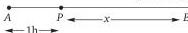
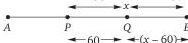
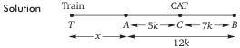

# Chapter 9: Time, Speed and Distance

## 1. Concept Map

```
TIME, SPEED AND DISTANCE
│
├── 1. Core Relationship (T × S = D)
│   ├── Proportionality (D const, T const, S const)
│   ├── Unit Conversions
│   └── Average Speed
│
├── 2. Relative Motion
│   ├── Opposite Direction (S₁ + S₂)
│   ├── Same Direction (S₁ − S₂)
│   └── To-and-Fro Motion (nth meeting)
│
├── 3. Trains
│   ├── Crossing Pole/Man (L_train)
│   ├── Crossing Bridge/Platform (L_train + L_obj)
│   └── Two Trains Crossing (L₁ + L₂)
│
├── 4. Boats and Streams
│   ├── Downstream (B + C)
│   ├── Upstream (B − C)
│   └── Still Water & Current Speed
│
├── 5. Races
│   ├── Startup/Headstart
│   ├── Dead Heat
│   └── Speed Ratio Method
│
├── 6. Circular Motion
│   ├── First Meeting (L/Relative Speed)
│   ├── Meeting at Start (LCM of lap times)
│   └── Distinct Meeting Points
│
└── 7. Clocks
    ├── Relative Speed (5.5°/min)
    ├── Coincidence (11 times/12h)
    ├── Right Angle (22 times/12h)
    └── Opposite (11 times/12h)
```

---

## 2. Foundations

### 2.1 The Fundamental Relation

The entire chapter rests on one equation:

$$ \text{Distance} = \text{Speed} \times \text{Time} $$

From this, we derive:

$$ \text{Speed} = \frac{\text{Distance}}{\text{Time}}, \quad \text{Time} = \frac{\text{Distance}}{\text{Speed}} $$

**Proportionality Relations** (critical for fast solving):

| Condition | Relation |
|---|---|
| Distance constant | $T \propto \frac{1}{S}$ |
| Time constant | $D \propto S$ |
| Speed constant | $D \propto T$ |

> **Key Insight:** When distance is constant, time and speed are inversely proportional. This is the basis of the **product constancy** method.

---

### 2.2 Unit Conversions

| Conversion | Factor |
|---|---|
| km/h → m/s | × $\frac{5}{18}$ |
| m/s → km/h | × $\frac{18}{5}$ |
| 1 mile | 1609.30 m = 1.6093 km |
| 1 km | 0.621 mile |
| 1 yard | 0.9144 m |
| 1 m | 1.0936 yards |

**Worked Examples:**

- $36 \text{ km/h} = 36 \times \frac{5}{18} = 10 \text{ m/s}$
- $20 \text{ m/s} = 20 \times \frac{18}{5} = 72 \text{ km/h}$
- $36 \text{ km/h} = 36 \times 0.621 = 22.37 \text{ mile/h}$

---

### 2.3 Average Speed

**General Formula:**

$$ \text{Average Speed} = \frac{\text{Total Distance}}{\text{Total Time}} $$

**Equal Distances (2 segments, speeds $x$, $y$):**

$$ \text{Average Speed} = \frac{2xy}{x+y} $$

**Equal Distances (3 segments, speeds $x$, $y$, $z$):**

$$ \text{Average Speed} = \frac{3xyz}{xy + yz + zx} $$

> **⚠️ Trap:** The $2xy/(x+y)$ formula applies **ONLY** when distances are equal. For unequal distances, always use Total Distance / Total Time.

**Example (Exp. 2):** Udai travels half journey by train at 120 km/h, half by car at 80 km/h.

- **Method 1 (Formula):** $\frac{2 \times 120 \times 80}{120 + 80} = \frac{19200}{200} = 96$ km/h
- **Method 2 (LCM):** Take distance = LCM(120, 80) = 240. Time = $\frac{120}{120} + \frac{120}{80} = 1 + 1.5 = 2.5$ h. Average = $\frac{240}{2.5} = 96$ km/h

---

## 3. Relative Motion

### 3.1 Basic Rules

| Direction | Relative Speed |
|---|---|
| Opposite directions | $S_A + S_B$ |
| Same direction | $S_A - S_B$ (positive difference) |

### 3.2 Meeting Problems

**Opposite Directions (Exp. 12):** P to Q = 700 km, A at 30 km/h, B at 40 km/h.

- Time to meet = $\frac{700}{30+40} = 10$ h
- Meeting point ratio: PM:MQ = 30:40 = 3:4
- MQ = $\frac{4}{7} \times 700 = 400$ km

**Same Direction Chase (Exp. 13):** P to Q = 800 km, A at 40 km/h starts 2 h earlier, B at 60 km/h.

- Head start = $40 \times 2 = 80$ km
- Time to overtake = $\frac{80}{60-40} = 4$ h
- Overtaking point = $4 \times 60 = 240$ km from P

### 3.3 To-and-Fro Motion

**Starting Towards Each Other:**
- 1st meeting: together cover $D$
- Each subsequent meeting: together cover $2D$ more
- **For nth meeting: total distance = $(2n-1)D$**

**Starting from Same End, Same Direction:**
- 1st meeting: together cover $2D$
- **For nth meeting: total distance = $n \times 2D$**

**Example (Exp. 14):** P to Q = 100 m, A = 20 m/s, B = 30 m/s, same start.

| Meeting | Total Distance | A's Distance | B's Distance | Time (s) |
|---|---|---|---|---|
| 1st | 200 m | 80 m | 120 m | 4 |
| 2nd | 400 m | 160 m | 240 m | 8 |
| 3rd | 600 m | 240 m | 360 m | 12 |
| 4th | 800 m | 320 m | 480 m | 16 |
| 5th | 1000 m | 400 m | 600 m | 20 |

---

## 4. Trains

### 4.1 Key Rules

| Scenario | Distance Covered |
|---|---|
| Crossing pole/man/tree | Train length only |
| Crossing bridge/platform | Train length + object length |
| Two trains crossing (opposite) | Sum of lengths, relative speed = sum of speeds |
| Two trains crossing (same direction) | Sum of lengths, relative speed = difference of speeds |
| Person in train crossing another train | Length of passing train only |

### 4.2 Worked Examples

**Exp. 19:** Train 150 m crosses tree in 10 s.
$$\text{Speed} = \frac{150}{10} = 15 \text{ m/s} = 54 \text{ km/h}$$

**Exp. 21:** Train 250 m crosses bridge 150 m in 20 s.
$$\text{Speed} = \frac{250+150}{20} = 20 \text{ m/s} = 72 \text{ km/h}$$

**Exp. 22:** Two trains (125 m + 175 m) cross in 10 s opposite. First train at 36 km/h = 10 m/s.
$$10 = \frac{300}{10 + x} \Rightarrow x = 20 \text{ m/s} = 72 \text{ km/h}$$

**Exp. 23:** Faster train 72 km/h, slower 27 km/h, faster length 100 m, cross in 20 s same direction.
$$\text{Relative speed} = 45 \text{ km/h} = \frac{25}{2} \text{ m/s}$$
$$20 = \frac{100 + x}{25/2} \Rightarrow x = 150 \text{ m}$$

---

## 5. Boats and Streams

### 5.1 Core Formulas

| Quantity | Formula |
|---|---|
| Downstream speed | $D = B + C$ |
| Upstream speed | $U = B - C$ (requires $B > C$) |
| Speed in still water | $\frac{D + U}{2}$ |
| Speed of current | $\frac{D - U}{2}$ |
| Equal distances time ratio | $\frac{T_{DS}}{T_{US}} = \frac{U}{D}$ |

### 5.2 Worked Examples

**Exp. 24:** Boat 5 km/h in still water, stream 1 km/h, total round trip 80 min.

- DS = 6 km/h, US = 4 km/h
- Speed ratio DS:US = 3:2, so time ratio = 2:3
- DS time = $\frac{2}{5} \times 80 = 32$ min
- Distance = $6 \times \frac{32}{60} = 3.2$ km

**Exp. 25:** Man rows 9 km/h in still water; upstream takes twice as long as downstream.

$$\frac{B+R}{B-R} = \frac{2}{1} \Rightarrow \frac{B}{R} = \frac{3}{1}$$
$$\frac{9}{R} = \frac{3}{1} \Rightarrow R = 3 \text{ km/h}$$

---

## 6. Races

### 6.1 Terminology

- **Startup/Headstart:** When a runner allows another to stay ahead in the same race
- **Dead heat:** When runners reach finishing line simultaneously
- **"A can give B a start of x m in y m race":** B runs x m less than A in same time

> **⚠️ Key Distinction:** There is a great difference between "can" and "gives."

> **💡 Nub of All Race Problems:** Throughout the race, runners always maintain the ratio of their speeds.

### 6.2 Core Method: Speed Ratio

**Exp. 1:** A gives B 200 m start, C 300 m start in 1 km race.

- A:B = 1000:800 = 5:4
- A:C = 1000:700 = 10:7
- B:C = 800:700 = 8:7
- When B runs 1000 m, C runs $\frac{7}{8} \times 1000 = 875$ m
- B gives C 125 m start

**Exp. 6:** A gives B start of 30 m or 10 seconds in 1 km, dead heat.

- B runs 30 m in 10 s → B's speed = 3 m/s
- **⚠️ Don't be confused that A's speed = 3 m/s**
- A:B = 1000:970 = 100:97

**Exp. 9:** Speeds A:B = 4:7, A loses by 270 m.

- When B runs 7 m, A runs 4 m → A loses by 3 m in 7 m race
- Race length = $270 \times \frac{7}{3} = 630$ m

---

## 7. Circular Motion

### 7.1 Key Rules

| Scenario | Formula |
|---|---|
| First meeting (opposite) | $\frac{\text{Track Length}}{S_1 + S_2}$ |
| First meeting (same direction) | $\frac{\text{Track Length}}{S_1 - S_2}$ |
| nth meeting (same direction) | $\frac{n \times \text{Track Length}}{S_1 - S_2}$ |
| nth meeting (opposite) | $\frac{n \times \text{Track Length}}{S_1 + S_2}$ |
| Meeting at starting point | LCM of individual lap times |

### 7.2 Worked Examples

**Exp. 1 (Same direction):** 600 m track, Arjun 75 m/s, Bhishma 45 m/s.

- First meeting: $\frac{600}{75-45} = 20$ s
- Tenth meeting: $\frac{10 \times 600}{30} = 200$ s

**Exp. 2 (Opposite directions):**

- First meeting: $\frac{600}{75+45} = 5$ s
- Tenth meeting: $\frac{10 \times 600}{120} = 50$ s

**Exp. 3 (Meeting at starting point):**

- Arjun lap time = $\frac{600}{75} = 8$ s
- Bhishma lap time = $\frac{600}{45} = \frac{40}{3}$ s
- LCM of 8 and $\frac{40}{3}$ = 40 s

### 7.3 Distinct Meeting Points

**Exp. 7:** Speeds ratio 3:5.

- Same direction: $5 - 3 = 2$ distinct points
- Opposite directions: $5 + 3 = 8$ distinct points

**Exp. 9 (Clock hands):** Hour hand 30°/h, minute hand 360°/h → ratio 1:12.

- Same direction: $12 - 1 = 11$ distinct points

---

## 8. Clocks

### 8.1 Key Setup

- Dial = circular track of 60 points
- Minute hand (MH) = 60 points/hour = 6°/min
- Hour hand (HH) = 5 points/hour = 0.5°/min
- **Relative speed of MH over HH = 55 points/hour = 5.5°/min**

### 8.2 Key Results

| Event | Frequency in 12 hours |
|---|---|
| Coincide | 11 times |
| Opposite (180°) | 11 times |
| Perpendicular (90°) | 22 times |

**Coincidence:** First at $\frac{60}{55} = \frac{12}{11}$ hours = 65 $\frac{5}{11}$ min. Every $\frac{12}{11}$ hours thereafter.

**Opposite:** First at $\frac{30}{55}$ h; then every $\frac{60}{55}$ h. Between 5 and 7 O'clock, 180° occurs only once (at exactly 6 O'clock).

**Perpendicular:** Two cases (MH ahead, HH ahead), each 11 times in 12 hours.

### 8.3 Worked Examples

**Exp. 4 (Coincidence between 2 and 3):**
- Gap at 2 O'clock = 10 points
- Time = $\frac{10}{55}$ h = 10 min 54 s → at 2:10:54

**Exp. 8 (Angle at 3:10):**
- MH: 10 × 6 = 60°
- HH: 90° + 10 × 0.5 = 95°
- Angle = 95° − 60° = 35°

**Exp. 9 (Angle at 7:35):**
- MH: 35 × 6 = 210°
- HH: 7 × 30 + 35 × 0.5 = 227.5°
- Angle = 17.5°

---

## 9. Fast CAT Methods

### 9.1 Product Constancy

When distance is constant, $S \times T = \text{constant}$.

**If speed changes by fraction $\frac{1}{n}$:**
- Speed increases by $\frac{1}{n}$ → Time decreases by $\frac{1}{n+1}$
- Speed decreases by $\frac{1}{n}$ → Time increases by $\frac{1}{n-1}$

**Exp. 7:** Speed 24 → 30 km/h (increase by $\frac{1}{4}$), time reduces by 1 hour.

- Time decreases by $\frac{1}{5}$ = 1 hour
- Original time = 5 × 1 = 5 hours
- Distance = 24 × 5 = 120 km

**Exp. 8:** 20 km/h → 4 min late; 25 km/h → 2 min early.

- Speed increase = 5 km/h = $\frac{1}{4}$ of 20
- Time decrease = 6 min (4 + 2)
- Time decreases by $\frac{1}{5}$ = 6 min → original time = 30 min
- Distance = $20 \times \frac{30}{60} = 10$ km

### 9.2 Speed Product Formula

$$S_1 \times S_2 = \text{Distance} \times \frac{S_1 - S_2}{t_1 - t_2}$$

**Exp. 6:** Distance = 80 km, speed increased by 4 km/h, saves 1 hour.

$$S_1 \times S_2 = 80 \times \frac{4}{1} = 320$$

Find factors of 320 differing by 4 → 16 and 20. Increased speed = 20 km/h.

### 9.3 Time Product Formula

$$t_1 \times t_2 = \text{Distance} \times \frac{t_1 - t_2}{S_1 - S_2}$$

### 9.4 Post-Meeting Speed Ratio

If A takes $t_A$ to cover MQ and B takes $t_B$ to cover MP after meeting:

$$\frac{S_A}{S_B} = \sqrt{\frac{t_B}{t_A}}$$

**Exp. 12 (v):** After meeting, A takes $\frac{400}{30}$ h, B takes $\frac{300}{40}$ h.

$$\frac{S_A}{S_B} = \sqrt{\frac{300/40}{400/30}} = \sqrt{\frac{9}{16}} = \frac{3}{4}$$

### 9.5 Accident Problems

**Exp. 10:** Train met accident 60 km from Anantpur. Completed remaining at $\frac{5}{6}$ speed, arrived 1 h 12 min late. Had accident been 60 km further, only 1 h late.

- Speed decreased by $\frac{1}{6}$ → time increased by $\frac{1}{5}$
- Case I: $\frac{1}{5}$ of normal time = 72 min → normal time for remaining = 6 h
- Case II: $\frac{1}{5}$ of normal time = 1 h → normal time for (x−60) km = 5 h
- **60 km at normal speed takes 1 hour → normal speed = 60 km/h**
- Total distance = 60 + 6 × 60 = 420 km




---

## 10. Worked Examples (Easy to Advanced)

### Level 1: Direct Application

**Problem:** Abhishek drives at 150 km/h for 3 hours.

$$\text{Distance} = 150 \times 3 = 450 \text{ km}$$

---

### Level 2: Ratio Method

**Problem:** Karan speed 40, Arjun speed 60. Ratio of speeds = 2:3, so ratio of times = 3:2.

**Generalisation:** If speeds of A, B, C, D are a:b:c:d, then times for same distance = $\frac{1}{a} : \frac{1}{b} : \frac{1}{c} : \frac{1}{d}$.

---

### Level 3: Product Constancy

**Problem:** Walking at $\frac{4}{5}$ speed, 15 min late. Usual time?

- Speed ratio = 4:5 → Time ratio = 5:4
- Difference = 1 part = 15 min
- Usual time = 4 × 15 = 60 min = 1 hour

---

### Level 4: Two Conditions

**Problem:** Speed reduced by 10 km/h → time increases by 40 h. Speed increased by 5 km/h → time decreases by 10 h.

$$40S - 10T = 400 \quad ...(i)$$
$$10S + 5T = 50 \quad ...(ii)$$

Solving: S = 25 km/h, T = 60 h, D = 1500 km.

---

### Level 5: Train and Cat in Tunnel

**Exp. 18:** Cat at $\frac{5}{12}$ of tunnel AB from entrance A. Train whistles; cat runs to either end.



Let train be x km from A, tunnel length = 12k, cat at 5k from A.

$$\frac{u}{v} = \frac{x}{5k} = \frac{x + 12k}{7k}$$

Solving: $\frac{x}{k} = \frac{30}{1}$, so $\frac{u}{v} = \frac{30}{5} = \frac{6}{1}$

**Alternative formula:** $\frac{u}{v} = \frac{7k + 5k}{7k - 5k} = \frac{6}{1}$

---

### Level 6: Circular Track with Multiple Runners

**Exp. 5:** Four runners (600 m, 45, 55, 65, 75 m/s, same direction).

- Duryodhana (fastest) meets Arjun: $\frac{600}{30} = 20$ s
- Meets Bhishma: $\frac{600}{20} = 30$ s
- Meets Chaitanya: $\frac{600}{10} = 60$ s
- LCM(20, 30, 60) = 60 s → first meeting at 60 s

---

### Level 7: Clock Angle

**Problem:** Angle at 3:10.

- MH: 10 × 6 = 60°
- HH: 90° + 10 × 0.5 = 95°
- Angle = 95° − 60° = 35°

---

## 11. Decision Rules

| Problem Type | First Step | Key Formula |
|---|---|---|
| Average speed (equal distances) | Check if distances equal | $\frac{2xy}{x+y}$ |
| Meeting (opposite) | Add speeds | $t = \frac{D}{S_1+S_2}$ |
| Meeting (same direction) | Subtract speeds | $t = \frac{D}{S_1-S_2}$ |
| Train crossing pole | Use train length only | $t = \frac{L}{S}$ |
| Train crossing bridge | Add lengths | $t = \frac{L_1+L_2}{S}$ |
| Boat upstream/downstream | Identify B and C | $B = \frac{D+U}{2}$ |
| Race with startup | Convert to speed ratio | $S_A:S_B = D_A:D_B$ |
| Circular track meeting | Check direction | $t = \frac{L}{S_1 \pm S_2}$ |
| Clock coincidence | Find gap in points | $t = \frac{\text{gap}}{55}$ h |
| Speed change, time change | Use product constancy | $S_1 \times t_1 = S_2 \times t_2$ |

---

## 12. Common Traps

1. **Average speed ≠ arithmetic mean of speeds.** Always use Total Distance / Total Time unless distances are equal.

2. **Unit conversion errors.** km/h → m/s: multiply by $\frac{5}{18}$. m/s → km/h: multiply by $\frac{18}{5}$.

3. **Speed ratio vs time ratio.** When distance is constant, time ratio is the **inverse** of speed ratio.

4. **"Can give" vs "gives" in races.** "Can give" implies potential; "gives" implies actual.

5. **Train crossing pole vs bridge.** Pole = train length only. Bridge = train + bridge length.

6. **Clock relative speed.** It's 5.5°/min, not 6°/min (minute hand alone is 6°/min).

7. **Between 11 and 1 O'clock**, hands coincide only once (at 12).

8. **Between 5 and 7 O'clock**, 180° occurs only once (at exactly 6 O'clock).

9. **At 3 and 9 O'clock** hands are at right angles; between 2–4 and 8–10, only 3 times per 2-hour span.

10. **Product constancy direction.** If speed increases by $\frac{1}{n}$, time decreases by $\frac{1}{n+1}$, NOT $\frac{1}{n}$.

11. **In circular motion same direction**, faster body must have a lead of n rounds for nth meeting.

12. **In circular motion opposite directions**, together they cover n rounds for nth meeting.

---

## 13. Timed Strategy

### 13.1 Suggested Time Allocation (for 2-minute questions)

| Stage | Time | Action |
|---|---|---|
| Read & Identify | 10–15 s | Identify problem type, note given values |
| Select Method | 5–10 s | Choose formula or shortcut |
| Execute | 60–90 s | Solve step-by-step |
| Verify | 10–15 s | Check units, sanity check answer |

### 13.2 Speed-Building Techniques

1. **Memorise unit conversions** ($\frac{5}{18}$, $\frac{18}{5}$) — no time wasted on derivation.

2. **Product constancy for speed-time problems** — avoids quadratic equations.

3. **LCM method for average speed** — avoids fractions.

4. **Ratio method for races** — always convert to speed ratio first.

5. **For clock problems**, use the "points" system (60 points = 360°) rather than degrees.

6. **For circular motion**, use LCM of lap times for starting-point meetings.

---

## 14. Final Revision Sheet

### Core Formulas

| Concept | Formula |
|---|---|
| Distance | $D = S \times T$ |
| Speed | $S = \frac{D}{T}$ |
| Time | $T = \frac{D}{S}$ |
| Average speed (equal distances) | $\frac{2xy}{x+y}$ |
| Average speed (3 equal segments) | $\frac{3xyz}{xy+yz+zx}$ |
| Relative speed (opposite) | $S_1 + S_2$ |
| Relative speed (same) | $S_1 - S_2$ |
| nth meeting (to-and-fro, opposite start) | $(2n-1)D$ |
| nth meeting (to-and-fro, same start) | $2nD$ |
| Train crossing pole | $t = \frac{L}{S}$ |
| Train crossing bridge | $t = \frac{L+B}{S}$ |
| Two trains crossing | $t = \frac{L_1+L_2}{S_1 \pm S_2}$ |
| Still water speed | $\frac{D+U}{2}$ |
| Current speed | $\frac{D-U}{2}$ |
| Post-meeting speed ratio | $\frac{S_A}{S_B} = \sqrt{\frac{t_B}{t_A}}$ |
| Clock relative speed | 5.5°/min = 55 points/h |
| Clock coincidence in 12 h | 11 times |
| Clock right angle in 12 h | 22 times |
| Clock opposite in 12 h | 11 times |

### Key Numbers to Memorise

- 1 km/h = $\frac{5}{18}$ m/s
- 1 m/s = $\frac{18}{5}$ km/h
- Hands coincide every $65\frac{5}{11}$ min
- Hands opposite every $65\frac{5}{11}$ min (starting from 6:00)
- Hands at right angle every $32\frac{8}{11}$ min (approximately)

### Quick Decision Chart

```
Is distance constant?
├── YES → Use product constancy (S₁T₁ = S₂T₂)
└── NO → Is time constant?
        ├── YES → Distance ∝ Speed
        └── NO → Is speed constant?
                ├── YES → Distance ∝ Time
                └── NO → Use Total D / Total T
```

---

*This note covers all core concepts from Chapter 9 of Quantitative Aptitude Quantum CAT by Sarvesh K. Verma. Practice the exercise sets from the book to reinforce these methods.*
