# Chapter 11: Trigonometry — Complete Study Notes

---

## 1. Concept Map

```
TRIGONOMETRY
│
├── 1. ANGLES & MEASURES
│   ├── Sexagesimal (degrees, minutes, seconds)
│   ├── Centesimal (grades)
│   └── Circular (radians) ← π rad = 180°
│
├── 2. TRIGONOMETRIC RATIOS
│   ├── sin, cos, tan, cosec, sec, cot
│   ├── Fundamental identities
│   ├── Sign conventions (ASTC rule)
│   └── Standard values (0°, 30°, 45°, 60°, 90°)
│
├── 3. FORMULAE
│   ├── Sum & difference of angles
│   ├── Product-to-sum & sum-to-product
│   ├── Multiple & sub-multiple angles
│   └── Negative & associated angles
│
├── 4. PROPERTIES OF TRIANGLES
│   ├── Law of sines
│   ├── Law of cosines
│   ├── Area formulas (incl. Hero's formula)
│   ├── Circumradius & inradius
│   └── Segment of circle
│
└── 5. HEIGHT & DISTANCE
    ├── Angle of elevation
    ├── Angle of depression
    └── Application problems
```

---

## 2. Foundations — What You Must Know Cold

### 2.1 Angle Basics (page 546)

An angle is traced by the rotation of a line from an **initial position** to a **terminal position**.

- **O** = vertex
- **OX** = initial side
- **OP** = terminal side

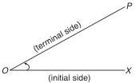

**Sign convention** (page 546):
- **Counter-clockwise rotation** → positive angle
- **Clockwise rotation** → negative angle

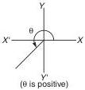
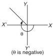

**Quadrants** (page 547): Two perpendicular lines divide the plane into 4 quadrants, numbered counter-clockwise.

| Quadrant | Region | Sign of sin | Sign of cos | Sign of tan |
|----------|--------|-------------|-------------|-------------|
| 1st | XOY | + | + | + |
| 2nd | YOX′ | + | − | − |
| 3rd | X′OY′ | − | − | + |
| 4th | Y′OX | − | + | − |

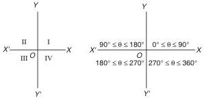

> **Note**: θ > 360° if the revolving line completes a full revolution and continues past the initial position.

---

### 2.2 Measures of Angles (page 547)

**Three systems:**

| System | Unit | Conversion |
|--------|------|------------|
| Sexagesimal (Common/English) | degrees | 1 right angle = 90°, 1° = 60′, 1′ = 60″ |
| Centesimal | grades | 1 right angle = 100^g, 1^g = 100′, 1′ = 100″ |
| Circular | radians | 1 radian = angle subtended by arc = radius |

**Definition of radian**: A radian is the angle subtended at the centre of a circle by an arc whose length equals the radius.

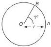

**Master conversions:**
$$\pi \text{ radian} = 180°$$
$$1° = \frac{\pi}{180} \text{ radian}$$

**Arc length:** $s = r\theta$ where $\theta$ is in radians

**Sector area:**
- Area $= \frac{1}{2}r^2\theta$
- Area $= \frac{1}{2}rs$ (where $s$ = arc length)

---

## 3. Trigonometric Ratios — The Core

### 3.1 Basic Ratios (page 549)

For a right triangle with angle θ:

- $\sin\theta = \frac{P}{H}$ (Perpendicular/Hypotenuse)
- $\cos\theta = \frac{B}{H}$ (Base/Hypotenuse)
- $\tan\theta = \frac{P}{B}$ (Perpendicular/Base)
- $\cosec\theta = \frac{H}{P}$
- $\sec\theta = \frac{H}{B}$
- $\cot\theta = \frac{B}{P}$

**Memory aid**: "Pandit Badri Prasad / Hari Hari Bol" — P/B, B/H, P/H

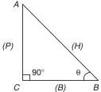

### 3.2 Reciprocal Identities

$$\sin\theta \cdot \cosec\theta = 1$$
$$\cos\theta \cdot \sec\theta = 1$$
$$\tan\theta \cdot \cot\theta = 1$$
$$\tan\theta = \frac{\sin\theta}{\cos\theta}$$
$$\cot\theta = \frac{\cos\theta}{\sin\theta}$$

> ⚠️ **CRITICAL NOTATION WARNING**: $\sin^{-1}\theta \neq (\sin\theta)^{-1}$. The notation $\sin^{-1}\theta$ means inverse sine (arcsin), NOT reciprocal. However, $(\sin\theta)^2 = \sin^2\theta$ is valid.

### 3.3 Fundamental Identities

$$\sin^2\theta + \cos^2\theta = 1$$
$$\sec^2\theta - \tan^2\theta = 1$$
$$\cosec^2\theta - \cot^2\theta = 1$$

---

### 3.4 Sign of Trigonometric Functions — ASTC Rule (page 549)

**Memory aid**: "Add Sugar To Coffee"

| Quadrant | Positive functions |
|----------|-------------------|
| 1st (All) | All |
| 2nd (Sin) | sin, cosec |
| 3rd (Tan) | tan, cot |
| 4th (Cos) | cos, sec |

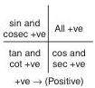
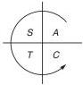

---

### 3.5 Standard Values Table (page 549)

| Angle | 0° | 30° | 45° | 60° | 90° | 180° |
|-------|-----|------|------|------|------|------|
| sin | 0 | 1/2 | 1/√2 | √3/2 | 1 | 0 |
| cos | 1 | √3/2 | 1/√2 | 1/2 | 0 | −1 |
| tan | 0 | 1/√3 | 1 | √3 | ∞ | 0 |
| cosec | ∞ | 2 | √2 | 2/√3 | 1 | ∞ |
| sec | 1 | 2/√3 | √2 | 2 | ∞ | −1 |
| cot | ∞ | √3 | 1 | 1/√3 | 0 | ∞ |

**Quick memory patterns:**
- sin: 0, 1/2, 1/√2, √3/2, 1 → numerators are √0, √1, √2, √3, √4 over 2
- cos: reverse of sin
- tan = sin/cos

---

### 3.6 Range of Trigonometric Ratios (page 550)

$$-1 \leq \sin\theta \leq 1 \quad (|\sin\theta| \leq 1)$$
$$-1 \leq \cos\theta \leq 1 \quad (|\cos\theta| \leq 1)$$
$$|\cosec\theta| \geq 1$$
$$|\sec\theta| \geq 1$$
$$-\infty < \tan\theta < \infty$$

---

### 3.7 Increasing/Decreasing Behaviour (page 550)

| Quadrant | sin θ | cos θ | tan θ |
|----------|-------|-------|-------|
| 1st | increases 0→1 | decreases 1→0 | increases 0→∞ |
| 2nd | decreases 1→0 | decreases 0→−1 | increases −∞→0 |
| 3rd | decreases 0→−1 | increases −1→0 | increases 0→∞ |
| 4th | increases −1→0 | increases 0→1 | increases −∞→0 |

---

## 4. Formulae — Complete Reference

### 4.1 Negative and Associated Angles (page 551)

| Angle | −θ | (90−θ) | (90+θ) | (180−θ) | (180+θ) | (360−θ) | (360+θ) |
|-------|------|---------|---------|----------|----------|----------|----------|
| sin | −sinθ | cosθ | cosθ | sinθ | −sinθ | −sinθ | sinθ |
| cos | cosθ | sinθ | −sinθ | −cosθ | −cosθ | cosθ | cosθ |
| tan | −tanθ | cotθ | −cotθ | −tanθ | tanθ | −tanθ | tanθ |

**Key patterns:**
- (90° ± θ): sin ↔ cos, tan ↔ cot (co-function change)
- (180° ± θ): function stays same, sign depends on quadrant
- (360° − θ): same as −θ

---

### 4.2 Sum and Difference Formulas (page 551)

$$\sin(A+B) = \sin A \cos B + \cos A \sin B$$
$$\sin(A-B) = \sin A \cos B - \cos A \sin B$$
$$\cos(A+B) = \cos A \cos B - \sin A \sin B$$
$$\cos(A-B) = \cos A \cos B + \sin A \sin B$$
$$\tan(A+B) = \frac{\tan A + \tan B}{1 - \tan A \tan B}$$
$$\tan(A-B) = \frac{\tan A - \tan B}{1 + \tan A \tan B}$$

**Derived identities:**
$$\sin(A+B) \cdot \sin(A-B) = \sin^2 A - \sin^2 B = \cos^2 B - \cos^2 A$$
$$\cos(A+B) \cdot \cos(A-B) = \cos^2 A - \sin^2 B = \cos^2 B - \sin^2 A$$

**Cot formulas:**
$$\cot(A+B) = \frac{\cot A \cot B - 1}{\cot A + \cot B}$$
$$\cot(A-B) = \frac{\cot A \cot B + 1}{\cot B - \cot A}$$

---

### 4.3 Product-to-Sum Formulas

$$2\sin A \cos B = \sin(A+B) + \sin(A-B)$$
$$2\cos A \sin B = \sin(A+B) - \sin(A-B)$$
$$2\cos A \cos B = \cos(A+B) + \cos(A-B)$$
$$2\sin A \sin B = \cos(A-B) - \cos(A+B)$$

---

### 4.4 Sum-to-Product Formulas

$$\sin C + \sin D = 2\sin\left(\frac{C+D}{2}\right) \cdot \cos\left(\frac{C-D}{2}\right)$$
$$\sin C - \sin D = 2\cos\left(\frac{C+D}{2}\right) \cdot \sin\left(\frac{C-D}{2}\right)$$
$$\cos C + \cos D = 2\cos\left(\frac{C+D}{2}\right) \cdot \cos\left(\frac{C-D}{2}\right)$$
$$\cos C - \cos D = 2\sin\left(\frac{C+D}{2}\right) \cdot \sin\left(\frac{D-C}{2}\right)$$

---

### 4.5 Multiple and Sub-multiple Angles (page 552)

**Double angle:**
$$\sin 2A = 2\sin A \cos A = \frac{2\tan A}{1 + \tan^2 A}$$
$$\cos 2A = \cos^2 A - \sin^2 A = 1 - 2\sin^2 A = 2\cos^2 A - 1 = \frac{1 - \tan^2 A}{1 + \tan^2 A}$$
$$\tan 2A = \frac{2\tan A}{1 - \tan^2 A}$$

**Triple angle:**
$$\sin 3A = 3\sin A - 4\sin^3 A$$
$$\cos 3A = 4\cos^3 A - 3\cos A$$
$$\tan 3A = \frac{3\tan A - \tan^3 A}{1 - 3\tan^2 A}$$

**Sub-multiple (half-angle):**
$$\sin A = 2\sin\left(\frac{A}{2}\right) \cdot \cos\left(\frac{A}{2}\right) = \frac{2\tan(A/2)}{1 + \tan^2(A/2)}$$
$$\cos A = \cos^2\left(\frac{A}{2}\right) - \sin^2\left(\frac{A}{2}\right)$$
$$\tan A = \frac{2\tan(A/2)}{1 - \tan^2(A/2)}$$

---

## 5. Properties of Triangles (page 553)

**Notation**: angles A, B, C; sides a, b, c (opposite to respective angles); area Δ; semiperimeter s = (a+b+c)/2; circumradius R; inradius r

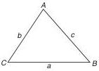

### 5.1 Law of Sines

$$\frac{a}{\sin A} = \frac{b}{\sin B} = \frac{c}{\sin C}$$

### 5.2 Law of Cosines

$$a^2 = b^2 + c^2 - 2bc \cdot \cos A$$
$$b^2 = c^2 + a^2 - 2ca \cdot \cos B$$
$$c^2 = a^2 + b^2 - 2ab \cdot \cos C$$

### 5.3 Area of Triangle

$$\Delta = \frac{1}{2}bc \cdot \sin A = \frac{1}{2}ca \cdot \sin B = \frac{1}{2}ab \cdot \sin C$$

**Hero's formula:**
$$\Delta = \sqrt{s(s-a)(s-b)(s-c)}$$

### 5.4 Area of Segment of Circle

Area of segment APB = Area of sector AOB − Area of ΔAOB

$$\text{Area} = \frac{1}{2}r^2\theta - \frac{1}{2}r^2\sin\theta = \frac{1}{2}r^2(\theta - \sin\theta)$$

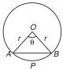

### 5.5 Circumradius (R)

$$R = \frac{a}{2\sin A} = \frac{b}{2\sin B} = \frac{c}{2\sin C}$$
$$R = \frac{abc}{4\Delta}$$

### 5.6 Inradius (r)

$$r = \frac{\Delta}{s}$$

---

## 6. Height and Distance (page 554)

### 6.1 Angle of Elevation

The angle ∠OPM when a person at P looks at an object O at a **higher** level.

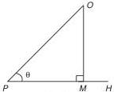

### 6.2 Angle of Depression

The angle ∠OPM when a person at P looks down at an object O at a **lower** level.

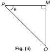

> **KEY FACT**: The angle of elevation of one position as seen from another = angle of depression of the latter as seen from the former.

---

## 7. Worked Examples — Easy to Advanced

### Example 1: Angle Conversion (page 547)

**Problem**: Convert 45° to radians and grades.

**Solution**:
- Radians: $45° \times \frac{\pi}{180°} = \frac{\pi}{4}$ rad
- Grades: $45° \times \frac{100^g}{90°} = 50^g$

**Answer**: 45° = π/4 rad = 50 grade

---

### Example 2: Arc Length (page 548)

**Problem**: A circle has diameter 60 m. A chord of length 30 m subtends an angle at the centre. Find the minor and major arcs.

**Solution**:
- r = 30 m
- ΔOAB is equilateral (OA = OB = AB = 30 m)
- ∠AOB = 60° = π/3 rad
- Minor arc = rθ = 30 × (π/3) = 10π = 31.42 m
- Major arc = 2πr − minor arc = 60π − 10π = 50π = 157.1 m

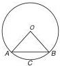

---

### Example 3: Sector Area (page 548)

**Problem**: The area of a sector equals the square of its arc length. Find the angle.

**Solution**:
- Sector area = ½r²x
- Arc length = rx
- Given: ½r²x = (rx)² = r²x²
- ½r²x = r²x²
- ½ = x (dividing by r²x, assuming x ≠ 0)
- **x = ½ radian**

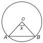

---

### Example 4: Ratio of Radii (page 548)

**Problem**: Two arcs of equal length subtend angles of 45° and 60° at their centres. Find the ratio of radii.

**Solution**:
- s₁ = r₁(π/4), s₂ = r₂(π/3)
- Since s₁ = s₂: r₁(π/4) = r₂(π/3)
- r₁/r₂ = (π/3)/(π/4) = 4/3
- **r₁ : r₂ = 4 : 3**

---

### Example 5: Identity Simplification (page 550)

**Problem**: Simplify $\frac{\sec^2\theta - 1}{\tan^2\theta}$

**Solution**:
- Using $\sec^2\theta - \tan^2\theta = 1$, we get $\sec^2\theta - 1 = \tan^2\theta$
- $\frac{\sec^2\theta - 1}{\tan^2\theta} = \frac{\tan^2\theta}{\tan^2\theta} = 1$

**Answer**: 1

---

### Example 6: Sum of Angles (page 551)

**Problem**: If A + B = 45°, find tanA + tanB + tanA·tanB.

**Solution**:
- $\tan(A+B) = \frac{\tan A + \tan B}{1 - \tan A \tan B}$
- $\tan 45° = 1 = \frac{\tan A + \tan B}{1 - \tan A \tan B}$
- $\tan A + \tan B = 1 - \tan A \tan B$
- $\tan A + \tan B + \tan A \tan B = 1$

**Answer**: 1

---

### Example 7: Max/Min of Expression (page 551)

**Problem**: Find the maximum and minimum values of 7cosθ + 24sinθ.

**Solution**:
- For $a\cos\theta + b\sin\theta$, max = $\sqrt{a^2 + b^2}$, min = $-\sqrt{a^2 + b^2}$
- $\sqrt{7^2 + 24^2} = \sqrt{49 + 576} = \sqrt{625} = 25$
- **Max = 25, Min = −25**

---

### Example 8: Double Angle (page 552)

**Problem**: If sinθ = 4/5, find sin2θ.

**Solution**:
- $\cos\theta = \sqrt{1 - \sin^2\theta} = \sqrt{1 - 16/25} = \sqrt{9/25} = 3/5$
- $\sin 2\theta = 2\sin\theta\cos\theta = 2 \times \frac{4}{5} \times \frac{3}{5} = \frac{24}{25}$

**Answer**: 24/25

---

### Example 9: Triangle Properties (page 553)

**Problem**: In a triangle, angles are in ratio 1:2:3 and R = 10 cm. Find the sides.

**Solution**:
- Angles: x + 2x + 3x = 180° → x = 30°
- Angles: 30°, 60°, 90°
- Using $a = 2R\sin A$:
  - a = 2(10)(sin 30°) = 20(1/2) = 10
  - b = 2(10)(sin 60°) = 20(√3/2) = 10√3
  - c = 2(10)(sin 90°) = 20(1) = 20
- **Sides: 10, 10√3, 20**

---

### Example 10: Height and Distance (page 554)

**Problem**: A tower is 180 m high. The angle of depression of a cat on the ground is 30°. Find the distance of the cat from the tower.

**Solution**:
- Angle of depression = 30° → angle of elevation from cat to tower top = 30°
- $\tan 30° = \frac{180}{PC}$
- $PC = \frac{180}{\tan 30°} = \frac{180}{1/\sqrt{3}} = 180\sqrt{3} = 311.76$ m

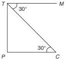

---

### Example 11: Two-Position Problem (page 554)

**Problem**: A tree across a river subtends an angle of 60° at a point. After retreating 40 m, it subtends 30°. Find the height of the tree and the breadth of the river.

**Solution**:
- Let height = h, river breadth = x
- From first position: $\tan 60° = \frac{h}{x}$ → $h = x\sqrt{3}$
- From second position: $\tan 30° = \frac{h}{x+40}$ → $h = \frac{x+40}{\sqrt{3}}$
- Equating: $x\sqrt{3} = \frac{x+40}{\sqrt{3}}$
- $3x = x + 40$ → $2x = 40$ → $x = 20$ m
- $h = 20\sqrt{3} = 34.64$ m

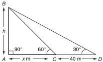

---

### Example 12: Boat Approaching (page 555)

**Problem**: A boat approaching a cliff changes the angle of depression from 30° to 60° in 10 minutes. How much longer will it take to reach the shore?

**Solution**:
- Let height of cliff = h, initial distance = d₁, final distance = d₂
- $\tan 30° = \frac{h}{d_1}$ → $d_1 = h\sqrt{3}$
- $\tan 60° = \frac{h}{d_2}$ → $d_2 = \frac{h}{\sqrt{3}}$
- Distance covered in 10 min = $d_1 - d_2 = h\sqrt{3} - \frac{h}{\sqrt{3}} = \frac{2h}{\sqrt{3}}$
- Remaining distance = $d_2 = \frac{h}{\sqrt{3}}$
- Time = 10 × (remaining/travelled) = 10 × (1/2) = **5 minutes**

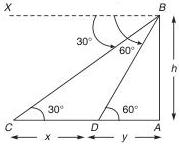

---

### Example 13: Aeroplane Problem (page 555)

**Problem**: An aeroplane flying at constant height is observed from two places 10 km apart. The angles of elevation are 60° and 30°. Find the height in both cases (same side and opposite sides).

**Solution**:

**Case 1 (both on same side)**:
- $\tan 60° = \frac{h}{x}$ → $h = x\sqrt{3}$
- $\tan 30° = \frac{h}{x+10}$ → $h = \frac{x+10}{\sqrt{3}}$
- $x\sqrt{3} = \frac{x+10}{\sqrt{3}}$ → $3x = x + 10$ → $x = 5$
- $h = 5\sqrt{3} = 8.66$ km

**Case 2 (opposite sides)**:
- $\tan 60° = \frac{h}{x}$ → $h = x\sqrt{3}$
- $\tan 30° = \frac{h}{10-x}$ → $h = \frac{10-x}{\sqrt{3}}$
- $x\sqrt{3} = \frac{10-x}{\sqrt{3}}$ → $3x = 10 - x$ → $x = 2.5$
- $h = 2.5\sqrt{3} = 4.33$ km

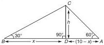
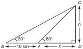

---

## 8. Fast CAT Methods & Decision Rules

### 8.1 Quick Recognition Patterns

| Pattern | Method |
|---------|--------|
| $a\sin\theta + b\cos\theta$ | Max = $\sqrt{a^2+b^2}$, Min = $-\sqrt{a^2+b^2}$ |
| $\sin^2\theta + \cos^2\theta$ | Always = 1 |
| $\sec^2\theta - \tan^2\theta$ | Always = 1 |
| $\cosec^2\theta - \cot^2\theta$ | Always = 1 |
| A + B = 45° | tanA + tanB + tanA·tanB = 1 |
| A + B + C = 180° | tanA + tanB + tanC = tanA·tanB·tanC |
| $\sin^6\theta + \cos^6\theta$ | $1 - 3\sin^2\theta\cos^2\theta$ |
| $\sin^4\theta + \cos^4\theta$ | $1 - 2\sin^2\theta\cos^2\theta$ |

### 8.2 Decision Tree for Problems

```
Is it a height & distance problem?
├── YES → Draw right triangle, identify known/unknown
│        Use tan = opposite/adjacent (most common)
│        Check if two positions → set up two equations
│
└── NO → Is it an identity problem?
        ├── YES → Convert everything to sin & cos
        │         Look for fundamental identities
        │         Try to factor or combine terms
        │
        └── NO → Is it a triangle problem?
                ├── YES → Use sine law or cosine law
                │         Check if Hero's formula applies
                │
                └── NO → Is it a max/min problem?
                        ├── YES → Use √(a²+b²) formula
                        └── NO → Standard value substitution
```

### 8.3 Substitution Shortcuts

When stuck, try these standard substitutions:

- **θ = 30°, 45°, 60°** — for identity verification
- **A = B = 45°** — for sum/difference formulas
- **A = 30°, B = 60°** — for triangle problems
- **x = 1** — for algebraic trig expressions

---

## 9. Common Traps & How to Avoid Them

### Trap 1: Notation Confusion
> ⚠️ $\sin^{-1}\theta \neq \frac{1}{\sin\theta}$

**Avoid**: Remember $\sin^{-1}$ means inverse function (arcsin), while $(\sin\theta)^{-1} = \cosec\theta$.

---

### Trap 2: Radian vs Degree Mix-up
> ⚠️ Always check whether angles are in radians or degrees.

**Avoid**: When using $s = r\theta$, θ MUST be in radians. Convert first.

---

### Trap 3: Sign Errors in Quadrants
> ⚠️ Forgetting the sign of trig functions in different quadrants.

**Avoid**: Always apply ASTC rule. When θ is in 2nd quadrant, sin is positive but cos and tan are negative.

---

### Trap 4: tan 90° = ∞
> ⚠️ tan 90° is undefined (approaches infinity).

**Avoid**: Never write tan 90° = some finite value. In problems, this means the line is vertical.

---

### Trap 5: Angle of Elevation = Angle of Depression
> ⚠️ These are equal only when viewing the same point from two positions.

**Avoid**: Draw the diagram carefully. The angle of elevation from A to B equals the angle of depression from B to A.

---

### Trap 6: Source Errors to Be Aware Of

The source contains a few known errors:

1. **Q28 (Level 01)**: Max of (cosθ − sinθ) is stated as 1, but the correct value is √2.
2. **Q2 (Ex 11.3)**: tan 75° standard value is 2 + √3, not (√3+1)/(2√2).
3. **Q7 (Ex 11.4)**: Answer key shows x³ + 1/x² but correct is x³ + 1/x³.

---

### Trap 7: Hero's Formula Semi-perimeter
> ⚠️ s = (a+b+c)/2, NOT (a+b+c).

**Avoid**: Always divide by 2 when computing s.

---

### Trap 8: Segment Area
> ⚠️ Segment area = sector − triangle, with θ in radians.

**Avoid**: $\text{Area} = \frac{1}{2}r^2(\theta - \sin\theta)$ — θ must be in radians.

---

## 10. Timed Strategy for CAT

### 10.1 Time Allocation

| Problem Type | Time Budget | Frequency in CAT |
|--------------|-------------|------------------|
| Identity simplification | 30–45 sec | Medium |
| Height & distance | 45–60 sec | High |
| Triangle properties | 45–60 sec | Medium |
| Max/min values | 20–30 sec | Low |
| Angle conversion | 15–20 sec | Low |

### 10.2 Attack Plan

**Step 1 (0–10 sec)**: Identify problem type
- Look for keywords: "elevation", "depression" → height & distance
- Look for "triangle" → sine/cosine law
- Look for "max/min" → √(a²+b²) formula
- Pure expressions → identity work

**Step 2 (10–20 sec)**: Write down the key formula
- Don't try to solve mentally — write it out

**Step 3 (20–45 sec)**: Substitute and simplify
- Use standard values where possible
- Look for cancellation patterns

**Step 4 (45–60 sec)**: Verify
- Check quadrant signs
- Check units (radians vs degrees)
- Check if answer makes sense (height can't be negative, etc.)

### 10.3 When to Skip

Skip a trigonometry problem if:
- You don't recognize the formula needed within 20 seconds
- The problem involves multiple nested identities with no obvious path
- Height & distance problem with 3+ unknowns and no clear relationship

---

## 11. Final Revision Sheet

### Essential Formulas — Quick Recap

**Conversions:**
$$\pi \text{ rad} = 180°$$
$$s = r\theta, \quad \text{Sector Area} = \frac{1}{2}r^2\theta$$

**Fundamental Identities:**
$$\sin^2\theta + \cos^2\theta = 1$$
$$\sec^2\theta - \tan^2\theta = 1$$
$$\cosec^2\theta - \cot^2\theta = 1$$

**Sum/Difference:**
$$\sin(A \pm B) = \sin A \cos B \pm \cos A \sin B$$
$$\cos(A \pm B) = \cos A \cos B \mp \sin A \sin B$$
$$\tan(A \pm B) = \frac{\tan A \pm \tan B}{1 \mp \tan A \tan B}$$

**Double Angle:**
$$\sin 2A = 2\sin A \cos A$$
$$\cos 2A = \cos^2 A - \sin^2 A = 1 - 2\sin^2 A = 2\cos^2 A - 1$$
$$\tan 2A = \frac{2\tan A}{1 - \tan^2 A}$$

**Triple Angle:**
$$\sin 3A = 3\sin A - 4\sin^3 A$$
$$\cos 3A = 4\cos^3 A - 3\cos A$$

**Product-to-Sum:**
$$2\sin A \cos B = \sin(A+B) + \sin(A-B)$$
$$2\cos A \cos B = \cos(A+B) + \cos(A-B)$$
$$2\sin A \sin B = \cos(A-B) - \cos(A+B)$$

**Sum-to-Product:**
$$\sin C + \sin D = 2\sin\frac{C+D}{2} \cdot \cos\frac{C-D}{2}$$
$$\cos C + \cos D = 2\cos\frac{C+D}{2} \cdot \cos\frac{C-D}{2}$$

**Triangle Laws:**
$$\frac{a}{\sin A} = \frac{b}{\sin B} = \frac{c}{\sin C} = 2R$$
$$a^2 = b^2 + c^2 - 2bc\cos A$$
$$\Delta = \frac{1}{2}bc\sin A = \sqrt{s(s-a)(s-b)(s-c)}$$
$$R = \frac{abc}{4\Delta}, \quad r = \frac{\Delta}{s}$$

**Max/Min:**
$$-\sqrt{a^2+b^2} \leq a\sin\theta + b\cos\theta \leq \sqrt{a^2+b^2}$$

**Segment Area:**
$$\text{Area} = \frac{1}{2}r^2(\theta - \sin\theta)$$

---

### Standard Values — Must Memorize

| Angle | sin | cos | tan |
|-------|-----|-----|-----|
| 0° | 0 | 1 | 0 |
| 30° | 1/2 | √3/2 | 1/√3 |
| 45° | 1/√2 | 1/√2 | 1 |
| 60° | √3/2 | 1/2 | √3 |
| 90° | 1 | 0 | ∞ |

---

### Key Results Worth Remembering

1. If A + B = 45°, then tanA + tanB + tanA·tanB = 1
2. If A + B + C = 180°, then tanA + tanB + tanC = tanA·tanB·tanC
3. $\sin^6\theta + \cos^6\theta = 1 - 3\sin^2\theta\cos^2\theta$
4. $\sin^4\theta + \cos^4\theta = 1 - 2\sin^2\theta\cos^2\theta$
5. $\sin 15° = \frac{\sqrt{3}-1}{2\sqrt{2}}$, $\sin 75° = \frac{\sqrt{3}+1}{2\sqrt{2}}$
6. $\sin 22.5° = \frac{\sqrt{2-\sqrt{2}}}{2}$
7. $\cos 36° = \frac{\sqrt{5}+1}{4}$ (golden ratio connection)
8. $\tan 75° = 2 + \sqrt{3}$, $\tan 15° = 2 - \sqrt{3}$

---

### Height & Distance — Standard Setup

For a tower of height h at distance d:
$$\tan\theta = \frac{h}{d}$$

**Two-position problems** (same side):
- Position 1: $\tan\alpha = \frac{h}{x}$
- Position 2: $\tan\beta = \frac{h}{x+d}$
- Solve simultaneously

**Two-position problems** (opposite sides):
- Position 1: $\tan\alpha = \frac{h}{x}$
- Position 2: $\tan\beta = \frac{h}{d-x}$
- Solve simultaneously

---

### Final Words

Trigonometry in CAT is rarely tested directly. When it appears, it's usually:
1. A height & distance problem (most common)
2. An identity simplification (quick marks if you know formulas)
3. A triangle property application

**Priority order for preparation:**
1. Height & distance (highest ROI)
2. Standard values & identities (quick wins)
3. Triangle properties (moderate ROI)
4. Multiple/sub-multiple angles (low ROI but useful for shortcuts)

Master the standard values table and the fundamental identities first. Everything else builds on these.
