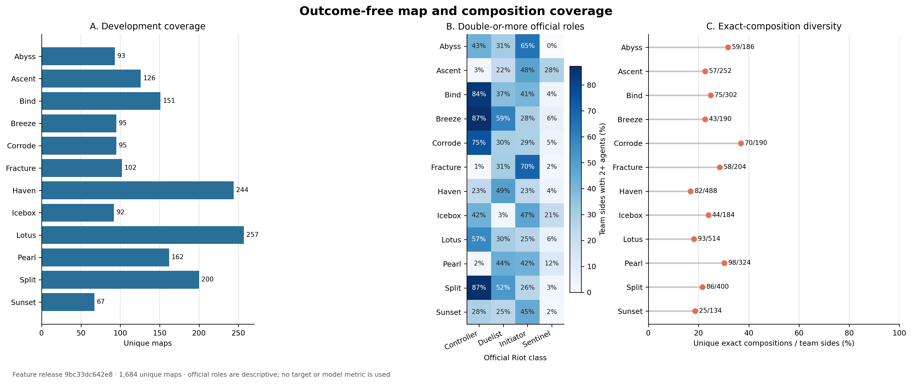
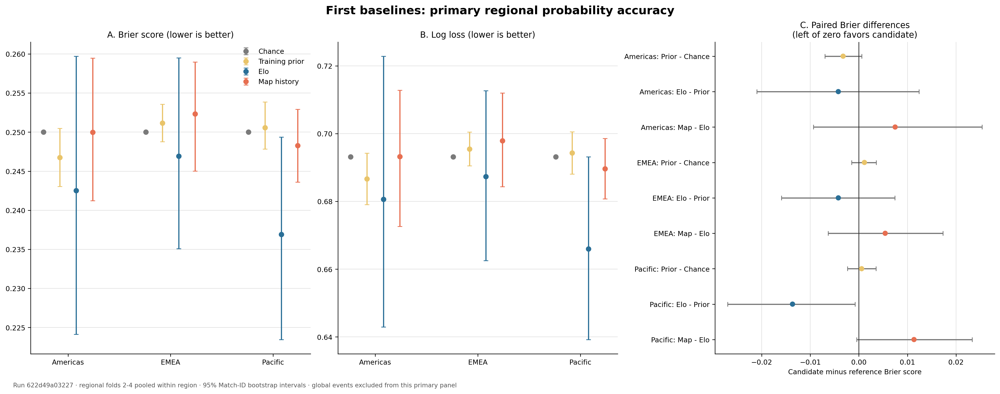
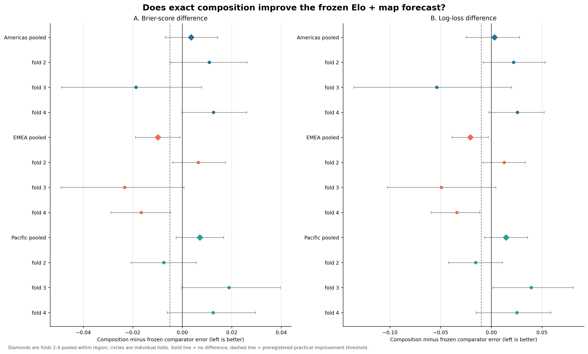
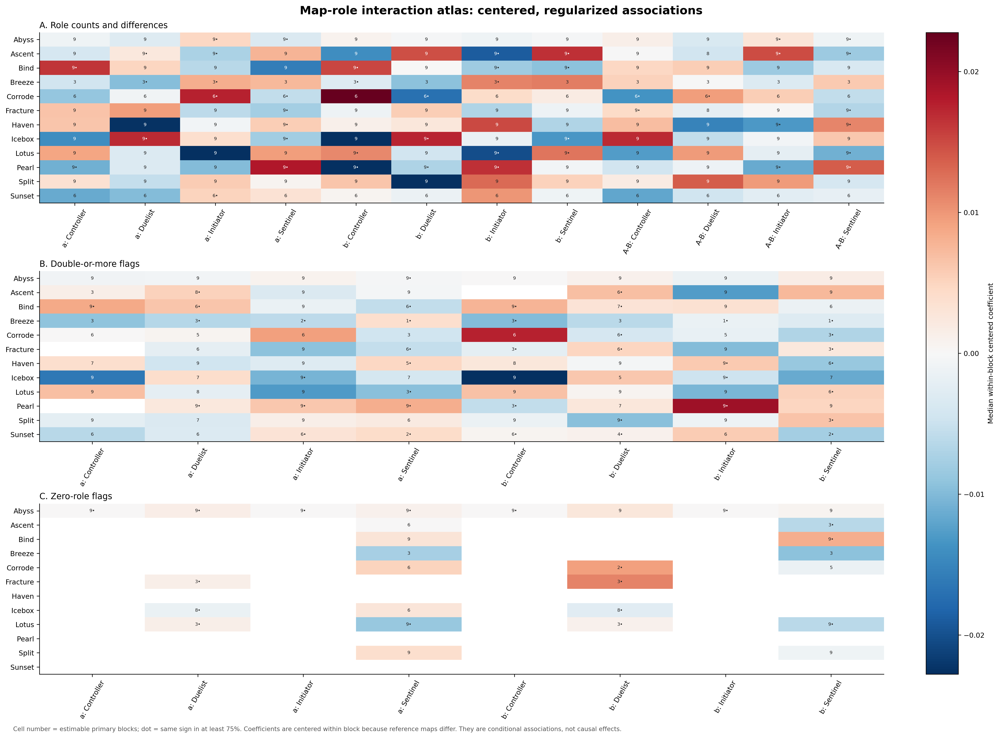
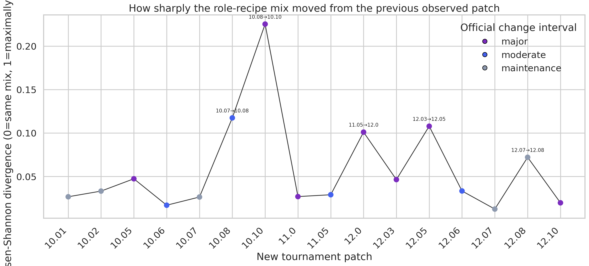
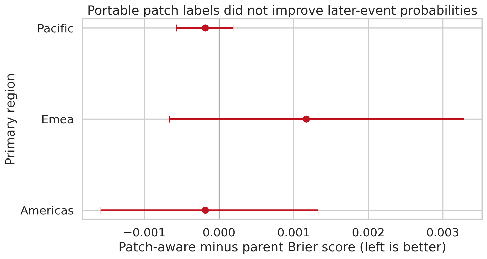
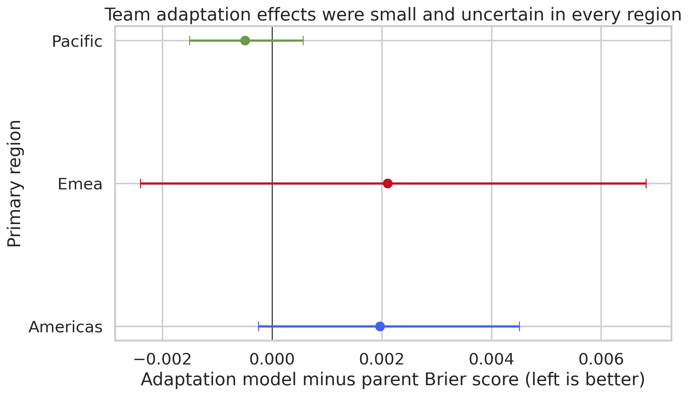

## Abstract

This project investigates whether team composition improves the prediction of professional VALORANT map outcomes before play begins. Composition discussions often describe double-Controller, double-Sentinel or double-Duelist lineups as strong or weak. Their observed win rates, however, may also reflect the teams using them, the map, the opponent, the region and the tournament patch.

I began with version 47 of Ryan Luong's Kaggle VCT dataset to understand the available tables and reconstruct map-level lineups. Missing timestamps and patch information made that dataset unsuitable for the final analysis by itself, so I also developed a slowly collected, resumable VLR archive on a Netcup server. The present analysis uses a fixed set of 1,684 maps: 1,371 from 2025–2026 Americas, EMEA and Pacific VCT events, and 313 from global Masters and Champions events. Each prediction is made after both five-agent lineups are known but before round one begins. The evaluation follows tournament chronology and keeps maps from the same match together.

The preliminary results are mixed. Elo team rating was the strongest simple baseline. Exact agent composition improved prediction in the EMEA development data, but the same improvement did not appear in Americas or Pacific. Official role counts, map-specific role patterns, patch features and team-adaptation features also failed to improve prediction consistently across the three regions. Composition distributions did change between patches, although those changes did not translate into a simple, reliable win predictor.

Earlier studies have predicted VALORANT matches and rounds. I found less work that tests pre-match probabilities on later tournaments while also considering patches, regions and both team compositions. This report presents the data preparation, methods and preliminary results of my attempt to study those issues together. The findings remain developmental because a separate future tournament has not yet been used for final confirmation.

---

## 1. Introduction and research questions

Professional VALORANT analysis frequently describes compositions as double-Controller, double-Sentinel, double-Initiator or double-Duelist. These are useful summaries, but they can lead to claims such as “double-Sentinel is strong on this map” without separating the composition from the team, opponent or patch. I wanted to check whether these patterns still appeared when models were trained on earlier tournaments and tested on later ones.

The main question became:

> **After accounting for team strength, map history and patch changes, does knowing both team compositions help predict the winner?**

A negative result would still be useful because it would show the limits of composition data in this setting.

### 1.1 Scope of the prediction

I separated the project into two possible pre-game prediction points:

- **Horizon A: post-veto, before agent selection.** Team identities, event context, best-of format, map/veto information, and strictly prior history may be known.
- **Horizon B: after both five-agent compositions are known, before round one.** Horizon A information plus the two selected agent lineups may be known.

The current analysis concentrates on Horizon B because the preliminary dataset contains reliable map-level compositions. Horizon A will be studied later after map-veto information has been parsed and checked.

### 1.2 Research questions

1. Can a dynamic team-strength model produce useful and calibrated future-event map probabilities?
2. Does adding exact agent composition improve prediction beyond team strength and map history?
3. Do simpler official-role structures generalise better than exact agent identities?
4. Does allowing role structure to vary by map improve a simpler additive role model?
5. Do patch identity, patch mechanical changes, composition rehearsal, roster familiarity, and team adaptation improve predictions?
6. How stable are these findings across regions, events and patches?

---

## 2. Literature review

### 2.1 Outcome prediction in esports

Esports research covers player performance, teamwork, spectatorship and prediction (Reitman et al. 2020). Hodge et al. (2021), for example, modelled professional *Dota 2* matches while they were being played. One lesson I took from that study is that the prediction point matters: a model has much more information after a match begins than it has before play begins.

Research on other esports also helped me decide which factors might be worth testing. Cheng et al. (2019) examined team composition in *Honor of Kings*, while Kim et al. (2016) studied the tension between player proficiency and fitting the needs of a team. Counter-Strike studies have examined economic decisions and map selection (Xenopoulos, Coelho and Silva 2021; Petri et al. 2021). These studies suggest that composition, player familiarity, economy and vetoes may matter. I cannot assume that their exact findings carry over to VALORANT because the games have different characters, maps, rules and patch cycles.

### 2.2 Direct VALORANT prediction research

The VALORANT studies I found show that match and round data contain some predictable signal. Their reported scores are difficult to compare, however, because they predict different outcomes at different times.

| Study | Data and prediction question | Main reported finding | Remaining limitation for this project |
|---|---|---|---|
| Pratama (2024) | VLR-derived match, map, agent and performance data; supervised match prediction | Compared XGBoost, LightGBM, SVM and logistic regression | K-fold accuracy does not show how the model would perform on a later tournament or whether its probabilities are calibrated |
| Wang (2025) | 1,301 rounds from 2024 Pacific and EMEA; economy and ultimate-related round prediction | Loadout value was the strongest reported input; approximately 60.61% accuracy | The model uses information from after play begins, and the random split does not reproduce a future-event test |
| Hayakawa et al. (2025) | 21,229 professional rounds; video-derived tactical events | Tactical-event features raised reported accuracy from 72.28% to 80.55% | Rich in-round information answers a later prediction question than this project |
| Park, Kang and Lee (2026) | First-half round sequences used to predict second-half flow | Sequence modelling found useful information in earlier rounds | This does not test pre-match probabilities on a separate later event |
| Martins et al. (2026) | About 1,360 matches; rolling player statistics, XGBoost and a Skellam formulation | Reported role-specific accuracies of roughly 80–83% | The paper does not clearly describe a locked later-event test or patch-specific evaluation |
| Pawar (2024) | Pre-match betting advisory thesis using merged data | Reported approximately 73% accuracy | I use this as background rather than the main comparison because it includes merged or partly synthetic evidence |

It would therefore be inaccurate to say that VALORANT prediction has not been attempted. The clearer problem is that the studies measure different things. A model that already knows the current economy or the first half should usually predict better than a model working before round one, but the two models are answering different questions.

### 2.3 Composition, roles and patch-aware representations

Zhou (2025) grouped agents by how often they appeared together in VCT 2022 matches on Haven. The groups resembled several recognised roles and sub-roles, suggesting that co-pick data may reveal relationships that official role labels do not fully capture. This gave me a useful direction for later archetype work, although grouping agents on one map and season is different from comparing two full lineups on later tournaments.

Pedrassoli Chitayat et al. (2023) used game-design and ability information to create character representations that could cope with later *Dota 2* patches. My project therefore does not claim to invent patch-aware character representation. What I did not find was a study comparing several VALORANT composition representations under the same chronological, probability-based evaluation.

### 2.4 Calibration and changes over time

Because my models output win probabilities, accuracy alone is not enough. Brier (1950) introduced a score for probability forecasts, and Guo et al. (2017) showed that a model can classify accurately while still producing unreliable probabilities. Arrieta-Ibarra et al. (2022) also show that calibration results can depend on how predictions are grouped. I therefore report several calibration measures rather than relying on one expected calibration error value.

Time creates another problem. Results under chronological change can differ from results based on random splits (Yao et al. 2022), and calibration can weaken when a new population differs from the training data (Park et al. 2020; Zollo et al. 2024). This is relevant to VALORANT because patches, rosters, maps and regional strategies change over time.

### 2.5 What professional players and coaches have said

The professional comments I found suggest that players and coaches experience patches as changes to whole systems of play, not only as isolated buffs or nerfs. Boaster described the 2026 move from Yoru towards Neon as requiring teams to relearn parts of maps (Strazd 2026). Fnatic coach Milan suggested that the Yoru changes might create more room for double-Duelist compositions and Sentinels (Fnatic 2026). Free1ng described Tejo as broadly useful early in 2025, while later coverage reported that his tournament presence declined after balance changes (VALORANT News Japan 2025; Choudhury 2025).

These comments make patch-driven composition change a reasonable question to investigate, but they do not show that any composition causes a team to win. They are a sense-check on the research question rather than quantitative evidence.

---

## 3. Research gap

From the studies I reviewed, I found three main problems that this project can address. First, published results often refer to different prediction points: some are genuinely pre-match, while others already use economy, round history or current tactical events. Their accuracy values cannot be compared directly.

Second, several relevant studies use random or stratified splits. These are useful for early model development, but they can place similar teams, patches and tournament periods in both training and testing. My study instead trains on earlier event blocks and evaluates on later ones, while keeping all maps from one Match ID together.

Third, I found little direct VALORANT work that studies probability calibration, competition patches, regional differences and several composition descriptions in the same analysis. I compare exact agents, official roles, complete role structures and patch-related features against the same historical baselines. Americas, EMEA and Pacific are analysed separately, and global events are kept as separate development evaluations. The data and analysis versions are also recorded so that the work can be reproduced when the web sources change.

---

## 4. Data sources and collection

### 4.1 Preliminary Kaggle dataset

I began with version 47 of Ryan Luong's Kaggle dataset, *Valorant Champion Tour 2021–2026 Data* (Luong 2026). I recorded the downloaded version and checksum so that a later update to the Kaggle page would not silently change the data used in this study. The archive contains 131 files and expands to approximately 1.36 GB.

The initial audit found 27,457 unique scored map keys. Of these, 27,086 could be reconstructed as two teams with five players and five unique agents each, giving 98.65% structural coverage. I reconstructed these lineups from the non-aggregated `matches/overview.csv` rows where `Side=both`. I did not use `teams_picked_agents.csv` for map lineups because it contains aggregated win and loss totals rather than individual map records.

The Kaggle source was valuable for:

- learning the available schemas;
- checking whether exact map compositions could be reconstructed;
- developing role-shape definitions and parsers;
- exploring candidate questions; and
- cross-checking measurements against a new archive.

It was not immediately model-ready. Important tables lacked event time and competition patch; textual keys collided in early years; event tier could not be safely inferred from names; and annual aggregates could leak later outcomes into earlier maps. Because both Kaggle and the new archive ultimately derive from VLR evidence, agreement between them validates extraction but does not create independent confirmation.

### 4.2 Netcup VLR archive

To obtain stable IDs, competition timestamps, patches, vetoes and roster information, I developed an archive around the `vlrggapi` project and deployed it on a Netcup server. The collector begins with chronological VLR result pages (VLR.gg n.d.) and stores each public source response with its retrieval details. It follows a conservative collection policy: one request starts at most every ten seconds, retries are limited, and the queue can continue after a restart. The research dataset is then built from stored archive records rather than silently downloading a changed page during analysis.

At the report-date check (13 July 2026, 02:25 IST), the Netcup archive contained 19,093 complete match documents and 19,577 stored source snapshots. It also contained 420 results pages and one events page. The remaining queue includes match tabs, event details, players and teams, so it is not a count of missing matches. The collector is still running; a later analysis will use a newly fixed snapshot rather than changing the present data during the study.

### 4.3 Archive snapshot used for the pilot study

The pilot snapshot contains a catalogue of 7,622 archive matches. Exactly 1,023 Match IDs overlapped the usable preliminary inventory. I checked both the Match ID and the complete set of map Game IDs before accepting a match, which produced 2,621 enriched map rows.

The archive overlap is temporally uneven:

| Period | Structurally resolved maps | Enriched maps | Coverage |
|---|---:|---:|---:|
| 2021–2023 | 23,796 | 0 | 0% |
| 2024 | 1,104 | 460 | 41.67% |
| 2025 | 1,276 | 1,275 | 99.92% |
| 2026 | 886 | 886 | 100% |
| **Total** | **27,062** | **2,621** | **9.69%** |

The archive has no event-time enrichment for 2021–2023 and only partial coverage for 2024, so I did not pool those years into the main analysis. The primary population is therefore the 2025–2026 Americas, EMEA and Pacific leagues. China was classified but left out of the current scope because 537 of its 561 enriched maps do not have a source patch value. This choice was made before modelling rather than allowing missing values to decide the population implicitly.

### 4.4 Current analysis population

The final current population contains:

- 448 regional maps from Americas;
- 463 regional maps from EMEA;
- 460 regional maps from Pacific;
- 1,371 regional development maps in total; and
- 313 separate maps from global Masters and Champions events.

All 1,684 selected maps contain exactly two teams, with five players and five selected agents per team, producing 16,840 lineup rows. The data include 55 teams, 375 players, 28 agents and 17 competition patches. I matched teams and players by their archive IDs rather than by spelling alone, since two different people can use the same or a very similar alias.

The 1,684 maps are the unique maps in the pilot dataset. Of these, 1,505 are scored as later-event predictions: 1,192 regional validation maps and 313 global-event maps. The earliest 179 regional maps are used only to provide initial history. Because the same map can be part of the training history for more than one later fold, the split record contains 7,954 assignments across 17 temporal blocks; these are repeated assignments, not additional unique maps.

*Figure 1. Coverage of map, composition and roster fields before outcome modelling. A field being present did not automatically mean that I included it in a model.*

**Source:** Author's analysis of the current pilot dataset. This figure shows data coverage, not match outcomes.

---

## 5. Data preparation

I cleaned and linked the data in several stages. A row could be excluded at a later stage, but the original stored source response was not edited.

**Source:** Author's summary of the data-preparation and evaluation process. The final event shown by the dashed line has not yet been selected or analysed.

### 5.1 Assigning Team A and Team B

For consistency, Team A and Team B are assigned using the stable team IDs. Team A is not chosen using the favourite, attacking side, source order or eventual winner. The outcome is added only after these labels and the data splits have been fixed.

### 5.2 Preventing future information from entering the model

At Horizon B, the current map's agent selections and competition patch are allowed. Team and player IDs are used to calculate earlier history, not as unrestricted labels for the model to memorise. I excluded the following current-map fields:

- score and winner;
- round sequence and side-specific round wins;
- economy and loadout values;
- kills, deaths, assists, ACS, rating, or other performance statistics; and
- any aggregate constructed using the target map or later maps.

Every historical feature is calculated only from maps with an earlier timestamp than the map being predicted. When several maps share one timestamp, all of them are predicted before their outcomes update Elo, familiarity, rehearsal or adaptation. I did not use Game ID order to invent an order between maps when the source did not provide one.

### 5.3 Training on earlier events and testing on later events

Each region has four successive training and validation folds. The first fold was used only as a warm-up check; the main development results use folds 2–4. Training events always finish before validation begins, and all maps from the same Match ID stay together.

Five global events—Masters Bangkok 2025, Masters Toronto 2025, Champions Paris 2025, Masters Santiago 2026 and Masters London 2026—are evaluated separately. Their history includes only regional events completed before the global event. I did not mix these global maps into regional training, and they are still part of development rather than a final test.

---

## 6. Models compared

I began with simple predictors and compared each more detailed model with a simpler reference.

| Model family | Purpose | Main inputs |
|---|---|---|
| Chance | Always predicts 50% | None |
| Training prior | Uses the earlier Team-A win frequency | Outcomes in the training period |
| Elo | Estimates general team strength over time | Stable team IDs and earlier map outcomes |
| Same-map history | Uses a team's earlier record on the selected map | Earlier team-map counts and wins |
| Rating plus map history | Combines team strength, map history and map identity | Elo and team-map history |
| Exact composition | Represents the five agents selected by both teams | Side-specific agent indicators plus reference inputs |
| Official-role model | Summarises each lineup by Controller, Duelist, Initiator and Sentinel counts | Role counts, differences and map |
| Map-role interactions | Allows role patterns to differ by map | Role features combined with map identity |
| Complete role shape | Uses the complete role structure, e.g. `C2-D1-I2-S0` | Five-agent role structures and opposing matchups |
| Roster/familiarity | Tests whether stable lineups and earlier player-agent use add value | Earlier roster and player-agent history |
| Patch-aware composition | Tests whether simple patch-change and earlier same-patch experience features improve the reference model | Changed, buffed/new and nerfed agent exposure plus earlier same-patch team and role-structure use |
| Detailed agent changes | Tests whether specific types of agent changes improve the simpler patch model | Reviewed patch-agent change records |
| Team adaptation | Tests stability, meta similarity, rehearsal and opponent exposure | Fourteen summaries calculated from earlier maps |

For each regularised model, I chose the amount of regularisation using only an earlier part of its training data. Numerical scaling was also fitted on those rows, and complete events or timestamp batches stayed together. The later evaluation maps were not used for these choices.

---

## 7. Evaluation

| Measure | How it is used in this study |
|---|---|
| Brier score | Main measure of probability error. A constant 50% prediction scores 0.25, and lower values are better. |
| Log loss | A second probability measure that penalises confident mistakes more strongly. |
| ROC-AUC and balanced accuracy | Supporting measures of ranking and classification. |
| Calibration slope, intercept and reliability plots | Checks whether stated probabilities match observed frequencies. |
| Match-ID bootstrap interval | Estimates uncertainty while keeping maps from the same match together. |

For comparisons, I subtract the reference model's error from the more detailed model's error on the same maps. A negative Brier or log-loss difference favours the more detailed model. I treat a 95% interval that crosses zero as inconclusive.

---

## 8. Preliminary findings

All results in this section come from the development data. The uncertainty intervals resample complete Match IDs, and no separate final event has been analysed.

### 8.1 Baseline models

Elo was the best simple baseline by Brier and log loss in all three primary regions.

| Region | Chance Brier | Elo Brier | Elo ROC-AUC | Interpretation |
|---|---:|---:|---:|---|
| Americas | 0.2500 | 0.2425 | 0.580 | Better point estimate; paired improvement remains uncertain |
| EMEA | 0.2500 | 0.2469 | 0.582 | Better point estimate; paired improvement remains uncertain |
| Pacific | 0.2500 | 0.2369 | 0.628 | Clear improvement over the training prior; strongest baseline region |

The same-map history model did not beat Elo. Combining Elo with map history also produced slightly higher error in every region, although the differences were inconclusive. In this pilot, adding more historical variables did not automatically improve the forecast.

*Figure 2. Regional scores for chance, training-prior, Elo and same-map-history baselines. Lower Brier and log loss are better.*

**Source:** Author's analysis of the current pilot dataset.

### 8.2 Exact agent composition

The exact-composition model used 100 planned predictors in total: 11 strength and map-history inputs, five roster-continuity inputs, 56 side-specific agent indicators and 28 official-role inputs.

| Region | Composition minus reference Brier | 95% interval | Interpretation |
|---|---:|---:|---|
| Americas | +0.0036 | [-0.0069, +0.0143] | Inconclusive; worse point estimate |
| EMEA | **-0.0098** | **[-0.0189, -0.0010]** | Clear development improvement |
| Pacific | +0.0071 | [-0.0025, +0.0167] | Inconclusive; worse point estimate |

EMEA showed the clearest improvement: Brier score and log loss both improved, ROC-AUC reached 0.598, and the calibration slope was approximately 1.02. The same result did not appear in Americas or Pacific, so I do not treat it as a general cross-region finding.

*Figure 3. Exact-composition error difference by region and fold. Values to the left of zero favour the composition model. EMEA improves overall, but the variation between regions prevents a universal claim.*

**Source:** Author's analysis of the current pilot dataset. The coefficients show predictive associations, not the causal strength of individual agents.

### 8.3 Official roles and map-dependent roles

A simpler official-role model followed roughly the same pattern as the exact-agent model but with less certainty. EMEA's Brier difference was -0.0081, with an interval that narrowly crossed zero. Americas was mixed, while Pacific was worse by point estimate. Broad role structure may therefore capture part of the EMEA composition signal, but the present result is not clear enough on its own.

Allowing roles to interact with maps did not reliably improve the additive role model across regions. Pacific improved by a promising Brier difference of -0.0064, and its log-loss interval excluded zero, but Americas worsened slightly and EMEA was essentially tied. Sparse map cells produced some striking effects, but most intervals crossed zero.

*Figure 4. Map-specific role associations from the regularised interaction model. Colours show model associations, not causal win-rate effects.*

**Source:** Author's analysis of the current pilot dataset. Several role variables overlap, so individual cells should not be read as isolated strategic effects.

### 8.4 Descriptive composition patterns

The descriptive layer examined complete role recipes such as `C1-D1-I2-S1`, `C2-D1-I1-S1`, and `C2-D1-I2-S0`, including map-specific and directional matchups. Several cells initially appeared to favour or disfavour double-Sentinel, double-Duelist, or no-Sentinel designs.

I tested 156 supported descriptive comparisons and adjusted for the number of comparisons (Benjamini and Hochberg 1995). No individual map–role-structure cell, overall directional matchup or patch–map–role cell remained significant after both corrections. Only one Bind matchup survived within its tested family: using a fixed alphabetical ordering chosen without reference to the result, `C2-D1-I2-S0` won 5 of 27 maps against `C2-D2-I1-S0` (adjusted *p* = 0.0333). It is still an observational result from a small sample and should not be treated as a strategy rule.

For this reason, I do not present a map-wise list as simply “won more” or “won less.” The cautious conclusion is that any composition effect is likely to depend on context, and most attractive historical patterns did not remain after accounting for repeated testing.

### 8.5 Patch changes and the professional meta

The composition distributions clearly moved between tournament patches. The largest observed role-structure change was from patch 10.08 to 10.10, with a Jensen–Shannon divergence of 0.225. Other visible shifts occurred around 10.07 to 10.08, 11.05 to 12.0 and 12.03 to 12.05.

*Figure 5. Jensen–Shannon divergence between role-structure distributions in consecutive tournament patches. Higher values indicate a larger change in what teams played; the graph does not measure an effect on winning.*

**Source:** Author's analysis of the pilot dataset, with tournament-patch context checked against Riot Games (n.d.). Patch, event, roster, map pool and region changes overlap in these descriptive data.

After the later methodological correction described in Section 10, the simpler patch features remained inconclusive in all three regions:

- Americas Brier difference: -0.00019, interval [-0.00159, +0.00133];
- EMEA: +0.00117, interval [-0.00066, +0.00328];
- Pacific: -0.00019, interval [-0.00057, +0.00019].

*Figure 6. Patch-aware model minus its reference model in Brier score. Values to the left are better; every interval crosses zero.*

**Source:** Author's analysis of the corrected patch experiment.

The more detailed agent-change model was inconclusive in Americas and EMEA. In Pacific it clearly increased error: the Brier difference was +0.00317 (95% interval [+0.00123, +0.00521]) and the log-loss difference was +0.00637 ([+0.00237, +0.01071]). Patch changes were associated with changes in what teams played, but these counts of specific mechanical changes did not capture the broader way teams adjusted their play.

### 8.6 Team adaptation

Fourteen features measured earlier composition rehearsal, stability, similarity to the regional meta, patch familiarity and opponent exposure. After rebuilding them separately within each temporal fold and processing equal timestamps together, none produced a clear regional improvement:

- Americas Brier difference: +0.00197, interval [-0.00025, +0.00451];
- EMEA: +0.00211, interval [-0.00240, +0.00682];
- Pacific: -0.00050, interval [-0.00151, +0.00057].

*Figure 7. Team-adaptation model minus its reference model in Brier score. The estimated changes are small and uncertain in every region.*

**Source:** Author's analysis of the corrected adaptation experiment. Maps sharing a timestamp were processed together, and evaluation outcomes did not update the adaptation history.

### 8.7 Checks on the stability of the results

I checked whether the conclusions changed when events were weighted differently or removed one at a time.

#### Did one event drive the result?

The exact-composition result changes meaning by region:

| Region | Map-weighted Brier difference | Equal-fold result | Leave-one-event-out range |
|---|---:|---:|---:|
| Americas | +0.00361 | +0.00160 | -0.00156 to +0.01176 |
| EMEA | -0.00983 | -0.01116 | -0.01941 to -0.00501 |
| Pacific | +0.00709 | +0.00796 | +0.00260 to +0.01522 |

EMEA remained favourable after removing any one of its main events. Americas changed sign and therefore depended more on the events included. Pacific remained unfavourable in every leave-one-event-out result. These checks still reuse the development data and are not a separate confirmation.

#### Does swapping Team A and Team B change the model?

The exact-composition model does not force `P(A,B) = 1 - P(B,A)`. In other words, swapping the two team labels can change the result by more than it should. This does not invalidate the map-level predictions made with the fixed ID ordering, but it limits how the side-specific coefficients can be interpreted. I will test a difference-only or mirrored-training model in the next stage.

#### Sensitivity to regularisation

The original models frequently selected the strongest available regularisation, suggesting that the large composition feature set was easy to overfit. A wider search range reduced but did not remove this behaviour. The results therefore remain sensitive to the amount of regularisation.

### 8.8 Testing different Elo update speeds

The planned Elo update speed was K=20. I repeated the same historical calculation with K=10, K=20 and K=40 without changing the main choice after seeing the results.

| Region | K=10 Brier | K=20 primary | K=40 |
|---|---:|---:|---:|
| Americas | 0.2412 | 0.2425 | 0.2510 |
| EMEA | 0.2445 | 0.2469 | 0.2570 |
| Pacific | 0.2391 | 0.2369 | 0.2410 |

K=40 was worse in every region and produced probabilities that appeared too confident. K=10 had lower Brier scores in Americas and EMEA, while Pacific favoured the planned K=20. Since this comparison was examined after the main choice, I report K=10 only as a sensitivity check rather than replacing K=20.

---

## 9. Comparison with previous studies

Like these earlier studies, I found that VALORANT outcomes contain some predictable information (Pratama 2024; Wang 2025; Hayakawa et al. 2025; Park, Kang and Lee 2026; Martins et al. 2026). I did not compare the numerical scores directly because the studies use different prediction times, inputs, populations, test designs and metrics.

This is not necessarily a contradiction. The studies differ in at least five ways:

1. **Prediction time:** mid-round models see far more information than a pre-match model.
2. **Inputs:** current economy, player performance, tactical events, or first-half logs are prohibited in the current Horizon-B task.
3. **Split design:** random or stratified splits do not test chronological generalisation as directly as later-event evaluation.
4. **Metric:** accuracy can look high while probabilities remain poorly calibrated.
5. **Population:** one region, map, season or filtered round type may be more predictable than a combined analysis of several events.

The patch-distribution results fit the general idea in Pedrassoli Chitayat et al. (2023) that live-service character representations need to account for game changes. My simple patch features and mechanical counts did not improve consistently. One possible explanation is that patches affect timing, information, map control and team playbooks in ways that are not captured by counting buffed or nerfed agents, although I have not yet measured those mechanisms directly.

The map-dependent role results are also compatible with composition research in *Honor of Kings* (Cheng et al. 2019) and proficiency work by Kim et al. (2016). Team design may matter, but its value can depend on the players, opponent and map. The present results do not support treating one composition label as an isolated cause of winning.

Finally, the event-to-event variation is consistent with research on change over time and shifts between training and evaluation populations (Yao et al. 2022; Park et al. 2020; Zollo et al. 2024). A model can still rank teams reasonably while becoming overconfident or unstable in a new event. I used several calibration checks rather than one summary value because calibration assessment is itself sensitive to the chosen measure (Arrieta-Ibarra et al. 2022).

---

## 10. Correction after internal review

A later review found a problem in three patch and adaptation experiments. Their internal tuning step could split maps from one Match ID, compare numerical inputs before scaling them correctly, and calculate two history feature groups from the wrong training scope. The final evaluation outcomes had not been used as training updates, but these issues were still serious enough to require a rerun.

I kept the earlier results for transparency and rebuilt the experiments. The corrected version calculates histories separately for each temporal fold, keeps complete events or equal-time batches together during tuning, and fits numerical scaling only on the relevant training rows. It also tests a wider range of regularisation values.

The correction changed several interpretations. I withdrew the earlier statements that coarse patch features clearly harmed Pacific, that mechanical patch features worsened every region, and that adaptation clearly harmed EMEA. Sections 8.5 and 8.6 contain the corrected results.

---

## 11. Limitations

### 11.1 Development rather than final confirmation

The current 1,684 maps have already been used to develop and inspect the models. They cannot provide an unbiased final test. A future event will need to be selected before its outcomes are viewed and kept separate until the analysis choices are complete.

### 11.2 Coverage and population

The pilot snapshot has nearly complete overlap for 2025–2026, but it has no event-time enrichment for 2021–2023 and only partial 2024 coverage. China is currently outside the analysis because most of its rows lack competition-patch information. The findings therefore apply to the selected Americas, EMEA, Pacific and global VCT events, not to all professional VALORANT.

### 11.3 Observational data

Teams choose compositions strategically. A role recipe is not randomly assigned. Team quality, map choice, opponent preparation, scrim knowledge, and hidden tactical considerations affect both composition choice and outcome. The models estimate predictive associations, not causal effects of selecting an agent or role count.

### 11.4 Sparse and changing categories

Some agents, maps, and role shapes are rare or absent in early folds. Patch changes alter both meaning and availability. Regularisation and training-local feature vocabularies reduce but do not eliminate this difficulty.

### 11.5 Match-level timestamps

Maps in the same series often share one effective timestamp. The current method does not learn from an earlier Game ID when two maps have the same timestamp. This avoids inventing an order, but it also prevents the model from using genuine within-series adaptation until reliable map start times are available.

### 11.6 Source dependence

Kaggle and the new archive are not independent sources because both ultimately use VLR records. Agreement between them checks the extraction process rather than confirming a finding independently. VLR pages may also be missing or corrected later; the stored snapshot records what was available when it was collected.

### 11.7 Repeated development checks

Many feature families have now been examined on the development data. This increases the chance of finding an attractive pattern by accident. Multiple-comparison correction, records of unsuccessful runs and an untouched future event are therefore important for the final stage.

---

## 12. Work completed so far

At this stage, I have completed five main parts of the project:

1. I set up a resumable archive and kept fixed copies of the public source material used in the study.
2. I cleaned a pilot population of 1,684 maps with stable team, player, agent, event, map and patch identities.
3. I created chronological regional splits and separate global-event evaluations while excluding current-map performance information.
4. I compared team-strength, map-history, exact-composition, role, patch and adaptation models using probability scores and calibration checks.
5. I documented the methodological correction, unsuccessful models and stability checks, and generated the figures from recorded analysis runs.

---

## 13. Next steps

### 13.1 Data collection and preparation

1. Continue the Netcup archive until the required match and supporting pages have been collected.
2. Fix a new snapshot for analysis rather than altering the present pilot data.
3. Recheck event, patch, region, map, team and player coverage in that snapshot.
4. Keep the present population marked as data that has already been inspected.

### 13.2 Additional features

1. Build and validate a map-veto parser for picks, bans and decider maps.
2. Check veto timing, team identity, map identity and best-of format without using match outcomes.
3. Build strictly prior player-form and roster features from earlier maps only; never use current-map ACS, kills, rounds, or score.
4. Rebuild player–agent familiarity under the corrected version-2 evaluation standard.
5. Develop a side-symmetric composition representation or mirrored-training sensitivity.

### 13.3 Final evaluation plan

1. Decide the calibration comparison using training data only.
2. Decide the final set of features, model settings and evaluation measures before examining the future tournament.
3. Select a future, non-overlapping event or patch period before its outcomes are viewed.
4. Keep that event separate from model development.
5. Run the final evaluation once and report the result whether it is positive, negative or mixed.

### 13.4 Tactical archetypes

The functional-archetype extension requires two independent annotators to label patch-sensitive agent functions using the same written rubric. I will measure their agreement before using the labels in a model. This reduces the risk of redefining an archetype after seeing which version gives a better result.

---

## 14. Conclusion

The pilot study shows that professional VALORANT map outcomes can be predicted to some extent before round one, with dynamic team strength providing the most dependable starting point. Exact team composition added information in the EMEA development data, but the result did not carry over consistently to Americas or Pacific. Broad role structures, map-specific role features, patch labels, mechanical change counts and team-adaptation summaries did not improve prediction across all three regions.

The agents and role structures used by professional teams changed across patches, but those changes did not give a simple rule for predicting the winner. Nearly all attractive descriptive composition patterns disappeared after correcting for the number of comparisons. Claims such as “double-Sentinel is stronger on a particular map” should therefore remain hypotheses for later testing.

The project is not ready for a final claim because the present maps have already been used during development. However, the work has clarified what appears promising and what does not. My next task is to repeat the analysis on a larger checked archive, improve the composition representation and reserve a future tournament for the final test.

---

## 15. Reproducibility

All project data processing, modelling and plotting runs in Docker. The raw source responses are kept unchanged, while corrections are made in the parsing or derived data layers. Each dataset, experiment and figure has a recorded version. The main version identifiers and validation record are included in Appendix A.

---

## References

Arrieta-Ibarra, I., Gujral, P., Tannen, J., Tygert, M. and Xu, C. (2022) ‘Metrics of calibration for probabilistic predictions’, *Journal of Machine Learning Research*, 23(351), pp. 1–54. Available at: [JMLR](https://www.jmlr.org/papers/v23/22-0658.html).

Benjamini, Y. and Hochberg, Y. (1995) ‘Controlling the false discovery rate: a practical and powerful approach to multiple testing’, *Journal of the Royal Statistical Society: Series B*, 57(1), pp. 289–300. Available at: [https://doi.org/10.1111/j.2517-6161.1995.tb02031.x](https://doi.org/10.1111/j.2517-6161.1995.tb02031.x).

Brier, G.W. (1950) ‘Verification of forecasts expressed in terms of probability’, *Monthly Weather Review*, 78(1), pp. 1–3. Available at: [https://doi.org/10.1175/1520-0493(1950)078%3C0001:VOFEIT%3E2.0.CO;2](https://doi.org/10.1175/1520-0493%281950%29078%3C0001%3AVOFEIT%3E2.0.CO%3B2).

Cheng, Z., Yang, Y., Tan, C., Cheng, D., Zhuang, Y. and Cheng, A. (2019) ‘What makes a good team? A large-scale study on the effect of team composition in Honor of Kings’, *The Web Conference 2019*, pp. 2666–2672. Available at: [https://doi.org/10.1145/3308558.3313530](https://doi.org/10.1145/3308558.3313530).

Choudhury, K. (2025) ‘Tejo’s rise and fall: analyzing the agent’s pick rate from Bangkok to Toronto’, *THESPIKE.GG*. Available at: [THESPIKE.GG](https://www.thespike.gg/valorant/news/tejo-s-rise-and-fall-analyzing-the-agent-s-pick-rate-from-bangkok-to-toronto/6364) (Accessed: 13 July 2026).

Fnatic (2026) ‘Ask the VALORANT team anything ahead of VCT EMEA Stage 1’, team AMA. Available at: [Fnatic](https://fnatic.com/community/6497-ama-ask-the-valorant-team-anything-ahead-of-vct-emea-stage-1) (Accessed: 13 July 2026).

Guo, C., Pleiss, G., Sun, Y. and Weinberger, K.Q. (2017) ‘On calibration of modern neural networks’, *Proceedings of the 34th International Conference on Machine Learning*, 70, pp. 1321–1330. Available at: [PMLR](https://proceedings.mlr.press/v70/guo17a.html).

Hayakawa, N., Shimari, K., Yamasaki, K., Hoshikawa, H., Tsuchida, R. and Matsumoto, K. (2025) ‘Round outcome prediction in VALORANT using tactical features from video analysis’, *2025 IEEE Conference on Games*. Available at: [https://doi.org/10.1109/CoG64752.2025.11114177](https://doi.org/10.1109/CoG64752.2025.11114177).

Hodge, V.J., Devlin, S.M., Sephton, N.J., Block, F.O., Cowling, P.I. and Drachen, A. (2021) ‘Win prediction in multi-player esports: live professional match prediction’, *IEEE Transactions on Games*, 13(4), pp. 368–379. Available at: [https://doi.org/10.1109/TG.2019.2948469](https://doi.org/10.1109/TG.2019.2948469).

Kim, J., Keegan, B.C., Park, S. and Oh, A. (2016) ‘The proficiency-congruency dilemma: virtual team design and performance in multiplayer online games’, *CHI 2016*, pp. 4351–4365. Available at: [https://doi.org/10.1145/2858036.2858464](https://doi.org/10.1145/2858036.2858464).

Luong, R. (2026) ‘Valorant Champion Tour 2021–2026 Data’, Kaggle dataset, version 47. Available at: [Kaggle](https://www.kaggle.com/datasets/ryanluong1/valorant-champion-tour-2021-2023-data) (Accessed: 11 July 2026).

Martins, R., Watanuki, A., Soares, V., Onorio, G. and Macedo, V. dos S. (2026) ‘VWPI (Valorant Win Probability Index): um contraponto analítico às odds das casas de apostas’, *Revista Processando o Saber*, 18(1), pp. 458–480. Available at: [https://doi.org/10.5281/zenodo.20076441](https://doi.org/10.5281/zenodo.20076441).

Park, H., Kang, G. and Lee, T. (2026) ‘Match outcome prediction in FPS games reflecting sequential match flow: focusing on Valorant and the Seq2Seq LSTM model’, *International Journal of Computer Science and Mobile Computing*, 15(2), pp. 72–79. Available at: [https://doi.org/10.47760/ijcsmc.2026.v15i02.008](https://doi.org/10.47760/ijcsmc.2026.v15i02.008).

Park, S., Bastani, O., Weimer, J. and Lee, I. (2020) ‘Calibrated prediction with covariate shift via unsupervised domain adaptation’, *AISTATS*, PMLR 108, pp. 3219–3229. Available at: [PMLR](https://proceedings.mlr.press/v108/park20b.html).

Pawar, A.M. (2024) ‘Valorant Esports Pre-Match Betting Advisory System uses Machine Learning to Predict Winning Probability and Simulate Odds and Earning Projections’, Master's thesis, National College of Ireland. Available at: [NCI repository](https://norma.ncirl.ie/8770/) (Accessed: 13 July 2026).

Pedrassoli Chitayat, A., Block, F., Walker, J. and Drachen, A. (2023) ‘Beyond the meta: leveraging game design parameters for patch-agnostic esport analytics’, *Proceedings of the AAAI Conference on Artificial Intelligence and Interactive Digital Entertainment*, 19(1), pp. 116–125. Available at: [https://doi.org/10.1609/aiide.v19i1.27507](https://doi.org/10.1609/aiide.v19i1.27507).

Petri, G., Stanley, M.H., Hon, A.B., Dong, A., Xenopoulos, P. and Silva, C.T. (2021) ‘Bandit modeling of map selection in Counter-Strike: Global Offensive’, arXiv:2106.08888. Available at: [arXiv](https://arxiv.org/abs/2106.08888).

Pratama, H.K. (2024) ‘Prediction Valorant Match Outcome Using Supervised Learning Algorithm’, Bachelor's thesis, Universitas Gadjah Mada. Available at: [UGM repository](https://etd.repository.ugm.ac.id/penelitian/detail/242904) (Accessed: 13 July 2026).

Reitman, J.G., Anderson-Coto, M.J., Wu, M., Lee, J.S. and Steinkuehler, C. (2020) ‘Esports research: a literature review’, *Games and Culture*, 15(1), pp. 32–50. Available at: [https://doi.org/10.1177/1555412019840892](https://doi.org/10.1177/1555412019840892).

Riot Games (n.d.) ‘Patch notes’. Available at: [VALORANT](https://playvalorant.com/en-us/news/tags/patch-notes/) (Accessed: 13 July 2026).

Strazd, E. (2026) ‘“Phoenix might rise through the ranks”: FNC Boaster on possible VALORANT meta shift’, *Dot Esports*. Available at: [Dot Esports](https://dotesports.com/valorant/news/vct-2026-stage-1-boaster-interview) (Accessed: 13 July 2026).

VALORANT News Japan (2025) ‘DRX free1ng: “I want to be remembered as one of the best Initiators in the world”; discusses the IGL change and using Tejo on every map’ [in Japanese]. Available at: [VALORANT News Japan](https://valorantnews.jp/archives/97255) (Accessed: 13 July 2026).

VLR.gg (n.d.) ‘Results’. Available at: [VLR.gg](https://www.vlr.gg/matches/results) (Accessed: 13 July 2026).

Wang, D. (2025) ‘A predictive analysis of Valorant esports: win probability through economy and ultimate ability’, *TechRxiv*. Available at: [https://doi.org/10.36227/techrxiv.174742078.82022650/v1](https://doi.org/10.36227/techrxiv.174742078.82022650/v1).

Xenopoulos, P., Coelho, B.G. and Silva, C.T. (2021) ‘Optimal team economic decisions in Counter-Strike’, arXiv:2109.12990. Available at: [arXiv](https://arxiv.org/abs/2109.12990).

Yao, H., Choi, C., Cao, B., Lee, Y., Koh, P.W. and Finn, C. (2022) ‘Wild-Time: a benchmark of in-the-wild distribution shift over time’, *Advances in Neural Information Processing Systems*, 35. Available at: [NeurIPS](https://proceedings.neurips.cc/paper_files/paper/2022/hash/43119db5d59f07cc08fca7ba6820179a-Abstract-Datasets_and_Benchmarks.html).

Zhou, H. (2025) ‘Beyond win rates: a clustering-based approach to character balance analysis in team-based games’, arXiv:2502.01250, version 2. Available at: [arXiv](https://arxiv.org/abs/2502.01250).

Zollo, T.P., Deng, Z., Snell, J.C., Pitassi, T. and Zemel, R. (2024) ‘Improving predictor reliability with selective recalibration’, arXiv:2410.05407. Available at: [arXiv](https://arxiv.org/abs/2410.05407).

---

## Appendix A. Technical record

The main data and analysis versions used for this report are listed below. The full manifests, configurations and audit notes are stored in the project repository.

| Item | Version identifier |
|---|---|
| Kaggle VCT v47 dataset | `d16d56ee36e38af0e75e865b4b8fb20b6bd3ae124f1af362864004231fa6c49b` |
| VLR archive snapshot | `9e9ec89440fed7d69415f25b8750925039984d21d1ab867577164c166e3ced28` |
| Event and population classification | `d457b6f1c9fa86b5317e1b022579e70b490b2168ce52bcac87ecef88ef689e49` |
| Team and player matching | `61deb905d545e5c6eb3049b873936977d79745f8bef6eb921edf9f8b8ee7fd52` |
| Temporal split registry | `7ba1a80798aea274bc3930b37929dc1266052136e8473d0628583380a8c40d75` |
| Corrected patch experiment | `ed9e5be593264e435cd81bd3a88238b3d39766aea3c93bb87900025ebb2ca18f` |
| Corrected mechanical-change experiment | `618824a922591b1080b63c49870ad1950813cb01a7f132291265b38603210368` |
| Corrected adaptation experiment | `1cbd8f698648dc9d80b8f423edc434fc72192dd73c9f41a31eaee798d054892a` |
| Stability audit | `c5884d74276950115974eaa0e742dfa77665a13d63b91147f90be5dc9d564307` |
| Elo update-speed check | `b287c400ab0c23b1807719cbea4e8a2e7516c101f4e9e3261f5fc2eb79e451e2` |

The figures are linked to the same recorded runs. Figure 1 uses composition-feature version `9bc33dc6...`; Figure 2 uses baseline run `622d49a0...`; Figure 3 uses exact-composition run `02479ead...` and reference run `40237637...`; Figure 4 uses map–role run `19524547...`; Figure 5 uses corrected patch-support version `0990686c...`; Figure 6 uses the corrected patch experiment above; and Figure 7 uses the corrected adaptation experiment above.

Uncertainty intervals use 2,000 deterministic paired resamples of complete Match IDs. Expected calibration error is checked with 5, 10 and 15 bins. In the side-ordering check, the asymmetry ratio was 1.59 and the mean absolute intercept was 0.151 across 17 temporal blocks. Even after widening the regularisation range in the corrected experiments, 29–32% of selections still reached the strongest setting, so this sensitivity remains recorded as a limitation.

All project computation ran through Docker Compose. The collection configuration limited VLR request starts to one every ten seconds and used bounded retries. The last completed correction and sensitivity release passed formatting, linting, strict type checking, Docker configuration validation and 181 automated tests. No separate final-event outcomes were read during these runs.
