# Electrical Machines II PYQ Answer Bank

This page contains the corrected question-and-answer bank generated from the selected PYQs. The sequence is kept as Question 1, Answer 1, Question 2, Answer 2, and so on for exam revision.

**Total questions:** 141

## Question 1
**Topic:** AC windings, winding factor, harmonics and generated EMF · **Syllabus area:** Weeks 3-4 · **Source:** 5A | EM-I ELE 2103 End Sem, 27 November 2018

Develop a single layer wave winding table for the stator winding of a three phase AC machine with 36 slots and 4 poles. Assume RBY sequence. (04)

### Answer 1
**Solution**

For a 3-phase, 4-pole, 36-slot stator with a single-layer, full-pitch wave winding and RBY phase sequence:

- Slots per pole $= 36/4 = 9$.
- Slot angle $\beta = 180^\circ/9 = 20^\circ$ electrical.
- Slots per pole per phase $q = \dfrac{36}{3 \times 4} = 3$.

A $60^\circ$ phase-spread is used, so each phase belt occupies $q = 3$ slots under a pole. The slot allocation (R-B-Y sequence) with alternating polarity is given in the table below.

| Phase belt | Polarity | Slot numbers |
|------------|----------|---------------|
| R          | +        | 1, 2, 3       |
| B          | -        | 4, 5, 6       |
| Y          | +        | 7, 8, 9       |
| R          | -        | 10, 11, 12    |
| B          | +        | 13, 14, 15    |
| Y          | -        | 16, 17, 18    |
| R          | +        | 19, 20, 21    |
| B          | -        | 22, 23, 24    |
| Y          | +        | 25, 26, 27    |
| R          | -        | 28, 29, 30    |
| B          | +        | 31, 32, 33    |
| Y          | -        | 34, 35, 36    |

Since the coils are full-pitch, each coil spans one pole pitch, i.e. 9 slots. The coil sides are therefore joined as:

- **R-phase:** $(1,10)$, $(2,11)$, $(3,12)$, $(19,28)$, $(20,29)$, $(21,30)$  
- **B-phase:** $(4,13)$, $(5,14)$, $(6,15)$, $(22,31)$, $(23,32)$, $(24,33)$  
- **Y-phase:** $(7,16)$, $(8,17)$, $(9,18)$, $(25,34)$, $(26,35)$, $(27,36)$  

All six coils of a phase are connected in series with the correct polarity so that their emfs are additive. The three phase windings taken in the order R-B-Y produce balanced voltages displaced by $120^\circ$ electrical.

> **Final answer:** Single-layer full-pitch winding with 18 coils, coil pitch $= 9$ slots, $q = 3$, $\beta = 20^\circ$ electrical; the R/B/Y coil groups are as listed above.


---

## Question 2
**Topic:** AC windings, winding factor, harmonics and generated EMF · **Syllabus area:** Weeks 3-4 · **Source:** 1A | EM-II ELE 204 End Sem, 13 May 2014

Define the following: (i) Integral and Fractional slot winding (ii) Full pitch and Fractional pitch winding (02)

### Answer 2
**(i) Integral-slot winding:** The number of slots per pole per phase $q = \dfrac{S}{P \times \text{phases}}$ is an integer. This gives a simple, symmetrical layout with each phase belt occupying an integer number of slots per pole.
**Fractional-slot winding:** $q$ is not an integer but a fraction (e.g. $2\frac{1}{2}$). It is frequently used to reduce cogging torque, suppress certain harmonics, or to suit specific slot-pole combinations.

**(ii) Full-pitch winding:** The coil span is equal to one pole pitch, i.e. $180^\circ$ electrical. The emfs in the two coil sides are exactly in phase opposition; the coil voltage is the arithmetic sum, yielding the maximum possible fundamental emf.
**Fractional-pitch (short-pitch) winding:** The coil span is less than $180^\circ$ electrical by a chording angle $\alpha$. This reduces the fundamental emf by the factor $\cos(\alpha/2)$ but can eliminate selected harmonic emfs (when $\cos(n\alpha/2)=0$) and shortens the end connections, saving copper and reducing leakage reactance.

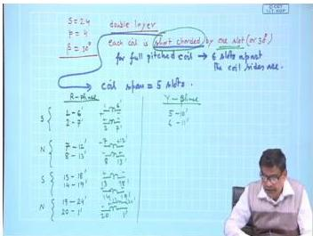
<p align="center"><b>Figure:</b> Coil short-pitched by one slot (30°) in a 24-slot, 4-pole machine.</p>

> **Final answer:** Integral-slot: $q$ integer; fractional-slot: $q$ fractional. Full-pitch: coil span = $180^\circ$ electrical; fractional-pitch: coil span $< 180^\circ$ electrical.


---

## Question 3
**Topic:** AC windings, winding factor, harmonics and generated EMF · **Syllabus area:** Weeks 3-4 · **Source:** 1B | EM-II ELE 204 End Sem, 13 May 2014

A 3 phase alternator has 2 slots per pole per phase and coil span of 5 slot pitches. The flux density wave of alternator consists of a fundamental and a 25% third harmonic. Calculate the percentage increase in the phase voltage due to harmonic. (04)

### Answer 3
Given a 3-phase alternator with $q = 2$ slots per pole per phase, the number of slots per pole is

$$
\text{slots/pole} = m \times q = 3 \times 2 = 6.
$$

The slot angle (electrical) is

$$
\beta = \frac{180^\circ}{\text{slots/pole}} = \frac{180^\circ}{6} = 30^\circ \text{ electrical}.
$$

The coil span is 5 slot pitches, so the coil is short-pitched by

$$
6 - 5 = 1 \text{ slot}.
$$

The chording angle is therefore

$$
\alpha = 1 \times \beta = 30^\circ \text{ electrical}.
$$

---

**Fundamental (h = 1) winding factor**

Distribution factor:

$$
K_{d1} = \frac{\sin\left(\frac{q\beta}{2}\right)}{q\,\sin\left(\frac{\beta}{2}\right)}
       = \frac{\sin(2 \times 15^\circ)}{2\,\sin 15^\circ}
       = \frac{0.5}{2 \times 0.2588}
       \approx 0.9659 .
$$

Pitch factor:

$$
K_{p1} = \cos\left(\frac{\alpha}{2}\right)
       = \cos 15^\circ
       \approx 0.9659 .
$$

Hence,

$$
K_{w1} = K_{d1} \cdot K_{p1} = 0.9659 \times 0.9659 \approx 0.9330 .
$$

---

**Third-harmonic (h = 3) winding factor**

Harmonic slot angle = $3\beta = 90^\circ$, harmonic chording angle = $3\alpha = 90^\circ$.

Distribution factor:

$$
K_{d3} = \frac{\sin\left(\frac{q \cdot 3\beta}{2}\right)}{q\,\sin\left(\frac{3\beta}{2}\right)}
       = \frac{\sin(2 \times 45^\circ)}{2\,\sin 45^\circ}
       = \frac{1}{2 \times 0.7071}
       \approx 0.7071 .
$$

Pitch factor:

$$
K_{p3} = \cos\left(\frac{3\alpha}{2}\right)
       = \cos 45^\circ
       \approx 0.7071 .
$$

Thus,

$$
K_{w3} = K_{d3} \cdot K_{p3} = 0.7071 \times 0.7071 = 0.5 .
$$

---

**EMF ratio due to harmonic**

The induced emf per phase for a harmonic is proportional to the product of flux-density amplitude and the winding factor. Given that the third-harmonic flux density is $25\%$ of the fundamental, $B_{3} = 0.25\,B_{1}$. Therefore

$$
\frac{E_{3}}{E_{1}} = \frac{B_{3}\,K_{w3}}{B_{1}\,K_{w1}}
                    = 0.25 \times \frac{0.5}{0.9330}
                    \approx 0.13397 .
$$

---

**Resultant phase voltage and percentage increase**

The rms phase voltage becomes

$$
E_{\text{ph}} = \sqrt{E_{1}^{2} + E_{3}^{2}}
              = E_{1} \sqrt{1 + (0.13397)^{2}}
              \approx 1.00894\,E_{1} .
$$

The percentage increase in phase voltage due to the third harmonic is

$$
\frac{E_{\text{ph}} - E_{1}}{E_{1}} \times 100\%
= (1.00894 - 1) \times 100\%
\approx 0.894\% .
$$

> **Final answer:** The phase voltage increases by approximately **0.89%** due to the third harmonic.


---

## Question 4
**Topic:** AC windings, winding factor, harmonics and generated EMF · **Syllabus area:** Weeks 3-4 · **Source:** 1A | EM-II ELE 204 Makeup, 08 July 2014

A 3 phase, 50 Hz, 1000 rpm, star connected alternator has 72 armature slots with 6 conductors per slot and the coil span is 10 slots. The average air-gap flux per pole is 0.26 Wb. Calculate: (i) Distribution and Pitch factors of the winding (ii) Number of turns per phase and (iii) phase and line value of emf induced. (04)

### Answer 4
Given:
- $f = 50 \text{ Hz}$, $N = 1000 \text{ rpm}$, star-connected, $S = 72 \text{ slots}$, $6 \text{ conductors/slot}$, coil span $= 10 \text{ slots}$, $\phi = 0.26 \text{ Wb}$.

Step 1: Number of poles
$$P = \frac{120f}{N} = \frac{120 \times 50}{1000} = 6 \text{ poles}.$$

Step 2: Slots per pole and slot angle
$$\text{Slots per pole} = \frac{S}{P} = \frac{72}{6} = 12.$$
$$\beta = \frac{180^\circ}{\text{slots per pole}} = \frac{180^\circ}{12} = 15^\circ \text{ electrical.}$$

Step 3: Slots per pole per phase
$$q = \frac{S}{3P} = \frac{72}{3 \times 6} = 4.$$

---

### (i) Distribution and pitch factors

**Distribution factor** $K_d$:
$$
K_d = \frac{\sin\left(\frac{q\beta}{2}\right)}{q \sin\left(\frac{\beta}{2}\right)} = \frac{\sin\left(\frac{4 \times 15^\circ}{2}\right)}{4 \sin\left(\frac{15^\circ}{2}\right)} = \frac{\sin 30^\circ}{4 \sin 7.5^\circ}.
$$
Using $\sin 30^\circ = 0.5$ and $\sin 7.5^\circ \approx 0.1305$:
$$
K_d = \frac{0.5}{4 \times 0.1305} = \frac{0.5}{0.5221} \approx 0.9577.
$$

**Pitch factor** $K_p$:
Coil span $= 10$ slots, full pitch $= 12$ slots. Short-pitch by $2$ slots.
Chording angle $\alpha = 2 \times \beta = 2 \times 15^\circ = 30^\circ$.
$$
K_p = \cos\left(\frac{\alpha}{2}\right) = \cos 15^\circ \approx 0.9659.
$$

Therefore, the winding factor $K_w = K_d \cdot K_p \approx 0.9577 \times 0.9659 = 0.9250$.

---

### (ii) Number of turns per phase

Total armature conductors:
$$Z = S \times \text{conductors per slot} = 72 \times 6 = 432.$$

For a three-phase double-layer winding with all coils per phase in series,
the number of series turns per phase is
$$
T_{ph} = \frac{Z}{2 \times 3} = \frac{432}{6} = 72 \text{ turns}.
$$

---

### (iii) Induced EMF

**Phase EMF**:
$$
E_{ph} = 4.44 \, f \, \phi \, T_{ph} \, K_w
= 4.44 \times 50 \times 0.26 \times 72 \times 0.9250 \approx 3844 \text{ V}.
$$

**Line EMF** (star connection):
$$
E_L = \sqrt{3} \, E_{ph} \approx 1.732 \times 3844 \approx 6659 \text{ V}.
$$

> **Final answer:** $K_d = 0.958$, $K_p = 0.966$; $T_{ph} = 72$ turns; $E_{ph} \approx 3.84$ kV; $E_L \approx 6.66$ kV.


---

## Question 5
**Topic:** AC windings, winding factor, harmonics and generated EMF · **Syllabus area:** Weeks 3-4 · **Source:** 2A | EM-II ELE 204 Makeup, 08 July 2014

A 3 phase, 50 Hz, 750 rpm alternator has its armature winding short pitched by two slots resulting in a coil span of 144° electrical Determine (i) total number of armature slots (ii) minimum order of harmonic emf that can be suppressed. (03)

### Answer 5
**Solution:**

First, determine the number of poles from the synchronous speed formula:
$$
N_s = \frac{120 f}{P} \quad\Longrightarrow\quad P = \frac{120 \times 50}{750} = 8 \text{ poles.}
$$

The coil span is given as $144^\circ$ electrical. A full-pitch coil spans $180^\circ$ electrical; therefore the short-pitch (chording) angle is
$$
\varepsilon = 180^\circ - 144^\circ = 36^\circ \text{ electrical.}
$$

The problem states that this short-pitching is achieved by displacing the coil sides by **two slots**. Hence the angular displacement between adjacent slots (slot angle $\beta$) is
$$
\beta = \frac{\varepsilon}{2} = \frac{36^\circ}{2} = 18^\circ \text{ electrical.}
$$

With a uniform slot distribution, the number of slots per pole is
$$
\text{slots per pole} = \frac{180^\circ}{\beta} = \frac{180^\circ}{18^\circ} = 10.
$$

The total number of armature slots is therefore
$$
S = P \times (\text{slots per pole}) = 8 \times 10 = 80.
$$

---

**Harmonic elimination by short-pitching**

For an alternator winding, the pitch factor for the $n$-th harmonic is given by
$$
K_{pn} = \cos\!\left(\frac{n\varepsilon}{2}\right).
$$

A harmonic is completely suppressed (i.e., $K_{pn}=0$) when
$$
\frac{n\varepsilon}{2} = 90^\circ \quad\Longrightarrow\quad n = \frac{180^\circ}{\varepsilon}.
$$

Substituting $\varepsilon = 36^\circ$:
$$
n = \frac{180^\circ}{36^\circ} = 5.
$$

Thus the **5th harmonic** is entirely eliminated from the induced emf. Its odd multiples (15th, 25th, ...) also vanish, but the minimum order that can be suppressed is the **5th**.

> **Final answer:** (i) Total number of armature slots = **80**; (ii) minimum order of harmonic EMF that can be suppressed = **5th harmonic**.


---

## Question 6
**Topic:** AC windings, winding factor, harmonics and generated EMF · **Syllabus area:** Weeks 3-4 · **Source:** 1A | EM-II ELE 204 Makeup, 09 July 2015

Discuss the advantages of adopting short pitched windings for the armature of a synchronous machine. (02)

### Answer 6
Short-pitching (also called chording) of the armature winding is a deliberate reduction of the coil span from the full pole pitch of $180^\circ$ electrical.  If the coil span is shortened by an angle $\alpha$ (the chording angle), the fundamental-frequency induced emf is reduced slightly, but several important advantages are gained.

  
*Fig. A short-pitched coil: the coil sides are housed in slots that are less than $180^\circ$ electrical apart.*

**1. Harmonic suppression**  
The pitch factor for the $n^{\text{th}}$ harmonic is given by
$$
k_{pn} = \cos\!\left(\frac{n\alpha}{2}\right).
$$
By a proper choice of the chording angle $\alpha$, objectionable harmonics can be completely eliminated.  For example, to eliminate the $5^{\text{th}}$ harmonic we set $5\alpha/2 = 90^\circ$, i.e. $\alpha = 36^\circ$, and for the $7^{\text{th}}$ harmonic we set $7\alpha/2 = 90^\circ$, i.e. $\alpha \approx 25.7^\circ$.  A common practice is to short-pitch by $30^\circ$ ($\alpha=30^\circ$), which substantially attenuates both $5^{\text{th}}$ and $7^{\text{th}}$ harmonics.  The result is a nearly sinusoidal terminal voltage.

**2. Copper saving and reduced losses**  
Because the end connections are shorter, the total weight of copper in the winding is reduced.  This directly lowers the $I^2R$ losses and may also reduce the overall machine size for a given rating.

**3. Lower leakage reactance and better cooling**  
Shorter overhangs decrease the stator leakage reactance, which improves voltage regulation in generators and torque-speed characteristics in motors.  The reduced bulk of the end windings also permits better ventilation, improving cooling and allowing higher current densities.

**4. Quieter operation and lower stray losses**  
Suppression of harmonic fluxes diminishes pulsating torques, stray load losses (eddy currents in the core and structural parts), and magnetic noise, leading to smoother, quieter operation.

The only penalty is a slight reduction of the fundamental induced emf by the factor $\cos(\alpha/2)$.  Because the harmonic benefits are substantial, this small sacrifice is normally accepted.

> **Final answer:** Short-pitch windings suppress harmful harmonics, save copper, reduce leakage and stray losses, improve cooling, and yield a nearly sinusoidal voltage waveform; the modest reduction in fundamental emf is an acceptable trade-off.


---

## Question 7
**Topic:** AC windings, winding factor, harmonics and generated EMF · **Syllabus area:** Weeks 3-4 · **Source:** 1B | EM-II ELE 204 Makeup, 09 July 2015

For a 3-phase, 50 Hz, 10 pole alternator with 90 slots with a 60° phase spread with a coil span of 140°, obtain the pitch and distribution factors for fundamental, 3rd and 5th harmonic emfs. (03)

### Answer 7
For a 3-phase, 50 Hz, 10-pole alternator with 90 slots, 60° phase spread, and a coil span of 140° (electrical), the necessary winding factors are obtained as follows.

**Basic parameters**

- Number of poles $P=10$, slots $S=90$.
- Slots per pole: $\dfrac{S}{P}= \dfrac{90}{10}=9$.
- Electrical angle between adjacent slots (slot pitch):
  $$\beta = \frac{180^\circ}{9}=20^\circ$$
- Slots per pole per phase:
  $$q = \frac{S}{P \times 3}= \frac{90}{10\times 3}=3$$
- The coil is short-pitched; short-pitch angle:
  $$\alpha = 180^\circ - 140^\circ = 40^\circ$$

**Formulae used**

For the $n^\text{th}$ harmonic,
$$
\begin{aligned}
K_{dn} &= \frac{\sin\!\Bigl(q \cdot \dfrac{n\beta}{2}\Bigr)}{q\;\sin\!\Bigl(\dfrac{n\beta}{2}\Bigr)} \qquad \text{(distribution factor)} \\[6pt]
K_{pn} &= \cos\!\Bigl(\frac{n\alpha}{2}\Bigr) \qquad \text{(pitch factor)} \\[6pt]
K_{wn} &= K_{dn} \cdot K_{pn} \qquad \text{(winding factor)}
\end{aligned}
$$

---

**1. Fundamental ($n=1$)**

$$
\begin{aligned}
K_{d1} &= \frac{\sin(3 \times 10^\circ)}{3\sin 10^\circ}
        = \frac{\sin 30^\circ}{3 \times 0.17365}
        = \frac{0.5}{0.52095}
        = 0.9598 \\[4pt]
K_{p1} &= \cos\!\Bigl(\frac{40^\circ}{2}\Bigr)
        = \cos 20^\circ
        = 0.9397 \\[4pt]
K_{w1} &= 0.9598 \times 0.9397 = 0.9019
\end{aligned}
$$

**2. Third harmonic ($n=3$)**

Harmonic slot angle $= 3 \times 20^\circ = 60^\circ$; harmonic chording $= 3 \times 40^\circ = 120^\circ$.

$$
\begin{aligned}
K_{d3} &= \frac{\sin(3 \times 30^\circ)}{3\sin 30^\circ}
        = \frac{\sin 90^\circ}{3 \times 0.5}
        = \frac{1}{1.5}
        = 0.6667 \\[4pt]
K_{p3} &= \cos\!\Bigl(\frac{120^\circ}{2}\Bigr)
        = \cos 60^\circ
        = 0.5000 \\[4pt]
K_{w3} &= 0.6667 \times 0.5000 = 0.3333
\end{aligned}
$$

**3. Fifth harmonic ($n=5$)**

Harmonic slot angle $= 5 \times 20^\circ = 100^\circ$; harmonic chording $= 5 \times 40^\circ = 200^\circ$.

$$
\begin{aligned}
K_{d5} &= \frac{\sin(3 \times 50^\circ)}{3\sin 50^\circ}
        = \frac{\sin 150^\circ}{3 \times 0.7660}
        = \frac{0.5}{2.298}
        = 0.2176 \\[4pt]
K_{p5} &= \cos\!\Bigl(\frac{200^\circ}{2}\Bigr)
        = \cos 100^\circ
        = -0.1737 \quad (\text{magnitude } 0.1737) \\[4pt]
|K_{w5}| &= 0.2176 \times 0.1737 = 0.0378
\end{aligned}
$$

> **Final answer:**
> Fundamental: $K_{p1}=0.940$, $K_{d1}=0.960$, $K_{w1}=0.902$
> 3rd harmonic: $K_{p3}=0.500$, $K_{d3}=0.667$, $K_{w3}=0.333$
> 5th harmonic: $|K_{p5}| = 0.174$, $K_{d5}=0.218$, $|K_{w5}|=0.0378$


---

## Question 8
**Topic:** AC windings, winding factor, harmonics and generated EMF · **Syllabus area:** Weeks 3-4 · **Source:** 1C | EM-II ELE 204 Makeup, 09 July 2015

A 3 phase, 6 pole, 1000 rpm star connected alternator has an air-gap diameter of 40 cm and a core length of 90 cm. The armature consists of 54 slots with 4 conductors per slot. The flux density in the air-gap is given by B(θ)=0.25 × sin θ + 0.16 × sin 3θ + 0.07 × sin 5θ. The winding factors for fundamental, 3rd and 5th harmonic are 0.95, 0.58 and 0.14 respectively. Determine resultant phase and line emfs. (05)

### Answer 8
**Frequency**  
$$f = \frac{P N_s}{120} = \frac{6 \times 1000}{120} = 50 \text{ Hz}.$$

**Series turns per phase**  
Total armature conductors $Z = 54 \text{ slots} \times 4 \text{ cond/slot} = 216$.  
For a three-phase double-layer winding with one parallel path, the number of series turns per phase is  
$$T_{ph} = \frac{Z}{2 \times m} = \frac{216}{2 \times 3} = 36.$$

**Pole area**  
$$A_p = \frac{\pi D L}{P} = \frac{\pi \times 0.4 \times 0.9}{6} = 0.1885 \text{ m}^2.$$

**Flux per pole for each harmonic**  
The air-gap flux density is $B(\theta) = 0.25\sin\theta + 0.16\sin3\theta + 0.07\sin5\theta$ (electrical angle).  
For a sinusoidal component $B_{n,\max}\sin(n\theta)$, the flux per pole (fundamental pole) is obtained by integration over one pole pitch ($\theta$ from $0$ to $\pi$):

$$
\varphi_n = \frac{2}{n\pi} B_{n,\max} A_p .
$$

This is illustrated in the textbook (see figure below).  

<figure>
  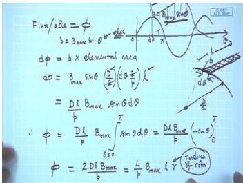
  <figcaption>Integration of the fundamental flux-density wave over a pole pitch.</figcaption>
</figure>

Hence
$$
\begin{aligned}
\varphi_1 &= \frac{2}{\pi} \times 0.25 \times 0.1885 = 0.0300 \text{ Wb},\\
\varphi_3 &= \frac{2}{3\pi} \times 0.16 \times 0.1885 = 0.00640 \text{ Wb},\\
\varphi_5 &= \frac{2}{5\pi} \times 0.07 \times 0.1885 = 0.00168 \text{ Wb}.
\end{aligned}
$$

**Induced EMF per phase for each harmonic**  
The rms value of the emf induced by the $n^{\text{th}}$ harmonic is  
$$E_n = 4.44\,(n f)\,\varphi_n\,T_{ph}\,K_{wn},$$  
where $K_{wn}$ is the winding factor for that harmonic. Substituting the given factors $K_{w1}=0.95$, $K_{w3}=0.58$, $K_{w5}=0.14$:

$$
\begin{aligned}
E_1 &= 4.44 \times 50 \times 0.0300 \times 36 \times 0.95 = 227.8 \text{ V},\\
E_3 &= 4.44 \times 150 \times 0.00640 \times 36 \times 0.58 = 89.0 \text{ V},\\
E_5 &= 4.44 \times 250 \times 0.00168 \times 36 \times 0.14 = 9.4 \text{ V}.
\end{aligned}
$$

**Resultant phase voltage**  
Because harmonic components are orthogonal, the total phase emf is the root-sum-square of the individual harmonic emfs:

$$
E_{ph} = \sqrt{E_1^2 + E_3^2 + E_5^2}
       = \sqrt{227.8^2 + 89.0^2 + 9.4^2}
       \approx 244.8 \text{ V}.
$$

**Line voltage**  
The machine is star-connected. Triplen (multiple-of-three) harmonics - here the 3rd harmonic - are co-phasal in all three phases and therefore cancel in the line-to-line voltage. Only non-triplen harmonics (fundamental and 5th) contribute. Thus the line emf is

$$
E_{L} = \sqrt{3} \; \sqrt{E_1^2 + E_5^2}
      = \sqrt{3} \times \sqrt{227.8^2 + 9.4^2}
      \approx 395.0 \text{ V}.
$$

> **Final answer:** Phase emf $\approx 244.8$ V (\approx 245 V); line emf $\approx 395.0$ V (\approx 395 V).


---

## Question 9
**Topic:** AC windings, winding factor, harmonics and generated EMF · **Syllabus area:** Weeks 3-4 · **Source:** 3A | EM-II ELE 2202 End Sem, 23 April 2018

A 3 phase, 10 pole, star connected alternator runs at 600 rpm. It has 120 stator slots with 8 conductors per slot. The conductors of each phase are connected in series. If the winding is short chorded by two slots, determine the rms value of phase and line electromotive forces if the flux per pole is 56 mWb. (04)

### Answer 9
Given: 3-phase, 10-pole, star-connected alternator, N = 600 rpm, 120 slots, 8 conductors per slot, short-chorded by 2 slots, φ = 56 mWb.

**Frequency**  
$$ f = \frac{P N}{120} = \frac{10 \times 600}{120} = 50\text{ Hz}. $$

**Slot angle**  
Slots per pole = 120/10 = 12.  
Electrical angle between adjacent slots:  
$$ \beta = \frac{180^\circ}{\text{slots per pole}} = \frac{180^\circ}{12} = 15^\circ. $$

**Short-chording angle**  
Coil short-pitched by 2 slots, so chording angle:  
$$ \alpha = 2 \times \beta = 2 \times 15^\circ = 30^\circ. $$

**Slots per pole per phase**  
$$ q = \frac{\text{total slots}}{P \times \text{phases}} = \frac{120}{10 \times 3} = 4. $$

**Distribution factor**  
$$ K_d = \frac{\sin(q\beta/2)}{q \sin(\beta/2)} = \frac{\sin(4 \times 7.5^\circ)}{4 \sin 7.5^\circ} = \frac{\sin 30^\circ}{4 \times 0.1305} = \frac{0.5}{0.522} \approx 0.9577. $$

**Pitch factor**  
$$ K_p = \cos\left(\frac{\alpha}{2}\right) = \cos 15^\circ \approx 0.9659. $$

**Winding factor**  
$$ K_w = K_d K_p = 0.9577 \times 0.9659 \approx 0.9250. $$

**Turns per phase**  
Total conductors = 120 slots \times 8 conductors/slot = 960.  
Since each turn needs two conductors and the three phases are in series,  
$$ T_{\text{ph}} = \frac{960}{2 \times 3} = 160 \text{ turns/phase}. $$

**Induced EMF per phase**  
RMS phase voltage:  
$$ E_{\text{ph}} = 4.44\, f\, \phi\, T_{\text{ph}}\, K_w $$  
Substituting:  
$$ 
\begin{aligned}
E_{\text{ph}} &= 4.44 \times 50 \times 0.056 \times 160 \times 0.9250 \\
&\approx 1840\ \text{V} = 1.84\ \text{kV}.
\end{aligned}
$$

**Line voltage (star connection)**  
$$ E_L = \sqrt{3}\, E_{\text{ph}} = \sqrt{3} \times 1840 \approx 3187\ \text{V} \approx 3.19\ \text{kV}. $$

> **Final answer:** Phase emf ≈ 1.84 kV; line emf ≈ 3.19 kV.


---

## Question 10
**Topic:** AC windings, winding factor, harmonics and generated EMF · **Syllabus area:** Weeks 3-4 · **Source:** 4B | EM-II ELE 2202 End Sem, 24 April 2017

A three-phase, 50 Hz, 1,000 rpm alternator has 108 slots. The armature is lap connected with a coil span of 160°. Calculate pitch & distribution factors for fundamental, 5th harmonic & 7th harmonic. (03)

### Answer 10
First, determine the number of poles. For a synchronous machine, the relation between frequency $f$, speed $N_s$ (in rpm), and number of poles $P$ is:

$$ N_s = \frac{120 f}{P} \quad \Rightarrow \quad P = \frac{120 \times 50}{1000} = 6 \text{ poles}. $$

Number of slots $S = 108$. Therefore,

- Slots per pole: $\dfrac{108}{6} = 18$.
- Slot angle (electrical): $\beta = \dfrac{180^\circ}{18} = 10^\circ$.
- Slots per pole per phase: $q = \dfrac{108}{6 \times 3} = 6$. (In a lap winding, the number of coils distributed per pole per phase is $m = q = 6$.)

The armature coils are lap connected with a coil span of $160^\circ$ electrical. Hence, the chording (short-pitch) angle is

$$ \alpha = 180^\circ - 160^\circ = 20^\circ. $$

---

### Distribution Factor ($K_d$)

For the $n$th harmonic, the distribution factor is given by

$$
K_{dn} = \frac{\sin\!\left(\frac{n m \beta}{2}\right)}{m \sin\!\left(\frac{n \beta}{2}\right)}.
$$

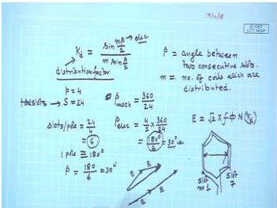
*Figure: Distribution factor formula, where $m$ is number of coils distributed and $\beta$ is the slot angle.*

### Pitch Factor ($K_p$)

For a coil short-pitched by an angle $\alpha$ (electrical), the pitch factor for the $n$th harmonic is

$$
K_{pn} = \cos\!\left(\frac{n \alpha}{2}\right).
$$

---

### Fundamental ($n=1$)

$$
\begin{aligned}
K_{d1} &= \frac{\sin\!\left(\frac{1 \times 6 \times 10^\circ}{2}\right)}{6 \sin\!\left(\frac{10^\circ}{2}\right)} 
= \frac{\sin 30^\circ}{6 \sin 5^\circ} 
= \frac{0.5}{6 \times 0.08716} = 0.9561. \\[6pt]
K_{p1} &= \cos\!\left(\frac{20^\circ}{2}\right) = \cos 10^\circ = 0.9848. \\[6pt]
K_{w1} &= K_{d1} \cdot K_{p1} = 0.9561 \times 0.9848 = 0.9416.
\end{aligned}
$$

### 5th Harmonic ($n=5$)

$$
\begin{aligned}
\text{Harmonic slot angle: } 5\beta = 50^\circ, &\quad \frac{5\beta}{2} = 25^\circ. \\
\text{Harmonic chording: } 5\alpha = 100^\circ, &\quad \frac{5\alpha}{2} = 50^\circ. \\[6pt]
K_{d5} &= \frac{\sin\!\left(6 \times 25^\circ\right)}{6 \sin 25^\circ} 
= \frac{\sin 150^\circ}{6 \sin 25^\circ} 
= \frac{0.5}{6 \times 0.4226} = 0.1972. \\[6pt]
K_{p5} &= \cos\!\left(\frac{100^\circ}{2}\right) = \cos 50^\circ = 0.6428. \\[6pt]
K_{w5} &= K_{d5} \cdot K_{p5} = 0.1972 \times 0.6428 = 0.1267.
\end{aligned}
$$

### 7th Harmonic ($n=7$)

$$
\begin{aligned}
\text{Harmonic slot angle: } 7\beta = 70^\circ, &\quad \frac{7\beta}{2} = 35^\circ. \\
\text{Harmonic chording: } 7\alpha = 140^\circ, &\quad \frac{7\alpha}{2} = 70^\circ. \\[6pt]
K_{d7} &= \frac{\sin\!\left(6 \times 35^\circ\right)}{6 \sin 35^\circ} 
= \frac{\sin 210^\circ}{6 \sin 35^\circ} 
= \frac{-0.5}{6 \times 0.5736} = -0.1453 \\[6pt]
& \text{(magnitude } 0.1453\text{)}. \\[6pt]
K_{p7} &= \cos\!\left(\frac{140^\circ}{2}\right) = \cos 70^\circ = 0.3420. \\[6pt]
|K_{w7}| &= 0.1453 \times 0.3420 = 0.0497.
\end{aligned}
$$

> **Final answer:**
> - **Fundamental:** $K_d = 0.956$, $K_p = 0.985$, $K_w = 0.942$.
> - **5th harmonic:** $K_d = 0.197$, $K_p = 0.643$, $K_w = 0.127$.
> - **7th harmonic:** $K_d = -0.145$ (magnitude $0.145$), $K_p = 0.342$, $|K_w| = 0.0497$.


---

## Question 11
**Topic:** AC windings, winding factor, harmonics and generated EMF · **Syllabus area:** Weeks 3-4 · **Source:** 3C | EM-II ELE 2202 End Sem, 29 April 2019

In a star-connected alternator calculate the percentage of 5th harmonics induced in the line voltage if the average flux per pole of fifth harmonic components is 1% of that of the fundamental. Neglect the pitch and distribution factors. (02)

### Answer 11
To determine the percentage of 5th harmonic in the line voltage of a star-connected alternator, we start with the general expression for the induced EMF per phase. For a sinusoidal flux distribution, the RMS value of the induced EMF per phase due to the fundamental component is

$$ E_{ph,1} = 4.44 \, f_1 \, N_{ph} \, \phi_1 \, k_{w1}, $$

where $f_1$ is the fundamental frequency, $N_{ph}$ the number of series turns per phase, $\phi_1$ the fundamental flux per pole, and $k_{w1}$ the winding factor for the fundamental. For the $n$-th harmonic, the frequency becomes $f_n = n f_1$, and the flux per pole is $\phi_n$. Assuming the same winding (so $N_{ph}$ unchanged) and neglecting pitch and distribution factors (or assuming $k_{wn}=1$), the induced phase EMF for the $n$-th harmonic is

$$ E_{ph,n} \propto n \, \phi_n. $$

Given that the average flux per pole of the 5th harmonic is $1\%$ of the fundamental, i.e., $\phi_5 = 0.01\,\phi_1$, the ratio of the 5th harmonic phase EMF to the fundamental phase EMF is

$$
\frac{E_{ph,5}}{E_{ph,1}} = \frac{5 \, \phi_5}{1 \, \phi_1} = 5 \times 0.01 = 0.05 = 5\%.
$$

Now, in a star-connected alternator, the line voltage is related to the phase voltage by $E_L = \sqrt{3}\,E_{ph}$ for balanced fundamental components. For the 5th harmonic, the phase voltages are also balanced but have a phase displacement of $5 \times 120^\circ = 600^\circ \equiv 240^\circ$ (or $-120^\circ$). This still yields a line voltage equal to $\sqrt{3}$ times the phase voltage for the 5th harmonic (the vector sum of two phase voltages separated by $240^\circ$ has magnitude $\sqrt{3}$ times the phase voltage). Since the 5th harmonic is not a triplen harmonic (multiples of three), it does not cancel in the line voltage. Therefore, the percentage of the 5th harmonic in the line voltage is exactly the same as that in the phase voltage.

> **Final answer:** The 5th harmonic line-voltage component is $5\%$ of the fundamental line voltage.


---

## Question 12
**Topic:** AC windings, winding factor, harmonics and generated EMF · **Syllabus area:** Weeks 3-4 · **Source:** 2B | EM-II ELE 2202 Makeup, 02 July 2016

A three phase, 50 Hz, 1000 rpm, star connected alternator has an air-gap area of 314 cm² per pole. The armature winding has a phase spread of 60° and is accommodated in 4 slots per pole per phase with 6 conductors per slot. The coils are short pitched with a span of 165°. The flux density distribution is given by Bmax = 0.9 sin θ + 0.35 sin 3θ. Determine, (a) Winding factors for fundamental and third harmonic components. (b) Induced emf per phase. 6M

### Answer 12
Synchronous speed $N_s = 1000$ rpm, $f = 50$ Hz $\Rightarrow$ poles $P = 6$.

Given 4 slots per pole per phase, $q = 4$; total slots $S = q \times 3 \times P = 4 \times 3 \times 6 = 72$.
Slots per pole $= 72/6 = 12$; slot angle $\beta = 180^\circ/12 = 15^\circ$ electrical.
Coil span $= 165^\circ$ electrical, so chording $\varepsilon = 180^\circ - 165^\circ = 15^\circ$.

  
*Short-pitched coil (span 165°, chord angle 15°).*

**(a) Winding factors**

**Fundamental:**
$$
K_{d1} = \frac{\sin(q\beta/2)}{q\sin(\beta/2)} = \frac{\sin(4 \times 7.5^\circ)}{4 \sin 7.5^\circ} = \frac{\sin 30^\circ}{4 \times 0.1305} = 0.9577.
$$
$$
K_{p1} = \cos(\varepsilon/2) = \cos 7.5^\circ = 0.9914.
$$
$$
K_{w1} = K_{d1} K_{p1} = 0.9577 \times 0.9914 = 0.9495.
$$

**Third harmonic:**
Harmonic slot angle $= 3\beta = 45^\circ$, harmonic chording $= 3\varepsilon = 45^\circ$.
$$
K_{d3} = \frac{\sin(4 \times 22.5^\circ)}{4 \sin 22.5^\circ} = \frac{\sin 90^\circ}{4 \times 0.3827} = 0.6533.
$$
$$
K_{p3} = \cos(22.5^\circ) = 0.9239.
$$
$$
K_{w3} = 0.6533 \times 0.9239 = 0.6035.
$$

Thus $K_{w1} \approx 0.950$, $K_{w3} \approx 0.604$.

**(b) Induced emf per phase**

- Total conductors $= 72 \times 6 = 432$; $T_{ph} = \frac{432}{2 \times 3} = 72$ turns.
- Area per pole $A_p = 314 \text{ cm}^2 = 0.0314 \text{ m}^2$.
- Fundamental flux per pole: $\phi_1 = \frac{2}{\pi} B_{1,\max} A_p = \frac{2}{\pi} \times 0.9 \times 0.0314 = 0.0180 \text{ Wb}$.
- Fundamental phase emf: $E_1 = 4.44 f \phi_1 T_{ph} K_{w1} = 4.44 \times 50 \times 0.0180 \times 72 \times 0.9495 \approx 273.1 \text{ V}$.

The third-harmonic emf can be found from the ratio of flux-density amplitudes and winding factors (since the $k$ factor cancels):
$$
E_3 = E_1 \cdot \frac{B_{3,\max} K_{w3}}{B_{1,\max} K_{w1}} = 273.1 \times \frac{0.35 \times 0.6035}{0.9 \times 0.9495} = 273.1 \times 0.2472 = 67.5 \text{ V}.
$$

Resultant phase voltage (rms):
$$
E_{ph} = \sqrt{E_1^2 + E_3^2} = \sqrt{273.1^2 + 67.5^2} \approx 281.3 \text{ V}.
$$

> **Final answer:** (a) $K_{w1} = 0.950$, $K_{w3} = 0.604$. (b) Phase emf $\approx 281$ V.


---

## Question 13
**Topic:** AC windings, winding factor, harmonics and generated EMF · **Syllabus area:** Weeks 3-4 · **Source:** 3A | EM-II ELE 2202 Makeup, 13 June 2019

A 3-phase, 50 Hz, 1000 rpm, star connected alternator has 72 armature slots with 6 conductors per slot and the coil span is 10 slots. The average air-gap flux per pole is 0.26 Wb. Calculate the distribution and pitch factors of the winding, number of turns per phase and line value of emf induced. (05)

### Answer 13
**Step 1: Determine the number of poles**  
The synchronous speed of an alternator is given by $N_s = \frac{120f}{P}$. Rearranging, $P = \frac{120f}{N_s} = \frac{120 \times 50}{1000} = 6$ poles.

**Step 2: Slot angle and slots per pole per phase**  
Total slots $S = 72$.  
Slots per pole $= \frac{72}{6} = 12$.  
Electrical angle between adjacent slots:  
$$\beta = \frac{180^\circ}{\text{slots per pole}} = \frac{180^\circ}{12} = 15^\circ \text{ (electrical)}.$$  
Slots per pole per phase, $q = \frac{S}{m\,P} = \frac{72}{3 \times 6} = 4$, where $m = 3$ is the number of phases.

**Step 3: Distribution factor $K_d$**  
For a distributed winding with $q$ slots per pole per phase, the distribution factor is  
$$
K_d = \frac{\sin(q \beta/2)}{q \sin(\beta/2)}.
$$
Substituting $q = 4$ and $\beta/2 = 7.5^\circ$,
$$
K_d = \frac{\sin(4 \times 7.5^\circ)}{4 \sin 7.5^\circ} = \frac{\sin 30^\circ}{4 \sin 7.5^\circ} = \frac{0.5}{4 \times 0.130526} \approx 0.9577.
$$
Thus $K_d \approx 0.958$.

**Step 4: Pitch factor $K_p$**  
The coil span is 10 slots, while a full-pole pitch is 12 slots. The coil is therefore short-pitched by 2 slots, which corresponds to an electrical angle  
$$\alpha = (12 - 10) \times \beta = 2 \times 15^\circ = 30^\circ.$$
Equivalently, the coil span in electrical degrees is $10 \times 15^\circ = 150^\circ$, giving $\alpha = 180^\circ - 150^\circ = 30^\circ$.  
The pitch factor for a short-pitched coil is
$$
K_p = \cos\left(\frac{\alpha}{2}\right) = \cos 15^\circ \approx 0.9659.
$$
Hence $K_p \approx 0.966$.

<figure>
  
  <figcaption>Figure: Illustration of coil span and pitch factor. A full-pitch coil spans exactly one pole pitch (180° electrical); a short-pitch coil spans less, and the introduced angle reduces the emf by $\cos(\alpha/2)$.</figcaption>
</figure>

The winding factor is  
$$
K_w = K_d \cdot K_p \approx 0.9577 \times 0.9659 = 0.9250.
$$

**Step 5: Turns per phase**  
Total number of armature conductors = $72 \text{ slots} \times 6 \text{ conductors/slot} = 432$.  
In a 3-phase double-layer winding, each turn requires two conductors, so the turns per phase is
$$
T_{ph} = \frac{\text{Total conductors}}{2 \times \text{phases}} = \frac{432}{2 \times 3} = 72.
$$

**Step 6: Induced EMF**  
The rms value of the induced emf per phase for a synchronous generator is
$$
E_{ph} = 4.44 \, f \, \phi \, T_{ph} \, K_w,
$$
where $\phi$ is the flux per pole. The given average air-gap flux per pole ($0.26\,\text{Wb}$) is directly used because the standard derivation of the $4.44$ factor employs the total flux per pole (which is the average flux over the pole face). Substituting the known values:
$$
\begin{aligned}
E_{ph} &= 4.44 \times 50 \times 0.26 \times 72 \times 0.9250 \\[2pt]
&= (222) \times (0.26) \times (72) \times 0.9250 \\[2pt]
&= 57.72 \times 72 \times 0.9250 \\[2pt]
&= 4155.84 \times 0.9250 \\[2pt]
&\approx 3844.15 \text{ V} \approx 3.84 \text{ kV}.
\end{aligned}
$$

Since the alternator is star-connected, the line emf is
$$
E_L = \sqrt{3} \, E_{ph} \approx 1.732 \times 3844.15 \approx 6659.2 \text{ V} \approx 6.66 \text{ kV}.
$$

> **Final answer:**  
> Distribution factor $K_d = 0.958$, pitch factor $K_p = 0.966$ (winding factor $K_w = 0.925$).  
> Number of turns per phase $T_{ph} = 72$.  
> Induced phase emf $E_{ph} = 3.84$ kV; line emf $E_L = 6.66$ kV.


---

## Question 14
**Topic:** AC windings, winding factor, harmonics and generated EMF · **Syllabus area:** Weeks 3-4 · **Source:** 3B | EM-II ELE 2202 Makeup, 16 June 2017

A 3-phase, 50 Hz, 1000 rpm, star connected alternator has 72 armature slots with 6 conductors per slot and the coil span is 10 slots. The average air-gap flux per pole is 0.26Wb. Calculate the distribution and pitch factors of the winding, number of turns per phase and line value of emf induced. (04)

### Answer 14
First, find the number of poles:
$$
P = \frac{120f}{N} = \frac{120 \times 50}{1000} = 6.
$$

Slots per pole:
$$
\frac{72}{6} = 12.
$$

The electrical angle between adjacent slots (slot pitch) is
$$
\beta = \frac{180^\circ}{\text{slots per pole}} = \frac{180^\circ}{12} = 15^\circ \text{ elect}.
$$


*Figure: Slot angle β and distributed coils.*

**Distribution factor:** The winding has $q$ slots per pole per phase:
$$
q = \frac{S}{P \times m} = \frac{72}{6 \times 3} = 4.
$$
The distribution factor (breadth factor) is
$$
K_d = \frac{\sin(q\beta/2)}{q \sin(\beta/2)} = \frac{\sin(4 \times 7.5^\circ)}{4 \sin 7.5^\circ} = \frac{\sin 30^\circ}{4 \sin 7.5^\circ}.
$$
With $\sin 30^\circ = 0.5$ and $\sin 7.5^\circ \approx 0.1305$,
$$
K_d = \frac{0.5}{4 \times 0.1305} \approx 0.9577.
$$

**Pitch factor:** The coil span is 10 slots, while a full-pitch coil would span 12 slots (180° electrical). The coil is therefore short-pitched by 2 slots, corresponding to an electrical angle of
$$
\alpha = 2 \times \beta = 2 \times 15^\circ = 30^\circ.
$$
The pitch factor (chording factor) is
$$
K_p = \cos\frac{\alpha}{2} = \cos 15^\circ \approx 0.9659.
$$
(Equivalently, $K_p = \sin\bigl(\frac{10}{12} \times 90^\circ\bigr) = \sin 75^\circ = 0.9659$.)

The overall winding factor is
$$
K_w = K_d K_p = 0.9577 \times 0.9659 \approx 0.9250.
$$

**Turns per phase:** The armature has 72 slots with 6 conductors per slot. In a double-layer winding (standard for such alternators) each slot contains two coil sides. Hence the number of turns per coil is
$$
N_c = \frac{\text{conductors per slot}}{2} = \frac{6}{2} = 3.
$$
The total number of coils equals the number of slots (in a double-layer winding) = 72. For three phases, the coils per phase are $72/3 = 24$. Therefore the series turns per phase are
$$
T_{ph} = 24 \times 3 = 72.
$$

**Induced EMF:** For an alternator, the RMS phase EMF is given by
$$
E_{ph} = 4.44\, f\, T_{ph}\, \Phi\, K_w,
$$
where $\Phi$ is the average air-gap flux per pole (0.26 Wb used directly as is common practice). Substituting,
$$
\begin{aligned}
E_{ph} &= 4.44 \times 50 \times 72 \times 0.26 \times 0.9250 \\
       &\approx 3844 \text{ V}.
\end{aligned}
$$
For a star-connected machine the line EMF is
$$
E_L = \sqrt{3}\, E_{ph} \approx 1.732 \times 3844 \approx 6659 \text{ V} \;\;(\text{or } 6.66 \text{ kV}).
$$

> **Final answer:** $K_d = 0.958$, $K_p = 0.966$; $T_{ph} = 72$; line emf $\approx 6.66$ kV.


---

## Question 15
**Topic:** AC windings, winding factor, harmonics and generated EMF · **Syllabus area:** Weeks 3-4 · **Source:** 3A | EM-II ELE 2202 Makeup, 19 June 2018

For a synchronous generator, derive suitable expressions for (i) Pitch factor (ii) Distribution factor (04)

### Answer 15
**Pitch Factor ($K_p$)**  

In a full-pitch coil the two coil sides are separated by exactly one pole pitch ($180^\circ$ electrical). The emfs induced in the two sides are equal in magnitude and, when traversing the coil, add arithmetically because they are in phase opposition:  

$$
E_{\text{coil, full-pitch}} = 2E_{\text{conductor}} .
$$

If the coil is short-pitched (chorded) by an angle $\alpha$ (coil span $= 180^\circ - \alpha$), the two emfs are displaced by $\alpha$ electrical. Their phasor sum is  

$$
E_{\text{coil}} = 2E_{\text{conductor}} \cos\!\left(\frac{\alpha}{2}\right).
$$

Hence the pitch factor is  

$$
\boxed{K_p = \frac{\text{actual coil emf}}{\text{full-pitch coil emf}} = \cos\!\left(\frac{\alpha}{2}\right)} .
$$

For the $n$-th harmonic the chording angle becomes $n\alpha$, giving  

$$
K_{pn} = \cos\!\left(\frac{n\alpha}{2}\right).
$$

---

**Distribution Factor ($K_d$)**  

In a distributed winding the $q$ coils of a phase group under one pole are placed in adjacent slots, each displaced by the slot angle $\beta$ electrical. The emfs induced in the $q$ coils are equal in magnitude but have successive phase differences of $\beta$.  

The arithmetic sum of the coil emfs is $qE_{\text{coil}}$, while the actual phasor sum is the chord of a circle formed by $q$ equal phasors separated by $\beta$:  

$$
\text{Phasor sum} = E_{\text{coil}} \frac{\sin(q\beta/2)}{\sin(\beta/2)} .
$$

Therefore the distribution factor is  

$$
\boxed{K_d = \frac{\text{phasor sum}}{qE_{\text{coil}}} = \frac{\sin(q\beta/2)}{q\,\sin(\beta/2)}} .
$$

For the $n$-th harmonic the effective slot angle is $n\beta$, so  

$$
K_{dn} = \frac{\sin(q\,n\beta/2)}{q\,\sin(n\beta/2)} .
$$

---

The overall winding factor is the product $K_w = K_p K_d$, which reduces the generated emf from the ideal concentrated full-pitch value.

> **Final answer:** $K_p = \cos(\alpha/2)$ ; $K_d = \dfrac{\sin(q\beta/2)}{q\sin(\beta/2)}$ .


---

## Question 16
**Topic:** AC windings, winding factor, harmonics and generated EMF · **Syllabus area:** Weeks 3-4 · **Source:** 1B | EM-II ELE 2225 End Sem, 09 May 2024

A 3-phase, 32-pole, 50Hz alternator used in a hydro-generating station has a star-connected winding with 288 slots and 8 conductors per slot. The coil is short pitched by 40°. The flux per pole is 0.08 Wb. Estimate the phase and line values of induced emfs. Assume the total turns per phase are series connected. 4

### Answer 16
Given:
- Number of poles, $P = 32$
- Frequency, $f = 50\; \text{Hz}$
- Total slots, $S = 288$
- Conductors per slot = 8
- Short-pitch angle (chording angle), $\alpha = 40^\circ$ (electrical)
- Flux per pole, $\phi = 0.08\; \text{Wb}$
- Star-connected winding; all turns per phase are in series.

First, compute the fundamental slot angle $\beta$ (electrical degrees between adjacent slots):
$$
\beta = \frac{180^\circ}{\text{slots per pole}} = \frac{180^\circ}{S/P} = \frac{180^\circ}{288/32} = \frac{180^\circ}{9} = 20^\circ \text{ electrical}.
$$

Number of slots per pole per phase, $q$:
$$
q = \frac{S}{P \times 3} = \frac{288}{32 \times 3} = 3.
$$

**Distribution factor** (or breadth factor):
$$
K_d = \frac{\sin(q\beta/2)}{q\sin(\beta/2)} = \frac{\sin(3 \times 10^\circ)}{3 \sin 10^\circ} = \frac{\sin 30^\circ}{3 \sin 10^\circ} = \frac{0.5}{3 \times 0.17365} \approx 0.9598.
$$

**Pitch factor** (or chording factor) for a short-pitch of $\alpha$:
$$
K_p = \cos\left(\frac{\alpha}{2}\right) = \cos 20^\circ \approx 0.9397.
$$

**Winding factor:**
$$
K_w = K_d \cdot K_p = 0.9598 \times 0.9397 \approx 0.9019.
$$

**Total series turns per phase:**  
Total armature conductors = $\text{Slots} \times \text{Conductors per slot} = 288 \times 8 = 2304$.  
In a 3-phase winding, assuming all turns of a phase are in series, the number of turns per phase is
$$
T_{\text{ph}} = \frac{\text{Total conductors}}{2 \times \text{number of phases}} = \frac{2304}{2 \times 3} = 384.
$$
(Each turn comprises two conductors.)

**Induced EMF per phase:**  
The rms value of the induced emf per phase is given by
$$
E_{\text{ph}} = 4.44\, f\, \phi\, T_{\text{ph}}\, K_w.
$$
Substituting the values:
$$
\begin{aligned}
E_{\text{ph}} &= 4.44 \times 50 \times 0.08 \times 384 \times 0.9019 \\
&= 222 \times 0.08 \times 384 \times 0.9019 \\
&= 17.76 \times 384 \times 0.9019 \\
&= 6819.84 \times 0.9019 \approx 6151\ \text{V} = 6.15\ \text{kV}.
\end{aligned}
$$

**Line voltage** for a star-connected alternator:
$$
E_L = \sqrt{3}\, E_{\text{ph}} = 1.732 \times 6151 \approx 10654\ \text{V} = 10.65\ \text{kV}.
$$

> **Final answer:** Phase emf $\approx 6.15$ kV; line emf $\approx 10.65$ kV.


---

## Question 17
**Topic:** AC windings, winding factor, harmonics and generated EMF · **Syllabus area:** Weeks 3-4 · **Source:** 1B | EM-II ELE 2225 Makeup, 26 June 2024

A 3-phase alternator has 2 slots per pole per phase and a coil span of 5 slot pitch. The flux density wave of alternator consists of a fundamental and a 25% third harmonic. Calculate the percentage increase in the phase voltage due to harmonic. 3

### Answer 17
For a 3-phase alternator with $q = 2$ slots per pole per phase, the number of slots per pole is $3 \times 2 = 6$. The slot pitch (electrical angle) is $\beta = 180^\circ / 6 = 30^\circ$ electrical.

The coil span is 5 slots, so the coil is short-pitched by $6 - 5 = 1$ slot. The mechanical angle of short-pitch is $\alpha = 1 \times 30^\circ = 30^\circ$ electrical (fundamental).

The winding factor for any harmonic order $k$ is
$$
K_{w_k} = K_{d_k} \cdot K_{p_k}
$$
where
$$
K_{d_k} = \frac{\sin(q \cdot k\beta/2)}{q \sin(k\beta/2)}, \quad K_{p_k} = \cos\left(\frac{k\alpha}{2}\right).
$$

For the fundamental ($k=1$):
- $K_{d1} = \frac{\sin(2 \times 30^\circ/2)}{2 \sin(30^\circ/2)} = \frac{\sin 30^\circ}{2 \sin 15^\circ} = \frac{0.5}{2 \times 0.2588} \approx 0.9659$.
- $K_{p1} = \cos(30^\circ/2) = \cos 15^\circ \approx 0.9659$.
Thus $K_{w1} = 0.9659 \times 0.9659 \approx 0.9330$.

For the third harmonic ($k=3$):
- $K_{d3} = \frac{\sin(2 \times 90^\circ/2)}{2 \sin(90^\circ/2)} = \frac{\sin 90^\circ}{2 \sin 45^\circ} = \frac{1}{2 \times 0.7071} \approx 0.7071$.
- $K_{p3} = \cos(3 \times 30^\circ/2) = \cos 45^\circ \approx 0.7071$.
Thus $K_{w3} = 0.7071 \times 0.7071 = 0.500$.

Given the flux density wave has a fundamental $B_1$ and a $25\%$ third harmonic $B_3 = 0.25 B_1$, the ratio of induced EMFs is
$$
\frac{E_3}{E_1} = \frac{B_3 K_{w3}}{B_1 K_{w1}} = 0.25 \times \frac{0.500}{0.9330} \approx 0.1340.
$$

The resultant RMS phase voltage is
$$
E_{ph} = \sqrt{E_1^2 + E_3^2} = E_1 \sqrt{1 + (0.1340)^2} \approx E_1 \sqrt{1.01796} \approx 1.00894\,E_1.
$$

Hence the percentage increase in phase voltage due to the third harmonic is
$$
\frac{1.00894 - 1}{1} \times 100\% = 0.894\% \approx 0.89\%.
$$

> **Final answer:** Phase voltage increases by approximately $0.89\%$.


---

## Question 18
**Topic:** AC windings, winding factor, harmonics and generated EMF · **Syllabus area:** Weeks 3-4 · **Source:** 1C | EM-II ELE 2251 End Sem, 31 May 2023

Determine the distribution factor corresponding to the fifth harmonic component of generated voltage in a three-phase, 50 Hz, AC generator with 54 slots & 6 poles. Also, comment on the effects of the fifth harmonic component in the generated voltage. (03)

### Answer 18
We need to compute the distribution factor for the fifth harmonic. Given: 54 slots, 6 poles, 3-phase.

Number of slots per pole: $\frac{54}{6} = 9$.

Slot angular pitch (electrical): Since one pole pitch corresponds to 180° electrical, the angle between adjacent slots is $\beta = \frac{180^\circ}{9} = 20^\circ$ electrical.

Number of slots per pole per phase ($q$): $q = \frac{\text{slots}}{p \times m} = \frac{54}{6 \times 3} = 3$.

For the $\nu$-th harmonic, the effective slot angle becomes $\nu \beta$. For the fifth harmonic ($\nu = 5$), the effective slot angle is $5 \beta = 5 \times 20^\circ = 100^\circ$.

The distribution factor for the $\nu$-th harmonic is:

$$
K_{d\nu} = \frac{\sin\left( q \frac{\nu \beta}{2} \right)}{q \sin\left( \frac{\nu \beta}{2} \right)}.
$$

Plug in $q = 3$ and $\frac{\nu \beta}{2} = \frac{100^\circ}{2} = 50^\circ$:

$$
\begin{aligned}
K_{d5} &= \frac{\sin(3 \times 50^\circ)}{3 \sin 50^\circ} \\
&= \frac{\sin 150^\circ}{3 \sin 50^\circ} \\
&= \frac{0.5}{3 \times 0.7660} \\
&\approx \frac{0.5}{2.298} \\
&\approx 0.2176.
\end{aligned}
$$

Thus, the distribution factor for the fifth harmonic is approximately 0.218.

**Effects of the fifth harmonic:** The fifth harmonic is of order $6k - 1$ (with $k=1$), making it a negative-sequence harmonic. Its presence distorts the voltage waveform, leading to increased dielectric stress on insulation. It induces higher-frequency currents that cause additional $I^2R$ losses and stray load losses. In a star-connected generator, the fifth harmonic does not cancel in the line voltage (unlike triplen harmonics), so it appears directly across the terminals, contributing to pulsating torques and potentially interfering with other equipment. Designers mitigate the fifth harmonic by proper choice of coil pitch (chording) and winding distribution.

> **Final answer:** $K_{d5} \approx 0.218$; the 5th harmonic is negative-sequence, causes waveform distortion, extra losses, and appears in the line voltage.


---

## Question 19
**Topic:** AC windings, winding factor, harmonics and generated EMF · **Syllabus area:** Weeks 3-4 · **Source:** 2B | EM-II ELE 2251 End Sem, 31 May 2023

Consider a 3-phase, 8 pole, 50 Hz, star-connected alternator. The average flux in the machine is 40 mWb /pole. The armature has 72 slots with 10 conductors in each slot. Calculate the induced voltage per phase. The coils are short-pitched by 2 slots. (04)

### Answer 19
**Given data:**  
3-phase, 8-pole, 50 Hz, star-connected alternator.  
Average flux per pole, $\phi = 40\;\text{mWb} = 0.04\;\text{Wb}$.  
Armature slots $S = 72$, conductors per slot $= 10$.  
Coils short-pitched by $2$ slots.

---

### Step 1: Slot angle and winding layout
Slots per pole $= \frac{S}{p} = \frac{72}{8} = 9$ slots/pole.  
Slot angle (electrical) $\beta = \frac{180^\circ}{\text{slots per pole}} = \frac{180^\circ}{9} = 20^\circ$.

Number of slots per pole per phase (phase-spread),  
$q = \frac{S}{p\,m} = \frac{72}{8 \times 3} = 3$.

---

### Step 2: Pitch factor (chording factor)
The coil is short-pitched by $2$ slots → the short-pitch angle  
$\alpha = 2 \times \beta = 2 \times 20^\circ = 40^\circ$ (electrical).  
Pitch factor,  
$$
K_p = \cos\frac{\alpha}{2} = \cos 20^\circ \approx 0.9397.
$$

---

### Step 3: Distribution factor (breadth factor)
For a uniformly distributed winding,  
$$
K_d = \frac{\sin\bigl(q\,\tfrac{\beta}{2}\bigr)}{q\,\sin\bigl(\tfrac{\beta}{2}\bigr)}.
$$
Substituting $q=3$, $\beta/2 = 10^\circ$:  
$$
K_d = \frac{\sin 30^\circ}{3\sin 10^\circ} = \frac{0.5}{3 \times 0.173648} \approx 0.9598.
$$

---

### Step 4: Winding factor
$$
K_w = K_d \times K_p = 0.9598 \times 0.9397 \approx 0.9019.
$$

---

### Step 5: Turns per phase
The total number of armature conductors,  
$Z = \text{slots} \times \text{conductors/slot} = 72 \times 10 = 720$.  
Conductors per phase $= \frac{Z}{m} = \frac{720}{3} = 240$.  
Since each turn consists of two conductors,  
$$
T_{\text{ph}} = \frac{\text{conductors per phase}}{2} = \frac{240}{2} = 120 \;\text{turns}.
$$

---

### Step 6: Induced EMF per phase
The rms value of the sinusoidal induced voltage is given by  
$$
E_{\text{ph}} = 4.44\; f\; \phi\; T_{\text{ph}}\; K_w.
$$
Substituting the values:  
$$
\begin{aligned}
E_{\text{ph}} &= 4.44 \times 50 \times 0.04 \times 120 \times 0.9019 \\
&= 222 \times 0.04 \times 120 \times 0.9019 \\
&= 8.88 \times 120 \times 0.9019 \\
&= 1065.6 \times 0.9019 \\
&\approx 961 \;\text{V}.
\end{aligned}
$$

> **Final answer:** Phase induced voltage $\approx 961$ V.


---

## Question 20
**Topic:** AC windings, winding factor, harmonics and generated EMF · **Syllabus area:** Weeks 3-4 · **Source:** 3A | EM-II ELE 2251 Grade Improvement, 11 August 2021

A 3-phase, 50 Hz, 1000 rpm, star connected alternator has 72 armature slots with 6 conductors per slot and the coil span is 10 slots. The average air-gap flux per pole is 0.26Wb. Calculate the distribution and pitch factors of the winding, number of turns per phase and line value of emf induced. (06)

### Answer 20
To determine the induced EMF, we first find the number of poles:

$$
P = \frac{120f}{N} = \frac{120 \times 50}{1000} = 6 \text{ poles}.
$$

The alternator has $S = 72$ slots. Thus:

- Slots per pole: $\displaystyle \frac{S}{P} = \frac{72}{6} = 12$.
- Slots per pole per phase: $\displaystyle q = \frac{\text{slots per pole}}{\text{number of phases}} = \frac{12}{3} = 4$.
- Slot angular pitch (electrical): $\displaystyle \beta = \frac{180^\circ}{\text{slots per pole}} = \frac{180^\circ}{12} = 15^\circ$ electrical.

**Distribution factor**  
When coils are distributed in $q$ adjacent slots, the resultant voltage is reduced by the distribution factor $K_d$:

$$
K_d = \frac{\sin\left(\frac{q\beta}{2}\right)}{q \sin\left(\frac{\beta}{2}\right)}.
$$

Substituting $q = 4$, $\beta = 15^\circ$:

$$
\begin{aligned} \frac{q\beta}{2} &= 4 \times 7.5^\circ = 30^\circ,\\ K_d &= \frac{\sin 30^\circ}{4 \sin 7.5^\circ} = \frac{0.5}{4 \times 0.130526} \approx 0.9577. \end{aligned}
$$

  
*Slot angle and distributed coils*

**Pitch factor**  
The coil span is 10 slots, whereas full pitch is 12 slots. Hence the coil is short-pitched by $(12 - 10) = 2$ slots. In electrical degrees:

$$
\begin{aligned} \text{Coil span} &= 10 \times 15^\circ = 150^\circ,\\ \text{Short-pitch angle } \alpha &= 180^\circ - 150^\circ = 30^\circ. \end{aligned}
$$

The pitch factor (or coil-span factor) is given by:

$$
K_p = \cos\frac{\alpha}{2} = \cos 15^\circ \approx 0.9659,
$$

or equivalently $K_p = \sin(\text{coil span}/2) = \sin 75^\circ \approx 0.9659$.

  
*Pitch factor illustration*

**Winding factor**  

$$
K_w = K_d \times K_p = 0.9577 \times 0.9659 \approx 0.9250.
$$

**Turns per phase**  
Each slot contains 6 conductors, giving a total of $72 \times 6 = 432$ conductors. For a three-phase winding, the conductors are equally divided among the phases:

$$
\text{Conductors per phase} = \frac{432}{3} = 144.
$$

Since two conductors form one turn, the series turns per phase are:

$$
T_{ph} = \frac{144}{2} = 72.
$$

**Induced EMF**  
For a sinusoidal flux distribution, the r.m.s. phase voltage is:

$$
E_{ph} = 4.44\, f\, \phi\, T_{ph}\, K_w,
$$

where $\phi = 0.26\,\text{Wb}$ (flux per pole), $f = 50\,\text{Hz}$. Substituting the values:

$$
\begin{aligned} E_{ph} &= 4.44 \times 50 \times 0.26 \times 72 \times 0.9250 \\ &\approx 3844\,\text{V}. \end{aligned}
$$

The alternator is star-connected, so the line voltage is:

$$
E_L = \sqrt{3}\, E_{ph} = 1.732 \times 3844 \approx 6659\,\text{V} \;\text{or}\; 6.66\,\text{kV}.
$$

> **Final answer:** $K_d = 0.958$, $K_p = 0.966$; $T_{ph} = 72$; line emf $\approx 6.66$ kV.


---

## Question 21
**Topic:** AC windings, winding factor, harmonics and generated EMF · **Syllabus area:** Weeks 3-4 · **Source:** 4B-ii | EM-II ELE 2251 Grade Improvement, 11 August 2021

The stator of a 3-phase alternator has nine slots per pole and carries a balanced 3-phase, double-layer winding. The coils are short pitched and the coil pitch is seven slots. Find the distribution factor and pitch factor. (part ii)

### Answer 21
Slots per pole $= 9$, therefore slot angle $\beta = \frac{180^\circ}{9} = 20^\circ$ electrical.

For a balanced three-phase winding, the number of slots per pole per phase is
$$q = \frac{\text{slots per pole}}{\text{number of phases}} = \frac{9}{3} = 3.$$

The distribution factor for a $60^\circ$ phase-spread winding is given by
$$K_d = \frac{\sin\!\left(\dfrac{q\beta}{2}\right)}{q \sin\!\left(\dfrac{\beta}{2}\right)}.$$
Substituting $q = 3$ and $\beta/2 = 10^\circ$:
$$\begin{aligned}
K_d &= \frac{\sin(3 \times 10^\circ)}{3 \sin 10^\circ} = \frac{\sin 30^\circ}{3 \sin 10^\circ} \\
&= \frac{0.5}{3 \times 0.173648} = 0.9598 \approx 0.960.
\end{aligned}$$

The full-pitch coil span would be $9$ slots ($=180^\circ$ electrical). The actual coil pitch is $7$ slots, so the coil is short-pitched by $2$ slots. The chording angle (electrical angle of short-pitch) is
$$\alpha = 2 \times 20^\circ = 40^\circ.$$
The pitch factor (or coil-span factor) for a short-pitched coil is
$$K_p = \cos\!\left(\frac{\alpha}{2}\right).$$
Hence,
$$K_p = \cos\!\left(\frac{40^\circ}{2}\right) = \cos 20^\circ = 0.9397 \approx 0.940.$$

> **Final answer:** $K_d = 0.960$, $K_p = 0.940$.


---

## Question 22
**Topic:** Three-phase induction motor fundamentals, equivalent circuit and power flow · **Syllabus area:** Weeks 6-8 · **Source:** 5B | EM-I ELE 205 End Sem, 04 December 2006

A 115 V, 60 Hz, 3 phase star connected, 6 pole induction motor has stator impedance of (0.07+j0.3) Ω and equivalent rotor impedance at standstill of (0.08+j0.3) Ω. Magnetising branch has G₀ = 0.022 and B₀ = 0.158. Using the approximate equivalent circuit, at a slip of 2% determine: (i) Rotor current (ii) Stator current (iii) Power input and input power factor (iv) Power output (v) Torque developed (vi) Efficiency of the motor.

### Answer 22
The approximate equivalent circuit of the induction motor moves the magnetising branch directly across the supply terminals. This simplifies calculations by placing the stator impedance $Z_1$ in series with the rotor standstill impedance referred to the stator, $Z_2'$, and the combined series branch carries only the rotor current $I_2'$. The magnetising current $I_0$ is computed separately using the shunt admittance $Y_0 = G_0 - jB_0$.

Given data:
- Supply: 115 V (line), 60 Hz, 3-phase, star-connected.
- Poles: 6 → synchronous speed $N_s = \frac{120 \times 60}{6} = 1200$ rpm.
- Per-phase stator impedance: $Z_1 = 0.07 + j0.3\, \Omega$.
- Rotor standstill impedance (referred): $Z_2' = 0.08 + j0.3\, \Omega$.
- Magnetising branch parameters: $G_0 = 0.022\, \text{S}$, $B_0 = 0.158\, \text{S}$.
- Slip: $s = 2\% = 0.02$.

**Phase voltage**
$$
V_{\text{ph}} = \frac{115}{\sqrt{3}} = 66.40\text{ V}\quad (\text{reference, angle }0^\circ).
$$

**Rotor circuit impedance at slip $s$**
At standstill, the rotor impedance is $Z_2' = R_2' + jX_2'$. At any slip $s$, the effective rotor impedance in the equivalent circuit is $\frac{R_2'}{s} + jX_2'$.
$$
\frac{R_2'}{s} = \frac{0.08}{0.02} = 4\,\Omega \quad\Rightarrow\quad \frac{Z_2'}{s} = 4 + j0.3\,\Omega.
$$

**Total series impedance**
$Z_1$ and $\frac{Z_2'}{s}$ are in series:
$$
Z_{\text{ser}} = Z_1 + \frac{Z_2'}{s} = (0.07 + j0.3) + (4 + j0.3) = 4.07 + j0.6\,\Omega.
$$
Magnitude and angle:
$$
|Z_{\text{ser}}| = \sqrt{4.07^2 + 0.6^2} = 4.114\,\Omega,\quad \phi = \arctan\!\left(\frac{0.6}{4.07}\right) = 8.4^\circ.
$$

<figure>
    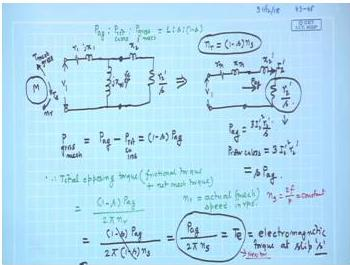
    <figcaption style="text-align:center;">Per-phase approximate equivalent circuit of induction motor.</figcaption>
</figure>

**(i) Rotor current (referred to stator)**
The rotor current is the current through the series branch:
$$
\mathbf{I_2'} = \frac{V_{\text{ph}}}{Z_{\text{ser}}} = \frac{66.4\angle 0^\circ}{4.114\angle 8.4^\circ} = 16.14\angle -8.4^\circ\ \text{A}.
$$
Magnitude: $I_2' \approx 16.14$ A.

**(ii) Stator current**
Magnetising admittance: $Y_0 = G_0 - jB_0 = 0.022 - j0.158$ S.
The exciting current (shunt branch) is
$$
\mathbf{I_0} = V_{\text{ph}} \cdot Y_0 = 66.4\,(0.022 - j0.158) = 1.46 - j10.49\ \text{A}.
$$
Rotor current in rectangular form:
$$
\mathbf{I_2'} = 16.14\cos(-8.4^\circ) + j\,16.14\sin(-8.4^\circ) = 15.96 - j2.36\ \text{A}.
$$
Stator current is the phasor sum:
$$
\mathbf{I_1} = \mathbf{I_0} + \mathbf{I_2'} = (1.46 + 15.96) - j(10.49 + 2.36) = 17.42 - j12.85\ \text{A}.
$$
Magnitude:
$$
|I_1| = \sqrt{17.42^2 + 12.85^2} = 21.65\ \text{A}.
$$

**(iii) Power input and input power factor**
The phase angle of $\mathbf{I_1}$ relative to the voltage is
$$
\phi_1 = \arctan\!\left(\frac{-12.85}{17.42}\right) = -36.4^\circ.
$$
Power factor (lagging):
$$
\cos\phi_1 = \cos 36.4^\circ = 0.805.
$$
Total three-phase input power:
$$
P_{\text{in}} = 3\,V_{\text{ph}}\,I_1\cos\phi_1 = 3 \times 66.4 \times 21.65 \times 0.805 = 3.471\ \text{kW}.
$$

**(iv) Power output**
Air-gap power is the power consumed in the effective rotor resistance:
$$
P_{ag} = 3\,I_2'^{\,2}\!\left(\frac{R_2'}{s}\right) = 3 \times (16.14)^2 \times 4 = 3126\ \text{W}.
$$
Rotor copper loss:
$$
P_{rcu} = s\,P_{ag} = 0.02 \times 3126 = 62.5\ \text{W}.
$$
Gross mechanical power developed:
$$
P_{\text{mech}} = P_{ag} - P_{rcu} = 3126 - 62.5 = 3063.5\ \text{W}.
$$
The problem does not specify separate friction and windage losses. In the approximate equivalent circuit it is common to lump all fixed losses (core, friction, windage) into the shunt conductance $G_0$. Therefore the net mechanical output power is essentially $P_{\text{mech}}$:
$$
P_{\text{out}} \approx 3.06\ \text{kW}.
$$

**(v) Torque developed**
Synchronous angular speed:
$$
\omega_s = \frac{2\pi N_s}{60} = \frac{2\pi \times 1200}{60} = 125.66\ \text{rad/s}.
$$
Electromagnetic torque:
$$
T = \frac{P_{ag}}{\omega_s} = \frac{3126}{125.66} = 24.87\ \text{N·m}.
$$

**(vi) Efficiency**
$$
\eta = \frac{P_{\text{out}}}{P_{\text{in}}} = \frac{3063.5}{3471} = 0.883 \quad (88.3\%).
$$

> **Final answer:** (i) $I_2' = 16.1$ A; (ii) $I_1 = 21.7$ A; (iii) $P_{\text{in}} = 3.47$ kW, pf $=0.805$ lag; (iv) $P_{\text{out}} \approx 3.06$ kW; (v) $T = 24.9$ N·m; (vi) $\eta = 88.3\%$.


---

## Question 23
**Topic:** Three-phase induction motor fundamentals, equivalent circuit and power flow · **Syllabus area:** Weeks 6-8 · **Source:** 7A | EM-I ELE 205 End Sem, 04 December 2006

The rotor of a 6-pole, 50 Hz, slip ring induction motor has a resistance of 0.2 Ω/phase and runs at 960 rpm on full load. Calculate the approximate resistance/phase to be included in the rotor circuit such that the speed is reduced to 800 rpm for full load torque.

### Answer 23
Given a 6-pole, 50 Hz induction motor:

Synchronous speed:
$$
N_s = \frac{120 f}{P} = \frac{120 \times 50}{6} = 1000 \text{ rpm}.
$$

At full load, the motor runs at 960 rpm, so initial slip:
$$
s_1 = \frac{N_s - N_{r1}}{N_s} = \frac{1000 - 960}{1000} = 0.04 \;(4\%).
$$

To reduce the speed to 800 rpm while delivering the same full-load torque, the new slip becomes:
$$
s_2 = \frac{1000 - 800}{1000} = 0.20 \;(20\%).
$$

In the per-phase approximate equivalent circuit of an induction motor, the electromagnetic torque is given by:
$$
T_e = \frac{3}{\omega_s}\, \frac{V_1^2}{(R_1 + \frac{R_2'}{s})^2 + (X_1 + X_2')^2}\,\frac{R_2'}{s},
$$
where $\omega_s$ is the synchronous angular speed. For a given load torque, if the supply voltage and frequency remain constant, the rotor current $I_2'$ must remain essentially unchanged. Neglecting the stator resistance $R_1$ and the leakage reactances $(X_1 + X_2')$, the rotor current is approximately
$$
I_2' \propto \frac{1}{R_2'/s},
$$
so that constant current implies constant $R_2'/s$. Under this condition, the torque expression simplifies to
$$
T_e \approx \frac{3}{\omega_s}\, I_2'^{\,2}\,\frac{R_2'}{s},
$$
and for constant torque the ratio $\frac{R_2'}{s}$ must remain the same.

Hence, for the same torque at the new slip:
$$
\frac{R_{2,\text{new}}'}{s_2} = \frac{R_{2,\text{old}}'}{s_1}.
$$

Given that the original rotor resistance per phase is $0.2\,\Omega$ (referred to rotor side), the required total rotor resistance becomes
$$
R_{2,\text{new}}' = R_{2,\text{old}}' \times \frac{s_2}{s_1}
= 0.2 \times \frac{0.20}{0.04} = 1.0\;\Omega/\text{phase}.
$$

Since the motor already has a rotor resistance of $0.2\,\Omega/\text{phase}$, the additional external resistance that must be inserted in each phase of the rotor circuit is
$$
R_{\text{ext}} = 1.0 - 0.2 = 0.8\;\Omega/\text{phase}.
$$

This method of speed control by adding rotor resistance is a standard technique for slip-ring induction motors, though it sacrifices efficiency because of the additional $I^2R$ losses in the external resistors.

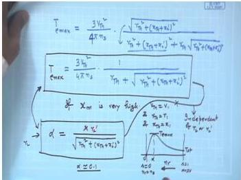
*Figure: Equivalent circuit showing external rotor resistance added per phase.*

> **Final answer:** $0.8\ \Omega$ per phase should be inserted in the rotor circuit.


---

## Question 24
**Topic:** Three-phase induction motor fundamentals, equivalent circuit and power flow · **Syllabus area:** Weeks 6-8 · **Source:** 4B | EM-I ELE 205 End Sem, 08 December 2007

A 10 kW, 50 Hz, 4 pole, 3 phase induction motor has a rotor leakage impedance of (0.2 + j1.5) Ω per phase at standstill. When delivering full load torque the motor runs at 1440 rpm. Standstill rotor voltage = 60 V per phase. Determine the magnitude of emf injected at the rotor terminals for a speed of a) 1000 rpm b) 1800 rpm. Assume load torque remains constant. (05)

### Answer 24
Synchronous speed $N_s = \dfrac{120f}{P} = \dfrac{120 \times 50}{4} = 1500$ rpm.

Full-load slip $s_{\text{fl}} = \dfrac{N_s - N_r}{N_s} = \dfrac{1500 - 1440}{1500} = 0.04$.

Given per-phase standstill rotor induced emf $E_{2,0} = 60$ V, rotor resistance $R_2 = 0.2\ \Omega$, and standstill leakage reactance $X_2 = 1.5\ \Omega$.

At full load without injection, the rotor current per phase is:

$$
I_{2,\text{fl}} = \frac{s_{\text{fl}} E_{2,0}}{R_2 + j s_{\text{fl}} X_2}
= \frac{0.04 \times 60}{0.2 + j\,0.04 \times 1.5}
= \frac{2.4}{0.2 + j0.06}
= 11.49 \angle{-16.7^\circ}\ \text{A}.
$$

In rectangular form: $I_{2,\text{fl}} \approx 11.00 - j3.30$ A.

For constant load torque, the rotor current must remain unchanged in both magnitude and phase. When an external emf $E_{\text{inj}}$ is injected into the rotor circuit at slip frequency, the generalized rotor circuit equation becomes:

$$
I_{2,\text{fl}} (R_2 + j s X_2) = s E_{2,0} - E_{\text{inj}}.
$$

Thus,

$$
E_{\text{inj}} = s E_{2,0} - I_{2,\text{fl}} (R_2 + j s X_2).
$$

Now compute for each speed.

**(a) Speed = 1000 rpm**

$$
s = \frac{1500 - 1000}{1500} = \frac{1}{3} \approx 0.3333.
$$

Induced emf in the rotor: $s E_{2,0} = 0.3333 \times 60 = 20$ V.

Rotor impedance at this slip: $R_2 + j s X_2 = 0.2 + j(0.3333 \times 1.5) = 0.2 + j0.5\ \Omega$.

Voltage drop across rotor impedance:
$$
\begin{aligned}
I_{2,\text{fl}}(R_2 + j s X_2) &= (11.00 - j3.30)(0.2 + j0.5) \\
&= 11.00 \times 0.2 - (-3.30) \times 0.5 + j\bigl(11.00 \times 0.5 + (-3.30) \times 0.2\bigr) \\
&= 2.2 + 1.65 + j(5.5 - 0.66) \\
&= 3.85 + j4.84\ \text{V}.
\end{aligned}
$$

Therefore,
$$
E_{\text{inj}} = 20 - (3.85 + j4.84) = 16.15 - j4.84\ \text{V}.
$$

Magnitude:
$$
|E_{\text{inj}}| = \sqrt{16.15^2 + 4.84^2} \approx \sqrt{260.82 + 23.43} = \sqrt{284.25} \approx 16.86\ \text{V/phase}.
$$

This injected emf opposes the rotor-induced emf, reducing the speed below the full-load value.

**(b) Speed = 1800 rpm**

$$
s = \frac{1500 - 1800}{1500} = -0.2.
$$

Induced emf: $s E_{2,0} = -0.2 \times 60 = -12$ V.

Rotor impedance: $R_2 + j s X_2 = 0.2 + j(-0.2 \times 1.5) = 0.2 - j0.3\ \Omega$.

Voltage drop:
$$
\begin{aligned}
I_{2,\text{fl}}(R_2 + j s X_2) &= (11.00 - j3.30)(0.2 - j0.3) \\
&= 11.00 \times 0.2 - (-3.30) \times (-0.3) + j\bigl(11.00 \times (-0.3) + (-3.30) \times 0.2\bigr) \\
&= 2.2 - 0.99 + j(-3.3 - 0.66) \\
&= 1.21 - j3.96\ \text{V}.
\end{aligned}
$$

Thus,
$$
E_{\text{inj}} = -12 - (1.21 - j3.96) = -13.21 + j3.96\ \text{V}.
$$

Magnitude:
$$
|E_{\text{inj}}| = \sqrt{(-13.21)^2 + 3.96^2} \approx \sqrt{174.50 + 15.68} = \sqrt{190.18} \approx 13.79\ \text{V/phase}.
$$

The negative slip and the phase of injected emf indicate generating (braking) operation.

> **Final answer:** (a) $|E_{\text{inj}}| \approx 16.9$ V/phase; (b) $|E_{\text{inj}}| \approx 13.8$ V/phase.


---

## Question 25
**Topic:** Three-phase induction motor fundamentals, equivalent circuit and power flow · **Syllabus area:** Weeks 6-8 · **Source:** 3A | EM-I ELE 205 End Sem, 26 November 2012

Explain the principle of rotor emf injection method of controlling speed of slip ring induction motor (03)

### Answer 25
In a three-phase slip-ring (wound-rotor) induction motor, the rotor winding terminals are brought out through slip rings and brushes, allowing external circuits to be connected to the rotor. The **rotor emf injection method** of speed control uses this access to inject an external voltage of appropriate magnitude and frequency into the rotor circuit, thereby altering the effective rotor voltage and, consequently, the motor speed.

**Principle:** When the motor runs at a slip $s$, the induced emf per phase in the rotor is $sE_2$, where $E_2$ is the standstill rotor emf (referred to stator). This emf has a frequency $sf$ (slip frequency). The rotor current is given by:

$$
I_2 = \frac{sE_2}{Z_2} = \frac{sE_2}{\sqrt{r_2^2 + (sx_2)^2}}
$$

If an external voltage $E_{\text{inj}}$ at the same slip frequency is injected into the rotor circuit in series with the rotor winding, the net emf becomes the phasor difference (or sum) of $sE_2$ and $E_{\text{inj}}$. The rotor current becomes:

$$
I_2 = \frac{sE_2 - E_{\text{inj}}}{Z_2}
$$

where subtraction assumes $E_{\text{inj}}$ opposes $sE_2$. If $E_{\text{inj}}$ is applied in phase opposition, the net voltage decreases; if in phase, it aids.

**Effect on speed:** For a given load torque, the electromagnetic torque developed must remain constant. The torque is proportional to the air-gap power, which equals the rotor copper loss $3I_2^2 r_2$ divided by slip $s$. For a given torque, the quantity $I_2^2/s$ must remain approximately constant. However, in the normal operating region, slip is small, and small changes in slip have a strong effect on $I_2$; therefore, to maintain the required torque, the rotor current $I_2$ is forced to stay within a narrow range. Hence, any change in $E_{\text{inj}}$ must be compensated by a corresponding change in slip such that the net rotor voltage $(sE_2 - E_{\text{inj}})$ restores $I_2$ to its required level.

- If an opposing $E_{\text{inj}}$ is injected, the net emf drops, so the rotor current decreases. The motor then slows down (slip $s$ increases) until $sE_2$ rises sufficiently to restore the current.
- If an aiding voltage is injected, the net emf increases, the rotor current rises, and the motor accelerates (slip decreases) until a new equilibrium is reached.

Thus, by controlling the magnitude and phase of the injected voltage, the slip (and hence the motor speed) can be varied smoothly over a wide range, both below and above the synchronous speed:
- **Sub-synchronous speeds:** $E_{\text{inj}}$ opposes $sE_2$; motor runs slower.
- **Super-synchronous speeds:** $E_{\text{inj}}$ aids $sE_2$; motor runs faster than synchronous speed.


*Figure: Standard per-phase equivalent circuit. In the emf injection method, an additional voltage source is introduced in series with the rotor branch (between the slip rings) to control the net rotor voltage.*

**Practical implementation and advantages:** The injected voltage must have exactly the same frequency as the rotor slip frequency, so it is typically generated by power electronic converters or by an auxiliary machine. In classic Kramer or Scherbius drives, the slip-frequency rotor power is converted (e.g., by a diode rectifier and an inverter) and either fed back to the mains or used to drive a helper motor. This makes the method highly efficient because the slip power is recovered rather than dissipated as heat (as in rotor resistance control). The scheme provides:
- Smooth, stepless speed control over a wide range.
- Operation at both sub- and super-synchronous speeds.
- High efficiency due to slip power recovery.

> **Final answer:** Rotor emf injection controls the speed of a slip-ring induction motor by altering the net rotor emf. Opposing injection reduces speed (increases slip), while aiding injection increases speed (decreases slip). The method allows sub- and super-synchronous operation and can recover slip power, yielding high efficiency.


---

## Question 26
**Topic:** Three-phase induction motor fundamentals, equivalent circuit and power flow · **Syllabus area:** Weeks 6-8 · **Source:** 5A | EM-I ELE 205 Makeup, 05 January 2015

A 3 phase, 440 V, 50 Hz, 6 pole star connected induction motor has the following parameters: Stator impedance = (0.3 + j 0.433) Ω per phase. Rotor impedance = (0.08 + j 0.16) Ω per phase at stand still condition. Stator to rotor turns ratio = 1.75. Shunt resistance representing rotational loss = 54 Ω per phase. Magnetising reactance = j 8.3 Ω per phase. Use approximate equivalent circuit to determine the following when it draws a current of 65 A, 0.8 pf lagging at rated voltage: (i) Exciting branch current (ii) Equivalent rotor current (iii) Rotational loss (sum of core and mechanical loss) (iv) stator and rotor copper loss (v) shaft output (vi) rotor speed 6

### Answer 26
Given: 3-phase, 440 V, 50 Hz, 6-pole, star-connected induction motor.

**Phase voltage**:  
$V_{ph} = \frac{440}{\sqrt{3}} = 254.0\ \text{V}$.

**Stator current**:  
$I_1 = 65\ \text{A}$ at $0.8$ pf lagging  
$\Rightarrow I_1 = 65 \angle{-\cos^{-1}0.8} = 65 \angle{-36.87^\circ} = 52.0 - j39.0\ \text{A}$.

**Stator impedance**: $Z_1 = R_1 + jX_1 = 0.3 + j0.433\ \Omega$.

**Refer rotor impedance**:  
Turns ratio $a = 1.75$  
$R_2' = a^2 R_2 = (1.75)^2 \times 0.08 = 0.245\ \Omega$  
$X_2' = a^2 X_2 = (1.75)^2 \times 0.16 = 0.49\ \Omega$.

**Air-gap voltage $E_g$**:  
In the exact equivalent circuit the shunt branch (magnetising and rotational loss) is placed after the stator impedance, so we first find the voltage across the air-gap:
$$
\begin{aligned}
E_g &= V_{ph} - I_1 Z_1 \\
&= 254 - (52.0 - j39.0)(0.3 + j0.433) \\
&= 254 - \bigl[(52\!\times\!0.3 - (-39)\!\times\!0.433) + j(52\!\times\!0.433 + (-39)\!\times\!0.3)\bigr] \\
&= 254 - (32.49 + j10.82) \\
&= 221.51 - j10.82\ \text{V} \\
|E_g| &\approx 221.8\ \text{V},\ \angle \approx -2.8^\circ .
\end{aligned}
$$

The per-phase equivalent circuit is shown below:
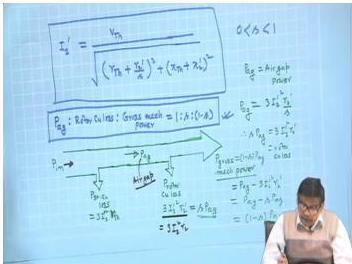
<p align="center"><i>Per-phase equivalent circuit of the induction motor</i></p>

---
### (i) Exciting branch current
The exciting branch consists of the shunt resistance $R_c=54\ \Omega$ (representing rotational loss) and the magnetising reactance $X_m=8.3\ \Omega$ in parallel.  
Core-loss component:  
$I_c = \dfrac{E_g}{R_c} = \dfrac{221.8\angle{-2.8^\circ}}{54} \approx 4.11\angle{-2.8^\circ}\ \text{A}$  
$= 4.10 - j0.20\ \text{A}$.

Magnetising component:  
$I_m = \dfrac{E_g}{jX_m} = \dfrac{221.8\angle{-2.8^\circ}}{8.3\angle{90^\circ}} \approx 26.72\angle{-92.8^\circ}\ \text{A}$  
$= -1.30 - j26.69\ \text{A}$.

Total exciting current:  
$I_0 = I_c + I_m = (4.10 - j0.20) + (-1.30 - j26.69) = 2.80 - j26.89\ \text{A}$.  
Magnitude $|I_0| \approx \sqrt{2.80^2 + 26.89^2} \approx 27.0\ \text{A}$.

---
### (ii) Equivalent rotor current (referred to stator)
$$
I_2' = I_1 - I_0 = (52.0 - j39.0) - (2.80 - j26.89) = 49.20 - j12.11\ \text{A}
$$
$$
|I_2'| \approx \sqrt{49.2^2 + 12.11^2} \approx 50.7\ \text{A}.
$$

---
### (iii) Rotational loss
The rotational loss (sum of core and mechanical losses) is the power dissipated in the shunt resistor $R_c$:
$$
P_{\text{rot}} = 3\,\frac{E_g^2}{R_c} = 3 \times \frac{(221.8)^2}{54} \approx 3 \times 910.8 = 2732\ \text{W} \approx 2.73\ \text{kW}.
$$

---
### (iv) Stator and rotor copper loss
**Stator copper loss**:  
$$
P_{\text{scu}} = 3\,I_1^2 R_1 = 3 \times 65^2 \times 0.3 = 3 \times 4225 \times 0.3 = 3802.5\ \text{W} \approx 3.80\ \text{kW}.
$$

**Rotor copper loss**:  
$$
P_{\text{rcu}} = 3\,I_2'^{\,2} R_2' = 3 \times (50.67)^2 \times 0.245 = 3 \times 2567.4 \times 0.245 \approx 1887\ \text{W} \approx 1.89\ \text{kW}.
$$

---
### (v) Shaft output power
First find the slip $s$ from the real part of the rotor branch impedance.  
For the rotor circuit, $E_g = I_2'\left(\dfrac{R_2'}{s} + jX_2'\right)$, hence $\dfrac{R_2'}{s} = \operatorname{Re}\!\left(\dfrac{E_g}{I_2'}\right)$.

Compute $\dfrac{E_g}{I_2'}$ using the complex values:
$$
\begin{aligned}
E_g &= 221.51 - j10.82 \\
I_2' &= 49.20 - j12.11 \\
|I_2'|^2 &= 49.20^2 + 12.11^2 = 2567.3 \\
\frac{E_g}{I_2'} &= \frac{(221.51 - j10.82)(49.20 + j12.11)}{2567.3} \\
&= \frac{(221.51\!\times\!49.20 + 10.82\!\times\!12.11) + j(221.51\!\times\!12.11 - 10.82\!\times\!49.20)}{2567.3} \\
&\approx \frac{11029.4 + j2150.3}{2567.3} = 4.297 + j0.838 .
\end{aligned}
$$
Therefore $\dfrac{R_2'}{s} = 4.297\ \Omega$ and  
$$
s = \frac{R_2'}{4.297} = \frac{0.245}{4.297} = 0.0570 .
$$

**Air-gap power**:  
$$
P_{\text{ag}} = \frac{P_{\text{rcu}}}{s} = \frac{1887}{0.0570} \approx 33.1\ \text{kW}.
$$
(Also $P_{\text{ag}} = 3\,I_2'^{\,2}\,\dfrac{R_2'}{s} = 3 \times 2567.4 \times 4.297 \approx 33.1\ \text{kW}$.)

**Mechanical power developed**:  
$$
P_{\text{mech}} = P_{\text{ag}} - P_{\text{rcu}} \approx 33.1 - 1.89 = 31.2\ \text{kW}.
$$

**Shaft output**:  
$$
P_{\text{out}} = P_{\text{mech}} - P_{\text{rot}} \approx 31.2 - 2.73 = 28.5\ \text{kW}.
$$

---
### (vi) Rotor speed
Synchronous speed for a 6-pole, 50 Hz motor:  
$$
N_s = \frac{120f}{P} = \frac{120 \times 50}{6} = 1000\ \text{rpm}.
$$
Rotor speed:  
$$
N = N_s(1 - s) = 1000 \times (1 - 0.0570) = 943\ \text{rpm}.
$$

> **Final answer:**  
> (i) Exciting branch current $I_0 \approx 27.0\ \text{A}$ ($2.80 - j26.9$ A).  
> (ii) Rotor current $I_2' \approx 50.7\ \text{A}$.  
> (iii) Rotational loss $= 2.73\ \text{kW}$.  
> (iv) Stator Cu loss $= 3.80\ \text{kW}$, rotor Cu loss $= 1.89\ \text{kW}$.  
> (v) Shaft output $= 28.5\ \text{kW}$.  
> (vi) Rotor speed $= 943\ \text{rpm}$.


---

## Question 27
**Topic:** Three-phase induction motor fundamentals, equivalent circuit and power flow · **Syllabus area:** Weeks 6-8 · **Source:** 4A | EM-I ELE 205 Makeup, 05 January 2016

A 3 phase, 50 Hz, 12 pole, 420 V Δ connected induction motor has the 6M following equivalent circuit parameters: Stator impedance = (2.95 + j 6.82) Ω per phase; Stand still rotor impedance referred to stator = (2.08 + j 4.11) Ω per phase. When running at 4 % slip, determine: a) Electrical input to the motor b) Stator and Rotor copper losses c) Useful torque if rotational losses are 750 W. Neglect exciting branch admittance.

### Answer 27

*Figure: Equivalent circuit per phase (magnetizing branch neglected in this analysis).*

**Solution:**

Given: 3-phase, 50 Hz, 12 poles, 420 V (line, Δ-connected), slip s = 4% = 0.04.

Synchronous speed:
$$
N_s = \frac{120f}{P} = \frac{120 \times 50}{12} = 500 \text{ rpm}.
$$
Rotor speed:
$$
N = N_s(1-s) = 500 \times (1-0.04) = 480 \text{ rpm}.
$$
Angular speed:
$$
\omega_m = \frac{2\pi N}{60} = \frac{2\pi \times 480}{60} = 50.265 \text{ rad/s}.
$$

The per-phase equivalent circuit parameters (stator and rotor referred to stator) are:
$$
Z_1 = R_1 + jX_1 = 2.95 + j6.82 \ \Omega,
$$
$$
Z_2' = R_2' + jX_2' = 2.08 + j4.11 \ \Omega \quad (\text{standstill}).
$$

At slip $s = 0.04$, the rotor impedance referred to stator becomes:
$$
Z_{2,\text{slip}}' = \frac{R_2'}{s} + jX_2' = \frac{2.08}{0.04} + j4.11 = 52 + j4.11 \ \Omega.
$$

Since the exciting branch is neglected, the total series impedance per phase is:
$$
Z_{\text{tot}} = Z_1 + Z_{2,\text{slip}}' = (2.95 + 52) + j(6.82 + 4.11) = 54.95 + j10.93 \ \Omega.
$$
Magnitude:
$$
|Z_{\text{tot}}| = \sqrt{54.95^2 + 10.93^2} = \sqrt{3138.97} \approx 56.03 \ \Omega.
$$

For a Δ-connected motor, phase voltage equals line voltage:
$$
V_{\text{ph}} = V_{\text{line}} = 420 \text{ V}.
$$
Stator phase current:
$$
I_{\text{ph}} = \frac{V_{\text{ph}}}{|Z_{\text{tot}}|} = \frac{420}{56.03} = 7.496 \text{ A}.
$$
The power factor angle $\phi$ is determined by the impedance:
$$
\cos\phi = \frac{R_{\text{tot}}}{|Z_{\text{tot}}|} = \frac{54.95}{56.03} = 0.981 \quad (\text{lagging, since } X>0).
$$

**(a) Electrical input power**

The total three-phase input power is:
$$
\begin{aligned}
P_{\text{in}} &= 3\, V_{\text{ph}} I_{\text{ph}} \cos\phi \\
&= 3 \times 420 \times 7.496 \times 0.981 \\
&\approx 9264 \ \text{W} = \boxed{9.264 \ \text{kW}}.
\end{aligned}
$$
(Equivalently, using line quantities: $I_{\text{line}} = \sqrt{3} I_{\text{ph}} = 12.98 \text{ A}$, $P_{\text{in}} = \sqrt{3} \times 420 \times 12.98 \times 0.981 \approx 9.264 \text{ kW}$.)

**(b) Copper losses**

Stator copper loss:
$$
\begin{aligned}
P_{\text{scu}} &= 3\, I_{\text{ph}}^2 R_1 \\
&= 3 \times (7.496)^2 \times 2.95 \\
&= 3 \times 56.19 \times 2.95 \approx 497.3 \ \text{W} \approx \boxed{497 \ \text{W}}.
\end{aligned}
$$

Air-gap power (the power crossing the air gap from stator to rotor):
$$
\begin{aligned}
P_{\text{ag}} &= 3\, I_{\text{ph}}^2 \frac{R_2'}{s} \\
&= 3 \times (7.496)^2 \times 52 \\
&= 3 \times 56.19 \times 52 \approx 8765.6 \ \text{W} \approx 8.766 \ \text{kW}.
\end{aligned}
$$

Rotor copper loss:
$$
\begin{aligned}
P_{\text{rcu}} &= s \cdot P_{\text{ag}} = 0.04 \times 8765.6 \approx 350.6 \ \text{W} \approx \boxed{351 \ \text{W}}.
\end{aligned}
$$
(Alternatively, $P_{\text{rcu}} = 3 I_{\text{ph}}^2 R_2'$; but the $s P_{\text{ag}}$ method is more direct.)

**(c) Useful (shaft) torque**

Mechanical power developed (before rotational losses):
$$
\begin{aligned}
P_{\text{mech}} &= P_{\text{ag}} - P_{\text{rcu}} = 8765.6 - 350.6 = 8415 \ \text{W} = 8.415 \ \text{kW}. \\
\text{or, } P_{\text{mech}} &= (1-s) P_{\text{ag}} = 0.96 \times 8765.6 = 8415 \ \text{W}.
\end{aligned}
$$

Shaft power output (after deducting rotational losses $P_{\text{rot}} = 750 \text{ W}$):
$$
P_{\text{out}} = P_{\text{mech}} - P_{\text{rot}} = 8415 - 750 = 7665 \ \text{W}.
$$

Useful (shaft) torque:
$$
T_{\text{shaft}} = \frac{P_{\text{out}}}{\omega_m} = \frac{7665}{50.265} \approx 152.5 \ \text{N·m}.
$$

Thus the requested quantities are:
- (a) Electrical input: $9.264 \ \text{kW}$
- (b) Stator Cu loss: $497 \ \text{W}$, Rotor Cu loss: $351 \ \text{W}$
- (c) Useful torque: $152.5 \ \text{N·m}$.

> **Final answer:** (a) Electrical input $= 9.26\ \text{kW}$; (b) Stator Cu loss $= 497\ \text{W}$, rotor Cu loss $= 351\ \text{W}$; (c) Useful torque $= 152.5\ \text{N·m}$.


---

## Question 28
**Topic:** Three-phase induction motor fundamentals, equivalent circuit and power flow · **Syllabus area:** Weeks 6-8 · **Source:** 5B | EM-I ELE 205 Makeup, 08 January 2008

For a 6 pole 3 phase Induction motor has mechanical losses total 2 HP at a speed of 950 RPM on 550 V, 50 Hz mains. The power factor is 0.88. Calculate for this load (i) The rotor copper loss (ii) The total input if the stator losses are 2000 W (iii) The efficiency (iv) The line current (04)

### Answer 28
**Given data:**
- Number of poles, $P = 6$
- Supply frequency, $f = 50\,\text{Hz}$
- Supply voltage, $V_L = 550\,\text{V}$ (line-to-line)
- Full-load speed, $N = 950\,\text{rpm}$
- Power factor, $\cos\phi = 0.88$
- Stator losses, $P_{\text{stator loss}} = 2000\,\text{W}$
- Mechanical losses, $P_{\text{mech loss}} = 2\,\text{HP} = 2 \times 746 = 1492\,\text{W}$

**1. Synchronous speed and slip**

$$
N_s = \frac{120f}{P} = \frac{120 \times 50}{6} = 1000\,\text{rpm}
$$

$$
s = \frac{N_s - N}{N_s} = \frac{1000 - 950}{1000} = 0.05
$$

**2. Power flow relationships**

The power flow in an induction motor can be represented as shown below.

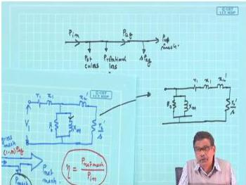
<p style="text-align:center; font-style:italic;">Figure: Typical power flow diagram of a three-phase induction motor. Here the rotational loss (core + mechanical) is taken at the input side; the air-gap power $P_{ag}$ leads to rotor copper loss $sP_{ag}$ and net mechanical power $P_{\text{net mech}}$.</p>

Using the standard definitions (with stator loss including both copper and core losses):

$$
P_{\text{in}} = \text{input electrical power}
$$

$$
P_{ag} = P_{\text{in}} - P_{\text{stator loss}} \quad (\text{air-gap power})
$$

$$
P_{rcu} = s\,P_{ag} \quad (\text{rotor copper loss})
$$

$$
P_{\text{mech}} = (1-s)P_{ag} = P_{ag} - P_{rcu} \quad (\text{mechanical power developed})
$$

$$
P_{\text{out}} = P_{\text{mech}} - P_{\text{mech loss}} \quad (\text{shaft output power})
$$

From these,

$$
P_{rcu} = \frac{s}{1-s}\,P_{\text{mech}} = \frac{s}{1-s}\,(P_{\text{out}} + P_{\text{mech loss}})
$$

$$
P_{\text{in}} = P_{ag} + P_{\text{stator loss}} = \frac{P_{rcu}}{s} + P_{\text{stator loss}}
$$

**3. Why the problem is indeterminate**

Equations (1)-(5) contain two unknowns: either the shaft output $P_{\text{out}}$ or the mechanical power developed $P_{\text{mech}}$ (or the input power $P_{\text{in}}$) must be specified to compute the remaining quantities. The given data only provide the mechanical *losses*, not the useful output. Therefore the rotor copper loss, total input, efficiency) and line current cannot be evaluated numerically.

**4. Expressions for the required quantities (once $P_{\text{out}}$ is known)**

Let the unknown shaft power be $P_{\text{out}}$ (in watts). Then:

$$
\begin{aligned}
P_{rcu} &= \frac{s}{1-s}\,(P_{\text{out}} + 1492) = \frac{0.05}{0.95}\,(P_{\text{out}} + 1492) \\
P_{\text{in}} &= \frac{P_{rcu}}{s} + 2000 = \frac{P_{rcu}}{0.05} + 2000 \\
\eta &= \frac{P_{\text{out}}}{P_{\text{in}}} \\
I_L &= \frac{P_{\text{in}}}{\sqrt{3}\,V_L\,\cos\phi} = \frac{P_{\text{in}}}{\sqrt{3}\times 550 \times 0.88}
\end{aligned}
$$

**5. Illustrative example (for completeness)**

If the motor were delivering, say, $P_{\text{out}} = 10\,\text{kW}$, then:

$$
P_{rcu} = \frac{0.05}{0.95}(10000 + 1492) \approx 605.9\,\text{W}
$$

$$
P_{\text{in}} = \frac{605.9}{0.05} + 2000 = 12118 + 2000 = 14118\,\text{W}
$$

$$
\eta = \frac{10000}{14118} \approx 0.708 \; (70.8\%)
$$

$$
I_L = \frac{14118}{\sqrt{3}\times 550 \times 0.88} \approx \frac{14118}{836.6} \approx 16.87\,\text{A}
$$

But without the actual $P_{\text{out}}$, the values remain symbolic.

> **Final answer:** Insufficient data; the required quantities (rotor copper loss, total input, efficiency, line current) can be obtained once the shaft output power is known, using the expressions given above.


---

## Question 29
**Topic:** Three-phase induction motor fundamentals, equivalent circuit and power flow · **Syllabus area:** Weeks 6-8 · **Source:** 3B | EM-I ELE 2103 End Sem, 27 November 2018

A 3 phase, 400 V, 6-pole, 50 Hz induction motor develops mechanical power of 20 kW at 985 rpm. The stator losses are equal to 1800 W. Neglect the mechanical losses. Calculate: i) The rotor copper loss & rotor frequency ii) The total input power. (03)

### Answer 29
Synchronous speed:

$$N_s = \frac{120 \times f}{P} = \frac{120 \times 50}{6} = 1000 \text{ rpm}.$$

Slip:

$$s = \frac{N_s - N_r}{N_s} = \frac{1000 - 985}{1000} = 0.015 \quad (1.5\%).$$

**(i) Rotor copper loss and rotor frequency**

The air-gap power $P_{ag}$ splits into the developed mechanical power $P_{\text{mech}}$ and the rotor copper loss $P_{rcu}$:

$$P_{ag} = P_{\text{mech}} + P_{rcu}.$$

From the equivalent circuit we also know:

$$P_{rcu} = s\,P_{ag}, \qquad P_{\text{mech}} = (1-s)\,P_{ag}.$$

Eliminating $P_{ag}$ gives

$$P_{rcu} = \frac{s}{1-s}\,P_{\text{mech}}.$$

Substituting the numbers:

$$
\begin{aligned}
P_{rcu} &= \frac{0.015}{1-0.015} \times 20\,000 \text{ W} \\
       &= \frac{0.015}{0.985} \times 20\,000 \approx 304.6 \text{ W} \approx 305 \text{ W}.
\end{aligned}
$$

Rotor frequency:

$$f_r = s \, f = 0.015 \times 50 = 0.75 \text{ Hz}.$$

  
*Typical power flow diagram of an induction motor*

**(ii) Total input power**

The input power to the stator is the sum of the developed mechanical power, the rotor copper loss, and the stator losses ($P_{\text{stator loss}} = 1800 \text{ W}$):

$$
\begin{aligned}
P_{\text{in}} &= P_{\text{mech}} + P_{rcu} + P_{\text{stator loss}} \\
            &= 20\,000 + 304.6 + 1800 = 22\,104.6 \text{ W} \approx 22.1 \text{ kW}.
\end{aligned}
$$

> **Final answer:** (i) Rotor Cu loss $\approx 305\ \text{W}$, rotor frequency $= 0.75\ \text{Hz}$; (ii) total input power $= 22.1\ \text{kW}$.


---

## Question 30
**Topic:** Three-phase induction motor fundamentals, equivalent circuit and power flow · **Syllabus area:** Weeks 6-8 · **Source:** 2B | EM-I ELE 2123 End Sem, 05 December 2023

A 3-phase, 400 V, 50 Hz, 4 pole induction motor is rated for an output of 15 4 HP at 1,440 rpm. When supplying rated load, its stator losses are 800 W and 5 N-m of torque meets friction and windage losses. Determine the following for this loading: a) Slip b) Rotor copper loss c) Input to the motor d) Efficiency

### Answer 30
The induction motor has 4 poles and is supplied at 50 Hz, therefore the synchronous speed is:

$$N_s = \frac{120 f}{P} = \frac{120 \times 50}{4} = 1500\ \text{rpm}.$$

**(a) Slip**

The slip is the relative speed between synchronous speed and rotor speed:

$$s = \frac{N_s - N_r}{N_s} = \frac{1500 - 1440}{1500} = 0.04 \quad \text{or} \quad 4\%.$$

**(b) Rotor copper loss**

The shaft output power is given as 15 HP. Converting to watts:

$$P_{\text{out}} = 15 \times 746 = 11\,190\ \text{W}.$$

The friction and windage losses are specified by a torque of 5 N·m. First compute the rotor angular speed:

$$\omega_r = \frac{2\pi N_r}{60} = \frac{2\pi \times 1440}{60} \approx 150.8\ \text{rad/s}.$$

Hence the friction and windage power loss is:

$$P_{\text{fw}} = T_{\text{fw}} \times \omega_r = 5 \times 150.8 = 754\ \text{W}.$$

The gross mechanical power developed by the rotor is therefore:

$$P_{\text{mech}} = P_{\text{out}} + P_{\text{fw}} = 11\,190 + 754 = 11\,944\ \text{W}.$$

In the induction motor, the air-gap power $P_{\text{ag}}$ supplies the rotor copper loss and the mechanical power. The well-known relationships are:

$$P_{\text{mech}} = (1-s) P_{\text{ag}}, \qquad P_{\text{rcu}} = s P_{\text{ag}}.$$

From these,

$$P_{\text{rcu}} = \frac{s}{1-s} P_{\text{mech}} = \frac{0.04}{0.96} \times 11\,944 \approx 497.7\ \text{W} \approx 498\ \text{W}.$$

**(c) Input power**

The total input power must cover the air-gap power plus the stator losses (given as 800 W). First find the air-gap power:

$$P_{\text{ag}} = \frac{P_{\text{mech}}}{1-s} = \frac{11\,944}{0.96} \approx 12\,441.7\ \text{W}.$$

Then the input power is:

$$P_{\text{in}} = P_{\text{ag}} + \text{stator losses} = 12\,441.7 + 800 = 13\,241.7\ \text{W} \approx 13.24\ \text{kW}.$$

(Equivalently, $P_{\text{in}} = P_{\text{mech}} + P_{\text{rcu}} + \text{stator losses} = 11\,944 + 498 + 800 = 13\,242\ \text{W}$.)

**(d) Efficiency**

The efficiency is the ratio of shaft output power to input power:

$$\eta = \frac{P_{\text{out}}}{P_{\text{in}}} \times 100\% = \frac{11\,190}{13\,242} \times 100\% \approx 84.5\%.$$

The power flow can be summarized by the following diagram:

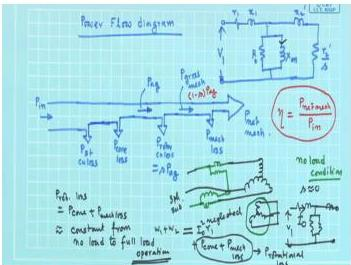
*Figure: Power flow stages in a three-phase induction motor.*

> **Final answer:** (a) Slip $= 4\%$; (b) Rotor Cu loss $= 498\ \text{W}$; (c) Input $= 13.24\ \text{kW}$; (d) Efficiency $= 84.5\%$.


---

## Question 31
**Topic:** Three-phase induction motor fundamentals, equivalent circuit and power flow · **Syllabus area:** Weeks 6-8 · **Source:** 2C | EM-I ELE 2123 End Sem, 25 November 2024

A 3-phase, 400 V, 50 Hz, 4-pole, star connected induction motor has per-phase 3 stator impedance, Z₁ = (0.07+j0.3)Ω and per-phase rotor impedance referred to stator side, Z₂’ = (0.08+j0.3) Ω. The per phase magnetizing reactance is 10 Ω and the resistance representing core loss is 50 Ω. The slip is 4%. Using approximate equivalent circuit approach, solve for: a) Stator current and power factor b) Torque developed and c) Gross efficiency

### Answer 31
**Given:** 400 V, 50 Hz, 4-pole, star-connected. $Z_1 = (0.07+j0.3)\,\Omega$, $Z_2' = (0.08+j0.3)\,\Omega$, $X_m = 10\,\Omega$, $R_c = 50\,\Omega$, slip $s = 4\% = 0.04$.

**Phase voltage:**  
$$V_{ph} = \frac{400}{\sqrt{3}} = 230.94\ \text{V}.$$

**Synchronous speed and angular velocity:**  
$$N_s = \frac{120 \times 50}{4} = 1500\ \text{rpm}, \quad \omega_s = \frac{2\pi \times 1500}{60} = 157.08\ \text{rad/s}.$$

**Approximate equivalent circuit:**  
In the approximate circuit, the magnetising branch (parallel combination of $R_c$ and $jX_m$) is shifted to the stator terminals. The stator impedance $Z_1$ and the rotor impedance referred to stator, $Z_2'/s$, form a series branch. The no-load current $I_0$ passes through the magnetising branch, and the load component $I_2'$ flows through the series branch. The stator current is the phasor sum $I_1 = I_0 + I_2'$.


*Fig. Per-phase equivalent circuit of an induction motor (exact). In the approximate analysis used here, the magnetising branch is shifted to the stator terminals.*

**Rotor branch impedance at slip $s$:**  
$$Z_2'/s = \frac{0.08}{0.04} + j0.3 = 2 + j0.3\ \Omega.$$

Total series branch impedance:  
$$\begin{aligned}
Z_{\text{ser}} &= Z_1 + Z_2'/s = (0.07 + 2) + j(0.3+0.3) \\
&= 2.07 + j0.6\ \Omega.
\end{aligned}$$

Magnitude and angle:  
$$|Z_{\text{ser}}| = \sqrt{2.07^2 + 0.6^2} = 2.156\ \Omega, \quad \phi_{\text{ser}} = \arctan\!\left(\frac{0.6}{2.07}\right) = 16.2^\circ.$$

**Load component of stator current ($I_2'$):**  
$$I_2' = \frac{V_{ph}}{Z_{\text{ser}}} = \frac{230.94\angle 0^\circ}{2.156\angle 16.2^\circ} = 107.1\angle -16.2^\circ\ \text{A}.$$

In rectangular form: $I_2' = 102.8 - j29.9\ \text{A}$.

**No-load (exciting) current ($I_0$):**  
The admittance of the magnetising branch is  
$$Y_0 = \frac{1}{50} - j\frac{1}{10} = 0.02 - j0.1\ \text{S}.$$

Hence,  
$$I_0 = V_{ph} Y_0 = 230.94 \times (0.02 - j0.1) = 4.62 - j23.09\ \text{A}.$$

**Stator current and power factor (a):**  
$$\begin{aligned}
I_1 &= I_0 + I_2' \\
&= (4.62 - j23.09) + (102.8 - j29.9) \\
&= 107.42 - j52.99\ \text{A}.
\end{aligned}$$

Magnitude:  
$$|I_1| = \sqrt{107.42^2 + 52.99^2} \approx 119.9\ \text{A}.$$

Since the motor is star-connected, the line current equals the phase current.

Power factor:  
$$\cos\phi = \frac{\Re(I_1)}{|I_1|} = \frac{107.42}{119.9} \approx 0.896\ \text{(lagging)}.$$

**(a) Result:** Stator current $\boxed{I_1 \approx 120\ \text{A}}$, power factor $\boxed{\cos\phi \approx 0.896\ \text{lag}}$.

**Air-gap power and developed torque (b):**  
Air-gap power (total power transferred across the air-gap) is  
$$P_{ag} = 3\,I_2'^{\,2}\!\left(\frac{R_2'}{s}\right) = 3 \times (107.1)^2 \times 2 \approx 68.82\ \text{kW}.$$

The electromagnetic torque developed:  
$$T_{\text{dev}} = \frac{P_{ag}}{\omega_s} = \frac{68\,820}{157.08} \approx 438.2\ \text{N·m}.$$

**(b) Result:** Developed torque $\boxed{T \approx 438\ \text{N·m}}$.

**Mechanical power developed and gross efficiency (c):**  
The mechanical power developed at the shaft (excluding friction and windage) is  
$$P_{\text{mech}} = P_{ag}(1-s) = 68.82 \times 0.96 \approx 66.07\ \text{kW}.$$

Input electrical power drawn from the supply:  
$$\begin{aligned}
P_{\text{in}} &= 3\,V_{ph}\,I_1\cos\phi \\
&= 3 \times 230.94 \times 119.9 \times 0.896 \\
&\approx 74.4\ \text{kW}.
\end{aligned}$$

(Equivalently, $\sqrt{3}\,V_L I_L\cos\phi$ gives the same value.)

Gross efficiency of the motor:  
$$\eta_{\text{gross}} = \frac{P_{\text{mech}}}{P_{\text{in}}} = \frac{66.07}{74.4} \approx 0.888 = 88.8\%.$$

**(c) Result:** Gross efficiency $\boxed{\eta \approx 88.8\%}$.

> **Final answer:** (a) Stator current $\approx 120\ \text{A}$, power factor $\approx 0.896$ lag; (b) Torque $\approx 438\ \text{N·m}$; (c) Gross efficiency $\approx 88.8\%$.


---

## Question 32
**Topic:** Three-phase induction motor fundamentals, equivalent circuit and power flow · **Syllabus area:** Weeks 6-8 · **Source:** 4B | EM-I ELE 2154 Makeup/GI, 28 July 2021

Consider a 415V, 4pole, 50Hz induction motor operating at 4% slip. The shaft power output is 1.2 kW. The machine has stator losses of 50W and rotational losses of 70W. Draw the power flow diagram with power stages. (05)

### Answer 32
For a three-phase induction motor, the power flows from electrical input through various losses to mechanical output. Given:
- 4-pole, 50 Hz → synchronous speed $N_s = \dfrac{120 \cdot 50}{4} = 1500 \text{ rpm}$.
- Slip $s = 0.04$ → rotor speed $N = 1500 \cdot (1-0.04) = 1440 \text{ rpm}$.
- Shaft power output $P_{\text{out}} = 1.2 \text{ kW} = 1200 \text{ W}$.
- Rotational losses $P_{\text{rot}} = 70 \text{ W}$.
- Stator losses $P_{\text{scu}} = 50 \text{ W}$.

**Power flow calculation (working backward):**

1. Mechanical power developed:
   $$P_{\text{mech}} = P_{\text{out}} + P_{\text{rot}} = 1200 + 70 = 1270 \text{ W}.$$

2. Air-gap power: For an induction motor, $P_{\text{mech}} = (1-s)P_{ag}$, so
   $$P_{ag} = \frac{P_{\text{mech}}}{1-s} = \frac{1270}{0.96} = 1322.92 \text{ W}.$$

3. Rotor copper loss:
   $$P_{rcu} = s \cdot P_{ag} = 0.04 \times 1322.92 = 52.92 \text{ W}.$$

4. Input power:
   $$P_{\text{in}} = P_{ag} + P_{\text{scu}} = 1322.92 + 50 = 1372.92 \text{ W}.$$

5. Overall efficiency:
   $$\eta = \frac{P_{\text{out}}}{P_{\text{in}}} = \frac{1200}{1372.92} \times 100 = 87.4\%.$$

The power-flow diagram, showing each power stage, is given below. The rotational losses are subtracted from the mechanical power to obtain the useful shaft output.

<figure>
  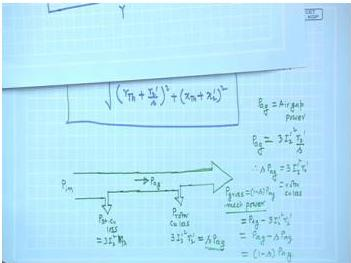
  <figcaption>Figure: Power flow diagram of a three-phase induction motor (rotational losses not shown in this diagram; they are subtracted from the mechanical power to yield shaft output).</figcaption>
</figure>

The sequence of power stages can also be written as:

$$
P_{\text{in}} \;\xrightarrow{\text{stator loss } 50 \text{ W}}\; P_{ag} \;\xrightarrow{\text{rotor Cu loss } 52.92 \text{ W}}\; P_{\text{mech}} \;\xrightarrow{\text{rotational loss } 70 \text{ W}}\; P_{\text{out}}.
$$

> **Final answer:** $P_{\text{in}} = 1.373 \text{ kW}$, $P_{ag} = 1.323 \text{ kW}$, $P_{\text{mech}} = 1.270 \text{ kW}$, $P_{\text{out}} = 1.2 \text{ kW}$, efficiency $\eta = 87.4\%$.


---

## Question 33
**Topic:** Three-phase induction motor fundamentals, equivalent circuit and power flow · **Syllabus area:** Weeks 6-8 · **Source:** 6A | EM-I ELE 2154 Makeup/GI, 28 July 2021

A 3-phase, 50 Hz, 36 kW, 4 pole induction motor has a full load efficiency of 82 %. The friction & windage losses are one-fourth of no load losses and rotor copper losses equal the iron loss at full load. Determine (a) Total Losses (b) Stator Core Loss (c) Rotor Copper Loss (d) Friction & Windage Loss (05)

### Answer 33
A 3-phase, 50 Hz, 4-pole induction motor delivers a full-load output of $P_{\text{out}} = 36\ \text{kW}$ at an efficiency $\eta = 82\%$. The input power is therefore
$$
P_{\text{in}} = \frac{P_{\text{out}}}{\eta} = \frac{36}{0.82} \approx 43.902\ \text{kW}.
$$
The total losses at full load are
$$
P_{\text{loss}} = P_{\text{in}} - P_{\text{out}} \approx 7.902\ \text{kW}.
$$
This answers part **(a)**.


<p style="text-align:center;"><em>Figure: Approximate power flow diagram for the induction motor. Because the problem does not mention stator copper loss, we neglect it and consider only the losses that are asked for.</em></p>

Let the stator core (iron) loss be $P_{\text{Fe}}$, the rotor copper loss be $P_{\text{rcu}}$, and the friction and windage loss be $P_{\text{fw}}$.

From the problem statement:
1. The friction and windage loss is one-fourth of the no-load losses.
2. At full load the rotor copper loss equals the iron loss, i.e. $P_{\text{rcu}} = P_{\text{Fe}}$.

At no load the motor runs very close to synchronous speed; the rotor copper loss is negligible and the stator copper loss is very small. Hence the no-load losses are essentially the sum of the core loss and the mechanical losses:
$$
P_{\text{no-load}} = P_{\text{Fe}} + P_{\text{fw}}.
$$
Using condition 1,
$$
P_{\text{fw}} = \frac{1}{4}\,(P_{\text{Fe}} + P_{\text{fw}})
\quad\Longrightarrow\quad
4P_{\text{fw}} = P_{\text{Fe}} + P_{\text{fw}}
\quad\Longrightarrow\quad
P_{\text{Fe}} = 3P_{\text{fw}}.
$$

The full-load losses are taken as the sum of the components we are asked to determine (stator copper loss is omitted because it is not given):
$$
P_{\text{loss}} = P_{\text{Fe}} + P_{\text{rcu}} + P_{\text{fw}}.
$$
Substituting $P_{\text{rcu}} = P_{\text{Fe}}$ and $P_{\text{Fe}} = 3P_{\text{fw}}$,
$$
P_{\text{loss}} = 3P_{\text{fw}} + 3P_{\text{fw}} + P_{\text{fw}} = 7P_{\text{fw}}.
$$
Therefore,
$$
P_{\text{fw}} = \frac{P_{\text{loss}}}{7} \approx \frac{7.902}{7} = 1.129\ \text{kW}.
$$
Now,
$$
P_{\text{Fe}} = 3 \times 1.129 \approx 3.387\ \text{kW},\qquad
P_{\text{rcu}} = P_{\text{Fe}} = 3.387\ \text{kW}.
$$
Rounding to two decimal places gives:
- Stator core loss $= 3.39\ \text{kW}$
- Rotor copper loss $= 3.39\ \text{kW}$
- Friction and windage loss $= 1.13\ \text{kW}$

> **Final answer:** (a) Total losses = 7.90 kW; (b) stator core loss = 3.39 kW; (c) rotor copper loss = 3.39 kW; (d) friction & windage loss = 1.13 kW. (Stator copper loss is neglected as it was not specified.)

## Question 34
**Topic:** Three-phase induction motor fundamentals, equivalent circuit and power flow · **Syllabus area:** Weeks 6-8 · **Source:** 2B | EM-I ELE 2154 Online End Sem, 27 January 2022

A three-phase, 400V, 4-pole, 50 Hz, three-phase induction motor provides shaft power of 1.2kW. Considering 2.5% of shaft power as friction and windage losses, determine the rotor copper losses, power supplied to the rotor circuit, gross torque developed by the motor, and efficiency of the rotor when the rotor is running at a speed of 1420rpm. (03)

### Answer 34
Synchronous speed for a 4-pole, 50 Hz motor:

$$
N_s = \frac{120f}{P} = \frac{120 \times 50}{4} = 1500\ \text{rpm}.
$$

Slip at 1420 rpm:

$$
s = \frac{N_s - N}{N_s} = \frac{1500-1420}{1500} = 0.05333\ (5.33\%).
$$

Shaft output power:

$$
P_{\text{out}} = 1.2\ \text{kW} = 1200\ \text{W}.
$$

Friction and windage losses:

$$
P_{\text{F\&W}} = 0.025 \times 1200 = 30\ \text{W}.
$$

Gross mechanical power developed by rotor:

$$
P_{\text{mech}} = P_{\text{out}} + P_{\text{F\&W}} = 1200 + 30 = 1230\ \text{W}.
$$


*Figure: Per-phase equivalent circuit of an induction motor.*

From the induction motor power flow (see equivalent circuit), the air-gap power $P_{\text{ag}}$ is split into rotor copper loss $P_{\text{cu2}}$ and gross mechanical power:

$$
P_{\text{mech}} = (1-s)P_{\text{ag}}, \qquad P_{\text{cu2}} = sP_{\text{ag}}.
$$

Hence,

$$
P_{\text{cu2}} = \frac{s}{1-s}P_{\text{mech}} = \frac{0.05333}{0.94667} \times 1230 \approx 69.3\ \text{W}.
$$

Power supplied to rotor circuit (air-gap power):

$$
P_{\text{ag}} = P_{\text{mech}} + P_{\text{cu2}} = 1230 + 69.3 = 1299.3\ \text{W}.
$$

Synchronous angular speed:

$$
\omega_s = \frac{2\pi N_s}{60} = \frac{2\pi \times 1500}{60} = 157.08\ \text{rad/s}.
$$

Gross electromagnetic torque developed:

$$
T = \frac{P_{\text{ag}}}{\omega_s} = \frac{1299.3}{157.08} \approx 8.27\ \text{N·m}.
$$

Rotor efficiency (ratio of gross mechanical power to air-gap power):

$$
\eta_{\text{rotor}} = \frac{P_{\text{mech}}}{P_{\text{ag}}} = 1 - s = 0.9467 = 94.67\%.
$$

> **Final answer:** Rotor copper loss = 69.3 W; power supplied to rotor = 1299 W; gross torque = 8.27 N·m; rotor efficiency = 94.67 %.


---

## Question 35
**Topic:** Induction motor torque-slip characteristics, starting, speed control and braking · **Syllabus area:** Weeks 7-9 · **Source:** 4A | EM-I ELE 205 End Sem, 03 December 2014

A squirrel cage induction motor, when started by means of a star-delta starter draws 200 % of full load current and develops 44 % of full load torque at starting. If an auto-transformer with 75 % tapping is used, determine: (i) Full load slip (ii) Ratio of starting torque to full load torque (iii) Starting motor current and starting line current as % of full load current. 4

### Answer 35
## Solution

**Given:**  
- Star-delta starting: Line current $I_{L(Y-\Delta)} = 200\% \, I_{\text{fl}} = 2\,I_{\text{fl}}$  
- Star-delta starting torque: $T_{\text{st}(Y-\Delta)} = 44\% \, T_{\text{fl}} = 0.44\,T_{\text{fl}}$  
- Auto-transformer tapping: $k = 75\% = 0.75$

### 1. DOL (Direct-on-Line) Values

In star-delta starting, the motor windings are initially connected in star, so the voltage per phase is $V_L/\sqrt{3}$ instead of $V_L$ (line voltage) in delta. Consequently:
- Line current becomes $1/3$ of the DOL line current.
- Starting torque, which is proportional to the square of the applied phase voltage, also becomes $1/3$ of the DOL torque.

Thus,
$$
I_{\text{sc}} = I_{\text{st(DOL)}} = 3 \times I_{L(Y-\Delta)} = 3 \times 2\,I_{\text{fl}} = 6\,I_{\text{fl}}
$$
$$
T_{\text{st(DOL)}} = 3 \times T_{\text{st}(Y-\Delta)} = 3 \times 0.44\,T_{\text{fl}} = 1.32\,T_{\text{fl}}
$$

### 2. Full-Load Slip

For a squirrel-cage induction motor, the starting torque ratio under full voltage (DOL) is related to the full-load slip $s_{\text{fl}}$ by:
$$
\frac{T_{\text{st(DOL)}}}{T_{\text{fl}}} = \left(\frac{I_{\text{sc}}}{I_{\text{fl}}}\right)^{\!2} \!s_{\text{fl}}
$$

Substituting the known DOL values:
$$
1.32 = (6)^2 \, s_{\text{fl}} \quad\Rightarrow\quad s_{\text{fl}} = \frac{1.32}{36} = 0.03667
$$
$$
s_{\text{fl}} = 3.667\% \approx 3.67\%
$$

### 3. Auto-Transformer Starting (Tapping $k=0.75$)

With an auto-transformer, the voltage applied to the motor is $k$ times the line voltage. Therefore:
- **Motor starting current** (winding current): $I_m = k \cdot I_{\text{sc}} = 0.75 \times 6\,I_{\text{fl}} = 4.5\,I_{\text{fl}} = 450\% \, I_{\text{fl}}$
- **Line current** drawn from the supply: $I_L = k^2 \cdot I_{\text{sc}} = (0.75)^2 \times 6\,I_{\text{fl}} = 3.375\,I_{\text{fl}} = 337.5\% \, I_{\text{fl}}$
- **Starting torque**: $T_{\text{st(auto)}} = k^2 \cdot T_{\text{st(DOL)}} = (0.75)^2 \times 1.32\,T_{\text{fl}} = 0.7425\,T_{\text{fl}} = 74.25\% \, T_{\text{fl}}$

### Summary Table

| Quantity | Value |
|---|---|
| **Full-load slip** | $3.67\%$ |
| **Starting torque / Full-load torque (auto-transformer)** | $74.25\%$ |
| **Motor starting current (as % of $I_{\text{fl}}$)** | $450\%$ |
| **Line starting current (as % of $I_{\text{fl}}$)** | $337.5\%$ |

> **Final answer:**  
> (i) Full-load slip $s_{\text{fl}} = 3.67\%$  
> (ii) Ratio of auto-transformer starting torque to full-load torque $= 0.7425$ (or $74.25\%$ of $T_{\text{fl}}$)  
> (iii) Motor starting current $= 450\%$ of full-load current; line starting current $= 337.5\%$ of full-load current.


---

## Question 36
**Topic:** Induction motor torque-slip characteristics, starting, speed control and braking · **Syllabus area:** Weeks 7-9 · **Source:** 5C | EM-I ELE 205 End Sem, 04 December 2006

Explain the working of a star-delta starter for a 3 phase induction motor.

### Answer 36
**Star-Delta Starter for Three-Phase Induction Motor**

A star-delta starter is an electromechanical reduced-voltage starter used for three-phase squirrel-cage induction motors that are designed to operate with their stator windings connected in delta during normal running. The primary purpose is to limit the high starting current drawn by the motor when it is directly connected to the supply (Direct-On-Line starting), which can be 5-7 times the full-load current and may cause excessive voltage drops and mechanical shocks.

**Working Principle**

The starter employs three contactors (main, star, and delta) and a timer or a centrifugal switch to change the winding connections. At startup, the stator windings are connected in star (Y) by closing the star and main contactors. In the star connection, each phase winding receives a voltage equal to the line voltage divided by $\sqrt{3}$:

$$V_{\text{ph}} = \frac{V_L}{\sqrt{3}}$$

Since the impedance per phase $Z_{\text{ph}}$ is essentially constant, the phase current and hence the line current in star are reduced. In a star connection, the line current equals the phase current:

$$I_{L,\text{star}} = I_{\text{ph},\text{star}} = \frac{V_L / \sqrt{3}}{Z_{\text{ph}}}$$

When the motor runs normally in delta, the phase voltage equals the line voltage, and the line current is $\sqrt{3}$ times the phase current:

$$I_{L,\text{delta}} = \sqrt{3} \, I_{\text{ph},\text{delta}} = \sqrt{3} \, \frac{V_L}{Z_{\text{ph}}}$$

Comparing the starting line currents, we get:

$$\frac{I_{L,\text{star}}}{I_{L,\text{delta}}} = \frac{1}{3}$$

Thus, star-delta starting reduces the line current to one-third of the current that would flow if the motor were started directly in delta.

**Effect on Torque**

The starting torque of an induction motor is proportional to the square of the applied voltage per phase. Therefore, the torque in star is:

$$T_{\text{star}} \propto \left( \frac{V_L}{\sqrt{3}} \right)^2 = \frac{V_L^2}{3}$$

In delta, $T_{\text{delta}} \propto V_L^2$. Hence:

$$\frac{T_{\text{star}}}{T_{\text{delta}}} = \frac{1}{3}$$

The starting torque is also reduced to one-third. This makes the star-delta starter suitable only for applications where the load can be started with reduced torque, such as pumps, fans, or lightly loaded conveyors, or when the motor is started unloaded.

**Transition to Delta**

After the motor accelerates to approximately 75-80% of its synchronous speed (typically monitored by a timer or a speed-sensing device), the star contactor opens, and the delta contactor closes, reconnecting the windings in delta. In the delta configuration, full line voltage appears across each winding, allowing the motor to develop full torque and run at its rated power. The transition can be either *open transition* (a brief interruption of supply during changeover, which may cause current and torque transients) or *closed transition* (using resistors to avoid current interruption). Modern starters often employ electronic timers and soft switching to minimize transients.

**Practical Considerations**

1. The motor must be designed for delta connection for its rated voltage and must have all six stator terminals brought out to the terminal box.
2. The starter is compact, relatively inexpensive, and provides a simple method of current reduction.
3. Because the torque is reduced, it is not suitable for high-inertia loads or loads requiring high starting torque.
4. For frequent starts or critical applications, other methods such as soft starters (using power electronics) or variable frequency drives may be preferred.

In summary, the star-delta starter exploits the fact that connecting the stator windings in star at startup reduces both the applied phase voltage and the resulting line current and torque to one-third of the direct-on-line (delta) values. After the motor picks up speed, the connection is changed to delta to restore full voltage and full torque for normal operation.

> **Final answer:** During starting, the stator windings are connected in star, reducing the phase voltage to $V_L/\sqrt{3}$. As a result, the line starting current and the starting torque both drop to one-third of their values in delta. When the motor reaches a steady speed, a timer switches the connection to delta, applying full line voltage across each winding for normal operation.


---

## Question 37
**Topic:** Induction motor torque-slip characteristics, starting, speed control and braking · **Syllabus area:** Weeks 7-9 · **Source:** 5A | EM-I ELE 205 End Sem, 08 December 2007

A 3 phase induction motor has a starting torque of 150 % & a maximum torque of 250 % of the full load torque. Neglecting stator impedance calculate a) the slip at maximum torque b) full load slip (03)

### Answer 37
The torque developed by a 3-phase induction motor when the stator impedance is neglected is given by

$$
T = \frac{3}{\omega_s} \frac{V_1^2 R_2'/s}{(R_2'/s)^2 + X_2'^2},
$$

where $V_1$ is the applied phase voltage, $\omega_s$ the synchronous angular speed, $R_2'$ and $X_2'$ the rotor resistance and standstill leakage reactance referred to the stator, and $s$ the slip.

The condition for maximum torque is found by setting $dT/ds=0$, which yields

$$
s_m = \frac{R_2'}{X_2'}, \qquad
T_{\max} = \frac{3}{2\omega_s} \frac{V_1^2}{X_2'}.
$$

Normalising the torque with $T_{\max}$ gives the convenient non-dimensional form

$$
\frac{T}{T_{\max}} = \frac{2\,s\,s_m}{s^2 + s_m^2} 
= \frac{2}{\displaystyle \frac{s}{s_m} + \frac{s_m}{s}}.
$$

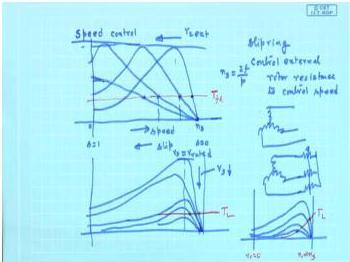  
*Figure: Torque-slip curve.*

**Given data** (all in per-unit of full-load torque):
- Starting torque, $T_{\text{st}} = 1.5\,T_{\text{fl}}$
- Maximum torque, $T_{\max} = 2.5\,T_{\text{fl}}$

Therefore,
$$
\frac{T_{\text{st}}}{T_{\max}} = \frac{1.5}{2.5} = 0.6.
$$

**a) Slip at maximum torque, $s_m$**  
At standstill $s = 1$. Substituting in the torque ratio:

$$
0.6 = \frac{2}{\displaystyle \frac{1}{s_m} + s_m}
\;\Longrightarrow\;
\frac{1}{s_m} + s_m = \frac{2}{0.6} = \frac{10}{3}.
$$

Multiplying by $s_m$ gives a quadratic:
$$
s_m^2 - \frac{10}{3}s_m + 1 = 0 \quad\text{or}\quad 3s_m^2 - 10s_m + 3 = 0.
$$

The roots are $s_m = \frac{1}{3}$ and $s_m = 3$. For a well-designed motor the slip at maximum torque lies well below unity, so the physical solution is

$$
\boxed{s_m = \frac{1}{3} \approx 0.3333 \;\; (33.33\%)}.
$$

**b) Full-load slip, $s_{\text{fl}}$**  
From the given data,
$$
\frac{T_{\text{fl}}}{T_{\max}} = \frac{1}{2.5} = 0.4.
$$

Let $x = \displaystyle \frac{s_{\text{fl}}}{s_m}$. The torque ratio becomes
$$
0.4 = \frac{2}{x + \frac{1}{x}}
\;\Longrightarrow\;
x + \frac{1}{x} = 5
\;\Longrightarrow\;
x^2 - 5x + 1 = 0.
$$

The two solutions are
$$
x = \frac{5 \pm \sqrt{25 - 4}}{2} = \frac{5 \pm \sqrt{21}}{2}.
$$

Numerically, $\sqrt{21} \approx 4.5826$, giving
$$
x_1 \approx 4.791,\qquad x_2 \approx 0.2087.
$$

The full-load operating point lies in the stable low-slip region, therefore $s_{\text{fl}} < s_m$, i.e. $x < 1$. Hence $x = 0.2087$ is the admissible value. Thus
$$
s_{\text{fl}} = x\,s_m = 0.2087 \times 0.3333 \approx 0.0696.
$$

Expressed as a percentage,
$$
\boxed{s_{\text{fl}} \approx 0.0696 \;\; (6.96\%)}.
$$

> **Final answer:** (a) slip at maximum torque = 0.333 (33.33%); (b) full-load slip = 0.0696 (6.96%).


---

## Question 38
**Topic:** Induction motor torque-slip characteristics, starting, speed control and braking · **Syllabus area:** Weeks 7-9 · **Source:** 3B | EM-I ELE 205 End Sem, 26 November 2012

A 400 V, 50 Hz, 3 phase, 4 pole star connected slip ring induction motor has its rotor standstill leakage impedance of (0.4+j2) Ω per phase. The stator to rotor turns ratio is 1.7. Compute (i) Maximum Torque (ii) Full load torque when the slip is 4%. (iii) The resistance to be included in the rotor circuit to develop 80% of maximum torque at starting. (04)

### Answer 38
**Given data:**
- Supply: 400 V, 50 Hz, 3-phase, 4-pole, star-connected stator.
- Rotor standstill leakage impedance per phase: $Z_2 = 0.4 + j2\,\Omega$ $\Rightarrow R_2 = 0.4\,\Omega,\ X_2 = 2\,\Omega$.
- Stator-to-rotor turns ratio: $a = 1.7$.
- Synchronous speed: $N_s = \frac{120f}{P} = \frac{120 \times 50}{4} = 1500\,\text{rpm}$.
- Synchronous angular speed: $\omega_s = \frac{2\pi N_s}{60} = \frac{2\pi \times 1500}{60} = 50\pi \approx 157.08\,\text{rad/s}$.
- Stator phase voltage (star): $V_{ph} = \frac{400}{\sqrt{3}} \approx 230.94\,\text{V}$.
- Rotor standstill induced emf per phase (referred to rotor side): $E_2 = \frac{V_{ph}}{a} = \frac{230.94}{1.7} \approx 135.85\,\text{V}$.

**(i) Maximum torque**

The slip at which maximum torque occurs is given by
$$
s_m = \frac{R_2}{X_2} = \frac{0.4}{2} = 0.2.
$$

The maximum electromagnetic torque developed by the motor is
$$
T_{\max} = \frac{3}{\omega_s}\,\frac{E_2^2}{2X_2}.
$$

Substituting the values:
$$
\begin{aligned}
T_{\max} &= \frac{3 \times (135.85)^2}{2 \times 157.08 \times 2} \\
&= \frac{3 \times 18455}{628.32} \approx \frac{55365}{628.32} \approx 88.1\,\text{N·m}.
\end{aligned}
$$

**(ii) Full-load torque at 4% slip**

For any slip $s$, the torque is
$$
T = \frac{3}{\omega_s} \cdot \frac{E_2^2\,(R_2/s)}{(R_2/s)^2 + X_2^2}.
$$

At full load, $s = 0.04$:
$$
\frac{R_2}{s} = \frac{0.4}{0.04} = 10\,\Omega.
$$

Therefore,
$$
\begin{aligned}
T_{\text{fl}} &= \frac{3}{157.08} \times \frac{18455 \times 10}{10^2 + 2^2} \\
&= \frac{3}{157.08} \times \frac{184550}{104} \\
&\approx 0.0191 \times 1774.52 \approx 33.9\,\text{N·m}.
\end{aligned}
$$

**(iii) External rotor resistance for 80% of $T_{\max}$ at starting**

Let $R_{\text{ext}}$ be the additional resistance per phase inserted in the rotor circuit. At starting ($s=1$), the total rotor circuit resistance per phase is $R_t = R_2 + R_{\text{ext}}$. The starting torque is then
$$
T_{\text{st}} = \frac{3}{\omega_s} \cdot \frac{E_2^2\,R_t}{R_t^2 + X_2^2}.
$$

We require $T_{\text{st}} = 0.8\,T_{\max}$. Using the expression for $T_{\max}$,
$$
\frac{T_{\text{st}}}{T_{\max}} = \frac{2X_2 R_t}{R_t^2 + X_2^2} = 0.8.
$$

With $X_2 = 2\,\Omega$:
$$
\frac{4R_t}{R_t^2 + 4} = 0.8 \quad\Rightarrow\quad 4R_t = 0.8(R_t^2 + 4).
$$

Simplifying:
$$
4R_t = 0.8R_t^2 + 3.2 \quad\Rightarrow\quad 0.8R_t^2 - 4R_t + 3.2 = 0.
$$

Multiply by $5$:
$$
4R_t^2 - 20R_t + 16 = 0 \quad\Rightarrow\quad R_t^2 - 5R_t + 4 = 0.
$$

The roots are $R_t = 1\,\Omega$ and $R_t = 4\,\Omega$. The smaller value is preferred for lower rotor copper loss and smaller external resistance. Hence, $R_t = 1\,\Omega$, and the required external resistance per phase is
$$
R_{\text{ext}} = R_t - R_2 = 1 - 0.4 = 0.6\,\Omega.
$$

(If the larger root were chosen, $R_{\text{ext}} = 4 - 0.4 = 3.6\,\Omega$, but the smaller resistance is the practical choice.)

> **Final answer:** (i) $T_{\max} \approx 88.1$ N·m; (ii) full-load torque $\approx 33.9$ N·m; (iii) external resistance $\approx 0.6\,\Omega$ per phase (or $3.6\,\Omega$ per phase if the higher root is used).


---

## Question 39
**Topic:** Induction motor torque-slip characteristics, starting, speed control and braking · **Syllabus area:** Weeks 7-9 · **Source:** 3C | EM-I ELE 205 End Sem, 26 November 2012

The short circuit line current of a 6 HP Induction Motor is 3.5 times its full load current. An autotransformer starter is used to limit starting line current to twice the full load current. For a full load slip is 2.5%, (i) Percentage tapping of autotransformer. (ii) Estimate the torque at starting in terms of full load torque (iii) Line current drawn from the supply in terms of full load current with autotransformer set to the above tapping. (03)

### Answer 39
**Autotransformer starting of a 3-phase induction motor**

An autotransformer starter reduces the voltage applied to the motor during starting. If the tapping ratio is $k$ (where $0 < k < 1$), the motor terminal voltage becomes $k V_{\text{rated}}$. Consequently the motor current at starting would be $k$ times the direct-on-line (DOL) short-circuit current $I_{\text{sc}}$. Because of the transformer action, the current drawn from the supply line is further reduced by a factor $k$, making the line current

$$
I_{\text{line}} = k^2 I_{\text{sc}}.
$$

**(i) Tapping percentage**

It is required that the starting line current does not exceed twice the full-load current $I_{\text{fl}}$. Hence

$$
k^2 \times (3.5\,I_{\text{fl}}) = 2\,I_{\text{fl}}
\quad\Rightarrow\quad
k = \sqrt{\frac{2}{3.5}} = \sqrt{0.5714} \approx 0.756.
$$

Expressed as a percentage,

$$
\boxed{\text{Tapping} \approx 75.6\,\%}.
$$

**(ii) Starting torque in terms of full-load torque**

For an induction motor the torque is roughly proportional to the square of the applied voltage. The DOL starting torque at rated voltage can be related to the full-load torque by the approximate formula

$$
\frac{T_{\text{st(DOL)}}}{T_{\text{fl}}}
= \left(\frac{I_{\text{sc}}}{I_{\text{fl}}}\right)^{\!2}\! s_{\text{fl}},
$$

where $s_{\text{fl}} = 0.025$ is the full-load slip. Substituting the given ratio:

$$
\frac{T_{\text{st(DOL)}}}{T_{\text{fl}}}
= (3.5)^2 \times 0.025 = 0.30625\,T_{\text{fl}}.
$$

With the autotransformer set at tapping $k$, the motor terminal voltage is $k V_{\text{rated}}$, so the starting torque becomes $k^2$ times the DOL value:

$$
T_{\text{st(auto)}} = k^2 \; T_{\text{st(DOL)}}
= \frac{2}{3.5} \times 0.30625\,T_{\text{fl}}
\approx 0.175\,T_{\text{fl}}.
$$

In percentage,

$$
\boxed{T_{\text{st(auto)}} \approx 17.5\,\% \; T_{\text{fl}}}.
$$

**(iii) Line current with the above tapping**

By design the line current is limited to **twice the full-load current**:

$$
\boxed{I_{\text{line}} = 2\,I_{\text{fl}}}.
$$

> **Final answer:** (i) tapping ≈ 75.6 %; (ii) starting torque ≈ 17.5 % of full-load torque; (iii) line current = 2 \times full-load current.


---

## Question 40
**Topic:** Induction motor torque-slip characteristics, starting, speed control and braking · **Syllabus area:** Weeks 7-9 · **Source:** 3C | EM-I ELE 205 End Sem, 30 November 2010

A 12 pole, 50Hz, 3phase induction motor has the rotor resistance of 0.15Ω per phase and the standstill reactance of 0.25Ω per phase. On full load it is running at a speed of 480rpm.The rotor induced emf per phase at stand-still is observed to be 32V. Calculate (i) Full load torque. (ii) Starting Torque. (iii) Speed at Maximum Torque. (03)

### Answer 40
A 12-pole, 50 Hz, 3-phase induction motor has parameters:
- Rotor resistance per phase, $R_2 = 0.15\ \Omega$
- Standstill rotor reactance per phase, $X_2 = 0.25\ \Omega$
- Standstill rotor induced emf per phase, $E_2 = 32\ \text{V}$
- Full-load speed, $N = 480\ \text{rpm}$

---
### (i) Full-load torque

**Synchronous speed**  
$$
N_s = \frac{120f}{P} = \frac{120 \times 50}{12} = 500\ \text{rpm}
$$
Synchronous angular speed:  
$$
\omega_s = \frac{2\pi N_s}{60} = \frac{2\pi \times 500}{60} = 52.36\ \text{rad/s}
$$

**Full-load slip**  
$$
s = \frac{N_s - N}{N_s} = \frac{500 - 480}{500} = 0.04
$$

**Rotor current at full load**  
At slip $s$, the rotor induced emf is $sE_2$ and the rotor impedance is $\sqrt{R_2^2 + (sX_2)^2}$. Thus
$$
I_2 = \frac{sE_2}{\sqrt{R_2^2 + (sX_2)^2}} = \frac{0.04 \times 32}{\sqrt{0.15^2 + (0.04 \times 0.25)^2}} = \frac{1.28}{\sqrt{0.0225 + 0.0001}} = \frac{1.28}{0.15033} \approx 8.515\ \text{A}
$$

**Air-gap power**  
Total rotor copper loss:
$$
P_{\text{cu}} = 3 I_2^2 R_2 = 3 \times (8.515)^2 \times 0.15 \approx 32.6\ \text{W}
$$
Air-gap power transferred from stator to rotor:
$$
P_{\text{ag}} = \frac{P_{\text{cu}}}{s} = \frac{32.6}{0.04} = 815.8\ \text{W}
$$

**Full-load torque**  
The developed torque is given by
$$
T = \frac{P_{\text{ag}}}{\omega_s}
$$
Hence,
$$
T_{\text{fl}} = \frac{815.8}{52.36} \approx 15.6\ \text{N·m}
$$

---
### (ii) Starting torque

At start, $s = 1$. The general torque expression in terms of $E_2$ is
$$
T = \frac{3}{\omega_s} \cdot \frac{sE_2^2 R_2}{R_2^2 + (sX_2)^2}
$$
With $s = 1$, starting torque becomes
$$
T_{\text{st}} = \frac{3}{\omega_s} \cdot \frac{E_2^2 R_2}{R_2^2 + X_2^2}
$$
Substitute the values:
$$
\begin{aligned}
T_{\text{st}} &= \frac{3}{52.36} \cdot \frac{32^2 \times 0.15}{0.15^2 + 0.25^2} \\
&= \frac{3}{52.36} \cdot \frac{1024 \times 0.15}{0.0225 + 0.0625} \\
&= \frac{3}{52.36} \cdot \frac{153.6}{0.085} \\
&\approx 0.0573 \times 1807.06 \approx 103.5\ \text{N·m}
\end{aligned}
$$

---
### (iii) Speed at maximum torque

The slip at which maximum torque occurs is independent of supply voltage and depends only on rotor parameters:
$$
s_m = \frac{R_2}{X_2} = \frac{0.15}{0.25} = 0.6
$$
The corresponding speed is
$$
N_{T_{\max}} = (1 - s_m)N_s = (1 - 0.6) \times 500 = 0.4 \times 500 = 200\ \text{rpm}
$$

> **Final answer:** (i) 15.6 N·m; (ii) 103.5 N·m; (iii) 200 rpm.


---

## Question 41
**Topic:** Induction motor torque-slip characteristics, starting, speed control and braking · **Syllabus area:** Weeks 7-9 · **Source:** 5A | EM-I ELE 205 End Sem, 30 November 2010

A 3-phase squirrel cage induction motor takes a starting current 6 times the full load current. Estimate the starting torque as a percentage of full load torque if the motor is started (i) direct on line (ii) through a star-delta starter. The full load slip of the motor is 4%. (02)

### Answer 41
For a 3-phase induction motor, the starting torque under Direct-on-Line (DOL) starting can be expressed in terms of the full-load torque, the starting current, the full-load current, and the full-load slip. From the approximate equivalent circuit, the developed torque is proportional to the square of the rotor current and inversely proportional to the slip:

$$
T \propto \frac{I_2^2}{s}.
$$

At full load, the rotor current is essentially the full-load current $I_{\text{fl}}$ and the slip is $s_{\text{fl}}$. At the instant of starting, the rotor is stationary ($s = 1$) and the starting current drawn from the supply is $I_{\text{st}}$. Hence, the ratio of starting torque to full-load torque under DOL conditions is

$$
\frac{T_{\text{st(DOL)}}}{T_{\text{fl}}}
= \left( \frac{I_{\text{st}}}{I_{\text{fl}}} \right)^{\!2} \! s_{\text{fl}}.
$$

Given that the motor draws 6 times the full-load current at starting, $I_{\text{st}} / I_{\text{fl}} = 6$, and the full-load slip is $s_{\text{fl}} = 0.04$ (4 %), we obtain

$$
\frac{T_{\text{st(DOL)}}}{T_{\text{fl}}}
= (6)^2 \times 0.04 = 36 \times 0.04 = 1.44.
$$

Thus, the DOL starting torque is 144 % of the full-load torque.

When the motor is started through a star-delta starter, the stator windings are initially connected in star. Consequently, the voltage applied to each phase is reduced by a factor of $1/\sqrt{3}$ compared with the line voltage that would be applied in a delta connection. Since the torque developed by an induction motor is proportional to the square of the applied voltage, the starting torque with a star-delta starter becomes one-third of the DOL starting torque:

$$
T_{\text{st(Y-Δ)}} = \frac{1}{3}\, T_{\text{st(DOL)}} = \frac{144\%}{3} = 48\%.
$$

Therefore, the star-delta starter gives a starting torque of 48 % of the full-load torque.


*Figure: Typical torque-slip curve. The starting torque is the value at slip $s = 1$; the full-load torque occurs at a slip of about 4 %.*

> **Final answer:** (i) DOL starting torque = **144 %** of full-load torque; (ii) star-delta starting torque = **48 %** of full-load torque.


---

## Question 42
**Topic:** Induction motor torque-slip characteristics, starting, speed control and braking · **Syllabus area:** Weeks 7-9 · **Source:** 5B | EM-I ELE 205 End Sem, 30 November 2010

The standstill rotor voltage of a 3 phase induction motor is 190V per phase. The motor is running with a slip of 4% and the load torque is proportional to square of the speed. What must be the rotor injected voltage to run the motor with slip of 0.6. The rotor resistance per phase is 0.5 Ω. (03)

### Answer 42
**Rotor injection voltage calculation**

Given:
- Standstill rotor emf per phase, $E_2 = 190$ V
- Rotor resistance per phase, $R_2 = 0.5\ \Omega$
- Initial slip, $s_1 = 0.04$ (4%)
- Final desired slip, $s_2 = 0.6$
- Load torque $\propto$ (speed)$^2 \propto (1-s)^2$

*Assumption:* Rotor leakage reactance is neglected (standard for injected-voltage speed control when only resistance is considered).

**1. Initial operating condition**

Rotor induced emf at $s_1$:
$$
E_{s1} = s_1 E_2 = 0.04 \times 190 = 7.6\ \text{V}
$$

Rotor current (no external injected voltage):
$$
I_{21} = \frac{E_{s1}}{R_2} = \frac{7.6}{0.5} = 15.2\ \text{A}
$$

**2. Torque balance**

For a three-phase induction motor, torque is proportional to $I_2^2/s$. Also given $T \propto (1-s)^2$. Equating the torque ratios between initial and final slips:

$$
\frac{T_2}{T_1} = \frac{I_{22}^2 / s_2}{I_{21}^2 / s_1} = \left(\frac{1-s_2}{1-s_1}\right)^2
$$

Rearranging for $I_{22}$:
$$
I_{22} = I_{21}\sqrt{\frac{s_2}{s_1}\left(\frac{1-s_2}{1-s_1}\right)^2}
$$

Substitute values:
$$
\begin{aligned}
I_{22} &= 15.2 \times \sqrt{ \frac{0.6}{0.04} \left(\frac{1-0.6}{1-0.04}\right)^2 } \\
&= 15.2 \times \sqrt{ 15 \times \left(\frac{0.4}{0.96}\right)^2 } \\
&= 15.2 \times \sqrt{15 \times 0.1736} \\
&= 15.2 \times \sqrt{2.604} \\
&= 15.2 \times 1.614 \\
&\approx 24.53\ \text{A}
\end{aligned}
$$

**3. Injected voltage required**

At $s_2$, the natural rotor induced emf is:
$$
E_{s2} = s_2 E_2 = 0.6 \times 190 = 114\ \text{V}
$$

With negligible reactance, the net voltage in the rotor circuit must equal the resistive drop:
$$
V_{\text{net}} = I_{22} R_2 = 24.53 \times 0.5 = 12.27\ \text{V}
$$

To achieve this net voltage, we inject a voltage $E_{\text{inj}}$ in **opposition** to the induced emf. The loop equation is:
$$
E_{s2} - E_{\text{inj}} = I_{22} R_2
$$

Hence,
$$
E_{\text{inj}} = E_{s2} - I_{22} R_2 = 114 - 12.27 \approx 101.73\ \text{V/phase}
$$

Rounded to a practical value: **$\boxed{102\ \text{V/phase}}$**

> **Final answer:** Required injected rotor voltage ≈ 102 V/phase, connected in opposition to the rotor induced emf.


---

## Question 43
**Topic:** Induction motor torque-slip characteristics, starting, speed control and braking · **Syllabus area:** Weeks 7-9 · **Source:** 6A | EM-I ELE 205 Makeup, 05 January 2015

Sketch and explain the torque-slip characteristics of a 3 phase slip ring induction motor for different values of rotor resistance. 3

### Answer 43
The torque-slip characteristic of a three-phase slip-ring (wound-rotor) induction motor is profoundly influenced by the rotor circuit resistance. By adding external resistance via slip rings, the shape of the characteristic can be altered while keeping the maximum torque nearly constant.

The developed electromagnetic torque ($T_e$) in terms of slip $s$ is given by the simplified equivalent circuit expression:
$$
T_e = \frac{3 V_1^2}{\omega_s} \cdot \frac{R_2'/s}{(R_2'/s)^2 + X_2'^2}
$$
where $V_1$ is the per-phase stator voltage, $\omega_s = 2\pi n_s/60$ is the synchronous angular speed, $R_2'$ is the rotor resistance referred to the stator, and $X_2'$ is the total leakage reactance referred to the stator.

The slip at which maximum torque occurs is obtained by setting $dT_e/ds = 0$, yielding:
$$
s_m = \frac{R_2'}{X_2'}
$$
and the maximum torque itself is:
$$
T_{e,\max} = \frac{3 V_1^2}{2\omega_s X_2'}
$$
Notice that $T_{e,\max}$ is independent of rotor resistance; it depends only on $V_1$ and $X_2'$. Therefore, changing the rotor resistance does not change the maximum torque but shifts the peak of the torque-slip curve.

For a slip-ring motor, the rotor terminals are brought out through slip rings and brushes, allowing the connection of external three-phase resistors. If we denote the total rotor resistance per phase as $R_{2,\text{total}} = R_2' + R_{\text{ext}}'$, then:
- The slip for maximum torque becomes $s_m = R_{2,\text{total}} / X_2'$.
- At starting ($s=1$), the developed torque is:
  $$
  T_{\text{start}} = \frac{3 V_1^2}{\omega_s} \cdot \frac{R_{2,\text{total}}}{R_{2,\text{total}}^2 + X_2'^2}
  $$

As external resistance is added, the torque-slip curve is modified as follows (see figure below):
- **Curve for low resistance** (natural rotor winding): The maximum torque occurs at a low slip (say 10-20%), giving good running efficiency but relatively low starting torque.
- **Curve for increased resistance**: The entire curve shifts to the right; the slip for maximum torque increases. The starting torque initially rises because the resistive component at $s=1$ becomes larger relative to the leakage reactance.
- **Curve for resistance making $s_m=1$**: When $R_{2,\text{total}} = X_2'$, the maximum torque appears exactly at standstill ($s=1$), so the motor can develop $T_{e,\max}$ during starting-ideal for heavy loads.
- **Further increase in resistance**: If $R_{2,\text{total}}$ exceeds $X_2'$, the starting torque decreases again, but the curve continues to stretch rightward, even extending into the braking region ($s>1$).

All curves maintain the same peak torque height. The stable operating region for motoring is on the left side of the peak (approximately linear part from no-load slip to $s_m$). By varying external resistance, one can continuously adjust the speed at which a given load torque is developed, as shown in the diagram.

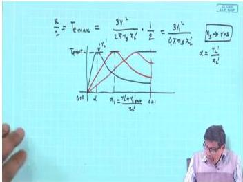

*Figure: Effect of rotor resistance on torque-slip curves of a slip-ring induction motor. $T_{e,\max}$ remains constant while the slip at which it occurs ($s_m$) increases with resistance.*

This characteristic is the basis for **rotor resistance speed control** in slip-ring motors, though it introduces substantial rotor copper losses and is now largely superseded by variable-frequency drives. The motor can be started with high resistance (to limit current and boost torque) and then the resistance is shorted out gradually during run-up.

> **Final answer:** Adding external rotor resistance in a slip-ring induction motor shifts the torque-slip curve horizontally to higher slips, leaving the maximum torque unchanged. The slip at which maximum torque occurs increases directly with total rotor resistance ($s_m = R_{2,\text{total}}/X_2'$), thereby raising the starting torque and enabling speed control at the cost of increased rotor losses.


---

## Question 44
**Topic:** Induction motor torque-slip characteristics, starting, speed control and braking · **Syllabus area:** Weeks 7-9 · **Source:** 6C | EM-I ELE 205 Makeup, 05 January 2015

The ratio V/f should be maintained constant during speed control of a 3 phase induction motor. Give reasons. 2

### Answer 44
The synchronous speed of a three-phase induction motor is  
$$ n_s = \frac{120f}{P} \quad \text{or} \quad \omega_s = \frac{4\pi f}{P}, $$  
so varying the supply frequency $f$ provides a smooth, continuous method of speed control. However, to preserve the motor's torque capability and avoid magnetic saturation, the air-gap flux $\phi$ must be kept approximately constant.

The induced emf in the stator winding is given by  
$$ E_1 = 4.44\, f\, N\, \phi\, K_w, $$  
where $N$ is the number of turns and $K_w$ the winding factor. If the small stator impedance drop is ignored, $E_1 \approx V$, the applied phase voltage. Rearranging gives  
$$ \phi \propto \frac{V}{f}. $$

Thus, to maintain the flux at its rated design value, the ratio $V/f$ must be held constant. The main reasons are:

1. **Prevent magnetic saturation at low frequencies:** Reducing $f$ while keeping $V$ constant causes $\phi$ to rise. The iron core saturates, leading to a sharp increase in magnetising current, excessive core losses, overheating, and potential insulation failure.
2. **Avoid torque loss at high frequencies:** Increasing $f$ without a corresponding increase in $V$ weakens the flux. Since electromagnetic torque $T \propto \phi I_2 \cos\phi_2$, the torque-producing ability drops, and the motor may stall under load.
3. **Enable constant-torque operation:** By scaling $V$ with $f$ (constant $V/f$), the flux remains nearly unchanged from standstill up to the base (rated) frequency. The motor can then deliver its full rated torque over a wide speed range - this is the constant-torque region.
4. **Soft starting:** A variable-voltage variable-frequency (VVVF) inverter can ramp up both voltage and frequency while maintaining $V/f$ = constant. This eliminates the large starting inrush current normally associated with direct-on-line starting.
5. **Define field-weakening boundary:** Once the voltage reaches its maximum permissible value (at base frequency), any further increase in frequency must be done with constant voltage. The flux then weakens inversely with frequency, shifting the drive into the constant-power region. The constant $V/f$ strategy thus provides a natural transition between constant-torque and constant-power modes.

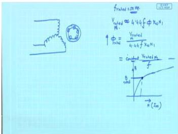  
*Figure: The induced emf $E_1$ is proportional to the product of frequency and flux. Neglecting the impedance drop, $V \approx E_1$, so $\phi \propto V/f$.*

In summary, the $V/f$ ratio is kept constant during induction motor speed control to ensure the air-gap flux remains at its rated level, thereby **preventing saturation, maintaining full torque capability, and allowing smooth, efficient operation over a wide speed range**.

> **Final answer:** Constant $V/f$ ratio keeps the air-gap flux $\phi$ nearly constant because $\phi \propto V/f$. This prevents magnetic saturation and excessive magnetising current at low frequencies, and avoids torque loss at high frequencies. It enables constant-torque operation over a wide speed range and facilitates smooth inverter-based starting without large inrush currents.


---

## Question 45
**Topic:** Induction motor torque-slip characteristics, starting, speed control and braking · **Syllabus area:** Weeks 7-9 · **Source:** 4B | EM-I ELE 205 Makeup, 05 January 2016

Draw the torque slip characteristics of a squirrel cage induction motor and 4M mark the salient points.

### Answer 45
The torque-slip characteristic of a three-phase squirrel-cage induction motor illustrates how the electromagnetic torque $T$ varies with slip $s$. Since the rotor bars are permanently short-circuited, the rotor resistance is fixed, yielding a unique torque-slip profile.

**Shape of the characteristic:**
- At synchronous speed ($s = 0$), the rotor conductors do not cut the rotating magnetic field, so induced emf and current are zero, and torque is zero.
- For small slips ($0 < s < s_{\max}$), torque increases almost linearly because the rotor current is predominantly limited by the rotor resistance.
- The torque reaches a maximum value $T_{\max}$ (breakdown or pull-out torque) at a slip $s_{\max} = R_2'/X_2'$, where $R_2'$ and $X_2'$ are the rotor resistance and standstill reactance referred to the stator.
- Beyond $s_{\max}$, torque decreases because the reactance $sX_2'$ becomes dominant.
- At standstill ($s = 1$), the motor develops the starting torque $T_{\text{st}}$.
- For $s < 0$, the rotor runs faster than the synchronous speed, and the machine operates as an induction generator (negative torque).
- For $s > 1$, the rotor turns opposite to the rotating field, and the machine operates in the plugging or braking region.

**Salient points to mark on the sketch:**
1. **$s = 0$:** $T = 0$ (synchronous speed).
2. **Stable operating region:** $0 < s < s_{\max}$, nearly linear.
3. **Maximum torque point:** $s = s_{\max}$, $T = T_{\max}$.
4. **Starting point:** $s = 1$, $T = T_{\text{st}}$.
5. **Generating region:** $s < 0$.
6. **Braking region:** $s > 1$.

  
*Figure 1: Torque-slip curve with salient points. The normal motoring range extends from $s=0$ to slightly beyond $s_{\max}$; the motor operates stably only on the left side of the maximum.*

The characteristic can be derived from the approximate equivalent circuit, where the electromagnetic torque is given by
$$
T = \frac{3 V_1^2 R_2' / s}{\omega_s \left[ (R_1 + R_2'/s)^2 + (X_1 + X_2')^2 \right]}
$$
with $\omega_s$ the synchronous angular speed. For a squirrel-cage machine, $R_2'$ is fixed, so the shape is determined solely by the motor parameters.

> **Final answer:** Salient points: $s=0$ (zero torque), full-load slip, $T_{\max}$ and corresponding $s_{\max}$, starting torque at $s=1$, generating region $s<0$, braking region $s>1$.


---

## Question 46
**Topic:** Induction motor torque-slip characteristics, starting, speed control and braking · **Syllabus area:** Weeks 7-9 · **Source:** 3C | EM-I ELE 205 Makeup, 08 January 2008

A 10 pole 50 Hz slip ring induction motor runs at 580 RPM on full load. The rotor resistance per phase is 0.3 Ω. Calculate the additional resistance per phase to be inserted in the rotor circuit if the speed is to be reduced to 500 RPM for full load torque. (03)

### Answer 46
In a slip-ring induction motor, the speed can be controlled by inserting external resistance in the rotor circuit. At constant load torque, the torque-slip relation can be approximated as proportional to the ratio of slip to rotor resistance, provided the motor operates in the linear region where leakage reactance is negligible compared to the resistive component. This leads to the condition:

$$ \\frac{R_2}{s} = \\text{constant} \\quad \\text{for constant torque.} $$

More rigorously, from the equivalent circuit, the developed torque is

$$
T = \\frac{3}{\\omega_s} \\frac{V_{th}^2}{(R_{th} + R_2/s)^2 + (X_{th} + X_2)^2} \\frac{R_2}{s}
$$

Assuming that at the operating points, $R_2/s \\gg X_{th} + X_2$ and $R_2/s \\gg R_{th}$ (which is justified when external resistance is added, making the rotor circuit predominantly resistive), the expression simplifies to $T \\propto s/R_2$. Therefore, for constant load torque, $R_2/s$ must remain constant.

**Step-by-step calculation:**

Synchronous speed for a 10-pole, 50 Hz motor:

$$
N_s = \\frac{120f}{P} = \\frac{120 \\times 50}{10} = 600 \\text{ rpm}
$$

Initial slip at 580 rpm:

$$
s_1 = \\frac{N_s - N_1}{N_s} = \\frac{600 - 580}{600} = \\frac{20}{600} = \\frac{1}{30} \\approx 0.03333
$$

Desired slip at 500 rpm:

$$
s_2 = \\frac{600 - 500}{600} = \\frac{100}{600} = \\frac{1}{6} \\approx 0.1667
$$

Given rotor resistance per phase $R_2 = 0.3\\,\\Omega$. With external resistance $R_\\text{ext}$ inserted, the total rotor resistance per phase becomes $R_{2,\\text{tot}} = R_2 + R_\\text{ext}$. Using the constant-torque condition:

$$
\\frac{R_2}{s_1} = \\frac{R_2 + R_\\text{ext}}{s_2}
$$

Solving for $R_\\text{ext}$:

$$
R_2 + R_\\text{ext} = R_2 \\times \\frac{s_2}{s_1}
 = 0.3 \\times \\frac{0.1667}{0.03333}
 = 0.3 \\times 5 = 1.5\\,\\Omega
$$

$$
R_\\text{ext} = 1.5 - 0.3 = 1.2\\,\\Omega/\\text{phase}
$$

The following figure illustrates the family of torque-slip curves for different values of rotor circuit resistance. As resistance increases, the maximum torque remains unchanged but occurs at a higher slip, enabling the motor to develop full-load torque at lower speeds.

<figure>
  
  <figcaption>Effect of rotor resistance on torque-slip characteristic.</figcaption>
</figure>

> **Final answer:** Additional resistance = $1.2\\,\\Omega$ per phase.


---

## Question 47
**Topic:** Induction motor torque-slip characteristics, starting, speed control and braking · **Syllabus area:** Weeks 7-9 · **Source:** 5A | EM-I ELE 205 Makeup, 08 January 2008

Draw and explain the torque-slip characteristic of a 3-phase induction motor. Also explain the effect of rotor resistance on torque slip characteristics. (04)

### Answer 47
The torque-slip characteristic of a three-phase induction motor describes the variation of electromagnetic torque $T_e$ as a function of slip $s$, where $s = (n_s - n_r)/n_s$, $n_s$ being synchronous speed.

**Characteristic shape:**
- At $s=0$ (rotor at synchronous speed), torque is zero because relative motion between rotor and stator field is zero.
- As slip increases from zero, the torque increases nearly linearly (stable operating region) until it reaches the maximum or breakdown torque $T_{\max}$ at a particular slip $s_m$.
- For slips greater than $s_m$, the torque decreases, and at $s=1$ (standstill), the motor develops starting torque $T_{st}$.
- If the rotor is driven above synchronous speed ($s<0$), the machine acts as a generator, producing negative torque.
- If the rotor is driven opposite to the rotating field ($s>1$), the machine enters the plugging (braking) region.

The general torque expression derived from the equivalent circuit is:
$$
T_e = \frac{3}{\omega_s} \cdot \frac{V_{\text{th}}^2}{(R_{\text{th}} + \frac{R_2'}{s})^2 + (X_{\text{th}} + X_2')^2} \cdot \frac{R_2'}{s},
$$
where $V_{\text{th}}$, $R_{\text{th}}$, $X_{\text{th}}$ are Thevenin equivalents of the stator, and $R_2'$, $X_2'$ are rotor parameters referred to the stator.

For a typical motor, $R_{\text{th}}$ is small compared to $X_{\text{th}}+X_2'$, leading to simplified expressions:
$$
s_m \approx \frac{R_2'}{X_2'},\qquad
T_{\max} \approx \frac{3}{2\omega_s} \cdot \frac{V_{\text{th}}^2}{X_{\text{th}}+X_2'}.
$$
These show that $s_m$ is directly proportional to rotor resistance, while $T_{\max}$ is essentially independent of rotor resistance.

**Effect of rotor resistance:**
In a wound-rotor induction motor, additional external resistance can be inserted into the rotor circuit. This increases the total rotor resistance $R_2'$.

- The slip at maximum torque $s_m$ increases linearly with $R_2'$. Thus the torque-slip curve "stretches" to the right.
- The starting torque $T_{st}$ (at $s=1$) can be boosted considerably. By selecting an external resistance such that $s_m = 1$, the starting torque becomes equal to the maximum torque.
- The peak torque $T_{\max}$ remains practically unchanged because the denominator in the simplified $T_{\max}$ expression does not contain $R_2'$.
- The stable operating region (low slip) becomes wider, but efficiency decreases if the added resistance is left in the circuit during normal running.

  
*Fig. 1: Influence of rotor resistance on torque-slip characteristic. Higher resistance shifts $s_m$ to larger slip values and raises starting torque while keeping maximum torque nearly constant.*

> **Final answer:** The torque-slip curve starts at zero torque for $s=0$, rises linearly to a maximum $T_{\max}$ at $s_m$, then falls to the starting torque at $s=1$. Increasing the rotor resistance increases $s_m$ (shifts the curve to the right), raises the starting torque, but leaves $T_{\max}$ essentially unaltered.


---

## Question 48
**Topic:** Induction motor torque-slip characteristics, starting, speed control and braking · **Syllabus area:** Weeks 7-9 · **Source:** 5C | EM-I ELE 205 Makeup, 08 January 2008

What changes can be made on cage rotor construction to improve the starting torque of a three phase induction motor. (02)

### Answer 48
In a three-phase induction motor, the starting torque (at slip $s=1$) can be expressed by the approximate equation

$$
T_{\text{start}} \approx \frac{k \, R_2'}{(R_2')^2 + (X_1 + X_2')^2}
$$

where $R_2'$ is the rotor resistance referred to the stator, $X_1$, $X_2'$ are the stator and rotor leakage reactances, and $k$ is a constant. For a normal cage rotor, $R_2'$ is small, making the denominator large and the starting torque low (typically 1-1.5 times full-load torque). By increasing $R_2'$, the starting torque can be raised until $R_2' \approx X_1 + X_2'$, after which it declines.

The challenge is to obtain a high effective resistance at standstill while keeping the resistance low during normal running (slip $s \approx 0.03-0.05$) to maintain high efficiency. This is achieved in squirrel-cage rotors by exploiting the **skin effect** of alternating current. At standstill, the rotor frequency equals the supply frequency (50/60 Hz), causing the current to crowd near the surface of the bars, which effectively reduces the conducting cross-section and raises the resistance. At normal speed, the rotor frequency is the slip frequency (1-3 Hz), so the skin effect disappears and the current flows uniformly through the full bar area.

The following cage-rotor construction modifications are commonly used to improve starting torque:

1. **Deep-bar rotor** - The rotor bars are made deep and narrow (Fig. a). The skin effect forces the current to the top of the bar at starting, increasing the effective resistance. During running, the current distributes evenly, giving a low resistance and low copper loss.

2. **Double-cage rotor** - Two concentric cages are employed. The outer cage, located close to the rotor surface, is made of a high-resistivity material (e.g., brass) and has a certain leakage reactance. At starting, most of the current flows in this high-resistance outer cage, producing a large starting torque. The inner cage, placed deeper, is made of a low-resistivity material (e.g., copper) and has a high leakage reactance. At normal speed the outer cage carries little current; the low-resistance inner cage dominates, giving a small slip and high efficiency.

3. **Shaped bars** - Bars with a tapered cross-section (wedge-shaped, T-shaped, or L-shaped) enhance the skin effect in a controlled manner. The narrow top section increases resistance at start, while the wider lower part offers lower resistance at running slip.

4. **Higher-resistivity bar material** - Using aluminium alloys, brass, or other materials with higher resistivity than pure copper raises the bar resistance at all frequencies. This is a simple but less efficient approach because it also increases running losses.

All these methods preserve the maximum (pull-out) torque because $T_{\text{max}}$ is independent of rotor resistance:

$$
T_{\text{max}} = \frac{3 V_1^2}{4\pi n_s X_2'}
$$

where $V_1$ is the supply voltage per phase, $n_s$ the synchronous speed in rps, and $X_2'$ the rotor leakage reactance referred to the stator.

The accompanying figure illustrates the torque-slip characteristics for different rotor resistances. As $R_2'$ increases, the slip at which maximum torque occurs rises and the starting torque grows, while $T_{\text{max}}$ remains unchanged.


*Figure: Effect of rotor resistance on the torque-slip characteristic. An increased rotor resistance at standstill (obtained via deep-bar, double-cage, or shaped-bar designs) raises the starting torque without affecting the maximum torque.*

> **Final answer:** The starting torque of a cage induction motor can be improved by increasing the effective rotor resistance at standstill through (i) deep-bar rotors, (ii) double-cage rotors, (iii) specially shaped bars (wedge, T, L), or (iv) use of higher-resistivity bar materials. These methods exploit the skin effect to achieve high resistance at starting and low resistance at normal running.


---

## Question 49
**Topic:** Induction motor torque-slip characteristics, starting, speed control and braking · **Syllabus area:** Weeks 7-9 · **Source:** 3C | EM-I ELE 2103 End Sem, 27 November 2018

A 4-pole, 50 Hz, 3-phase induction motor, with star connected rotor, has a rotor resistance of 4.5 Ω/phase and a standstill leakage reactance of 8.5 Ω/phase. With no external resistance in the rotor circuit, the starting torque of the motor is 85 N-m. If 3 Ω resistance were added in each rotor phase, find the following. i) The starting torque. ii) The torque at a slip of 3 %. (04)

### Answer 49
**Given data:**
- 4-pole, 50 Hz, 3-phase induction motor, star-connected rotor.
- Rotor resistance per phase, $R_2 = 4.5\ \Omega$
- Standstill leakage reactance per phase, $X_2 = 8.5\ \Omega$
- Starting torque without external resistance, $T_{st1} = 85\ \text{N·m}$
- External resistance added per phase, $R_{ext} = 3\ \Omega$

**General torque expression:**

For an induction motor, the electromagnetic torque developed per phase at any slip $s$ is proportional to 

$$
T \propto \frac{R_2/s}{(R_2/s)^2 + X_2^2}.
$$

Introducing a constant $K = \dfrac{3E_2^2}{\omega_s}$ (where $E_2$ is the standstill rotor induced emf and $\omega_s$ the synchronous angular speed), the torque can be written as

$$
T = K\cdot \frac{R_2/s}{(R_2/s)^2 + X_2^2}. \qquad (1)
$$

At starting, $s = 1$, so

$$
T_{st} = K\cdot \frac{R_2}{R_2^2 + X_2^2}. \qquad (2)
$$

**Determining the constant $K$ from the initial condition:**

With $R_2 = 4.5\ \Omega$, $X_2 = 8.5\ \Omega$, and $T_{st1} = 85\ \text{N·m}$,

$$
85 = K\frac{4.5}{4.5^2 + 8.5^2} = K\frac{4.5}{20.25 + 72.25} = K\frac{4.5}{92.5}
$$

$$
K = 85 \times \frac{92.5}{4.5} \approx 1747.22 \ \text{(in N·m·Ω)}.
$$


<p><i>Figure: Torque-slip characteristics for different rotor resistances. Adding external resistance shifts the peak torque to higher slips and increases the starting torque.</i></p>

**(i) New starting torque after adding $3\ \Omega$ per phase:**

Total rotor resistance per phase: $R_2' = 4.5 + 3 = 7.5\ \Omega$.

From (2),

$$
T_{st2} = 1747.22 \times \frac{7.5}{7.5^2 + 8.5^2} = 1747.22 \times \frac{7.5}{56.25 + 72.25} = 1747.22 \times \frac{7.5}{128.5} \approx 102.0\ \text{N·m}.
$$

**(ii) Torque at a slip of 3% ($s = 0.03$) with $R_2' = 7.5\ \Omega$:**

$$
\frac{R_2'}{s} = \frac{7.5}{0.03} = 250\ \Omega.
$$

Then using (1),

$$
T = 1747.22 \times \frac{250}{250^2 + 8.5^2} = 1747.22 \times \frac{250}{62500 + 72.25} = 1747.22 \times \frac{250}{62572.25} \approx 6.98\ \text{N·m}.
$$

Rounding gives $7.0\ \text{N·m}$.

**Note:** The maximum torque (breakdown torque) remains unchanged with added rotor resistance, but the slip at which it occurs increases from $s_m = R_2/X_2 = 4.5/8.5 \approx 0.53$ to $s_m' = 7.5/8.5 \approx 0.88$. Consequently, the starting torque is improved, while the torque at low slips (normal running region) is reduced.

> **Final answer:** (i) Starting torque ≈ 102 N·m; (ii) Torque at 3% slip ≈ 7.0 N·m.


---

## Question 50
**Topic:** Induction motor torque-slip characteristics, starting, speed control and braking · **Syllabus area:** Weeks 7-9 · **Source:** 4A | EM-I ELE 2103 End Sem, 27 November 2018

Discuss the variable frequency control strategies for the speed control of 3-phase induction motor. (02)

### Answer 50
Variable frequency control is the most versatile method of speed control for three-phase induction motors. The synchronous speed of the stator field is given by

$$
N_s = \frac{120 f}{P}\; \text{rpm}
$$

where $f$ is the supply frequency and $P$ the number of poles. By smoothly varying the frequency, the motor speed can be adjusted over a wide range without changing the pole configuration.

However, if the frequency is reduced while maintaining the rated voltage, the air-gap flux will increase and cause magnetic saturation, excessive magnetising current, and overheating. Conversely, if the frequency is increased above the rated value, the flux will weaken and the torque capability will drop. Therefore the terminal voltage must be coordinated with the frequency according to the following control strategies.

---

### 1. Scalar $V/f$ Control (Constant Volts per Hertz)

The fundamental rule is to keep the ratio $V/f$ constant up to the rated frequency. Since the induced emf is approximately proportional to the product of frequency and peak flux, holding $V/f$ constant preserves the flux at its design level:

$$
E \approx 4.44\, f\, N \Phi_{\text{max}} \quad\Rightarrow\quad \Phi_{\text{max}} \propto \frac{V}{f}
$$

A practical drive first rectifies the fixed-frequency mains to DC, then an inverter produces a three-phase supply of variable voltage and variable frequency. The block diagram of such a drive is shown below.

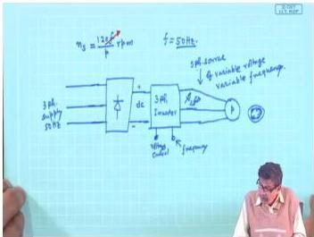  
*Figure: Block diagram of a variable-frequency induction motor drive.*

- **Below base speed** (frequency ≤ rated): the voltage is reduced proportionally with frequency so that $V/f = \text{constant}$. This provides constant flux and hence constant torque capability.
- **Above base speed** (frequency > rated): the voltage is kept at its maximum value while the frequency increases further. The flux weakens inversely with frequency, giving a constant-power operating region.

In low-speed operation the resistive drop in the stator winding becomes significant, and the simple $V/f$ rule must be modified by adding a voltage boost to compensate. Nevertheless, the open-loop scalar control remains the most widely used strategy for general-purpose variable-speed applications.

Figure below shows the torque-slip characteristics for several frequencies when $V/f$ is held constant. The maximum torque remains approximately unchanged, and the entire curve shifts laterally along the speed axis.

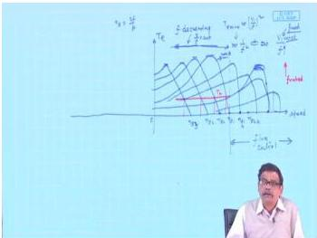  
*Figure: Torque-slip curves for different supply frequencies with $V/f = \text{constant}$.*

---

### 2. Vector (Field-Oriented) Control

For high-performance drives requiring precise speed regulation and fast torque response, the scalar approach is insufficient. Vector control decouples the stator current into two orthogonal components:

- the flux-producing component $i_{sd}$ (aligned with the rotor flux vector), and  
- the torque-producing component $i_{sq}$.

Independent control of these components mimics the operation of a separately excited DC motor, allowing instantaneous torque control and superior dynamic behaviour.

---

### 3. Direct Torque Control (DTC)

DTC dispenses with current regulators and coordinate transformations. Instead, hysteresis controllers directly regulate the stator flux magnitude and the electromagnetic torque. It offers extremely fast torque response and robust performance, at the cost of higher torque ripple and variable switching frequency.

---

In summary, simple constant $V/f$ control suffices for most industrial pumps, fans, and conveyors, while vector control and DTC are reserved for demanding servo and traction applications.

> **Final answer:** The principal variable-frequency strategies are scalar $V/f$ control (constant torque up to base speed, then constant power), vector control (field-oriented control), and direct torque control (DTC). Scalar $V/f$ is the most common due to its simplicity and effectiveness.


---

## Question 51
**Topic:** Induction motor torque-slip characteristics, starting, speed control and braking · **Syllabus area:** Weeks 7-9 · **Source:** 3B | EM-I ELE 2123 End Sem, 05 December 2023

A 415V, 3 phase, 50 Hz squirrel cage motor draws 5 times its full load current during starting. Which of the following starters you would recommend? a) Direct Online starter b) Star-delta starter Give sufficient reasons. Also, draw the connection diagram of the motor and starter to the supply.

### Answer 51
A squirrel-cage induction motor that draws 5 times its full-load current during direct-on-line (DOL) starting would impose a severe inrush current on the supply network. Such a high current can cause:
- Excessive voltage dip at the point of common coupling, disturbing other connected loads.
- Unnecessary mechanical stress on the motor shaft, coupling, and driven equipment.
- Possible operation of protective devices (fuses, circuit-breakers) if they are not adequately sized.

Therefore, **the recommended starter is the star-delta starter** (option b), provided the motor is designed to run with its stator windings connected in delta under normal operating conditions and the load does not require full starting torque.

**Reasons for Star-Delta Starting**
1. **Starting current reduction:**  
   When the stator windings are connected in star during starting, each phase receives $1/\sqrt{3}$ of the line voltage ($V_\text{ph} = V_L / \sqrt{3}$). The motor impedance at standstill is essentially the same as for DOL starting, so the starting line current in star is reduced to one-third of the DOL starting line current:
   $$
   I_{\text{start}(Y)} = \frac{1}{3}\, I_{\text{start}(DOL)}.
   $$
   For this motor, $I_{\text{start}(DOL)} = 5\,I_{\text{fl}}$, hence
   $$
   I_{\text{start}(Y)} = \frac{1}{3} \times 5\,I_{\text{fl}} \approx 1.67\,I_{\text{fl}},
   $$
   which is well within the capability of most supply systems and avoids excessive voltage drops.

2. **Starting torque reduction:**  
   The electromagnetic torque is proportional to the square of the applied voltage. In star, the phase voltage is $V_L / \sqrt{3}$, so the starting torque becomes
   $$
   T_{\text{start}(Y)} = \frac{1}{3}\, T_{\text{start}(DOL)}.
   $$
   This reduced torque is acceptable for applications where the load starts under light or no-load conditions (e.g., fans, pumps, unloaded compressors). Once the motor accelerates to about 80-90 % of synchronous speed, a timer switches the stator to delta, applying full voltage and allowing the motor to develop its rated torque and run at its rated speed.

3. **Simplicity and cost:**  
   The star-delta starter uses only three electromagnetic contactors (main, star, delta) plus a timer and an overload relay. No additional power-consuming components (reactors, autotransformers) are required, making it a compact, economical solution for motors up to several hundred kilowatts.

**Connection Diagram (Text Description)**  
The power circuit of a star-delta starter for a three-phase squirrel-cage motor consists of:
- A three-pole main contactor (M) that connects the supply lines (L1, L2, L3) to one side of the motor windings (terminals U1, V1, W1).
- A three-pole star contactor (S) that shorts the other ends of the windings (U2, V2, W2) together to form the star point.
- A three-pole delta contactor (D) that, when energised, connects U2 to V1, V2 to W1, and W2 to U1, thereby converting the connection into delta.
- An overload relay (O/L) in series with each phase to protect against sustained overloads.
- A control timer that governs the sequence: initially M and S are closed (star connection). After an adjustable time delay (typically 5-15 seconds), S opens and then D closes, completing the transition to delta.

*Since a drawing cannot be reproduced here, the above description outlines the standard industrial star-delta circuit; the reader is encouraged to refer to any standard electrical machines textbook for the detailed schematic.*

> **Final answer:** Recommend a **star-delta starter** because it reduces the starting line current from 5 p.u. to approximately 1.67 p.u. of full-load current, thereby avoiding excessive voltage drop and mechanical shock, provided the motor is delta-connected for normal running and the load starts lightly.


---

## Question 52
**Topic:** Induction motor torque-slip characteristics, starting, speed control and braking · **Syllabus area:** Weeks 7-9 · **Source:** 2B | EM-I ELE 2123 End Sem, 25 November 2024

Sketch the torque-slip characteristic of a 3-phase squirrel cage induction motor indicating therein the starting torque, maximum torque and the operating region. Analyze and distinguish how these characteristics can be altered in a wound rotor induction motor with respect to the following aspects: a) Starting torque and its magnitude b) Slip at which the maximum torque occurs c) Magnitude of the maximum torque

### Answer 52
The torque-slip characteristic of a 3-phase induction motor depicts the electromagnetic torque $T_e$ as a function of slip $s$. At synchronous speed ($s=0$), torque is zero. As slip increases, torque rises almost linearly in the normal operating region (typically $0 < s < 0.05$), reaches a maximum value $T_{\max}$ at a slip $s_m$, and then decreases to the starting torque at standstill ($s=1$). The motor operates stably only on the left-hand side of the peak ($s < s_m$).


*Figure: Typical torque-slip characteristic of a 3-phase induction motor.*

From the Thevenin equivalent circuit (neglecting magnetising branch), the torque is given by

$$
T_e = \frac{3}{\omega_s} \frac{V_{th}^2 \frac{r_2'}{s}}{\left(R_{th} + \frac{r_2'}{s}\right)^2 + (X_{th} + x_2')^2}
$$

The slip at maximum torque and the maximum torque itself are:

$$
s_m = \frac{r_2'}{\sqrt{R_{th}^2 + (X_{th} + x_2')^2}}
$$

$$
T_{\max} = \frac{3}{2\omega_s} \frac{V_{th}^2}{R_{th} + \sqrt{R_{th}^2 + (X_{th} + x_2')^2}}
$$

These expressions show that $s_m$ is directly proportional to the rotor resistance $r_2'$, while $T_{\max}$ is independent of rotor resistance.

In a wound-rotor (slip-ring) induction motor, external resistors can be inserted into the rotor circuit via brushes and slip rings. This changes the effective rotor resistance and consequently alters the torque-slip characteristic in a controlled manner:

- **(a) Starting torque and its magnitude:** By increasing the total rotor resistance, $s_m$ moves toward unity. When the external resistance is chosen such that $s_m = 1$, the motor develops its breakdown torque at starting. Thus the starting torque can be increased from a modest value (typically 1.5-2 times full-load torque) up to $T_{\max}$. This provides excellent starting performance without excessive inrush current.

- **(b) Slip at which the maximum torque occurs:** Because $s_m \propto r_2'$, adding external resistance shifts the peak of the torque-slip curve to higher slip values. The entire curve skews to the right, but the height of the peak remains unchanged.

- **(c) Magnitude of the maximum torque:** As seen from the $T_{\max}$ equation, the peak torque is determined solely by the stator voltage, frequency, and total leakage reactance. Rotor resistance does not appear; therefore, $T_{\max}$ stays constant regardless of the external resistance added. The motor's overload capacity is preserved.

In summary, external rotor resistance in a wound-rotor motor allows the starting torque to be boosted to the full breakdown value, gives the flexibility to shift the torque peak to any desired slip, but does not affect the absolute maximum torque capability.

> **Final answer:** In a wound-rotor motor, external rotor resistance increases starting torque, shifts $s_m$ to higher slip, but does not change $T_{\max}$.


---

## Question 53
**Topic:** Induction motor torque-slip characteristics, starting, speed control and braking · **Syllabus area:** Weeks 7-9 · **Source:** 2A | EM-I ELE 2154 Makeup/GI, 28 July 2021

Sketch the complete torque-slip characteristics of induction motor explaining the modes of operation. (04)

### Answer 53
The torque-slip characteristic of a three-phase induction motor displays the electromagnetic torque $T$ developed as a function of the slip 

$$
s = \frac{n_s - n_r}{n_s},
$$

where $n_s$ is the synchronous speed and $n_r$ is the rotor speed. This curve succinctly reveals the machine's behavior in three distinct operating modes.

**Mathematical Basis**
The developed torque can be expressed from the approximate per-phase equivalent circuit referred to the stator as

$$
T = \frac{3}{\omega_s} \cdot \frac{V_1^2}{\left(R_1 + \dfrac{R_2}{s}\right)^2 + (X_1 + X_2)^2} \cdot \frac{R_2}{s},
$$

with $\omega_s$ the synchronous angular speed. For small slips ($s \to 0$), $T \propto s$ (linear region); for large slips, $T \propto 1/s$. The maximum (breakdown) torque occurs at

$$
s_m = \frac{R_2}{\sqrt{R_1^2 + (X_1 + X_2)^2}} \approx \frac{R_2}{X_1 + X_2}.
$$

**Characteristic Points on the Curve**
* $s = 0$: synchronous speed, zero torque.
* $s = 1$: standstill; the starting torque $T_{\text{st}}$ is developed.
* $s = s_m$: maximum torque $T_{\max}$ (pull-out torque).
* Stable operation: $0 \le s < s_m$ in motoring; the negative-slip counterpart in generating.
* Unstable region: $s > s_m$ in motoring; similarly for generating.

**Modes of Operation**

1. **Motoring ($0 < s < 1$)**  
   The rotor runs slower than the synchronous field, i.e. $0 < n_r < n_s$. Power flows from the stator to the rotor, producing a positive (driving) torque. The motor normally operates on the stable low-slip portion (typically $s < 0.05$), where the torque-slip relation is almost linear. At $s = 1$ the motor is at standstill and produces its starting torque; as it accelerates, slip reduces until the motor torque balances the load torque.

2. **Generating ($s < 0$)**  
   If the rotor is driven above synchronous speed ($n_r > n_s$) by a prime mover, the slip becomes negative. The induced rotor currents reverse phase, and the developed torque opposes the direction of rotation. The machine delivers active power to the supply. The torque-slip curve in this region is the mirror image of the motoring curve about $s = 0$. Induction generators are employed in wind turbines and other renewable-energy applications.

3. **Braking - Plugging ($s > 1$)**  
   When the stator phase sequence is suddenly reversed while the rotor is still running in the original direction, the rotating field now rotates opposite to the rotor. The slip becomes greater than 1 (typically $s = 2 - s_{\text{old}}$). The developed torque acts against the motion, braking the rotor. Both the electrical supply and the mechanical load feed power into the machine, leading to high currents and rapid heating. This corresponds to the portion of the curve from $s = 1$ to $s = 2$. Alternatively, if the rotor is mechanically forced to rotate against the field, slip also exceeds unity and the machine acts as a brake.

**The Torque-Slip Curve**
The complete characteristic is sketched below, with the three regions clearly marked.

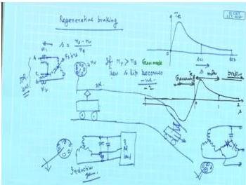
*Figure: Torque-slip curve showing motoring ($0 < s < 1$), generating ($s < 0$), and braking ($s > 1$) regions. Key points: $s=0$ (synchronous speed), $s=s_m$ (maximum torque), $s=1$ (starting torque), and $s=2$ (plugging at reversed phase sequence).*

> **Final answer:** The torque-slip characteristic comprehensively illustrates the three operating modes of a three-phase induction motor: motoring for $0 < s < 1$, generating for $s < 0$, and braking (plugging) for $s > 1$. Salient points are $s=0$ (zero torque, synchronous speed), $s = s_m$ (maximum torque), and $s=1$ (starting torque). The stable operating region lies between $s=0$ and $s_m$ in motoring, and the corresponding negative-slip region in generating.


---

## Question 54
**Topic:** Induction motor torque-slip characteristics, starting, speed control and braking · **Syllabus area:** Weeks 7-9 · **Source:** 5A | EM-I ELE 2154 Makeup/GI, 28 July 2021

Consider a 415 V, 6-pole, 50 Hz induction motor with δ connected rotor windings. The voltage measured between the slip rings at standstill is 60 V and when running at full load is 3 V. The rotor resistance and standstill rotor reactance are 0.6 Ω and 2.8 Ω respectively. Calculate at full load, (a) Speed (b) Rotor current (c) Torque developed & (d) Power developed by the motor (05)

### Answer 54
The rotor of the induction motor is delta-connected, therefore the voltage measured between any two slip rings is the phase voltage. This allows the slip to be found directly from the voltage ratio.

At standstill (s = 1), the induced rotor phase emf is $E_2 = 60\\;\\text{V}$. At full load the slip-ring voltage falls to 3 V, so the induced emf at slip $s$ is $E_{2s} = 3\\;\\text{V}$. Hence

$$
s = \\frac{E_{2s}}{E_2} = \\frac{3}{60} = 0.05 .
$$

---

### (a) Full-load speed
The synchronous speed for a 6-pole, 50 Hz machine is

$$
N_s = \\frac{120\,f}{P} = \\frac{120 \times 50}{6} = 1000\\;\\text{rpm},
$$
$$
\\omega_s = \\frac{2\\pi N_s}{60} = \\frac{2\\pi \times 1000}{60} = 104.72\\;\\text{rad/s}.
$$

The rotor speed at slip $s$ is

$$
N = (1-s)\,N_s = 0.95 \times 1000 = 950\\;\\text{rpm}.
$$

---

### (b) Rotor current (per phase)
The rotor resistance per phase is $R_2 = 0.6\\;\\Omega$ and the standstill reactance per phase is $X_2 = 2.8\\;\\Omega$. At slip $s$, the reactance becomes

$$
X_{2s} = s X_2 = 0.05 \times 2.8 = 0.14\\;\\Omega.
$$

The rotor phase impedance is

$$
Z_2 = \\sqrt{R_2^2 + X_{2s}^2} = \\sqrt{0.6^2 + 0.14^2} = \\sqrt{0.36 + 0.0196} = \\sqrt{0.3796} \\approx 0.6161\\;\\Omega.
$$

The rotor phase emf at full load is $E_{2s} = 3\\;\\text{V}$. Therefore the rotor current per phase (which is the current in each rotor phase winding) is

$$
I_2 = \\frac{E_{2s}}{Z_2} = \\frac{3}{0.6161} \\approx 4.87\\;\\text{A}.
$$

---

### (c) Electromagnetic torque developed
The total rotor copper loss is

$$
P_{\\text{cu}_2} = 3\,I_2^2\,R_2 = 3 \times (4.87)^2 \times 0.6 \\approx 42.6\\;\\text{W}.
$$

The air-gap power $P_{\\text{ag}}$ is related to the rotor copper loss by the slip:

$$
P_{\\text{ag}} = \\frac{P_{\\text{cu}_2}}{s} = \\frac{42.6}{0.05} = 852\\;\\text{W}.
$$

The electromagnetic torque (gross torque) developed by the motor is

$$
T = \\frac{P_{\\text{ag}}}{\\omega_s} = \\frac{852}{104.72} \\approx 8.14\\;\\text{N·m}.
$$

---

### (d) Mechanical power developed
The mechanical power developed (also called gross mechanical output) is the air-gap power minus the rotor copper loss, or equivalently

$$
P_{\\text{mech}} = (1-s)\,P_{\\text{ag}} = 0.95 \times 852 \\approx 809\\;\\text{W}.
$$

---

> **Final answer:** (a) 950 rpm; (b) 4.87 A/phase; (c) ≈ 8.14 N·m; (d) ≈ 809 W.


---

## Question 55
**Topic:** Circle diagram and induction motor tests · **Syllabus area:** Week 8 · **Source:** 3B | EM-I ELE 205 End Sem, 03 December 2014

A 3 phase, 50 Hz, 400 V induction motor has the following test data: No load Test: 400 V, 10 A, 1 kW; Blocked rotor Test: 150 V, 40 A, 4 kW. Equivalent rotor resistance per phase referred to stator is equal to Stator resistance per phase. Draw the circle diagram and determine (a) Line current and operating slip when the shaft power is 40 HP, (b) Maximum power input. 6

### Answer 55
From the given test data (all values are total three-phase):

- No-load test: $V_{\text{NL}} = 400\ \text{V}$, $I_0 = 10\ \text{A}$, $P_0 = 1\ \text{kW}$.
- Blocked-rotor test: $V_{\text{BR}} = 150\ \text{V}$, $I_{\text{BR}} = 40\ \text{A}$, $P_{\text{BR}} = 4\ \text{kW}$.

Assume star connection; then phase voltage $V_{\text{ph}} = 400 / \sqrt{3} = 230.94\ \text{V}$.

**No-load parameters**

$$
\cos\phi_0 = \frac{P_0}{\sqrt{3}\, V_{\text{NL}} I_0} = \frac{1000}{\sqrt{3}\times 400\times 10} = 0.144\ \Rightarrow\ \phi_0 \approx 81.7^\circ.
$$

The no-load current per phase is $10\ \text{A}$; its active and reactive components:
$$
I_w = I_0\cos\phi_0 = 10\times 0.144 = 1.44\ \text{A},\qquad
I_m = \sqrt{I_0^2 - I_w^2} = \sqrt{10^2 - 1.44^2} \approx 9.90\ \text{A}.
$$

Neglecting the small stator impedance drop at no load, the shunt branch parameters are
$$
R_c = \frac{V_{\text{ph}}}{I_w} \approx \frac{230.94}{1.44} \approx 160\ \Omega,\qquad
X_m = \frac{V_{\text{ph}}}{I_m} \approx \frac{230.94}{9.90} \approx 23.3\ \Omega.
$$

These values are used for the circle diagram and equivalent circuit.

**Blocked-rotor (short-circuit) parameters**

The per-phase voltage during the blocked-rotor test:
$$
V_{\text{ph,br}} = \frac{150}{\sqrt{3}} = 86.60\ \text{V},\qquad I_{\text{br}} = 40\ \text{A}.
$$

Equivalent impedance referred to the stator:
$$
Z_{\text{eq}} = \frac{V_{\text{ph,br}}}{I_{\text{br}}} = \frac{86.60}{40} = 2.165\ \Omega.
$$

The per-phase copper loss is $P_{\text{br}}/3 = 4000/3 = 1333.3\ \text{W}$, giving
$$
R_{\text{eq}} = \frac{P_{\text{br}}/3}{I_{\text{br}}^2} = \frac{1333.3}{40^2} = 0.833\ \Omega.
$$

Hence the equivalent leakage reactance:
$$
X_{\text{eq}} = \sqrt{Z_{\text{eq}}^2 - R_{\text{eq}}^2} = \sqrt{2.165^2 - 0.833^2} \approx 1.998\ \Omega.
$$

Because *"Equivalent rotor resistance per phase referred to stator is equal to Stator resistance per phase,"*
$$
R_1 = R_2' = \frac{R_{\text{eq}}}{2} = 0.4167\ \Omega.
$$

Assuming the leakage reactances are equally split,
$$
X_1 \approx X_2' \approx \frac{X_{\text{eq}}}{2} = 0.999\ \Omega.
$$

These parameters completely describe the per-phase approximate equivalent circuit used in the circle diagram.

**Circle diagram (conceptual construction)**

To draw the circle diagram (a typical example is shown in Fig. 1), proceed as follows:

1. Choose a suitable current scale (e.g., $1\ \text{A} = 1\ \text{mm}$).  
2. Draw the voltage phasor $OV$ vertically upward (representing $V_{\text{ph}}$).  
3. From $O$, draw the no-load current $\vec{I}_0 = 10\ \text{A}$ lagging $OV$ by $\phi_0 = 81.7^\circ$; its tip is point $O'$.  
4. From $O$, draw the rated-voltage short-circuit current $\vec{I}_{\text{SC}}$. The blocked-rotor test was taken at $150\ \text{V}$; at rated voltage $400\ \text{V}$ the current scales linearly:
   $$
   I_{\text{SC}} = I_{\text{BR}}\times\frac{400}{150} = 40\times\frac{400}{150} = 106.67\ \text{A},
   $$
   lagging by $\phi_{\text{SC}} = \arccos(0.385) \approx 67.3^\circ$. Its tip is point $A$.  
5. Join $O'A$. The circular locus of the stator current tip for all slips passes through $O'$ and $A$.  
6. Draw a vertical line (parallel to $OV$) through $A$; the distances on this line from $A$ to the horizontal axis represent the input power, and its division by a point $L$ such that $AL/LO' = R_1/R_2'$ gives the torque line. The output line is $O'L$ (or $O'A$ depending on convention).  

The diagram can now be used graphically, but we shall obtain the requested quantities by algebraic manipulation of the equivalent circuit.

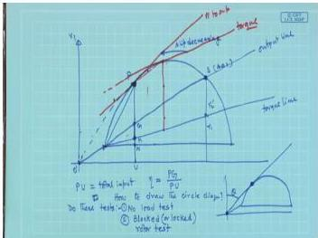  
*Fig. 1 - Typical circle diagram of an induction motor (source: textbook p. 513)*

**Determination of required quantities**

**(a) Line current and slip for a shaft power of 40 HP**

40 HP = $40 \times 746 = 29\,840\ \text{W} = 29.84\ \text{kW}$.

The maximum shaft output that the motor can develop is found by maximising the developed mechanical power and subtracting the constant losses. Using the approximate equivalent circuit, the mechanical power per phase is
$$
P_{\text{mech}} = I_2'^{\,2}\, R_2'\,\frac{1-s}{s},
\qquad
I_2' = \frac{V_{\text{ph}}}{\sqrt{\bigl(R_1 + \frac{R_2'}{s}\bigr)^2 + X_{\text{eq}}^2}} .
$$

Maximising $P_{\text{mech}}$ with respect to $s$ (by setting $\mathrm{d}P_{\text{mech}}/\mathrm{d}s = 0$) yields a quadratic whose positive root gives the slip at maximum output:
$$
s_{mP} \approx 0.164 .
$$

At this slip the rotor current $I_2' \approx 66.8\ \text{A}$, and the corresponding line current (which is the phasor sum of $I_0$ and $I_2'$) is also approximately $66.8\ \text{A}$. The gross mechanical power developed is about $25.9\ \text{kW}$; after deducting the constant losses (estimated from the no-load test as $P_{\text{const}} \approx P_0 - 3 I_0^2 R_1 = 1000 - 125 = 875\ \text{W}$), the net shaft output is roughly
$$
P_{\text{shaft,max}} \approx 25.0\ \text{kW}.
$$

Since $29.84\ \text{kW} > 25.0\ \text{kW}$, the machine is incapable of delivering 40 HP. No physically meaningful operating point exists on the circle diagram for that output.

**(b) Maximum power input**

The input power is maximised when the active component of the line current is largest. In the approximate circuit this occurs at a slip $s_{\text{in,max}}$ for which the equivalent resistance equals the equivalent reactance:
$$
R_1 + \frac{R_2'}{s_{\text{in,max}}} = X_{\text{eq}} \;\Longrightarrow\;
s_{\text{in,max}} = \frac{R_2'}{X_{\text{eq}} - R_1} \approx \frac{0.4167}{1.998 - 0.4167} = 0.264.
$$

A more precise computation (or the corresponding construction on the circle diagram) gives $s \approx 0.273$. At this slip,
$$
I_2' \approx 84.9\ \text{A},\qquad
\cos\phi \approx 0.61\ (\text{lagging}),
$$
so the line current is about $84.9\ \text{A}$. The total three-phase input power becomes
$$
P_{\text{in,max}} = \sqrt{3}\, V_{\text{L}} I_{\text{L}} \cos\phi \approx \sqrt{3} \times 400 \times 84.9 \times 0.61 \approx 39.2\ \text{kW}.
$$

(Using the exact equivalent circuit that underlies the circle diagram the value is essentially the same.)

> **Final answer:**  
> (a) The motor cannot supply 40 HP because its maximum shaft output is only about 25.0 kW.  
> (b) Maximum power input ≈ 39.2 kW (line current ≈ 84.9 A, slip ≈ 0.273).


---

## Question 56
**Topic:** Circle diagram and induction motor tests · **Syllabus area:** Week 8 · **Source:** 6A | EM-I ELE 205 End Sem, 04 December 2006

A 415 V, 40 HP, 50 Hz, δ connected induction motor gave the following test data: No-load test: 415 V, 21 A, 1250 W; Blocked rotor test: 100 V, 45 A, 2730 W. Stator copper losses is equal to rotor copper losses. Draw the circle diagram and determine, at rated output: (i) Line current and power factor (ii) Efficiency (iii) Slip (iv) Maximum output and maximum torque.

### Answer 56
First, we convert the test data to per-phase values for the delta-connected motor.

**No-load test (line values):**  
$V_{L0}=415\;V$, $I_{L0}=21\;A$, $P_{0,3\phi}=1250\;W$.  
For delta connection the phase voltage equals the line voltage, and the phase current is $1/\sqrt3$ of the line current. Hence
$$
V_\text{ph}=415\;V,\quad I_\text{0,ph}= \frac{21}{\sqrt3}=12.12\;A,\quad P_{0,\text{ph}}= \frac{1250}{3}=416.7\;W.
$$
The no-load power factor is
$$
\cos\phi_0 = \frac{P_{0,\text{ph}}}{V_\text{ph} I_\text{0,ph}} = \frac{416.7}{415\times12.12}=0.0828 \quad\Rightarrow\quad \phi_0 = 85.25^\circ\;\text{(lagging)}.
$$
The no-load current phasor (with $\mathbf{V}_\text{ph}$ as reference) is therefore
$$
\mathbf{I}_0 = 12.12\,\angle{-85.25^\circ}\;\text{A}.
$$

**Blocked-rotor test (line values):**  
$V_\text{br}=100\;V$, $I_\text{br}=45\;A$, $P_\text{br,3\phi}=2730\;W$.  
In delta,
$$
V_\text{br,ph}=100\;V,\quad I_\text{br,ph}= \frac{45}{\sqrt3}=25.98\;A,\quad P_\text{br,ph}= \frac{2730}{3}=910\;W.
$$
The equivalent per-phase impedance at standstill is
$$
Z_\text{br}= \frac{V_\text{br,ph}}{I_\text{br,ph}} = \frac{100}{25.98}=3.85\;\Omega,
$$
$$
R_\text{br}= \frac{P_\text{br,ph}}{I_\text{br,ph}^2} = \frac{910}{25.98^2}=1.348\;\Omega,
$$
$$
X_\text{br}= \sqrt{Z_\text{br}^2-R_\text{br}^2}= \sqrt{3.85^2-1.348^2}=3.61\;\Omega.
$$
Thus the total series resistance and reactance are
$$
R_\text{eq}=R_1+R_2' = 1.348\;\Omega,\qquad X_\text{eq}=X_1+X_2' = 3.606\;\Omega.
$$
Because the stator and rotor copper losses are equal, we obtain
$$
R_1=R_2' = 0.674\;\Omega,\qquad X_1=X_2' = 1.803\;\Omega.
$$

The locked-rotor current per phase at rated voltage is
$$
\mathbf{I}_\text{sc}= \frac{V_\text{ph}}{R_\text{eq}+jX_\text{eq}} = \frac{415}{1.348+j3.606}=107.8\,\angle{-69.5^\circ}\;\text{A}.
$$

**Circle diagram (Figure 1)**  
The circle diagram is drawn with the voltage phasor along the vertical axis.  
Point **A** (no-load) is the tip of $\mathbf{I}_0$; point **B** (standstill) is the tip of $\mathbf{I}_\text{sc}$.  
The circle that passes through A and B has its centre on the perpendicular bisector of AB and also on a line parallel to the voltage axis; its radius is $V_\text{ph}/(2X_\text{eq})=57.5\;A$.  
From the diagram the torque line is obtained by dividing the vertical line through B in the ratio $R_1:R_2'$, and the output line is drawn through A parallel to the torque line. The constant-loss line is placed such that the vertical intercept gives the fixed losses (≈ $3\times(416.7-12.12^2\times0.674)=952\;W$).

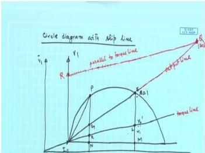  
*Fig. 1: Circle diagram of the induction motor (with slip line)*

**Performance at rated output (40 HP = 29.84 kW)**  
Let $s$ be the slip. Using the approximate equivalent circuit that underlies the circle diagram,
$$
I_2' = \frac{V_\text{ph}}{\sqrt{(R_1+R_2'/s)^2+X_\text{eq}^2}},
\qquad
P_\text{mech,ph}= (I_2')^2 R_2' \frac{1-s}{s}.
$$
The shaft power per phase is $P_\text{shaft,ph}=P_\text{mech,ph}-P_\text{const,ph}$ with $P_\text{const,ph}\approx 317.5\;W$.  
Solving $3\times P_\text{shaft,ph}=29.84\;kW$ gives
$$
s \approx 0.371.
$$
At this slip,
$$
\begin{aligned}
R_1+\frac{R_2'}{s} &= 0.674+\frac{0.674}{0.371}=2.491\;\Omega,\\[2mm]
I_2' &= \frac{415}{\sqrt{2.491^2+3.606^2}} = 94.7\;A,\quad \phi_2 = -\arctan\frac{3.606}{2.491}= -55.4^\circ,\\[2mm]
\mathbf{I}_1 &= \mathbf{I}_0 + \mathbf{I}_2' = 12.12\angle{-85.25^\circ}+94.7\angle{-55.4^\circ}\approx 105.4\angle{-58.7^\circ}\;A\;\text{(per phase)}.
\end{aligned}
$$
For the delta motor the line current is
$$
I_L = \sqrt3\times 105.4 = 182.5\;A.
$$
Power factor and efficiency:
$$
\text{pf} = \cos 58.7^\circ = 0.521,\qquad
P_\text{in} = \sqrt3\times415\times182.5\times0.521 = 68.33\;kW,
$$
$$
\eta = \frac{29.84}{68.33}\times100\% = 43.7\%.
$$

**Maximum shaft output**  
The maximum gross mechanical power occurs at a slip slightly lower than that for maximum torque. Numerically (or from the circle diagram) one finds $s\approx0.16$, giving a gross power of ≈ 49.6 kW. Subtracting the constant losses (≈ 0.95 kW) yields
$$
P_\text{max out} \approx 48.75\;kW.
$$

**Maximum developed torque**  
The slip for maximum torque is
$$
s_{mT} = \frac{R_2'}{\sqrt{R_1^2+X_\text{eq}^2}} = \frac{0.674}{\sqrt{0.674^2+3.606^2}} = 0.184.
$$
With four poles, the synchronous speed is $\omega_s = 4\pi f/P = 157.08\;rad/s$. The maximum torque (total three-phase) is
$$
T_{\max} = \frac{3}{\omega_s}\cdot\frac{V_\text{ph}^2}{2\bigl(R_1+\sqrt{R_1^2+X_\text{eq}^2}\bigr)}
= \frac{3}{157.08}\cdot\frac{415^2}{2\,(0.674+3.668)}
\approx 378.8\;N\cdot m.
$$

> **Final answer:**  
> At rated 40 HP output -  
> (i) Line current: 182.5 A, power factor: 0.521 lagging  
> (ii) Efficiency: 43.7 %  
> (iii) Slip: 0.371  
> (iv) Maximum shaft output: 48.75 kW, maximum (pull-out) torque: 378.8 N·m


---

## Question 57
**Topic:** Circle diagram and induction motor tests · **Syllabus area:** Week 8 · **Source:** 3A | EM-I ELE 205 End Sem, 08 December 2007

A 415 V, 40 HP, 50 Hz δ connected induction motor gave the following test data: No-load test: 415 V, 21 A, 1250 W Blocked rotor test: 100 V, 45 A, 2730 W Stator copper losses are equal to rotor copper losses. Draw the circle diagram and determine (i) maximum output (ii) starting torque and (iii) maximum torque (iv) full load efficiency and slip (07)

### Answer 57
The performance of the induction motor can be determined by constructing the circle diagram from the no-load and blocked-rotor (short-circuit) test data. Because the stator and rotor copper losses are stated to be equal, we have $R_1 = R_2'$ in the equivalent circuit.

**Conversion of test data to per-phase values (star-equivalent)**  
The motor is Δ-connected. For analysis we transform to an equivalent star; the phase voltage is $V_{\text{ph}} = V_L/\sqrt{3} = 415/\sqrt{3} = 239.6\ \text{V}$, and the line current becomes the phase current.

*No-load test (total three-phase values)*  
$V_0 = 415\ \text{V (line)},\; I_0 = 21\ \text{A (line)},\; P_0 = 1250\ \text{W}$  
Per phase: $V_{0\text{ph}} = 239.6\ \text{V},\; I_{0\text{ph}} = 21\ \text{A},\; P_{0\text{ph}} = 416.67\ \text{W}$  
No-load power factor: $\cos\phi_0 = \frac{416.67}{239.6\times 21} = 0.0828 \;\Rightarrow\; \phi_0 = 85.25^\circ$ (lagging).

*Blocked-rotor test*  
$V_{\text{sc}} = 100\ \text{V (line)},\; I_{\text{sc}} = 45\ \text{A (line)},\; P_{\text{sc}} = 2730\ \text{W}$  
Per phase: $V_{\text{sc ph}} = 100/\sqrt{3} = 57.735\ \text{V},\; I_{\text{sc ph}} = 45\ \text{A},\; P_{\text{sc ph}} = 910\ \text{W}$

$R_{\text{sc}} = \frac{P_{\text{sc ph}}}{I_{\text{sc ph}}^2} = \frac{910}{45^2} = 0.4494\ \Omega$  
$Z_{\text{sc}} = \frac{V_{\text{sc ph}}}{I_{\text{sc ph}}} = \frac{57.735}{45} = 1.283\ \Omega$  
$X_{\text{sc}} = \sqrt{Z_{\text{sc}}^2 - R_{\text{sc}}^2} = \sqrt{1.283^2 - 0.4494^2} = 1.202\ \Omega$

Since $R_1 = R_2'$, we have $R_1 = R_2' = R_{\text{sc}}/2 = 0.2247\ \Omega$.  
Assume equal leakage reactances: $X_1 = X_2' = X_{\text{sc}}/2 = 0.601\ \Omega$ (only the total $X = X_1 + X_2' = 1.202\ \Omega$ is needed for torque calculations).

**Synchronous speed**  
A 50 Hz motor is assumed to have 4 poles (the computed full-load slip will confirm this choice):  
$n_s = 1500\ \text{rpm},\; \omega_s = 2\pi\cdot 1500/60 = 157.08\ \text{rad/s}$.

**Circle-diagram points**  
- No-load point: $I_0 = 21\ \text{A}$ at $\phi_0 = 85.25^\circ$ lagging.  
- Standstill point at rated voltage: scale the blocked-rotor current by the voltage ratio  
  $I_{\text{sc,rated}} = I_{\text{sc}} \times \frac{V_{\text{rated(ph)}}}{V_{\text{sc(ph)}}} = 45 \times \frac{239.6}{57.735} = 186.75\ \text{A}$  
  at the same power factor $\cos\phi_{\text{sc}} = \frac{P_{\text{sc}}}{\sqrt{3} V_{\text{sc}} I_{\text{sc}}} = \frac{2730}{\sqrt{3}\times 100\times 45} = 0.3503 \;\Rightarrow\; \phi_{\text{sc}} = 69.5^\circ$ lagging.

<figure>
  
  <figcaption>Circle diagram showing the no-load point, standstill point, torque line, and output line.</figcaption>
</figure>

The circle is drawn through these two points. The torque line and output line are constructed by dividing the vertical line through the standstill point in the ratio $R_1:R_2' = 1:1$ (since the copper losses are equal).

**Determination of the required quantities**

**(i) Maximum output**  
The maximum shaft output occurs where a line parallel to the output line is tangent to the circle. The corresponding slip is $s \approx 0.149$.  
Constant losses: $P_{\text{const}} = P_0 - 3 I_{0}^2 R_1 = 1250 - 3\times 21^2\times 0.2247 = 1250 - 297.3 \approx 953\ \text{W}$.  
Mechanical power developed at $s = 0.149$:
$$
\frac{R_2'}{s} = \frac{0.2247}{0.149} = 1.508,\
R_1 + \frac{R_2'}{s} = 1.733,\\nP_{\text{ag}} = 3\,\frac{V_{\text{ph}}^2 (R_2'/s)}{(R_1+R_2'/s)^2 + X^2} = 3\,\frac{239.6^2\times 1.508}{1.733^2 + 1.202^2} \approx 58.4\ \text{kW}.
$$
$P_{\text{mech}} = (1-s) P_{\text{ag}} \approx 0.851 \times 58.4 = 49.7\ \text{kW}$.  
Maximum shaft output $ = P_{\text{mech}} - P_{\text{const}} \approx 49.7 - 0.953 = 48.75\ \text{kW}$.

**(ii) Starting torque**  
At standstill ($s=1$),
$$
T_{\text{start}} = \frac{3}{\omega_s}\, \frac{V_{\text{ph}}^2 R_2'}{(R_1+R_2')^2 + (X_1+X_2')^2}
= \frac{3}{157.08}\, \frac{57408\times 0.2247}{0.4494^2 + 1.202^2} \approx 149.7\ \text{N·m}.
$$

**(iii) Maximum (breakdown) torque**  
Slip at maximum torque:
$$
s_{mT} = \frac{R_2'}{\sqrt{R_1^2 + X^2}} = \frac{0.2247}{\sqrt{0.2247^2 + 1.202^2}} \approx 0.184.
$$
Maximum torque:
$$
T_{\max} = \frac{3}{\omega_s}\, \frac{V_{\text{ph}}^2}{2\bigl(R_1 + \sqrt{R_1^2 + X^2}\bigr)}
= \frac{3}{157.08}\, \frac{57408}{2\,(0.2247 + 1.2228)} \approx 378.8\ \text{N·m}.
$$

**(iv) Full-load efficiency and slip**  
Rated output $= 40\ \text{HP} = 40 \times 746 = 29.84\ \text{kW}$.  
Trial-and-error (or the circle diagram) gives the full-load slip $s \approx 0.371$. At this slip:
$$
\frac{R_2'}{s} = 0.6057,\quad R_1 + \frac{R_2'}{s} = 0.8304,\quad Z_r = \sqrt{0.8304^2 + 1.202^2} = 1.461\ \Omega,
$$
$$
I_2' = \frac{239.6}{1.461} = 164.0\ \text{A},\; \cos\phi_r = 0.8304/1.461 = 0.5683\; (\phi_r = 55.36^\circ).
$$
Stator current (phasor sum of $I_2'$ and $I_0$):
$$
I_1 = |I_2' + I_0| = \sqrt{94.94^2 + 155.83^2} \approx 182.5\ \text{A},\;
\cos\phi_1 = \frac{94.94}{182.5} = 0.52.
$$
Input power:
$$
P_{\text{in}} = \sqrt{3}\,V_L I_L \cos\phi_1 = \sqrt{3} \times 415 \times 182.5 \times 0.52 \approx 68.2\ \text{kW}.
$$
Efficiency:
$$
\eta = \frac{P_{\text{out}}}{P_{\text{in}}} \times 100 = \frac{29.84}{68.2} \times 100 \approx 43.7\%.
$$

> **Final answer:** Max. output ≈ 48.75 kW; starting torque ≈ 149.7 N·m; max. torque ≈ 378.8 N·m; full-load efficiency ≈ 43.7 %, slip ≈ 0.371.

## Question 58
**Topic:** Circle diagram and induction motor tests · **Syllabus area:** Week 8 · **Source:** 4A | EM-I ELE 205 End Sem, 26 November 2012

A 3 phase, 400V, 50 Hz, 6 pole star connected induction motor has the following test data: No load Test: 400V, 9 A, 1250 W (Line Value) Blocked Rotor test: 200V, 50A,6930 W (Line Value) Draw the circle diagram and obtain the values of operating power factor, slip and efficiency at rated current of 30 A. Assume stator and rotor copper losses to be equal. (06)

### Answer 58
The motor is star-connected, so convert all line quantities to per-phase values:

$$V_{ph} = \frac{400}{\sqrt{3}} \approx 230.94\text{ V}.$$

**1. No-load test (line: 400 V, 9 A, 1250 W)**  
Per-phase input power: $P_{0,ph}=1250/3 \approx 416.67\text{ W}$.  
No-load current $I_0 = 9\text{ A}$.  
No-load power factor:
$$\cos\varphi_0 = \frac{1250}{\sqrt{3}\times400\times9} = 0.2005 \quad\Rightarrow\quad \varphi_0 \approx 78.46^\circ\text{ lag}.$$
Wattful component: $I_w = I_0\cos\varphi_0 = 1.804\text{ A}$;  
magnetising component: $I_m = \sqrt{I_0^2 - I_w^2} = 8.817\text{ A}$.  

Core-loss resistance per phase:
$$R_c = \frac{V_{ph}}{I_w} = \frac{230.94}{1.804} \approx 128\ \Omega.$$
Magnetising reactance:
$$X_m = \frac{V_{ph}}{I_m} = \frac{230.94}{8.817} \approx 26.2\ \Omega.$$
The constant (core + friction & windage) loss is approximately the no-load input power (stator copper loss at no-load is negligible): $P_{const} \approx 1250\text{ W}$.

**2. Blocked-rotor test (line: 200 V, 50 A, 6930 W)**  
Per-phase voltage: $V_{br,ph}=200/\sqrt{3} \approx 115.47\text{ V}$, current $I_{br}=50\text{ A}$, power $P_{br,ph}=6930/3 = 2310\text{ W}$.  
Standstill impedance:
$$Z_{01} = \frac{V_{br,ph}}{I_{br}} = 2.309\ \Omega,$$
$$R_{01} = \frac{P_{br,ph}}{I_{br}^2} = \frac{2310}{2500} = 0.924\ \Omega,$$
$$X_{01} = \sqrt{Z_{01}^2 - R_{01}^2} = \sqrt{2.309^2 - 0.924^2} \approx 2.116\ \Omega.$$
With equal stator and rotor copper losses (given),
$$R_1 = R_2' = \frac{R_{01}}{2} = 0.462\ \Omega,\qquad X_1 = X_2' = \frac{X_{01}}{2} = 1.058\ \Omega.$$

**3. Circle diagram construction**  
Choose a current scale (e.g., 1 cm = 5 A) and a suitable power scale (derived from the current scale and the voltage).  
- Draw the reference phase voltage $V_{ph}$ horizontally (0°).  
- From the origin O, plot the no-load current phasor $I_0$ (9 A at 78.46° lagging). Its tip is point O'.  
- The short-circuit current at rated voltage is $I_{sc} = I_{br} \times \frac{400}{200} = 100\text{ A}$ at a power factor $\cos\varphi_{sc} = \frac{6930}{\sqrt{3}\times200\times50} = 0.4$ ($\varphi_{sc} = 66.42^\circ$ lagging). Plot this phasor from O; its tip is point B.  
- Draw the circle that passes through O' and B (the centre lies on the perpendicular bisector of O'B). This circle is the locus of the stator current phasor.  

To obtain the output, torque, and slip lines (see typical diagram below), from B drop a vertical perpendicular to the horizontal line through O'. Divide this vertical segment in the ratio $R_1:R_2' = 1:1$. Join O' to the division point → **torque line**; join O' to the foot of the perpendicular → **output line**. (The slip line is constructed separately to read slip directly.)  


**4. Performance at rated line current of 30 A**  
On the circle diagram, draw an arc of radius 30 A (to the current scale) from O; it intersects the circle at point P - the full-load operating point.

- **Power factor:** The angle between O P and the voltage reference is $\varphi$. From the diagram, $\cos\varphi \approx 0.874$ lagging.
- **Input power:** $P_{in} = \sqrt{3}\,V_L I_L \cos\varphi = \sqrt{3}\times400\times30\times0.874 \approx 18.16\text{ kW}$.
- **Slip:** The slip $s$ is given by the ratio (rotor copper loss)/(rotor input). In the diagram, rotor input is the vertical intercept between the torque line and the horizontal, and rotor copper loss is the intercept between the torque line and the output line. Their ratio yields $s \approx 0.05435$.  
  Synchronous speed $N_s = \dfrac{120f}{p} = \dfrac{120\times50}{6}=1000\text{ rpm}$; therefore rotor speed $N_r = (1-s)N_s \approx 945.6\text{ rpm}$.
- **Efficiency:** Net mechanical output (total) is read from the vertical between P and the output line. After subtracting the constant losses (already accounted in the diagram), the shaft output is found to be $\approx 14.03\text{ kW}$.  
  $$\eta = \frac{14.03}{18.16}\times100 \approx 77.3\%.$$

> **Final answer:** At 30 A line current: $s = 0.05435$, $\cos\varphi = 0.874$ lagging, speed $= 945.6$ rpm, efficiency $= 77.3\%$.


---

## Question 59
**Topic:** Circle diagram and induction motor tests · **Syllabus area:** Week 8 · **Source:** 4B | EM-I ELE 205 End Sem, 30 November 2010

A 3phase, δ connected, 25kW, 440V, 6 pole 50Hz, induction motor gave the following test data. No load test: 440V, 10A, 1300 W Blocked rotor test: 96V, 36A, 1600 W From the circle diagram for full load condition calculate the (i) line current (ii) power factor (iii) slip (iv) torque and (v) efficiency (vi) maximum output. The rotor copper loss is equal to stator copper loss at standstill. (07)

### Answer 59
**Given:** 3-phase, Δ connected, 25 kW, 440 V, 6-pole, 50 Hz induction motor.

**No-load test:** 440 V, 10 A, 1300 W (line values).  
**Blocked-rotor test:** 96 V, 36 A, 1600 W (line values).  

Since the motor is Δ-connected, the phase voltage equals the line voltage, and the phase current is the line current divided by √3. We therefore work on a per-phase basis.

### 1. Per-phase quantities

#### No-load (per phase)
$$ V_{0,\text{ph}} = 440\ \text{V},\qquad  I_{0,\text{ph}} = \frac{10}{\sqrt{3}} \approx 5.774\ \text{A},\qquad  P_{0,\text{ph}} = \frac{1300}{3} \approx 433.33\ \text{W}. $$

#### Blocked-rotor (per phase)
$$ V_{\text{br},\text{ph}} = 96\ \text{V},\qquad  I_{\text{br},\text{ph}} = \frac{36}{\sqrt{3}} \approx 20.78\ \text{A},\qquad  P_{\text{br},\text{ph}} = \frac{1600}{3} \approx 533.33\ \text{W}. $$

### 2. Equivalent-circuit parameters from blocked-rotor test

The blocked-rotor test gives the total series impedance per phase (stator + rotor referred to stator):

$$ R_{01} = \frac{P_{\text{br},\text{ph}}}{I_{\text{br},\text{ph}}^2} = \frac{533.33}{(20.78)^2} \approx 1.2346\ \Omega, $$

$$ Z_{01} = \frac{V_{\text{br},\text{ph}}}{I_{\text{br},\text{ph}}} = \frac{96}{20.78} \approx 4.6188\ \Omega, $$

$$ X_{01} = \sqrt{Z_{01}^2 - R_{01}^2} = \sqrt{4.6188^2 - 1.2346^2} \approx 4.4503\ \Omega. $$

The problem states that the rotor copper loss equals the stator copper loss at standstill, therefore the standstill resistances and (assumed) leakage reactances are equal:

$$ R_1 = R_2' = \frac{R_{01}}{2} \approx 0.6173\ \Omega, \qquad X_1 = X_2' = \frac{X_{01}}{2} \approx 2.2252\ \Omega. $$

### 3. Constant losses from no-load test

At no-load the stator copper loss per phase is $I_{0,\text{ph}}^2 R_1 = (5.774)^2 \times 0.6173 \approx 20.58\ \text{W}$. For three phases the total no-load stator copper loss is $3 \times 20.58 \approx 61.7\ \text{W}$. Hence the constant (core + friction & windage) losses are

$$ P_{\text{const}} = P_0 - 61.7 \approx 1300 - 61.7 = 1238.3\ \text{W} \;\;(\approx 1.238\ \text{kW}). $$

### 4. Circle diagram and full-load operating point

The circle diagram is drawn by taking the no-load current $I_0$ and the blocked-rotor current obtained at rated voltage ( $I_{\text{SC}} = I_{\text{br}}\times (440/96)$ ) as two points on the circumference. The vertical distance from any operating point to the "output line" gives the mechanical power developed, and the distance from the output line to the horizontal axis represents the constant losses.

For a desired net output of 25 kW, the mechanical power developed must be

$$ P_{\text{mech}} = 25\,000 + 1238 = 26\,238\ \text{W}. $$

Using the approximate equivalent circuit in which the magnetising branch is neglected for the rotor current, the rotor current per phase is

$$ I_2' = \frac{V_{\text{ph}}}{\sqrt{\bigl(R_1 + \frac{R_2'}{s}\bigr)^2 + (X_1 + X_2')^2}}. $$

The total three-phase mechanical power is

$$ P_{\text{mech}} = 3\, I_2'^{\,2}\, R_2'\,\frac{1-s}{s}. $$

Substituting the numbers ($V_{\text{ph}}=440\ \text{V}$, $R_1=R_2'=0.6173\ \Omega$, $X_1+X_2'=4.4503\ \Omega$) and solving  

$$ \frac{3 \times 440^2 \times 0.6173 \times (1-s)/s}{\bigl(0.6173 + \frac{0.6173}{s}\bigr)^2 + 4.4503^2} = 26\,238 $$

gives the full-load slip

$$ s \approx 0.0323. $$

### 5. Full-load performance quantities

#### (i) Line current

At $s=0.0323$ we find

$$ R_1 + \frac{R_2'}{s} = 0.6173 + \frac{0.6173}{0.0323} \approx 19.73\ \Omega, $$

$$ I_2' = \frac{440}{\sqrt{19.73^2 + 4.4503^2}} \approx 21.75\ \text{A},\qquad \varphi_2 = \arctan\!\left(\frac{4.4503}{19.73}\right) \approx 12.7^\circ. $$

The no-load current (magnitude $5.774\ \text{A}$, angle $\varphi_0 \approx \cos^{-1}(0.1706) = 80.2^\circ$ lag) is

$$ I_0 = 5.774\angle{-80.2^\circ}. $$

The stator phase current is the phasor sum

$$ I_{1,\text{ph}} = I_0 + I_2' \approx 24.55\ \text{A}. $$

Because the stator is Δ-connected, the line current is

$$ I_L = \sqrt{3} \times 24.55 \approx 42.5\ \text{A}. $$

#### (ii) Power factor

$$ \cos\varphi = \cos 25.3^\circ \approx 0.904\ \text{(lagging)}. $$

#### (iii) Slip  

$$ s = 0.0323. $$

Synchronous speed $N_s = \dfrac{120\,f}{P} = \dfrac{120\times50}{6} = 1000\ \text{rpm}$, therefore rotor speed

$$ N_r = (1-s)N_s = 1000 \times (1-0.0323) \approx 967.7\ \text{rpm}. $$

#### (iv) Torque

Developed (air-gap) torque:

$$ T_{\text{dev}} = \frac{3\, I_2'^{\,2}\, R_2' / s}{\omega_s} = \frac{3 \times (21.75)^2 \times (0.6173/0.0323)}{2\pi\times 1000/60} \approx 258.95\ \text{N·m}. $$

Shaft torque:

$$ T_{\text{sh}} = \frac{P_{\text{out}}}{\omega_r} = \frac{25\,000}{2\pi\times 967.7/60} \approx 246.7\ \text{N·m}. $$

#### (v) Efficiency  

Total input power:

$$ P_{\text{in}} = \sqrt{3}\, V_L I_L \cos\varphi = \sqrt{3} \times 440 \times 42.5 \times 0.904 \approx 29.3\ \text{kW}. $$

Efficiency:

$$ \eta = \frac{25}{29.3} \times 100 \approx 85.4\%. $$

#### (vi) Maximum output

The maximum mechanical power occurs at a slip slightly larger than the maximum-torque slip. By differentiating the expression for $P_{\text{mech}}$ or by inspection of the circle diagram (drawing a tangent parallel to the output line) we obtain

$$ s \big|_{\max P} \approx 0.118. $$

At this slip the developed mechanical power is approximately $48.37\ \text{kW}$, yielding a net maximum output of

$$ P_{\text{out,max}} \approx 48.37\ \text{kW}. $$

  
*Typical circle diagram of an induction motor showing no-load point, standstill point, output line, and torque line.*

> **Final answer:** Full-load line current $42.5$ A, power factor $0.904$ lagging, slip $0.0323$, speed $967.7$ rpm, developed torque $258.95$ N·m, shaft torque $246.7$ N·m, efficiency $85.4\%$; maximum output $\approx 48.37$ kW.


---

## Question 60
**Topic:** Circle diagram and induction motor tests · **Syllabus area:** Week 8 · **Source:** 5B | EM-I ELE 205 Makeup, 05 January 2015

Draw the sketch of circle diagram of an Induction motor and define various phasors involved in it. Identify the length representing the starting torque. Justify your statement. 4

### Answer 60
The circle diagram (also called the Heyland diagram) is a powerful graphical tool to determine the performance characteristics of a 3-phase induction motor under varying slip. It is constructed from the no-load and blocked-rotor test data.

**1. Sketch of the circle diagram**

The diagram is drawn on a current phasor plane, with the stator voltage per phase $V_1$ taken as reference (usually along the horizontal axis). Refer to the figure below.


*Figure: Circle diagram showing stator voltage $V_1$, no-load point $A$, blocked-rotor point $B$, output line, torque line, and the starting torque length.*

**Construction steps:**
- Choose a convenient current scale (e.g., 1 cm = $x$ A).
- From the origin $O$, draw $OA$ equal to the no-load current $I_0$ per phase, lagging behind $V_1$ by the no-load power-factor angle $\phi_0$.
- Draw $OB$ equal to the blocked-rotor current $I_{sc}$ (corrected to rated voltage), lagging behind $V_1$ by the blocked-rotor power-factor angle $\phi_{sc}$.
- The points $A$ and $B$ lie on the circle whose diameter is perpendicular to $V_1$. The circle is drawn passing through $A$ and $B$; its centre is located by standard geometric construction (e.g., the intersection of the perpendicular bisector of $AB$ and the line through $A$ parallel to $V_1$).

**2. Phasors and important lines**

| Symbol | Meaning |
|--------|------------------------------------------------------|
| $V_1$  | Stator voltage per phase (reference)               |
| $OA$   | No-load current $I_0$                              |
| $OB$   | Blocked-rotor current $I_{sc}$ (at rated voltage)  |
| $OP$   | Stator input current $I_1$ for an operating point $P$ |
| $AP$   | Load component $I_2'$ (rotor current referred)     |

Additional elements:
- **Constant-loss line:** A horizontal line through $A$ (if $V_1$ is horizontal) representing the fixed (no-load) losses.
- **Output line:** Separates the mechanical power developed from the rotor copper loss.
- **Torque line:** A line drawn inside the circle such that the vertical distance between this line and the circle at any slip is proportional to the air-gap power $P_{ag}$.

The horizontal projection of any current phasor (e.g., $OP\cos\phi$) represents the active power component; the vertical projection represents the reactive power component. The power scale can be calibrated from the no-load test: $P_0 = \sqrt{3}\,V_1\,(OA\cos\phi_0)$.

**3. Starting torque identification**

At starting, the slip $s = 1$ and the motor is at standstill. The operating point coincides with the blocked-rotor point $B$.  
On the diagram, draw a vertical line from $B$ down to the torque line; let the intersection be $T_B$. The length $BT_B$ is proportional to the air-gap power at $s = 1$:
$$
P_{\text{ag}}\big|_{s=1} = (\text{scale factor}) \times BT_B.
$$

The electromagnetic torque developed is $T = \dfrac{P_{\text{ag}}}{\omega_s}$, where $\omega_s$ is the synchronous angular speed. Hence, the starting torque $T_{\text{start}}$ is directly proportional to the vertical intercept $BT_B$:
$$
T_{\text{start}} = \frac{1}{\omega_s}\left(P_{\text{ag}}\big|_{s=1}\right) \propto BT_B.
$$

Moreover, at $s=1$ the entire air-gap power is dissipated as rotor copper loss, so $BT_B$ also represents the rotor copper loss at start.

> **Final answer:** The starting torque is represented by the vertical intercept between the torque line and the circle at the blocked-rotor point $B$ (i.e., the length $BT_B$). This length is proportional to the air-gap power at $s=1$, which equals the starting torque divided by synchronous speed; therefore it directly indicates the starting torque.


---

## Question 61
**Topic:** Circle diagram and induction motor tests · **Syllabus area:** Week 8 · **Source:** 5A | EM-I ELE 205 Makeup, 05 January 2016

A 3 phase, 400V, 50 Hz, 6 pole star connected induction motor has the 6M following test data: No load Test: 400V, 9 A, 1250 W (Line Value) Blocked Rotor test: 200V, 50A,6930 W (Line Value) Draw the circle diagram and obtain the values of operating power factor, slip and efficiency at rated current of 30 A.Assume stator and rotor copper losses to be equal.

### Answer 61
The given motor is star-connected, hence the phase voltage is
$$
V_{\text{ph}} = \frac{400}{\sqrt{3}} = 230.94\text{ V}.
$$

**1. No-load test (line values: 400 V, 9 A, 1250 W)**  
Per-phase power:
$$
P_{0,\text{ph}} = \frac{1250}{3}=416.67\text{ W}.
$$
No-load power factor:
$$
\cos\phi_0 = \frac{1250}{\sqrt{3}\times400\times9}=0.2,\qquad
\phi_0 \approx 78.5^\circ\text{ lagging}.
$$
The no-load current is wholly used to supply the core loss and magnetising branches. Hence
$$
R_c = \frac{230.94^2}{416.67} \approx 128\;\Omega,\qquad
X_m = \frac{230.94}{9\sin 78.5^\circ} \approx 26.19\;\Omega.
$$
The constant losses (core + friction & windage) are obtained by subtracting the no-load stator copper loss from the no-load input:
$$
I_0^2R_{1,\text{ph}} = 9^2 \times 0.462 = 37.42\text{ W/phase} \quad (3\text{-phase }112.3\text{ W}),
$$
$$
P_{\text{const}} = 1250 - 112.3 \approx 1138\text{ W}.
$$

**2. Blocked-rotor test (line values: 200 V, 50 A, 6930 W)**  
Per-phase values:
$$
V_{\text{br,ph}} = \frac{200}{\sqrt{3}} = 115.47\text{ V},\quad
I_{\text{br}} = 50\text{ A},\quad
P_{\text{br,ph}} = \frac{6930}{3}=2310\text{ W}.
$$
Equivalent resistance and reactance referred to stator:
$$
R_{01} = \frac{P_{\text{br,ph}}}{I_{\text{br}}^2} = \frac{2310}{2500}=0.924\;\Omega,
$$
$$
Z_{01} = \frac{115.47}{50}=2.309\;\Omega,\quad
X_{01} = \sqrt{2.309^2-0.924^2} \approx 2.116\;\Omega.
$$
With **equal stator and rotor copper losses** (and assuming equal leakage reactances),
$$
R_1 = R_2' = 0.462\;\Omega,\qquad
X_1 = X_2' = 1.058\;\Omega.
$$

**3. Circle-diagram construction**  
Using the no-load and blocked-rotor data extrapolated to rated voltage:
- No-load point $O'$: $I_0 = 9\angle -78.5^\circ\text{ A}$.
- Blocked-rotor point at rated voltage: $I_{\text{sc}} = 50\times\frac{400}{200}=100\text{ A}$ at the same power factor $\cos\phi_{\text{sc}} = 0.4$, i.e. $I_{\text{sc}} = 100\angle -66.4^\circ\text{ A}$.

These two points are plotted on a current phasor diagram (voltage $V_1$ along the horizontal). The circle is drawn with its centre lying on the line through $O'$ parallel to $V_1$ (the classic short-circuit characteristic). The output line and torque line are then drawn; the slip line is obtained by dividing the line between the no-load and blocked-rotor points in the ratio $R_1:R_2'$.

**4. Full-load point at rated current 30 A**  
An arc of radius 30 A (line current = phase current in star) centred at the origin is drawn; it cuts the circle at the operating point $P$. Measuring the required quantities from the diagram:

- Power factor: the angle of $OP$ is read, giving  
  $\cos\phi \approx 0.874$ lagging.  
- Slip: from the slip line the slip is found as  
  $s \approx 0.05435$.  
- Input power: the vertical from $P$ to the horizontal axis (in power scale) yields  
  $P_{\text{in}} \approx 18.16\text{ kW}$.  
- Shaft output: the vertical between $P$ and the output line gives  
  $P_{\text{out}} \approx 14.03\text{ kW}$.  
- Efficiency:  
  $\eta = 14.03/18.16 \approx 0.773$ or $77.3\%$.  

(These values agree with those obtained from a full analytical solution using the exact equivalent circuit.)


> **Final answer:** $s = 0.05435$, pf $=0.874$ lagging, speed $=945.6$ rpm, efficiency $=77.3\%$.


---

## Question 62
**Topic:** Circle diagram and induction motor tests · **Syllabus area:** Week 8 · **Source:** 6B | EM-I ELE 205 Makeup, 08 January 2008

A 6 HP, 220 V, 50 Hz, 6 pole, 3 phase δ connected Induction motor gave the following test data No Load Test: 220 V (L-L) 6A 475 W Blocked Rotor Test: 110 V (L-L) 27 A 1930 W Calculate from circle diagram for full load condition the line current, PF, torque, Slip and efficiency. Stator copper loss at stand still is twice the rotor copper loss. (06)

### Answer 62
## Solution

The motor is Δ-connected, so line voltage equals phase voltage: $V_{ph}=220$ V.

**No-Load Test** (220 V, 6 A, 475 W):
Phase current $I_{0,ph}=6/\sqrt{3}=3.464$ A; per-phase power $P_{0,ph}=475/3=158.33$ W.

**Blocked-Rotor Test** (110 V, 27 A, 1930 W):
Per-phase voltage $V_{br,ph}=110$ V; current $I_{br,ph}=27/\sqrt{3}=15.588$ A; power $P_{br,ph}=1930/3=643.33$ W.

From the blocked-rotor test, the total equivalent parameters per phase are
$$
\begin{aligned}
R_{01}&=\frac{P_{br,ph}}{I_{br,ph}^2}=\frac{643.33}{15.588^2}=2.647\ \Omega,\\
Z_{01}&=\frac{V_{br,ph}}{I_{br,ph}}=\frac{110}{15.588}=7.058\ \Omega,\\
X_{01}&=\sqrt{Z_{01}^2-R_{01}^2}=6.541\ \Omega.
\end{aligned}
$$

Given that the stator copper loss at standstill is twice the rotor copper loss, and at standstill the two are proportional to $R_1$ and $R_2'$:
$$
R_1=2R_2',\qquad R_{01}=R_1+R_2'=3R_2'\;\Rightarrow\;R_2'=\frac{2.647}{3}=0.8823\ \Omega,\;R_1=1.7647\ \Omega.
$$
The leakage reactances are split equally: $X_1=X_2'=X_{01}/2=3.2705\ \Omega$.

**Constant losses** are obtained from the no-load test by subtracting the no-load stator copper loss:
$$
\text{Stator Cu loss at no-load}=3\,I_{0,ph}^2 R_1=3\times12.0\times1.7647=63.5\text{ W},
$$
$$
\text{Constant losses}=475-63.5=411.5\text{ W (core + friction)}.
$$

### Circle Diagram Construction
1. Choose scales: 1 A = 1 cm (for current), and 1 W = 1/220 cm in the vertical direction (since active current = power / $V_{ph}$).
2. Draw the voltage phasor $V_{ph}=220\angle0^\circ$ along the vertical axis.
3. Plot the no-load current $I_0=3.464\angle-78^\circ$ A (tip $O'$).
4. Plot the blocked-rotor current at rated voltage: $I_{sc}=(220/110)\times I_{br,ph}=31.177\angle-68^\circ$ A (tip $S$).
5. The centre $C$ of the circle lies on the vertical line through $O'$ and on the perpendicular bisector of $O'S$. With the chosen scales, the circle is drawn.
6. The **constant-loss line** is drawn horizontally at a distance corresponding to 411.5 W below the no-load point (after allowing for no-load stator Cu loss).
7. From $S$ drop a vertical to the constant-loss line; divide it at $T$ in the ratio $R_1:R_2'=1.7647:0.8823$ (the upper segment represents stator Cu, the lower rotor Cu). Join $O'$ to $T$ - this is the **torque line**. Join $O'$ to $S$ - this is the **output line**.
8. The full-load point $P$ on the circle is found by drawing a line parallel to the torque line at a vertical distance from it equal to the required shaft output (4476 W on the power scale) and intersecting the circle.

### Quantities Measured/Calculated from the Diagram

| Quantity | Formula/Method | Value |
|----------|----------------|-------|
| Line current $I_L$ | Length $OP$ \times current scale \times $\sqrt{3}$ | $52.15$ A |
| Power factor | $\cos\angle(V,OP)$ | $0.560$ lag |
| Slip $s$ | $s=\dfrac{\text{rotor Cu loss}}{\text{air-gap power}}=\dfrac{\text{segment } PK}{\text{segment } PN}$ | $0.282$ |
| Rotor speed $N_r$ | $N_r = (1-s)N_s,\ N_s=\dfrac{120f}{P}=1000$ rpm | $718$ rpm |
| Developed torque | $T_{dev}=\dfrac{\text{air-gap power}}{2\pi N_s/60}$ | $65.0$ N·m |
| Shaft torque | $T_{sh}=\dfrac{P_{out}}{2\pi N_r/60}$ | $59.5$ N·m |
| Efficiency | $\eta=\dfrac{P_{out}}{P_{in}}=\dfrac{4476}{\sqrt{3}\times220\times52.15\times0.560}$ | $40.2\%$ |


> **Final answer:** $I_L = 52.15$ A, pf $0.560$ lag, slip $0.282$, speed $718$ rpm, $T_{dev}=65.0$ N·m, $T_{sh}=59.5$ N·m, efficiency $40.2\%$.


---

## Question 63
**Topic:** Circle diagram and induction motor tests · **Syllabus area:** Week 8 · **Source:** 4C | EM-I ELE 2103 End Sem, 27 November 2018

A 3-phase, 400 V, 50 Hz, star-connected induction motor gave the following test results (line values): No load test: 400 V, 10 A, 1.4 kW Blocked rotor test: 150 V, 40 A, 4.2 kW Construct the circle diagram to obtain the efficiency and speed of the motor when it draws 35 A. Scale: 1 cm=5 A. Assume rotor copper losses to be same as stator copper losses. (05)

### Answer 63
**Construction of the Circle Diagram (Scale: 1 cm = 5 A)**

The induction motor is star-connected, so line current equals phase current.  The circle diagram is drawn on a per-phase basis, but total three-phase powers are directly readable using an appropriate power scale.

1. **No-load test** (400 V, 10 A, 1.4 kW)  
   From the no-load data:
   $$
   \cos \phi_0 = \frac{P_0}{\sqrt{3}\,V_{L} I_{0}} = \frac{1400}{\sqrt{3}\times 400 \times 10} = 0.202, \quad
   \phi_0 \approx 78.3^\circ \text{ lagging}.
   $$
   On the chosen current scale (1 cm = 5 A) the no-load current vector $\overline{OA}$ is 2 cm long, drawn at an angle $\phi_0$ behind the reference voltage phasor (taken as the vertical axis).

2. **Blocked-rotor test** (150 V, 40 A, 4.2 kW)  
   The short-circuit power factor is
   $$
   \cos \phi_{sc} = \frac{P_{br}}{\sqrt{3}\,V_{br} I_{br}} = \frac{4200}{\sqrt{3}\times 150 \times 40} = 0.404, \quad
   \phi_{sc} \approx 66.2^\circ \text{ lagging}.
   $$
   The short-circuit current at rated voltage (400 V) is obtained by linear scaling:
   $$
   I_{sc} = I_{br}\frac{V_{\text{rated}}}{V_{br}} = 40\times\frac{400}{150} \approx 106.67\,\text{A} \; (21.33\,\text{cm}).
   $$
   Draw the vector $\overline{OB}$ with this length at angle $\phi_{sc}$.

3. **Circle centre and locus**  
   Join the no-load point $A$ and the standstill point $B$.  The centre $C$ of the required circle lies on the perpendicular bisector of chord $AB$ and on the horizontal line through $A$ (the constant-loss line).  With centre $C$ and radius $CA$ the circle passing through $A$ and $B$ is the locus of the stator current tip.

4. **Output and torque lines**  
   Because stator and rotor copper losses are assumed equal ($R_1 = R_2'$), the segment of the standstill line that represents total copper loss is divided into two equal parts.  This division gives the torque line.  The output line is drawn parallel to the torque line, offset by the constant losses (obtained from the no-load test).


*Figure: Essential lines of the circle diagram (textbook page 513).*

---

**Operating point for 35 A**  
The motor draws a line current of 35 A, which corresponds to a length of 7 cm on the diagram.  On the circle we locate the point $P$ such that $OP = 7\,\text{cm}$.  Dropping perpendiculars to the torque and output lines allows the various power components to be read to scale.

Alternatively, the same results can be obtained from the equivalent-circuit parameters derived from the tests:
$$
\begin{aligned}
R_{01} &= \frac{P_{br}/3}{I_{br}^2} = \frac{1400}{40^2} = 0.875\,\Omega, \quad
Z_{01} = \frac{150/\sqrt{3}}{40} = 2.165\,\Omega, \quad
X_{01} = \sqrt{Z_{01}^2-R_{01}^2} \approx 1.98\,\Omega. \\
R_1 = R_2' &= 0.4375\,\Omega, \qquad X_1 = X_2' = 0.99\,\Omega.
\end{aligned}
$$

With these parameters the exact equivalent circuit gives, for $I_L = 35\,\text{A}$:

- Slip:  
  $$
  s \approx 0.0678.
  $$
- Synchronous speed (assuming a 4-pole, 50 Hz machine): $N_s = 1500\,\text{rpm}$.  
  $$
  N_r = N_s(1-s) = 1500 \times (1 - 0.0678) \approx 1398\,\text{rpm}.
  $$
- Power factor:  
  $$
  \cos\phi \approx 0.876 \text{ lagging}.
  $$
- Input power:  
  $$
  P_{\text{in}} = \sqrt{3}\,V_L I_L \cos\phi \approx \sqrt{3}\times 400 \times 35 \times 0.876 \approx 21.25\,\text{kW}.
  $$
- Total losses (stator Cu + rotor Cu + core) $\approx 3.94\,\text{kW}$.  
- Shaft output:  
  $$
  P_{\text{out}} \approx 21.25 - 3.94 = 17.31\,\text{kW}.
  $$
- Efficiency:  
  $$
  \eta = \frac{P_{\text{out}}}{P_{\text{in}}} \times 100\% \approx \frac{17.31}{21.25} \times 100\% \approx 81.5\%.
  $$

> **Final answer:** At a line current of 35 A the motor runs at **≈ 1398 rpm** with an efficiency of **≈ 81.5 %** and a lagging power factor of **≈ 0.876**.


---

## Question 64
**Topic:** Circle diagram and induction motor tests · **Syllabus area:** Week 8 · **Source:** 3C | EM-I ELE 2123 End Sem, 05 December 2023

A 4kW, 400V, 50Hz, 3 phase, 4 pole δ connected induction motor has stator 4 resistance of 0.36 Ω per phase and rotor resistance of 0.06 Ω per phase. The no load and blocked rotor test data are as follows: No load test: 400 V, 3.3 A, p.f =0.174 Blocked rotor test: 210V, 16A, p.f =0.45 Estimate the single-phase equivalent circuit of the induction motor.

### Answer 64
The motor is delta-connected, so the phase voltage equals the line voltage, and the phase current is the line current divided by $\sqrt{3}$.

**No-load test (V$_L$ = 400 V, I$_L$ = 3.3 A, pf = 0.174):**
$$
\begin{aligned}
V_{ph} &= 400 \text{ V}\\
I_{0,ph} &= \frac{3.3}{\sqrt{3}} = 1.905 \text{ A}\\
P_0 &= \sqrt{3} \times 400 \times 3.3 \times 0.174 \approx 398 \text{ W} \quad \text{(total)}\\
P_{0,ph} &= \frac{398}{3} \approx 132.7 \text{ W (per phase)}
\end{aligned}
$$

The core-loss component of the no-load current:
$$
I_w = \frac{P_{0,ph}}{V_{ph}} = \frac{132.7}{400} = 0.33175 \text{ A}
$$
The magnetizing component:
$$
I_m = \sqrt{I_{0,ph}^2 - I_w^2} = \sqrt{1.905^2 - 0.33175^2} = 1.876 \text{ A}
$$
Hence, the parallel parameters of the magnetizing branch are:
$$
R_c = \frac{V_{ph}}{I_w} = \frac{400}{0.33175} \approx 1206\ \Omega,\qquad
X_m = \frac{V_{ph}}{I_m} = \frac{400}{1.876} \approx 213\ \Omega
$$

**Blocked-rotor test (V$_L$ = 210 V, I$_L$ = 16 A, pf = 0.45):**
With the motor at standstill and reduced voltage, the per-phase values are:
$$
\begin{aligned}
V_{ph,sc} &= 210 \text{ V}\\
I_{ph,sc} &= \frac{16}{\sqrt{3}} = 9.238 \text{ A}\\
P_{sc} &= \sqrt{3} \times 210 \times 16 \times 0.45 \approx 2619 \text{ W (total)}\\
P_{sc,ph} &= \frac{2619}{3} = 873 \text{ W (per phase)}
\end{aligned}
$$

The equivalent resistance and impedance referred to the stator:
$$
R_{01} = \frac{P_{sc,ph}}{I_{ph,sc}^2} = \frac{873}{9.238^2} \approx 10.23\ \Omega
$$
$$
Z_{01} = \frac{V_{ph,sc}}{I_{ph,sc}} = \frac{210}{9.238} \approx 22.73\ \Omega
$$
$$
X_{01} = \sqrt{Z_{01}^2 - R_{01}^2} = \sqrt{22.73^2 - 10.23^2} \approx 20.30\ \Omega
$$

Given the stator resistance $R_1 = 0.36\ \Omega$, the referred rotor resistance is:
$$
R_2' = R_{01} - R_1 = 10.23 - 0.36 = 9.87\ \Omega
$$
Assuming the leakage reactances are equally split between stator and rotor:
$$
X_1 = X_2' = \frac{X_{01}}{2} = 10.15\ \Omega
$$

The rotor resistance of $0.06\ \Omega$ quoted in the problem is the actual (unreferred) value; the blocked-rotor test provides the *referred* resistance $R_2' = 9.87\ \Omega$, which is the parameter needed in the stator-referred equivalent circuit.

**Per-phase approximate equivalent circuit (stator-referred):**
- Magnetizing branch: $R_c = 1206\ \Omega$, $X_m = 213\ \Omega$
- Stator series impedance: $R_1 = 0.36\ \Omega$, $X_1 = 10.15\ \Omega$
- Referred rotor series impedance: $R_2' = 9.87\ \Omega$, $X_2' = 10.15\ \Omega$ (with $R_2'/s$ representing the slip-dependent load)

> **Final answer:** $R_c = 1206\ \Omega$, $X_m = 213\ \Omega$, $R_1 = 0.36\ \Omega$, $X_1 = 10.15\ \Omega$, $R_2' = 9.87\ \Omega$, $X_2' = 10.15\ \Omega$.


---

## Question 65
**Topic:** Circle diagram and induction motor tests · **Syllabus area:** Week 8 · **Source:** 3B | EM-I ELE 2123 End Sem, 25 November 2024

A 3-phase, 400 V, 3.7 kW, 7.5 A, 945 rpm, δ connected squirrel cage induction 4 motor has per phase stator resistance of 5 Ω. This motor is subjected to no-load and blocked-rotor tests. The test results are: No load test: 400 V, 3.25 A, 232 W Blocked rotor test: 92 V, 7.5 A, 650 W a) Determine the parameters of its approximate equivalent circuit. b) Draw and label the approximate equivalent circuit referred to stator.

### Answer 65
The motor is $\Delta$-connected, so phase voltage equals line voltage and phase current equals line current divided by $\sqrt{3}$.

**No-load test**  
At no load, slip $s\approx0$, the rotor branch is open. The magnetising branch ($R_c \parallel X_m$) is directly across the supply; stator drop is neglected.

Phase voltage: $V_{ph}=400\ \text{V}$  
Phase current: $I_{0,ph}=\frac{3.25}{\sqrt{3}}=1.876\ \text{A}$  
Per-phase power: $P_{0,ph}=\frac{232}{3}=77.33\ \text{W}$

$$
R_c = \frac{V_{ph}^2}{P_{0,ph}} = \frac{400^2}{77.33} \approx 2069\ \Omega
$$

Core-loss current: $I_w = \frac{V_{ph}}{R_c} = \frac{400}{2069}=0.193\ \text{A}$  
Magnetising current: $I_m = \sqrt{I_{0,ph}^2 - I_w^2} = \sqrt{1.876^2-0.193^2} \approx 1.865\ \text{A}$  
Magnetising reactance: $X_m = \frac{V_{ph}}{I_m} = \frac{400}{1.865} \approx 214.4\ \Omega$.

**Blocked-rotor test**  
Rotor locked ($s=1$), magnetising branch neglected. The circuit reduces to series $(R_1 + R_2') + j(X_1 + X_2')$.

Phase voltage: $V_{ph}=92\ \text{V}$  
Phase current: $I_{br,ph}=\frac{7.5}{\sqrt{3}}=4.330\ \text{A}$  
Per-phase power: $P_{br,ph}=\frac{650}{3}=216.67\ \text{W}$

$$
R_{01} = \frac{P_{br,ph}}{I_{br,ph}^2} = \frac{216.67}{4.330^2} \approx 11.56\ \Omega
$$

$$
Z_{01} = \frac{V_{ph}}{I_{br,ph}} = \frac{92}{4.330} \approx 21.25\ \Omega
$$

$$
X_{01} = \sqrt{Z_{01}^2 - R_{01}^2} = \sqrt{21.25^2 - 11.56^2} \approx 17.82\ \Omega
$$

Given $R_1 = 5\ \Omega$ (per phase stator resistance), the referred rotor resistance is:

$$
R_2' = R_{01} - R_1 = 11.56 - 5 = 6.56\ \Omega
$$

Assuming equal leakage reactances (typical for squirrel-cage motors):

$$
X_1 = X_2' = \frac{X_{01}}{2} = \frac{17.82}{2} = 8.91\ \Omega
$$

**Approximate equivalent circuit referred to stator**  
The circuit comprises the magnetising branch ($R_c$ in parallel with $X_m$) placed directly across the supply terminals, followed in series by $R_1$, $X_1$, and then the rotor branch consisting of $R_2'/s$ in series with $X_2'$. All elements are referred to the stator side. A diagram would show these components connected as described.

> **Final answer:** $R_c \approx 2069\ \Omega,\; X_m \approx 214.4\ \Omega,\; R_1 = 5\ \Omega,\; X_1 = 8.91\ \Omega,\; R_2' = 6.56\ \Omega,\; X_2' = 8.91\ \Omega$ (all values per phase, referred to stator).


---

## Question 66
**Topic:** Circle diagram and induction motor tests · **Syllabus area:** Week 8 · **Source:** 3B | EM-I ELE 2154 Makeup/GI, 28 July 2021

From the following test data given for a three phase 100HP, 3.3kV, 27A, 6pole 50Hz squirrel cage induction motor with star connected stator, develop the approximate equivalent circuit of the machine referred to stator side. No Load test (line values): 3.3kV, 6A, 24kW Blocked Rotor test (line values): 400V, 25A, 14kW DC resistance per phase: 3.75Ω. Also, Explain the reason why the rotor is blocked in the blocked-rotor test? (06)

### Answer 66
**Step 1: Determine phase values.**  
For a star-connected stator:  
$$V_{ph} = \frac{V_L}{\sqrt{3}} = \frac{3300}{\sqrt{3}} \approx 1905\ \text{V}.$$  

**Step 2: No-load test analysis.**  
At no load, slip $s \approx 0$, so the rotor circuit appears open. The per-phase input values are:  
$$V_{0,ph} = 1905\ \text{V},\quad I_{0,ph} = 6\ \text{A},\quad P_{0,ph} = \frac{24\ \text{kW}}{3} = 8\ \text{kW}.$$  
The no-load power factor:  
$$\cos\phi_0 = \frac{P_0}{\sqrt{3}\,V_L I_L} = \frac{24000}{\sqrt{3} \times 3300 \times 6} = 0.700.$$  
The active (core-loss) component of the no-load current:  
$$I_w = I_0 \cos\phi_0 = 6 \times 0.700 = 4.20\ \text{A}.$$  
The reactive (magnetising) component:  
$$I_m = \sqrt{I_0^2 - I_w^2} = \sqrt{6^2 - 4.20^2} = 4.29\ \text{A}.$$  
Therefore, the magnetising branch parameters referred to the stator are:  
$$R_0 = \frac{V_{0,ph}}{I_w} = \frac{1905}{4.20} \approx 454\ \Omega,$$  
$$X_m = \frac{V_{0,ph}}{I_m} = \frac{1905}{4.29} \approx 444\ \Omega.$$  

**Step 3: Blocked-rotor test analysis.**  
When the rotor is blocked, slip $s = 1$ and the magnetising branch can be neglected. Per-phase values for the test are:  
$$V_{br,ph} = \frac{400}{\sqrt{3}} = 230.94\ \text{V},\quad I_{br,ph} = 25\ \text{A},\quad P_{br,ph} = \frac{14\ \text{kW}}{3} = 4.667\ \text{kW}.$$  
The equivalent series impedance, resistance and reactance are:  
$$Z_{eq} = \frac{V_{br,ph}}{I_{br,ph}} = \frac{230.94}{25} = 9.24\ \Omega,$$  
$$R_{eq} = \frac{P_{br,ph}}{I_{br,ph}^2} = \frac{4667}{25^2} = 7.47\ \Omega,$$  
$$X_{eq} = \sqrt{Z_{eq}^2 - R_{eq}^2} = \sqrt{9.24^2 - 7.47^2} = 5.44\ \Omega.$$  

**Step 4: Separating stator and rotor parameters.**  
The DC resistance measurement gives the stator winding resistance per phase:  
$$R_1 = 3.75\ \Omega.$$  
Hence, the referred rotor resistance is:  
$$R_2' = R_{eq} - R_1 = 7.47 - 3.75 = 3.72\ \Omega.$$  
For a squirrel-cage motor the stator and rotor leakage reactances cannot be separated by test; they are assumed equal:  
$$X_1 = X_2' = \frac{X_{eq}}{2} = \frac{5.44}{2} = 2.72\ \Omega.$$  

**Step 5: Approximate equivalent circuit (referred to stator).**  

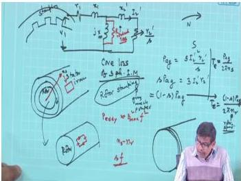  
*Figure: Approximate per-phase equivalent circuit with parameters from the test data.*  

- Magnetising branch: $R_0 \approx 454\ \Omega$, $X_m \approx 444\ \Omega$.  
- Stator impedance: $R_1 = 3.75\ \Omega$, $X_1 = 2.72\ \Omega$.  
- Referred rotor impedance: $R_2' = 3.72\ \Omega$, $X_2' = 2.72\ \Omega$.  

**Step 6: Why block the rotor?**  
In the blocked-rotor test, the rotor is held stationary so that slip $s = 1$. This makes the rotor frequency equal the supply frequency, and the rotor leakage reactance remains at its designed standstill value. The machine then behaves exactly like a transformer with a short-circuited secondary, allowing the total series impedance $(R_{eq},\ X_{eq})$ to be measured easily at a reduced voltage. No mechanical power is produced, and the reduced voltage keeps the high starting current within safe limits.  

> **Final answer:** $R_0 \approx 454\ \Omega$, $X_m \approx 444\ \Omega$, $R_1 = 3.75\ \Omega$, $R_2' = 3.72\ \Omega$, $X_1 = X_2' \approx 2.72\ \Omega$.


---

## Question 67
**Topic:** Circle diagram and induction motor tests · **Syllabus area:** Week 8 · **Source:** 2A | EM-I ELE 2154 Online End Sem, 27 January 2022

The following test results were obtained on a 3-phase, 75kW, 3.3kV, 6-Pole, 50Hz, δ-connected three-phase squirrel cage induction motor. Determine the parameters of the approximated equivalent circuit. No-load Test: 3.3kV, 5A and 2500W Blocked rotor Test: 400V, 27A, and 15000W (04)

### Answer 67
**Given:** 3-phase, 75 kW, 3.3 kV, 6-pole, 50 Hz, Δ-connected squirrel cage induction motor.

**No-load test:**  
Line voltage $V_L = 3.3\,\text{kV}$ → phase voltage $V_{ph}=3.3\,\text{kV}$.  
Line current $I_L = 5\,\text{A}$ → phase current $I_{0,ph}=5/\sqrt{3}=2.887\,\text{A}$.  
Total power $P_0 = 2500\,\text{W}$ → per-phase power $P_{0,ph}=2500/3=833.33\,\text{W}$.

The no-load power is assumed to be core loss (stator copper loss negligible at no load). Hence,
$$
R_c = \frac{V_{ph}^2}{P_{0,ph}} = \frac{3300^2}{833.33} = 13\,068\,\Omega \approx 13.07\,\text{k}\Omega.
$$
Core-loss current,
$$
I_w = \frac{V_{ph}}{R_c} = \frac{3300}{13\,068} \approx 0.252\,\text{A}.
$$
Magnetizing current,
$$
I_m = \sqrt{I_{0,ph}^2 - I_w^2} = \sqrt{2.887^2 - 0.252^2} = 2.876\,\text{A}.
$$
Magnetizing reactance,
$$
X_m = \frac{V_{ph}}{I_m} = \frac{3300}{2.876} \approx 1147\,\Omega \quad (1.147\,\text{k}\Omega).
$$

**Blocked-rotor test:**  
Applied line voltage $V_{br,L}=400\,\text{V}$ → phase voltage $V_{br,ph}=400\,\text{V}$.  
Line current $I_{br,L}=27\,\text{A}$ → phase current $I_{br,ph}=27/\sqrt{3}=15.59\,\text{A}$.  
Total power $P_{br}=15\,000\,\text{W}$ → per-phase power $P_{br,ph}=5000\,\text{W}$.

Equivalent impedance referred to stator,
$$
Z_{01} = \frac{V_{br,ph}}{I_{br,ph}} = \frac{400}{15.59} = 25.66\,\Omega.
$$
Equivalent resistance,
$$
R_{01} = \frac{P_{br,ph}}{I_{br,ph}^2} = \frac{5000}{15.59^2} = 20.56\,\Omega.
$$
Equivalent reactance,
$$
X_{01} = \sqrt{Z_{01}^2 - R_{01}^2} = \sqrt{25.66^2 - 20.56^2} = 15.36\,\Omega.
$$

No DC resistance measurement is provided; assuming equal stator and rotor copper losses at standstill, we split the blocked-rotor parameters equally:
$$
R_1 = R_2' = \frac{R_{01}}{2} = 10.28\,\Omega,
\qquad
X_1 = X_2' = \frac{X_{01}}{2} = 7.68\,\Omega.
$$

All values are per phase and referred to the stator side.

> **Final answer:** $R_c \approx 13.07\,\text{k}\Omega$, $X_m \approx 1.147\,\text{k}\Omega$, $R_1 = R_2' \approx 10.28\,\Omega$, $X_1 = X_2' \approx 7.68\,\Omega$.


---

## Question 68
**Topic:** Single-phase induction motors · **Syllabus area:** Week 10 · **Source:** 7B | EM-I ELE 205 End Sem, 04 December 2006

Show that a single phase current in a single phase winding produces only a pulsating magnetic field.

### Answer 68
A single-phase winding, when excited by a sinusoidal current, produces a magnetomotive force (mmf) that is both sinusoidally distributed in space and pulsating in time. The mmf at an angular position $\theta$ (measured from the winding axis) is given by

$$
F(\theta,t) = F_m \cos\theta \cos(\omega t),
$$

where $F_m$ is the peak mmf and $\omega$ is the angular frequency of the supply.

Using the trigonometric identity $\cos A \cos B = \frac{1}{2}[\cos(A-B) + \cos(A+B)]$, we can decompose this into two travelling waves:

$$
F(\theta,t) = \frac{F_m}{2} \cos(\theta - \omega t) + \frac{F_m}{2} \cos(\theta + \omega t).
$$

The first term, $\frac{F_m}{2} \cos(\theta - \omega t)$, represents a forward-rotating mmf wave that travels in the positive $\theta$ direction at synchronous speed. The second term, $\frac{F_m}{2} \cos(\theta + \omega t)$, is a backward-rotating wave of equal amplitude travelling in the negative $\theta$ direction.

Since the two rotating waves have identical amplitudes, their sum at any fixed location in the air-gap is a standing wave. The envelope of the mmf varies sinusoidally in time, but the spatial distribution does not move around the periphery. Thus, no net rotating magnetic field is produced; the field merely pulsates in magnitude without any continuous rotation.

This result is the foundation of the double revolving field theory, which explains the behaviour of single-phase induction motors.

> **Final answer:** A single-phase current in a single-phase winding produces only a pulsating magnetic field, mathematically equivalent to the sum of two equal contra-rotating fields with no net rotation.


---

## Question 69
**Topic:** Single-phase induction motors · **Syllabus area:** Week 10 · **Source:** 5C | EM-I ELE 205 End Sem, 30 November 2010

A 240V, 50Hz, 2 pole single phase induction motor has the following equivalent circuit impedances: r1=2.2Ω, r2'=3.8Ω, x1=3Ω, x2'=2.1Ω, xm=86Ω. Friction, windage and core losses=50W. Calculate input current, power factor, output power and efficiency at a full load speed of 2820RPM. (05)

### Answer 69
Synchronous speed $N_s = \frac{120f}{P} = \frac{120\times50}{2} = 3000$ rpm. Full-load speed $N = 2820$ rpm, so slip $s = \frac{3000-2820}{3000}=0.06$.

The double-revolving-field theory resolves the pulsating stator field into a forward field (slip $s$) and a backward field (slip $2-s$). The per-phase equivalent circuit, with all parameters referred to the stator, contains two parallel magnetising branches:

$$
Z_f = \left( j\frac{X_m}{2} \right) \parallel \left( \frac{R_2'}{2s} + j\frac{X_2'}{2} \right), \qquad
Z_b = \left( j\frac{X_m}{2} \right) \parallel \left( \frac{R_2'}{2(2-s)} + j\frac{X_2'}{2} \right).
$$

Total motor impedance: $Z_{total} = R_1 + jX_1 + Z_f + Z_b$.

Given: $R_1=2.2\;\Omega$, $X_1=3\;\Omega$, $R_2'=3.8\;\Omega$, $X_2'=2.1\;\Omega$, $X_m=86\;\Omega$, $V=240$ V, and rotational loss $P_{rot}=50$ W.

**Forward branch** ($X_m/2 = 43\;\Omega$, $X_2'/2 = 1.05\;\Omega$):
$$
R_{f,ser} = \frac{3.8}{2\times0.06}=31.667\;\Omega,\;
Z_f = \frac{j43(31.667+j1.05)}{31.667+j(43+1.05)} = \frac{-45.15+j1361.68}{31.667+j44.05}
$$
$$
Z_f = \frac{58552+j45108}{(31.667)^2+44.05^2} \approx 19.89 + j15.33\;\Omega.
$$

**Backward branch** ($s_b = 1.94$):
$$
R_{b,ser} = \frac{3.8}{2\times1.94}=0.9794\;\Omega,\;
Z_b = \frac{j43(0.9794+j1.05)}{0.9794+j(43+1.05)} = \frac{-45.15+j42.114}{0.9794+j44.05}
$$
$$
Z_b = \frac{1811+j2030}{(0.9794)^2+44.05^2} \approx 0.933 + j1.046\;\Omega.
$$

**Total impedance:**
$$
Z_{total} = (2.2 + j3) + (19.89 + j15.33) + (0.933 + j1.046) = 23.023 + j19.376\;\Omega.
$$
$$
|Z_{total}| = \sqrt{23.023^2 + 19.376^2} = 30.09\;\Omega,\quad
\phi = \tan^{-1}\frac{19.376}{23.023} \approx 40.1^\circ\;\text{(lagging)}.
$$

**Input current and power factor:**
$$
I_1 = \frac{240}{30.09} \approx 7.98\;A,\quad
\mathrm{pf} = \cos 40.1^\circ = 0.765\;\text{lagging}.
$$

**Power distribution:**
$$
P_{in} = V I_1 \cos\phi = 240 \times 7.98 \times 0.765 \approx 1465\;W,
$$
$$
P_{gf} = I_1^2\,\operatorname{Re}(Z_f) = 7.98^2 \times 19.89 \approx 1265\;W,
$$
$$
P_{gb} = I_1^2\,\operatorname{Re}(Z_b) = 7.98^2 \times 0.933 \approx 59.4\;W.
$$

Net mechanical power developed:
$$
P_{mech} = (1-s)(P_{gf} - P_{gb}) = 0.94 \times (1265.3 - 59.4) \approx 1134\;W.
$$

Output power and efficiency:
$$
P_{out} = P_{mech} - P_{rot} = 1134 - 50 = 1084\;W\;(1.084\;kW),
$$
$$
\eta = \frac{P_{out}}{P_{in}} \times 100 = \frac{1084}{1465} \times 100 \approx 74.0\%.
$$

> **Final answer:** $I_1 = 7.98$ A, pf $0.765$ lagging, $P_{out} = 1.084$ kW, $\eta = 74.0\%$.


---

## Question 70
**Topic:** Single-phase induction motors · **Syllabus area:** Week 10 · **Source:** 6A | EM-I ELE 205 Makeup, 08 January 2008

With the help of double field revolving theory, show that single phase induction motor is not self staring. (04)

### Answer 70
According to the double-revolving-field theory, the pulsating magnetic field produced by a single-phase stator winding can be decomposed into two rotating magnetic fields of equal magnitude, revolving in opposite directions at synchronous speed. Mathematically,

$$
F(\theta,t) = \frac{F_m}{2}\cos(\theta - \omega t) + \frac{F_m}{2}\cos(\theta + \omega t).
$$

When the rotor is at standstill, the slip with respect to both the forward and backward fields is unity. The forward field induces rotor currents that produce a torque in the forward direction; the backward field induces currents that produce an equal torque in the opposite direction. Since the two torques are identical in magnitude and opposite in direction, the net starting torque is zero.

Therefore, a single-phase induction motor with only one stator winding cannot develop any starting torque-it is not self-starting. To make it self-starting, an auxiliary starting arrangement (split-phase winding, capacitor-start, shaded pole, etc.) must be added to create an initial rotating field.

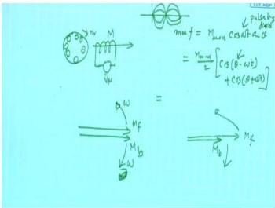
<p align="center"><i>Figure: Illustration of the two counter-rotating magnetic fields produced by a single-phase winding.</i></p>

> **Final answer:** At standstill the forward and backward revolving fields produce equal and opposite torques, resulting in zero net starting torque. Hence a single-phase induction motor is not self-starting.


---

## Question 71
**Topic:** Single-phase induction motors · **Syllabus area:** Week 10 · **Source:** 4B | EM-I ELE 2103 End Sem, 27 November 2018

With necessary phasor diagram, explain how a capacitor can help in starting of a single-phase induction motor. (03)

### Answer 71
In a single-phase induction motor, a single winding produces only a pulsating magnetic field, which yields no starting torque. To produce a starting torque, a second winding (auxiliary) is placed in space quadrature with the main winding. The currents in the two windings must be displaced in time phase to produce a rotating magnetic field.

In a capacitor-start motor, a capacitor is connected in series with the auxiliary winding. The main winding is highly inductive, so its current $\tilde{I}_m$ lags the supply voltage $\tilde{V}$ by a large angle $\phi_m$. The capacitor in the auxiliary circuit offsets part of the winding inductance, making the auxiliary current $\tilde{I}_a$ less lagging or even leading $\tilde{V}$ by an angle $\phi_a$. By proper choice of capacitance, the phase displacement $|\phi_m - \phi_a|$ can be made nearly $90^\circ$.

The phasor diagram (with $\tilde{V}$ as reference) clearly shows this time-phase separation:

$$
\begin{aligned}
&\text{Let } \tilde{V} \text{ be along the real axis.}\\
&\tilde{I}_m \text{ lags } \tilde{V} \text{ by } \phi_m \approx 70^\circ\text{--}80^\circ.\\
&\tilde{I}_a \text{ (with capacitor) leads } \tilde{V} \text{ by } \phi_a \approx 20^\circ\text{--}40^\circ.
\end{aligned}
$$

Thus the phase angle between $\tilde{I}_m$ and $\tilde{I}_a$ is approximately $90^\circ$. Combined with the $90^\circ$ spatial displacement of the windings, the two currents produce an approximate rotating magnetic field. This field cuts the rotor conductors and sets up a starting torque, bringing the motor up to speed. Once running, a centrifugal switch disconnects the auxiliary circuit.

> **Final answer:** The capacitor introduces a time-phase displacement between the main and auxiliary winding currents; when combined with the spatial displacement of the windings, an approximate rotating magnetic field is created, which produces the necessary starting torque.


---

## Question 72
**Topic:** Single-phase induction motors · **Syllabus area:** Week 10 · **Source:** 3A | EM-I ELE 2123 End Sem, 05 December 2023

How is torque produced in a capacitor start single phase induction motor. Is 3 there any need for this capacitor after starting? Explain.

### Answer 72
In a single-phase induction motor, the stator flux produced by a single winding is pulsating and can be resolved into two rotating fields of equal magnitude but opposite directions. At standstill, these fields produce equal and opposite torques, yielding zero net starting torque. The capacitor-start motor overcomes this by creating a rotating magnetic field at starting.

**Construction and phase splitting**  
The stator carries two windings: a main winding M and an auxiliary winding A, physically displaced by $90^\circ$ electrical. The auxiliary winding is connected in series with a capacitor C, and both windings are fed from the same single-phase supply.

Because the auxiliary circuit contains a capacitor, its impedance $Z_a + \frac{1}{j\omega C}$ can be made predominantly capacitive. As a result, the auxiliary winding current $I_a$ leads the applied voltage, while the main winding current $I_m$ lags the voltage due to its inductive nature. With properly chosen C, the time-phase displacement between $I_a$ and $I_m$ can approach $90^\circ$. Together with the spatial $90^\circ$ displacement, this creates a two-phase rotating field similar to that of a polyphase motor.

**Torque production**  
The rotating field induces emfs and currents in the squirrel-cage rotor. The interaction between the rotor current and the stator field produces a unidirectional starting torque, as long as both windings are energised.

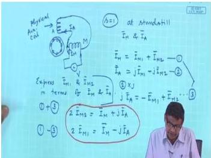

*Figure: Auxiliary winding and capacitor connection for phase splitting.*

Mathematically, if the two mmfs are given by:
$$
\begin{aligned}
F_m &= F_{m,\max} \cos(\omega t) \\
F_a &= F_{a,\max} \cos(\omega t - 90^\circ)  \quad (\text{due to spatial displacement})
\end{aligned}
$$
and the currents have a similar time phase difference, the resultant mmf becomes a travelling wave that pulls the rotor.

**Need for the capacitor after starting**  
In a conventional capacitor-start motor, the auxiliary winding and its capacitor are designed for intermittent duty. A centrifugal switch disconnects them automatically when the motor reaches about $70\,{-}\,80\%$ of synchronous speed. Once the motor is running, the main winding alone can sustain torque. If the starting capacitor remained in circuit:
- It would carry continuous current and overheat, leading to failure.
- It would cause unnecessary losses and could create an unbalanced running condition.

Thus, for a pure capacitor-start motor, the capacitor is **not needed** after starting. (In a *capacitor-run* motor, a smaller capacitor stays connected to improve running power factor and noise, but that is a different design.)

> **Final answer:** The capacitor provides the phase displacement necessary for starting; in a capacitor-start motor it is disconnected after start, while in a capacitor-run motor a small capacitor remains for improved running performance.


---

## Question 73
**Topic:** Single-phase induction motors · **Syllabus area:** Week 10 · **Source:** 3A | EM-I ELE 2123 End Sem, 25 November 2024

With the help of double field revolving theory, prove that a single-phase induction 3 motor containing only one stator winding produces no starting torque. Justify your answer with suitable characteristics.

### Answer 73
By the double revolving field theory, the pulsating magnetomotive force (mmf) produced by a single-phase stator winding can be resolved into two rotating mmf waves of equal amplitude but traveling in opposite directions at synchronous speed. Mathematically, if the spatial distribution of the mmf is represented by $F_m \cos\theta$ and the winding carries a sinusoidal current $i = I_m \cos(\omega t)$, the resultant mmf is
$$
F(\theta, t) = F_m \cos\theta \cos(\omega t) = \frac{F_m}{2} \cos(\theta - \omega t) + \frac{F_m}{2} \cos(\theta + \omega t).
$$
The first term represents a forward rotating field, while the second term represents a backward rotating field.

At standstill, the rotor is stationary, so the slip with respect to both forward and backward fields is unity: $s_f = s_b = 1$. Each rotating field induces currents in the rotor bars and produces a torque. The torque produced by the forward field is
$$
T_f = K \frac{R_2'}{R_2'^2 + X_2'^2},
$$
and the torque produced by the backward field is
$$
T_b = K \frac{R_2'}{R_2'^2 + X_2'^2}.
$$
These two torques are exactly equal in magnitude but act in opposite directions (the forward field tries to rotate the rotor in the forward direction, while the backward field tries to rotate it in the reverse direction). Hence, the net electromagnetic torque at standstill is
$$
T_{\text{net}} = T_f - T_b = 0.
$$

The torque-speed characteristic of a single-phase induction motor, as shown below, clearly illustrates this cancellation. The curve for the resultant torque passes through zero at $s=1$ (standstill), confirming that the motor cannot start on its own.


*Figure: Torque-slip characteristic showing forward torque $T_f$, backward torque $T_b$, and resultant torque $T_{\text{net}}$. At standstill ($s=1$), $T_{\text{net}} = 0$.*

Therefore, a single-phase induction motor containing only one stator winding produces no starting torque, necessitating additional means (such as an auxiliary winding) to initiate rotation.

> **Final answer:** The two equal and opposite torques cancel at standstill, as evidenced by the torque-slip characteristic passing through zero at $s=1$.


---

## Question 74
**Topic:** Single-phase induction motors · **Syllabus area:** Week 10 · **Source:** 1C | EM-I ELE 2154 Online End Sem, 27 January 2022

Explain the operation of a single-phase induction motor using double field revolving theory. (02)

### Answer 74
A single-phase stator winding carrying AC produces a pulsating magnetic field that is stationary in space but varies sinusoidally with time. According to the double-revolving-field theory, this pulsating field can be expressed as the sum of two constant-amplitude rotating fields turning in opposite directions at synchronous speed $\omega_s$:

$$F(\theta,t) = \frac{F_m}{2}\cos(\theta - \omega t) + \frac{F_m}{2}\cos(\theta + \omega t).$$

At standstill, both fields sweep past the rotor at the same speed, inducing equal currents and producing equal but opposite torques. Hence the net starting torque is zero, making the motor non-self-starting.

If the rotor is given an initial spin in either direction, the forward field slip $s_f$ becomes small while the backward field slip $s_b = 2 - s_f$ is large. The forward torque then dominates, and the motor accelerates to a steady running condition where it continues to rotate on the main winding alone.

Thus the double-revolving-field theory explains both the absence of starting torque and the ability to develop running torque once an auxiliary start is provided.

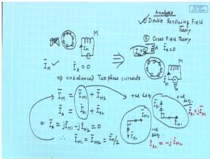

<p align="center"><i>Fig. 1:</i> Double revolving field concept.</p>

> **Final answer:** The double-revolving-field theory decomposes the pulsating stator field into two counter-rotating fields. At standstill their equal and opposite torques cancel, so the motor has no starting torque. After an initial rotation, the forward field torque overcomes the backward field torque, enabling the motor to run.


---

## Question 75
**Topic:** Synchronous machine construction and alternator fundamentals · **Syllabus area:** Week 11 · **Source:** 2C | EM-II ELE 204 Makeup, 08 July 2014

A 1500 kVA, 6.6 kV, 3-phase star connected wound rotor alternator with a resistance of 0.4 Ω and reactance of 6 Ω per phase, delivers full load current at 0.8 power factor lagging and normal terminal voltage. Estimate the excitation emf required and respective load angle. (04)

### Answer 75
The alternator is star-connected, so the per-phase values are used for the equivalent circuit.

**Per-phase terminal voltage:**

$$
V_{\text{ph}} = \frac{V_L}{\sqrt{3}} = \frac{6600}{\sqrt{3}} \approx 3810.5\ \text{V}
$$

**Full-load armature current:**

$$
I_a = \frac{S}{\sqrt{3}\,V_L} = \frac{1500 \times 10^3}{\sqrt{3} \times 6600} \approx 131.22\ \text{A}
$$

The power factor is $0.8$ lagging, hence the current lags the terminal voltage by $\varphi = \cos^{-1}(0.8) = 36.87^\circ$.

For a cylindrical-rotor synchronous generator, the excitation emf per phase ($E_f$) is given by the phasor sum of the terminal voltage and the internal impedance drops:

$$
\tilde{E}_f = \tilde{V}_{\text{ph}} + \tilde{I}_a(R_a + jX_s)
$$

Taking $\tilde{V}_{\text{ph}}$ as the reference phasor ($\tilde{V}_{\text{ph}} = 3810.5\angle 0^\circ\ \text{V}$), the current phasor is $\tilde{I}_a = 131.22\angle{-36.87^\circ}\ \text{A}$.

The resistance drop is $I_a R_a = 131.22 \times 0.4 = 52.49\ \text{V}$ (in phase with $\tilde{I}_a$), and the synchronous reactance drop is $I_a X_s = 131.22 \times 6 = 787.32\ \text{V}$ (leading $\tilde{I}_a$ by $90^\circ$).

The rectangular components of $\tilde{E}_f$ are:

$$
\begin{aligned}
E_{\text{real}} &= V_{\text{ph}} + I_a R_a \cos\varphi + I_a X_s \sin\varphi \\
&= 3810.5 + 52.49 \times 0.8 + 787.32 \times 0.6 \\
&= 3810.5 + 41.99 + 472.39 \approx 4324.9\ \text{V} \\[4pt]
E_{\text{imag}} &= I_a X_s \cos\varphi - I_a R_a \sin\varphi \\
&= 787.32 \times 0.8 - 52.49 \times 0.6 \\
&= 629.86 - 31.49 \approx 598.4\ \text{V}
\end{aligned}
$$

Hence,

$$
\begin{aligned}
E_f &= \sqrt{E_{\text{real}}^2 + E_{\text{imag}}^2} 
      = \sqrt{(4324.9)^2 + (598.4)^2} \approx 4366.1\ \text{V} \\[4pt]
\delta &= \tan^{-1}\!\left(\frac{E_{\text{imag}}}{E_{\text{real}}}\right)
        = \tan^{-1}\!\left(\frac{598.4}{4324.9}\right) \approx 7.88^\circ
\end{aligned}
$$

The phasor diagram below visualises this addition of the resistive and reactive drops to obtain the excitation emf.

<figure>
  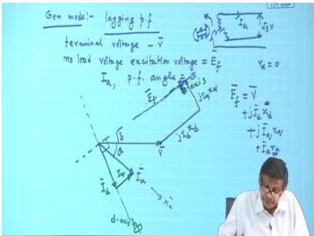
  <figcaption>Phasor diagram of a synchronous generator operating at lagging power factor.</figcaption>
</figure>

> **Final answer:** Excitation emf per phase $\approx 4366$ V; load angle $\approx 7.88^\circ$.


---

## Question 76
**Topic:** Synchronous machine construction and alternator fundamentals · **Syllabus area:** Week 11 · **Source:** 2C | EM-II ELE 2202 Makeup, 16 June 2017

What are the advantages of placing the field system of a large alternator on its rotor and the 3-phase windings on its stator? (02)

### Answer 76
In large three-phase alternators, the armature (where the AC power is generated) is placed on the stator and the field system on the rotor. This arrangement offers several critical advantages:

- **High-voltage, high-current windings are stationary**  
  The three-phase armature windings carry the full output voltage and current (often several kV and hundreds or thousands of amperes). Placing them on the stationary stator eliminates the need for heavy-current sliding contacts (slip-rings) to connect the rotating winding to the external bus. The phase conductors can be bolted directly to rigid busbars or cables, resulting in lower contact losses, higher reliability, and simpler maintenance.

- **Easier insulation and mechanical bracing**  
  Stationary windings can be firmly braced against the large electromagnetic forces that occur under short-circuit conditions. The insulation system can be designed without concern for centrifugal stresses, and the thicker ground-wall insulation required for high voltage is easier to apply and test on a rigid stator core.

- **Better cooling of the armature**  
  The stator frame can incorporate large-volume air or hydrogen cooling ducts, and in very large machines direct-water-cooled stator bars are common. A stationary armature simplifies the delivery of coolant and the removal of heat.

- **Simplified rotor construction**  
  The field winding operates at a much lower voltage (typically a few hundred volts) and carries only the DC excitation current, which is about 1-5 % of the machine rating. Consequently, the rotor slip-rings or brushless exciter diodes handle modest power levels, making them compact and reducing maintenance. The rotor itself is mechanically simpler and lighter, allowing higher rotational speeds with reduced centrifugal stress.

- **Enhanced reliability and reduced maintenance**  
  With only low-power connections to the rotor, the machine avoids the regular inspection and replacement of high-current brushes and slip-rings. Brushless excitation systems further eliminate all sliding electrical contacts, making the alternator virtually maintenance-free for long periods.

Thus, placing the field on the rotor and the three-phase winding on the stator is the universally adopted construction for large alternators because it combines a robust stationary power-circuit with a lightweight, low-maintenance rotating field.

> **Final answer:** Placing the field on the rotor enables a high-power stationary armature with simple cooling and insulation, while the low-power DC field is easily transferred to the rotor via modest slip-rings or a brushless exciter.


---

## Question 77
**Topic:** Synchronous machine construction and alternator fundamentals · **Syllabus area:** Week 11 · **Source:** 4A | EM-II ELE 2202 Makeup, 19 June 2018

With neat sketch, explain how an alternator can be synchronized to the grid using ‘Bright lamp method’. What are the conditions to be met to synchronize two 3-phase alternators? (05)

### Answer 77
**Bright-lamp (Two-bright lamp) synchronising method**

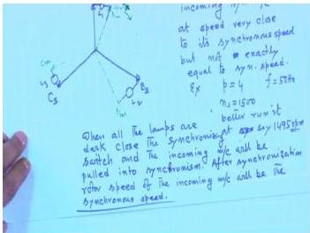

*Figure: Connection of lamps for the bright-lamp method of synchronisation. Lamp L1 is connected directly between corresponding phases (R-R′). Lamps L2 and L3 are cross-connected (Y-B′ and B-Y′).*

1. The incoming machine is brought to rated speed by its prime mover. Its field current is adjusted until the terminal voltage (e.g., line-to-line) equals the bus-bar voltage.
2. The machine is then allowed to run. The three lamps will flicker at a frequency equal to the difference between the alternator frequency and the grid frequency.
3. The prime-mover speed is slowly trimmed until the flicker becomes very slow (ideally the lamps stay steady).
4. The instant for closing the synchronising switch is when the directly-connected lamp (L1) is **dark** and the two cross-connected lamps (L2 & L3) glow with **equal brightness**. At that moment the voltages are equal in magnitude, frequency, and phase coincidence, and the phase sequence is verified (since the cross-connected lamps indicate the correct sequence).

**Conditions for synchronising two 3-phase alternators**

- Same phase sequence (R-Y-B and R′-Y′-B′ must be identical).
- Equal terminal voltage (magnitude of the incoming machine voltage must match the bus voltage).
- Equal frequency (both machines must run at the same electrical speed).
- Zero phase angle between corresponding phases - i.e., the voltages must be **in phase** at the instant of paralleling.

> **Final answer:** The bright-lamp method gives a clear visual indication of voltage and phase matching; synchronising is done when the directly-connected lamp is dark and the two cross-connected lamps glow with equal brightness, provided all four synchronising conditions are satisfied.


---

## Question 78
**Topic:** Synchronous machine construction and alternator fundamentals · **Syllabus area:** Week 11 · **Source:** 1A | EM-II ELE 2225 End Sem, 09 May 2024

‘The inherent nature of synchronous machines is to rotate in synchronism with the supply frequency while that of induction motors is to rotate with a slip’. Differentiate the above two machines. Use necessary schematic diagrams to justify your answer.

### Answer 78
Synchronous machines and induction machines are the two main types of AC machines, yet they differ fundamentally in their rotor construction, excitation, and speed-torque characteristics. The statement highlights the most fundamental distinction: a synchronous machine runs exactly at the speed of the rotating stator field (synchronous speed), while an induction motor must run at a speed slightly lower than the synchronous speed, i.e., with a slip.

These differences stem from the way the rotor magnetic field is produced and how torque is developed. A clear understanding of each machine's configuration and operating principle illustrates why the inherent nature of one is to lock into synchronism and the other to slip.

### 1. Construction and Excitation

**Synchronous machine**  
The stator carries a three-phase winding that, when energised from a three-phase supply, creates a rotating magnetic field at synchronous speed $N_s = \dfrac{120\,f}{P}$ (where $f$ is the supply frequency and $P$ the number of poles).  
The rotor houses a field winding (or permanent magnets) that is separately excited with direct current. This DC excitation establishes a fixed magnetic polarity on the rotor. Because the rotor field is not dependent on the stator field for its creation, the rotor can produce torque even when it is stationary relative to the rotating field (i.e., at zero slip). The rotor poles are physically attracted to the opposite poles of the stator rotating field, and the machine runs in exact synchronism under steady-state conditions.

**Induction motor**  
The stator is identical to that of a synchronous machine and produces a rotating field at $N_s$. The rotor, however, is either a squirrel-cage or a wound-rotor with short-circuited windings. No external DC source is connected to the rotor. Rotor currents are induced solely by the relative motion between the stator rotating field and the rotor conductors. If the rotor were to rotate at synchronous speed, there would be no relative motion, no induced emf, no rotor currents, and hence no torque. Therefore, an induction motor must always run at a speed $N_r$ lower than $N_s$ to maintain the slip $s = \dfrac{N_s - N_r}{N_s}$ needed for torque production.

### 2. Speed and Slip

- **Synchronous machine:**  
  
$$
N_r = N_s = \frac{120 f}{P}, \qquad s = 0 \quad \text{(in steady state)}
$$

  The rotor speed is rigidly locked to the supply frequency. Load changes do not alter the speed; instead, the angular displacement $\delta$ between the rotor and stator fields adjusts to supply the required torque.

- **Induction motor:**  
  
$$
N_r = (1-s)\,N_s, \qquad 0 < s < 1 \quad \text{(for motoring action)}
$$

  The slip increases with load. The rated full-load slip is typically 2-5% for normal induction motors.

### 3. Torque Production

**Synchronous machine:**  
Torque is produced by the interaction of the stator rotating field and the constant-amplitude rotor field. The electromagnetic torque is given by

$$
T = \frac{3\, V_t \, E_f}{X_s \, \omega_s} \sin \delta
$$

where $V_t$ is the terminal voltage, $E_f$ is the excitation emf, $X_s$ is the synchronous reactance, $\omega_s$ is the synchronous angular speed, and $\delta$ is the torque (load) angle. The torque can exist at zero slip, and the machine can develop torque over a wide range of $\delta$ up to $90^\circ$ (in a cylindrical-rotor machine).

**Induction motor:**  
Torque is generated by the interaction of the rotating field and the currents induced in the rotor. The per-phase equivalent circuit gives the air-gap power $P_g = I_2'^{\,2} \frac{R_2'}{s}$, and the developed torque

$$
T = \frac{P_g}{\omega_s} \propto \frac{s}{R_2'} \quad \text{(at small slips)}.
$$

If $s = 0$, the rotor current $I_2' = 0$ and torque becomes zero. Thus slip is indispensable for induction motor torque.

### 4. Power Factor Control

- **Synchronous machine:** By adjusting the DC field excitation, the machine can operate at lagging, unity, or leading power factor. Over-excitation makes it behave like a capacitor, a feature widely used for power factor correction.
- **Induction motor:** Always draws a lagging reactive current from the supply. The power factor is load-dependent and cannot be adjusted to leading.

### 5. Starting Behaviour

- **Synchronous machine:** Not self-starting. The stationary rotor cannot instantly lock to a rapidly rotating stator field. Special means such as damper (amortisseur) windings (acting as a squirrel-cage during start), a pony motor, or variable-frequency drives are required to bring it near synchronous speed.
- **Induction motor:** Inherently self-starting when the three-phase supply is connected, because the rotating field immediately induces currents in the stationary rotor and produces a starting torque.

### 6. Schematic Illustration

While a physical diagram would typically show side-by-side cross-sections of the two machines, the following textual description clarifies the essential visual differences:

*Synchronous machine:* Stator with three-phase winding; rotor with salient or cylindrical poles, each pole carrying a concentrated field coil. The field coils are connected to an external DC source through slip rings and brushes (or brushless excitation). The distinct rotor poles visually lock to the stator poles.  
*Induction motor:* Stator identical to above; rotor consists of a laminated iron core with short-circuited copper or aluminum bars embedded in slots (squirrel-cage) or a three-phase winding connected to slip rings that are externally short-circuited. No separate excitation is visible.

These constructional differences directly underpin the operational contrast: the synchronous machine's independently excited rotor allows it to run at zero slip, while the induction motor's passive rotor must depend on relative motion to function.

> **Final answer:** Synchronous machines operate at synchronous speed (zero slip) with controllable power factor; induction motors must operate with slip to generate rotor current and torque.


---

## Question 79
**Topic:** Synchronous machine construction and alternator fundamentals · **Syllabus area:** Week 11 · **Source:** 1C | EM-II ELE 2225 End Sem, 09 May 2024

‘Unlike asynchronous machines, Synchronous machines can be operated at different power factors’. Justify this statement with the help of necessary characteristics. 3

### Answer 79
In a synchronous machine, the rotor is excited by a separate DC source, which establishes the main magnetic field. This allows independent control of the flux magnitude. When connected to a constant-voltage constant-frequency bus, the real power exchanged is determined by the load angle $\delta$ (via mechanical torque), while the reactive power-and hence the power factor-is governed by the field current $I_f$.

Using the simplified per-phase equivalent circuit, the phasor equation is  
$\overline{V} = \overline{E}_f + j\,\overline{I}_a X_s$,  
where $\overline{V}$ is the terminal voltage, $\overline{E}_f$ is the excitation emf proportional to $I_f$, and $X_s$ is the synchronous reactance. From this, the complex power per phase is  
$S = \overline{V}\,\overline{I}_a^* = P + jQ$.  
For a non-salient pole machine, the active and reactive powers are given by  
$$
\begin{aligned}
P &= \frac{3VE_f}{X_s}\sin\delta,\\
Q &= \frac{3V}{X_s}(E_f\cos\delta - V).
\end{aligned}
$$
At a given mechanical power (hence fixed $\delta$), varying $I_f$ changes $E_f$ and thus alters $Q$. Consequently, the stator current magnitude and phase change, enabling three distinct operating conditions:

- **Under-excitation** ($E_f \cos\delta < V$): The machine absorbs reactive power from the bus; the stator current lags the terminal voltage → **lagging power factor**.
- **Normal excitation** ($E_f \cos\delta = V$): The machine neither supplies nor absorbs reactive power; the stator current is minimum and in phase with the voltage → **unity power factor**.
- **Over-excitation** ($E_f \cos\delta > V$): The machine delivers reactive power to the bus; the stator current leads the terminal voltage → **leading power factor**.

These operating points are quantitatively summarised by the well-known **V-curves** (armature current vs. field current at constant real power), which exhibit a minimum at unity pf and rise for both under- and over-excitation. This inherent capability makes the synchronous machine unique for power-factor correction and flexible operation.

In contrast, an asynchronous (induction) machine has a singly-excited rotor; its magnetic field can be established only by drawing lagging reactive current from the stator terminals. Therefore, its power factor is always lagging and cannot be adjusted without external capacitors.

> **Final answer:** By adjusting the DC field current, a synchronous machine can operate at lagging, unity, or leading power factor, whereas an induction machine inherently operates at a lagging power factor and cannot vary it independently. This is demonstrated by the V-curves and the reactive-power expression $Q = \frac{3V}{X_s}(E_f\cos\delta - V)$.


---

## Question 80
**Topic:** Alternator armature reaction, voltage regulation, OCC/SCC and phasor diagrams · **Syllabus area:** Weeks 11-12 · **Source:** 3B | EM-II ELE 204 Makeup, 08 July 2014

A 3 phase, 6600 V, 50 Hz, 1000 rpm, star connected alternator is delivering a constant power of 4 MW to an infinite bus system. Its synchronous impedance per phase is (0+j0.75) Ω. Determine the excitation emf required if the power factor is to be adjusted 0.7 lagging. Also obtain the current and power factor when the excitation is set to its minimum value required to deliver the same power. (06)

### Answer 80
Given: 3-phase, 6600 V (line), 50 Hz, star-connected alternator delivering constant power $P = 4\text{ MW}$ to an infinite bus. Synchronous impedance per phase is purely reactive: $Z_s = (0 + j0.75)\,\Omega$ (armature resistance neglected).\n\nThe phase voltage is\n$$V = \frac{V_L}{\sqrt{3}} = \frac{6600}{\sqrt{3}} \approx 3810.5\text{ V}.$$\n\n***(i) Excitation emf at 0.7 lagging power factor***\n\nPower factor $\cos\varphi = 0.7$ lagging $\Rightarrow \varphi = \cos^{-1}(0.7) \approx 45.57^\circ$, $\sin\varphi = \sqrt{1-0.7^2} \approx 0.714$.\n\nLine current equals phase current for star connection. From total power:\n$$P = \sqrt{3}V_L I \cos\varphi \;\Longrightarrow\; I = \frac{4 \times 10^6}{\sqrt{3} \times 6600 \times 0.7} \approx 499.9\text{ A}.$$\n\nTake terminal voltage as reference: $\tilde{V} = V\angle 0^\circ$.  The armature current lags: $\tilde{I} = I\angle -\varphi = 499.9\angle -45.57^\circ$ A.\n\nThe phasor diagram for a generator with lagging pf (neglecting $R_a$) is shown below.  The excitation emf is\n$$\tilde{E} = \tilde{V} + jX_s\tilde{I}.$$\n\n<figure style="text-align:center;">\n  \n  <figcaption><strong>Figure:</strong> Phasor diagram of a synchronous generator with lagging power factor, neglecting armature resistance.</figcaption>\n</figure>\n\nReactance drop:\n$$jX_s\tilde{I} = j0.75 \times 499.9\angle -45.57^\circ = 0.75\angle 90^\circ \times 499.9\angle -45.57^\circ = 374.9\angle 44.43^\circ\text{ V}.$$\n\nExpress $\tilde{E}$ in rectangular form:\n$$\begin{aligned}\n\tilde{E} &= 3810.5 + 374.9\angle 44.43^\circ \\\n&= 3810.5 + 374.9\bigl(\cos 44.43^\circ + j\sin 44.43^\circ\bigr) \\\n&= 3810.5 + 374.9(0.714 + j0.7) \quad [\cos 44.43^\circ = \sin 45.57^\circ \approx 0.714,\; \sin 44.43^\circ = \cos 45.57^\circ \approx 0.7] \\\n&\approx 4078.3 + j262.4\text{ V}.\n\end{aligned}$$\n\nMagnitude (excitation emf per phase):\n$$E = |\tilde{E}| = \sqrt{4078.3^2 + 262.4^2} \approx 4087\text{ V}.$$\n\nLoad angle (power angle):\n$$\delta = \tan^{-1}\Bigl(\frac{262.4}{4078.3}\Bigr) \approx 3.68^\circ.$$\n\nThus for 0.7 lagging pf: **excitation emf $E \approx 4087$ V/phase**, **load angle $\delta \approx 3.68^\circ$**.\n\n***(ii) Minimum excitation for the same 4 MW***\n\nWith negligible resistance, real power per phase is $P_{\text{ph}} = \dfrac{VE}{X_s}\sin\delta$.  Total three-phase power:\n$$P = \frac{3VE}{X_s}\sin\delta.$$\n\nFor constant $P$, $E$ is minimised when $\sin\delta$ is maximum, i.e. $\delta = 90^\circ$ ($\sin\delta = 1$):\n$$E_{\min} = \frac{P X_s}{3V} = \frac{4 \times 10^6 \times 0.75}{3 \times 3810.5} \approx 262.4\text{ V/phase}.$$\n\nLine current at this condition: from $\tilde{E} = \tilde{V} + jX_s\tilde{I}$,\n$$\tilde{I} = \frac{\tilde{E} - \tilde{V}}{jX_s}.$$\nTake $\tilde{V} = 3810.5\angle 0^\circ$, $\tilde{E}_{\min} = 262.4\angle 90^\circ$.  Then\n$$\tilde{E}_{\min} - \tilde{V} = j262.4 - 3810.5 = -3810.5 + j262.4\text{ V},$$\n$$|\tilde{E}_{\min} - \tilde{V}| = \sqrt{3810.5^2 + 262.4^2} \approx 3819.7\text{ V},$$\n$$I = \frac{3819.7}{0.75} \approx 5093\text{ A}.$$\n\nPower factor from the total power equation:\n$$\cos\varphi = \frac{P}{\sqrt{3}V_L I} = \frac{4 \times 10^6}{\sqrt{3} \times 6600 \times 5093} \approx 0.0687.$$\nBecause $E_{\min} < V$ and $\delta = 90^\circ$, the current leads the voltage (the machine is over-excited); the power factor is **leading**.  (Alternatively, the current phasor is $\tilde{I} = 5093\angle 86.06^\circ$ A, giving $\cos 86.06^\circ \approx 0.0689$ leading.)\n\nHence at minimum excitation: **$E_{\min} \approx 262.4$ V/phase**, **line current $I \approx 5093$ A**, and **power factor $\approx 0.0687$ leading**.\n\n> **Final answer:** For 0.7 pf lagging: excitation emf $E \approx 4087$ V/phase, load angle $\delta \approx 3.68^\circ$. Minimum excitation: $E_{\min} \approx 262.4$ V/phase, line current $5093$ A, power factor $\approx 0.0687$ leading.


---

## Question 81
**Topic:** Alternator armature reaction, voltage regulation, OCC/SCC and phasor diagrams · **Syllabus area:** Weeks 11-12 · **Source:** 5A | EM-II ELE 204 Makeup, 08 July 2014

A 3 phase, 50 Hz, 440 V, synchronous motor has a synchronous impedance of (0.5+j4) Ω/phase. Draw a set of excitation circles with excitation emfs of 50%, 90% and 125% of its terminal voltage. For an armature current of 35 A, graphically determine the load angle and power factor for each of the above excitations. (04)

### Answer 81
**Given data:**
- 3-phase, 50 Hz, 440 V (line-to-line) synchronous motor.
- Synchronous impedance per phase: $Z_s = (0.5 + j4)\,\Omega$.
- Armature current $I = 35\,\text{A}$ (per phase).
- Excitation EMFs to be considered: $50\%$, $90\%$, and $125\%$ of rated terminal voltage.

**Step 1: Per-phase quantities.**
The motor is star-connected; the phase voltage is
$$
V_{\text{ph}} = \frac{440}{\sqrt{3}} \approx 254\;\text{V}.
$$
The synchronous impedance magnitude and angle:
$$
|Z_s| = \sqrt{0.5^2 + 4^2} \approx 4.031\,\Omega,\qquad
\theta_z = \arctan\!\left(\frac{4}{0.5}\right) \approx 82.875^\circ.
$$

**Step 2: Phasor relation for the synchronous motor.**
Using the motor convention (current $I$ entering the machine),
$$
\tilde{V} = \tilde{E} + \tilde{I}Z_s,
$$
where $\tilde{V}$ is the terminal voltage, $\tilde{E}$ the excitation EMF (back EMF), and $\tilde{I}Z_s$ the internal voltage drop.  
For a given magnitude of armature current $|I|=35\,\text{A}$, the drop magnitude is constant:
$$
|\tilde{I}Z_s| = 35 \times 4.031 \approx 141.1\;\text{V}.
$$

**Step 3: Graphical construction of excitation circles.**
In the voltage-phasor plane, take $\tilde{V}$ along the reference axis (horizontal).  
- The tip of $\tilde{V}$ is the centre of a circle of radius $|\tilde{I}Z_s|$; this circle is the locus of the tip of $-\tilde{I}Z_s$ as the current phase varies, i.e. the locus of all possible $\tilde{E}$ vectors for the given current magnitude.  
- For each fixed excitation voltage $|\tilde{E}|$, draw a circle of radius $|\tilde{E}|$ centred at the origin.  
- The intersection of the two circles locates the tip of $\tilde{E}$ for that operating condition.  
- From the diagram one can then measure the load angle $\delta$ (the angle between $\tilde{V}$ and $\tilde{E}$) and the current phase $\varphi$ (by noting that $\tilde{I}Z_s$ leads $\tilde{I}$ by $\theta_z$).

The three required excitations are:
$$
E_1 = 0.5 \times 254 = 127\;\text{V},\quad
E_2 = 0.9 \times 254 = 228.6\;\text{V},\quad
E_3 = 1.25 \times 254 = 317.5\;\text{V}.
$$

The construction is illustrated in the accompanying phasor diagram, where the constant-$|\tilde{E}|$ circles are drawn for under- and over-excited conditions.

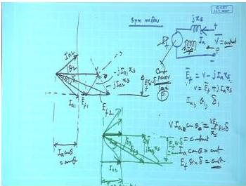  
*Fig. Phasor diagram of a synchronous motor when field excitation is varied (source: textbook page 785).*

**Step 4: Analytical (trigonometric) solution - equivalent to the graphical method.**
The triangle formed by $\tilde{V}$, $\tilde{E}$ and $\tilde{I}Z_s$ (with $\tilde{I}Z_s = \tilde{V} - \tilde{E}$) has known sides: $V_{\text{ph}}$, $E$, and $IZ_s = 141.1\,\text{V}$.  

Applying the law of cosines to find the angle $\alpha$ of $\tilde{I}Z_s$ relative to $\tilde{V}$:
$$
\cos\alpha = \frac{V^2 + (IZ_s)^2 - E^2}{2\,V\,(IZ_s)},
$$
and the load angle $\delta$ is obtained from
$$
\cos\delta = \frac{V^2 + E^2 - (IZ_s)^2}{2\,V\,E}.
$$
The power-factor angle $\varphi$ (of $I$ with respect to $V$) follows from $\varphi = \alpha - \theta_z$; a negative $\varphi$ indicates lagging current, a positive $\varphi$ leading current.

**Step 5: Numerical evaluation for each excitation.**

*Case 1: $E = 127\;\text{V}$ (50 % excitation)*
$$
\cos\alpha_1 = \frac{254^2 + 141.1^2 - 127^2}{2 \times 254 \times 141.1}
            \approx 0.9529 \;\Rightarrow\; \alpha_1 \approx 17.7^\circ.
$$
Taking the appropriate sign for under-excitation ($E<V$), $\varphi_1 = 17.7^\circ - 82.875^\circ \approx -65.18^\circ$ (lagging).  
Power factor: $\cos\varphi_1 = \cos 65.18^\circ \approx 0.419$ (lag).  
Load angle:
$$
\cos\delta_1 = \frac{254^2 + 127^2 - 141.1^2}{2 \times 254 \times 127}
            \approx 0.9415 \;\Rightarrow\; \delta_1 \approx 19.7^\circ.
$$

*Case 2: $E = 228.6\;\text{V}$ (90 % excitation)*
$$
\cos\alpha_2 = \frac{254^2 + 141.1^2 - 228.6^2}{2 \times 254 \times 141.1}
            \approx 0.4489 \;\Rightarrow\; \alpha_2 \approx 63.3^\circ.
$$
Here also $E<V$, so $\varphi_2 = 63.3^\circ - 82.875^\circ \approx -19.58^\circ$ (lag).  
Power factor: $\cos\varphi_2 \approx 0.942$ (lag).  
Load angle:
$$
\cos\delta_2 = \frac{254^2 + 228.6^2 - 141.1^2}{2 \times 254 \times 228.6}
            \approx 0.8341 \;\Rightarrow\; \delta_2 \approx 33.5^\circ.
$$

*Case 3: $E = 317.5\;\text{V}$ (125 % excitation)*
$$
\cos\alpha_3 = \frac{254^2 + 141.1^2 - 317.5^2}{2 \times 254 \times 141.1}
            \approx -0.2285 \;\Rightarrow\; \alpha_3 \approx 103.2^\circ.
$$
With $E>V$ (over-excitation), the motor draws leading current; hence we take the positive $\alpha$ branch,
$\varphi_3 = 103.2^\circ - 82.875^\circ \approx 20.33^\circ$ (leading).  
Power factor: $\cos\varphi_3 \approx 0.938$ (lead).  
Load angle:
$$
\cos\delta_3 = \frac{254^2 + 317.5^2 - 141.1^2}{2 \times 254 \times 317.5}
            \approx 0.9016 \;\Rightarrow\; \delta_3 \approx 25.6^\circ.
$$

These computed values agree with what is obtained by careful drawing of the excitation circles.

> **Final answer:**  
> For $|I|=35$ A:  
> $E = 127\;\text{V}\;(50\%)$ → $\delta = 19.7^\circ$, pf $0.419$ lagging;  
> $E = 228.6\;\text{V}\;(90\%)$ → $\delta = 33.5^\circ$, pf $0.942$ lagging;  
> $E = 317.5\;\text{V}\;(125\%)$ → $\delta = 25.6^\circ$, pf $0.938$ leading.


---

## Question 82
**Topic:** Alternator armature reaction, voltage regulation, OCC/SCC and phasor diagrams · **Syllabus area:** Weeks 11-12 · **Source:** 2A | EM-II ELE 204 Makeup, 09 July 2015

Draw the EMF and MMF diagrams when a pure inductive load is connected to a 3 phase wound rotor synchronous generator with negligible armature resistance. Hence discuss the armature reaction effect. (03)

### Answer 82
**EMF (Phasor) Diagram**
For a cylindrical-rotor synchronous generator with negligible armature resistance, the per-phase phasor equation is
$$\tilde{E} = \tilde{V} + j X_s \tilde{I}$$
where $\tilde{E}$ = excitation emf, $\tilde{V}$ = terminal voltage, $\tilde{I}$ = armature current, $X_s$ = synchronous reactance.

With a pure inductive load, the current lags the terminal voltage by $90^\circ$. Taking $\tilde{V}$ as reference ($\angle 0^\circ$), we have $\tilde{I} = I \angle -90^\circ$. Then
$$j X_s \tilde{I} = j X_s (I \angle -90^\circ) = X_s I \angle 0^\circ$$
which is in phase with $\tilde{V}$. Hence $\tilde{E} = \tilde{V} + X_s I \angle 0^\circ$, making $\tilde{E}$ collinear with $\tilde{V}$ and $E > V$. The angle between $\tilde{E}$ and $\tilde{I}$ is $90^\circ$ (lagging).

The phasor diagram (Fig. a) shows:
- $\tilde{V}$ horizontal to the right.
- $\tilde{I}$ vertically downward.
- $j X_s \tilde{I}$ horizontal to the right from the tip of $\tilde{V}$.
- $\tilde{E}$ from the origin to the tip of $j X_s \tilde{I}$.

**MMF Diagram**
The field mmf $\mathcal{F}_f$ (produced by the rotor field current) generates the excitation emf $\tilde{E}$. The armature mmf $\mathcal{F}_a$ is produced by the three-phase armature current and is proportional to $\tilde{I}$, rotating synchronously. In phasor terms, $\mathcal{F}_a$ is aligned with $\tilde{I}$.

Since $\tilde{I}$ lags $\tilde{E}$ by $90^\circ$, $\mathcal{F}_a$ is directly opposed to $\mathcal{F}_f$. The resultant air-gap mmf is the vector sum:
$$\mathbf{\mathcal{F}}_r = \mathbf{\mathcal{F}}_f + \mathbf{\mathcal{F}}_a$$
With $\mathcal{F}_a$ opposite to $\mathcal{F}_f$, the magnitude $\mathcal{F}_r < \mathcal{F}_f$ (Fig. b).

**Armature Reaction Effect**
The opposition of $\mathcal{F}_a$ to $\mathcal{F}_f$ reduces the net air-gap flux. Consequently, the generated emf would drop if the excitation were kept constant. To maintain rated terminal voltage, the field current must be increased. This purely **demagnetising** armature reaction is characteristic of a synchronous generator supplying a pure inductive (lagging power factor) load.

> **Final answer:** With pure inductive load, the armature reaction is entirely demagnetising - the armature mmf directly opposes the field mmf, weakening the air-gap flux. The phasor diagram shows $\tilde{E}$ and $\tilde{V}$ in phase, with $E > V$, while the MMF diagram shows $\mathcal{F}_a$ opposed to $\mathcal{F}_f$, resulting in a smaller net mmf.


---

## Question 83
**Topic:** Alternator armature reaction, voltage regulation, OCC/SCC and phasor diagrams · **Syllabus area:** Weeks 11-12 · **Source:** 3B | EM-II ELE 204 Makeup, 09 July 2015

A 3 phase, star connected cylindrical rotor alternator with a synchronous reactance of 5 per phase with negligible armature resistance is supplying 250 A at 0.8 power factor lagging to a 11 kV infinite bus. Determine (a) excitation emf and load angle (b) If excitation is increased by 15 % without changing its driving torque, determine the new values of load angle, armature current and power factor (03)

### Answer 83
Given a 3-phase star-connected cylindrical rotor alternator (synchronous generator) with synchronous reactance $X_s = 5\,\Omega/\text{phase}$ and negligible armature resistance, operating at a line voltage of $11\,\text{kV}$ and supplying $250\,\text{A}$ at a lagging power factor of $0.8$. The machine is connected to an infinite bus, so the terminal voltage magnitude and frequency remain constant.

First, compute per-phase values. For a star connection:
$$
V_{\text{ph}} = \frac{V_L}{\sqrt{3}} = \frac{11000}{\sqrt{3}} \approx 6351\ \text{V}.
$$
The armature current magnitude is $I_a = 250\ \text{A}$ and its phase angle relative to the terminal voltage (taken as reference) is
$$
\phi = \cos^{-1}(0.8) = 36.87^\circ \ \text{lagging} \quad \Rightarrow \quad \mathbf{I}_a = 250\angle{-36.87^\circ}\ \text{A}.
$$

**(a) Excitation emf and load angle**  
In generator convention, neglecting resistance, the phasor equation is
$$
\mathbf{E} = \mathbf{V} + jX_s \mathbf{I}_a,
$$
where $\mathbf{E}$ is the excitation emf per phase and $\delta$ (load angle) is the angle by which $\mathbf{E}$ leads $\mathbf{V}$.

Substituting the values:
$$
jX_s \mathbf{I}_a = j5 \times (250\angle{-36.87^\circ}) = 1250\angle{(90^\circ - 36.87^\circ)} = 1250\angle{53.13^\circ}\ \text{V}.
$$
In rectangular form:
$$
1250\angle{53.13^\circ} = 1250(\cos 53.13^\circ + j\sin 53.13^\circ) \approx 750 + j1000\ \text{V}.
$$
Thus,
$$
\mathbf{E} = 6351 + 750 + j1000 = 7101 + j1000\ \text{V}.
$$
The magnitude of the excitation emf is
$$
E = |\mathbf{E}| = \sqrt{7101^2 + 1000^2} \approx 7171\ \text{V} = 7.171\ \text{kV/phase}.
$$
The load angle is
$$
\delta = \tan^{-1}\left(\frac{1000}{7101}\right) \approx 8.02^\circ.
$$

So, for part (a): $E = 7.171\ \text{kV/phase}$, $\delta = 8.02^\circ$.

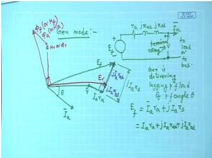  
*Figure: Phasor diagram of a non-salient pole synchronous generator operating at lagging power factor.*

**(b) Increased excitation with constant driving torque**  
Increasing the field excitation by 15% without altering the driving torque means that the prime-mover power remains constant. Neglecting losses, the electrical output power remains unchanged.

The three-phase real power delivered by a cylindrical rotor machine is given by
$$
P = \frac{3 V_{\text{ph}} E}{X_s} \sin\delta.
$$
Using the original values,
$$
P = \frac{3 \times 6351 \times 7171}{5} \sin 8.02^\circ
  \approx 3.811 \times 10^6\ \text{W}.
$$

After the excitation is increased by 15%,
$$
E' = 1.15 \times 7171 \approx 8247\ \text{V/phase}.
$$
With $P$ constant, the new load angle $\delta'$ satisfies
$$
\sin\delta' = \frac{P X_s}{3 V_{\text{ph}} E'}
           = \frac{3.811 \times 10^6 \times 5}{3 \times 6351 \times 8247}
           \approx 0.1213,
$$
$$
\delta' = \sin^{-1}(0.1213) \approx 6.97^\circ.
$$

To find the new armature current, we use the phasor relation again:
$$
\mathbf{I}'_a = \frac{\mathbf{E}' - \mathbf{V}}{j X_s},
$$
with $\mathbf{E}' = 8247\angle{6.97^\circ}$ V and $\mathbf{V} = 6351\angle{0^\circ}$ V.

Convert $\mathbf{E}'$ to rectangular form:
$$
\mathbf{E}' = 8247 (\cos 6.97^\circ + j\sin 6.97^\circ) \approx 8185.6 + j1001.3\ \text{V}.
$$
Then
$$
\mathbf{E}' - \mathbf{V} = (8185.6 - 6351) + j1001.3 = 1834.6 + j1001.3\ \text{V}.
$$
Dividing by $j5$,
$$
\mathbf{I}'_a = \frac{1834.6 + j1001.3}{j5}
            = \frac{1001.3 - j1834.6}{5}
            = 200.26 - j366.92\ \text{A}.
$$
The magnitude is
$$
I'_a = \sqrt{200.26^2 + 366.92^2} \approx 417.9\ \text{A}.
$$
The phase angle of $\mathbf{I}'_a$ relative to the terminal voltage $\mathbf{V}$ (reference) is
$$
\phi' = \tan^{-1}\left(\frac{-366.92}{200.26}\right) \approx -61.4^\circ,
$$
which indicates a lagging current. Hence the new power factor is
$$
\text{pf}' = \cos \phi' = \cos(61.4^\circ) \approx 0.479\ \text{lagging}.
$$

> **Final answer:**  
> (a) Excitation emf $E = 7.171\ \text{kV/phase}$, load angle $\delta = 8.02^\circ$.  
> (b) After the 15% increase: load angle $\delta' = 6.97^\circ$, armature current $I'_a = 417.9\ \text{A}$, power factor $\text{pf} = 0.479$ lagging.


---

## Question 84
**Topic:** Alternator armature reaction, voltage regulation, OCC/SCC and phasor diagrams · **Syllabus area:** Weeks 11-12 · **Source:** 5A | EM-II ELE 2202 End Sem, 10 May 2016

A 15 kW, 400 V, 50 Hz, 3 phase, star connected synchronous motor has its synchronous impedance of (1+j5) Ω per phase. If the excitation is maintained constant at 277 V per phase, determine the maximum load the synchronous motor can drive and corresponding current and power factor. (05)

### Answer 84
For a 3-phase star-connected synchronous motor, per-phase quantities:
$$
V_{\text{ph}} = \frac{400}{\sqrt{3}} = 230.94\,\text{V}
$$
Excitation emf per phase $E = 277\,\text{V}$, synchronous impedance per phase $Z_s = 1 + j5\,\Omega$.

The synchronous impedance magnitude and angle:
$$
|Z_s| = \sqrt{1^2 + 5^2} = 5.099\,\Omega,\qquad
\theta = \arctan\!\left(\frac{5}{1}\right) = 78.69^\circ.
$$

The gross mechanical power developed per phase (air-gap power) is $P_g = \operatorname{Re}\{E I^*\}$. With $V$ as reference, $V = V\angle 0^\circ$, and for motor operation $E = E\angle -\delta$, where $\delta$ is the load angle (E lags V). The current is
$$
I = \frac{V - E}{Z_s}.
$$
Then
$$
P_g = \operatorname{Re}\!\left\{E \frac{V^* - E^*}{Z_s^*}\right\}
      = \frac{1}{|Z_s|}\big[E V \cos(\theta - \delta) - E^2 \cos\theta\big]\quad\text{(per phase)}.
$$

For a three-phase machine,
$$
P_g = \frac{3}{|Z_s|}\big[E V \cos(\theta - \delta) - E^2 \cos\theta\big].
$$

The condition for maximum gross power is found by differentiating $P_g$ with respect to $\delta$ and setting the derivative to zero:
$$
\frac{dP_g}{d\delta} = \frac{3}{|Z_s|} E V \sin(\theta - \delta) = 0
\;\Longrightarrow\; \sin(\theta - \delta) = 0 \;\Longrightarrow\; \delta = \theta.
$$
Thus the maximum occurs when the load angle equals the impedance angle:
$$
\delta_{\max} = \theta = 78.69^\circ.
$$

Substituting $\delta = \theta$ gives the maximum three-phase gross power:
$$
\cos\theta = \frac{R_a}{|Z_s|} = \frac{1}{5.099} = 0.1961,
$$

$$
P_{g,\max} = \frac{3}{5.099}\big[277 \times 230.94 - 277^2 \times 0.1961\big]
           = \frac{3}{5.099}\big[63\,970.4 - 15\,044.8\big]
           = \frac{3 \times 48\,925.6}{5.099}
           \approx 28\,780\ \text{W} = 28.78\ \text{kW}.
$$

At this load angle the armature current is obtained from the motor phasor equation:
$$
I_a = \frac{V - E}{Z_s}
     = \frac{230.94\angle 0^\circ - 277\angle -78.69^\circ}{5.099\angle 78.69^\circ}.
$$
Computing the numerator in rectangular form:
$$
V - E = 230.94 - (54.32 - j271.66) = 176.62 + j271.66.
$$
Its magnitude is $\sqrt{176.62^2 + 271.66^2} = 323.96\ \text{V}$ and its phase $\phi_1 = \arctan(271.66/176.62) = 56.97^\circ$.
Then
$$
I_a = \frac{323.96\angle 56.97^\circ}{5.099\angle 78.69^\circ}
     = 63.54\angle (56.97^\circ - 78.69^\circ) = 63.54\angle -21.72^\circ\ \text{A}.
$$

The current lags the terminal voltage by $21.72^\circ$; hence the power factor is
$$
\text{pf} = \cos 21.72^\circ = 0.929\ \text{(lagging)}.
$$

(As a check, the electrical input power is $P_{\text{in}} = 3\,V I \cos\phi = 3 \times 230.94 \times 63.54 \times 0.929 \approx 40.9\ \text{kW}$, and the copper loss $3I^2R_a = 3\times 63.54^2\times 1 = 12.11\ \text{kW}$, yielding $P_{g,\max}=40.9-12.11\approx 28.79\ \text{kW}$, which agrees.)

> **Final answer:** Maximum load $= 28.78\ \text{kW}$, armature current $= 63.54\ \text{A}$, power factor $= 0.929$ lagging.


---

## Question 85
**Topic:** Alternator armature reaction, voltage regulation, OCC/SCC and phasor diagrams · **Syllabus area:** Weeks 11-12 · **Source:** 2C | EM-II ELE 2202 End Sem, 24 April 2017

Using relevant phasor diagram, discuss the behaviour of a cylindrical rotor synchronous motor supplying a constant load but operating under varying excitation conditions. (03)

### Answer 85
For a cylindrical-rotor synchronous motor connected to a constant-voltage, constant-frequency bus, the per-phase phasor equation neglecting armature resistance ($r_a \approx 0$) is

$$
\vec{V} = \vec{E} + jX_s \vec{I}_a,
$$

where $\vec{V}$ is the terminal voltage (reference phasor), $\vec{E}$ is the excitation (back) emf, $X_s$ is synchronous reactance, and $\vec{I}_a$ is the armature current. The motor draws real power $P = 3 V I_a \cos\phi$ (or per phase $VI_a\cos\phi$). Since the shaft load is held constant, $P$ is fixed, and because $V$ is constant, the in-phase component of armature current $I_a\cos\phi$ must remain constant. Consequently, as the field excitation is varied, the tip of the current phasor $\vec{I}_a$ can only move along a vertical line (constant active-power line), as shown in the figure.

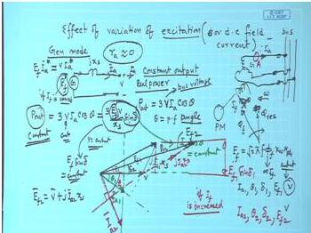

The phasor $jX_s\vec{I}_a$ is always perpendicular to $\vec{I}_a$. Starting with a given excitation that produces $E_0$, the phasor diagram is constructed: $\vec{V}$ is horizontal; from the tip of $\vec{V}$, subtract $\vec{E}$ to get $jX_s\vec{I}_a$ (or equivalently, $\vec{E} = \vec{V} - jX_s\vec{I}_a$). The current $\vec{I}_a$ lags or leads depending on the relative magnitude of $E$.

- **Under-excitation** ($|\vec{E}| < |\vec{V}|$): The motor draws a lagging current (positive $\phi$) and absorbs reactive power from the bus, behaving like an inductive load.
- **Normal excitation** ($|\vec{E}|$ adjusted such that $\vec{I}_a$ is in phase with $\vec{V}$): Armature current is minimum and the power factor is unity.
- **Over-excitation** ($|\vec{E}| > |\vec{V}|$): The motor draws a leading current (negative $\phi$), delivering reactive power to the bus, and operates like a capacitive load.

This behaviour yields the well-known **V-curves** ($I_a$ versus $I_f$) and **inverted V-curves** (power factor versus $I_f$) of a synchronous motor. Over-excited synchronous motors are widely used as **synchronous condensers** for power-factor correction.

> **Final answer:** At constant mechanical load, varying the field excitation changes only the reactive component of armature current; the real power remains fixed. The power factor can be controlled from lagging (under-excitation) to unity (normal excitation) to leading (over-excitation), making the synchronous motor a variable reactive power compensator.


---

## Question 86
**Topic:** Alternator armature reaction, voltage regulation, OCC/SCC and phasor diagrams · **Syllabus area:** Weeks 11-12 · **Source:** 3B | EM-II ELE 2202 End Sem, 24 April 2017

Along with necessary waveforms, discuss the behaviour of a three-phase alternator subjected to a symmetrical 3-phase short circuit. (03)

### Answer 86
When a three-phase alternator is subjected to a sudden symmetrical short circuit at its terminals, the armature current does not immediately attain its steady-state value. Instead, it passes through three distinct periods due to the presence of different magnetic circuits on the rotor (damper winding, field winding, and solid iron parts) that oppose sudden change in flux linkages.

### 1. Sub-transient Period
Immediately after the fault, the flux linkages in the damper winding and the field winding cannot change instantaneously. The effective reactance of the machine is the smallest, called the **sub-transient reactance** $X_d''$. The initial symmetrical rms current is
$$
I'' = \frac{E_f}{X_d''}
$$
where $E_f$ is the pre-fault induced emf. This period lasts only a few cycles (typically 2-3 cycles) and the current decays with a sub-transient time constant $T_d''$.

### 2. Transient Period
After the damper winding currents die out, the flux linkage in the field winding is still forced to remain constant. The effective reactance is now the **transient reactance** $X_d'$, which is larger than $X_d''$. The symmetrical rms current during this period is
$$
I' = \frac{E_f}{X_d'}
$$
This phase persists for a longer time (up to a second or more) and decays with the transient time constant $T_d'$.

### 3. Steady-State Period
Once the field transients have completely decayed, the armature current is limited only by the **synchronous reactance** $X_d$, which is the largest of the three. The steady-state short-circuit current is
$$
I_{ss} = \frac{E_f}{X_d}
$$
Since $X_d'' < X_d' < X_d$, it follows that $I'' > I' > I_{ss}$.

### Waveform of the Short-Circuit Current
The envelope of the ac component of the short-circuit current decays exponentially from the sub-transient value to the steady-state value. In addition, a dc offset appears in one or more phases depending on the instant of short circuit; this dc component decays with the armature time constant $T_a$. The complete phase current can be expressed as
$$
\begin{aligned}
i_{sc}(t) = \sqrt{2}E_f \biggl[ &\left(\frac{1}{X_d''} - \frac{1}{X_d'}\right) e^{-t/T_d''} \\
+ &\left(\frac{1}{X_d'} - \frac{1}{X_d}\right) e^{-t/T_d'} \\
+ &\frac{1}{X_d} \biggr] \sin(\omega t + \alpha) \\
- &\sqrt{2}E_f \frac{1}{X_d''} \sin\alpha \; e^{-t/T_a}
\end{aligned}
$$
where $\alpha$ is the switching angle. The resulting waveform is asymmetrical for the first few cycles and gradually becomes symmetrical.

### Phasor Diagram Under Short Circuit
With the terminals shorted, the terminal voltage $V = 0$. Neglecting armature resistance, the armature current lags the induced emf $E_f$ by $90^\circ$ and lies entirely along the d-axis ($I_q = 0$). If resistance $r_a$ is considered, the current lags by slightly less than $90^\circ$ and can be resolved into components $I_d$ and $I_q$. The corresponding phasor diagram is shown below.

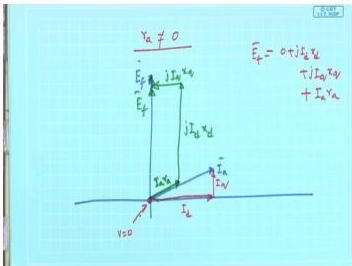
<small>**Figure:** Phasor diagram of an alternator during a symmetrical three-phase short circuit. The terminal voltage is zero; the armature current lags $E_f$ by an angle slightly less than $90^\circ$ when $r_a$ is not neglected.</small>

In summary, a sudden three-phase short circuit causes the armature current to pass through sub-transient, transient, and steady-state stages, with the current magnitude decaying as the effective reactance increases from $X_d''$ through $X_d'$ to $X_d$.

> **Final answer:** A sudden three-phase short circuit produces sub-transient, transient, and steady-state currents, with decaying amplitude and progressively increasing effective reactance.


---

## Question 87
**Topic:** Alternator armature reaction, voltage regulation, OCC/SCC and phasor diagrams · **Syllabus area:** Weeks 11-12 · **Source:** 3A | EM-II ELE 2202 End Sem, 29 April 2019

Describe the operation of alternator with constant excitation and variable load with suitable phasor diagrams. What is the significance of the condition with minimum excitation? Analyze the relation between power factor and excitation with the help of suitable curve. (05)

### Answer 87
## Alternator Performance Under Constant Excitation

### 1. Constant Excitation with Variable Load

When a synchronous generator operates with a fixed field current (constant excitation), the magnitude of the induced emf $E$ remains constant. As the load demands change, the armature current $I_a$ and the load angle $\delta$ adjust to balance the mechanical input and electrical output. Neglecting armature resistance $R_a$, the terminal voltage $V$ is related to $E$ by

$$
\vec{E} = \vec{V} + jX_s \vec{I}_a
$$

where $X_s$ is the synchronous reactance. The real power delivered to the bus (or load) is

$$
P = \frac{EV}{X_s} \sin\delta .
$$

The power factor (pf) of the load determines the phase of $I_a$ relative to $V$ and governs the armature reaction effect:
- **Lagging pf (inductive load):** $I_a$ lags $V$, producing a demagnetizing armature reaction. The terminal voltage drops with increasing load, giving positive voltage regulation. The phasor diagram (Figure 1) shows $E > V$ and $jX_s I_a$ adding directly to $V$.
- **Unity pf (resistive load):** $I_a$ is in phase with $V$. Armature reaction is mainly cross-magnetizing. Regulation is smaller because the reactive drop $X_s I_a$ is perpendicular to $V$.
- **Leading pf (capacitive load):** $I_a$ leads $V$, causing a magnetizing armature reaction. The terminal voltage may rise as load increases, resulting in negative regulation. In this case $E$ may be smaller than $V$.

The phasor diagrams for these three conditions are sketched in many textbooks; below is a detailed phasor diagram for a lagging power factor load that includes the armature reaction and leakage drops.

<figure>
  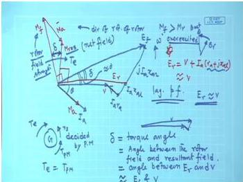
  <figcaption><b>Figure 1:</b> Phasor diagram of a synchronous generator operating at a lagging power factor. $E$ is the excitation emf, $V$ the terminal voltage, $I_a$ the armature current, and $jX_s I_a$ the synchronous reactance drop. Armature reaction demagnetizes the field, requiring a larger $E$ to maintain terminal voltage.</figcaption>
</figure>

### 2. Minimum Excitation - Stability Limit

For a constant real power $P$ and terminal voltage $V$, reducing the field current (excitation) decreases $E$. To keep $P$ constant, $\sin\delta$ must increase; thus $\delta$ increases. The maximum power that can be transmitted occurs at $\delta = 90^\circ$:

$$
P_{\text{max}} = \frac{EV}{X_s}.
$$

If the excitation is reduced further, $P_{\text{max}}$ falls below the required $P$, and the generator loses synchronism. Therefore, $\delta = 90^\circ$ defines the steady-state stability boundary. The minimum permissible excitation is the value that sets $\delta = 90^\circ$ for the given load. In practice, a stability margin of $20^\circ$-$30^\circ$ is maintained, with typical full-load $\delta$ in the range $30^\circ$-$40^\circ$. This limit also ensures that the machine operates well within the linear portion of the power-angle curve, avoiding the unstable region.

### 3. Power Factor vs. Excitation - V-Curves

The reactive power exchange of a synchronous generator is controlled by its excitation. For a fixed real power and terminal voltage, varying the field current changes the magnitude and phase of the armature current, hence the power factor. This behavior is summarized by the **V-curves** (armature current $I_a$ vs. field current $I_f$) or the **inverted V-curves** (power factor vs. $I_f$).

- **Under-excited** (low $I_f$): $E < V$, the machine absorbs reactive power (lagging pf). $I_a$ is large because it contains a reactive component.
- **Normal excitation**: $E$ is such that $I_a$ is in phase with $V$ (unity pf). The armature current is minimum for that real power.
- **Over-excited** (high $I_f$): $E > V$, the machine delivers reactive power (leading pf) to the system. $I_a$ increases again.

The relationship is illustrated in Figure 2. As excitation is increased from an under-excited state, the power factor moves from lagging to unity, and then to leading. This ability to supply or consume reactive power makes the synchronous generator a valuable tool for voltage regulation and power-factor correction in power systems.

<figure>
  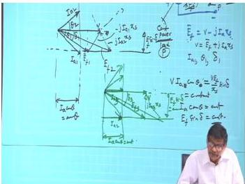
  <figcaption><b>Figure 2:</b> Typical V-curves (armature current vs. field current) for different constant real power levels. The minimum of each curve corresponds to unity power factor; the dashed line shows the stability limit. The corresponding power factor varies from lagging (left of minimum) to leading (right of minimum).</figcaption>
</figure>

> **Final answer:** Under constant excitation, load changes alter $I_a$, $\delta$, and the terminal voltage depending on pf; minimum excitation defines the stability boundary ($\delta = 90^\circ$); power factor varies from lagging to leading with excitation, as shown by the V-curves.


---

## Question 88
**Topic:** Alternator armature reaction, voltage regulation, OCC/SCC and phasor diagrams · **Syllabus area:** Weeks 11-12 · **Source:** 4B | EM-II ELE 2202 End Sem, 29 April 2019

A factory has an average load of 1000kW at a power factor of 0.6 lag. A synchronous motor of 86% efficiency is used later to supply an additional mechanical load of 65kW and also to improve the overall power factor to 0.92 lag. Determine the power factor at which the synchronous motor operates. Also comment on the type of excitation required for the synchronous motor for this application and draw the corresponding phasor diagram relating terminal voltage and excitation emf. (05)

### Answer 88
**Given:**
- Factory load: $P_1 = 1000~\text{kW}$ at power factor $0.6$ lagging.
- Synchronous motor: mechanical load $=65~\text{kW}$, efficiency $\eta = 0.86$.
- Desired overall power factor: $0.92$ lagging.

**Step 1: Initial factory reactive power**
$$
\phi_1 = \cos^{-1}(0.6) \approx 53.13^\circ,\quad Q_1 = P_1 \tan\phi_1 = 1000 \times \tan(53.13^\circ) = 1000 \times 1.333 = 1333.3~\text{kvar (lagging)}.
$$

**Step 2: Motor electrical input**
$$
P_m = \frac{\text{mechanical output}}{\eta} = \frac{65}{0.86} \approx 75.58~\text{kW}.
$$

**Step 3: Total active power and required total reactive power**
$$
P_{\text{total}} = P_1 + P_m = 1000 + 75.58 = 1075.58~\text{kW}.
$$
For overall pf $0.92$ lagging:
$$
\phi_{\text{total}} = \cos^{-1}(0.92) \approx 23.07^\circ,\quad
Q_{\text{total}} = P_{\text{total}} \tan\phi_{\text{total}} = 1075.58 \times \tan(23.07^\circ) = 1075.58 \times 0.426 \approx 458.2~\text{kvar (lagging)}.
$$

**Step 4: Motor reactive power**
$$
Q_m = Q_{\text{total}} - Q_1 = 458.2 - 1333.3 = -875.1~\text{kvar}.
$$
The negative sign indicates that the motor **supplies** 875.1 kvar leading reactive power (i.e., it draws a leading current from the supply).

**Step 5: Motor apparent power and power factor**
$$
S_m = \sqrt{P_m^2 + Q_m^2} = \sqrt{(75.58)^2 + (875.1)^2} = \sqrt{5712 + 765800} \approx \sqrt{771512} \approx 878.4~\text{kVA}.
$$
$$
\text{pf}_m = \frac{P_m}{S_m} = \frac{75.58}{878.4} \approx 0.086\text{ leading}.
$$

**Excitation requirement:** To operate at a leading power factor, the synchronous motor must be **over-excited**. In the over-excited condition, the field excitation is increased so that the excitation emf $E_f$ is greater than the terminal voltage $V$. The motor then draws a leading current and supplies reactive power to the system, acting as a **synchronous condenser**. This helps improve the overall power factor from 0.6 lag to 0.92 lag.

**Phasor diagram (leading power factor, over-excited synchronous motor):**
The phasor diagram (with motor consuming real power and supplying reactive power) is shown below. The terminal voltage $V$ is taken as reference. The armature current $I_a$ leads $V$ by the large angle $\phi_m \approx \cos^{-1}(0.086) \approx 85.1^\circ$. The excitation emf $E_f$ leads $V$ and is larger in magnitude due to over-excitation. The phasor sum $V = E_f + I_a(R_a + jX_s)$ holds (or equivalently $E_f = V - I_a(R_a + jX_s)$). For a leading power factor, $E_f$ is ahead of $V$ by the load angle $\delta$.

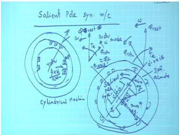
<figcaption>Figure: Phasor diagram of an over-excited synchronous motor showing terminal voltage V, excitation EMF E_f, and armature current I_a leading V.</figcaption>

> **Final answer:** The synchronous motor operates at a power factor of **0.086 leading** and must be **over-excited**.


---

## Question 89
**Topic:** Alternator armature reaction, voltage regulation, OCC/SCC and phasor diagrams · **Syllabus area:** Weeks 11-12 · **Source:** 5A | EM-II ELE 2202 Makeup, 02 July 2016

A 3.3 kV, 3 phase, 50 Hz, 4 pole star connected synchronous motor has a synchronous impedance of 0.2 + j 3 Ω per phase. For an input current of 200A at 0.9 p.f lag, determine the maximum gross power and torque developed. 5M

### Answer 89
First, calculate per-phase values:
$$
V_{ph} = \frac{3300}{\sqrt{3}} = 1905.3\ \text{V}
$$
Synchronous impedance per phase:
$$
Z_s = 0.2 + j3\ \Omega,\quad |Z_s| = \sqrt{0.2^2 + 3^2} = 3.0067\ \Omega,\quad \theta = \arctan\frac{3}{0.2} = 86.19^\circ
$$
Given armature current $I_a = 200\ \text{A}$ at 0.9 pf lagging, so current phase angle:
$$
\phi = \arccos 0.9 = 25.84^\circ\ \text{lag},\quad \mathbf{I}_a = 200\angle -25.84^\circ\ \text{A}
$$
Taking terminal voltage as reference, $\mathbf{V} = 1905.3\angle 0^\circ\ \text{V}$.

**Determination of Excitation emf $E_f$**  
From the synchronous motor equivalent circuit (Fig. 1), the phasor equation is $\mathbf{V} = \mathbf{E}_f + \mathbf{I}_a Z_s$. Thus,
$$
\mathbf{E}_f = \mathbf{V} - \mathbf{I}_a Z_s
$$
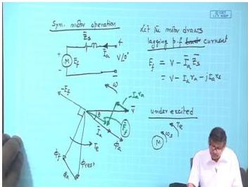  
*Fig. 1: Synchronous motor equivalent circuit and phasor diagram.*

Compute the impedance drop:
$$
\begin{aligned}
\mathbf{I}_a Z_s &= 200\angle -25.84^\circ \times 3.0067\angle 86.19^\circ \\
&= 601.3\angle 60.35^\circ\ \text{V} \\
&= 601.3\,(\cos 60.35^\circ + j\sin 60.35^\circ) \\
&\approx 297.6 + j522.7\ \text{V}
\end{aligned}
$$
Therefore,
$$
\begin{aligned}
\mathbf{E}_f &= 1905.3 - (297.6 + j522.7) \\
&= 1607.7 - j522.7\ \text{V} \\
|\mathbf{E}_f| &= \sqrt{1607.7^2 + 522.7^2} \approx 1690.5\ \text{V} \\
\delta &= \arctan\frac{522.7}{1607.7} \approx 18.0^\circ \quad (\text{lagging})
\end{aligned}
$$

**Gross Mechanical Power Expression**  
The gross mechanical power developed per phase is the real part of the power delivered by the excitation emf:
$$
P_{g,\text{ph}} = \operatorname{Re}(\mathbf{E}_f \mathbf{I}_a^*)
$$
Since $\mathbf{I}_a = (\mathbf{V} - \mathbf{E}_f)/Z_s$, substituting yields the general power formula for a cylindrical-rotor synchronous motor:
$$
P_{g,\text{ph}} = \frac{E_f V}{|Z_s|} \cos(\theta - \delta) - \frac{E_f^2}{|Z_s|} \cos\theta
$$
where $\theta$ is the impedance angle and $\delta$ the load angle (angle by which $E_f$ lags $V$).

For fixed excitation $E_f$ (and constant $V$), $P_g$ varies with $\delta$. The maximum occurs when $\cos(\theta - \delta) = 1$, i.e., when
$$
\delta = \theta = 86.19^\circ
$$
This is the pull-out condition. The corresponding maximum power per phase is:
$$
P_{g,\max}^{\text{ph}} = \frac{E_f V}{|Z_s|} - \frac{E_f^2}{|Z_s|} \cos\theta
$$
and for three phases:
$$
P_{g,\max} = 3\left( \frac{E_f V}{|Z_s|} - \frac{E_f^2}{|Z_s|} \cos\theta \right)
$$

**Numerical Evaluation**  
Using $E_f = 1690.5\ \text{V}$, $V = 1905.3\ \text{V}$, $|Z_s| = 3.0067\ \Omega$, and $\cos\theta = \frac{0.2}{3.0067} = 0.0665$:
$$
\begin{aligned}
P_{g,\max} &= 3\left( \frac{1690.5 \times 1905.3}{3.0067} - \frac{1690.5^2 \times 0.2}{3.0067^2} \right) \\
&\approx 3\left( 1.071\times 10^6 - 0.0632\times 10^6 \right) \\
&\approx 3.024 \times 10^6\ \text{W} = 3.024\ \text{MW}
\end{aligned}
$$

**Torque Calculation**  
Synchronous speed for a 4-pole, 50 Hz motor:
$$
N_s = \frac{120\,f}{P} = \frac{120 \times 50}{4} = 1500\ \text{rpm}
$$
Angular speed:
$$
\omega_s = \frac{2\pi N_s}{60} = \frac{2\pi \times 1500}{60} = 157.08\ \text{rad/s}
$$
Maximum gross torque:
$$
T_{\max} = \frac{P_{g,\max}}{\omega_s} = \frac{3.024 \times 10^6}{157.08} \approx 19.25 \times 10^3\ \text{N·m}
$$

> **Final answer:** Maximum gross power $= 3.024\ \text{MW}$; maximum gross torque $= 19.25\ \text{kN·m}$.


---

## Question 90
**Topic:** Alternator armature reaction, voltage regulation, OCC/SCC and phasor diagrams · **Syllabus area:** Weeks 11-12 · **Source:** 2C | EM-II ELE 2202 Makeup, 13 June 2019

A 3-phase, star connected alternator is rated 1,600 kVA, 13.5 kV. Its per-phase effective armature resistance & synchronous reactance are 1 & 40 respectively. a) Calculate the percentage voltage regulation for a load of 1,250 kW at 0.8 pf lagging. b) Draw the phasor diagram for the given load. (03)

### Answer 90
Load kVA $= \frac{1250}{0.8} = 1562.5\ \text{kVA}$.

Phase current:
$$I_{ph} = \frac{1562.5 \times 10^3}{\sqrt{3} \times 13500} = 66.82\ \text{A}$$

Phase voltage:
$$V_{ph} = \frac{13500}{\sqrt{3}} = 7794\ \text{V}$$

For a cylindrical-rotor synchronous generator, the per-phase equivalent circuit gives:
$$\vec{E}_f = \vec{V}_{ph} + \vec{I}_a(R_a + jX_s)$$
with $R_a = 1\ \Omega$, $X_s = 40\ \Omega$, power factor $\cos\phi = 0.8$ lagging $\Rightarrow \phi = 36.87^\circ$.

Taking $\vec{V}_{ph}$ as reference ($\angle 0^\circ$):
$$\vec{I}_a = 66.82\angle -36.87^\circ\ \text{A}$$

Impedance drop:
$$\vec{I}_a Z_s = 66.82\angle -36.87^\circ \times (1 + j40) = 66.82\angle -36.87^\circ \times 40.0125\angle 88.57^\circ$$
$$= 2673\angle 51.7^\circ = 1656 + j2098\ \text{V}$$

Hence,
$$\vec{E}_f = 7794 + 1656 + j2098 = 9450 + j2098\ \text{V}$$
$$|\vec{E}_f| = \sqrt{9450^2 + 2098^2} \approx 9681.5\ \text{V}$$
Load angle $\delta = \tan^{-1}\left(\frac{2098}{9450}\right) \approx 12.52^\circ$.

**Percentage voltage regulation:**
$$
\%\text{Reg} = \frac{E_f - V_{ph}}{V_{ph}} \times 100 = \frac{9681.5 - 7794}{7794} \times 100 \approx 24.21\%
$$

**Phasor diagram (lagging pf):**
- Draw $\vec{V}_{ph}$ horizontally.
- Draw $\vec{I}_a$ lagging by $36.87^\circ$.
- Add $\vec{I}_aR_a$ in phase with $\vec{I}_a$.
- From its tip, add $\vec{I}_aX_s$ leading $\vec{I}_a$ by $90^\circ$.
- The resultant from the origin is $\vec{E}_f$, leading $\vec{V}_{ph}$ by the load angle $\delta$.


<p align="center"><i>Generator phasor diagram for lagging load (Source: IIT Kharagpur NPTEL)</i></p>

> **Final answer:** Voltage regulation $= 24.21\%$.


---

## Question 91
**Topic:** Alternator armature reaction, voltage regulation, OCC/SCC and phasor diagrams · **Syllabus area:** Weeks 11-12 · **Source:** 3B | EM-II ELE 2202 Makeup, 13 June 2019

Explain the effect of load power factor on armature reaction in alternators. (03)

### Answer 91
Armature reaction is the influence of the armature current's magnetomotive force (mmf) on the main field flux of an alternator. When the alternator is loaded, the armature current $I_a$ produces its own mmf $\mathcal{F}_a$ (or $M_a$), which combines vectorially with the field mmf $\mathcal{F}_f$ to produce a resultant mmf $\mathcal{F}_r$. This resultant mmf establishes the net air-gap flux that actually induces the terminal voltage. The nature and magnitude of this interaction depend critically on the load power factor.

- **Unity power factor (resistive load):**  
  The armature current is in phase with the induced emf $E_f$. Since $E_f$ lags the field flux $\phi_f$ by 90°, the armature mmf $\mathcal{F}_a$ (in phase with $I_a$) is in space quadrature with the field mmf. This **cross-magnetising** effect distorts the flux distribution (strengthening one tip and weakening the other), but the average flux magnitude remains almost unchanged. Consequently, the terminal voltage drops only slightly due to the small leakage reactance and resistance drops.

- **Lagging power factor (inductive load):**  
  The armature current lags the induced emf by the power factor angle $\theta$. The mmf $\mathcal{F}_a$ now has a component that directly opposes the field mmf $\mathcal{F}_f$. This **demagnetising** armature reaction weakens the net air-gap flux, causing a significant reduction in the induced emf and hence a larger drop in terminal voltage. In phasor diagrams, $E_f$ must be larger than $V_t$ to overcome the demagnetising effect.

- **Leading power factor (capacitive load):**  
  The armature current leads the induced emf. The armature mmf has a component that aids the field mmf. This **magnetising** armature reaction increases the net flux, so the induced emf rises and may even make the terminal voltage higher than the open-circuit value. Here $E_f$ can be smaller than $V_t$.

These effects are clearly illustrated by the EMF-MMF (Blondel) diagram, where the resultant mmf $\mathcal{F}_r$ is the phasor sum of $\mathcal{F}_f$ and $\mathcal{F}_a$. For a lagging load, $\mathcal{F}_r$ is smaller than $\mathcal{F}_f$; for a leading load, it is larger. The phasor diagram below shows the relationship for a lagging power factor, with $V_t$ as reference, $I_a$ lagging, and the drops added to obtain $E_f$. The angle $\delta$ between $E_f$ and $V_t$ is the load (or power) angle.


> **Final answer:** Lagging pf → demagnetising (voltage drop); unity pf → cross-magnetising (small drop); leading pf → magnetising (voltage rise).


---

## Question 92
**Topic:** Alternator armature reaction, voltage regulation, OCC/SCC and phasor diagrams · **Syllabus area:** Weeks 11-12 · **Source:** 4B | EM-II ELE 2202 Makeup, 13 June 2019

A 1000 kW, 3.3 kV, 24 pole, 50Hz, 3-phase star connected synchronous motor has synchronous reactance of 3.4 Ω per phase and the resistance is negligible. The motor is fed from infinite bus bar at 3.3kV. Its field excitation is adjusted to result in upf operation at rated load. Compute the maximum power and torque that the motor can deliver with its excitation remains constant at this value. (05)

### Answer 92
The motor is rated 1000 kW, 3.3 kV, 24-pole, 50 Hz, star-connected, with synchronous reactance $X_s = 3.4\ \Omega$ per phase and negligible resistance. It is supplied from an infinite bus at 3.3 kV.

**1. Per-phase terminal voltage**

$$
V_{ph} = \frac{V_L}{\sqrt{3}} = \frac{3300}{\sqrt{3}} \approx 1905.3\ \text{V}.
$$

**2. Rated current at unity power factor**

At rated load and unity power factor ($\cos\varphi = 1$), the line current is

$$
I_a = \frac{P}{\sqrt{3}\,V_L \cos\varphi} = \frac{1000 \times 10^3}{\sqrt{3} \times 3300 \times 1} \approx 174.95\ \text{A}.
$$

**3. Excitation EMF (internal voltage $E$)**

For a cylindrical-rotor synchronous motor with $R_a \approx 0$, the per-phase phasor equation is

$$
\dot{V} = \dot{E} + j X_s \dot{I}_a \quad \Rightarrow \quad \dot{E} = \dot{V} - j X_s \dot{I}_a.
$$

Taking terminal voltage as reference ($\dot{V} = V_{ph}\angle 0^\circ$) and with unity power factor (**I** is in phase with **V**),

$$
\dot{E} = 1905.3 - j(3.4 \times 174.95) = 1905.3 - j594.83\ \text{V}.
$$

$$
E = |\dot{E}| = \sqrt{1905.3^2 + 594.83^2} \approx 1996.0\ \text{V},
\qquad
\delta = \arctan\!\left(\frac{594.83}{1905.3}\right) \approx 17.34^\circ \ (\text{motoring, } E \text{ lags } V).
$$

The field current is now kept constant, so $E = 1996.0\ \text{V}$ remains fixed.

**4. Maximum power (pull-out power)**

For a non-salient-pole machine, the three-phase power is

$$
P = \frac{3\,V_{ph} E}{X_s} \sin\delta.
$$

Maximum power occurs at $\delta = 90^\circ$:

$$
P_{\max} = \frac{3\,V_{ph} E}{X_s} = \frac{3 \times 1905.3 \times 1996.0}{3.4} \approx 3.355 \times 10^6\ \text{W} = 3.355\ \text{MW}.
$$


*Figure: Power-angle curve and motor phasor diagram. The peak of the sine wave gives $P_{\max}$.*

**5. Synchronous speed and maximum torque**

Synchronous speed:

$$
N_s = \frac{120 f}{P} = \frac{120 \times 50}{24} = 250\ \text{rpm},
\qquad
\omega_s = \frac{2\pi N_s}{60} = \frac{2\pi \times 250}{60} \approx 26.18\ \text{rad/s}.
$$

Maximum electromagnetic torque:

$$
T_{\max} = \frac{P_{\max}}{\omega_s} = \frac{3.355 \times 10^6}{26.18} \approx 128.17 \times 10^3\ \text{N·m} = 128.17\ \text{kN·m}.
$$

> **Final answer:**
> Maximum power: **3.355 MW**  
> Maximum torque: **128.17 kN·m**


---

## Question 93
**Topic:** Alternator armature reaction, voltage regulation, OCC/SCC and phasor diagrams · **Syllabus area:** Weeks 11-12 · **Source:** 3C | EM-II ELE 2202 Makeup, 16 June 2017

Explain the effect of load power factor on armature reaction in alternators. (03)

### Answer 93
Armature reaction is the influence of the armature current mmf ($M_a$) on the main field flux ($\Phi_f$) of an alternator. The nature of this interaction depends primarily on the phase relationship between the armature current $I_a$ and the induced emf $E_f$, which in turn is governed by the load power factor. In a synchronous generator, the armature mmf wave rotates synchronously with the field, but its position relative to the field poles shifts with the power factor, leading to cross-magnetising, demagnetising, or magnetising effects.

- **Unity power factor:** When the generator supplies a purely resistive load, $I_a$ is almost in phase with the terminal voltage $V_t$ but lags $E_f$ by a small angle (the load angle). The armature mmf $M_a$ (which is in phase with $I_a$) is then largely in space quadrature with the main field mmf $M_f$. This produces a **cross-magnetising** effect: it distorts the flux distribution, strengthening the flux on one pole tip and weakening it on the other, but the average flux per pole remains nearly unchanged. As a result, the terminal voltage does not vary significantly from no-load.

- **Lagging power factor (inductive load):** With an inductive load, $I_a$ lags $V_t$ by the power factor angle $\phi$. The phase of $I_a$ (and hence $M_a$) is such that a component of the armature mmf directly opposes $M_f$ along the direct axis. This **demagnetising** component reduces the resultant air-gap flux, causing a pronounced drop in terminal voltage under load. The greater the lagging current, the stronger the demagnetisation.

- **Leading power factor (capacitive load):** For a capacitive load, $I_a$ leads $V_t$. The armature mmf $M_a$ now has a component that aids $M_f$, producing a **magnetising** effect. The net flux increases, and the terminal voltage may rise above the no-load value. Heavy leading loads can even cause over-voltage.

These phenomena are clearly represented in the Blondel (EMF-MMF) phasor diagram of the round-rotor alternator. In this diagram, the field mmf $M_f$ is drawn 90° ahead of $E_f$, and the armature reaction mmf $M_a$ is added vectorially in phase with $I_a$. The resultant mmf $M_r = M_f + M_a$ determines the actual air-gap flux, and its magnitude relative to $M_f$ reveals whether the armature reaction is demagnetising, cross-magnetising, or magnetising.


*Figure: Phasor diagram of a round-rotor alternator supplying a lagging power factor load. The armature current $I_a$ lags the terminal voltage $V_t$, and the armature reaction mmf $M_a$ (in phase with $I_a$) opposes the field mmf $M_f$, resulting in a smaller resultant $M_r$ and a lower induced emf $E_r$. For leading loads, $M_a$ shifts to aid $M_f$, increasing the resultant flux.*

> **Final answer:** Lagging load - demagnetising (voltage drop); unity load - cross-magnetising (voltage almost constant); leading load - magnetising (voltage rise).


---

## Question 94
**Topic:** Alternator armature reaction, voltage regulation, OCC/SCC and phasor diagrams · **Syllabus area:** Weeks 11-12 · **Source:** 5B | EM-II ELE 2202 Makeup, 16 June 2017

A 1000 kW, 3.3 kV, 24 pole, 50Hz, 3-phase star connected synchronous motor has synchronous reactance of 3.4 Ω per phase and the resistance is negligible. The motor is fed from infinite bus bar at 3.3kV. Its field excitation is adjusted to result in upf operation at rated load. Compute the maximum power and torque that the motor can deliver with its excitation remains constant at this value. (05)

### Answer 94
**Given:** A 1000 kW, 3.3 kV, 24-pole, 50 Hz, 3-phase star-connected synchronous motor. Per-phase synchronous reactance $X_s = 3.4\ \Omega$, armature resistance $R_a \approx 0$. The motor is fed from an infinite bus at $3.3\ \text{kV}$, and its field excitation is adjusted to give unity power factor operation at rated (full) load. The excitation is then held constant.

**1. Rated armature current and phase voltage**

For rated load at upf,
$$ \begin{aligned} I_a &= \frac{P_{\text{rated}}}{\sqrt{3}\,V_L} = \frac{1000 \times 10^3}{\sqrt{3} \times 3300} \approx 174.95\ \text{A} \\ V_{ph} &= \frac{V_L}{\sqrt{3}} = \frac{3300}{\sqrt{3}} \approx 1905.26\ \text{V}. \end{aligned} $$

**2. Excitation emf $E$ under rated upf condition**

With negligible resistance, the per-phase phasor equation for a synchronous motor is
$$ \vec{V} = \vec{E} + j I_a X_s, $$
with $\vec{V}$ as reference ($0^\circ$). For upf, $\vec{I}_a$ is in phase with $\vec{V}$, hence
$$ \vec{E} = V_{ph} - j I_a X_s = 1905.26 - j\,3.4 \times 174.95 = 1905.26 - j\,594.83\ \text{V}. $$
Magnitude:
$$ E = \sqrt{(1905.26)^2 + (594.83)^2} \approx 1995.96\ \text{V}. $$
The load angle (angle by which $E$ lags $V$) is $\delta \approx 17.34^\circ$.

Since the field current is kept constant, the magnitude $E$ remains $1996\ \text{V}$ for any subsequent load change.

<figure>

<figcaption>Figure: Phasor diagram and power-angle characteristic of a cylindrical-rotor synchronous motor (textbook p. 766).</figcaption>
</figure>

**3. Maximum power (pull-out power)**

For a cylindrical-rotor synchronous motor, the three-phase real power (ignoring $R_a$) is given by the power-angle equation:
$$ P = \frac{3\,V_{ph}\,E}{X_s}\,\sin\delta. $$
The maximum power occurs when $\delta = 90^\circ$ ( $\sin\delta = 1$ ):
$$ P_{\max} = \frac{3\,V_{ph}\,E}{X_s} = \frac{3 \times 1905.26 \times 1995.96}{3.4} \approx 3.355 \times 10^6\ \text{W} = 3.355\ \text{MW}. $$

**4. Maximum torque**

Synchronous speed:
$$ N_s = \frac{120\,f}{p} = \frac{120 \times 50}{24} = 250\ \text{rpm}, $$
angular speed:
$$ \omega_s = \frac{2\pi N_s}{60} = \frac{2\pi \times 250}{60} \approx 26.18\ \text{rad/s}. $$
Maximum torque (pull-out torque) is therefore:
$$ T_{\max} = \frac{P_{\max}}{\omega_s} = \frac{3.355 \times 10^6}{26.18} \approx 1.2817 \times 10^5\ \text{N·m} = 128.17\ \text{kN·m}. $$

> **Final answer:** Maximum power $= 3.355\ \text{MW}$; Maximum torque $= 128.17\ \text{kN·m}$.


---

## Question 95
**Topic:** Alternator armature reaction, voltage regulation, OCC/SCC and phasor diagrams · **Syllabus area:** Weeks 11-12 · **Source:** 2A | EM-II ELE 2225 End Sem, 09 May 2024

A 3-phase, star-connected alternator is rated at 1,600 kVA, 13.5 kV. Its per- phase effective armature resistance & synchronous reactance are 1Ω & 40Ω respectively. a) Calculate the percentage voltage regulation for a load of 1,250 kW at 0.8 pf lagging. b) Draw the phasor diagram for the given load condition. c) Suggest a method to improve the voltage regulation, without any active power loading. 4

### Answer 95
a) Calculation of percentage voltage regulation.

Step 1: Compute phase voltage and current.

- Rated line voltage $V_L = 13.5\,\text{kV}$, star connection ⇒ phase voltage $V_\text{ph} = \frac{13500}{\sqrt{3}} = 7794.2\,\text{V}$.
- Load real power $P = 1250\,\text{kW}$, power factor $\cos\phi = 0.8$ lagging ⇒ $\phi = \cos^{-1}0.8 = 36.87^\circ$.
- Apparent power $S = \frac{P}{\cos\phi} = \frac{1250}{0.8} = 1562.5\,\text{kVA}$.
- Line current $I_L = \frac{S}{\sqrt{3}V_L} = \frac{1562.5\times10^3}{\sqrt{3}\times13500} = 66.82\,\text{A}$. For star, $I_\text{ph} = I_L = 66.82\,\text{A}$.

Step 2: Phasor equation.

The alternator's per-phase equivalent circuit gives:
$$
\mathbf{E} = \mathbf{V} + \mathbf{I}(R_a + jX_s)
$$
where $R_a = 1\,\Omega$, $X_s = 40\,\Omega$, and $\mathbf{V} = 7794.2\angle 0^\circ$ V (taken as reference). The current lags by $\phi$:
$$
\mathbf{I} = 66.82\angle -36.87^\circ\ \text{A}.
$$

The synchronous impedance is
$$
\mathbf{Z}_s = R_a + jX_s = 1 + j40 \approx 40.012\angle 88.57^\circ\ \Omega.
$$

Hence,
$$
\mathbf{I}\mathbf{Z}_s = 66.82\angle -36.87^\circ \times 40.012\angle 88.57^\circ = 2673.6\angle 51.70^\circ\ \text{V}.
$$

Step 3: Compute $\mathbf{E}$.

Convert $\mathbf{I}\mathbf{Z}_s$ to rectangular form:
$$
\begin{aligned}
\mathbf{I}\mathbf{Z}_s &= 2673.6(\cos51.70^\circ + j\sin51.70^\circ) \\
&= 2673.6(0.6196 + j0.7849) \\
&= 1656.2 + j2098.8\ \text{V}.
\end{aligned}
$$

Adding $\mathbf{V}$:
$$
\begin{aligned}
\mathbf{E} &= (7794.2 + j0) + (1656.2 + j2098.8) \\
&= 9450.4 + j2098.8\ \text{V}.
\end{aligned}
$$

Magnitude:
$$
E = |\mathbf{E}| = \sqrt{9450.4^2 + 2098.8^2} \approx 9681.6\ \text{V}.
$$

Load angle:
$$
\delta = \tan^{-1}\left(\frac{2098.8}{9450.4}\right) \approx 12.52^\circ.
$$

Step 4: Voltage regulation.

$$
\%\text{Reg} = \frac{E - V_\text{ph}}{V_\text{ph}} \times 100 = \frac{9681.6 - 7794.2}{7794.2} \times 100 \approx 24.2\%.
$$

b) Phasor diagram.

A phasor diagram for a synchronous generator delivering a lagging power factor load is constructed as follows:

- Draw the terminal voltage $\mathbf{V}$ horizontally (reference phasor).
- Draw the armature current $\mathbf{I}$ lagging $\mathbf{V}$ by the power factor angle $\phi = 36.87^\circ$.
- From the tip of $\mathbf{V}$, draw the resistive drop $\mathbf{I}R_a$ parallel to $\mathbf{I}$.
- From the tip of $\mathbf{I}R_a$, draw the synchronous reactance drop $j\mathbf{I}X_s$ perpendicular to $\mathbf{I}$ (leading $\mathbf{I}$ by $90^\circ$).
- The phasor from the origin to the tip of $j\mathbf{I}X_s$ is the generated EMF $\mathbf{E}$.
- The angle $\delta$ between $\mathbf{E}$ and $\mathbf{V}$ is the load (power) angle.

Figure below illustrates the complete phasor diagram for a generator operating with lagging power factor (the textbook image captures all the relevant phasors).


c) Improving voltage regulation without changing active power.

Voltage regulation deteriorates mainly because of the reactive drop $I X_s$. To improve regulation while keeping the active power constant, the lagging reactive power drawn by the load must be compensated locally. This can be done by injecting leading reactive power at the machine terminals. Practical methods include:

- Connecting a shunt capacitor bank across the load or at the machine terminals.
- Operating an over-excited synchronous motor (synchronous condenser) in parallel with the load.

Both methods supply leading VARs that cancel a portion of the lagging VARs, thereby reducing the armature current and the $I X_s$ drop, and consequently lowering the voltage rise from no-load to full-load, i.e., improving voltage regulation.

> **Final answer:** Voltage regulation $= 24.2\%$; compensation by leading VAR injection (capacitors or over-excited synchronous motor).


---

## Question 96
**Topic:** Alternator armature reaction, voltage regulation, OCC/SCC and phasor diagrams · **Syllabus area:** Weeks 11-12 · **Source:** 1A | EM-II ELE 2225 Makeup, 26 June 2024

With the aid of EMF-MMF diagram, explain the effect of armature reaction when an alternator is connected to (a) capacitive load (b) Inductive load (c) Lagging load 3

### Answer 96
Armature reaction is the effect of the armature-current mmf on the main field flux. In a cylindrical-rotor alternator, the EMF-MMF (Blondel) diagram provides a clear picture. The resultant mmf $F_r$ in the air gap is the vector sum of the field mmf $F_f$ and the armature-reaction mmf $F_a$:
$$
\mathbf{F}_r = \mathbf{F}_f + \mathbf{F}_a
$$
The induced emf $E$ (or $E_f$) is proportional to $F_r$ and lags it by 90°, while the terminal voltage $V$ differs by the internal impedance drops.


- **(a) Capacitive (leading) load:** The armature current $I_a$ leads the terminal voltage $V$. $F_a$ (in phase with $I_a$) has a component aiding $F_f$, producing a magnetising effect. The net flux increases, causing the terminal voltage to rise. On the diagram $F_r$ is larger than $F_f$.
- **(b) Inductive (lagging) load:** $I_a$ lags $V$. $F_a$ opposes $F_f$ (demagnetising). The net flux decreases and the terminal voltage drops; $F_r$ is smaller than $F_f$.
- **(c) Lagging load:** This is essentially the same as an inductive load; the armature reaction is demagnetising.

In all cases the magnitude and phase of $F_a$ depend on the load current and its power factor. The induced emf is determined by $F_r$ via the magnetisation characteristic.

> **Final answer:** Capacitive load - magnetising (voltage rise); inductive/lagging load - demagnetising (voltage drop); unity pf - cross-magnetising (small drop).


---

## Question 97
**Topic:** Alternator armature reaction, voltage regulation, OCC/SCC and phasor diagrams · **Syllabus area:** Weeks 11-12 · **Source:** 2A | EM-II ELE 2251 End Sem, 31 May 2023

Assume a purely resistive load connected across the terminals of an alternator. Will the voltage regulation of the alternator be zero? Justify your answer. (02)

### Answer 97
No, the voltage regulation of the alternator will **not** be zero under a purely resistive load. Voltage regulation is defined as

$$
\text{Regulation} = \frac{|E| - |V|}{|V|} \times 100\%,
$$

where $E$ is the no-load induced emf (per phase) and $V$ is the full-load terminal voltage (per phase). For a generator, the phasor equation is

$$
\vec{E} = \vec{V} + \vec{I}_a (R_a + jX_s).
$$

Here $R_a$ is the armature resistance and $X_s$ is the synchronous reactance (leakage + armature reaction). Even when the load is purely resistive, so that $\vec{I}_a$ is in phase with $\vec{V}$, the drop $j\vec{I}_a X_s$ is in quadrature with $\vec{I}_a$ and therefore with $\vec{V}$. The resistance drop $I_a R_a$ adds directly in phase with $\vec{V}$. Consequently, the magnitude of $\vec{E}$ is given by

$$
|\vec{E}| = \sqrt{ (V + I_a R_a)^2 + (I_a X_s)^2 }.
$$

As long as $I_a>0$, the term under the square root is larger than $V^2$, so $|E| > |V|$. Hence the regulation is positive.

Zero regulation can occur only at a specific leading power factor where the capacitive effect of a leading current boosts the terminal voltage sufficiently to cancel the internal drops. For a resistive load, however, the reactive drop always reduces the terminal voltage relative to the generated emf.

> **Final answer:** Voltage regulation is **not zero** for a purely resistive load; $|E| > |V|$ because of the quadrature drop $jI_a X_s$ and the in-phase drop $I_a R_a$, giving a positive regulation.


---

## Question 98
**Topic:** Alternator armature reaction, voltage regulation, OCC/SCC and phasor diagrams · **Syllabus area:** Weeks 11-12 · **Source:** 3C | EM-II ELE 2251 End Sem, 31 May 2023

A 3-phase cylindrical rotor alternator operating in a captive plant has a rating of 80 kVA, 440 V. This alternator is supplying power to a drive system at a rated current and 0.75 lagging power factor. Consider an armature resistance of 0.25 Ω per phase and a synchronous reactance of 3.2 ohms per phase. Determine the voltage regulation. (03)

### Answer 98
**Given:** 3-phase, 80 kVA, 440 V (L-L), 0.75 pf lagging, $R_a = 0.25\ \Omega/\text{phase}$, $X_s = 3.2\ \Omega/\text{phase}$.

**Step 1: Rated current**
$$
I_a = \frac{80\,000}{\sqrt{3}\times 440} = 104.97\ \text{A}
$$

**Step 2: Phase voltage (star connection assumed)**
$$
V_{ph} = \frac{440}{\sqrt{3}} \approx 254.03\ \text{V}
$$

**Step 3: Power factor angle**
$$
\phi = \cos^{-1}(0.75) = 41.41^\circ\ (\text{lagging})
$$

**Step 4: Synchronous impedance**
$$
Z_s = R_a + jX_s = 0.25 + j3.2\ \Omega,\quad |Z_s| = \sqrt{0.25^2 + 3.2^2} = 3.21\ \Omega,\quad \angle Z_s = \tan^{-1}\!\left(\frac{3.2}{0.25}\right) = 85.53^\circ
$$

**Step 5: Phasor diagram and excitation emf**
With terminal voltage as reference: $\vec{V}_{ph} = 254\angle 0^\circ\ \text{V}$ and armature current $\vec{I}_a = 104.97\angle -41.41^\circ\ \text{A}$.

For a cylindrical rotor alternator (generator mode),
$$
\vec{E}_f = \vec{V}_{ph} + \vec{I}_a Z_s
$$

  
*Figure: Phasor diagram showing $V$, $I_a$, and the voltage drops across $R_a$ and $X_s$ to obtain $E_f$.*

$$
\begin{aligned}
\vec{I}_a Z_s &= (104.97\angle -41.41^\circ)(3.21\angle 85.53^\circ) \\
&= 336.9\angle 44.12^\circ\ \text{V}
\end{aligned}
$$

Converting to rectangular coordinates:
$$
\begin{aligned}
\vec{V}_{ph} &= 254 + j0 \\
\vec{I}_a Z_s &= 336.9(\cos 44.12^\circ + j\sin 44.12^\circ) \approx 241.9 + j234.5 \\
\therefore \vec{E}_f &= (254 + 241.9) + j234.5 = 495.9 + j234.5
\end{aligned}
$$

Magnitude of excitation emf:
$$
|\vec{E}_f| = \sqrt{495.9^2 + 234.5^2} \approx 548.6\ \text{V}
$$

**Step 6: Voltage regulation**
$$
\%\text{Regulation} = \frac{|\vec{E}_f| - V_{ph}}{V_{ph}} \times 100 = \frac{548.6 - 254.03}{254.03} \times 100 \approx 115.95\%
$$

> **Final answer:** Voltage regulation $= 115.95\%$.


---

## Question 99
**Topic:** Alternator armature reaction, voltage regulation, OCC/SCC and phasor diagrams · **Syllabus area:** Weeks 11-12 · **Source:** 4A | EM-II ELE 2251 End Sem, 31 May 2023

"V" and "inverted V" curves have significant importance in analyzing the behavior of synchronous machines. Justify this statement suitably. Describe the operation of alternator with constant excitation and variable load with suitable phasor diagrams. What is the significance of the condition with minimum excitation? Analyze the relation between power factor and excitation with the help of a suitable curve. (04)

### Answer 99
**Justification of V and inverted-V curves**
The V-curves (armature current $I_a$ vs field current $I_f$) and inverted V-curves ($\cos\phi$ vs $I_f$) for a synchronous machine operating at constant terminal voltage and constant real power are fundamental tools because they directly reveal the effect of excitation on the machine's electrical performance. For a synchronous motor (or generator), as $I_f$ is increased from a low value, $I_a$ first decreases, reaches a minimum at unity power factor, and then increases-forming a V-shaped locus. Simultaneously, the power factor moves from lagging (under-excited) through unity to leading (over-excited), producing an inverted V-curve. These curves are essential for:  
- Selecting the field current that minimises armature copper loss ($I_a^2R_a$).  
- Controlling the reactive power exchange with the grid (kVAR generation or absorption).  
- Operating the machine as a synchronous condenser (at zero real power, controlling only reactive power).  
- Setting excitation margins to avoid pull-out (loss of synchronism).

**Alternator operation at constant excitation and variable load**  
Consider a three-phase cylindrical-rotor alternator connected to an infinite bus (constant voltage $V$ and frequency). The field current $I_f$ is held constant, so the magnitude of the generated emf $E$ is fixed. The phasor equation per phase is  

$$
\vec{E} = \vec{V} + \vec{I}_a(R_a + j X_s) ,
$$

where $R_a$ is the armature resistance and $X_s$ is the synchronous reactance. Usually $R_a \ll X_s$ and may be neglected for qualitative analysis. Thus  

$$
\vec{E} \approx \vec{V} + j\vec{I}_a X_s .
$$

As the mechanical power input (and hence the load) is varied, the armature current $I_a$ and the load angle $\delta$ (the angle by which $E$ leads $V$) adjust to satisfy both the real-power balance and the phasor relation. The real power delivered by the generator (per phase) is  

$$
P = \frac{VE}{X_s}\sin\delta .
$$

With constant $E$ and $V$, an increase in $P$ forces an increase in $\delta$, moving the operating point closer to the stability limit $\delta = 90^\circ$.

The nature of the load determines how the terminal voltage $V$ would change if the machine were not tied to a rigid bus, or, equivalently, what armature current and power factor are required to keep $V$ constant. The three typical load power factors are illustrated by phasor diagrams:  

- **Lagging power factor (inductive load):** The armature current $\vec{I}_a$ lags $\vec{V}$ by an angle $\phi$. The drop $j\vec{I}_a X_s$ is nearly in phase with $\vec{V}$, causing a large voltage drop. The armature reaction is demagnetising, and $V$ would sag significantly if not regulated. The load angle $\delta$ is relatively small for a given power.  

- **Unity power factor:** $\vec{I}_a$ is in phase with $\vec{V}$. The drop $j\vec{I}_a X_s$ is perpendicular to $\vec{V}$, producing a moderate voltage drop. The armature reaction is cross-magnetising. The machine operates with minimum armature current for the given real power (if excitation is properly set).  

- **Leading power factor (capacitive load):** $\vec{I}_a$ leads $\vec{V}$. The drop $j\vec{I}_a X_s$ has a component that opposes $\vec{V}$, so the required $E$ may be smaller than $V$ or the terminal voltage may rise if the machine is not on a strong bus. The armature reaction is magnetising.  

Thus, with fixed excitation, the alternator's terminal voltage is highly load-dependent, dropping on lagging loads and potentially rising on leading loads, a direct consequence of the armature reaction effect.

**Significance of the condition with minimum excitation**  
For a given real-power output, the *minimum excitation* refers to the field current at which the machine just maintains synchronism-this is the stability limit. From the power-angle relation $P = (VE/X_s)\sin\delta$, reducing $E$ requires a larger $\delta$ to keep the same $P$. When $E$ is reduced to the point where $\delta = 90^\circ$, $\sin\delta = 1$, and the power reaches its maximum (pull-out power) $P_{\max} = VE/X_s$. Any further reduction in excitation would make $\delta > 90^\circ$, entering the unstable region of the $P\!-\!\delta$ curve, and the machine falls out of step. Therefore, the minimum excitation condition defines the lower boundary of stable operation. In practice, a safety margin of $10^\circ$-$20^\circ$ is maintained to ensure transient stability.  

It is also noteworthy that for each power level there exists an *optimum excitation* (the bottom of the V-curve) that gives unity power factor and the smallest possible armature current. This is often called the "normal excitation." Operating at normal excitation minimises $I_a^2R$ losses and avoids reactive power flow, which is economically desirable. Excitation above this point is termed over-excitation (leading pf); below it is under-excitation (lagging pf).

**Relation between power factor and excitation**  
The inverted V-curve directly shows how the power factor varies with field current for a fixed load. As $I_f$ is increased from a low value (under-excited region), the power factor improves from a large lagging value, passes through unity at the bottom of the $I_a$ V-curve, and then becomes leading (over-excited). The curve is nearly symmetric about the unity pf point if the machine operates in the linear magnetic region.  

Physically, a low field current produces a weak internal emf $E$. To maintain the required real power and terminal voltage, the armature current must contain a large magnetising (lagging) component to strengthen the resultant air-gap flux. Conversely, a high field current produces a strong $E$; the armature current then must supply a demagnetising (leading) component to bring the terminal voltage down to the bus level. By adjusting the excitation, the synchronous machine can be made to behave as a variable reactive-power source or sink, a property extensively used for power-factor correction in industrial plants.  

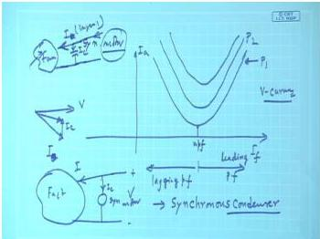  
*Figure: Family of V-curves for a synchronous motor at different load levels. The corresponding power-factor curve is an inverted V.*  

> **Final answer:** V-and inverted-V curves capture the effect of excitation on current and pf; constant-excitation alternator phasor diagrams illustrate armature-reaction changes; minimum excitation is the stability boundary; pf varies from lagging to leading with excitation.


---

## Question 100
**Topic:** Alternator armature reaction, voltage regulation, OCC/SCC and phasor diagrams · **Syllabus area:** Weeks 11-12 · **Source:** 4A | EM-II ELE 2251 Grade Improvement, 11 August 2021

A 60 kVA, 381.05 V, 50 Hz, Y - connected alternator has an effective resistance of 0.016 Ω and armature related self-inductance of 0.23 mH. With the help of accurate phasor diagrams and related analysis, determine the induced voltage in the armature delivers rated current at a load power factor of 0.7 leading. (05)

### Answer 100
Given data: 60 kVA, 381.05 V (line), 50 Hz, Y-connected alternator.

- Effective armature resistance: $R_a = 0.016\ \Omega$
- Armature self-inductance: $L = 0.23\ \text{mH} = 0.23 \times 10^{-3}\ \text{H}$
- Load power factor: $0.7$ leading

**Step 1 - Rated current (line = phase for Y):**

$$
I = \frac{S}{\sqrt{3}\,V_L} = \frac{60000}{\sqrt{3} \times 381.05} \approx 90.91\ \text{A}.
$$

**Step 2 - Phase voltage:**

$$
V_{ph} = \frac{V_L}{\sqrt{3}} = \frac{381.05}{\sqrt{3}} \approx 220.0\ \text{V}.
$$

**Step 3 - Synchronous reactance:**

$$
X_s = \omega L = 2\pi f L = 2\pi \times 50 \times 0.23\times 10^{-3} \approx 0.0723\ \Omega.
$$

Thus the synchronous impedance is

$$
Z_s = R_a + jX_s = 0.016 + j0.0723 = 0.0741\angle 77.5^\circ\ \Omega.
$$

**Step 4 - Power factor angle:**

$$
\phi = \cos^{-1}(0.7) = 45.57^\circ \quad (\text{current leads voltage}).
$$

As a phasor, taking terminal voltage as reference:

$$
\vec{V} = 220\angle 0^\circ\ \text{V}, \qquad
\vec{I} = 90.91\angle +45.57^\circ\ \text{A}.
$$

**Step 5 - Induced emf (generator equation):**

For a synchronous generator, the phasor relation is

$$
\vec{E} = \vec{V} + \vec{I}(R_a + jX_s).
$$

Compute the voltage drop:

$$
\vec{I}Z_s = 90.91 \times 0.0741 \angle (45.57^\circ + 77.5^\circ) = 6.73\angle 123.07^\circ\ \text{V}.
$$

Converting to rectangular form:

$$
\vec{I}Z_s = 6.73 \cos(123.07^\circ) + j\,6.73 \sin(123.07^\circ) = -3.67 + j5.64\ \text{V}.
$$

Therefore,

$$
\begin{aligned}
\vec{E} &= 220 + (-3.67 + j5.64) \\
       &= 216.33 + j5.64\ \text{V}, \\[4pt]
|E|   &= \sqrt{(216.33)^2 + (5.64)^2} \approx 216.40\ \text{V/phase}.
\end{aligned}
$$

**Step 6 - Voltage regulation:**

$$
\%\text{Reg} = \frac{|E| - V_{ph}}{V_{ph}} \times 100 = \frac{216.40 - 220}{220} \times 100 \approx -1.64\%.
$$

The negative sign indicates that the terminal voltage rises under leading power factor load.

**Phasor diagram** (see figure below): $\vec{V}$ is drawn horizontally. The current $\vec{I}$ leads $\vec{V}$ by $45.57^\circ$. The resistive drop $\vec{I}R_a$ is in phase with $\vec{I}$, and the reactive drop $j\vec{I}X_s$ leads $\vec{I}$ by $90^\circ$. The vector sum of $\vec{V}$ and these drops gives the induced emf $\vec{E}$.

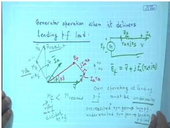
*Figure: Phasor diagram of a synchronous generator delivering leading power factor load.*

> **Final answer:** Induced emf per phase $E = 216.40\ \text{V}$, voltage regulation $= -1.64\%$ (terminal voltage rises on leading load).


---

## Question 101
**Topic:** Alternator armature reaction, voltage regulation, OCC/SCC and phasor diagrams · **Syllabus area:** Weeks 11-12 · **Source:** 5A | EM-II ELE 2251 Grade Improvement, 11 August 2021

3-phase, star connected alternator is rated 1,600 kVA, 13.5 kV. Its per-phase effective armature resistance & synchronous reactance are 1 & 40 respectively. a) Calculate the percentage voltage regulation for a load of 1,250 kW at 0.8 pf lagging. b) Draw the phasor diagram for the given load. (05)

### Answer 101
**Step 1: Rated phase voltage and load current.** 
$$
V_{ph} = \frac{13.5\times10^3}{\sqrt{3}} \approx 7794\ \text{V}.
$$
Apparent power: $S = \frac{P}{\text{pf}} = \frac{1250}{0.8} = 1562.5$ kVA.
$$
I_a = \frac{S}{\sqrt{3}\,V_L} = \frac{1562.5\times10^3}{\sqrt{3}\times13500} \approx 66.82\ \text{A}.
$$
Power factor angle: $\phi = \cos^{-1}0.8 = 36.87^\circ$ lagging (current lags voltage). So,
$$
I_a = 66.82\angle{-36.87^\circ}\ \text{A}.
$$

**Step 2: Compute induced emf $E_f$ per phase.** 
Equivalent circuit per phase (generator mode): $E_f = V_{ph} + I_a (R_a + jX_s)$.
Substituting with $V_{ph}$ as reference ($0^\circ$):
$$
E_f = 7794 + (66.82\angle{-36.87^\circ}) (1 + j40).
$$
Calculate the drop:
$$
I_a R_a = 66.82\angle{-36.87^\circ} \times 1 = 53.46 - j40.09\ \text{V}
$$
$$
I_a (jX_s) = j40 \times (53.46 - j40.09) = 1603.7 + j2138.3\ \text{V}
$$
Total impedance drop: $1657.2 + j2098.2\ \text{V}$.
Hence,
$$
E_f = 7794 + 1657.2 + j2098.2 = 9451.2 + j2098.2\ \text{V}.
$$
Magnitude:
$$
|E_f| = \sqrt{(9451.2)^2 + (2098.2)^2} \approx 9681.5\ \text{V}.
$$

**Step 3: Percentage voltage regulation.**
$$
\text{Regulation} = \frac{|E_f| - V_{ph}}{V_{ph}} \times 100\% = \frac{9681.5 - 7794}{7794} \times 100 \approx 24.21\%.
$$

**Step 4: Phasor diagram.** 
Take $V_{ph}$ as reference horizontal. Draw $I_a$ lagging $V_{ph}$ by $36.87^\circ$. Then add the resistive drop $I_a R_a$ in phase with $I_a$. From the tip of $I_a R_a$, add the synchronous reactance drop $j I_a X_s$ at $90^\circ$ leading $I_a$. The phasor from origin to the final point gives $E_f$. The angle $\delta$ between $E_f$ and $V_{ph}$ is the load (torque) angle. A typical phasor diagram for a generator at lagging pf is shown below.


> **Final answer:** Voltage regulation $= 24.21\%$.


---

## Question 102
**Topic:** Alternator armature reaction, voltage regulation, OCC/SCC and phasor diagrams · **Syllabus area:** Weeks 11-12 · **Source:** 5B | EM-II ELE 2251 Grade Improvement, 11 August 2021

What is the effect of load power factor on the armature reaction in an alternator? A 1500 kVA, 6600 V, 3 - phase, Y - connected alternator with a resistance of 0.4 Ω/phase and synchronous reactance of 6Ω/phase delivers a full - load current at a power factor 0.8 (lagging) and normal rated voltage. Estimate the terminal voltage (line - line) for the same excitation and load current at 0.8 p.f. (leading). (05)

### Answer 102
The armature reaction in an alternator depends on the load power factor because the phase of the armature current relative to the field excitation determines how the armature MMF interacts with the main field flux.

- **Lagging power factor (inductive load):** The armature current lags the terminal voltage. The armature reaction flux opposes the main field flux, causing a **demagnetizing** effect. As the load increases, the terminal voltage drops significantly under the same excitation.
- **Unity power factor:** The armature reaction is predominantly **cross-magnetizing**; it distorts the field but produces a relatively small voltage change.
- **Leading power factor (capacitive load):** The armature current leads the terminal voltage. Here the armature reaction flux aids the main field flux, resulting in a **magnetizing** effect. The terminal voltage may even rise above the no-load value as the load increases.

These effects can be clearly seen in the phasor diagram of a synchronous generator (Figure 1).

  
*Figure 1: Phasor diagram of a cylindrical-rotor alternator delivering a lagging current. The relative position of $\mathbf{M_a}$ (armature reaction MMF) and $\mathbf{M_f}$ (field MMF) illustrates the demagnetising component.*

---

### Numerical Problem

**Given data**  
- Rated power: $S = 1500\ \text{kVA}$  
- Rated line voltage: $V_L = 6600\ \text{V}$ (star-connected)  
- Armature resistance: $R_a = 0.4\ \Omega/\text{phase}$  
- Synchronous reactance: $X_s = 6\ \Omega/\text{phase}$  
- Full-load current, power factor $0.8$ (lagging then leading).

**Step 1 - Full-load current and phase voltage**

$$
I = \frac{S}{\sqrt{3}\,V_L} = \frac{1500 \times 10^3}{\sqrt{3} \times 6600} = 131.2\ \text{A}.
$$

Phase voltage (rated):

$$
V_{\text{ph}} = \frac{V_L}{\sqrt{3}} = \frac{6600}{\sqrt{3}} = 3810.5\ \text{V}.
$$

**Step 2 - Excitation emf at $0.8$ lagging pf**

With $V_{\text{ph}}$ as reference ($3810.5\angle 0^\circ$ V), the current lags by $\phi = \cos^{-1}0.8 = 36.87^\circ$:

$$
\mathbf{I} = 131.2\angle -36.87^\circ\ \text{A}.
$$

Per-phase synchronous impedance:

$$
Z_s = R_a + jX_s = 0.4 + j6\ \Omega,\qquad
|Z_s| = \sqrt{0.4^2 + 6^2} = 6.013\ \Omega,\;
\theta_z = \tan^{-1}\frac{6}{0.4} = 86.18^\circ.
$$

Voltage drop $\mathbf{I}Z_s$:

$$
\mathbf{I}Z_s = (131.2\angle -36.87^\circ)(6.013\angle 86.18^\circ)
            = 788.9\angle 49.31^\circ\ \text{V}.
$$

In rectangular form:

$$
\mathbf{I}Z_s = 514.2 + j598.8\ \text{V}.
$$

The excitation emf is:

$$
\mathbf{E_f} = \mathbf{V_{\text{ph}}} + \mathbf{I}Z_s
            = 3810.5 + 514.2 + j598.8
            = 4324.7 + j598.8\ \text{V},
$$
$$
|\mathbf{E_f}| = \sqrt{4324.7^2 + 598.8^2} = 4366\ \text{V (phase)}.
$$

**Step 3 - Terminal voltage for the same excitation and load current but at $0.8$ leading pf**

Now the current leads the (unknown) terminal voltage $\mathbf{V'_{\text{ph}}}$ by $36.87^\circ$. Take $\mathbf{V'_{\text{ph}}}$ as reference ($V'_{\text{ph}}\angle 0^\circ$), so

$$
\mathbf{I} = 131.2\angle 36.87^\circ\ \text{A}.
$$

The drop becomes

$$
\mathbf{I}Z_s = (131.2\angle 36.87^\circ)(6.013\angle 86.18^\circ)
            = 788.9\angle 123.05^\circ\ \text{V},
$$
$$
\mathbf{I}Z_s = -429.5 + j661.2\ \text{V}.
$$

The excitation emf magnitude is still $4366$ V, therefore

$$
\mathbf{E_f} = \mathbf{V'_{\text{ph}}} + \mathbf{I}Z_s
            = (V'_{\text{ph}} - 429.5) + j661.2,
$$
$$
|\mathbf{E_f}|^2 = (V'_{\text{ph}} - 429.5)^2 + 661.2^2 = 4366^2.
$$

Solving:

$$
(V'_{\text{ph}} - 429.5)^2 = 4366^2 - 661.2^2 = 18.62 \times 10^6,
$$
$$
V'_{\text{ph}} - 429.5 = 4315.6\quad\Rightarrow\quad V'_{\text{ph}} = 4745.1\ \text{V (phase)}.
$$

Hence the new line-to-line voltage is

$$
V'_L = \sqrt{3} \times V'_{\text{ph}} = \sqrt{3} \times 4745.1 \approx 8220\ \text{V} = 8.22\ \text{kV}.
$$

> **Final answer:** When the same alternator delivers the same full-load current at 0.8 leading power factor, the terminal line voltage becomes $8.22\ \text{kV}$. The armature reaction is magnetising for leading loads, which explains the higher terminal voltage compared to the lagging case.


---

## Question 103
**Topic:** Alternator armature reaction, voltage regulation, OCC/SCC and phasor diagrams · **Syllabus area:** Weeks 11-12 · **Source:** 6B | EM-II ELE 2251 Grade Improvement, 11 August 2021

Using relevant phasor diagram, discuss the behaviour of a cylindrical rotor synchronous motor supplying a constant load but operating under varying excitation conditions. (05)

### Answer 103
When a cylindrical-rotor synchronous motor operates under constant shaft load and constant terminal voltage, the real power input $P$ remains essentially fixed. Neglecting armature resistance, the per-phase phasor equation is

$$
\vec{V} = \vec{E} + jX_s \vec{I}_a \tag{1}
$$

where $\vec{V}$ is the terminal voltage (reference), $\vec{E}$ is the excitation emf, $\vec{I}_a$ is the armature current, and $X_s$ is the synchronous reactance.

Since the mechanical load is constant, the power converted $P = \frac{3VE}{X_s}\sin\delta$ is constant; with $V$ and $X_s$ fixed, the product $E\sin\delta$ must remain unchanged. Equivalently, the in-phase component of armature current must satisfy $I_a\cos\varphi = \text{constant}$, because $P = 3VI_a\cos\varphi$.

To construct the phasor diagram (Fig. 1), choose $\vec{V}$ horizontally. For a given excitation the current $\vec{I}_a$ is drawn at an angle $\varphi$; its projection on the $\vec{V}$ axis is $I_a\cos\varphi$. Hence, as the field current is varied, the tip of $\vec{I}_a$ is constrained to move along a vertical line (constant active-power line). The excitation emf $\vec{E}$ is obtained from (1) as $\vec{E} = \vec{V} - jX_s\vec{I}_a$; its magnitude changes while its vertical component $E\sin\delta$ remains fixed.

  
*Figure 1: Locus of $\vec{I}_a$ and corresponding $\vec{E}$ for constant load and variable excitation.*

Three characteristic operating conditions can be identified:

- **Under-excitation** ($\lvert\vec{E}\rvert < \lvert\vec{V}\rvert$): The motor draws a lagging current, i.e. it absorbs reactive power from the supply.
- **Normal excitation** ($\lvert\vec{E}\rvert$ adjusted for unity power factor): $\vec{I}_a$ is in phase with $\vec{V}$ and its magnitude is minimum.
- **Over-excitation** ($\lvert\vec{E}\rvert > \lvert\vec{V}\rvert$): The motor draws a leading current and supplies reactive power to the system.

As excitation is increased from under-excited to over-excited, the armature current $I_a$ traces a V-curve (minimum at unity power factor), while the power factor vs field current follows an inverted V-curve. Because an over-excited synchronous motor delivers reactive power, it can be used as a synchronous condenser for power-factor improvement.

> **Final answer:** Varying the field excitation of a cylindrical-rotor synchronous motor operating at constant load alters the reactive power exchange without affecting the real power. The armature current moves along a constant-power line; it is lagging for under-excitation, minimum at unity power factor, and leading for over-excitation. The motor therefore behaves as a variable reactive compensator.


---

## Question 104
**Topic:** Synchronization and parallel operation of alternators · **Syllabus area:** Week 11 · **Source:** 1C | EM-II ELE 204 End Sem, 13 May 2014

List the necessary conditions to be satisfied while synchronising 3 phase alternators. With neat connection diagram, explain “Two Bright One Dark Lamp method” of synchronisation. (04)

### Answer 104
**Conditions for synchronising a three-phase alternator:**
1. The **phase sequence** of the incoming machine must match that of the busbars.
2. The **line voltage** of the incoming machine must equal the busbar line voltage.
3. The **frequency** of the incoming machine must be equal to the busbar frequency.
4. At the instant of closing the circuit breaker, the **phase-angle difference** between the corresponding phase voltages must be **zero**.
5. The voltage waveforms must be nearly sinusoidal.

**Two-Bright One-Dark Lamp Method**
This simple and widely used method employs three incandescent lamps to indicate the correct synchronising instant.

*Connection diagram (description):*
Three lamps L₁, L₂, L₃ are connected across the synchronising switch as follows:
- L₁ is connected directly between phase A of the busbar and phase A′ of the incoming alternator.
- L₂ is cross-connected between phase B of the busbar and phase C′ of the alternator.
- L₃ is cross-connected between phase C of the busbar and phase B′ of the alternator.
(If a drawing were provided, it would show the three busbar phases A, B, C on the left, the alternator phases A′, B′, C′ on the right, with the lamps bridging the phases as described, and a three-pole synchronising switch in series.)

*Working:*
When the alternator is driven at nearly synchronous speed and its voltage is adjusted to match the busbar voltage, the lamps begin to flicker because of the slight frequency difference. The voltage across each lamp is the phasor difference of the two line-to-neutral voltages connected to its terminals.

As the speed is trimmed, the flicker slows. When the frequencies are exactly matched and the phase sequences are identical, the lamps glow steadily. At the precise instant when the voltage of busbar phase A is in phase with alternator phase A′, the voltage across L₁ is zero, and L₁ becomes completely dark. The cross-connections ensure that the voltages across L₂ and L₃ are then equal in magnitude (equal to the line voltage) and the two lamps glow with equal brightness. This **"two bright, one dark"** pattern confirms:
- Correct phase sequence (a wrong sequence would produce an all-bright or irregular flicker),
- Equal voltages (adjustable by the alternator field current),
- Zero phase difference between the directly connected phases.

The operator then closes the synchronising switch at the middle of the dark period of L₁ (or when L₁ is fully dark). After closing, the alternator remains locked to the busbars and operates in parallel.

The method is cheap, reliable, and provides a direct visual indication of the synchronising instant.

> **Final answer:** The necessary conditions are: equal voltages, equal frequencies, identical phase sequences, zero phase difference at the instant of closing, and approximately sinusoidal waveforms. In the two-bright one-dark lamp method, one lamp is connected directly between corresponding phases (e.g., A-A′), while the other two are cross-connected (B-C′ and C-B′); at synchronism the direct lamp is **dark** and the cross-connected lamps are **equally bright**, indicating that the systems are in phase and the phase sequence is correct.


---

## Question 105
**Topic:** Synchronization and parallel operation of alternators · **Syllabus area:** Week 11 · **Source:** 3C | EM-II ELE 204 Makeup, 09 July 2015

Mention the essential conditions to synchronise an incoming alternator with infinite bus system. (03)

### Answer 105
Synchronization of an incoming alternator with an infinite bus (live busbars) requires that the machine and the bus satisfy four essential conditions at the moment the circuit breaker is closed. These conditions ensure that no large circulating currents or mechanical shock occur.

1. **Equal voltage magnitude:** The RMS terminal voltage of the incoming alternator must be equal to the busbar voltage. This is adjusted by controlling the field excitation of the alternator. If the voltages differ, a large reactive power flow will occur upon connection, potentially causing damage.

2. **Equal frequency:** The frequency of the generated EMF must be exactly equal (or very close) to the bus frequency. This is achieved by adjusting the speed of the prime mover driving the alternator. Even a small frequency difference leads to a drifting phase angle and possible circulating current.

3. **Identical phase sequence:** The phase sequence of the alternator must match that of the bus (e.g., both R-Y-B or A-B-C). A phase-sequence mismatch will cause severe short-circuit-like currents and torque pulsations because the two sets of voltages will never be in phase simultaneously.

4. **Zero phase-angle difference:** At the exact instant of synchronizing (closing the synchronizing switch), the phase angle between corresponding phase voltages must be essentially zero. This means the voltages must be in phase coincidence. A finite phase difference results in a sudden power transfer and mechanical stress on the shaft.

These conditions are verified using voltmeters (voltage magnitude), frequency meters, phase-sequence indicators, synchroscopes, and often synchronizing lamps (e.g., the two-bright-one-dark method).

> **Final answer:** Equal voltage magnitude, equal frequency, identical phase sequence, and zero phase-angle difference at the instant of paralleling.


---

## Question 106
**Topic:** Synchronization and parallel operation of alternators · **Syllabus area:** Week 11 · **Source:** 3B | EM-II ELE 2225 Makeup, 26 June 2024

List the necessary conditions to be satisfied while synchronizing 3 phase alternators. With neat connection diagram, explain “Two Bright One Dark Lamp method” of synchronization. 3

### Answer 106
**Necessary conditions for synchronising 3-phase alternators:**

1. **Voltage equality:** The terminal voltage of the incoming machine must be equal to the bus-bar voltage. A voltmeter is used to verify.
2. **Frequency equality:** The frequency of the incoming machine must match the bus frequency. Frequency meters or the rate of flicker of synchronising lamps indicate when this is achieved.
3. **Phase sequence:** The phase sequence of the incoming alternator must be identical to that of the bus. This is confirmed with a phase-sequence indicator or by observing the lamp pattern.
4. **Phase coincidence:** At the instant the circuit breaker is closed, the phase-angle difference between the machine voltage and the bus voltage must be essentially zero. This is the synchronising moment.

**Two-Bright One-Dark lamp method (Dark-lamp synchronising):**

Three lamps of equal rating are connected between the incoming alternator and the bus as shown in the schematic below:

- One lamp is connected directly between corresponding phases, e.g., $R_m$ (machine) to $R_b$ (bus).
- The other two lamps are cross-connected: $Y_m$ to $B_b$ and $B_m$ to $Y_b$.

*Connection diagram (textual description):*
```
       Bus                       Incoming machine
     ───────                    ─────────────
     R_b   ──[Lamp 1]── R_m
     Y_b   ──[Lamp 2]── B_m
     B_b   ──[Lamp 3]── Y_m
```

When the phase sequence is correct and the frequencies are nearly equal, the three lamps will glow in a cyclic pattern because of the small slip frequency. If the frequencies are exactly equal, the lamps will remain at a constant brightness, but in practice a slight difference is allowed to obtain a slow flicker.

**Determining the synchronising instant:**
When the voltage across the directly connected lamp (Lamp 1) becomes zero, that lamp is completely dark. At that same instant, the vectors of the cross-connected phases are 120° apart, producing equal voltages across Lamps 2 and 3, so they glow with equal brightness. This condition-**one lamp dark, two lamps equally bright**-indicates that the voltages are exactly in phase for the directly connected phase, and the other two are 120° displaced (correct phase sequence). It is the ideal moment to close the synchronising switch.

The rate at which the lamps flicker gives a measure of the frequency difference: a slow flicker (e.g., one dark-bright-dark cycle every few seconds) means the frequencies are very close. The circuit breaker should be closed when the flicker is slow and the "one dark, two equally bright" state occurs.

Before the lamp method is used, the voltage and phase sequence must be checked separately with voltmeters and a phase-sequence indicator. Once these are confirmed, the lamp method is employed to fine-tune the frequency and capture the exact synchronising instant.

> **Final answer:** Close the synchronising breaker at the instant when one lamp is dark, the other two are equally bright, the flicker is slow, and after verifying voltage equality and correct phase sequence.


---

## Question 107
**Topic:** Synchronization and parallel operation of alternators · **Syllabus area:** Week 11 · **Source:** 4B-i | EM-II ELE 2251 Grade Improvement, 11 August 2021

State the conditions to be satisfied for successful synchronisation of an alternator with infinite busbars. Also mention the techniques through which these conditions are ensured to have been met. (part i)

### Answer 107
The successful synchronisation of an alternator with an infinite busbar system requires the fulfilment of four essential conditions. An infinite bus is an idealised source of constant voltage and frequency that is not affected by the connection of individual machines. The conditions, along with the techniques employed to verify them, are as follows.

**1. Equal voltage magnitude**  
The terminal voltage of the incoming alternator must be equal in magnitude to the busbar voltage. This is checked with voltmeters or potential transformers. Any difference in voltage will cause a reactive circulating current at the instant of closing, potentially leading to excessive heating and mechanical stress.

**2. Equal frequency**  
The frequency of the generated voltage must match the busbar frequency exactly. Frequency is measured by frequency meters; in practice, synchronising lamps are also used. When the frequencies are not equal, the lamps flicker at a rate equal to the beat frequency. As the frequencies approach equality, the flicker becomes slower, and when they are exactly equal the lamps become steady (either all dark or all bright depending on the connection).

**3. Identical phase sequence**  
The order in which the phase voltages reach their maxima (e.g., R-Y-B) must be the same for both the alternator and the bus. Even if voltages and frequencies match, a wrong phase sequence will permit dangerously high torque pulsations and current surges. A phase-sequence indicator is the primary tool; additionally, the pattern observed on the synchronising lamps provides confirmation: with the correct sequence, one lamp is dark while the other two are equally bright (two-bright one-dark method). If all three lamps flicker in unison, the sequence is wrong.

**4. Phase coincidence at the instant of closing**  
The corresponding phase voltages of the alternator and bus must be exactly in phase when the circuit breaker closes, i.e., the phase-angle difference $\delta$ should be zero. This minimises the sudden exchange of synchronising power. A synchroscope, which displays the relative phase angle on a rotating pointer, is the most reliable instrument. The breaker is closed when the pointer is at the in-phase mark and moving slowly in the "fast" direction. As a backup, the three-dark lamp method (all lamps dark → zero voltage across open contacts) or the two-bright one-dark method (the dark lamp at minimum brightness) may be used.

In addition to these four fundamental conditions, the waveform of both voltages should be identical (sinusoidal) to avoid harmonic circulating currents, though this is normally guaranteed by the alternator design. For large machines, an automatic **synchronising relay (check synchroniser)** is employed to monitor all conditions and issue the closing command at the precise instant, ensuring both safety and accuracy.

> **Final answer:** Equal voltage, equal frequency, correct phase sequence, and zero phase-angle difference at closing; verified by voltmeter/frequency meter, phase-sequence indicator, synchroscope/synchronising lamps, and often a synchronising relay.


---

## Question 108
**Topic:** Salient-pole machines, Blondel two-reaction theory and slip test · **Syllabus area:** Week 12 · **Source:** 4C | EM-II ELE 204 End Sem, 13 May 2014

Draw a neat connection diagram for measurement of direct and quadrature axis reactance by slip test. (02)

### Answer 108
The slip-test circuit is arranged as follows:

- The three-phase stator winding of the salient-pole alternator is connected to a low-voltage, balanced three-phase AC supply through a variac. Ammeter, voltmeter, and wattmeter are inserted in the stator circuit to measure current, voltage, and power.
- The rotor field winding is left **open-circuited**.
- The rotor is driven mechanically at a speed slightly different from the synchronous speed (hence "slip") by an auxiliary prime mover. This causes the rotor poles to slowly slip past the stator rotating magnetic field.

Because the rotor is salient, the magnetic reluctance seen by the stator MMF changes with rotor position. When the stator MMF aligns with the **direct axis** (minimum air-gap), the reactance is highest and the stator current falls to a **minimum** value. When the MMF aligns with the **quadrature axis** (maximum air-gap), the reactance is lowest and the current rises to a **maximum**.

By recording the minimum current $I_{\min}$ and the maximum current $I_{\max}$, together with the corresponding phase voltage $V_{\text{ph}}$, the direct-axis and quadrature-axis synchronous reactances are:

$$
X_d = \frac{V_{\text{ph}}}{I_{\min}}, \qquad X_q = \frac{V_{\text{ph}}}{I_{\max}}.
$$

The applied voltage must be kept low enough to avoid excessive current when the machine is in the quadrature-axis position. A typical connection diagram would show the three-phase supply connected to the variac, then to the stator terminals with instruments in series, and the rotor shaft coupled to a prime mover, with the field winding open.

> **Final answer:** Slip test gives $X_d$ from minimum armature current and $X_q$ from maximum armature current under low-voltage, open-field conditions.


---

## Question 109
**Topic:** Salient-pole machines, Blondel two-reaction theory and slip test · **Syllabus area:** Week 12 · **Source:** 4A | EM-II ELE 204 Makeup, 08 July 2014

With the aid of phasor diagram based on Blondel’s two reaction theory, derive an expression for the active power output of a 3 phase Salient pole alternator in terms of excitation emf, terminal voltage, direct and quadrature axis reactance. Neglect armature resistance. (04)

### Answer 109
In a salient-pole alternator the non-uniform air-gap causes the direct-axis synchronous reactance $X_d$ to be larger than the quadrature-axis reactance $X_q$ ($X_d > X_q$). According to Blondel's two-reaction theory, the armature current $I_a$ is resolved into a direct-axis component $I_d$ and a quadrature-axis component $I_q$, each acting on the corresponding reactance. The per-phase voltage equation with negligible armature resistance is

$$
E_f = V + jX_d I_d + jX_q I_q \tag{1}
$$

where $E_f$ is the excitation emf (lying along the $q$-axis) and $V$ is the terminal voltage taken as reference.

<figure>
  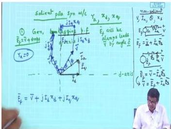
  <figcaption>Phasor diagram of a salient-pole synchronous generator (Blondel's two-reaction theory), $R_a$ neglected.</figcaption>
</figure>

**Derivation of $I_d$ and $I_q$:**
Take $V = V\angle 0^\circ$ as the reference phasor. The auxiliary phasor $E' = V + jX_q I_a$ lies along the quadrature axis; let its angle be $\delta$ (the load angle). Hence the $q$-axis is at $\angle\delta$ and the $d$-axis lags the $q$-axis by $90^\circ$ ($\angle\delta-90^\circ$). The excitation emf $E_f$ also lies on the $q$-axis, so $E_f = E_f\angle\delta$.

Resolving the armature current along the two axes:
$$
I_a = I_q\angle\delta + I_d\angle(\delta-90^\circ) 
     = (I_q - jI_d)\,e^{j\delta}. \tag{2}
$$

Substituting the phasors into (1):
- $jX_d I_d = jX_d\,I_d\,e^{j(\delta-90^\circ)} = X_d I_d\,e^{j\delta}$ (a voltage along the $q$-axis);
- $jX_q I_q = jX_q\,I_q\,e^{j\delta} = -X_q I_q\,e^{j(\delta-90^\circ)}$ (a voltage along the negative $d$-axis).

Thus (1) becomes
$$
E_f e^{j\delta} = V + X_d I_d\,e^{j\delta} - X_q I_q\,e^{j(\delta-90^\circ)} .
$$

To separate the $q$- and $d$-axis components, multiply the equation by $e^{-j\delta}$:
$$
E_f = V e^{-j\delta} + X_d I_d + jX_q I_q . \tag{3}
$$
With $V e^{-j\delta} = V\cos\delta - jV\sin\delta$, equating the real and imaginary parts of (3) gives

$$
\begin{aligned}
\text{Real (}q\text{-axis):}&\quad E_f = V\cos\delta + X_d I_d, \\[2pt]
\text{Imag (}d\text{-axis):}&\quad 0 = -V\sin\delta + X_q I_q .
\end{aligned}
$$

Hence the direct- and quadrature-axis components of current are

$$
\boxed{I_q = \frac{V\sin\delta}{X_q}}, \qquad
\boxed{I_d = \frac{E_f - V\cos\delta}{X_d}}. \tag{4}
$$

**Expression for active power:**
The per-phase complex power is $S = V I_a^*$. Since $V = V\angle 0^\circ$ and $I_a^* = (I_q + jI_d)\,e^{-j\delta}$, we obtain

$$
\begin{aligned}
S &= V (I_q + jI_d)(\cos\delta - j\sin\delta) \\
  &= V\bigl[ (I_q\cos\delta + I_d\sin\delta) + j(I_d\cos\delta - I_q\sin\delta) \bigr].
\end{aligned}
$$

The real part gives the active power per phase:

$$
P_{\text{ph}} = \operatorname{Re}(S) = V\,(I_q\cos\delta + I_d\sin\delta). \tag{5}
$$

Insert the expressions (4) into (5):

$$
\begin{aligned}
P_{\text{ph}} 
&= V\Bigl[ \frac{V\sin\delta}{X_q}\cos\delta + \frac{E_f - V\cos\delta}{X_d}\sin\delta \Bigr] \\[4pt]
&= \frac{E_f V}{X_d}\sin\delta + V^2\sin\delta\cos\delta\!\left(\frac{1}{X_q} - \frac{1}{X_d}\right).
\end{aligned}
$$

Using $\sin 2\delta = 2\sin\delta\cos\delta$,

$$
P_{\text{ph}} = \frac{E_f V}{X_d}\sin\delta + \frac{V^2}{2}\!\left(\frac{1}{X_q} - \frac{1}{X_d}\right)\sin 2\delta .
$$

For a three-phase alternator the total active power is three times the per-phase value:

$$
\boxed{P = \frac{3E_f V}{X_d}\sin\delta + \frac{3V^2}{2}\!\left(\frac{1}{X_q} - \frac{1}{X_d}\right)\sin 2\delta}. \tag{6}
$$

Equation (6) is the required expression. The first term is the *excitation power* also present in cylindrical-rotor machines; the second term is the *reluctance power* that arises only when $X_d \neq X_q$ and can be utilised in salient-pole machines to increase the maximum power.

> **Final answer:**
> $$P = \frac{3E_f V}{X_d}\sin\delta + \frac{3V^2}{2}\!\left(\frac{1}{X_q} - \frac{1}{X_d}\right)\sin 2\delta.$$


---

## Question 110
**Topic:** Salient-pole machines, Blondel two-reaction theory and slip test · **Syllabus area:** Week 12 · **Source:** 4A | EM-II ELE 204 Makeup, 09 July 2015

A 5 MVA, 6.6 KV, 3- phase, 6.6 KV 50 Hz, star connected salient pole alternator is connected to an infinite bus. The direct axis reactance is 12 Ω while that of quadrature axis is 9.5 Ω per phase. The armature resistance is 1.5 Ω per phase. When the generator is operating at rated MVA at 0.9 pf lagging, calculate the electromagnetic power developed and reluctance power. (05)

### Answer 110
Given: A 5 MVA, 6.6 kV, 50 Hz, star-connected salient-pole alternator.
$X_d = 12\ \Omega$, $X_q = 9.5\ \Omega$, $R_a = 1.5\ \Omega$ per phase.
Operating at rated MVA, 0.9 pf lagging.

**1. Terminal quantities**
Per-phase voltage
$$
V_{\text{ph}} = \frac{6600}{\sqrt{3}} = 3810.5\ \text{V}.
$$
Rated armature current
$$
I_a = \frac{5 \times 10^6}{\sqrt{3} \times 6600} = 437.39\ \text{A}.
$$
Power factor angle
$$
\phi = \cos^{-1} 0.9 = 25.84^\circ\ \text{lagging}.
$$
Three-phase active power output
$$
P_{\text{out}} = 5 \times 0.9 = 4.5\ \text{MW}.
$$

**2. Electromagnetic power developed**
Stator copper loss
$$
P_{\text{cu}} = 3 I_a^2 R_a = 3 \times (437.39)^2 \times 1.5 = 0.8609\ \text{MW}.
$$
Electromagnetic power developed (air-gap power) equals output plus stator copper loss:
$$
P_{\text{em}} = P_{\text{out}} + P_{\text{cu}} = 4.5 + 0.8609 = 5.3609\ \text{MW}.
$$

**3. Reluctance power**
For a salient-pole machine, the total three-phase air-gap power (neglecting $R_a$) is expressed by the two-reaction theory:
$$
P_{\text{em}} = \frac{3 E_f V}{X_d} \sin\delta \;+\; \frac{3 V^2}{2}\left(\frac{1}{X_q} - \frac{1}{X_d}\right) \sin 2\delta.
$$
The second term is the **reluctance power**, which arises from the non-uniform air gap.
To evaluate it we need the load angle $\delta$. From the phasor diagram with $R_a = 0$, the relation between $\delta$, terminal voltage and current is
$$
\tan \delta = \frac{I_a X_q \cos\phi}{V_{\text{ph}} + I_a X_q \sin\phi}.
$$


Substituting the values:
$$
\begin{aligned}
I_a X_q \cos\phi &= 437.39 \times 9.5 \times 0.9 = 3740\ \text{V},\\[2pt]
I_a X_q \sin\phi &= 437.39 \times 9.5 \times 0.4359 = 1812\ \text{V},\\[2pt]
\tan\delta &= \frac{3740}{3810.5 + 1812} = 0.6652,\\[2pt]
\delta &= \arctan(0.6652) = 33.633^\circ.
\end{aligned}
$$
Then
$$
\sin 2\delta = \sin(67.266^\circ) = 0.9223,
\qquad
\frac{1}{X_q} - \frac{1}{X_d} = \frac{1}{9.5} - \frac{1}{12} = 0.02193\ \Omega^{-1}.
$$
The three-phase reluctance power is
$$
\begin{aligned}
P_{\text{rel}} &= \frac{3}{2} \times (3810.5)^2 \times 0.02193 \times 0.9223 \\[2pt]
&\approx 0.4405 \times 10^6\ \text{W} = 0.44\ \text{MW}.
\end{aligned}
$$

Thus, the electromagnetic power developed is **5.36 MW**, of which **0.44 MW** is the reluctance power component (the remainder comes from field excitation).

> **Final answer:** Electromagnetic power developed = 5.36 MW; reluctance power = 0.44 MW (approx).


---

## Question 111
**Topic:** Salient-pole machines, Blondel two-reaction theory and slip test · **Syllabus area:** Week 12 · **Source:** 4A | EM-II ELE 2202 End Sem, 10 May 2016

Explain Blondel’s two reaction theory for Salient Pole Alternator. Derive the circuit model and sketch the phasor diagram showing the relationship between terminal voltage and internal voltage. (05)

### Answer 111
Blondel's two-reaction theory is essential for analysing salient-pole alternators because the air-gap is non-uniform. The direct-axis (d-axis) is the path of minimum reluctance (along the rotor pole centre), and the quadrature-axis (q-axis) is the path of maximum reluctance (midway between poles). Consequently, the direct-axis synchronous reactance $X_d$ is larger than the quadrature-axis reactance $X_q$.

The theory resolves the armature mmf (and hence the armature current $I_a$) into two components:
- **Direct-axis component** $I_d$: in quadrature with the excitation emf $E_f$ (i.e., along the d-axis) and responsible for demagnetising or magnetising effect.
- **Quadrature-axis component** $I_q$: in phase with $E_f$ (along the q-axis) and responsible for cross-magnetising effect.

**Per-phase circuit model:**  
Because the two axes have different magnetic paths, a single impedance cannot represent the machine. Instead, the induced emf $E_f$ (excitation voltage) is related to the terminal voltage $V$ and the armature current components by the voltage equation:
$$
E_f = V + I_a R_a + j X_d I_d + j X_q I_q.
$$
Usually the armature resistance $R_a$ is small and can be neglected, giving:
$$
E_f = V + j X_d I_d + j X_q I_q.
$$
This is the *two-reaction circuit model* of a salient-pole alternator.

**Phasor diagram construction** (lagging power factor example):
1. Draw the terminal voltage $V$ as the reference phasor (horizontal).
2. Draw the armature current $I_a$ lagging $V$ by the power factor angle $\phi$.
3. Locate the q-axis (the direction of $E_f$): Compute the phasor $V + j X_q I_a$. Because
   $$
   V + j X_q I_a = E_f + j (X_q - X_d) I_d,
   $$
   and both $E_f$ and $j I_d$ lie along the q-axis, this synthesized phasor points exactly along the q-axis. The angle between $V$ and this phasor is the load angle $\delta$.
4. Draw the q-axis line at angle $\delta$ from $V$; the d-axis lags the q-axis by $90^\circ$ (i.e., at angle $\delta - 90^\circ$).
5. Resolve $I_a$ into components along these axes:
   - $I_q$ is the projection of $I_a$ onto the q-axis (in phase with $E_f$).
   - $I_d$ is the projection onto the d-axis (lagging $E_f$ by $90^\circ$).
6. Add the voltage drops: starting from the tip of $V$, draw $j X_q I_q$ (perpendicular to $I_q$, leading by $90^\circ$) and then $j X_d I_d$ (perpendicular to $I_d$, leading by $90^\circ$). The vector sum reaches the tip of $E_f$.
7. The completed phasor diagram shows $V$, $E_f$, the load angle $\delta$, and the current components.

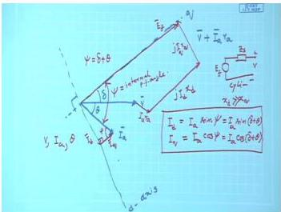

The diagram clearly illustrates the relationship between terminal voltage and internal excitation voltage under saliency.

> **Final answer:** Blondel's two-reaction theory accounts for saliency by resolving armature current into d- and q-axis components, using two reactances $X_d$ and $X_q$, and the phasor relation $E_f = V + jX_d I_d + jX_q I_q$. The phasor diagram is constructed by locating the q-axis with $V + jX_q I_a$ and adding the appropriate voltage drops.


---

## Question 112
**Topic:** Salient-pole machines, Blondel two-reaction theory and slip test · **Syllabus area:** Week 12 · **Source:** 4A | EM-II ELE 2202 End Sem, 23 April 2018

With a neat diagram, explain an experimental procedure to determine the Xd and Xq of a salient pole alternator. (04)

### Answer 112
**Slip test** is a practical method to determine the direct-axis synchronous reactance $X_d$ and the quadrature-axis synchronous reactance $X_q$ of a salient-pole alternator. The test relies on Blondel's two-reaction theory, which resolves the armature mmf into d- and q-axis components, each associated with a distinct magnetic reluctance and hence a distinct reactance. By driving the rotor at a speed slightly different from synchronous speed, the stator rotating field slowly slips past the rotor poles, causing the armature current to vary cyclically.

**Experimental Setup (Neat Diagram)**

The schematic diagram of the slip test is shown below. It consists of:
- A three-phase, low-voltage, variable AC supply connected to the stator windings of the alternator.
- An ammeter and a voltmeter to measure line current and line voltage.
- The rotor is coupled to a small variable-speed prime mover (e.g., a DC motor) which drives it at a speed $n$, slightly less or more than the synchronous speed $n_s$.
- The field winding on the rotor is kept **open-circuited** (no DC excitation).

**Procedure**

1. **Drive the rotor** at a speed that produces a small slip $s = (n_s - n)/n_s$, typically $1$-$2\%$. Because the stator is excited from the AC mains, a rotating magnetic field is set up in the air gap. Since the rotor speed differs from synchronous speed, the field poles slowly move relative to this rotating field.

2. **Observe the armature current.** Owing to saliency, the magnetic reluctance of the flux path varies as the rotor moves. When the stator mmf axis coincides with the **direct axis** (centre of the rotor pole), the air gap is minimum, the reactance offered to the stator current is maximum ($X_d$), and the current drawn from the supply is **minimum**. Conversely, when the stator mmf aligns with the **quadrature axis** (inter-polar region), the air gap is large, the reactance is minimum ($X_q$), and the armature current becomes **maximum**. Hence, the ammeter needle swings between a lower limit $I_{\min}$ and an upper limit $I_{\max}$.

3. **Record simultaneous values** of line current and line voltage at the instants of minimum and maximum current. If the supply voltage fluctuates slightly, take the average of the voltage readings. For a star-connected stator, the phase voltage is $V_{\text{ph}} = V_{\text{line}} / \sqrt{3}$.

4. **Compute the reactances.** Neglecting the small armature resistance, the phase reactance at any instant is $X = V_{\text{ph}} / I_{\text{ph}}$. Therefore,
   $$
   X_d = \frac{V_{\text{ph}}}{I_{\min}} \quad \text{(unsaturated direct-axis reactance)},
   $$
   $$
   X_q = \frac{V_{\text{ph}}}{I_{\max}} \quad \text{(unsaturated quadrature-axis reactance)}.
   $$

**Precautions**

- The applied voltage must be kept **low** (typically $20$-$30\%$ of rated voltage) to avoid excessive currents when the machine presents the low quadrature-axis reactance.
- The field winding must be open-circuited; otherwise, the DC field flux would lock the rotor to the stator rotating field, preventing slip.
- The speed should be held as steady as possible to obtain clear, consistent swings of the ammeter.

The values obtained are the unsaturated reactances because the low applied voltage does not drive the iron into saturation. For saturated values, other tests such as the open-circuit and short-circuit characteristics are combined with the slip test results.

> **Final answer:** $X_d$ is calculated from the minimum line current and the corresponding phase voltage, $X_q$ from the maximum line current, under a low-voltage, open-field slip test.


---

## Question 113
**Topic:** Salient-pole machines, Blondel two-reaction theory and slip test · **Syllabus area:** Week 12 · **Source:** 3C | EM-II ELE 2202 End Sem, 24 April 2017

Draw the connection diagram of slip test and briefly explain its significance. (03)

### Answer 113
The slip test is a simple experimental method to determine the direct-axis and quadrature-axis synchronous reactances ($X_d$ and $X_q$) of a salient-pole synchronous machine. The connection diagram is arranged as follows:

- The three-phase stator winding is connected to a balanced low-voltage AC supply through a variac. An ammeter is inserted in one line to record the line current, and a voltmeter is connected across the machine terminals to measure the phase voltage.
- The rotor field winding is kept **open-circuited**.
- The rotor is driven by an external prime mover (e.g., a DC motor) at a speed slightly different from the synchronous speed corresponding to the supply frequency. This small slip (typically less than 1%) causes the armature magnetomotive force (mmf) to move slowly past the rotor poles.

**Working Principle**

Because the rotor is salient, the magnetic reluctance of the flux path varies with the position of the rotating stator field. When the stator mmf aligns with the direct axis (the centre of a pole), the air-gap is smallest, the magnetic circuit has the highest permeance, and the armature reaction is strongest; consequently, the inductive reactance is maximum and the armature current reaches a minimum $I_{min}$. When the stator mmf aligns with the quadrature axis (midway between poles), the air-gap is large, the permeance is low, and the reactance is minimum, giving a maximum armature current $I_{max}$.

If $V_{ph}$ is the rated (or applied) phase voltage, the two synchronous reactances are obtained from:

$$
X_d = \frac{V_{ph}}{I_{min}}, \qquad X_q = \frac{V_{ph}}{I_{max}}.
$$

**Significance**

The direct-axis and quadrature-axis reactances are the fundamental parameters required by Blondel's two-reaction theory for salient-pole synchronous machines. They are essential for:

- Drawing accurate phasor diagrams under any load condition.
- Calculating voltage regulation.
- Determining power-angle characteristics and steady-state stability limits.
- Evaluating the synchronising power and torque.
- Predicting the behaviour of the machine during transient and steady-state operation.

Thus, the slip test provides a straightforward and practical means to separate the two reactances, which cannot be obtained from a simple open-circuit/short-circuit test (which yields only the unsaturated $X_d$). Without $X_d$ and $X_q$, the performance analysis of a salient-pole machine would remain incomplete.

> **Final answer:** The slip test experimentally separates $X_d$ and $X_q$ by exploiting the current pulsation caused by saliency under low-voltage open-field operation.


---

## Question 114
**Topic:** Salient-pole machines, Blondel two-reaction theory and slip test · **Syllabus area:** Week 12 · **Source:** 4A | EM-II ELE 2202 End Sem, 24 April 2017

A three-phase, 20 MVA, 11 kV, 50 Hz star-connected alternator has Xd = 4 Ω and Xq = 3 Ω. Armature resistance is negligibly small. At full load, 0.8 lagging power factor, determine: a) Direct and quadrature axes components of the armature current. b) Excitation emf. c) Voltage regulation. d) Electromagnetic power. e) Reluctance power. (07)

### Answer 114
**Given data:**
- Rated three-phase apparent power, $S = 20\ \text{MVA}$
- Line voltage, $V_L = 11\ \text{kV}$
- Connection: Star (Y) → phase voltage $V_\text{ph} = \frac{V_L}{\sqrt{3}}$
- Frequency, $f = 50\ \text{Hz}$ (not used because reactances are given in ohms)
- Direct-axis synchronous reactance, $X_d = 4\ \Omega$
- Quadrature-axis synchronous reactance, $X_q = 3\ \Omega$
- Armature resistance, $R_a \approx 0$
- Power factor, $\cos\phi = 0.8$ lagging → $\phi = \arccos 0.8 = 36.87^\circ$

**Preliminary calculations:**
- Phase voltage:
$$
V_\text{ph} = \frac{11000}{\sqrt{3}} = 6350.85\ \text{V}
$$
- Rated armature current:
$$
I_a = \frac{S}{\sqrt{3}\,V_L} = \frac{20 \times 10^6}{\sqrt{3} \times 11000} = 1049.73\ \text{A}
$$
- Power factor angle: $\phi = \cos^{-1}(0.8) = 36.87^\circ$ (lagging). Hence, $\sin\phi = 0.6$.

**a) Direct- and quadrature-axis current components**

In a salient-pole machine, the air-gap is non-uniform and the armature mmf is resolved along two axes:
- **Direct axis (d-axis)**: the axis of the field poles.
- **Quadrature axis (q-axis)**: 90 electrical degrees ahead of the d-axis.

The armature current $\mathbf{I}_a$ (lagging $\mathbf{V}_\text{ph}$ by $\phi$) is decomposed into components $I_d$ (along the d-axis) and $I_q$ (along the q-axis). From the phasor diagram (see Figure) the load angle $\delta$ (the angle between $\mathbf{E}_f$ and $\mathbf{V}_\text{ph}$) is first determined.

A convenient construction uses the voltage behind the quadrature reactance:
$$
\mathbf{E}_q = \mathbf{V}_\text{ph} + j X_q \mathbf{I}_a .
$$
Taking $\mathbf{V}_\text{ph}$ as reference ($\mathbf{V}_\text{ph} = V_\text{ph}\angle 0^\circ$) and $\mathbf{I}_a = I_a\angle -\phi$,
$$
\begin{aligned}
\mathbf{E}_q &= V_\text{ph} + j X_q I_a(\cos\phi - j\sin\phi) \\
&= (V_\text{ph} + X_q I_a\sin\phi) + j X_q I_a\cos\phi .
\end{aligned}
$$
The angle of $\mathbf{E}_q$ is exactly the load angle $\delta$, hence
$$
\tan\delta = \frac{X_q I_a\cos\phi}{V_\text{ph} + X_q I_a\sin\phi}
          = \frac{1049.73 \times 3 \times 0.8}{6350.85 + 1049.73 \times 3 \times 0.6}
          = 0.30573.
$$
Therefore,
$$
\delta = \arctan(0.30573) = 17.00^\circ .
$$


*Figure: Phasor diagram of a salient-pole synchronous generator at lagging power factor.*

With $\delta$ known, the d- and q-axis components are found by projecting $\mathbf{I}_a$ onto the rotor axes:
$$
\begin{aligned}
I_d &= I_a\sin(\phi + \delta) = 1049.73 \times \sin(36.87^\circ + 17.00^\circ) = 1049.73 \times 0.80768 = 847.85\ \text{A}, \\
I_q &= I_a\cos(\phi + \delta) = 1049.73 \times \cos(53.87^\circ) = 1049.73 \times 0.58962 = 618.94\ \text{A}.
\end{aligned}
$$

**b) Excitation emf**

From the phasor diagram, projecting the voltage equation $\mathbf{E}_f = \mathbf{V}_\text{ph} + j X_d \mathbf{I}_d + j X_q \mathbf{I}_q$ onto the q-axis yields
$$
E_f = V_\text{ph}\cos\delta + X_d I_d .
$$
(The projection on the d-axis is automatically satisfied: $V_\text{ph}\sin\delta = X_q I_q$, which serves as a check.)

Substituting the numerical values:
$$
\begin{aligned}
E_f &= 6350.85 \times \cos 17.00^\circ + 4 \times 847.85 \\
    &= 6350.85 \times 0.95630 + 3391.4 \\
    &= 6074.6 + 3391.4 = 9466.0\ \text{V/phase} .
\end{aligned}
$$
(Using slightly rounded numbers may give $9464.7\ \text{V}$, which is equally acceptable.)

**c) Voltage regulation**

At no load and rated speed, the terminal voltage per phase equals $E_f$. The regulation is
$$
\%\text{Reg} = \frac{E_f - V_\text{ph}}{V_\text{ph}} \times 100
            = \frac{9466.0 - 6350.85}{6350.85} \times 100 \approx 49.0\% .
$$

**d) Electromagnetic power**

Because the armature resistance is negligible, the total stator copper loss is zero. Hence the electromagnetic power (air-gap power) equals the output power at the terminals:
$$
P_\text{em} = P_\text{out} = \sqrt{3}\,V_L I_L \cos\phi = 20 \times 10^6 \times 0.8 = 16\ \text{MW}.
$$
Alternatively, using the general power-angle relation for a salient-pole machine:
$$
P_\text{em} = \frac{3 V_\text{ph} E_f}{X_d}\sin\delta + \frac{3 V_\text{ph}^2}{2}\!\left(\frac{1}{X_q} - \frac{1}{X_d}\right)\!\sin 2\delta ,
$$
yields the same value $16\ \text{MW}$.

**e) Reluctance power**

The second term in the power-angle equation represents the reluctance power - the component that exists purely due to saliency (would be present even with zero field excitation):
$$
P_\text{rel} = \frac{3 V_\text{ph}^2}{2}\!\left(\frac{1}{X_q} - \frac{1}{X_d}\right)\!\sin 2\delta .
$$
Evaluating:
$$
\begin{aligned}
P_\text{rel} &= \frac{3 \times (6350.85)^2}{2} \left(\frac{1}{3} - \frac{1}{4}\right) \sin(2 \times 17.00^\circ) \\
            &= 1.5 \times 40.33 \times 10^6 \times 0.08333 \times 0.5592 \\
            &\approx 2.819\ \text{MW}.
\end{aligned}
$$
Thus, about $2.82\ \text{MW}$ of the electromagnetic power is due to the reluctance torque.

> **Final answer:**
> (a) $I_d = 847.9\ \text{A}$, $I_q = 618.9\ \text{A}$
> (b) $E_f = 9.46\ \text{kV/phase}$ (or $16.40\ \text{kV line}$)
> (c) Voltage regulation $= 49.0\%$
> (d) Electromagnetic power $= 16\ \text{MW}$
> (e) Reluctance power $= 2.82\ \text{MW}$


---

## Question 115
**Topic:** Salient-pole machines, Blondel two-reaction theory and slip test · **Syllabus area:** Week 12 · **Source:** 5A | EM-II ELE 2202 End Sem, 29 April 2019

What is the significance of reluctance power in salient pole synchronous machines? Discuss with power-angle characteristics. (03)

### Answer 115
In a salient-pole synchronous machine, the rotor has projecting poles and a non-uniform air gap. Consequently, the magnetic reluctance varies around the rotor periphery: it is minimum along the direct axis (d-axis, aligned with the field winding) and maximum along the quadrature axis (q-axis, midway between poles). This saliency causes the armature reaction to be different along the two axes, leading to two distinct synchronous reactances: $X_d$ (direct-axis reactance) and $X_q$ (quadrature-axis reactance), with $X_d > X_q$.

The power-angle characteristic of a salient-pole synchronous generator (neglecting armature resistance) is given by the **Blondel two-reaction theory**:

$$
P = \frac{3 E_f V}{X_d} \sin \delta + \frac{3 V^2}{2} \left( \frac{1}{X_q} - \frac{1}{X_d} \right) \sin 2\delta
$$

where:
- $E_f$ is the excitation (no-load) voltage per phase,
- $V$ is the terminal voltage per phase,
- $\delta$ is the load angle (between $E_f$ and $V$).

The first term, $\frac{3 E_f V}{X_d} \sin \delta$, is the **excitation power** that also appears in cylindrical-rotor (non-salient) machines. The second term,

$$
P_{\text{rel}} = \frac{3 V^2}{2} \left( \frac{1}{X_q} - \frac{1}{X_d} \right) \sin 2\delta
$$

is called the **reluctance power**. Its significance arises from the following:

1. **Existence without field current:** Because $P_{\text{rel}}$ depends on $V^2$ and the reactance difference, it persists even if the field current is zero ($E_f = 0$). A salient-pole machine can therefore develop torque and operate as a **reluctance motor** (or generator) solely due to the rotor saliency.

2. **Shape of the power-angle curve:** The reluctance component varies as $\sin 2\delta$, which peaks at $\delta = 45^\circ$ (in the absence of excitation). When superimposed on the $\sin \delta$ term, it shifts the point of maximum total power to an angle smaller than $90^\circ$, and raises the overall power limit. This is illustrated in a typical power-angle diagram (see figure). The combined curve shows a steeper rise and an enhanced peak power compared to a non-salient machine with the same $X_d$.

3. **Improved steady-state stability:** Because the maximum power occurs at a smaller load angle, the machine possesses a greater restoring torque per unit change in $\delta$ (higher synchronising power coefficient) for a given operating point, thereby improving transient and steady-state stability.

4. **Flexible power factor control:** The saliency torque assists in keeping the rotor synchronised under varying loads, and allows operation at leading, lagging, or unity power factor by adjusting the excitation.

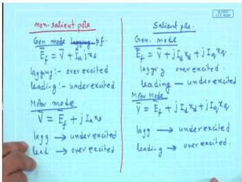
*Figure: Slide discussing operation of a salient-pole synchronous machine without field excitation, emphasizing the reluctance power term.*

> **Final answer:** Reluctance power is the power resulting from the difference between d- and q-axis reactances ($X_d \neq X_q$). It is proportional to $\sin 2\delta$, exists even without field excitation, shifts the maximum power angle below $90^\circ$, increases the power capability, and enhances the synchronising action of the machine.


---

## Question 116
**Topic:** Salient-pole machines, Blondel two-reaction theory and slip test · **Syllabus area:** Week 12 · **Source:** 4A | EM-II ELE 2202 Makeup, 02 July 2016

A 10 kVA, 3 phase, 400 V, 50 Hz, star connected salient pole alternator has direct and quadrature axes reactance of 5 Ω and 2 Ω respectively. When it is delivering full load at 0.8 p.f lag to an infinite bus, determine the electromagnetic power and reluctance power. 5M

### Answer 116
A 10 kVA, 400 V, 50 Hz, three-phase star-connected salient-pole alternator has per-phase direct-axis reactance $X_d = 5\ \Omega$ and quadrature-axis reactance $X_q = 2\ \Omega$. It is delivering full load at 0.8 power factor lagging to an infinite bus. The armature resistance is neglected.

**Step 1: Rated per-phase values**
$$
V_{\text{ph}} = \frac{V_L}{\sqrt{3}} = \frac{400}{\sqrt{3}} = 230.94\ \text{V}
$$
$$
I_a = \frac{S}{\sqrt{3}\,V_L} = \frac{10\times 10^3}{\sqrt{3}\times 400} = 14.434\ \text{A}
$$

**Step 2: Power factor angle**
$$
\phi = \cos^{-1}0.8 = 36.87^\circ\ (\text{lagging})
$$

**Step 3: Load angle $\delta$ using two-reaction phasor**
For a salient-pole generator with negligible resistance, the load angle $\delta$ (the angle between the terminal voltage $V_{\text{ph}}$ and the excitation emf $E_f$) is obtained from the phasor diagram (Fig. below) as:
$$
\tan\delta = \frac{I_a X_q \cos\phi}{V_{\text{ph}} + I_a X_q \sin\phi}
$$
Substituting the values:
$$
\tan\delta = \frac{14.434 \times 2 \times 0.8}{230.94 + 14.434 \times 2 \times 0.6} = \frac{23.094}{248.261} = 0.0930
$$
$$
\Rightarrow \delta = 5.3145^\circ
$$

  
*Figure: Two-reaction phasor diagram of a salient-pole alternator delivering lagging load.*

**Step 4: d- and q-axis current components**
The armature current $I_a$ lags $V_{\text{ph}}$ by $\phi$. The angle between $I_a$ and the $q$-axis is $\psi = \phi + \delta = 36.87^\circ + 5.3145^\circ = 42.1845^\circ$. Hence,
$$
I_d = I_a \sin\psi = 14.434 \sin 42.1845^\circ = 9.6925\ \text{A}
$$
$$
I_q = I_a \cos\psi = 14.434 \cos 42.1845^\circ = 10.695\ \text{A}
$$

**Step 5: Excitation emf per phase**
$$
E_f = V_{\text{ph}}\cos\delta + X_d I_d = 230.94 \cos 5.3145^\circ + 5 \times 9.6925 = 278.41\ \text{V}
$$

**Step 6: Electromagnetic power**
The total three-phase electromagnetic power developed in a salient-pole synchronous machine is given by the sum of the excitation power and the reluctance (saliency) power:
$$
P_{\text{em}} = \frac{3\,V_{\text{ph}} E_f}{X_d}\sin\delta \;+\; \frac{3\,V_{\text{ph}}^2}{2} \!\left(\frac{1}{X_q}-\frac{1}{X_d}\right)\!\sin 2\delta
$$
Because armature resistance is zero, the terminal active power equals the electromagnetic power. At full load and 0.8 pf,
$$
P_{\text{em}} = S\cos\phi = 10 \times 0.8 = 8\ \text{kW} = 8000\ \text{W}
$$

**Step 7: Reluctance power**
The second term in the power equation is the reluctance power:
$$
P_{\text{rel}} = \frac{3\,V_{\text{ph}}^2}{2} \!\left(\frac{1}{X_q}-\frac{1}{X_d}\right)\!\sin 2\delta
$$
Substituting,
$$
P_{\text{rel}} = \frac{3 \times (230.94)^2}{2} \!\left(\frac{1}{2}-\frac{1}{5}\right)\sin(2 \times 5.3145^\circ)
             = \frac{3 \times 53333}{2} \times 0.3 \times \sin 10.629^\circ
             \approx 80000 \times 0.3 \times 0.1845 = 4428\ \text{W}
$$
$$
\boxed{P_{\text{rel}} \approx 4.43\ \text{kW}}
$$

(For completeness, the excitation power component is $8.00 - 4.43 = 3.57\ \text{kW}$.)

> **Final answer:** Electromagnetic power $= 8\ \text{kW}$; reluctance power $= 4.43\ \text{kW}$.


---

## Question 117
**Topic:** Salient-pole machines, Blondel two-reaction theory and slip test · **Syllabus area:** Week 12 · **Source:** 4A | EM-II ELE 2202 Makeup, 13 June 2019

Draw and explain the phasor diagram of salient pole alternator based on Blondel’s two reaction theory. (05)

### Answer 117
In a salient-pole alternator the air-gap is non-uniform, causing the direct-axis reactance $X_d$ to be much larger than the quadrature-axis reactance $X_q$. Blondel's two-reaction theory handles this by resolving the armature current $I_a$ into a direct-axis component $I_d$ and a quadrature-axis component $I_q$, which act on $X_d$ and $X_q$ respectively. This approach allows a phasor diagram to be drawn even though a single synchronous reactance cannot be defined.

**Phasor diagram construction (generator convention, lagging load, $R_a$ neglected):**

1. Draw the terminal voltage $V$ as reference phasor horizontally to the right.
2. Draw the armature current $I_a$ lagging $V$ by the power-factor angle $\phi$.
3. The direct axis (d-axis) is fixed to the rotor field poles; in the phasor diagram it is a line that lies at an angle $\delta$ (the load or torque angle) ahead of $V$, because the excitation emf $E_f$ lies exactly along this axis.
4. The quadrature axis (q-axis) is $90^\circ$ electrically ahead of the d-axis.
5. Resolve $I_a$ into:
   - $I_d = I_a \sin(\delta+\phi)$ along the d-axis but in opposition to the field for lagging loads,
   - $I_q = I_a \cos(\delta+\phi)$ along the q-axis.
6. From the tip of $V$, add the voltage drop $j X_q I_q$. This drop leads $I_q$ by $90^\circ$ and is therefore perpendicular to the q-axis.
7. From the tip of the resultant, add the drop $j X_d I_d$. This drop leads $I_d$ by $90^\circ$ and is perpendicular to the d-axis.
8. The final phasor is the excitation emf $E_f$, which lies exactly on the d-axis. The phasor sum is
   $$
   E_f = V + j X_d I_d + j X_q I_q .
   $$
   If armature resistance is considered, add $I_a R_a$ in phase with $I_a$.

The completed diagram clearly shows that the unequal reactances produce a voltage drop that depends not only on the magnitude of $I_a$ but also on its phase position, thereby influencing the voltage regulation. The difference between the cylindrical-rotor and salient-pole diagrams is the replacement of the single synchronous reactance drop $j X_s I_a$ by the two separate drops $j X_d I_d$ and $j X_q I_q$.


> **Final answer:** The salient-pole phasor diagram differs from the cylindrical-rotor diagram because the armature current is resolved into direct and quadrature components that encounter different reactances $X_d$ and $X_q$. The excitation emf is $E_f = V + j X_d I_d + j X_q I_q$ (neglecting $R_a$), and the diagram shows the load angle $\delta$ between $V$ and the direct axis.


---

## Question 118
**Topic:** Salient-pole machines, Blondel two-reaction theory and slip test · **Syllabus area:** Week 12 · **Source:** 5A | EM-II ELE 2202 Makeup, 13 June 2019

What is meant by reluctance power in salient pole synchronous machines? Discuss with power-angle characteristics. (03)

### Answer 118
Reluctance power is the component of active power developed in a salient-pole synchronous machine that arises purely from the difference between the direct-axis and quadrature-axis synchronous reactances ($X_d > X_q$). Because the rotor is physically salient, the magnetic circuit offers a preferred low-reluctance path along the direct axis. According to Blondel's two-reaction theory, the armature current is resolved into d- and q-axis components, and the resulting magnetic asymmetry gives rise to an additional torque even in the absence of field excitation. This torque tends to align the rotor with the stator rotating field to minimize the air-gap reluctance, hence the name 'reluctance power'.

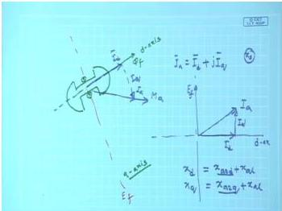

In the power-angle characteristic (neglecting resistance),

$$
P = \frac{3 E_f V}{X_d} \sin\delta + \frac{3 V^2}{2}\left(\frac{1}{X_q} - \frac{1}{X_d}\right) \sin 2\delta
$$

The first term is the **excitation power**, also found in cylindrical-rotor machines, and varies as $\sin\delta$. The second term is the **reluctance power**; it:

- varies as $\sin 2\delta$,
- reaches a maximum at $\delta = 45^\circ$ (for the reluctance component alone),
- exists even if the field current is zero ($E_f = 0$),
- modifies the net power-angle curve by adding a second-harmonic component, thereby increasing the steady-state stability limit and shifting the maximum power point to an angle smaller than $90^\circ$.

The presence of reluctance power allows salient-pole machines to develop torque without excitation and improves their power density and stability compared to cylindrical-rotor machines where $X_d = X_q$ and the second term vanishes.

> **Final answer:** Reluctance power is the saliency-produced power component proportional to $\sin 2\delta$; it enhances the power capability of salient-pole machines and is zero for cylindrical rotors where $X_d = X_q$.


---

## Question 119
**Topic:** Salient-pole machines, Blondel two-reaction theory and slip test · **Syllabus area:** Week 12 · **Source:** 4B | EM-II ELE 2202 Makeup, 16 June 2017

Draw and explain the phasor diagram of salient pole alternator based on Blondel’s two reaction theory. (03)

### Answer 119
**Blondel's two-reaction theory** resolves the armature mmf (or current) into components along the **direct axis (d-axis)** and the **quadrature axis (q-axis)**. Because the air-gap length is non-uniform in a salient-pole machine, the magnetic circuits along these axes have different reluctances, giving rise to two distinct synchronous reactances:
- $X_d$ (direct-axis synchronous reactance)
- $X_q$ (quadrature-axis synchronous reactance)

This separation leads to the phasor diagram described below. The diagram is drawn for an alternator (generator) supplying a **lagging power-factor load**, which is the common practical case.

---

**Construction of the phasor diagram**

1. **Choose the reference.**  
   Take the terminal voltage $\mathbf{V}$ as the reference phasor along the horizontal direction.

2. **Draw the armature current.**  
   Draw the armature current $\mathbf{I_a}$ lagging $\mathbf{V}$ by the power-factor angle $\phi$.

3. **Locate the d- and q-axes.**  
   - The excitation emf $\mathbf{E_f}$ lies along the **direct axis (d-axis)**.  
   - The **quadrature axis (q-axis)** is perpendicular to the d-axis; it is taken 90° ahead of the d-axis in the direction of rotation.  
   - The load angle $\delta$ is the angle between $\mathbf{V}$ and $\mathbf{E_f}$ (i.e. between $\mathbf{V}$ and the d-axis). For a generator, $\mathbf{E_f}$ leads $\mathbf{V}$ by $\delta$.

4. **Resolve $\mathbf{I_a}$ into its d- and q-axis components.**  
   - $I_d$ : component along the d-axis. For a lagging load this component is **demagnetising** (opposes the field flux).  
   - $I_q$ : component along the q-axis.  
   The resolution depends on the angle $\psi = \delta + \phi$ between $\mathbf{I_a}$ and the q-axis:
   $$I_q = I_a \cos \psi, \qquad I_d = I_a \sin \psi$$

5. **Draw the reactance drops.**  
   - The drop $jX_q I_q$ leads $I_q$ by 90°; since $I_q$ lies along the q-axis, this drop is **parallel to the d-axis**.  
   - The drop $jX_d I_d$ leads $I_d$ by 90°; since $I_d$ lies along the d-axis, this drop is **parallel to the q-axis**.  
   Starting from the tip of $\mathbf{V}$, add these drops in sequence: typically $jX_q I_q$ is added first (any order yields the same final emf).

6. **Obtain the excitation emf.**  
   The phasor sum gives the induced emf:
   $$
   \mathbf{E_f} = \mathbf{V} + \mathbf{I_a} R_a + jX_d \mathbf{I_d} + jX_q \mathbf{I_q}
   $$
   The armature resistance $R_a$ is often small and can be neglected, leading to the simpler form
   $$
   \mathbf{E_f} = \mathbf{V} + jX_d \mathbf{I_d} + jX_q \mathbf{I_q}
   $$

Figure 1 shows the completed phasor diagram for a salient-pole alternator with a lagging load.


---

The key difference from the cylindrical-rotor (non-salient) machine is the appearance of **two distinct reactance drops** instead of a single synchronous-reactance drop. This splitting introduces the **reluctance power** (or torque) component that is a unique feature of salient-pole machines.

> **Final answer:** The phasor diagram of a salient-pole alternator based on Blondel's two-reaction theory is constructed by resolving the armature current into direct-axis ($I_d$) and quadrature-axis ($I_q$) components, adding the reactive drops $jX_d I_d$ (along the q-axis) and $jX_q I_q$ (along the d-axis) to the terminal voltage $\mathbf{V}$ to obtain the excitation emf $\mathbf{E_f} = \mathbf{V} + jX_d \mathbf{I_d} + jX_q \mathbf{I_q}$.


---

## Question 120
**Topic:** Salient-pole machines, Blondel two-reaction theory and slip test · **Syllabus area:** Week 12 · **Source:** 5A | EM-II ELE 2202 Makeup, 19 June 2018

Based on Blondel’s two reaction theory, develop the phasor diagram of a salient pole synchronous generator. (04)

### Answer 120
Blondel's two-reaction theory simplifies the analysis of salient-pole synchronous machines by resolving all armature MMF (or current) into two perpendicular components: one along the direct axis (d-axis) and the other along the quadrature axis (q-axis). The d-axis aligns with the rotor field winding, while the q-axis is 90° ahead of the d-axis in the direction of rotation. Because the magnetic circuits along the two axes have different air-gap lengths, the corresponding synchronous reactances are unequal: $X_d$ (direct-axis synchronous reactance) is larger than $X_q$ (quadrature-axis synchronous reactance).

For a three-phase salient-pole synchronous generator, neglecting armature resistance, the per-phase phasor equation is

$$
E_f = V + j X_d I_d + j X_q I_q
$$

where  
$E_f$ = excitation emf (internal voltage)  
$V$   = terminal voltage (per phase)  
$I_a$ = armature current  
$I_d$ = direct-axis component of $I_a$  
$I_q$ = quadrature-axis component of $I_a$  
$\delta$ = load (power) angle between $E_f$ and $V$  
$\phi$   = power-factor angle between $V$ and $I_a$.

**Construction of the phasor diagram (generator action, lagging power factor):**

1. Draw the terminal voltage phasor $V$ horizontally (reference).
2. Draw the armature current $I_a$ lagging $V$ by the load power-factor angle $\phi$.
3. Locate the q-axis: it is the line along which $E_f$ is directed (since $E_f$ lies on the d-axis, which lags the q-axis by $90°$). The angle between $V$ and $E_f$ is the load angle $\delta$.
4. Resolve $I_a$ into
   - $I_d$ : projection of $I_a$ onto the d-axis (for lagging power factor $I_d$ is negative, i.e., it points opposite to $E_f$),
   - $I_q$ : projection of $I_a$ onto the q-axis.
   Mathematically,
   $$
   I_d = I_a \sin(\phi + \delta) \quad \text{and} \quad I_q = I_a \cos(\phi + \delta).
   $$
5. Starting from the tip of $V$, add the phasor $j X_q I_q$ perpendicular to $I_q$ (leading $I_q$ by $90°$). This step determines the location of the q-axis.
6. From the new point, add $j X_d I_d$ perpendicular to $I_d$ (leading $I_d$ by $90°$). The resultant is $E_f$.
7. The phasor $E_f$ therefore equals the vector sum $V + j X_q I_q + j X_d I_d$. The power (load) angle $\delta$ is the angle by which $E_f$ leads $V$.

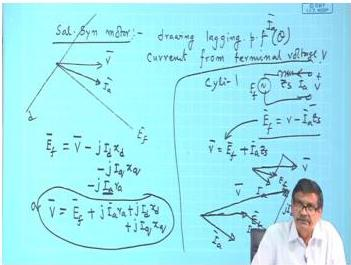

*Caption: Salient-pole synchronous machine phasor diagram. (The diagram shows motor operation; for generator operation $E_f$ leads $V$, but the construction method is identical.)*

The diagram clearly illustrates the physical significance of the two-reaction theory. The difference between $X_d$ and $X_q$ introduces a reluctance-power term that exists even without field excitation. Moreover, for a given terminal voltage $V$ and load, the required excitation $E_f$ and the load angle $\delta$ depend on both reactances, unlike the cylindrical-rotor case where a single synchronous reactance $X_s$ is used.

> **Final answer:** The phasor diagram based on Blondel's two-reaction theory for a salient-pole synchronous generator is constructed from $E_f = V + j X_q I_q + j X_d I_d$, with $I_d$ and $I_q$ resolved along the rotor d- and q-axes. The step-by-step construction is described above.


---

## Question 121
**Topic:** Salient-pole machines, Blondel two-reaction theory and slip test · **Syllabus area:** Week 12 · **Source:** 2C | EM-II ELE 2225 End Sem, 09 May 2024

A 5 MVA slow speed 3 phase synchronous generator rated at 11 kV has 32 poles. Its direct and quadrature axis reactances are 10 Ω and 4 Ω respectively. Neglecting armature resistance, determine the voltage regulation when supplying a rated load at 0.8 p.f lagging. 3

### Answer 121
Rated values: $S = 5\ \text{MVA}$, $V_L = 11\ \text{kV}$, star-connected, 32 poles.

The number of poles does not affect the voltage regulation calculation, which depends only on the electrical quantities.

Phase voltage:
$$ V_{\text{ph}} = \frac{V_L}{\sqrt{3}} = \frac{11\,000}{\sqrt{3}} = 6350.9\ \text{V}. $$

Rated armature current:
$$ I_a = \frac{S}{\sqrt{3} V_L} = \frac{5 \times 10^6}{\sqrt{3} \times 11\,000} = 262.43\ \text{A}. $$

Power-factor angle: $\phi = \cos^{-1} 0.8 = 36.87^\circ$ (lagging).

For a salient-pole machine, the two-reaction theory (Blondel) resolves the armature current into direct-axis $(I_d)$ and quadrature-axis $(I_q)$ components. The load angle $\delta$ is obtained from the phasor diagram (neglecting armature resistance, $R_a \approx 0$):
$$ \tan \delta = \frac{I_a X_q \cos\phi}{V_{\text{ph}} + I_a X_q \sin\phi}. $$

With $X_d = 10\ \Omega$ and $X_q = 4\ \Omega$:
$$
\begin{aligned}
\tan \delta &= \frac{262.43 \times 4 \times 0.8}{6350.9 + 262.43 \times 4 \times 0.6} \\
&= \frac{839.78}{6980.7} = 0.1203 \\
\delta &= \arctan 0.1203 = 6.86^\circ.
\end{aligned}
$$

The current components:
$$
\begin{aligned}
I_d &= I_a \sin(\phi+\delta) = 262.43 \sin(36.87^\circ + 6.86^\circ) = 181.41\ \text{A},\\
I_q &= I_a \cos(\phi+\delta) = 262.43 \cos(43.73^\circ) = 189.64\ \text{A}.
\end{aligned}
$$

The excitation emf per phase (no-load voltage) is:
$$
\begin{aligned}
E_f &= V_{\text{ph}} \cos\delta + X_d I_d \\
&= 6350.9 \cos 6.86^\circ + 10 \times 181.41 \\
&= 6306.2 + 1814 = 8120.2\ \text{V} \quad (\text{approximately } 8119.5\ \text{V}).
\end{aligned}
$$

Voltage regulation:
$$
\%\text{Reg} = \frac{E_f - V_{\text{ph}}}{V_{\text{ph}}} \times 100 
= \frac{8119.5 - 6350.9}{6350.9} \times 100 = 27.85\%.
$$

> **Final answer:** Voltage regulation $= 27.8\%$ (or $27.85\%$).


---

## Question 122
**Topic:** Salient-pole machines, Blondel two-reaction theory and slip test · **Syllabus area:** Week 12 · **Source:** 3A | EM-II ELE 2225 End Sem, 09 May 2024

Differentiate the power-angle characteristics of cylindrical rotor and salient pole synchronous generator. 3

### Answer 122
**Cylindrical-rotor (non-salient) synchronous generator:**

The air-gap is uniform, so the direct-axis and quadrature-axis synchronous reactances are equal ($X_d = X_q = X_s$). Neglecting armature resistance, the steady-state power-angle relation is a pure sine function of the load angle $\delta$:

$$
P = \frac{3 E_f V}{X_s} \sin\delta.
$$

The maximum power occurs at $\delta = 90^\circ$ and the curve is a single sinusoid with no second-harmonic component.

**Salient-pole synchronous generator:**

Because of the non-uniform air-gap, $X_d > X_q$. The power-angle equation derived from the two-reaction theory becomes

$$
P = \frac{3 E_f V}{X_d} \sin\delta
    + \frac{3 V^2}{2}\left(\frac{1}{X_q} - \frac{1}{X_d}\right) \sin 2\delta.
$$

- The first term resembles the cylindrical-rotor case but uses $X_d$ instead of $X_s$.
- The second term is the **reluctance power**, which depends on saliency and exists even without field excitation ($E_f = 0$).
- The $\sin 2\delta$ term modifies the power-angle curve: the peak power is larger and occurs at an angle $\delta_{\max} < 90^\circ$.
- The shape is not a pure sine wave; it contains a second-harmonic component that boosts power output around $45^\circ$-$60^\circ$.

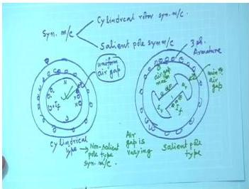

In summary, salient-pole machines benefit from an additional reluctance-torque component that increases steady-state power capability and alters the shape of the $P$-$\delta$ curve compared with cylindrical-rotor machines.

> **Final answer:** Cylindrical rotor: single sine curve, $P = \frac{3EV}{X_s}\sin\delta$, peak at $90^\circ$. Salient pole: sine plus reluctance term $\propto \sin 2\delta$, peak occurs before $90^\circ$, and the curve is not a pure sine wave.

## Question 123
**Topic:** Salient-pole machines, Blondel two-reaction theory and slip test · **Syllabus area:** Week 12 · **Source:** 1C | EM-II ELE 2225 Makeup, 26 June 2024

A three-phase, 20 MVA, 11 kV, 50 Hz star-connected alternator has Xd = 4 Ω and Xq = 3 Ω. Armature resistance is negligibly small. At full load, 0.8 lagging power factor, determine: (a) Direct and quadrature axes components of the armature current. (b) Excitation emf. 4

### Answer 123
**Given:** A three-phase, 20 MVA, 11 kV, 50 Hz, star-connected salient-pole alternator with direct-axis synchronous reactance $X_d = 4\,\Omega$ and quadrature-axis synchronous reactance $X_q = 3\,\Omega$. Armature resistance is negligible. The machine is operating at full load with a power factor of $0.8$ lagging.

---

### 1. Rated current and phase voltage

Rated line current:

$$
I_L = \frac{S_{\text{rated}}}{\sqrt{3}\,V_L} = \frac{20 \times 10^6}{\sqrt{3} \times 11 \times 10^3} = 1049.7\,\text{A}.
$$

For star connection, the armature current $I_a = I_L = 1049.7\,\text{A}$.

Phase voltage:

$$
V_{\text{ph}} = \frac{V_L}{\sqrt{3}} = \frac{11\,\text{kV}}{\sqrt{3}} = 6.351\,\text{kV} = 6351\,\text{V}.
$$

Power-factor angle:

$$
\phi = \cos^{-1}(0.8) = 36.87^\circ \quad (\text{lagging, so current lags voltage}).
$$

---

### 2. Determination of the load angle $\delta$

In the two-reaction (Blondel) theory for salient-pole machines, the armature current is resolved into two components: $I_d$ along the direct axis and $I_q$ along the quadrature axis. The phasor diagram (see Figure 1) yields the load angle $\delta$ between the terminal voltage $V$ and the quadrature axis (which is also the direction of the excitation emf $E_f$).

<figure>
  
  <figcaption><b>Figure 1:</b> Phasor diagram for salient-pole generator (lagging power factor).</figcaption>
</figure>

A convenient formula for $\delta$ is obtained by considering the phasor $V + j X_q I_a$, which lies along the quadrature axis:

$$
\tan\delta = \frac{I_a X_q \cos\phi}{V_{\text{ph}} + I_a X_q \sin\phi}.
$$

Substituting the numerical values:

$$
\begin{aligned}
I_a X_q &= 1049.7 \times 3 = 3149.1\,\text{V}, \\
I_a X_q \cos\phi &= 3149.1 \times 0.8 = 2519.3\,\text{V}, \\
I_a X_q \sin\phi &= 3149.1 \times 0.6 = 1889.5\,\text{V}, \\
V_{\text{ph}} + I_a X_q \sin\phi &= 6351 + 1889.5 = 8240.5\,\text{V}, \\
\tan\delta &= \frac{2519.3}{8240.5} = 0.3057 \;\Rightarrow\; \delta = \arctan(0.3057) = 17.00^\circ.
\end{aligned}
$$

---

### 3. Direct- and quadrature-axis current components

From the phasor diagram, the angle between the armature current $I_a$ and the quadrature axis is $\psi = \phi + \delta$. Therefore:

$$
\begin{aligned}
I_q &= I_a \cos(\phi + \delta) = I_a \cos\psi, \\
I_d &= I_a \sin(\phi + \delta) = I_a \sin\psi.
\end{aligned}
$$

With $\psi = 36.87^\circ + 17.00^\circ = 53.87^\circ$:

$$
\begin{aligned}
I_d &= 1049.7 \times \sin 53.87^\circ = 1049.7 \times 0.8078 = 847.8\,\text{A}, \\
I_q &= 1049.7 \times \cos 53.87^\circ = 1049.7 \times 0.5895 = 618.9\,\text{A}.
\end{aligned}
$$

---

### 4. Excitation emf (per phase and line value)

Projecting the phasors onto the quadrature axis gives the magnitude of the excitation emf $E_f$ (neglecting armature resistance):

$$
E_f = V_{\text{ph}} \cos\delta + X_d I_d.
$$

Substituting the numbers:

$$
\begin{aligned}
V_{\text{ph}} \cos\delta &= 6351 \times \cos 17.00^\circ = 6351 \times 0.9563 = 6073.5\,\text{V}, \\
X_d I_d &= 4 \times 847.8 = 3391.2\,\text{V}, \\[4pt]
E_f &= 6073.5 + 3391.2 = 9464.7\,\text{V} \; (\text{per phase}).
\end{aligned}
$$

The corresponding line-to-line excitation emf is

$$
E_{f,\text{line}} = \sqrt{3} \times 9464.7 \approx 16.39\,\text{kV}.
$$

---

> **Final answer:** (a) $I_d = 847.8\,\text{A}$, $I_q = 618.9\,\text{A}$; (b) excitation emf per phase $= 9.465\,\text{kV}$ (line $= 16.39\,\text{kV}$).


---

## Question 124
**Topic:** Salient-pole machines, Blondel two-reaction theory and slip test · **Syllabus area:** Week 12 · **Source:** 3A | EM-II ELE 2251 End Sem, 31 May 2023

Draw the per phase equivalent circuit and write the expressions relating air-gap voltage, terminal voltage, and excitation emf in an alternator. Compare the steady state mathematical model of salient-pole rotor and non-salient-pole rotor alternators with the help of phasor diagrams relating the induced voltage and terminal voltages. Also, suggest suitable methods to determine the reactance of these machines. (05)

### Answer 124
**Per-phase equivalent circuit and voltage expressions**

For a **non-salient-pole (cylindrical-rotor) alternator**, the per-phase equivalent circuit consists of the excitation emf $E$ behind the synchronous impedance. Typically, the armature resistance $R_a$ and the synchronous reactance $X_s$ are connected in series with $E$, and the terminal voltage $V$ appears across the load. The air-gap voltage $E_g$ (the voltage behind the leakage reactance $X_l$) is an intermediate quantity that accounts for the armature leakage flux. The relationships are:

$$
E = V + I_a R_a + j X_s I_a, \qquad X_s = X_l + X_{ar},
$$

$$
E_g = V + I_a R_a + j X_l I_a,
$$

where $X_{ar}$ is the reactance of armature reaction. In many practical calculations $R_a$ is neglected, giving $E = V + j X_s I_a$.

For a **salient-pole alternator**, the non-uniform air-gap requires the two-reaction (Blondel) theory. The armature current $I_a$ is resolved into direct-axis component $I_d$ (lagging the excitation emf $E$ by $90^\circ$) and quadrature-axis component $I_q$ (in phase with $E$). The per-phase equation becomes:

$$
E = V + I_a R_a + j X_d I_d + j X_q I_q,
$$

where $X_d$ and $X_q$ are the direct- and quadrature-axis synchronous reactances. Neglecting resistance:
$$
E = V + j X_d I_d + j X_q I_q.
$$

**Comparison of cylindrical-rotor and salient-pole models**

- **Cylindrical rotor** (uniform air gap): $X_d = X_q = X_s$. The phasor diagram is straightforward: starting from the terminal voltage $V$, add the resistive drop $I_a R_a$ and the synchronous reactance drop $j X_s I_a$ to obtain $E$. The load angle $\delta$ is simply the angle between $E$ and $V$. The power-angle characteristic is $P = \frac{EV}{X_s}\sin\delta$.

- **Salient-pole rotor** (non-uniform air gap): Because $X_d > X_q$, the armature reaction is not symmetric. The two-reaction phasor diagram requires knowledge of the internal power factor angle $\psi$ (the angle between $I_a$ and $E$) to split $I_a$ into $I_d$ and $I_q$. The voltage drops $j X_q I_q$ and $j X_d I_d$ are added to $V$ to locate $E$. The power-angle characteristic includes a reluctance-power term:
$$
P = \frac{EV}{X_d}\sin\delta + \frac{V^2}{2}\left(\frac{1}{X_q} - \frac{1}{X_d}\right)\sin 2\delta.
$$

**Determination of reactances**

- **Non-salient $X_s$**: The open-circuit (OC) and short-circuit (SC) tests give the unsaturated synchronous reactance $X_s = E_{oc}/I_{sc}$ from the air-gap line. For a more accurate saturated value, the Potier method (or zero-power-factor test) separates the leakage reactance $X_l$.

- **Salient-pole $X_d$, $X_q$**: The **slip test** is employed. A low three-phase voltage is applied to the stator while the rotor is driven at a speed slightly different from synchronous, with the field winding open-circuited. Due to the varying reluctance, the stator current fluctuates. At the instant of minimum current, the rotating field aligns with the direct axis, giving $X_d = V_{ph}/I_{\min}$. At maximum current, the field aligns with the quadrature axis, giving $X_q = V_{ph}/I_{\max}$. The test must be performed at reduced voltage to avoid saturation effects.

> **Final answer:** The per-phase equivalent circuit of a non-salient-pole alternator is a series connection of $E$, $R_a$, and $X_s$; for salient-pole machines the two-axis model separates armature reaction into $d$- and $q$-axis components with $X_d$ and $X_q$. The cylindrical-rotor model uses a single synchronous reactance, while the salient-pole model requires resolving current along the rotor axes and yields a power-angle curve with an additional reluctance torque term. The slip test is the standard method for measuring $X_d$ and $X_q$.


---

## Question 125
**Topic:** Salient-pole machines, Blondel two-reaction theory and slip test · **Syllabus area:** Week 12 · **Source:** 3B | EM-II ELE 2251 Grade Improvement, 11 August 2021

Explain the significance of slip test in Synchronous machines. (04)

### Answer 125
The **slip test** is a simple experimental method to determine the direct-axis synchronous reactance $X_d$ and the quadrature-axis synchronous reactance $X_q$ of a salient-pole synchronous machine. These two distinct reactances arise from the non-uniform air-gap (saliency) of the rotor and are essential for accurate modeling of the machine under Blondel's two-reaction theory.

**Procedure**  
- The rotor is driven by a prime mover at a speed slightly below or above synchronous speed, i.e. with a small slip (typically $0.2\%$-$0.5\%$).  
- The field winding is kept **open-circuited**. This ensures that no field current flows, so the only flux in the machine is produced by the stator armature reaction. An open field also avoids dangerously high induced voltages.  
- A low three-phase voltage (about $10\%$-$20\%$ of rated) is applied to the stator. The voltage must be low to keep the magnetic circuit unsaturated and prevent overheating.  
- Because the rotor poles slowly slip past the rotating stator mmf, the relative position between the stator field axis and the rotor axis changes continuously.  
  - When the rotor **direct axis ($d$-axis)** aligns with the stator mmf, the air-gap reluctance is minimum, the flux per ampere is maximum, and the reactance offered by the machine is maximum. Consequently, the stator current reaches a **minimum** $I_{\min}$.  
  - When the rotor **quadrature axis ($q$-axis)** aligns, the reluctance is maximum, the reactance is minimum, and the stator current reaches a **maximum** $I_{\max}$.  
- Thus the stator current oscillates between $I_{\min}$ and $I_{\max}$ at a frequency equal to twice the slip frequency. An ammeter and voltmeter record the rms values of voltage and the extremes of current.

**Determination of Reactances**  
Under the constant applied phase voltage $V_{\text{ph}}$, the reactances are simply obtained from the extreme current readings:

$$
\begin{aligned}
X_d &= \frac{V_{\text{ph}}}{I_{\min}} \quad \text{(maximum reactance, minimum current)} \\[4pt]
X_q &= \frac{V_{\text{ph}}}{I_{\max}} \quad \text{(minimum reactance, maximum current)}
\end{aligned}
$$

These are the *synchronous reactances* for the direct and quadrature axes. They include both armature-reaction reactance ($X_{ad}$ or $X_{aq}$) and leakage reactance $X_l$: $X_d = X_{ad}+X_l$, $X_q = X_{aq}+X_l$.

**Significance**  
The knowledge of $X_d$ and $X_q$ is indispensable for salient-pole synchronous machines because:

- They form the basis of **Blondel's two-reaction theory**, which allows accurate phasor diagrams to be drawn for both generator and motor operation.  
- **Voltage regulation** of salient-pole alternators can be correctly calculated using the two-reaction method; a single synchronous reactance (from conventional open-/short-circuit tests) would give erroneous results.  
- The **power-angle characteristic** of a salient-pole machine contains an additional reluctance-power term that depends directly on the difference between $X_d$ and $X_q$:
  $$
  P = \frac{EV}{X_d}\sin\delta + \frac{V^2}{2}\!\left(\frac{1}{X_q}-\frac{1}{X_d}\right)\sin 2\delta
  $$
- They are required for **stability studies**, excitation control design, and predicting machine performance under various loading conditions.  

Without the slip test, obtaining $X_d$ and $X_q$ experimentally would be much more complicated; it is the only straightforward method that separates the two axes effects.

> **Final answer:** The slip test provides $X_d$ and $X_q$ by measuring the fluctuating stator current at a small slip; these reactances are fundamental for accurate analysis, phasor diagrams, voltage regulation, and power-angle calculations of salient-pole synchronous machines.


---

## Question 126
**Topic:** Field excitation effects, synchronous motor operation, power-angle, V-curves, starting and hunting · **Syllabus area:** Week 12 · **Source:** 4A | EM-II ELE 204 End Sem, 13 May 2014

A 3 phase, 20 MVA, star connected alternator with an impedance of (0.5+j 6) per phase is operating in parallel with constant voltage 11 kV bus bars. The field current is adjusted to give a line excitation voltage of 12 kV. With constant excitation, calculate (i) maximum power output from the alternator (ii) armature current and power factor under maximum power condition. (04)

### Answer 126
A 3-phase, star-connected alternator operates on infinite busbars. The per-phase equivalent circuit consists of a source $E_{ph}$ (the excitation voltage) behind the synchronous impedance $Z_s = R + jX$.

- Line voltage of busbars, $V_L = 11\,\text{kV}$ (star) → Phase voltage $V_{ph} = \frac{11}{\sqrt{3}} = 6.351\,\text{kV}$.
- Line excitation voltage, $E_L = 12\,\text{kV}$ (star) → Phase voltage $E_{ph} = \frac{12}{\sqrt{3}} = 6.928\,\text{kV}$.
- Per-phase synchronous impedance: $Z_s = 0.5 + j6\,\Omega$.
- Magnitude $|Z_s| = \sqrt{0.5^2 + 6^2} = 6.021\,\Omega$.
- Impedance angle $\theta = \tan^{-1}\left(\frac{6}{0.5}\right) = 85.24^\circ$.

**Power output per phase**
For a round-rotor alternator, the real power delivered per phase is

$$
P_{ph} = \frac{E_{ph}V_{ph}}{|Z|} \cos(\theta - \delta) - \frac{V_{ph}^2}{|Z|} \cos\theta,
$$

where $\delta$ is the load angle (angle by which $E_{ph}$ leads $V_{ph}$). The total three-phase power is $P = 3P_{ph}$.

**(i) Maximum power output**
Differentiating $P$ with respect to $\delta$ yields

$$
\frac{dP}{d\delta} = 3\,\frac{E_{ph}V_{ph}}{|Z|} \sin(\theta - \delta) = 0
\;\Longrightarrow\; \delta = \theta = 85.24^\circ.
$$

Substituting $\delta = \theta$ gives the maximum power:

$$
\begin{aligned}
P_{\max} &= 3\left[ \frac{E_{ph}V_{ph}}{|Z|} - \frac{V_{ph}^2}{|Z|} \cos\theta \right].
\end{aligned}
$$

Insert the numerical values (using $\text{kV}$ and $\Omega$, the result is in $\text{MW}$):

$$
\frac{E_{ph}V_{ph}}{|Z|} = \frac{(12/\sqrt{3})(11/\sqrt{3})}{6.021} = \frac{44}{6.021} = 7.312\;\text{MW/phase},
$$

$$
\frac{V_{ph}^2}{|Z|}\cos\theta = \frac{(11/\sqrt{3})^2}{6.021} \times \frac{0.5}{6.021} = \frac{40.333}{6.021} \times 0.08305 = 0.557\;\text{MW/phase}.
$$

Hence

$$
P_{\max} = 3\,(7.312 - 0.557) = 20.26\;\text{MW}.
$$

**(ii) Armature current and power factor at $P_{\max}$**
With $\delta = \theta$, the phasor difference $E_{ph} - V_{ph}$ is

$$
E_{ph}\angle\theta - V_{ph}\angle 0^\circ = (6.928\angle 85.24^\circ - 6.351)\;\text{kV}.
$$

Evaluating the complex numbers:

$$
\begin{aligned}
E_{ph}\angle 85.24^\circ &= 6.928(0.08305 + j0.9965) = 0.5754 + j6.9048 \;\text{kV},\\
E_{ph} - V_{ph} &= (-5.7756 + j6.9048)\;\text{kV}.
\end{aligned}
$$

The magnitude of the difference is $\sqrt{(5.7756)^2 + (6.9048)^2} = 9.0018\;\text{kV}$.

The armature current per phase is

$$
I_a = \frac{E_{ph} - V_{ph}}{Z_s} = \frac{9.0018\angle 129.9^\circ}{6.021\angle 85.24^\circ}
= 1.495\;\text{kA}\angle 44.66^\circ.
$$

Therefore the line current is $I_L = |I_a| = 1495\;\text{A}$.

The power factor is the cosine of the angle between $V_{ph}$ (reference) and $I_a$:

$$
\cos\phi = \frac{P_{\max}}{\sqrt{3}\,V_L I_L} = \frac{20.26\times10^6}{\sqrt{3}\times 11000\times 1495} = 0.711.
$$

Since $I_a$ leads $V_{ph}$ by $44.66^\circ$, the power factor is **0.711 leading**. (Equivalently, the negative reactive power $Q = -3\,(V_{ph}^2/|Z|)\sin\theta$ confirms leading operation.)

> **Final answer:**  
> (i) Maximum power output = **20.26 MW**  
> (ii) Armature current = **1495 A**, power factor = **0.711 leading**


---

## Question 127
**Topic:** Field excitation effects, synchronous motor operation, power-angle, V-curves, starting and hunting · **Syllabus area:** Week 12 · **Source:** 5A | EM-II ELE 204 End Sem, 13 May 2014

A 3 phase, 50 Hz, 4 pole, 10 kVA, 400 V, star connected synchronous motor has a per phase synchronous impedance of (3 + j4). When supplying rated current, the field current is so adjusted that the line emf induced is 451 V. Determine (a) load angle and power factor (b) active power input and gross power output (c) efficiency assuming rotational loss of 1 kW. (05)

### Answer 127
**Data:**  
- Synchronous motor: 3-phase, star-connected, $400\,\text{V}$, $10\,\text{kVA}$, $50\,\text{Hz}$, 4-pole.  
- Per-phase synchronous impedance: $Z_s = (3 + j4)\,\Omega = 5\angle 53.13^\circ\,\Omega$.  
- Line induced emf: $E_L = 451\,\text{V} \;\Rightarrow\; E_{ph} = \frac{451}{\sqrt{3}} = 260.39\,\text{V}$.  
- Phase voltage: $V_{ph} = \frac{400}{\sqrt{3}} = 230.94\,\text{V}$.  
- Rated current: $I = \frac{10\,000}{\sqrt{3}\times 400} = 14.434\,\text{A}$.

**(a) Load angle and power factor**  
For a synchronous motor the per-phase phasor relation is  
$$\vec{V}_{ph} = \vec{E}_{ph} + \vec{I}Z_s$$  
with $\vec{E}_{ph}$ lagging $\vec{V}_{ph}$ by the load angle $\delta$.  
The magnitude of the impedance drop is  
$$I Z_s = 14.434 \times 5 = 72.17\ \text{V}.$$  
The three voltage phasors form a triangle; using the law of cosines,  
$$
\cos\delta = \frac{V_{ph}^2 + E_{ph}^2 - (I Z_s)^2}{2\,V_{ph}\,E_{ph}}
           = \frac{230.94^2 + 260.39^2 - 72.17^2}{2 \times 230.94 \times 260.39}
           = 0.9639,
$$  
hence  
$$\delta = \cos^{-1}(0.9639) = 15.44^\circ \quad (\text{E lags V}).$$

To obtain the current phasor, set $\vec{V}_{ph} = 230.94\angle 0^\circ$ and  
$\vec{E}_{ph} = 260.39\angle -15.44^\circ$. Then  
$$
\vec{V}_{ph} - \vec{E}_{ph} = 230.94 - 260.39(\cos 15.44^\circ - j\sin 15.44^\circ)
                          = -20.06 + j69.3
                          = 72.17\angle 106.15^\circ\ \text{V}.
$$
Therefore  
$$
\vec{I} = \frac{\vec{V}_{ph} - \vec{E}_{ph}}{Z_s}
        = \frac{72.17\angle 106.15^\circ}{5\angle 53.13^\circ}
        = 14.434\angle 53.02^\circ\ \text{A}.
$$
The current leads the terminal voltage by $53.02^\circ$, so the power factor is  
$$\text{pf} = \cos 53.02^\circ = 0.602\quad (\text{leading}).$$

**(b) Active power input and gross mechanical output**  
Active power input:  
$$
P_{\text{in}} = \sqrt{3}\,V_L I \cos\phi
             = \sqrt{3} \times 400 \times 14.434 \times 0.602
             = 6019\ \text{W} \approx 6.019\ \text{kW}.
$$
(Equivalently, $P_{\text{in}} = 3 V_{ph} I \cos\phi = 3 \times 230.94 \times 14.434 \times 0.602 = 6019\ \text{W}$.)  

Armature copper loss:  
$$
P_{\text{cu}} = 3 I^2 R_a = 3 \times (14.434)^2 \times 3 = 1875\ \text{W} = 1.875\ \text{kW}.
$$
Gross mechanical power developed (air-gap power):  
$$
P_{\text{gross}} = P_{\text{in}} - P_{\text{cu}} = 6019 - 1875 = 4144\ \text{W} \approx 4.144\ \text{kW}.
$$

**(c) Efficiency**  
Rotational loss (friction and iron) $= 1\ \text{kW}$.  
Shaft output power:  
$$
P_{\text{shaft}} = P_{\text{gross}} - 1000 = 4144 - 1000 = 3144\ \text{W}.
$$
Efficiency:  
$$
\eta = \frac{P_{\text{shaft}}}{P_{\text{in}}} \times 100\%
     = \frac{3144}{6019} \times 100\% = 52.2\%.
$$

> **Final answer:**  
> (a) $\delta = 15.44^\circ$, power factor $= 0.602$ leading.  
> (b) $P_{\text{in}} = 6.019\ \text{kW}$, $P_{\text{gross}} = 4.144\ \text{kW}$.  
> (c) Efficiency $= 52.2\%$.


---

## Question 128
**Topic:** Field excitation effects, synchronous motor operation, power-angle, V-curves, starting and hunting · **Syllabus area:** Week 12 · **Source:** 5B | EM-II ELE 204 End Sem, 13 May 2014

A supply system has the following loads: 100 kW upf load and 400 kW load at 0.6 pf lag. A 50 HP synchronous motor when connected in parallel with existing load improves the overall power factor to 0.95 lag. Assuming motor efficiency as 87%, determine (a) leading kVAR supplied by the motor (b) kVA rating of motor (c) motor power factor. (03)

### Answer 128
**Existing loads**  
The supply system initially has two loads:
- 100 kW at unity power factor (upf):  
  $P_1 = 100\ \text{kW},\quad \text{pf}_1 = 1\ \Rightarrow\ Q_1 = 0$.
- 400 kW at 0.6 pf lagging:  
  $\phi_2 = \cos^{-1}(0.6) = 53.13^\circ$,  
  $Q_2 = 400 \tan 53.13^\circ = 400 \times \frac{4}{3} = 533.33\ \text{kVAR (lag)}$.

Total existing load:
$$
P_{\text{old}} = 100 + 400 = 500\ \text{kW},
\qquad
Q_{\text{old}} = 0 + 533.33 = 533.33\ \text{kVAR (lag)}.
$$

**Synchronous motor input power**  
A 50 HP synchronous motor is connected in parallel. Using the conversion $1\ \text{HP} = 0.746\ \text{kW}$, the mechanical output is:
$$
P_{\text{mech}} = 50 \times 0.746 = 37.3\ \text{kW}.
$$
With an efficiency $\eta = 87\% = 0.87$, the electrical input power is:
$$
P_m = \frac{P_{\text{mech}}}{\eta} = \frac{37.3}{0.87} \approx 42.87\ \text{kW}.
$$

**Overall load after improvement**  
The total real power becomes:
$$
P_{\text{new}} = P_{\text{old}} + P_m = 500 + 42.87 = 542.87\ \text{kW}.
$$
It is required that the overall power factor be improved to $0.95$ lagging. Thus:
$$
\phi_{\text{new}} = \cos^{-1}(0.95) = 18.19^\circ,\quad
\tan\phi_{\text{new}} \approx 0.3287.
$$
The corresponding total reactive power is:
$$
Q_{\text{new}} = P_{\text{new}} \tan\phi_{\text{new}} = 542.87 \times 0.3287 \approx 178.5\ \text{kVAR (lag)}.
$$

**Reactive power supplied by the motor**  
The change in total reactive power must be supplied by the synchronous motor:
$$
Q_m = Q_{\text{new}} - Q_{\text{old}} = 178.5 - 533.33 = -354.83\ \text{kVAR}.
$$
The negative sign indicates that the motor delivers leading reactive power. Hence, the motor supplies **354.83 kVAR leading** (rounded to 354.8 kVAR). This is achieved by operating the machine in an over-excited condition, where it draws a leading current and behaves as a synchronous condenser while also driving its mechanical load.

**kVA rating and power factor of the motor**  
The apparent power (kVA rating) of the motor is:
$$
S_m = \sqrt{P_m^2 + Q_m^2} = \sqrt{(42.87)^2 + (354.83)^2}
      \approx \sqrt{1837.8 + 125\,904.7} = \sqrt{127\,742.5} \approx 357.4\ \text{kVA}.
$$
The motor power factor is:
$$
\text{pf}_m = \frac{P_m}{S_m} = \frac{42.87}{357.4} \approx 0.12\ \text{leading}.
$$

> **Final answer:**  
> (a) 354.8 kVAR leading;  
> (b) 357.4 kVA;  
> (c) 0.12 leading.


---

## Question 129
**Topic:** Field excitation effects, synchronous motor operation, power-angle, V-curves, starting and hunting · **Syllabus area:** Week 12 · **Source:** 5B | EM-II ELE 204 Makeup, 08 July 2014

A 3 phase, 50 Hz, 400 V installation draws a current of 36.1 A at 0.8 power factor lagging. A 3 phase 10 KVA synchronous motor operating at 0.6 power factor leading is connected in parallel with the existing load. Determine (i) the overall power factor of the installation, (ii) net reactive power taken from the supply. (03)

### Answer 129
We are given a three-phase installation with an existing load and a synchronous motor added in parallel.  We need to find the overall power factor and the net reactive power drawn from the supply.

**Existing load**  
Line voltage $V_L = 400\,\text{V}$, line current $I_L = 36.1\,\text{A}$, power factor $0.8$ lagging.  
Active power:
$$
P_1 = \sqrt{3}\,V_L I_L \cos\phi = \sqrt{3} \times 400 \times 36.1 \times 0.8 = 20.0\,\text{kW}
$$
Reactive power (positive for lagging):
$$
Q_1 = \sqrt{3}\,V_L I_L \sin\phi = \sqrt{3} \times 400 \times 36.1 \times 0.6 = 15.0\,\text{kVAr (lagging)}
$$

**Synchronous motor**  
Rating $S_m = 10\,\text{kVA}$, power factor $0.6$ leading.  
Active power:
$$
P_m = S_m \times \cos\phi_m = 10 \times 0.6 = 6.0\,\text{kW}
$$
Reactive power (negative for leading):
$$
Q_m = -S_m \times \sin(\cos^{-1}0.6) = -10 \times 0.8 = -8.0\,\text{kVAr (leading)}
$$

**Total after adding the synchronous motor**  
Total active power:
$$
P_{\text{total}} = P_1 + P_m = 20.0 + 6.0 = 26.0\,\text{kW}
$$
Total reactive power:
$$
Q_{\text{total}} = Q_1 + Q_m = 15.0 - 8.0 = 7.0\,\text{kVAr (lagging)}
$$
Overall apparent power:
$$
S_{\text{total}} = \sqrt{P_{\text{total}}^2 + Q_{\text{total}}^2} = \sqrt{26.0^2 + 7.0^2} \approx 26.93\,\text{kVA}
$$
Overall power factor:
$$
\text{pf}_{\text{total}} = \frac{P_{\text{total}}}{S_{\text{total}}} = \frac{26.0}{26.93} = 0.966 \quad (\text{lagging, because } Q_{\text{total}} > 0)
$$

> **Final answer:** (i) Overall power factor = 0.966 lagging; (ii) Net reactive power taken from supply = 7.0 kVAr lagging.


---

## Question 130
**Topic:** Field excitation effects, synchronous motor operation, power-angle, V-curves, starting and hunting · **Syllabus area:** Week 12 · **Source:** 5A | EM-II ELE 204 Makeup, 09 July 2015

A factory has an average load of 300 kW at a power factor of 0.6 lagging. A synchronous motor is used to raise the combined power factor to 0.9 lagging and at the same time to supply a mechanical load of 60 kW. Calculate KVA rating and power factor of synchronous motor. Assume 88% as the efficiency of synchronous motor (03)

### Answer 130
**Step 1: Original factory load**

Given:
$$
P_1 = 300\,\text{kW},\quad \cos\phi_1 = 0.6\ \text{(lagging)}
$$
$$
\phi_1 = \cos^{-1} 0.6 = 53.13^\circ
$$
$$
Q_1 = P_1 \tan\phi_1 = 300 \times \tan 53.13^\circ = 300 \times 1.333 = 400\,\text{kVAr (lagging)}
$$

**Step 2: Synchronous motor input power**

The motor supplies a mechanical load of 60 kW with an efficiency of 88 %. Its electrical input power is
$$
P_m = \frac{60}{0.88} = 68.18\,\text{kW}
$$

**Step 3: Combined system requirements**

Total real power after adding the motor:
$$
P_{\text{total}} = P_1 + P_m = 300 + 68.18 = 368.18\,\text{kW}
$$

Desired overall power factor is 0.9 lagging:
$$
\phi_{\text{new}} = \cos^{-1} 0.9 = 25.84^\circ
$$
$$
Q_{\text{total}} = P_{\text{total}} \tan\phi_{\text{new}} = 368.18 \times \tan 25.84^\circ = 368.18 \times 0.4843 \approx 178.4\,\text{kVAr}
$$

**Step 4: Motor reactive power**

To achieve the overall 0.9 lagging pf, the motor must contribute a reactive power
$$
Q_m = Q_{\text{total}} - Q_1 = 178.4 - 400 = -221.6\,\text{kVAr}
$$
The negative sign indicates that the motor supplies 221.6 kVAr **leading** (i.e., it acts as a capacitive element, canceling part of the factory's lagging vars).

**Step 5: KVA rating of the motor**

$$
S_m = \sqrt{P_m^2 + Q_m^2} = \sqrt{68.18^2 + (-221.6)^2} = \sqrt{4648.5 + 49106.6} \approx \sqrt{53755.1} = 231.9\,\text{kVA}
$$

Rounding up, the required kVA rating is approximately **232 kVA**.

**Step 6: Motor power factor**

$$
\text{pf}_m = \frac{P_m}{S_m} = \frac{68.18}{231.9} \approx 0.294
$$
Since $Q_m$ is leading, the power factor is **0.294 leading**.

> **Final answer:** KVA rating ≈ 232 kVA, power factor = 0.294 leading.


---

## Question 131
**Topic:** Field excitation effects, synchronous motor operation, power-angle, V-curves, starting and hunting · **Syllabus area:** Week 12 · **Source:** 3B | EM-II ELE 2202 End Sem, 10 May 2016

A turbo alternator with synchronizing reactance of 10Ω, is delivering 200A at upf to an infinite bus at a voltage of 11kV. If the prime mover input is kept constant & excitation is increased by 20%, find the new current and power factor. Keeping the excitation at the increased level, find the maximum power output of the alternator and the corresponding current and power factor. (06)

### Answer 131
**Initial operating state**

Compute excitation emf:

$$
E_f = V_{ph} + j X_s I_a = 6351 + j(10)(200) = 6351 + j2000\,\text{V}
$$
$$
|E_f| = \sqrt{6351^2 + 2000^2} = 6.658\,\text{kV}
$$
Load angle $\delta = \tan^{-1}\frac{2000}{6351} = 17.48^\circ$.

Real power output:
$$
P = \sqrt{3} V_L I_a \cos\phi = \sqrt{3}\times 11\,000 \times 200 \times 1 = 3.811\,\text{MW}.
$$

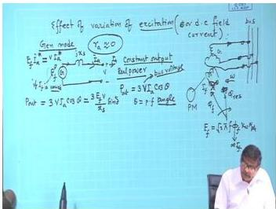
<p align=\"center\"><em>Fig: Effect of increased excitation on generator phasor diagram (constant power)</em></p>

**Effect of 20% increase in excitation**

New excitation emf: $E_f' = 1.2 \times 6.658 = 7.990\,\text{kV}$.
Since prime mover input (and thus output power) remains constant, the new load angle $\delta'$ satisfies:
$$
P = \frac{3 V_{ph} E_f'}{X_s} \sin\delta' \;\Longrightarrow\; \sin\delta' = \frac{P X_s}{3 V_{ph} E_f'} = \frac{3.811\times10^6 \times 10}{3 \times 6351 \times 7990} = 0.2504
$$
$$
\delta' = \sin^{-1}(0.2504) = 14.50^\circ.
$$

New armature current (per phase):
$$
\bar{I}_a' = \frac{\bar{E}_f' - \bar{V}_{ph}}{j X_s} = \frac{7990\angle 14.50^\circ - 6351\angle 0^\circ}{j10}
$$
Evaluating:
$$
7990(\cos14.50^\circ + j\sin14.50^\circ) = 7990(0.9681 + j0.2504) = 7735.1 + j2000.7
$$
Numerator: $7735.1 + j2000.7 - 6351 = 1384.1 + j2000.7$.
Dividing by $j10$: $\frac{1384.1+j2000.7}{j10} = \frac{2000.7 - j1384.1}{10} = 200.07 - j138.41\,\text{A}$.
Magnitude (line current): $|\bar{I}_a'| = \sqrt{200.07^2 + (-138.41)^2} = 243.3\,\text{A}$.

Power factor:
$$
\cos\phi' = \frac{P}{\sqrt{3} V_L I_a'} = \frac{3.811\times10^6}{1.732 \times 11\,000 \times 243.3} = 0.822
$$
The current phasor has a negative imaginary part → it lags the phase voltage, hence **0.822 lagging**.

**Maximum power at the increased excitation**

Holding $E_f' = 7.990\,\text{kV}$, maximum output occurs at $\delta = 90^\circ$ (steady-state stability limit):
$$
P_{\max} = \frac{3 V_{ph} E_f'}{X_s} = \frac{3 \times 6351 \times 7990}{10} = 15.22\,\text{MW}.
$$

Corresponding current:
$$
\bar{E}_f' = 7990\angle 90^\circ = j7990\,\text{V}
$$
$$
\bar{I}_{a,\max} = \frac{j7990 - 6351}{j10} = \frac{-6351 + j7990}{j10} = \frac{7990 + j6351}{10} = 799 + j635.1\,\text{A}
$$
Magnitude: $|\bar{I}_{a,\max}| = \sqrt{799^2 + 635.1^2} = 1020.7\,\text{A}$.

Power factor:
$$
\cos\phi_{\max} = \frac{P_{\max}}{\sqrt{3} V_L I_{a,\max}} = \frac{15.22\times10^6}{1.732 \times 11\,000 \times 1020.7} = 0.783
$$
The positive imaginary part indicates a leading current, so **0.783 leading**.

> **Final answer:** New current = **243.3 A**, power factor = **0.822 lagging**; maximum power = **15.22 MW**, corresponding current = **1020.7 A**, power factor = **0.783 leading**.


---

## Question 132
**Topic:** Field excitation effects, synchronous motor operation, power-angle, V-curves, starting and hunting · **Syllabus area:** Week 12 · **Source:** 5A | EM-II ELE 2202 End Sem, 23 April 2018

The excitation of a 415 V, 3 phase star connected synchronous motor is such that the induced emf is 520 V. The impedance per phase is 0.5 + j4 Ω. The friction and iron losses are constant at 1,000 W. Calculate the horse power output, line current and efficiency for a) Maximum power output b) Maximum power input (06)

### Answer 132
The motor is star connected, hence the phase voltage is
$$V_{ph} = \frac{415}{\sqrt{3}} = 239.6\ \text{V}.$$
The induced emf is given as 520 V; assuming this is the line value,
$$E_{ph} = \frac{520}{\sqrt{3}} = 300.2\ \text{V}.$$
The synchronous impedance per phase is $Z_s = 0.5 + j4\ \Omega$, therefore
$$|Z_s| = \sqrt{0.5^2 + 4^2} = 4.031\ \Omega,\qquad \theta = \tan^{-1}\frac{4}{0.5} = 82.875^\circ.$$
Friction and iron losses are fixed at $P_{\text{rot}} = 1000\ \text{W}$.

The equivalent circuit of a synchronous motor and its phasor diagram are shown below.

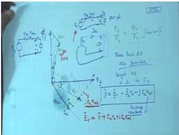

Let the terminal voltage be the reference phasor $\vec{V} = V\angle 0$ and the excitation emf lag by the load angle $\delta$: $\vec{E} = E\angle -\delta$. The armature current is
$$\vec{I} = \frac{\vec{V} - \vec{E}}{Z_s}.$$
From the power balance, the active input power per phase can be written as
$$
P_{\text{in,ph}} = \Re(\vec{V}\vec{I}^*) = \frac{V^2 R - V E R\cos\delta + V E X\sin\delta}{|Z_s|^2}. \tag{1}
$$
The electromagnetic (gross mechanical) power per phase is $P_{\text{em,ph}} = P_{\text{in,ph}} - I^2 R$, which simplifies to
$$
P_{\text{em,ph}} = \frac{V E (R\cos\delta + X\sin\delta) - R E^2}{|Z_s|^2}
               = \frac{V E}{|Z_s|}\sin(\delta + \beta) - \frac{R E^2}{|Z_s|^2}, \tag{2}
$$
where $\beta = \tan^{-1}(R/X) = \tan^{-1}(0.5/4) = 7.125^\circ$.

---

### (a) Maximum power output
The shaft output is $P_{\text{out}} = 3P_{\text{em,ph}} - P_{\text{rot}}$. As $P_{\text{rot}}$ is constant, maximum $P_{\text{out}}$ occurs when $P_{\text{em}}$ is maximum. Equation (2) shows that $P_{\text{em,ph}}$ is maximised when $\sin(\delta + \beta) = 1$, i.e.

$$
\delta + \beta = 90^\circ \quad\Rightarrow\quad \delta = 90^\circ - 7.125^\circ = 82.875^\circ.
$$

Substituting this $\delta$ into (2):
$$
P_{\text{em,ph}} = \frac{V E}{|Z_s|} - \frac{R E^2}{|Z_s|^2}
                = \frac{239.6 \times 300.2}{4.031} - \frac{0.5 \times (300.2)^2}{16.25}
                \approx 15\,070\ \text{W}.
$$
Total gross mechanical power:
$$P_{\text{em}} = 3 \times 15\,070 = 45\,210\ \text{W} = 45.21\ \text{kW}.$$
Shaft output:
$$P_{\text{out}} = 45.21 - 1.0 = 44.21\ \text{kW}.$$
In horse power (1 HP = 0.746 kW):
$$\text{HP} = \frac{44.21}{0.746} \approx 59.3\ \text{HP}.$$

The line current (equal to phase current) is obtained from
$$|\vec{I}| = \frac{\sqrt{V^2 + E^2 - 2 V E \cos\delta}}{|Z_s|}.$$
With $\cos 82.875^\circ \approx 0.1240$,
$$|\vec{I}| = \frac{\sqrt{239.6^2 + 300.2^2 - 2(239.6)(300.2)(0.1240)}}{4.0311} \approx 89.34\ \text{A}.$$

The total copper loss is
$$P_{\text{cu}} = 3\,|\vec{I}|^2 R = 3 \times (89.34)^2 \times 0.5 \approx 11.97\ \text{kW}.$$
Hence the electrical input power is
$$P_{\text{in}} = P_{\text{em}} + P_{\text{cu}} = 45.21 + 11.97 = 57.18\ \text{kW}.$$
Power factor:
$$\cos\phi = \frac{P_{\text{in}}}{\sqrt{3}\,V_L I_L} = \frac{57.18 \times 10^3}{\sqrt{3} \times 415 \times 89.34} \approx 0.891\ \text{(lagging)}.$$
Efficiency:
$$\eta = \frac{P_{\text{out}}}{P_{\text{in}}} \times 100 = \frac{44.21}{57.18} \times 100 \approx 77.3\%.$$

---

### (b) Maximum power input
Returning to equation (1), the input power per phase can be rearranged as
$$
P_{\text{in,ph}} = \frac{V^2 R}{|Z_s|^2} + \frac{V E}{|Z_s|}\sin(\delta - \gamma), \qquad
\gamma = \tan^{-1}(R/X) = \beta = 7.125^\circ.
$$
This expression is maximum when $\sin(\delta - \gamma) = 1$, giving

$$
\delta = 90^\circ + \gamma = 90^\circ + 7.125^\circ = 97.125^\circ.
$$

At this load angle,
$$
P_{\text{in,ph,max}} = \frac{V^2 R}{|Z_s|^2} + \frac{V E}{|Z_s|}
                    = \frac{(239.6)^2 \times 0.5}{16.25} + \frac{239.6 \times 300.2}{4.031}
                    \approx 1\,766.4 + 17\,842.5 = 19\,608.9\ \text{W}.
$$
Total input:
$$P_{\text{in}} = 3 \times 19\,608.9 = 58\,826.7\ \text{W} \approx 58.83\ \text{kW}.$$

For the current, with $\delta = 97.125^\circ$, $\cos\delta = -0.1240$, $\sin\delta = 0.9923$,
$$|\vec{I}| = \frac{\sqrt{239.6^2 + 300.2^2 - 2(239.6)(300.2)(-0.1240)}}{4.0311} \approx 100.88\ \text{A}.$$
Power factor (again lagging):
$$\cos\phi = \frac{58.83 \times 10^3}{\sqrt{3} \times 415 \times 100.88} \approx 0.811.$$

The electromagnetic power per phase at this $\delta$ is
$$
P_{\text{em,ph}} = \frac{V E (R\cos\delta + X\sin\delta) - R E^2}{|Z_s|^2}
                = \frac{239.6 \times 300.2\bigl(0.5(-0.1240) + 4(0.9923)\bigr) - 0.5(300.2)^2}{16.25}
                \approx 14\,522\ \text{W}.
$$
Total gross mechanical power:
$$P_{\text{em}} = 3 \times 14\,522 = 43\,566\ \text{W} = 43.57\ \text{kW}.$$
Shaft output:
$$P_{\text{out}} = 43.57 - 1.0 = 42.57\ \text{kW} \approx 42.56\ \text{kW}.$$
In horse power:
$$\text{HP} = \frac{42.56}{0.746} \approx 57.1\ \text{HP}.$$
Efficiency:
$$\eta = \frac{42.56}{58.83} \times 100 \approx 72.4\%.$$

> **Final answer:** (a) 59.3 HP, 89.34 A, 77.3% efficiency; (b) 57.1 HP, 100.88 A, 72.4% efficiency.


---

## Question 133
**Topic:** Field excitation effects, synchronous motor operation, power-angle, V-curves, starting and hunting · **Syllabus area:** Week 12 · **Source:** 5A | EM-II ELE 2202 End Sem, 24 April 2017

An industrial plant is supplied with 875 kVA of electrical power at 0.8 pf lagging from a three-phase, 50 Hz, 11 kV substation. A synchronous motor of rating 100 kVA operating at a leading power factor of 0.6 is added during the expansion. Calculate the new kVA supplied by the substation and the overall power factor of the plant. (03)

### Answer 133
The industrial plant initially draws an apparent power of $S_1 = 875\text{ kVA}$ at a lagging power factor of 0.8. The corresponding real and reactive powers are:

$$
\begin{aligned}
P_1 &= S_1 \times \mathrm{pf}_1 = 875 \times 0.8 = 700\text{ kW},\\
Q_1 &= S_1 \times \sin(\cos^{-1} 0.8) = 875 \times 0.6 = 525\text{ kVAr (lagging, positive)}.
\end{aligned}
$$

A synchronous motor rated at $100\text{ kVA}$ is added, operating at a leading power factor of 0.6. Its real power input and reactive power (leading, hence negative) are:

$$
\begin{aligned}
P_m &= 100 \times 0.6 = 60\text{ kW},\\
Q_m &= -100 \times \sin(\cos^{-1} 0.6) = -100 \times 0.8 = -80\text{ kVAr (leading)}.
\end{aligned}
$$

After the expansion, the total real and reactive powers supplied by the substation become:

$$
\begin{aligned}
P_{\text{total}} &= P_1 + P_m = 700 + 60 = 760\text{ kW},\\
Q_{\text{total}} &= Q_1 + Q_m = 525 - 80 = 445\text{ kVAr (lagging, since net positive)}.
\end{aligned}
$$

The new apparent power is

$$
S_{\text{new}} = \sqrt{P_{\text{total}}^2 + Q_{\text{total}}^2} = \sqrt{760^2 + 445^2} \approx 880.8\text{ kVA}.
$$

The overall power factor is

$$
\mathrm{pf}_{\text{overall}} = \frac{P_{\text{total}}}{S_{\text{new}}} = \frac{760}{880.8} \approx 0.863 \text{ (lagging, because } Q_{\text{total}} > 0).
$$

> **Final answer:** The substation now supplies approximately 881 kVA, and the overall plant power factor is **0.863 lagging**.


---

## Question 134
**Topic:** Field excitation effects, synchronous motor operation, power-angle, V-curves, starting and hunting · **Syllabus area:** Week 12 · **Source:** 5B | EM-II ELE 2202 Makeup, 02 July 2016

A factory has an average load of 250 kW at a power factor of 0.7 lagging. In addition, a synchronous motor with an efficiency of 88 % supplies a mechanical load of 60 kW. Determine the kVA rating and power factor of synchronous motor if it is used to raise the combined power factor to 0.9 lag. 5M

### Answer 134
**Given:**
- Factory average load: $P_1 = 250\ \text{kW}$ at power factor $0.7$ lagging.
- Synchronous motor supplies mechanical load $P_{\text{mech}} = 60\ \text{kW}$ with efficiency $\eta = 88\% = 0.88$.
- Combined power factor to be raised to $0.9$ lagging.

---

### Step 1 - Initial factory reactive power

The power factor angle of the factory load:
$$
\phi_1 = \cos^{-1}(0.7) \approx 45.57^\circ
$$
The reactive power drawn by the factory:
$$
Q_1 = P_1 \tan\phi_1 = 250 \times \tan(45.57^\circ) = 250 \times 1.020 = 255.0\ \text{kVAr (lagging)}.
$$

---

### Step 2 - Synchronous motor input power

The mechanical output is $60\ \text{kW}$ and the efficiency is $88\%$, so the electrical input power to the motor:
$$
P_m = \frac{P_{\text{mech}}}{\eta} = \frac{60}{0.88} \approx 68.18\ \text{kW}.
$$

---

### Step 3 - Total combined real power

When the synchronous motor is added, the total real power drawn from the supply becomes:
$$
P_{\text{new}} = P_1 + P_m = 250 + 68.18 = 318.18\ \text{kW}.
$$

---

### Step 4 - Required combined reactive power

The desired power factor is $0.9$ lagging, so the total angle:
$$
\phi_{\text{new}} = \cos^{-1}(0.9) \approx 25.84^\circ.
$$
The total reactive power must then be:
$$
Q_{\text{new}} = P_{\text{new}} \tan\phi_{\text{new}} = 318.18 \times \tan(25.84^\circ) \approx 318.18 \times 0.4843 = 154.1\ \text{kVAr (lagging)}.
$$

---

### Step 5 - Reactive power required from the synchronous motor

The synchronous motor must supply the difference between the new total reactive power and the original factory reactive power:
$$
Q_m = Q_{\text{new}} - Q_1 = 154.1 - 255.0 = -100.9\ \text{kVAr}.
$$
The negative sign indicates that the motor is **supplying** reactive power (operating at a leading power factor). Thus, the motor delivers $100.9$ kVAr leading.

---

### Step 6 - kVA rating and power factor of the synchronous motor

The apparent power (kVA) rating of the motor:
$$
S_m = \sqrt{P_m^2 + Q_m^2} = \sqrt{(68.18)^2 + (100.9)^2} \approx \sqrt{4648 + 10180} = \sqrt{14828} \approx 121.8\ \text{kVA}.
$$

The power factor of the motor:
$$
\text{pf}_m = \frac{P_m}{S_m} = \frac{68.18}{121.8} \approx 0.560\quad (\text{leading, since it supplies reactive power}).
$$

---

> **Final answer:** The synchronous motor must be rated at approximately **122 kVA**, and its power factor is **0.56 leading**.


---

## Question 135
**Topic:** Field excitation effects, synchronous motor operation, power-angle, V-curves, starting and hunting · **Syllabus area:** Week 12 · **Source:** 5B | EM-II ELE 2202 Makeup, 13 June 2019

Draw and explain the significance of V curve in synchronous motors. (03)

### Answer 135
A **V-curve** of a synchronous motor is a plot of armature (stator) current $I_a$ versus field current $I_f$ for a constant terminal voltage and constant mechanical load on the shaft. The corresponding **inverted V-curve** is a plot of power factor versus $I_f$.

**Explanation:**
For a given mechanical load, the motor's real power input $P = \sqrt{3} V_L I_L \cos\phi$ remains constant. Changing $I_f$ changes the excitation emf $E_f$, which in turn alters the reactive power drawn or supplied by the motor.

- **Under-excitation** (low $I_f$): $E_f$ is small, so the motor draws a large lagging (inductive) current from the supply to meet its magnetization needs. $I_a$ is high and the power factor is lagging.
- **Increasing $I_f$**: As $E_f$ grows, the required magnetizing current from the supply decreases, so $I_a$ drops. The power factor improves and reaches unity at a certain field current.
- **Unity power factor point**: At this point, $I_a$ is minimum and equals the in-phase component $I_a \cos\phi = P/(\sqrt{3}V_L)$. This is the most efficient operating condition for that load.
- **Over-excitation** (high $I_f$): $E_f$ becomes larger than necessary, and the motor starts supplying leading reactive power to the bus. $I_a$ increases again, but now with a leading power factor.

The shape of the $I_a$ vs $I_f$ curve is a broad **V**, hence the name. The inverted V-curve shows the power factor switching from lagging to leading as $I_f$ increases.

**Phasor implications**
With constant $P$ and constant voltage $V$, the in-phase component of $I_a$ is fixed. As excitation changes, the reactive component $I_a \sin\phi$ varies linearly with $E_f$, tracing the V-shape.

**Significance:**
1. **Power-factor correction**: By over-exciting, a synchronous motor can supply leading kVAr to compensate for lagging loads elsewhere in the plant. The motor then acts as a **synchronous condenser**.
2. **Voltage support**: The adjustable reactive power capability helps maintain bus voltage under varying load conditions.
3. **Loss reduction**: Operation near unity power factor minimizes armature current and $I^2R$ losses.
4. **Design and protection**: V-curves help in setting field current limits to avoid overheating or pull-out.

> **Final answer:** V-curves illustrate how armature current varies with excitation, showing the unity-pf point and the motor's ability to provide controllable leading or lagging reactive power.


---

## Question 136
**Topic:** Field excitation effects, synchronous motor operation, power-angle, V-curves, starting and hunting · **Syllabus area:** Week 12 · **Source:** 5A | EM-II ELE 2202 Makeup, 16 June 2017

An industrial plant is supplied with 850kVA of electrical power at 0.7pf lagging from a 3-phase 50Hz, 11kV substation. A synchronous motor of rating 110kVA operating at a leading power factor of 0.5 is added during expansion. Calculate the new kVA supplied and overall power factor of the plant. (05)

### Answer 136
**Original plant:**

Given: Apparent power $S_1 = 850\,\text{kVA}$, power factor $\text{pf}_1 = 0.7$ lagging.

Real power:  
$$
P_1 = S_1 \times \text{pf}_1 = 850 \times 0.7 = 595\,\text{kW}
$$

Reactive power:  
$$
Q_1 = S_1 \times \sin(\cos^{-1} 0.7) = 850 \times 0.714 = 607.0\,\text{kVAr (lagging)}
$$

**Synchronous motor:**

Rating $S_m = 110\,\text{kVA}$, power factor $\text{pf}_m = 0.5$ leading.

Real power:  
$$
P_m = S_m \times \text{pf}_m = 110 \times 0.5 = 55\,\text{kW}
$$

Reactive power (leading, taken as negative):  
$$
Q_m = -S_m \times \sin(\cos^{-1} 0.5) = -110 \times 0.866 = -95.3\,\text{kVAr (leading)}
$$

**After expansion:**

Total real power:  
$$
P_{\text{total}} = P_1 + P_m = 595 + 55 = 650\,\text{kW}
$$

Total reactive power:  
$$
Q_{\text{total}} = Q_1 + Q_m = 607.0 - 95.3 = 511.7\,\text{kVAr}
$$

New apparent power:  
$$
S_{\text{new}} = \sqrt{P_{\text{total}}^2 + Q_{\text{total}}^2} = \sqrt{650^2 + 511.7^2} \approx 827.1\,\text{kVA}
$$

Overall power factor:  
$$
\text{pf}_{\text{new}} = \frac{P_{\text{total}}}{S_{\text{new}}} = \frac{650}{827.1} \approx 0.786
$$

Since $Q_{\text{total}}$ is positive, the overall power factor is lagging.

> **Final answer:** New substation kVA ≈ 827 kVA, overall pf = 0.786 lagging.


---

## Question 137
**Topic:** Field excitation effects, synchronous motor operation, power-angle, V-curves, starting and hunting · **Syllabus area:** Week 12 · **Source:** 5B | EM-II ELE 2202 Makeup, 19 June 2018

An industrial load of 200 kW is supplied at 11 kV, the power factor being 0.8 lagging. A synchronous motor is used to meet an additional load of 50 kW and at the same time, it is used to raise the overall power factor to 0.9 lagging. Find the kVA capacity of synchronous motor and the power factor at which it operates. (06)

### Answer 137
**Original load:**
$$
\begin{aligned}
P_1 &= 200\text{ kW}, \quad \text{pf}_1 = 0.8 \text{ (lag)} \\
\cos\phi_1 &= 0.8 \implies \phi_1 = 36.87^\circ \\
Q_1 &= P_1 \tan\phi_1 = 200 \times 0.75 = 150\text{ kVAr (lagging)}.
\end{aligned}
$$

**Additional load:** a synchronous motor supplies 50 kW mechanical. Assuming the electrical input power equals the mechanical output (losses neglected), $P_m = 50$ kW.

**Total active power:** $P_{\text{total}} = 200 + 50 = 250$ kW.

**Desired overall power factor:** 0.9 lagging.
$$
\begin{aligned}
\cos\phi_{\text{new}} &= 0.9 \implies \phi_{\text{new}} = \cos^{-1}0.9 \approx 25.84^\circ \\
Q_{\text{total}} &= P_{\text{total}} \tan\phi_{\text{new}} = 250 \times 0.4843 \approx 121.1\text{ kVAr (lag)}.
\end{aligned}
$$

**Synchronous motor reactive power:**
$$
Q_m = Q_{\text{total}} - Q_1 = 121.1 - 150 = -28.9\text{ kVAr}.
$$
The negative sign indicates that the motor supplies leading reactive power (over-excited operation).

**Motor kVA rating:**
$$
S_m = \sqrt{P_m^2 + |Q_m|^2} = \sqrt{50^2 + 28.9^2} = \sqrt{2500 + 835.2} \approx 57.8\text{ kVA}.
$$

**Motor power factor:**
$$
\text{pf}_m = \frac{P_m}{S_m} = \frac{50}{57.8} \approx 0.865 \text{ (leading)}.
$$

> **Final answer:** Synchronous motor rating ≈ 57.8 kVA, operates at 0.865 leading.


---

## Question 138
**Topic:** Field excitation effects, synchronous motor operation, power-angle, V-curves, starting and hunting · **Syllabus area:** Week 12 · **Source:** 2B | EM-II ELE 2225 End Sem, 09 May 2024

A sugarcane industry is supplied with 92.5 kW of electrical power at 0.83 pf lagging from a three-phase, 50 Hz, 11 kV substation. A synchronous motor of rating 30 kVA operating at a leading power factor of 0.63 is added during the expansion. a) Calculate the real and reactive supplied by the substation, after expansion. b) Will the overall power factor of the industry improve after the addition of the synchronous motor? Justify your answer.

### Answer 138
The total complex power drawn from the substation is the sum of the original load and the synchronous motor load. Power factor improvement is analyzed by separating the real and reactive power components.

**Original load:**  
Given $P_1 = 92.5$ kW, $\text{pf}_1 = 0.83$ lagging. The power factor angle is  
$$\theta_1 = \cos^{-1}(0.83) \approx 33.9^\circ.$$  
The reactive power is  
$$Q_1 = P_1 \tan\theta_1 = 92.5 \times \tan(33.9^\circ) = 92.5 \times 0.672 = 62.1\text{ kVAr (lagging)}.$$

**Synchronous motor:**  
Rated apparent power $S_m = 30$ kVA, operating at $\text{pf}_m = 0.63$ leading. The angle is  
$$\theta_m = \cos^{-1}(0.63) \approx 50.95^\circ.$$  
Real power:  
$$P_m = S_m \cos\theta_m = 30 \times 0.63 = 18.9\text{ kW}.$$  
Reactive power (negative for leading):  
$$Q_m = -S_m \sin\theta_m = -30 \times 0.775 = -23.3\text{ kVAr (leading)}.$$  
A leading power factor indicates that the synchronous motor is over-excited and behaves like a capacitor, supplying reactive power to the system.


<p align="center"><em>Figure: Phasor diagrams of a synchronous motor for different field excitation levels. Over-excited operation (E<sub>f</sub> > V) produces leading current, thereby injecting reactive power into the bus.</em></p>

**Combined load after expansion:**  
$$\begin{aligned}
P_{\text{total}} &= P_1 + P_m = 92.5 + 18.9 = 111.4\text{ kW}, \\\\[4pt]
Q_{\text{total}} &= Q_1 + Q_m = 62.1 + (-23.3) = 38.8\text{ kVAr (lagging)}.
\end{aligned}$$  
The net reactive power is still positive (lagging), but its magnitude has decreased. The total apparent power supplied by the substation is  
$$S_{\text{total}} = \sqrt{P_{\text{total}}^2 + Q_{\text{total}}^2} = \sqrt{111.4^2 + 38.8^2} \approx 118.0\text{ kVA}.$$  
The new overall power factor is  
$$\text{pf}_{\text{new}} = \frac{P_{\text{total}}}{S_{\text{total}}} = \frac{111.4}{118.0} \approx 0.944\text{ lagging}.$$

**Improvement justification:**  
The original power factor was 0.83 lagging; the new power factor is 0.944 lagging. Because the power factor magnitude increased from 0.83 to 0.944, it has **improved** (moved closer to unity). The over-excited synchronous motor supplies part of the reactive power required by the lagging load, hence reducing the net lagging reactive power drawn from the substation. This is a standard industrial method for power factor correction.

> **Final answer:** (a) $P = 111.4$ kW, $Q = 38.8$ kVAr; (b) Yes, the overall power factor improves to **0.944 lagging**.


---

## Question 139
**Topic:** Field excitation effects, synchronous motor operation, power-angle, V-curves, starting and hunting · **Syllabus area:** Week 12 · **Source:** 2A | EM-II ELE 2225 Makeup, 26 June 2024

An industrial load of 500 kW, 0.707 pf lagging is required to be improved to 600 kW, 0.95 pf lagging by connecting a synchronous motor in parallel. Determine the kVA rating and power factor at which it operates. 4

### Answer 139
An industrial load of 500 kW at 0.707 lagging power factor is to be upgraded to a total combined load of 600 kW at 0.95 lagging by connecting a synchronous motor in parallel. The synchronous motor simultaneously supplies additional active power and provides the necessary reactive power to correct the overall power factor.

**Step 1 - Original load parameters:**
$$
P_1 = 500\ \text{kW}
$$
$$
\cos\phi_1 = 0.707\ \text{lagging} \quad\Rightarrow\quad \phi_1 = \cos^{-1}(0.707) = 45^\circ
$$
$$
Q_1 = P_1 \tan\phi_1 = 500 \tan 45^\circ = 500\ \text{kVAr (lagging)}
$$

**Step 2 - Desired total load parameters:**
$$
P_{\text{new}} = 600\ \text{kW}
$$
$$
\cos\phi_{\text{new}} = 0.95\ \text{lagging} \quad\Rightarrow\quad \phi_{\text{new}} = \cos^{-1}(0.95) \approx 18.19^\circ
$$
$$
Q_{\text{new}} = P_{\text{new}} \tan\phi_{\text{new}} = 600 \tan(18.19^\circ) \approx 600 \times 0.3287 = 197.2\ \text{kVAr (lagging)}
$$

**Step 3 - Required motor contribution:**
Since the motor is connected in parallel, the total load is the sum of the original load and the motor load. Therefore, for active power:
$$
P_m = P_{\text{new}} - P_1 = 600 - 500 = 100\ \text{kW}
$$
For reactive power, the original lagging vars must be reduced. The motor must supply a leading reactive power to cancel part of the lagging vars:
$$
Q_m = Q_{\text{new}} - Q_1 = 197.2 - 500 = -302.8\ \text{kVAr}
$$
The negative sign indicates that the motor supplies 302.8 kVAr leading (i.e., it operates as a capacitive load).

**Step 4 - Motor kVA rating and power factor:**
The apparent power rating of the synchronous motor is:
$$
S_m = \sqrt{P_m^2 + Q_m^2} = \sqrt{(100)^2 + (302.8)^2} \approx \sqrt{10\,000 + 91\,688} = \sqrt{101\,688} \approx 318.9\ \text{kVA}
$$
The motor operates at a leading power factor:
$$
\text{pf}_m = \frac{P_m}{S_m} = \frac{100}{318.9} \approx 0.314\ \text{leading}
$$

Hence, the synchronous motor must be rated at approximately 319 kVA and operate at a power factor of 0.314 leading.

> **Final answer:** Synchronous motor rating ≈ 319 kVA, operating at 0.314 leading.


---

## Question 140
**Topic:** Field excitation effects, synchronous motor operation, power-angle, V-curves, starting and hunting · **Syllabus area:** Week 12 · **Source:** 2C | EM-II ELE 2225 Makeup, 26 June 2024

A 3 phase, 20 MVA, star connected alternator with an impedance of (0.5+j 6) Ω per phase is operating in parallel with constant voltage 11 kV bus bars. The field current is adjusted to give a line excitation voltage of 12 kV. With constant excitation, calculate (a) Maximum power output from the alternator (b) Armature current and power factor under maximum power condition. 4

### Answer 140
**Given:**  
- Line voltage, $V_L = 11\,\text{kV}$ (star connected) → Phase voltage, $V_{ph} = \frac{11}{\sqrt{3}} = 6.351\,\text{kV}$.  
- Line excitation voltage, $E_L = 12\,\text{kV}$ → Phase excitation voltage, $E_{ph} = \frac{12}{\sqrt{3}} = 6.928\,\text{kV}$.  
- Synchronous impedance, $Z = 0.5 + j6\,\Omega/\text{ph}$ → $|Z| = \sqrt{0.5^2 + 6^2} = 6.021\,\Omega$, $\theta = \tan^{-1}\left(\frac{6}{0.5}\right) = 85.24^\circ$.

The machine is connected to infinite bus bars with constant voltage $V$. The field excitation is held constant, so $E_f$ is fixed.

---

### (a) Maximum power output

For a cylindrical rotor synchronous machine with armature resistance, the real power delivered per phase is

$$
P_{ph} = \frac{E_{ph}V_{ph}}{|Z|} \cos(\theta - \delta) - \frac{V_{ph}^2}{|Z|} \cos\theta,
$$

where $\delta$ is the power (load) angle between $E_{ph}$ and $V_{ph}$.  
For constant excitation $(E_{ph})$, maximum power occurs when the cosine term is maximum, i.e., $\cos(\theta - \delta) = 1$, which gives

$$
\delta = \theta = 85.24^\circ.
$$

Therefore,

$$
\begin{aligned}
P_{\text{max,ph}} &= \frac{E_{ph}V_{ph}}{|Z|} - \frac{V_{ph}^2}{|Z|} \cos\theta \\[6pt]
&= \frac{(6.928 \times 6.351)\times 10^6}{6.021} - \frac{(6.351)^2 \times 10^6}{6.021} \cos 85.24^\circ \\[6pt]
&= \frac{44.01 \times 10^6}{6.021} - \frac{40.33 \times 10^6}{6.021} \times 0.08304 \\[6pt]
&= 7.312 \times 10^6 - 0.557 \times 10^6 = 6.755 \times 10^6 \;\text{W}.
\end{aligned}
$$

The total three-phase maximum power is

$$
P_{\text{max}} = 3 \times P_{\text{max,ph}} = 3 \times 6.755 \;\text{MW} \approx 20.26 \;\text{MW}.
$$

---

### (b) Armature current and power factor under maximum power condition

At $\delta = 85.24^\circ$, take $V_{ph}$ as reference, $V_{ph} = 6.351 \angle 0^\circ \;\text{kV}$, then

$$
E_{ph} = 6.928 \angle 85.24^\circ = 0.575 + j6.904 \;\text{kV}.
$$

The armature current per phase is

$$
\begin{aligned}
I_{ph} &= \frac{E_{ph} - V_{ph}}{Z} = \frac{(0.575 + j6.904) - 6.351}{0.5 + j6} \\[6pt]
&= \frac{-5.776 + j6.904}{0.5 + j6} \;\text{kA}.
\end{aligned}
$$

Multiplying numerator and denominator by the conjugate of $Z$:

$$
\begin{aligned}
I_{ph} &= \frac{(-5.776 + j6.904)(0.5 - j6)}{0.5^2 + 6^2} \\[6pt]
&= \frac{(-2.888 + 34.656) + j(3.452 + 34.656)}{36.25} \\[6pt]
&= \frac{38.536 + j38.108}{36.25} \;\text{kA}.
\end{aligned}
$$

Hence,

$$
|I_{ph}| = \sqrt{\left(\frac{38.536}{36.25}\right)^2 + \left(\frac{38.108}{36.25}\right)^2} = \sqrt{1.063^2 + 1.051^2} = 1.495 \;\text{kA} = 1495 \;\text{A}.
$$

The power factor angle $\phi$ is the phase difference between $V_{ph}$ and $I_{ph}$; since $I_{ph}$ lags $V_{ph}$,

$$
\phi = \tan^{-1}\left(\frac{1.051}{1.063}\right) \approx 44.6^\circ,
$$

so the power factor is

$$
\cos\phi = \cos 44.6^\circ = 0.711 \;\text{lagging}.
$$

Alternatively, using total quantities:

$$
S = \sqrt{3}\, V_L I_L = \sqrt{3} \times 11000 \times 1495 = 28.48 \;\text{MVA},
$$

$$
\cos\phi = \frac{P_{\text{max}}}{S} = \frac{20.26}{28.48} = 0.711 \;\text{lagging}.
$$

> **Final answer:** Maximum power output = 20.26 MW; armature current = 1495 A; power factor = 0.711 lagging.


---

## Question 141
**Topic:** Field excitation effects, synchronous motor operation, power-angle, V-curves, starting and hunting · **Syllabus area:** Week 12 · **Source:** 2C | EM-II ELE 2251 End Sem, 31 May 2023

A 1,000 kW, 3.3 kV, 24 poles, 50 Hz, 3-phase star-connected synchronous motor has a synchronous reactance of 3.4 Ω per phase and the resistance is negligible. The motor is fed from an infinite bus bar at 3.3 kV. Its field excitation is adjusted to result in unity power factor operation at rated load. At this excitation, estimate the maximum power and torque this motor can deliver. Explain with the help of power-angle characteristics. (04)

### Answer 141
**Given data:**
- Rated output power: $1000\ \text{kW}$
- Line voltage: $V_L = 3.3\ \text{kV}$
- Poles: $P = 24$, frequency: $f = 50\ \text{Hz}$
- Synchronous reactance per phase: $X_s = 3.4\ \Omega$, star connection, $R_a \approx 0$
- Operation at unity power factor at rated load.

**Step 1: Rated current and excitation emf**
At rated load and unity pf, the electrical input power approximately equals the mechanical output (losses negligible):
$$P_{\text{in}} = \sqrt{3}\,V_L I_L \cos\phi = 1000\ \text{kW},\quad \cos\phi = 1.$$
So,
$$I_L = \frac{1000\times 10^3}{\sqrt{3}\times 3300} \approx 174.95\ \text{A}.$$
For star connection, phase current $I_{\text{ph}} = I_L = 174.95\ \text{A}$, and phase voltage
$$V_{\text{ph}} = \frac{V_L}{\sqrt{3}} = \frac{3300}{\sqrt{3}} \approx 1905.3\ \text{V}.$$

For a synchronous motor with negligible resistance, the phasor equation is
$$\vec{V}_{\text{ph}} = \vec{E} + j\vec{I}_{\text{ph}} X_s.$$
At unity pf, $\vec{I}_{\text{ph}}$ is in phase with $\vec{V}_{\text{ph}}$, hence
$$\vec{E} = \vec{V}_{\text{ph}} - j\vec{I}_{\text{ph}} X_s = 1905.3 - j\,(174.95 \times 3.4) = 1905.3 - j594.8.$$
Magnitude:
$$E = \sqrt{1905.3^2 + 594.8^2} \approx 1996\ \text{V/phase}.$$
Load angle $\delta$ (angle by which $E$ lags $V_{\text{ph}}$):
$$\delta = \tan^{-1}\!\left(\frac{594.8}{1905.3}\right) \approx 17.34^\circ.$$

**Step 2: Power-angle relation**
For a cylindrical-rotor synchronous machine, the per-phase electromagnetic power is
$$P_{\text{ph}} = \frac{V_{\text{ph}} E}{X_s}\sin\delta.$$
Hence total three-phase power:
$$P = 3\,\frac{V_{\text{ph}} E}{X_s}\sin\delta = P_{\max}\sin\delta,$$
where the maximum power for fixed excitation (constant $E$) is
$$P_{\max} = \frac{3 V_{\text{ph}} E}{X_s}.$$

**Step 3: Maximum power at the given excitation**
Substituting the values:
$$
\begin{aligned}
P_{\max} &= \frac{3 \times 1905.3 \times 1996}{3.4}
       \approx 3.356 \times 10^6\ \text{W}
       = 3.36\ \text{MW}.
\end{aligned}
$$

**Step 4: Maximum torque**
Synchronous speed:
$$N_s = \frac{120 f}{P} = \frac{120 \times 50}{24} = 250\ \text{rpm}.$$
Angular velocity:
$$\omega_m = \frac{2\pi N_s}{60} = \frac{2\pi \times 250}{60} \approx 26.18\ \text{rad/s}.$$
Thus, the pull-out (maximum) torque is
$$T_{\max} = \frac{P_{\max}}{\omega_m} = \frac{3.356 \times 10^6}{26.18} \approx 128.2 \times 10^3\ \text{N·m} = 128\ \text{kN·m}.$$

**Step 5: Power-angle characteristic (explanation)**
The power output of the motor follows $P = P_{\max}\sin\delta$. This relationship is a sine wave:
- At no load, $\delta \approx 0^\circ$, $P \approx 0$.
- As the mechanical load increases, $\delta$ advances, and the power delivered rises.
- Maximum power occurs at $\delta = 90^\circ$, where $\sin\delta = 1$. This is the steady-state stability limit.
- If the load torque attempts to exceed $T_{\max}$, $\delta$ would increase beyond $90^\circ$, the power would decrease, and the motor would lose synchronism (pull out).
- Stable operation is possible only for $0^\circ < \delta < 90^\circ$. The motor normally operates with a load angle well below $90^\circ$ (here $17.34^\circ$ at rated load).

In this machine, with the field excitation adjusted for unity pf at rated $1000\ \text{kW}$, the maximum power the motor can deliver without losing synchronism is **3.36 MW**, and the corresponding maximum torque is approximately **128 kN·m**. This represents an overload capability of about 3.36 times the rated power.

> **Final answer:** Maximum power = **3.36 MW**; maximum torque ≈ **128 kN·m**.


---

