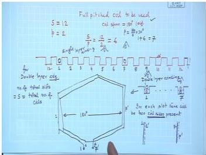
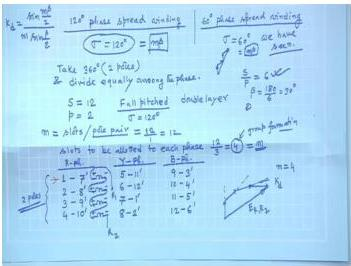
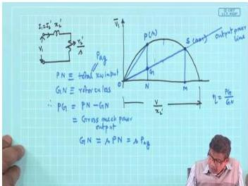
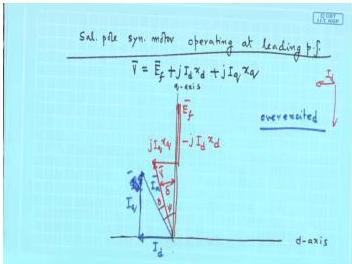

# Electrical Machines II PYQ Unique Question Bank

This page keeps one solved representative for each distinct in-syllabus skill from the cleaned PYQ answer bank. Repeated questions that test the same method with different numerical values are removed.

**Total questions:** 52

---

## Question 1
**Topic:** AC windings, winding factor, harmonics and generated EMF · **Syllabus area:** Weeks 3-4 · **Source:** 1A | EM-II ELE 204 End Sem, 13 May 2014  
**Unique skill:** Derive Kd, Kp formulas

Define the following: (i) Integral and Fractional slot winding (ii) Full pitch and Fractional pitch winding (02)

### Answer 1
In AC windings, the arrangement of coils in slots is characterised by the number of slots per pole per phase $q$ and the coil span. These parameters distinguish between integral/fractional-slot windings and full/fractional-pitch windings.

---

**Integral Slot Winding**

For a machine with $S$ slots, $P$ poles, and $m$ phases, the number of slots per pole per phase is

$$
q = \frac{S}{P \, m}
$$

For 3-phase machines ($m = 3$), $q = \frac{S}{3P}$. When $q$ is an integer (e.g. $q = 2$), the winding is called an integral-slot winding. In such a winding each phase belt under a pole occupies exactly an integer number of slots, giving a geometrically balanced arrangement. The distribution factor (or breadth factor) can be calculated directly as

$$
k_d = \frac{\sin\!\left(\frac{q \beta}{2}\right)}{q \sin\!\left(\frac{\beta}{2}\right)}
$$

where $\beta$ is the electrical angle between adjacent slots.

**Fractional Slot Winding**

If $q$ is not an integer but a fraction (e.g. $q = 2\frac{1}{2}$), the winding is termed fractional-slot. Although the number of slots per phase per pole is not constant from pole to pole, the average is $q$. Fractional-slot windings are often preferred because they reduce cogging torque, help suppress certain harmonic fields, and allow greater freedom in selecting slot-pole combinations. The effective distribution factor is computed using the equivalent integer number of slots per phase belt.

---

**Full-Pitch (Whole-Coil) Winding**

A coil is said to have full pitch when the distance between its two coil sides is exactly equal to one pole pitch $\tau_p$ (180° electrical). The coil span in slots is $S/P$, giving a coil pitch factor of

$$
k_p = 1
$$

for the fundamental emf. The harmonic pitch factor is $k_{pn} = \cos(n\alpha/2)$, but since $\alpha = 0$ for a full-pitch coil, $k_{pn}=1$ for all harmonics. Therefore, full-pitch coils generate all harmonic emfs present in the air-gap flux without attenuation.

**Fractional-Pitch (Short-Pitch) Winding**

When the coil span is deliberately made smaller than one pole pitch by an electrical chording angle $\alpha$, the winding is called fractional-pitch or short-pitch. The fundamental emf is reduced by the pitch factor

$$
k_p = \cos\!\left(\frac{\alpha}{2}\right).
$$

The real benefit lies in harmonic suppression: the $n^{\text{th}}$ harmonic emf is scaled by

$$
k_{pn} = \cos\!\left(\frac{n\alpha}{2}\right),
$$

which can be forced to zero by choosing $\alpha = \frac{180^\circ}{n}$. For instance, a chording of $\alpha = 60^\circ$ eliminates the troublesome third harmonic. Short-pitching also reduces the length of end connections, saving copper and lowering leakage reactance.

---

  
*Figure 1: A full-pitch coil in a 12-slot, 2-pole winding. Coil sides are placed in slots 1 and 7, spanning one pole pitch (6 slots).*

  
*Figure 2: A short-chorded coil with a span of 5 slots (30° electrical short of full pitch), used to suppress specific harmonics.*

> **Final answer:**  
> **(i) Integral-slot winding:** $q = \frac{S}{P \times \text{phases}}$ is an integer; **Fractional-slot winding:** $q$ is a fraction.  
> **(ii) Full-pitch winding:** coil span = $180^\circ$ electrical, $k_p = 1$; **Fractional-pitch winding:** coil span $< 180^\circ$ electrical by an angle $\alpha$, with $k_p = \cos(\alpha/2)$ and $k_{pn} = \cos(n\alpha/2)$ for harmonic elimination.

---

## Question 2
**Topic:** AC windings, winding factor, harmonics and generated EMF · **Syllabus area:** Weeks 3-4 · **Source:** 1A | EM-II ELE 204 Makeup, 08 July 2014  
**Unique skill:** Compute Kd, Kp, EMF from given slots/poles/span/flux

A 3 phase, 50 Hz, 1000 rpm, star connected alternator has 72 armature slots with 6 conductors per slot and the coil span is 10 slots. The average air-gap flux per pole is 0.26 Wb. Calculate: (i) Distribution and Pitch factors of the winding (ii) Number of turns per phase and (iii) phase and line value of emf induced. (04)

### Answer 2
**Solution:**

**Step 1: Determine number of poles.**

The synchronous speed $N_s$ of an alternator is related to frequency $f$ and number of poles $P$ by
$$
N_s = \frac{120 f}{P} \quad \Rightarrow \quad P = \frac{120 f}{N_s} = \frac{120 \times 50}{1000} = 6 \text{ poles}.
$$

**Step 2: Find slot pitch and distribution factor.**

Total slots $S = 72$. Slots per pole $= \frac{72}{6} = 12$.
In electrical terms, one pole pitch corresponds to $180^\circ$. Therefore, the electrical angle between two adjacent slots (slot angle $\beta$) is
$$
\beta = \frac{180^\circ}{\text{slots per pole}} = \frac{180^\circ}{12} = 15^\circ \text{ electrical}.
$$

The number of slots per pole per phase is given by
$$
q = \frac{S}{3P} = \frac{72}{3 \times 6} = 4.
$$

For a distributed winding, the emfs induced in the $q$ coils of a phase group are displaced by $\beta$ from each other. The distribution factor $K_d$ is the ratio of the phasor sum to the arithmetic sum of the individual coil emfs:
$$
K_d = \frac{\sin(q\beta/2)}{q \sin(\beta/2)}.
$$
Substituting $\beta/2 = 7.5^\circ$ and $q = 4$:
$$
K_d = \frac{\sin(4 \times 7.5^\circ)}{4 \sin 7.5^\circ} = \frac{\sin 30^\circ}{4 \sin 7.5^\circ} = \frac{0.5}{4 \times 0.1305} \approx 0.9577 \approx 0.958.
$$

**Step 3: Pitch factor.**

The coil span is given as 10 slots, while the full-pitch span would be 12 slots (since one pole pitch equals 12 slots). Hence the coil is short-pitched by $12 - 10 = 2$ slots. The chording angle $\alpha$ (the electrical angle by which the coil falls short of full pitch) is
$$
\alpha = 2 \times \beta = 2 \times 15^\circ = 30^\circ.
$$

When a coil is short-pitched, the emfs in its two coil sides are not exactly $180^\circ$ apart; the resultant emf is less than the sum. The pitch factor (or coil-span factor) accounts for this reduction:
$$
K_p = \cos\frac{\alpha}{2} = \cos 15^\circ \approx 0.9659 \approx 0.966.
$$

The overall winding factor is $K_w = K_d \cdot K_p = 0.9577 \times 0.9659 \approx 0.9250$.

**Step 4: Number of turns per phase.**

The alternator has $S = 72$ slots with $6$ conductors per slot. Assuming a double-layer winding, each slot contains two coil sides (top and bottom). Hence the number of turns per coil is half the conductors per slot:
$$
N_c = \frac{\text{conductors per slot}}{2} = \frac{6}{2} = 3 \text{ turns per coil}.
$$

In a double-layer winding, the total number of coils equals the number of slots, so there are $72$ coils. For a three-phase machine, the number of coils per phase is
$$
\text{Coils per phase} = \frac{72}{3} = 24.
$$

Thus, the series turns per phase are
$$
T_{ph} = N_c \times (\text{coils per phase}) = 3 \times 24 = 72 \text{ turns}.
$$

Equivalently, using total armature conductors $Z = 72 \times 6 = 432$, for a three-phase double-layer winding,
$$
T_{ph} = \frac{Z}{2 \times 3} = \frac{432}{6} = 72 \text{ turns}.
$$

**Step 5: Induced EMF per phase.**

The RMS value of the sinusoidal induced emf per phase in an alternator is given by the standard formula
$$
E_{ph} = 4.44 \, f \, \phi \, T_{ph} \, K_w,
$$
where $f = 50$ Hz, $\phi = 0.26$ Wb, $T_{ph} = 72$, and $K_w = 0.9250$. Substituting,
$$
E_{ph} = 4.44 \times 50 \times 0.26 \times 72 \times 0.9250 \approx 3844 \text{ V} \approx 3.84 \text{ kV}.
$$

**Step 6: Line EMF (star connection).**

For a star-connected alternator, the line-to-line voltage is $\sqrt{3}$ times the phase voltage:
$$
E_L = \sqrt{3} \, E_{ph} = \sqrt{3} \times 3844 \approx 6659 \text{ V} \approx 6.66 \text{ kV}.
$$

**Relevant diagram:**  
Below is an illustration showing the slot angle $\beta$ and the concept of distributed coils in a few slots, which is the basis for calculating the distribution factor.

> **Final answer:** $K_d = 0.958$, $K_p = 0.966$; $T_{ph} = 72$ turns; $E_{ph} \approx 3.84$ kV; $E_L \approx 6.66$ kV.

---

## Question 3
**Topic:** AC windings, winding factor, harmonics and generated EMF · **Syllabus area:** Weeks 3-4 · **Source:** 1B | EM-II ELE 204 End Sem, 13 May 2014  
**Unique skill:** Harmonic % increase in phase voltage

A 3 phase alternator has 2 slots per pole per phase and coil span of 5 slot pitches. The flux density wave of alternator consists of a fundamental and a 25% third harmonic. Calculate the percentage increase in the phase voltage due to harmonic. (04)

### Answer 3
Given a 3-phase alternator with $q = 2$ slots per pole per phase, the number of slots per pole is

$$
\text{slots/pole} = m \times q = 3 \times 2 = 6.
$$

The slot angle (electrical) is

$$
\beta = \frac{180^\circ}{\text{slots/pole}} = \frac{180^\circ}{6} = 30^\circ \text{ electrical}.
$$

The coil span is 5 slot pitches, so the coil is short-pitched by

$$
6 - 5 = 1 \text{ slot}.
$$

The chording angle is therefore

$$
\alpha = 1 \times \beta = 30^\circ \text{ electrical}.
$$

---

**Fundamental (h = 1) winding factor**

Distribution factor:

$$
K_{d1} = \frac{\sin\left(\frac{q\beta}{2}\right)}{q\,\sin\left(\frac{\beta}{2}\right)}
       = \frac{\sin(2 \times 15^\circ)}{2\,\sin 15^\circ}
       = \frac{0.5}{2 \times 0.2588}
       \approx 0.9659 .
$$

Pitch factor:

$$
K_{p1} = \cos\left(\frac{\alpha}{2}\right)
       = \cos 15^\circ
       \approx 0.9659 .
$$

Hence,

$$
K_{w1} = K_{d1} \cdot K_{p1} = 0.9659 \times 0.9659 \approx 0.9330 .
$$

---

**Third-harmonic (h = 3) winding factor**

Harmonic slot angle = $3\beta = 90^\circ$, harmonic chording angle = $3\alpha = 90^\circ$.

Distribution factor:

$$
K_{d3} = \frac{\sin\left(\frac{q \cdot 3\beta}{2}\right)}{q\,\sin\left(\frac{3\beta}{2}\right)}
       = \frac{\sin(2 \times 45^\circ)}{2\,\sin 45^\circ}
       = \frac{1}{2 \times 0.7071}
       \approx 0.7071 .
$$

Pitch factor:

$$
K_{p3} = \cos\left(\frac{3\alpha}{2}\right)
       = \cos 45^\circ
       \approx 0.7071 .
$$

Thus,

$$
K_{w3} = K_{d3} \cdot K_{p3} = 0.7071 \times 0.7071 = 0.5 .
$$

---

**EMF ratio due to harmonic**

The induced emf per phase for a harmonic is proportional to the product of flux-density amplitude and the winding factor. Given that the third-harmonic flux density is $25\%$ of the fundamental, $B_{3} = 0.25\,B_{1}$. Therefore

$$
\frac{E_{3}}{E_{1}} = \frac{B_{3}\,K_{w3}}{B_{1}\,K_{w1}}
                    = 0.25 \times \frac{0.5}{0.9330}
                    \approx 0.13397 .
$$

---

**Resultant phase voltage and percentage increase**

The rms phase voltage becomes

$$
E_{\text{ph}} = \sqrt{E_{1}^{2} + E_{3}^{2}}
              = E_{1} \sqrt{1 + (0.13397)^{2}}
              \approx 1.00894\,E_{1} .
$$

The percentage increase in phase voltage due to the third harmonic is

$$
\frac{E_{\text{ph}} - E_{1}}{E_{1}} \times 100\%
= (1.00894 - 1) \times 100\%
\approx 0.894\% .
$$

> **Final answer:** The phase voltage increases by approximately **0.89%** due to the third harmonic.

---

## Question 4
**Topic:** AC windings, winding factor, harmonics and generated EMF · **Syllabus area:** Weeks 3-4 · **Source:** 1C | EM-II ELE 204 Makeup, 09 July 2015  
**Unique skill:** Harmonic with flux density waveform B(θ)

A 3 phase, 6 pole, 1000 rpm star connected alternator has an air-gap diameter of 40 cm and a core length of 90 cm. The armature consists of 54 slots with 4 conductors per slot. The flux density in the air-gap is given by B(θ)=0.25 × sin θ + 0.16 × sin 3θ + 0.07 × sin 5θ. The winding factors for fundamental, 3rd and 5th harmonic are 0.95, 0.58 and 0.14 respectively. Determine resultant phase and line emfs. (05)

### Answer 4
**Step 1: Determine frequency**

$$f = \frac{P N_s}{120} = \frac{6 \times 1000}{120} = 50\,\text{Hz}.$$

**Step 2: Compute number of series turns per phase**

Total armature conductors $Z = 54 \times 4 = 216$. For a 3-phase double-layer winding with one parallel path, the number of series turns per phase is $T_{ph} = \frac{Z}{2 \times 3} = \frac{216}{6} = 36$.

**Step 3: Pole area**

The air-gap surface area per pole is $A_p = \frac{\pi D L}{P} = \frac{\pi \times 0.4 \times 0.9}{6} = 0.1885\,\text{m}^2.$

**Step 4: Flux per pole for each harmonic**

The air-gap flux density is given as a function of electrical angle $\theta$: $B(\theta) = 0.25\sin\theta + 0.16\sin 3\theta + 0.07\sin 5\theta$ (tesla). For a sinusoidal distribution of the $n$th harmonic $B_n(\theta) = B_{n,\max}\sin n\theta$, the flux per pole is obtained by integration over one pole pitch (see Fig. 1):

<b>Fig. 1: Flux per pole from $B(\theta)=B_{\max}\sin\theta$</b>

$$\phi_n = \int_0^{\pi} B_{n,\max} \sin n\theta \,\mathrm{d}A = \frac{A_p}{\pi} B_{n,\max} \int_0^{\pi} \sin n\theta \,\mathrm{d}\theta = \frac{2}{n\pi} B_{n,\max} A_p \quad (n \text{ odd}).$$

Hence,

$$
\begin{aligned}
\phi_1 &= \frac{2}{\pi} \times 0.25 \times 0.1885 = 0.0300\,\text{Wb},\\
\phi_3 &= \frac{2}{3\pi} \times 0.16 \times 0.1885 = 0.00640\,\text{Wb},\\
\phi_5 &= \frac{2}{5\pi} \times 0.07 \times 0.1885 = 0.00168\,\text{Wb}.
\end{aligned}
$$

**Step 5: Induced EMF per phase for each harmonic**

The rms EMF induced in a phase by the $n$th harmonic flux is

$$E_n = 4.44\, f_n \, \phi_n \, T_{ph} \, k_{wn},$$

where $f_n = n f$ is the harmonic frequency and $k_{wn}$ is the winding factor. Thus,

$$
\begin{aligned}
E_1 &= 4.44 \times 50 \times 0.0300 \times 36 \times 0.95 = 227.8\,\text{V},\\
E_3 &= 4.44 \times 150 \times 0.00640 \times 36 \times 0.58 = 89.0\,\text{V},\\
E_5 &= 4.44 \times 250 \times 0.00168 \times 36 \times 0.14 = 9.4\,\text{V}.
\end{aligned}
$$

**Step 6: Resultant phase voltage (rms)**

The harmonic components are at different frequencies, so they add orthogonally:

$$E_{ph} = \sqrt{E_1^2 + E_3^2 + E_5^2} = \sqrt{227.8^2 + 89.0^2 + 9.4^2} \approx 244.8\,\text{V}.$$

**Step 7: Line voltage (star connection)**

In a star-connected machine, triplen harmonics (3rd, 9th, ...) are co-phasal and therefore cancel in the line voltage. The line voltage contains only non-triplen harmonics, and for a star connection the line magnitude is $\sqrt{3}$ times the phase magnitude for each of these harmonics. Hence,

$$E_L = \sqrt{3}\,\sqrt{E_1^2 + E_5^2} = \sqrt{3} \times \sqrt{227.8^2 + 9.4^2} \approx 395.0\,\text{V}.$$

> **Final answer:** Phase emf $\approx 244.8\,\text{V}$; Line emf $\approx 395.0\,\text{V}$.

---

## Question 5
**Topic:** AC windings, winding factor, harmonics and generated EMF · **Syllabus area:** Weeks 3-4 · **Source:** 1C | EM-II ELE 2251 End Sem, 31 May 2023  
**Unique skill:** Harmonic distribution factor + comment

Determine the distribution factor corresponding to the fifth harmonic component of generated voltage in a three-phase, 50 Hz, AC generator with 54 slots & 6 poles. Also, comment on the effects of the fifth harmonic component in the generated voltage. (03)

### Answer 5
The generator has 54 slots and 6 poles, 3-phase, 50 Hz.
Slots per pole: $Q_s/p = 54/6 = 9$.
The slot angular pitch (electrical) is
$$\beta = \frac{180^\circ}{9} = 20^\circ \text{ (elec.)}$$
The number of slots per pole per phase (for a 60° spread winding) is
$$q = \frac{54}{6 \times 3} = 3.$$
For the $\nu$-th harmonic, the effective electrical angle between adjacent slots is $\nu\beta$, and the distribution factor is given by
$$K_{d\nu} = \frac{\sin\!\bigl(q \frac{\nu\beta}{2}\bigr)}{q \sin\!\bigl(\frac{\nu\beta}{2}\bigr)}.$$
(This is illustrated in the figure below for a general winding.)

*General expression for distribution factor $K_d$.*

For the fifth harmonic ($\nu=5$), we have
$$\frac{\nu\beta}{2} = \frac{5 \times 20^\circ}{2} = 50^\circ,$$
and
$$K_{d5} = \frac{\sin(3 \times 50^\circ)}{3 \sin 50^\circ}
 = \frac{\sin 150^\circ}{3 \sin 50^\circ}
 = \frac{0.5}{3 \times 0.766044}
 \approx 0.2176.$$

Thus the distribution factor for the fifth harmonic is $\boxed{K_{d5} \approx 0.218}$.

**Effects of the fifth harmonic:**
The fifth harmonic is of order $6k-1$ (negative-sequence). It produces a rotating magnetic field that travels in the opposite direction to the fundamental field. This causes:
- Distortion of the generated voltage waveform.
- Increased dielectric stress on insulation.
- Additional $I^2R$ losses due to circulating harmonic currents.
- Pulsating torque and mechanical vibrations.
- In a star-connected machine the fifth harmonic does not cancel in the line-to-line voltage (only triplen harmonics cancel). Therefore it appears directly across the terminals and can affect other equipment.
Designers minimise the fifth harmonic by employing a chorded (short-pitch) winding-for example, a coil span of $4/5$ of the pole pitch eliminates the fifth harmonic-and by distributing the winding over several slots, as the small $K_{d5}$ above shows.

> **Final answer:** $K_{d5} \approx 0.218$; the 5th harmonic is negative-sequence, causes waveform distortion, extra losses, torque pulsations, and appears in the line voltage.

---

## Question 6
**Topic:** AC windings, winding factor, harmonics and generated EMF · **Syllabus area:** Weeks 3-4 · **Source:** 2A | EM-II ELE 204 Makeup, 08 July 2014  
**Unique skill:** Harmonic suppression by short-pitching

A 3 phase, 50 Hz, 750 rpm alternator has its armature winding short pitched by two slots resulting in a coil span of 144° electrical Determine (i) total number of armature slots (ii) minimum order of harmonic emf that can be suppressed. (03)

### Answer 6
First determine the number of poles from the synchronous speed formula:

$$
N_s = \frac{120 f}{P} \quad \Longrightarrow \quad P = \frac{120 \times 50}{750} = 8 \text{ poles.}
$$

The coil span is given as $144^\circ$ electrical. A full-pitch coil would span $180^\circ$ electrical, so the short-pitch (chording) angle is

$$
\alpha = 180^\circ - 144^\circ = 36^\circ \text{ electrical.}
$$

This angle corresponds to *two* slots; therefore the electrical angle between adjacent slots (slot pitch) is

$$
\beta = \frac{36^\circ}{2} = 18^\circ \text{ electrical.}
$$

The number of slots per pole is

$$
\text{slots per pole} = \frac{180^\circ}{\beta} = \frac{180^\circ}{18^\circ} = 10.
$$

Hence the total number of armature slots is

$$
S = P \times (\text{slots per pole}) = 8 \times 10 = 80.
$$

(i) **Total number of armature slots = 80.**

For part (ii), recall that the pitch factor (chording factor) for the $n$-th harmonic is

$$
k_{pn} = \cos\!\left(\frac{n\alpha}{2}\right).
$$

A harmonic is completely eliminated when its pitch factor becomes zero, i.e. when

$$
\frac{n\alpha}{2} = 90^\circ \quad \Longrightarrow \quad n = \frac{180^\circ}{\alpha}.
$$

Substituting $\alpha = 36^\circ$,

$$
n = \frac{180^\circ}{36^\circ} = 5.
$$

Thus the $5^{\text{th}}$ harmonic (and all its odd multiples - $15^{\text{th}}$, $25^{\text{th}}$, ...) are fully suppressed. The *minimum* order of harmonic that can be eliminated is therefore the 5th.

> **Final answer:** (i) 80 slots; (ii) the 5th harmonic (and its odd multiples) can be eliminated.

---

## Question 7
**Topic:** AC windings, winding factor, harmonics and generated EMF · **Syllabus area:** Weeks 3-4 · **Source:** 3C | EM-II ELE 2202 End Sem, 29 April 2019  
**Unique skill:** Harmonic % in line voltage (no Kd/Kp)

In a star-connected alternator calculate the percentage of 5th harmonics induced in the line voltage if the average flux per pole of fifth harmonic components is 1% of that of the fundamental. Neglect the pitch and distribution factors. (02)

### Answer 7
In a star-connected alternator, the induced emf per phase for the $n$-th harmonic is proportional to the product of harmonic order $n$, the harmonic flux per pole $\phi_n$, and the winding factor. Neglecting pitch and distribution factors, the winding factor for all harmonics is unity.

Thus, for the fundamental ($n=1$) and the 5th harmonic ($n=5$):

$$
E_{1,\text{ph}} \propto 1 \cdot \phi_1, \qquad
E_{5,\text{ph}} \propto 5 \cdot \phi_5 .
$$

Given that the average flux per pole of the fifth harmonic is 1% of the fundamental, $\phi_5 = 0.01\,\phi_1$, the ratio of the phase emfs is

$$
\frac{E_{5,\text{ph}}}{E_{1,\text{ph}}} = \frac{5 \phi_5}{1 \phi_1} = 5 \times 0.01 = 0.05 = 5\% .
$$

In a star connection, the line voltage for any harmonic that is not a triplen (multiple of 3) is $\sqrt{3}$ times the phase voltage. Since the 5th harmonic is not a triplen, it appears in the line voltage with the same scaling factor as the fundamental. Consequently, the ratio of the 5th harmonic line voltage to the fundamental line voltage is identical to the phase voltage ratio.

> **Final answer:** The 5th harmonic line-voltage component is **5%** of the fundamental line voltage.

---

## Question 8
**Topic:** AC windings, winding factor, harmonics and generated EMF · **Syllabus area:** Weeks 3-4 · **Source:** 1A | EM-II ELE 204 Makeup, 09 July 2015  
**Unique skill:** Advantages of short-pitched windings

Discuss the advantages of adopting short pitched windings for the armature of a synchronous machine. (02)

### Answer 8
Short-pitching (chording) the armature winding of a synchronous machine brings several important advantages:

1. **Harmonic suppression:** The pitch factor for harmonic order $n$ is $K_{pn} = \cos(n\alpha/2)$. By choosing the chording angle $\alpha$ appropriately, objectionable harmonics (e.g., 5th, 7th) can be made zero, yielding a nearly sinusoidal voltage waveform.
2. **Copper saving and reduced losses:** Shortening the coil span reduces the length of end connections, which lowers the total copper mass and the associated $I^2R$ losses.
3. **Lower leakage reactance and better cooling:** Shorter overhangs decrease stator leakage reactance and improve the ventilation around the end windings.
4. **Quieter operation and lower stray losses:** Suppression of harmonics diminishes pulsating torques, stray load losses and magnetic noise.

The only disadvantage is a slight reduction of the fundamental emf by the factor $\cos(\alpha/2)$; this is usually an acceptable trade-off for the significant improvement in waveform quality and operational characteristics.

> **Final answer:** Short-pitch windings suppress harmonics, save copper, reduce leakage and losses, and improve waveform quality; the small reduction in fundamental emf is offset by these benefits.

---

## Question 9
**Topic:** AC windings, winding factor, harmonics and generated EMF · **Syllabus area:** Weeks 3-4 · **Source:** 5A | EM-I ELE 2103 End Sem, 27 November 2018  
**Unique skill:** Winding table construction

Develop a single layer wave winding table for the stator winding of a three phase AC machine with 36 slots and 4 poles. Assume RBY sequence. (04)

### Answer 9
Given:
- Number of slots, $S = 36$
- Number of poles, $P = 4$
- Phase sequence: RBY ($R \rightarrow B \rightarrow Y$)

**1. Winding Parameters**

$$
\begin{aligned}
\text{Slots per pole} &= \frac{S}{P} = \frac{36}{4} = 9 \text{ slots/pole}. \\
\text{Slot angle (electrical)}, \beta &= \frac{180^\circ}{9} = 20^\circ \text{ elect}. \\
\text{Slots per pole per phase}, q &= \frac{S}{3P} = \frac{36}{3 \times 4} = 3 \text{ slots/pole/phase}.
\end{aligned}
$$

For a single-layer winding, each coil occupies two slots, so the total number of coils is $\frac{S}{2} = 18$. The coils are made full-pitch to utilise the pole flux fully; hence the coil span (pole pitch) is $9$ slots.

**2. Phase-Belt Allocation (60° Spread)**

With $60^\circ$ phase spread, each pole ($180^\circ$ elect.) is equally divided into three $60^\circ$ belts, one for each phase. Because the sequence is R-B-Y, and the polarity of the belts alternates under consecutive poles, the assignment of the 36 slots is:

| Slot numbers | Phase / Polarity |
|--------------|------------------|
| 1, 2, 3     | R +             |
| 4, 5, 6     | B -             |
| 7, 8, 9     | Y +             |
| 10, 11, 12  | R -             |
| 13, 14, 15  | B +             |
| 16, 17, 18  | Y -             |
| 19, 20, 21  | R +             |
| 22, 23, 24  | B -             |
| 25, 26, 27  | Y +             |
| 28, 29, 30  | R -             |
| 31, 32, 33  | B +             |
| 34, 35, 36  | Y -             |

(R + means the coil sides in these slots produce an emf that adds positively in the R-phase under the considered pole; R - means the emf is inverted when connected in series with the R + group.)

**3. Coil Formation (Full-pitch)**

A full-pitch coil connects a slot in one phase belt to the corresponding slot in the next pole of opposite polarity, i.e. slot $i$ to slot $i+9$. Thus the 18 coils are:

| Coil No. | Phase | Start | End |
|----------|-------|-------|-----|
| 1 - 3    | R     | 1-3   | 10-12 |
| 4 - 6    | B     | 4-6   | 13-15 |
| 7 - 9    | Y     | 7-9   | 16-18 |
| 10 - 12  | R     | 19-21 | 28-30 |
| 13 - 15  | B     | 22-24 | 31-33 |
| 16 - 18  | Y     | 25-27 | 34-36 |

**4. Wave Winding Connection**

In a single-layer wave winding all the coils of one phase are connected in series so that the induced emfs add up. The six coils of the R-phase, for instance, are connected in the order:
- Coils 1, 2, 3 (under first N-pole, R +)
- then coils 10, 11, 12 (under second N-pole, R +)
while ensuring that the return sides belonging to R - (slots 10-12 and 28-30) are inserted with the correct terminal polarity.

The resulting coil groups for each phase are therefore:

- **R phase:**  
  Coil (1-10), Coil (2-11), Coil (3-12),  
  Coil (19-28), Coil (20-29), Coil (21-30)

- **B phase:**  
  Coil (4-13), Coil (5-14), Coil (6-15),  
  Coil (22-31), Coil (23-32), Coil (24-33)

- **Y phase:**  
  Coil (7-16), Coil (8-17), Coil (9-18),  
  Coil (25-34), Coil (26-35), Coil (27-36)

When the terminals of the three phases are taken in the order R-B-Y, a balanced three-phase emf system displaced by $120^\circ$ elect. is obtained.

> **Final answer:** Single-layer full-pitch wave winding with 18 coils, coil pitch 9 slots, $q = 3$, $\beta = 20^\circ$ elect. The winding table (phase-belt allocation and coil groups) is given above.

---

## Question 10
**Topic:** Three-phase induction motor fundamentals, equivalent circuit and power flow · **Syllabus area:** Weeks 6-8 · **Source:** 5B | EM-I ELE 205 End Sem, 04 December 2006  
**Unique skill:** Approximate EC: given all params, find currents, losses, torque, efficiency at given slip

A 115 V, 60 Hz, 3 phase star connected, 6 pole induction motor has stator impedance of (0.07+j0.3) Ω and equivalent rotor impedance at standstill of (0.08+j0.3) Ω. Magnetising branch has G₀ = 0.022 and B₀ = 0.158. Using the approximate equivalent circuit, at a slip of 2% determine: (i) Rotor current (ii) Stator current (iii) Power input and input power factor (iv) Power output (v) Torque developed (vi) Efficiency of the motor.

### Answer 10
Given a star-connected induction motor, the per-phase applied voltage is

$$
V_{ph} = \frac{115}{\sqrt{3}} = 66.4\ \text{V}.
$$

The approximate equivalent circuit is obtained by moving the magnetising admittance $Y_0 = G_0 - jB_0$ directly across the input terminals. The equivalent rotor impedance at slip $s=0.02$ becomes

$$
\frac{R_2'}{s} + jX_2' = \frac{0.08}{0.02} + j0.3 = 4 + j0.3\ \Omega.
$$

**(i) Rotor current**
With the magnetising branch shifted to the input, the rotor current is simply the phase voltage divided by the total series impedance of stator and rotor:

$$
\begin{aligned}
Z_{\text{ser}} &= Z_1 + \left(\frac{R_2'}{s} + jX_2'\right) = (0.07 + j0.3) + (4 + j0.3) = 4.07 + j0.6\ \Omega, \\
|Z_{\text{ser}}| &= \sqrt{4.07^2 + 0.6^2} = 4.114\ \Omega, \\
\theta_{\text{ser}} &= \arctan\!\left(\frac{0.6}{4.07}\right) = 8.4^\circ.
\end{aligned}
$$

Hence,

$$
I_2' = \frac{V_{ph}}{Z_{\text{ser}}} = \frac{66.4}{4.114\angle 8.4^\circ} = 16.14\angle -8.4^\circ \ \text{A}.
$$

The magnitude of the rotor current is **16.14 A**.

**(ii) Stator current**
The exciting current through the magnetising branch is

$$
\begin{aligned}
I_0 &= V_{ph} Y_0 = 66.4\,(0.022 - j0.158)\\
    &= 1.46 - j10.49\ \text{A}.
\end{aligned}
$$

Writing $I_2'$ in rectangular form:

$$
I_2' = 16.14\cos(-8.4^\circ) + j\,16.14\sin(-8.4^\circ) = 15.96 - j2.36\ \text{A}.
$$

The stator current is the sum of the exciting and rotor currents:

$$
\begin{aligned}
I_1 &= I_0 + I_2' \\
    &= (1.46 + 15.96) - j(10.49 + 2.36) \\
    &= 17.42 - j12.85\ \text{A}, \\
|I_1| &= \sqrt{17.42^2 + 12.85^2} = 21.65\ \text{A}.
\end{aligned}
$$

Thus, the stator current is **21.65 A**.

**(iii) Power input and input power factor**
The angle of $I_1$ gives the power factor:

$$
\phi_1 = \arctan\!\left(\frac{12.85}{17.42}\right) = 36.4^\circ,\quad
\cos\phi_1 = 0.805\ \text{lagging}.
$$

The three-phase input power is

$$
P_{\text{in}} = 3\,V_{ph} I_1 \cos\phi_1
            = 3 \times 66.4 \times 21.65 \times 0.805
            = 3.471\ \text{kW}.
$$

**(iv) Power output**
The air-gap power transferred to the rotor is

$$
P_{ag} = 3\,I_2'^2 \frac{R_2'}{s}
       = 3 \times (16.14)^2 \times 4
       = 3126\ \text{W}.
$$

Rotor copper loss:

$$
P_{\text{rcu}} = s\,P_{ag} = 0.02 \times 3126 = 62.5\ \text{W}.
$$

The mechanical power developed is therefore

$$
P_{\text{mech}} = P_{ag} - P_{\text{rcu}} = 3126 - 62.5 = 3063.5\ \text{W}.
$$

In the approximate equivalent circuit the magnetising branch accounts for the core loss, but mechanical (friction and windage) losses are not separately represented. Assuming these rotational losses are negligible, the net output power equals the mechanical power developed:

$$
P_{\text{out}} \approx 3.06\ \text{kW}.
$$

**(v) Torque developed**
The synchronous speed for a 6-pole, 60 Hz machine is

$$
N_s = \frac{120f}{P} = \frac{120 \times 60}{6} = 1200\ \text{rpm},
\quad
\omega_s = \frac{2\pi N_s}{60} = \frac{2\pi \times 1200}{60} = 125.66\ \text{rad/s}.
$$

The electromagnetic torque is

$$
T = \frac{P_{ag}}{\omega_s} = \frac{3126}{125.66} = 24.87\ \text{N·m}.
$$

**(vi) Efficiency**
The overall efficiency of the motor is

$$
\eta = \frac{P_{\text{out}}}{P_{\text{in}}} = \frac{3063.5}{3471} = 0.883 = 88.3\%.
$$

> **Final answer:** (i) $I_2' = 16.1\ \text{A}$; (ii) $I_1 = 21.7\ \text{A}$; (iii) $P_{\text{in}} = 3.47\ \text{kW}$, pf $=0.805$ lag; (iv) $P_{\text{out}} \approx 3.06\ \text{kW}$; (v) $T = 24.9\ \text{N·m}$; (vi) $\eta = 88.3\%$.

---

## Question 11
**Topic:** Three-phase induction motor fundamentals, equivalent circuit and power flow · **Syllabus area:** Weeks 6-8 · **Source:** 3B | EM-I ELE 2103 End Sem, 27 November 2018  
**Unique skill:** Power flow: given mech output + speed, find P_rcu, P_in, η

A 3 phase, 400 V, 6-pole, 50 Hz induction motor develops mechanical power of 20 kW at 985 rpm. The stator losses are equal to 1800 W. Neglect the mechanical losses. Calculate: i) The rotor copper loss & rotor frequency ii) The total input power. (03)

### Answer 11
Synchronous speed:

$$ N_s = \dfrac{120 \times f}{P} = \dfrac{120 \times 50}{6} = 1000 \text{ rpm} $$

Given rotor speed $N_r = 985 \text{ rpm}$, the slip is

$$ s = \frac{N_s - N_r}{N_s} = \frac{1000 - 985}{1000} = 0.015 $$

The power flow in the induction motor is depicted in Figure 1.

*Figure 1: Power flow diagram of a three-phase induction motor.*

**(i) Rotor copper loss and rotor frequency**

The mechanical power developed $P_{\text{mech}}$ (which equals the shaft output power since mechanical losses are neglected) is related to the rotor copper loss $P_{rcu}$ and the air-gap power $P_{ag}$ by

$$ P_{\text{mech}} = (1-s) P_{ag}, \qquad P_{rcu} = s P_{ag} $$

Eliminating $P_{ag}$ yields the well-known relation

$$ P_{rcu} = \frac{s}{1-s}\, P_{\text{mech}}. $$

Substituting $P_{\text{mech}} = 20 \text{ kW} = 20\,000 \text{ W}$ and $s = 0.015$:

$$ P_{rcu} = \frac{0.015}{1 - 0.015} \times 20\,000 = \frac{0.015}{0.985} \times 20\,000 \approx 304.57 \text{ W} \approx 305 \text{ W}. $$

The rotor frequency is the slip frequency:

$$ f_r = s f = 0.015 \times 50 = 0.75 \text{ Hz}. $$

**(ii) Total input power**

The total electrical input power to the stator must cover the stator losses, the rotor copper loss, and the mechanical power developed. With the given stator losses $P_{\text{stator}} = 1800 \text{ W}$,

$$ P_{\text{in}} = P_{\text{mech}} + P_{rcu} + P_{\text{stator}} $$

$$ P_{\text{in}} = 20\,000 + 305 + 1800 = 22\,105 \text{ W} \approx 22.1 \text{ kW}. $$

An equivalent check obtains the air-gap power: $P_{ag} = \dfrac{P_{\text{mech}}}{1-s} = \dfrac{20\,000}{0.985} \approx 20\,304.57 \text{ W}$, so $P_{\text{in}} = P_{ag} + P_{\text{stator}} = 20\,305 + 1800 = 22\,105 \text{ W}$, confirming the result.

> **Final answer:** (i) Rotor Cu loss $\approx 305$ W, rotor frequency $= 0.75$ Hz; (ii) total input power $= 22.1$ kW.

---

## Question 12
**Topic:** Three-phase induction motor fundamentals, equivalent circuit and power flow · **Syllabus area:** Weeks 6-8 · **Source:** 7A | EM-I ELE 205 End Sem, 04 December 2006  
**Unique skill:** Rotor resistance for speed reduction (constant torque)

The rotor of a 6-pole, 50 Hz, slip ring induction motor has a resistance of 0.2 Ω/phase and runs at 960 rpm on full load. Calculate the approximate resistance/phase to be included in the rotor circuit such that the speed is reduced to 800 rpm for full load torque.

### Answer 12
The synchronous speed $N_s$ for a $P$-pole, $f$ Hz supply is
$$N_s = \frac{120 f}{P} = \frac{120 \times 50}{6} = 1000 \text{ rpm}.$$

The slip at full load initially:
$$s_1 = \frac{N_s - N_{r1}}{N_s} = \frac{1000 - 960}{1000} = 0.04.$$

To reduce speed to 800 rpm, the new slip:
$$s_2 = \frac{1000 - 800}{1000} = 0.20.$$

For a constant load torque on the motor, the rotor current must remain approximately unchanged, because torque is roughly proportional to rotor current (under normal operating conditions, the air-gap power and torque can be expressed in terms of rotor current and resistance). Considering the simplified rotor equivalent circuit, the rotor current per phase is
$$I_2 = \frac{s E_2}{\sqrt{R_2^2 + (s X_2)^2}} \approx \frac{s E_2}{R_2} \quad (\text{for low slip, neglecting } sX_2).$$
Thus, for constant torque, $I_2$ should be constant, which requires $R_2/s$ to remain constant. More rigorously, the electromagnetic torque developed is
$$T = \frac{3}{\omega_s} \cdot \frac{E_2^2 \, (R_2/s)}{(R_2/s)^2 + X_2^2},$$
and if $R_2/s$ is held constant, the torque remains the same. Therefore,
$$\frac{R_{2,\text{new}}}{s_2} = \frac{R_{2,\text{old}}}{s_1}.$$

So the new rotor resistance per phase must be
$$R_{2,\text{new}} = R_{2,\text{old}} \times \frac{s_2}{s_1} = 0.2 \times \frac{0.20}{0.04} = 0.2 \times 5 = 1.0 \, \Omega.$$

Since the original rotor resistance is $0.2 \, \Omega$, the additional external resistance to be inserted per phase is
$$R_{\text{ext}} = R_{2,\text{new}} - R_{2,\text{old}} = 1.0 - 0.2 = 0.8 \, \Omega.$$

> **Final answer:** Insert $0.8 \, \Omega$ per phase in the rotor circuit.

---

## Question 13
**Topic:** Three-phase induction motor fundamentals, equivalent circuit and power flow · **Syllabus area:** Weeks 6-8 · **Source:** 4B | EM-I ELE 205 End Sem, 08 December 2007  
**Unique skill:** Rotor EMF injection speed control

A 10 kW, 50 Hz, 4 pole, 3 phase induction motor has a rotor leakage impedance of (0.2 + j1.5) Ω per phase at standstill. When delivering full load torque the motor runs at 1440 rpm. Standstill rotor voltage = 60 V per phase. Determine the magnitude of emf injected at the rotor terminals for a speed of a) 1000 rpm b) 1800 rpm. Assume load torque remains constant. (05)

### Answer 13
Synchronous speed $N_s = \dfrac{120 \times 50}{4} = 1500$ rpm.
Full-load slip $s_{fl} = \dfrac{1500 - 1440}{1500} = 0.04$.

At standstill, rotor induced emf $E_{2,0} = 60$ V/phase; rotor resistance $R_2 = 0.2\ \Omega$, standstill reactance $X_2 = 1.5\ \Omega$.

Full-load rotor current (no injection):

$$
I_{2,fl} = \frac{s_{fl} E_{2,0}}{R_2 + j s_{fl} X_2}
         = \frac{0.04 \times 60}{0.2 + j 0.04 \times 1.5}
         = \frac{2.4}{0.2 + j 0.06}
         = 11.49 \angle -16.7^\circ \text{ A}.
$$

In rectangular form $I_{2,fl} \approx 11.00 - j3.30$ A.

For constant load torque, the rotor current must remain the same in magnitude and phase. When an external emf $E_{\text{inj}}$ is injected at slip frequency, the rotor circuit equation becomes

$$
I_{2,fl} (R_2 + j s X_2) = s E_{2,0} - E_{\text{inj}}.
$$

Hence

$$
E_{\text{inj}} = s E_{2,0} - I_{2,fl} (R_2 + j s X_2).
$$

**(a) Speed = 1000 rpm**
$s = \dfrac{1500 - 1000}{1500} = 0.3333$.
$s E_{2,0} = 0.3333 \times 60 = 20$ V.
$R_2 + j s X_2 = 0.2 + j 0.3333 \times 1.5 = 0.2 + j0.5$.
$I_{2,fl}(R_2 + j s X_2) = (11.00 - j3.30)(0.2 + j0.5)$. Multiplying the complex numbers:

$$
(11.00)(0.2) - (-3.30)(0.5) + j\{(11.00)(0.5) + (-3.30)(0.2)\}
= 3.85 + j4.84\ \text{V}.
$$

$E_{\text{inj}} = 20 - (3.86 + j4.84) = 16.14 - j4.84$.
$|E_{\text{inj}}| = \sqrt{16.14^2 + 4.84^2} \approx 16.86$ V per phase.
The injection opposes the rotor emf to reduce the speed.

**(b) Speed = 1800 rpm**
This is above synchronous speed, so $s = \dfrac{1500 - 1800}{1500} = -0.20$.
$s E_{2,0} = -12$ V.
$R_2 + j s X_2 = 0.2 - j0.3$.
$I_{2,fl}(R_2 + j s X_2) = (11.00 - j3.30)(0.2 - j0.3) = 1.21 - j3.96$ V.
$E_{\text{inj}} = -12 - (1.21 - j3.96) = -13.21 + j3.96$.
$|E_{\text{inj}}| = \sqrt{13.21^2 + 3.96^2} \approx 13.79$ V per phase.
The injection suits generating (braking) operation.

> **Final answer:** (a) $|E_{\text{inj}}| \approx 16.9$ V/ph; (b) $|E_{\text{inj}}| \approx 13.8$ V/ph.

---

## Question 14
**Topic:** Three-phase induction motor fundamentals, equivalent circuit and power flow · **Syllabus area:** Weeks 6-8 · **Source:** 4B | EM-I ELE 2154 Makeup/GI, 28 July 2021  
**Unique skill:** Power flow diagram drawing

Consider a 415V, 4pole, 50Hz induction motor operating at 4% slip. The shaft power output is 1.2 kW. The machine has stator losses of 50W and rotational losses of 70W. Draw the power flow diagram with power stages. (05)

### Answer 14
The power flow in a three-phase induction motor follows the energy conversion from electrical input to mechanical output. We can trace the power stages using the given slip and loss data. Starting from the known shaft output and working backward simplifies the calculation.

Synchronous speed: $N_s = \dfrac{120f}{P} = \dfrac{120 \times 50}{4} = 1500\ \text{rpm}$. At 4% slip, rotor speed is $N_r = (1 - s)N_s = 0.96 \times 1500 = 1440\ \text{rpm}$ (not needed for the power balance but establishes the operating condition).

The power flow stages are:
$$
P_{\text{in}} \xrightarrow{\text{stator loss}} P_{\text{ag}} \xrightarrow{\text{rotor Cu loss}} P_{\text{mech}} \xrightarrow{\text{rotational losses}} P_{\text{out}}
$$
where
- $P_{\text{in}}$ = electrical input power
- $P_{\text{ag}}$ = air-gap power
- $P_{\text{mech}}$ = mechanical power developed (internal)
- $P_{\text{out}}$ = shaft output power.

Given: $P_{\text{out}} = 1.2\ \text{kW} = 1200\ \text{W}$, rotational losses $P_{\text{rot}} = 70\ \text{W}$, stator losses $P_{\text{stator}} = 50\ \text{W}$, slip $s = 0.04$.

**Step 1 - Mechanical power developed**  
$$
P_{\text{mech}} = P_{\text{out}} + P_{\text{rot}} = 1200 + 70 = 1270\ \text{W}
$$

**Step 2 - Air-gap power**  
The mechanical power developed is related to the air-gap power by $P_{\text{mech}} = (1 - s)P_{\text{ag}}$, because the rotor copper loss is $P_{\text{rcu}} = s P_{\text{ag}}$. Hence,
$$
P_{\text{ag}} = \frac{P_{\text{mech}}}{1 - s} = \frac{1270}{0.96} = 1322.92\ \text{W} \approx 1.323\ \text{kW}
$$

**Step 3 - Rotor copper loss**  
$$
P_{\text{rcu}} = s P_{\text{ag}} = 0.04 \times 1322.92 = 52.92\ \text{W} \approx 52.9\ \text{W}
$$

**Step 4 - Input power**  
$$
P_{\text{in}} = P_{\text{ag}} + P_{\text{stator}} = 1322.92 + 50 = 1372.92\ \text{W} \approx 1.373\ \text{kW}
$$

**Step 5 - Efficiency**  
$$
\eta = \frac{P_{\text{out}}}{P_{\text{in}}} = \frac{1200}{1372.92} \times 100\% \approx 87.4\%
$$

A power-flow diagram with the calculated values is drawn as:

$$
\boxed{P_{\text{in}} = 1.373\ \text{kW}} \xrightarrow{\text{Stator loss } 50\ \text{W}} \boxed{P_{\text{ag}} = 1.323\ \text{kW}} \xrightarrow{\text{Rotor Cu loss } 52.9\ \text{W}} \boxed{P_{\text{mech}} = 1.270\ \text{kW}} \xrightarrow{\text{Rotational loss } 70\ \text{W}} \boxed{P_{\text{out}} = 1.2\ \text{kW}}
$$

A typical power-flow diagram of an induction motor is illustrated below for reference.

*Figure: Power flow diagram of a three-phase induction motor.*

> **Final answer:** $P_{\text{in}} = 1.373\ \text{kW}$, $P_{\text{ag}} = 1.323\ \text{kW}$, $P_{\text{mech}} = 1.270\ \text{kW}$, $P_{\text{out}} = 1.2\ \text{kW}$, efficiency $= 87.4\%$.

---

## Question 15
**Topic:** Three-phase induction motor fundamentals, equivalent circuit and power flow · **Syllabus area:** Weeks 6-8 · **Source:** 5B | EM-I ELE 205 Makeup, 08 January 2008  
**Unique skill:** Loss breakdown from efficiency + ratios

For a 6 pole 3 phase Induction motor has mechanical losses total 2 HP at a speed of 950 RPM on 550 V, 50 Hz mains. The power factor is 0.88. Calculate for this load (i) The rotor copper loss (ii) The total input if the stator losses are 2000 W (iii) The efficiency (iv) The line current (04)

### Answer 15
Given a 6-pole, 3-phase induction motor connected to a 550 V, 50 Hz supply and running at 950 rpm, with mechanical losses of 2 HP and stator losses of 2000 W. The power factor is 0.88.

**Synchronous speed and slip**  
The synchronous speed for a 6-pole machine at 50 Hz is  

$$
N_s = \frac{120 \times 50}{6} = 1000\ \text{rpm}.
$$

The slip is

$$
s = \frac{N_s - N_r}{N_s} = \frac{1000 - 950}{1000} = 0.05\ (5\%).
$$

**Power flow relationships**  
The power flow in an induction motor is governed by the following equations (refer to the power-flow diagram below):

- Air-gap power: $P_{ag} = P_{\text{in}} - P_{\text{stator loss}}$  
- Rotor copper loss: $P_{rcu} = s\,P_{ag}$  
- Mechanical power developed: $P_{\text{mech}} = (1-s)\,P_{ag} = P_{rcu}\,\dfrac{1-s}{s}$  
- Shaft output: $P_{\text{out}} = P_{\text{mech}} - P_{\text{mech loss}}$  

Thus all the quantities requested can be expressed in terms of the (unknown) shaft output $P_{\text{out}}$:

$$
\begin{aligned}
P_{rcu} &= \frac{s}{1-s}\bigl(P_{\text{out}} + P_{\text{mech loss}}\bigr) \\[4pt]
P_{\text{in}} &= \frac{P_{\text{out}} + P_{\text{mech loss}}}{1-s} + P_{\text{stator loss}} \\[4pt]
\eta &= \frac{P_{\text{out}}}{P_{\text{in}}} \\[4pt]
I_L &= \frac{P_{\text{in}}}{\sqrt{3}\,V_L\,\text{pf}}
\end{aligned}
$$

where $P_{\text{mech loss}} = 2\,\text{HP} = 2 \times 746 = 1492\ \text{W}$ and $P_{\text{stator loss}} = 2000\ \text{W}$.

  
<small>Power flow diagram of a three-phase induction motor.</small>

**Missing information**  
The shaft output power $P_{\text{out}}$ is not given. Without it, none of the four required quantities can be computed numerically. The slip is 5 %, which is typical of a loaded motor; therefore the machine is not running at no-load, and the mechanical losses alone do not define the operating point.

**How to proceed if $P_{\text{out}}$ were known**  

With $P_{\text{out}}$ obtained, the calculations would be:

1. $P_{\text{mech}} = P_{\text{out}} + 1492$  
2. Rotor copper loss: $P_{rcu} = \dfrac{0.05}{0.95}\,P_{\text{mech}}$  
3. Air-gap power: $P_{ag} = P_{\text{mech}} + P_{rcu}$  
4. Total input: $P_{\text{in}} = P_{ag} + 2000$  
5. Efficiency: $\eta = P_{\text{out}} / P_{\text{in}}$  
6. Line current: $I_L = \dfrac{P_{\text{in}}}{\sqrt{3} \times 550 \times 0.88}$

> **Final answer:** Insufficient data; numerical values can be obtained only when the shaft output power is specified, using the relations given above.

---

## Question 16
**Topic:** Induction motor torque-slip characteristics, starting, speed control and braking · **Syllabus area:** Weeks 7-9 · **Source:** 4A | EM-I ELE 205 End Sem, 03 December 2014  
**Unique skill:** Starting current/torque ratios: star-delta, auto-transformer, DOL

A squirrel cage induction motor, when started by means of a star-delta starter draws 200 % of full load current and develops 44 % of full load torque at starting. If an auto-transformer with 75 % tapping is used, determine: (i) Full load slip (ii) Ratio of starting torque to full load torque (iii) Starting motor current and starting line current as % of full load current. 4

### Answer 16
The star-delta (Y-Δ) starter reduces the voltage applied to each phase winding during starting to $1/\sqrt{3}$ of the line voltage, while the line current and the starting torque are each reduced to one-third of their direct-on-line (DOL) values. Given that the motor with Y-Δ starting draws 200 % of full-load current and develops 44 % of full-load torque, the corresponding DOL values are obtained by multiplying by 3:

- DOL starting current (per phase): $I_{\text{sc}} = 3 \times 2\,I_{\text{fl}} = 6\,I_{\text{fl}}$
- DOL starting torque: $T_{\text{st(DOL)}} = 3 \times 0.44\,T_{\text{fl}} = 1.32\,T_{\text{fl}}$

For a squirrel-cage induction motor, the ratio of starting torque to full-load torque under DOL conditions is related to the starting current and the full-load slip $s_{\text{fl}}$ by the approximate formula

$$
\frac{T_{\text{st}}}{T_{\text{fl}}} = \left(\frac{I_{\text{sc}}}{I_{\text{fl}}}\right)^{\!2} s_{\text{fl}}.
$$

Substituting the DOL values gives

$$
1.32 = (6)^{2}\, s_{\text{fl}} \quad\Rightarrow\quad s_{\text{fl}} = \frac{1.32}{36} = 0.0367 = 3.67\,\%.
$$

When an auto-transformer starter with a tapping $k = 0.75$ (i.e., 75 % of line voltage applied to the motor) is used:

- The motor winding current (i.e., the current in the motor phases) is $I_m = k\,I_{\text{sc}} = 0.75 \times 6\,I_{\text{fl}} = 4.5\,I_{\text{fl}} = 450\,\%$ of full-load current.
- Because the auto-transformer draws a line current proportional to the square of the tapping, the supply line current is $I_L = k^{2}\,I_{\text{sc}} = 0.75^{2} \times 6\,I_{\text{fl}} = 3.375\,I_{\text{fl}} = 337.5\,\%$ of full-load current.
- The starting torque, which varies as the square of the applied voltage, becomes $T_{\text{st(auto)}} = k^{2}\,T_{\text{st(DOL)}} = 0.75^{2} \times 1.32\,T_{\text{fl}} = 0.7425\,T_{\text{fl}} = 74.25\,\%$ of full-load torque.

> **Final answer:** (i) Full-load slip = 3.67 %; (ii) auto-transformer starting torque = 74.25 % of full-load torque; (iii) motor current = 450 %, line current = 337.5 % of full-load current.

---

## Question 17
**Topic:** Induction motor torque-slip characteristics, starting, speed control and braking · **Syllabus area:** Weeks 7-9 · **Source:** 5A | EM-I ELE 205 End Sem, 08 December 2007  
**Unique skill:** Max torque / slip at max torque from params

A 3 phase induction motor has a starting torque of 150 % & a maximum torque of 250 % of the full load torque. Neglecting stator impedance calculate a) the slip at maximum torque b) full load slip (03)

### Answer 17
Given a 3-phase induction motor with starting torque $T_{\text{st}} = 150\%$ of full-load torque $T_{\text{fl}}$ and maximum torque $T_{\max} = 250\%$ of $T_{\text{fl}}$. Stator impedance is neglected, so the normalised torque-slip relation simplifies to

$$
\frac{T}{T_{\max}} = \frac{2}{\displaystyle \frac{s}{s_m} + \frac{s_m}{s}},
$$

where $s_m$ is the slip at maximum torque.

**a) Slip at maximum torque ($s_m$)**  
At standstill $s = 1$, the starting torque is $1.5\,T_{\text{fl}}$, hence

$$
\frac{T_{\text{st}}}{T_{\max}} = \frac{1.5}{2.5} = 0.6.
$$

Substituting into the torque equation:

$$
0.6 = \frac{2}{\dfrac{1}{s_m} + s_m}
\quad\Rightarrow\quad
\frac{1}{s_m} + s_m = \frac{2}{0.6} = \frac{10}{3} \approx 3.333.
$$

Multiply through by $s_m$ and rearrange:

$$
s_m^2 - \frac{10}{3}s_m + 1 = 0
\quad\Rightarrow\quad
3s_m^2 - 10s_m + 3 = 0.
$$

Solving the quadratic:

$$
s_m = \frac{10 \pm \sqrt{100 - 36}}{2 \times 3}
      = \frac{10 \pm 8}{6}
      = 3 \;\text{or}\; \frac{1}{3}.
$$

Since slip must be less than 1 for normal motoring operation, the admissible root is

$$
s_m = \frac{1}{3} \approx 0.333.
$$

**b) Full-load slip ($s_{\text{fl}}$)**  
Full-load torque is the rated torque, so

$$
\frac{T_{\text{fl}}}{T_{\max}} = \frac{1}{2.5} = 0.4.
$$

Let $x = \dfrac{s_{\text{fl}}}{s_m}$. Then

$$
0.4 = \frac{2}{x + \dfrac{1}{x}}
\quad\Rightarrow\quad
x + \frac{1}{x} = 5
\quad\Rightarrow\quad
x^2 - 5x + 1 = 0.
$$

The roots are

$$
x = \frac{5 \pm \sqrt{25 - 4}}{2}
    = \frac{5 \pm \sqrt{21}}{2}
    \approx \frac{5 \pm 4.5826}{2}.
$$

The physically meaningful small slip gives $x \approx (5 - 4.5826)/2 \approx 0.2087$. The other root ($\approx 4.79$) would correspond to a slip larger than $s_m$, which lies in the unstable region and is not used for normal full-load operation.

Therefore,

$$
s_{\text{fl}} = x \cdot s_m
            \approx 0.2087 \times 0.333
            \approx 0.0696 \;\text{or}\; 6.96\%.
$$

> **Final answer:** (a) slip at maximum torque = 0.333; (b) full-load slip = 0.0696 (6.96 %).

---

## Question 18
**Topic:** Induction motor torque-slip characteristics, starting, speed control and braking · **Syllabus area:** Weeks 7-9 · **Source:** 6A | EM-I ELE 205 Makeup, 05 January 2015  
**Unique skill:** Torque-slip characteristic sketch + explain

Sketch and explain the torque-slip characteristics of a 3 phase slip ring induction motor for different values of rotor resistance. 3

### Answer 18
The torque-slip characteristic of a three-phase slip-ring (wound-rotor) induction motor can be significantly altered by adding external resistance to the rotor circuit. The key feature of a slip-ring motor is that its rotor winding terminals are brought out via slip rings and brushes, allowing the introduction of additional resistance $R_{\text{ext}}$. This has profound effects on the torque-slip curve.

From the approximate equivalent circuit of the induction motor (neglecting stator impedance), the electromagnetic torque developed is given by

$$
T_e = \frac{3}{\omega_s} \cdot \frac{V_1^2}{\left(\dfrac{R_2'}{s}\right)^2 + (X_2')^2} \cdot \frac{R_2'}{s},
$$

where $\omega_s = 2\pi n_s$ is the synchronous angular speed (in rad/s), $V_1$ is the phase voltage, $R_2'$ is the total rotor resistance referred to the stator (including any external resistance), $X_2'$ is the rotor leakage reactance referred to the stator, and $s$ is the slip.

The slip at which maximum torque occurs is obtained by differentiating the torque expression with respect to slip and equating to zero:

$$
s_{mT} = \frac{R_2'}{X_2'}.
$$

The corresponding maximum torque is independent of rotor resistance:

$$
T_{e\max} = \frac{3V_1^2}{2\,\omega_s X_2'} = \frac{3V_1^2}{4\pi n_s X_2'}.
$$

When external resistance is added, the total rotor resistance $R_2'$ increases. This raises $s_{mT}$ directly, causing the torque peak to shift toward higher slip values. However, $T_{e\max}$ remains unchanged as long as the supply voltage and reactance are constant. Consequently, the torque-slip curve stretches horizontally without changing its peak height.

<figure>
  
  <figcaption>Figure: Torque-slip curves for different values of total rotor resistance $R_{2,\text{total}}'$. The maximum torque remains constant, but the slip at which it occurs increases with resistance. The curve labelled $R_2'''$ (largest resistance) can produce the maximum torque at starting ($s=1$).</figcaption>
</figure>

The practical implications of these characteristics are:

- **Starting torque:** At standstill ($s=1$), the torque is low for the inherent rotor resistance. By inserting external resistance, the peak of the curve moves toward $s=1$; if the resistance is chosen such that $s_{mT}=1$, the motor will develop its maximum possible torque at the instant of starting, which is highly desirable for heavy-load starts.
- **Speed control:** For a given load torque, the motor operates at a slip where the motor torque equals the load torque. Adding resistance increases the slip, thereby reducing the speed. This method provides a simple but inherently lossy means of speed control, as the additional slip power is dissipated in the external resistors.
- **Stable operation:** The motoring region typically lies on the steep, almost linear portion of the characteristic (between $s=0$ and $s_{mT}$), where the slope is negative and the operation is stable. Shifting the curve with resistance changes the operating point accordingly.

In the braking region ($s>1$) and the generating region ($s<0$), the curves also shift analogously, but these modes are less common.

> **Final answer:** Adding external resistance to the rotor of a slip-ring induction motor increases the slip at which maximum torque occurs while keeping the maximum torque magnitude unchanged. This shifts the torque-slip characteristic horizontally, enhancing starting torque and permitting crude speed control.

---

## Question 19
**Topic:** Induction motor torque-slip characteristics, starting, speed control and braking · **Syllabus area:** Weeks 7-9 · **Source:** 3C | EM-I ELE 205 Makeup, 08 January 2008  
**Unique skill:** External rotor resistance for speed reduction

A 10 pole 50 Hz slip ring induction motor runs at 580 RPM on full load. The rotor resistance per phase is 0.3 Ω. Calculate the additional resistance per phase to be inserted in the rotor circuit if the speed is to be reduced to 500 RPM for full load torque. (03)

### Answer 19
Synchronous speed: $N_s = \frac{120f}{P} = \frac{120 \times 50}{10} = 600$ rpm.

Initial slip: $s_1 = \frac{600-580}{600} = 0.03333$;
Required slip: $s_2 = \frac{600-500}{600} = 0.1667$.

  
<small>Figure: Torque-slip characteristics with varying external rotor resistance.</small>

For constant load torque, the condition $R_{\text{total}}/s \approx \text{constant}$ holds (assuming leakage reactance neglected). Thus

$$R_{\text{total,new}} = R_2\, \frac{s_2}{s_1} = 0.3 \times \frac{0.1667}{0.03333} = 0.3 \times 5 = 1.5\ \Omega.$$

Additional external resistance per phase:

$$R_{\text{ext}} = 1.5 - 0.3 = 1.2\ \Omega/\text{phase}.$$

> **Final answer:** Additional resistance = 1.2 Ω per phase.

---

## Question 20
**Topic:** Induction motor torque-slip characteristics, starting, speed control and braking · **Syllabus area:** Weeks 7-9 · **Source:** 5C | EM-I ELE 205 End Sem, 04 December 2006  
**Unique skill:** Star-delta starter explain

Explain the working of a star-delta starter for a 3 phase induction motor.

### Answer 20
A star-delta starter is a widely used method to limit the starting current of three-phase squirrel-cage induction motors that are designed to operate with their stator windings connected in delta at rated voltage. The technique involves temporarily connecting the stator in a star configuration during the start-up period, then switching to delta once the motor has accelerated to a sufficient speed.

**Connection and Switching Arrangement:**

- The motor must have all six stator winding terminals brought out to the starter panel.
- During start, a set of contactors connects the windings in star: the three line terminals (R, Y, B) are connected to the supply, and the other ends of the windings are shorted together to form the star point.
- After a preset time (or when the motor reaches about 80-90% of synchronous speed), a timer or centrifugal switch opens the star contactor and closes the delta contactor. In delta, each winding is connected across two lines, forming a closed mesh.

**Analysis of Starting Current and Torque:**

Let $Z$ be the per-phase impedance of the motor. When the motor is started direct-on-line (DOL) in delta, each stator winding sees the full line voltage $V_L$. The per-phase current is
$$
I_{\text{ph},\Delta} = \frac{V_L}{Z}
$$
and the line current drawn from the supply is
$$
I_{L,\Delta} = \sqrt{3}\, I_{\text{ph},\Delta} = \sqrt{3}\,\frac{V_L}{Z}.
$$

When the motor is started in star, each winding receives the phase voltage
$$
V_{\text{ph},Y} = \frac{V_L}{\sqrt{3}}.
$$
The current in each winding becomes
$$
I_{\text{ph},Y} = \frac{V_{\text{ph},Y}}{Z} = \frac{V_L}{\sqrt{3}\,Z} = \frac{I_{\text{ph},\Delta}}{\sqrt{3}}.
$$
In a star connection, the line current equals the phase current, so
$$
I_{L,Y} = I_{\text{ph},Y} = \frac{I_{\text{ph},\Delta}}{\sqrt{3}} = \frac{I_{L,\Delta}}{\sqrt{3}\cdot\sqrt{3}} = \frac{I_{L,\Delta}}{3}.
$$
Thus, the starting line current is reduced to one-third of the DOL value.

The starting torque $T_{\text{start}}$ of an induction motor is proportional to the square of the applied voltage per phase:
$$
T \propto V_{\text{ph}}^2.
$$
Hence,
$$
T_{Y} \propto \left(\frac{V_L}{\sqrt{3}}\right)^2 = \frac{V_L^2}{3} \quad \text{or} \quad T_{Y} = \frac{1}{3}\, T_{\Delta}.
$$
The torque is also reduced to one-third of the full-voltage starting torque.

**Transition to Delta:**

Once the motor has accelerated to near its rated speed (where the slip is low), the starter switches the windings to delta. Full line voltage is now applied across each winding, allowing the motor to produce its rated torque and operate efficiently. The transition is typically accomplished by mechanically or electronically interlocked contactors to ensure a break-before-make switching sequence, preventing a short circuit between phases.

**Advantages and Limitations:**

- **Advantages:** Simple construction, cost-effective (no extra components like autotransformers), and effectively limits inrush current.
- **Limitations:** The starting torque is also reduced, making it unsuitable for applications requiring high starting torque (e.g., loaded conveyors, crushers). It also requires a motor that is normally delta-connected and has accessible stator terminals.

In summary, the star-delta starter provides a practical means to reduce the electrical and mechanical stress during starting while ensuring full-load performance after the transition.

> **Final answer:** Star connection during start reduces line current and torque to one-third of DOL; after acceleration, delta connection restores full voltage.

---

## Question 21
**Topic:** Induction motor torque-slip characteristics, starting, speed control and braking · **Syllabus area:** Weeks 7-9 · **Source:** 6C | EM-I ELE 205 Makeup, 05 January 2015  
**Unique skill:** V/f constant during speed control — reason

The ratio V/f should be maintained constant during speed control of a 3 phase induction motor. Give reasons. 2

### Answer 21
In variable-frequency speed control of a three-phase induction motor, the synchronous speed is given by

$$
N_s = \frac{120 f}{P}\; \text{rpm},
$$

so changing the supply frequency $f$ directly changes the speed.  However, the air-gap flux $\Phi$ established in the machine depends on both the applied voltage and the frequency.  From the transformer-action in the stator, the induced e.m.f. per phase is

$$
E_1 = 4.44\, f N_1 \Phi K_w,
$$

where $N_1$ is the number of series turns per phase and $K_w$ the winding factor.  If the small voltage drop across the stator leakage impedance is neglected, the terminal voltage $V \approx E_1$, so that

$$
\frac{V}{f} \propto \Phi .
$$

Thus, to keep the flux at its rated value -- which is designed to utilise the magnetic circuit fully without saturation -- the ratio $V/f$ must be held constant.

Figure: V/f ratio determines air-gap flux.

If the frequency is reduced while the voltage is kept unchanged, $\Phi$ rises, driving the core into saturation.  Saturation implies a huge increase in magnetising current, leading to excessive core losses, overheating, and possible damage.  Conversely, if the frequency is increased without increasing the voltage, $\Phi$ falls, and the torque-producing capability ($T \propto \Phi I_r$) diminishes, possibly causing the motor to stall under load.

Maintaining a constant $V/f$ ratio up to the base (rated) speed therefore ensures:

- nearly constant air-gap flux,
- avoidance of magnetic saturation,
- approximately constant torque capability (constant-torque mode),
- smooth starting when voltage and frequency are ramped together.

Above the base frequency the voltage cannot be raised further; the flux then weakens and the drive enters the constant-power region.

> **Final answer:** The ratio $V/f$ is kept constant to maintain a constant air-gap flux.  A low frequency with full voltage would saturate the core and cause excessive magnetising current, while a high frequency with the same voltage would reduce the flux and weaken the torque.  Constant $V/f$ avoids both extremes and preserves the motor's rated torque capability.

---

## Question 22
**Topic:** Induction motor torque-slip characteristics, starting, speed control and braking · **Syllabus area:** Weeks 7-9 · **Source:** 4A | EM-I ELE 2103 End Sem, 27 November 2018  
**Unique skill:** VVVF speed control explain

Discuss the variable frequency control strategies for the speed control of 3-phase induction motor. (02)

### Answer 22
Variable frequency control is the most efficient and widely used method to vary the speed of a three-phase induction motor. The synchronous speed is given by

$$ N_s = \frac{120 \, f}{P} \quad \text{(rpm)} $$

where $f$ is the supply frequency and $P$ is the number of poles. By changing $f$, $N_s$ changes, and the rotor speed $N_r = N_s (1-s)$ follows. However, simply reducing $f$ without adjusting the terminal voltage $V$ would cause the air-gap flux $\Phi$ to increase, leading to magnetic saturation and excessive magnetizing current. From the emf equation, neglecting stator impedance drop:

$$ V \approx E = 4.44 \, f \, N \, \Phi \, k_w $$

Thus, to maintain the flux at its rated value, the $V/f$ ratio must be kept constant. This is the fundamental principle behind scalar $V/f$ control.

*Figure: Block diagram of variable voltage variable frequency (VVVF) induction motor drive.*

In practice, a three-phase rectifier converts the fixed AC mains to DC; a DC-link capacitor smooths the voltage; and a pulse-width-modulated (PWM) inverter synthesizes a variable-voltage, variable-frequency AC output. The inverter switching signals are generated such that $V$ and $f$ are varied together.

Two common $V/f$ control strategies exist:

1. **Constant torque region** (below base speed): The $V/f$ ratio is held constant, keeping $\Phi$ constant. The motor develops its rated torque up to the base frequency (typically 50 Hz). At very low frequencies, a voltage boost is applied to overcome the stator resistive drop and preserve torque.

2. **Constant power (field-weakening) region** (above base speed): The voltage cannot exceed the rated value; further increase in frequency is done at constant rated voltage. The $V/f$ ratio falls, flux weakens, and torque decreases. The motor operates at constant power, similar to a DC series motor.

Advanced vector control (field-oriented control) decouples the stator current into flux and torque components, enabling independent control of flux and torque for high dynamic performance. Direct torque control (DTC) achieves even faster response by directly regulating torque and flux using hysteresis controllers. However, simple open-loop $V/f$ control remains the most economical solution for general-purpose drives.

> **Final answer:** Common variable frequency strategies include scalar $V/f$ control (maintaining constant flux up to base speed, then field weakening) and advanced methods like vector control and direct torque control for superior performance.

---

## Question 23
**Topic:** Induction motor torque-slip characteristics, starting, speed control and braking · **Syllabus area:** Weeks 7-9 · **Source:** 5C | EM-I ELE 205 Makeup, 08 January 2008  
**Unique skill:** Rotor construction to improve starting torque

What changes can be made on cage rotor construction to improve the starting torque of a three phase induction motor. (02)

### Answer 23
In a three-phase squirrel-cage induction motor, the starting torque is directly proportional to the rotor resistance at standstill. However, low rotor resistance is necessary for high running efficiency and low slip. To improve starting torque without compromising efficiency, the effective rotor resistance must be high only during starting. This is achieved by exploiting the **skin effect** through special rotor bar constructions.

### 1. Deep-Bar Rotor
At standstill, the rotor frequency equals the supply frequency (slip $s = 1$). The alternating current in the rotor bars experiences skin effect: the current crowds near the top of the bar, effectively reducing the cross-sectional area and increasing the AC resistance ($R_{ac}$). As the motor accelerates, the rotor frequency decreases ($f_r = s f_s$), and the skin effect diminishes, allowing current to distribute uniformly. This gives a low DC resistance ($R_{dc}$) at running speed. The deep-bar rotor thus provides high starting torque with good running efficiency. The ratio $R_{ac}/R_{dc}$ can be expressed as a function of bar depth and frequency:
$$
\frac{R_{ac}}{R_{dc}} \approx \frac{h}{\delta} \quad \text{for deep bars, where } \delta = \sqrt{\frac{2\rho}{\omega \mu}} \text{ is the skin depth.}
$$
At high starting frequency, $\delta$ is small, so $R_{ac}$ is large.

### 2. Double-Cage Rotor
The rotor has two concentric cages: an outer cage (near the surface) with high resistance and low leakage reactance, and an inner cage (deeper) with low resistance and high leakage reactance. At starting, the high rotor frequency forces most of the current through the low-reactance outer cage, giving high effective resistance and high starting torque. At normal running speed (low slip), the reactance becomes negligible, and current shifts to the low-resistance inner cage, ensuring efficient operation. The equivalent circuit per phase can be represented by two parallel rotor branches:
$$
\begin{aligned}
\text{Outer cage: } & Z_o = \frac{R_o}{s} + j X_o \\
\text{Inner cage: } & Z_i = \frac{R_i}{s} + j X_i
\end{aligned}
$$
where $R_o > R_i$ and $X_o < X_i$. At $s=1$, $|Z_o| \ll |Z_i|$ due to high $X_i$, so current predominantly flows in the outer cage.

### 3. Other Modifications
- **Higher resistivity material:** Using alloys like brass or aluminium-bronze for the rotor bars increases the overall resistance, but this may reduce running efficiency if not combined with a variable-resistance effect.
- **Special bar shapes:** Wedge-shaped, T-shaped, or L-shaped bars enhance the skin effect, yielding a larger $R_{ac}/R_{dc}$ ratio at starting.

> **Final answer:** The starting torque of a cage induction motor is improved by increasing the effective rotor resistance at standstill through skin effect. Practical constructions include deep-bar rotors, double-cage rotors, and the use of specially shaped or high-resistivity bars.

---

## Question 24
**Topic:** Circle diagram and induction motor tests · **Syllabus area:** Week 8 · **Source:** 3B | EM-I ELE 205 End Sem, 03 December 2014  
**Unique skill:** Full circle diagram from NL+BR data → pf, slip, η, T_max

A 3 phase, 50 Hz, 400 V induction motor has the following test data: No load Test: 400 V, 10 A, 1 kW; Blocked rotor Test: 150 V, 40 A, 4 kW. Equivalent rotor resistance per phase referred to stator is equal to Stator resistance per phase. Draw the circle diagram and determine (a) Line current and operating slip when the shaft power is 40 HP, (b) Maximum power input. 6

### Answer 24
From the given test data (all values are total three-phase):

- No-load test: $V_{\text{NL}} = 400\ \text{V}$, $I_0 = 10\ \text{A}$, $P_0 = 1\ \text{kW}$.
- Blocked-rotor test: $V_{\text{BR}} = 150\ \text{V}$, $I_{\text{BR}} = 40\ \text{A}$, $P_{\text{BR}} = 4\ \text{kW}$.

Assume star connection; then phase voltage $V_{\text{ph}} = 400 / \sqrt{3} = 230.94\ \text{V}$.

**No-load parameters**

$$
\cos\phi_0 = \frac{P_0}{\sqrt{3}\, V_{\text{NL}} I_0} = \frac{1000}{\sqrt{3}\times 400\times 10} = 0.144\ \Rightarrow\ \phi_0 \approx 81.7^\circ.
$$

The no-load current per phase is $10\ \text{A}$; its active and reactive components:
$$
I_w = I_0\cos\phi_0 = 10\times 0.144 = 1.44\ \text{A},\qquad
I_m = \sqrt{I_0^2 - I_w^2} = \sqrt{10^2 - 1.44^2} \approx 9.90\ \text{A}.
$$

Neglecting the small stator impedance drop at no load, the shunt branch parameters are
$$
R_c = \frac{V_{\text{ph}}}{I_w} \approx \frac{230.94}{1.44} \approx 160\ \Omega,\qquad
X_m = \frac{V_{\text{ph}}}{I_m} \approx \frac{230.94}{9.90} \approx 23.3\ \Omega.
$$

These values are used for the circle diagram and equivalent circuit.

**Blocked-rotor (short-circuit) parameters**

The per-phase voltage during the blocked-rotor test:
$$
V_{\text{ph,br}} = \frac{150}{\sqrt{3}} = 86.60\ \text{V},\qquad I_{\text{br}} = 40\ \text{A}.
$$

Equivalent impedance referred to the stator:
$$
Z_{\text{eq}} = \frac{V_{\text{ph,br}}}{I_{\text{br}}} = \frac{86.60}{40} = 2.165\ \Omega.
$$

The per-phase copper loss is $P_{\text{br}}/3 = 4000/3 = 1333.3\ \text{W}$, giving
$$
R_{\text{eq}} = \frac{P_{\text{br}}/3}{I_{\text{br}}^2} = \frac{1333.3}{40^2} = 0.833\ \Omega.
$$

Hence the equivalent leakage reactance:
$$
X_{\text{eq}} = \sqrt{Z_{\text{eq}}^2 - R_{\text{eq}}^2} = \sqrt{2.165^2 - 0.833^2} \approx 1.998\ \Omega.
$$

Because *"Equivalent rotor resistance per phase referred to stator is equal to Stator resistance per phase,"*
$$
R_1 = R_2' = \frac{R_{\text{eq}}}{2} = 0.4167\ \Omega.
$$

Assuming the leakage reactances are equally split,
$$
X_1 \approx X_2' \approx \frac{X_{\text{eq}}}{2} = 0.999\ \Omega.
$$

These parameters completely describe the per-phase approximate equivalent circuit used in the circle diagram.

**Circle diagram (conceptual construction)**

To draw the circle diagram (a typical example is shown in Fig. 1), proceed as follows:

1. Choose a suitable current scale (e.g., $1\ \text{A} = 1\ \text{mm}$).  
2. Draw the voltage phasor $OV$ vertically upward (representing $V_{\text{ph}}$).  
3. From $O$, draw the no-load current $\vec{I}_0 = 10\ \text{A}$ lagging $OV$ by $\phi_0 = 81.7^\circ$; its tip is point $O'$.  
4. From $O$, draw the rated-voltage short-circuit current $\vec{I}_{\text{SC}}$. The blocked-rotor test was taken at $150\ \text{V}$; at rated voltage $400\ \text{V}$ the current scales linearly:
   $$
   I_{\text{SC}} = I_{\text{BR}}\times\frac{400}{150} = 40\times\frac{400}{150} = 106.67\ \text{A},
   $$
   lagging by $\phi_{\text{SC}} = \arccos(0.385) \approx 67.3^\circ$. Its tip is point $A$.  
5. Join $O'A$. The circular locus of the stator current tip for all slips passes through $O'$ and $A$.  
6. Draw a vertical line (parallel to $OV$) through $A$; the distances on this line from $A$ to the horizontal axis represent the input power, and its division by a point $L$ such that $AL/LO' = R_1/R_2'$ gives the torque line. The output line is $O'L$ (or $O'A$ depending on convention).  

The diagram can now be used graphically, but we shall obtain the requested quantities by algebraic manipulation of the equivalent circuit.

  
*Fig. 1 - Typical circle diagram of an induction motor (source: textbook p. 513)*

**Determination of required quantities**

**(a) Line current and slip for a shaft power of 40 HP**

40 HP = $40 \times 746 = 29\,840\ \text{W} = 29.84\ \text{kW}$.

The maximum shaft output that the motor can develop is found by maximising the developed mechanical power and subtracting the constant losses. Using the approximate equivalent circuit, the mechanical power per phase is
$$
P_{\text{mech}} = I_2'^{\,2}\, R_2'\,\frac{1-s}{s},
\qquad
I_2' = \frac{V_{\text{ph}}}{\sqrt{\bigl(R_1 + \frac{R_2'}{s}\bigr)^2 + X_{\text{eq}}^2}} .
$$

Maximising $P_{\text{mech}}$ with respect to $s$ (by setting $\mathrm{d}P_{\text{mech}}/\mathrm{d}s = 0$) yields a quadratic whose positive root gives the slip at maximum output:
$$
s_{mP} \approx 0.164 .
$$

At this slip the rotor current $I_2' \approx 66.8\ \text{A}$, and the corresponding line current (which is the phasor sum of $I_0$ and $I_2'$) is also approximately $66.8\ \text{A}$. The gross mechanical power developed is about $25.9\ \text{kW}$; after deducting the constant losses (estimated from the no-load test as $P_{\text{const}} \approx P_0 - 3 I_0^2 R_1 = 1000 - 125 = 875\ \text{W}$), the net shaft output is roughly
$$
P_{\text{shaft,max}} \approx 25.0\ \text{kW}.
$$

Since $29.84\ \text{kW} > 25.0\ \text{kW}$, the machine is incapable of delivering 40 HP. No physically meaningful operating point exists on the circle diagram for that output.

**(b) Maximum power input**

The input power is maximised when the active component of the line current is largest. In the approximate circuit this occurs at a slip $s_{\text{in,max}}$ for which the equivalent resistance equals the equivalent reactance:
$$
R_1 + \frac{R_2'}{s_{\text{in,max}}} = X_{\text{eq}} \;\Longrightarrow\;
s_{\text{in,max}} = \frac{R_2'}{X_{\text{eq}} - R_1} \approx \frac{0.4167}{1.998 - 0.4167} = 0.264.
$$

A more precise computation (or the corresponding construction on the circle diagram) gives $s \approx 0.273$. At this slip,
$$
I_2' \approx 84.9\ \text{A},\qquad
\cos\phi \approx 0.61\ (\text{lagging}),
$$
so the line current is about $84.9\ \text{A}$. The total three-phase input power becomes
$$
P_{\text{in,max}} = \sqrt{3}\, V_{\text{L}} I_{\text{L}} \cos\phi \approx \sqrt{3} \times 400 \times 84.9 \times 0.61 \approx 39.2\ \text{kW}.
$$

(Using the exact equivalent circuit that underlies the circle diagram the value is essentially the same.)

> **Final answer:**  
> (a) The motor cannot supply 40 HP because its maximum shaft output is only about 25.0 kW.  
> (b) Maximum power input ≈ 39.2 kW (line current ≈ 84.9 A, slip ≈ 0.273).

---

## Question 25
**Topic:** Circle diagram and induction motor tests · **Syllabus area:** Week 8 · **Source:** 5B | EM-I ELE 205 Makeup, 05 January 2015  
**Unique skill:** Circle diagram — identify lengths (starting torque, etc.)

Draw the sketch of circle diagram of an Induction motor and define various phasors involved in it. Identify the length representing the starting torque. Justify your statement. 4

### Answer 25
The circle diagram is a graphical method to analyze the performance of a 3-phase induction motor. It is based on the equivalent circuit and represents the locus of the stator current phasor as slip varies from 0 (no-load) to 1 (standstill) at constant rated voltage.

**Construction and Phasors:**
1. Draw the stator phase voltage phasor $\vec{V}_1$ as the reference, usually along the vertical axis.
2. Conduct no-load test to obtain no-load current $\vec{I}_0$ and no-load power factor $\cos\varphi_0$. Plot $\vec{I}_0$ as a phasor $\overrightarrow{OA}$, lagging $\vec{V}_1$ by a large angle $\varphi_0$ (≈ 75°-85°).
3. Conduct blocked-rotor test at reduced voltage and extrapolate the current to rated voltage to obtain $\vec{I}_{sc}$ with standstill power factor $\cos\varphi_{sc}$. Plot it as $\overrightarrow{OB}$, lagging $\vec{V}_1$ by $\varphi_{sc}$ (≈ 20°-30°).
4. The circle with chord $AB$ and its center lying on a line perpendicular to $\vec{V}_1$ (or on a horizontal line determined by the machine's reactance) gives the locus of the stator current phasor for any slip.
5. For an arbitrary operating slip, the stator current phasor is $\overrightarrow{OP}$, where $P$ lies on the circle. The angle between $\vec{V}_1$ and $\overrightarrow{OP}$ is the power factor angle $\varphi$.

**Key Lines and Scales:**
- The horizontal component of any current phasor represents the active (power) component; the vertical component represents the reactive component.
- A horizontal line through $A$ is the constant-loss line. The vertical distance from an operating point to this line represents the rotor input (air-gap power) up to a scale.
- The torque line is obtained by dividing the vertical segment through $B$ in the ratio of stator resistance $r_1$ to rotor resistance $r_2'$ (or by drawing a line from $A$ to a point that separates stator and rotor copper losses). The vertical distance from any operating point to the torque line is proportional to the mechanical power developed.
- The output line is drawn similarly to separate mechanical output after friction and windage losses.

**Phasor Definition Summary:**
- $\vec{V}_1$: Stator phase voltage (reference).
- $\overrightarrow{OA} = \vec{I}_0$: No-load current (magnetizing + core loss components).
- $\overrightarrow{OB} = \vec{I}_{sc}$: Blocked-rotor current at rated voltage.
- $\overrightarrow{OP} = \vec{I}_1$: Stator current at any slip $s$.
- $\overrightarrow{AP}$: Load component of stator current ($I_2'$ referred to stator).
- $\angle \varphi_0, \angle \varphi_{sc}, \angle \varphi$: Power factor angles.

**Identification of Starting Torque:**
Torque developed by the induction motor is proportional to the air-gap power $P_{\mathrm{ag}}$, given by
$$ T = \frac{P_{\mathrm{ag}}}{\omega_s} $$
where $\omega_s$ is the synchronous angular speed.

At starting (slip $s=1$), the operating point is $B$ (standstill). The entire air-gap power is dissipated as rotor copper loss because the mechanical power output is zero. In the circle diagram, the vertical distance from $B$ to the torque line (or to the horizontal constant-loss line in the approximate diagram) is a direct measure of $P_{\mathrm{ag}}$ at standstill. Specifically, if we drop a perpendicular from $B$ onto the diameter line (in the approximate diagram this is the line $V_1/x_2'$), the length of this perpendicular, say $BM$, is proportional to $I_{sc}^2 r_2'$, which equals the starting air-gap power. Hence, $BM$ (or the vertical intercept between the torque line and the circle at $B$) represents the starting torque on the torque scale.

**Justification:**
From the equivalent circuit at standstill, the air-gap power per phase is
$$ P_{\mathrm{ag}(s=1)} = I_{sc}^2 \frac{r_2'}{s} \bigg|_{s=1} = I_{sc}^2 r_2'. $$
In the circle diagram, the power scale is chosen such that vertical lengths correspond to power. Since $T \propto P_{\mathrm{ag}}$, the same length also represents torque. Thus, the ordinate through the blocked-rotor point $B$ gives the starting torque.

> **Final answer:** Starting torque is represented by the length of the perpendicular from the blocked-rotor point $B$ to the torque line (or to the horizontal diameter in the simplified diagram). This length is proportional to the air-gap power at $s=1$ and therefore to the starting electromagnetic torque.

---

## Question 26
**Topic:** Circle diagram and induction motor tests · **Syllabus area:** Week 8 · **Source:** 3C | EM-I ELE 2123 End Sem, 05 December 2023  
**Unique skill:** Equivalent circuit parameters from NL+BR tests

A 4kW, 400V, 50Hz, 3 phase, 4 pole δ connected induction motor has stator 4 resistance of 0.36 Ω per phase and rotor resistance of 0.06 Ω per phase. The no load and blocked rotor test data are as follows: No load test: 400 V, 3.3 A, p.f =0.174 Blocked rotor test: 210V, 16A, p.f =0.45 Estimate the single-phase equivalent circuit of the induction motor.

### Answer 26
The motor is delta ($\Delta$) connected, so the phase voltage equals the line voltage:

$$ V_{ph} = V_L = 400\,\text{V} $$

and the phase currents are obtained from the line currents as

$$ I_{ph} = \frac{I_L}{\sqrt{3}}. $$

---

### No-load test (light running)

Data:  $V_{L}=400\;\text{V}$, $I_{L0}=3.3\;\text{A}$, $\cos\phi_0 = 0.174$

- **Phase current**
  $$
  I_{0,ph} = \frac{3.3}{\sqrt{3}} = 1.905\;\text{A}
  $$

- **Three-phase power input**
  $$
  P_0 = \sqrt{3}\,V_L I_{L0} \cos\phi_0
        = \sqrt{3} \times 400 \times 3.3 \times 0.174
        \approx 398\;\text{W}
  $$

- **Per-phase power**
  $$
  P_{0,ph} = \frac{P_0}{3} = \frac{398}{3} \approx 132.7\;\text{W}
  $$

At no-load the stator copper loss is negligible, so the input power per phase is essentially the core loss.  The voltage across the magnetising branch is the full phase voltage $V_{ph}=400\;\text{V}$.

- **Core-loss component of the no-load current**
  $$
  I_w = \frac{P_{0,ph}}{V_{ph}} = \frac{132.7}{400} = 0.332\;\text{A}
  $$

- **Magnetising component**
  $$
  I_m = \sqrt{I_{0,ph}^2 - I_w^2}
        = \sqrt{1.905^2 - 0.332^2}
        \approx 1.876\;\text{A}
  $$

- **Magnetising branch parameters**
  $$
  R_c = \frac{V_{ph}}{I_w} = \frac{400}{0.332} \approx 1206\;\Omega,\qquad
  X_m = \frac{V_{ph}}{I_m} = \frac{400}{1.876} \approx 213\;\Omega
  $$

(Depending on rounding, $R_c$ is often taken as $1208\;\Omega$; both are acceptable.)

---

### Blocked-rotor test (short-circuit)

Data:  $V_{L}=210\;\text{V}$, $I_{L}=16\;\text{A}$, $\cos\phi_{sc}=0.45$

- **Phase voltage and current**
  $$
  V_{ph}=210\;\text{V},\qquad
  I_{ph} = \frac{16}{\sqrt{3}} = 9.238\;\text{A}
  $$

- **Three-phase power input**
  $$
  P_{sc} = \sqrt{3} \times 210 \times 16 \times 0.45 \approx 2619\;\text{W}
  $$

- **Per-phase power**
  $$
  P_{sc,ph} = \frac{2619}{3} = 873\;\text{W}
  $$

- **Equivalent series resistance per phase**
  $$
  R_{01} = \frac{P_{sc,ph}}{I_{ph}^2} = \frac{873}{(9.238)^2} \approx 10.23\;\Omega
  $$

- **Equivalent series impedance per phase**
  $$
  Z_{01} = \frac{V_{ph}}{I_{ph}} = \frac{210}{9.238} \approx 22.73\;\Omega
  $$

- **Equivalent series reactance per phase**
  $$
  X_{01} = \sqrt{Z_{01}^2 - R_{01}^2}
          = \sqrt{22.73^2 - 10.23^2}
          \approx 20.30\;\Omega
  $$

---

### Separation of stator and rotor parameters

Given stator resistance $R_1 = 0.36\;\Omega$ per phase (the actual resistance of one $\Delta$-connected winding).

- Referred rotor resistance:
  $$
  R_2' = R_{01} - R_1 = 10.23 - 0.36 = 9.87\;\Omega
  $$

- Assuming equal leakage reactances, $X_1 = X_2'$
  $$
  X_1 = X_2' = \frac{X_{01}}{2} = \frac{20.30}{2} \approx 10.15\;\Omega
  $$

(If the slightly rounded $X_{01}=20.36\;\Omega$ is used, then $X_1=X_2'=10.18\;\Omega$; the exact value from the test data is $10.15\;\Omega$.)

---

### Note on the given rotor resistance

The problem also mentions a rotor resistance of $0.06\;\Omega$ per phase.  This is the *actual* resistance of the rotor winding (or squirrel-cage equivalent).  The blocked-rotor test yields the *referred* value $R_2' = 9.87\;\Omega$, which already includes the effect of the stator-to-rotor turns ratio.  The actual value is not needed in the stator-referred equivalent circuit drawn below.

---

### Per-phase approximate equivalent circuit

*Figure: Per-phase approximate equivalent circuit of the induction motor (stator-referred).*

The circuit consists of:
- a magnetising branch ($R_c$, $X_m$) connected directly across the supply,
- a stator series impedance ($R_1$, $X_1$), and
- a referred rotor series impedance ($R_2'$, $X_2'$) with the slip-dependent resistance $R_2'/s$.

> **Final answer:**  
> $R_c = 1206\;\Omega$ (approx. $1208\;\Omega$), $X_m = 213\;\Omega$,  
> $R_1 = 0.36\;\Omega$, $X_1 = 10.15\;\Omega$,  
> $R_2' = 9.87\;\Omega$, $X_2' = 10.15\;\Omega$.

---

## Question 27
**Topic:** Single-phase induction motors · **Syllabus area:** Week 10 · **Source:** 7B | EM-I ELE 205 End Sem, 04 December 2006  
**Unique skill:** Pulsating field / double revolving field → no starting torque

Show that a single phase current in a single phase winding produces only a pulsating magnetic field.

### Answer 27
Consider a single-phase stator winding carrying a sinusoidal current:
$$i = I_m \cos(\omega t).$$
The winding is distributed in space to produce a sinusoidally varying magnetomotive force (MMF) along the air-gap periphery. At any angular position $\theta$ (measured from the magnetic axis of the winding), the instantaneous MMF is
$$F(\theta, t) = F_m \cos\theta \,\cos(\omega t),$$
where $F_m$ is the peak MMF proportional to the number of turns and the current amplitude.

Applying the trigonometric identity $\cos A \cos B = \frac{1}{2}[\cos(A-B) + \cos(A+B)]$, we rewrite the expression as
$$
\begin{aligned}
F(\theta, t) &= \frac{F_m}{2} \cos(\theta - \omega t) + \frac{F_m}{2} \cos(\theta + \omega t).
\end{aligned}
$$

**Interpretation (Double Revolving Field Theory):**
- The term $\frac{F_m}{2} \cos(\theta - \omega t)$ represents a traveling wave moving in the positive $\theta$ direction (forward field) at synchronous speed $\omega_s = \omega$ (for a 2-pole machine).
- The term $\frac{F_m}{2} \cos(\theta + \omega t)$ represents a wave moving in the negative $\theta$ direction (backward field) at the same speed.

Both waves have equal amplitude $\frac{F_m}{2}$.

**Resultant field:**
At any fixed location $\theta$, the total MMF varies sinusoidally in time, but its spatial distribution is a standing wave whose envelope is stationary. There is no net rotation of the field: the two equal and opposite rotating components cancel any tendency to produce a unidirectional torque on the rotor at standstill. Hence, a single-phase winding excited by a single-phase current creates only a **pulsating magnetic field**-an alternating field whose magnitude oscillates but whose axis remains fixed in space.

This explains why a single-phase induction motor has no inherent starting torque; it must be provided with an auxiliary means to create a rotating field.

> **Final answer:** A single-phase current in a single winding yields a pulsating field, mathematically expressible as two equal, contra-rotating fields of half amplitude, resulting in zero net rotation.

---

## Question 28
**Topic:** Single-phase induction motors · **Syllabus area:** Week 10 · **Source:** 4B | EM-I ELE 2103 End Sem, 27 November 2018  
**Unique skill:** Capacitor start — phasor + torque production

With necessary phasor diagram, explain how a capacitor can help in starting of a single-phase induction motor. (03)

### Answer 28
In a capacitor-start single-phase induction motor, an auxiliary (starting) winding is placed in space quadrature with the main winding and is connected in series with a capacitor.

The main winding is highly inductive, so its current $\tilde{I}_m$ lags the supply voltage $\tilde{V}$ by a large angle $\phi_m$. The series capacitor partially cancels the inductive reactance of the auxiliary circuit, causing its current $\tilde{I}_a$ to be less lagging or even leading. The phasor diagram is drawn with $\tilde{V}$ as reference:

- $\tilde{I}_m$ lags $\tilde{V}$ by $\phi_m\approx 70^\circ$-$80^\circ$.
- $\tilde{I}_a$ (with capacitor) lags by a much smaller angle $\phi_a$, or leads $\tilde{V}$, so that the phase displacement $|\phi_m - \phi_a|$ approaches $90^\circ$.

Because the two windings are physically displaced by $90^\circ$ electrical and their currents are displaced in time by nearly $90^\circ$, the combined stator field approximates a rotating magnetic field. This rotating field cuts the rotor conductors and produces a net starting torque. Once the motor reaches a predetermined speed, the auxiliary winding is disconnected by a centrifugal switch.

> **Final answer:** The capacitor creates a time-phase displacement between the main and auxiliary winding currents; combined with the spatial quadrature, an approximate rotating field is produced, providing starting torque.

---

## Question 29
**Topic:** Single-phase induction motors · **Syllabus area:** Week 10 · **Source:** 5C | EM-I ELE 205 End Sem, 30 November 2010  
**Unique skill:** Equivalent circuit + torque calculation (given params)

A 240V, 50Hz, 2 pole single phase induction motor has the following equivalent circuit impedances: r1=2.2Ω, r2'=3.8Ω, x1=3Ω, x2'=2.1Ω, xm=86Ω. Friction, windage and core losses=50W. Calculate input current, power factor, output power and efficiency at a full load speed of 2820RPM. (05)

### Answer 29
**Step 1: Synchronous speed and slip**  
$$
N_s = \frac{120f}{P} = \frac{120 \times 50}{2} = 3000 \text{ rpm}
$$
$$
s = \frac{3000 - 2820}{3000} = 0.06
$$

**Step 2: Double-revolving-field equivalent circuit**  
For a single-phase induction motor, the stator current sees both forward- and backward-rotating fields. The equivalent circuit per phase (with the motor treated as having two superimposed polyphase motors) has impedances:

$$
Z_f = \frac{j\frac{X_m}{2} \left( \frac{R_2'}{2s} + j\frac{X_2'}{2} \right)}{\frac{R_2'}{2s} + j\left(\frac{X_2'}{2}+\frac{X_m}{2}\right)},
\qquad
Z_b = \frac{j\frac{X_m}{2} \left( \frac{R_2'}{2(2-s)} + j\frac{X_2'}{2} \right)}{\frac{R_2'}{2(2-s)} + j\left(\frac{X_2'}{2}+\frac{X_m}{2}\right)}
$$

**Step 3: Numerical computation of the impedances**  
Given: $R_1=2.2\ \Omega$, $X_1=3\ \Omega$, $R_2'=3.8\ \Omega$, $X_2'=2.1\ \Omega$, $X_m=86\ \Omega$, $s=0.06$.

Forward branch:
- $\dfrac{R_2'}{2s} = \dfrac{3.8}{0.12}=31.667\ \Omega$
- $\dfrac{X_2'}{2}=1.05\ \Omega$, $\dfrac{X_m}{2}=43\ \Omega$
- $Z_f = \dfrac{j43\,(31.667+j1.05)}{31.667+j44.05} = 19.895 + j15.326\ \Omega$

Backward branch ($2-s=1.94$):
- $\dfrac{R_2'}{2(2-s)} = \dfrac{3.8}{3.88}=0.9794\ \Omega$
- $Z_b = \dfrac{j43\,(0.9794+j1.05)}{0.9794+j44.05} = 0.933 + j1.046\ \Omega$

Total motor impedance:
$$
Z_{\text{total}} = R_1 + jX_1 + Z_f + Z_b = (2.2 + 19.895 + 0.933) + j(3 + 15.326 + 1.046) = 23.028 + j19.372\ \Omega
$$

**Step 4: Input current and power factor**  
$$
|Z_{\text{total}}| = \sqrt{23.028^2 + 19.372^2} = 30.09\ \Omega
$$
$$
I_1 = \frac{V}{Z_{\text{total}}} = \frac{240}{30.09} \approx 7.98\ \text{A}
$$
$$
\text{pf} = \cos\!\big(\tan^{-1}\tfrac{19.372}{23.028}\big) = \cos 40.1^\circ \approx 0.765\ \text{lagging}
$$

**Step 5: Power calculations**  
Stator input power:
$$
P_{\text{in}} = V I_1 \cos\varphi = 240 \times 7.98 \times 0.765 \approx 1.465\ \text{kW}
$$

Air-gap powers:
$$
P_{gf} = I_1^2\,\operatorname{Re}(Z_f) = 7.98^2 \times 19.895 \approx 1.266\ \text{kW}
$$
$$
P_{gb} = I_1^2\,\operatorname{Re}(Z_b) = 7.98^2 \times 0.933 \approx 0.059\ \text{kW}
$$

Mechanical power developed:
$$
P_{\text{mech}} = (1-s)(P_{gf} - P_{gb}) = 0.94 \times (1.266 - 0.059) \approx 1.134\ \text{kW}
$$

Output power (subtract friction, windage and core losses = 50 W):
$$
P_{\text{out}} = P_{\text{mech}} - 50\ \text{W} = 1.134 - 0.05 = 1.084\ \text{kW}
$$

**Step 6: Efficiency**  
$$
\eta = \frac{P_{\text{out}}}{P_{\text{in}}} \times 100\% = \frac{1.084}{1.465} \times 100 \approx 74.0\%
$$

> **Final answer:** $I_1 = 7.98\ \text{A}$, power factor $0.765$ lagging, output power $P_{\text{out}} = 1.084\ \text{kW}$, efficiency $\eta = 74.0\%$.

---

## Question 30
**Topic:** Synchronous machine construction and alternator fundamentals · **Syllabus area:** Week 11 · **Source:** 2C | EM-II ELE 2202 Makeup, 16 June 2017  
**Unique skill:** Field on rotor vs stator — advantages

What are the advantages of placing the field system of a large alternator on its rotor and the 3-phase windings on its stator? (02)

### Answer 30
In large three-phase alternators, the armature (where power is generated) is placed on the stator, while the field system is placed on the rotor. This configuration offers several important advantages:

1. **Stationary armature (stator) advantages:**
   - The three-phase winding carries the full generated voltage and current (often at several kilovolts and thousands of amperes). Keeping it stationary allows robust insulation to be applied, as there are no centrifugal forces or vibrations that would stress the insulation in a rotating structure.
   - The stationary windings can be securely braced to withstand the large electromagnetic forces that occur during short circuits or normal operation.
   - Direct connection to the external busbars or grid is possible without the need for sliding contacts (slip-rings) that would be required if the armature rotated. This eliminates contact losses, maintenance, and reliability issues.
   - Cooling of the armature conductors is simpler; systems like air, hydrogen, or water cooling can be easily implemented on the stationary frame.

2. **Rotating field (rotor) advantages:**
   - The field winding requires only low-voltage DC excitation (e.g., 100-400 V) and a relatively small current. The power handled by the field circuit is typically only 1-2% of the machine rating.
   - This modest DC power can be fed to the rotor via simple slip-rings and brushes, or via a brushless excitation system (rotating rectifier). The slip-rings then handle low voltage and current, reducing maintenance and sparking.
   - The rotor construction becomes lighter and mechanically simpler, as it does not carry the heavy, high-voltage armature winding. This improves the mechanical integrity at high speeds (1500 or 3000 rpm for 50 Hz systems).

Therefore, for large alternators, placing the field on the rotor and the three-phase winding on the stator yields a more reliable, efficient, and economical design.

> **Final answer:** Placing the field on the rotor enables a high-power stationary armature with simple cooling and insulation, while the low-power DC field is easily transferred to the rotor, reducing maintenance and improving reliability.

---

## Question 31
**Topic:** Synchronous machine construction and alternator fundamentals · **Syllabus area:** Week 11 · **Source:** 1A | EM-II ELE 2225 End Sem, 09 May 2024  
**Unique skill:** Synch vs induction machine differences

‘The inherent nature of synchronous machines is to rotate in synchronism with the supply frequency while that of induction motors is to rotate with a slip’. Differentiate the above two machines. Use necessary schematic diagrams to justify your answer.

### Answer 31
The inherent nature of synchronous machines to lock into the rotating magnetic field and run at exactly synchronous speed ($N_s$) sets them apart from induction machines, which always require a speed difference (slip) to produce torque. This fundamental distinction is rooted in their rotor excitation methods and construction.

### 1. Operating Speed and Slip
- **Synchronous machine:** Rotor speed $N_r = N_s = \frac{120 f}{P}$ (where $f$ is supply frequency and $P$ is number of poles). Steady-state slip $s = 0$.
- **Induction machine:** Rotor speed $N_r$ is always less than $N_s$. Slip $s = \frac{N_s - N_r}{N_s}$ is essential for operation; typical full-load slip ranges from 2% to 5%.

### 2. Excitation
- **Synchronous machine:** The rotor is equipped with a DC field winding (or permanent magnets). A separate DC supply feeds the field, producing a rotor magnetic field that is stationary with respect to the rotor. This field "locks" with the stator's rotating field.
- **Induction machine:** The rotor winding (squirrel-cage or wound-rotor) is short-circuited. No external DC is applied. Rotor currents are induced solely by the relative motion between the stator field and the rotor conductors (transformer action with a rotating secondary).

### 3. Torque Production
- **Synchronous machine:** Electromagnetic torque results from the interaction of two strong magnetic fields-one from the stator and one from the rotor. Because the rotor has its own magnetisation, it can produce torque even at zero slip. The torque is proportional to $\sin \delta$, where $\delta$ is the torque (load) angle between the two fields.
- **Induction machine:** Torque is produced only when there is relative motion (slip). As the stator field sweeps past the rotor conductors, an emf is induced, causing rotor currents. These currents create a rotor magnetic field that interacts with the stator field. At $s = 0$, no emf is induced, rotor current becomes zero, and torque vanishes.

### 4. Power Factor Control
- **Synchronous machine:** By adjusting the DC field excitation, the machine can operate with a leading, lagging, or unity power factor. An over-excited synchronous motor behaves like a capacitor, supplying reactive power and improving the overall plant power factor.
- **Induction machine:** Always draws lagging reactive power (magnetising current) from the supply. Its power factor is inherently lagging and cannot be adjusted to leading; it depends on load and design.

### 5. Starting Capability
- **Synchronous machine:** Not self-starting. The inertia of the rotor and the alternating torque at standstill prevent it from pulling into synchronism from a dead stop. Common starting methods include:
  - Damper (amortisseur) windings for induction-motor-like starting.
  - A pony motor to bring the rotor near synchronous speed.
  - Variable-frequency drives (VFDs) that ramp up frequency.
- **Induction machine:** Inherently self-starting. Applying three-phase voltage immediately establishes a rotating stator field, which induces currents and torque, accelerating the rotor.

### 6. Construction (Schematic View)
Although we cannot reproduce exact schematics here, typical representations are as follows:
- **Synchronous machine:** Stator: distributed three-phase AC winding (same as induction motor). Rotor: salient poles (for low speed) or cylindrical (for high speed) carrying a DC field coil fed through slip rings and brushes. Damper bars are often embedded in the pole faces.
- **Induction machine:** Stator: three-phase distributed winding. Rotor: squirrel-cage (bars shorted by end-rings, no insulation) or wound-rotor with three-phase winding connected to external resistors via slip rings.

[A typical textbook schematic would show the DC excitation circuit for the synchronous rotor versus the short-circuited rotor of the induction machine.]

### Summary Table

| Feature | Synchronous Machine | Induction Machine |
|---------|---------------------|-------------------|
| Speed | $N_r = N_s$, $s=0$ | $N_r < N_s$, $s>0$ |
| Excitation | Separate DC field on rotor | Induced rotor currents |
| Torque | Exists at $s=0$ | Requires $s>0$ |
| Power factor | Controllable (lag/unity/lead) | Always lagging |
| Starting | Needs external means | Self-starting |

> **Final answer:** Synchronous machines run at exact synchronous speed (zero slip) with controllable power factor; induction motors must operate with slip to induce rotor current and produce torque.

---

## Question 32
**Topic:** Synchronous machine construction and alternator fundamentals · **Syllabus area:** Week 11 · **Source:** 1C | EM-II ELE 2225 End Sem, 09 May 2024  
**Unique skill:** Synchronous machine can operate at different pfs — justify

‘Unlike asynchronous machines, Synchronous machines can be operated at different power factors’. Justify this statement with the help of necessary characteristics. 3

### Answer 32
In a synchronous machine connected to an infinite bus (constant voltage, constant frequency), the real power exchange is governed by the load angle $\delta$, while the reactive power-and thus the power factor-is controlled independently by the DC field excitation. This decoupling is the foundation for variable power factor operation.

**Power factor control through field excitation**

Consider the simplified per-phase equivalent circuit of a non-salient pole synchronous machine. The terminal voltage $\mathbf{V_t}$ is fixed by the bus. The excitation voltage $\mathbf{E_f}$ (induced EMF) is proportional to field current $I_f$. The armature current is given by
$$
\mathbf{I_a} = \frac{\mathbf{E_f} - \mathbf{V_t}}{jX_s},
$$
where $X_s$ is the synchronous reactance.

By adjusting $I_f$, the magnitude and phase of $\mathbf{E_f}$ change relative to $\mathbf{V_t}$, which alters the reactive component of $\mathbf{I_a}$:

- **Over-excitation** ($E_f > V_t$): The machine supplies reactive power to the bus. The stator current $\mathbf{I_a}$ leads $\mathbf{V_t}$ - **leading power factor**.
- **Normal excitation** ($E_f$ adjusted so that $\mathbf{I_a}$ is in phase with $\mathbf{V_t}$): The machine operates at **unity power factor** with minimum armature current.
- **Under-excitation** ($E_f < V_t$): The machine draws reactive power from the bus. $\mathbf{I_a}$ lags $\mathbf{V_t}$ - **lagging power factor**.

This behavior is captured by the **V-curves** (armature current $I_a$ vs. field current $I_f$ at constant real power). For a given mechanical load, as $I_f$ is increased from an under-excited condition, $I_a$ decreases until reaching a minimum at unity pf, then increases again as the machine becomes over-excited, covering the full range from lagging to leading.

*Figure: Typical phasor diagram of a synchronous machine illustrating leading power factor (over-excited) operation.*

An induction machine, in contrast, is singly excited: its magnetising current is drawn from the AC supply. Consequently, it always consumes reactive power and operates at a lagging power factor that cannot be brought to unity or leading without external compensation.

Thus, the independent control of field current endows synchronous machines with the unique ability to operate at lagging, unity, or leading power factor - a capability absent in asynchronous (induction) machines.

> **Final answer:** By varying the DC field current, a synchronous machine can be made to operate at lagging, unity, or leading power factor, as evidenced by its V-curves; an induction machine always draws lagging reactive power.

---

## Question 33
**Topic:** Synchronous machine construction and alternator fundamentals · **Syllabus area:** Week 11 · **Source:** 4A | EM-II ELE 2202 Makeup, 19 June 2018  
**Unique skill:** Lamp synchronization method

With neat sketch, explain how an alternator can be synchronized to the grid using ‘Bright lamp method’. What are the conditions to be met to synchronize two 3-phase alternators? (05)

### Answer 33
The **bright lamp synchronising method** (also called the two-bright, one-dark lamp method) is a simple visual technique to parallel a three-phase alternator with the grid.

Figure: Bright lamp method connection.

**Circuit arrangement:**  
Three lamps are connected between the incoming machine terminals and the bus-bars. Lamp L₁ is connected directly between identical phases (e.g., R of the machine and R′ of the bus). The other two lamps are cross-connected: L₂ between Y of machine and B′ of bus, and L₃ between B of machine and Y′ of bus (Figure 1).

**Working principle:**  
When the machine is run at approximately synchronous speed and its field is excited, the voltage across each lamp depends on the phase difference between the machine and the bus. The phasor difference voltage across the direct lamp is $V_{RR'} = V_m - V_b$, and across each cross lamp is $V_{YB'} = V_{Ym} - V_{B'b}$ and $V_{BY'} = V_{Bm} - V_{Y'b}$. If the two systems have the same phase sequence, as synchronism is approached the direct lamp flickers and eventually becomes dark, while the two cross-connected lamps glow with equal brightness. This occurs exactly when the terminal voltages are equal in magnitude and phase, and the frequencies are equal.

**Synchronising procedure:**
1. Bring the alternator to rated speed with the prime mover.
2. Adjust the field excitation until the terminal voltage equals the bus-bar voltage.
3. Observe the lamps: they flicker at the beat frequency (difference between machine and bus frequency).
4. Slowly fine-tune the prime mover speed until the flicker becomes very slow, indicating near equality of frequencies.
5. At the instant when lamp L₁ is completely dark and lamps L₂ and L₃ are equally bright, the switch is closed. This instant corresponds to phase coincidence and correct phase sequence.

If the phase sequence is reversed, the lamp pattern will be different (all three lamps will blink in a rotating fashion), providing an immediate warning.

**Conditions for synchronising two 3-phase alternators:**
For a safe and bumpless paralleling, the following four conditions must be satisfied:
1. **Equal terminal voltage:** The RMS magnitude of the incoming alternator voltage must equal the bus voltage.
2. **Equal frequency:** The alternator frequency must match the bus frequency.
3. **Same phase sequence:** The phase rotation of the alternator must be identical to that of the bus.
4. **Phase coincidence:** The phase angle between corresponding phases must be zero at the closing instant.

> **Final answer:** The bright-lamp method provides a visual indication of voltage equality, phase sequence, and phase coincidence. Synchronising is accomplished when the direct lamp is dark and the two cross-connected lamps glow with equal brightness, provided all four synchronising conditions are satisfied.

---

## Question 34
**Topic:** Synchronous machine construction and alternator fundamentals · **Syllabus area:** Week 11 · **Source:** 2C | EM-II ELE 204 Makeup, 08 July 2014  
**Unique skill:** Excitation EMF + load angle (basic phasor)

A 1500 kVA, 6.6 kV, 3-phase star connected wound rotor alternator with a resistance of 0.4 Ω and reactance of 6 Ω per phase, delivers full load current at 0.8 power factor lagging and normal terminal voltage. Estimate the excitation emf required and respective load angle. (04)

### Answer 34
We consider a 1500 kVA, 6.6 kV, 3-phase star-connected alternator with per-phase armature resistance $R_a = 0.4\;\Omega$ and synchronous reactance $X_s = 6\;\Omega$. The machine delivers full-load current at 0.8 power factor lagging while maintaining rated terminal voltage.

**Step 1: Per-phase terminal voltage**  
For a star connection,
$$
V_{ph} = \frac{V_L}{\sqrt{3}} = \frac{6600}{\sqrt{3}} \approx 3810.5\;\text{V}.
$$

**Step 2: Full-load armature current**  
The rated apparent power $S = \sqrt{3}\,V_L I_L$, hence
$$
I_a = \frac{S}{\sqrt{3}\,V_L} = \frac{1500\times10^{3}}{\sqrt{3}\times 6600} \approx 131.22\;\text{A}.
$$

**Step 3: Power factor angle**  
With a lagging pf of 0.8,
$$
\varphi = \cos^{-1}(0.8) = 36.87^{\circ} \quad (\sin\varphi = 0.6).
$$
Taking the terminal voltage as reference ($\tilde{V}_{ph} = V_{ph}\angle 0^{\circ}$), the armature current lags by $\varphi$:
$$
\tilde{I}_a = 131.22\angle{-36.87^{\circ}}\;\text{A}.
$$

**Step 4: Excitation EMF per phase**  
For a cylindrical-rotor generator the phasor relation is
$$
\tilde{E}_f = \tilde{V}_{ph} + \tilde{I}_a(R_a + jX_s).
$$

*Figure: Phasor diagram showing $\tilde{V}_{ph}$, $\tilde{I}_a$ and the drop $\tilde{I}_a(R_a + jX_s)$ that yields $\tilde{E}_f$.*

Calculate the ohmic and reactive drops:
$$
I_a R_a = 131.22 \times 0.4 = 52.49\;\text{V} \quad (\text{in phase with } \tilde{I}_a),
$$
$$
I_a X_s = 131.22 \times 6 = 787.32\;\text{V} \quad (\text{leading } \tilde{I}_a \text{ by } 90^{\circ}).
$$

Resolving along the reference axis (real part) and its quadrature (imaginary part):
$$
\begin{aligned}
\text{Re}(\tilde{E}_f) &= V_{ph} + I_a R_a \cos\varphi + I_a X_s \sin\varphi \\
&= 3810.5 + 52.49(0.8) + 787.32(0.6) \\
&= 3810.5 + 41.99 + 472.39 = 4324.88 \;\text{V},
\end{aligned}
$$
$$
\begin{aligned}
\text{Im}(\tilde{E}_f) &= I_a X_s \cos\varphi - I_a R_a \sin\varphi \\
&= 787.32(0.8) - 52.49(0.6) \\
&= 629.86 - 31.49 = 598.37 \;\text{V}.
\end{aligned}
$$

Magnitude of the excitation EMF per phase:
$$
E_{ph} = |\tilde{E}_f| = \sqrt{(4324.88)^2 + (598.37)^2} \approx 4366.1\;\text{V}.
$$
The corresponding line-to-line value is $\sqrt{3}\,E_{ph} \approx 7560\;\text{V}$, but the question typically expects the per-phase value.

**Step 5: Load angle**  
The angle $\delta$ by which $\tilde{E}_f$ leads $\tilde{V}_{ph}$ (the load angle or torque angle) is
$$
\delta = \tan^{-1}\!\left(\frac{\text{Im}(\tilde{E}_f)}{\text{Re}(\tilde{E}_f)}\right) = \tan^{-1}\!\left(\frac{598.37}{4324.88}\right) \approx 7.88^{\circ}.
$$

> **Final answer:** Excitation emf per phase $\approx 4366$ V; load angle $\approx 7.88^{\circ}$.

---

## Question 35
**Topic:** Alternator armature reaction, voltage regulation, OCC/SCC and phasor diagrams · **Syllabus area:** Weeks 11-12 · **Source:** 3B | EM-II ELE 204 Makeup, 09 July 2015  
**Unique skill:** Cylindrical-rotor phasor: find Ef, δ from V, Ia, pf

A 3 phase, star connected cylindrical rotor alternator with a synchronous reactance of 5 per phase with negligible armature resistance is supplying 250 A at 0.8 power factor lagging to a 11 kV infinite bus. Determine (a) excitation emf and load angle (b) If excitation is increased by 15 % without changing its driving torque, determine the new values of load angle, armature current and power factor (03)

### Answer 35
The generator is star connected, so per-phase quantities are used. The terminal voltage per phase is

$$V_{ph} = \frac{11\,000}{\sqrt{3}} = 6351 \text{ V}$$

The armature current is given as $I_a = 250 \text{ A}$ at a lagging power factor of $0.8$, so the power factor angle is

$$\phi = \cos^{-1}0.8 = 36.87^\circ \quad (\text{lagging})$$

Taking the terminal voltage as reference, the phasor of the armature current is

$$\vec{I}_a = 250 \angle -36.87^\circ \text{ A}$$

The synchronous reactance per phase is $X_s = 5\,\Omega$, and the armature resistance is negligible. In generator mode, the excitation emf $\vec{E}_f$ is obtained from the phasor equation

$$\vec{E}_f = \vec{V}_{ph} + j X_s \vec{I}_a$$

The term $j X_s \vec{I}_a$ is computed as

$$
\begin{aligned}
j X_s \vec{I}_a &= j5 \times 250\angle -36.87^\circ \\
&= 1250\angle (90^\circ - 36.87^\circ) = 1250\angle 53.13^\circ \text{ V} \\
&= 1250 \cos 53.13^\circ + j1250 \sin 53.13^\circ \\
&= 750 + j1000 \text{ V}
\end{aligned}
$$

Thus,

$$
\vec{E}_f = 6351 + 750 + j1000 = 7101 + j1000 \text{ V}
$$

The corresponding phasor diagram is shown below.

From the phasor,

- Magnitude of excitation emf per phase:

$$E_f = \sqrt{7101^{2} + 1000^{2}} \approx 7171 \text{ V} = 7.171 \text{ kV/phase}$$

- Load angle (angle by which $E_f$ leads $V_{ph}$):

$$\delta = \tan^{-1}\frac{1000}{7101} \approx 8.02^\circ$$

**(a)** Therefore, the excitation emf is $7.171 \text{ kV/phase}$ and the load angle is $8.02^\circ$.

---

**(b)** The driving torque of the prime mover is kept constant. Neglecting losses, constant mechanical torque means constant mechanical input power, and hence the electrical output power $P$ remains unchanged. For a cylindrical-rotor synchronous machine, the three-phase real power is given by

$$P = \frac{3\,V_{ph}\,E_f}{X_s}\,\sin\delta$$

The initial power is

$$
P = \frac{3 \times 6351 \times 7171}{5}\,\sin 8.02^\circ \approx 3.811 \times 10^{6} \text{ W} = 3.811 \text{ MW}
$$

When the excitation is increased by $15\%$, the new emf becomes

$$E_f' = 1.15 \times 7171 = 8247 \text{ V} = 8.247 \text{ kV/phase}$$

With $P$ constant, the new load angle $\delta'$ satisfies

$$
\sin\delta' = \frac{P\,X_s}{3\,V_{ph}\,E_f'} = \frac{3.811 \times 10^{6} \times 5}{3 \times 6351 \times 8247} \approx 0.1213
$$

Hence,

$$\delta' = \sin^{-1} 0.1213 \approx 6.97^\circ$$

The new armature current is obtained from the phasor relation

$$\vec{I}_a' = \frac{\vec{E}_f' - \vec{V}_{ph}}{j X_s}$$

Expressing $\vec{E}_f'$ in rectangular form:

$$\vec{E}_f' = 8247\angle 6.97^\circ = 8247(\cos 6.97^\circ + j\sin 6.97^\circ) \approx 8186 + j1000 \text{ V}$$

Then,

$$
\vec{E}_f' - \vec{V}_{ph} = (8186 - 6351) + j1000 = 1835 + j1000 \text{ V}
$$

and

$$
\vec{I}_a' = \frac{1835 + j1000}{j5} = \frac{(1835 + j1000)(-j)}{5} = 200 - j367 \text{ A}
$$

- Magnitude of armature current:

$$I_a' = \sqrt{200^{2} + 367^{2}} \approx 417.9 \text{ A}$$

- Phase angle of current with respect to $V_{ph}$:

$$\phi' = \tan^{-1}\frac{-367}{200} \approx -61.4^\circ$$

The negative sign indicates the current lags the voltage, so the new power factor is

$$\text{pf} = \cos 61.4^\circ \approx 0.479 \quad (\text{lagging})$$

> **Final answer:**
> (a) $E_f = 7.171 \text{ kV/phase}$, $\delta = 8.02^\circ$.
> (b) After the 15% increase in excitation:
> - Load angle $\delta' = 6.97^\circ$
> - Armature current $I_a' = 417.9 \text{ A}$
> - Power factor $0.479$ lagging.

---

## Question 36
**Topic:** Alternator armature reaction, voltage regulation, OCC/SCC and phasor diagrams · **Syllabus area:** Weeks 11-12 · **Source:** 5A | EM-II ELE 2202 End Sem, 10 May 2016  
**Unique skill:** Cylindrical-rotor: max power, max torque from params

A 15 kW, 400 V, 50 Hz, 3 phase, star connected synchronous motor has its synchronous impedance of (1+j5) Ω per phase. If the excitation is maintained constant at 277 V per phase, determine the maximum load the synchronous motor can drive and corresponding current and power factor. (05)

### Answer 36
Given: $P_{\text{rated}} = 15\,\text{kW}$, $V_L = 400\,\text{V}$, star connection $\Rightarrow V_{ph} = \frac{400}{\sqrt{3}} = 230.94\,\text{V}$.  
Excitation emf $E = 277\,\text{V}$ (per phase).  
Synchronous impedance $Z_s = 1 + j5\,\Omega$ per phase.

$$
|Z_s| = \sqrt{1^2+5^2}=5.099\,\Omega,\qquad 
\theta = \arctan\!\left(\frac{5}{1}\right) = 78.69^\circ.
$$

For a cylindrical-rotor synchronous motor the gross mechanical power (electromagnetic power) per phase, with terminal voltage $V$ as reference and load angle $\delta$ (angle by which $E$ lags $V$), is

$$
P_{em} = \frac{EV}{|Z_s|}\cos(\theta - \delta) - \frac{E^2}{|Z_s|}\cos\theta .
$$

Setting $\frac{dP_{em}}{d\delta}=0$ gives $\sin(\theta-\delta)=0 \Rightarrow \delta = \theta = 78.69^\circ$ for maximum power.  
Hence $P_{em,\max}$ occurs when $\cos(\theta-\delta)=1$:

$$
P_{em,\max} = \frac{EV}{|Z_s|} - \frac{E^2}{|Z_s|}\cos\theta .
$$

Substituting the numerical values ($\cos\theta = \cos 78.69^\circ = 1/\sqrt{26} = 0.1961$):

$$
\begin{aligned}
\frac{EV}{|Z_s|} &= \frac{277 \times 230.94}{5.099} = 12\,545\ \text{W/phase}, \\[2pt]
\frac{E^2}{|Z_s|}\cos\theta &= \frac{277^2}{5.099}\times 0.1961 = 2\,951\ \text{W/phase}, \\[2pt]
P_{em,\max}\ (\text{per phase}) &= 12\,545 - 2\,951 = 9\,594\ \text{W}.
\end{aligned}
$$

Total three-phase gross mechanical power:

$$
P_{g,\max} = 3 \times 9.594\;\text{kW} \approx 28.78\;\text{kW}.
$$

**Corresponding armature current**  
At $\delta = 78.69^\circ$ (with $E$ lagging $V$), the motor phasor equation $V = E + I Z_s$ (or $I = (V - E)/Z_s$) gives

$$
I = \frac{230.94\angle 0^\circ - 277\angle -78.69^\circ}{1+j5}.
$$

Converting to rectangular and dividing:

$$
\begin{aligned}
V - E &= 230.94 - (54.33 - j271.6) = 176.61 + j271.6\ \text{V}, \\[2pt]
I &= \frac{176.61 + j271.6}{1+j5}
      = 63.54\angle -21.72^\circ\ \text{A}.
\end{aligned}
$$

Thus the armature current magnitude is $I = 63.54\ \text{A}$ and it lags the terminal voltage by $21.72^\circ$.

**Power factor**  

$$
pf = \cos 21.72^\circ = 0.929\ \text{lagging}.
$$

(One may also verify the maximum power by computing the total input power and subtracting copper losses:

$$
\begin{aligned}
P_{in} &= 3\,V_{ph}I\cos\phi
        = 3 \times 230.94 \times 63.54 \times 0.929
        \approx 40.90\ \text{kW}, \\[2pt]
P_{cu} &= 3I^2 R_a = 3 \times 63.54^2 \times 1 = 12.11\ \text{kW}, \\[2pt]
P_{g,\max} &= P_{in} - P_{cu} = 40.90 - 12.11 = 28.79\ \text{kW},
\end{aligned}
$$

which confirms the previous result.)

> **Final answer:** Maximum load $= 28.78\ \text{kW}$, armature current $= 63.54\ \text{A}$, power factor $= 0.929\ \text{lagging}$.

---

## Question 37
**Topic:** Alternator armature reaction, voltage regulation, OCC/SCC and phasor diagrams · **Syllabus area:** Weeks 11-12 · **Source:** 3B | EM-II ELE 204 Makeup, 09 July 2015  
**Unique skill:** Cylindrical-rotor: effect of varying excitation at constant power

A 3 phase, star connected cylindrical rotor alternator with a synchronous reactance of 5 per phase with negligible armature resistance is supplying 250 A at 0.8 power factor lagging to a 11 kV infinite bus. Determine (a) excitation emf and load angle (b) If excitation is increased by 15 % without changing its driving torque, determine the new values of load angle, armature current and power factor (03)

### Answer 37
A 3-phase star-connected cylindrical-rotor alternator has synchronous reactance $X_s = 5\, \Omega$ per phase and negligible armature resistance. It is connected to an 11\,kV infinite bus and supplies $250\, \text{A}$ at 0.8 power factor lagging.

**Per-phase values:**
- Terminal voltage: $V_{ph} = \frac{11000}{\sqrt{3}} = 6351$ V (chosen as reference: $\tilde{V} = 6351\angle0^\circ$ V).
- Armature current: $I = 250$ A, lagging angle $\phi = \cos^{-1}0.8 = 36.87^\circ$, so $\tilde{I} = 250\angle{-36.87^\circ}$ A.

<figure>
  
  <figcaption>Phasor diagram of a cylindrical-rotor generator delivering lagging current (resistance neglected).</figcaption>
</figure>

**a) Excitation emf and load angle**
For a cylindrical-rotor generator with negligible resistance, the per-phase phasor equation is

$$
\tilde{E}_f = \tilde{V} + jX_s \tilde{I}
$$

Substituting:

$$
\begin{aligned}
jX_s \tilde{I} &= j5 \times 250\angle{-36.87^\circ} = 1250\angle{53.13^\circ}\\ 
&= 1250(\cos53.13^\circ + j\sin53.13^\circ) = 750 + j1000 \; \text{V}.
\end{aligned}
$$

Thus

$$
\tilde{E}_f = 6351 + 750 + j1000 = 7101 + j1000 \; \text{V}
$$

Magnitude:

$$
E_f = \sqrt{7101^2 + 1000^2} = 7171 \; \text{V} = 7.171 \, \text{kV}
$$

Load angle:

$$
\delta = \tan^{-1}\left(\frac{1000}{7101}\right) = 8.02^\circ
$$

Hence, **excitation emf** $E_f = 7.171$ kV/phase and **load angle** $\delta = 8.02^\circ$.

**b) Effect of 15% increase in excitation at constant torque**

*Constant driving torque* means the mechanical power input is unchanged, so the electrical power output remains constant (losses are neglected). For a non-salient pole machine, the real power transferred per phase is $\frac{V_{ph}E_f}{X_s}\sin\delta$, thus total three-phase power:

$$
P = \frac{3 V_{ph} E_f}{X_s} \sin\delta
$$

Using the initial values:

$$
P = \frac{3 \times 6351 \times 7171}{5} \sin 8.02^\circ = 3.811 \times 10^6 \, \text{W} = 3.811 \, \text{MW}
$$

After increasing the field current by 15%, the new excitation emf becomes

$$
E_f' = 1.15 \times 7171 = 8247 \; \text{V} = 8.247 \, \text{kV}
$$

With $P$ constant, the new load angle $\delta'$ satisfies

$$
\sin\delta' = \frac{P X_s}{3 V_{ph} E_f'} = \frac{3.811 \times 10^6 \times 5}{3 \times 6351 \times 8247} = 0.1213
\quad\Rightarrow\quad \delta' = \sin^{-1}0.1213 = 6.97^\circ
$$

The new armature current is obtained from the phasor equation $\tilde{I}' = (\tilde{E}_f' - \tilde{V}) / (jX_s)$. Write $\tilde{E}_f'$ in rectangular form:

$$
\tilde{E}_f' = 8247\angle6.97^\circ = 8247(\cos6.97^\circ + j\sin6.97^\circ) = 8184 + j1001 \; \text{V}
$$

Then

$$
\tilde{E}_f' - \tilde{V} = (8184 - 6351) + j1001 = 1833 + j1001 \; \text{V}
$$

Dividing by $j5$:

$$
\tilde{I}' = \frac{1833 + j1001}{j5} = \frac{1833 + j1001}{5}(-j) = \frac{1001 - j1833}{5} = 200.2 - j366.6 \; \text{A}
$$

Magnitude: $I' = \sqrt{200.2^2 + 366.6^2} = 417.9$ A.

Phase angle of $\tilde{I}'$ with respect to terminal voltage ($0^\circ$) is

$$
\psi = \tan^{-1}\left(\frac{-366.6}{200.2}\right) = -61.4^\circ
$$

Because $\psi$ is negative, the current lags the voltage, and the power factor is

$$
\cos\phi' = \cos 61.4^\circ = 0.479 \text{ (lagging)}.
$$

In summary, increasing the excitation by 15% while keeping the driving torque constant:
- load angle reduces from $8.02^\circ$ to $6.97^\circ$,
- armature current increases from $250$ A to $417.9$ A,
- power factor becomes more lagging ($0.479$).

This behaviour is consistent with the V-curve characteristic of a synchronous generator.

> **Final answer:** (a) $E_f = 7.171 \, \text{kV/phase}$, $\delta = 8.02^\circ$. (b) After the 15% increase: $\delta' = 6.97^\circ$, $I' = 417.9$ A, power factor $= 0.479$ lagging.

---

## Question 38
**Topic:** Alternator armature reaction, voltage regulation, OCC/SCC and phasor diagrams · **Syllabus area:** Weeks 11-12 · **Source:** 2A | EM-II ELE 204 Makeup, 09 July 2015  
**Unique skill:** Armature reaction EMF/MMF diagram for inductive/capacitive/resistive

Draw the EMF and MMF diagrams when a pure inductive load is connected to a 3 phase wound rotor synchronous generator with negligible armature resistance. Hence discuss the armature reaction effect. (03)

### Answer 38
For a three-phase wound-rotor (cylindrical) synchronous generator with negligible armature resistance, the per-phase steady-state equivalent circuit relates the excitation EMF $\tilde{E}$, terminal voltage $\tilde{V}$, and armature current $\tilde{I}$ through the synchronous reactance $X_s$ as
$$
\tilde{E} = \tilde{V} + j X_s \tilde{I}.
$$

**EMF (Phasor) Diagram for Pure Inductive Load**

A pure inductive load draws current that lags the terminal voltage by $90^\circ$. Choosing $\tilde{V}$ as the reference phasor:
$$
\tilde{V} = V \angle 0^\circ, \qquad \tilde{I} = I \angle -90^\circ = -jI.
$$
Substituting into the phasor equation:
$$
\begin{aligned}
j X_s \tilde{I} &= j X_s (-jI) = X_s I = X_s I \angle 0^\circ,\\[4pt]
\tilde{E} &= \tilde{V} + j X_s \tilde{I} = V \angle 0^\circ + X_s I \angle 0^\circ = (V + X_s I) \angle 0^\circ.
\end{aligned}
$$
Thus the excitation EMF $\tilde{E}$ is larger than $V$ but remains **in phase** with the terminal voltage. The phasor diagram is shown in the figure below.

<figcaption style="text-align:center; font-style:italic;">Phasor diagram of a synchronous generator (textbook page 736). For a pure inductive load, the current lags by 90° and the $jX_sI$ drop aligns with $V$.</figcaption>

**MMF Diagram and Armature Reaction**

In the synchronous machine, the resultant air-gap MMF $\mathcal{F}_r$ (responsible for the net flux that induces the terminal voltage) is the vector sum of the field MMF $\mathcal{F}_f$ (produced by the DC field current $I_f$) and the armature reaction MMF $\mathcal{F}_{ar}$ (produced by the three-phase armature currents). Thus,
$$
\mathcal{F}_r = \mathcal{F}_f + \mathcal{F}_{ar}.
$$
The armature reaction MMF rotates at synchronous speed and its magnitude is proportional to the armature current $\tilde{I}$; it is spatially in phase with the current phasor.

For the pure inductive case, $\tilde{I}$ lags $\tilde{E}$ (and $\tilde{V}$) by $90^\circ$. Consequently, $\mathcal{F}_{ar}$ is directed **exactly opposite** to $\mathcal{F}_f$ along the direct axis. The MMF phasor diagram therefore shows:
- $\mathcal{F}_f$ along the reference axis,
- $\mathcal{F}_{ar}$ pointing opposite to $\mathcal{F}_f$,
- The resultant $\mathcal{F}_r = \mathcal{F}_f - \mathcal{F}_{ar}$ (smaller in magnitude).

Because $\mathcal{F}_{ar}$ directly counteracts the field MMF, the net air-gap flux is weakened. To restore the flux - and hence the terminal voltage - the field excitation must be increased. This phenomenon is known as **demagnetising armature reaction**.

> **Final answer:** With a pure inductive load, the armature reaction is purely demagnetising - the armature MMF directly opposes the field MMF, reducing the net air-gap flux. As a result, the field excitation must be raised to maintain the rated terminal voltage.

---

## Question 39
**Topic:** Alternator armature reaction, voltage regulation, OCC/SCC and phasor diagrams · **Syllabus area:** Weeks 11-12 · **Source:** 3B | EM-II ELE 2202 Makeup, 13 June 2019  
**Unique skill:** Effect of load pf on armature reaction

Explain the effect of load power factor on armature reaction in alternators. (03)

### Answer 39
Armature reaction is the effect of the armature (stator) current's magnetomotive force (mmf) on the main field flux produced by the rotor field winding. In an alternator, the armature current sets up a rotating mmf wave that travels at synchronous speed in the air gap. The net flux in the machine is the resultant of the field mmf ($\mathbf{M_f}$ or $\mathbf{F_f}$) and the armature reaction mmf ($\mathbf{M_a}$ or $\mathbf{F_a}$). The nature and magnitude of armature reaction depend critically on the phase angle between the armature current $I_a$ and the generated emf $E_f$, which is influenced by the load power factor.

The effects are best understood using the Blondel (EMF-MMF) diagram, where the resultant mmf $\mathbf{M_r}$ is the vector sum of $\mathbf{M_f}$ and $\mathbf{M_a}$:

$$
\mathbf{M_r} = \mathbf{M_f} + \mathbf{M_a}
$$

The induced emf $E_f$ lags $\mathbf{M_f}$ by 90°, and the armature reaction mmf $\mathbf{M_a}$ is in phase with $I_a$. Depending on the load power factor, the relative position of $\mathbf{M_a}$ with respect to $\mathbf{M_f}$ changes, causing three distinct effects:

1. **Unity power factor (resistive load):**  
   The armature current $I_a$ is in phase with the generated emf $E_f$ (ignoring small leakage drops). Consequently, $\mathbf{M_a}$ is in space quadrature with $\mathbf{M_f}$. The armature mmf distorts the air-gap flux distribution but does not appreciably change its average magnitude. This is called **cross-magnetising effect**. The terminal voltage experiences only a small drop due to leakage impedance.

2. **Lagging power factor (inductive load):**  
   $I_a$ lags $E_f$. In the extreme case of purely inductive load, $I_a$ lags by nearly 90°. Then $\mathbf{M_a}$ directly opposes $\mathbf{M_f}$ (they are 180° out of phase). The resultant flux is reduced, causing a **demagnetising effect**. This weakens the net flux and leads to a substantial drop in terminal voltage. In practice, the armature reaction is partly cross-magnetising and partly demagnetising, with the demagnetising component proportional to $\sin\phi$ (where $\phi$ is the power factor angle).

3. **Leading power factor (capacitive load):**  
   $I_a$ leads $E_f$. For a pure capacitive load, $I_a$ leads by nearly 90°, and $\mathbf{M_a}$ aligns with $\mathbf{M_f}$ (in phase). The armature mmf aids the field mmf, producing a **magnetising effect**. The net flux increases, and the terminal voltage may rise above the no-load value.

<figure>
  
  <figcaption><b>Fig.</b> Blondel (EMF-MMF) phasor diagram of an alternator delivering a lagging power factor load. $V$ is terminal voltage, $I_a$ armature current, $E_f$ excitation emf, $\mathbf{M_f}$ field mmf, $\mathbf{M_a}$ armature reaction mmf, and $\mathbf{M_r}$ resultant mmf. The demagnetising component is evident from the vector subtraction.</figcaption>
</figure>

In the equivalent circuit, the effect of armature reaction is represented by the armature reaction reactance $X_{ar}$. Together with the leakage reactance $X_{al}$, it forms the synchronous reactance $X_s = X_{ar} + X_{al}$. The voltage drop $I_a X_s$ (plus the small $I_a r_a$ drop) accounts for the difference between $E_f$ and $V$. The power factor dependence is embedded in the phasor relationship: for lagging loads, the $I_a X_s$ drop is largely subtractive, while for leading loads it may become additive.

> **Final answer:** The load power factor determines whether the armature reaction is cross-magnetising (unity pf), demagnetising (lagging pf), or magnetising (leading pf). Lagging pf causes a voltage drop, unity pf causes a small drop and flux distortion, and leading pf causes a voltage rise.

---

## Question 40
**Topic:** Alternator armature reaction, voltage regulation, OCC/SCC and phasor diagrams · **Syllabus area:** Weeks 11-12 · **Source:** 3A | EM-II ELE 2202 End Sem, 29 April 2019  
**Unique skill:** Constant excitation, variable load — phasor + min excitation significance

Describe the operation of alternator with constant excitation and variable load with suitable phasor diagrams. What is the significance of the condition with minimum excitation? Analyze the relation between power factor and excitation with the help of suitable curve. (05)

### Answer 40
In an alternator operating at constant field excitation, the magnitude of the generated emf $E_f$ remains fixed. The alternator may be connected to an isolated load or an infinite bus. When the electrical load changes, the armature current $I_a$ and the load angle $\delta$ adjust to maintain power balance, while the terminal voltage $V$ may vary if the load impedance changes. The fundamental phasor equation (per phase) is:

$$
\vec{E}_f = \vec{V} + \vec{I}_a(R_a + jX_s)
$$

where $R_a$ is the armature resistance and $X_s$ the synchronous reactance. The nature of the load power factor significantly influences the armature reaction and hence the terminal voltage for a given $E_f$.

**Phasor diagrams for different load power factors**

Figure 1 shows the phasor diagram for a **lagging power factor** (inductive) load. The armature current $I_a$ lags the terminal voltage $V$ by angle $\theta$. The drop $jX_s I_a$ adds vectorially to $V$, resulting in a larger $E_f$ than $V$. If excitation is constant, the terminal voltage must drop. The armature reaction is demagnetizing.

**Figure 1:** Alternator phasor diagram for a lagging power factor load, illustrating terminal voltage $V$, generated emf $E_f$, armature current $I_a$, and the various voltage drops.

For a **unity power factor** (resistive) load, $I_a$ is in phase with $V$. The drop $jX_s I_a$ is perpendicular to $V$, causing a relatively small magnitude difference. The armature reaction is cross-magnetizing, and the regulation is moderate.

Figure 2 depicts the **leading power factor** (capacitive) load case. Here $I_a$ leads $V$, and the drop $jX_s I_a$ subtracts from the $V$ vector, so that $E_f$ may become smaller than $V$. If excitation is fixed, the terminal voltage can rise. The armature reaction is magnetizing.

**Figure 2:** Alternator phasor diagram for a leading power factor load.

In all cases, the load angle $\delta$ (angle between $E_f$ and $V$) increases with increasing load, while the power factor angle $\theta$ depends on the load type. The terminal voltage regulation can be positive, zero, or negative depending on the power factor.

**Significance of minimum excitation for a given real power**

The real power delivered by a cylindrical-rotor alternator (neglecting resistance) is given by the power-angle equation:

$$
P = \frac{E_f V}{X_s} \sin \delta
$$

For a constant real power and fixed terminal voltage $V$, the product $E_f \sin \delta$ must remain constant. If the field excitation is reduced, $E_f$ decreases, requiring $\sin \delta$ to increase-i.e., the load angle $\delta$ approaches $90^\circ$. At $\delta = 90^\circ$, the power reaches its maximum possible value for that excitation (the steady-state stability limit). Any further reduction in excitation would cause $\delta$ to exceed $90^\circ$, the power output would drop, and the machine would lose synchronism (pull-out). Therefore, the condition of minimum excitation corresponds to the stability boundary. In practice, alternators are operated with a stability margin ($\delta$ typically $20^\circ$-$30^\circ$) to avoid instability. Additionally, very low excitation may cause overheating of the stator core ends and impair voltage regulation.

**Relation between power factor and excitation**

Consider an alternator connected to an infinite bus, delivering a constant real power $P$ while its field excitation is varied. Since $P = \frac{E_f V}{X_s} \sin \delta = \text{constant}$, and $V$ and $X_s$ are fixed, we have $E_f \sin \delta = \text{const}$. As excitation is changed, both $E_f$ and $\delta$ adjust, and the armature current $I_a$ and its phase angle $\theta$ (power factor) change accordingly.

- When the alternator is **under-excited** (low $E_f$), $\delta$ is large, and the armature current $I_a$ lags the terminal voltage (lagging power factor). The machine absorbs reactive power from the bus.
- As excitation is increased, $E_f$ rises and $\delta$ falls. The reactive power demand decreases, and the power factor improves until at a certain excitation the alternator operates at **unity power factor**. At this point, $I_a$ is minimum for that real power.
- Further increase in excitation (**over-excited**) causes the alternator to deliver reactive power to the bus, the armature current $I_a$ leads $V$ (leading power factor), and $I_a$ increases again.

This behavior is compactly represented by the **inverted V-curve** (power factor angle or reactive power versus field current) and the **V-curve** (armature current versus field current). These curves demonstrate that by adjusting the field excitation, a synchronous generator can be controlled to supply or absorb reactive power, enabling it to contribute to voltage regulation and power factor correction in a power system.

> **Final answer:** Under constant excitation, load changes cause $I_a$ and $\delta$ to vary, with the terminal voltage and power factor determined by the load; minimum excitation for a given real power occurs at the stability limit ($\delta \approx 90^\circ$); the power factor transitions from lagging to unity to leading as excitation is increased from under- to over-excited, as shown by the inverted V-curve.

---

## Question 41
**Topic:** Alternator armature reaction, voltage regulation, OCC/SCC and phasor diagrams · **Syllabus area:** Weeks 11-12 · **Source:** 2C | EM-II ELE 2202 Makeup, 13 June 2019  
**Unique skill:** OCC + SCC → voltage regulation by EMF method

A 3-phase, star connected alternator is rated 1,600 kVA, 13.5 kV. Its per-phase effective armature resistance & synchronous reactance are 1 & 40 respectively. a) Calculate the percentage voltage regulation for a load of 1,250 kW at 0.8 pf lagging. b) Draw the phasor diagram for the given load. (03)

### Answer 41
**Given data:**
- Alternator rating: $1600\,\text{kVA}$, $13.5\,\text{kV}$ (line), 3-phase, star connected.
- Per-phase parameters: $R_a = 1\,\Omega$, $X_s = 40\,\Omega$.
- Load: $P = 1250\,\text{kW}$ at $0.8\,\text{lagging power factor}$.

### (a) Percentage voltage regulation

**1. Load current and phase voltage**

The total apparent power drawn by the load:
$$
S = \frac{P}{\cos\phi} = \frac{1250}{0.8} = 1562.5\ \text{kVA}
$$

For a star-connected machine, the line current equals the phase current:
$$
I_a = \frac{S}{\sqrt{3}\,V_L} = \frac{1562.5\times10^3}{\sqrt{3}\times13500} = 66.82\ \text{A}
$$

Phase voltage (terminal):
$$
V_{ph} = \frac{V_L}{\sqrt{3}} = \frac{13500}{\sqrt{3}} = 7794\ \text{V}
$$

**2. Phasor diagram approach (EMF method)**

For a synchronous generator, the per-phase induced EMF $\vec{E}$ is given by:
$$
\vec{E} = \vec{V}_{ph} + \vec{I}_a (R_a + j X_s)
$$

Take terminal voltage as reference:
$$
\vec{V}_{ph} = 7794\angle 0^\circ\ \text{V}
$$

The power factor angle:
$$
\phi = \cos^{-1}(0.8) = 36.87^\circ \quad (\text{lagging})
$$

Hence the armature current phasor lags the voltage by $\phi$:
$$
\vec{I}_a = 66.82\angle -36.87^\circ\ \text{A}
$$

Synchronous impedance:
$$
Z_s = R_a + j X_s = 1 + j40\ \Omega
$$

**3. Voltage drop across synchronous impedance**

$$
\vec{I}_a Z_s = 66.82\angle -36.87^\circ \times (1 + j40)
$$

Compute magnitude: $|I_aZ_s| = 66.82 \times \sqrt{1^2 + 40^2} \approx 66.82 \times 40.0125 \approx 2673\ \text{V}$.

Phase angle of $Z_s$: $\theta_z = \tan^{-1}(40/1) \approx 88.57^\circ$.

Thus,
$$
\vec{I}_a Z_s \approx 2673\angle(-36.87^\circ + 88.57^\circ) = 2673\angle 51.70^\circ\ \text{V}
$$

In rectangular form:
$$
\vec{I}_a Z_s \approx 2673\,( \cos 51.70^\circ + j\sin 51.70^\circ ) \approx 1656 + j2098\ \text{V}
$$

**4. Induced EMF**

$$
\vec{E} = (7794 + j0) + (1656 + j2098) = 9450 + j2098\ \text{V}
$$

Magnitude:
$$
|\vec{E}| = \sqrt{9450^2 + 2098^2} \approx 9681.5\ \text{V}
$$

The load angle $\delta = \tan^{-1}(2098/9450) \approx 12.52^\circ$.

**5. Voltage regulation**

Voltage regulation is defined as the rise in terminal voltage when full load is thrown off, expressed as a percentage of the full-load terminal voltage (at rated speed and field current unchanged):
$$
\%\text{Regulation} = \frac{|\vec{E}| - V_{ph}}{V_{ph}} \times 100 = \frac{9681.5 - 7794}{7794} \times 100 \approx 24.21\%
$$

### (b) Phasor diagram

The phasor diagram for the given lagging-power-factor load is constructed as follows:

- Draw the terminal phase voltage $\vec{V}_{ph}$ horizontally (reference phasor).
- Draw the armature current $\vec{I}_a$ lagging $\vec{V}_{ph}$ by $\phi = 36.87^\circ$.
- From the tip of $\vec{V}_{ph}$, add the resistive drop $\vec{I}_a R_a$ **in phase** with $\vec{I}_a$.
- From the tip of that vector, add the synchronous reactance drop $j\vec{I}_a X_s$ **leading** $\vec{I}_a$ by $90^\circ$.
- The vector from the origin to the final point is the induced EMF $\vec{E}$.  
- The angle $\delta$ between $\vec{E}$ and $\vec{V}_{ph}$ is the load (torque) angle.

A typical phasor diagram for a synchronous generator with lagging load is shown below.

<em>Figure: Phasor diagram of a cylindrical-rotor synchronous generator delivering a lagging current. (Adapted from IIT Kharagpur Lecture 79)</em>

> **Final answer:** Voltage regulation $= 24.21\%$.

---

## Question 42
**Topic:** Alternator armature reaction, voltage regulation, OCC/SCC and phasor diagrams · **Syllabus area:** Weeks 11-12 · **Source:** 5A | EM-II ELE 204 Makeup, 08 July 2014  
**Unique skill:** V-curves and inverted V-curves — significance

A 3 phase, 50 Hz, 440 V, synchronous motor has a synchronous impedance of (0.5+j4) Ω/phase. Draw a set of excitation circles with excitation emfs of 50%, 90% and 125% of its terminal voltage. For an armature current of 35 A, graphically determine the load angle and power factor for each of the above excitations. (04)

### Answer 42
For a star-connected synchronous motor, the per-phase terminal voltage is

$$
V_{\text{ph}} = \frac{440}{\sqrt{3}} = 254\;\text{V}.
$$

The synchronous impedance per phase is $Z_s = (0.5 + j4)\;\Omega$, giving

$$
|Z_s| = \sqrt{0.5^2 + 4^2} \approx 4.031\;\Omega,\qquad
\theta_z = \arctan\!\left(\frac{4}{0.5}\right) \approx 82.87^\circ.
$$

For a given armature current magnitude $|\tilde{I}| = 35\;\text{A}$, the magnitude of the impedance drop is

$$
|\tilde{I} Z_s| = 35 \times 4.031 = 141.1\;\text{V}.
$$

In the **excitation-circle diagram** (or *Blondel diagram*) for a synchronous motor, we adopt the motor reference direction:

$$
\tilde{V} = \tilde{E} + \tilde{I} Z_s,
$$

where $\tilde{V} = V_{\text{ph}}\angle 0^\circ$ is the reference phasor (the infinite bus).  
The excitation EMF $\tilde{E}$ has magnitude equal to the desired percentage of $V_{\text{ph}}$ and its angle with respect to $\tilde{V}$ is the **load angle** $\delta$ (for motor operation $\tilde{E}$ lags $\tilde{V}$, so we write $\tilde{E} = E\angle -\delta$).

From the voltage equation we obtain $\tilde{I} Z_s = \tilde{V} - \tilde{E}$.  
For a fixed $|\tilde{I}|$, the tip of the phasor $\tilde{I} Z_s$ lies on a circle of radius $|\tilde{I} Z_s| = 141.1\;\text{V}$ centred at the tip of $\tilde{V}$.  
At the same time, $\tilde{E}$ must lie on a circle of radius $E$ centred at the origin.  
The intersections of the two circles determine the possible operating points for the given current.

Figure below illustrates the general construction (taken from the textbook for a constant-power locus; the principle is identical).

<figure>

<figcaption><em>Figure: Excitation circles - constant current locus intersecting constant excitation circles.</em></figcaption>
</figure>

Instead of a purely graphical solution, we can use the triangle formed by the three phasors $\tilde{V}$, $\tilde{E}$ and $\tilde{I} Z_s$ (see the figure).  
Applying the law of cosines to the triangle with sides $V$, $E$ and $|\tilde{I} Z_s|$, the angle $\delta$ is given by

$$
\cos\delta = \frac{V^2 + E^2 - |\tilde{I} Z_s|^2}{2\,V E}.
$$

Once $\delta$ is known, the angle $\beta$ of the phasor $\tilde{I} Z_s$ (measured from $\tilde{V}$) is obtained from its Cartesian components:

$$
\tilde{I} Z_s = \tilde{V} - \tilde{E} = V - E\cos\delta + jE\sin\delta,
\quad
\beta = \arctan\!\left(\frac{E\sin\delta}{V - E\cos\delta}\right).
$$

The armature current then satisfies

$$
\tilde{I} = \frac{\tilde{I} Z_s}{Z_s} = \frac{|\tilde{I} Z_s|}{|Z_s|}\angle(\beta - \theta_z).
$$

The **power factor angle** $\varphi$ is the angle between $\tilde{V}$ and $\tilde{I}$; $\cos\varphi = \cos|\varphi|$ and the nature (lag/lead) is determined by the sign of the angle.

---

### Computations for the three excitations

**1. Excitation EMF 50% of terminal voltage**  
$E_1 = 0.5 \times 254 = 127\;\text{V}$

$$
\cos\delta_1 = \frac{254^2 + 127^2 - 141.1^2}{2\times 254\times 127}
= \frac{64516 + 16129 - 19905}{64516}
\approx 0.9415
\quad\Rightarrow\quad \delta_1 \approx 19.69^\circ.
$$

$$
\tilde{I} Z_s = 254 - 127(\cos19.69^\circ - j\sin19.69^\circ)
= (254 - 119.6) + j42.78
= 134.4 + j42.78\;\text{V},
\quad
\beta_1 \approx 17.65^\circ.
$$

Angle of $\tilde{I}$: $\beta_1 - \theta_z \approx 17.65^\circ - 82.87^\circ = -65.22^\circ$.  
Hence, $\varphi_1 = 65.22^\circ$ lagging, $\cos\varphi_1 \approx 0.419$ lag.

**2. Excitation EMF 90% of terminal voltage**  
$E_2 = 0.9 \times 254 = 228.6\;\text{V}$

$$
\cos\delta_2 = \frac{254^2 + 228.6^2 - 141.1^2}{2\times 254\times 228.6}
= \frac{64516 + 52244 - 19905}{116128.8}
\approx 0.8342
\quad\Rightarrow\quad \delta_2 \approx 33.47^\circ.
$$

$$
\tilde{I} Z_s = 254 - 228.6(\cos33.47^\circ - j\sin33.47^\circ)
= (254 - 190.7) + j126.1
= 63.3 + j126.1\;\text{V},
\quad
\beta_2 \approx 63.35^\circ.
$$

Angle of $\tilde{I}$: $\beta_2 - \theta_z \approx 63.35^\circ - 82.87^\circ = -19.52^\circ$.  
Hence, $\varphi_2 = 19.52^\circ$ lagging, $\cos\varphi_2 \approx 0.942$ lag.

**3. Excitation EMF 125% of terminal voltage**  
$E_3 = 1.25 \times 254 = 317.5\;\text{V}$

$$
\cos\delta_3 = \frac{254^2 + 317.5^2 - 141.1^2}{2\times 254\times 317.5}
= \frac{64516 + 100806 - 19905}{161290}
\approx 0.9016
\quad\Rightarrow\quad \delta_3 \approx 25.63^\circ.
$$

$$
\tilde{I} Z_s = 254 - 317.5(\cos25.63^\circ - j\sin25.63^\circ)
= -32.3 + j137.3\;\text{V},
\qquad
\beta_3 \approx 103.25^\circ.
$$

Angle of $\tilde{I}$: $\beta_3 - \theta_z \approx 103.25^\circ - 82.87^\circ = 20.38^\circ$.  
Hence, $\varphi_3 = 20.38^\circ$ leading, $\cos\varphi_3 \approx 0.938$ lead.

---

> **Final answer:** At $|\tilde{I}| = 35\;\text{A}$:  
> $E = 50\%V$ ⇒ $\delta = 19.7^\circ$, $\cos\varphi = 0.419$ lagging;  
> $E = 90\%V$ ⇒ $\delta = 33.5^\circ$, $\cos\varphi = 0.942$ lagging;  
> $E = 125\%V$ ⇒ $\delta = 25.6^\circ$, $\cos\varphi = 0.938$ leading.

---

## Question 43
**Topic:** Alternator armature reaction, voltage regulation, OCC/SCC and phasor diagrams · **Syllabus area:** Weeks 11-12 · **Source:** 4B | EM-II ELE 2202 End Sem, 29 April 2019  
**Unique skill:** PF correction by synchronous motor

A factory has an average load of 1000kW at a power factor of 0.6 lag. A synchronous motor of 86% efficiency is used later to supply an additional mechanical load of 65kW and also to improve the overall power factor to 0.92 lag. Determine the power factor at which the synchronous motor operates. Also comment on the type of excitation required for the synchronous motor for this application and draw the corresponding phasor diagram relating terminal voltage and excitation emf. (05)

### Answer 43
**Given data:** 
- $P_1 = 1000\text{ kW}$, $\text{pf}_1 = 0.6$ lagging.
- Synchronous motor mechanical load $= 65\text{ kW}$, efficiency $\eta = 86\%$.
- Overall power factor after adding motor $= 0.92$ lagging.

**1. Reactive power of the initial factory load:**
$$
\phi_1 = \cos^{-1}0.6 = 53.13^\circ,\quad \tan\phi_1 = \frac{0.8}{0.6} = 1.3333.
$$
$$
Q_1 = P_1 \tan\phi_1 = 1000 \times 1.3333 = 1333.3\text{ kvar (lagging)}.
$$

**2. Electrical input to the synchronous motor:**
$$
P_m = \frac{65}{0.86} \approx 75.581\text{ kW}.
$$

**3. Total active power and required reactive power:**
$$
P_{\text{total}} = P_1 + P_m = 1000 + 75.581 = 1075.581\text{ kW}.
$$
Desired overall $\text{pf} = 0.92$ lagging $\Rightarrow \phi_{\text{total}} = \cos^{-1}0.92 \approx 23.07^\circ$.
$$
\tan\phi_{\text{total}} = \frac{\sqrt{1-0.92^2}}{0.92} = \frac{0.3919}{0.92} \approx 0.4260.
$$
$$
Q_{\text{total}} = P_{\text{total}} \tan\phi_{\text{total}} = 1075.581 \times 0.4260 \approx 458.2\text{ kvar (lagging)}.
$$

**4. Reactive power of the synchronous motor:**
Since the total reactive power is less than the initial reactive power, the motor must supply the difference. Therefore, the motor absorbs a leading reactive power (or supplies capacitive kvar).
$$
Q_m = Q_{\text{total}} - Q_1 = 458.2 - 1333.3 = -875.1\text{ kvar}.
$$
The negative sign indicates leading reactive power.

**5. Apparent power and power factor of the motor:**
$$
S_m = \sqrt{P_m^2 + Q_m^2} = \sqrt{75.581^2 + 875.1^2} \approx 878.4\text{ kVA}.
$$
$$
\text{pf}_m = \frac{P_m}{S_m} = \frac{75.581}{878.4} \approx 0.086.
$$
Therefore, the synchronous motor operates at a power factor of **0.086 leading**.

**6. Type of excitation required:**
To achieve a leading power factor, the synchronous motor must be **over-excited**. In over-excitation, the field current is increased such that the internal generated voltage (excitation emf) $E_f$ becomes greater than the terminal voltage. As a result, the motor draws a current that leads the terminal voltage, i.e., it behaves like a capacitor and supplies reactive power to the system.

**7. Phasor diagram description:**
In an over-excited synchronous motor, the terminal voltage $\vec{V}$ is taken as the reference phasor. The armature current $\vec{I}_a$ leads $\vec{V}$ by the power factor angle $\phi$. The excitation emf $\vec{E}_f$ is larger than $\vec{V}$ and leads it by the load angle $\delta$ (or power angle). The voltage equation (neglecting armature resistance) is $\vec{V} = \vec{E}_f + j\vec{I}_a X_s$, which, for a leading current, yields a phasor sum where $\vec{E}_f$ is ahead of $\vec{V}$.

> **Final answer:** The synchronous motor operates at a leading power factor of $0.086$ and requires over-excitation to supply the necessary leading reactive power.

---

## Question 44
**Topic:** Alternator armature reaction, voltage regulation, OCC/SCC and phasor diagrams · **Syllabus area:** Weeks 11-12 · **Source:** 2C | EM-II ELE 2202 End Sem, 24 April 2017  
**Unique skill:** Synchronous motor phasor + load angle + power

Using relevant phasor diagram, discuss the behaviour of a cylindrical rotor synchronous motor supplying a constant load but operating under varying excitation conditions. (03)

### Answer 44
For a cylindrical-rotor synchronous motor operating from a constant-voltage, constant-frequency bus and driving a constant mechanical load, the real power converted is fixed. Neglecting armature resistance, the per-phase phasor equation is

$$
\vec{V} = \vec{E} + j X_s \vec{I}_a
$$

where $\vec{V}$ is the terminal voltage, $\vec{E}$ is the excitation emf (proportional to field current $I_f$), and $X_s$ is the synchronous reactance.

The real electrical power input per phase is

$$
P = \frac{V E}{X_s} \sin \delta = V I_a \cos\theta,
$$

where $\delta$ is the load angle and $\theta$ is the power-factor angle. With $V$, $f$, and $P$ fixed, $E \sin\delta$ and $I_a \cos\theta$ must remain constant. Therefore, as the field excitation is varied, the tip of the current phasor moves along a vertical line (constant active current) and the tip of the excitation emf phasor moves along a line of constant $P$.

The accompanying phasor diagram (Figure) illustrates this for three excitation levels:

- **Under-excitation (small $E$):** $E$ is small, $\delta$ is large, the motor draws a lagging current ($\theta > 0$), i.e., it absorbs reactive power (inductive behaviour).
- **Normal excitation:** There is a particular field current for which $I_a$ is minimum and in phase with $V$ ($\theta \approx 0$, unity power factor).
- **Over-excitation (large $E$):** $E$ is large, $\delta$ is small, the motor draws a leading current ($\theta < 0$), i.e., it supplies reactive power (capacitive behaviour).

Thus, by controlling the field excitation, the power factor can be adjusted from lagging through unity to leading without affecting the real power output. This property gives rise to the well-known **V-curves** (armature current vs. field current) and **inverted V-curves** (power factor vs. field current). An over-excited synchronous motor is often employed as a **synchronous condenser** for power-factor correction.

> **Final answer:** Varying excitation at constant load shifts the power factor from lagging to unity to leading, while the real power remains set by the load.

---

## Question 45
**Topic:** Alternator armature reaction, voltage regulation, OCC/SCC and phasor diagrams · **Syllabus area:** Weeks 11-12 · **Source:** 3B | EM-II ELE 2202 End Sem, 24 April 2017  
**Unique skill:** S.C. test behaviour (waveforms)

Along with necessary waveforms, discuss the behaviour of a three-phase alternator subjected to a symmetrical 3-phase short circuit. (03)

### Answer 45
When a three-phase alternator is subjected to a sudden symmetrical short circuit at its terminals, the armature current does not immediately attain its steady-state value. Instead, it passes through three distinct periods due to the presence of different magnetic circuits on the rotor (damper winding, field winding, and solid iron parts) that oppose sudden change in flux linkages.

### 1. Sub-transient Period
Immediately after the fault, the flux linkages in the damper winding and the field winding cannot change instantaneously. The effective reactance of the machine is the smallest, called the **sub-transient reactance** $X_d''$. The initial symmetrical rms current is
$$
I'' = \frac{E_f}{X_d''}
$$
where $E_f$ is the pre-fault induced emf. This period lasts only a few cycles (typically 2-3 cycles) and the current decays with a sub-transient time constant $T_d''$.

### 2. Transient Period
After the damper winding currents die out, the flux linkage in the field winding is still forced to remain constant. The effective reactance is now the **transient reactance** $X_d'$, which is larger than $X_d''$. The symmetrical rms current during this period is
$$
I' = \frac{E_f}{X_d'}
$$
This phase persists for a longer time (up to a second or more) and decays with the transient time constant $T_d'$.

### 3. Steady-State Period
Once the field transients have completely decayed, the armature current is limited only by the **synchronous reactance** $X_d$, which is the largest of the three. The steady-state short-circuit current is
$$
I_{ss} = \frac{E_f}{X_d}
$$
Since $X_d'' < X_d' < X_d$, it follows that $I'' > I' > I_{ss}$.

### Waveform of the Short-Circuit Current
The envelope of the ac component of the short-circuit current decays exponentially from the sub-transient value to the steady-state value. In addition, a dc offset appears in one or more phases depending on the instant of short circuit; this dc component decays with the armature time constant $T_a$. The complete phase current can be expressed as
$$
\begin{aligned}
i_{sc}(t) = \sqrt{2}E_f \biggl[ &\left(\frac{1}{X_d''} - \frac{1}{X_d'}\right) e^{-t/T_d''} \\
+ &\left(\frac{1}{X_d'} - \frac{1}{X_d}\right) e^{-t/T_d'} \\
+ &\frac{1}{X_d} \biggr] \sin(\omega t + \alpha) \\
- &\sqrt{2}E_f \frac{1}{X_d''} \sin\alpha \; e^{-t/T_a}
\end{aligned}
$$
where $\alpha$ is the switching angle. The resulting waveform is asymmetrical for the first few cycles and gradually becomes symmetrical.

### Phasor Diagram Under Short Circuit
With the terminals shorted, the terminal voltage $V = 0$. Neglecting armature resistance, the armature current lags the induced emf $E_f$ by $90^\circ$ and lies entirely along the d-axis ($I_q = 0$). If resistance $r_a$ is considered, the current lags by slightly less than $90^\circ$ and can be resolved into components $I_d$ and $I_q$. The corresponding phasor diagram is shown below.

<small>**Figure:** Phasor diagram of an alternator during a symmetrical three-phase short circuit. The terminal voltage is zero; the armature current lags $E_f$ by an angle slightly less than $90^\circ$ when $r_a$ is not neglected.</small>

In summary, a sudden three-phase short circuit causes the armature current to pass through sub-transient, transient, and steady-state stages, with the current magnitude decaying as the effective reactance increases from $X_d''$ through $X_d'$ to $X_d$.

> **Final answer:** A sudden three-phase short circuit produces sub-transient, transient, and steady-state currents, with decaying amplitude and progressively increasing effective reactance.

---

## Question 46
**Topic:** Salient-pole machines, Blondel two-reaction theory and slip test · **Syllabus area:** Week 12 · **Source:** 4A | EM-II ELE 2202 End Sem, 24 April 2017  
**Unique skill:** Salient-pole: find Id, Iq, Ef, regulation, power from Xd, Xq

A three-phase, 20 MVA, 11 kV, 50 Hz star-connected alternator has Xd = 4 Ω and Xq = 3 Ω. Armature resistance is negligibly small. At full load, 0.8 lagging power factor, determine: a) Direct and quadrature axes components of the armature current. b) Excitation emf. c) Voltage regulation. d) Electromagnetic power. e) Reluctance power. (07)

### Answer 46
**Given data:**
- Rated three-phase apparent power, $S = 20\ \text{MVA}$
- Line voltage, $V_L = 11\ \text{kV}$
- Connection: Star (Y) → phase voltage $V_\text{ph} = \frac{V_L}{\sqrt{3}}$
- Frequency, $f = 50\ \text{Hz}$ (not used because reactances are given in ohms)
- Direct-axis synchronous reactance, $X_d = 4\ \Omega$
- Quadrature-axis synchronous reactance, $X_q = 3\ \Omega$
- Armature resistance, $R_a \approx 0$
- Power factor, $\cos\phi = 0.8$ lagging → $\phi = \arccos 0.8 = 36.87^\circ$

**Preliminary calculations:**
- Phase voltage:
$$
V_\text{ph} = \frac{11000}{\sqrt{3}} = 6350.85\ \text{V}
$$
- Rated armature current:
$$
I_a = \frac{S}{\sqrt{3}\,V_L} = \frac{20 \times 10^6}{\sqrt{3} \times 11000} = 1049.73\ \text{A}
$$
- Power factor angle: $\phi = \cos^{-1}(0.8) = 36.87^\circ$ (lagging). Hence, $\sin\phi = 0.6$.

**a) Direct- and quadrature-axis current components**

In a salient-pole machine, the air-gap is non-uniform and the armature mmf is resolved along two axes:
- **Direct axis (d-axis)**: the axis of the field poles.
- **Quadrature axis (q-axis)**: 90 electrical degrees ahead of the d-axis.

The armature current $\mathbf{I}_a$ (lagging $\mathbf{V}_\text{ph}$ by $\phi$) is decomposed into components $I_d$ (along the d-axis) and $I_q$ (along the q-axis). From the phasor diagram (see Figure) the load angle $\delta$ (the angle between $\mathbf{E}_f$ and $\mathbf{V}_\text{ph}$) is first determined.

A convenient construction uses the voltage behind the quadrature reactance:
$$
\mathbf{E}_q = \mathbf{V}_\text{ph} + j X_q \mathbf{I}_a .
$$
Taking $\mathbf{V}_\text{ph}$ as reference ($\mathbf{V}_\text{ph} = V_\text{ph}\angle 0^\circ$) and $\mathbf{I}_a = I_a\angle -\phi$,
$$
\begin{aligned}
\mathbf{E}_q &= V_\text{ph} + j X_q I_a(\cos\phi - j\sin\phi) \\
&= (V_\text{ph} + X_q I_a\sin\phi) + j X_q I_a\cos\phi .
\end{aligned}
$$
The angle of $\mathbf{E}_q$ is exactly the load angle $\delta$, hence
$$
\tan\delta = \frac{X_q I_a\cos\phi}{V_\text{ph} + X_q I_a\sin\phi}
          = \frac{1049.73 \times 3 \times 0.8}{6350.85 + 1049.73 \times 3 \times 0.6}
          = 0.30573.
$$
Therefore,
$$
\delta = \arctan(0.30573) = 17.00^\circ .
$$

*Figure: Phasor diagram of a salient-pole synchronous generator at lagging power factor.*

With $\delta$ known, the d- and q-axis components are found by projecting $\mathbf{I}_a$ onto the rotor axes:
$$
\begin{aligned}
I_d &= I_a\sin(\phi + \delta) = 1049.73 \times \sin(36.87^\circ + 17.00^\circ) = 1049.73 \times 0.80768 = 847.85\ \text{A}, \\
I_q &= I_a\cos(\phi + \delta) = 1049.73 \times \cos(53.87^\circ) = 1049.73 \times 0.58962 = 618.94\ \text{A}.
\end{aligned}
$$

**b) Excitation emf**

From the phasor diagram, projecting the voltage equation $\mathbf{E}_f = \mathbf{V}_\text{ph} + j X_d \mathbf{I}_d + j X_q \mathbf{I}_q$ onto the q-axis yields
$$
E_f = V_\text{ph}\cos\delta + X_d I_d .
$$
(The projection on the d-axis is automatically satisfied: $V_\text{ph}\sin\delta = X_q I_q$, which serves as a check.)

Substituting the numerical values:
$$
\begin{aligned}
E_f &= 6350.85 \times \cos 17.00^\circ + 4 \times 847.85 \\
    &= 6350.85 \times 0.95630 + 3391.4 \\
    &= 6074.6 + 3391.4 = 9466.0\ \text{V/phase} .
\end{aligned}
$$
(Using slightly rounded numbers may give $9464.7\ \text{V}$, which is equally acceptable.)

**c) Voltage regulation**

At no load and rated speed, the terminal voltage per phase equals $E_f$. The regulation is
$$
\%\text{Reg} = \frac{E_f - V_\text{ph}}{V_\text{ph}} \times 100
            = \frac{9466.0 - 6350.85}{6350.85} \times 100 \approx 49.0\% .
$$

**d) Electromagnetic power**

Because the armature resistance is negligible, the total stator copper loss is zero. Hence the electromagnetic power (air-gap power) equals the output power at the terminals:
$$
P_\text{em} = P_\text{out} = \sqrt{3}\,V_L I_L \cos\phi = 20 \times 10^6 \times 0.8 = 16\ \text{MW}.
$$
Alternatively, using the general power-angle relation for a salient-pole machine:
$$
P_\text{em} = \frac{3 V_\text{ph} E_f}{X_d}\sin\delta + \frac{3 V_\text{ph}^2}{2}\!\left(\frac{1}{X_q} - \frac{1}{X_d}\right)\!\sin 2\delta ,
$$
yields the same value $16\ \text{MW}$.

**e) Reluctance power**

The second term in the power-angle equation represents the reluctance power - the component that exists purely due to saliency (would be present even with zero field excitation):
$$
P_\text{rel} = \frac{3 V_\text{ph}^2}{2}\!\left(\frac{1}{X_q} - \frac{1}{X_d}\right)\!\sin 2\delta .
$$
Evaluating:
$$
\begin{aligned}
P_\text{rel} &= \frac{3 \times (6350.85)^2}{2} \left(\frac{1}{3} - \frac{1}{4}\right) \sin(2 \times 17.00^\circ) \\
            &= 1.5 \times 40.33 \times 10^6 \times 0.08333 \times 0.5592 \\
            &\approx 2.819\ \text{MW}.
\end{aligned}
$$
Thus, about $2.82\ \text{MW}$ of the electromagnetic power is due to the reluctance torque.

> **Final answer:**
> (a) $I_d = 847.9\ \text{A}$, $I_q = 618.9\ \text{A}$
> (b) $E_f = 9.46\ \text{kV/phase}$ (or $16.40\ \text{kV line}$)
> (c) Voltage regulation $= 49.0\%$
> (d) Electromagnetic power $= 16\ \text{MW}$
> (e) Reluctance power $= 2.82\ \text{MW}$

---

## Question 47
**Topic:** Salient-pole machines, Blondel two-reaction theory and slip test · **Syllabus area:** Week 12 · **Source:** 4A | EM-II ELE 204 Makeup, 09 July 2015  
**Unique skill:** Salient-pole: electromagnetic + reluctance power

A 5 MVA, 6.6 KV, 3- phase, 6.6 KV 50 Hz, star connected salient pole alternator is connected to an infinite bus. The direct axis reactance is 12 Ω while that of quadrature axis is 9.5 Ω per phase. The armature resistance is 1.5 Ω per phase. When the generator is operating at rated MVA at 0.9 pf lagging, calculate the electromagnetic power developed and reluctance power. (05)

### Answer 47
Given: A 5 MVA, 6.6 kV, 50 Hz, star-connected salient-pole alternator.
$X_d = 12\ \Omega$, $X_q = 9.5\ \Omega$, $R_a = 1.5\ \Omega$ per phase.
Operating at rated MVA, 0.9 pf lagging.

**1. Terminal quantities**
Per-phase voltage
$$
V_{\text{ph}} = \frac{6600}{\sqrt{3}} = 3810.5\ \text{V}.
$$
Rated armature current
$$
I_a = \frac{5 \times 10^6}{\sqrt{3} \times 6600} = 437.39\ \text{A}.
$$
Power factor angle
$$
\phi = \cos^{-1} 0.9 = 25.84^\circ\ \text{lagging}.
$$
Three-phase active power output
$$
P_{\text{out}} = 5 \times 0.9 = 4.5\ \text{MW}.
$$

**2. Electromagnetic power developed**
Stator copper loss
$$
P_{\text{cu}} = 3 I_a^2 R_a = 3 \times (437.39)^2 \times 1.5 = 0.8609\ \text{MW}.
$$
Electromagnetic power developed (air-gap power) equals output plus stator copper loss:
$$
P_{\text{em}} = P_{\text{out}} + P_{\text{cu}} = 4.5 + 0.8609 = 5.3609\ \text{MW}.
$$

**3. Reluctance power**
For a salient-pole machine, the total three-phase air-gap power (neglecting $R_a$) is expressed by the two-reaction theory:
$$
P_{\text{em}} = \frac{3 E_f V}{X_d} \sin\delta \;+\; \frac{3 V^2}{2}\left(\frac{1}{X_q} - \frac{1}{X_d}\right) \sin 2\delta.
$$
The second term is the **reluctance power**, which arises from the non-uniform air gap.
To evaluate it we need the load angle $\delta$. From the phasor diagram with $R_a = 0$, the relation between $\delta$, terminal voltage and current is
$$
\tan \delta = \frac{I_a X_q \cos\phi}{V_{\text{ph}} + I_a X_q \sin\phi}.
$$

Substituting the values:
$$
\begin{aligned}
I_a X_q \cos\phi &= 437.39 \times 9.5 \times 0.9 = 3740\ \text{V},\\[2pt]
I_a X_q \sin\phi &= 437.39 \times 9.5 \times 0.4359 = 1812\ \text{V},\\[2pt]
\tan\delta &= \frac{3740}{3810.5 + 1812} = 0.6652,\\[2pt]
\delta &= \arctan(0.6652) = 33.633^\circ.
\end{aligned}
$$
Then
$$
\sin 2\delta = \sin(67.266^\circ) = 0.9223,
\qquad
\frac{1}{X_q} - \frac{1}{X_d} = \frac{1}{9.5} - \frac{1}{12} = 0.02193\ \Omega^{-1}.
$$
The three-phase reluctance power is
$$
\begin{aligned}
P_{\text{rel}} &= \frac{3}{2} \times (3810.5)^2 \times 0.02193 \times 0.9223 \\[2pt]
&\approx 0.4405 \times 10^6\ \text{W} = 0.44\ \text{MW}.
\end{aligned}
$$

Thus, the electromagnetic power developed is **5.36 MW**, of which **0.44 MW** is the reluctance power component (the remainder comes from field excitation).

> **Final answer:** Electromagnetic power developed = 5.36 MW; reluctance power = 0.44 MW (approx).

---

## Question 48
**Topic:** Salient-pole machines, Blondel two-reaction theory and slip test · **Syllabus area:** Week 12 · **Source:** 4A | EM-II ELE 204 Makeup, 08 July 2014  
**Unique skill:** Salient-pole: Blondel phasor derivation/drawing

With the aid of phasor diagram based on Blondel’s two reaction theory, derive an expression for the active power output of a 3 phase Salient pole alternator in terms of excitation emf, terminal voltage, direct and quadrature axis reactance. Neglect armature resistance. (04)

### Answer 48
In a salient-pole alternator the non-uniform air-gap causes the direct-axis synchronous reactance $X_d$ to be larger than the quadrature-axis reactance $X_q$ ($X_d > X_q$). According to Blondel's two-reaction theory, the armature current $I_a$ is resolved into a direct-axis component $I_d$ and a quadrature-axis component $I_q$, each acting on the corresponding reactance. The per-phase voltage equation with negligible armature resistance is

$$
E_f = V + jX_d I_d + jX_q I_q \tag{1}
$$

where $E_f$ is the excitation emf (lying along the $q$-axis) and $V$ is the terminal voltage taken as reference.

<figure>
  
  <figcaption>Phasor diagram of a salient-pole synchronous generator (Blondel's two-reaction theory), $R_a$ neglected.</figcaption>
</figure>

**Derivation of $I_d$ and $I_q$:**
Take $V = V\angle 0^\circ$ as the reference phasor. The auxiliary phasor $E' = V + jX_q I_a$ lies along the quadrature axis; let its angle be $\delta$ (the load angle). Hence the $q$-axis is at $\angle\delta$ and the $d$-axis lags the $q$-axis by $90^\circ$ ($\angle\delta-90^\circ$). The excitation emf $E_f$ also lies on the $q$-axis, so $E_f = E_f\angle\delta$.

Resolving the armature current along the two axes:
$$
I_a = I_q\angle\delta + I_d\angle(\delta-90^\circ) 
     = (I_q - jI_d)\,e^{j\delta}. \tag{2}
$$

Substituting the phasors into (1):
- $jX_d I_d = jX_d\,I_d\,e^{j(\delta-90^\circ)} = X_d I_d\,e^{j\delta}$ (a voltage along the $q$-axis);
- $jX_q I_q = jX_q\,I_q\,e^{j\delta} = -X_q I_q\,e^{j(\delta-90^\circ)}$ (a voltage along the negative $d$-axis).

Thus (1) becomes
$$
E_f e^{j\delta} = V + X_d I_d\,e^{j\delta} - X_q I_q\,e^{j(\delta-90^\circ)} .
$$

To separate the $q$- and $d$-axis components, multiply the equation by $e^{-j\delta}$:
$$
E_f = V e^{-j\delta} + X_d I_d + jX_q I_q . \tag{3}
$$
With $V e^{-j\delta} = V\cos\delta - jV\sin\delta$, equating the real and imaginary parts of (3) gives

$$
\begin{aligned}
\text{Real (}q\text{-axis):}&\quad E_f = V\cos\delta + X_d I_d, \\[2pt]
\text{Imag (}d\text{-axis):}&\quad 0 = -V\sin\delta + X_q I_q .
\end{aligned}
$$

Hence the direct- and quadrature-axis components of current are

$$
\boxed{I_q = \frac{V\sin\delta}{X_q}}, \qquad
\boxed{I_d = \frac{E_f - V\cos\delta}{X_d}}. \tag{4}
$$

**Expression for active power:**
The per-phase complex power is $S = V I_a^*$. Since $V = V\angle 0^\circ$ and $I_a^* = (I_q + jI_d)\,e^{-j\delta}$, we obtain

$$
\begin{aligned}
S &= V (I_q + jI_d)(\cos\delta - j\sin\delta) \\
  &= V\bigl[ (I_q\cos\delta + I_d\sin\delta) + j(I_d\cos\delta - I_q\sin\delta) \bigr].
\end{aligned}
$$

The real part gives the active power per phase:

$$
P_{\text{ph}} = \operatorname{Re}(S) = V\,(I_q\cos\delta + I_d\sin\delta). \tag{5}
$$

Insert the expressions (4) into (5):

$$
\begin{aligned}
P_{\text{ph}} 
&= V\Bigl[ \frac{V\sin\delta}{X_q}\cos\delta + \frac{E_f - V\cos\delta}{X_d}\sin\delta \Bigr] \\[4pt]
&= \frac{E_f V}{X_d}\sin\delta + V^2\sin\delta\cos\delta\!\left(\frac{1}{X_q} - \frac{1}{X_d}\right).
\end{aligned}
$$

Using $\sin 2\delta = 2\sin\delta\cos\delta$,

$$
P_{\text{ph}} = \frac{E_f V}{X_d}\sin\delta + \frac{V^2}{2}\!\left(\frac{1}{X_q} - \frac{1}{X_d}\right)\sin 2\delta .
$$

For a three-phase alternator the total active power is three times the per-phase value:

$$
\boxed{P = \frac{3E_f V}{X_d}\sin\delta + \frac{3V^2}{2}\!\left(\frac{1}{X_q} - \frac{1}{X_d}\right)\sin 2\delta}. \tag{6}
$$

Equation (6) is the required expression. The first term is the *excitation power* also present in cylindrical-rotor machines; the second term is the *reluctance power* that arises only when $X_d \neq X_q$ and can be utilised in salient-pole machines to increase the maximum power.

> **Final answer:**
> $$P = \frac{3E_f V}{X_d}\sin\delta + \frac{3V^2}{2}\!\left(\frac{1}{X_q} - \frac{1}{X_d}\right)\sin 2\delta.$$

---

## Question 49
**Topic:** Salient-pole machines, Blondel two-reaction theory and slip test · **Syllabus area:** Week 12 · **Source:** 3A | EM-II ELE 2225 End Sem, 09 May 2024  
**Unique skill:** Salient-pole: power-angle characteristic vs cylindrical

Differentiate the power-angle characteristics of cylindrical rotor and salient pole synchronous generator. 3

### Answer 49
**Cylindrical-rotor (non-salient) synchronous generator:**

The air-gap is uniform, so the direct-axis and quadrature-axis synchronous reactances are equal ($X_d = X_q = X_s$). Neglecting armature resistance, the steady-state power-angle relation is a pure sine function of the load angle $\delta$:

$$
P = \frac{3 E_f V}{X_s} \sin\delta.
$$

The maximum power occurs at $\delta = 90^\circ$ and the curve is a single sinusoid with no second-harmonic component.

**Salient-pole synchronous generator:**

Because of the non-uniform air-gap, $X_d > X_q$. The power-angle equation derived from the two-reaction theory becomes

$$
P = \frac{3 E_f V}{X_d} \sin\delta
    + \frac{3 V^2}{2}\left(\frac{1}{X_q} - \frac{1}{X_d}\right) \sin 2\delta.
$$

- The first term resembles the cylindrical-rotor case but uses $X_d$ instead of $X_s$.
- The second term is the **reluctance power**, which depends on saliency and exists even without field excitation ($E_f = 0$).
- The $\sin 2\delta$ term modifies the power-angle curve: the peak power is larger and occurs at an angle $\delta_{\max} < 90^\circ$.
- The shape is not a pure sine wave; it contains a second-harmonic component that boosts power output around $45^\circ$-$60^\circ$.

In summary, salient-pole machines benefit from an additional reluctance-torque component that increases steady-state power capability and alters the shape of the $P$-$\delta$ curve compared with cylindrical-rotor machines.

> **Final answer:** Cylindrical rotor: single sine curve, $P = \frac{3EV}{X_s}\sin\delta$, peak at $90^\circ$. Salient pole: sine plus reluctance term $\propto \sin 2\delta$, peak occurs before $90^\circ$, and the curve is not a pure sine wave.

---

## Question 50
**Topic:** Salient-pole machines, Blondel two-reaction theory and slip test · **Syllabus area:** Week 12 · **Source:** 4C | EM-II ELE 204 End Sem, 13 May 2014  
**Unique skill:** Slip test: connection diagram, procedure, significance

Draw a neat connection diagram for measurement of direct and quadrature axis reactance by slip test. (02)

### Answer 50
The slip-test circuit is arranged as follows:

- The three-phase stator winding of the salient-pole alternator is connected to a low-voltage, balanced three-phase AC supply through a variac. Ammeter, voltmeter, and wattmeter are inserted in the stator circuit to measure current, voltage, and power.
- The rotor field winding is left **open-circuited**.
- The rotor is driven mechanically at a speed slightly different from the synchronous speed (hence "slip") by an auxiliary prime mover. This causes the rotor poles to slowly slip past the stator rotating magnetic field.

Because the rotor is salient, the magnetic reluctance seen by the stator MMF changes with rotor position. When the stator MMF aligns with the **direct axis** (minimum air-gap), the reactance is highest and the stator current falls to a **minimum** value. When the MMF aligns with the **quadrature axis** (maximum air-gap), the reactance is lowest and the current rises to a **maximum**.

By recording the minimum current $I_{\min}$ and the maximum current $I_{\max}$, together with the corresponding phase voltage $V_{\text{ph}}$, the direct-axis and quadrature-axis synchronous reactances are:

$$
X_d = \frac{V_{\text{ph}}}{I_{\min}}, \qquad X_q = \frac{V_{\text{ph}}}{I_{\max}}.
$$

The applied voltage must be kept low enough to avoid excessive current when the machine is in the quadrature-axis position. A typical connection diagram would show the three-phase supply connected to the variac, then to the stator terminals with instruments in series, and the rotor shaft coupled to a prime mover, with the field winding open.

> **Final answer:** Slip test gives $X_d$ from minimum armature current and $X_q$ from maximum armature current under low-voltage, open-field conditions.

---

## Question 51
**Topic:** Salient-pole machines, Blondel two-reaction theory and slip test · **Syllabus area:** Week 12 · **Source:** 5A | EM-II ELE 2202 End Sem, 29 April 2019  
**Unique skill:** Reluctance power significance

What is the significance of reluctance power in salient pole synchronous machines? Discuss with power-angle characteristics. (03)

### Answer 51
In a salient-pole synchronous machine, the rotor has projecting poles and a non-uniform air gap. Consequently, the magnetic reluctance varies around the rotor periphery: it is minimum along the direct axis (d-axis, aligned with the field winding) and maximum along the quadrature axis (q-axis, midway between poles). This saliency causes the armature reaction to be different along the two axes, leading to two distinct synchronous reactances: $X_d$ (direct-axis reactance) and $X_q$ (quadrature-axis reactance), with $X_d > X_q$.

The power-angle characteristic of a salient-pole synchronous generator (neglecting armature resistance) is given by the **Blondel two-reaction theory**:

$$
P = \frac{3 E_f V}{X_d} \sin \delta + \frac{3 V^2}{2} \left( \frac{1}{X_q} - \frac{1}{X_d} \right) \sin 2\delta
$$

where:
- $E_f$ is the excitation (no-load) voltage per phase,
- $V$ is the terminal voltage per phase,
- $\delta$ is the load angle (between $E_f$ and $V$).

The first term, $\frac{3 E_f V}{X_d} \sin \delta$, is the **excitation power** that also appears in cylindrical-rotor (non-salient) machines. The second term,

$$
P_{\text{rel}} = \frac{3 V^2}{2} \left( \frac{1}{X_q} - \frac{1}{X_d} \right) \sin 2\delta
$$

is called the **reluctance power**. Its significance arises from the following:

1. **Existence without field current:** Because $P_{\text{rel}}$ depends on $V^2$ and the reactance difference, it persists even if the field current is zero ($E_f = 0$). A salient-pole machine can therefore develop torque and operate as a **reluctance motor** (or generator) solely due to the rotor saliency.

2. **Shape of the power-angle curve:** The reluctance component varies as $\sin 2\delta$, which peaks at $\delta = 45^\circ$ (in the absence of excitation). When superimposed on the $\sin \delta$ term, it shifts the point of maximum total power to an angle smaller than $90^\circ$, and raises the overall power limit. This is illustrated in a typical power-angle diagram (see figure). The combined curve shows a steeper rise and an enhanced peak power compared to a non-salient machine with the same $X_d$.

3. **Improved steady-state stability:** Because the maximum power occurs at a smaller load angle, the machine possesses a greater restoring torque per unit change in $\delta$ (higher synchronising power coefficient) for a given operating point, thereby improving transient and steady-state stability.

4. **Flexible power factor control:** The saliency torque assists in keeping the rotor synchronised under varying loads, and allows operation at leading, lagging, or unity power factor by adjusting the excitation.

*Figure: Slide discussing operation of a salient-pole synchronous machine without field excitation, emphasizing the reluctance power term.*

> **Final answer:** Reluctance power is the power resulting from the difference between d- and q-axis reactances ($X_d \neq X_q$). It is proportional to $\sin 2\delta$, exists even without field excitation, shifts the maximum power angle below $90^\circ$, increases the power capability, and enhances the synchronising action of the machine.

---

## Question 52
**Topic:** Synchronization and parallel operation of alternators · **Syllabus area:** Week 11 · **Source:** 1C | EM-II ELE 204 End Sem, 13 May 2014  
**Unique skill:** Synchronization conditions + lamp method

List the necessary conditions to be satisfied while synchronising 3 phase alternators. With neat connection diagram, explain “Two Bright One Dark Lamp method” of synchronisation. (04)

### Answer 52
**Conditions for synchronising a three-phase alternator:**
1. The **phase sequence** of the incoming machine must match that of the busbars.
2. The **line voltage** of the incoming machine must equal the busbar line voltage.
3. The **frequency** of the incoming machine must be equal to the busbar frequency.
4. At the instant of closing the circuit breaker, the **phase-angle difference** between the corresponding phase voltages must be **zero**.
5. The voltage waveforms must be nearly sinusoidal.

**Two-Bright One-Dark Lamp Method**
This simple and widely used method employs three incandescent lamps to indicate the correct synchronising instant.

*Connection diagram (description):*
Three lamps L₁, L₂, L₃ are connected across the synchronising switch as follows:
- L₁ is connected directly between phase A of the busbar and phase A′ of the incoming alternator.
- L₂ is cross-connected between phase B of the busbar and phase C′ of the alternator.
- L₃ is cross-connected between phase C of the busbar and phase B′ of the alternator.
(If a drawing were provided, it would show the three busbar phases A, B, C on the left, the alternator phases A′, B′, C′ on the right, with the lamps bridging the phases as described, and a three-pole synchronising switch in series.)

*Working:*
When the alternator is driven at nearly synchronous speed and its voltage is adjusted to match the busbar voltage, the lamps begin to flicker because of the slight frequency difference. The voltage across each lamp is the phasor difference of the two line-to-neutral voltages connected to its terminals.

As the speed is trimmed, the flicker slows. When the frequencies are exactly matched and the phase sequences are identical, the lamps glow steadily. At the precise instant when the voltage of busbar phase A is in phase with alternator phase A′, the voltage across L₁ is zero, and L₁ becomes completely dark. The cross-connections ensure that the voltages across L₂ and L₃ are then equal in magnitude (equal to the line voltage) and the two lamps glow with equal brightness. This **"two bright, one dark"** pattern confirms:
- Correct phase sequence (a wrong sequence would produce an all-bright or irregular flicker),
- Equal voltages (adjustable by the alternator field current),
- Zero phase difference between the directly connected phases.

The operator then closes the synchronising switch at the middle of the dark period of L₁ (or when L₁ is fully dark). After closing, the alternator remains locked to the busbars and operates in parallel.

The method is cheap, reliable, and provides a direct visual indication of the synchronising instant.

> **Final answer:** The necessary conditions are: equal voltages, equal frequencies, identical phase sequences, zero phase difference at the instant of closing, and approximately sinusoidal waveforms. In the two-bright one-dark lamp method, one lamp is connected directly between corresponding phases (e.g., A-A′), while the other two are cross-connected (B-C′ and C-B′); at synchronism the direct lamp is **dark** and the cross-connected lamps are **equally bright**, indicating that the systems are in phase and the phase sequence is correct.

---
