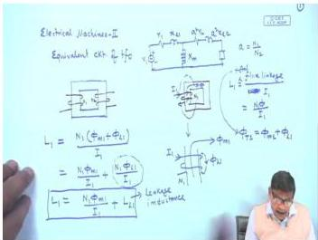
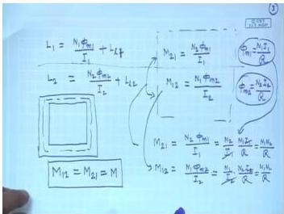
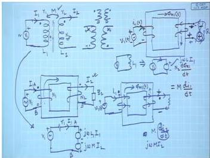
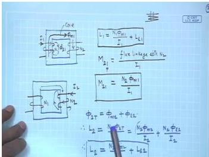

# Week 1: Review of Transformers and Coupled Circuits

## Learning Objectives

- Define self-inductance and mutual inductance for magnetically coupled coils
- Derive the relationship between self-inductance, mutual inductance, and leakage inductance
- Apply the dot convention to determine the polarity of induced voltages in coupled circuits
- Express the voltage-current relationships for a pair of coupled coils
- Relate the coupled circuit model to the equivalent circuit of a transformer

---

## Self and Mutual Inductance of Coupled Coils

A transformer is fundamentally a collection of two or more coils that are magnetically coupled. To understand its operation from a circuit analysis perspective, we must first review the concepts of self-inductance and mutual inductance.

Consider two coils wound on a common magnetic core, as shown in the figure below.

  <em>Figure: Two coils wound on a common magnetic core with primary turns N₁ and secondary turns N₂.</em>

### Self-Inductance

The **self-inductance** of a coil is defined as the flux linkage with the coil per unit current flowing through it.

For coil 1 carrying a current $I_1$:

$$
L_1 = \frac{\text{Flux linkage with coil 1}}{I_1} = \frac{N_1 \Phi_{T1}}{I_1}
$$

where $\Phi_{T1}$ is the total flux produced by $I_1$. This total flux consists of two components:

1. **Mutual flux** ($\Phi_{m1}$): The flux that is confined to the core and links both coils.
2. **Leakage flux** ($\Phi_{l1}$): The flux that completes its path through the air and links only coil 1.

$$
\Phi_{T1} = \Phi_{m1} + \Phi_{l1}
$$

Therefore, the self-inductance can be expressed as:

$$
L_1 = \frac{N_1 (\Phi_{m1} + \Phi_{l1})}{I_1} = \frac{N_1 \Phi_{m1}}{I_1} + \frac{N_1 \Phi_{l1}}{I_1}
$$

The first term is the **magnetizing inductance** (associated with the mutual flux), and the second term is the **leakage inductance** $L_{l1}$.

$$
L_1 = L_{m1} + L_{l1}
$$

Similarly, for coil 2:

$$
L_2 = L_{m2} + L_{l2}
$$

### Mutual Inductance

**Mutual inductance** quantifies the ability of one coil to induce a voltage in another coil due to a change in current.

If a time-varying current $i_1(t)$ flows in coil 1, it produces a time-varying mutual flux $\Phi_{m1}(t)$. This changing flux links coil 2 and induces a voltage across its terminals.

The induced voltage in coil 2 due to current in coil 1 is:

$$
v_2(t) = N_2 \frac{d\Phi_{m1}(t)}{dt} = M_{21} \frac{di_1(t)}{dt}
$$

where $M_{21}$ is the mutual inductance between coil 1 and coil 2.

Similarly, the induced voltage in coil 1 due to current in coil 2 is:

$$
v_1(t) = N_1 \frac{d\Phi_{m2}(t)}{dt} = M_{12} \frac{di_2(t)}{dt}
$$

For a linear magnetic system (no saturation), the mutual inductances are equal:

$$
M_{12} = M_{21} = M
$$

The mutual inductance $M$ is related to the self-inductances by the **coefficient of coupling** $k$:

$$
M = k \sqrt{L_1 L_2}
$$

where $0 \leq k \leq 1$. For an ideal transformer with perfect coupling (no leakage), $k = 1$.

---

## Dot Convention and Polarity of Induced Voltages

When dealing with coupled coils, it is essential to know the instantaneous polarity of the induced voltage. The **dot convention** provides a simple way to determine this.

  <em>Figure: Coupled coils with dot markings indicating the relative polarity of induced voltages.</em>

### Rules of the Dot Convention

1. When the **reference direction** of a current enters the dotted terminal of a coil, it induces a voltage in the other coil with a **positive polarity at the dotted terminal** of that coil.
2. Conversely, if the current leaves the dotted terminal, the induced voltage is negative at the dotted terminal of the other coil.

### Physical Interpretation

Consider the circuit shown below:

  <em>Figure: Coupled circuit showing the dot convention and the direction of induced voltages.</em>

Suppose at a given instant, the primary voltage $v_1(t)$ is such that the top terminal is positive and $i_1(t)$ is increasing. The mutual flux $\Phi_{m1}$ is increasing in the core. According to **Lenz's law**, the induced voltage in the secondary coil must oppose the cause (the increasing flux).

If the secondary is connected to a load resistor $R$, the induced voltage will drive a current $i_2(t)$ such that the flux produced by $i_2$ opposes $\Phi_{m1}$. This determines the correct polarity of the induced voltage.

- If the dot on coil 2 is at the top, and $i_1$ enters the dot of coil 1, then the induced voltage $v_2$ will have its positive polarity at the dot of coil 2.
- The current $i_2$ driven by this voltage will leave the dot of coil 2, producing a flux that opposes $\Phi_{m1}$.

### Voltage-Current Relationships

For the coupled circuit shown above, the terminal voltage equations are:

$$
v_1(t) = L_1 \frac{di_1(t)}{dt} + M \frac{di_2(t)}{dt}
$$

$$
v_2(t) = M \frac{di_1(t)}{dt} + L_2 \frac{di_2(t)}{dt}
$$

The sign of the mutual term depends on the dot convention and the assumed current directions.

---

## From Coupled Circuits to the Transformer Equivalent Circuit

The standard equivalent circuit of a transformer (referred to the primary side) can be derived from the coupled circuit model.

  <em>Figure: Equivalent circuit of a transformer referred to the primary side (core loss neglected).</em>

The parameters are:

- $r_1$: Primary winding resistance
- $x_{l1} = \omega L_{l1}$: Primary leakage reactance
- $X_m = \omega L_m$: Magnetizing reactance (due to mutual flux)
- $r_2' = a^2 r_2$: Secondary resistance referred to primary
- $x_{l2}' = a^2 x_{l2}$: Secondary leakage reactance referred to primary
- $a = N_1 / N_2$: Turns ratio

The transformation ratio $a$ relates the primary and secondary quantities:

$$
V_2' = a V_2, \quad I_2' = \frac{I_2}{a}, \quad Z_2' = a^2 Z_2
$$

---

## Solved Examples

### Example 1: Calculation of Self and Mutual Inductance

Two coils are wound on a common core. Coil 1 has $N_1 = 500$ turns and coil 2 has $N_2 = 200$ turns. When a current of $2$ A flows through coil 1, the total flux produced is $0.01$ Wb, of which $0.008$ Wb links coil 2. Calculate:
(a) Self-inductance $L_1$
(b) Mutual inductance $M$
(c) Leakage inductance $L_{l1}$

**Solution:**

**(a)** Self-inductance of coil 1:

$$
L_1 = \frac{N_1 \Phi_{T1}}{I_1} = \frac{500 \times 0.01}{2} = 2.5 \text{ H}
$$

**(b)** Mutual inductance:

The mutual flux linking coil 2 is $\Phi_{m1} = 0.008$ Wb.

$$
M = \frac{N_2 \Phi_{m1}}{I_1} = \frac{200 \times 0.008}{2} = 0.8 \text{ H}
$$

**(c)** Leakage inductance of coil 1:

Leakage flux $\Phi_{l1} = \Phi_{T1} - \Phi_{m1} = 0.01 - 0.008 = 0.002$ Wb.

$$
L_{l1} = \frac{N_1 \Phi_{l1}}{I_1} = \frac{500 \times 0.002}{2} = 0.5 \text{ H}
$$

**Answer:** $L_1 = 2.5$ H, $M = 0.8$ H, $L_{l1} = 0.5$ H

---

### Example 2: Dot Convention and Induced Voltage

Two coupled coils have $L_1 = 4$ H, $L_2 = 9$ H, and $M = 3$ H. The current in coil 1 is $i_1(t) = 5 \sin(100t)$ A. The current in coil 2 is zero. Determine the induced voltage in coil 2 if:
(a) The dot on coil 2 is at the same end as the dot on coil 1.
(b) The dot on coil 2 is at the opposite end.

**Solution:**

The induced voltage in coil 2 due to $i_1$ is:

$$
v_2(t) = \pm M \frac{di_1(t)}{dt}
$$

where the sign depends on the dot convention.

$$
\frac{di_1(t)}{dt} = \frac{d}{dt}[5 \sin(100t)] = 500 \cos(100t) \text{ A/s}
$$

**(a)** Dots at same end (same polarity):

$$
v_2(t) = +M \frac{di_1}{dt} = 3 \times 500 \cos(100t) = 1500 \cos(100t) \text{ V}
$$

**(b)** Dots at opposite ends (opposite polarity):

$$
v_2(t) = -M \frac{di_1}{dt} = -1500 \cos(100t) \text{ V}
$$

**Answer:** (a) $v_2(t) = 1500 \cos(100t)$ V, (b) $v_2(t) = -1500 \cos(100t)$ V

---

### Example 3: Voltage Equations for Coupled Coils

For the coupled circuit shown below, write the voltage equations in the time domain.

  <em>Figure: Coupled circuit for Example 3.</em>

Given: $L_1 = 2$ H, $L_2 = 8$ H, $M = 2$ H, $R_1 = 1\ \Omega$, $R_2 = 2\ \Omega$.

**Solution:**

Using the dot convention (current $i_1$ enters the dot of coil 1, current $i_2$ leaves the dot of coil 2):

For the primary circuit:

$$
v_1(t) = R_1 i_1(t) + L_1 \frac{di_1(t)}{dt} - M \frac{di_2(t)}{dt}
$$

The negative sign for the mutual term is because $i_2$ leaves the dotted terminal of coil 2, which induces a voltage in coil 1 with negative polarity at the dot.

For the secondary circuit:

$$
0 = R_2 i_2(t) + L_2 \frac{di_2(t)}{dt} - M \frac{di_1(t)}{dt}
$$

Substituting values:

$$
v_1(t) = i_1(t) + 2 \frac{di_1(t)}{dt} - 2 \frac{di_2(t)}{dt}
$$

$$
0 = 2 i_2(t) + 8 \frac{di_2(t)}{dt} - 2 \frac{di_1(t)}{dt}
$$

**Answer:** The voltage equations are as derived above.

---

## Key Formulas

| Quantity | Formula | Units |
|----------|---------|-------|
| Self-inductance | $L = \frac{N\Phi}{I}$ | H (Henry) |
| Mutual inductance | $M = \frac{N_2 \Phi_{m1}}{I_1} = \frac{N_1 \Phi_{m2}}{I_2}$ | H |
| Coefficient of coupling | $k = \frac{M}{\sqrt{L_1 L_2}}$ | — |
| Induced voltage (mutual) | $v_2 = M \frac{di_1}{dt}$ | V |
| Turns ratio | $a = \frac{N_1}{N_2}$ | — |
| Referred impedance | $Z_2' = a^2 Z_2$ | $\Omega$ |
| Leakage inductance | $L_l = L - L_m$ | H |

---

## Summary

- **Self-inductance** of a coil is the total flux linkage per unit current, comprising both mutual and leakage components.
- **Mutual inductance** $M$ quantifies the magnetic coupling between two coils and is equal in both directions for linear systems.
- The **dot convention** provides a systematic way to determine the polarity of induced voltages in coupled circuits, consistent with Lenz's law.
- The **coefficient of coupling** $k$ ranges from 0 (no coupling) to 1 (perfect coupling).
- The transformer equivalent circuit is derived from the coupled circuit model by separating leakage and magnetizing components and referring secondary quantities to the primary side using the turns ratio $a = N_1/N_2$.