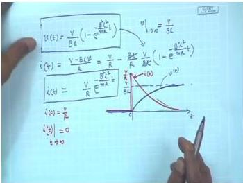
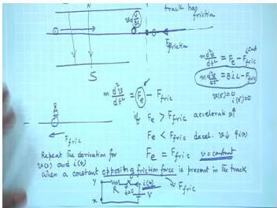
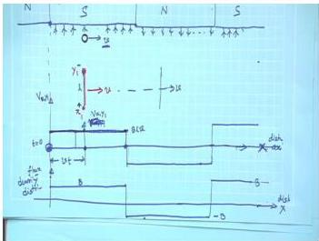
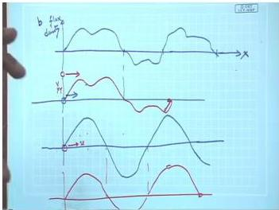

# Week 2: Energy Conversion and Basic Principles of Rotating Machines

## Learning Objectives

- Understand the fundamental principles of electromechanical energy conversion using a single conductor motor model
- Analyze the dynamic behavior of a conductor moving in a magnetic field under various loading conditions
- Relate the spatial distribution of flux density to the waveform of induced EMF in a moving conductor
- Derive the steady-state operating conditions for a motor under constant opposing force (load)
- Recognize the importance of sinusoidal flux density distribution for generating sinusoidal voltages

---

## Single Conductor Motor: Basic Operation

The simplest rotating machine can be conceptualized as a **single conductor** placed on a frictionless track within a uniform magnetic field. This model captures the essential physics of electromechanical energy conversion.

  <em>Figure: A single conductor of length $l$ placed on a track in a uniform magnetic field $B$ (directed into the page). A DC voltage source $V$ is connected via a switch $S$.</em>

### Circuit and Mechanical Dynamics

When the switch is closed at $t = 0$, the circuit consists of:
- A DC voltage source $V$
- The conductor's resistance $R$
- The **motional EMF** (back EMF) $e = Blv$ induced in the conductor as it moves

Applying Kirchhoff's Voltage Law (KVL):

$$
V = iR + Blv
$$

The **electromagnetic force** acting on the conductor is given by:

$$
F_e = B i l
$$

This force accelerates the conductor according to Newton's second law (assuming no friction):

$$
m \frac{dv}{dt} = F_e = B i l
$$

### Transient Solution

From the KVL equation, the current is:

$$
i = \frac{V - Blv}{R}
$$

Substituting into the equation of motion:

$$
m \frac{dv}{dt} = \frac{Bl}{R} (V - Blv)
$$

This is a first-order differential equation in $v$. The solution is:

$$
v(t) = \frac{V}{Bl} \left(1 - e^{-t/\tau_m}\right)
$$

where the **mechanical time constant** is:

$$
\tau_m = \frac{mR}{(Bl)^2}
$$

The corresponding current is:

$$
i(t) = \frac{V}{R} e^{-t/\tau_m}
$$

### Steady-State Conditions

As $t \to \infty$:

- **Velocity**: $v_\infty = \dfrac{V}{Bl}$
- **Back EMF**: $e_\infty = Bl v_\infty = V$
- **Current**: $i_\infty = 0$
- **Force**: $F_e = 0$

The conductor reaches a constant velocity where the back EMF exactly balances the supply voltage. No current flows, and no net force acts on the conductor — it continues moving indefinitely at this speed due to inertia (frictionless assumption).

---

## Effect of Loading: Constant Opposing Force

In a real motor, the conductor must overcome mechanical load (friction, weight, etc.). Consider a constant opposing friction force $F_{fric}$ acting on the conductor.

  <em>Figure: The conductor enters a region of the track with friction $F_{fric}$ opposing its motion.</em>

### Modified Equation of Motion

The net force now includes both electromagnetic and friction components:

$$
m \frac{dv}{dt} = F_e - F_{fric} = B i l - F_{fric}
$$

### Steady-State Under Load

When the conductor reaches a new steady state ($dv/dt = 0$):

$$
B i l = F_{fric}
$$

The steady-state current is:

$$
i_{ss} = \frac{F_{fric}}{Bl}
$$

From the circuit equation $V = iR + Blv$, the steady-state velocity becomes:

$$
v_{ss} = \frac{V - i_{ss}R}{Bl} = \frac{V}{Bl} - \frac{F_{fric}R}{(Bl)^2}
$$

**Key observations:**
- The steady-state velocity under load is **less than** the no-load velocity $V/Bl$
- The conductor draws a non-zero current to produce the torque needed to overcome the load
- The machine now acts as a **motor**, converting electrical power ($V i_{ss}$) into mechanical power ($F_{fric} v_{ss}$)

---

## Flux Density Distribution and Induced EMF

The waveform of the induced EMF in a moving conductor is directly determined by the **spatial distribution** of the magnetic flux density $B(x)$ along the path of motion.

### Rectangular Flux Density Distribution

Consider a conductor moving with constant velocity $v$ through alternating North and South poles.

  <em>Figure: (Top) Spatial distribution of flux density $B(x)$ — rectangular alternating pattern. (Bottom) Induced EMF $V_{x1y1}$ across the conductor ends — also rectangular and alternating.</em>

The induced EMF is:

$$
e = B(x) l v
$$

Since $l$ and $v$ are constant, the EMF waveform is an **exact scaled replica** of the flux density distribution $B(x)$.

- Under a South Pole ($B$ positive): $e = +Blv$
- Under a North Pole ($B$ negative): $e = -Blv$

### General Principle

For any arbitrary spatial distribution $B(x)$, if a conductor moves through it with constant velocity $v$, the induced EMF $e(t)$ has the **same shape** as $B(x)$.

  <em>Figure: An arbitrary flux density distribution $B(x)$ and the corresponding induced EMF in a conductor moving through it.</em>

### Sinusoidal Flux Density — The Ideal Case

To generate a **sinusoidal AC voltage** (as required in power systems), the flux density must be **sinusoidally distributed in space**:

$$
B(x) = B_m \sin\left(\frac{\pi x}{\tau_p}\right)
$$

where $\tau_p$ is the **pole pitch** (distance between adjacent poles).

If the conductor moves with velocity $v$, the induced EMF is:

$$
e(t) = B_m l v \sin(\omega t)
$$

where $\omega = \frac{\pi v}{\tau_p}$ is the electrical angular frequency.

This is the fundamental principle behind AC generator design — the field winding is arranged to produce a sinusoidal flux density distribution in the air gap.

---

## Solved Examples

### Example 1: Single Conductor Motor — No Load

A conductor of length $l = 0.5$ m moves in a uniform magnetic field $B = 1$ T. The conductor resistance is $R = 0.2\ \Omega$, and it is connected to a $V = 10$ V DC source. The mass of the conductor is $m = 0.1$ kg. Assume no friction.

**(a)** Find the steady-state velocity and current.
**(b)** Calculate the mechanical time constant.
**(c)** Determine the velocity and current at $t = 0.1$ s after closing the switch.

**Solution:**

**(a)** Steady-state:

$$
v_\infty = \frac{V}{Bl} = \frac{10}{1 \times 0.5} = 20\ \text{m/s}
$$

$$
i_\infty = 0\ \text{A}
$$

**(b)** Time constant:

$$
\tau_m = \frac{mR}{(Bl)^2} = \frac{0.1 \times 0.2}{(1 \times 0.5)^2} = \frac{0.02}{0.25} = 0.08\ \text{s}
$$

**(c)** At $t = 0.1$ s:

$$
v(0.1) = 20 \left(1 - e^{-0.1/0.08}\right) = 20 \left(1 - e^{-1.25}\right) = 20(1 - 0.2865) = 14.27\ \text{m/s}
$$

$$
i(0.1) = \frac{10}{0.2} e^{-1.25} = 50 \times 0.2865 = 14.33\ \text{A}
$$

**Answer:** $v_\infty = 20$ m/s, $i_\infty = 0$ A, $\tau_m = 0.08$ s, $v(0.1) = 14.27$ m/s, $i(0.1) = 14.33$ A.

---

### Example 2: Single Conductor Motor — With Load

For the same conductor in Example 1, a constant friction force $F_{fric} = 2$ N opposes the motion. Find the new steady-state velocity and current.

**Solution:**

Steady-state condition: $B i l = F_{fric}$

$$
i_{ss} = \frac{F_{fric}}{Bl} = \frac{2}{1 \times 0.5} = 4\ \text{A}
$$

From circuit equation:

$$
V = i_{ss} R + Bl v_{ss}
$$

$$
10 = 4 \times 0.2 + 1 \times 0.5 \times v_{ss}
$$

$$
10 = 0.8 + 0.5 v_{ss}
$$

$$
v_{ss} = \frac{9.2}{0.5} = 18.4\ \text{m/s}
$$

**Check:** The velocity is less than the no-load value of 20 m/s, as expected.

**Answer:** $v_{ss} = 18.4$ m/s, $i_{ss} = 4$ A.

---

### Example 3: EMF from Sinusoidal Flux Distribution

A conductor of length $l = 0.4$ m moves with velocity $v = 15$ m/s through a magnetic field with sinusoidal spatial distribution:

$$
B(x) = 0.8 \sin\left(\frac{\pi x}{0.3}\right)\ \text{T}
$$

The pole pitch is $\tau_p = 0.3$ m. Find:
**(a)** The peak induced EMF
**(b)** The frequency of the induced EMF
**(c)** The EMF as a function of time

**Solution:**

**(a)** Peak EMF:

$$
E_m = B_m l v = 0.8 \times 0.4 \times 15 = 4.8\ \text{V}
$$

**(b)** The electrical angular frequency:

$$
\omega = \frac{\pi v}{\tau_p} = \frac{\pi \times 15}{0.3} = 50\pi\ \text{rad/s}
$$

Frequency:

$$
f = \frac{\omega}{2\pi} = \frac{50\pi}{2\pi} = 25\ \text{Hz}
$$

**(c)** EMF as a function of time:

$$
e(t) = 4.8 \sin(50\pi t)\ \text{V}
$$

**Answer:** $E_m = 4.8$ V, $f = 25$ Hz, $e(t) = 4.8 \sin(50\pi t)$ V.

---

## Key Formulas

| Quantity | Formula | Units |
|----------|---------|-------|
| Motional EMF | $e = Blv$ | V |
| Electromagnetic force | $F_e = Bil$ | N |
| Newton's second law (motor) | $m \frac{dv}{dt} = Bil - F_{fric}$ | N |
| No-load steady-state velocity | $v_\infty = \frac{V}{Bl}$ | m/s |
| Steady-state velocity under load | $v_{ss} = \frac{V}{Bl} - \frac{F_{fric}R}{(Bl)^2}$ | m/s |
| Steady-state current under load | $i_{ss} = \frac{F_{fric}}{Bl}$ | A |
| Mechanical time constant | $\tau_m = \frac{mR}{(Bl)^2}$ | s |
| EMF from spatial flux distribution | $e(t) = B(x(t)) l v$ | V |
| Sinusoidal flux density | $B(x) = B_m \sin\left(\frac{\pi x}{\tau_p}\right)$ | T |
| Electrical frequency from motion | $f = \frac{v}{2\tau_p}$ | Hz |

---

## Summary

- A **single conductor motor** demonstrates the fundamental principles of electromechanical energy conversion: a voltage source drives current through a conductor in a magnetic field, producing force and motion.
- The **back EMF** ($Blv$) opposes the applied voltage, limiting the current and establishing a steady-state velocity.
- Under **no load**, the conductor reaches a velocity where the back EMF equals the supply voltage, and current drops to zero.
- Under **mechanical load** (opposing force), the conductor slows down, draws more current, and produces the necessary torque to balance the load — this is the essence of motor operation.
- The **waveform of the induced EMF** is identical in shape to the spatial distribution of flux density $B(x)$ through which the conductor moves.
- To generate a **sinusoidal AC voltage**, the flux density must be sinusoidally distributed in space — a key design requirement for AC generators.