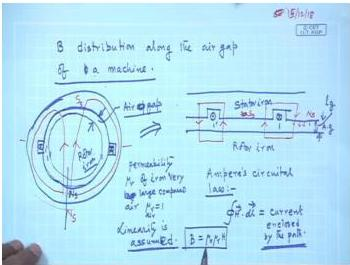
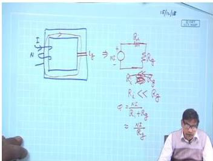
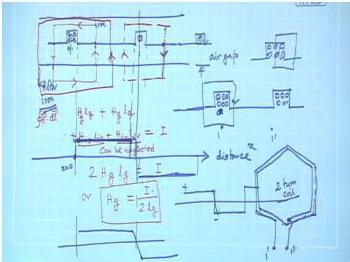
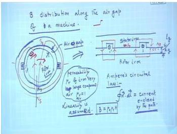
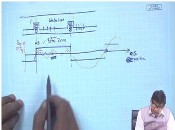
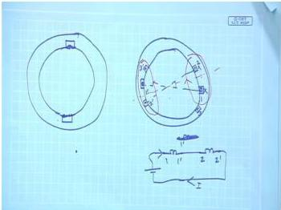

# Week 3: Magnetic Fields and Winding Fundamentals

## Learning Objectives

- Understand the flux density distribution along the air gap of a rotating machine
- Apply Ampere's circuital law to determine magnetic field intensity in the air gap
- Analyze the effect of high permeability iron on MMF distribution
- Explain the concept of distributed windings for improving flux distribution
- Relate flux distribution to induced voltage waveform quality

---

## Flux Density Distribution Along the Air Gap

### Basic Configuration

Consider a rotating machine with a single stator coil carrying DC current. The stator has a pair of conductors (a single coil) connected in series, with current entering through one conductor and leaving through the other.

  <em>Figure: Cross-section of a rotating machine showing stator coil, air gap, and rotor</em>

The current directions are indicated by:
- **Dot (•)**: Current coming out of the page
- **Cross (×)**: Current going into the page

The magnetic flux lines follow a path that crosses the air gap twice, completing the circuit through the stator iron and rotor iron.

### Ampere's Circuital Law Application

To find the magnetic field intensity $H$ in the air gap, we apply **Ampere's circuital law**:

$$
\oint \bar{H} \cdot d\bar{l} = \text{current enclosed by the path}
$$

The relationship between flux density $B$ and magnetic field intensity $H$ is:

$$
B = \mu_0 \mu_r H
$$

### Key Assumptions

1. **High permeability of iron**: $\mu_r$ of iron is very large compared to air ($\mu_r \approx 1$ for air)
2. **Linear magnetic circuit**: Saturation is neglected

### Magnetic Circuit Analysis

Consider the magnetic circuit shown below:

  <em>Figure: Magnetic circuit with iron core and air gap</em>

The circuit can be represented as:

$$
\text{MMF} = NI = \phi(R_i + R_g)
$$

Where:
- $R_i$ = Reluctance of iron path
- $R_g$ = Reluctance of air gap

Since $\mu_r$ of iron is very large, $R_i \ll R_g$. Therefore, **all the MMF is dropped across the air gap**:

$$
NI \approx \phi R_g
$$

This is analogous to a series circuit where most voltage drops across the high resistance.

### Derivation of Air Gap Field

  <em>Figure: Developed diagram showing the air gap and flux path for Ampere's law application</em>

Applying Ampere's circuital law along a closed flux path:

$$
\oint \bar{H} \cdot d\bar{l} = H_g l_g + H_g l_g + H_{is} l_{is} + H_{ir} l_{ir} = I
$$

Where:
- $H_g$ = Magnetic field intensity in air gap
- $l_g$ = Length of air gap
- $H_{is}$, $H_{ir}$ = Field intensity in stator and rotor iron
- $l_{is}$, $l_{ir}$ = Path lengths in stator and rotor iron

**Neglecting iron drops** (since $\mu_r$ is very large):

$$
2 H_g l_g = I
$$

$$
\boxed{H_g = \frac{I}{2 l_g}}
$$

### Flux Density Distribution Pattern

The magnetic field intensity $H_g$ is **constant** between the two slots containing the coil sides. This is because for any closed path between these points, the current enclosed is the same ($I$).

  <em>Figure: Flux density distribution along the air gap for a single stator coil</em>

The resulting $B$ or $H$ distribution is a **square wave**:

- **Positive half**: Between the two conductors carrying current in one direction (dot)
- **Negative half**: Between the two conductors carrying current in the opposite direction (cross)
- **Transitions**: Occur at the slot positions (assumed vertical for simplicity)

  <em>Figure: Developed view showing the square wave flux density distribution</em>

### Significance of Flux Distribution

The flux density distribution determines the nature of induced voltage in conductors on the rotor surface. For a **sinusoidal voltage generator**, we need a **sinusoidal flux density distribution**.

A single coil produces a square wave distribution which contains:
- **Fundamental component** (desired sinusoidal)
- **Odd harmonics** (3rd, 5th, 7th, etc.)

The square wave can be Fourier analyzed:

$$
B(x) = \frac{4B_m}{\pi} \left[\sin\left(\frac{\pi x}{\tau}\right) + \frac{1}{3}\sin\left(\frac{3\pi x}{\tau}\right) + \frac{1}{5}\sin\left(\frac{5\pi x}{\tau}\right) + \cdots\right]
$$

Where $\tau$ is the pole pitch.

---

## Distributed Windings for Improved Flux Distribution

### Need for Distributed Windings

To achieve a more sinusoidal flux distribution, we use **multiple coils** distributed around the stator periphery instead of a single concentrated coil.

  <em>Figure: Distributed winding with multiple coils to improve flux distribution</em>

### Working Principle

Consider two coils placed in slots:
- Coil 1: Slots 1-1' (diametrically opposite)
- Coil 2: Slots 2-2' (diametrically opposite, displaced by some angle)

When connected in series with proper polarity:
- Current enters through 1, flows through both coils, and returns
- The MMF contributions from each coil add up

The resulting flux distribution is the **superposition** of the individual coil contributions, producing a waveform that is closer to sinusoidal than the square wave from a single coil.

### Advantages of Distributed Windings

1. **Improved waveform**: Reduces harmonic content
2. **Better space utilization**: More slots used
3. **Higher power output**: More conductors can be accommodated
4. **Reduced harmonic losses**: Lower eddy current and hysteresis losses

---

## Solved Examples

### Example 1: Air Gap Field Calculation

A 4-pole DC machine has an air gap length of 2 mm. The stator has a single coil with 100 turns carrying 5 A DC current. Assuming all MMF is dropped across the air gap, calculate:
a) The MMF per pole
b) The magnetic field intensity in the air gap
c) The flux density in the air gap (assume $\mu_0 = 4\pi \times 10^{-7}$ H/m)

**Solution:**

**Step 1:** Calculate total MMF

$$
\text{MMF} = NI = 100 \times 5 = 500 \text{ AT}
$$

**Step 2:** For a 4-pole machine, each pole pair has 2 air gaps. The MMF per pole pair is:

$$
\text{MMF per pole pair} = 500 \text{ AT}
$$

**Step 3:** Using Ampere's law (neglecting iron drops):

$$
2 H_g l_g = \text{MMF per pole pair}
$$

$$
2 \times H_g \times (2 \times 10^{-3}) = 500
$$

$$
H_g = \frac{500}{4 \times 10^{-3}} = 125,000 \text{ A/m}
$$

**Step 4:** Calculate flux density:

$$
B_g = \mu_0 H_g = (4\pi \times 10^{-7}) \times 125,000
$$

$$
B_g = 0.157 \text{ T}
$$

**Answer:**
- MMF per pole = 500 AT
- $H_g = 125,000$ A/m
- $B_g = 0.157$ T

---

### Example 2: Effect of Iron Reluctance

For the machine in Example 1, if the iron path has a relative permeability $\mu_r = 2000$ and the total iron path length is 0.5 m, find the actual flux density considering iron reluctance.

**Solution:**

**Step 1:** Calculate reluctance of air gap

$$
R_g = \frac{l_g}{\mu_0 A_g} = \frac{2 \times 10^{-3}}{4\pi \times 10^{-7} \times A_g} = \frac{1591.5}{A_g}
$$

**Step 2:** Calculate reluctance of iron

$$
R_i = \frac{l_i}{\mu_0 \mu_r A_i} = \frac{0.5}{4\pi \times 10^{-7} \times 2000 \times A_i}
$$

Assuming $A_g = A_i = A$:

$$
R_i = \frac{0.5}{2.513 \times 10^{-3} \times A} = \frac{199}{A}
$$

**Step 3:** Total reluctance

$$
R_{total} = R_g + R_i = \frac{1591.5}{A} + \frac{199}{A} = \frac{1790.5}{A}
$$

**Step 4:** Flux

$$
\phi = \frac{\text{MMF}}{R_{total}} = \frac{500 \times A}{1790.5} = 0.279A \text{ Wb}
$$

**Step 5:** Flux density

$$
B = \frac{\phi}{A} = 0.279 \text{ T}
$$

**Comparison:** Without iron reluctance, $B = 0.157$ T. With iron reluctance, $B = 0.279$ T.

**Observation:** The iron reluctance actually **reduces** the flux density. The assumption that iron reluctance is negligible gives a slightly higher value.

**Answer:** $B = 0.279$ T (considering iron reluctance)

---

### Example 3: Fourier Analysis of Square Wave Flux

A single coil produces a square wave flux density distribution with amplitude $B_m = 0.8$ T and pole pitch $\tau = 0.2$ m. Find the amplitude of the fundamental component and the third harmonic component.

**Solution:**

**Step 1:** The Fourier series for a square wave of amplitude $B_m$ is:

$$
B(x) = \frac{4B_m}{\pi} \sum_{n=1,3,5,\ldots}^{\infty} \frac{1}{n} \sin\left(\frac{n\pi x}{\tau}\right)
$$

**Step 2:** Fundamental component ($n=1$):

$$
B_1 = \frac{4B_m}{\pi} = \frac{4 \times 0.8}{\pi} = 1.018 \text{ T}
$$

**Step 3:** Third harmonic component ($n=3$):

$$
B_3 = \frac{4B_m}{3\pi} = \frac{4 \times 0.8}{3\pi} = 0.339 \text{ T}
$$

**Step 4:** Percentage of fundamental:

$$
\frac{B_3}{B_1} \times 100\% = \frac{0.339}{1.018} \times 100\% = 33.3\%
$$

**Answer:**
- Fundamental amplitude: $B_1 = 1.018$ T
- Third harmonic amplitude: $B_3 = 0.339$ T (33.3% of fundamental)

---

### Example 4: Distributed Winding MMF

Two identical coils, each with 50 turns carrying 3 A, are placed in slots separated by 60° electrical. Calculate the resultant MMF at a point midway between the two coils.

**Solution:**

**Step 1:** MMF of each coil

$$
\text{MMF}_1 = \text{MMF}_2 = NI = 50 \times 3 = 150 \text{ AT}
$$

**Step 2:** For a point midway between the two coils (30° from each coil axis), the MMF contributions are:

$$
\text{MMF}_{1,\text{mid}} = 150 \cos(30^\circ) = 150 \times 0.866 = 129.9 \text{ AT}
$$

$$
\text{MMF}_{2,\text{mid}} = 150 \cos(30^\circ) = 129.9 \text{ AT}
$$

**Step 3:** Resultant MMF (assuming same polarity):

$$
\text{MMF}_{\text{resultant}} = 129.9 + 129.9 = 259.8 \text{ AT}
$$

**Answer:** The resultant MMF at the midpoint is 259.8 AT.

---

## Key Formulas

| Quantity | Formula | Units |
|----------|---------|-------|
| Ampere's circuital law | $\oint \bar{H} \cdot d\bar{l} = \sum I$ | A |
| B-H relationship | $B = \mu_0 \mu_r H$ | T |
| Air gap field (single coil) | $H_g = \frac{I}{2l_g}$ | A/m |
| Reluctance | $R = \frac{l}{\mu_0 \mu_r A}$ | H$^{-1}$ |
| MMF | $\mathcal{F} = NI = \phi R$ | AT |
| Flux | $\phi = \frac{\mathcal{F}}{R}$ | Wb |
| Fourier series (square wave) | $B(x) = \frac{4B_m}{\pi}\sum_{n=1,3,\ldots} \frac{1}{n}\sin\left(\frac{n\pi x}{\tau}\right)$ | T |
| Fundamental amplitude | $B_1 = \frac{4B_m}{\pi}$ | T |
| nth harmonic amplitude | $B_n = \frac{4B_m}{n\pi}$ | T |

---

## Summary

1. **Flux distribution** in a rotating machine with a single stator coil is a **square wave** pattern, constant between slot positions and switching polarity at the slots.

2. **Ampere's circuital law** is the fundamental tool for determining magnetic field intensity. Under the assumption of infinitely permeable iron, all MMF is dropped across the air gap.

3. **High permeability iron** ($\mu_r \gg 1$) allows us to neglect MMF drops in iron paths, simplifying field calculations to $H_g = I/(2l_g)$.

4. **Single coil windings** produce square wave flux distributions containing strong odd harmonics. For sinusoidal voltage generation, the flux distribution should be sinusoidal.

5. **Distributed windings** (multiple coils placed in different slots) produce a more sinusoidal flux distribution by superposition of individual coil MMFs, reducing harmonic content and improving machine performance.