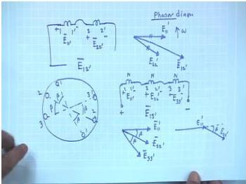
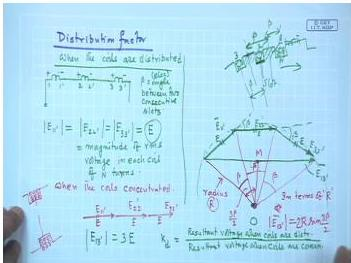
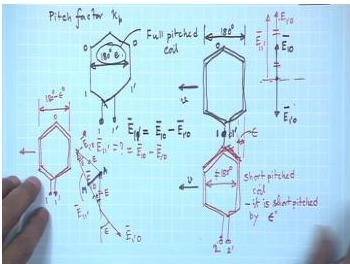

# Week 4: Distributed Windings and Rotating Magnetic Field

## Learning Objectives

- Understand why armature windings are distributed in slots rather than concentrated.
- Define and calculate the **Distribution Factor (Kd)** for a distributed winding.
- Define and calculate the **Pitch Factor (Kp)** for a short-pitched coil.
- Understand the concept of the **Winding Factor (Kw)** as the product of Kd and Kp.
- Calculate the induced EMF in an AC winding considering distribution and chording.

---

## Distribution of Windings

In practical AC machines, the armature windings are not concentrated in a single pair of slots. Instead, the total number of turns per phase is distributed among several slots spaced around the stator or rotor periphery. This is done for several reasons:

1.  **Better Utilization of Space:** Concentrating all turns in two slots leaves the rest of the armature surface unused. Distributing the coils allows for a more compact and efficient machine.
2.  **Improved Cooling:** Heat generated in the windings is spread over a larger area, making cooling more effective.
3.  **Reduction in Harmonics:** A distributed winding produces a more sinusoidal MMF waveform, reducing harmonic content in the generated voltage and torque pulsations.

Consider a coil group consisting of 'm' coils, each with 'N' turns, placed in 'm' adjacent slots. The slots are separated by an electrical angle $\beta$.

  <em>Figure: Three coils (11', 22', 33') distributed in three adjacent slots, each separated by an electrical angle β.</em>

If the rotating magnetic field moves from left to right, the voltage induced in coil 22' will lag the voltage in coil 11' by the slot angle $\beta$. Similarly, the voltage in coil 33' will lag by $2\beta$.

### Distribution Factor ($K_d$)

The **Distribution Factor** (also called the Breadth Factor or Spread Factor) is the ratio of the phasor sum of the voltages induced in the 'm' distributed coils to the arithmetic sum of the individual coil voltages.

If all 'm' coils were concentrated in the same slot, their voltages would be in phase, and the total voltage would be $mE$ (where E is the voltage per coil). However, because they are distributed, the phasor sum is less than $mE$.

The phasor diagram for 'm' coils, each with voltage E, displaced by an angle $\beta$, forms part of a regular polygon. The resultant voltage $E_r$ can be found from the geometry of the polygon.

  <em>Figure: Phasor diagram showing the resultant voltage (Er) of three distributed coils (m=3) with slot angle β.</em>

The formula for the distribution factor is derived as:

$$
K_d = \frac{\text{Phasor Sum}}{\text{Arithmetic Sum}} = \frac{\sin\left(\frac{m\beta}{2}\right)}{m \sin\left(\frac{\beta}{2}\right)}
$$

Where:
- $m$ = Number of coils per phase per pole (coils in a coil group).
- $\beta$ = Slot angle in electrical degrees.

**Calculation of Slot Angle ($\beta$):**

The slot angle $\beta$ (electrical) is the angular displacement between the centers of two consecutive slots, expressed in electrical degrees.

$$
\beta = \frac{180^\circ}{\text{Slots per Pole}}
$$

Alternatively, if the total number of slots is $S$ and the number of poles is $P$:

$$
\beta_{\text{mech}} = \frac{360^\circ}{S}
$$

$$
\beta_{\text{elec}} = \frac{P}{2} \times \beta_{\text{mech}} = \frac{P}{2} \times \frac{360^\circ}{S} = \frac{180^\circ}{S/P}
$$

Since $S/P$ is the number of slots per pole, both methods give the same result.

**Example:** For a 4-pole machine with 24 slots:
- Slots per pole = $24/4 = 6$
- $\beta = 180^\circ / 6 = 30^\circ$ electrical.

---

## Pitch Factor ($K_p$)

The **Pitch Factor** (also called the Chording Factor or Coil Span Factor) accounts for the fact that the two sides of a coil may not be exactly one pole pitch (180° electrical) apart.

A **full-pitch coil** has a span exactly equal to 180° electrical. In this case, the voltages induced in the two coil sides are exactly 180° out of phase, and they add directly in the coil terminals.

A **short-pitch (or chorded) coil** has a span of less than 180° electrical (e.g., 150° or 5/6th of a pole pitch). This is done to:
1.  Reduce the length of the end connections, saving copper.
2.  Reduce the magnitude of certain harmonics in the generated EMF.

If the coil span is $\alpha$ electrical degrees (where $\alpha < 180^\circ$), the voltage induced in the two coil sides are not exactly opposite in phase. The resultant coil voltage is the phasor sum of the two side voltages.

  <em>Figure: A short-pitch coil with coil span less than 180° electrical.</em>

The pitch factor is defined as:

$$
K_p = \frac{\text{Phasor Sum of voltages in the two coil sides}}{\text{Arithmetic Sum of voltages in the two coil sides}}
$$

If the coil span is $\alpha$ electrical degrees, the phase difference between the two coil side voltages is $180^\circ - \alpha$. The resultant voltage is:

$$
E_r = \sqrt{E^2 + E^2 + 2E^2 \cos(180^\circ - \alpha)} = E\sqrt{2(1 - \cos\alpha)} = 2E \cos\left(\frac{\alpha}{2}\right)
$$

Since the arithmetic sum is $2E$, the pitch factor is:

$$
K_p = \frac{2E \cos(\alpha/2)}{2E} = \cos\left(\frac{\alpha}{2}\right)
$$

A more common way to express this is in terms of the **chording angle** $\epsilon$, where $\epsilon = 180^\circ - \alpha$ is the angle by which the coil is short of a full pitch.

$$
K_p = \cos\left(\frac{\epsilon}{2}\right)
$$

**Example:** A coil with a span of 5/6th of a pole pitch.
- Coil span $\alpha = (5/6) \times 180^\circ = 150^\circ$.
- Chording angle $\epsilon = 180^\circ - 150^\circ = 30^\circ$.
- $K_p = \cos(30^\circ/2) = \cos(15^\circ) \approx 0.9659$.

---

## Winding Factor ($K_w$)

The **Winding Factor** is the product of the Distribution Factor and the Pitch Factor. It represents the overall reduction in the induced EMF due to the winding being distributed and short-pitched.

$$
K_w = K_d \times K_p
$$

The RMS value of the induced EMF per phase in an AC winding is then given by:

$$
E_{ph} = 4.44 \times f \times \phi \times N_{ph} \times K_w
$$

Where:
- $f$ = Frequency (Hz)
- $\phi$ = Flux per pole (Wb)
- $N_{ph}$ = Total number of turns in series per phase
- $K_w$ = Winding factor

---

## Solved Examples

### Example 1: Calculation of Distribution Factor

A 3-phase, 4-pole alternator has 36 stator slots. Each coil has 2 turns. The coils are connected in series to form a phase group. Calculate the distribution factor for the fundamental frequency.

**Solution:**

1.  **Calculate Slots per Pole:**
    $$ \text{Slots per pole} = \frac{36}{4} = 9 $$

2.  **Calculate Slot Angle ($\beta$):**
    $$ \beta = \frac{180^\circ}{\text{Slots per pole}} = \frac{180^\circ}{9} = 20^\circ \text{ electrical} $$

3.  **Calculate Coils per Phase per Pole ($m$):**
    Total slots = 36. Slots per phase = $36/3 = 12$.
    Slots per phase per pole = $12/4 = 3$.
    Since each slot contains one coil side, the number of coils per phase per pole is $m = 3$.

4.  **Calculate Distribution Factor ($K_d$):**
    $$ K_d = \frac{\sin\left(\frac{m\beta}{2}\right)}{m \sin\left(\frac{\beta}{2}\right)} = \frac{\sin\left(\frac{3 \times 20^\circ}{2}\right)}{3 \sin\left(\frac{20^\circ}{2}\right)} $$
    $$ K_d = \frac{\sin(30^\circ)}{3 \sin(10^\circ)} = \frac{0.5}{3 \times 0.1736} = \frac{0.5}{0.5208} \approx 0.96 $$

**Answer:** The distribution factor is approximately 0.96.

---

### Example 2: Calculation of Pitch Factor

A 3-phase alternator has a 2-layer winding with a coil span of 8 slots. The stator has 36 slots and 4 poles. Calculate the pitch factor.

**Solution:**

1.  **Calculate Slots per Pole:**
    $$ \text{Slots per pole} = \frac{36}{4} = 9 $$

2.  **Calculate Coil Span in Electrical Degrees:**
    A full pitch is 9 slots (180° electrical). The coil span is 8 slots.
    $$ \alpha = \frac{8}{9} \times 180^\circ = 160^\circ \text{ electrical} $$

3.  **Calculate Chording Angle ($\epsilon$):**
    $$ \epsilon = 180^\circ - \alpha = 180^\circ - 160^\circ = 20^\circ $$

4.  **Calculate Pitch Factor ($K_p$):**
    $$ K_p = \cos\left(\frac{\epsilon}{2}\right) = \cos\left(\frac{20^\circ}{2}\right) = \cos(10^\circ) \approx 0.9848 $$

**Answer:** The pitch factor is approximately 0.9848.

---

### Example 3: Induced EMF Calculation

A 3-phase, 50 Hz, 4-pole alternator has a flux per pole of 0.05 Wb. The stator has 36 slots and a 2-layer winding with 4 turns per coil. The coil span is 8 slots. The coils are connected in series to form a phase group. Calculate the RMS value of the induced EMF per phase.

**Solution:**

1.  **Calculate Total Turns per Phase ($N_{ph}$):**
    Total slots = 36. Slots per phase = $36/3 = 12$.
    In a 2-layer winding, each slot has 2 coil sides. So, total coils per phase = 12.
    Turns per coil = 4.
    Total turns per phase, $N_{ph} = 12 \times 4 = 48$ turns.

2.  **Calculate Distribution Factor ($K_d$):**
    From Example 1, $m = 3$, $\beta = 20^\circ$.
    $$ K_d = \frac{\sin(30^\circ)}{3 \sin(10^\circ)} \approx 0.96 $$

3.  **Calculate Pitch Factor ($K_p$):**
    From Example 2, $\epsilon = 20^\circ$.
    $$ K_p = \cos(10^\circ) \approx 0.9848 $$

4.  **Calculate Winding Factor ($K_w$):**
    $$ K_w = K_d \times K_p = 0.96 \times 0.9848 \approx 0.9454 $$

5.  **Calculate Induced EMF per Phase ($E_{ph}$):**
    $$ E_{ph} = 4.44 \times f \times \phi \times N_{ph} \times K_w $$
    $$ E_{ph} = 4.44 \times 50 \times 0.05 \times 48 \times 0.9454 $$
    $$ E_{ph} = 4.44 \times 50 \times 0.05 \times 48 \times 0.9454 \approx 503.8 \text{ V} $$

**Answer:** The induced EMF per phase is approximately 503.8 V.

---

## Key Formulas

| Quantity | Formula | Units |
|----------|---------|-------|
| Distribution Factor | $K_d = \dfrac{\sin\left(\dfrac{m\beta}{2}\right)}{m \sin\left(\dfrac{\beta}{2}\right)}$ | — |
| Slot Angle (Electrical) | $\beta = \dfrac{180^\circ}{\text{Slots per Pole}}$ | degrees |
| Pitch Factor | $K_p = \cos\left(\dfrac{\epsilon}{2}\right)$ | — |
| Chording Angle | $\epsilon = 180^\circ - \text{Coil Span (elec.)}$ | degrees |
| Winding Factor | $K_w = K_d \times K_p$ | — |
| Induced EMF per Phase | $E_{ph} = 4.44 f \phi N_{ph} K_w$ | Volts |

---

## Summary

- **Distributed Windings** are used for better space utilization, cooling, and harmonic reduction. The **Distribution Factor ($K_d$)** quantifies the reduction in EMF due to distribution.
- **Short-pitched coils** are used to save copper and reduce harmonics. The **Pitch Factor ($K_p$)** quantifies the reduction in EMF due to chording.
- The **Winding Factor ($K_w$)** is the product of $K_d$ and $K_p$ and represents the overall effectiveness of the winding.
- The induced EMF in an AC winding is directly proportional to the winding factor. A lower winding factor means a lower voltage for the same number of turns and flux.