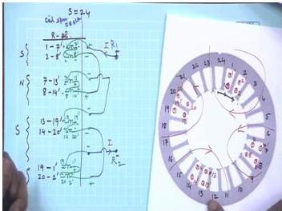
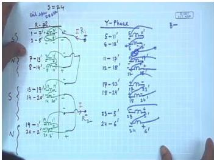
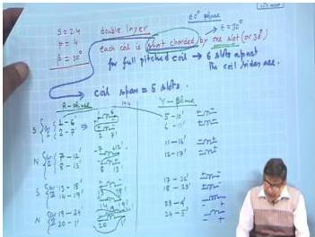
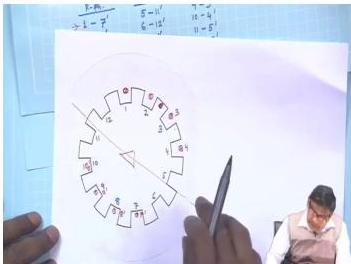
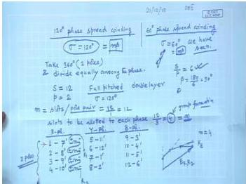

# Week 5: Rotating Magnetic Field — Theory and Analysis

## Learning Objectives

- Understand the construction and layout of 3-phase distributed windings in AC machines
- Analyze the winding table for double-layer, full-pitched windings with 24 slots and 4 poles
- Explain the concept of 60° phase spread winding and its implementation
- Describe 120° phase spread winding and compare it with 60° phase spread
- Determine coil spans, pole pitches, and phase groupings for balanced 3-phase windings

---

## Introduction to 3-Phase Distributed Windings

In AC machines, the stator windings are **distributed** in multiple slots around the stator periphery rather than being concentrated in a single slot. This distribution serves two important purposes:

1. **Reduces harmonic content** in the generated EMF waveform
2. **Improves space utilization** of the stator periphery

For a balanced 3-phase winding, the three phases (R, Y, B) must be identical in terms of number of turns, coil span, and distribution, with their magnetic axes displaced by $120^\circ$ electrical from each other.

---

## Winding Parameters and Terminology

### Key Definitions

| Parameter | Symbol | Definition |
|-----------|--------|------------|
| Number of slots | $S$ | Total slots on stator |
| Number of poles | $P$ | Poles of the machine |
| Slots per pole | $S_p$ | $S_p = \frac{S}{P}$ |
| Pole pitch | $\tau$ | $\tau = \frac{S}{P}$ slots (or $180^\circ$ electrical) |
| Coil span | $y$ | Distance between two coil sides of a coil (in slots) |
| Slot angle | $\beta$ | $\beta = \frac{180^\circ \times P}{S}$ electrical degrees |
| Phase spread | $\sigma$ | Angular span over which coils of one phase are distributed |

### Slot Angle Calculation

For a machine with $S$ slots and $P$ poles:

$$
\beta = \frac{180^\circ \times P}{S} \text{ electrical degrees}
$$

For the example with $S = 24$, $P = 4$:

$$
\beta = \frac{180^\circ \times 4}{24} = 30^\circ \text{ electrical}
$$

---

## Double-Layer Winding Construction

In a **double-layer winding**, each slot houses two coil sides — one from the top layer and one from the bottom layer. This means:

- Number of coils = Number of slots = $S$
- Each coil has two coil sides occupying two different slots

### Full-Pitched Coil

A **full-pitched coil** has a coil span equal to the pole pitch:

$$
y = \tau = \frac{S}{P} \text{ slots}
$$

For $S = 24$, $P = 4$:

$$
y = \tau = \frac{24}{4} = 6 \text{ slots}
$$

This means if one coil side is in slot $n$, the other coil side is in slot $(n + 6)'$ (where the prime denotes the return side).

---

## Example: 24 Slots, 4 Poles, Double-Layer Full-Pitched Winding

### Specifications

- Total slots: $S = 24$
- Number of poles: $P = 4$
- Type: Double-layer, full-pitched
- Phase spread: $\sigma = 60^\circ$ (standard)
- Slots per pole: $S_p = \frac{24}{4} = 6$
- Coil span: $y = 6$ slots

### Distribution of Slots Under One Pole

Under each pole (180° electrical), there are 6 slots. For 60° phase spread, these 6 slots are equally divided among the three phases:

- R phase: 2 slots
- Y phase: 2 slots
- B phase: 2 slots

Total coils per phase = $\frac{24}{3} = 8$ coils

### Winding Table for R Phase

  <em>Figure: Winding table construction for R phase showing coil groups</em>

**Group I (under South Pole):**

| Coil | Start Slot | Return Slot |
|------|------------|-------------|
| 1 | 1 | $7'$ |
| 2 | 2 | $8'$ |

**Group II (under North Pole):**

| Coil | Start Slot | Return Slot |
|------|------------|-------------|
| 3 | 7 | $13'$ |
| 4 | 8 | $14'$ |

**Group III (under South Pole):**

| Coil | Start Slot | Return Slot |
|------|------------|-------------|
| 5 | 13 | $19'$ |
| 6 | 14 | $20'$ |

**Group IV (under North Pole):**

| Coil | Start Slot | Return Slot |
|------|------------|-------------|
| 7 | 19 | $1'$ |
| 8 | 20 | $2'$ |

### Polarity Assignment

For proper series connection, the polarity of induced voltages must be considered:

- Under **South Pole**: Coil starts are positive (+)
- Under **North Pole**: Coil starts are negative (−)

This ensures that when coils are connected in series, all voltages add constructively.

### Physical Layout of R Phase Coils

  <em>Figure: Physical arrangement of R phase coils showing 4-pole formation</em>

The current direction in the coils creates alternating North and South poles:

- Coils 1, 2 (slots 1, 2): Cross current (entering)
- Coils 7, 8 (slots 7, 8): Dot current (leaving)
- Coils 13, 14 (slots 13, 14): Cross current (entering)
- Coils 19, 20 (slots 19, 20): Dot current (leaving)

This produces: **South → North → South → North** pole pattern.

---

## Y Phase Winding — 120° Electrical Displacement

For a balanced 3-phase winding, Y phase must be displaced by $120^\circ$ electrical from R phase.

### Determining Y Phase Start Slot

With $\beta = 30^\circ$ per slot, $120^\circ$ corresponds to:

$$
\frac{120^\circ}{30^\circ} = 4 \text{ slots}
$$

Therefore, Y phase starts at slot $1 + 4 = 5$.

### Winding Table for Y Phase

**Group I (under South Pole):**

| Coil | Start Slot | Return Slot |
|------|------------|-------------|
| 1 | 5 | $11'$ |
| 2 | 6 | $12'$ |

**Group II (under North Pole):**

| Coil | Start Slot | Return Slot |
|------|------------|-------------|
| 3 | 11 | $17'$ |
| 4 | 12 | $18'$ |

**Group III (under South Pole):**

| Coil | Start Slot | Return Slot |
|------|------------|-------------|
| 5 | 17 | $23'$ |
| 6 | 18 | $24'$ |

**Group IV (under North Pole):**

| Coil | Start Slot | Return Slot |
|------|------------|-------------|
| 7 | 23 | $5'$ |
| 8 | 24 | $6'$ |

> **Note:** For coil 7, $23 + 6 = 29$, but maximum slot is 24. So $29 - 24 = 5$, giving return slot $5'$.

---

## Short-Pitched (Chorded) Winding

A **short-pitched** or **chorded** winding has a coil span less than the pole pitch:

$$
y < \tau
$$

### Example: Short-Pitched by One Slot

For the same machine ($S = 24$, $P = 4$):

- Pole pitch: $\tau = 6$ slots
- Short-pitching by 1 slot: $y = 5$ slots
- Short-pitching angle: $\varepsilon = \beta = 30^\circ$ electrical

### Winding Table for R Phase (Short-Pitched)

  <em>Figure: Short-pitched winding with coil span of 5 slots</em>

**Group I (under South Pole):**

| Coil | Start Slot | Return Slot |
|------|------------|-------------|
| 1 | 1 | $6'$ |
| 2 | 2 | $7'$ |

**Group II (under North Pole):**

| Coil | Start Slot | Return Slot |
|------|------------|-------------|
| 3 | 7 | $12'$ |
| 4 | 8 | $13'$ |

**Group III (under South Pole):**

| Coil | Start Slot | Return Slot |
|------|------------|-------------|
| 5 | 13 | $18'$ |
| 6 | 14 | $19'$ |

**Group IV (under North Pole):**

| Coil | Start Slot | Return Slot |
|------|------------|-------------|
| 7 | 19 | $24'$ |
| 8 | 20 | $1'$ |

### Y Phase for Short-Pitched Winding

Y phase starts at slot $1 + 4 = 5$ (same $120^\circ$ displacement).

**Group I:** Coils 5-10', 6-11'
**Group II:** Coils 11-16', 12-17'
**Group III:** Coils 17-22', 18-23'
**Group IV:** Coils 23-4', 24-5'

> **Advantage of Short-Pitching:** Reduces certain harmonic components in the induced EMF, particularly the 5th and 7th harmonics.

---

## 120° Phase Spread Winding

### Concept

In **60° phase spread** winding ($\sigma = 60^\circ$), the $180^\circ$ electrical space under one pole is equally divided among R, Y, and B phases.

In **120° phase spread** winding ($\sigma = 120^\circ$), the $360^\circ$ electrical space (two poles) is equally divided among the three phases.

  <em>Figure: Comparison of 60° and 120° phase spread windings</em>

### Example: 12 Slots, 2 Poles, Full-Pitched, 120° Phase Spread

**Specifications:**
- $S = 12$, $P = 2$
- $\beta = \frac{180^\circ \times 2}{12} = 30^\circ$
- $\tau = \frac{12}{2} = 6$ slots
- $y = 6$ slots (full-pitched)
- $\sigma = 120^\circ$

**Distribution:** Under $360^\circ$ electrical (2 poles), 12 slots are equally divided:
- R phase: 4 slots (spread over $120^\circ$)
- Y phase: 4 slots (spread over $120^\circ$)
- B phase: 4 slots (spread over $120^\circ$)

### Winding Table for 120° Phase Spread

  <em>Figure: Winding table for 120° phase spread winding</em>

**R Phase Coils:**

| Coil | Start Slot | Return Slot |
|------|------------|-------------|
| 1 | 1 | $7'$ |
| 2 | 2 | $8'$ |
| 3 | 3 | $9'$ |
| 4 | 4 | $10'$ |

**Y Phase Coils:** Start at slot $1 + 4 = 5$ (120° displacement)

| Coil | Start Slot | Return Slot |
|------|------------|-------------|
| 1 | 5 | $11'$ |
| 2 | 6 | $12'$ |
| 3 | 7 | $1'$ |
| 4 | 8 | $2'$ |

**B Phase Coils:** Start at slot $5 + 4 = 9$

| Coil | Start Slot | Return Slot |
|------|------------|-------------|
| 1 | 9 | $3'$ |
| 2 | 10 | $4'$ |
| 3 | 11 | $5'$ |
| 4 | 12 | $6'$ |

### Comparison: 60° vs 120° Phase Spread

| Parameter | 60° Phase Spread | 120° Phase Spread |
|-----------|------------------|-------------------|
| Distribution span per phase | $60^\circ$ | $120^\circ$ |
| Slots per phase per pole | $\frac{S}{3P}$ | $\frac{2S}{3P}$ |
| Winding factor | Higher | Lower |
| Harmonic content | Lower | Higher |
| Copper utilization | Better | Poorer |
| Application | Standard AC machines | Special applications |

---

## Solved Examples

### Example 1: Determining Slot Angle and Pole Pitch

**Problem:** A 3-phase induction motor has 36 slots and 6 poles. Calculate:
(a) Slot angle in electrical degrees
(b) Pole pitch in slots
(c) Coil span for full-pitched winding

**Solution:**

**(a) Slot angle:**

$$
\beta = \frac{180^\circ \times P}{S} = \frac{180^\circ \times 6}{36} = 30^\circ \text{ electrical}
$$

**(b) Pole pitch:**

$$
\tau = \frac{S}{P} = \frac{36}{6} = 6 \text{ slots}
$$

**(c) Coil span for full-pitched winding:**

$$
y = \tau = 6 \text{ slots}
$$

**Answer:** $\beta = 30^\circ$, $\tau = 6$ slots, $y = 6$ slots

---

### Example 2: Y Phase Start Slot for 60° Phase Spread

**Problem:** For a 3-phase machine with $S = 48$, $P = 4$, determine:
(a) Slot angle
(b) Pole pitch
(c) Starting slot for Y phase if R phase starts at slot 1

**Solution:**

**(a) Slot angle:**

$$
\beta = \frac{180^\circ \times 4}{48} = 15^\circ \text{ electrical}
$$

**(b) Pole pitch:**

$$
\tau = \frac{48}{4} = 12 \text{ slots}
$$

**(c) Y phase displacement:**

For $120^\circ$ electrical displacement:

$$
\text{Slot displacement} = \frac{120^\circ}{\beta} = \frac{120^\circ}{15^\circ} = 8 \text{ slots}
$$

Y phase starts at slot $1 + 8 = 9$.

**Answer:** $\beta = 15^\circ$, $\tau = 12$ slots, Y phase starts at slot 9

---

### Example 3: Short-Pitched Winding Coil Span

**Problem:** A 3-phase induction motor has $S = 24$, $P = 4$. The winding is short-pitched by 2 slots. Determine:
(a) Pole pitch
(b) Coil span in slots
(c) Short-pitching angle in electrical degrees

**Solution:**

**(a) Pole pitch:**

$$
\tau = \frac{24}{4} = 6 \text{ slots}
$$

**(b) Coil span:**

$$
y = \tau - 2 = 6 - 2 = 4 \text{ slots}
$$

**(c) Slot angle:**

$$
\beta = \frac{180^\circ \times 4}{24} = 30^\circ
$$

Short-pitching angle:

$$
\varepsilon = 2 \times \beta = 2 \times 30^\circ = 60^\circ \text{ electrical}
$$

**Answer:** $\tau = 6$ slots, $y = 4$ slots, $\varepsilon = 60^\circ$

---

### Example 4: Number of Coils per Phase

**Problem:** A 3-phase double-layer winding has $S = 36$, $P = 6$. Calculate:
(a) Total number of coils
(b) Number of coils per phase
(c) Number of coils per pole per phase

**Solution:**

**(a) Total coils:** For double-layer winding, number of coils = number of slots

$$
\text{Total coils} = S = 36
$$

**(b) Coils per phase:**

$$
\text{Coils per phase} = \frac{36}{3} = 12
$$

**(c) Slots per pole:**

$$
S_p = \frac{36}{6} = 6
$$

For 60° phase spread, slots per phase per pole:

$$
\frac{S_p}{3} = \frac{6}{3} = 2 \text{ slots}
$$

Since each slot gives one coil, coils per pole per phase = 2.

**Answer:** 36 total coils, 12 coils per phase, 2 coils per pole per phase

---

## Key Formulas

| Quantity | Formula | Units |
|----------|---------|-------|
| Slot angle | $\beta = \frac{180^\circ \times P}{S}$ | electrical degrees |
| Pole pitch | $\tau = \frac{S}{P}$ | slots |
| Coil span (full-pitch) | $y = \tau$ | slots |
| Coil span (short-pitch) | $y = \tau - k$ (where $k$ = slots shortened) | slots |
| Short-pitching angle | $\varepsilon = k \times \beta$ | electrical degrees |
| Phase displacement | $\Delta_{slot} = \frac{120^\circ}{\beta}$ | slots |
| Slots per pole | $S_p = \frac{S}{P}$ | slots |
| Coils per phase | $N_{ph} = \frac{S}{3}$ | coils |
| Phase spread angle | $\sigma$ | electrical degrees |

---

## Summary

1. **Distributed windings** in AC machines use multiple slots per pole per phase to improve EMF waveform and space utilization.

2. **Double-layer windings** have two coil sides per slot, with the number of coils equal to the number of slots.

3. **Full-pitched windings** have coil span equal to pole pitch ($y = \tau$), while **short-pitched windings** have $y < \tau$, which helps reduce harmonics.

4. **60° phase spread** is the standard where $180^\circ$ electrical space is equally divided among three phases, giving 2 slots per phase per pole for the 24-slot, 4-pole example.

5. **120° phase spread** divides $360^\circ$ electrical space among three phases, resulting in more slots per phase but lower winding factor.

6. **Phase displacement** of $120^\circ$ electrical is achieved by shifting the starting slot by $\frac{120^\circ}{\beta}$ slots.

7. **Polarity assignment** in coil groups alternates between poles to ensure additive voltages when coils are connected in series.