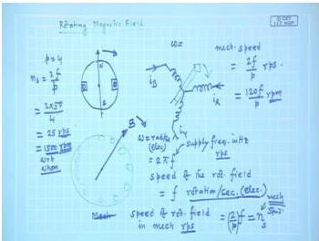

# Week 6: Three-Phase Induction Motor — Fundamentals

## Learning Objectives

- Understand the concept of synchronous speed and derive its expression for rotating magnetic fields
- Calculate induced voltage in a stationary and moving rotor coil due to a rotating magnetic field
- Analyze the relationship between electrical speed, mechanical speed, and number of poles
- Determine the direction of rotation of the rotating magnetic field based on phase sequence
- Apply the concept of relative speed to compute rotor induced voltage and frequency

---

## Synchronous Speed of Rotating Magnetic Field

The most remarkable contribution of Nikola Tesla was the demonstration that a rotating magnetic field can be produced **without any moving parts**. When a balanced three-phase winding is excited by a balanced three-phase supply, the resulting magnetic field rotates in space, even though the coils themselves are stationary.

### Electrical Speed vs. Mechanical Speed

The rotating magnetic field has two distinct speeds:

1. **Electrical speed** ($\omega_e$): The angular frequency of the supply voltage, given by:
   $$
   \omega_e = 2\pi f \quad \text{rad/s}
   $$
   where $f$ is the supply frequency in Hz.

   In terms of rotations per second (rps):
   $$
   \text{Electrical speed} = f \quad \text{rps}
   $$

2. **Mechanical speed** ($n_s$): The actual rotational speed of the field in space, measured in rps or rpm.

The relationship between electrical and mechanical speed depends on the **number of poles** ($P$) of the machine:

$$
n_s = \frac{2f}{P} \quad \text{rps}
$$

Or in revolutions per minute (rpm):

$$
n_s = \frac{120f}{P} \quad \text{rpm}
$$

This mechanical speed $n_s$ is called the **synchronous speed** of the machine.

  <em>Figure: Conceptual diagram showing how stationary three-phase coils produce a rotating magnetic field</em>

### Why "Synchronous Speed"?

The term "synchronous" is used because this speed is determined solely by the **supply frequency** ($f$) and the **number of poles** ($P$). For a given machine connected to a constant-frequency supply, $n_s$ is fixed — it is the speed at which the magnetic field rotates synchronously with the electrical supply.

### Examples of Synchronous Speed Calculation

For a 50 Hz supply:

| Number of Poles ($P$) | Synchronous Speed ($n_s$) |
|:---------------------:|:-------------------------:|
| 2 | $\frac{120 \times 50}{2} = 3000$ rpm |
| 4 | $\frac{120 \times 50}{4} = 1500$ rpm |
| 6 | $\frac{120 \times 50}{6} = 1000$ rpm |
| 8 | $\frac{120 \times 50}{8} = 750$ rpm |

---

## Direction of Rotation of the Rotating Field

The direction of rotation of the magnetic field is determined by the **phase sequence** of the supply.

- If the supply sequence is **R-Y-B** (positive sequence), the field rotates in one direction (say clockwise).
- If any **two supply terminals are interchanged**, the phase sequence becomes reversed (e.g., R-B-Y), and the field rotates in the opposite direction.

This property is used to reverse the direction of rotation of three-phase induction motors.

---

## Induced Voltage in a Rotor Coil

Consider a rotor coil placed inside the stator which houses the three-phase winding. The rotating magnetic field produced by the stator moves at synchronous speed $n_s$. If the rotor is also rotating at a speed $n_r$ (in the same direction as the field), the **relative speed** between the field and the rotor is:

$$
n_{\text{rel}} = n_s - n_r
$$

### Frequency of Induced Voltage

The frequency of the voltage induced in the rotor coil depends on this relative speed:

$$
f_r = \frac{P}{2} \times (n_s - n_r) \quad \text{Hz}
$$

Where $P$ is the number of poles and speeds are in rps.

Alternatively, using the concept of **slip** (to be introduced later):

$$
f_r = s f
$$

where $s = \frac{n_s - n_r}{n_s}$ is the slip.

### Magnitude of Induced Voltage

The RMS value of the induced voltage in the rotor coil is given by:

$$
E_2 = \sqrt{2} \pi f_r \phi_m N_2 K_{w2}
$$

Where:
- $f_r$ = frequency of rotor induced voltage (Hz)
- $\phi_m$ = flux per pole (Wb)
- $N_2$ = total number of turns in the rotor winding
- $K_{w2}$ = winding factor of the rotor winding ($K_{w2} = K_d \times K_p$)

### Flux per Pole

The flux per pole $\phi_m$ is determined by the peak value of the resultant rotating field:

$$
B_{\text{resultant}} = \frac{3}{2} B_{\text{max}}
$$

where $B_{\text{max}}$ is the maximum flux density produced by one phase when carrying its peak current $I_{\text{max}}$.

The flux per pole is:

$$
\phi_m = \frac{4}{P} \times \frac{3}{2} B_{\text{max}} \times l \times r
$$

where $l$ is the axial length of the machine and $r$ is the radius at the air gap.

---

## Key Concepts Summary

1. **Stationary coils can produce a rotating field** — no mechanical rotation of the coils is required.
2. **Synchronous speed** $n_s = \frac{120f}{P}$ rpm is fixed by supply frequency and pole count.
3. **Direction reversal** is achieved by interchanging any two supply terminals.
4. **Rotor induced voltage** depends on the **relative speed** between the rotating field and the rotor.
5. The **frequency** of rotor induced voltage is $f_r = \frac{P}{2}(n_s - n_r)$.

---

## Solved Examples

### Example 1: Synchronous Speed Calculation

A 3-phase induction motor has 6 poles and is connected to a 50 Hz supply. Calculate the synchronous speed in rpm and rps.

**Solution:**

Using the formula for synchronous speed:

$$
n_s = \frac{120f}{P} = \frac{120 \times 50}{6} = 1000 \text{ rpm}
$$

In rps:

$$
n_s = \frac{1000}{60} = 16.67 \text{ rps}
$$

**Answer:** $n_s = 1000$ rpm or $16.67$ rps

---

### Example 2: Rotor Induced Voltage Frequency

A 4-pole, 3-phase induction motor is connected to a 50 Hz supply. The rotor rotates at 1440 rpm in the same direction as the rotating field. Find the frequency of the rotor induced voltage.

**Solution:**

Step 1: Calculate synchronous speed

$$
n_s = \frac{120 \times 50}{4} = 1500 \text{ rpm}
$$

Step 2: Convert to rps

$$
n_s = \frac{1500}{60} = 25 \text{ rps}, \quad n_r = \frac{1440}{60} = 24 \text{ rps}
$$

Step 3: Relative speed

$$
n_{\text{rel}} = n_s - n_r = 25 - 24 = 1 \text{ rps}
$$

Step 4: Rotor frequency

$$
f_r = \frac{P}{2} \times n_{\text{rel}} = \frac{4}{2} \times 1 = 2 \text{ Hz}
$$

**Answer:** The rotor induced voltage frequency is 2 Hz.

---

### Example 3: Induced EMF in Rotor Coil

A 4-pole, 3-phase induction motor has a stator winding that produces a flux per pole of 0.05 Wb. The rotor has 200 turns per phase with a winding factor of 0.96. The rotor is stationary and the supply frequency is 50 Hz. Calculate the RMS induced EMF per phase in the rotor.

**Solution:**

Step 1: Since the rotor is stationary, $n_r = 0$, so the relative speed equals synchronous speed.

$$
n_s = \frac{120 \times 50}{4} = 1500 \text{ rpm} = 25 \text{ rps}
$$

Step 2: Rotor frequency when stationary

$$
f_r = \frac{P}{2} \times n_s = \frac{4}{2} \times 25 = 50 \text{ Hz}
$$

Step 3: Induced EMF

$$
E_2 = \sqrt{2} \pi f_r \phi_m N_2 K_{w2}
$$

$$
E_2 = \sqrt{2} \times \pi \times 50 \times 0.05 \times 200 \times 0.96
$$

$$
E_2 = 1.414 \times 3.1416 \times 50 \times 0.05 \times 200 \times 0.96
$$

$$
E_2 = 1.414 \times 3.1416 \times 480
$$

$$
E_2 = 2132.5 \text{ V}
$$

**Answer:** The RMS induced EMF per phase in the stationary rotor is approximately 2132.5 V.

---

### Example 4: Effect of Rotor Motion on Induced Voltage

For the motor in Example 3, if the rotor now rotates at 1440 rpm in the same direction as the field, calculate the new induced EMF per phase.

**Solution:**

Step 1: Rotor speed in rps

$$
n_r = \frac{1440}{60} = 24 \text{ rps}
$$

Step 2: Relative speed

$$
n_{\text{rel}} = 25 - 24 = 1 \text{ rps}
$$

Step 3: New rotor frequency

$$
f_r = \frac{4}{2} \times 1 = 2 \text{ Hz}
$$

Step 4: New induced EMF

$$
E_2 = \sqrt{2} \pi \times 2 \times 0.05 \times 200 \times 0.96
$$

$$
E_2 = 1.414 \times 3.1416 \times 2 \times 0.05 \times 200 \times 0.96
$$

$$
E_2 = 1.414 \times 3.1416 \times 19.2
$$

$$
E_2 = 85.3 \text{ V}
$$

**Answer:** The induced EMF reduces to approximately 85.3 V when the rotor rotates at 1440 rpm.

---

## Key Formulas

| Quantity | Formula | Units |
|----------|---------|-------|
| Synchronous speed (rpm) | $n_s = \frac{120f}{P}$ | rpm |
| Synchronous speed (rps) | $n_s = \frac{2f}{P}$ | rps |
| Electrical speed | $\omega_e = 2\pi f$ | rad/s |
| Rotor induced frequency | $f_r = \frac{P}{2}(n_s - n_r)$ | Hz |
| RMS induced EMF | $E_2 = \sqrt{2} \pi f_r \phi_m N_2 K_{w2}$ | V |
| Flux per pole | $\phi_m = \frac{4}{P} \times \frac{3}{2} B_{\text{max}} \times l \times r$ | Wb |
| Winding factor | $K_w = K_d \times K_p$ | — |

---

## Summary

1. **Synchronous speed** $n_s = \frac{120f}{P}$ rpm is the speed of the rotating magnetic field produced by stationary three-phase windings.
2. The **direction** of rotation depends on the phase sequence of the supply; reversing any two terminals reverses the field direction.
3. **Rotor induced voltage** depends on the **relative speed** between the rotating field and the rotor: $n_s - n_r$.
4. The **frequency** of rotor induced voltage is proportional to the relative speed: $f_r = \frac{P}{2}(n_s - n_r)$.
5. When the rotor is **stationary**, the induced frequency equals the supply frequency; as the rotor speeds up, the induced frequency decreases.
6. The **flux per pole** is determined by the peak resultant field $\frac{3}{2}B_{\text{max}}$ and the machine geometry.