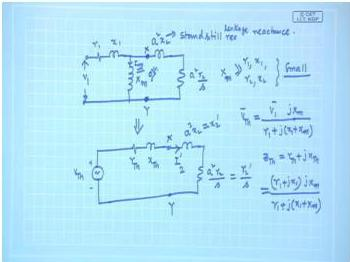
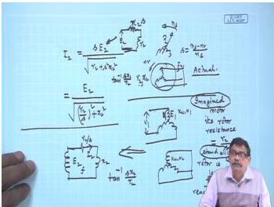
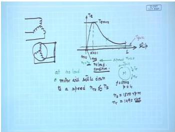

# Week 7: Induction Motor — Equivalent Circuit and Torque-Slip Characteristics

## Learning Objectives

- Derive the per-phase equivalent circuit of a three-phase induction motor referred to the stator.
- Understand the concept of a fictitious stationary rotor with modified resistance ($r_2/s$) to model a running motor.
- Analyze the torque-slip characteristic and identify key regions (motoring, generating, braking).
- Calculate the electromagnetic torque from equivalent circuit parameters.
- Determine the condition for maximum torque and the slip at which it occurs.

---

## The Need for an Equivalent Circuit

To analyze the steady-state performance of an induction motor (current, power, torque, efficiency), we need an electrical equivalent circuit. The induction motor is analogous to a transformer with a rotating secondary. However, the rotor frequency ($sf$) differs from the stator frequency ($f$), preventing a direct connection of the stator and rotor circuits.

The key insight is that the **flux per pole** ($\phi$) in the machine remains practically constant from no-load to full-load. This is because the stator draws additional current to counterbalance the rotor's magnetomotive force (MMF), similar to a transformer.

## The Fictitious Stationary Rotor Concept

Consider an actual induction motor running at a slip $s$. The rotor induced voltage is $sE_2$, and the rotor current is:

$$
I_2 = \frac{sE_2}{\sqrt{r_2^2 + (s x_2)^2}}
$$

Where:
- $E_2$ = induced voltage in the rotor at standstill (per phase)
- $r_2$ = rotor resistance per phase
- $x_2$ = rotor leakage reactance per phase at standstill

Now, imagine a **fictitious motor** with the same stator, but with the rotor **locked** (standstill). This fictitious rotor has a modified resistance $r_2/s$ and the same leakage reactance $x_2$. The current in this fictitious rotor is:

$$
I_2' = \frac{E_2}{\sqrt{(r_2/s)^2 + x_2^2}} = \frac{sE_2}{\sqrt{r_2^2 + (s x_2)^2}} = I_2
$$

The magnitude of the current is identical. Furthermore, the power factor angle of the rotor circuit is the same in both cases:

$$
\angle \text{Actual rotor} = \tan^{-1}\left(\frac{s x_2}{r_2}\right) = \tan^{-1}\left(\frac{x_2}{r_2/s}\right) = \angle \text{Fictitious rotor}
$$

Since the magnitude and phase of the rotor current are identical, the **rotor MMF** (its amplitude and spatial position) is the same in both cases. Therefore, from the stator's perspective, the two machines are indistinguishable. This allows us to replace the actual rotating rotor with a stationary equivalent circuit.

  <em>Figure: The fictitious stationary rotor concept. The rotor resistance is modified to $r_2/s$ to model the running motor.</em>

## Per-Phase Equivalent Circuit Referred to Stator

Using the fictitious rotor concept, we can now refer the rotor parameters to the stator side, just like in a transformer. The turns ratio is $a = \frac{K_{w1} N_1}{K_{w2} N_2}$.

The complete per-phase equivalent circuit of a 3-phase induction motor referred to the stator is shown below.

  <em>Figure: Per-phase equivalent circuit of a 3-phase induction motor referred to the stator.</em>

The parameters are:
- $V_1$ = applied stator voltage per phase
- $r_1$ = stator resistance per phase
- $x_1$ = stator leakage reactance per phase
- $X_m$ = magnetizing reactance per phase
- $r_2' = a^2 r_2$ = rotor resistance referred to stator
- $x_2' = a^2 x_2$ = rotor leakage reactance referred to stator
- $r_2'/s$ = effective rotor resistance referred to stator (models the mechanical load)

The total rotor resistance $r_2'/s$ can be split into two parts:
- $r_2'$: represents the actual copper loss in the rotor.
- $r_2' \left(\frac{1-s}{s}\right)$: represents the mechanical power developed (load).

$$
\frac{r_2'}{s} = r_2' + r_2' \left(\frac{1-s}{s}\right)
$$

## Power Flow and Torque Expression

From the equivalent circuit, we can calculate the power flow:

1.  **Air-gap Power ($P_{ag}$):** Power transferred from stator to rotor across the air gap.
    $$
    P_{ag} = 3 I_2'^2 \frac{r_2'}{s}
    $$

2.  **Rotor Copper Loss ($P_{r,cu}$):**
    $$
    P_{r,cu} = 3 I_2'^2 r_2' = s P_{ag}
    $$

3.  **Mechanical Power Developed ($P_m$):**
    $$
    P_m = P_{ag} - P_{r,cu} = 3 I_2'^2 r_2' \left(\frac{1-s}{s}\right) = (1-s) P_{ag}
    $$

4.  **Electromagnetic Torque ($T_e$):** The torque developed by the motor.
    $$
    T_e = \frac{P_m}{\omega_r} = \frac{P_{ag}}{\omega_s}
    $$
    Where $\omega_s$ is the synchronous speed in rad/s ($\omega_s = \frac{2\pi N_s}{60}$) and $\omega_r = (1-s)\omega_s$ is the rotor speed.

    The torque in terms of equivalent circuit parameters is:
    $$
    T_e = \frac{3}{\omega_s} \cdot \frac{V_1^2 (r_2'/s)}{(r_1 + r_2'/s)^2 + (x_1 + x_2')^2}
    $$

## Torque-Slip Characteristic

The torque-slip characteristic shows how the electromagnetic torque varies with slip (and hence speed).

  <em>Figure: Typical torque-slip characteristic of a 3-phase induction motor.</em>

### Key Regions

1.  **Motoring Region ($0 < s < 1$):** The motor runs below synchronous speed. Torque is positive.
    - **Starting Torque ($T_{st}$):** Torque at $s=1$.
    - **Maximum Torque ($T_{max}$):** The peak torque the motor can develop.
    - **Full-load Torque ($T_{fl}$):** Torque at rated slip ($s_{fl}$).

2.  **Generating Region ($s < 0$):** The rotor is driven above synchronous speed. Torque is negative (braking).

3.  **Braking Region ($s > 1$):** The rotor rotates opposite to the field. Torque is positive but acts to brake the motor.

### Condition for Maximum Torque

The slip at which maximum torque occurs ($s_{mT}$) is found by differentiating the torque expression with respect to $s$ and setting it to zero.

$$
s_{mT} = \frac{r_2'}{\sqrt{r_1^2 + (x_1 + x_2')^2}}
$$

The maximum torque itself is:

$$
T_{max} = \frac{3}{2\omega_s} \cdot \frac{V_1^2}{r_1 + \sqrt{r_1^2 + (x_1 + x_2')^2}}
$$

**Important Observations:**
- $T_{max}$ is independent of $r_2'$.
- $s_{mT}$ is directly proportional to $r_2'$. Increasing rotor resistance shifts the maximum torque point to higher slips (lower speeds), which is useful for starting high-torque applications.

---

## Solved Examples

### Example 1: Calculating Rotor Current and Power

A 3-phase, 400 V, 50 Hz, 6-pole induction motor has a star-connected stator. The rotor resistance and standstill reactance per phase are $0.1\ \Omega$ and $0.5\ \Omega$ respectively. The turns ratio (stator/rotor) is 2. The motor is running at a slip of 4%. Calculate: (a) the rotor current, (b) the rotor copper loss, and (c) the mechanical power developed.

**Solution:**

1.  **Synchronous Speed:**
    $$
    N_s = \frac{120f}{P} = \frac{120 \times 50}{6} = 1000 \text{ rpm}
    $$
    $$
    \omega_s = \frac{2\pi N_s}{60} = \frac{2\pi \times 1000}{60} = 104.72 \text{ rad/s}
    $$

2.  **Rotor Induced Voltage at Standstill ($E_2$):**
    Stator voltage per phase, $V_1 = 400/\sqrt{3} = 230.94\ \text{V}$.
    Assuming $E_1 \approx V_1$, and $a = N_1/N_2 = 2$:
    $$
    E_2 = \frac{E_1}{a} = \frac{230.94}{2} = 115.47\ \text{V}
    $$

3.  **Rotor Current ($I_2$):**
    $$
    I_2 = \frac{sE_2}{\sqrt{r_2^2 + (s x_2)^2}} = \frac{0.04 \times 115.47}{\sqrt{0.1^2 + (0.04 \times 0.5)^2}} = \frac{4.6188}{\sqrt{0.01 + 0.0004}} = \frac{4.6188}{0.102} = 45.28\ \text{A}
    $$

4.  **Rotor Copper Loss ($P_{r,cu}$):**
    $$
    P_{r,cu} = 3 I_2^2 r_2 = 3 \times (45.28)^2 \times 0.1 = 3 \times 2050.28 \times 0.1 = 615.08\ \text{W}
    $$

5.  **Air-gap Power ($P_{ag}$):**
    $$
    P_{ag} = \frac{P_{r,cu}}{s} = \frac{615.08}{0.04} = 15377\ \text{W}
    $$

6.  **Mechanical Power Developed ($P_m$):**
    $$
    P_m = (1-s) P_{ag} = (1 - 0.04) \times 15377 = 0.96 \times 15377 = 14761.92\ \text{W}
    $$

**Answer:**
(a) Rotor current: $I_2 = 45.28\ \text{A}$
(b) Rotor copper loss: $P_{r,cu} = 615.08\ \text{W}$
(c) Mechanical power developed: $P_m = 14.76\ \text{kW}$

---

### Example 2: Finding Maximum Torque and Slip

A 3-phase, 440 V, 50 Hz, 4-pole induction motor has the following per-phase parameters referred to the stator: $r_1 = 0.2\ \Omega$, $r_2' = 0.3\ \Omega$, $x_1 = x_2' = 0.5\ \Omega$. The motor is star-connected. Calculate: (a) the slip at maximum torque, (b) the maximum torque, and (c) the starting torque.

**Solution:**

1.  **Synchronous Speed:**
    $$
    N_s = \frac{120 \times 50}{4} = 1500 \text{ rpm}
    $$
    $$
    \omega_s = \frac{2\pi \times 1500}{60} = 157.08 \text{ rad/s}
    $$

2.  **Slip at Maximum Torque ($s_{mT}$):**
    $$
    s_{mT} = \frac{r_2'}{\sqrt{r_1^2 + (x_1 + x_2')^2}} = \frac{0.3}{\sqrt{0.2^2 + (0.5 + 0.5)^2}} = \frac{0.3}{\sqrt{0.04 + 1}} = \frac{0.3}{1.0198} = 0.294
    $$

3.  **Maximum Torque ($T_{max}$):**
    Stator voltage per phase, $V_1 = 440/\sqrt{3} = 254.03\ \text{V}$.
    $$
    T_{max} = \frac{3}{2\omega_s} \cdot \frac{V_1^2}{r_1 + \sqrt{r_1^2 + (x_1 + x_2')^2}} = \frac{3}{2 \times 157.08} \cdot \frac{(254.03)^2}{0.2 + \sqrt{0.04 + 1}}
    $$
    $$
    T_{max} = \frac{3}{314.16} \cdot \frac{64531.24}{0.2 + 1.0198} = 0.00955 \times \frac{64531.24}{1.2198} = 0.00955 \times 52903.5 = 505.2\ \text{N}\cdot\text{m}
    $$

4.  **Starting Torque ($T_{st}$):** At $s=1$.
    $$
    T_{st} = \frac{3}{\omega_s} \cdot \frac{V_1^2 r_2'}{(r_1 + r_2')^2 + (x_1 + x_2')^2} = \frac{3}{157.08} \cdot \frac{(254.03)^2 \times 0.3}{(0.2 + 0.3)^2 + (0.5 + 0.5)^2}
    $$
    $$
    T_{st} = 0.0191 \cdot \frac{64531.24 \times 0.3}{0.25 + 1} = 0.0191 \cdot \frac{19359.37}{1.25} = 0.0191 \times 15487.5 = 295.8\ \text{N}\cdot\text{m}
    $$

**Answer:**
(a) Slip at maximum torque: $s_{mT} = 0.294$
(b) Maximum torque: $T_{max} = 505.2\ \text{N}\cdot\text{m}$
(c) Starting torque: $T_{st} = 295.8\ \text{N}\cdot\text{m}$

---

### Example 3: Effect of Rotor Resistance on Starting Torque

A 3-phase induction motor has a starting torque of 150 Nm and a maximum torque of 300 Nm. The slip at maximum torque is 0.2. If the rotor resistance is doubled, find the new starting torque and the new slip at maximum torque.

**Solution:**

1.  **Original Parameters:**
    Let original rotor resistance be $r_2'$. Original slip at max torque: $s_{mT,old} = 0.2$.
    Original starting torque: $T_{st,old} = 150\ \text{Nm}$.
    Original max torque: $T_{max,old} = 300\ \text{Nm}$.

2.  **New Rotor Resistance:**
    $r_{2,new}' = 2 r_2'$

3.  **New Slip at Maximum Torque:**
    Since $s_{mT} \propto r_2'$:
    $$
    s_{mT,new} = 2 \times s_{mT,old} = 2 \times 0.2 = 0.4
    $$

4.  **New Starting Torque:**
    The starting torque is proportional to $r_2'$ (for small $r_2'$ relative to $x$), but the maximum torque remains constant. The ratio of starting torque to maximum torque is:
    $$
    \frac{T_{st}}{T_{max}} = \frac{2 s_{mT}}{1 + s_{mT}^2}
    $$
    For the original motor:
    $$
    \frac{150}{300} = \frac{2 \times 0.2}{1 + 0.2^2} = \frac{0.4}{1.04} = 0.3846
    $$
    For the new motor:
    $$
    \frac{T_{st,new}}{300} = \frac{2 \times 0.4}{1 + 0.4^2} = \frac{0.8}{1.16} = 0.6897
    $$
    $$
    T_{st,new} = 0.6897 \times 300 = 206.9\ \text{Nm}
    $$

**Answer:**
New starting torque: $T_{st,new} = 206.9\ \text{Nm}$
New slip at maximum torque: $s_{mT,new} = 0.4$

---

## Key Formulas

| Quantity | Formula | Units |
|----------|---------|-------|
| Synchronous speed | $N_s = \frac{120f}{P}$ | rpm |
| Slip | $s = \frac{N_s - N_r}{N_s}$ | — |
| Rotor induced voltage | $E_{2r} = s E_2$ | V |
| Rotor current | $I_2 = \frac{sE_2}{\sqrt{r_2^2 + (sx_2)^2}}$ | A |
| Air-gap power | $P_{ag} = 3 I_2'^2 \frac{r_2'}{s}$ | W |
| Rotor copper loss | $P_{r,cu} = s P_{ag}$ | W |
| Mechanical power | $P_m = (1-s) P_{ag}$ | W |
| Electromagnetic torque | $T_e = \frac{P_{ag}}{\omega_s}$ | N·m |
| Torque (from equivalent circuit) | $T_e = \frac{3}{\omega_s} \cdot \frac{V_1^2 (r_2'/s)}{(r_1 + r_2'/s)^2 + (x_1 + x_2')^2}$ | N·m |
| Slip at max torque | $s_{mT} = \frac{r_2'}{\sqrt{r_1^2 + (x_1 + x_2')^2}}$ | — |
| Maximum torque | $T_{max} = \frac{3}{2\omega_s} \cdot \frac{V_1^2}{r_1 + \sqrt{r_1^2 + (x_1 + x_2')^2}}$ | N·m |

---

## Summary

- The **fictitious stationary rotor** concept allows us to model a running induction motor with a simple equivalent circuit by replacing the actual rotor resistance $r_2$ with $r_2/s$.
- The **per-phase equivalent circuit** referred to the stator is identical to a transformer equivalent circuit, with the load represented by $r_2'(1-s)/s$.
- **Power flow** in the rotor: $P_{ag} \rightarrow P_{r,cu} + P_m$, where $P_{r,cu} = sP_{ag}$ and $P_m = (1-s)P_{ag}$.
- The **torque-slip characteristic** has three regions: motoring ($0 < s < 1$), generating ($s < 0$), and braking ($s > 1$).
- **Maximum torque** is independent of rotor resistance, but the **slip at maximum torque** is directly proportional to it. Increasing rotor resistance improves starting torque.