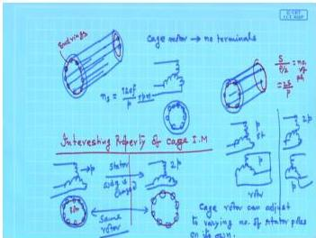
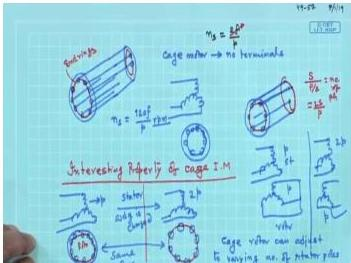
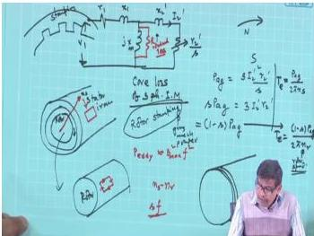
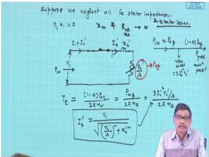

# Week 8: Induction Motor — Losses, Circle Diagram, and Performance Analysis

## Learning Objectives

- Understand the construction and unique properties of cage induction motors.
- Derive and interpret the power flow diagram and loss components in an induction motor.
- Develop the simplified equivalent circuit of an induction motor.
- Learn the concept of the circle diagram and its construction from test data.
- Analyze motor performance (torque, current, power factor, efficiency) using the circle diagram.

---

## Cage Induction Motor: Construction and Unique Properties

The **cage induction motor** (also called squirrel-cage motor) is the most robust and widely used type of induction motor. Its rotor consists of a cylindrical core with uninsulated conductor bars (usually aluminum or copper) embedded in slots. These bars are short-circuited at both ends by **end rings**, forming a complete closed circuit. There are no slip rings or brushes, making the rotor extremely simple and maintenance-free.

  <em>Figure: Cross-section of a cage rotor showing rotor bars and end rings.</em>

### Key Characteristics

- **No rotor terminals:** External resistance cannot be inserted into the rotor circuit.
- **Self-starting:** The induced currents in the shorted rotor bars interact with the rotating stator field to produce torque.
- **Pole-adaptability:** A cage rotor can operate with a stator winding of any number of poles. This is because the rotor bars form a **balanced polyphase winding** with a number of phases equal to $2S/P$, where $S$ is the number of rotor bars and $P$ is the number of stator poles. This winding automatically produces the same number of poles as the stator.

### Advantage: Pole-Adaptability

If the stator winding of a slip-ring motor is changed from $P$ poles to $2P$ poles, the motor will not run because the rotor winding is fixed for $P$ poles. However, a cage rotor will adapt and run with the new stator pole configuration. This property was historically exploited for **pole-changing speed control** (e.g., using multiple stator windings or reconnection schemes like Dahlander winding).

> **Note:** With modern variable frequency drives (VFDs), speed control is achieved by varying the supply frequency ($f$) rather than the number of poles ($P$), as $N_s = 120f/P$.

---

## Power Flow and Losses in an Induction Motor

The power flow from the stator input to the mechanical output involves several loss components.

### Power Flow Diagram

  <em>Figure: Power flow diagram of a three-phase induction motor.</em>

### Loss Components

1.  **Stator Copper Loss ($P_{scu}$):** Power dissipated in the stator winding resistance $r_1$.
    $$P_{scu} = 3 I_1^2 r_1$$

2.  **Core Loss ($P_{core}$):** Hysteresis and eddy current losses in the stator and rotor iron. In the equivalent circuit, this is represented by a shunt resistance $R_c$ in parallel with the magnetizing reactance $X_m$.

3.  **Air Gap Power ($P_{ag}$):** The power transferred from the stator to the rotor across the air gap. It is the power consumed by the rotor resistance referred to the stator, $r_2'/s$.
    $$P_{ag} = 3 I_2'^2 \frac{r_2'}{s}$$

4.  **Rotor Copper Loss ($P_{rcu}$):** Power dissipated in the rotor winding resistance.
    $$P_{rcu} = 3 I_2'^2 r_2' = s P_{ag}$$

5.  **Mechanical Power Developed ($P_m$):** The gross mechanical power developed by the rotor.
    $$P_m = P_{ag} - P_{rcu} = 3 I_2'^2 r_2' \frac{1-s}{s} = (1-s) P_{ag}$$

6.  **Output Power ($P_{out}$):** The net mechanical power available at the shaft after subtracting friction, windage, and stray losses ($P_{rot}$).
    $$P_{out} = P_m - P_{rot}$$

### Torque Relationships

- **Air gap torque (or electromagnetic torque, $T_e$):**
    $$T_e = \frac{P_{ag}}{\omega_s} = \frac{P_{ag}}{2\pi N_s / 60}$$
    where $\omega_s$ is the synchronous speed in rad/s and $N_s$ is in rpm.

- **Shaft torque ($T_{sh}$):**
    $$T_{sh} = \frac{P_{out}}{\omega_r}$$
    where $\omega_r$ is the rotor speed.

---

## Simplified Equivalent Circuit

The exact per-phase equivalent circuit of an induction motor is complex. For performance analysis, it is often simplified by moving the magnetizing branch ($R_c$ and $X_m$) to the input terminals.

  <em>Figure: Simplified per-phase equivalent circuit of a three-phase induction motor.</em>

### Parameters

- $V_1$: Per-phase stator voltage
- $r_1$: Stator resistance per phase
- $x_1$: Stator leakage reactance per phase
- $R_c$: Core loss resistance per phase
- $X_m$: Magnetizing reactance per phase
- $r_2'$: Rotor resistance per phase referred to stator
- $x_2'$: Rotor leakage reactance per phase referred to stator at standstill
- $s$: Slip

### Currents

- $I_1$: Stator input current
- $I_0$: No-load current (magnetizing + core loss component)
- $I_2'$: Rotor current referred to stator

From the simplified circuit, the rotor current is:
$$I_2' = \frac{V_1}{\sqrt{(r_1 + r_2'/s)^2 + (x_1 + x_2')^2}}$$

---

## Circle Diagram

The **circle diagram** is a graphical tool to predict the performance of an induction motor from test data (no-load test and blocked-rotor test). It is a locus of the stator current phasor as the load (slip) varies.

### Construction from Test Data

1.  **No-Load Test:** The motor is run at rated voltage and frequency with no load. The input power ($P_0$), current ($I_0$), and voltage ($V_0$) are measured. The no-load power factor is $\cos \phi_0 = P_0 / (\sqrt{3} V_0 I_0)$.

2.  **Blocked-Rotor Test:** The rotor is locked, and a reduced voltage is applied to circulate rated current. The input power ($P_{br}$), current ($I_{br}$), and voltage ($V_{br}$) are measured. The blocked-rotor power factor is $\cos \phi_{br} = P_{br} / (\sqrt{3} V_{br} I_{br})$.

### Steps to Draw the Circle Diagram

1.  Choose a suitable scale for current (1 cm = $x$ A).
2.  Draw the voltage phasor $OV$ along the vertical axis (reference).
3.  From $O$, draw the no-load current phasor $OI_0$ at an angle $\phi_0$ lagging $V$.
4.  From $O$, draw the blocked-rotor current phasor $OI_{br}$ at an angle $\phi_{br}$ lagging $V$.
5.  Join $I_0$ and $I_{br}$. The line $I_0 I_{br}$ is the **output line**.
6.  Draw the perpendicular bisector of $I_0 I_{br}$. The center of the circle lies on this bisector.
7.  Draw a circle with center $C$ passing through $I_0$ and $I_{br}$.
8.  From $I_{br}$, draw a line parallel to the output line to meet the circle at $B$. This is the **torque line**.
9.  From $I_{br}$, draw a line parallel to the voltage phasor to meet the circle at $A$. This is the **slip line**.

  <em>Figure: Typical circle diagram of an induction motor.</em>

### Performance Analysis from Circle Diagram

For any operating point $P$ on the circle:

- **Input current:** $I_1 = OP$ (at scale)
- **Power factor:** $\cos \phi = \text{angle between } V \text{ and } OP$
- **Input power:** $P_{in} = \sqrt{3} V_1 I_1 \cos \phi$ (or proportional to the vertical distance $PQ$)
- **Stator copper loss:** Proportional to the vertical distance $PR$
- **Rotor copper loss:** Proportional to the vertical distance $RS$
- **Output power:** Proportional to the vertical distance $QS$
- **Efficiency:** $\eta = \frac{QS}{PQ} \times 100\%$
- **Slip:** $s = \frac{RS}{PS}$
- **Torque:** $T \propto PS$

---

## Solved Examples

### Example 1: Power Flow Calculation

A 3-phase, 400 V, 50 Hz, 4-pole induction motor has the following test data:
- No-load test: 400 V, 8 A, 600 W
- Blocked-rotor test: 100 V, 20 A, 1200 W

The stator resistance per phase is 0.5 $\Omega$. Calculate:
(a) Stator copper loss at no-load
(b) Core loss
(c) Equivalent rotor resistance referred to stator

**Solution:**

**(a) Stator copper loss at no-load:**
$$P_{scu, NL} = 3 I_0^2 r_1 = 3 \times (8)^2 \times 0.5 = 96 \text{ W}$$

**(b) Core loss:**
At no-load, the input power is the sum of core loss, stator copper loss, and friction & windage loss (neglected here).
$$P_0 = P_{core} + P_{scu, NL}$$
$$600 = P_{core} + 96$$
$$P_{core} = 504 \text{ W}$$

**(c) Equivalent rotor resistance:**
From the blocked-rotor test, the total copper loss is:
$$P_{br} = 3 I_{br}^2 (r_1 + r_2')$$
$$1200 = 3 \times (20)^2 \times (0.5 + r_2')$$
$$1200 = 1200 \times (0.5 + r_2')$$
$$1 = 0.5 + r_2'$$
$$r_2' = 0.5 \ \Omega$$

**Answer:** (a) 96 W, (b) 504 W, (c) 0.5 $\Omega$

---

### Example 2: Torque and Efficiency from Equivalent Circuit

A 3-phase, 440 V, 50 Hz, 6-pole induction motor has the following per-phase parameters referred to stator: $r_1 = 0.2 \ \Omega$, $x_1 = 0.5 \ \Omega$, $r_2' = 0.3 \ \Omega$, $x_2' = 0.5 \ \Omega$, $X_m = 20 \ \Omega$. The motor runs at a slip of 4%. Calculate:
(a) Rotor current
(b) Air gap power
(c) Electromagnetic torque
(d) Rotor speed

**Solution:**

**(a) Rotor current:**
$$I_2' = \frac{V_1}{\sqrt{(r_1 + r_2'/s)^2 + (x_1 + x_2')^2}}$$
$$I_2' = \frac{440/\sqrt{3}}{\sqrt{(0.2 + 0.3/0.04)^2 + (0.5 + 0.5)^2}}$$
$$I_2' = \frac{254.03}{\sqrt{(0.2 + 7.5)^2 + (1)^2}}$$
$$I_2' = \frac{254.03}{\sqrt{(7.7)^2 + 1}} = \frac{254.03}{\sqrt{59.29 + 1}} = \frac{254.03}{\sqrt{60.29}}$$
$$I_2' = \frac{254.03}{7.76} = 32.73 \text{ A}$$

**(b) Air gap power:**
$$P_{ag} = 3 I_2'^2 \frac{r_2'}{s} = 3 \times (32.73)^2 \times \frac{0.3}{0.04}$$
$$P_{ag} = 3 \times 1071.25 \times 7.5 = 24103.13 \text{ W}$$

**(c) Electromagnetic torque:**
Synchronous speed, $N_s = \frac{120f}{P} = \frac{120 \times 50}{6} = 1000 \text{ rpm}$
$$\omega_s = \frac{2\pi N_s}{60} = \frac{2\pi \times 1000}{60} = 104.72 \text{ rad/s}$$
$$T_e = \frac{P_{ag}}{\omega_s} = \frac{24103.13}{104.72} = 230.17 \text{ N}\cdot\text{m}$$

**(d) Rotor speed:**
$$N_r = (1-s) N_s = (1-0.04) \times 1000 = 960 \text{ rpm}$$

**Answer:** (a) 32.73 A, (b) 24.10 kW, (c) 230.17 N·m, (d) 960 rpm

---

### Example 3: Circle Diagram Performance

A 3-phase, 400 V, 50 Hz induction motor gave the following test results:
- No-load: 400 V, 10 A, $\cos \phi_0 = 0.15$
- Blocked-rotor: 100 V, 25 A, $\cos \phi_{br} = 0.4$

Draw the circle diagram and determine the line current and power factor at full load if the full load slip is 4%.

**Solution:**

**(a) Scale:** Let 1 cm = 5 A.

**(b) No-load current:** $I_0 = 10 \text{ A} = 2 \text{ cm}$
$\phi_0 = \cos^{-1}(0.15) = 81.37^\circ$

**(c) Blocked-rotor current:** $I_{br} = 25 \text{ A} = 5 \text{ cm}$ (at rated voltage, $I_{br, rated} = 25 \times \frac{400}{100} = 100 \text{ A} = 20 \text{ cm}$)
$\phi_{br} = \cos^{-1}(0.4) = 66.42^\circ$

**(d) Construction:**
1. Draw $OV$ vertically.
2. Draw $OI_0$ at $81.37^\circ$ lagging, length 2 cm.
3. Draw $OI_{br}$ at $66.42^\circ$ lagging, length 20 cm.
4. Join $I_0$ and $I_{br}$.
5. Draw perpendicular bisector of $I_0 I_{br}$ and locate center $C$.
6. Draw circle with center $C$ through $I_0$ and $I_{br}$.
7. Draw torque line and slip line.

**(e) Full load point:**
At $s = 0.04$, locate point $P$ on the circle such that the slip line is divided in the ratio $s : (1-s) = 0.04 : 0.96$.

**(f) Measurements:**
From the diagram, measure $OP = 16 \text{ cm} = 80 \text{ A}$.
Angle between $V$ and $OP$ is $30^\circ$, so $\cos \phi = \cos 30^\circ = 0.866$.

**Answer:** Line current = 80 A, Power factor = 0.866 lagging.

---

## Key Formulas

| Quantity | Formula | Units |
|----------|---------|-------|
| Synchronous speed | $N_s = \frac{120f}{P}$ | rpm |
| Slip | $s = \frac{N_s - N_r}{N_s}$ | — |
| Rotor speed | $N_r = (1-s)N_s$ | rpm |
| Air gap power | $P_{ag} = 3 I_2'^2 \frac{r_2'}{s}$ | W |
| Rotor copper loss | $P_{rcu} = s P_{ag}$ | W |
| Mechanical power | $P_m = (1-s)P_{ag}$ | W |
| Electromagnetic torque | $T_e = \frac{P_{ag}}{\omega_s}$ | N·m |
| Rotor current (simplified) | $I_2' = \frac{V_1}{\sqrt{(r_1 + r_2'/s)^2 + (x_1 + x_2')^2}}$ | A |
| Efficiency | $\eta = \frac{P_{out}}{P_{in}} \times 100\%$ | % |

---

## Summary

- **Cage induction motors** are robust, maintenance-free, and can adapt to any stator pole number.
- **Power flow** in an induction motor involves stator copper loss, core loss, air gap power, rotor copper loss, and mechanical power.
- The **simplified equivalent circuit** is adequate for performance analysis, with the magnetizing branch moved to the input.
- The **circle diagram** is a graphical method to determine motor performance (current, power factor, torque, efficiency, slip) from no-load and blocked-rotor test data.
- Key relationships: $P_{rcu} = s P_{ag}$, $P_m = (1-s)P_{ag}$, and $T_e = P_{ag}/\omega_s$.