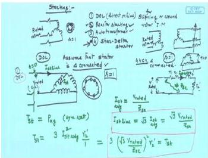

# Week 9: Starting, Speed Control, and Braking of Induction Motors

## Learning Objectives

- Analyze the need for reduced voltage starting in induction motors and compare DOL, reactor, and auto-transformer starting methods.
- Calculate starting current and torque for different starting methods relative to DOL starting.
- Explain the principle of rotor resistance starting for slip-ring induction motors.
- Describe the basic concepts of speed control (VVVF) and electrical braking of induction motors.
- Interpret the circle diagram to estimate motor performance and locate the operating point for a given load.

---

## Starting of 3-Phase Induction Motors

When a 3-phase induction motor is directly connected to the rated supply voltage (Direct-On-Line or DOL starting), it draws a very high inrush current, typically 5 to 8 times the full-load current. This is because at standstill ($s = 1$), the rotor circuit impedance is purely the leakage impedance, which is very small. This high starting current can cause:

- **Voltage dip** in the supply system, affecting other loads connected to the same bus.
- **Excessive heating** and mechanical stress on the motor windings.

Therefore, for medium and large motors, **reduced voltage starting** is employed to limit the starting current. However, since torque is proportional to the square of the applied voltage ($T \propto V^2$), reducing the voltage also reduces the starting torque.

### DOL Starting (Full Voltage Starting)

This is the simplest method, used only for small motors (typically < 5 HP). The motor is connected directly to the supply via a contactor.

  <em>Figure: Schematic of Direct-On-Line (DOL) starting.</em>

**Analysis (per phase):**
Let $V$ be the rated phase voltage, $I_{sc}$ be the short-circuit (starting) current per phase at rated voltage, and $Z_{e1}$ be the equivalent impedance per phase referred to the stator at $s=1$.

$$
I_{sc} = \frac{V}{Z_{e1}}
$$

The starting torque $T_{st(DOL)}$ is proportional to $I_{sc}^2$ and the rotor resistance.

### Reactor Starting

In this method, a reactor (inductor) is connected in series with each phase of the stator during starting. This adds an external reactance $X_{ext}$, increasing the total impedance and reducing the starting current. Once the motor picks up speed, the reactor is short-circuited, applying full voltage.

Let the per-phase impedance of the motor at standstill be $Z_{e1} = \sqrt{R_{e1}^2 + X_{e1}^2}$. With a series reactor of reactance $X_{ext}$, the total impedance becomes:

$$
Z_{total} = \sqrt{R_{e1}^2 + (X_{e1} + X_{ext})^2}
$$

If the reactor is designed such that the motor terminal voltage is reduced to $xV$ (where $x < 1$), the starting current $I_{st(reactor)}$ is:

$$
I_{st(reactor)} = x \cdot I_{sc}
$$

Since torque is proportional to the square of the voltage applied to the motor terminals:

$$
T_{st(reactor)} = x^2 \cdot T_{st(DOL)}
$$

**Comparison with DOL:**
- Starting current is reduced by a factor $x$.
- Starting torque is reduced by a factor $x^2$.

### Auto-Transformer Starting

An auto-transformer is used to apply a reduced voltage $xV$ to the motor terminals during starting. The auto-transformer taps provide a voltage ratio $x$ (e.g., 50%, 65%, 80%).

  <em>Figure: Schematic of auto-transformer starting.</em>

**Analysis:**
Let the motor starting current at reduced voltage $xV$ be $I_{st(motor)} = x \cdot I_{sc}$.

However, the auto-transformer also transforms the current. The supply current $I_{st(supply)}$ is:

$$
I_{st(supply)} = x \cdot I_{st(motor)} = x^2 \cdot I_{sc}
$$

The starting torque, being proportional to the square of the motor terminal voltage, is:

$$
T_{st(autotr)} = x^2 \cdot T_{st(DOL)}
$$

**Comparison with DOL:**
- Supply current is reduced by a factor $x^2$.
- Starting torque is reduced by a factor $x^2$.

This is a significant advantage over reactor starting, where the supply current is only reduced by $x$.

### Star-Delta Starting

This method is applicable only for motors whose stator windings are designed for **delta connection** during normal running. During starting, the windings are connected in **star**, reducing the voltage across each phase winding to $V/\sqrt{3}$ (where $V$ is the line voltage). Once the motor reaches near-rated speed, the connection is switched to delta.

**Analysis:**
Let $V_L$ be the line voltage. The motor is designed for delta connection, so the rated phase voltage is $V_{ph} = V_L$.

- **Delta connection (running):** Phase voltage $= V_L$. Starting current per phase (if DOL) $= I_{sc}$.
- **Star connection (starting):** Phase voltage $= V_L / \sqrt{3}$.

Therefore, the motor phase current during star starting is:

$$
I_{st(star)} = \frac{V_L/\sqrt{3}}{Z_{e1}} = \frac{I_{sc}}{\sqrt{3}}
$$

The line current drawn from the supply in star connection is equal to the phase current:

$$
I_{L(st)} = I_{st(star)} = \frac{I_{sc}}{\sqrt{3}}
$$

If the motor were started in delta (DOL), the line current would be $I_{L(DOL)} = \sqrt{3} I_{sc}$.

**Ratio of starting line currents:**

$$
\frac{I_{L(st)}}{I_{L(DOL)}} = \frac{I_{sc}/\sqrt{3}}{\sqrt{3} I_{sc}} = \frac{1}{3}
$$

**Starting Torque:**
Torque is proportional to the square of the phase voltage.

$$
\frac{T_{st(star)}}{T_{st(delta)}} = \left( \frac{V_L/\sqrt{3}}{V_L} \right)^2 = \frac{1}{3}
$$

**Comparison with DOL:**
- Starting line current is reduced to $1/3$ of the DOL value.
- Starting torque is reduced to $1/3$ of the DOL value.

### Rotor Resistance Starting (Slip-Ring Motors)

For slip-ring (wound rotor) induction motors, external resistances can be connected in series with the rotor circuit via slip rings. This method has a dual advantage:

1.  **Limits starting current:** The total rotor resistance increases ($R_2' + R_{ext}'$), increasing the impedance seen from the stator.
2.  **Improves starting torque:** By increasing the rotor resistance, the slip at which maximum torque occurs ($s_{mT}$) can be shifted to $s=1$, ensuring maximum torque at starting.

  <em>Figure: Rotor resistance starting for a slip-ring induction motor.</em>

The external resistances are gradually cut out as the motor accelerates.

---

## Speed Control of Induction Motors

The synchronous speed of an induction motor is given by:

$$
N_s = \frac{120f}{P}
$$

The rotor speed is $N_r = N_s(1-s)$. Therefore, speed can be controlled by varying:

1.  **Supply frequency ($f$):** VVVF (Variable Voltage Variable Frequency) control.
2.  **Number of poles ($P$):** Pole-changing motors (e.g., Dahlander connection).
3.  **Slip ($s$):** By varying rotor resistance (slip-ring motors) or supply voltage.

### VVVF Control

This is the most efficient and widely used method. To maintain a constant air-gap flux (and hence constant maximum torque), the voltage is varied proportionally with frequency, keeping the $V/f$ ratio constant.

$$
\frac{V}{f} = \text{constant}
$$

Below base frequency, the motor operates in the **constant torque** region. Above base frequency, the voltage cannot be increased beyond rated value, so the flux weakens, and the motor operates in the **constant power** (field weakening) region.

---

## Electrical Braking of Induction Motors

Three types of electrical braking are used:

1.  **Regenerative Braking:** Occurs when the rotor speed exceeds the synchronous speed ($N_r > N_s$). The slip becomes negative ($s < 0$), and the motor acts as a generator, feeding power back to the supply. This is an energy-efficient braking method.
2.  **Plugging (Reverse Current Braking):** The supply phase sequence is reversed. The rotating magnetic field now rotates in the opposite direction, causing a large braking torque. The slip is approximately $s \approx 2$. This method draws a very high current and dissipates a large amount of heat.
3.  **Dynamic Braking (DC Injection Braking):** The AC supply is disconnected, and a DC current is injected into the stator windings. This creates a stationary magnetic field. The rotor, still rotating, cuts this field, inducing currents that produce a braking torque. The kinetic energy is dissipated as heat in the rotor circuit.

---

## Solved Examples

### Example 1: Comparison of Starting Methods

A 3-phase, 400 V, 50 Hz, delta-connected induction motor has a DOL starting current of 120 A and a DOL starting torque of 160 Nm. Determine the starting current and torque if:
(a) Reactor starting is used with a tap setting of 60%.
(b) Auto-transformer starting is used with a tap setting of 60%.
(c) Star-delta starting is used.

**Solution:**

**(a) Reactor Starting ($x = 0.6$)**

- Starting current (motor): $I_{st} = x \cdot I_{sc} = 0.6 \times 120 = 72$ A
- Starting torque: $T_{st} = x^2 \cdot T_{st(DOL)} = (0.6)^2 \times 160 = 57.6$ Nm

**(b) Auto-transformer Starting ($x = 0.6$)**

- Starting current (supply): $I_{st} = x^2 \cdot I_{sc} = (0.6)^2 \times 120 = 43.2$ A
- Starting torque: $T_{st} = x^2 \cdot T_{st(DOL)} = (0.6)^2 \times 160 = 57.6$ Nm

**(c) Star-Delta Starting**

- Starting line current: $I_{st} = \frac{1}{3} \times I_{L(DOL)}$
  The DOL line current for a delta motor is $I_{L(DOL)} = \sqrt{3} \times I_{ph} = \sqrt{3} \times 120 = 207.85$ A.
  Therefore, $I_{st} = \frac{1}{3} \times 207.85 = 69.28$ A.
- Starting torque: $T_{st} = \frac{1}{3} \times T_{st(DOL)} = \frac{160}{3} = 53.33$ Nm

**Answer:**
- Reactor: $I_{st} = 72$ A, $T_{st} = 57.6$ Nm
- Auto-transformer: $I_{st} = 43.2$ A, $T_{st} = 57.6$ Nm
- Star-Delta: $I_{st} = 69.28$ A, $T_{st} = 53.33$ Nm

---

### Example 2: Rotor Resistance for Maximum Torque at Starting

A 3-phase, 400 V, 50 Hz, 6-pole, slip-ring induction motor has a rotor resistance per phase $R_2 = 0.1 \Omega$ and a standstill rotor reactance per phase $X_2 = 1 \Omega$. The stator to rotor turns ratio is 2:1. Calculate the external resistance per phase to be added to the rotor circuit to achieve maximum torque at starting.

**Solution:**

The slip for maximum torque is given by:

$$
s_{mT} = \frac{R_2'}{\sqrt{R_1^2 + (X_1 + X_2')^2}}
$$

For maximum torque at starting, $s_{mT} = 1$.

For a simplified analysis, neglecting stator resistance and assuming $X_1 \approx X_2'$, the condition for maximum torque is $R_2' = X_1 + X_2' \approx 2X_2'$.

However, a more direct approach using the rotor circuit is:

$$
s_{mT} = \frac{R_2 + R_{ext}}{X_2}
$$

Setting $s_{mT} = 1$:

$$
1 = \frac{0.1 + R_{ext}}{1}
$$

$$
R_{ext} = 1 - 0.1 = 0.9 \ \Omega
$$

This is the external resistance per phase to be added to the rotor circuit.

**Answer:** $R_{ext} = 0.9 \ \Omega$ per phase.

---

### Example 3: VVVF Control

A 3-phase, 400 V, 50 Hz, 4-pole induction motor runs at a speed of 1440 rpm at full load. It is to be operated at a speed of 720 rpm using VVVF control while maintaining constant $V/f$ ratio. Determine the new supply voltage and frequency.

**Solution:**

Synchronous speed at 50 Hz:

$$
N_s = \frac{120f}{P} = \frac{120 \times 50}{4} = 1500 \ \text{rpm}
$$

Full load slip:

$$
s = \frac{1500 - 1440}{1500} = 0.04
$$

For the new speed of 720 rpm, assuming the same slip (constant torque load), the new synchronous speed $N_s'$ is:

$$
N_s' = \frac{N_r}{1-s} = \frac{720}{1 - 0.04} = 750 \ \text{rpm}
$$

The new frequency $f'$ is:

$$
f' = \frac{N_s' \times P}{120} = \frac{750 \times 4}{120} = 25 \ \text{Hz}
$$

To maintain constant $V/f$ ratio:

$$
\frac{V'}{f'} = \frac{V}{f} \implies V' = \frac{f'}{f} \times V = \frac{25}{50} \times 400 = 200 \ \text{V}
$$

**Answer:** New voltage = 200 V, New frequency = 25 Hz.

---

## Key Formulas

| Quantity | Formula | Units |
|----------|---------|-------|
| Synchronous speed | $N_s = \frac{120f}{P}$ | rpm |
| Rotor speed | $N_r = N_s(1-s)$ | rpm |
| Slip | $s = \frac{N_s - N_r}{N_s}$ | — |
| Starting torque (DOL) | $T_{st} \propto V^2$ | Nm |
| Starting current (DOL) | $I_{sc} = \frac{V}{Z_{e1}}$ | A |
| Reactor starting current | $I_{st} = x \cdot I_{sc}$ | A |
| Reactor starting torque | $T_{st} = x^2 \cdot T_{st(DOL)}$ | Nm |
| Auto-transformer supply current | $I_{st(supply)} = x^2 \cdot I_{sc}$ | A |
| Auto-transformer starting torque | $T_{st} = x^2 \cdot T_{st(DOL)}$ | Nm |
| Star-Delta line current ratio | $\frac{I_{st(star)}}{I_{st(delta)}} = \frac{1}{3}$ | — |
| Star-Delta torque ratio | $\frac{T_{st(star)}}{T_{st(delta)}} = \frac{1}{3}$ | — |
| Slip for max torque | $s_{mT} = \frac{R_2'}{\sqrt{R_1^2 + (X_1 + X_2')^2}}$ | — |
| VVVF constant flux condition | $\frac{V}{f} = \text{constant}$ | V/Hz |

---

## Summary

- **DOL starting** is simple but causes high inrush current and voltage dips; suitable only for small motors.
- **Reactor starting** reduces current by a factor $x$ and torque by $x^2$.
- **Auto-transformer starting** reduces supply current by $x^2$ and torque by $x^2$, making it more efficient than reactor starting.
- **Star-delta starting** reduces both line current and starting torque to $1/3$ of their DOL values; applicable only for delta-connected motors.
- **Rotor resistance starting** for slip-ring motors limits current and can maximize starting torque.
- **Speed control** is most effectively achieved via VVVF control, maintaining a constant $V/f$ ratio for constant torque operation.
- **Electrical braking** methods include regenerative, plugging, and dynamic braking.