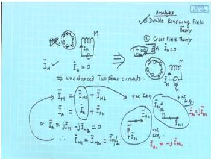
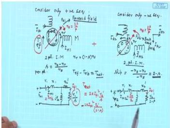
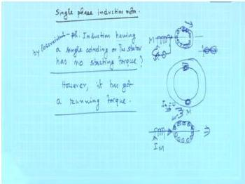

# Week 10: Single-Phase Induction Motors

## Learning Objectives

- Understand the fundamental difference between single-phase and three-phase induction motors
- Explain why a single-phase induction motor has no starting torque
- Apply the double revolving field theory to analyze single-phase induction motor operation
- Derive the equivalent circuit of a single-phase induction motor
- Analyze the torque-slip characteristics of a single-phase induction motor

---

## Introduction to Single-Phase Induction Motors

A **single-phase induction motor** is a type of induction motor that operates on a single-phase AC supply. Unlike three-phase induction motors, which have inherent starting torque, a single-phase induction motor has **no starting torque** when only a single winding is excited. However, once the rotor is brought to speed by some external means, the motor develops a running torque and continues to operate.

The key distinction is that a truly single-phase induction motor runs on a **single winding** (called the main winding) after it has been started. The starting mechanism is separate and is only used to bring the rotor up to speed.

  <em>Figure: Basic single-phase induction motor with main winding M and auxiliary winding A (not excited during running)</em>

### Why No Starting Torque?

When a single-phase supply is connected to the main winding alone, the current $I_M$ produces a **pulsating magnetic field** (alternating along one axis), not a rotating magnetic field. A pulsating field can be resolved into two equal and opposite rotating fields:

- A **forward rotating field** rotating at synchronous speed $N_s$
- A **backward rotating field** rotating at synchronous speed $-N_s$

At standstill ($s = 1$), both fields produce equal and opposite torques, resulting in **zero net starting torque**.

---

## Double Revolving Field Theory

The **double revolving field theory** is one of the two methods (the other being cross-field theory) used to analyze single-phase induction motors. This theory allows us to leverage the analysis techniques already developed for three-phase induction motors.

### Basic Concept

Consider a single-phase induction motor with:
- **Main winding (M)**: The only winding excited during running
- **Auxiliary winding (A)**: Identical to main winding but placed in quadrature (90° electrical apart), carrying no current during running ($I_A = 0$)

Although the auxiliary winding is not excited, its presence is assumed for analysis purposes. The system can be treated as an **unbalanced two-phase system**.

### Sequence Current Decomposition

The unbalanced two-phase currents can be decomposed into **positive sequence** and **negative sequence** components:

$$
I_M = I_{M1} + I_{M2}
$$

$$
I_A = I_{A1} + I_{A2}
$$

Where:
- $I_{M1}, I_{A1}$ form a **balanced positive sequence** two-phase system
- $I_{M2}, I_{A2}$ form a **balanced negative sequence** two-phase system

For a balanced two-phase system, the relationship between main and auxiliary winding currents is:

$$
I_{A1} = j I_{M1} \quad \text{(positive sequence: auxiliary leads main by 90°)}
$$

$$
I_{A2} = -j I_{M2} \quad \text{(negative sequence: auxiliary lags main by 90°)}
$$

### Special Case: $I_A = 0$

Since the auxiliary winding carries no current during running:

$$
I_A = I_{A1} + I_{A2} = 0
$$

Substituting the relationships:

$$
j I_{M1} - j I_{M2} = 0
$$

Therefore:

$$
I_{M1} = I_{M2} = \frac{I_M}{2}
$$

This is a crucial result: **the positive and negative sequence components of the main winding current are equal in magnitude**.

  <em>Figure: Decomposition of main winding current into positive and negative sequence components</em>

---

## Equivalent Circuit Development

### Forward and Backward Rotating Fields

The positive sequence currents ($I_{M1}, I_{A1}$) produce a **forward rotating field** that rotates in the direction from the leading phase to the lagging phase. The negative sequence currents ($I_{M2}, I_{A2}$) produce a **backward rotating field** rotating in the opposite direction.

Both fields rotate at synchronous speed:

$$
N_s = \frac{120f}{P} \text{ rpm}
$$

### Slip for Forward and Backward Fields

Let the rotor speed be $N_r$ rpm. Then:

**For the forward field:**
- Synchronous speed: $N_s$
- Rotor speed relative to forward field: $N_s - N_r$
- **Forward slip**: $s_f = \frac{N_s - N_r}{N_s} = s$

**For the backward field:**
- Synchronous speed: $-N_s$ (opposite direction)
- Rotor speed relative to backward field: $N_s + N_r$
- **Backward slip**: $s_b = \frac{N_s - (-N_r)}{N_s} = \frac{N_s + N_r}{N_s} = 2 - s$

### Equivalent Circuit for Each Sequence

Each sequence can be represented by an equivalent circuit similar to that of a three-phase induction motor, but with appropriate slip values.

**Forward field equivalent circuit** (slip = $s$):

The rotor impedance referred to the stator for the forward field is:

$$
Z_{rf} = \frac{R_2'}{s} + j X_2'
$$

**Backward field equivalent circuit** (slip = $2 - s$):

The rotor impedance referred to the stator for the backward field is:

$$
Z_{rb} = \frac{R_2'}{2-s} + j X_2'
$$

### Complete Equivalent Circuit

The complete equivalent circuit of a single-phase induction motor running on the main winding alone consists of:

1. **Stator resistance**: $R_1$
2. **Stator leakage reactance**: $X_1$
3. **Magnetizing reactance**: $X_m$
4. **Forward field rotor branch**: $\frac{R_2'}{s} + j X_2'$
5. **Backward field rotor branch**: $\frac{R_2'}{2-s} + j X_2'$

The forward and backward field rotor branches are connected in parallel with the magnetizing branch, and then in series with the stator impedance.

  <em>Figure: Equivalent circuit of single-phase induction motor based on double revolving field theory</em>

### Simplified Equivalent Circuit Parameters

Let:

$$
Z_f = \frac{j X_m \left( \frac{R_2'}{s} + j X_2' \right)}{\frac{R_2'}{s} + j (X_m + X_2')}
$$

$$
Z_b = \frac{j X_m \left( \frac{R_2'}{2-s} + j X_2' \right)}{\frac{R_2'}{2-s} + j (X_m + X_2')}
$$

Where:
- $Z_f$ = forward field impedance
- $Z_b$ = backward field impedance

The total input impedance seen by the supply is:

$$
Z_{in} = R_1 + j X_1 + Z_f + Z_b
$$

The main winding current is:

$$
I_M = \frac{V_M}{Z_{in}}
$$

---

## Torque-Slip Characteristics

### Torque Components

The torque developed by the motor has two components:

1. **Forward field torque** ($T_f$): Due to the forward rotating field
2. **Backward field torque** ($T_b$): Due to the backward rotating field

The net torque is:

$$
T = T_f - T_b
$$

### Torque Expression

The forward field torque can be expressed as:

$$
T_f = \frac{I_M^2 R_f}{s} \cdot \frac{1}{\omega_s}
$$

Where $R_f$ is the real part of $Z_f$ (the forward field resistance representing the rotor power).

Similarly, the backward field torque:

$$
T_b = \frac{I_M^2 R_b}{2-s} \cdot \frac{1}{\omega_s}
$$

Where $R_b$ is the real part of $Z_b$.

### Key Observations

1. **At standstill ($s = 1$)**: $T_f = T_b$, so net torque $T = 0$ — no starting torque
2. **For $0 < s < 1$**: $T_f > T_b$, so net torque is positive — motor runs in forward direction
3. **For $s > 1$**: Backward field torque dominates — braking operation
4. **For $s < 0$**: Forward field torque becomes negative — generator operation

  <em>Figure: Torque-slip characteristic of single-phase induction motor showing forward, backward, and net torque</em>

### Comparison with Three-Phase Induction Motor

| Feature | Three-Phase IM | Single-Phase IM |
|---------|----------------|-----------------|
| Starting torque | Present | Zero (with single winding) |
| Running torque | Smooth | Pulsating (double frequency) |
| Efficiency | Higher | Lower |
| Power factor | Better | Poorer |
| Applications | Industrial | Domestic, small loads |

---

## Solved Examples

### Example 1: Slip Calculation for Forward and Backward Fields

A 4-pole, 50 Hz single-phase induction motor runs at 1425 rpm. Calculate:
(a) The synchronous speed
(b) The forward slip
(c) The backward slip

**Solution:**

(a) Synchronous speed:
$$
N_s = \frac{120f}{P} = \frac{120 \times 50}{4} = 1500 \text{ rpm}
$$

(b) Forward slip:
$$
s = \frac{N_s - N_r}{N_s} = \frac{1500 - 1425}{1500} = \frac{75}{1500} = 0.05
$$

(c) Backward slip:
$$
s_b = 2 - s = 2 - 0.05 = 1.95
$$

**Answer:** $N_s = 1500$ rpm, $s = 0.05$, $s_b = 1.95$

---

### Example 2: Main Winding Current Decomposition

A single-phase induction motor draws a main winding current of $I_M = 5 \angle -30^\circ$ A. Determine the positive and negative sequence components of the main winding current.

**Solution:**

For a single-phase induction motor running on main winding alone ($I_A = 0$):

$$
I_{M1} = I_{M2} = \frac{I_M}{2}
$$

$$
I_{M1} = \frac{5 \angle -30^\circ}{2} = 2.5 \angle -30^\circ \text{ A}
$$

$$
I_{M2} = \frac{5 \angle -30^\circ}{2} = 2.5 \angle -30^\circ \text{ A}
$$

The corresponding auxiliary winding sequence currents are:

$$
I_{A1} = j I_{M1} = 2.5 \angle (-30^\circ + 90^\circ) = 2.5 \angle 60^\circ \text{ A}
$$

$$
I_{A2} = -j I_{M2} = 2.5 \angle (-30^\circ - 90^\circ) = 2.5 \angle -120^\circ \text{ A}
$$

**Verification:** $I_A = I_{A1} + I_{A2} = 2.5 \angle 60^\circ + 2.5 \angle -120^\circ = 0$ ✓

**Answer:** $I_{M1} = I_{M2} = 2.5 \angle -30^\circ$ A

---

### Example 3: Torque Calculation at Standstill

A single-phase induction motor has the following parameters referred to the stator:
$R_1 = 2\ \Omega$, $X_1 = 3\ \Omega$, $R_2' = 4\ \Omega$, $X_2' = 3\ \Omega$, $X_m = 80\ \Omega$
The motor is supplied at 230 V, 50 Hz. Calculate the forward and backward torques at standstill. Neglect stator impedance drop for simplicity.

**Solution:**

At standstill, $s = 1$ and $2-s = 1$.

Forward field impedance:
$$
Z_f = \frac{j X_m \left( \frac{R_2'}{s} + j X_2' \right)}{\frac{R_2'}{s} + j (X_m + X_2')}
$$

$$
Z_f = \frac{j 80 (4 + j 3)}{4 + j (80 + 3)} = \frac{j 80 (4 + j 3)}{4 + j 83}
$$

$$
Z_f = \frac{j 320 - 240}{4 + j 83}
$$

$$
Z_f = \frac{-240 + j 320}{4 + j 83}
$$

Multiply numerator and denominator by conjugate:

$$
Z_f = \frac{(-240 + j 320)(4 - j 83)}{4^2 + 83^2}
$$

$$
Z_f = \frac{(-240)(4) + (-240)(-j 83) + (j 320)(4) + (j 320)(-j 83)}{16 + 6889}
$$

$$
Z_f = \frac{-960 + j 19920 + j 1280 + 26560}{6905}
$$

$$
Z_f = \frac{25600 + j 21200}{6905}
$$

$$
Z_f = 3.707 + j 3.070\ \Omega
$$

Similarly, since $s = 1$, $Z_b = Z_f = 3.707 + j 3.070\ \Omega$

Forward field resistance: $R_f = 3.707\ \Omega$
Backward field resistance: $R_b = 3.707\ \Omega$

Main winding current (neglecting stator impedance):
$$
I_M = \frac{V_M}{Z_f + Z_b} = \frac{230}{2 \times (3.707 + j 3.070)}
$$

$$
I_M = \frac{230}{7.414 + j 6.140}
$$

$$
|I_M| = \frac{230}{\sqrt{7.414^2 + 6.140^2}} = \frac{230}{\sqrt{54.97 + 37.70}} = \frac{230}{\sqrt{92.67}} = \frac{230}{9.626} = 23.89\ \text{A}
$$

Forward torque:
$$
T_f = \frac{I_M^2 R_f}{s \omega_s}
$$

$$
\omega_s = \frac{2\pi N_s}{60} = \frac{2\pi \times 1500}{60} = 157.08\ \text{rad/s}
$$

$$
T_f = \frac{(23.89)^2 \times 3.707}{1 \times 157.08} = \frac{570.7 \times 3.707}{157.08} = \frac{2115.6}{157.08} = 13.47\ \text{N}\cdot\text{m}
$$

Backward torque:
$$
T_b = \frac{I_M^2 R_b}{(2-s) \omega_s} = \frac{(23.89)^2 \times 3.707}{1 \times 157.08} = 13.47\ \text{N}\cdot\text{m}
$$

Net torque at standstill:
$$
T = T_f - T_b = 13.47 - 13.47 = 0\ \text{N}\cdot\text{m}
$$

**Answer:** $T_f = T_b = 13.47$ N·m, Net torque = 0 N·m (no starting torque)

---

### Example 4: Torque at Running Condition

For the same motor as Example 3, calculate the net torque when the motor runs at a slip of 0.05. Assume the main winding current remains approximately the same.

**Solution:**

At $s = 0.05$:

Forward field impedance:
$$
Z_f = \frac{j X_m \left( \frac{R_2'}{s} + j X_2' \right)}{\frac{R_2'}{s} + j (X_m + X_2')}
$$

$$
\frac{R_2'}{s} = \frac{4}{0.05} = 80\ \Omega
$$

$$
Z_f = \frac{j 80 (80 + j 3)}{80 + j (80 + 3)} = \frac{j 80 (80 + j 3)}{80 + j 83}
$$

$$
Z_f = \frac{j 6400 - 240}{80 + j 83} = \frac{-240 + j 6400}{80 + j 83}
$$

Multiply numerator and denominator by conjugate:

$$
Z_f = \frac{(-240 + j 6400)(80 - j 83)}{80^2 + 83^2}
$$

$$
Z_f = \frac{(-240)(80) + (-240)(-j 83) + (j 6400)(80) + (j 6400)(-j 83)}{6400 + 6889}
$$

$$
Z_f = \frac{-19200 + j 19920 + j 512000 + 531200}{13289}
$$

$$
Z_f = \frac{512000 + j 531920}{13289}
$$

$$
Z_f = 38.53 + j 40.03\ \Omega
$$

Backward field impedance ($2-s = 1.95$):
$$
\frac{R_2'}{2-s} = \frac{4}{1.95} = 2.051\ \Omega
$$

$$
Z_b = \frac{j 80 (2.051 + j 3)}{2.051 + j (80 + 3)} = \frac{j 80 (2.051 + j 3)}{2.051 + j 83}
$$

$$
Z_b = \frac{j 164.08 - 240}{2.051 + j 83} = \frac{-240 + j 164.08}{2.051 + j 83}
$$

Multiply numerator and denominator by conjugate:

$$
Z_b = \frac{(-240 + j 164.08)(2.051 - j 83)}{2.051^2 + 83^2}
$$

$$
Z_b = \frac{(-240)(2.051) + (-240)(-j 83) + (j 164.08)(2.051) + (j 164.08)(-j 83)}{4.207 + 6889}
$$

$$
Z_b = \frac{-492.24 + j 19920 + j 336.53 + 13618.64}{6893.207}
$$

$$
Z_b = \frac{13126.40 + j 20256.53}{6893.207}
$$

$$
Z_b = 1.904 + j 2.939\ \Omega
$$

Forward field resistance: $R_f = 38.53\ \Omega$
Backward field resistance: $R_b = 1.904\ \Omega$

Forward torque:
$$
T_f = \frac{I_M^2 R_f}{s \omega_s} = \frac{(23.89)^2 \times 38.53}{0.05 \times 157.08} = \frac{570.7 \times 38.53}{7.854} = \frac{21989.1}{7.854} = 2800.0\ \text{N}\cdot\text{m}
$$

Backward torque:
$$
T_b = \frac{I_M^2 R_b}{(2-s) \omega_s} = \frac{(23.89)^2 \times 1.904}{1.95 \times 157.08} = \frac{570.7 \times 1.904}{306.31} = \frac{1086.6}{306.31} = 3.55\ \text{N}\cdot\text{m}
$$

Net torque:
$$
T = T_f - T_b = 2800.0 - 3.55 = 2796.45\ \text{N}\cdot\text{m}
$$

**Answer:** Net torque = 2796.45 N·m (positive, motor runs in forward direction)

---

## Key Formulas

| Quantity | Formula | Units |
|----------|---------|-------|
| Synchronous speed | $N_s = \frac{120f}{P}$ | rpm |
| Forward slip | $s = \frac{N_s - N_r}{N_s}$ | — |
| Backward slip | $s_b = 2 - s$ | — |
| Main winding current decomposition | $I_{M1} = I_{M2} = \frac{I_M}{2}$ | A |
| Positive sequence auxiliary current | $I_{A1} = j I_{M1}$ | A |
| Negative sequence auxiliary current | $I_{A2} = -j I_{M2}$ | A |
| Forward field impedance | $Z_f = \frac{j X_m \left( \frac{R_2'}{s} + j X_2' \right)}{\frac{R_2'}{s} + j (X_m + X_2')}$ | $\Omega$ |
| Backward field impedance | $Z_b = \frac{j X_m \left( \frac{R_2'}{2-s} + j X_2' \right)}{\frac{R_2'}{2-s} + j (X_m + X_2')}$ | $\Omega$ |
| Forward torque | $T_f = \frac{I_M^2 R_f}{s \omega_s}$ | N·m |
| Backward torque | $T_b = \frac{I_M^2 R_b}{(2-s) \omega_s}$ | N·m |
| Net torque | $T = T_f - T_b$ | N·m |
| Synchronous speed in rad/s | $\omega_s = \frac{2\pi N_s}{60}$ | rad/s |

---

## Summary

1. **Single-phase induction motors** have no starting torque when only the main winding is excited because the pulsating field can be resolved into two equal and opposite rotating fields producing equal and opposite torques at standstill.

2. **Double revolving field theory** decomposes the pulsating field into forward and backward rotating fields, each rotating at synchronous speed $N_s$.

3. The **forward slip** is $s$ and the **backward slip** is $2-s$, where $s$ is the conventional slip.

4. The **equivalent circuit** consists of stator impedance in series with parallel combinations representing the forward and backward field rotor circuits.

5. At standstill ($s = 1$), forward and backward torques are equal, giving **zero net starting torque**. For $0 < s < 1$, forward torque dominates, producing positive running torque.

6. The main winding current decomposes equally into positive and negative sequence components: $I_{M1} = I_{M2} = I_M/2$.

7. Single-phase induction motors have **lower efficiency** and **poorer power factor** compared to three-phase induction motors of similar rating.