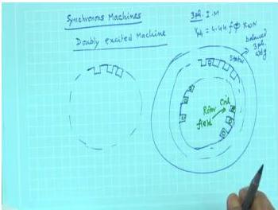
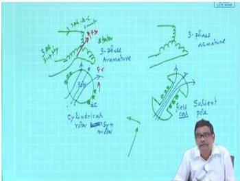
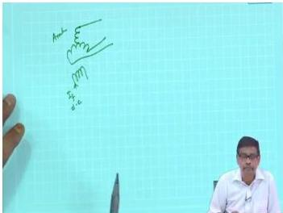
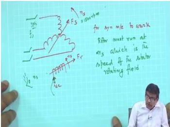
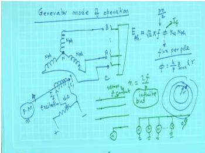

# Week 11: Synchronous Machines — Construction and Generator Operation

## Learning Objectives

- Understand the construction and types of synchronous machines (cylindrical rotor vs. salient pole)
- Explain the concept of doubly-excited machines and the role of field and armature windings
- Analyze the generation of induced EMF in synchronous generators
- Derive the relationship between speed, frequency, and number of poles
- Understand the basic operating principles of synchronous generators

---

## Introduction to Synchronous Machines

Synchronous machines are **doubly-excited machines** that can operate both as motors and generators. Unlike induction motors, synchronous machines have a separate DC excitation system for the rotor, making them highly efficient and capable of operating at unity or leading power factor.

### Key Characteristics

- **Doubly-excited**: Both stator and rotor have separate electrical supplies
- **Constant speed operation**: Rotor runs at synchronous speed $N_s$ in steady state
- **High power ratings**: Can be built for ratings up to hundreds of MW
- **Independent excitation**: Field current is independent of the AC supply

---

## Construction of Synchronous Machines

### Stator (Armature)

The stator carries a **3-phase distributed winding**, similar to that of an induction motor. This winding is called the **armature winding** in synchronous machines.

  <em>Figure: Cross-section of a synchronous machine showing stator and rotor construction</em>

### Rotor (Field)

The rotor carries a **DC field winding** that produces a stationary magnetic field when excited with DC current. There are two main types of rotor construction:

#### 1. Cylindrical Rotor (Non-Salient Pole)

- Smooth cylindrical structure with slots for field windings
- Used for high-speed machines (2-pole or 4-pole)
- Typically used in turbo-generators (steam turbine driven)
- Speed range: 1500–3000 rpm

#### 2. Salient Pole Rotor

- Projecting poles with concentrated field windings
- Used for low-speed machines (many poles)
- Typically used in hydro-generators (water turbine driven)
- Speed range: 50–500 rpm

  <em>Figure: (a) Cylindrical rotor construction (b) Salient pole rotor construction</em>

### Why Field Winding on Rotor?

Practical considerations dictate that:

1. **Field winding on rotor**: Requires only 2 slip rings and brushes for DC excitation
2. **Armature on stator**: Avoids 3 slip rings for high-power AC current
3. **Lower current rating**: Field current is much smaller than armature current, reducing slip ring size and maintenance

> **Note**: The roles can theoretically be reversed, but for large machines (especially generators in power stations), field winding is always on the rotor.

---

## Operating Principle

### Doubly-Excited Machine Concept

In a synchronous machine:

- **Stator (armature)**: Carries 3-phase AC winding producing a **rotating magnetic field** $F_s$ at synchronous speed $N_s$
- **Rotor (field)**: Carries DC winding producing a **stationary magnetic field** $F_r$ with respect to rotor

For torque production, the rotor must rotate at synchronous speed so that $F_r$ appears as a rotating field to a stationary observer.

### Synchronous Speed

The synchronous speed is given by:

$$
N_s = \frac{120f}{P} \text{ rpm}
$$

Where:
- $f$ = supply frequency (Hz)
- $P$ = number of poles

### Induced Voltage in Armature

When the rotor is driven by a prime mover, the rotating field $F_r$ cuts the stationary armature conductors, inducing a 3-phase voltage:

$$
E_{ph} = 4.44 f \phi K_w N_{ph}
$$

Where:
- $\phi$ = flux per pole (Wb)
- $K_w$ = winding factor
- $N_{ph}$ = number of turns per phase

  <em>Figure: Basic synchronous generator operation with prime mover and field excitation</em>

---

## Generator Mode of Operation

### Basic Setup

1. **Prime mover** (turbine, engine) drives the rotor at synchronous speed $N_s$
2. **DC field excitation** is applied to the rotor winding
3. **3-phase voltage** is induced in the stator armature winding
4. **Load** can be connected to the stator terminals

  <em>Figure: Synchronous generator connected to a 3-phase load with field excitation control</em>

### Frequency Control

The generated frequency depends on speed and number of poles:

$$
f = \frac{P N_s}{120}
$$

For a 4-pole machine generating 50 Hz:
- Required speed: $N_s = \frac{120 \times 50}{4} = 1500$ rpm

For a 2-pole machine generating 50 Hz:
- Required speed: $N_s = \frac{120 \times 50}{2} = 3000$ rpm

### No-Load Operation

At no-load:
- No current flows in the armature
- Induced voltage $E_{ph}$ depends only on field current $I_f$ and speed
- $E_{ph} \propto I_f$ (for linear region of magnetization curve)

  <em>Figure: Variation of induced EMF with field current at constant speed</em>

---

## Solved Examples

### Example 1: Synchronous Speed Calculation

A 6-pole synchronous generator is driven by a water turbine at 1000 rpm. Calculate the frequency of the generated voltage.

**Solution:**

Using the synchronous speed formula:

$$
N_s = \frac{120f}{P}
$$

Rearranging for frequency:

$$
f = \frac{N_s P}{120} = \frac{1000 \times 6}{120} = 50 \text{ Hz}
$$

**Answer:** The generated frequency is 50 Hz.

---

### Example 2: Pole Number Determination

A synchronous generator is required to generate 60 Hz voltage. If the prime mover runs at 1800 rpm, determine the number of poles.

**Solution:**

$$
N_s = \frac{120f}{P}
$$

$$
P = \frac{120f}{N_s} = \frac{120 \times 60}{1800} = 4 \text{ poles}
$$

**Answer:** The machine must have 4 poles.

---

### Example 3: Induced EMF Calculation

A 3-phase synchronous generator has 48 slots with 2 conductors per slot per phase. The flux per pole is 0.05 Wb, frequency is 50 Hz, and the winding factor is 0.96. Calculate the induced EMF per phase.

**Solution:**

Number of turns per phase:

$$
N_{ph} = \frac{\text{Total conductors per phase}}{2} = \frac{48 \times 2}{2} = 48 \text{ turns}
$$

Induced EMF:

$$
E_{ph} = 4.44 f \phi K_w N_{ph}
$$

$$
E_{ph} = 4.44 \times 50 \times 0.05 \times 0.96 \times 48
$$

$$
E_{ph} = 4.44 \times 50 \times 0.05 \times 46.08
$$

$$
E_{ph} = 511.5 \text{ V}
$$

**Answer:** The induced EMF per phase is 511.5 V.

---

### Example 4: Prime Mover Speed for Desired Frequency

A 10-pole synchronous generator is to supply power to a 50 Hz grid. At what speed must the prime mover drive the generator?

**Solution:**

$$
N_s = \frac{120f}{P} = \frac{120 \times 50}{10} = 600 \text{ rpm}
$$

**Answer:** The prime mover must drive the generator at 600 rpm.

---

## Key Formulas

| Quantity | Formula | Units |
|----------|---------|-------|
| Synchronous speed | $N_s = \dfrac{120f}{P}$ | rpm |
| Generated frequency | $f = \dfrac{P N_s}{120}$ | Hz |
| Induced EMF per phase | $E_{ph} = 4.44 f \phi K_w N_{ph}$ | V |
| Number of poles | $P = \dfrac{120f}{N_s}$ | — |
| Electrical speed | $\omega_e = \dfrac{P}{2} \omega_m$ | rad/s |

---

## Summary

1. **Synchronous machines** are doubly-excited machines with 3-phase armature winding on stator and DC field winding on rotor
2. **Two rotor types**: Cylindrical rotor (high-speed, turbo-generators) and salient pole rotor (low-speed, hydro-generators)
3. **Synchronous speed** is determined by $N_s = 120f/P$ — rotor must run at this speed for steady torque
4. **Induced EMF** in armature depends on flux per pole, frequency, winding factor, and number of turns
5. **Generator operation**: Prime mover drives rotor at synchronous speed, DC excitation produces flux, and 3-phase voltage is induced in stator
6. **Frequency control**: Generated frequency is directly proportional to speed and number of poles