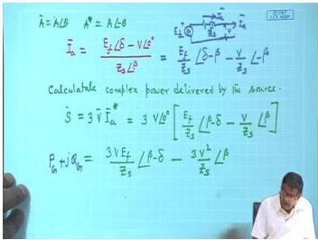
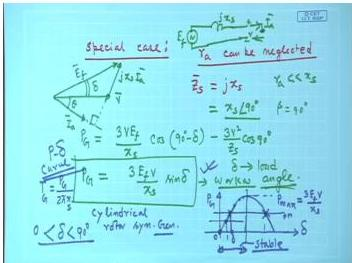
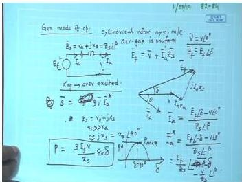
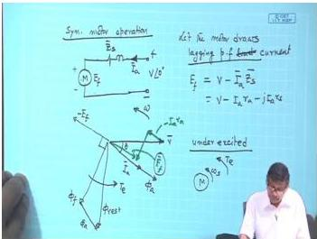

# Week 12: Synchronous Machines — Phasor Diagrams, Power, and Salient Pole Analysis

## Learning Objectives

- Derive the complete phasor diagram for a cylindrical rotor synchronous generator and motor
- Calculate real and reactive power delivered by a synchronous generator using complex power analysis
- Apply the simplified power expression $P = \frac{3VE_f}{x_s} \sin \delta$ for negligible armature resistance
- Analyze the effect of field excitation on power output and power factor
- Understand the fundamental differences between cylindrical rotor and salient pole synchronous machines

---

## Complex Power Expression for Synchronous Generator

Consider a cylindrical rotor synchronous generator connected to an infinite bus. The per-phase equivalent circuit is shown below:

  <em>Figure: Per-phase equivalent circuit of cylindrical rotor synchronous generator</em>

The generator has:
- Internal induced EMF: $\bar{E}_f = E_f \angle \delta$
- Terminal voltage: $\bar{V} = V \angle 0^\circ$ (reference phasor)
- Synchronous impedance: $\bar{Z}_s = Z_s \angle \beta = r_a + jx_s$
- Armature current: $\bar{I}_a$

From Kirchhoff's voltage law:

$$
\bar{I}_a = \frac{\bar{E}_f - \bar{V}}{\bar{Z}_s} = \frac{E_f \angle \delta - V \angle 0^\circ}{Z_s \angle \beta}
$$

$$
\bar{I}_a = \frac{E_f}{Z_s} \angle (\delta - \beta) - \frac{V}{Z_s} \angle (-\beta)
$$

The complex conjugate of current is:

$$
\bar{I}_a^* = \frac{E_f}{Z_s} \angle (\beta - \delta) - \frac{V}{Z_s} \angle \beta
$$

The complex power delivered by the generator (per phase) is:

$$
\bar{S} = 3\bar{V}\bar{I}_a^* = 3V \angle 0^\circ \left[ \frac{E_f}{Z_s} \angle (\beta - \delta) - \frac{V}{Z_s} \angle \beta \right]
$$

$$
\bar{S} = \frac{3VE_f}{Z_s} \angle (\beta - \delta) - \frac{3V^2}{Z_s} \angle \beta
$$

### Real Power

The real power (active power) is the real part of $\bar{S}$:

$$
P_G = \frac{3VE_f}{Z_s} \cos(\beta - \delta) - \frac{3V^2}{Z_s} \cos \beta
$$

### Reactive Power

The reactive power is the imaginary part of $\bar{S}$:

$$
Q_G = \frac{3VE_f}{Z_s} \sin(\beta - \delta) - \frac{3V^2}{Z_s} \sin \beta
$$

Where:
- $P_G$ = real power delivered (W)
- $Q_G$ = reactive power delivered (VAR)
- $\beta = \tan^{-1}(x_s / r_a)$ = impedance angle of synchronous impedance

---

## Simplified Power Expression (Neglecting Armature Resistance)

In practical synchronous machines, $x_s \gg r_a$, so $r_a$ can be neglected. Then:

$$
\bar{Z}_s \approx jx_s = x_s \angle 90^\circ
$$

Substituting $\beta = 90^\circ$:

$$
P_G = \frac{3VE_f}{x_s} \cos(90^\circ - \delta) - \frac{3V^2}{x_s} \cos 90^\circ
$$

Since $\cos 90^\circ = 0$ and $\cos(90^\circ - \delta) = \sin \delta$:

$$
\boxed{P_G = \frac{3VE_f}{x_s} \sin \delta}
$$

This is the **most important formula** for power in cylindrical rotor synchronous machines.

### Power-Angle Characteristic

  <em>Figure: Power-angle (P-δ) characteristic for cylindrical rotor synchronous generator</em>

The power-angle curve is sinusoidal with:
- Maximum power at $\delta = 90^\circ$: $P_{max} = \frac{3VE_f}{x_s}$
- Stable operation region: $0^\circ < \delta < 90^\circ$
- For generator: $\delta > 0$ (E_f leads V)
- For motor: $\delta < 0$ (E_f lags V)

---

## Synchronous Motor Operation

### Phasor Diagram for Motor Mode

For a synchronous motor, the equivalent circuit is similar but current flows **into** the machine:

  <em>Figure: Per-phase equivalent circuit for synchronous motor</em>

The voltage equation becomes:

$$
\bar{E}_f = \bar{V} - \bar{I}_a \bar{Z}_s
$$

For a motor drawing lagging power factor current:

  <em>Figure: Phasor diagram for synchronous motor drawing lagging power factor current</em>

### Power Expression for Motor

For motor operation with negligible $r_a$:

$$
P_M = \frac{3VE_f}{x_s} \sin |\delta|
$$

Where $\delta$ is negative for motor operation (E_f lags V).

The torque developed is:

$$
T = \frac{P_M}{\omega_m} = \frac{P_M}{2\pi n_s / 60}
$$

Where:
- $\omega_m$ = mechanical angular speed (rad/s)
- $n_s$ = synchronous speed (rpm)

---

## Solved Examples

### Example 1: Power Calculation for Cylindrical Rotor Generator

A 3-phase, 11 kV, 50 Hz, star-connected cylindrical rotor synchronous generator has synchronous reactance of 5 Ω/phase and negligible armature resistance. The generator delivers 2 MW at 0.8 power factor lagging to an infinite bus. Calculate:
(a) The induced EMF per phase ($E_f$)
(b) The load angle ($\delta$)
(c) The maximum power the generator can deliver

**Solution:**

Given:
- $V_L = 11$ kV, so $V_{ph} = \frac{11000}{\sqrt{3}} = 6350.85$ V
- $x_s = 5$ Ω/phase
- $P = 2$ MW = $2 \times 10^6$ W
- $\cos \phi = 0.8$ lagging, so $\phi = \cos^{-1}(0.8) = 36.87^\circ$

**Step 1:** Find armature current

$$
P = 3VI_a \cos \phi
$$

$$
I_a = \frac{P}{3V \cos \phi} = \frac{2 \times 10^6}{3 \times 6350.85 \times 0.8} = 131.22 \text{ A}
$$

**Step 2:** Using phasor diagram with $V$ as reference

$$
\bar{V} = 6350.85 \angle 0^\circ \text{ V}
$$

$$
\bar{I}_a = 131.22 \angle -36.87^\circ \text{ A}
$$

**Step 3:** Calculate $E_f$

$$
\bar{E}_f = \bar{V} + j\bar{I}_a x_s
$$

$$
\bar{E}_f = 6350.85 \angle 0^\circ + j(131.22 \angle -36.87^\circ)(5)
$$

$$
\bar{E}_f = 6350.85 \angle 0^\circ + 656.1 \angle (90^\circ - 36.87^\circ)
$$

$$
\bar{E}_f = 6350.85 \angle 0^\circ + 656.1 \angle 53.13^\circ
$$

$$
\bar{E}_f = 6350.85 + 656.1(\cos 53.13^\circ + j\sin 53.13^\circ)
$$

$$
\bar{E}_f = 6350.85 + 656.1(0.6 + j0.8)
$$

$$
\bar{E}_f = 6350.85 + 393.66 + j524.88
$$

$$
\bar{E}_f = 6744.51 + j524.88
$$

$$
E_f = \sqrt{6744.51^2 + 524.88^2} = 6764.89 \text{ V}
$$

**Step 4:** Find load angle

$$
\delta = \tan^{-1}\left(\frac{524.88}{6744.51}\right) = 4.45^\circ
$$

**Step 5:** Maximum power

$$
P_{max} = \frac{3VE_f}{x_s} = \frac{3 \times 6350.85 \times 6764.89}{5} = 25.78 \text{ MW}
$$

**Answer:**
- (a) $E_f = 6764.89$ V/phase
- (b) $\delta = 4.45^\circ$
- (c) $P_{max} = 25.78$ MW

---

### Example 2: Power-Angle Characteristic

A 3-phase, 6.6 kV, star-connected synchronous generator has synchronous reactance of 8 Ω/phase. The field current is adjusted such that $E_f = 1.2$ pu (per unit) at rated voltage. Calculate:
(a) The power output at $\delta = 30^\circ$
(b) The maximum power output
(c) The torque at maximum power if speed is 1500 rpm

**Solution:**

Given:
- $V_L = 6.6$ kV, $V_{ph} = \frac{6600}{\sqrt{3}} = 3810.51$ V
- $x_s = 8$ Ω/phase
- $E_f = 1.2 \times 3810.51 = 4572.61$ V
- $n_s = 1500$ rpm

**Step 1:** Power at $\delta = 30^\circ$

$$
P = \frac{3VE_f}{x_s} \sin \delta = \frac{3 \times 3810.51 \times 4572.61}{8} \times \sin 30^\circ
$$

$$
P = \frac{3 \times 3810.51 \times 4572.61}{8} \times 0.5
$$

$$
P = 3.27 \text{ MW}
$$

**Step 2:** Maximum power

$$
P_{max} = \frac{3VE_f}{x_s} = \frac{3 \times 3810.51 \times 4572.61}{8} = 6.53 \text{ MW}
$$

**Step 3:** Torque at maximum power

$$
\omega_m = \frac{2\pi n_s}{60} = \frac{2\pi \times 1500}{60} = 157.08 \text{ rad/s}
$$

$$
T_{max} = \frac{P_{max}}{\omega_m} = \frac{6.53 \times 10^6}{157.08} = 41,571 \text{ N·m}
$$

**Answer:**
- (a) $P = 3.27$ MW at $\delta = 30^\circ$
- (b) $P_{max} = 6.53$ MW
- (c) $T_{max} = 41,571$ N·m

---

### Example 3: Synchronous Motor Power

A 3-phase, 400 V, 50 Hz, 4-pole star-connected synchronous motor has synchronous reactance of 4 Ω/phase. It draws 20 A at unity power factor. Calculate:
(a) The induced EMF ($E_f$)
(b) The load angle
(c) The power developed
(d) The torque developed

**Solution:**

Given:
- $V_L = 400$ V, $V_{ph} = \frac{400}{\sqrt{3}} = 230.94$ V
- $x_s = 4$ Ω/phase
- $I_a = 20$ A at unity pf ($\phi = 0^\circ$)
- $P = 4$ poles

**Step 1:** For motor at unity pf, $\bar{I}_a = 20 \angle 0^\circ$ A

$$
\bar{E}_f = \bar{V} - j\bar{I}_a x_s
$$

$$
\bar{E}_f = 230.94 \angle 0^\circ - j(20 \angle 0^\circ)(4)
$$

$$
\bar{E}_f = 230.94 \angle 0^\circ - 80 \angle 90^\circ
$$

$$
\bar{E}_f = 230.94 - j80
$$

$$
E_f = \sqrt{230.94^2 + 80^2} = 244.41 \text{ V}
$$

**Step 2:** Load angle (negative for motor)

$$
\delta = -\tan^{-1}\left(\frac{80}{230.94}\right) = -19.11^\circ
$$

**Step 3:** Power developed

$$
P = 3VI_a \cos \phi = 3 \times 230.94 \times 20 \times 1 = 13,856.4 \text{ W}
$$

Alternatively:

$$
P = \frac{3VE_f}{x_s} \sin |\delta| = \frac{3 \times 230.94 \times 244.41}{4} \times \sin 19.11^\circ = 13,856.4 \text{ W}
$$

**Step 4:** Torque

$$
n_s = \frac{120f}{P} = \frac{120 \times 50}{4} = 1500 \text{ rpm}
$$

$$
\omega_m = \frac{2\pi \times 1500}{60} = 157.08 \text{ rad/s}
$$

$$
T = \frac{P}{\omega_m} = \frac{13856.4}{157.08} = 88.22 \text{ N·m}
$$

**Answer:**
- (a) $E_f = 244.41$ V/phase
- (b) $\delta = -19.11^\circ$ (motor operation)
- (c) $P = 13.86$ kW
- (d) $T = 88.22$ N·m

---

## Key Formulas

| Quantity | Formula | Units |
|----------|---------|-------|
| Synchronous impedance | $Z_s = \sqrt{r_a^2 + x_s^2}$ | $\Omega$ |
| Impedance angle | $\beta = \tan^{-1}(x_s / r_a)$ | degrees |
| Complex power (general) | $\bar{S} = \frac{3VE_f}{Z_s} \angle (\beta - \delta) - \frac{3V^2}{Z_s} \angle \beta$ | VA |
| Real power (general) | $P_G = \frac{3VE_f}{Z_s} \cos(\beta - \delta) - \frac{3V^2}{Z_s} \cos \beta$ | W |
| Reactive power (general) | $Q_G = \frac{3VE_f}{Z_s} \sin(\beta - \delta) - \frac{3V^2}{Z_s} \sin \beta$ | VAR |
| Real power (neglecting $r_a$) | $P = \frac{3VE_f}{x_s} \sin \delta$ | W |
| Maximum power | $P_{max} = \frac{3VE_f}{x_s}$ | W |
| Torque | $T = \frac{P}{\omega_m} = \frac{P}{2\pi n_s / 60}$ | N·m |
| Synchronous speed | $n_s = \frac{120f}{P}$ | rpm |

---

## Summary

1. **Complex power analysis** provides complete information about real and reactive power flow in synchronous machines. The general expressions include both $r_a$ and $x_s$ effects.

2. **Simplified power expression** $P = \frac{3VE_f}{x_s} \sin \delta$ is valid when armature resistance is negligible ($x_s \gg r_a$). This is the most commonly used formula for cylindrical rotor machines.

3. **Power-angle characteristic** is sinusoidal. Maximum power transfer occurs at $\delta = 90^\circ$. Stable operation requires $\delta < 90^\circ$ for generators and $|\delta| < 90^\circ$ for motors.

4. **Generator vs Motor**: In generator mode, $E_f$ leads $V$ ($\delta > 0$). In motor mode, $E_f$ lags $V$ ($\delta < 0$). The magnitude of power depends on $E_f$, $V$, $x_s$, and $\sin \delta$.

5. **Field excitation** controls $E_f$ magnitude. Increasing $E_f$ increases the maximum power capability but does not change the real power output unless the prime mover input changes.