# Module 5.1: Leading, Motivation, Communication & Controlling 🎯

:::tip[Learning Objectives]
By the end of this comprehensive deep dive, you will master:
- **Leadership Theories:** Lewin, Likert, Blake & Mouton, Tannenbaum & Schmidt
- **Motivation Frameworks:** Maslow's Hierarchy, Herzberg's Two-Factor, McGregor's X/Y
- **Communication Process:** Channel flows, barriers, and effective listening
- **Controlling Function:** 8-step process, control types, budgetary techniques

**Exam Weight:** This module covers ~35% of the EOM syllabus - CRITICAL for success! 🔥
:::


---

## ⭐ Priority Legend

- 🔥🔥🔥 = **CRITICAL** - Appears in 70%+ exams (Master these first!)
- 🔥🔥 = **High Priority** - Appears in 50%+ exams
- 🔥 = **Important** - Appears in 30%+ exams

---

## 📚 Module Navigation

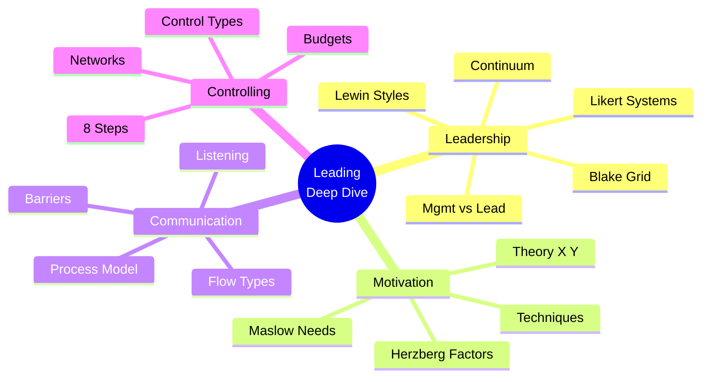

**Quick Links:**
- **Module 5 - Leading & Motivation** - Core module
- **Module 6 - Controlling Process** - Controlling details
- **Module 8 - Complete Topic Overview & Quick Reference** - Full review

---

# 1.0 Management vs. Leadership: The Foundation 🏛️

Understanding the distinction between management and leadership is crucial for mastering organizational behavior theory.

## 1.1 The Core Distinction

:::info[Management vs. Leadership]
- **Managers:** Focus on COMMANDING people - "Do things RIGHT"
- **Leaders:** Focus on GUIDING people - "Do the RIGHT things"
:::


### The Comparison Matrix

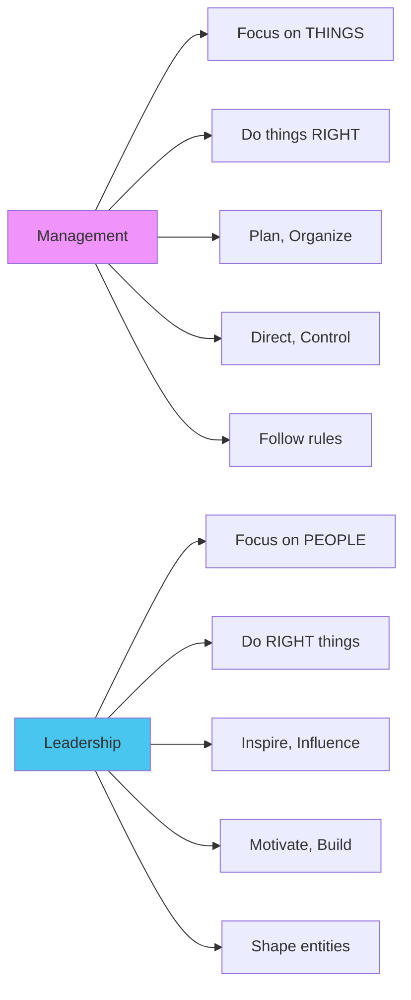

| Aspect | Manager | Leader |
|:-------|:--------|:-------|
| **Primary Focus** | Things | People |
| **Approach** | Do things right (Efficiency) | Do the right things (Effectiveness) |
| **Core Activities** | Plan, Organize, Direct, Control | Inspire, Influence, Motivate, Build |
| **Relationship to Rules** | Follows the rules | Shapes entities |
| **Style** | COMMANDING people | GUIDING people |

:::warning[Key Takeaway]
A person can be BOTH a manager and a leader, but the approaches are fundamentally different. Great organizations need both skills!
:::


---

### 🎓 Knowledge Check 1.1

1. **True or False:** Management and leadership are identical concepts in organizational theory.
2. According to the text, a manager's primary focus is on ______, while a leader's primary focus is on ______.
3. Which role is associated with the phrase \"Do the right things\"? a) Manager b) Leader c) Both d) Neither
4. Contrast the primary focus of a manager with that of a leader.
5. List three key attributes of a manager as described in the text.
6. List three key attributes of a leader as described in the text.
7. Explain the difference between \"commanding people\" and \"guiding people\" in the context of management vs. leadership.
8. Which role is more concerned with following established rules?
9. Which role is associated with shaping entities and building new structures?
10. **Short Answer:** Why is it important to distinguish between the roles of a manager and a leader?

---

# 2.0 The Essence of Effective Leadership 🌟

Effective leadership isn't innate—it's built on specific abilities and cultivated qualities.

## 2.1 The Four Core Ingredients of Leadership

:::info[Core Leadership Abilities]
An effective leader must master these four fundamental capabilities:
:::


1. **Power Management** 💪
   - The ability to USE POWER EFFECTIVELY and RESPONSIBLY
   - Balance authority with accountability

2. **Motivational Intelligence** 🧠
   - UNDERSTAND that humans have DIFFERENT MOTIVATION FORCES
   - These vary by TIME and SITUATION
   - One-size-fits-all doesn't work!

3. **Inspirational Capacity** ✨
   - The ability to INSPIRE followers
   - Generate genuine enthusiasm

4. **Climate Building** 🌤️
   - Act to DEVELOP A CLIMATE conducive to motivation
   - Create an environment where people WANT to perform

## 2.2 Essential Qualities of an Effective Leader

:::warning[Character Traits That Matter]
:::


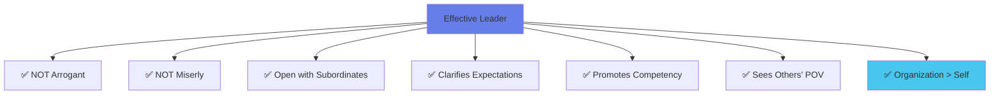

**The Character of a Leader:**
- **Humility:** Shouldn't be arrogant
- **Generosity:** Shouldn't be miserly
- **Transparency:** Should be as open as possible with subordinates
- **Clarity:** Should ensure team understands expectations
- **Development Focus:** Should promote competency and inspire
- **Empathy:** Must see things from others' point of view
- **Organizational Commitment:** Must consider organization needs above personal needs

:::warning[Leadership Pitfall]
Leaders who prioritize their own needs over the organization's create toxic cultures and undermine team trust!
:::


---

### 🎓 Knowledge Check 2.0

1. List the four \"core ingredients\" of leadership.
2. **True or False:** According to the text, a key quality of an effective leader is to prioritize their own needs to ensure they can lead effectively.
3. A leader who creates a positive and encouraging work environment is demonstrating which 'ingredient' of leadership described in the text?
4. Why is it important for a leader to understand that motivation forces can change for different people and situations?
5. Which of the following is NOT a quality of an effective leader mentioned in the text? a) Openness with subordinates b) Arrogance c) Ability to inspire d) Putting the organization first
6. **Scenario:** A manager uses their authority to assign tasks but also takes the time to explain the importance of each task to the team's overall success. Which ingredient of leadership are they demonstrating?
7. Explain what it means for a leader to \"see things from others' point of view.\"
8. The ability to use power in a responsible manner is a key ingredient of leadership. What might be an example of irresponsible use of power?
9. **Short Answer:** What is the relationship between promoting competency and being an effective leader?
10. **True or False:** A good leader ensures that their team understands expectations.

---

# 3.0 Theories of Leadership Style and Behavior 📊

## 3.1 Lewin's Three Leadership Styles (1939) 🔥🔥

Kurt Lewin pioneered research on leadership styles based on authority usage.

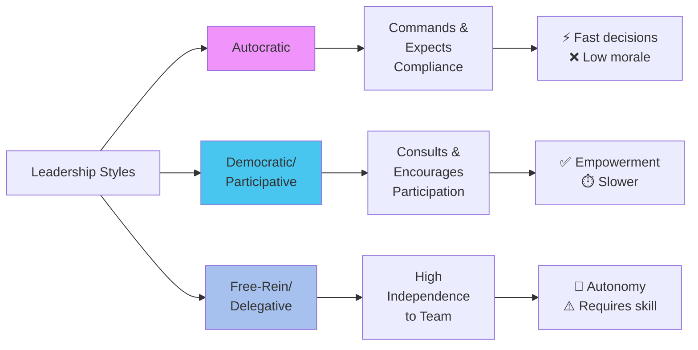

### The Three Styles Explained

| Style | Definition | When to Use | Best For | Risks |
|:------|:----------|:------------|:---------|:------|
| **Autocratic** | Commands, expects compliance; Rewards/punishes | All info with leader; Time is short; Employees motivated | Military, Manufacturing, Construction | Low morale, No creativity |
| **Democratic** | Consults team; Encourages participation; Leader has final say | Leveraging team skills; Building buy-in | Knowledge work, Projects, Strategy | Slower decisions |
| **Free-Rein** | High independence; Team sets goals/methods | Highly skilled team; Self-directed work | R&D, Creative work, Expert teams | Lack of direction |

### Forces Influencing Style Choice

:::info[Situational Factors]
A leader should consider these forces when choosing a style:
:::


- ⏱️ **Time available**
- 🤝 **Relationships:** Respect/trust vs. disrespect
- 📊 **Information:** Where does knowledge reside?
- 🎓 **Training level:** Of both employees and leader
- ⚔️ **Internal conflicts:** Present or absent?
- 😰 **Stress levels**
- 🧩 **Task type:** Structured, unstructured, complex, or simple

---

## 3.2 Likert's Four Systems of Management 🔥🔥🔥

:::warning[CRITICAL EXAM TOPIC]
Rensis Likert's 30 years of research identified four distinct management systems. **System 4 is the MOST EFFECTIVE!**
:::


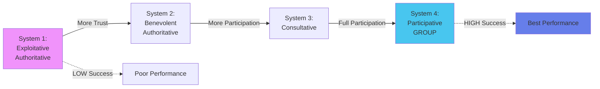

### Comprehensive Comparison

| Characteristic | System 1 | System 2 | System 3 | System 4 |
|:--------------|:---------|:---------|:---------|:---------|
| **Name** | Exploitative Authoritative | Benevolent Authoritative | Consultative | **Participative** |
| **Trust** | **NONE** | Patronizing, condescending | Substantial (not complete) | **Complete trust** |
| **Motivation** | Fear, threats, punishment | Rewards + some fear | Rewards + occasional punishment | **Economic + participation** |
| **Communication** | **Downward ONLY** | Mostly down, limited up | Both up & down | **All directions (↓↑↔)** |
| **Decision-Making** | Top exclusively | Top (limited consult) | Broad policy at top, specifics lower | **Throughout organization** |
| **Control** | Concentrated at top | Some delegation | Moderate delegation | **Widely shared** |
| **Productivity** | Low-Medium | Medium | Good | **EXCELLENT** ⭐ |
| **Satisfaction** | Very Low | Low | Moderate | **HIGH** ⭐ |

:::danger[Exam Tip]
Likert's research CONCLUSIVELY found that **System 4 (Participative)** managers had the GREATEST SUCCESS. Departments using this system were MORE PRODUCTIVE and EFFECTIVE!
:::


**Real-World Examples:**
- **System 1:** Sweatshop factories, Authoritarian regimes
- **System 2:** Traditional family businesses
- **System 3:** Modern corporations with town halls
- **System 4:** Tech startups, Agile teams (IDEAL) ✅

---

## 3.3 The Managerial Grid (Blake & Mouton) 🔥🔥

The Managerial Grid maps leadership styles on two dimensions.

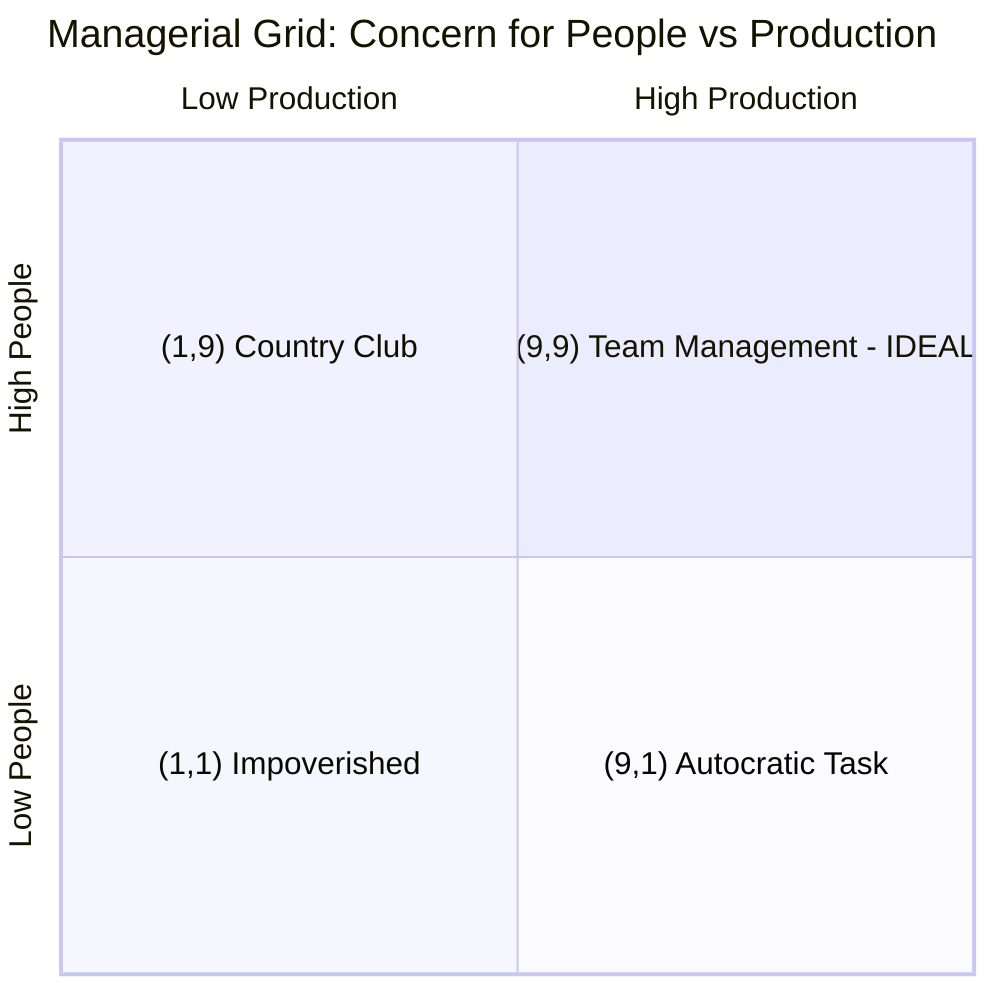

### The Two Axes (1-9 Scale)

1. **Concern for Production (Horizontal)** 📈
   - 1 = Low concern for objectives/efficiency
   - 9 = High concern for production

2. **Concern for People (Vertical)** 👥
   - 1 = Low concern for team needs
   - 9 = High concern for people

### The Five Key Positions

| Position | Name | Style | Characteristics |
|:---------|:-----|:------|:---------------|
| **(1,1)** | Impoverished Management | Abdication | Minimal effort; Avoids responsibility |
| **(1,9)** | Country Club Management | People-First | Comfortable atmosphere; Production secondary |
| **(9,1)** | **AUTOCRATIC TASK** | Production-First | Minimize human interference; Pure efficiency |
| **(5,5)** | Middle of the Road | Balance | Adequate performance; Satisfactory morale |
| **(9,9)** | **TEAM MANAGEMENT** ⭐ | **IDEAL** | **High people + High production; Trust & respect; Common stake** |

:::warning[The (9,9) Advantage]
Team Management achieves goals through COMMITTED people with a \"common stake\" in the organization's purpose, creating relationships of trust and respect!
:::


---

## 3.4 Leadership as a Continuum (Tannenbaum & Schmidt) 🔥

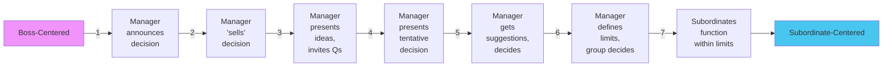

### The Seven Actions (Most to Least Authoritarian)

1. **Manager makes decision and announces it** (MOST Boss-Centered)
2. Manager 'sells' decision
3. Manager presents ideas and invites questions
4. Manager presents tentative decision subject to change
5. Manager presents problem, gets suggestions, makes decision
6. Manager defines limits, asks group to make decision
7. **Manager permits subordinates to function within limits defined by superior** (MOST Subordinate-Centered)

:::info[Continuum Principle]
Leadership is NOT a binary choice between authoritarian and democratic. It's a SPECTRUM of behaviors adapting to the leader, followers, and situation!
:::


---

## 3.5 Comparative Overview of Leadership Models

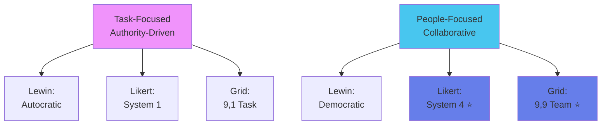

**Key Patterns:**
- **Autocratic Thread:** Lewin's Autocratic = Likert's System 1 = Grid's (9,1)
- **Participative Thread:** Lewin's Democratic = Likert's System 4 = Grid's (9,9)

---

### 🎓 Knowledge Check 3.0

1. Name the three leadership styles identified by Kurt Lewin based on the use of authority.
2. Under which circumstances is an autocratic leadership style most appropriate?
3. **Scenario:** A project manager has a highly skilled and experienced team. She defines the project's final deadline and budget but allows the team to determine how they will accomplish the tasks. Which of Lewin's styles is she using?
4. **True or False:** A democratic leader gives up all final decision-making authority to the group.
5. List three forces that influence which leadership style a manager should use.
6. Who developed the \"Four Systems of Management\" model?
7. Describe the key characteristics of Likert's \"System 1: Exploitative Authoritative\" management style.
8. Which of Likert's four systems was found to be the most effective and productive?
9. What are the two dimensions measured on Blake and Mouton's Managerial Grid?
10. A manager who scores a 9 on \"Concern for People\" and a 1 on \"Concern for Production\" is practicing which style of management according to the grid?
11. What is the coordinate and name for the style on the Managerial Grid that shows a high concern for both people and production?
12. Describe the \"(1,1) Impoverished Management\" style.
13. What is the core concept of the Leadership as a Continuum model by Tannenbaum and Schmidt?
14. On the Leadership Continuum, which action is more \"boss-centered\": presenting a tentative decision subject to change, or asking the group to make a decision within defined limits?
15. List the seven actions on the Tannenbaum and Schmidt leadership continuum, from most to least authoritarian.
16. Compare and contrast Likert's 'Exploitative Authoritative' style with the Managerial Grid's 'AUTOCRATIC TASK MANAGEMENT' style. What are their similarities?
17. How does Likert's \"System 4: Participative\" style relate to Lewin's \"Democratic/Participative\" style?
18. **Scenario:** A manager says, \"I trust my team to do their jobs, but I still want to approve all major decisions before they are implemented.\" Which of Likert's systems does this most closely resemble?
19. Describe the leadership style of a manager who has a score of (5,5) on the Managerial Grid.
20. In the Leadership Continuum model, what does it mean for a manager to \"'sell' a decision\"?

---

# 4.0 Understanding and Applying Motivation 🚀

:::info[Motivation]
**Motivation** is the inner state that energizes, activates, and directs human behavior toward goals. It's the DRIVING FORCE behind every action.
:::


## 4.1 Core Concepts

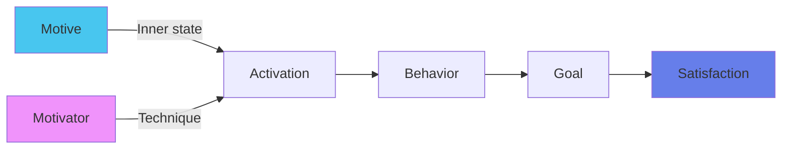

**The Four Key Terms:**
- **Motive:** Inner state that energizes and directs behavior
- **Motivator:** The technique used to motivate people
- **Motivation:** The drive to satisfy a want or goal
- **Satisfaction:** Contentment when a want is satisfied

:::info[The Success Formula]
**Ability** = What you're capable of doing
**Motivation** = What you do
**Attitude** = How well you do it
:::


---

## 4.2 Maslow's Hierarchy of Needs 🔥🔥🔥

:::warning[CRITICAL - High-Frequency Exam Topic]
Abraham Maslow's hierarchy is FOUNDATIONAL to understanding motivation. As each need is **substantially satisfied**, the next level becomes the dominant driver!
:::


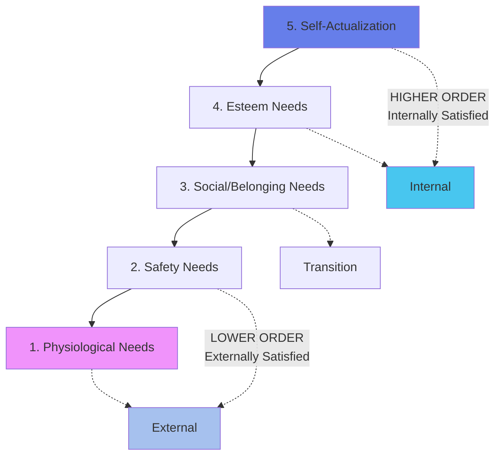

### The Five Levels

| Level | Need | Definition | How Organizations Address It |
|:------|:-----|:-----------|:-----------------------------|
| **1. Physiological** 🍎 | Survival | Air, water, food, shelter | Adequate salary, work breaks, safe conditions |
| **2. Safety** 🛡️ | Security | Security, employment, health, property | Job security, medical insurance, sick pay, pensions |
| **3. Social** 👥 | Belonging | Friendship, intimacy, family, connection | Team interactions, parties, picnics, sports teams |
| **4. Esteem** 🏆 | Respect | Self-esteem, status, recognition, freedom | Merit raises, recognition, challenging tasks, participation |
| **5. Self-Actualization** 🌟 | Potential | Achieving one's full potential | Skill development, creativity, promotions, job control |

### Critical Distinction

| Category | Levels | Satisfied... | Examples |
|:---------|:-------|:------------|:---------|
| **Lower-Order** | Physiological, Safety | **EXTERNALLY** (by organization) | Salary, Benefits |
| **Higher-Order** | Social, Esteem, Self-Actualization | **INTERNALLY** (by individual) | Achievement, Growth |

:::danger[Exam Tip]
Know which level each need belongs to! Questions often ask: \"How does an organization address Esteem needs?\" Answer: Merit raises, recognition, participation!
:::


---

## 4.3 Herzberg's Two-Factor Theory 🔥🔥🔥

:::info[The Revolutionary Insight]
Job satisfaction and dissatisfaction are NOT opposite ends of one spectrum—they're caused by TWO SEPARATE, MUTUALLY EXCLUSIVE factors!
:::


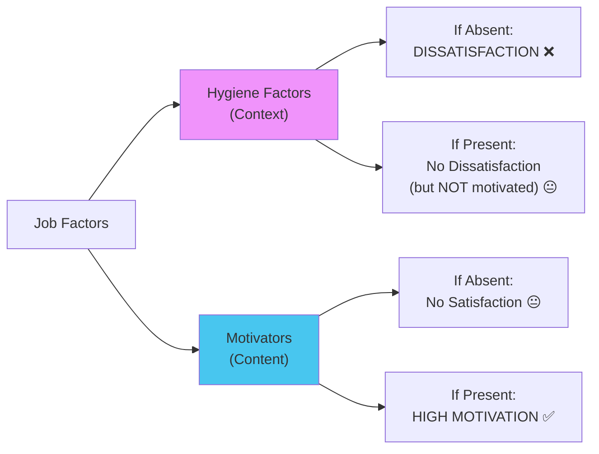

### The Two Factor Lists

| Dissatisfiers (Hygiene Factors) | Satisfiers (Motivators) |
|:--------------------------------|:------------------------|
| **Purpose:** PREVENT dissatisfaction | **Purpose:** CREATE satisfaction |
| **Related to:** Job CONTEXT (environment) | **Related to:** Job CONTENT (the work) |
| • Salary 💰 | • Performance & achievement 🏆 |
| • Working conditions | • Recognition 🌟 |
| • Physical workspace | • Job status |
| • Relationship with colleagues | • Responsibility 📋 |
| • Relationship with supervisor | • Opportunities for advancement 📈 |
| • Quality of supervisor | • Personal growth 🌱 |
| • Policies and rules | • The work itself ❤️ |

:::warning[The Salary Paradox]
**SALARY IS A HYGIENE FACTOR!**
- Low salary → Dissatisfaction ✅
- High salary → No dissatisfaction, but DOESN'T motivate long-term ❌

**What TRULY motivates:** Recognition, challenging work, growth, responsibility!
:::


**Managerial Implication:**
- Provide good pay & conditions (hygiene) → Prevents dissatisfaction
- Focus on motivators → Creates TRUE satisfaction and motivation

---

## 4.4 McGregor's Theory X and Theory Y 🔥🔥🔥

:::warning[CRITICAL CONCEPT]
Douglas McGregor identified TWO contrasting assumptions managers hold about employees. These assumptions SHAPE how managers lead!
:::


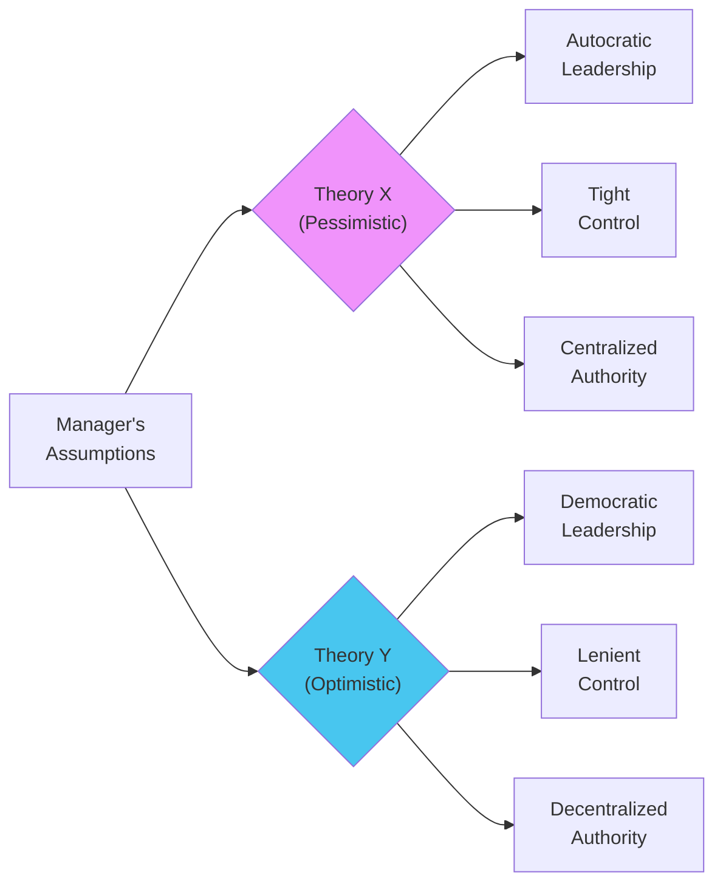

### Theory Comparison

| Basis | Theory X (Pessimistic View) | Theory Y (Optimistic View) |
|:------|:---------------------------|:---------------------------|
| **Meaning** | High supervision & control; Centralized | Self-directed & motivated; Participation |
| **View of Work** | Employees intrinsically **DISLIKE** work | Work is **NATURAL** for employees |
| **Ambition** | Little to NO ambition | **Highly ambitious** |
| **Responsibility** | **AVOID** responsibility | **ACCEPT & SEEK** responsibility |
| **Leadership Style** | **Autocratic** | **Democratic** |
| **Direction** | **Constant** direction required | **Little/no** direction needed |
| **Control** | **Tight** | **Lenient** |
| **Authority** | **Centralized** | **Decentralized** |
| **Self-Motivation** | **ABSENT** | **PRESENT** |
| **Maslow Link** | Focuses on Physiological & Safety (lower) | Focuses on Social, Esteem, Self-Actualization (higher) |

:::danger[Theory X vs Y Maslow Connection]
- **Theory X** managers assume employees driven by LOWER needs (Physiological, Safety) → Need external control
- **Theory Y** managers assume employees driven by HIGHER needs (Social, Esteem, Self-Actualization) → Allow self-direction
:::


---

## 4.5 Comparative Analysis: Linking the Theories

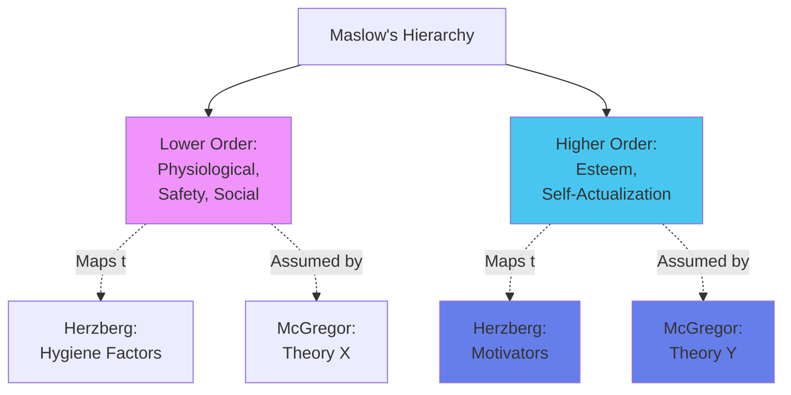

**The Interconnections:**
1. **Maslow ↔ Herzberg:**
   - Herzberg's **Hygiene Factors** = Maslow's **Lower Order** (Physiological, Safety, Social)
   - Herzberg's **Motivators** = Maslow's **Higher Order** (Esteem, Self-Actualization)

2. **Maslow ↔ McGregor:**
   - **Theory X** assumes lower-level needs dominate
   - **Theory Y** assumes higher-level needs drive behavior

---

## 4.6 Practical Motivational Techniques

### ✅ Positive Techniques (Use These!)

- Praise workers and give credit for good work
- Take sincere interest in subordinates as individuals
- Promote healthy competition
- Develop pride in workplace
- Delegate substantial responsibility
- Fix fair wages and monetary incentives
- Formulate suggestion systems
- Provide growth and promotion opportunities

### ❌ Negative Techniques (Use Sparingly!)

- Reprimanding employees
- Demotion
- Lay-offs
- Discharge

:::info[The Mark of Skill]
A skillful manager finds the proper PROPORTION of positive and negative techniques!
:::


### 🎯 Special Motivational Techniques

1. **Money** 💰
   - Economists/managers rank high
   - Behavioral scientists rank lower as pure motivator
   - Remember: It's mostly a HYGIENE factor!

2. **Positive Reinforcement** ⭐
   - Reward desired behavior to encourage repetition

3. **Job Enrichment** 📈
   - Make jobs MORE CHALLENGING
   - Increase responsibility and growth opportunities

4. **Participation** 🤝
   - Involve employees in decision-making
   - Especially on matters affecting their work

---

### 🎓 Knowledge Check 4.0

1. Define the terms: Motive, Motivator, Motivation, and Satisfaction.
2. According to the text, what is the relationship between Ability, Motivation, and Attitude?
3. List the five levels of Maslow's Hierarchy of Needs in order from lowest to highest.
4. What is the core principle of Maslow's theory regarding how needs are satisfied?
5. How do organizations typically address an employee's \"Esteem Needs\"?
6. Explain Herzberg's Two-Factor Theory in your own words.
7. According to Herzberg, what is the result of improving \"Hygiene Factors\" like salary and working conditions? a) Increased job satisfaction b) Decreased job dissatisfaction c) Both a and b d) No change
8. List four examples of \"Satisfiers (Motivators)\" from Herzberg's theory.
9. List four examples of \"Dissatisfiers (Hygiene Factors)\" from Herzberg's theory.
10. What are the two contrasting sets of managerial assumptions in McGregor's theories called?
11. A manager who believes employees are highly ambitious and seek responsibility aligns with which of McGregor's theories?
12. What leadership style is associated with Theory X?
13. How do Herzberg's 'Hygiene Factors' relate to Maslow's Hierarchy of Needs?
14. Which of Maslow's needs do Herzberg's 'Motivators' correspond to?
15. A Theory Y manager would focus on satisfying which levels of Maslow's hierarchy in their employees?
16. List five \"Positive Motivational Techniques\" a manager can use.
17. What are two examples of \"Negative Motivational Techniques\"?
18. List the four \"Special Motivational Techniques\" mentioned in the text.
19. **True or False:** According to behavioral scientists, money is the most powerful motivator.
20. What is \"job enrichment\"?
21. A manager who believes in McGregor's Theory Y would likely use which motivational techniques? Explain your reasoning.
22. **Scenario:** An employee has a secure job with good pay and benefits but feels bored and unappreciated. According to Herzberg, what is this employee lacking?
23. Why is \"participation\" considered a special motivational technique?
24. **Short Answer:** Compare the assumptions of a Theory X manager with those of a Theory Y manager regarding employee responsibility.
25. Explain the difference between an externally satisfied need and an internally satisfied need, providing an example of each from Maslow's hierarchy.

---

# 5.0 Groups, Teams & Collective Dynamics 👥

## 5.1 Understanding Groups and Committees

:::info[Group]
A social unit with interaction, communication, different roles, and shared norms.
:::


### Key Characteristics

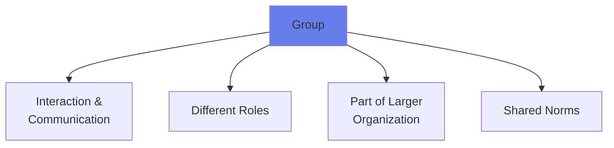

1. Require **interaction and communication** among members
2. Members assume **different roles** (designing, selling, producing)
3. Usually part of a **larger group or organization**
4. Develop **norms** (expected standards of behavior)

### Functions and Advantages

| Advantage | Explanation |
|:----------|:-----------|
| **Behavioral Change** | Powerful in changing behavior and disciplining members |
| **Social Satisfaction** | Provide belonging and connection |
| **Communication** | Promote communication across diverse backgrounds |
| **Motivation** | Enhance motivation through participative goal-setting |

### Disadvantages (Especially Committees)

- ⏱️ **Costly** in terms of employee time
- 🤔 **Indecision** or weak compromises
- ⚠️ **Diffused responsibility**

---

## 5.2 Building High-Performance Teams 🔥

:::info[Team]
\"A small number of people with complementary skills who are committed to a common purpose, set of performance goals, and approach for which they hold themselves mutually accountable.\"
:::


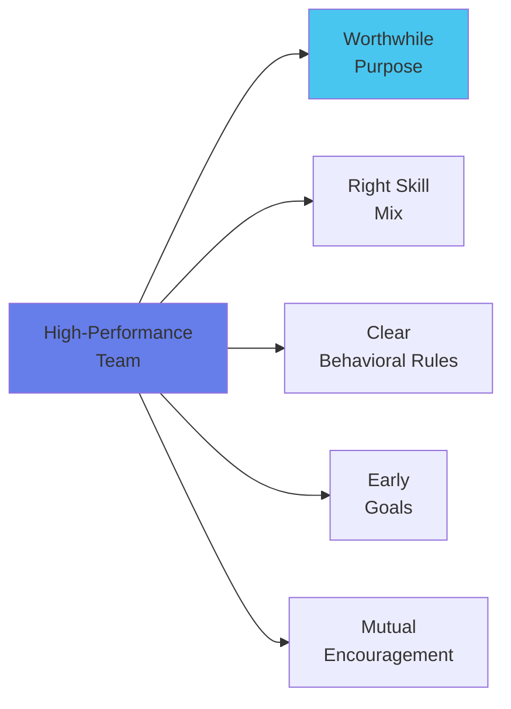

### Five Building Principles

1. **Worthwhile Purpose** 🎯
   - Team members must believe the purpose is meaningful and urgent

2. **Complementary Skill Mix** 🛠️
   - **Functional/Technical Skills**
   - **Problem-Solving & Decision-Making Skills**
   - **Human Relations Skills**

3. **Clear Behavioral Rules** 📋
   - Regular attendance
   - Confidentiality
   - Fact-based discussions

4. **Early Goal Identification** 🏁
   - Set goals and tasks early in formation

5. **Mutual Encouragement** 🌟
   - Recognition, positive feedback, rewards

---

## 5.3 Modern Team Concepts

- **Self-Managing Team:** Group with various skills to carry out relatively complete tasks independently
- **Virtual Management:** Running teams not in same location, may not report to same manager, may not work for same organization

:::info[Team vs. Group]
While all teams are groups, not all groups are teams. Teams have:
- Mutual accountability
- Shared commitment
- Common purpose
- Complementary skills
:::


---

### 🎓 Knowledge Check 5.0

1. What are the four key characteristics of a group?
2. List three functions or advantages of using groups in an organization.
3. According to the text, what are two potential disadvantages of committees?
4. Provide the definition of a team as stated in the source material.
5. What are the three types of skills needed for an effective team?
6. **True or False:** A self-managing team is one where members are all in different physical locations.
7. What is \"virtual management\"?
8. **Short Answer:** Explain the importance of a team having a \"worthwhile, meaningful, and urgent\" purpose.
9. Why should behavioral rules be established early in a team's formation?
10. How is a team different from a group, based on the definitions provided?

---

# 6.0 The Managerial Role of Communication 📡

:::info[Communication's Central Role]
Communication is the ESSENTIAL LINK integrating ALL managerial functions: Planning, Organizing, Staffing, Leading, Controlling.
:::


## 6.1 The Communication Process Model 🔥🔥

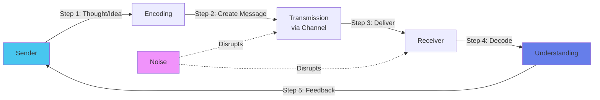

### The Six Steps

1. **Sender** → Has a thought/idea
2. **Encoding** → Converts thought into message (words, symbols)
3. **Transmission** → Sends via channel (memo, email, phone, face-to-face)
4. **Receiver** → Gets the message
5. **Decoding** → Interprets meaning (depends on knowledge, experience, relationship)
6. **Understanding** → Receiver comprehends as sender intended

**Critical Components:**
- **Feedback:** Receiver's response (verbal/non-verbal) confirming receipt/understanding
- **Noise:** ANYTHING that disrupts communication

### Types of Noise

| Type | Examples |
|:-----|:---------|
| **Physical** | Loud environment, poor connection |
| **Physiological** | Hearing impairment, fatigue |
| **Psychological** | Prejudice, anxiety, emotions |
| **Semantic** | Language/word choice issues |
| **Technical** | Equipment failure, software glitches |
| **Organizational** | Rigid hierarchy, poor structure |
| **Cultural** | Different norms, values |

---

## 6.2 Channels and Flows of Communication 🔥

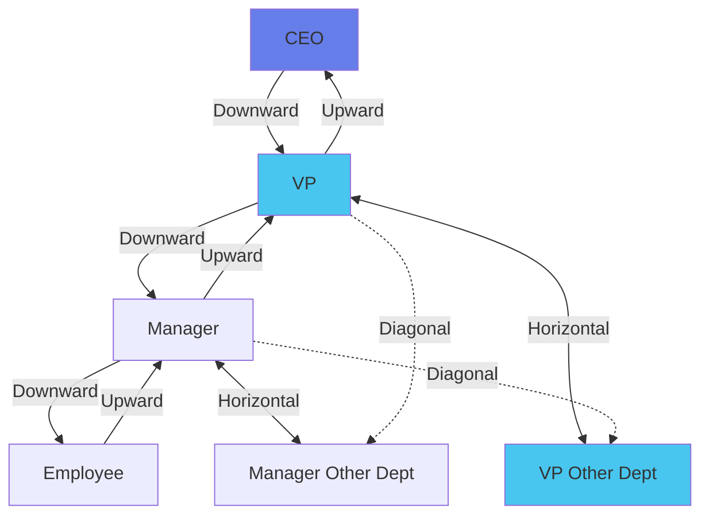

### Communication Types

| Type | Definition | Example | Pros/Cons |
|:-----|:-----------|:--------|:----------|
| **Formal** | Official procedure for info flow | Memos, conferences, official emails | Documented, structured |
| **Informal** | Outside recognized system | Grapevine, casual chats | Fast but potentially inaccurate |

### Informal Chain Types

- **Single Strand:** Each person → Next person in sequence
- **Cluster:** Person receives info → Chooses who to tell
- **Probability:** Random individual → Random individual

### Directional Flows

| Flow | Definition | When Used |
|:-----|:-----------|:----------|
| **Downward** | Higher → Lower levels | Common in authoritarian; Can be slow/distorted |
| **Upward** | Lower → Higher levels | Feedback, suggestions |
| **Horizontal** | Same level, different departments | Coordination (HR ↔ Sales) |
| **Diagonal** | Different levels, no direct reporting | Speed up communication |

---

## 6.3 Communication Modes

### Written Communication ✍️

**Advantages:**
- Provides records and references
- Legal defense
- Careful planning possible
- Reaches large audiences

**Disadvantages:**
- Excess paperwork
- Poorly expressed messages
- Lacks immediate feedback

### Oral Communication 🗣️

**Advantages:**
- Speedy interchange
- Immediate feedback
- Questions and clarification

**Disadvantages:**
- No permanent record
- Can be misinterpreted

### Non-Verbal Communication 🤝

- Facial expressions, body gestures
- Should REINFORCE verbal message
- Can contradict verbal (mixed signals)

---

## 6.4 Barriers to Effective Communication 🔥

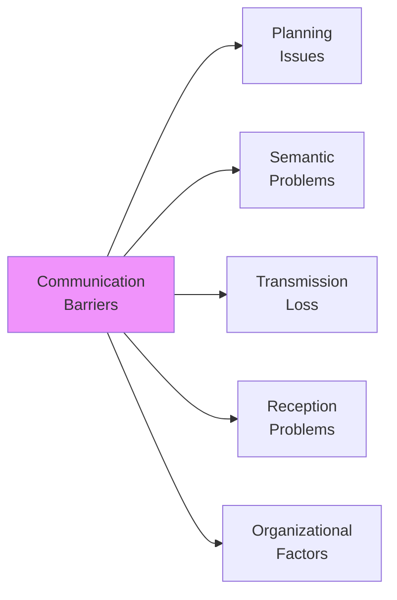

**Common Barriers:**
- ❌ Lack of planning
- ❌ Un-clarified assumptions
- ❌ Semantic distortion (\"we sell for less\" - less than what?)
- ❌ Poorly expressed messages
- ❌ Loss by transmission (info lost in channels)
- ❌ Poor retention by receiver
- ❌ Poor listening and premature evaluation
- ❌ Distrust, threat, and fear
- ❌ Insufficient time for adjustment to change
- ❌ Information overload
- ❌ Selective perception
- ❌ Attitude influence
- ❌ Differences in status and power
- ❌ Too many organizational levels

---

## 6.5 Strategies for Improving Communication

### For Senders

:::warning[Sender Guidelines]
:::


1. **Clarify** in your mind what you want to communicate
2. Use **familiar symbols** (words/language)
3. **Consider receiver needs** when planning
4. **Pay attention** to tone and language
5. Remember **emotions matter** in relationships
6. **Seek feedback** to ensure understanding

### Guidelines for Effective Listening 🎧

:::info[Listening is the KEY to Understanding]
:::


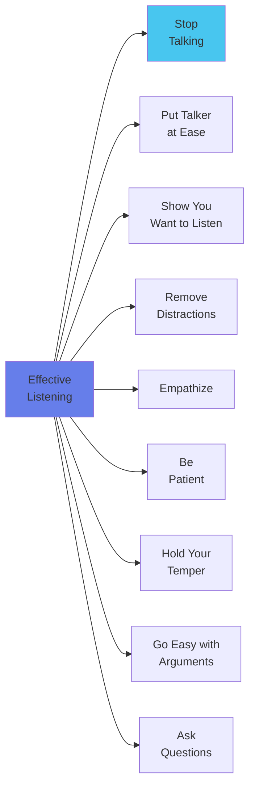

**The 9 Listening Principles:**
1. **Stop talking** (can't listen while talking!)
2. **Put the talker at ease**
3. **Show you want to listen** (look, act interested)
4. **Remove distractions** (close door, focus)
5. **Empathize** with the talker
6. **Be patient** (allow time, don't interrupt)
7. **Hold your temper** (angry ≠ rational)
8. **Go easy with arguments** (avoid defensiveness)
9. **Ask questions** (clarify understanding)

---

### 🎓 Knowledge Check 6.0

1. Why is communication considered essential for the internal functioning of an organization?
2. Describe the communication process from sender to receiver, including the role of feedback and noise.
3. List three different types of \"noise\" that can disrupt communication.
4. What is the difference between formal and informal communication?
5. An email from a department head to their entire team is an example of what type and flow of communication?
6. A conversation between the marketing manager and the finance manager is an example of ______ communication.
7. What is diagonal communication and why is it used?
8. List two advantages and two disadvantages of written communication.
9. What is the primary advantage of oral communication?
10. How can non-verbal communication contradict a verbal message?
11. List five common barriers to effective communication.
12. What is \"semantic distortion\"?
13. **True or False:** Information overload can be a barrier to communication.
14. What is the first thing a sender must do to improve their communication?
15. \"Listening is the key to ______.\"
16. List five guidelines for effective listening.
17. Why is it important for a listener to \"remove distractions\"?
18. **Scenario:** A manager sends a long, technical email to a non-technical team late on a Friday afternoon. What communication barriers might be at play?
19. Explain the \"cluster\" chain of informal communication.
20. Why is feedback a critical part of the communication process?

---

# 7.0 The Managerial Function of Controlling 📊

:::info[Controlling]
The managerial function of **measuring and correcting performance** to ensure enterprise objectives and plans are being achieved.
:::


## 7.1 The 8-Step Control Process 🔥🔥🔥

:::warning[CRITICAL EXAM TOPIC]
This systematic process identifies and corrects deviations from plans.
:::


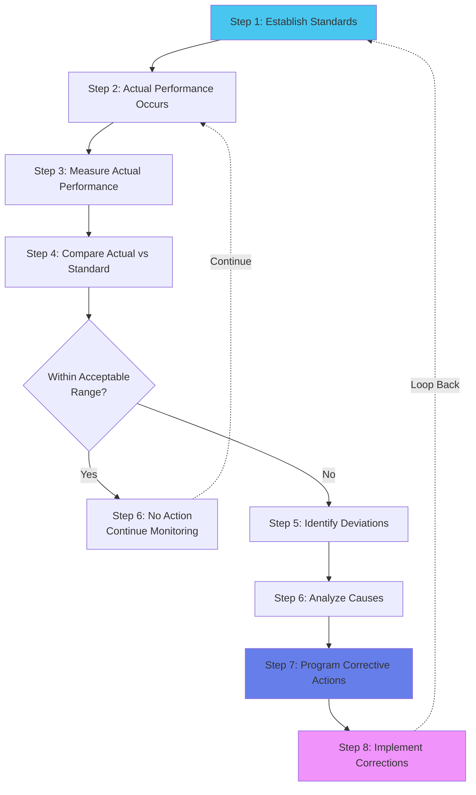

### The Eight Steps Explained

1. **Establishment of Standards** → Set performance benchmarks
2. **Actual Performance** → Work happens
3. **Measurement** → Collect performance data
4. **Comparison** → Actual vs. Standard
5. **Identify Deviations** → Find gaps
6. **Analyze Causes** → Why did deviations occur?
7. **Program Corrective Actions** → Plan fixes
8. **Implement Corrections** → Execute solutions

---

## 7.2 Types of Performance Standards

:::info[Standard]
A unit of measurement serving as a reference point for evaluating results.
:::


| Type | Focus | Examples |
|:-----|:------|:---------|
| **Physical** | Non-monetary measurements | Units produced, defect rate |
| **Monetary** | Financial terms | Cost per unit, ROI, budget variance |
| **Time** | Deadlines, durations | Delivery time, cycle time |
| **Technical** | Specifications, quality | Quality standards, technical specs |
| **Managerial** | Manager performance | Leadership effectiveness, team productivity |

---

## 7.3 Types of Control by Timing 🔥🔥🔥

:::info[Input → Process → Output Model]
Controls can be applied at different stages!
:::


```mermaid
timeline
    title Control Types Across the Process
    section Input Stage
      Feedforward Control : Proactive : Anticipates problems BEFORE they occur
    section Process Stage
      Concurrent Control : Real-time : Corrects problems AS they happen
    section Output Stage
      Feedback Control : Reactive : Corrects problems AFTER they occur
```

### A. Feedforward Control (BEFORE)

**Focus:** **INPUTS**
**Nature:** **PROACTIVE** - Prevents problems

**Examples:**
- Market research **before** production
- Thorough selection **before** hiring
- Order components **before** launch
- Study PYQs **before** exam

**Keywords:** "Proactively," "In anticipation of," "Preventive measures"

### B. Concurrent Control (DURING)

**Focus:** **PROCESS**
**Nature:** **REAL-TIME** - Immediate correction

**Examples:**
- Real-time monitoring detects defects → **immediately halts** production line
- Supervisor listens to calls, intervenes if needed
- Anesthesiologist monitors vitals **during** surgery, adjusts dosage
- DevOps monitors server **during** deployment

**Keywords:** "During," "Real-time monitoring," "Immediately halts," "While in progress"

### C. Feedback Control (AFTER)

**Focus:** **OUTPUTS**
**Nature:** **REACTIVE** - Guides future performance

**Examples:**
- **After** launch, analyze customer feedback → Update **next** iteration
- Quarterly P&L shows overruns → Adjust **next** quarter
- Review mistakes **after** exam → Study for **next** test
- Post-mortem meeting → Document lessons learned

**Keywords:** "After," "Analyzed feedback," "Post-mortem," "For the next," "Lessons learned"

### Comparison

| Aspect | Feedforward | Concurrent | Feedback |
|:-------|:-----------|:-----------|:---------|
| **Timing** | BEFORE | DURING | AFTER |
| **Focus** | Inputs | Process | Outputs |
| **Nature** | Preventive | Corrective (immediate) | Corrective (future) |
| **Cost** | Low (prevents waste) | Medium | High (damage done) |
| **Desirability** | **MOST DESIRABLE** ⭐ | Desirable | Necessary but reactive |

---

## 7.4 Management Control Techniques

### 7.4.1 Budgetary Controls 🔥

:::info[Budget]
A single-use plan detailing resources (usually financial) required for an activity.
:::


**Budgetary Control:** Comparing actual results with budget to approve accomplishments or correct differences.

#### Types of Budgets

- **Financial Budgets:** Cash flow, capital expenditure, balance sheet
- **Operating Budgets:** Sales, expense, profit
- **Non-monetary Budgets:** Labor hours, production units, space

#### Dangers in Budgeting

| Danger | Description |
|:-------|:-----------|
| **Over-budgeting** | Too much detail → Reduces managerial freedom |
| **Inflexibility** | Rigid adherence → Stifles adjustments |
| **Hiding inefficiency** | Can cover up poor performance |

#### Special Budget Types

**Variable/Flexible Budgets:**
- Change as output/sales volume varies
- More realistic than fixed budgets

**Zero-Based Budgeting (ZBB):**
- Calculate costs from zero for each period
- Avoids incremental changes to previous budgets

---

### 7.4.2 Non-Budgetary Control Techniques

1. **Statistical Data** 📊
   - Charts, graphs showing trends
   - Allows extrapolation

2. **Special Reports & Analysis** 📄
   - In-depth investigations
   - When routine reports inadequate

3. **Operational Audit** 🔍
   - Regular, independent appraisal
   - By internal auditors

4. **Personal Observation** 👀
   - "Managing by Walking Around"
   - Direct observation of operations

---

### 7.4.3 Network Techniques 🔥

```mermaid
graph LR
    A[Project\nManagement] --> B[PERT]
    A --> C[CPM]
    A --> D[Gantt Chart]
    
    B --> B1["Probabilistic\n(3 time estimates)"]
    C --> C1["Deterministic\n(Critical Path)"]
    D --> D1["Visual\nBar Chart"]
    
    style B fill:#48c6ef
    style C fill:#667eea
    style D fill:#f093fb
```

| Technique | Type | Key Feature | Use Case |
|:----------|:-----|:-----------|:---------|
| **PERT** | Probabilistic | 3 time estimates (optimistic, pessimistic, most likely) | Uncertain projects |
| **CPM** | Deterministic | Identifies critical path | Fixed-time projects |
| **Gantt Chart** | Visual | Bar chart of schedule | Simple project visualization |

---

## 7.5 Overall Control 🔥

:::info[Purpose of Overall Controls]
Measure total accomplishments of enterprise or major divisions.
:::


**Three Reasons Needed:**
1. Align with overall enterprise goals
2. Manage decentralized units
3. Measure integrated effort of area manager

### Three Primary Overall Control Devices

#### 1. Budget Summaries & Reports

- Resume of all individual budgets
- Reflects company-wide performance
- Metrics: Sales, costs, profits, ROI

#### 2. Profit and Loss (P&L) Control

- Uses income statement to measure division performance
- Standard: Expected profit

**Limitations:**
- High cost of intra-company accounting
- Risk of unhealthy inter-division competition

#### 3. Return on Investment (ROI) Control

:::info[ROI Formula]
$$\text{ROI} = \frac{\text{Earnings}}{\text{Capital Invested}} \times 100\%$$
:::


**Advantages:**
- Focuses on capital efficiency
- Provides comparison basis

**Limitations:**
- Over-preoccupation with financial factors
- Difficulty determining "reasonable" return

---

## 7.6 Direct vs. Preventive Control

```mermaid
graph LR
    A[Control\nApproaches] --> B[Direct Control]
    A --> C[Preventive Control]
    
    B --> B1["React AFTER\ndeviations"]
    B --> B2["Trace to\nresponsible person"]
    
    C --> C1["Prevent BEFORE\ndeviations"]
    C --> C2["Develop qualified\nmanagers"]
    
    style B fill:#f093fb
    style C fill:#48c6ef
```

### Direct Control

- Reacts to deviations **AFTER** they occur
- Traces cause to person responsible
- Person corrects actions

### Preventive Control

- Prevents deviations **BEFORE** they happen
- Develops highly qualified managers
- Skillful managers make fewer errors

:::info[Principle of Preventive Control]
\"The higher the quality of managers and their subordinates, the less will be the need for direct control.\"
:::


**Advantages:**
- Encourages self-control
- Higher accuracy in responsibility assignment
- Lightens managerial burden

---

### 🎓 Knowledge Check 7.0

1. Define the managerial function of \"controlling.\"
2. Why are planning and controlling considered to be closely related?
3. List the first four steps in the control process.
4. What is a \"standard\" in the context of control?
5. Name the five types of performance standards mentioned in the text.
6. Explain the difference between feedforward, concurrent, and feedback control.
7. Which type of control corrects problems _as they happen_?
8. What is \"budgetary control\"?
9. List the three main categories of budgets (Financial, Operating, Non-monetary).
10. What is \"Zero-Based Budgeting,\" and how does it differ from traditional budgeting?
11. Describe two dangers associated with budgeting.
12. What is the main benefit of a \"Variable/Flexible Budget\"?
13. List the four non-budgetary control techniques.
14. What is another name for \"personal observation\" as a control technique?
15. What is the key difference between PERT and CPM?
16. Which network technique is described as a \"probabilistic model\"?
17. What is the primary function of a Gantt Chart?
18. What are the three primary reasons for using \"overall controls\"?
19. Name the three main \"overall control devices.\"
20. How is a \"budget summary\" used as an overall control tool?
21. What is the basic premise of \"Profit and Loss Control\" when applied to a division?
22. List two limitations of using P&L control.
23. How is Return on Investment (ROI) defined?
24. What is one major advantage and one major limitation of using ROI as a control device?
25. Explain the difference between Direct Control and Preventive Control.
26. What is the \"Principle of Preventive Control\"?
27. List two advantages of applying the principle of preventive control.
28. **Scenario:** A car manufacturer inspects tires for defects before they are installed on new vehicles. What type of control (by timing) is this?
29. **Scenario:** A company uses its quarterly income statement to evaluate the performance of its North American and European divisions. What type of overall control device is being used?
30. **Analytical Question:** Explain the limitations of using Return on Investment (ROI) as an overall control device.

---

:::note[Module 5.1 Complete! 🎉]

**You've Mastered:**
- ✅ 4 Leadership Theory Frameworks (Lewin, Likert, Blake & Mouton, Continuum)
- ✅ 3 Major Motivation Theories (Maslow, Herzberg, McGregor)
- ✅ Communication Process & Barriers
- ✅ 8-Step Control Process & 3 Control Types
- ✅ 12 Mermaid Diagrams for Visual Learning
- ✅ 80+ Knowledge Check Questions

**Next Steps:**
1. Review all Mermaid diagrams (visual memory!)
2. Practice identifying leadership styles from scenarios
3. Master the motivation theory interconnections
4. Memorize control types keywords (before/during/after)

**Exam Strategy:**
- Likert System 4, Herzberg, Maslow are 🔥🔥🔥 priority
- Control types appear in 70% of case studies
- Communication barriers frequently tested

**Trust your preparation! 💪**
:::


---

**Navigation:**
- **Module 5 - Leading & Motivation** - Original core module
- **Module 6 - Controlling Process** - Deep dive into controlling
- **Module 8 - Complete Topic Overview & Quick Reference** - Final review guide
- **00 - EOM Study Master Guide** - Overall strategy