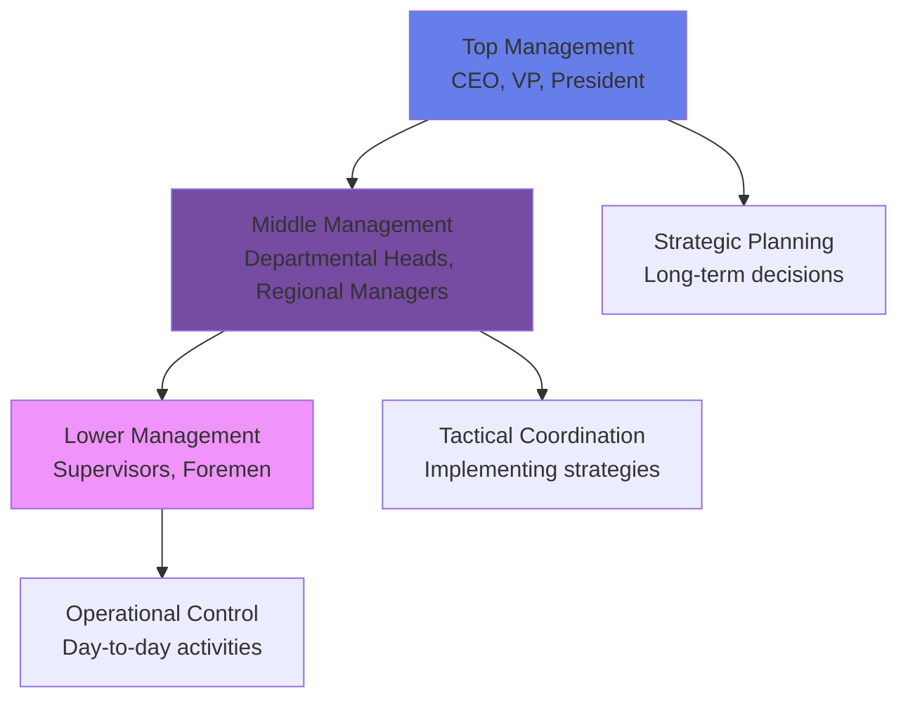
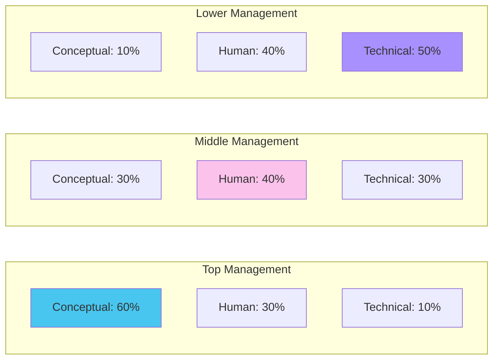
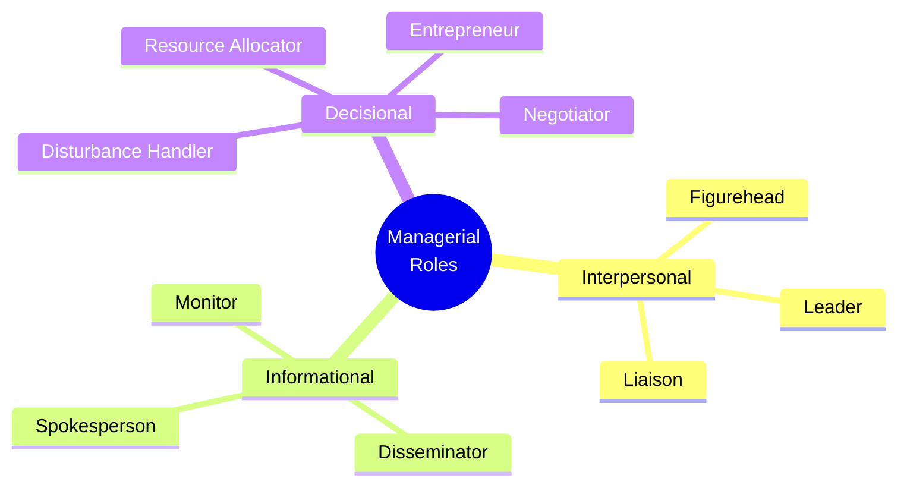
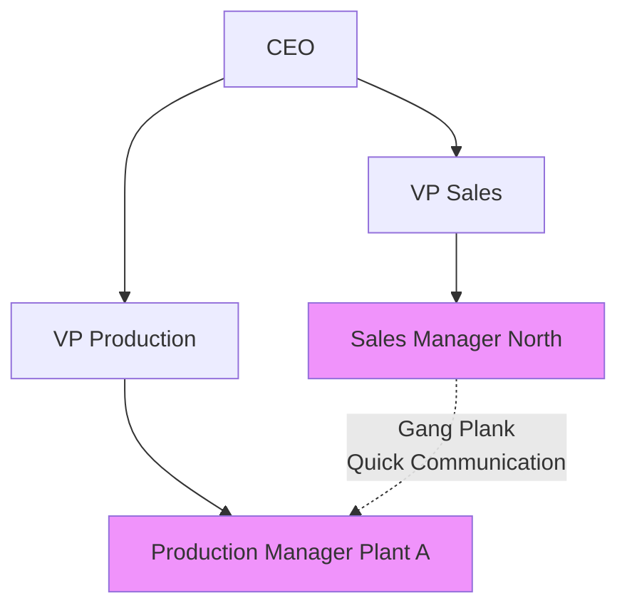
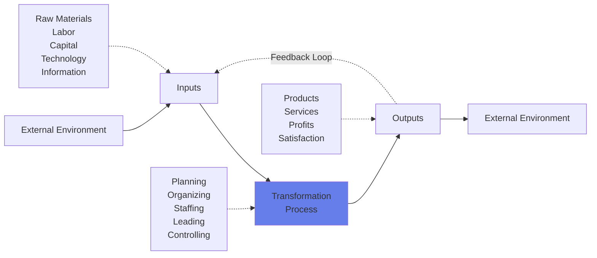

# Module 1: Foundations of Management 🏛️

:::tip[Learning Objectives]
By the end of this module, you will be able to:
1. **Define** Management and distinguish organizational levels
2. **Master** Mintzberg's 10 Managerial Roles (High-frequency exam topic)
3. **Analyze** Fayol's 14 Principles with case applications
4. **Evaluate** the Systems Approach and Managerial Ethics
5. **Compare** Japanese vs American management practices
:::

---

## 1.1 Core Concepts of Management

:::info[Management]
**Management** is the process of designing and maintaining an environment in which individuals, working together in groups, efficiently accomplish selected aims.

- **Effectiveness:** Doing the right things (Goal achievement)
- **Efficiency:** Doing things right (Resource optimization)
:::

### Industry vs Business

| Term | Definition | Example |
|:-----|:-----------|:--------|
| **Industry** | A group of companies producing similar goods/services | Automotive Industry |
| **Business** | A specific entity within an industry | Tesla (in Automotive Industry) |

### The Three Levels of Management

---

## 1.2 The Katz Model: Managerial Skills

:::info[Three Essential Skills]
Robert Katz identified three critical skill sets that vary in importance across management levels.
:::

| Skill | Definition | Example |
|:------|:-----------|:--------|
| **Technical** | Knowledge of specific processes/techniques | Programming, Accounting, Machine operation |
| **Human** | Ability to work with people | Communication, Empathy, Conflict resolution |
| **Conceptual** | Seeing the organization as a whole | Strategic thinking, Pattern recognition, Big-picture vision |

:::danger[Common Exam Question]
"Which skill is the top priority for a newly joined CEO?"
**Answer:** **Conceptual Skill** - CEO must visualize long-term strategy, understand the competitive landscape, and see how different departments interconnect.
:::

---

## 1.3 Henry Mintzberg's 10 Managerial Roles ⭐

:::warning[Critical Exam Topic]
This appears in **almost every exam**. You must memorize the **category** and **specific role** for each activity.
:::

### The Three Categories

### A. Interpersonal Roles (Relationships)

:::info[Figurehead]
**Definition:** Symbolic head performing routine duties of legal/social nature.
**Keywords:** Ceremonial, ribbon-cutting, greeting visitors, signing legal documents.
**Example:** A sales manager takes an important customer to lunch.
:::

:::info[Leader]
**Definition:** Responsible for motivation and direction of subordinates.
**Keywords:** Hiring, training, motivating, encouraging, disciplining.
**Example:** Manager shows an employee how to fill out a form.
:::

:::info[Liaison]
**Definition:** Maintains network of outside contacts for information exchange.
**Keywords:** Networking, external contacts, industry peers, professional associations.
**Example:** Manager cultivates contacts with peers in competing firms for market intelligence.
:::

### B. Informational Roles (Data Processing)

:::info[Monitor]
**Definition:** Scans environment for information; serves as nerve center.
**Keywords:** Reading reports, industry research, market scanning.
**Example:** Manager reads the newspaper in the morning; browses trade journals.
:::

:::info[Disseminator]
**Definition:** Transmits privileged information to subordinates.
**Keywords:** Sharing insights, relaying external info downward.
**Example:** Manager shares insights from a conference with the team.
:::

:::info[Spokesperson]
**Definition:** Transmits information to outsiders.
**Keywords:** Media, shareholders, public relations, board meetings.
**Example:** CEO presents quarterly results to shareholders.
:::

### C. Decisional Roles (Making Choices)

:::info[Entrepreneur]
**Definition:** Seeks opportunities and initiates improvement projects.
**Keywords:** Innovation, new projects, voluntary change.
**Example:** CEO launches a new product line after identifying market gap.
:::

:::info[Disturbance Handler]
**Definition:** Takes corrective action during crises.
**Keywords:** Problem-solving, crisis management, unexpected situations.
**Example:** Manager responds to supplier strike or customer complaint.
:::

:::info[Resource Allocator]
**Definition:** Decides who gets what resources.
**Keywords:** Budgeting, scheduling, authorizing expenditures.
**Example:** Manager discusses funding allocation for a new machine.
:::

:::info[Negotiator]
**Definition:** Represents organization in major negotiations.
**Keywords:** Contracts, unions, suppliers, deals.
**Example:** HR head negotiates labor contract with union.
:::

---

## 1.4 Henri Fayol's 14 Principles of Management ⭐

:::warning[Exam Trap Alert!]
**Unity of Command** vs **Unity of Direction** is the #1 confusing pair. Know the difference cold.
:::

### The Complete 14 Principles

| # | Principle | Core Idea | Example |
|:--|:----------|:----------|:--------|
| 1 | **Division of Work** | Specialization increases efficiency | Developers code, Designers design |
| 2 | **Authority & Responsibility** | Authority = Right to command Responsibility = Obligation for outcomes | Manager authorized to approve $10K must be responsible for ROI |
| 3 | **Discipline** | Obedience, respect for rules | Punctuality, sincerity in work |
| 4 | **Unity of Command** | **ONE boss per employee** | Employee reports ONLY to Project Manager |
| 5 | **Unity of Direction** | **ONE plan per group** | Marketing dept has one strategy for Q1 |
| 6 | **Subordination of Individual Interest** | Org goals > Personal goals | Employee sacrifices weekend for critical deadline |
| 7 | **Remuneration** | Fair compensation | Competitive salary based on skills/market |
| 8 | **Centralization** | Balance decision-making authority | Strategic decisions at top; operational at bottom |
| 9 | **Scalar Chain** | Line of authority from top to bottom | CEO → VP → Manager → Supervisor |
| 10 | **Order** | Right place for everything/everyone | Inventory organized; employees in suitable roles |
| 11 | **Equity** | Kindness and fairness | Treating all employees with respect |
| 12 | **Stability of Tenure** | Low turnover | Career development programs to retain talent |
| 13 | **Initiative** | Encouraging employees to act independently | Empowering teams to propose solutions |
| 14 | **Esprit de Corps** | Team spirit | Team-building activities, collaborative culture |

:::danger[Unity of Command vs Unity of Direction - The Critical Comparison]
:::

| Basis | Unity of Command | Unity of Direction |
|:------|:----------------|:-------------------|
| **Meaning** | One employee → ONE superior | One group → ONE plan |
| **Focus** | **People/Personnel** | **Activities/Departments** |
| **Prevents** | Confusion, Divided loyalty | Duplication of effort |
| **Result** | Better superior-subordinate relations | Smooth enterprise function |
| **Example** | "Sarah reports ONLY to the Marketing Head" | "The Marketing dept follows ONE Q2 campaign strategy" |

### Gang Plank Concept

:::info[The Gang Plank (Fayol's Bridge)]
A **shortcut** in the scalar chain allowing horizontal communication between employees at the same level in different departments.

**When to use:** Urgent matters requiring quick coordination.
**Condition:** Both immediate superiors must be informed.
:::

---

## 1.5 Systems Approach to Management

:::info[Organization as an Open System]
Organizations interact with their external environment, transforming inputs into outputs.
:::

### Components:
- **Inputs:** Resources drawn from environment (labor, materials, capital)
- **Process:** Managerial functions (POLC)
- **Outputs:** Goods, services, profits returned to environment
- **Feedback:** Output information re-enters as input for adjustment

---

## 1.6 Managerial Ethics & Social Responsibility

### Three Ethical Theories

:::info[Utilitarian Theory]
**Principle:** Actions are moral if they produce the greatest good for the greatest number.
**Focus:** Consequences/Outcomes
**Example:** A company shuts down a polluting plant to protect community health (sacrificing short-term profit for long-term societal benefit).
:::

:::info[Rights-Based Theory]
**Principle:** Decisions must respect fundamental human rights (free speech, privacy, due process).
**Focus:** Protecting liberties
**Example:** A media company allows journalists to publish critical stories without censorship.
:::

:::info[Theory of Justice]
**Principle:** Decisions must be fair, equitable, and impartial.
**Focus:** Fairness in distribution
**Example:** Equal pay for equal work regardless of gender/background.
:::

### Institutionalizing Ethics

Organizations can embed ethics through:
1. **Code of Ethics:** Written guidelines for behavior
2. **Ethics Committee:** Formal body to oversee ethical compliance
3. **Ethics Training:** Workshops in management development programs

---

## 1.7 Comparative Management: Japan vs USA

:::danger[High-Frequency Question]
"Compare and contrast managerial practices in Japan and USA" appears in 75% of exams.
:::

| Dimension | **Japanese Management** | **American Management** |
|:----------|:----------------------|:-----------------------|
| **Employment** | Lifetime employment (traditional) | Short-term, high mobility |
| **Decision Making** | Collective/Consensus (Ringi system) | Individual/Top-down |
| **Implementation** | Slow decision, Fast implementation | Fast decision, Slow implementation |
| **Responsibility** | Collective responsibility | Individual accountability |
| **Control** | Implicit, Informal | Explicit, Formal metrics |
| **Evaluation** | Slow promotion (seniority) | Rapid promotion (performance) |
| **Communication** | Indirect, High-context | Direct, Low-context |
| **Work Culture** | Group harmony, Loyalty | Individual achievement |
| **Career Path** | Non-specialized (rotation) | Specialized expertise |
| **Employee Focus** | Holistic (whole person) | Segmented (job role only) |

---

## 📚 EXHAUSTIVE QUESTION BANK

### Section A: Identification Questions

:::note[Q1. Mintzberg's Roles - Table Format]
**(PYQ Pattern: Nov 2024, Dec 2024)**

Identify the Role Category and Specific Role for each activity:

| Activity | Role Category | Specific Role |
|:---------|:-------------|:--------------|
| a. Manager discusses budget allocation for projects | Decisional | Resource Allocator |
| b. Manager attends an employee's wedding ceremony | Interpersonal | Figurehead |
| c. Manager reads industry reports in the morning | Informational | Monitor |
| d. Manager explains new procedure to subordinate | Interpersonal | Leader |
| e. Manager holds press conference about product launch | Informational | Spokesperson |
| f. Manager networks at industry conference | Interpersonal | Liaison |
| g. Manager responds to customer complaint crisis | Decisional | Disturbance Handler |
| h. Manager initiates new R&D project | Decisional | Entrepreneur |
:::

| i. Manager negotiates with supplier for bulk discount | Decisional | Negotiator |
> | j. Manager shares market research with sales team | Informational | Disseminator |

:::note[Q2. Fayol's Principles - Software Firm Case]
**(PYQ: May 2025)**

**Scenario:**
"In a leading software firm in Udupi, employees are assigned roles based on their expertise, ensuring that developers, designers, and analysts focus on specialized tasks. The company maintains a professional work environment where expectations around deadlines and performance are clearly communicated and upheld. While high standards are enforced, leadership values long-term employee retention, offering career development programs and mentorship. The firm also fosters a culture where employees are encouraged to take ownership of their ideas—those who propose improvements are given opportunities to lead implementation."

**Task:** Identify and analyze FOUR of Fayol's principles by citing lines.

**Model Answer:**
1. **Division of Work:** *"Employees are assigned roles based on their expertise, ensuring that developers, designers, and analysts focus on specialized tasks."* This principle increases efficiency through specialization.

2. **Discipline:** *"Expectations around deadlines and performance are clearly communicated and upheld."* This reflects systematic adherence to organizational rules.

3. **Stability of Tenure:** *"Leadership values long-term employee retention, offering career development programs."* Reducing turnover improves efficiency and builds institutional knowledge.

4. **Initiative:** *"Employees are encouraged to take ownership of their ideas—those who propose improvements are given opportunities to lead."* Encouraging employees to conceive and execute plans independently.
:::

### Section B: Theory Questions

:::note[Q3. Managerial Skills for CEO]
**(PYQ: Dec 2024)**

"Identify and explain the managerial functions performed by a newly joined CEO of State Bank of India. Explain which of the three managerial skills is the top priority for this position."

**Model Answer:**

**Functions:**
- **Planning:** Setting strategic direction, defining 5-year goals, acquisitions strategy
- **Organizing:** Restructuring departments, establishing new divisions
- **Leading:** Motivating thousands of employees, building organizational culture
- **Controlling:** Monitoring financial performance, ensuring regulatory compliance

**Priority Skill:** **Conceptual Skill** (60% importance at top level)

**Justification:**
- CEO must see SBI as part of the larger financial ecosystem
- Must understand macroeconomic impacts (inflation, policy changes)
- Must visualize digital transformation strategy
- Technical banking skills matter less than strategic vision
- Human skills remain important but conceptual thinking is paramount for long-term positioning
:::

:::note[Q4. Unity of Command vs Unity of Direction]
Explain the difference with examples. (5 marks)

**Answer:** *(Refer to comparison table in section 1.4)*
:::

:::note[Q5. Social Responsibility & CSR]
**(PYQ: Dec 2024)**

"A business firm's intentions, beyond its legal and economic obligations. What does this intention mean and what are the drivers that ensure these intentions being fulfilled?"

**Answer:**

**Meaning:** This refers to **Corporate Social Responsibility (CSR)**—a moral commitment to contribute to societal welfare beyond legal mandates and profit motives.

**Drivers:**
1. **Public Image/Brand Equity:** Building trust and reputation (e.g., Tata's ethical brand)
2. **Employee Attraction/Retention:** Millennials prefer socially responsible employers
3. **Shareholder Pressure:** Institutional investors demanding ESG compliance
4. **Environmental Consciousness:** Responding to climate change concerns
5. **Pre-emptive Regulation:** Avoiding future legal restrictions by self-regulation
6. **Community Goodwill:** Creating sustainable relationships with local stakeholders
:::

:::note[Q6. Three Ethical Theories with Corporate Examples]
**(PYQ: May 2025)**

"Critically analyze the three fundamental moral theories in normative ethics and their role in fostering ethical decision-making. Use real-world examples to demonstrate how companies can institutionalize ethics."

**Answer:**

**1. Utilitarian Theory (Consequentialist):**
- *Principle:* Greatest good for greatest number
- *Corporate Example:* Johnson & Johnson's 1982 Tylenol recall—pulled all bottles from shelves despite $100M loss to protect public safety. Long-term consequence: Brand trust increased.
- *Institutionalization:* Cost-benefit analysis frameworks that include societal impact metrics.

**2. Rights-Based Theory:**
- *Principle:* Protect fundamental human rights
- *Corporate Example:* Google's (partial) resistance to censorship demands in various countries to protect users' right to information.
- *Institutionalization:* Privacy policies, whistleblower protection programs, data rights frameworks.

**3. Theory of Justice:**
- *Principle:* Fairness and equality
- *Corporate Example:* Salesforce's equal pay audits—spent $10M+ to eliminate gender pay gaps.
- *Institutionalization:* Diversity quotas, transparent promotion criteria, blind hiring processes.
:::

### Section C: Case Analysis

:::note[Q7. Systems Approach Application]
**(PYQ: June 2025)**

"With reference to an organization, sketch and justify how managerial functions work in the systems approach."

**Answer:** Draw mermaid diagram from section 1.5, then explain:
- **Inputs from Environment:** For a software company—talent pool (labor market), capital (investors), technology (cloud platforms)
- **Transformation:** Planning (product roadmap) → Organizing (Agile teams) → Staffing (hiring engineers) → Leading (motivating through culture) → Controlling (sprint reviews)
- **Outputs to Environment:** Software products, services, shareholder returns
- **Feedback Loop:** Customer reviews inform next sprint planning; financial results inform hiring budget
:::

:::note[Q8. Japan vs USA Management Comparison]
**(PYQ: Nov 2024, June 2025)**

"Compare and contrast the managerial practices in Japan and the USA, focusing on cultural influences and organizational behavior."

**Model Answer Framework:**

**Cultural Foundation:**
- *Japan:* Collectivist culture (wa/harmony), Confucian values (respect for hierarchy/age)
- *USA:* Individualist culture (self-reliance), Protestant work ethic (meritocracy)

**Decision Making:**
- *Japan:* Ringi system (bottom-up consensus), slow but creates buy-in
- *USA:* Top-down, fast decisions, but implementation faces resistance

**Employment Relationship:**
- *Japan:* Psychological contract of mutual loyalty; company as "family"
- *USA:* Transactional contract; employee as "free agent"

**Control Mechanisms:**
- *Japan:* Subtle social pressure, shame-based (maintaining face)
- *USA:* Explicit KPIs, metrics, performance reviews

**Implications for Modern Management:**
- Neither is universally superior
- Effectiveness depends on industry (tech favors US agility; manufacturing values Japanese quality)
- Hybrid models emerging (Theory Z)
:::

:::note[Q9. Scalar Chain & Gang Plank]
Explain the scalar chain principle. When and why would a manager use the "Gang Plank"? (4 marks)
:::

:::note[Q10. Division of Work - Benefits & Limitations]
Fayol's Division of Work increases efficiency through specialization. However, critically analyze its potential drawbacks in modern knowledge work environments. (5 marks)

**Hint:** Consider employee boredom, lack of holistic understanding, difficulty in innovation, dependency on specific individuals.
:::

### Section D: Application Questions

:::note[Q11. Skill Mix for Middle Manager]
You are a middle manager leading a team of 15 software developers. Using Katz's model, explain how you would apply each of the three skills in your daily work. Provide specific examples for each skill. (6 marks)
:::

:::note[Q12. Designing an Ethical Framework]
As an HR head, you've been asked to institutionalize ethics in your organization. Propose a comprehensive 3-part framework incorporating the methods discussed. Include specific implementation steps. (6 marks)
:::

:::note[Q13. Mintzberg Roles in Action]
Describe a typical day in the life of a department manager, identifying at least 6 different Mintzberg roles they would perform. (5 marks)
:::

:::note[Q14. Esprit de Corps in Remote Teams]
With the rise of remote work, how can managers apply Fayol's "Esprit de Corps" principle when teams are geographically distributed? Propose 4 specific strategies. (5 marks)
:::

:::note[Q15. Theory Z Prediction]
Based on your understanding of Japanese and American management, predict what a "Theory Z" hybrid model might look like. (This sets up Module 7 content) (4 marks)
:::

---

:::note[Module 1 Key Takeaways]
✅ **Mintzberg's 10 Roles** = 3 Categories (Interpersonal, Informational, Decisional)
✅ **Fayol's Trap** = Unity of Command (1 boss) ≠ Unity of Direction (1 plan)
✅ **Katz Model** = Top needs Conceptual, Bottom needs Technical, All need Human
✅ **Ethics** = 3 Theories (Utilitarian, Rights, Justice)
✅ **Japan vs USA** = Collective vs Individual, Implicit vs Explicit
:::

**Next:** **Module 2 - Planning & Strategy** where you'll master BCG Matrix and Porter's Strategies! 🚀
