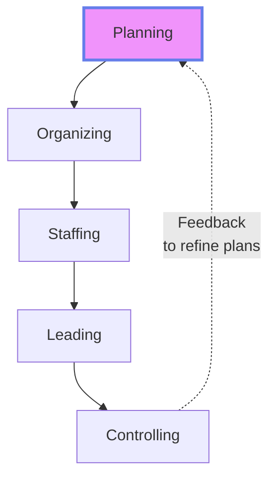
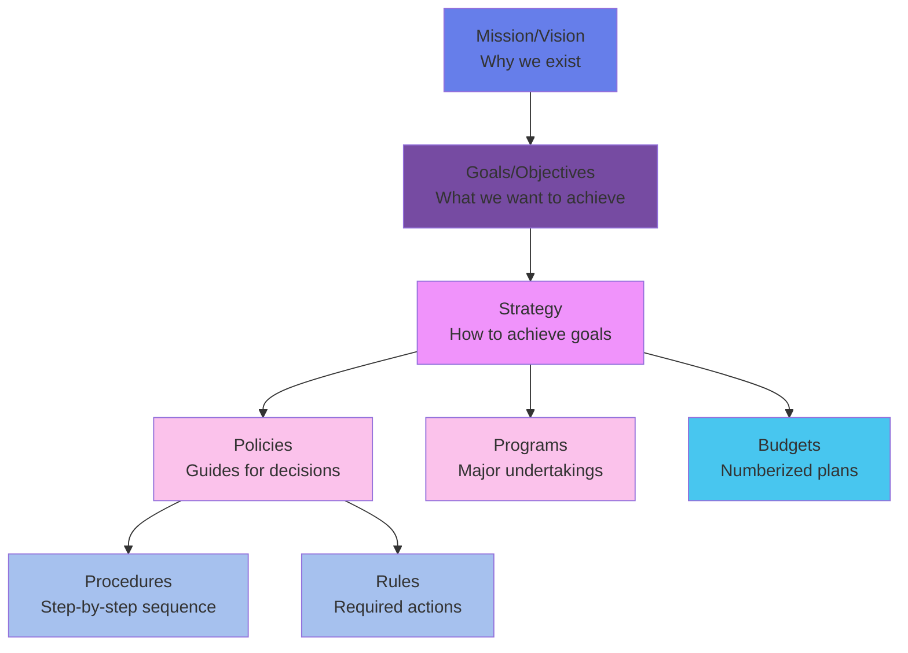
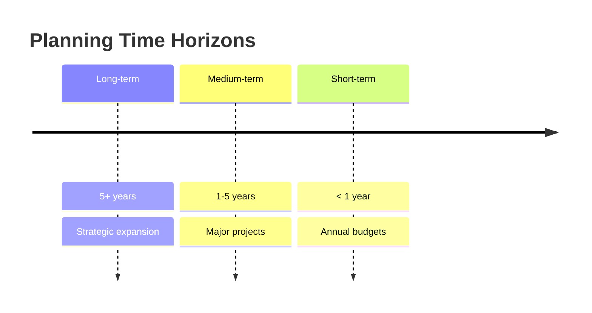
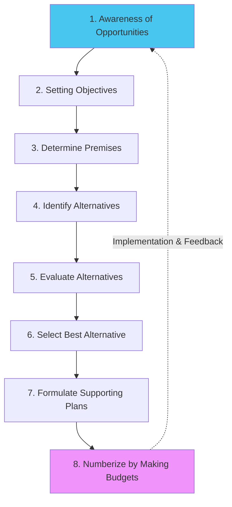
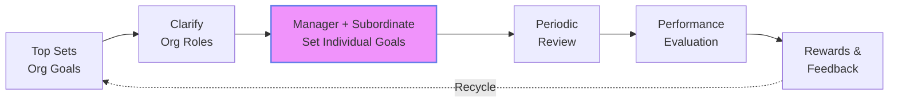
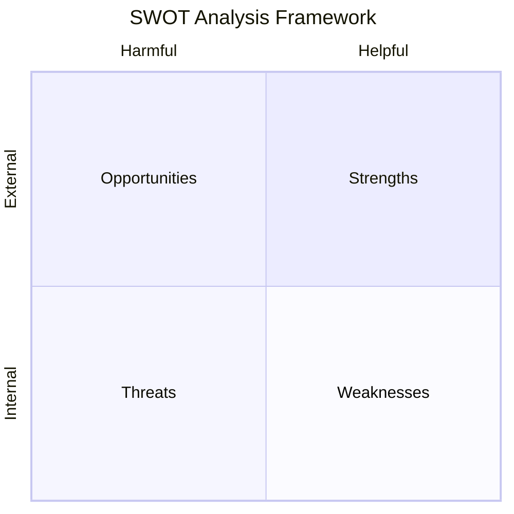
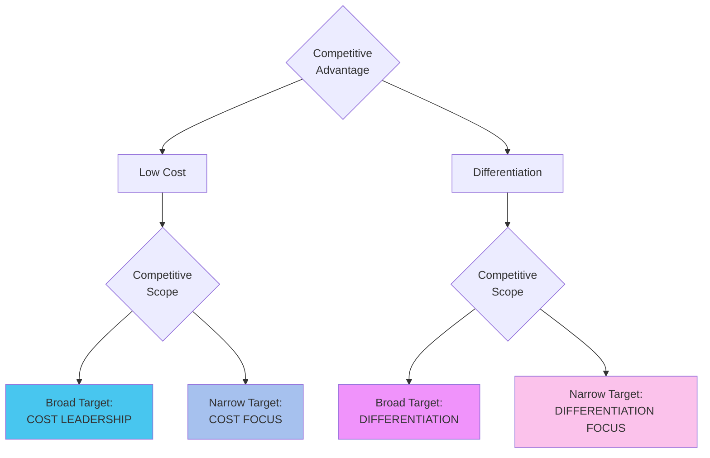
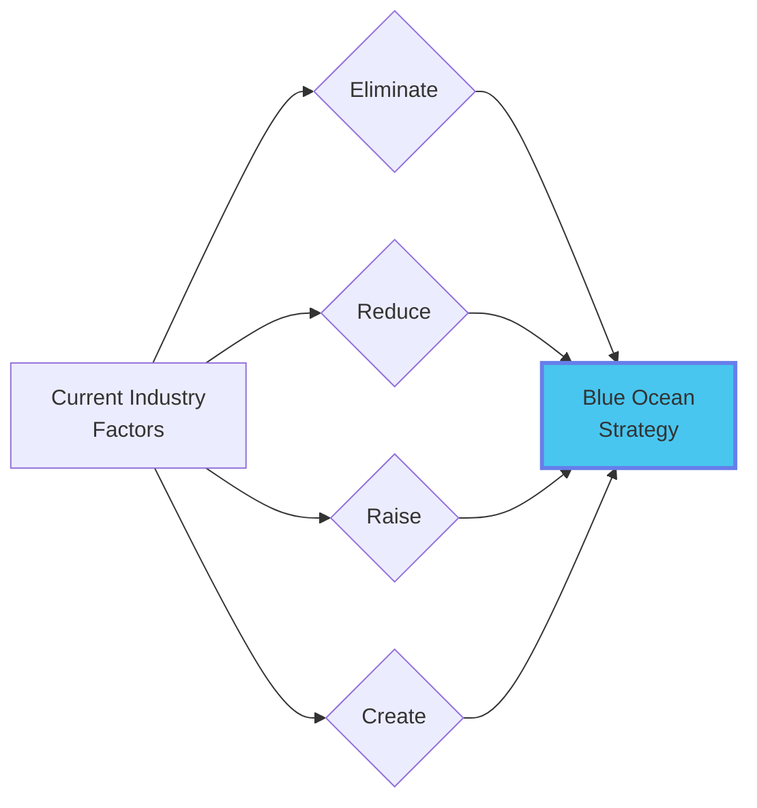

# Module 2: Planning & Strategy 📋

:::tip[Learning Objectives]
By the end of this module, you will master:
1. **The 8 Types of Plans** with case identification skills
2. **8-Step Planning Process** application
3. **MBO (Management by Objectives)** system
4. **Strategic Tools:** SWOT/TOWS, BCG Matrix, Porter's Generic Strategies, Blue Ocean
5. **Critical Question Analysis** for business strategy
:::


---

## 2.1 The Nature & Purpose of Planning

:::info[Planning]
**Planning** is selecting missions and objectives and the actions to achieve them; it requires decision-making (choosing future courses of action from alternatives).

**Why Planning is Primary:**
- Precedes all other functions
- Reduces uncertainty
- Sets standards for control
- Provides direction and reduces overlapping efforts
:::




---

## 2.2 The 8 Types of Plans ⭐

:::warning[High-Frequency Exam Topic]
Case studies ask you to **"Quote lines and identify plan types"** - This appears in 80% of exams!
:::


### The Planning Hierarchy



| Plan Type | Definition | Characteristics | Example |
|:----------|:-----------|:---------------|:--------|
| **1. Mission** | Basic purpose/function | Broad, enduring, defines "business" | "To organize world's information" (Google) |
| **2. Objective** | Ends toward which activity is aimed | **Verifiable/Quantifiable** | "Increase market share by 5% in Q3" |
| **3. Strategy** | Overall comprehensive plan | Long-term, competitive positioning | "Become cost leader in industry" |
| **4. Policy** | General guide for decision-making | Flexible, interpreted by managers | "Promote from within when possible" |
| **5. Procedure** | Chronological sequence of steps | Routine, repetitive tasks | "Steps to process customer refund" |
| **6. Rule** | Required action/non-action | **No discretion**, absolute | "No smoking in premises" / "Penalty of ₹500/day" |
| **7. Program** | Complex set of goals, policies, plans | Large-scale, single-use | "Digital Transformation Program" |
| **8. Budget** | Numberized statement of expectations | Financial control | "₹50 Lakhs for marketing in Q2" |

:::danger[Policy vs Procedure vs Rule - The Critical Distinction]
:::


| Aspect | Policy | Procedure | Rule |
|:-------|:-------|:----------|:-----|
| **Flexibility** | High (guides thinking) | Medium (sequence can adapt) | **Zero** (must comply) |
| **Example** | "Credit extended based on creditworthiness" | "1. Check credit score 2. Verify income 3. Approve" | "No credit if score &lt; 600" |
| **Discretion** | Manager interprets | Some judgment in execution | No interpretation allowed |

---

## 2.3 Classification of Plans

### By Time Frame



### By Breadth & Use

| Dimension | Type 1 | Type 2 |
|:----------|:-------|:-------|
| **Breadth** | Strategic (Entire org) | Operational (Department level) |
| **Frequency** | **Standing Plans** (Ongoing)<br/>*Examples: Policies, Procedures, Rules* | **Single-Use Plans** (One-time)<br/>*Examples: Programs, Budgets, Projects* |
| **Specificity** | Directional (Flexible) | Specific (Rigid) |

---

## 2.4 The 8-Step Planning Process

:::info[Sequential Logic of Planning]
:::




| Step | Description | Example (Inventory Management) |
|:-----|:-----------|:-------------------------------|
| **1. Awareness** | Scan environment for opportunities/problems | High inventory holding costs identified |
| **2. Objectives** | Define specific, measurable goals | "Reduce holding cost by 15%; zero stockouts" |
| **3. Premises** | Forecast future conditions | Demand will grow 10%; supplier reliable |
| **4. Alternatives** | Generate possible courses of action | JIT, EOQ model, Bulk buying |
| **5. Evaluation** | Weigh pros/cons of each | JIT risky; Bulk ties up cash; EOQ balanced |
| **6. Selection** | Choose the best alternative | Implement EOQ for steady items |
| **7. Support Plans** | Develop derivative plans | Train warehouse staff on new software |
| **8. Budgets** | Allocate financial resources | ₹25L for software; ₹50L for safety stock |

---

## 2.5 Management by Objectives (MBO)

:::info[MBO]
A comprehensive managerial system that integrates key activities in a systematic manner, consciously directed toward effective achievement of organizational and individual objectives through **participative goal-setting**.
:::


### The MBO Cycle



### SMART Objectives Framework

| Letter | Criterion | Bad Example | Good Example |
|:-------|:----------|:------------|:-------------|
| **S**pecific | Clearly defined | "Improve sales" | "Increase North region electronics sales" |
| **M**easurable | Quantifiable | "Better customer service" | "Achieve 95% satisfaction score" |
| **A**chievable | Realistic | "Double revenue in 1 month" | "Grow revenue by 8% this quarter" |
| **R**elevant | Aligned with strategy | "Learn Spanish" (for local IT firm) | "Master Python" (for IT firm) |
| **T**ime-bound | Deadline specified | "Eventually reduce costs" | "Cut costs by Q3 2024" |

### MBO Benefits & Weaknesses

| Benefits ✅ | Weaknesses ❌ |
|:-----------|:-------------|
| Improves performance through clarity | Time-consuming setup |
| Participative (boosts motivation) | Difficult to set verifiable goals for soft skills |
| Better superior-subordinate relations | Overemphasis on short-term objectives |
| Facilitates control | Paperwork burden |
| Forces planning | Inflexible if not reviewed regularly |

---

## 2.6 Strategic Planning Tools

### A. Critical Question Analysis

:::info[Foundational Strategic Questions]
Forces re-evaluation of core business assumptions.
:::


1. **What is our business?** (Purpose definition)
2. **Who are our customers?** (Market segmentation)
3. **What do customers want?** (Value proposition)
4. **Where do we want to be?** (Vision)
5. **How do we get there?** (Strategy formulation)

---

### B. SWOT & TOWS Analysis

:::info[SWOT Framework]
**Internal Factors:** Strengths (S), Weaknesses (W)
**External Factors:** Opportunities (O), Threats (T)
:::




### TOWS Matrix: From Analysis to Strategy ⭐

:::warning[TOWS converts SWOT into actionable strategies]
:::


| Internal ↓ External → | **Opportunities (O)** | **Threats (T)** |
|:---------------------|:---------------------|:----------------|
| **Strengths (S)** | **SO Strategy**<br/>(Maxi-Maxi)<br/>*Use strengths to grab opportunities* | **ST Strategy**<br/>(Maxi-Mini)<br/>*Use strengths to avoid threats* |
| **Weaknesses (W)** | **WO Strategy**<br/>(Mini-Maxi)<br/>*Overcome weakness via opportunities* | **WT Strategy**<br/>(Mini-Mini)<br/>*Defensive: Minimize both* |

**Examples:**
- **SO:** Strong R&D (S) + Growing EV market (O) = Develop EV product line
- **ST:** Strong brand (S) + New competitor (T) = Launch loyalty program
- **WO:** Weak online presence (W) + E-commerce boom (O) = Invest in digital platform
- **WT:** High debt (W) + Economic recession (T) = Retrenchment/Cost-cutting

---

### C. Boston Consulting Group (BCG) Matrix ⭐

:::danger[Critical Exam Topic]
You MUST know the formulas and be able to categorize products!
:::


```mermaid
quadrantChart
    title BCG Portfolio Matrix
    x-axis Low Market Share --> High Market Share
    y-axis Low Growth --> High Growth
    quadrant-1 Stars<br/>High Growth, High Share
    quadrant-2 Question Marks<br/>High Growth, Low Share
    quadrant-3 Dogs<br/>Low Growth, Low Share
    quadrant-4 Cash Cows<br/>Low Growth, High Share
```

#### The Four Quadrants

:::info[Stars ⭐ (High Growth, High Share)]
**Characteristics:** Market leaders in growing industries
**Cash Flow:** Large cash users + Large cash generators = Net neutral
**Strategy:** **Invest/Hold** - Pour resources to maintain dominance
**Goal:** Grow into Cash Cows as market matures
:::


:::info[Cash Cows 🐄 (Low Growth, High Share)]
**Characteristics:** Mature, established products with dominant position
**Cash Flow:** Generate more than they consume
**Strategy:** **Harvest/Milk** - Minimal investment, maximize profit extraction
**Use of Cash:** Fund Stars and Question Marks
:::


:::info[Question Marks ❓ (High Growth, Low Share)]
**Characteristics:** "Problem Children" - Potential but uncertain
**Cash Flow:** Heavy cash users (need investment to grow share)
**Strategy:** **Build or Divest** - Invest aggressively to become Star, OR cut losses
**Risk:** High - Could become Star or Dog
:::


:::info[Dogs 🐕 (Low Growth, Low Share)]
**Characteristics:** Weak position in unattractive markets
**Cash Flow:** Neutral or negative (cash traps)
**Strategy:** **Divest/Liquidate** - Free up resources for better opportunities
**Exception:** May retain if loyal niche customers or strategic importance
:::


#### BCG Formulas 📐

:::info[Market Growth Rate]
$$\text{Market Growth Rate} = \frac{\text{Current Year Sales} - \text{Previous Year Sales}}{\text{Previous Year Sales}} \times 100\%$$

**Threshold:** Typically >10% = High Growth; &lt;10% = Low Growth
:::


:::info[Relative Market Share]
$$\text{Relative Market Share} = \frac{\text{Your Company's Sales}}{\text{Largest Competitor's Sales}}$$

**Threshold:** >1.0 = High Share (You're leader); &lt;1.0 = Low Share
:::


---

### D. Porter's Generic Competitive Strategies

:::info[Sources of Competitive Advantage]
Michael Porter argues only **two basic sources** of advantage exist:
1. **Low Cost** (Efficiency)
2. **Differentiation** (Uniqueness)
:::




| Strategy | Target Market | Advantage Source | Example Company | How They Win |
|:---------|:-------------|:----------------|:----------------|:-------------|
| **Cost Leadership** | Broad/Industry-wide | Lowest cost | **Walmart**, Maruti Suzuki | Economies of scale, efficient processes, low overhead → Affordable prices |
| **Differentiation** | Broad/Industry-wide | Unique features | **Apple**, BMW | Innovation, brand, quality → Premium pricing |
| **Cost Focus** | Narrow/Niche | Low cost in niche | **Ryan Air** (budget airline) | Focused efficiency in specific segment |
| **Differentiation Focus** | Narrow/Niche | Unique in niche | **Patanjali** (Ayurvedic), Rolex | Specialized expertise for specific customer needs |

:::warning[Stuck in the Middle]
Firms that fail to achieve **any** of these strategies have:
- No competitive advantage
- Below-average profitability
- Confusion in customer perception

**Example:** A company trying to be "somewhat cheap" AND "somewhat premium" satisfies nobody.
:::


---

### E. Blue Ocean Strategy

:::info[Red Ocean vs Blue Ocean]
**Red Ocean:** Competing in existing markets (bloody competition)
**Blue Ocean:** Creating NEW market space (uncontested, making competition irrelevant)
:::


### The Four Actions Framework (ERRC)



| Action | Question | Example: Cirque du Soleil |
|:-------|:---------|:-------------------------|
| **Eliminate** | Which factors the industry takes for granted should be eliminated? | Eliminated star performers, animals (costly circus traditions) |
| **Reduce** | Which factors should be reduced below industry standard? | Reduced fun/humor, thrill/danger |
| **Raise** | Which factors should be raised above industry standard? | Raised artistic quality, production value, venue sophistication |
| **Create** | Which factors should be created that industry never offered? | Created unique venue, multiple productions, refined themes |

**Result:** Cirque created a new market combining circus + theater, attracting adults willing to pay premium prices (not just children).

---

## 📚 EXHAUSTIVE QUESTION BANK

### Section A: Plan Type Identification (Case-Based)

:::note[Q1. The Entrepreneur Case (Rahul Modi/Cleopatra Pattern)]
**(PYQ: Nov 2024, June 2025)**

**Scenario:**
"Five years ago, Mr. Rahul Modi completed his degree in food processing. He set the objectives and targets and formulated an action plan. One of his objectives was to earn a 10% profit on the amount invested in the first year. It was decided that raw materials like fruits and vegetables will be purchased on three months' credit from farmers cultivating organic crops only. He appointed Ms. Mamta Patel as production manager who decides the exact manner in which the production activities are to be carried out. Ms. Mamta Patel also prepared a statement showing the number of workers required throughout the year. While working on the production table, a penalty of 100 rupees per day for not wearing caps, gloves, and apron was announced."

**Task:** Quoting lines, outline FOUR types of plans.

**Model Answer:**

| Plan Type | Quoted Line | Explanation |
|:----------|:-----------|:------------|
| **Objective** | *"One of his objectives was to earn a 10% profit on the amount invested in the first year."* | Specific, quantifiable goal with timeframe |
| **Policy** | *"Raw materials... will be purchased on three months' credit from farmers cultivating organic crops only."* | General guideline for procurement decisions |
| **Procedure** | *"Decides the exact manner in which the production activities are to be carried out."* | Step-by-step sequence for routine operations |
| **Rule** | *"A penalty of 100 rupees per day for not wearing caps, gloves, and apron was announced."* | Specific required action with no discretion |
| **Budget** (Bonus) | *"Statement showing the number of workers required throughout the year."* | Numberized plan (manpower budget) |
:::


:::note[Q2. Miss Cleopatra's Cybersecurity Firm]
**(PYQ: June 2025)**

"After working as a software developer, Miss Cleopatra decided to start her company specializing in cybersecurity solutions. She set an initial goal of acquiring 15 clients in the first quarter and achieving a 25% return on investment by the end of the year. Cleopatra chose to hire independent contractors with expertise and negotiated flexible payment terms based on project completion. She appointed Dr. Banrakas as project manager to create a workflow, assign tasks, and monitor progress. Cleopatra developed a marketing strategy targeting small business owners through social media and tech conferences. They introduced a late submission penalty of ₹500/day for team members who missed deadlines."

**Task:** Identify FOUR plan types by quoting lines.

**Your Turn:** Write the answer following Q1's format.
:::


:::note[Q3. Six Types of Plans with Examples]
**(PYQ: Dec 2024)**

"The plans made by top-level managers differ from ones that lower managers make." Elaborate by giving suitable examples for SIX types of plans.

**Model Answer:**

1. **Mission (Top Level):** "To empower every person and organization on the planet to achieve more" - Microsoft's overall purpose

2. **Objective (Top Level):** "Achieve ₹500 Cr revenue by FY 2025" - CEO's strategic goal

3. **Strategy (Top Level):** "Enter the Indian EV market through a joint venture" - Long-term competitive positioning

4. **Policy (Middle Level):** "Promote from within when qualified internal candidates exist" - Guideline for HR decisions

5. **Procedure (Lower Level):** "Customer complaint handling: 1. Log ticket 2. Assign to specialist 3. Update status 4. Close with feedback" - Operational sequence

6. **Rule (Lower Level):** "All employees must clock in by 9:30 AM sharp; late arrivals after 3 instances result in salary deduction" - Specific requirement
:::


### Section B: Strategic Tools Application

:::note[Q4. BCG Matrix - Nestlé Products]
**(PYQ: May 2025)**

Categorize the following Nestlé products into BCG matrix. Create strategies for each.

- **Nescafé:** Dominates instant coffee; market growing; investing in flavors/packaging
- **Maggi:** Market leader in mature instant noodles segment; highly profitable
- **Milkmaid:** Strong brand nostalgia; shrinking home baking market
- **A+ Curd Alternatives:** Expanding plant-based market; establishing against Epigamia/Sofit

**Model Answer:**

| Product | Quadrant | Growth? | Share? | Justification | Strategy |
|:--------|:---------|:--------|:-------|:-------------|:---------|
| **Nescafé** | **Star** | High | High | *"Dominates instant coffee"* in *"growing market"* | **Invest/Build** - Continue flavor innovation and marketing to maintain leadership as market grows |
| **Maggi** | **Cash Cow** | Low | High | *"Market leader"* in *"mature segment"*; *"highly profitable"* | **Harvest** - Maintain position with minimal investment; use profits to fund Stars (Nescafé) and Question Marks (A+) |
| **Milkmaid** | **Dog** | Low | Low-Medium | *"Shrinking market"* due to declining baking trends | **Divest/Hold** - Phase out or maintain for seasonal demand only; redirect resources |
| **A+ Curd** | **Question Mark** | High | Low | *"Expanding market"* but *"still establishing"* vs competitors | **Build or Divest** - Invest heavily in marketing/distribution to capture share, OR exit if can't compete |
:::


:::note[Q5. Porter's Generic Strategies - Maruti vs Patanjali]
**(PYQ: Dec 2024)**

**Case #1:** "Maruti Suzuki adopts lean manufacturing and co-locates suppliers near plants to minimize logistics expenses. Strategic focus on cost-effective R&D ensures affordable pricing without compromising quality. Over 40% market share."

**Case #2:** "Patanjali Ayurved targets the niche market of health-conscious consumers seeking natural and Ayurvedic products. Tightly controls supply chain to keep prices competitive while ensuring wide availability through exclusive stores."

**Task:** Illustrate which Porter strategy each uses.

**Model Answer:**

**Maruti Suzuki: COST LEADERSHIP**
- **Target Market:** Broad (entire Indian car market)
- **Competitive Advantage:** Low Cost
- **Evidence:** *"Lean manufacturing"*, *"minimize logistics expenses"*, *"cost-effective R&D"*, *"affordable pricing"*
- **Outcome:** 40%+ market share by being the most affordable without quality compromise

**Patanjali: DIFFERENTIATION FOCUS**
- **Target Market:** Narrow (*"niche market of health-conscious consumers"*)
- **Competitive Advantage:** Differentiation (*"natural and Ayurvedic products"*)
- **Evidence:** *"Targeting niche"*, *"Ayurvedic"* (unique product attributes)
- **Strategy:** Serves specific customer segment with specialized offerings
:::


:::note[Q6. SWOT to TOWS Matrix]
Create a TOWS matrix for a traditional bookstore facing digitalization. Assume:
- **Strengths:** Prime location, Loyal customer base, Knowledgeable staff
- **Weaknesses:** No online presence, High rent, Limited inventory space
- **Opportunities:** Growing café culture, Demand for book clubs, E-book partnerships possible
- **Threats:** Amazon dominance, Rising rent costs, Declining foot traffic

**Task:** Develop ONE strategy for each TOWS quadrant (SO, ST, WO, WT).
:::


:::note[Q7. Blue Ocean Canvas for Electric Scooter Startup]
You're launching an electric scooter brand in India. Using the Four Actions Framework, create a Blue Ocean strategy:
- **Eliminate:** What traditional two-wheeler features should you eliminate?
- **Reduce:** What should you reduce below industry standard?
- **Raise:** What should you raise above industry standard?
- **Create:** What new factors should you create?
:::


### Section C: Planning Process Questions

:::note[Q8. 8-Step Planning for Inventory Management]
**(PYQ: May 2025)**

"As Supply Manager, develop an 8-STEP PLANNING PROCESS for inventory management to enhance efficiency, cost-effectiveness, and resource utilization."

**Model Answer:**

1. **Awareness of Opportunity:** Analyze current issues—20% stockouts causing lost sales; ₹5L tied up in slow-moving inventory

2. **Setting Objectives:**
   - Reduce holding costs by 15% (from ₹5L to ₹4.25L)
   - Achieve zero stockouts for A-category items
   - Improve inventory turnover ratio from 6× to 8×

3. **Determining Premises:**
   - Assume 12% demand growth based on sales forecast
   - Lead time from suppliers: 7-10 days
   - Warehouse capacity: 10,000 units

4. **Identifying Alternatives:**
   - **Alt A:** Just-In-Time (JIT) system
   - **Alt B:** Economic Order Quantity (EOQ) model
   - **Alt C:** Bulk buying with volume discounts
   - **Alt D:** Vendor-Managed Inventory (VMI)

5. **Evaluating Alternatives:**
   - JIT: Saves space but risky with unreliable suppliers
   - EOQ: Balanced approach, mathematically optimal
   - Bulk: Cheapest per unit but ties up cash
   - VMI: Shifts responsibility but loses control

6. **Selecting Best Alternative:** Implement **EOQ for steady items** + **Safety stock for critical items**

7. **Formulating Support Plans:**
   - Train warehouse staff on new inventory software
   - Negotiate contracts with 3 backup suppliers
   - Implement ABC analysis for prioritization

8. **Numberizing Through Budgets:**
   - ₹2L for inventory management software
   - ₹3L for safety stock purchases
   - ₹50K for staff training program
:::


:::note[Q9. MBO Implementation for Sales Team]
Design a complete MBO system for a regional sales team. Include:
- Top management's preliminary objective
- How you'd involve salespeople in goal-setting
- Specific SMART objectives for 3 salespeople
- Review mechanism
(8 marks)
:::


:::note[Q10. Policy vs Procedure Distinction]
A manager says "Our policy is to satisfy customers." Another says "Our procedure is to handle complaints within 24 hours."

a) Critique both statements (Are they actually policy/procedure?)
b) Rewrite them correctly
c) Add a complementary rule
(6 marks)
:::


### Section D: Critical Analysis

:::note[Q11. MBO Weaknesses in Practice]
"MBO is an excellent concept in theory but often fails in implementation." Critically analyze THREE major reasons for MBO failure and propose remedies. (6 marks)

**Hint:** Consider goal-setting difficulty, short-termism, lack of top management commitment, paperwork burden.
:::


:::note[Q12. BCG Matrix Limitations]
The BCG Matrix is criticized for being too simplistic. Identify FOUR limitations of this model and suggest when a company should NOT rely solely on BCG for strategic decisions. (6 marks)

**Hint:** Mid-share products, synergies between SBUs, external factors ignored, assumes market share = profitability.
:::


:::note[Q13. Porter's "Stuck in the Middle"]
Kmart tried to compete with Walmart on price while also trying to match Target's style. It failed.

a) Using Porter's framework, diagnose Kmart's strategic error (3 marks)
b) Recommend which strategy Kmart should have pursued and why (3 marks)
:::


:::note[Q14. Standing vs Single-Use Plans]
For each of the following, classify as Standing or Single-Use plan and give your reasoning:
a) "Annual budget for 2024"
b) "Employee code of conduct"
c) "Project to build new factory in Chennai"
d) "Attendance policy"
e) "Product launch plan for new smartphone"
(5 marks)
:::


:::note[Q15. SWOT vs TOWS]
Many students confuse SWOT and TOWS. Explain:
a) The fundamental difference in their purpose
b) Why SWOT alone is insufficient for strategy
c) How TOWS converts analysis into action
Use an example to illustrate. (6 marks)
:::


### Section E: Application & Scenario-Based

:::note[Q16. Design Two Strategic Tools]
**(PYQ Pattern: Nov 2024, June 2025)**

"As leader of your organization, you must design a strategic plan. Using appropriate representation and examples, discuss any TWO strategic tools you will implement to facilitate your firm's development."

**Sample Answer (For a hypothetical ed-tech startup):**

**Tool 1: SWOT/TOWS Analysis**

*SWOT Matrix:*
| Internal | External |
|:---------|:---------|
| **Strengths:**<br/>- Experienced faculty<br/>- AI-powered platform<br/>- Low course pricing | **Opportunities:**<br/>- Online learning boom post-COVID<br/>- Govt. skill development push<br/>- Tier-2/3 city market untapped |
| **Weaknesses:**<br/>- Low brand awareness<br/>- High customer acquisition cost<br/>- Limited course variety | **Threats:**<br/>- Byju's/Unacademy dominance<br/>- Regulatory changes<br/>- Content piracy |

*TOWS Strategies:*
- **SO:** Leverage AI platform (S) + Tier-2/3 opportunity (O) = Launch vernacular language courses
- **WT:** Address low brand (W) + Competition (T) = Partner with colleges for credibility

**Tool 2: Porter's Generic Strategies**

*Decision: Choose **Differentiation Focus***
- **Why:** Can't compete on cost against large players with economies of scale
- **Target:** Working professionals seeking job-specific skills (niche)
- **Differentiation:** Industry-expert instructors + Live doubt sessions + Job guarantee

**Together:** SWOT identifies where we are; Porter defines how we compete.
:::


:::note[Q17. Planning in Uncertainty]
During COVID-19, many companies' long-term plans became obsolete overnight. Does this mean planning is useless in uncertain times? Defend planning's value even in volatile environments. (5 marks)
:::


:::note[Q18. Blue Ocean vs Red Ocean Decision]
You're CEO of a new coffee chain in India (saturated market: Starbucks, CCD, local cafés).

a) Describe the "Red Ocean" you're entering
b) Propose a "Blue Ocean" strategy using ERRC framework
c) What risks does Blue Ocean entail?
(8 marks)
:::


:::note[Q19. Objectives at Three Levels]
For a smartphone manufacturing company, write:
- ONE strategic objective (Top management)
- TWO tactical objectives (Middle management—derived from strategic)
- THREE operational objectives (Lower management—derived from tactical)

Ensure they align hierarchically. (6 marks)
:::


:::note[Q20. Critical Question Analysis Application]
Apply the "Critical Question Analysis" framework to:
a) A traditional taxi company facing Uber/Ola disruption
b) Show how answering these questions leads to strategic pivot
(Answer all 5 critical questions with specific responses)
(7 marks)
:::


---

:::note[Module 2 Key Takeaways]
✅ **8 Plan Types** = Mission → Objective → Strategy → Policy/Procedure/Rule/Program → Budget
✅ **MBO** = Participative goal-setting with SMART objectives
✅ **BCG** = Stars/Cash Cows/Question Marks/Dogs (Know the formulas!)
✅ **Porter** = Cost Leadership OR Differentiation (Broad or Focus); Don't get stuck in middle
✅ **TOWS** = SO/ST/WO/WT strategies from SWOT analysis
✅ **Blue Ocean** = ERRC (Eliminate/Reduce/Raise/Create)
:::


**Next:** **Module 3 - Organizing Structures** where you'll master the EcoEarth case and Departmentation! 🏗️
