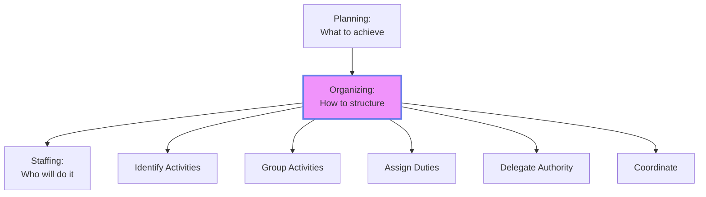
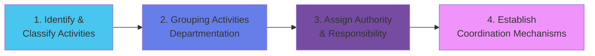
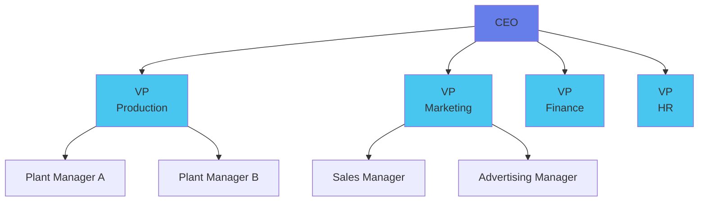
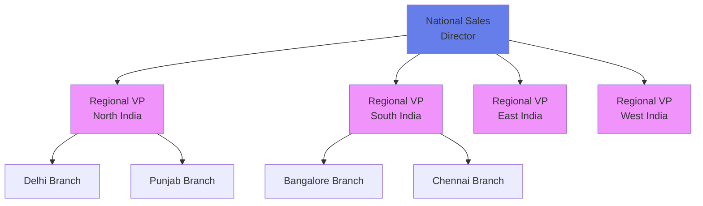
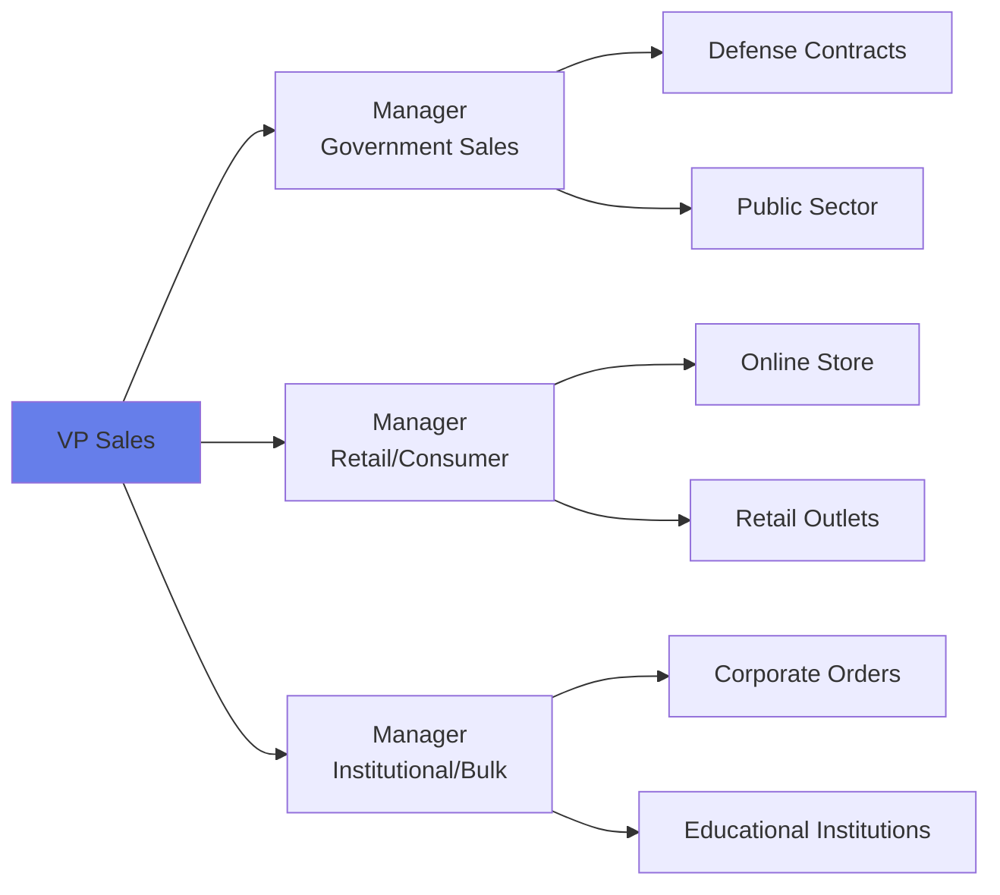
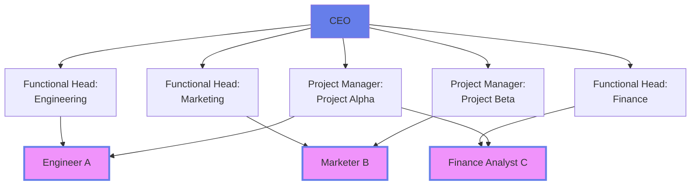
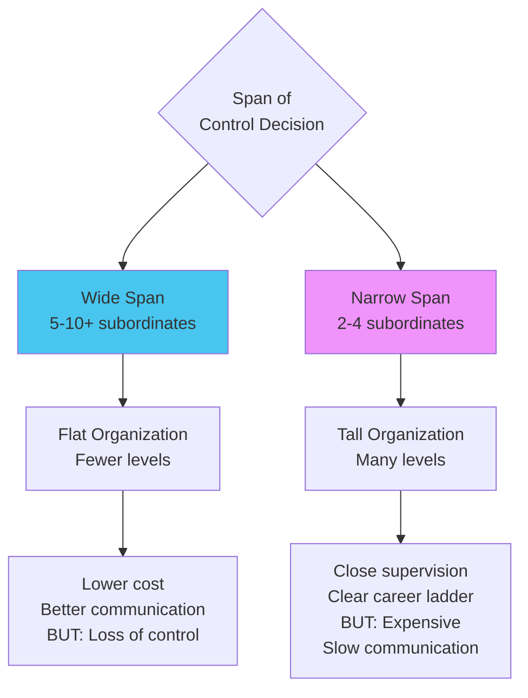
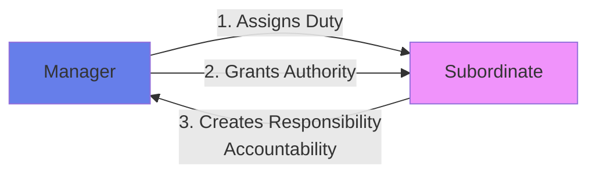
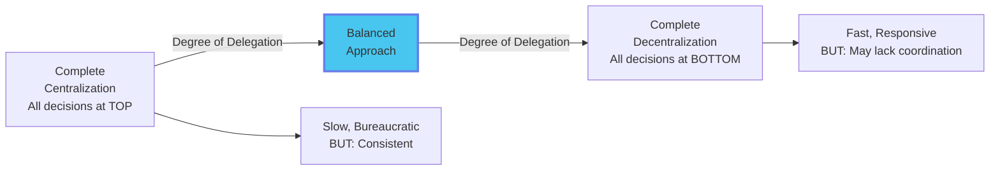
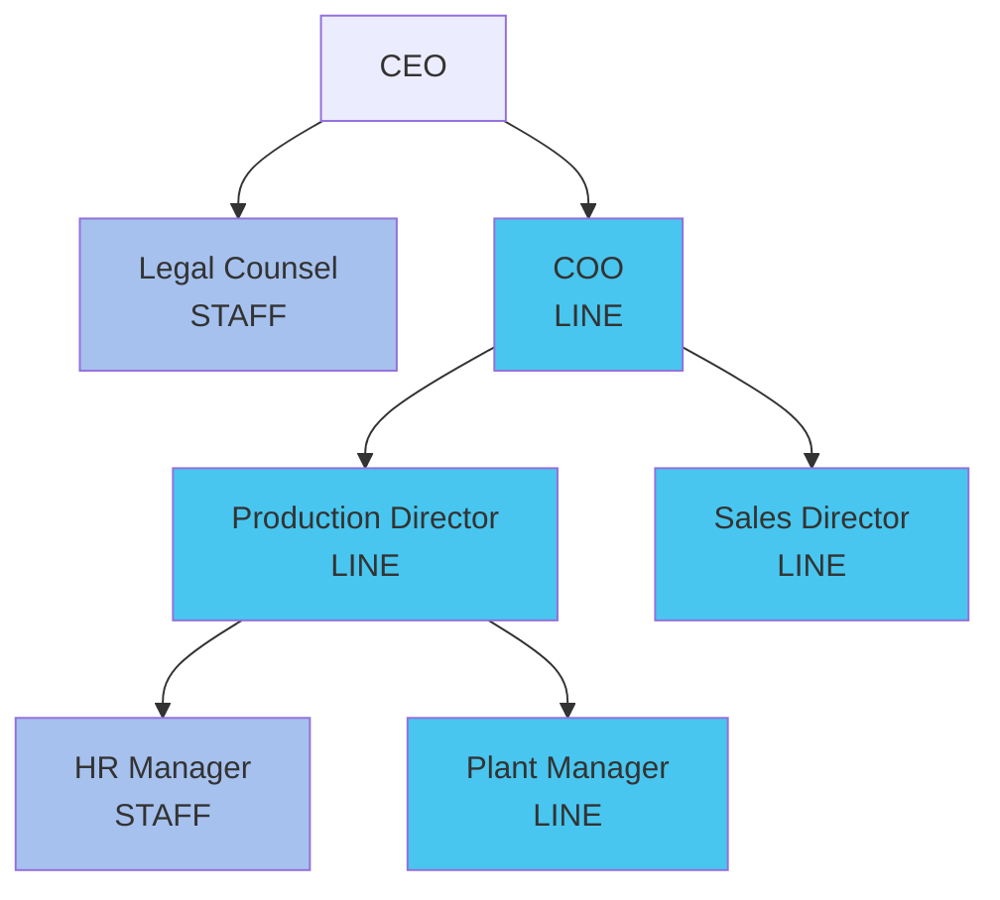

# Module 3: Organizing Structures 🏗️

:::tip[Learning Objectives]
By mastering this module, you will:
1. **Define** the Organizing function and its systematic steps
2. **Analyze** 8 Patterns of Departmentation (with pros/cons)
3. **Apply** Span of Control principles to case studies
4. **Differentiate** Line vs Staff Authority
5. **Evaluate** Matrix Organization and its violations of Unity of Command
:::


---

## 3.1 The Nature of Organizing

:::info[Organizing]
**Organizing** is the process of establishing orderly uses for all resources within the management system. It involves:
- Identifying and classifying required activities
- Grouping activities to achieve objectives
- Assigning activities to managers and employees
- Delegating authority
- Coordinating horizontally and vertically
:::


**Purpose:** Create a structure that helps accomplish plans efficiently.



---

## 3.2 The Steps in Organizing Process ⭐

:::warning[High-Frequency Case Study Topic]
The "EcoEarth" pattern appears frequently. You must **quote lines** to identify each step.
:::


### The 4-Step Logic



| Step | What Happens | Example |
|:-----|:------------|:--------|
| **1. Identification** | List all necessary activities | Production, Marketing, Finance, HR, R&D |
| **2. Grouping** | Combine similar activities into departments | All sales activities → Sales Dept |
| **3. Assignment** | Designate managers and delegate authority | Appoint Sales Manager with budgetary authority |
| **4. Coordination** | Create reporting relationships & communication channels | Sales reports to VP Marketing; weekly cross-dept meetings |

---

## 3.3 Departmentation: 8 Patterns

:::info[Departmentation Defined]
The process of grouping activities and people into departments to achieve organizational objectives.
:::


### Pattern Comparison Table

| Pattern | Basis | Best For | Key Advantage | Key Disadvantage |
|:--------|:------|:---------|:-------------|:----------------|
| **1. By Numbers** | Headcount | Armies, Labor crews | Simple coordination | Ignores skills/expertise |
| **2. By Time** | Shifts (8am/4pm/12am) | 24/7 operations (hospitals) | Continuous coverage | Coordination across shifts hard |
| **3. By Function** | Specialization (Marketing, Production, HR) | **Most companies** | Expert efficiency, Economies of scale | **Silo mentality**, Tunnel vision |
| **4. By Product** | Product line (Cars, Trucks, SUVs) | Diversified firms | Clear profit responsibility, Focus | Duplication of functions |
| **5. By Geography** | Location (North, South, East, West) | **MNCs with field sales** | Local market responsiveness | Control difficulty, Duplication |
| **6. By Customer** | Client type (Retail, Wholesale, Govt) | Banks, B2B firms | Customer service excellence | Underutilization of facilities |
| **7. By Process** | Equipment/Tech (Welding, Painting, Assembly) | Manufacturing | Technical specialization | Coordination challenges |
| **8. Matrix** | **Dual**: Function + Project | Aerospace, Consulting, R&D | Flexibility, Expert sharing | **Violates Unity of Command** (2 bosses!) |

---

### Deep Dive: Key Departmentation Types

#### A. Functional Departmentation (Most Common)



**Advantages:**
- Logical and time-tested
- Maintains power/prestige of major functions
- Simplifies training (specialists train specialists)
- Efficient use of specialized resources

**Disadvantages:**
- Narrow perspective (each dept focuses on own goals)
- Reduces coordination between departments
- Slow response to environmental changes
- Bottleneck: Only top management sees big picture

---

#### B. Geographical (Territorial) Departmentation ⭐

:::danger[Common Question: "Propose departmentation for MNC with nationwide sales"]
:::




**When to Use:** Physical dispersion of activities, Large territories, Local customization needed

**Merits:**
1. Places responsibility at lower level (regional autonomy)
2. Caters to local needs/preferences (language, culture, tastes)
3. Improves coordination within region
4. Training ground for general managers
5. Quick response to local market changes

**Limitations:**
1. Requires more managers with general management ability
2. Duplication of services (each region needs HR, Finance, etc.)
3. Difficulty maintaining consistent company-wide policies
4. Increased control problems for top management

---

#### C. Customer Departmentation

:::info[Grouping by "Who Buys"]
:::




**Examples:**
- **Banks:** Retail Banking, Corporate Banking, NRI Services
- **Airlines:** First Class, Business Class, Economy service teams
- **Software:** Enterprise Solutions, SMB Solutions, Consumer Products

**Advantages:**
- Deep understanding of customer needs
- Customer feels "special" (dedicated team)
- Tailored service delivery
- Builds long-term relationships

**Challenges:**
- Underutilization of facilities (if demand fluctuates)
- Difficulty coordinating between customer groups
- May be hard to define customer categories clearly

---

#### D. Matrix Departmentation ⭐

:::warning[Exam Critical: Violation of Fayol's Principle]
Matrix structure **violates Unity of Command** because employees have **TWO bosses**!
:::




**When to Use:**
- Complex projects requiring multidisciplinary teams
- Industries: Construction, Aerospace, Consulting, R&D, Software development

**Advantages:**
- Flexible assignment of experts to projects
- Focuses resources on project success
- Efficient use of specialists
- Ideal for project-based work

**Disadvantages:**
- **Violates Unity of Command** (employee has functional boss + project boss)
- Power struggles between project and functional managers
- Role ambiguity and stress for employees
- Complex, expensive to implement
- Requires excellent communication systems

---

## 3.4 Span of Control (Span of Management)

:::info[Span of Control]
The number of subordinates a manager can effectively and efficiently supervise.
:::




### Factors Determining Optimal Span

:::info[7 Key Factors]
:::


| Factor | Wide Span Possible When... | Narrow Span Needed When... |
|:-------|:--------------------------|:---------------------------|
| **1. Subordinate Training** | Well-trained, competent | New, require close guidance |
| **2. Clarity of Delegation** | Authority clearly defined | Ambiguous responsibilities |
| **3. Clarity of Plans** | Clear objectives, procedures | Vague goals, changing priorities |
| **4. Use of Objective Standards** | Clear metrics (KPIs) | Subjective evaluation needed |
| **5. Rate of Change** | Stable environment | Rapidly changing, unpredictable |
| **6. Communication Techniques** | Tech-enabled (email, dashboards) | Face-to-face only |
| **7. Amount of Personal Contact** | Minimal interaction needed | High personnel support required |
| **8. Variation in Duties** | Standardized, routine tasks | Complex, varied, non-routine |
| **9. Manager's Ability** | Highly skilled manager | Average managerial capability |

**Rule of Thumb:**
- **Routine work + Trained staff = Wide span (1:10 or more)**
- **Complex work + Inexperienced staff = Narrow span (1:4)**

---

## 3.5 Authority, Responsibility & Delegation

### The Golden Equation

:::info[Parity Principle]
$$\text{Authority} = \text{Responsibility}$$

**Authority** = Right to make decisions & command
**Responsibility** = Obligation/Accountability for results
:::


| Situation | Result | Example |
|:----------|:-------|:--------|
| Authority > Responsibility | Abuse of power | Boss can hire but isn't accountable for team performance → Hires unqualified relatives |
| Authority &lt; Responsibility | Frustration, Helplessness | Project Manager responsible for deadline but can't authorize overtime → Deadline missed |
| **Authority = Responsibility** | **Ideal Balance** | Sales Manager can set discounts AND is accountable for profit margin |

### Flow of Delegation Process



**3 Elements:**
1. **Assignment of Duties:** Manager gives tasks to subordinate
2. **Granting of Authority:** Manager gives power to commit resources, make decisions
3. **Creation of Responsibility:** Subordinate becomes accountable for results

:::warning[Responsibility Cannot Be Delegated]
While you can delegate authority (power), you remain **ultimately responsible** as the manager.

*Example:* CEO delegates hiring to HR; HR makes bad hire → CEO is still accountable to Board.
:::


---

## 3.6 Centralization vs Decentralization

### The Continuum



| Factor Favoring... | Centralization | Decentralization |
|:------------------|:---------------|:----------------|
| **Nature of Decision** | Risky, Strategic | Routine, Operational |
| **Size of Organization** | Small | Large |
| **Environment** | Stable, Simple | Dynamic, Complex |
| **Subordinate Competence** | Low skill | Highly capable |
| **Control Systems** | Weak monitoring | Strong information systems |
| **Cost** | Cost of decision is HIGH | Cost of decision is LOW |

---

## 3.7 Line vs Staff Authority

:::info[Line vs Staff]
**Line Authority:** Direct chain of command; responsibility for accomplishing organizational objectives.
**Staff Authority:** Advisory; provides support, expertise, and service to line.
:::




### Line vs Staff Comparison

| Aspect | Line Functions | Staff Functions |
|:-------|:-------------|:---------------|
| **Nature** | Command, Direct orders | Advise, Support |
| **Authority** | Can command subordinates | Can only recommend |
| **Examples** | Production, Sales, Operations | HR, Legal, IT, R&D, Finance (often staff) |
| **Accountability** | Directly accountable for profits | Accountable for quality of advice |
| **Generalist/Specialist** | Often generalist managers | Usually technical specialists |

**Example Collaboration:**
- **Line Manager (Production):** "We need to hire 50 workers for new shift"
- **Staff (HR):** Advises on labor laws, designs recruitment process, screens candidates
- **Line Manager:** Makes final hiring decision and manages the workers

---

## 3.8 Urwick's Principles of Organization

Lyndall Urwick formalized 10 principles:

1. **Objective:** Clear purpose for organization
2. **Specialization:** One group, one function
3. **Coordination:** Unity of effort
4. **Authority:** Clear lines of authority
5. **Responsibility:** Superior accountable for subordinates' work
6. **Definition:** Clear job definitions
7. **Correspondence:** Authority must match responsibility
8. **Span of Control:** Limits to supervision
9. **Balance:** Departments properly balanced
10. **Continuity:** Organization is perpetual

---

## 📚 EXHAUSTIVE QUESTION BANK

### Section A: Steps in Organizing (Case-Based) ⭐

:::note[Q1. EcoEarth Organizing Case]
**(PYQ: Dec 2024)**

**Scenario:**
"EcoEarth, a startup in sustainable packaging, recently expanded its operations. To manage this growth, the founders, Maya and Arjun, started by analyzing the core functions their team handles daily, from sourcing materials to customer support. They observed that many tasks overlapped, causing confusion and delays. Maya and Arjun decided to bring in consultant Priya. Priya suggested dividing tasks based on expertise and reorganizing workflow. Following her advice, they formed dedicated teams for research and development, marketing, customer service, and logistics, each with its own supervisor. These supervisors would have autonomy to make decisions within their departments but would coordinate major decisions with Maya and Arjun. They developed a hierarchy that balanced authority and responsibility across teams, setting clear boundaries so every team understood its role and whom to report to, creating accountability and smoother communication."

**Task:** Identify and explain the steps taken by EcoEarth in organizing. For each step, cite specific lines.

**Model Answer:**

**Step 1: Identification and Analysis of Activities**
*Quote:* *"Started by analyzing the core functions their team handles daily, from sourcing materials to customer support."*
*Explanation:* This is the foundational step where management identifies all necessary activities to achieve organizational goals.

**Step 2: Grouping Activities (Departmentation)**
*Quote:* *"Formed dedicated teams for research and development, marketing, customer service, and logistics, each with its own supervisor."*
*Explanation:* Similar activities are grouped into functional departments to leverage specialization. This reflects **Functional Departmentation**.

**Step 3: Assignment of Authority (Delegation)**
*Quote:* *"These supervisors would have autonomy to make decisions within their departments."*
*Explanation:* Authority is delegated to department supervisors, empowering them to take operational decisions.

**Step 4: Establishing Coordination and Hierarchy**
*Quote:* *"Developed a hierarchy that balanced authority and responsibility across teams, setting clear boundaries so every team understood its role and whom to report to."*
*Explanation:* Formal reporting relationships (scalar chain) are established to ensure coordination and accountability.
:::


:::note[Q2. Organizing Steps - Generic Application]
"Explain the nature and purpose of organizing function in management. Discuss the steps in organizing with a suitable diagram."
**(PYQ: Nov 2024, June 2025)**

**Answer Structure:**
- **Nature:** Process of arranging resources into a coherent structure
- **Purpose:** Convert plans into action by creating a framework for cooperation
- **Steps:** (Use Mermaid diagram from Section 3.2 + explain each step)
:::


### Section B: Departmentation Questions

:::note[Q3. Geographic Departmentation for MNC]
**(PYQ: Nov 2024, June 2025)**

"Propose a scheme of departmentation for an MNC with a field network of sales all over the country. Discuss its merits and limitations."

**Model Answer:**

**Proposed Scheme:** **Territorial/Geographic Departmentation**

**Structure:**
```
National Sales Director
 ├── Regional VP - North India (HQ: Delhi)
 │    ├── State Manager - Punjab
 │    ├── State Manager - Haryana
 │    └── State Manager - UP
 ├── Regional VP - South India (HQ: Bangalore)
 │    ├── State Manager - Karnataka
 │    ├── State Manager - Tamil Nadu
 │    └── State Manager - Kerala
 ├── Regional VP - East India (HQ: Kolkata)
 └── Regional VP - West India (HQ: Mumbai)
```

**Merits:**
1. **Local Market Focus:** Can adapt to regional tastes, languages, festivals (e.g., Onam campaign in Kerala)
2. **Faster Response:** Regional manager has authority to respond to local competition quickly
3. **Training Ground:** Regional VP role develops general management skills for future CEO candidates
4. **Better Coordination:** All sales activities in a region report to one person
5. **Customer Proximity:** Face-to-face relationships with local distributors

**Limitations:**
1. **Duplication of Functions:** Each region needs own HR, Finance, Marketing support (costly)
2. **Inconsistent Policies:** North might have different discount policies than South
3. **Control Difficulty:** National Director must monitor 4+ regional VPs
4. **Requires More Managers:** Need general managers with profit/loss responsibility for each region
:::


:::note[Q4. Customer Departmentation]
**(PYQ: Dec 2024)**

"In an organization serving diverse customer groups, explain how customer departmentalization can tailor services. Provide an organizational structure, and discuss advantages and challenges."

**Sample Answer for a Bank:**

**Structure:**
```
Head of Retail Banking
 ├── Personal Banking Division
 │    ├── Savings Accounts
 │    ├── Home Loans
 │    └── Personal Loans
 ├── NRI Services Division
 │    ├── NRE/NRO Accounts
 │    └── Forex Services
 ├── Corporate Banking Division
 │    ├── Trade Finance
 │    └── Cash Management
 └── Priority Banking Division (High Net Worth)
      ├── Wealth Management
      └── Investment Advisory
```

**Advantages:**
1. **Customer Focus:** Each division understands specific customer needs deeply
2. **Specialized Service:** NRI division has forex experts; Corporate has trade finance specialists
3. **Relationship Building:** Dedicated relationship managers for priority customers
4. **Performance Measurement:** Can track customer satisfaction and profitability per segment

**Challenges:**
1. **Facility Underutilization:** If corporate clients reduce during recession, division sits idle
2. **Overlap/Confusion:** Where does a small business owner go—Personal or Corporate?
3. **Coordination Difficulty:** A customer with both personal and corporate accounts interacts with two divisions
4. **Duplication:** Each division may need its own operations support
:::


:::note[Q5. Matrix Organization Identification]
**(PYQ: May 2025)**

"This kind of organization occurs frequently in construction (building bridges), aerospace (designing satellites), marketing (advertising campaigns), installation of electronic data processing systems, or management consulting where experts from different fields work together. IDENTIFY this departmentation structure and explain with a neat diagram, mentioning pros and cons."

**Answer:**
**Identified Structure:** **Matrix Departmentation** (or Project/Grid Organization)

*(Draw Mermaid diagram from Section 3.3.D)*

**Pros:**
- Efficient use of scarce specialists (one engineer works on multiple projects)
- Flexibility to form and dissolve project teams
- Motivates employees through project ownership
- Develops general management skills

**Cons:**
- **Violates Unity of Command** (Fayol's Principle #3) - Employee has 2 bosses
- Power struggles between functional and project managers
- Role ambiguity and stress for team members
- Requires sophisticated information systems
- Time-consuming meetings for coordination
:::


:::note[Q6. Line & Staff Organization]
**(PYQ: Dec 2024, June 2025)**

"Draw an organizational chart showing both line and staff functions. Describe how each contributes to company goals. Provide examples where they would collaborate."

**Answer (For a Multi-Specialty Hospital):**

```
CEO (Line)
 ├── Legal Advisor (Staff) - Advises on medical malpractice laws
 ├── Chief Medical Officer (Line)
 │    ├── HR Manager (Staff) - Recruits doctors/nurses
 │    ├── Head of Cardiology (Line)
 │    │    └── Cardiologists (Line)
 │    ├── Head of Neurology (Line)
 │    └── Head of Pediatrics (Line)
 └── CFO (Staff initially, but can be line in some orgs)
      └── Accounts Department (Staff support)
```

**Collaboration Example:**
- **Scenario:** Hospital wants to open new Oncology wing
- **Line (Chief Medical Officer):** Decides the strategic need, budgets, and timeline
- **Staff (HR):** Advises on oncologist hiring, salary benchmarks, job descriptions
- **Staff (Legal):** Advises on radiation safety compliance, licensing
- **Line:** Makes final GO/NO-GO decision
:::


### Section C: Span of Control

:::note[Q7. Span of Control Factors]
Analyze the factors affecting span of control. For each factor, provide a scenario where it would necessitate a WIDE vs NARROW span. (8 marks)
:::


:::note[Q8. Wide vs Narrow Span Decision]
**Scenario A:** A fast-food restaurant with standardized procedures, well-trained staff, clear metrics (customer wait time), and stable operations.

**Scenario B:** A pharmaceutical R&D lab with scientists working on novel drug discovery, ambiguous timelines, and evolving project scopes.

For each, determine appropriate span and justify. (6 marks)
:::


### Section D: Authority & Delegation

:::note[Q9. Flow of Delegation Model]
**(PYQ: Nov 2024)**

"A new team leader is training an employee to handle customer escalations independently. Using Flow of Delegation, analyze how the team leader would apply each step."

**Model Answer:**

**Step 1: Assigning Duties**
*Action:* Team leader assigns responsibility: "Ishan, you will handle all escalations from our premium customers."

**Step 2: Granting Authority**
*Action:* "You have authority to offer up to ₹5,000 refund or replacement without my approval. You can also escalate to VP if customer requests."

**Step 3: Creating Responsibility/Accountability**
*Action:* "You're accountable for resolving 90% of escalations within 24 hours. I'll review your weekly performance report."

**Training Support:**
- Provide escalation handling scripts
- Role-play difficult scenarios
- Monitor first 5 calls, then give autonomy
:::


:::note[Q10. Urwick's Principles Case Identification]
**(PYQ: May 2025)**

Identify Urwick's principles from these lines:

a) *"Vikram entrusted key project decisions to senior team leaders while retaining overall accountability. By assigning authority with clear responsibilities..."*
**Answer:** **Principle of Correspondence (Authority = Responsibility)**

b) *"Priya restructured the workforce by assigning tasks based on employees' expertise. This division of labor improved efficiency..."*
**Answer:** **Principle of Specialization**

c) *"Rohan ensured that all departments aligned their project goals with the company's vision."*
**Answer:** **Principle of Objective (Unity of Objectives)**
:::


### Section E: Critical Analysis

:::note[Q11. Matrix Organization - Ethical Dilemma]
"An engineer in a matrix organization receives conflicting orders: Her functional boss (Engineering Head) says 'Prioritize quality testing' while her project boss says 'Skip detailed tests to meet launch deadline.' How should she handle this? What does this reveal about matrix structure challenges?" (6 marks)
:::


:::note[Q12. Centralization vs Decentralization Decision]
"During COVID-19, some companies centralized decision-making (all decisions at HQ) while others decentralized (empowered local branches). Under what circumstances would each approach be appropriate during a crisis?" (5 marks)
:::


:::note[Q13. Functional Structure Limitations]
"While functional departmentation is most common, it has serious drawbacks for modern businesses. Critically analyze THREE limitations and propose hybrid solutions." (6 marks)

**Hint:** Silos, Slow response, Difficulty in profit accountability, Innovation challenges
:::


:::note[Q14. Line-Staff Conflict]
"Line managers often complain that staff 'advises but doesn't have to live with the consequences.' Staff complains that line 'ignores expert advice.' How can organizations minimize this conflict?" (5 marks)
:::


:::note[Q15. Span of Control in Remote Work]
"With remote work becoming common, should managers maintain the same span of control as in-office work? Argue yes or no with reasoning." (4 marks)
:::


### Section F: Application Scenarios

:::note[Q16. Designing Organizational Structure]
You're launching a pan-India ed-tech startup. Design an organizational structure (diagram) that:
a) Uses at least TWO types of departmentation
b) Shows both line and staff positions
c) Justifies your choices
(10 marks)
:::


:::note[Q17. Reorganization Case]
"A 50-year-old manufacturing company organized functionally (Production, Sales, Finance) is struggling to respond to market changes. Competitors are launching new products faster. Propose a reorganization plan using a different departmentation pattern. Justify your choice and outline transition risks." (8 marks)
:::


:::note[Q18. Delegation Exercise]
As an HR Manager, you want to delegate the "Campus Recruitment" process to your Assistant Manager. Draft a clear delegation document covering:
- Duties assigned
- Authority granted
- Responsibility/accountability measures
- Reporting mechanism
(6 marks)
:::


:::note[Q19. Comparing Departmentation]
A hospital can be organized by:
- **Function** (Diagnostics Dept, Treatment Dept, Admin Dept)
- **Customer** (Emergency Patients, OPD, IPD, Paying vs Charity)
- **Product/Service** (Cardiology, Neurology, Orthopedics)

Which is best for a hospital? Defend your choice. (5 marks)
:::


:::note[Q20. Tall vs Flat Organization]
**Company A (Tall):** 7 levels from CEO to frontline; average span = 4
**Company B (Flat):** 3 levels from CEO to frontline; average span = 12

Compare the two on:
- Communication speed
- Cost
- Control
- Employee autonomy
- Career progression
(8 marks)
:::


---

:::note[Module 3 Key Takeaways]
✅ **Organizing Steps** = Identify → Group → Assign → Coordinate (Quote lines in cases!)
✅ **8 Departmentation** = Functional (most common), Geographic (MNC PYQ favorite), Matrix (violates Unity of Command)
✅ **Span of Control** = Wide (routine, trained) vs Narrow (complex, new)
✅ **Authority = Responsibility** (Parity Principle)
✅ **Line vs Staff** = Command vs Advise
:::


**Next:** **Module 4 - Staffing & HRM** where you'll learn to draft Job Descriptions and master the recruitment process! 👥
