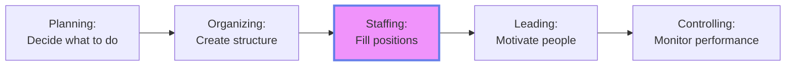
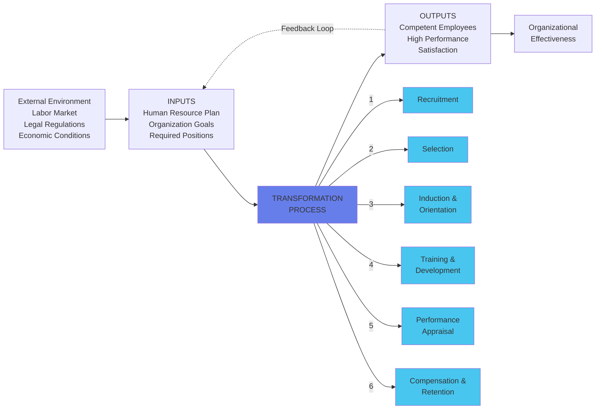
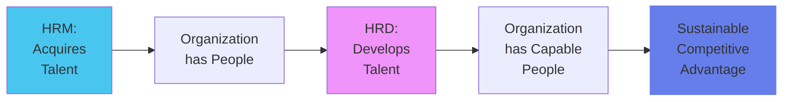
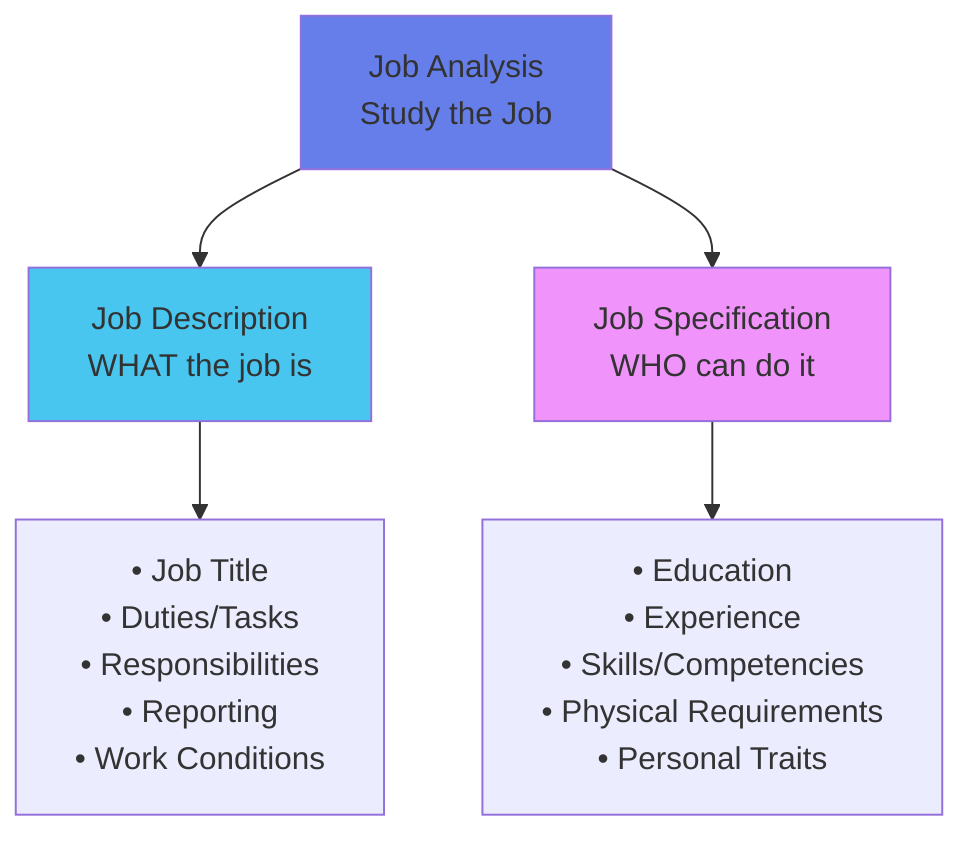
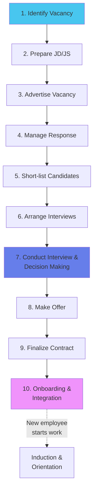
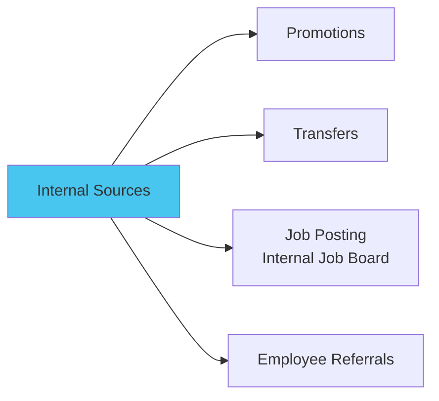
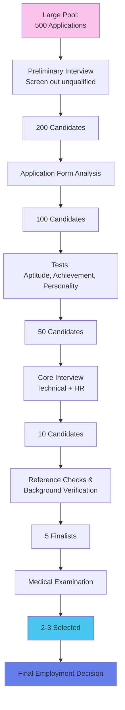

# Module 4: Staffing & HRM 👥

:::tip[Learning Objectives]
By mastering this module, you will:
1. **Understand** Staffing through the Systems Approach
2. **Differentiate** HRM vs HRD with clarity
3. **Create** Job Descriptions and Job Specifications (practical skill)
4. **Master** the 10-Step Recruitment Process
5. **Analyze** Selection methods and Training trends
6. **Distinguish** Induction vs Orientation
:::

---

## 4.1 Fundamentals of Staffing

:::info[Staffing Function]
**Staffing** involves filling and keeping filled the positions in the organization structure through:
- Identifying workforce requirements
- Recruiting, selecting, and placing candidates
- Promoting, appraising, and compensating employees
- Training and developing the workforce
:::

**Position in Management Cycle:**

---

## 4.2 Systems Approach to Staffing ⭐

:::info[Staffing as an Open System]
The staffing function doesn't operate in isolation—it's an open system interacting with internal and external environments.
:::

:::danger[PYQ Question Pattern]
**(Ref: Dec 2024, May 2025, June 2025)**
"Using a clear diagram, describe the Systems Approach to Staffing and explain its significance in recruitment/selection."
:::

**Significance:**
1. **Holistic View:** Shows staffing isn't just "hiring" but an integrated system
2. **Feedback Loop:** Performance data informs future recruitment criteria
3. **Environmental Awareness:** Considers labor laws, market conditions
4. **Continuous Improvement:** Each cycle refines the process

---

## 4.3 HRM vs HRD

:::warning[Common Exam Question]
"Analyze the differences between HRM and HRD. How do they complement each other for long-term success?"
:::

### Detailed Comparison

| Dimension | HRM (Human Resource Management) | HRD (Human Resource Development) |
|:----------|:-------------------------------|:--------------------------------|
| **Focus** | Managing people as resources | Developing people's potential |
| **Orientation** | **Reactive** (solving current problems) | **Proactive** (building future capability) |
| **Time Horizon** | Short-term efficiency | Long-term growth |
| **Scope** | Hiring, Payroll, Compliance, Admin | Training, Career Development, Mentoring |
| **Nature of Functions** | Administrative, Control-oriented | Learning-oriented, Growth-focused |
| **Primary Goal** | Employee **Performance** (current job) | Employee **Competence** (future roles) |
| **Measurement** | Turnover rate, Time-to-hire, Cost per hire | Skill acquisition, Career progression, Leadership pipeline |
| **Typical Activities** | • Recruitment • Salary admin • Leave management • Industrial relations • Compliance | • Training programs • Career planning • Succession planning • Leadership development • Performance coaching |
| **Example** | "Hire a Python developer with 3 years exp" | "Train our Java developers to learn Python for future projects" |

### How They Complement Each Other

:::info[Complementary Relationship]
- **Without HRM:** HRD has no one to develop (no talent pipeline)
- **Without HRD:** HRM's hired talent stagnates and leaves (high attrition)
- **Together:** Acquire smart people (HRM) + Continuously grow them (HRD) = Long-term organizational success
:::

---

## 4.4 Job Analysis: The Foundation

:::info[Job Analysis]
The systematic process of collecting information about a job's duties, responsibilities, necessary skills, outcomes, and work environment.
:::

### Job Analysis Output: Two Critical Documents

### Job Description vs Job Specification

| Aspect | Job Description (JD) | Job Specification (JS) |
|:-------|:--------------------|:----------------------|
| **Question Answered** | "What is the job?" | "Who should we hire?" |
| **Content** | Tasks, duties, responsibilities | Qualifications, skills, traits |
| **Focus** | The **position itself** | The **ideal candidate** |
| **Example Entry** | "Manage team of 5 developers; conduct code reviews" | "B.Tech CS, 5+ years, Python/Java proficiency" |

---

### Practical Exercise: Drafting JD/JS ⭐

:::danger[Common PYQ Pattern]
"You are an HR manager. Prepare a comprehensive Job Description and Job Specification for a Graduate Engineer Trainee for R&D department."
:::

**Model Answer:**

**JOB DESCRIPTION: Graduate Engineer Trainee (R&D)**

| Field | Details |
|:------|:--------|
| **Job Title** | Graduate Engineer Trainee (Mechanical R&D) |
| **Department** | Research & Development |
| **Reports To** | R&D Manager / Senior Engineer |
| **Job Summary** | Assist in design, prototyping, and testing of new mechanical systems. Conduct experiments, analyze data, and document results under supervision. |
| **Duties & Responsibilities** | 1. Assist senior engineers in CAD modeling and simulation 2. Conduct lab tests and record observations 3. Analyze test data and prepare technical reports 4. Maintain laboratory equipment and ensure safety protocols 5. Participate in design review meetings 6. Support patent documentation process |
| **Work Conditions** | Laboratory and office environment; may require occasional field visits to manufacturing plants. Standard 40-hour week with flexible hours during critical project phases. |
| **Career Path** | Junior Engineer → Senior Engineer → Lead R&D Engineer |

**JOB SPECIFICATION: Graduate Engineer Trainee (R&D)**

| Field | Details |
|:------|:--------|
| **Education** | B.E./B.Tech in Mechanical/Automobile/Aerospace Engineering Minimum 7.0 CGPA or equivalent |
| **Experience** | Fresher (0-1 year) Internship experience in R&D/Product Design preferred |
| **Technical Skills** | • CAD software (SolidWorks/CATIA/AutoCAD) • MATLAB/Simulink basics • Understanding of manufacturing processes • Knowledge of FEA (Finite Element Analysis) - desirable |
| **Competencies** | • Analytical thinking & problem-solving • Attention to detail • Quick learner • Good communication (written & verbal) |
| **Personal Traits** | • Team player with collaborative mindset • Willingness to work in fast-paced environment • Curious and innovative • Safety-conscious |
| **Physical Requirements** | Ability to stand for extended periods during lab work; normal vision (corrected) for precision measurements |

---

## 4.5 Recruitment: The 10-Step Process

:::info[Recruitment Definition]
**Recruitment** is the process of searching for and obtaining applicants for jobs, from among whom the right people can be selected.
:::

### Step-by-Step Breakdown

| Step | Description | Tools/Methods |
|:-----|:-----------|:-------------|
| **1. Identify Vacancy** | Recognize need (expansion, attrition, new project) | Workforce planning, Budget approval |
| **2. Prepare JD/JS** | Define what the job entails & ideal candidate profile | Job analysis |
| **3. Advertise** | Publicize the opening to attract applicants | Job portals, Campus drives, Social media, Employee referrals |
| **4. Manage Response** | Receive and organize applications | ATS (Applicant Tracking System), Database |
| **5. Short-list** | Screen CVs to identify qualified candidates | Resume screening, Keyword matching |
| **6. Arrange Interviews** | Schedule interviews, coordinate with candidates & panels | Calendar tools, Communication |
| **7. Conduct & Decide** | Interview candidates, assess fit, make hiring decision | Structured interviews, Assessments |
| **8. Make Offer** | Extend formal job offer (salary, joining date) | Offer letter, Negotiation |
| **9. Finalize Contract** | Sign employment contract, complete documentation | Legal agreements, Background verification |
| **10. Onboarding** | Integrate new hire into organization | Orientation program, Buddy system |

---

### Recruitment Sources

:::info[Internal vs External Recruitment]
:::

#### Internal Sources (Promote from Within)

**Advantages of Internal Recruitment:**
1. **Motivation:** Boosts morale; shows career growth possible
2. **Cost:** Cheaper (no advertising, agency fees)
3. **Known Quantity:** Performance track record already established
4. **Faster Onboarding:** Already familiar with culture, processes
5. **Loyalty:** Builds commitment

**Disadvantages:**
1. Limited talent pool
2. May create internal politics (who gets promoted?)
3. "Inbreeding"—lack of fresh perspectives

---

#### External Sources (Bring Fresh Talent)

| Source | Description | Best For |
|:-------|:-----------|:---------|
| **Online Job Portals** | Naukri, LinkedIn, Indeed | Wide reach, mid-level roles |
| **Campus Recruitment** | Tie-ups with universities | Entry-level, fresh talent pipeline |
| **Employment Agencies** | Headhunters, consultancies | Senior roles, niche skills |
| **Social Media** | LinkedIn, Twitter recruitment | Tech roles, employer branding |
| **Walk-ins** | Candidates apply directly | Frontline, retail positions |
| **Advertisements** | Newspaper, trade journals | Traditional industries |
| **Employee Referrals** | Current employees recommend | High quality, cultural fit |

:::danger[PYQ Question]
**(Ref: Nov 2024)** "Evaluate three recruitment methods. For each, provide examples and assess how it aligns with organizational goals."
:::

**Model Answer:**

1. **Campus Recruitment**
   - *Example:* Infosys hires 10,000+ freshers annually from engineering colleges
   - *Alignment:* Builds long-term talent pipeline; fresh grads are trainable, cost-effective, and bring latest academic knowledge

2. **Employee Referral Programs**
   - *Example:* Google offers referral bonuses ($2,000-$4,000)
   - *Alignment:* Employees refer candidates who fit culture; faster hiring, better retention

3. **Executive Search Firms (Headhunters)**
   - *Example:* CEO search for a Fortune 500 company
   - *Alignment:* Senior roles require confidentiality, extensive network access, and rigorous vetting

---

## 4.6 Selection: The Funnel Process

:::info[Selection]
**Selection** is the process of choosing from among candidates, from within or outside, the most suitable person for the current or future position.
:::

### Selection Steps Detailed

#### 1. Preliminary Interview (Screening)
- **Purpose:** Eliminate clearly unqualified (e.g., no degree, wrong domain)
- **Duration:** 5-10 minutes
- **Outcome:** 50-60% rejected

#### 2. Application Form / Resume Analysis
- **Purpose:** Gather standardized information
- **What's Checked:** Education, experience, gaps in employment

#### 3. Tests

| Test Type | Measures | Example |
|:----------|:---------|:--------|
| **Aptitude** | Potential/Ability to learn | Logical reasoning, Quantitative ability |
| **Achievement** | Current knowledge/skill | Coding test for programmer |
| **Intelligence** | General mental ability (IQ) | Pattern recognition, Problem-solving |
| **Personality** | Traits, temperament | Myers-Briggs, Big Five |
| **Interest** | Career preferences | Holland's RIASEC model |

#### 4. Core Interview (Main Round)
- **Technical Interview:** Domain knowledge, problem-solving
- **HR Interview:** Cultural fit, salary expectations, career goals

:::danger[Differentiate: Preliminary vs Core Interview]
**(PYQ: June 2025)**

| Aspect | Preliminary Interview | Core Interview |
|:-------|:---------------------|:--------------|
| **Purpose** | Elimination of unqualified | Deep assessment of fit |
| **Duration** | 5-15 minutes | 45-90 minutes |
| **Conducted By** | Junior HR/Receptionist | Senior managers, Technical experts |
| **Focus** | Basic eligibility check | Skills, experience, cultural fit |
| **Outcome** | GO/NO-GO decision | Ranking of candidates |
:::

#### 5. Reference Checks
- Contact previous employers, professors
- Verify employment dates, job title, performance

#### 6. Medical Examination
- Ensure physical fitness for job demands
- Identify pre-existing conditions (for insurance)

---

## 4.7 Induction & Orientation

:::info[Induction vs Orientation]
Two terms often confused:
:::

| Aspect | **Induction** | **Orientation** |
|:-------|:-------------|:---------------|
| **Scope** | **Broad** introduction to organization | **Specific** introduction to job/department |
| **Duration** | Days to weeks | First few days |
| **Content** | • Company history, mission, values • Organizational structure • Policies (leave, code of conduct) • Benefits, Compensation | • Department tour • Meet team members • Workspace setup • Job-specific training • Immediate tasks |
| **Conducted By** | HR Department | Immediate supervisor/manager |
| **Goal** | Socialization into company culture | Functional readiness for the role |

:::danger[PYQ Question]
**(Ref: June 2025)** "Differentiate between orientation and induction programs, highlighting objective and content."
:::

---

## 4.8 Training & Development

### Training vs Development

| Dimension | **Training** | **Development** |
|:----------|:------------|:---------------|
| **Focus** | **Current job** performance | **Future roles** and growth |
| **Time Horizon** | Short-term | Long-term |
| **Scope** | Narrow (specific skill) | Broad (general competencies) |
| **Example** | "Learn Excel for data entry" | "Leadership workshop for future managers" |
| **Outcome** | Increased efficiency in current tasks | Career advancement, Succession pipeline |

---

### Training Methods

#### On-the-Job Training (OJT)

| Method | Description | Best For |
|:-------|:-----------|:---------|
| **Job Rotation** | Move through different roles | Management trainees, Cross-functional exposure |
| **Coaching** | One-on-one guidance by supervisor | New hires, Performance improvement |
| **Mentoring** | Senior employee guides junior (long-term) | Career development, Leadership pipeline |
| **Apprenticeship** | Combine classroom + hands-on (years) | Skilled trades (electrician, plumber, machinist) |

#### Off-the-Job Training

| Method | Description | Best For |
|:-------|:-----------|:---------|
| **Lectures/Seminars** | Classroom instruction | Theoretical knowledge, Large groups |
| **Case Studies** | Analyze real business scenarios | Management, Decision-making skills |
| **Role Playing** | Act out situations | Soft skills, Customer service, Negotiations |
| **Simulations** | Replicate work environment (flight simulator) | High-risk jobs (pilots, surgeons) |
| **E-Learning/Webinars** | Online courses | Remote workforce, Self-paced learning |

---

### Current Trends in Training & Development ⭐

:::danger[High-Frequency Question]
**(Ref: Nov 2024, May 2025)** "Identify and examine three current trends in Training & Development. Analyze potential impact on employee performance with examples."
:::

#### 1. Microlearning

:::info[Bite-Sized Learning]
**Definition:** Delivering training in small, focused chunks (5-10 min modules)
**Example:** Duolingo (language learning), LinkedIn Learning's short videos
**Impact:**
- Higher engagement (fits attention span)
- Just-in-time learning (learn when needed)
- Mobile-friendly (learn on commute)
:::

#### 2. Gamification

:::info[Making Learning Fun]
**Definition:** Using game elements (points, badges, leaderboards) in training
**Example:** Deloitte's leadership academy uses badges; call center uses leaderboards for sales training
**Impact:**
- Increased motivation through competition
- Better retention through active participation
- Real-time feedback
:::

#### 3. AI & VR/AR Training

:::info[Immersive Technology]
**Definition:** Using AI chatbots for Q&A; VR for realistic simulations
**Example:**
- Walmart uses VR for Black Friday crowd management training
- Surgeons practice on VR before real operations
**Impact:**
- Risk-free practice for dangerous scenarios
- Personalized learning paths through AI
- Cost savings (no physical mock-ups needed)
:::

#### 4. Focus on Soft Skills

:::info[EQ > IQ]
**Trend:** Emphasis on communication, empathy, adaptability, emotional intelligence
**Why:** Automation handles technical tasks; humans need soft skills for collaboration
**Example:** Google's "Search Inside Yourself" mindfulness program
:::

#### 5. Personalized Learning Paths

:::info[Customized Development]
**Trend:** AI creates individual learning plans based on skill gaps, career goals
**Example:** Coursera for Business tailors courses; LinkedIn skill assessments recommend learning
**Impact:**
- Addresses specific employee needs
- Improves engagement (relevant content)
:::

---

## 📚 EXHAUSTIVE QUESTION BANK

### Section A: HRM vs HRD

:::note[Q1. HRM-HRD Integration]
**(PYQ: Nov 2024)**
"Analyze the differences between HRM and HRD. How do these functions complement each other in achieving long-term organizational success?"

**Model Answer:**
*(Use comparison table from Section 4.3)*

**Complementary Nature:**
- **Acquisition + Development = Competitive Advantage**
- HRM ensures you have people; HRD ensures they're the RIGHT people
- Example: TCS hires 40,000 freshers/year (HRM) → 3-month training program (HRD) → Industry-ready engineers
- Without HRD: Hired talent stagnates → Leaves for better opportunities (high attrition cost)
- Without HRM: HRD has no pipeline to develop
:::

:::note[Q2. HRM Challenges in Tech Industry]
Modern IT companies face high attrition (20-25% annually). As an HRM head:
a) Identify THREE HRM challenges
b) Propose HRD interventions to address retention
(6 marks)
:::

### Section B: Job Analysis & Description

:::note[Q3. Draft JD/JS for Entry-Level Position]
**(PYQ Pattern: Dec 2024, June 2025)**
"You are an executive at management level. Prepare a comprehensive Job Description and Job Specification for a Graduate Engineer Trainee in R&D department."

*(Refer to model answer in Section 4.4)*
:::

:::note[Q4. JD/JS for Your Own Domain]
**(PYQ: June 2025 Variation)**
"Draft a Job Description and Job Specification for an entry-level position in YOUR respective engineering domain (CS/Mech/ECE/etc.)."

**Your Task:** Write JD/JS for:
- CS: Software Development Engineer (SDE) - I
- Mech: Design Engineer (Trainee)
- ECE: VLSI Design Engineer (Entry Level)
(8 marks)
:::

:::note[Q5. Job Analysis Methods]
Explain THREE methods of conducting job analysis. When would you use each method? (5 marks)

**Hint:** Observation, Interview, Questionnaire, Critical Incident Technique
:::

### Section C: Systems Approach to Staffing

:::note[Q6. Systems Diagram & Significance]
**(PYQ: Dec 2024, May 2025, June 2025)**
"Using a clear diagram, describe the Systems Approach to Staffing and explain its significance in the recruitment/selection process."

**Answer:**
*(Draw Mermaid diagram from Section 4.2)*

**Significance Points:**
1. **Holistic Perspective:** Shows staffing as integrated system, not isolated steps
2. **Environmental Scanning:** Considers external factors (labor laws, market trends)
3. **Feedback Loop:** Performance appraisal data refines future recruitment criteria
4. **Continuous Improvement:** Each hiring cycle improves based on past outcomes
5. **Alignment:** Ensures staffing supports organizational strategy
:::

:::note[Q7. Systems Approach for Manufacturing Plant]
**(PYQ: Nov 2024)**
"How can 'Systems Approach to Staffing' help HR managers' activities in a manufacturing plant? Provide labeled sketch."

**Answer:**
- **Inputs:** Workforce plan (need 50 machine operators), labor market data
- **Process:** Recruit via local job fairs → Select via skill tests → Train on machinery safety
- **Outputs:** Skilled, safety-certified operators
- **Feedback:** Accident rates, productivity metrics inform next hiring criteria
:::

### Section D: Recruitment Process

:::note[Q8. The 10-Step Recruitment Process]
**(PYQ: Dec 2024, May 2025)**
"Describe the 10-step recruitment process for finding the right candidate for a job."

*(Answer using flowchart and table from Section 4.5)*
:::

:::note[Q9. Recruitment Methods Evaluation]
**(PYQ: Nov 2024)**
"Evaluate three recruitment methods. For each method, provide examples and assess how it aligns with organizational goals."

**Sample Answer Framework:**
- Method 1: Campus Recruitment (Goal: Long-term talent pipeline for growth)
- Method 2: Employee Referrals (Goal: Quality hires, culture fit)
- Method 3: LinkedIn Headhunting (Goal: Senior leadership with niche skills)
:::

:::note[Q10. Internal vs External Recruitment Decision]
**(PYQ: May 2025)**
"A leading FMCG company needs to fill a team leader position quickly. Instead of hiring externally, they decide to promote an experienced team member. Discuss why opting for internal recruitment is beneficial. Support with reasoning."

**Model Answer:**
1. **Speed:** Faster than external hiring (3 weeks vs 3 months)
2. **Known Performer:** Track record eliminates risk of bad hire
3. **Motivation:** Signals to all employees that growth is possible
4. **Onboarding:** Already knows culture, processes, products
5. **Cost:** No agency fees, advertising costs
6. **Succession Planning:** Develops internal leadership pipeline
:::

:::note[Q11. Recruitment Challenges]
**(PYQ: June 2025)**
"As a Talent Acquisition Manager, you face multiple recruitment challenges. Identify THREE major challenges and explain how you would address each to ensure effective and inclusive hiring."

**Sample Challenges & Solutions:**

**Challenge 1: Skills Shortage in Niche Domains (e.g., AI/ML)**
*Solution:* Partner with online platforms (Coursera/Udacity) to upskill internal talent; broaden search to adjacent skillsets (mathematicians for data science).

**Challenge 2: Unconscious Bias in Hiring**
*Solution:* Implement blind resume screening (remove names/photos); use structured interviews with standardized questions; train interviewers on bias awareness.

**Challenge 3: High Competition for Top Talent**
*Solution:* Build strong employer brand (showcase culture on Glassdoor); offer flexible work arrangements; create compelling EVP (Employee Value Proposition).
:::

### Section E: Selection Process

:::note[Q12. Differentiate Selection Steps]
**(PYQ: June 2025)**
"Differentiate between a Preliminary Interview and a Core Interview in the recruitment process. Explain the purpose of each stage."

*(Use comparison table from Section 4.6)*
:::

:::note[Q13. Types of Tests in Selection]
"A company is hiring for three roles: Software Engineer, Sales Executive, and Finance Manager. For each role, recommend TWO appropriate selection tests and justify why." (6 marks)
:::

:::note[Q14. Reference Check Ethics]
"During reference checks, a previous employer gives a negative review due to personal grudge (not performance). How should the hiring manager handle this ethically?" (4 marks)
:::

### Section F: Training & Development

:::note[Q15. Training vs Development]
**(PYQ: Dec 2024, May 2025)**
"As your organization's HR manager, you are responsible for employees' training and development. Discuss the processes of training and development. Also, shed light on current trends with suitable examples."

**Answer Structure:**
- **Part A:** Define Training (current job) vs Development (future roles)
- **Part B:** Process: Need Analysis → Design → Delivery → Evaluation
- **Part C:** Trends (Pick 3 from Section 4.8):
  1. Microlearning
  2. Gamification
  3. AI/VR
  - Give examples and impact for each
:::

:::note[Q16. Current Training Trends Analysis]
**(PYQ: Nov 2024)**
"Identify and examine three current trends in Training & Development. For each trend, analyze its potential impact on employee performance and organizational growth with examples from industry practices."

*(Use Section 4.8 detailed content)*
:::

:::note[Q17. Training ROI Calculation]
"A company spends ₹10 Lakhs on a sales training program. Post-training, sales increase by ₹50 Lakhs. However, some argue the sales increase would have happened anyway (market trend). How do you measure training effectiveness beyond revenue?" (5 marks)

**Hint:** Kirkpatrick's 4 Levels—Reaction, Learning, Behavior, Results
:::

:::note[Q18. On-Job vs Off-Job Training Decision]
For each scenario, recommend On-Job or Off-Job training and justify:
a) Teaching a barista to make latte art
b) Leadership development for middle managers
c) Safety protocol for nuclear plant technicians
d) Customer service skills for call center agents
(4 marks)
:::

### Section G: Induction & Orientation

:::note[Q19. Induction vs Orientation]
**(PYQ: June 2025)**
"Differentiate between orientation and induction programs conducted by organizations, highlighting objective and content."

*(Use comparison table from Section 4.7)*
:::

:::note[Q20. Design an Induction Program]
"Design a 5-day induction program for 20 new software engineers joining an IT company. Include daily agenda, activities, and expected outcomes." (8 marks)

**Sample Structure:**
- **Day 1:** Company overview, HR policies, IT setup
- **Day 2:** Product training, Meet senior leadership
- **Day 3:** Department orientation, Team introductions
- **Day 4:** Technical training (tools, codebase)
- **Day 5:** Buddy assignment, First project briefing
:::

---

:::note[Module 4 Key Takeaways]
✅ **Systems Approach** = Holistic view of staffing with feedback loop
✅ **HRM vs HRD** = Managing (present) vs Developing (future) - Both essential
✅ **JD vs JS** = WHAT the job is vs WHO can do it
✅ **10-Step Recruitment** = Identify → Advertise → Shortlist → Interview → Offer → Onboard
✅ **Training Trends** = Microlearning, Gamification, AI/VR, Soft Skills
:::

**Next:** **Module 5 - Leading & Motivation** where you'll master Theory X/Y, Herzberg, and leadership styles! 🎯
