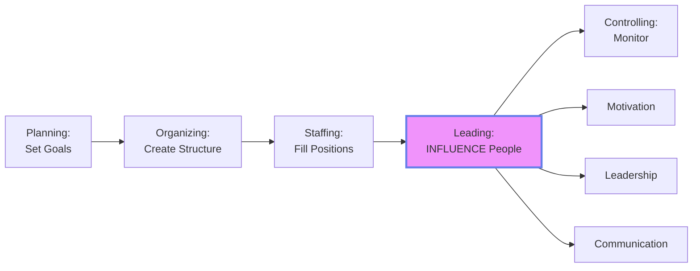
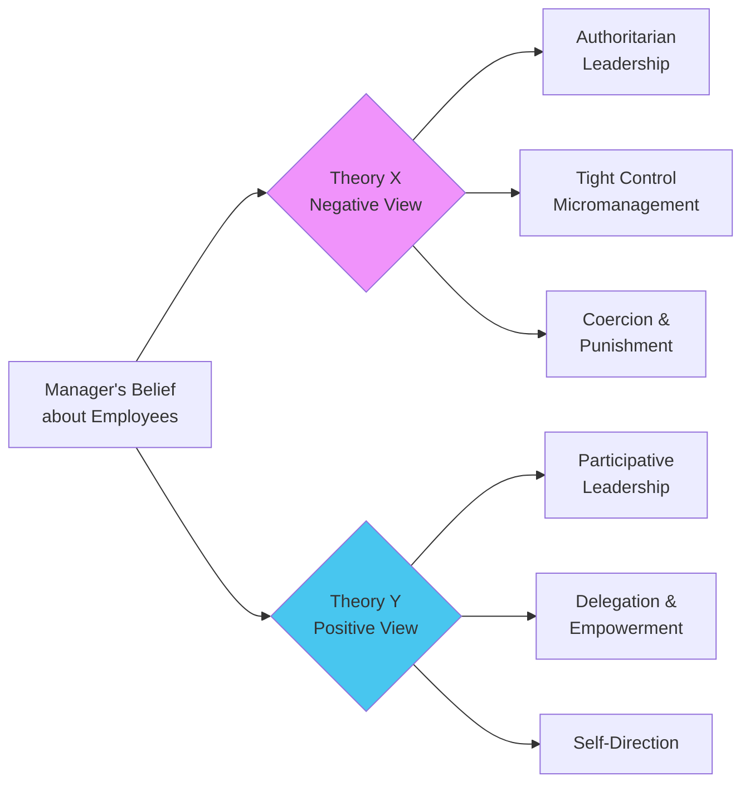
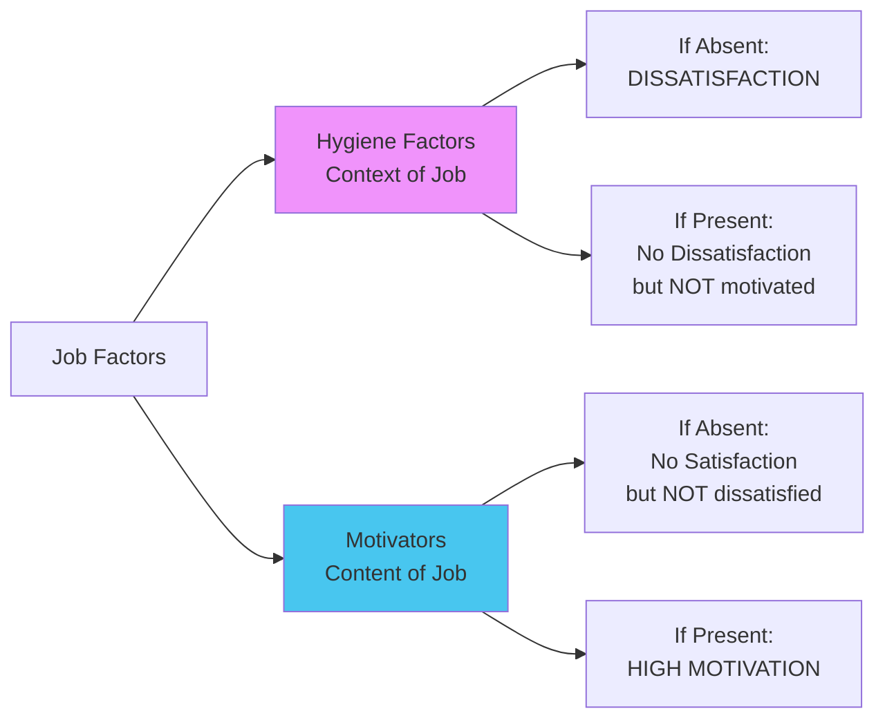
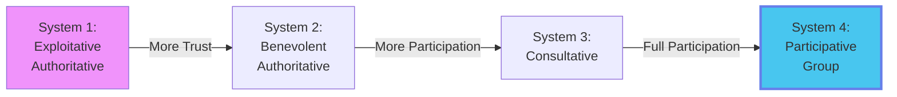
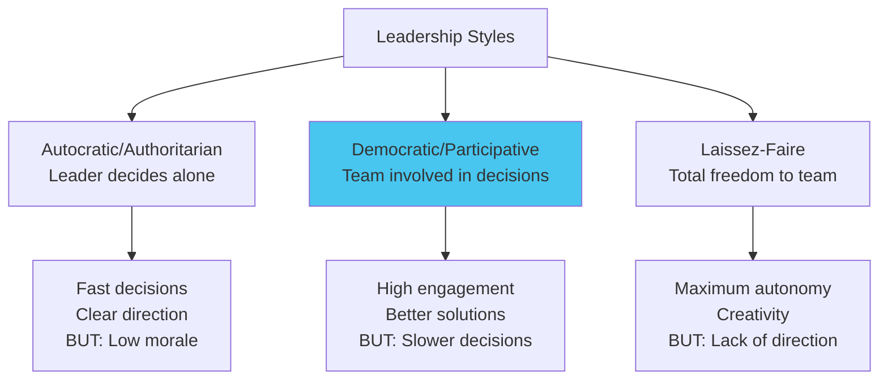

# Module 5: Leading & Motivation 🎯

:::tip[Learning Objectives]
By mastering this module, you will:
1. **Analyze** McGregor's Theory X and Theory Y with corporate applications
2. **Evaluate** Herzberg's Two-Factor Theory (Hygiene vs Motivators)
3. **Master** Likert's Four Systems of Management  
4. **Apply** Leadership Styles to case studies (TechNova pattern)
5. **Understand** Communication barriers and group dynamics
:::

---

## 5.1 The Nature of Leading

:::info[Leading Function]
**Leading** is the process of influencing people so that they contribute to organizational and group goals. It involves:
- Motivation
- Leadership
- Communication
- Team building
:::

---

## 5.2 McGre's Theory X and Theory Y ⭐

:::info[Two Views of Human Nature]
Douglas McGregor proposed that managers' assumptions about employees influence their leadership approach.
:::

### The Two Theories Compared

| Dimension | **Theory X Assumptions** | **Theory Y Assumptions** |
|:----------|:------------------------|:------------------------|
| **View of Work** | People inherently **dislike work** and avoid it | Work is as natural as **play or rest** |
| **Motivation** | Must be **coerced, controlled, threatened** | People can **exercise self-direction** toward goals they're committed to |
| **Responsibility** | People **avoid responsibility**, prefer to be directed | People **seek responsibility** and are creative |
| **Ambition** | Little ambition; want **security** above all | Capacity for imagination and ingenuity is widely distributed |
| **Intelligence** | Average person has limited capacity | Intellectual potential of average person is only partially utilized |

---

### Corporate Strategies Under Each Theory

:::danger[Common PYQ Pattern]
"Analyze McGregor's Theory X and Y. Give corporate examples of strategies a manager might use under each theory to motivate employees."
:::

#### Theory X Management Approach

:::warning[Authoritarian Style]
**Core Belief:** "Employees are lazy and need constant supervision."
:::

**Corporate Strategies:**

1. **Strict Supervision:**
   - *Example:* Call centers with screen monitoring software tracking every keystroke
   - Managers hover over employees, micromanage tasks

2. **Punishment-Based Motivation:**
   - *Example:* "Fail to meet sales target → Salary deduction"
   - Focus on penalties for non-performance

3. **Limited Autonomy:**
   - *Example:* Retail workers must follow exact scripts; zero deviation allowed
   - Management makes all decisions; employees just execute

4. **External Controls:**
   - *Example:* Time clocks, attendance penalties, detailed rules for everything
   - Assumes people will slack off if not watched

**When Theory X Works:**
- Highly routine, repetitive work (assembly line)
- Low-skill workforce needing direction
- Crisis situations requiring quick compliance

---

#### Theory Y Management Approach

:::info[Participative Style]
**Core Belief:** "Employees are self-motivated and thrive on responsibility."
:::

**Corporate Strategies:**

1. **Empowerment & Delegation:**
   - *Example:* **Google's 20% Time** - Engineers spend 20% of work on passion projects (Gmail, AdSense born from this)
   - Trust employees to make decisions

2. **Intrinsic Motivation:**
   - *Example:* **Atlassian's ShipIt Days** - 24-hour hackathons where teams build what they want
   - Focus on meaningful work, sense of achievement

3. **Participative Decision-Making:**
   - *Example:* **Toyota's Kaizen** - Workers on assembly line can stop production if they spot quality issues; ideas welcomed
   - Involve employees in problem-solving

4. **Recognition & Growth:**
   - *Example:* Tech companies' "Employee of the Month," learning budgets, clear career paths
   - Assumes people want to contribute and excel

**When Theory Y Works:**
- Knowledge work requiring creativity (software, R&D)
- Skilled, educated workforce
- Stable environments where innovation matters

---

### Limitations & Modern View

:::info[The Reality: Neither Extreme is Accurate]
- Not all people fit Theory X or Theory Y
- Situational factors matter (some tasks require tight control; others need autonomy)
- **Modern Approach:** Treat as a continuum, not binary choice
- Best managers adapt style to individual employee and task
:::

---

## 5.3 Herzberg's Two-Factor Theory ⭐

:::info[Motivation-Hygiene Theory]
Frederick Herzberg discovered that **satisfaction** and **dissatisfaction** are caused by **different factors**.

**Key Insight:** The opposite of satisfaction is NOT dissatisfaction, but "no satisfaction." They're on separate scales!
:::

### The Two Factor Lists

| **Hygiene Factors (Dissatisfiers)** | **Motivators (Satisfiers)** |
|:------------------------------------|:----------------------------|
| **Prevent dissatisfaction if adequate** | **Create satisfaction if present** |
| Related to job **CONTEXT** (environment) | Related to job **CONTENT** (the work itself) |
| • Company policy & administration • Supervision quality • **Salary** • Interpersonal relations • Working conditions • Job security | • Achievement • Recognition • The work itself (interesting?) • Responsibility • Advancement/Promotion • Growth opportunities |

:::warning[Common Misconception: Salary Motivates?]
**Herzberg's Answer: NO!**
- Salary is a **Hygiene Factor**
- Low salary → Dissatisfaction ✅
- High salary → No dissatisfaction, but doesn't motivate long-term ❌
- People get used to their salary quickly (hedonic adaptation)
- **What motivates:** Challenging work, recognition, growth
:::

---

### Corporate Application

:::danger[PYQ Pattern]
**(Ref: May 2025, June 2025)** "Analyze the corporate approach to employee motivation which aligns with Herzberg's Two-Factor Theory. Identify specific strategies and evaluate impact on retention and performance."
:::

**Model Answer Framework:**

#### Addressing Hygiene Factors (Eliminate Dissatisfaction)

| Factor | Corporate Strategy | Example Company |
|:-------|:----------------|:---------------|
| **Salary** | Competitive pay benchmarked to industry | Salesforce pays at 75th percentile |
| **Working Conditions** | Ergonomic furniture, Air-conditioned offices, Safe environment | Google's campuses with gyms, nap pods |
| **Company Policy** | Clear, fair policies (leave, grievance redressal) | Netflix's unlimited vacation policy |
| **Supervision** | Train managers to be supportive, not micromanagers | First-round manager training programs |
| **Job Security** | Transparent communication during restructuring | Toyota's no-layoff policy (historically) |

**Impact:** Reduces turnover, prevents complaints, BUT doesn't create high performance.

---

#### Leveraging Motivators (Create Satisfaction)

| Factor | Corporate Strategy | Example Company | Impact |
|:-------|:----------------|:---------------|:-------|
| **Achievement** | Set challenging but attainable goals; celebrate wins | Sales teams with stretch targets + rewards | Drives performance |
| **Recognition** | Employee of Month, Public praise, Peer recognition platforms | **Zappos** culture of constant appreciation | Boosts engagement |
| **Work Itself** | Job enrichment—add variety, complexity | **3M's 15% rule** (like Google's 20% time) | Increases creativity |
| **Responsibility** | Delegate ownership; allow decision-making | Nordstrom empowers salespeople to accept returns no-questions-asked | Builds accountability |
| **Growth** | Career development plans, training, mentorship | **P&G's** leadership pipeline (promote from within) | Retention of high performers |

**Impact:** High motivation, discretionary effort, innovation, long-term commitment.

---

### Herzberg's Recommendations for Managers

:::info[Job Enrichment (Not Enlargement!)]
- **Job Enrichment:** Add depth (more responsibility, autonomy, challenge)
  - *Example:* Let customer service rep design own scripts (vs follow exact script)
- **Job Enlargement:** Add breadth (more tasks of same level)
  - *Example:* Do data entry + filing + photocopying (all still boring)
- **Herzberg says:** Enrichment motivates; Enlargement just makes job bigger and still boring
:::

---

## 5.4 Likert's Four Systems of Managing ⭐

:::info[Likert's Model]
Rensis Likert categorized management styles into four systems based on **trust** and **participation**.
:::

### Detailed Comparison

| Characteristic | System 1 | System 2 | System 3 | System 4 |
|:--------------|:---------|:---------|:---------|:---------|
| **Leadership Style** | Exploitative Authoritative | Benevolent Authoritative | Consultative | Participative Group |
| **Trust in Subordinates** | **None** | Condescending (master-servant) | Substantial but not complete | Complete confidence |
| **Employee Motivation** | Fear, threats, punishment | Rewards + some fear | Rewards + occasional punishment | Economic rewards + group participation |
| **Communication Flow** | **Downward only** | Mostly down, some upward allowed | Both up and down | Free flow in all directions |
| **Decision-Making** | Top management exclusively | Top makes decisions after limited consultation | Broad policy at top; implementation delegated | Decisions throughout organization; fully integrated |
| **Goal Setting** | Orders issued | Orders issued, some comment opportunity | Goals set after discussion | Group sets goals |
| **Control** | Concentrated at top | Some delegation but tight limits | Moderate delegation | Widely shared responsibility |
| **Productivity** | Low to Medium | Medium | Good | **Excellent (Best)** |
| **Employee Satisfaction** | Very Low | Low | Moderate | **High** |

---

### System-by-System Analysis

:::warning[System 1: Exploitative Authoritative]
**Characteristics:**
- Zero trust; fear-based motivation
- Communication is orders only (no feedback)
- Decisions made at top with no input

**Example:** Sweatshop factories, Oppressive call centers

**Problems:**
- High turnover, Absenteeism
- No innovation (people afraid to speak)
- Low morale
:::

:::info[System 2: Benevolent Authoritative]
**Characteristics:**
- Paternalistic ("I know what's best for you")
- Rewards exist but fear still present
- Some upward communication tolerated

**Example:** Traditional family-run businesses in India

**Better than System 1 but:**
- Still top-down
- Employees feel infantilized
:::

:::info[System 3: Consultative]
**Characteristics:**
- Management consults employees before decisions
- Two-way communication
- Substantial trust (not complete)

**Example:** Modern corporations with suggestion boxes, town halls

**Improvement:**
- Employees feel heard
- Better ideas surface

**Limitation:**
- Final decision still at top (employees not owners of solutions)
:::

:::info[System 4: Participative Group (IDEAL)]
**Characteristics:**
- Complete trust and confidence
- Goals set collaboratively
- Decisions made at all levels
- Extensive teamwork

**Example:** Tech startups, Agile teams, Self-managed teams

**Benefits:**
- **Highest productivity**
- **Best quality**
- **Lowest turnover**
- Employees have ownership

**Requirement:**
- Requires mature, skilled workforce
- Time investment in building trust
:::

---

:::danger[PYQ Drawing Question]
**(Ref: Dec 2024, May 2025)** "Explain with a neat sketch Likert's Four Systems of Managing and examine the effect of each system on employee motivation and productivity."

**Answer:** Draw the Mermaid graph or a table, then explain:
- **Effect on Motivation:** System 1 (Fear-driven, extrinsic) → System 4 (Intrinsic, self-motivated)
- **Effect on Productivity:** System 1 (30-40% potential) → System 4 (90-100% potential due to engagement)
:::

---

## 5.5 Leadership Styles in Practice

:::info[Leadership vs Management]
- **Management:** Planning, Organizing, Controlling (doing things right)
- **Leadership:** Influencing, Inspiring, Visioning (doing the right things)
:::

### Major Leadership Styles

---

### Case-Based Application ⭐

:::danger[The TechNova Case (Nov 2024) / Innovatech Case (Dec 2024)]
These two cases appear frequently. Master the pattern!
:::

#### Pattern 1: TechNova (Two Different Teams)

:::note[TechNova Leadership Case]
**(PYQ: Nov 2024)**

**Scenario:**
"TechNova has two departments:
1. **Product Development:** Creative software engineers frustrated with strict oversight; creativity stifled; want freedom to explore ideas; flourish on brainstorming.
2. **Technical Support:** Fast-paced customer inquiries; quick responses essential; manager is directive with scripts and procedures; ensures consistency."

**Task:** Identify suitable leadership style for each department and justify.
:::

**Model Answer:**

**Product Development Team:**
- **Recommended Style:** **Democratic/Participative** (or even Laissez-Faire for highly skilled team)
- **Justification:**
  - *Nature of Work:* Creative, innovation-driven, non-routine
  - *Employee Characteristics:* Highly skilled engineers who value autonomy
  - *Evidence from Case:* *"Frustrated with strict oversight... creativity stifled... want freedom... flourish on brainstorming"*
  - **Outcome:** Participative style allows idea-sharing, experimentation, ownership → Better products

**Technical Support Team:**
- **Recommended Style:** **Autocratic/Directive**
- **Justification:**
  - *Nature of Work:* Routine, time-sensitive, requires consistency
  - *Goal:* Fast response times, standard quality
  - *Evidence from Case:* *"Fast-paced... quick responses essential... scripts and procedures... consistency"*
  - **Outcome:** Directive style ensures all customers get same high-quality service; reduces variance

---

#### Pattern 2: Innovatech (Motivation Theory Application)

:::note[Innovatech Motivation Case]
**(PYQ: Dec 2024)**

**Scenario:**
"Innovatech CEO faces challenges in two teams:
1. **Innovation Team:** Developers/designers on creative projects; good with flexibility; frustrated by **unclear goals** and **lack of growth opportunities** → scattered productivity
2. **Support Team:** Structured, repetitive tasks (data processing, customer support); inconsistent performance; **dissatisfaction with routine work**"

**Task:** Advise CEO on which Motivational theory to apply to each team.
:::

**Model Answer:**

**Innovation Team:**
- **Theory:** **Herzberg's Two-Factor Theory** (Focus on Motivators)
- **Problem Diagnosis:**
  - *"Unclear goals"* → Lack of Achievement
  - *"Lack of growth opportunities"* → No Advancement/Development
  - These are **Motivator deficiencies**
- **Solution:**
  - Set clear, challenging project goals (OKRs)
  - Create individual development plans
  - Recognize achievements publicly
  - Give ownership of projects (Responsibility)

**Support Team:**
- **Theory:** **Herzberg's Two-Factor Theory** (Job Enrichment needed)
- **Problem Diagnosis:**
  - *"Routine work"* → Boring content (Motivator issue)
  - **OR** Could use **Likert System 4** to increase participation
- **Solution:**
  - **Job Enrichment:** Allow customization of processes; let them suggest improvements
  - **Job Rotation:** Cross-train to break monotony
  - Recognize efficiency gains (Motivator: Recognition)
  - Involve in decision-making about workflow (Participative)

---

## 5.6 Communication & Group Dynamics

### Barriers to Effective Communication

:::info[Three Major Barrier Categories]
:::

| Barrier Type | Examples | How to Overcome |
|:------------|:---------|:---------------|
| **Perceptual** | Different interpretations based on background, biases | Seek feedback, Clarify assumptions |
| **Language** | Jargon, Technical terms, Ambiguous words | Use simple language, Define terms, Avoid acronyms |
| **Information Overload** | Too many emails, Too much data | Prioritize messages, Summarize key points |

:::danger[PYQ Question]
**(Ref: Nov 2024)** "In a technology organization, various barriers can hinder communication. Identify and discuss THREE common barriers and suggest ways to address them."
:::

---

### Group vs Team vs Committee

:::info[Distinctions]
:::

| Type | Definition | Key Characteristic | Example |
|:-----|:-----------|:------------------|:--------|
| **Group** | Collection of individuals interacting to share info and make decisions | **Individual accountability** | Department heads meeting |
| **Team** | Group whose efforts result in performance **greater than sum of parts** | **Mutual accountability**, Synergy | Agile software development team |
| **Committee** | Formal group created for a specific task, often ongoing | Structured, Permanent or temporary | Ethics Committee, Finance Committee |

**Team > Group** because of **synergy**: 2 + 2 = 5 (collective output exceeds individual contributions)

---

## 📚 EXHAUSTIVE QUESTION BANK

### Section A: Theory X & Y

:::note[Q1. McGregor's Theory with Corporate Examples]
**(PYQ: Nov 2024, June 2025)**
"Analyze McGregor's Theory X and Theory Y. Give corporate examples of strategies a manager might use under each theory to motivate employees toward organizational goals."

*(Full answer in Section 5.2)*
:::

:::note[Q2. Theory X/Y Corporate Strategies]
**(PYQ: June 2025)**
"Analyze the corporate approach to employee motivation which aligns with McGregor's Theory X and Theory Y. Identify specific strategies that fulfill each factor and evaluate impact on retention and performance."

**Answer Framework:**
- **Theory X Strategies:** Monitoring software, Penalty systems, Supervision
  - *Impact:* High compliance, Low creativity, High turnover
- **Theory Y Strategies:** Empowerment, 20% time, Participative goal-setting
  - *Impact:* High engagement, Innovation, Low turnover
:::

:::note[Q3. When Theory X is Appropriate]
"While Theory Y is generally preferred, argue for scenarios where Theory X management is necessary and effective." (5 marks)

**Hint:** Crisis management, Military, Highly routine work with low-skill workers
:::

:::note[Q4. Evolution from X to Y]
"A traditional manufacturing company transitioning from Theory X to Theory Y faces resistance. As a consultant, outline a 3-phase change management plan." (6 marks)
:::

### Section B: Herzberg's Two-Factor Theory

:::note[Q5. Herzberg Application]
**(PYQ: May 2025, June 2025)**
"Analyze the corporate approach to employee motivation which aligns with Herzberg's Two-Factor Theory. Identify specific corporate strategies that fulfill each factor and evaluate their impact on employee retention and performance."

*(Full answer in Section 5.3)*
:::

:::note[Q6. Salary as Motivator Debate]
"An employee says: 'You want me motivated? Pay me more!' Using Herzberg's theory, explain why doubling salary won't create long-term motivation. What would?" (5 marks)
:::

:::note[Q7. Job Enrichment vs Enlargement]
Compare Job Enrichment and Job Enlargement. For each, provide two examples and explain which Herzberg would recommend. (5 marks)
:::

:::note[Q8. Two-Factor Application to Retention Crisis]
"A software company faces 30% annual attrition. Exit interviews reveal: 'Good salary but boring work, no recognition, no growth.' Using Herzberg, diagnose the problem and propose solutions." (6 marks)
:::

### Section C: Likert's Four Systems

:::note[Q9. Likert's Four Systems Diagram]
**(PYQ: Dec 2024, May 2025)**
"Explain with a neat sketch Likert's Four Systems of Managing and examine the effect of each system on employee motivation and productivity."

*(Draw diagram from Section 5.4 + explain effects)*
:::

:::note[Q10. System Identification from Description]
Identify Likert's system for each:
a) "Employees participate in goal-setting; decisions made at multiple levels; trust is high."
b) "Manager makes all decisions after token consultation; some upward communication allowed."
c) "Workers controlled through fear; no feedback mechanisms."
(3 marks)
:::

:::note[Q11. Transition from System 2 to System 4]
"A company operates under System 2 (Benevolent Authoritative). CEO wants to move to System 4. What changes in trust, communication, and decision-making must occur? What are the risks?" (6 marks)
:::

### Section D: Leadership Styles (Case-Based)

:::note[Q12. TechNova Departments]
**(PYQ: Nov 2024)**
*(Full case and answer in Section 5.5)*
:::

:::note[Q13. Innovatech Two Teams]
**(PYQ: Dec 2024)**
*(Full case and answer in Section 5.5)*
:::

:::note[Q14. PSN Corporation - Four Leadership Styles]
**(PYQ: June 2025)**

**Scenario (Condensed):**
"PSN Corporation evolved through styles:
1. **Family business phase:** Prioritized employee well-being over productivity → Relaxed, friendly but declining performance
2. **Hands-off phase:** Managers avoided difficult decisions → Stagnation
3. **Target-driven phase:** New managers focused solely on operations, no concern for well-being → Dissatisfaction, high attrition
4. **Balanced phase:** Dedication to both people and production → High performance, innovation"

**Task:** Identify and explain the 4 leadership styles by citing lines. Discuss pros/cons.

**Answer:**
1. **Country Club Management** (People-focused, low production concern)
   - *Evidence:* *"Prioritized well-being over productivity... relaxed and friendly"*
   - *Pros:* Happy employees
   - *Cons:* *"Declining performance"*

2. **Impoverished Management** (Low people, low production concern)
   - *Evidence:* *"Hands-off... avoiding difficult decisions"*
   - *Cons:* *"Stagnation"*

3. **Task/Authority Management** (High production, low people)
   - *Evidence:* *"Target-oriented... little concern for well-being"*
   - *Pros:* *"Better production returns"*
   - *Cons:* *"Dissatisfaction... high attrition"*

4. **Team Management** (High people, high production) - **BEST**
   - *Evidence:* *"Dedication to both... collaborative... individual needs align with goals"*
   - *Pros:* *"High-performance teams, innovative solutions, appreciated by employees"*
:::

:::note[Q15. Situational Leadership]
"One employee needs close supervision (new hire), another needs autonomy (senior expert). Should a manager use the same leadership style for both? Defend your answer using situational leadership theory." (5 marks)
:::

### Section E: Communication

:::note[Q16. Communication Barriers]
**(PYQ: Nov 2024)**
"In a technology organization, identify and discuss three common barriers to effective communication and suggest ways to address them."

**Model Answer:**
1. **Technical Jargon (Language Barrier):**
   - *Example:* Engineer uses "API latency" with non-tech manager
   - *Solution:* Explain in simple terms; create glossary

2. **Information Overload:**
   - *Example:* 200 emails/day; important messages buried
   - *Solution:* Use priority flags; TL;DR summaries at top

3. **Cultural/Perceptual Barriers:**
   - *Example:* Global team; "yes" in some cultures means "heard," not "agree"
   - *Solution:* Cultural sensitivity training; confirm understanding
:::

:::note[Q17. Communication Process Model]
**(PYQ: June 2025)**
"Using well-structured block diagrams, elaborate on corporate communication and explain its process in a business environment."

**Answer:** Draw flow:
Sender → Encode → Message → Channel → Decode → Receiver → Feedback → Sender
:::

:::note[Q18. Upward vs Downward Communication]
Compare upward and downward communication. Give examples of each and explain which is often neglected in traditional hierarchies. Why is upward communication critical? (5 marks)
:::

### Section F: Group Development & Teams

:::note[Q19. Group vs Team vs Committee]
**(PYQ: Dec 2024, May 2025)**
"Summarize the different stages of group development. What distinguishes a committee, group, and team from one another?"

**Part A: Tuckman's Stages**
1. **Forming:** Polite, Figuring out team purpose
2. **Storming:** Conflict, Power struggles
3. **Norming:** Rules established, Cohesion builds
4. **Performing:** Productive, High performance
5. **Adjourning:** Disbanding (if temporary team)

**Part B:** *(Use comparison table from Section 5.6)*
:::

:::note[Q20. Building High-Performance Teams]
"You're managing a newly-formed project team (Storming stage—conflicts emerging). Using your knowledge of group development and motivation theories, propose a 5-step intervention plan to move the team to Performing stage." (8 marks)
:::

---

:::note[Module 5 Key Takeaways]
✅ **Theory X/Y** = Negative (control) vs Positive (empower) views of employees
✅ **Herzberg** = Hygiene (prevents dissatisfaction) ≠ Motivators (creates satisfaction)
✅ **Likert** = System 1 (Fear-based) → System 4 (Participative = Best)
✅ **Leadership Styles** = Match style to task (Creative work = Participative; Routine = Directive)
✅ **Team > Group** = Synergy and mutual accountability
:::

**Next:** **Module 6 - Controlling Process** where you'll master the 8-step process and control types! 📊
