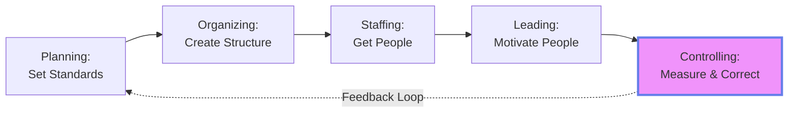
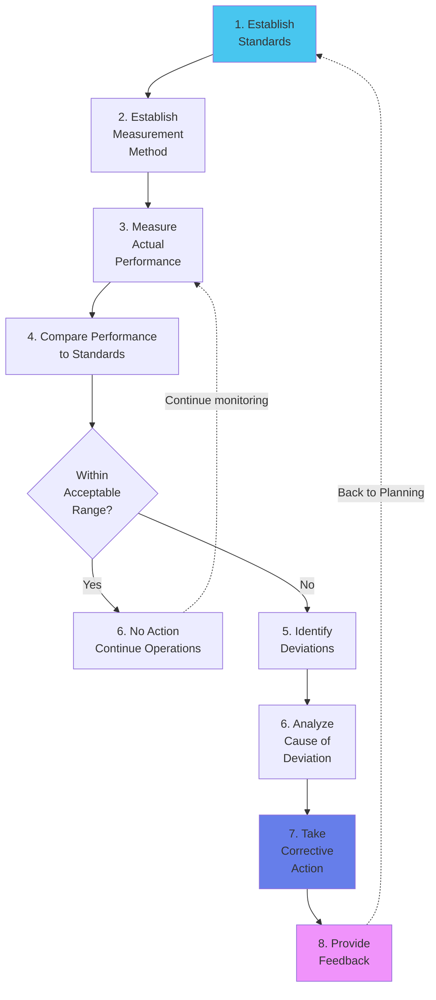
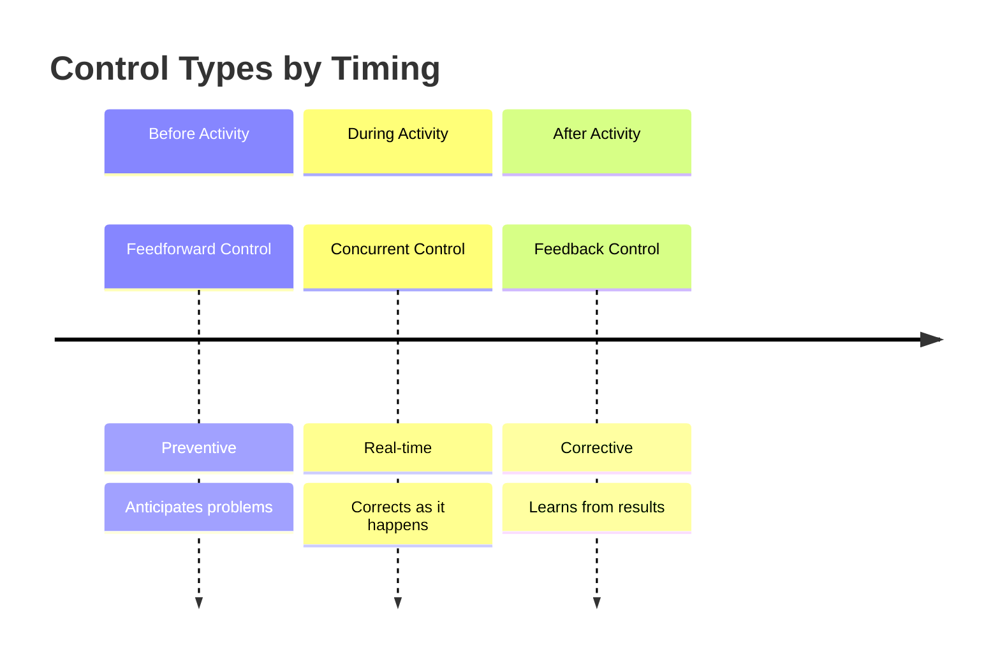

# Module 6: Controlling Process 📊

:::tip[Learning Objectives]
By mastering this module, you will:
1. **Understand** the nature and importance of Controlling
2. **Master** the 8-Step Control Process with diagrams
3. **Differentiate** Feedforward, Concurrent, and Feedback Control
4. **Apply** control concepts to case studies (TechGear/SmartGadgets pattern)
5. **Identify** Critical Point Standards from scenarios
:::

---

## 6.1 The Nature of Controlling

:::info[Controlling Function]
**Controlling** is the process of measuring and correcting performance to ensure that organizational objectives and plans are being accomplished.

**Key Aspects:**
- Measuring actual performance
- Comparing against standards
- Taking corrective action
:::

:::info[Controlling Closes the Loop]
- **Planning** sets the goals (Where we want to be)
- **Controlling** measures reality (Where we actually are)
- **Gap Analysis** → Corrective action to realign
:::

---

## 6.2 The 8-Step Control Process ⭐

:::warning[High-Frequency Exam Topic]
"With the help of a block diagram, list the 8 steps involved in controlling and discuss with a common example." **(Appears in 60% of exams)**
:::

### The Control Cycle

### Detailed Step-by-Step Breakdown

| Step | Description | Example (Production Quality Control) |
|:-----|:-----------|:-------------------------------------|
| **1. Establish Standards** | Define criteria/benchmarks for performance | **Standard:** Defect rate &lt; 1% |
| **2. Establish Measurement Method** | Decide HOW to collect performance data | **Method:** Inspect 100 units every hour |
| **3. Measure Performance** | Collect actual data | **Measurement:** This hour's batch has 3% defects (3 out of 100 defective) |
| **4. Compare to Standards** | Analyze gap between actual and standard | **Comparison:** 3% actual vs 1% standard = **2% deviation** |
| **5. Identify Deviations** | Pinpoint specific variances | **Deviation:** Defect rate is 3× higher than standard |
| **6. Analyze Cause** | Root cause analysis | **Investigation:** Machine calibration is off due to temperature changes |
| **7. Take Corrective Action** | Fix the problem | **Action:** Halt production, recalibrate machine, adjust environment control |
| **8. Provide Feedback** | Feed results back into planning | **Feedback:** Update SOP to include hourly temperature checks; revise training manual |

---

### Common Example: Sales Performance Control

:::tip[Sales Control Scenario]

1. **Standard:** Each salesperson must achieve ₹10 Lakh sales/month
2. **Measurement Method:** CRM system tracks daily sales; monthly reports generated
3. **Measure:** Salesperson A achieved ₹7 Lakh in Month 1
4. **Compare:** ₹7L actual vs ₹10L standard = ₹3L shortfall (30% below)
5. **Identify Deviation:** Underperformance by 30%
6. **Analyze Cause:** Investigation reveals:
   - Salesperson new to territory (learning curve)
   - Competitor launched aggressive pricing campaign
7. **Corrective Action:**
   - Provide mentorship from senior salesperson
   - Adjust pricing strategy OR offer bundle deals to counter competition
8. **Feedback:**
   - Revise onboarding for new hires (more shadowing time)
   - Update competitive intelligence reports monthly
:::

---

## 6.3 Types of Control (Timing-Based) ⭐

:::info[When Control Occurs Matters]
Controls can be applied **before**, **during**, or **after** the activity.
:::

### A. Feedforward Control (Preventive/Preliminary)

:::info[Feedforward Control]
**Anticipates** problems **before they occur** by monitoring inputs and preventing deviations.

**Timing:** **BEFORE** the work activity
**Focus:** **Inputs** (Resources, Materials, People)
**Goal:** **Prevention**
:::

**Characteristics:**
- Proactive, not reactive
- Most desirable type (prevents waste)
- Requires good forecasting

**Examples:**

| Scenario | Feedforward Action |
|:---------|:------------------|
| **Launching new product** | Market research to forecast demand **before** production |
| **Hiring** | Thorough selection process to hire right people **before** they start |
| **Semiconductor shortage** | **(SmartGadgets Case)** Negotiate long-term contracts with multiple suppliers; increase inventory by 75% **before** shortage hits |
| **Supply chain disruption** | **(TechGear Case)** Proactively order additional components **before** product launch |
| **Exam preparation** | Solve previous year papers **before** exam to identify weak areas |

:::danger[Keywords to Identify Feedforward]
- "Proactively"
- "In anticipation of..."
- "Before the activity"
- "Preventive measures"
- "Orders additional materials/components in advance"
:::

---

### B. Concurrent Control (Real-Time/Steering)

:::info[Concurrent Control]
Takes place **while** the work activity is in progress. Corrects problems **immediately** as they occur.

**Timing:** **DURING** the work activity
**Focus:** **Process** (Ongoing operations)
**Goal:** **Immediate correction**
:::

**Characteristics:**
- Real-time monitoring
- Allows instant adjustments
- Requires active supervision

**Examples:**

| Scenario | Concurrent Action |
|:---------|:-----------------|
| **Assembly line** | **(SmartGadgets Case)** Real-time monitoring detects defective earbuds; manager **immediately halts** faulty line, identifies calibration issue, rectifies |
| **Live customer service** | Supervisor listens to calls and can intervene if agent is struggling |
| **Surgery** | Anesthesiologist monitors vitals **during** operation; adjusts dosage if needed |
| **Classroom teaching** | Teacher observes student confusion **during** lecture; re-explains concept immediately |
| **Software deployment** | DevOps monitors server load **during** release; rolls back if errors spike |

:::danger[Keywords to Identify Concurrent]
- "During production/operation"
- "Real-time monitoring"
- "Immediately halts/stops"
- "While activity is in progress"
- "Detects and corrects on the spot"
:::

---

### C. Feedback Control (Post-Action/Corrective)

:::info[Feedback Control]
Occurs **after** the activity is completed. Focuses on **outputs** to guide future performance.

**Timing:** **AFTER** the work activity
**Focus:** **Outputs** (Results, Outcomes)
**Goal:** **Learning and future improvement**
:::

**Characteristics:**
- Reactive (after the fact)
- Can't undo what happened, only improve next time
- Most common type (easy to implement)

**Examples:**

| Scenario | Feedback Action |
|:---------|:----------------|
| **Product launch** | **(TechGear Case)** After launch, analyze customer feedback about battery life and software glitches; develop software update for next iteration |
| **Financial statements** | Quarterly profit/loss report shows cost overruns; adjust budget for next quarter |
| **Exam results** | Student reviews mistakes **after** exam; studies those topics for next test |
| **Project completion** | Post-mortem meeting to identify what went right/wrong; document lessons learned |
| **Customer satisfaction survey** | Collect feedback **after** service delivery; train staff based on complaints |

:::danger[Keywords to Identify Feedback]
- "After the activity/launch/completion"
- "Analyzed customer feedback"
- "Post-mortem" / "Lessons learned"
- "For the next iteration/run/quarter"
- "Reviews results to improve future"
:::

---

### Comparison Table

| Aspect | Feedforward | Concurrent | Feedback |
|:-------|:-----------|:-----------|:---------|
| **Timing** | **Before** | **During** | **After** |
| **Focus** | Inputs | Process | Outputs |
| **Nature** | Preventive | Corrective (immediate) | Corrective (future) |
| **Cost** | Low (prevents waste) | Medium | High (damage done) |
| **Desirability** | **Most desirable** | Desirable | Necessary but reactive |
| **Example** | Pre-flight checklist | Pilot adjusts altitude mid-flight | Black box analysis after crash |

---

## 6.4 Critical Point Standards

:::info[Critical Point Standards]
Specific, measurable performance targets at **key strategic points** in the process.

**Why "Critical Points"?**
- Can't monitor everything (too expensive)
- Focus on areas with highest impact
- Easier to control at specific checkpoints
:::

### Types of Critical Point Standards

1. **Physical Standards:** Units produced, Defect rate, Inventory levels
2. **Cost Standards:** Cost per unit, Budget variance, ROI
3. **Revenue Standards:** Sales targets, Market share
4. **Time Standards:** Delivery time, Production cycle time
5. **Quality Standards:** Customer satisfaction score, Return rate

:::danger[PYQ Pattern]
**(Ref: Nov 2024)** "Identify and explain TWO critical point standards by quoting the line."
:::

**Example from TechGear Case:**
- **Standard 1 (Quality):** *"TechGear's goal was 100% customer satisfaction"*
  - This is a **quality standard** (customer satisfaction metric)
- **Standard 2 (Capacity):** *"Critical standard was to not exceed planned production capacity of 2000 units"*
  - This is a **capacity/量 standard** (maximum output limit)

---

## 📚 EXHAUSTIVE QUESTION BANK

### Section A: The 8-Step Process

:::note[Q1. 8-Step Process with Diagram]
**(PYQ: Dec 2024, May 2025, June 2025)**
"With the help of a block diagram, list the 8 steps involved in the controlling process and discuss the steps with the help of a common example."

*(Use Mermaid flowchart from Section 6.2 + Sales or Production example)*
:::

:::note[Q2. Apply 8 Steps to Inventory Management]
"A warehouse has excessive stock of Product X (₹50L worth) sitting unsold for 6 months. Apply the 8-step control process to address this inventory problem." (8 marks)

**Answer Framework:**
1. **Standard:** Max 3 months of inventory; Turnover ratio ≥ 4
2. **Method:** Monthly inventory audit reports
3. **Measure:** Product X has 6 months stock
4. **Compare:** 6 months vs 3 months standard = **100% excess**
5. **Deviation:** Massive overstocking
6. **Analyze:** Demand forecast was wrong; competitor launched better product
7. **Corrective Action:** Discount sale to clear stock; halt production of X
8. **Feedback:** Improve demand forecasting model; add competitor analysis step
:::

:::note[Q3. When Corrective Action is Not Needed]
"In the 8-step process, under what circumstances would Step 7 (Corrective Action) be skipped?" (3 marks)

**Answer:** When Step 4 (Comparison) shows performance is **within acceptable range** of the standard (even if not perfect). Minor deviations don't warrant action if costs of correction exceed benefits.
:::

:::note[Q4. Feedback Loop Importance]
"Explain why Step 8 (Provide Feedback) is critical for organizational learning. Give an example of poor feedback leading to repeated failures." (5 marks)
:::

### Section B: Types of Control (Case-Based) ⭐

:::note[Q5. TechGear Smartwatch Case]
**(PYQ: Nov 2024)**

**Scenario:**
"TechGear is launching a new smartwatch. The supply chain manager **proactively orders additional components and materials** needed for production. HR hires 25 temporary workers and schedules overtime to ramp up capacity. As launch date approaches, marketing projects demand will **exceed planned production capacity (2000 units)**. After launching, 850 customers provided feedback reporting **issues with battery life and software glitches**, **affecting the company's goal of 100% customer satisfaction**. The product development team **analyzed customer feedback** and identified that a software update is needed."

**Questions:**
a) Identify and explain the TWO types of control by quoting lines.
b) Identify and explain TWO critical point standards by quoting lines.

**Model Answer:**

**Part A: Types of Control**

**1. Feedforward Control (Preventive)**
- *Quoted Line:* *"The supply chain manager **proactively orders** additional components and materials needed for production."*
- *Explanation:* This is feedforward because the manager anticipates the need **before** production begins. The action **prevents** a shortage that could halt production.

**2. Feedback Control (Corrective)**
- *Quoted Line:* *"After launching the smartwatch, 850 customers provided feedback... The product development team **analyzed customer feedback** and identified that a software update is needed."*
- *Explanation:* This is feedback because the issues (battery, glitches) are discovered **after** the product is sold. The team will improve the **next iteration** based on this learning.

**Part B: Critical Point Standards**

**Standard 1: Quality/Customer Satisfaction**
- *Quoted Line:* *"The company's goal was **100% customer satisfaction**."*
- *Explanation:* This is a **quality standard**—a specific, measurable target for customer experience.

**Standard 2: Production Capacity**
- *Quoted Line:* *"Another critical standard was to **not exceed the planned production capacity of 2000 units**."*
- *Explanation:* This is a **capacity/output standard**—a ceiling on how much can be manufactured without compromising quality or incurring extra costs.
:::

:::note[Q6. SmartGadgets Semiconductor Case]
**(PYQ: June 2025)**

**Scenario:**
"SmartGadgets Inc. learns about an impending global semiconductor shortage. To secure production, the manager **negotiates long-term contracts with multiple-chip suppliers** across different regions, reducing dependence on a single source. They **increase semiconductor inventory by 75%**, ensuring buffer stock. **During production, real-time monitoring detects** that one assembly line is producing a higher-than-usual number of defective earbuds. The production manager **immediately halts the faulty line**, identifies a calibration issue in the semiconductor component attachment machine, and rectifies the problem **before its escalation**."

**Task:** Identify and explain the TYPE of CONTROL(s) used by quoting lines. What is the significance?

**Model Answer:**

**1. Feedforward Control**
- *Quoted Lines:*
  - *"Negotiates long-term contracts with multiple suppliers"*
  - *"Increase semiconductor inventory by 75%"*
- *Explanation:* Both actions are taken **before** the shortage impacts production. They **prevent** disruption.
- *Significance:* Prevents costly production halts; ensures continuous operations despite external crisis.

**2. Concurrent Control**
- *Quoted Lines:*
  - *"During production, real-time monitoring detects..."*
  - *"Immediately halts the faulty line"*
  - *"Rectifies the problem before its escalation"*
- *Explanation:* The issue is caught and fixed **while production is ongoing**. Immediate action stops defective units from being produced.
- *Significance:* Minimizes waste (only a few defective units, not entire batch); maintains quality in real-time.
:::

:::note[Q7. Identify Control Type from Descriptions]
Classify each as Feedforward, Concurrent, or Feedback:

a) A restaurant chef tastes soup while cooking and adds salt.
b) An airline reviews flight delay statistics monthly to improve scheduling.
c) A construction project manager orders extra cement anticipating monsoon delays.
d) A fitness tracker alerts you mid-workout if heart rate is too high.
e) A teacher gives a practice test before the final exam.
(5 marks)
:::

:::note[Q8. Why Feedforward is Better Than Feedback]
"Prevention is better than cure." Using this analogy, argue why feedforward control is more effective than feedback control. However, explain why organizations still heavily rely on feedback. (6 marks)
:::

### Section C: Application & Analysis

:::note[Q9. Design a Control System for E-commerce]
"You're managing an e-commerce warehouse. Design a comprehensive control system incorporating all three types of control (Feedforward, Concurrent, Feedback) for the order fulfillment process." (8 marks)

**Sample Answer:**
- **Feedforward:** Forecast demand for Diwali season; stock up inventory in September
- **Concurrent:** Real-time inventory tracking; alert when item goes out of stock during sale
- **Feedback:** Analyze customer complaints about late delivery; optimize logistics partner for next sale
:::

:::note[Q10. Financial Controls]
"Budgets are a form of feedforward control." Explain this statement. Then, describe how variance analysis (budget vs actual) represents feedback control. (5 marks)
:::

:::note[Q11. Automation vs Human Control]
"With AI and automation, concurrent control is becoming easier (e.g., self-driving cars adjust in real-time). Does this make human controllers obsolete?" Argue for and against. (6 marks)
:::

:::note[Q12. Control Standards Critique]
"A call center sets a standard: 'Handle each call in under 3 minutes.' Employees meet this by rushing customers, leading to poor satisfaction. What's wrong with this standard? Propose a better one." (5 marks)

**Hint:** Need balanced metrics (speed + quality)
:::

### Section D: Critical Point Standards

:::note[Q13. Identify Critical Point Standards]
"For a software development project, identify FOUR critical point standards (one for each: Time, Cost, Quality, Scope)." (4 marks)

**Sample Answer:**
- Time: "Project completion by Dec 31"
- Cost: "Development budget ≤ ₹50 Lakhs"
- Quality: "≤ 5 bugs per 1000 lines of code"
- Scope: "Must include 15 features as per spec"
:::

:::note[Q14. Critical Points for Airline Operations]
"An airline wants to implement control standards. Identify critical points for:
a) Safety
b) Customer Satisfaction
c) Financial Performance
(6 marks)
:::

:::note[Q15. Too Many vs Too Few Standards]
"Discuss the problems arising from: (a) Setting too many control standards, (b) Setting too few control standards. What is the optimal approach?" (5 marks)
:::

### Section E: Strategic Control

:::note[Q16. Control in Crisis]
"During COVID-19, many companies' control systems failed (budgets, forecasts became useless). How should organizations adapt control processes during highly uncertain times?" (6 marks)
:::

:::note[Q17. Employee Perception of Controls]
"Employees often view controls as 'Big Brother surveillance' and resist. How can managers implement controls while maintaining trust and motivation?" (5 marks)
:::

:::note[Q18. Balance Control vs Flexibility]
"Startups often have loose controls to enable agility. Large corporations have tight controls for consistency. Analyze the trade-offs. When is each approach appropriate?" (6 marks)
:::

:::note[Q19. Controlling Intangibles]
"How do you control employee creativity, innovation, or customer goodwill—things that are hard to measure? Propose methods." (5 marks)
:::

:::note[Q20. Ethical Controls]
"Enron's financial controls were 'technically compliant' but ethically bankrupt (accounting tricks masked losses). How can organizations ensure ethical controls, not just legal compliance?" (6 marks)

**Hint:** Tone at top, Whistleblower protection, Ethics audits
:::

---

:::note[Module 6 Key Takeaways]
✅ **8 Steps** = Establish Standards → Measure → Compare → Analyze → Correct → Feedback
✅ **Control Types** = Feedforward (Before/Preventive) | Concurrent (During/Real-time) | Feedback (After/Corrective)
✅ **Critical Point Standards** = Specific targets at key checkpoints (Quality, Cost, Time, Capacity)
✅ **PYQ Pattern** = Quote lines to identify control type + Explain significance
:::

**Next:** **Module 7 - International Management** for the final push! 🌍
