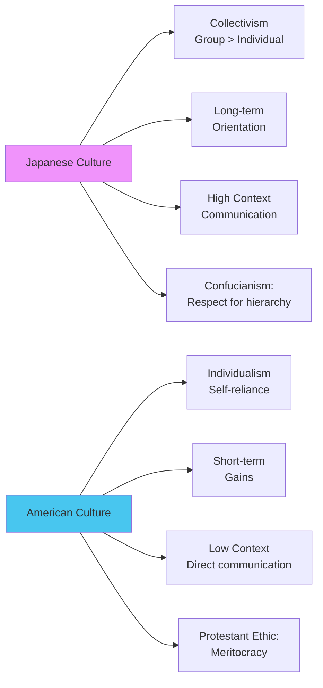
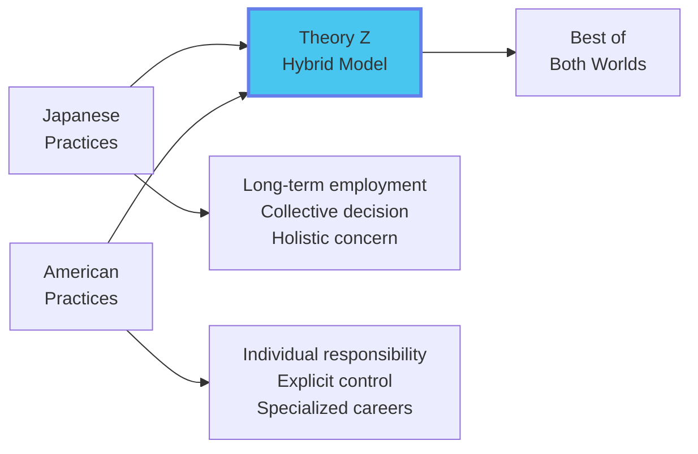

# Module 7: International Management 🌍

:::tip[Learning Objectives]
By mastering this module, you will:
1. **Compare** Japanese vs American management practices in depth
2. **Analyze** Theory Z (Ouchi's hybrid model)
3. **Evaluate** cultural dimensions affecting management
4. **Understand** challenges of multinational corporations
5. **Apply** international concepts to global business scenarios
:::

---

## 7.1 The Need for International Management

:::info[Globalization of Business]
Modern managers must understand international management because:
- **Global Competition:** Companies compete worldwide
- **Multinational Operations:** Production/sales in multiple countries
- **Cultural Diversity:** Multicultural teams and customers
- **Supply Chains:** International sourcing
- **Digital Economy:** Geographic boundaries blur
:::

---

## 7.2 Comparative Management: Japan vs USA ⭐

:::warning[Highest Frequency Question]
**"Compare and contrast managerial practices in Japan and USA"** appears in 70%+ of exams. You MUST master this!
:::

### Cultural Foundation

---

### Comprehensive Comparison Table

| Dimension | **Japanese Management** | **American Management** |
|:----------|:----------------------|:-----------------------|
| **1. EMPLOYMENT RELATIONSHIP** |
| **Duration** | **Lifetime employment** (traditional) *"Company as family"* | **Short-term contract** *"Employee as free agent"* |
| **Loyalty** | **Extremely high** Employees rarely change jobs | **Low** Job-hopping for better opportunities |
| **Security** | Guaranteed employment till retirement | Performance-based; lay-offs common |
| **Psychological Contract** | Mutual lifelong commitment | Transactional exchange |
| **Example** | Toyota worker joins at 22, retires at 60 from same company | Silicon Valley engineer changes companies every 3 years |
| **2. DECISION-MAKING** |
| **Process** | **Ringi System:** Bottom-up consensus | **Top-down:** Individual decision by boss |
| **Speed** | **Slow decision** (weeks/months of consultation)  | **Fast decision** (hours/days) |
| **Implementation** | **Fast implementation** (everyone bought in) | **Slow implementation** (resistance, lack of buy-in) |
| **Participation** | Collective; all stakeholders involved | Limited to senior management |
| **Example** | Toyota's decision to launch Prius took 2 years of consensus-building | Steve Jobs decided iPhone design unilaterally |
| **3. RESPONSIBILITY & ACCOUNTABILITY** |
| **Nature** | **Collective responsibility** *"Team succeeds/fails together"* | **Individual responsibility** *"You own your results"* |
| **Credit/Blame** | Shared among group | Assigned to specific person |
| **Performance Review** | Team-based evaluation | Individual KPIs, rankings |
| **Consequence** | Rarely fire individuals; retrain/reassign | Poor performers terminated |
| **4. ORGANIZATIONAL STRUCTURE & CONTROL** |
| **Hierarchy** | Less rigid; seniority-based | Clear levels; merit-based |
| **Control Mechanisms** | **Implicit, Informal** Social pressure, Shame, Maintaining "face" | **Explicit, Formal** Metrics, KPIs, Performance reviews |
| **Monitoring** | Subtle; Clan control | Direct; Bureaucratic control |
| **Authority** | Respect for age/seniority | Respect for competence/achievement |
| **5. CAREER & PROMOTION** |
| **Evaluation Basis** | **Seniority** (age, years of service) | **Performance, Merit** |
| **Promotion Speed** | **Very slow** (10-15 years to middle mgmt) | **Rapid** (2-3 years if high performer) |
| **Career Path** | **Non-specialized:** Job rotation across functions | **Specialized:** Deep expertise in one area |
| **Training** | Generalist development; Broad exposure | Specialist development; Vertical growth |
| **Example** | Manager in Japan may rotate through HR, Finance, Production | American Finance Manager stays in Finance entire career |
| **6. COMPENSATION** |
| **Pay Structure** | Seniority-based; Age/years determine pay | Performance-based; Market competitive |
| **Bonuses** | Group bonuses (entire dept shares) | Individual bonuses (% of salary based on KPI) |
| **Equality** | Narrow pay gap (CEO:Worker = 10:1) | Wide pay gap (CEO:Worker = 300:1 in USA) |
| **7. WORK CULTURE & VALUES** |
| **Focus** | **Group harmony (Wa)** Avoid conflict; Consensus-seeking | **Individual achievement** Compete, Stand out |
| **Communication** | **Indirect, High-context** Read between lines; Silence meaningful | **Direct, Low-context** Say what you mean; Explicitness valued |
| **Work-Life Balance** | Long hours (karoshi culture historically) Improving recently | Balanced in theory; Startup culture = long hours |
| **Meetings** | Frequent, Long (consensus-building) | Efficient, Action-oriented |
| **8. QUALITY & PRODUCTIVITY** |
| **Approach** | **Kaizen** (Continuous improvement) Quality is everyone's job | Meeting specifications; Quality is QA dept's job |
| **Philosophy** | **TQM (Total Quality Management)** | Six Sigma, Lean (adopted from Japan later!) |
| **Worker Involvement** | Workers can **stop assembly line** if defect found | Workers report to supervisor; supervisor decides |
| **Example** | Toyota Production System (TPS) | Traditional Ford assembly line |

---

### Deep Dive: Key Contrasts

#### A. The Ringi System (Japanese Decision-Making)

:::info[Bottom-Up Consensus]
**Ringi (稟議)** = Formal process of circulating proposal for approval
:::

**Process:**
1. **Proposal created** at lower level (engineer spots improvement)
2. **Document (Ringisho) circulated** to all affected departments
3. **Each manager stamps** (hanko) to indicate agreement
4. **Only when all agree** does proposal reach top management
5. **Top management implements** the already-agreed decision

**Advantages:**
- ✅ Everyone's voice heard
- ✅ No surprises during implementation
- ✅ High commitment (everyone bought in)

**Disadvantages:**
- ❌ Very slow (can take months)
- ❌ Difficult to innovate radically (conservative consensus)
- ❌ Accountability diffused (no clear decision-maker)

vs.

#### B. American Top-Down Decision-Making

**Process:**
1. **CEO/VP makes decision** (sometimes with trusted advisors)
2. **Decision announced** to organization
3. **Employees execute** (whether they agree or not)

**Advantages:**
- ✅ Very fast decisions
- ✅ Clear accountability
- ✅ Enables bold moves

**Disadvantages:**
- ❌ Implementation resistance (people don't understand why)
- ❌ May miss ground-level insights
- ❌ Top-down can be autocratic

---

#### C. Lifetime Employment vs Free Agency

:::warning[Lifetime Employment in Japan is Eroding]
**Traditional (1950-1990):** Join company after university, work there until retirement at 60, receive pension.

**Modern (2000+):** Younger Japanese increasingly change jobs; economic pressures force companies to lay off. However, **cultural norm still strong** compared to USA.
:::

**Japanese Perspective:**
- Employer invests heavily in training (will be there long-term)
- Employee loyalty = emotional connection
- Job security → Risk-taking in process improvement (won't be fired for trying)

**American Perspective:**
- "At-will employment" (either party can terminate anytime)
- Mobility = Career growth (blocked at Company A? Join B)
- Portability of skills matters (build resume)

---

#### D. Collective vs Individual Responsibility

:::tip[Scenario: Project Failure]

**Japan:**
- Entire team takes responsibility
- Manager might offer to resign "to take responsibility" (formal gesture; often rejected)
- Team retrains/reassigns together
- Rarely fire specific individuals

**USA:**
- Root cause analysis finds **who** made the mistake
- That person disciplined/terminated
- "Performance Improvement Plan" (PIP) → If fail, fired
- Clear individual accountability
:::

**Cultural Roots:**
- Japan: Collectivist culture → Shame the group, not individual
- USA: Individualist culture → Own your success AND failure

---

### Situational Effectiveness

:::info[Neither is Universally Superior]
:::

| Context | Better Approach | Reasoning |
|:--------|:---------------|:----------|
| **Stable industry, Quality critical** | **Japanese** | Kaizen continuous improvement; Long-term thinking |
| **Fast-changing market, Innovation needed** | **American** | Quick decisions; Bold risks; Creative destruction |
| **Manufacturing (Cars, Electronics)** | **Japanese** | Lean/TQM; Worker empowerment yields quality |
| **Tech startups, Software** | **American** | Speed to market; Fail fast, iterate |
| **Mature workforce, Low turnover** | **Japanese** | Leverage institutional knowledge |
| **Young talent, High mobility** | **American** | Recognize individual stars; Prevent poaching |

---

## 7.3 Theory Z: The Hybrid Model

:::info[Theory Z (William Ouchi)]
An attempt to blend the **best** of Japanese and American management practices.
:::

### Ouchi's Observation

- **1970s-80s:** Japanese companies (Toyota, Sony, Honda) outperforming American rivals
- **Question:** Can American companies adopt Japanese practices while keeping American culture?
- **Answer:** Theory Z—a hybrid

### Theory Z Characteristics

| Dimension | Japanese (Type J) | American (Type A) | **Theory Z** |
|:----------|:----------------|:-----------------|:------------|
| **Employment** | Lifetime | Short-term | **Long-term (not lifetime)** |
| **Decision-Making** | Collective | Individual | **Collective (participative)** |
| **Responsibility** | Collective | Individual | **Individual** |
| **Evaluation/Promotion** | Slow, seniority | Fast, merit | **Slow, merit-based** |
| **Control** | Implicit | Explicit | **Implicit + some explicit** |
| **Career Path** | Non-specialized | Specialized | **Moderately specialized** |
| **Concern for Employee** | Holistic (whole person) | Narrow (job only) | **Holistic** |

### Theory Z in Practice

**Companies that embody Theory Z:**
- **IBM** (historically): Job security, training investment, participation
- **HP (Hewlett-Packard):** "HP Way"—open-door policy, profit-sharing, consensus
- **Procter & Gamble:** Promote from within, long tenure, team-based

**Key Elements:**
1. **Long-term employment** (not guaranteed, but encouraged via training/development)
2. **Participative decision-making** (like Japan)
3. **Individual accountability** (like USA)
4. **Slow evaluation** (avoid short-termism)
5. **Holistic concern** (work-life balance, family support)
6. **Informal control with some formal** (Trust + metrics)

---

## 7.4 Cultural Dimensions (Hofstede)

:::info[Geert Hofstede's Cultural Framework]
Five dimensions explain cultural differences affecting management:
:::

1. **Power Distance:** Acceptance of inequality
   - *High (Japan, India):* Respect hierarchy; Don't question boss
   - *Low (USA, Scandinavia):* Egalitarian; Challenge authority OK

2. **Individualism vs Collectivism:**
   - *Individualist (USA):* "I" identity; Personal goals
   - *Collectivist (Japan, China):* "We" identity; Group harmony

3. **Masculinity vs Femininity:**
   - *Masculine (Japan):* Achievement, Competition, Assertiveness
   - *Feminine (Scandinavia):* Cooperation, Quality of life, Caring

4. **Uncertainty Avoidance:**
   - *High (Japan):* Prefer rules, structure, avoid risk
   - *Low (USA):* Comfortable with ambiguity, Entrepreneurial

5. **Long-term vs Short-term Orientation:**
   - *Long (East Asia):* Patience, Thrift, Persistence
   - *Short (USA):* Quick results, Quarterly earnings

---

## 📚 EXHAUSTIVE QUESTION BANK

### Section A: Japan vs USA Comparison

:::note[Q1. Comprehensive Comparison]
**(PYQ: Nov 2024, Dec 2024, June 2025)**
"Compare and contrast the managerial practices in Japan and the USA, focusing on cultural influences and organizational behavior."

*(Use comprehensive table from Section 7.2 + cultural foundation explanation)*
:::

:::note[Q2. Decision-Making Systems]
**(PYQ: Nov 2024)**
"Explain the Ringi system of decision-making in Japan. Compare it with typical American decision-making. In what situations would each be more effective?" (8 marks)
:::

:::note[Q3. Lifetime Employment Analysis]
"Japanese lifetime employment is praised for loyalty but criticized for inflexibility. Analyze:
a) Why did this system work well in post-war Japan?
b) Why is it declining now?
c) Could it work in modern India? Why/why not?"
(8 marks)
:::

:::note[Q4. Quality Management Contrast]
"Toyota workers can stop the assembly line if they spot a defect. In traditional American factories, only supervisors had this authority. Explain the cultural and management philosophy differences underlying this contrast." (6 marks)
:::

:::note[Q5. Career Path Implications]
Compare the impact of specialized (American) vs non-specialized (Japanese) career paths on:
a) Employee skill development
b) Succession planning
c) Organizational flexibility
(6 marks)
:::

### Section B: Theory Z

:::note[Q6. Theory Z Explanation]
**(PYQ: Dec 2024, June 2025)**
"Describe William Ouchi's Theory Z. How does it attempt to blend Japanese and American management practices? Provide corporate examples of Theory Z implementation."

**Answer:**
*(Use Section 7.3 content + examples: HP Way, P&G's promote-from-within)*
:::

:::note[Q7. Theory Z in Indian Context]
"Can Theory Z work in India? Analyze Indian cultural values (high power distance, collectivism, relationship-oriented) and argue whether Theory Z would be effective for Indian IT companies." (6 marks)
:::

:::note[Q8. Critique of Theory Z]
"Some scholars argue Theory Z is outdated (published in 1981). In the modern gig economy and remote work era, is long-term employment still viable or desirable?" (5 marks)
:::

### Section C: Cultural Dimensions

:::note[Q9. Hofstede Application]
"Using Hofstede's cultural dimensions, explain why:
a) American employees readily challenge their boss in meetings
b) Japanese employees avoid direct confrontation
c) Scandinavian companies have flat hierarchies"
(6 marks)
:::

:::note[Q10. Cross-Cultural Team Management]
"You're managing a global virtual team: 5 Americans, 5 Japanese, 5 Indians. Using your knowledge of cultural differences, propose strategies to ensure effective collaboration." (8 marks)

**Hint:** Consider decision-making style, communication directness, conflict resolution
:::

:::note[Q11. Managing Silence]
"In Japan, silence in a meeting often means disagreement or discomfort. In America, silence might mean agreement or no questions. How can a global manager navigate this?" (4 marks)
:::

### Section D: MNC Challenges

:::note[Q12. Standardization vs Localization]
"A global restaurant chain faces a dilemma: Standardize the menu worldwide (McDonald's model) or localize for each country (e.g., McDonald's India has no beef). Analyze the trade-offs." (6 marks)
:::

:::note[Q13. Expatriate Management]
"An American manager is assigned to lead a team in Tokyo. What cultural training should they receive? What mistakes should they avoid?" (5 marks)
:::

:::note[Q14. Ethnocentric vs Geocentric Staffing]
Compare:
- **Ethnocentric:** Fill key positions with home-country nationals (e.g., all CEOs are American)
- **Geocentric:** Hire best person globally regardless of nationality

When is each appropriate? (5 marks)
:::

### Section E: Application & Case Analysis

:::note[Q15. Japanese Companies in America]
"Honda established plants in Ohio (USA). They tried to implement Japanese practices (morning exercises, quality circles, long-term employment). Some worked, some failed. Analyze why." (6 marks)
:::

:::note[Q16. American Companies in Japan]
"A Silicon Valley startup opens an office in Tokyo. They implement:
- Rapid decision-making  
- Individual performance bonuses
- Flat hierarchy (everyone calls CEO by first name)

Predict three cultural clashes and how to mitigate them." (8 marks)
:::

:::note[Q17. COVID Impact on Japanese Employment]
"During COVID, even Japan saw layoffs for the first time in decades (e.g., airlines, retail). Does this mark the end of lifetime employment? What are the long-term implications for Japanese management?" (6 marks)
:::

:::note[Q18. Collective Responsibility Dilemma]
"A Japanese firm's project fails due to one engineer's critical mistake. The entire team offers to resign. As an American consultant advising this firm, what do you recommend? Should they accept resignations, fire the individual, or something else?" (5 marks)
:::

### Section F: Critical Thinking

:::note[Q19. Can You Mix Extremes?]
"Some argue you can't have fast decisions (American) AND high buy-in (Japanese) simultaneously—you must choose. Do you agree? Or can companies design a system that achieves both?" (6 marks)
:::

:::note[Q20. The Future of Work]
"With remote work, gig economy, and globalization, are national management styles becoming obsolete? Will we see a 'global management style' emerge? Argue yes or no." (6 marks)
:::

---

## 7.5 Bonus: Contemporary International Issues

:::info[Modern Challenges]
:::

### 1. Globalization vs De-Globalization
- **2000-2015:** Hyper-globalization (offshoring, global supply chains)
- **2016+:** Nationalism rising (Brexit, Trade wars, "Atmanirbhar Bharat")
- **Management Challenge:** Balance efficiency (global sourcing) vs resilience (local production)

### 2. Virtual Global Teams
- **Pre-COVID:** Some remote work
- **Post-COVID:** Permanent hybrid/remote
- **Challenge:** Manage across time zones, cultures, without face-to-face interaction

### 3. Sustainability & CSR
- **Western MNCs:** Pressure from consumers, investors for ESG
- **Emerging Markets:** Economic growth vs environmental concerns
- **Conflict:** Different priorities in different regions

---

:::note[Module 7 Key Takeaways]
✅ **Japan vs USA** = Collective vs Individual, Seniority vs Merit, Implicit vs Explicit Control
✅ **Ringi System** = Slow decision, Fast implementation (consensus-driven)
✅ **Theory Z** = Hybrid model (long-term employment + participative decisions + individual responsibility)
✅ **Cultural Dimensions** = Hofstede's 5 dimensions explain management differences
✅ **MNC Challenge** = Balance global efficiency with local responsiveness
:::

---

:::danger[Final Exam Strategy for Module 7]

**Most Likely Question:** Japan vs USA comparison (10 marks)
**Preparation:**
- Memorize 8-10 key dimensions (Employment, Decision-making, Responsibility, Control, Career, Compensation)
- For each dimension, know Japanese AND American approach + Example
- Practice writing this table from memory in 15 minutes

**Second Most Likely:** Theory Z explanation (5-6 marks)
**Preparation:**
- Know origins (Ouchi, 1980s)
- List 5-6 characteristics that blend both systems
- Mention 2-3 example companies (HP, P&G)

**Bonus Points:**
- Mention current events (e.g., "Lifetime employment in Japan eroding due to economic stagnation")
- Link to Indian context if question allows
:::

---

🎉 **Congratulations!** You've completed **ALL SEVEN MODULES** of the EOM Exam Prep vault!

**Your Arsenal:**
- ✅ 7 comprehensive modules
- ✅ 140+ exhaustive questions (20 per module)
- ✅ Deep theoretical foundations
- ✅ PYQ-aligned case studies
- ✅ Beautiful Mermaid diagrams
- ✅ Strategic study plans

**Next Steps:**
1. ⭐ Review **00 - EOM Study Master Guide** for overall strategy
2. 📝 Solve question banks in each module
3. ⏱️ Time yourself on PYQ case studies (20 min per question)
4. 🔁 Revise: Mintzberg (Module 1), BCG/Porter (Module 2), EcoEarth (Module 3), HRM vs HRD (Module 4), Theory X/Y (Module 5), Control Types (Module 6), Japan vs USA (Module 7)

**You're ready for 100/100! 🏆**
