# Module 8: Complete Topic Overview & Quick Reference 📚

:::tip[Purpose of This Module]
This is your **ONE-STOP comprehensive overview** of ALL topics from Modules 1-7. Use this for:
- 📖 **Final revision** before the exam
- 🔍 **Quick lookups** of formulas and frameworks
- ✅ **Completeness check** - ensure you've covered everything
- ⚡ **Last 24-hour cramming** with priority topics marked
:::


---

## 🗺️ Navigation Guide

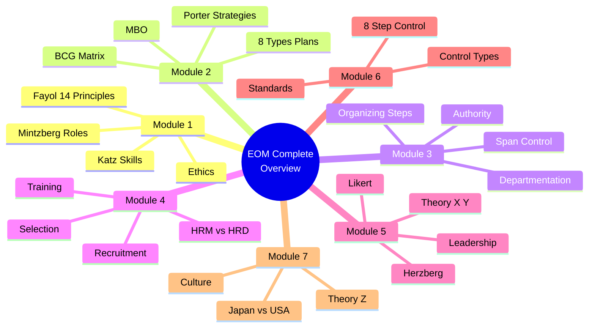

---

## ⭐ Star Rating Legend

- 🔥🔥🔥 = **CRITICAL** - Appears in 70%+ of exams
- 🔥🔥 = **High Priority** - Appears in 50%+ of exams
- 🔥 = **Important** - Appears in 30%+ of exams

---

# MODULE 1: Foundations of Management 🏛️

## 1.1 Management Basics

:::info[Management]
The process of designing and maintaining an environment in which individuals, working together in groups, efficiently accomplish selected aims.
:::


**Key Distinction:**
- **Effectiveness** = Doing the RIGHT things (Goal achievement)
- **Efficiency** = Doing things RIGHT (Resource optimization)

### Three Levels of Management

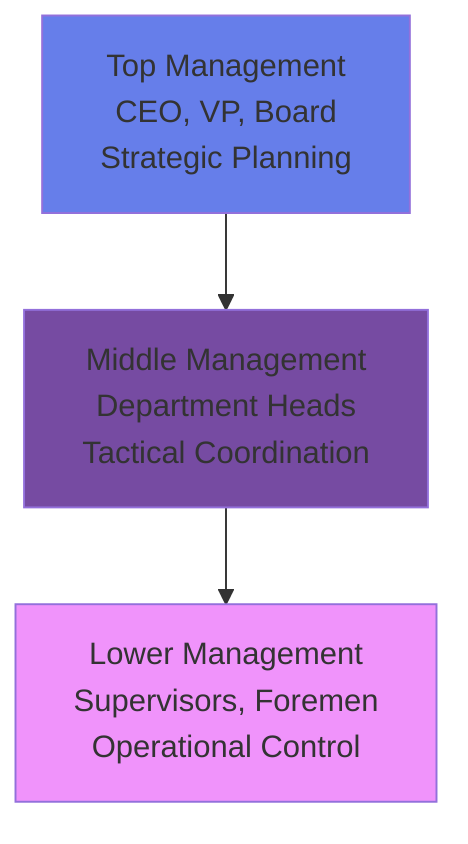

---

## 1.2 Katz Model: Managerial Skills 🔥

:::info[Three Essential Skills]
Skills vary in importance across management levels
:::


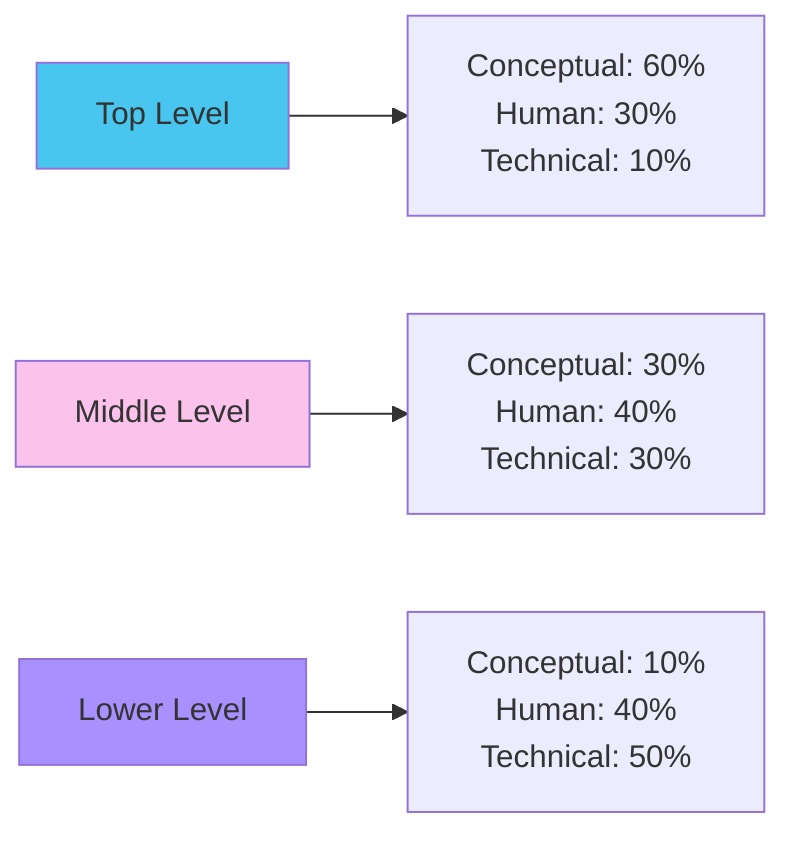

| Skill | Definition | Example |
|:------|:-----------|:--------|
| **Technical** | Job-specific knowledge | Programming, Accounting |
| **Human** | Working with people | Communication, Empathy |
| **Conceptual** | Big-picture thinking | Strategic vision, Pattern recognition |

**Exam Tip:** CEO needs most **Conceptual** skill to visualize long-term strategy.

---

## 1.3 Mintzberg's 10 Managerial Roles 🔥🔥🔥

:::warning[CRITICAL Exam Topic]
Memorize the category + specific role for each activity!
:::


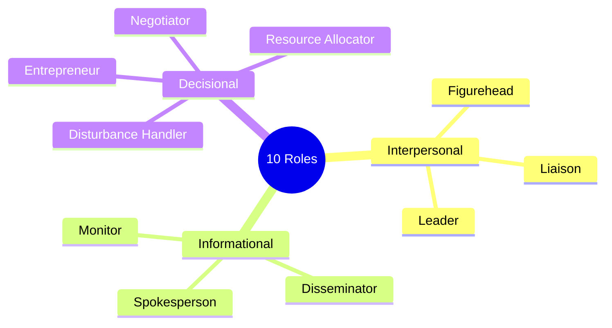

### A. Interpersonal Roles

| Role | Definition | Keywords | Example |
|:-----|:-----------|:---------|:--------|
| **Figurehead** | Symbolic head, ceremonial duties | Ribbon-cutting, Signing documents | Sales manager takes client to lunch |
| **Leader** | Motivate and direct subordinates | Hiring, Training, Encouraging | Manager shows employee how to fill form |
| **Liaison** | External networking | Industry peers, Professional contacts | Manager cultivates contacts with competitors |

### B. Informational Roles

| Role | Definition | Keywords | Example |
|:-----|:-----------|:---------|:--------|
| **Monitor** | Scans environment for info | Reading reports, Market scanning | Manager reads newspaper, browses trade journals |
| **Disseminator** | Shares info to subordinates | Relaying insights downward | Manager shares conference insights with team |
| **Spokesperson** | Transmits info to outsiders | Media, Shareholders, Board | CEO presents quarterly results |

### C. Decisional Roles

| Role | Definition | Keywords | Example |
|:-----|:-----------|:---------|:--------|
| **Entrepreneur** | Seeks opportunities, initiates projects | Innovation, New ventures | CEO launches new product line |
| **Disturbance Handler** | Corrects crises | Problem-solving, Fire-fighting | Manager responds to supplier strike |
| **Resource Allocator** | Decides resource distribution | Budgeting, Scheduling | Manager discusses funding for new machine |
| **Negotiator** | Represents org in negotiations | Contracts, Unions, Deals | HR negotiates labor contract |

**Exam Pattern:** Given activity → Identify category AND specific role

---

## 1.4 Henri Fayol's 14 Principles 🔥🔥🔥

:::warning[Unity of Command vs Unity of Direction]
The #1 confusing pair - know the difference!
:::


### Quick Reference Table

| # | Principle | Core Idea | Example |
|:--|:----------|:----------|:--------|
| 1 | Division of Work | Specialization → Efficiency | Developers code, Designers design |
| 2 | Authority & Responsibility | Authority = Right to command / Responsibility = Obligation | Manager with $10K authority must be responsible for ROI |
| 3 | Discipline | Obedience, respect | Punctuality, sincerity |
| 4 | **Unity of Command** ⭐ | **ONE boss per employee** | Employee reports ONLY to Project Manager |
| 5 | **Unity of Direction** ⭐ | **ONE plan per group** | Marketing has ONE Q1 strategy |
| 6 | Subordination of Individual Interest | Org goals > Personal goals | Employee sacrifices weekend for deadline |
| 7 | Remuneration | Fair compensation | Competitive salary |
| 8 | Centralization | Balance decision authority | Strategic at top, operational at bottom |
| 9 | Scalar Chain | Line of authority | CEO → VP → Manager → Supervisor |
| 10 | Order | Right place for everything | Organized inventory, suitable roles |
| 11 | Equity | Kindness and fairness | Respect all employees |
| 12 | Stability of Tenure | Low turnover | Career development programs |
| 13 | Initiative | Encourage independence | Empower teams to propose solutions |
| 14 | Esprit de Corps | Team spirit | Team-building, collaboration |

### Critical Comparison: Unity of Command vs Direction

| Basis | Unity of Command | Unity of Direction |
|:------|:-----------------|:-------------------|
| **Meaning** | ONE employee → ONE superior | ONE group → ONE plan |
| **Focus** | **People** | **Activities** |
| **Prevents** | Confusion, Divided loyalty | Duplication of effort |
| **Example** | "Sarah reports ONLY to Marketing Head" | "Marketing dept follows ONE Q2 strategy" |

### Gang Plank Concept

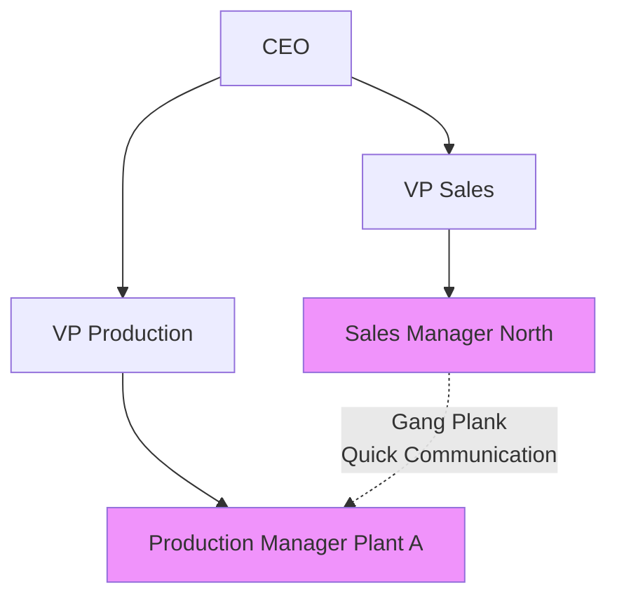

:::info[Gang Plank = Shortcut in scalar chain for urgent horizontal communication (with superiors informed)]
:::


---

## 1.5 Systems Approach to Management

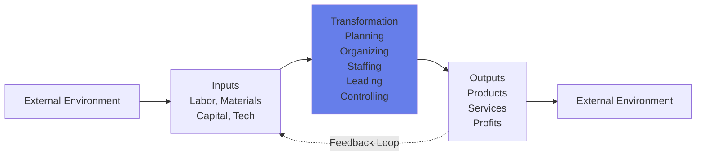

**Components:**
- **Inputs:** Resources from environment
- **Process:** Managerial functions (POLC)
- **Outputs:** Goods, services, profits
- **Feedback:** Output info re-enters as input

---

## 1.6 Managerial Ethics

### Three Ethical Theories

| Theory | Principle | Focus | Example |
|:-------|:----------|:------|:--------|
| **Utilitarian** | Greatest good for greatest number | Consequences | Company shuts polluting plant for community health |
| **Rights-Based** | Respect fundamental human rights | Liberties | Media allows critical stories without censorship |
| **Theory of Justice** | Fair and equitable | Fairness | Equal pay for equal work |

---

## 1.7 Japan vs USA Management (Preview - Full in Module 7) 🔥🔥

**Quick Snapshot:**

| Dimension | Japan | USA |
|:----------|:------|:----|
| Employment | Lifetime | Short-term |
| Decisions | Collective (Ringi) | Individual (Top-down) |
| Responsibility | Collective | Individual |
| Promotion | Slow (seniority) | Fast (merit) |
| Control | Implicit | Explicit |

---

# MODULE 2: Planning & Strategy 📋

## 2.1 The 8 Types of Plans 🔥🔥🔥

:::danger[High-Frequency Case Pattern]
Quote lines to identify plan types!
:::


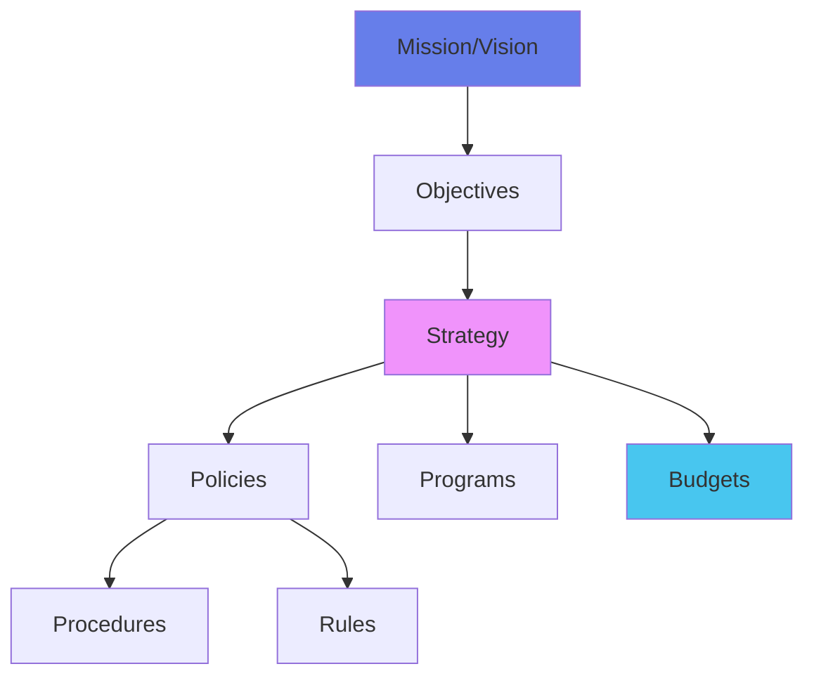

### Complete Plan Types

| Type | Definition | Characteristics | Example |
|:-----|:-----------|:---------------|:--------|
| **Mission** | Basic purpose | Broad, enduring | "Organize world's information" (Google) |
| **Objective** | Specific ends | **Verifiable, Quantifiable** | "Increase market share by 5% in Q3" |
| **Strategy** | Comprehensive plan | Long-term, competitive | "Become cost leader" |
| **Policy** | Decision guide | Flexible, interpreted | "Promote from within when possible" |
| **Procedure** | Step-by-step sequence | Routine, repetitive | "Steps to process refund" |
| **Rule** | Required action | **No discretion**, absolute | "No smoking" / "₹500 penalty/day" |
| **Program** | Complex set of plans | Large-scale, single-use | "Digital Transformation Program" |
| **Budget** | Numberized statement | Financial control | "₹50L for marketing in Q2" |

### Critical Distinction: Policy vs Procedure vs Rule

| Aspect | Policy | Procedure | Rule |
|:-------|:-------|:----------|:-----|
| **Flexibility** | High (guides thinking) | Medium | **Zero** (must comply) |
| **Example** | "Credit based on creditworthiness" | "1. Check score 2. Verify income 3. Approve" | "No credit if score &lt;600" |

---

## 2.2 The 8-Step Planning Process

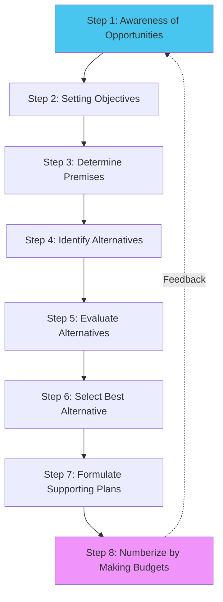

---

## 2.3 MBO (Management by Objectives) 🔥

:::info[MBO]
Participative goal-setting system integrating key activities toward effective achievement of organizational and individual objectives.
:::


### The MBO Cycle

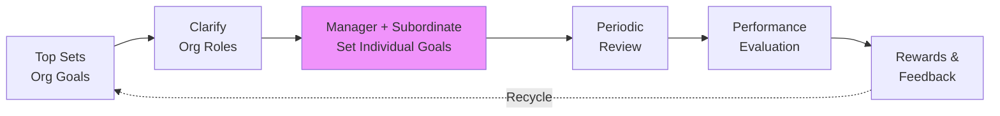

### SMART Objectives Framework

| Letter | Criterion | Bad Example | Good Example |
|:-------|:----------|:------------|:-------------|
| **S**pecific | Clearly defined | "Improve sales" | "Increase North region electronics sales" |
| **M**easurable | Quantifiable | "Better service" | "Achieve 95% satisfaction score" |
| **A**chievable | Realistic | "Double revenue in 1 month" | "Grow revenue by 8% this quarter" |
| **R**elevant | Aligned with strategy | "Learn Spanish" (local IT firm) | "Master Python" (IT firm) |
| **T**ime-bound | Deadline | "Eventually reduce costs" | "Cut costs by Q3 2024" |

---

## 2.4 SWOT & TOWS Analysis

### SWOT Framework

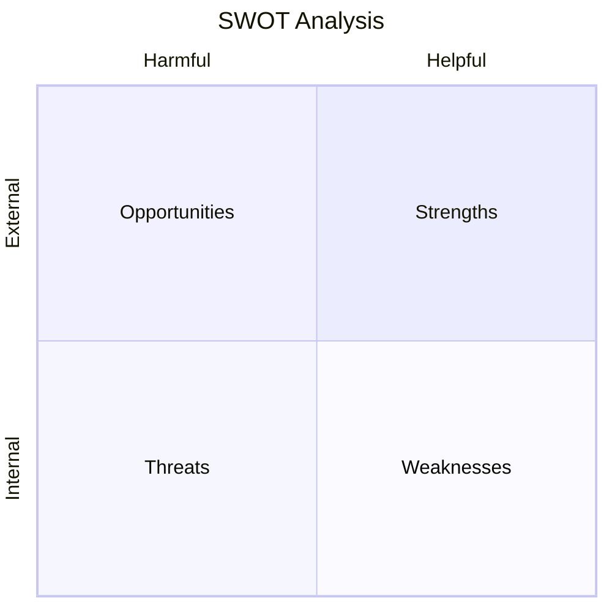

### TOWS Matrix: Strategy Formulation 🔥

| Internal ↓ External → | **Opportunities (O)** | **Threats (T)** |
|:---------------------|:---------------------|:----------------|
| **Strengths (S)** | **SO Strategy** (Maxi-Maxi): Use strengths to grab opportunities | **ST Strategy** (Maxi-Mini): Use strengths to avoid threats |
| **Weaknesses (W)** | **WO Strategy** (Mini-Maxi): Overcome weakness via opportunities | **WT Strategy** (Mini-Mini): Defensive: Minimize both |

**Examples:**
- **SO:** Strong R&D + Growing EV market = Develop EV line
- **ST:** Strong brand + New competitor = Launch loyalty program
- **WO:** Weak online presence + E-commerce boom = Invest in digital
- **WT:** High debt + Recession = Retrench/Cost-cutting

---

## 2.5 BCG Matrix (Boston Consulting Group) 🔥🔥🔥

:::warning[CRITICAL - Know the formulas!]
:::


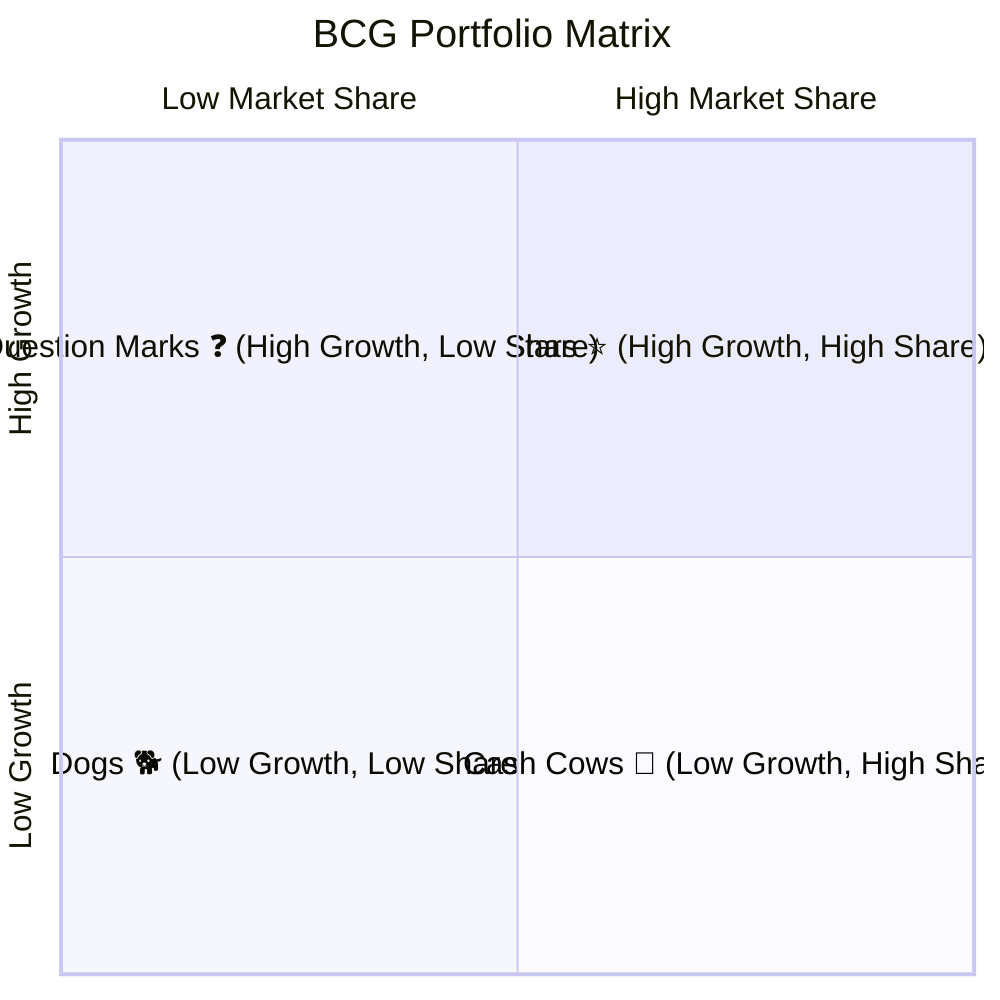

### The Four Quadrants

| Quadrant | Characteristics | Cash Flow | Strategy |
|:---------|:---------------|:----------|:---------|
| **Stars** ⭐ | Market leaders in growing industries | Large users + generators = Neutral | **Invest/Hold** - Maintain dominance |
| **Cash Cows** 🐄 | Dominant in mature markets | Generate > consume | **Harvest/Milk** - Extract profit |
| **Question Marks** ❓ | Potential but uncertain | Heavy users | **Build or Divest** - Invest heavily OR cut losses |
| **Dogs** 🐕 | Weak in unattractive markets | Neutral/negative | **Divest/Liquidate** - Free up resources |

### BCG Formulas 📐

:::info[Market Growth Rate]
$$\text{Market Growth Rate} = \frac{\text{Current Year Sales} - \text{Previous Year Sales}}{\text{Previous Year Sales}} \times 100\%$$

**Threshold:** >10% = High Growth; &lt;10% = Low Growth
:::


:::info[Relative Market Share]
$$\text{Relative Market Share} = \frac{\text{Your Company's Sales}}{\text{Largest Competitor's Sales}}$$

**Threshold:** >1.0 = High Share (You're leader); &lt;1.0 = Low Share
:::


---

## 2.6 Porter's Generic Competitive Strategies 🔥🔥

:::info[Two Sources of Advantage]
1. **Low Cost** (Efficiency)
2. **Differentiation** (Uniqueness)
:::


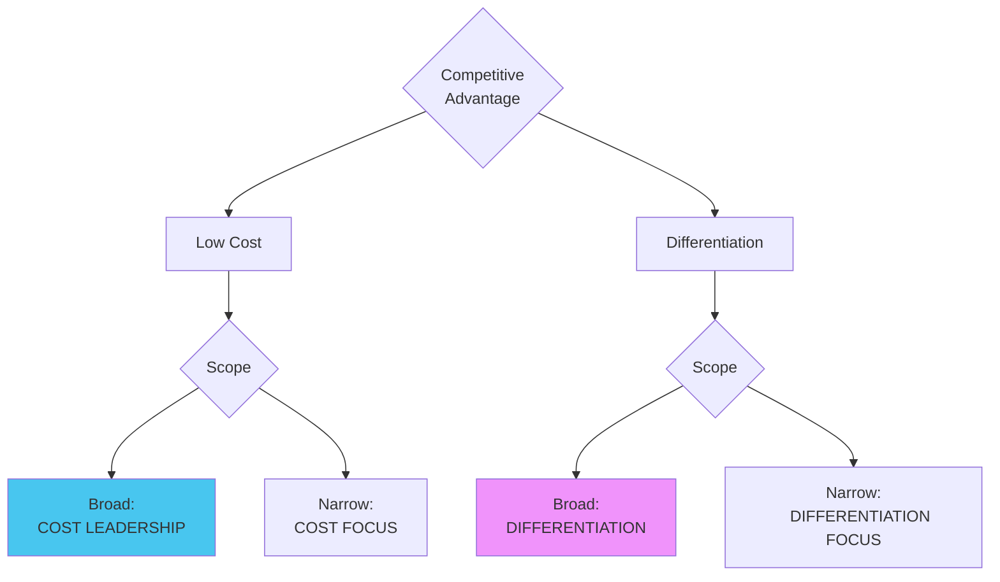

| Strategy | Target | Advantage | Example | How They Win |
|:---------|:-------|:----------|:--------|:-------------|
| **Cost Leadership** | Broad | Lowest cost | Walmart, Maruti | Economies of scale → Low prices |
| **Differentiation** | Broad | Unique features | Apple, BMW | Innovation, quality → Premium pricing |
| **Cost Focus** | Narrow | Low cost in niche | Ryan Air | Focused efficiency |
| **Differentiation Focus** | Narrow | Unique in niche | Patanjali, Rolex | Specialized expertise |

:::warning[Stuck in the Middle]
Firms without ANY strategy = No competitive advantage = Below-average profitability
:::


---

## 2.7 Blue Ocean Strategy

:::info[Red Ocean vs Blue Ocean]
**Red Ocean:** Compete in existing markets (bloody competition)
**Blue Ocean:** Create NEW market space (uncontested)
:::


### Four Actions Framework (ERRC)

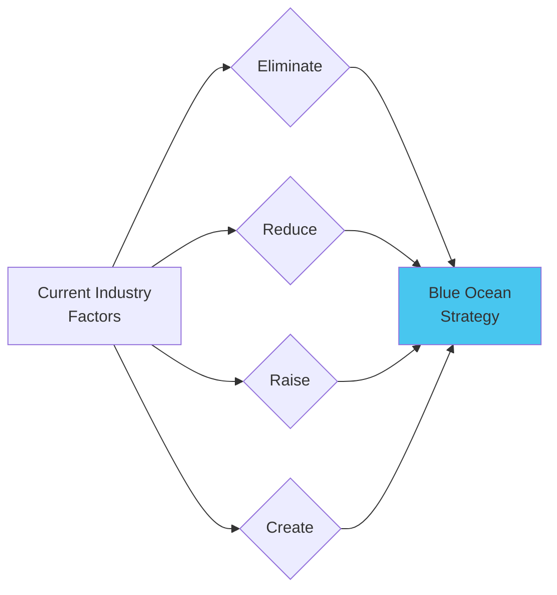

**Example: Cirque du Soleil**
- **Eliminate:** Star performers, animals (costly circus traditions)
- **Reduce:** Fun/humor, thrill/danger
- **Raise:** Artistic quality, production value
- **Create:** Unique venues, multiple productions, refined themes

**Result:** New market = Circus + Theater, attracting adults willing to pay premium

---

# MODULE 3: Organizing Structures 🏗️

## 3.1 The 4 Steps in Organizing 🔥🔥

:::danger[EcoEarth Pattern - Quote lines!]
:::


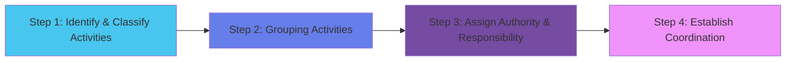

| Step | What Happens | Example |
|:-----|:------------|:--------|
| **1. Identification** | List all necessary activities | Production, Marketing, Finance, HR |
| **2. Grouping** | Combine similar activities into departments | All sales → Sales Dept |
| **3. Assignment** | Designate managers, delegate authority | Appoint Sales Manager with budget authority |
| **4. Coordination** | Create reporting relationships | Sales reports to VP; weekly meetings |

---

## 3.2 The 8 Patterns of Departmentation

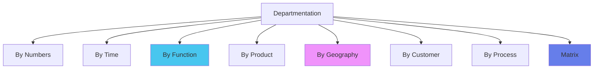

### Quick Comparison Table

| Pattern | Basis | Best For | Key Advantage | Key Disadvantage |
|:--------|:------|:---------|:-------------|:-----------------|
| **Numbers** | Headcount | Armies, Labor crews | Simple coordination | Ignores skills |
| **Time** | Shifts (8am/4pm/12am) | 24/7 operations | Continuous coverage | Coordination hard |
| **Function** 🔥 | Specialization (Marketing, Production) | **Most companies** | Expert efficiency | **Silo mentality** |
| **Product** | Product line (Cars, Trucks) | Diversified firms | Clear P&L responsibility | Duplication |
| **Geography** 🔥 | Location (North, South) | **MNCs, Field sales** | Local responsiveness | Control difficulty |
| **Customer** | Client type (Retail, Wholesale) | Banks, B2B | Service excellence | Underutilization |
| **Process** | Equipment/Tech (Welding, Painting) | Manufacturing | Technical specialization | Coordination challenges |
| **Matrix** 🔥 | Function + Project | Aerospace, Consulting | Flexibility | **Violates Unity of Command!** |

### Matrix Organization (Dual Reporting)

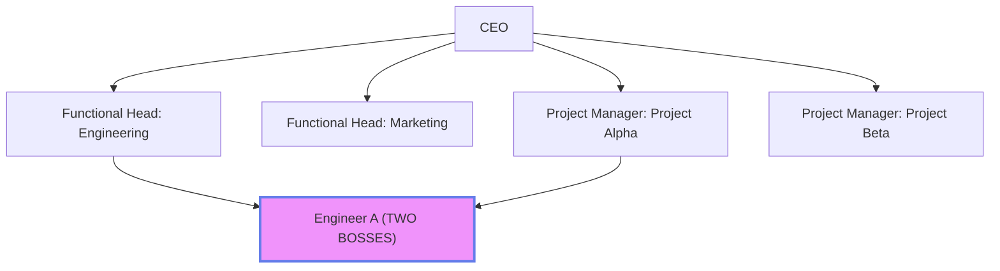

:::warning[Matrix violates Fayol's Unity of Command]
Employees have TWO bosses (Functional + Project)
:::


---

## 3.3 Span of Control

:::info[Span of Control]
Number of subordinates a manager can effectively supervise
:::


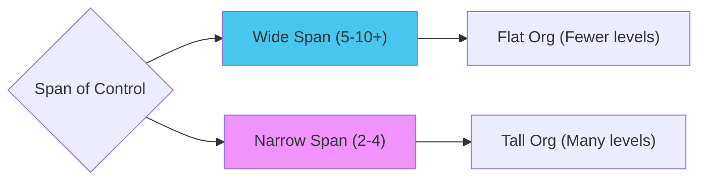

**Factors Determining Span:**

| Factor | Wide Span Possible | Narrow Span Needed |
|:-------|:------------------|:-------------------|
| Subordinate Training | Well-trained | New, need guidance |
| Clarity of Plans | Clear objectives | Vague goals |
| Rate of Change | Stable environment | Rapidly changing |
| Task Complexity | Routine, standardized | Complex, varied |

**Rule of Thumb:**
- Routine work + Trained staff = **Wide (1:10)**
- Complex work + Inexperienced = **Narrow (1:4)**

---

## 3.4 Authority & Delegation

### The Golden Equation

:::info[Parity Principle]
$$\text{Authority} = \text{Responsibility}$$

**Authority** = Right to make decisions
**Responsibility** = Accountability for results
:::


| Situation | Result | Example |
|:----------|:-------|:--------|
| Authority > Responsibility | Abuse of power | Boss can hire but not accountable → Hires unqualified relatives |
| Authority &lt; Responsibility | Frustration | Project Manager responsible for deadline but can't authorize overtime |
| **Authority = Responsibility** | **Ideal** | Sales Manager sets discounts AND accountable for profit |

### Delegation Process

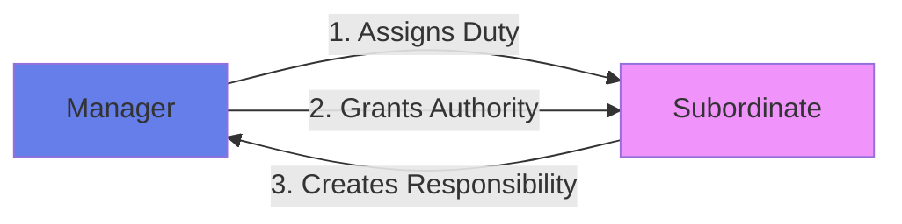

:::warning[Responsibility Cannot Be Delegated]
You can delegate authority, but remain **ultimately responsible**
:::


---

## 3.5 Line vs Staff Authority

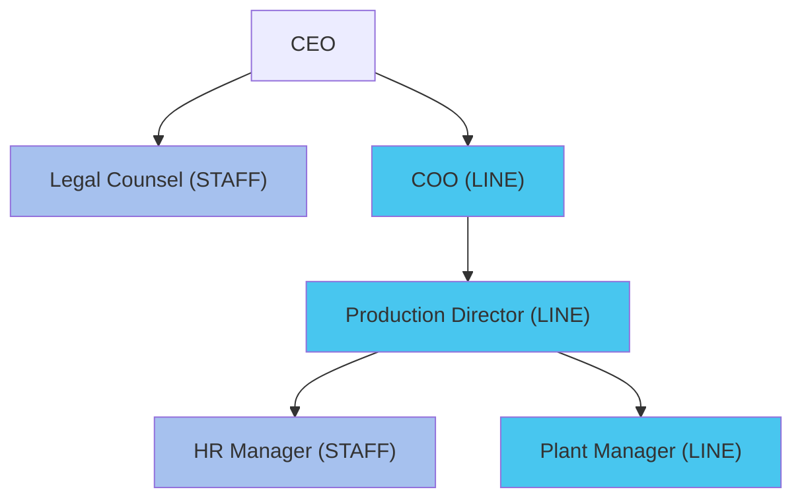

| Aspect | Line | Staff |
|:-------|:-----|:------|
| **Nature** | Command, Direct orders | Advise, Support |
| **Authority** | Can command subordinates | Can only recommend |
| **Examples** | Production, Sales | HR, Legal, IT, R&D |
| **Accountability** | Directly for profits | For quality of advice |

---

# MODULE 4: Staffing & HRM 👥

## 4.1 Systems Approach to Staffing 🔥

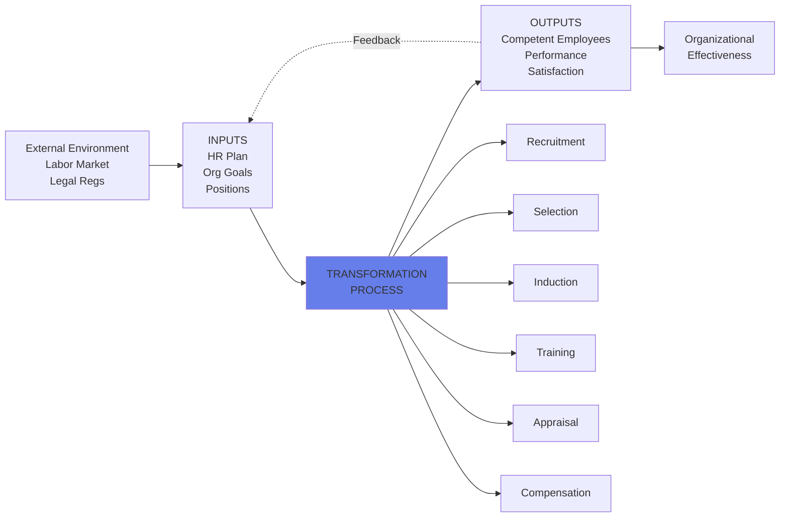

**Significance:**
- Holistic view (not just hiring)
- Feedback loop (performance → future recruitment)
- Environmental awareness (labor laws, market)

---

## 4.2 HRM vs HRD 🔥🔥

| Dimension | HRM | HRD |
|:----------|:----|:----|
| **Focus** | Managing people as resources | Developing people's potential |
| **Orientation** | **Reactive** (current problems) | **Proactive** (future capability) |
| **Time** | Short-term efficiency | Long-term growth |
| **Scope** | Hiring, Payroll, Compliance | Training, Career Development |
| **Goal** | Employee **Performance** (now) | Employee **Competence** (future) |
| **Example** | "Hire Python developer" | "Train Java developers in Python" |

### Complementary Relationship

```mermaid
graph LR
    A["HRM:
    Acquires
    Talent"] --> B["Organization
    has People"]
    B --> C["HRD:
    Develops
    Talent"]
    C --> D["Capable
    People"]
    D --> E["Sustainable
    Advantage"]
    
    style A fill:#48c6ef
    style C fill:#f093fb
    style E fill:#667eea
```

---

## 4.3 Job Description vs Job Specification

```mermaid
graph TD
    A["Job Analysis
    (Study the Job)"] --> B["Job Description
    (WHAT the job is)"]
    A --> C["Job Specification
    (WHO can do it)"]
    
    B --> B1["• Job Title
    • Duties/Tasks
    • Responsibilities
    • Reporting
    • Work Conditions"]
    
    C --> C1["• Education
    • Experience
    • Skills
    • Physical Req
    • Personal Traits"]
    
    style A fill:#667eea
    style B fill:#48c6ef
    style C fill:#f093fb
```

| Aspect | Job Description | Job Specification |
|:-------|:----------------|:------------------|
| **Question** | "What is the job?" | "Who should we hire?" |
| **Content** | Tasks, duties, responsibilities | Qualifications, skills, traits |
| **Focus** | The **position** | The **ideal candidate** |
| **Example** | "Manage team of 5; conduct code reviews" | "B.Tech CS, 5+ years, Python/Java" |

---

## 4.4 The 10-Step Recruitment Process 🔥

```mermaid
flowchart TD
    A[Step 1: Identify Vacancy] --> B[Step 2: Prepare JD/JS]
    B --> C[Step 3: Advertise]
    C --> D[Step 4: Manage Response]
    D --> E[Step 5: Short-list]
    E --> F[Step 6: Arrange Interviews]
    F --> G[Step 7: Conduct Interview & Decision]
    G --> H[Step 8: Make Offer]
    H --> I[Step 9: Finalize Contract]
    I --> J[Step 10: Onboarding]
    
    style A fill:#48c6ef
    style G fill:#667eea
    style J fill:#f093fb
```

### Recruitment Sources

**Internal:**
- Promotions
- Transfers
- Employee referrals

**External:**
- Online job portals (Naukri, LinkedIn)
- Campus recruitment
- Employment agencies
- Social media

---

## 4.5 Selection Process (The Funnel)

```mermaid
graph TD
    A[500 Applications] --> B[Preliminary Interview]
    B --> C[200 Candidates]
    C --> D[Application Analysis]
    D --> E[100 Candidates]
    E --> F[Tests]
    F --> G[50 Candidates]
    G --> H[Core Interview]
    H --> I[10 Candidates]
    I --> J[Reference Checks]
    J --> K[5 Finalists]
    K --> L[Medical Exam]
    L --> M[2-3 Selected]
    
    style A fill:#fbc2eb
    style M fill:#48c6ef
```

### Types of Tests

| Test Type | Measures | Example |
|:----------|:---------|:--------|
| **Aptitude** | Potential to learn | Logical reasoning, Quant |
| **Achievement** | Current knowledge | Coding test for programmer |
| **Personality** | Traits, temperament | Myers-Briggs, Big Five |

### Preliminary vs Core Interview

| Aspect | Preliminary | Core |
|:-------|:-----------|:-----|
| **Purpose** | Eliminate unqualified | Deep assessment |
| **Duration** | 5-15 min | 45-90 min |
| **Conducted By** | Junior HR | Senior managers, Experts |
| **Outcome** | GO/NO-GO | Ranking |

---

## 4.6 Induction vs Orientation

| Aspect | Induction | Orientation |
|:-------|:----------|:------------|
| **Scope** | **Broad** introduction to org | **Specific** intro to job/dept |
| **Duration** | Days to weeks | First few days |
| **Content** | Company history, mission, policies | Department tour, meet team, workspace |
| **Conducted By** | HR Department | Immediate supervisor |
| **Goal** | Socialization into culture | Functional readiness |

---

## 4.7 Training vs Development

| Dimension | Training | Development |
|:----------|:---------|:------------|
| **Focus** | **Current job** | **Future roles** |
| **Time** | Short-term | Long-term |
| **Scope** | Narrow (specific skill) | Broad (general competencies) |
| **Example** | "Learn Excel" | "Leadership workshop for future managers" |

### Current Training Trends 🔥🔥

#### 1. Microlearning
:::info[Bite-sized learning in 5-10 min modules]
**Example:** Duolingo, LinkedIn Learning short videos
**Impact:** Higher engagement, just-in-time learning
:::


#### 2. Gamification
:::info[Using game elements (points, badges, leaderboards)]
**Example:** Deloitte's leadership academy badges
**Impact:** Increased motivation, better retention
:::


#### 3. AI & VR/AR Training
:::info[Immersive technology for realistic simulations]
**Example:** Walmart VR for Black Friday training, Surgeon VR practice
**Impact:** Risk-free practice, personalized paths
:::


#### 4. Focus on Soft Skills
:::info[EQ > IQ - Communication, empathy, adaptability]
**Why:** Automation handles technical; humans need soft skills
:::


#### 5. Personalized Learning Paths
:::info[AI creates individual plans based on skill gaps]
**Example:** Coursera for Business tailored courses
:::


---

# MODULE 5: Leading & Motivation 🎯

## 5.1 McGregor's Theory X and Theory Y 🔥🔥🔥

```mermaid
graph LR
    A["Manager's Belief
    about Employees"] --> B{"Theory X
    (Negative View)"}
    A --> C{"Theory Y
    (Positive View)"}
    
    B --> B1["Authoritarian
    Leadership"]
    B --> B2["Tight Control
    Micromanagement"]
    
    C --> C1["Participative
    Leadership"]
    C --> C2["Delegation &
    Empowerment"]
    
    style B fill:#f093fb
    style C fill:#48c6ef
```

### Theory Comparison

| Dimension | Theory X | Theory Y |
|:----------|:---------|:---------|
| **View of Work** | People **dislike work**, avoid it | Work is **natural** as play |
| **Motivation** | Must be **coerced, controlled, threatened** | People **exercise self-direction** |
| **Responsibility** | People **avoid responsibility** | People **seek responsibility** |
| **Creativity** | Limited capacity | Widely distributed imagination |

### Corporate Strategies

**Theory X Approach:**
- Strict supervision (screen monitoring)
- Punishment-based motivation (salary deduction for missed targets)
- Limited autonomy (exact scripts, no deviation)
- External controls (time clocks, attendance penalties)

**Theory Y Approach:**
- **Google's 20% Time** - Engineers spend 20% on passion projects
- **Atlassian's ShipIt Days** - 24-hour hackathons
- **Toyota's Kaizen** - Workers can stop production for quality
- Recognition & growth (learning budgets, career paths)

---

## 5.2 Herzberg's Two-Factor Theory 🔥🔥🔥

:::info[Key Insight]
Satisfaction and dissatisfaction are caused by **different factors**!
Opposite of satisfaction ≠ dissatisfaction
:::


```mermaid
graph LR
    A[Job Factors] --> B["Hygiene Factors
    (Context of Job)"]
    A --> C["Motivators
    (Content of Job)"]
    
    B --> B1["If Absent:
    DISSATISFACTION"]
    B --> B2["If Present:
    No Dissatisfaction
    but NOT motivated"]
    
    C --> C1["If Absent:
    No Satisfaction"]
    C --> C2["If Present:
    HIGH MOTIVATION"]
    
    style B fill:#f093fb
    style C fill:#48c6ef
```

### The Two Factor Lists

| Hygiene Factors (Dissatisfiers) | Motivators (Satisfiers) |
|:--------------------------------|:------------------------|
| **Prevent dissatisfaction** | **Create satisfaction** |
| Job **CONTEXT** (environment) | Job **CONTENT** (the work) |
| • Company policy • Supervision • **Salary** • Interpersonal relations • Working conditions • Job security | • Achievement • Recognition • Work itself (interesting?) • Responsibility • Advancement • Growth opportunities |

:::warning[Salary is a Hygiene Factor!]
- Low salary → Dissatisfaction ✅
- High salary → No dissatisfaction, but doesn't motivate long-term ❌
- **What motivates:** Challenging work, recognition, growth
:::


### Corporate Application

**Hygiene Factors (Eliminate Dissatisfaction):**
- Competitive pay (Salesforce pays 75th percentile)
- Good working conditions (Google's campuses with gyms, nap pods)
- Clear policies (Netflix's unlimited vacation)

**Motivators (Create Satisfaction):**
- Achievement (Stretch targets + rewards)
- Recognition (Zappos culture of appreciation)
- Work itself (3M's 15% rule for side projects)
- Responsibility (Nordstrom empowers salespeople)
- Growth (P&G's leadership pipeline)

### Job Enrichment vs Enlargement

:::info[Herzberg Recommendation]
- **Job Enrichment:** Add DEPTH (more responsibility, autonomy, challenge) ✅
  - *Example:* Let customer service rep design own scripts
- **Job Enlargement:** Add BREADTH (more tasks of same level) ❌
  - *Example:* Do data entry + filing + photocopying (still boring)
:::


---

## 5.3 Likert's Four Systems of Management 🔥🔥

```mermaid
graph LR
    A["System 1:
    Exploitative
    Authoritative"] -->|More Trust| B["System 2:
    Benevolent
    Authoritative"]
    B -->|More Participation| C["System 3:
    Consultative"]
    C -->|Full Participation| D["System 4:
    Participative
    Group"]
    
    style A fill:#f093fb
    style D fill:#48c6ef
```

### System Comparison

| Characteristic | System 1 | System 2 | System 3 | System 4 |
|:--------------|:---------|:---------|:---------|:---------|
| **Style** | Exploitative Authoritative | Benevolent Authoritative | Consultative | Participative Group |
| **Trust** | **None** | Condescending | Substantial | Complete |
| **Motivation** | Fear, threats | Rewards + some fear | Rewards + occasional punishment | Economic + participation |
| **Communication** | **Downward only** | Mostly down | Both up/down | Free flow all directions |
| **Decisions** | Top exclusively | Top after limited consultation | Broad policy at top | Throughout organization |
| **Control** | Concentrated at top | Some delegation | Moderate delegation | Widely shared |
| **Productivity** | Low-Medium | Medium | Good | **Excellent** |
| **Satisfaction** | Very Low | Low | Moderate | **High** |

**Examples:**
- **System 1:** Sweatshop factories
- **System 2:** Traditional family businesses
- **System 3:** Modern corporations with town halls
- **System 4:** Tech startups, Agile teams (IDEAL)

---

## 5.4 Leadership Styles 🔥

```mermaid
graph TD
    A[Leadership Styles] --> B["Autocratic
    (Leader decides alone)"]
    A --> C["Democratic
    (Team involved)"]
    A --> D["Laissez-Faire
    (Total freedom)"]
    
    B --> B1["Fast decisions
    BUT: Low morale"]
    C --> C1["High engagement
    BUT: Slower"]
    D --> D1["Max autonomy
    BUT: Lack direction"]
    
    style C fill:#48c6ef
```

### Situational Application (TechNova Pattern)

**Creative Team (Product Development):**
- **Style:** Democratic/Participative
- **Why:** Creative work needs autonomy, brainstorming
- **Outcome:** Better products through innovation

**Support Team (Technical Support):**
- **Style:** Autocratic/Directive
- **Why:** Routine, time-sensitive, need consistency
- **Outcome:** Fast response, standard quality

---

## 5.5 Communication Barriers

| Barrier Type | Examples | How to Overcome |
|:------------|:---------|:---------------|
| **Perceptual** | Different interpretations, biases | Seek feedback, Clarify assumptions |
| **Language** | Jargon, Technical terms | Use simple language, Define terms |
| **Information Overload** | Too many emails | Prioritize, Summarize key points |

---

## 5.6 Group vs Team vs Committee

| Type | Key Characteristic | Example |
|:-----|:------------------|:--------|
| **Group** | **Individual accountability** | Department heads meeting |
| **Team** | **Mutual accountability**, Synergy (2+2=5) | Agile development team |
| **Committee** | Structured, Formal | Ethics Committee, Finance Committee |

**Team > Group** because of **synergy**: collective output > individual contributions

---

# MODULE 6: Controlling Process 📊

## 6.1 The 8-Step Control Process 🔥🔥🔥

```mermaid
flowchart TD
    A[Step 1: Establish Standards] --> B[Step 2: Establish Measurement Method]
    B --> C[Step 3: Measure Actual Performance]
    C --> D[Step 4: Compare to Standards]
    D --> E{Within Acceptable Range?}
    
    E -->|Yes| F[Step 6: No Action - Continue]
    E -->|No| G[Step 5: Identify Deviations]
    
    G --> H[Step 6: Analyze Cause]
    H --> I[Step 7: Take Corrective Action]
    I --> J[Step 8: Provide Feedback]
    
    J -.Back to Planning.-> A
    F -.Continue monitoring.-> C
    
    style A fill:#48c6ef
    style I fill:#667eea
    style J fill:#f093fb
```

### Example: Sales Performance Control

| Step | Action |
|:-----|:-------|
| **1. Standard** | Each salesperson: ₹10L sales/month |
| **2. Method** | CRM tracks daily; monthly reports |
| **3. Measure** | Salesperson A: ₹7L in Month 1 |
| **4. Compare** | ₹7L vs ₹10L = ₹3L shortfall (30% below) |
| **5. Deviation** | Underperformance by 30% |
| **6. Analyze** | New to territory, competitor pricing |
| **7. Action** | Provide mentorship, adjust pricing |
| **8. Feedback** | Revise onboarding, update competitive intel |

---

## 6.2 Types of Control (Timing-Based) 🔥🔥🔥

```mermaid
timeline
    title Control Types by Timing
    section Before Activity
      Feedforward Control : Preventive : Anticipates problems
    section During Activity
      Concurrent Control : Real-time : Corrects as happens
    section After Activity
      Feedback Control : Corrective : Learns from results
```

### A. Feedforward Control (BEFORE)

:::info[Preventive]
Anticipates problems **before** they occur by monitoring inputs
:::


**Characteristics:**
- Proactive, not reactive
- Most desirable (prevents waste)
- Focus on **Inputs**

**Examples:**
- Market research **before** production
- Thorough selection **before** hiring
- Order additional components **before** product launch
- Solve PYQ **before** exam

**Keywords:** "Proactively," "In anticipation of," "Before the activity," "Preventive measures"

---

### B. Concurrent Control (DURING)

:::info[Real-Time]
Corrects problems **while** activity is in progress
:::


**Characteristics:**
- Real-time monitoring
- Allows instant adjustments
- Focus on **Process**

**Examples:**
- **Real-time monitoring** detects defects; **immediately halts** line
- Supervisor listens to calls, intervenes if needed
- Anesthesiologist monitors vitals **during** surgery, adjusts dosage
- DevOps monitors server **during** deployment

**Keywords:** "During production," "Real-time monitoring," "Immediately halts," "While in progress"

---

### C. Feedback Control (AFTER)

:::info[Post-Action]
Occurs **after** activity; guides future performance
:::


**Characteristics:**
- Reactive (after the fact)
- Can't undo, only improve next time
- Focus on **Outputs**

**Examples:**
- **After** launch, analyze customer feedback; develop update for **next** iteration
- Quarterly P&L shows cost overruns; adjust **next** quarter budget
- Student reviews mistakes **after** exam; studies for **next** test
- Post-mortem meeting; document **lessons learned**

**Keywords:** "After the activity," "Analyzed customer feedback," "Post-mortem," "For the next," "Lessons learned"

---

### Comparison Table

| Aspect | Feedforward | Concurrent | Feedback |
|:-------|:-----------|:-----------|:---------|
| **Timing** | **Before** | **During** | **After** |
| **Focus** | Inputs | Process | Outputs |
| **Nature** | Preventive | Corrective (immediate) | Corrective (future) |
| **Cost** | Low (prevents waste) | Medium | High (damage done) |
| **Desirability** | **Most desirable** | Desirable | Necessary but reactive |

---

## 6.3 Critical Point Standards

:::info[Strategic performance targets at key checkpoints]
:::


**Types:**
1. **Physical:** Units produced, Defect rate
2. **Cost:** Cost per unit, Budget variance, ROI
3. **Revenue:** Sales targets, Market share
4. **Time:** Delivery time, Cycle time
5. **Quality:** Customer satisfaction, Return rate

**Example:**
- Standard 1 (Quality): "100% customer satisfaction"
- Standard 2 (Capacity): "Not exceed 2000 units production capacity"

---

# MODULE 7: International Management 🌍

## 7.1 Japan vs USA Management 🔥🔥🔥

:::warning[Highest Frequency Question]
Appears in 70%+ of exams!
:::


### Cultural Foundation

```mermaid
graph LR
    A[Japanese Culture] --> A1["Collectivism
    (Group > Individual)"]
    A --> A2["Long-term
    Orientation"]
    A --> A3["High Context
    Communication"]
    
    B[American Culture] --> B1["Individualism
    (Self-reliance)"]
    B --> B2["Short-term
    Gains"]
    B --> B3["Low Context
    (Direct)"]
    
    style A fill:#f093fb
    style B fill:#48c6ef
```

### Comprehensive Comparison

| Dimension | Japan | USA |
|:----------|:------|:----|
| **EMPLOYMENT** |
| Duration | **Lifetime** (traditional) | **Short-term** contract |
| Loyalty | Extremely high | Low, job-hopping |
| Security | Guaranteed till retirement | Performance-based, lay-offs |
| Example | Join at 22, retire at 60 from same company | Change companies every 3 years |
| **DECISION-MAKING** |
| Process | **Ringi:** Bottom-up consensus | **Top-down:** Individual |
| Speed | **Slow decision** (weeks/months) | **Fast decision** (hours/days) |
| Implementation | **Fast implementation** (buy-in) | **Slow implementation** (resistance) |
| Example | Prius took 2 years consensus | Steve Jobs decided iPhone unilaterally |
| **RESPONSIBILITY** |
| Nature | **Collective** (team succeeds/fails together) | **Individual** (you own results) |
| Credit/Blame | Shared among group | Assigned to person |
| Performance | Team-based evaluation | Individual KPIs |
| **CONTROL** |
| Mechanisms | **Implicit, Informal** (social pressure, shame) | **Explicit, Formal** (metrics, KPIs) |
| Monitoring | Subtle, clan control | Direct, bureaucratic |
| **CAREER** |
| Evaluation | **Seniority** (age, years) | **Performance, Merit** |
| Promotion | **Very slow** (10-15 years) | **Rapid** (2-3 years if high performer) |
| Path | **Non-specialized:** Job rotation | **Specialized:** Deep expertise |
| Example | Rotate through HR, Finance, Production | Finance Manager stays in Finance |
| **COMPENSATION** |
| Pay | Seniority-based | Performance-based |
| Bonuses | Group bonuses (dept shares) | Individual bonuses |
| Equality | Narrow gap (CEO:Worker = 10:1) | Wide gap (CEO:Worker = 300:1) |
| **CULTURE** |
| Focus | **Group harmony (Wa)** | **Individual achievement** |
| Communication | **Indirect, High-context** (read between lines) | **Direct, Low-context** (explicit) |
| **QUALITY** |
| Approach | **Kaizen** (Continuous improvement) | Meeting specifications |
| Philosophy | **TQM** (Quality is everyone's job) | Quality is QA dept's job |
| Worker Involvement | Can **stop assembly line** if defect | Report to supervisor |

---

### The Ringi System

:::info[Bottom-Up Consensus Decision-Making]
:::


**Process:**
1. Proposal created at lower level
2. Document (Ringisho) circulated to all affected
3. Each manager stamps (hanko) to indicate agreement
4. Only when all agree → reaches top management
5. Top implements the already-agreed decision

**Advantages:**
- ✅ Everyone's voice heard
- ✅ High commitment
- ✅ No surprises during implementation

**Disadvantages:**
- ❌ Very slow (months)
- ❌ Difficult to innovate radically
- ❌ Accountability diffused

---

## 7.2 Theory Z (Ouchi's Hybrid Model) 🔥

:::info[Theory Z]
Blends **best** of Japanese and American management
:::


```mermaid
graph LR
    A["Japanese
    Practices"] --> C["Theory Z
    (Hybrid Model)"]
    B["American
    Practices"] --> C
    
    A --> A1["Long-term employment
    Collective decision
    Holistic concern"]
    B --> B1["Individual responsibility
    Explicit control
    Specialized careers"]
    
    C --> C1["Best of
    Both Worlds"]
    
    style C fill:#48c6ef
```

### Theory Z Characteristics

| Dimension | Japanese (J) | American (A) | **Theory Z** |
|:----------|:-------------|:-------------|:-------------|
| **Employment** | Lifetime | Short-term | **Long-term (not lifetime)** |
| **Decision** | Collective | Individual | **Collective (participative)** |
| **Responsibility** | Collective | Individual | **Individual** |
| **Promotion** | Slow, seniority | Fast, merit | **Slow, merit-based** |
| **Control** | Implicit | Explicit | **Implicit + some explicit** |
| **Career** | Non-specialized | Specialized | **Moderately specialized** |
| **Concern** | Holistic (whole person) | Narrow (job only) | **Holistic** |

**Companies:** IBM (historically), HP "HP Way", Procter & Gamble

**Key Elements:**
1. Long-term employment (encouraged, not guaranteed)
2. Participative decision-making
3. Individual accountability
4. Slow evaluation (avoid short-termism)
5. Holistic concern (work-life balance)

---

## 7.3 Hofstede's Cultural Dimensions

:::info[Five Dimensions Explaining Cultural Differences]
:::


1. **Power Distance:** Acceptance of inequality
   - High (Japan, India): Respect hierarchy, don't question boss
   - Low (USA, Scandinavia): Egalitarian, challenge authority OK

2. **Individualism vs Collectivism:**
   - Individualist (USA): "I" identity, personal goals
   - Collectivist (Japan, China): "We" identity, group harmony

3. **Masculinity vs Femininity:**
   - Masculine (Japan): Achievement, competition
   - Feminine (Scandinavia): Cooperation, quality of life

4. **Uncertainty Avoidance:**
   - High (Japan): Prefer rules, structure
   - Low (USA): Comfortable with ambiguity

5. **Long-term vs Short-term:**
   - Long (East Asia): Patience, persistence
   - Short (USA): Quick results, quarterly earnings

---

# 🎯 FINAL CRAMMING PRIORITY LIST

## Last 24 Hours Before Exam

### 🔥🔥🔥 CRITICAL (Must Know Perfectly)

1. **Mintzberg's 10 Roles** - Category + Specific role for activities
2. **Fayol's 14 Principles** - Especially Unity of Command vs Direction
3. **8 Types of Plans** - Quote lines from cases to identify
4. **BCG Matrix** - Formulas + Categorization + Strategies
5. **Porter's Generic Strategies** - 4 strategies + Examples
6. **4 Steps in Organizing** - EcoEarth pattern, quote lines
7. **Departmentation** - 8 patterns (especially Function, Geography, Matrix)
8. **HRM vs HRD** - Differences + Complementary nature
9. **10-Step Recruitment** - Full process
10. **Theory X vs Theory Y** - Assumptions + Corporate strategies
11. **Herzberg's Two-Factor** - Hygiene vs Motivators + Examples
12. **Likert's 4 Systems** - System comparison table
13. **8-Step Control Process** - With example
14. **Control Types** - Feedforward vs Concurrent vs Feedback (Keywords!)
15. **Japan vs USA** - Comprehensive comparison table

### 🔥🔥 High Priority

16. **Katz Model** - Skills distribution across levels
17. **SWOT to TOWS** - Strategy formulation
18. **Blue Ocean** - ERRC framework
19. **MBO Process** - SMART objectives
20. **Span of Control** - Wide vs Narrow factors
21. **Line vs Staff** - Authority differences
22. **Job Description vs Specification**
23. **Selection Process** - Funnel + Tests
24. **Induction vs Orientation**
25. **Training Trends** - 5 current trends
26. **Leadership Styles** - TechNova pattern application
27. **Theory Z** - Hybrid characteristics
28. **Critical Point Standards**

### 🔥 Important

29. **Systems Approach** - To Staffing, Management
30. **Managerial Ethics** - 3 theories
31. **Gang Plank** - Fayol's concept
32. **Authority = Responsibility** - Parity principle
33. **Centralization vs Decentralization**
34. **Delegation Process**
35. **Communication Barriers**
36. **Group Development** - Tuckman's stages
37. **Hofstede's Dimensions**

---

## Quick Formula Reference Card

### BCG Matrix
$$\text{Market Growth Rate} = \frac{\text{Current - Previous}}{\text{Previous}} \times 100\%$$

$$\text{Relative Market Share} = \frac{\text{Your Sales}}{\text{Largest Competitor Sales}}$$

### Parity Principle
$$\text{Authority} = \text{Responsibility}$$

### Efficiency vs Effectiveness
- **Efficiency** = $$\frac{\text{Output}}{\text{Input}}$$ (Doing things RIGHT)
- **Effectiveness** = Achieving goals (Doing RIGHT things)

---

## PYQ Pattern Recognition

### Common Question Patterns

1. **Case-Based Identification (Quote Lines):**
   - Mintzberg Roles
   - Types of Plans
   - Organizing Steps
   - Control Types

2. **Theory Explanation + Corporate Examples:**
   - Theory X/Y
   - Herzberg
   - Japan vs USA

3. **Diagram + Discussion:**
   - 8-Step Control Process
   - Systems Approach to Staffing
   - Likert's 4 Systems

4. **Strategic Tools Application:**
   - BCG Matrix categorization
   - Porter's Strategy recommendation
   - SWOT to TOWS

5. **Comparison Questions:**
   - HRM vs HRD
   - JD vs JS
   - Induction vs Orientation
   - Unity of Command vs Direction

---

:::note[You're Ready! 🏆]
**What You Have:**
- ✅ 7 comprehensive modules
- ✅ Complete topic overview with formulas
- ✅ 140+ practice questions
- ✅ Mermaid diagrams for visual learning
- ✅ PYQ patterns identified
- ✅ Star ratings for priority topics

**Final Tips:**
1. Practice **quoting lines** for case studies
2. Draw diagrams from memory (BCG, Control Process, Likert)
3. Time yourself: 20 min per question
4. Sleep well before exam - your brain needs consolidation time!

**Trust your preparation. You've got this! 💪**
:::


---

**Navigation:**
- **00 - EOM Study Master Guide** - Overall strategy
- **Module 1 - Foundations of Management**
- **Module 2 - Planning & Strategy**
- **Module 3 - Organizing Structures**
- **Module 4 - Staffing & HRM**
- **Module 5 - Leading & Motivation**
- **Module 6 - Controlling Process**
- **Module 7 - International Management**
