# Module 8: Advanced Organizing Concepts 🏛️

:::tip[Learning Objectives]
By mastering this module, you will:
1. **Distinguish** between Formal and Informal Organizations with clarity
2. **Analyze** Span of Management and its impact on organizational structure
3. **Master** Urwick's 10 Principles of Organizing
4. **Evaluate** 8 Patterns of Departmentation in depth
5. **Differentiate** Line vs Line & Staff structures
6. **Apply** Authority, Responsibility, and Delegation principles
:::


---

## 8.1 Foundational Concepts of Organization

:::info[Organization]
An **Organization** is formally defined as a collection of people who are involved in pursuing defined objectives. It encompasses the division of work among employees and the alignment of their tasks towards the ultimate goal of the company.
:::


**Organizing** is a core managerial function that involves the strategic alignment of an organization's resources, including its people, to achieve its overarching business objectives.

### Why Organizations Matter

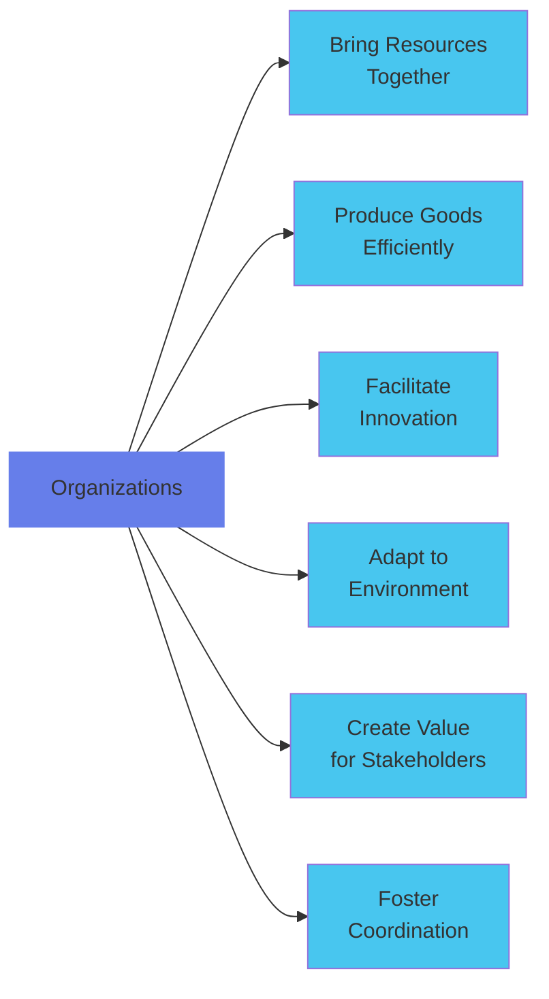

:::info[Four Key Elements of Effective Organization]
1. **Formalized, intentional internal structure of roles**
2. **Verifiable objectives** the organization aims to achieve
3. **Clear idea of major duties and activities** involved
4. **Understood area of discretion/authority** so each person knows what they can do
:::


---

## 8.2 The 4-Step Organizing Process

:::warning[Systematic Approach to Building Structure]
:::


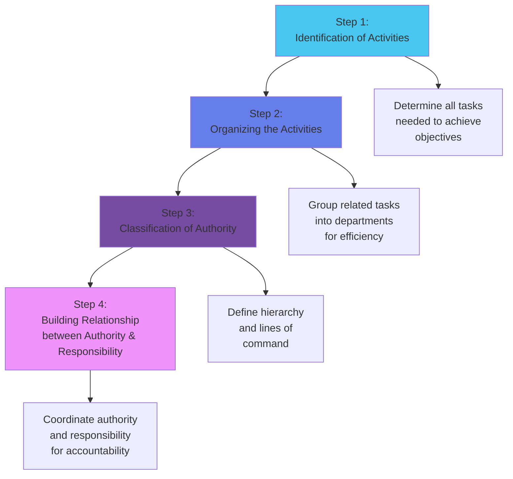

| Step | What Happens | Example |
|:-----|:------------|:--------|
| **1. Identification of Activities** | Determine all tasks the organization must perform | Manufacturing needs: Production, Quality Control, Inventory, Maintenance |
| **2. Organizing Activities** | Group related tasks into departments | All quality-related activities → Quality Assurance Dept |
| **3. Classification of Authority** | Establish who reports to whom (hierarchy) | QA Manager reports to VP Operations |
| **4. Building Relationships** | Coordinate authority & responsibility | QA Manager has authority to reject defective products AND is accountable for quality metrics |

---

## 8.3 Formal vs Informal Organizations ⭐

:::danger[High-Frequency Exam Topic]
Questions ask you to "Compare formal and informal organizations" - This appears frequently!
:::


### Definitions

:::info[Formal Organization]
The **intentional structure of roles** within a formally organized enterprise. It is consciously determined, with well-defined jobs, each bearing a specific measure of authority and responsibility.
:::


:::info[Informal Organization]
A **network of personal and social relations** not established or required by the formal organization but arising spontaneously as people associate with one another based on personal likes, dislikes, feelings, and emotions.
:::


### Comprehensive Comparison

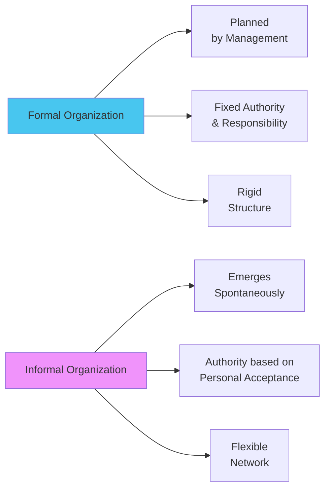

| Aspect | Formal Organization | Informal Organization |
|:-------|:-------------------|:---------------------|
| **Origin** | Designed and created by top management | Comes up on its own |
| **Planning** | Planned one | Not planned; created spontaneously |
| **Authority** | Authority and responsibility are **fixed and defined** | Authority based on **personal acceptance** |
| **Functioning** | Requires an office to function | Functions through **people** |
| **Structure** | Rigid, definite, has written constitution | Flexible, no fixed written constitution |
| **Relationships** | Official, based on hierarchy | Personal, based on friendship/trust |
| **Communication** | Follows chain of command (vertical) | Grapevine communication (informal channels) |
| **Stability** | Stable and permanent | Dynamic, changes as people come and go |
| **Purpose** | Achieve organizational objectives | Satisfy social/emotional needs of members |
| **Control** | Rules, policies, procedures | Social norms, peer pressure |

:::tip[Scenario: Formal vs Informal]
**Formal:** Marketing Manager (official role) calls a team meeting (formal communication) to discuss Q3 campaign (official objective).

**Informal:** Same manager and team members grab lunch together (informal gathering), discuss their weekend plans and office gossip (social interaction). During lunch, a team member mentions a creative idea for the campaign, which the manager values (informal communication influencing formal work).
:::


### Strategic Importance of Informal Organization

:::info[Why Managers Must Understand Informal Networks]
- **Information Flow:** News (and rumors) spread faster through grapevine than official channels
- **Influence:** Informal leaders may have more sway than formal titles
- **Morale:** Social bonds affect job satisfaction and retention
- **Innovation:** Informal brainstorming often produces breakthrough ideas
- **Resistance:** Informal groups can support or sabotage formal initiatives
:::


---

## 8.4 Span of Management (Span of Control) ⭐

:::info[Span of Management]
The number of subordinates who report directly to an executive or supervisor.
:::


### Tall vs Flat Organizational Structures

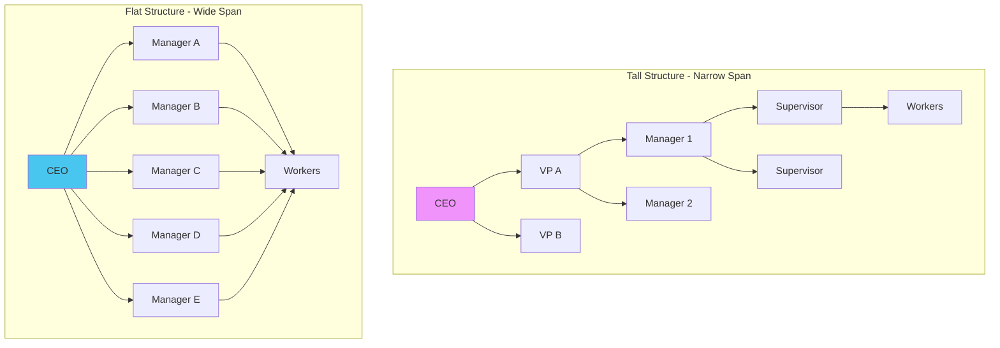

### Comprehensive Comparison

| Dimension | **Tall Structure (Narrow Span)** | **Flat Structure (Wide Span)** |
|:----------|:--------------------------------|:------------------------------|
| **Hierarchy Levels** | Many levels (7-10+) | Few levels (3-5) |
| **Span per Manager** | 2-4 subordinates | 8-15+ subordinates |
| **Communication** | **Slow** (many layers to traverse) | **Fast** (fewer layers) |
| **Decision Speed** | Slower (must go up/down hierarchy) | Faster (fewer approvals needed) |
| **Cost** | **High** (many managers' salaries) | **Low** (fewer managers) |
| **Control** | **Tight, close supervision** | **Loose,** requires autonomous employees |
| **Flexibility** | Rigid, slow to adapt | Agile, quick to adapt |
| **Career Ladder** | Clear progression (many rungs) | Limited progression (fewer levels) |
| **Employee Autonomy** | Low (micromanagement risk) | High (employees empowered) |
| **Coordination** | Complex (many handoffs) | Simpler (direct contact) |
| **Information Distortion** | High (message changes through layers) | Low (fewer filters) |
| **Best For** | Complex, high-risk operations (e.g., nuclear plants) | Dynamic, innovative environments (e.g., startups) |

:::danger[Critical Question]
*"What is the optimal span of control?"*

**Answer:** The span should be **narrow enough** to permit managers to maintain control over subordinates, but **wide enough** so that the possibility of micromanaging is minimized.
:::


---

### Factors Determining Span of Control

:::info[8 Key Factors]
:::


| Factor | Wide Span Favored When... | Narrow Span Needed When... |
|:-------|:--------------------------|:---------------------------|
| **1. Subordinate Training** | Well-trained, competent employees | New, inexperienced, require close guidance |
| **2. Delegation of Authority** | Authority clearly defined and delegated | Ambiguous responsibilities, unclear delegation |
| **3. Planning** | Clear objectives, well-documented procedures | Vague goals, changing priorities |
| **4. Rate of Change** | Stable, predictable environment | Rapidly changing, unpredictable environment |
| **5. Communication Techniques** | Tech-enabled (email, dashboards, video calls) | Face-to-face interaction required |
| **6. Kind of Activity** | Routine, standardized work | Complex, varied, non-routine tasks |
| **7. Kind of Organization** | Service-based, knowledge work | Manufacturing, Safety-critical operations |
| **8. Contact with Superiors/Subordinates** | Minimal interaction needed | Frequent personal contact required |

:::tip[Scenario Analysis]
**Scenario A - Fast Food Restaurant:**
- Standardized procedures (make burger same way every time)
- Well-trained staff (2-week onboarding sufficient)
- Routine tasks (predictable)
- **Result:** **Wide span** (1 manager supervises 12 crew members)

**Scenario B - R&D Lab:**
- Complex problem-solving (novel drug discovery)
- Ambiguous timelines (research is uncertain)
- Non-routine tasks (each project unique)
- **Result:** **Narrow span** (1 supervisor for 3-4 scientists)
:::


---

## 8.5 Urwick's 10 Principles of Organizing ⭐

:::warning[Exam Critical]
Be prepared to explain and apply each principle with examples!
:::


**Lyndall Fownes Urwick** was a British management consultant who integrated earlier theorists' ideas into a comprehensive theory of management.

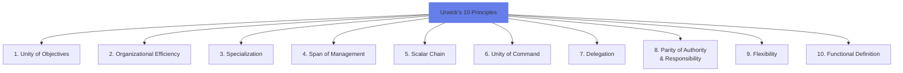

### Detailed Principles

:::info[1. Unity of Objectives]
**Definition:** An organization's structure is effective only if it enables individuals to contribute to the overall enterprise objectives.

**Explanation:** A common goal must be devised for the business as a whole. Departments should not set conflicting objectives.

**Example:** Sales dept targets "maximize revenue" while Production targets "minimize costs" → **Conflict!** Unified objective: "Optimize profitability through balanced revenue growth and cost control."
:::


:::info[2. Organizational Efficiency]
**Definition:** An organization is efficient if its structure helps accomplish enterprise objectives with a minimum of unsought consequences or costs.

**Explanation:** Design should facilitate goals without creating unnecessary friction, waste, or negative side effects.

**Example:** A matrix structure that creates role confusion and power struggles is **inefficient** despite being theoretically sound.
:::


:::info[3. Specialization]
**Definition:** The total work should be divided among subordinates based on their qualifications, abilities, and skills.

**Explanation:** Tasks should be performed by those best suited to them, leading to higher quality and efficiency.

**Example:** Assign financial analysis to MBA graduates, not engineers; assign circuit design to ECE graduates, not finance majors.
:::


:::info[4. Span of Management]
**Definition:** There is a limit to the number of people an individual can effectively and efficiently manage.

**Explanation:** The ideal number depends on underlying variables (see Section 8.4).

**Example:** A manager trying to supervise 50 employees cannot give adequate attention to each → Quality suffers.
:::


:::info[5. Scalar Chain]
**Definition:** A clear chain of command or authority must flow from the top organizational level down to the lowest levels.

**Explanation:** This clarifies reporting relationships and ensures everyone knows who reports to whom.

**Example:**
```
CEO → VP Operations → Plant Manager → Production Supervisor → Assembly Line Workers
```
Each level knows who gives them orders and to whom they report.
:::


:::info[6. Unity of Command]
**Definition:** To avoid confusion and conflicting instructions, every subordinate should be answerable and accountable to only ONE boss for a particular task.

**Explanation:** Prevents the problem of receiving conflicting orders from multiple superiors.

**Example:** In a matrix organization, an engineer reports to both a Project Manager and a Functional Manager → **Violates Unity of Command** → Creates confusion. Line organization maintains this principle strictly.
:::


:::info[7. Delegation]
**Definition:** Authority should be delegated as far down the organizational hierarchy as possible.

**Explanation:** Individuals must be given adequate authority to accomplish the results expected of them, empowering them to act effectively.

**Example:** A store manager is given authority to approve refunds up to ₹5,000 without seeking head office approval → Faster customer service, manager feels empowered.
:::


:::info[8. Parity of Authority and Responsibility]
**Definition:** The responsibility assigned to an individual cannot be greater or less than the authority delegated to them.

**Explanation:**
- **Authority = Responsibility** ✅ Balanced
- **Authority &lt; Responsibility** ❌ Helplessness (accountable but powerless)
- **Authority > Responsibility** ❌ Abuse of power

**Example:** Project Manager is responsible for meeting deadline (Responsibility) but has authority to authorize overtime (Authority) → **Balanced**. If they can't authorize overtime but must meet deadline → **Violation**.
:::


:::info[9. Flexibility]
**Definition:** The organizational structure must be simple to understand and adaptable.

**Explanation:** Structure should adjust to changes in business environment, technology, and operational procedures.

**Example:** COVID-19 forced companies to shift to remote work. Organizations with flexible structures (empowered teams, digital tools) adapted quickly. Rigid, bureaucratic structures struggled.
:::


:::info[10. Functional Definition]
**Definition:** Every position and department must have a clear and precise definition of the expected results, activities, and authority delegated.

**Explanation:** Job descriptions and departmental charters should clearly define what each role entails.

**Example:** Job Description for "Quality Engineer" states:
- **Expected Results:** Zero defects in production
- **Activities:** Conduct inspections, document deviations, train production staff
- **Authority:** Reject defective products, stop production line if critical issue found
:::


---

## 8.6 Departmentation: 8 Patterns ⭐

:::info[Departmentation]
The fundamental process of grouping homogeneous jobs into manageable units to build an organization's structure.
:::


### The 8 Patterns

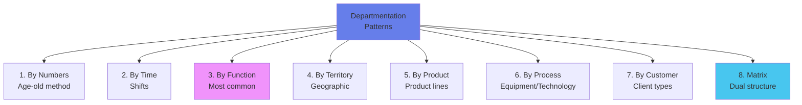

---

### 1. Departmentation by Simple Numbers

:::info[Grouping by Headcount]
**Method:** Individuals performing the same duties are grouped together under a single manager.

**Status:** Rapidly falling into disuse at higher levels; useful only at lowest organizational levels.

**Why Declining:** Advancing technology demands more specialized skills (not just warm bodies).

**Example:** Army: Squad of 10 soldiers under one sergeant (all soldiers perform similar basic duties).
:::


---

### 2. Departmentation by Time

:::info[Shift-Based Organization]
**Method:** Grouping activities based on time, commonly using shifts (day, evening, night).

**Suitable For:** Hospitals, 24/7 call centers, manufacturing plants with continuous operations.
:::


| Advantages ✅ | Limitations ❌ |
|:-------------|:---------------|
| Services can be offered 24/7 | Supervising during night shifts can be difficult |
| Continuous cycle operations need not be interrupted | Fatigue factor (disrupts biological clocks) |
| Expensive capital equipment used >8 hours/day | Coordination and communication problems between shifts |
| Allows flexible work schedules (students work nights) | Overtime payments increase production costs |

:::tip[Real-World: Hospital Nursing]
- **Day Shift (7 AM - 3 PM):** 40 nurses
- **Evening Shift (3 PM - 11 PM):** 35 nurses
- **Night Shift (11 PM - 7 AM):** 25 nurses

Each shift has a Shift Supervisor. **Challenge:** Patient handoff between shifts can cause information loss.
:::


---

### 3. Departmentation by Enterprise Functions

:::warning[Most Widely Used Pattern]
**Method:** Activities grouped according to the function being performed (e.g., Marketing, Finance, Production, HR).
:::


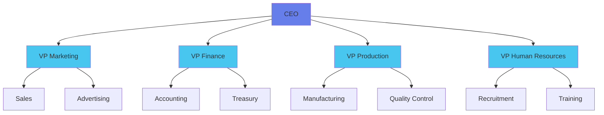

| Strengths ✅ | Weaknesses ❌ |
|:------------|:--------------|
| Allows economies of scale within functional departments | Slow response time to environmental changes |
| Enables in-depth knowledge and skill development | Decisions pile up at the top, overloading hierarchy |
| Enables organization to accomplish functional goals | Poor horizontal coordination among departments |
| Best with only one or a few products | Less innovation |
| | Restricted view of organizational goals (silo mentality) |

:::warning[The Silo Problem]
**Scenario:** Marketing promises customer a custom feature. Production says "Not possible with current process." Customer angry. Why?

**Root Cause:** Functional departmentation creates silos. Marketing focuses on sales targets; Production on efficiency. No shared goal → Conflict.

**Solution:** Cross-functional teams, shared KPIs (e.g., "Customer Satisfaction" for both depts).
:::


---

### 4. Departmentation by Territory/Geography

:::info[Location-Based Structure]
**Method:** Groups activities based on geographic location.

**Useful When:** Customers are dispersed; local markets have unique needs.
:::


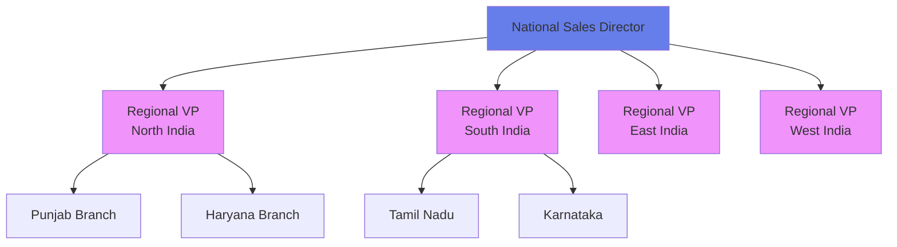

| Advantages ✅ | Limitations ❌ |
|:-------------|:---------------|
| Places responsibility at lower levels (regional autonomy) | Requires more persons with general manager abilities |
| Emphasis on local markets and problems | Difficulty maintaining economic central services |
| Improves coordination within a region | Increases problem of top management control |
| Takes advantage of economies of local operation | |
| Better face-to-face communication with local interests | |
| Measurable training ground for general managers | |

:::tip[McDonald's India]
**Geographic Departmentation:**
- **North Region:** Vegetarian menu emphasis (cultural preference)
- **South Region:** Spicier variants (taste preference)
- **East Region:** Fish-based items (bengali cuisine influence)

Each region has autonomy to adapt menu to local tastes while maintaining core brand standards.
:::


---

### 5. Departmentation by Product

:::info[Product Line-Based Structure]
**Method:** Activities grouped based on a specific product or service line.

**Best For:** Diversified companies with multiple distinct product lines.
:::


:::tip[Procter & Gamble Structure]
- **Beauty Division:** Olay, Gillette, Head & Shoulders
- **Fabric \u0026 Home Care:** Tide, Ariel, Downy
- **Baby Care:** Pampers
- **Health Care:** Vicks, Oral-B

Each division has its own Marketing, R&D, Production focused on its product line.
:::


**Advantages:**
- Clear profit responsibility (each product group is a profit center)
- Product-focused expertise
- Easier to measure product performance

**Disadvantages:**
- Duplication of functions (each division has its own HR, Finance, etc.)
- May create competition between divisions for resources

---

### 6. Process/Equipment Departmentation

:::info[Technology-Based Grouping]
**Method:** Groups activities around a specific process or type of equipment.

**Common In:** Manufacturing settings with sequential operations.
:::


:::tip[Automobile Assembly Plant]
```
Welding Dept → Painting Dept → Assembly Dept → Quality Inspection → Shipping
```

Each department specializes in a specific process/equipment. Workers in "Welding" are welding experts; "Painting" has spray booth specialists.
:::


**Advantage:** Technical specialization
**Challenge:** Coordination between sequential processes (bottlenecks)

---

### 7. Customer Departmentation

:::info[Client-Type Based Structure]
**Method:** Activities grouped based on common customers or types of customers.

**Assumption:** Different customer segments have unique needs best met by specialists.
:::


:::tip[Bank Structure]
```
Head of Retail Banking
 ├── Retail/Consumer Division (Individual customers)
 │    ├── Savings Accounts
 │    ├── Personal Loans
 │    └── Home Loans
 ├── Corporate Banking Division (Businesses)
 │    ├── Trade Finance
 │    └── Cash Management
 └── NRI Services Division (Non-Resident Indians)
      ├── NRE/NRO Accounts
      └── Forex Services
```
:::


**Advantages:**
- Deep understanding of customer needs
- Customer feels "special" (dedicated team)
- Tailored service delivery

**Challenges:**
- Underutilization of facilities if demand fluctuates
- Difficulty coordinating between customer groups
- Hard to define customer categories clearly

---

### 8. Matrix Departmentation ⭐

:::warning[Exam Critical: Violation of Unity of Command]
Matrix structure **violates Urwick's Principle of Unity of Command** because employees have **TWO bosses**!
:::


:::info[Dual Reporting Structure]
**Method:** Combines functional and product/project patterns in the same organization. Superimposes horizontal divisional reporting relationships onto traditional vertical functional structure.
:::


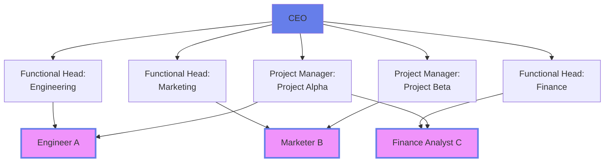

**Key Feature:** Engineer A reports to:
1. **Functional Boss** (Engineering Head) for technical expertise, career development
2. **Project Boss** (Project Manager Alpha) for project deliverables, deadlines

| Advantages ✅ | Disadvantages ❌ |
|:-------------|:----------------|
| Pinpoints product-profit responsibility | **Violates Unity of Command** (2 bosses) |
| Oriented towards end results | Conflict in organizational authority exists |
| Professional identification is maintained | Requires managers effective in human relations |
| Flexible assignment of experts to projects | Role ambiguity and stress for employees |
| Efficient use of specialists | Complex, expensive to implement |

:::tip[Consulting Firm Matrix]
**Scenario:** Consultant Priya works on:
- **Functional Boss:** Head of Strategy Practice (maintains her strategy expertise, assigns her to projects)
- **Project Boss:** Client Engagement Manager for TechCo Project (directs her daily work, evaluates project performance)

**Conflict Example:**
- **Strategy Head says:** "Focus on developing our new AI consulting methodology (long-term practice development)"
- **Client Manager says:** "TechCo deadline is tomorrow; I need you 100% on client deliverables (short-term profit)"

Priya is stuck in the middle → **Stress, Role Ambiguity**
:::


---

## 8.7 Line vs Line & Staff Structures

:::info[Organizational Authority Models]
:::


### Line Organization

:::info[Pure Vertical Structure]
The oldest type of organization (also called military/scalar structure). Authority flows in a direct line from top to bottom.
:::


**Key Features:**
- Simplest form of organization
- Line of authority flows directly top to bottom
- NO specialized/supportive services
- Unified control can be maintained
- Line officers independently make decisions in their areas
- Brings efficiency in communication and stability

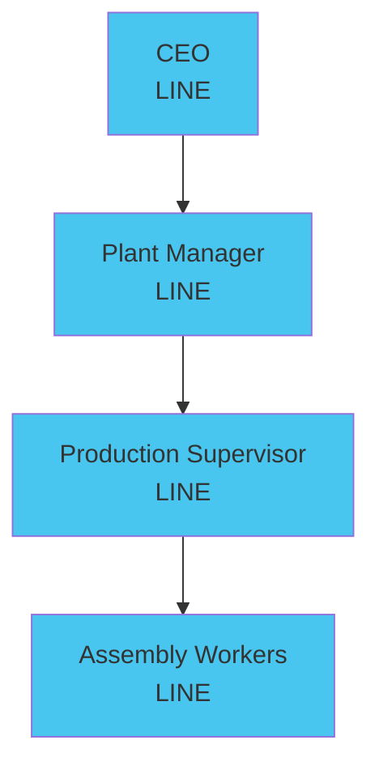

**Example:** Small manufacturing company
- Owner → Plant Foreman → Assembly Supervisor → Workers
- Everyone is in the "line" of production. No staff specialists (HR, Legal, IT) exist.

---

### Line & Staff Organization

:::info[Modified Structure with Specialists]
A modification of line organization where specialist advisors (staff) are added to assist line managers. Power of command remains with line executives.
:::


**Key Features:**
- More complex compromise of line organization
- Division of work and specialization are key
- Organization divided into functional areas with attached staff specialists
- Efficiency achieved through specialization
- **Power of command remains with line executives**
- Staff serve in **advisory capacity** only

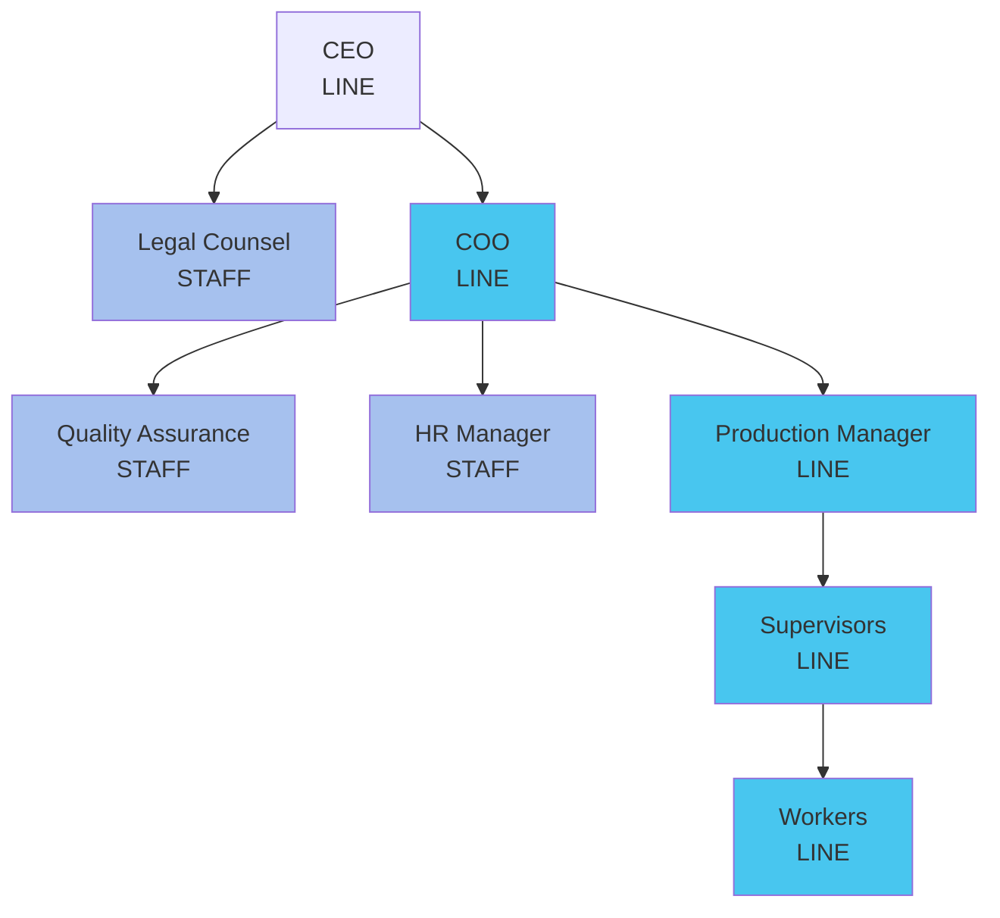

### Line vs Staff Comparison

| Aspect | Line Functions | Staff Functions |
|:-------|:-------------|:---------------|
| **Nature** | Command, Direct orders | Advise, Support, Recommend |
| **Authority** | Can command subordinates to act | Can only recommend; no direct command |
| **Examples** | CEO, Production Manager, Sales Manager | Legal Advisor, HR Manager, Quality Consultant |
| **Responsibility** | Directly accountable for profits | Accountable for quality of advice |
| **Focus** | Operational, results-driven | Expertise, knowledge-driven |

:::tip[Line-Staff Collaboration]
**Scenario:** Production line producing 100 units/day. Quality defects increasing.

**Line (Production Manager):** "We need to fix quality issues affecting our output target."

**Staff (Quality Assurance Manager):** "I recommend implementing Statistical Process Control (SPC). Train operators on inspection protocols. Budget: ₹5 Lakhs."

**Line (Production Manager):** Reviews recommendation → **Makes final decision** → "Approved. Implement by next quarter."

**Key:** QA **advised**; Production Manager **commanded**.
:::


---

## 8.8 Authority, Responsibility, and Delegation

:::warning[The Operational Glue of Organizations]
:::


### Core Definitions

:::info[Authority]
The **rightful legal power** to request subordinates to do certain things or to refrain from doing so. If subordinate doesn't comply, manager has power to take disciplinary action.
:::


:::info[Responsibility]
The **obligation** of a subordinate, to whom a supervisor has assigned a task, to perform the service required.
:::


:::info[Delegation]
The process that involves determination of expected results, assignment of tasks, and delegation of authority for accomplishment.
:::


---

### The Process of Delegation

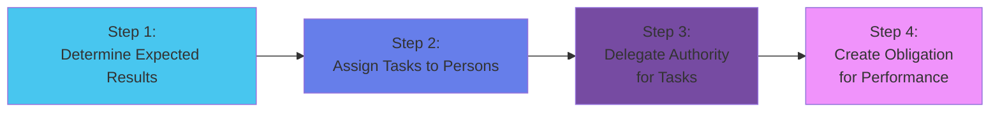

| Step | What Happens | Example |
|:-----|:------------|:--------|
| **1. Determination of Expected Results** | Define what success looks like | "Sales team must achieve ₹10 Cr revenue by Q4" |
| **2. Assignment of Tasks** | Give specific duties to individuals | "Ravi: Handle North region; Priya: South region" |
| **3. Delegation of Authority** | Grant power to commit resources, make decisions | "Ravi can approve discounts up to 15% without my approval" |
| **4. Creation of Obligation** | Subordinate becomes accountable for results | "Ravi is responsible for achieving ₹5 Cr in North; will be evaluated on this" |

---

### The Golden Rule: Parity Principle

:::info[Authority = Responsibility]
:::


| Situation | Result | Example |
|:----------|:-------|:--------|
| **Authority = Responsibility** | ✅ **Ideal Balance** | Sales Manager can set discounts (Authority) AND is accountable for profit margin (Responsibility) |
| **Authority > Responsibility** | ❌ **Abuse of Power** | Boss can hire (Authority) but isn't accountable for team performance → Hires unqualified relatives |
| **Authority &lt; Responsibility** | ❌ **Helplessness, Frustration** | Project Manager responsible for deadline (Responsibility) but can't authorize overtime (Authority) → Deadline missed, manager blamed unfairly |

:::warning[Responsibility Cannot Be Delegated]
While you can delegate authority (power to act), you **remain ultimately responsible** as the manager.

**Example:** CEO delegates hiring to HR. HR makes a bad hire. CEO is still accountable to the Board of Directors for the HR function's performance.
:::


---

## 📚 EXHAUSTIVE QUESTION BANK

### Section A: Formal vs Informal Organizations

:::note[Q1. Comprehensive Comparison]
**(PYQ Pattern)**
"Compare and contrast formal and informal organizations. Provide a table highlighting at least FIVE key differences and explain the strategic significance of understanding informal networks for managers."
(8 marks)

**Model Answer:**
*(Use comparison table from Section 8.3)*

**Strategic Significance:**
1. **Information Flow:** Grapevine spreads news faster than official channels → Managers must monitor and address rumors proactively
2. **Influence Dynamics:** Informal leaders may sway opinion more than formal titles → Identify and engage these influencers
3. **Morale \u0026 Retention:** Social bonds directly affect job satisfaction → Foster positive informal culture
4. **Innovation Source:** Informal brainstorming often produces breakthrough ideas → Create spaces for informal interaction (e.g., Google's 20% time)
5. **Change Management:** Informal groups can support or sabotage initiatives → Win informal network's buy-in before announcing formal changes
:::


:::note[Q2. Scenario: Grapevine Communication]
"In a manufacturing plant, a rumor spreads through the informal network that the company will lay off 50% of workers next month. This is false, but employee morale plummets and productivity drops. As the HR Manager, how would you:
a) Address this immediate crisis?
b) Prevent such misinformation in the future?"
(6 marks)
:::


:::note[Q3. Informal Organization Benefits]
"While formal organization is planned and official, the informal organization that emerges can actually benefit the company. Explain THREE ways informal networks add value to organizational effectiveness." (5 marks)

**Hint:** Faster problem-solving, Social support reducing stress, Peer mentoring
:::


### Section B: Span of Management

:::note[Q4. Tall vs Flat Structure Decision]
**(PYQ Pattern)**
"A startup tech company is growing rapidly from 20 to 200 employees. The founder asks you: 'Should we build a tall structure with many layers or a flat structure with wide spans?'

a) Create a comprehensive comparison table of tall vs flat structures covering at least SIX dimensions
b) Recommend which structure is more suitable for this tech startup and justify with THREE reasons"
(10 marks)

**Sample Answer:**
*(Use comparison table from Section 8.4)*

**Recommendation:** **Flat Structure**

**Reasons:**
1. **Speed of Innovation:** Tech industry requires fast decision-making. Flat structure enables rapid approvals without bureaucratic layers.
2. **Attract Talent:** Tech professionals value autonomy and empowerment. Wide spans give employees more ownership, attracting top talent.
3. **Cost Efficiency:** Startup resources are limited. Flat structure minimizes management overhead, allowing more budget for product development and engineering talent.
:::


:::note[Q5. Factors Determining Span]
"Analyze the following two scenarios. For each, determine whether a WIDE or NARROW span of control is appropriate and justify using at least THREE factors from the text.

**Scenario A:** Call center with 50 customer service reps answering technical support calls. Scripts are provided, but each customer issue is unique. New hires receive 1 month of training.

**Scenario B:** Retail store with 20 sales associates. POS system is standardized. Store has been operating for 5 years with very low turnover; most associates have 2+ years experience."
(8 marks)
:::


:::note[Q6. Optimal Span of Control]
**(PYQ Pattern)**
"Define 'Span of Management.' According to the text, what is the optimal span of control? List and explain FOUR factors that influence the determination of this optimal span." (6 marks)
:::


### Section C: Urwick's Principles

:::note[Q7. Identify Violated Principles]
**(PYQ Pattern)**
Identify which of Urwick's principles is being violated in each scenario:

a) "A project manager is held responsible for meeting a critical deadline, but they are not given the authority to approve overtime for their team members, which is essential to meet the deadline."
**Answer:** **Principle of Parity of Authority and Responsibility**

b) "In a new organizational structure, an employee receives instructions from both the marketing manager and the operations manager for the same project, causing confusion about priorities."
**Answer:** **Principle of Unity of Command**

c) "An organization has created multiple departments, but there is no clear understanding of who reports to whom, leading to chaos and inefficiency."
**Answer:** **Principle of Scalar Chain**

d) "The engineering department is assigned to handle customer service calls, despite having no training or background in customer relations."
**Answer:** **Principle of Specialization**

e) "A company rigidly follows a 20-year-old organizational structure, even though the industry has undergone massive technological changes and customer preferences have shifted dramatically."
**Answer:** **Principle of Flexibility**
(10 marks)
:::


:::note[Q8. Unity of Command in Matrix]
"Explain Urwick's Principle of Unity of Command with an example. Why does a matrix organizational structure violate this principle? What are the consequences of this violation?" (6 marks)
:::


:::note[Q9. Apply All 10 Principles]
"An entrepreneur is setting up a new e-commerce company with 100 employees. As a management consultant, provide specific recommendations for applying FIVE of Urwick's principles to ensure the organization is well-structured from the start." (10 marks)

**Sample Answer:**
1. **Unity of Objectives:** Ensure all departments (Tech, Marketing, Logistics, Customer Service) align towards common goal: "Achieve 1 million orders in Year 1 with 95% customer satisfaction."
2. **Specialization:** Divide work based on expertise: UI/UX designers for website, logistics experts for warehousing, digital marketers for campaigns.
3. **Scalar Chain:** Establish clear hierarchy: CEO → VP Tech/VP Marketing/VP Operations → Department Managers → Team Leads → Individual contributors.
4. **Delegation:** Empower warehouse manager to approve inventory purchases up to ₹5L without CEO approval for speed.
5. **Flexibility:** Design structure to adapt easily (e.g., can quickly create a new "Social Media Marketing" team if Instagram becomes critical channel).
:::


### Section D: Departmentation

:::note[Q10. Departmentation by Time]
**(PYQ Pattern)**
"A hospital operates 24/7 and uses departmentation by time for its nursing staff.
a) Explain how this departmentation pattern works
b) Provide a table listing THREE advantages and THREE limitations from the text
c) Suggest ONE strategy to mitigate the coordination challenge between shifts"
(8 marks)
:::


:::note[Q11. Functional Departmentation Critique]
**(PYQ Pattern)**
"Departmentation by enterprise functions (Marketing, Finance, Production, HR) is the most widely used pattern. However, the text lists FIVE weaknesses. Identify and explain THREE of these weaknesses with real-world examples." (6 marks)

**Sample Answer:**

**Weakness 1: Slow Response to Environmental Changes**
- **Explanation:** Decisions must travel up to top management (only they see big picture) and back down → Delays
- **Example:** Kodak's functional structure delayed response to digital camera threat. Product development (a functional silo) didn't coordinate with R\u0026D fast enough.

**Weakness 2: Poor Horizontal Coordination**
- **Explanation:** Each function focuses on own goals → Lack of collaboration
- **Example:** Sales promises custom product to client. Production says "Not feasible with current process." Customer angry due to lack of cross-functional alignment.

**Weakness 3: Restricted View / Silo Mentality**
- **Explanation:** Finance cares about cost; Marketing cares about revenue. No shared holistic view.
- **Example:** Finance cuts advertising budget to save costs. Marketing can't reach customers → Revenue drops → Company loses more money than saved.
:::


:::note[Q12. Geographic Departmentation Case]
**(PYQ Pattern)**
"A large FMCG company sells products across India. Propose and justify a geographic departmentation scheme for its sales force. Create an organizational chart showing at least TWO levels. Then, using information from the text, provide a table of THREE advantages and TWO limitations." (8 marks)
:::


:::note[Q13. Matrix Organization Analysis]
**(PYQ Pattern)**
"Matrix departmentation is common in construction, aerospace, and consulting industries.
a) Draw a matrix organization chart showing functional and project dimensions
b) Explain why an employee in this structure has TWO bosses
c) Identify the Urwick principle this violates
d) Describe ONE advantage and TWO disadvantages from the text"
(10 marks)
:::


:::note[Q14. Choose Appropriate Departmentation]
For each scenario, recommend the MOST appropriate departmentation pattern and justify:

a) A global smartphone company with product lines: Budget phones, Premium phones, Tablets
**Answer:** **Product Departmentation** (Each product line has unique customer base, technology, competitors)

b) An airline's customer service division serving: First Class, Business Class, Economy passengers
**Answer:** **Customer Departmentation** (Different service expectations for each customer segment)

c) An automobile manufacturing plant with operations: Stamping → Welding → Painting → Assembly → Inspection
**Answer:** **Process/Equipment Departmentation** (Sequential operations using specialized equipment)

d) A multinational bank with offices in 50 countries across Asia, Europe, Americas
**Answer:** **Territory/Geographic Departmentation** (Dispersed customers, local regulatory requirements)
(8 marks)
:::


:::note[Q15. Departmentation Trade-offs]
"Every departmentation pattern has strengths and weaknesses. Choose any TWO patterns and create a detailed advantage-disadvantage table for each. Then, explain under what circumstances a company might COMBINE two patterns (hybrid structure)." (8 marks)
:::


### Section E: Line vs Staff

:::note[Q16. Line \u0026 Staff Organization]
**(PYQ Pattern)**
"Draw an organizational chart for a manufacturing company showing both line and staff functions. Label at least THREE line positions and TWO staff positions. Explain the key difference between line and staff authority with a specific example of collaboration between them." (8 marks)

**Sample Answer:**
*(Draw chart from Section 8.7)*

**Key Difference:**
- **Line:** Can **command** subordinates to take action (e.g., Production Manager orders supervisor: "Increase output to 500 units/day")
- **Staff:** Can only **advise/recommend** (e.g., Quality Manager suggests: "Recommend implementing Six Sigma training")

**Collaboration Example:**
Production Manager (Line) needs to reduce defects. Quality Assurance Manager (Staff) conducts root cause analysis and recommends new inspection protocol. Production Manager reviews, approves, and **commands** supervisors to implement the new protocol. QA trains workers (advisory role). Production Manager monitors results (command role).
:::


:::note[Q17. Line Organization Limitations]
"The text describes Line Organization as the 'simplest form' and 'oldest type.' For a modern, large corporation, why would a pure line organization be insufficient? Explain why Line \u0026 Staff evolved as a modification." (5 marks)

**Hint:** Complexity requires specialization; Line managers can't be experts in HR, Legal, IT, Quality, Finance simultaneously.
:::


### Section F: Authority \u0026 Delegation

:::note[Q18. Delegation Process Application]
**(PYQ Pattern)**
"As a Regional Sales Manager, you want to delegate the responsibility of organizing a 3-day sales conference to your Assistant Manager. Using the 4-step delegation process from the text, explain exactly how you would delegate this task." (6 marks)

**Model Answer:**

**Step 1: Determine Expected Results**
- "Organize a professional sales conference for 100 attendees from Aug 10-12. Expected outcomes: All attendees registered by Aug 1, agenda finalized by July 20, venue booked by July 15, budget not to exceed ₹10 Lakhs."

**Step 2: Assign Tasks**
- "Your specific duties: Book conference venue, arrange catering, coordinate travel for out-of-town attendees, prepare conference materials (agenda booklets, name badges), manage speaker logistics, send invitations and track RSVPs."

**Step 3: Delegate Authority**
- "You have authority to: Approve vendor contracts up to ₹2L per vendor without my signature, book hotels within ₹5K/night budget, make decisions on conference logistics (seating, AV equipment). For expenses >₹2L, seek my approval first."

**Step 4: Create Obligation**
- "You are accountable for the conference's success. I will evaluate your performance based on: staying within budget, meeting all deadlines, attendee satisfaction survey results (target: 8/10 rating). Any deviations from plan must be reported to me immediately."
:::


:::note[Q19. Parity Principle Violations]
"Urwick's Principle of Parity states Authority must equal Responsibility. Analyze the following scenarios and identify whether Authority > Responsibility or Authority &lt; Responsibility. Explain the consequences in each case.

a) A Quality Inspector can reject defective products (Authority) but is not held accountable if too many defects slip through (No Responsibility).

b) A Store Manager is responsible for achieving monthly sales targets (Responsibility) but cannot offer discounts or promotions without head office approval, even when competitors are running aggressive sales (Authority &lt; Responsibility)."
(6 marks)
:::


:::note[Q20. Responsibility Cannot Be Delegated]
"The text states: 'While you can delegate authority, you remain ultimately responsible as the manager.' Explain this concept with a corporate example. Why is this principle important for accountability in organizations?" (5 marks)

**Sample Answer:**

**Example:** CEO delegates hiring authority to HR Director. HR Director hires an unqualified candidate who causes a major data breach costing company ₹50 Cr.

- **Delegation:** CEO gave HR Director authority to make hiring decisions
- **Ultimate Responsibility:** Board of Directors holds CEO accountable (not just HR Director), because CEO is responsible for all organizational functions, including HR
- CEO may take corrective action (fire HR Director, revamp hiring process), but CEO's own reputation and job are at stake

**Importance:** Ensures senior managers cannot escape accountability by saying "I delegated that." Maintains clear ownership at every level. Encourages managers to delegate wisely and monitor delegated tasks.
:::


---

:::note[Module 8 Key Takeaways]
✅ **Formal vs Informal** = Planned structure vs Spontaneous social networks (Both matter!)
✅ **Span of Management** = Tall (narrow, close control) vs Flat (wide, empowered employees)
✅ **Urwick's 10 Principles** = Unity of Command, Parity, Specialization, Scalar Chain, Delegation, Flexibility
✅ **8 Departmentation Patterns** = Functional (most common), Geographic, Matrix (violates Unity of Command)
✅ **Line vs Staff** = Command authority vs Advisory authority
✅ **Delegation** = 4 Steps: Expected Results → Assign Tasks → Delegate Authority → Create Obligation
✅ **Parity Principle** = Authority = Responsibility (Golden Rule)
:::


**Next:** **Module 9 - Advanced Staffing & Talent Management** where you'll master Job Analysis, Recruitment, Selection, Training methods, and the Systems Approach to Staffing! 👔
