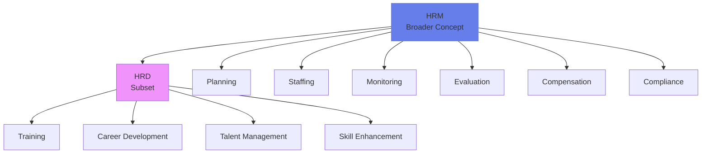
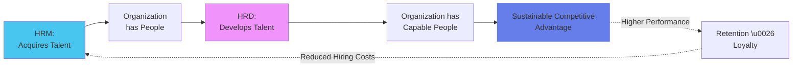
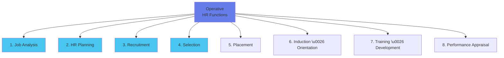
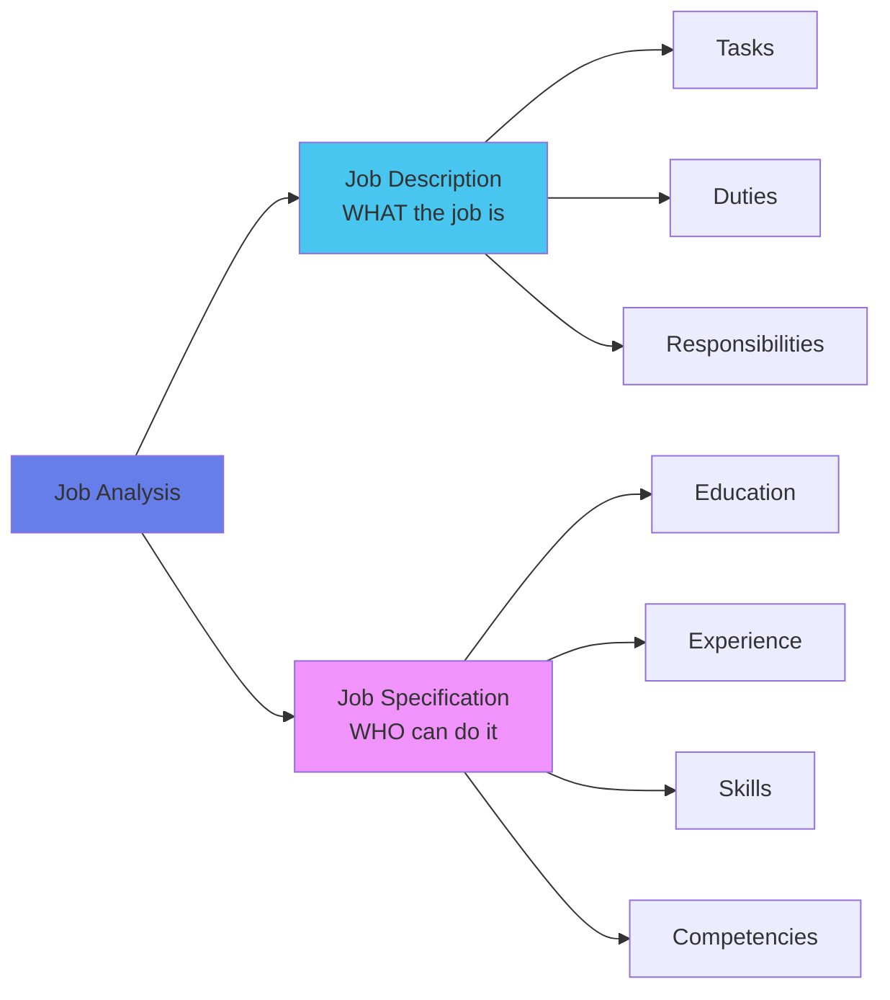
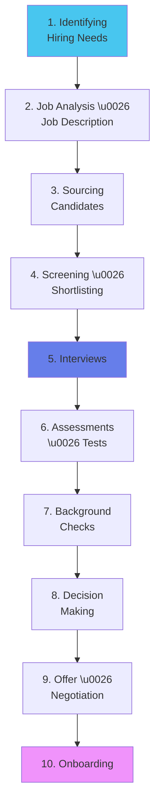
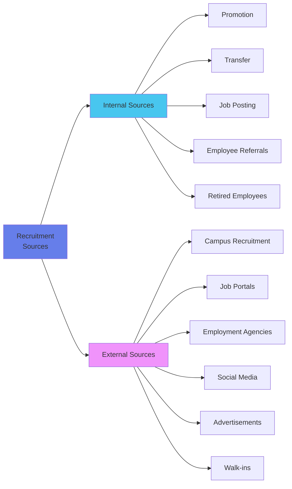
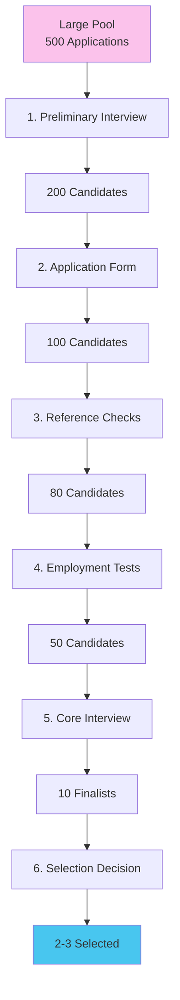
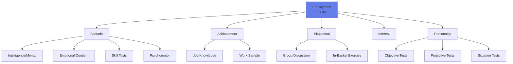

# Module 9: Advanced Staffing & Talent Management 👔

:::tip[Learning Objectives]
By mastering this module, you will:
1. **Differentiate** HRM vs HRD with strategic clarity
2. **Master** Job Analysis, Job Description, and Job Specification
3. **Apply** the 10-Step Recruitment Process
4. **Analyze** the 6-Step Selection Procedure
5. **Evaluate** Employment Tests and Interview types
6. **Understand** Training methods and current trends
7. **Comprehend** the Systems Approach to Staffing
:::

---

## 9.1 HRM vs HRD: Strategic Perspective

:::warning[Foundational Distinction]
**HRM (Human Resource Management)** and **HRD (Human Resource Development)** are related but distinct; HRM is the bigger concept.
:::

### Definitions

:::info[Human Resource Management (HRM)]
Focuses on **managing people** within an organization and dealing with administrative tasks, policies, and procedures. Encompasses planning, staffing, monitoring, and evaluating performance throughout the employee lifecycle.
:::

:::info[Human Resource Development (HRD)]
A **subset of HRM** that emphasizes enhancing employees' skills, knowledge, and capabilities to foster growth and organizational success through learning and development initiatives.
:::

### Relationship

:::info[HRM > HRD]
- HRD focuses on **development** (training, career growth)
- HRM encompasses the **entire employee lifecycle** (hire, manage, develop, compensate, exit)
:::

### Comprehensive Comparison

| Dimension | HRM | HRD |
|:----------|:----|:----|
| **Scope** | Entire employee lifecycle | Development and growth |
| **Time Horizon** | Current needs \u0026 operations | Future capabilities \u0026 leadership |
| **Orientation** | **Reactive** (solve current issues) | **Proactive** (build future skills) |
| **Primary Focus** | Managing people as resources | Developing people's potential |
| **Key Activities** | Recruitment, payroll, compliance, leave management, industrial relations | Training programs, career planning, succession planning, leadership development |
| **Goal** | Employee **Performance** (current job) | Employee **Competence** (future roles) |
| **Metrics** | Turnover rate, Time-to-hire, Cost-per-hire | Skill acquisition, Career progression, Leadership pipeline strength |
| **Nature** | Administrative, control-oriented | Learning-oriented, growth-focused |
| **Example** | "Hire 10 Python developers" | "Train existing Java developers in Python for future projects" |

### Benefits of HRM-HRD Integration

:::info[Synergistic Relationship]
:::

**Four Key Benefits:**

1. **Holistic Employee Development:** Comprehensive approach to both immediate support (HRM) and long-term skill enhancement (HRD)
2. **Strategic Alignment:** HR practices directly aligned with organizational goals, enhancing company's strategic objectives
3. **Improved Productivity:** Boosted employee skills and engagement lead to increased efficiency
4. **Enhanced Talent Retention:** Investing in development fosters loyalty and reduces turnover rates

:::tip[TCS Model]
**HRM:** Hires 40,000 fresh engineering graduates annually from campus recruitment

**HRD:** Provides 3-month "Initial Learning Program" (ILP) training all new hires in software development, client communication, and domain knowledge

**Result:** Industry-ready engineers who stay longer (lower attrition) because they see career growth through continuous learning
:::

---

## 9.2 HRM Functions: Managerial vs Operative

### Managerial Functions (What Managers Do)

:::info[Four Classic Management Functions Applied to HR]
:::

| Function | What It Involves | Example |
|:---------|:----------------|:--------|
| **Planning** | Formulating HR strategies and programs in advance | Workforce planning: "We need 50 data scientists in next 2 years" |
| **Organizing** | Structuring HR tasks, defining relationships | Creating HR Dept structure: Recruitment Team, Training Team, Compensation Team |
| **Directing** | Activating employees, maximizing contributions through motivation | HR head motivates recruitment team to fill 100 positions by Q4 |
| **Controlling** | Monitoring performance vs plans, implementing corrective actions | Track "Time-to-hire" metric; if it exceeds 45 days, investigate and fix process |

### Operative Functions (What HR Dept Does)

:::info[Eight Core HR Operations]
:::

| Function | Definition | Outcome |
|:---------|:-----------|:--------|
| **Job Analysis** | Studying specific job roles and responsibilities | Job Description + Job Specification |
| **HR Planning** | Ensuring availability of qualified personnel | Human Resource Plan (how many, what type) |
| **Recruitment** | Searching for and attracting prospective employees | Pool of candidates |
| **Selection** | Assessing applicants' qualifications and suitability | Best candidate chosen |
| **Placement** | Matching selected candidates with suitable roles | Employee assigned to right position |
| **Induction \u0026 Orientation** | Helping new employees adjust | Engaged, informed new hires |

---

## 9.3 Job Analysis: The Foundation ⭐

:::info[Job Analysis]
A **systematic process** of determining the skills, duties, and knowledge required for performing jobs in an organization.
:::

### Core Terminology

:::info[Key Terms]
- **Job:** A group of tasks that must be performed for an organization to achieve its goals
- **Position:** A collection of tasks and responsibilities performed by ONE person (1 person = 1 position)
- **Job Description:** Document providing information on the **tasks, duties, and responsibilities** of a job
- **Job Specification:** The **minimum qualifications** required to perform a particular job
:::

### Job Description vs Job Specification

:::danger[Critical Distinction]
:::

| Aspect | Job Description (JD) | Job Specification (JS) |
|:-------|:-------------------|:---------------------|
| **Question Answered** | "What is the job?" | "Who should we hire?" |
| **Content** | Tasks, duties, responsibilities, reporting relationships, work conditions | Qualifications, education, experience, skills, competencies, personal traits |
| **Focus** | The **position itself** | The **ideal candidate** |
| **Example** | "Manage a team of 5 software engineers; conduct code reviews; coordinate with Product team; ensure sprint deadlines are met" | "B.Tech Computer Science, 5+ years experience in team leadership, proficient in Python/Java, strong communication skills, PMP certification preferred" |
| **Tone** | Descriptive (what happens in the role) | Prescriptive (what candidate must have) |

### Importance of Job Analysis

:::info[Foundation for ALL HR Functions]
:::

Job Analysis feeds into:

1. **Human Resource Planning:** Know what skills needed
2. **Recruitment:** Write accurate job ads
3. **Selection:** Design relevant tests/interviews
4. **Training \u0026 Development:** Identify skill gaps
5. **Performance Appraisal:** Set job-based standards
6. **Compensation \u0026 Benefits:** Determine pay based on job complexity
7. **Safety \u0026 Health:** Identify job hazards

:::tip[Practical Job Analysis → JD/JS]

**Job Title:** Software Development Engineer (SDE-II)

**JOB DESCRIPTION:**
| Field | Details |
|:------|:--------|
| **Department** | Engineering |
| **Reports To** | Engineering Manager |
| **Summary** | Design, develop, and maintain scalable backend services for e-commerce platform |
| **Duties** | • Write clean, efficient code in Python/Java • Design RESTful APIs • Conduct code reviews • Debug production issues • Collaborate with Product and QA teams |
| **Work Conditions** | Primarily office-based; occasional on-call rotation for production support |

**JOB SPECIFICATION:**
| Field | Details |
|:------|:--------|
| **Education** | B.Tech/B.E. in Computer Science or related field |
| **Experience** | 2-4 years in backend development |
| **Technical Skills** | • Proficient in Python or Java • Experience with SQL/NoSQL databases • RESTful API design • Familiarity with AWS/Azure |
| **Competencies** | • Problem-solving • Team collaboration • Attention to detail |
| **Personal Traits** | Self-motivated, deadline-oriented, continuous learner |
:::

---

## 9.4 The Recruitment Process: 10 Steps ⭐

:::info[Recruitment]
The process of locating, identifying, and attracting capable candidates to meet an organization's current and future staffing needs.
:::

:::info[Recruitment vs Selection]
- **Recruitment:** Build a **pool** of candidates (QUANTITY)
- **Selection:** Choose the **best** from that pool (QUALITY)
:::

### The 10-Step Framework

| Step | What Happens | Tools/Methods |
|:-----|:------------|:-------------|
| **1. Identifying Hiring Needs** | Recognize vacancy (expansion, attrition, new project) | Workforce planning, Budget approval |
| **2. Job Analysis \u0026 JD** | Define what the job entails \u0026 ideal candidate profile | Job analysis (see Section 9.3) |
| **3. Sourcing Candidates** | Publicize opening to attract applicants | Internal/External sources (see below) |
| **4. Screening \u0026 Shortlisting** | Review applications to identify qualified candidates | Resume screening, ATS (Applicant Tracking System) |
| **5. Interviews** | Preliminary \u0026 core interviews to assess fit | Structured/unstructured interviews |
| **6. Assessments \u0026 Tests** | Measure skills, aptitude, personality | Aptitude tests, coding tests, personality assessments |
| **7. Background Checks** | Verify employment history, education, references | Third-party verification agencies |
| **8. Decision Making** | Choose the best candidate | Hiring committee review, ranking |
| **9. Offer \u0026 Negotiation** | Extend offer, negotiate salary/terms | Offer letter, negotiation meetings |
| **10. Onboarding** | Integrate new hire into organization | Orientation program, induction training |

---

### Recruitment Sources: Internal vs External

:::info[Strategic Choice]
:::

#### Internal Recruitment Sources

| Source | Description | Best For |
|:-------|:-----------|:---------|
| **Promotion** | Elevate current employee to higher position | Rewarding performance, building loyalty |
| **Transfer** | Move employee to different role (same level) | Filling gaps, employee development |
| **Job Posting** | Announce vacancy on internal job board | Encouraging internal applications |
| **Employee Referrals** | Current staff recommend candidates | High-quality hires (cultural fit) |
| **Demotion** | Move employee to lower position (rare) | Performance issues, restructuring |
| **Retired Employees** | Bring back former employees as consultants | Specific expertise, short-term projects |

**Advantages of Internal Recruitment:**
1. ✅ **Motivation:** Boosts morale (career growth possible)
2. ✅ **Cost:** Cheaper (no ads, agency fees)
3. ✅ **Known Quantity:** Performance track record exists
4. ✅ **Faster Onboarding:** Already knows culture, processes
5. ✅ **Loyalty:** Builds commitment

**Disadvantages:**
1. ❌ Limited talent pool
2. ❌ May create internal politics ("Why was X promoted over me?")
3. ❌ "Inbreeding" – lack of fresh perspectives

---

#### External Recruitment Sources

| Source | Description | Best For |
|:-------|:-----------|:---------|
| **Press Advertisements** | Newspaper/trade journal job ads | Traditional industries, wide reach |
| **Educational Institutes** | Campus recruitment from colleges | Entry-level, fresh talent pipeline |
| **Placement Agencies** | Professional recruiting firms | Mid-to-senior level, specialized roles |
| **Employment Agencies** | Government/private job exchanges | Blue-collar, administrative roles |
| **Unsolicited Applicants** | Walk-ins, spontaneous applications | Frontline, retail positions |
| **Employee Recommendation** | Staff refer external candidates | Quality hires, cultural fit |
| **Online Job Portals** | LinkedIn, Naukri, Indeed | Tech roles, wide reach |
| **Social Media** | Recruitment via Facebook, Twitter, LinkedIn | Employer branding, targeted hiring |

:::tip[External Source Selection]
**Scenario:** Need to hire 100 fresh engineering graduates
**Best Source:** **Campus Recruitment** (Educational Institutes)
**Why:** Large volume, entry-level, trainable, cost-effective, builds long-term pipeline

**Scenario:** Need to hire a CTO with 15+ years of experience
**Best Source:** **Executive Search Firm** (Placement Agencies)
**Why:** Senior role requires confidentiality, extensive network access, rigorous vetting
:::

---

### Types of Recruitment

:::info[Modern Recruitment Approaches]
:::

| Type | Description | Example |
|:-----|:-----------|:--------|
| **Internal Recruitment** | Hiring from within the organization | Promoting Sales Executive to Sales Manager |
| **External Recruitment** | Sourcing from outside | Job portal ad for Software Engineer |
| **Campus Recruitment** | Fresh graduates from universities | TCS hires from IITs, NITs |
| **Executive Search** | Specialized for senior-level | CEO search via Spencer Stuart |
| **Contingent Recruitment** | Agency paid only if position filled | Staffing agency gets 15% of first-year salary |
| **Remote Recruitment** | Hiring for work-from-home roles | Automattic (WordPress) hires globally |
| **Diversity \u0026 Inclusion** | Targeted hiring for diverse workforce | Women-in-tech hiring drives |
| **Referral Recruitment** | Employee recommends candidates | Google's $2K-$4K referral bonus |
| **Social Media Recruitment** | LinkedIn, Twitter outreach | Tech startups headhunt on Twitter |
| **Full Cycle Recruitment** | End-to-end (sourcing to onboarding) | In-house HR team manages all steps |
| **Digital Recruitment** | Using AI, ATS, video interviews | HireVue AI video interviews |

---

### Recruitment Challenges

:::warning[Common Pitfalls]
:::

1. **Talent Shortage:** Not enough qualified candidates in specialized domains (e.g., AI/ML)
2. **High Competition:** Tech giants offer higher salaries, attracting top talent away
3. **Time \u0026 Resource Constraints:** Lengthy hiring processes lose good candidates to competitors
4. **Evolving Skills Gap:** University curriculum doesn't match industry needs
5. **Diversity \u0026 Inclusion:** Unconscious bias in screening/interviewing
6. **Candidate Experience:** Poor communication, lengthy process drives candidates away
7. **Technology \u0026 Automation:** Balancing ATS efficiency with human touch
8. **Compliance \u0026 Regulations:** Labor laws, equal opportunity regulations
9. **Retention \u0026 Turnover:** Hiring is wasted if employees leave quickly
10. **Market Dynamics:** Economic downturns freeze hiring; booms create talent wars

---

## 9.5 The Selection Process: 6 Steps ⭐

:::info[Selection]
The process of evaluating recruited candidates to choose the one who **best meets** the position's requirements.
:::

:::info[Selection as a Funnel]
Start with large pool → Progressively filter → End with best candidate
:::

### The 6 Steps Detailed

:::info[1. Preliminary Interview (Initial Screening)]
:::

**Purpose:** Eliminate clearly unqualified candidates early to save time/resources

**Duration:** 5-15 minutes

**Conducted By:** Junior HR staff or receptionist

**What's Assessed:**
- Basic eligibility (Do they have minimum qualifications?)
- Communication skills (Can they articulate themselves?)
- Availability (Can they join in required timeframe?)

**Outcome:** 50-60% typically rejected

**Types:**
- Informal interview (casual chat)
- Unstructured interview (no fixed questions)

:::tip[Preliminary Interview]
**Recruiter:** "I see you've applied for the Mechanical Engineer role. Can you quickly tell me about your educational background and relevant experience?"

**Candidate:** "I have a B.E. in Mechanical from XYZ College, graduated 2022. I've been working at ABC Manufacturing for 2 years as a design engineer."

**Recruiter:** "Great. We need someone with CAD experience. Do you have that?"

**Candidate:** "Yes, proficient in SolidWorks and AutoCAD."

**Recruiter:** "Perfect. What's your notice period?"

**Candidate:** "One month."

**Decision:** ✅ Proceed to next round (meets basic criteria)
:::

---

:::info[2. Application Form]
:::

**Purpose:** Gather standardized, factual information for evaluation

**Content:**
- Personal details (name, contact, address)
- Educational qualifications (degrees, universities, years)
- Work experience (companies, roles, durations, responsibilities)
- Salary expectations
- References (professional contacts)
- Additional info (community activities, certifications)

**Significance:** Once hired, this becomes part of permanent employee record

**Screening Criteria:**
- Employment gaps (unexplained periods without work)
- Job-hopping (too many companies in short time)
- Mismatched qualifications (degree doesn't align with role)
- Salary misalignment (expectation too high/low)

---

:::info[3. Reference Checks]
:::

**Purpose:** Verify applicant's credentials and past performance

**Who is Contacted:**
- Former employers
- Professors/Academic supervisors
- Professional references provided by candidate

**What's Verified:**
- Employment dates (Did they actually work there?)
- Job title (Were they really a "Manager"?)
- Responsibilities (Did they do what they claim?)
- Performance (Were they a good employee?)
- Reason for leaving (Voluntary resignation? Fired?)

**When Conducted:** Background checks are valuable and can reveal information not captured in interviews/tests

:::warning[Ethics in Reference Checks]
- **Candidate Consent Required:** Must inform candidate references will be checked
- **Accuracy:** Some previous employers give negative reviews due to personal grudges (not performance) → Verify with multiple sources
- **Confidentiality:** Don't reveal candidate's current employer if they haven't resigned yet
:::

---

:::info[4. Employment Tests]
:::

**Purpose:** Measure specific qualities and abilities based on job specifications

**Philosophy:** Tests provide a **sample of behavior** to draw inferences about **future performance**

### Test Categories

| Test Type | What It Measures | Example |
|:----------|:----------------|:--------|
| **Aptitude** | **Potential/Ability to learn** | Logical reasoning, Quantitative ability for campus freshers |
| **Achievement** | **Current knowledge/skill** | Coding test for programmer (Java, Python) |
| **Intelligence** | General mental ability (IQ) | Pattern recognition, problem-solving puzzles |
| **Personality** | Traits, temperament | Myers-Briggs Type Indicator (MBTI), Big Five |
| **Interest** | Career preferences | Holland's RIASEC (Realistic, Investigative, Artistic, Social, Enterprising, Conventional) |
| **Situational** | Behavior in real-world scenarios | Group discussion (teamwork, leadership) |
| **Emotional Quotient (EQ)** | Emotional intelligence | Self-awareness, empathy, stress management |

:::tip[Test Selection for Different Roles]

**Role:** Software Engineer
- **Achievement Test:** Coding challenge (solve algorithm problem in 90 min)
- **Aptitude Test:** Logical reasoning (ability to learn new languages)
- **Personality Test:** Big Five (need high conscientiousness for detail-oriented work)

**Role:** Sales Executive
- **Personality Test:** Extroversion, Openness (social, persuasive)
- **Interest Test:** Enterprising (RIASEC) - do they enjoy persuasion?
- **Situational Test:** Role-play sales pitch to assess communication

**Role:** Therapist/Counselor
- **EQ Test:** High empathy, emotional regulation
- **Interest Test:** Social (RIASEC) - helping people
- **Personality Test:** High agreeableness, low neuroticism
:::

---

:::info[5. Core Interview]
:::

**Purpose:** Deep assessment of candidate's skills, experience, and cultural fit

**Duration:** 45-90 minutes (can be multiple rounds)

**Conducted By:** Senior managers, technical experts, HR business partners

### Interview Types by Structure

| Type | Description | When Used |
|:-----|:-----------|:----------|
| **Background Information Interview** | Focus on past experiences, education, achievements | Understanding candidate's journey |
| **Job \u0026 Probing Interview** | Deep dive into technical skills, domain knowledge | Technical roles (engineering, finance) |
| **Stress Interview** | Put candidate under pressure to see how they handle it | High-stress jobs (emergency services, customer escalations) |
| **Group Discussion Interview** | Multiple candidates discuss a topic | Assess teamwork, leadership, communication |
| **Formal \u0026 Structured** | Predetermined questions asked to all candidates | Ensures fairness, comparability |
| **Panel Interview** | Multiple interviewers question one candidate |

 Cross-functional assessment |
| **Depth Interview** | Explore one area in extreme detail | Specialized expertise verification |

:::danger[Preliminary vs Core Interview]
:::

| Aspect | Preliminary Interview | Core Interview |
|:-------|:---------------------|:--------------|
| **Purpose** | Elimination of unqualified | Deep assessment of fit |
| **Duration** | 5-15 minutes | 45-90 minutes |
| **Conducted By** | Junior HR/Receptionist | Senior managers, Technical experts |
| **Focus** | Basic eligibility check | Skills, experience, cultural fit |
| **Outcome** | GO/NO-GO decision | Ranking of candidates |
| **Questions** | Brief, general | In-depth, specific |
| **Assessment** | Surface-level screening | Comprehensive evaluation |

---

:::info[6. Selection Decision]
:::

**Process:**
1. **Consolidate Feedback:** Gather evaluations from all interviewers, test results, reference check reports
2. **Narrow Down:** Identify top 2-3 candidates
3. **Hiring Committee Meeting:** Discuss pros/cons of each finalist
4. **Final Decision:** Choose the best fit
5. **Runner-Up:** Identify second choice in case first declines offer

**Criteria for Decision:**
- Technical competency (can they do the job?)
- Cultural fit (will they thrive in our environment?)
- Growth potential (can they take on bigger roles?)
- Salary alignment (within budget?)
- Availability (can join when needed?)

:::warning[Medical Examination (Post-Offer)]
After selection decision, before final joining:
- **Purpose:** Ensure physical fitness for job demands
- **What's Checked:** General health, pre-existing conditions for insurance purposes
- **Legal Note:** Cannot discriminate based on medical condition unless it directly prevents job performance
:::

---

*Continued in Module 9 Part 2 (Training, Onboarding, Systems Approach, Questions)*
