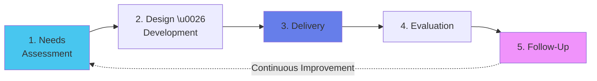
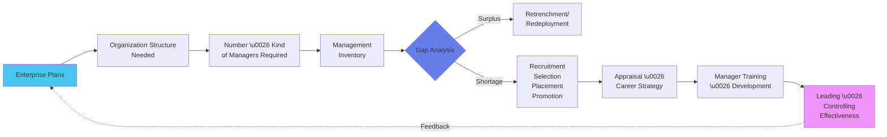

# Module 9 Part 2: Training, Development & Systems Approach

*Continued from Module 9 Part 1*

---

## 9.6 Training & Development

:::info[Training]
Acquiring **specific knowledge and skills** for a particular job or task. Typically short-term, aimed at improving **current** job performance.
:::

### Training vs Development

| Dimension | Training | Development |
|:----------|:---------|:-----------|
| **Focus** | **Current job** performance | **Future roles** and growth |
| **Time Horizon** | Short-term | Long-term |
| **Scope** | Narrow (specific skill) | Broad (general competencies) |
| **Example** | "Learn Excel pivot tables for financial analyst role" | "Leadership workshop for future managers" |
| **Outcome** | Increased efficiency in current tasks | Career advancement, succession pipeline |
| **Initiated By** | Organization (job requirement) | Can be self-initiated (career goals) |

---

### Training & Development Process: 5 Stages

| Stage | What Happens | Example |
|:------|:------------|:--------|
| **1. Needs Assessment** | Identify skill gaps, performance deficiencies | Employee struggles with Python → Need: Python training |
| **2. Design \u0026 Development** | Create training curriculum, materials | Develop 40-hour Python course: Basics → OOP → Libraries |
| **3. Delivery** | Conduct the training | 8-week course; 5 hours/week; mix of lectures + hands-on coding |
| **4. Evaluation** | Measure effectiveness (Kirkpatrick's 4 Levels) | Level 1: Satisfaction survey; Level 2: Python proficiency test |
| **5. Follow-Up** | Reinforce learning, provide ongoing support | Monthly coding challenges; Mentorship pairing |

---

### Training Methods: On-the-Job vs Off-the-Job

:::info[Two Broad Categories]
:::

#### ON-THE-JOB METHODS

**Definition:** Training employees while they perform their actual job in the workplace. Allows direct, hands-on learning in real-world environment.

| Method | Description | Best For |
|:-------|:-----------|:---------|
| **Job Rotation** | Move through different roles/departments | Management trainees, Cross-functional exposure |
| **Coaching** | One-on-one guidance by supervisor | New hires, Performance improvement |
| **Mentoring** | Senior employee guides junior (long-term relationship) | Career development, Leadership pipeline |
| **Apprenticeship** | Combine classroom + hands-on over years | Skilled trades (electrician, plumber, machinist) |

:::tip[Job Rotation at General Electric]
**GE's Leadership Development Program:**
- Duration: 2 years
- Rotations: Finance → Operations → Marketing → Strategy
- Outcome: Well-rounded general managers who understand all functions
:::

**Advantages:** Real-world context, Immediate application, Cost-effective (no external venue)
**Disadvantages:** May disrupt work, Quality depends on coach/mentor, Limited to organization's scope

---

#### OFF-THE-JOB METHODS

**Definition:** Conducted away from actual work environment, allowing employees to focus on learning without distractions.

| Method | Description | Best For |
|:-------|:-----------|:---------|
| **Lectures/Seminars** | Classroom instruction | Theoretical knowledge, Large groups |
| **Case Studies** | Analyze real business scenarios | Management, Decision-making skills |
| **Role Playing** | Act out situations | Soft skills, Customer service, Negotiations |
| **Simulations** | Replicate work environment (e.g., flight simulator) | High-risk jobs (pilots, surgeons, nuclear plant operators) |
| **E-Learning/Webinars** | Online courses, virtual classrooms | Remote workforce, Self-paced learning |
| **Workshops** | Interactive, hands-on sessions | Skill development (e.g., presentation skills workshop) |

:::tip[Simulation Training]
**Airline Pilot Training:**
- **Flight Simulator:** Realistic cockpit replicating all controls, weather conditions, emergencies
- **Why Simulators:** Too risky/expensive to practice emergency landings in real aircraft
- **Outcome:** Pilots log hundreds of hours in simulator before flying actual plane
:::

**Advantages:** Focused learning, Expert trainers, No work disruption
**Disadvantages:** Expensive (venue, trainer fees), Transfer of learning (classroom → workplace not guaranteed)

---

## 9.7 Current Trends in Training & Development ⭐

:::warning[Exam High-Frequency Topic]
Be ready to explain 3-4 trends with examples and impact!
:::

### 1. Digital Learning (E-Learning)

:::info[Online, Tech-Enabled Training]
:::

**What:** Use of digital platforms for training delivery (video courses, LMS, mobile apps)

**Examples:**
- **Coursera for Business:** Companies subscribe; employees take courses from universities
- **LinkedIn Learning:** Short video tutorials on thousands of topics
- **Udemy for Business:** Corporate training library

**Impact:**
- ✅ Accessibility (learn anytime, anywhere)
- ✅ Scalability (train 10,000 employees simultaneously)
- ✅ Cost-effective (no travel, venue costs)
- ❌ Requires self-discipline; less personal interaction

---

### 2. Personalized Training Programs

:::info[AI-Driven Customization]
:::

**What:** AI creates individual learning paths based on employee's current skills, career goals, learning pace

**Examples:**
- **Coursera Recommendations:** AI suggests courses based on what you've completed
- **LinkedIn Skill Assessments:** Take test → Platform recommends learning to fill gaps

**Impact:**
- ✅ Addresses specific employee needs (not one-size-fits-all)
- ✅ Higher engagement (relevant content)
- ✅ Efficient (focus on actual gaps)

---

### 3. Microlearning

:::info[Bite-Sized Learning Modules]
:::

**What:** Delivering training in small, focused chunks (5-10 minute modules) instead of long sessions

**Examples:**
- **Duolingo:** 5-minute language lessons
- **LinkedIn Learning:** Videos are 5-15 minutes each
- **TED-Ed:** Short educational videos

**Impact:**
- ✅ Fits modern attention spans
- ✅ Just-in-time learning (learn when you need it)
- ✅ Mobile-friendly (learn on commute)
- ✅ Higher retention (focused topics)

:::tip[Walmart Microlearning]
- Retail associates get 5-minute training modules on their smartphones
- Topics: New POS system features, seasonal product knowledge
:::

- Complete during shift breaks

---

### 4. Gamification

:::info[Game Mechanics in Learning]
:::

**What:** Using game elements (points, badges, leaderboards, challenges) to make training engaging

**Examples:**
- **Deloitte Leadership Academy:** Badges for completing modules; leaderboard among participants
- **Cisco:** Gamified certification prep with levels and achievements
- **Sales Training:** Leaderboard for most deals closed after training

**Impact:**
- ✅ Increased motivation through competition
- ✅ Better engagement (fun!)
- ✅ Real-time feedback
- ✅ Social learning (peer comparison)

---

### 5. Diversity, Equity, and Inclusion (DEI) Training

:::info[Awareness & Bias Reduction]
:::

**What:** Training to foster inclusive workplace, reduce unconscious bias, promote diversity

**Topics:**
- Recognizing implicit bias
- Cultural sensitivity
- Inclusive communication
- Respectful workplace behaviors

**Examples:**
- **Starbucks:** Closed all US stores for half-day racial bias training (2018)
- **Google:** Unconscious bias training for all employees

**Impact:**
- ✅ Reduces discrimination, harassment
- ✅ Improves collaboration in diverse teams
- ✅ Attracts diverse

 talent (employer branding)

---

### 6. Soft Skills Development

:::info[EQ > IQ]
:::

**What:** Emphasis on communication, empathy, adaptability, emotional intelligence, critical thinking

**Why:** Automation handles technical tasks; humans need soft skills for collaboration, leadership, innovation

**Examples:**
- **Google's "Search Inside Yourself":** Mindfulness and emotional intelligence program
- **Amazon's "Pivotal" Program:** Communication and conflict resolution for managers

**Impact:**
- ✅ Better teamwork and collaboration
- ✅ Stronger leadership pipeline
- ✅ Improved customer service

---

### 7. AI & VR/AR Training

:::info[Immersive Technology]
:::

**What:** Using AI chatbots for Q&A; VR/AR for realistic simulations

**Examples:**
- **Walmart VR Training:** Black Friday crowd management simulation
- **Surgeons:** Practice procedures on VR patients before real operations
- **Boeing:** VR training for aircraft assembly technicians

**Impact:**
- ✅ Risk-free practice for dangerous scenarios
- ✅ Immersive, hands-on experience
- ✅ Cost savings (no physical mock-ups)
- ✅ Personalized feedback via AI

---

## 9.8 Induction & Orientation

:::info[Induction]
The formal process of introducing a new employee to the **organization**, its policies, and culture.
:::

:::info[Orientation]
A structured program to familiarize new employees with their **job roles**, teams, and work environment.
:::

### Key Differences

| Aspect | Induction | Orientation |
|:-------|:----------|:-----------|
| **Scope** | **Broad** (entire organization) | **Specific** (job/department) |
| **Duration** | Days to weeks | First few days |
| **Content** | Company history, mission, values, org structure, policies (leave, code of conduct), benefits | Department tour, meet team, workspace setup, job-specific training, immediate tasks |
| **Conducted By** | HR Department | Immediate supervisor/manager |
| **Goal** | Socialization into company culture | Functional readiness for the role |
| **Focus** | "Welcome to the company!" | "Here's how to do your job" |

:::tip[5-Day Induction Program for Software Engineers]

**Day 1 (Induction):**
- Welcome by CEO/HR Head
- Company overview: 25-year history, mission/vision, values
- HR policies: Leave, benefits, code of conduct
- IT setup: Laptop, email, access cards

**Day 2 (Induction + Orientation):**
- Product training: Overview of company's software products
- Meet senior leadership: VP Engineering, VP Product
- Campus tour: Cafeteria, rec areas, meeting rooms

**Day 3 (Orientation):**
- Department orientation: Engineering team structure
- Team introductions: Meet direct team members
- Assigned "Buddy" (peer mentor)

**Day 4 (Orientation):**
- Technical training: Development environment, codebase architecture
- Tools training: JIRA, Git, CI/CD pipeline

**Day 5 (Orientation):**
- First task assignment: Fix a beginner-friendly bug
- Manager 1:1: Discuss goals for first month
- Onboarding feedback survey
:::

---

## 9.9 Systems Approach to Staffing

:::info[Holistic View of Staffing Function]
:::

The staffing function doesn't operate in isolation—it's an open system interacting with the organization's plans, structure, and external environment.

**How It Works:**

1. **Enterprise Plans:** "We plan to expand into 5 new cities" → Determines staffing needs
2. **Organization Structure:** New structure requires 10 Regional Managers, 50 Store Managers
3. **Management Inventory:** Current talent assessment—do we have people ready?
4. **Gap Analysis:** We have 3 Regional Managers; need 10 → Gap of 7
5. **Recruitment/Selection:** Hire 7 Regional Managers externally OR promote from within
6. **Appraisal:** Evaluate performance of new hires
7. **Training:** Develop managers for future leadership roles
8. **Impact on Leading/Controlling:** Proper staffing enables effective leadership and control
9. **Feedback Loop:** Performance data informs future enterprise plans

:::info[Significance]
- **Holistic:** Shows staffing isn't just "hiring" but an integrated system
- **Strategic Alignment:** Staffing directly linked to business strategy
- **Continuous:** Feedback loop for continuous improvement
- **Environmental Awareness:** Considers external factors (labor market, regulations)
:::

---

## 9.10 Developing Excellent Managers: 8 Considerations

:::warning[Strategic Imperative]
:::

1. **Instilling Willingness to Learn**
   - Managers must overcome ego and limitations
   - Foster proactive learning mindset
   - Example: Google's "20% time" encourages learning new skills

2. **Accelerating Management Development**
   - Urgent need for fast-track programs
   - Use seminars, conferences, executive education
   - Example: GE's Crotonville Leadership Center

3. **Planning for Innovation**
   - Future managers must prioritize innovation
   - Build R&D mindset into manager training
   - Example: 3M's "15% rule" for innovation

4. **Measuring & Rewarding Management Effectively**
   - Establish objective performance measures
   - Reward good performance; correct poor performance
   - Example: 360-degree feedback systems

5. **Tailoring Information**
   - Provide right information, right form, right time
   - Avoid data overload; design intelligent systems
   - Example: Executive dashboards with key metrics only

6. **Expanding R&D in Management Tools**
   - Continued innovation in management techniques
   - Invest in new frameworks, software
   - Example: Adoption of OKRs, Agile, Design Thinking

7. **Developing Managerial Inventories**
   - Create comprehensive talent databases
   - Understand current capabilities, identify future needs
   - Example: Succession planning matrices

8. **Creating Strong Intellectual Leadership**
   - Foster thought leadership from the top
   - Guide organization through complex challenges
   - Example: CEOs who write, speak, teach

---

## 📚 EXHAUSTIVE QUESTION BANK

### Section A: HRM vs HRD

:::note[Q1. HRM-HRD Integration]
**(PYQ Pattern)**
"Analyze the differences between HRM and HRD. How do these functions complement each other in achieving long-term organizational success? Provide a table and explain with the example of an IT company." (8 marks)

**Model Answer:**
*(Use comparison table from Section 9.1)*

**Example: Infosys HRM-HRD Integration**

**HRM Activities:**
- Campus recruitment: Hires 10,000+ fresh graduates annually
- Payroll: Manages compensation for 300,000+ employees
- Compliance: Adheres to labor laws in 50+ countries

**HRD Activities:**
- "InfyMe" Learning Platform: Personalized training on cloud, AI, data science
- Leadership Development Program: Grooms mid-level managers for VP roles
- Certification Support: Pays for AWS, Azure, PMP certifications

**Complementary Nature:**
- Without HRM: HRD has no talent pipeline to develop
- Without HRD: HRM's hires stagnate → High attrition (employees leave for growth elsewhere)
- **Together:** Acquire smart graduates (HRM) + Continuously upskill them (HRD) = Loyal, capable workforce = Competitive advantage
:::

:::note[Q2. HRM Functions Classification]
"HRM functions are divided into Managerial and Operative categories. Explain this classification with examples for each function." (6 marks)
:::

### Section B: Job Analysis

:::note[Q3. Job Analysis Importance]
**(PYQ Pattern)**
"Why is Job Analysis considered a foundational HR activity? Name and explain FIVE HR functions that rely on its outputs." (8 marks)

**Sample Answer:**

Job Analysis is foundational because it provides the **basic data** about what each job entails, which is needed for:

1. **Recruitment:** Job Description used to write accurate job ads that attract right candidates
2. **Selection:** Job Specification defines qualifications → Design tests/interviews to assess those qualifications
3. **Training:** Identify skill gaps by comparing current employee skills with Job Specification requirements
4. **Performance Appraisal:** Job Description defines duties → Evaluate employee on how well they perform those specific duties
5. **Compensation:** Determine pay based on job complexity, responsibilities (found in JD/JS)
:::

:::note[Q4. Draft JD & JS]
**(PYQ Pattern)**
"As an HR Manager, prepare a comprehensive Job Description and Job Specification for a 'Digital Marketing Manager' in an e-commerce company." (10 marks)

*(Follow format from Section 9.3 example)*
:::

:::note[Q5. JD vs JS Distinction]
"Many students confuse Job Description with Job Specification. Create a table clearly distinguishing them on at least FOUR dimensions. Then explain why BOTH are necessary for effective hiring." (6 marks)
:::

### Section C: Recruitment

:::note[Q6. 10-Step Recruitment Process]
**(PYQ Pattern)**
"Describe the 10-step recruitment process with examples for each step." (10 marks)

*(Use content from Section 9.4)*
:::

:::note[Q7. Internal vs External Recruitment]
**(PYQ Pattern)**
"A leading FMCG company needs to fill a Marketing Manager position quickly. Compare and contrast internal vs external recruitment sources. Which would you recommend and why?" (8 marks)

**Model Answer:**

**Internal Recruitment:**
- **Sources:** Promote current Assistant Marketing Manager OR transfer from another region
- **Advantages:** Fast (3 weeks), known performance, boosts morale, cheaper
- **Disadvantages:** Limited pool, may create resentment among non-promoted peers

**External Recruitment:**
- **Sources:** LinkedIn headhunting, placement agencies, job portals
- **Advantages:** Fresh perspectives, larger talent pool, specialized skills
- **Disadvantages:** Slower (2-3 months), expensive (agency fees), cultural fit uncertain

**Recommendation:** **Internal Recruitment** (promote Assistant Manager)
**Why:**
1. **Speed:** "Quickly" is a requirement → Internal is 3 weeks vs 3 months
2. **Known Quantity:** Performance track record eliminates hiring risk
3. **Motivation:** Shows career growth path to all employees
4. **Onboarding:** Already knows products, customers, culture
:::

:::note[Q8. Recruitment Challenges]
**(PYQ Pattern)**
"As a Talent Acquisition Manager, identify and explain THREE major recruitment challenges in the modern tech industry. For each, propose a solution." (6 marks)

**Sample Answer:**

**Challenge 1: Talent Shortage in AI/ML**
- **Problem:** Demand for AI engineers exceeds supply
- **Solution:** Partner with online platforms (Coursera/Udacity) to upskill internal Java developers; Hire adjacent roles (mathematicians, physicists) and train them

**Challenge 2: High Competition (Tech Giants)**
- **Problem:** Google, Amazon offer 2
:::

x salaries, stock options
> - **Solution:** Differentiate on non-monetary factors (flexible work, learning opportunities, impact); Build strong employer brand on Glassdoor
> 
> **Challenge 3: Unconscious Bias**
> - **Problem:** Homogenous hiring (all male, all IIT grads)
> - **Solution:** Blind resume screening (remove names, photos); Structured interviews; Train interviewers on bias awareness

:::note[Q9. Recruitment Type Selection]
"For each scenario, recommend the MOST appropriate recruitment type and justify:
a) A startup needs 5 interns for 3-month summer program
b) A bank needs a Chief Risk Officer with 20+ years experience
c) An MNC wants to hire 50 customer service reps who will work remotely from home"
(6 marks)
:::

### Section D: Selection

:::note[Q10. 6-Step Selection Process]
**(PYQ Pattern)**
"Outline the 6 steps of the employee selection procedure. For each step, explain its purpose and what is assessed." (10 marks)

*(Use detailed content from Section 9.5)*
:::

:::note[Q11. Preliminary vs Core Interview]
**(PYQ Pattern)**
"Differentiate between a Preliminary Interview and a Core Interview. Create a comparison table covering at least FIVE dimensions." (6 marks)

*(Use table from Section 9.5)*
:::

:::note[Q12. Employment Tests]
**(PYQ Pattern)**
"A company is hiring for three roles: (a) Accountant, (b) Creative Designer, (c) Sales Manager. For each role, recommend TWO appropriate employment tests and justify why." (6 marks)

**Sample Answer:**

**Role: Accountant**
- **Test 1: Achievement Test (Accounting Knowledge)** → Verify proficiency in GAAP, financial analysis
- **Test 2: Personality Test (Conscientiousness)** → Accounting requires high attention to detail, accuracy

**Role: Creative Designer**
- **Test 1: Work Sample Test** → Submit portfolio; complete design challenge (15 hours)
- **Test 2: Interest Test (RIASEC - Artistic)** → Ensure genuine passion for creative work

**Role: Sales Manager**
- **Test 1: Personality Test (Extroversion, Openness)** → Sales requires social, persuasive personality
- **Test 2: Situational Test (Role Play)** → Simulate sales pitch to client; assess communication, negotiation
:::

:::note[Q13. Reference Check Ethics]
"During reference checks, a previous employer gives a negative review due to personal grudge (not actual performance). How should the hiring manager handle this ethically? What safeguards should be in place?" (5 marks)
:::

### Section E: Training & Development

:::note[Q14. Training Process]
**(PYQ Pattern)**
"Discuss the 5 processes involved in Training & Development. Use a flowchart and explain each stage with an example." (8 marks)

*(Use content from Section 9.6)*
:::

:::note[Q15. Current Training Trends]
**(PYQ Pattern: High Frequency)**
"Identify and examine three current trends in Training & Development. For each trend, analyze its potential impact on employee performance with examples from industry practices." (10 marks)

**Sample Answer:**

**Trend 1: Microlearning**
- **Definition:** 5-10 minute focused modules
- **Example:** Duolingo language lessons; LinkedIn Learning short videos
- **Impact:** Higher engagement (fits attention span), Just-in-time learning (learn when needed), Mobile-friendly
:::

**Trend 2: Gamification**
> - **Definition:** Game mechanics (points, badges, leaderboards) in training
> - **Example:** Deloitte's leadership academy badges; Cisco certification gamification
> - **Impact:** Increased motivation through competition, Better retention through active participation

> 
> **Trend 3: AI & VR Training**
> - **Definition:** AI chatbots for Q&A; VR for realistic simulations
> - **Example:** Walmart VR for crowd management; Surgeons' VR practice
> - **Impact:** Risk-free practice for dangerous scenarios, Personalized learning paths via AI, Cost savings

:::note[Q16. On-Job vs Off-Job Training]
"For each scenario, recommend On-Job or Off-Job training and justify:
a) Teaching a barista to make latte art
b) Leadership development for middle managers
c) Safety protocol for nuclear plant technicians
d) Excel training for finance analysts"
(4 marks)
:::

:::note[Q17. Training ROI]
"A company spends ₹10 Lakhs on sales training. Post-training, sales increase by ₹50 Lakhs. However, some argue the increase would have happened anyway (market trend). How do you measure training effectiveness beyond revenue?" (5 marks)

**Hint:** Kirkpatrick's 4 Levels: Reaction, Learning, Behavior, Results
:::

### Section F: Induction & Orientation

:::note[Q18. Induction vs Orientation]
**(PYQ Pattern)**
"Differentiate between Induction and Orientation programs, highlighting objective and content for each." (6 marks)

*(Use table from Section 9.8)*
:::

:::note[Q19. Design Induction Program]
"Design a 5-day induction program for 20 new software engineers joining an IT company. Include daily agenda, activities, and expected outcomes." (8 marks)

*(Use example from Section 9.8 as template)*
:::

### Section G: Systems Approach & Manager Development

:::note[Q20. Systems Approach to Staffing]
**(PYQ Pattern)**
"Using a clear diagram, describe the Systems Approach to Staffing. Explain its significance in ensuring staffing aligns with organizational strategy." (8 marks)

*(Use flowchart and explanation from Section 9.9)*
:::

---

:::note[Module 9 Key Takeaways]
✅ **HRM > HRD** = HRM is broader; HRD focuses on development
✅ **Job Analysis** = Foundation for all HR functions → Produces JD (what job is) + JS (who can do it)
✅ **10-Step Recruitment** = Identify Need → Advertise → Screen → Interview → Offer → Onboard
✅ **6-Step Selection** = Preliminary Interview → Application → Reference → Tests → Core Interview → Decision
✅ **Employment Tests** = Aptitude (potential), Achievement (current skill), Personality, Situational
✅ **Training Trends** = Microlearning, Gamification, AI/VR, Personalization, DEI, Soft Skills
✅ **Induction vs Orientation** = Company-wide (induction) vs Job-specific (orientation)
✅ **Systems Approach** = Staffing integrated with enterprise plans, structure, and strategy
:::

**Complete!** Return to **00 - EOM Study Master Guide** for overall exam strategy and navigation to all modules! 🎓
