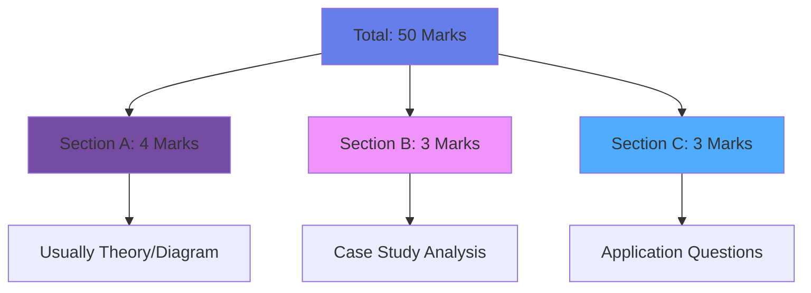
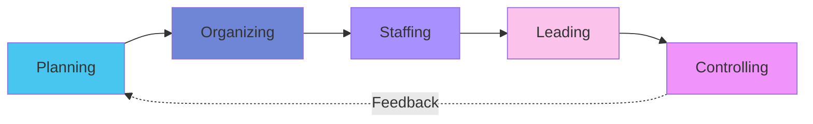

# 🎓 HUM 3022: Essentials of Management - Complete Exam Prep

:::warning[Your Path to 100/100]
This vault contains **exhaustive** theory, **extensive** question banks, and **strategic** exam insights derived from analyzing 4 PYQ papers (Nov 2024 - June 2025).
:::

---

## 📊 Exam Pattern Analysis

| Question Type | Frequency | Marks | Critical Skill Required |
|:--------------|:----------|:------|:------------------------|
| **Mintzberg Roles** | 🔥🔥🔥 | 3-4 | Identify Category + Specific Role |
| **Types of Plans** | 🔥🔥🔥 | 3 | **Quote lines** from case |
| **Organizing Steps** | 🔥🔥 | 3 | **Quote lines** (EcoEarth pattern) |
| **Control Types** | 🔥🔥 | 4 | Distinguish Feedforward/Concurrent/Feedback |
| **US vs Japan** | 🔥 | 3 | Cultural comparison table |

---

## 📂 Module Navigation

### Core Management Functions

1. ****Module 1 - Foundations of Management****
   - Managerial Levels & Skills (Katz Model)
   - Mintzberg's 10 Roles ⭐
   - Fayol's 14 Principles ⭐
   - Ethics & Systems Approach

2. ****Module 2 - Planning & Strategy****
   - 8 Types of Plans ⭐
   - MBO Process
   - Strategic Tools: SWOT, BCG, Porter, Blue Ocean

3. ****Module 3 - Organizing Structures****
   - Steps in Organizing ⭐
   - 8 Patterns of Departmentation
   - Span of Control & Authority

4. ****Module 4 - Staffing & HRM****
   - HRM vs HRD
   - 10-Step Recruitment Process
   - Job Description/Specification Drafting

5. ****Module 5 - Leading & Motivation****
   - McGregor's Theory X/Y ⭐
   - Herzberg's Two-Factor Theory
   - Likert's 4 Systems
   - Leadership Styles

6. ****Module 6 - Controlling Process****
   - 8-Step Control Process
   - Types of Control (Feed-forward/Concurrent/Feedback)

7. ****Module 7 - International Management****
   - Japan vs USA Comparison ⭐
   - Theory Z
   - Cross-Cultural Management

### 📚 Advanced Deep-Dive Modules (L16-26)

8. ****Module 8 - Advanced Organizing Concepts****
   - Formal vs Informal Organizations ⭐
   - Tall vs Flat Structures (Span of Management)
   - Urwick's 10 Principles ⭐
   - Line vs Line & Staff Structures
   - Authority, Responsibility, Delegation

9. ****Module 9 Part 1 - Staffing & Talent Management****
   - HRM vs HRD Deep Analysis
   - Job Analysis: JD vs JS ⭐
   - 10-Step Recruitment Process (Detailed)
   - 6-Step Selection Procedure ⭐
   - Employment Tests & Interview Types

10. ****Module 9 Part 2 - Training & Development****
    - Training vs Development
    - On-Job vs Off-Job Methods
    - Current Training Trends ⭐ (Microlearning, Gamification, AI/VR)
    - Systems Approach to Staffing
    - Manager Development Strategies

---

## 🎯 Strategic Study Plan

:::danger[20-Day Complete Power Plan]
| Days | Focus | Action |
|:-----|:------|:-------|
| 1-3 | Modules 1-2 | Master Mintzberg + Strategic Tools + Fayol's Principles |
| 4-6 | Modules 3 & 8 | Basic + Advanced Organizing (Urwick's Principles, Formal/Informal) |
| 7-9 | Modules 4 & 9 (Parts 1-2) | Complete Staffing (Recruitment, Selection, Training Trends) |
| 10-12 | Module 5 | All Motivation Theories + Leadership Cases |
| 13-14 | Module 6 | Control Process + Types (Feedforward/Concurrent/Feedback) |
| 15-16 | Module 7 | International Management (US vs Japan, Theory Z) |
| 17-18 | **Question Banks** | Solve ALL 150+ questions across all modules |
| 19 | **PYQ Practice** | Simulate full exam (3 hrs, 50 marks) |
| 20 | **Final Revision** | This Master Guide + Module Summaries + Quick Review |
:::

:::tip[Accelerated 15-Day Plan (if short on time)]
Combine days: Days 1-2 (Modules 1-2), Days 3-4 (Modules 3 & 8), Days 5-7 (Modules 4 & 9), Days 8-9 (Module 5), Day 10 (Module 6), Day 11 (Module 7), Days 12-13 (Questions), Day 14 (PYQs), Day 15 (Revision)
:::

---

## 📝 Answer Writing Strategy

:::tip[The "Quote-Define-Apply" Method]
For **every case study question**:
1. **Quote:** *"As mentioned in the case, 'employees are assigned roles based on expertise...'"*
2. **Define:** "This reflects Fayol's **Division of Work** principle, which states..."
3. **Apply:** "By specializing developers on coding and designers on UI, the firm increases efficiency..."
:::

---

## ⚡ Quick Revision Checklist

- [ ] Can you list Mintzberg's 10 roles with categories?
- [ ] Can you distinguish Unity of Command vs Direction?
- [ ] Can you categorize a product in BCG matrix?
- [ ] Can you identify Feedforward vs Feedback control?
- [ ] Can you draft a Job Description on demand?
- [ ] Can you explain Theory X vs Theory Y with examples?

---

:::note[Remember]
**Success = Deep Theory × Extensive Practice × Strategic Application**

You have **10 comprehensive modules** ahead. Each contains:
- 📖 Exhaustive Theory (covering L1-26)
- 📊 Visual Diagrams (Mermaid flowcharts, tables)
- 📝 15-20 Practice Questions per module (150+ total)
- 🎯 PYQ-Aligned Cases

**Total Coverage:**
- ✅ Modules 1-7: Core Management Functions (L1-15)
- ✅ Modules 8-9: Advanced Organizing & Staffing (L16-26)
:::

**Let's get that 100/100! 🏆**
