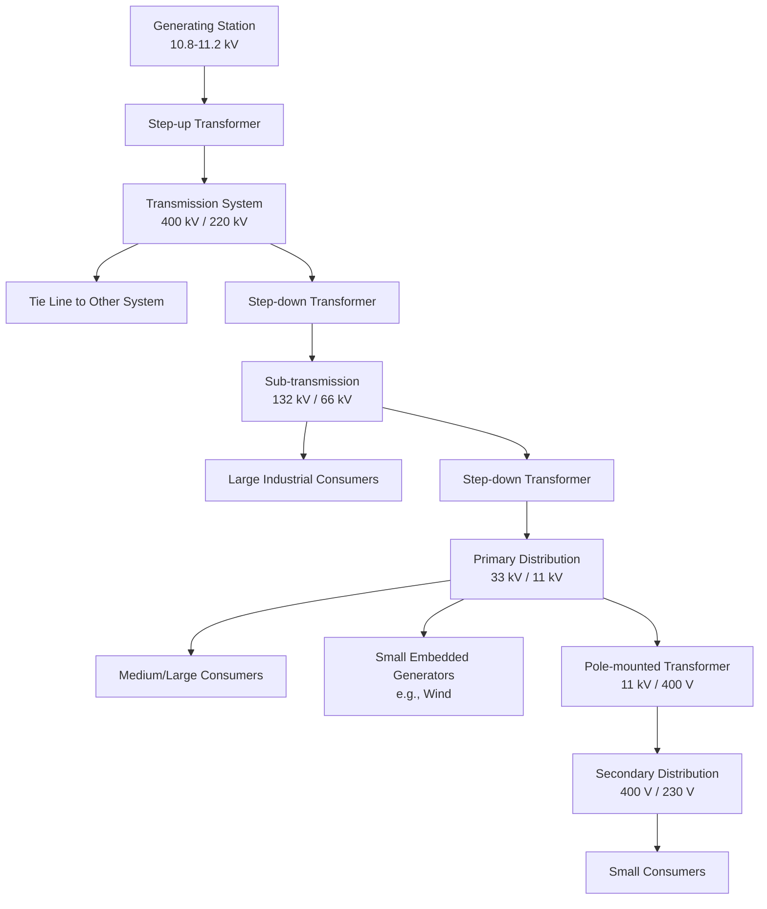
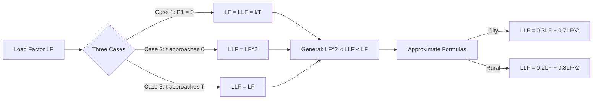
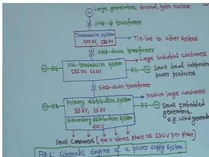
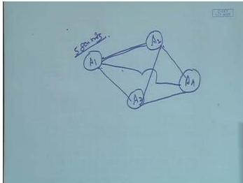
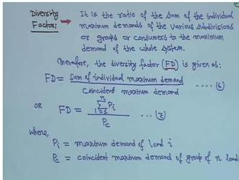
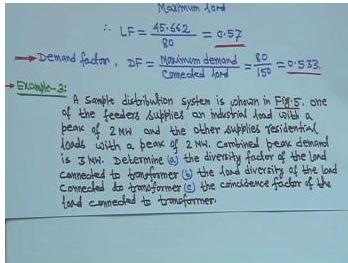
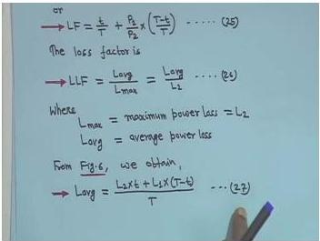
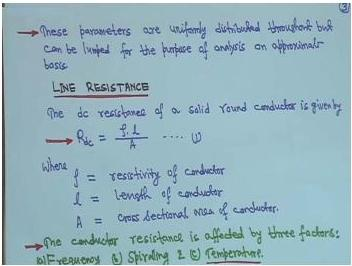
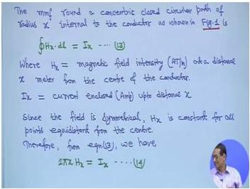
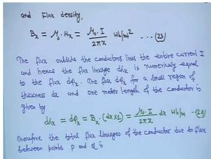

# Week 1 - Power-System Structure, Resistance, and Inductance

## Orientation

Welcome to Week 1 of Power System Analysis. This week establishes the foundational vocabulary and physical principles that the entire course will build upon. We begin by understanding what a power system is, why we interconnect generating stations, and how we quantify the behavior of loads using factors like demand factor, diversity factor, and load factor. Then we transition into the physical parameters of transmission lines, starting with resistance and inductance.

The power system is often described as **"the largest man made dynamic system on the earth."** This statement captures two essential truths: first, the sheer scale of the infrastructure spanning continents; second, the dynamic nature of the system, where generation, load, and network conditions change continuously. As an electrical engineering student, my goal this week is to build a mental model of how power flows from generation through transmission to distribution, and to understand the mathematical tools used to describe load behavior and line parameters.

This week's material is divided into five lectures. The first three lectures focus on the structure of power systems and the various factors used to characterize loads. The fourth lecture introduces transmission line parameters, with emphasis on resistance and the disadvantages of low power factor. The fifth lecture begins the detailed derivation of inductance, starting with the fundamental concepts of flux linkages and Ampere's law.

By the end of this week, I should be able to trace power flow from a generating station through step-up transformers, transmission lines, and distribution networks to end consumers. I should also be able to compute all the standard load factors and understand their physical significance. Finally, I should be able to derive the internal and external inductance of a single conductor from first principles.

## Learning Outcomes

After completing this week's study, I will be able to:

1. **Describe the three main components** of a power system (generation, transmission, distribution) and explain the role of each in delivering electrical energy to consumers.

2. **Trace the voltage levels** through a typical power system, from generator terminal voltage (10.8-11.2 kV) through transmission (400 kV, 220 kV), sub-transmission (132 kV, 66 kV), primary distribution (33 kV, 11 kV), and secondary distribution (400 V/230 V).

3. **Explain the economic and reliability benefits** of interconnecting power systems, including the concept of spinning reserve and why gas turbines and hydro generators are preferred for this role.

4. **Define and compute all standard load characteristics**: connected load, demand, maximum demand, coincident demand, noncoincident demand, demand factor, utilization factor, plant factor, diversity factor, coincidence factor, load diversity, contribution factor, load factor, and loss factor.

5. **Derive the relationship between load factor and loss factor** for idealized load curves, including the three limiting cases (no off-peak load, very short peak, steady load) and the general inequality $\text{LF}^2 < \text{LLF} < \text{LF}$.

6. **Apply the load growth formula** $P_m = P_0(1+g)^m$ to forecast future load demands.

7. **Explain the disadvantages of low power factor** and why utilities penalize industrial consumers with low lagging power factor.

8. **Identify the four transmission line parameters** (resistance, inductance, capacitance, shunt conductance) and explain the physical significance of each.

9. **Compute DC resistance** using $R_{dc} = \rho l / A$ and account for the effects of spiraling, skin effect, and temperature.

10. **Derive the internal inductance** of a solid cylindrical conductor as $L_{int} = \frac{1}{2} \times 10^{-7}$ H/m and explain why it is independent of conductor radius.

11. **Derive the external inductance** between two points outside a conductor as $L_{ext} = 2 \times 10^{-7} \ln(D_2/D_1)$ H/m.

12. **Apply Ampere's law and flux linkage concepts** to calculate magnetic field intensity, flux density, and inductance for simple conductor geometries.

## Syllabus Map

This week covers five lectures from the NPTEL Power System Analysis course by Prof. Debapriya Das, IIT Kharagpur:

| Lecture | Topic | Source Pages (Physical PDF) |
|---------|-------|---------------------------|
| Lecture 1 | Structure of Power Systems and Few other Aspects - I | pages 5-21 |
| Lecture 2 | Structure of Power Systems and Few other Aspects - II | pages 214-230 |
| Lecture 3 | Structure of Power Systems and Few other Aspects - III | pages 441-458 |
| Lecture 4 | Resistance & Inductance | pages 673-688 |
| Lecture 5 | Resistance & Inductance (Continued) | pages 869-885 |

The progression is logical: Lectures 1-3 build the system-level understanding and load characterization tools. Lecture 4 bridges into the physical parameters of transmission lines, starting with resistance. Lecture 5 begins the detailed electromagnetic derivation of inductance, which will continue in subsequent weeks.

---

## Lecture 1: Structure of Power Systems and Few other Aspects - I

### Physical Intuition

When I flip a light switch, I rarely think about the vast infrastructure that makes that simple action possible. The power system that delivers electricity to my home is a complex network spanning thousands of kilometers, connecting generating stations to consumers through a hierarchy of voltage levels.

The power system has three main components:

| Component | Function |
|-----------|----------|
| **Generation** | Produces electrical power |
| **Transmission** | Bulk transfer of power by high voltage lines between main load centers |
| **Distribution** | Conveyance of power to consumers by means of lower voltage network |

The key insight is that generating stations and distribution systems are connected through transmission lines. This seems obvious, but the voltage transformations along the way are what make the system efficient and practical.


### Complete Power System Schematic

Let me trace through the complete power system schematic shown in the lecture:

1. **Large generating station** - This could be thermal, hydro, or nuclear. The generator terminal voltage is typically **10.8 kV, 11 kV, or 11.2 kV**, depending on the machine rating and generating capacity. This is design-dependent.

2. **Step-up transformer** - The generator voltage is stepped up to transmission levels of **400 kV or 220 kV**. This high voltage is essential for efficient bulk power transfer over long distances.

3. **Transmission system** - The 3-phase transmission line is shown as a single line arrow because the transmission system is balanced; all three phases carry balanced power. The "other system" may be another power system or another substation.

4. **Tie line to other system** - This interconnection allows power exchange between neighboring systems.

5. **Step-down transformer** - Voltage is stepped down to **132 kV or 66 kV**. This portion is called the **sub-transmission system**.

6. **Large industrial consumers** - These receive power at **132 kV or 66 kV**. Large industries need high voltage because their power demand is substantial.

7. **Small local independent power producers** - Private parties generating power. Their generating unit steps up to **66 kV or 132 kV** and injects power into the sub-transmission system. This is an example of distributed generation.

8. **Further step-down** - To **primary distribution system**: **33 kV or 11 kV**.

9. **Medium/large consumers** - Small industries needing power at **33 kV or 11 kV**.

10. **Small embedded generators** - For example, wind generators at 11 kV or 33 kV level. These may be utility-owned or private. For solar, DC-to-AC conversion is required, but the lecture assumes wind generators for simplicity.

11. **Secondary distribution system** - **400 V** (or 433 V). Pole-mounted distribution transformers are typically **11 kV/400 V or 11 kV/433 V**.

12. **Small consumers** - 400 V 3-phase (line-to-line) or 230 V per phase (line-to-neutral). If line-to-line is 430 V, then line-to-neutral is $430/\sqrt{3}$.


### Typical Distribution System

The distribution system has its own hierarchy and protection equipment:


Key components I need to understand:

- **Reclosers** - Connected to additional feeders. These automatically reclose after a fault is cleared.
- **Pole-mounted distribution transformers** - Rated **11 kV/400 V** or **11 kV/430 V** or **440 V**.
- **Section points** - May be closed or opened to reconfigure the network.
- **Normally open tie switch** - A 3-phase line with a sectionalizer. Can be operated manually or automatically with sophisticated control techniques.

The operation of the normally open tie switch is important:

- When power is supplied from both sides and there is no fault/outage, the tie switch remains open.
- If a fault occurs on one side, the affected line can be isolated and the tie switch closed so power comes from the other side to supply the affected zone.

This is the essence of distribution automation - the ability to reconfigure the network to maintain supply during faults.

The standard voltage is 11 kV, but hill areas may use **6.6 kV** or even **3.3 kV** due to shorter distances and different load patterns.

### Reasons for Interconnection


Let me define the terminology:

- **Grid** - The transmission system of a particular area (e.g., a state).
- **Regional grid / power pools** - Different grids interconnected through tie lines (3-phase transmission lines).
- **National grid** - Different regional grids further connected.

The benefits of interconnected operation are:

- **Cooperative assistance** - One of the planned benefits.
- Interconnected operation is **always economical and reliable**.

### Economic Advantage of Interconnection


The primary economic advantage of interconnection is to **reduce the reserve generation capacity in each area**. The mechanism works as follows:

- Four areas (Area 1, 2, 3, 4) are interconnected.
- If one area has load demand greater than its generating capacity, it can **borrow or purchase power** from the other three interconnected areas (assuming they have sufficient reserve capacity).
- If there is a **sudden increase in load** or **loss of generation** in one area, power can be borrowed from adjoining interconnected areas.

Without interconnection, each area would need to maintain enough reserve capacity to handle its own worst-case contingencies. With interconnection, the reserves can be shared, reducing the total installed capacity needed.

### Spinning Reserve

**Definition:** A certain amount of generating capacity in each area required to meet sudden increases in load.

**Characteristics:** Consists of generators running at normal speed and ready to supply power instantaneously.

**Preferred spinning reserve units:**

- **Gas turbines** - Can be started and loaded in 3 minutes or less.
- **Hydro generators** - Can be even quicker.

The reason thermal units are not preferred for spinning reserve is that they have stringent constraints on ramp rates and minimum loading. Hydro units can generate power very quickly, making them ideal for this role.

### Load Characteristics


The general nature of load is characterized by:
- Load factor
- Demand factor
- Diversity factor
- Power factor
- Utilization factor

There are four categories of load:

| Category | Components |
|----------|------------|
| **Domestic** | Lights, fans, refrigerators, air conditioners, mixer grinders, heaters, ovens, small pumping motors |
| **Commercial** | Lighting for shops, offices, advertisements; fans, heating, air conditioning; appliances in market places, restaurants |
| **Industrial** | Small scale, medium scale, large scale, heavy industries, cottage industries |
| **Agricultural** | Mainly motor pump sets for irrigation purposes |


### Power Factor of Various Equipment


| Equipment | Power Factor Range |
|-----------|-------------------|
| Induction motors | 0.6 to 0.85 |
| Fractional horsepower motors | 0.5 to 0.8 |
| Fluorescent lamps | 0.55 to 0.90 |
| Fans | 0.55 to 0.85 |
| Induction furnaces | 0.7 to 0.85 |
| Arc welders | 0.35 to 0.5 |

These power factor ranges are important because they determine the reactive power demand of different load types, which affects voltage regulation and system losses.

### Basic Definitions of Commonly Used Terms


#### Connected Load

Each electrical device has its rated capacity.

**Definition:** The sum of the continuous ratings of all electrical devices connected to the supply system.

**Example:** For a home - add rated capacities of lights, fans, AC, geyser, etc.

#### Demand

**Definition:** The load at the receiving terminals, averaged over a specified interval of time.

May be given in kW, kVA, kiloamperes, or amperes; in power systems, generally kW or kVA.

#### Demand Interval

**Definition:** The time period over which the average load is computed.

**Example:** For a 24-hour day, if hourly loads are averaged, the demand interval is 24 hours.

#### Maximum Demand

**Definition:** The greatest of all demands which have occurred during a specified period of time.

#### Coincident Demand (or Diversified Demand)

**Definition:** The demand of the composite group as a whole of somewhat unrelated loads over a specified period of time.

It is the maximum sum of the contributions of the individual demands to the diversified demand over a specific time interval.

**Method:** Every hour, add the loads of all groups; find the maximum sum.

#### Noncoincident Demand

**Definition:** The sum of the demands of a group of loads with no restrictions on the interval to which the demand is applicable.

### Demand Factor


**Definition:** The ratio of the maximum demand of a system to the total connected load of the system.

**Formula:**
$$\text{DF} = \frac{\text{Maximum demand}}{\text{Total connected load}} \quad \text{---(1)}$$

**Properties:**
- Usually **less than 1** (because not all loads operate simultaneously).
- Gives an indication of the **simultaneous operation** of the total connected load.

### Utilization Factor


**Definition:** The ratio of the maximum demand of a system to the rated capacity of the system.

**Formula:**
$$\text{UF} = \frac{\text{Maximum demand of the system}}{\text{Rated system capacity}} \quad \text{---(2)}$$

### Plant Factor (Capacity Factor / Use Factor)

**Definition:** The ratio of the total actual energy produced over a specified period of time to the energy that would have been produced if the plant or generating unit had operated continuously at maximum rating.

**Note:** This terminology applies specifically to generating stations.

### Lecture 1 Recap

In this lecture, I learned:

1. The power system has three main components: generation, transmission, and distribution.
2. The voltage hierarchy from generator terminals (10.8-11.2 kV) through transmission (400/220 kV), sub-transmission (132/66 kV), primary distribution (33/11 kV), and secondary distribution (400/230 V).
3. Interconnection of power systems reduces reserve capacity requirements and improves reliability.
4. Spinning reserve consists of generators ready to supply power instantaneously; gas turbines and hydro generators are preferred.
5. Loads are categorized as domestic, commercial, industrial, and agricultural.
6. The key definitions: connected load, demand, demand interval, maximum demand, coincident demand, noncoincident demand.
7. Demand factor (DF) = Maximum demand / Total connected load, usually less than 1.
8. Utilization factor (UF) = Maximum demand / Rated system capacity.
9. Plant factor applies to generating stations and relates actual energy produced to maximum possible energy.

---

## Lecture 2: Structure of Power Systems and Few other Aspects - II

### Physical Intuition

In Lecture 1, I learned the basic definitions of load characteristics. Lecture 2 extends these concepts with additional factors that describe how loads interact when combined. The key insight is that individual loads rarely peak at the same time, and this diversity is what allows utilities to serve more load with less installed capacity.

### Plant Factor Formulas

The plant factor can be expressed in several equivalent forms:

$$\text{Plant Factor} = \frac{\text{Actual energy produced}}{\text{Maximum plant rating} \times T} \quad \text{---(3)}$$

Plant factor is mostly used in generation studies.

**Alternative forms:**
$$\text{Annual Plant Factor} = \frac{\text{Actual energy generation}}{\text{Maximum plant rating}} \quad \text{---(4)}$$

$$\text{Annual Plant Factor} = \frac{\text{Actual annual energy generation}}{\text{Maximum plant rating} \times 8760} \quad \text{---(5)}$$

Where 8760 = total number of hours in a year.

### Diversity Factor


**Definition:** The ratio of the sum of the individual maximum demands of the various subdivisions or groups or consumers to the maximum demand of the whole system.

**Notation:** FD (to avoid confusion with DF = demand factor).

**Formula:**
$$\text{FD} = \frac{\text{Sum of individual maximum demands}}{\text{Coincident maximum demand}} \quad \text{---(6)}$$

**General form:**
$$\text{FD} = \frac{\sum_{i=1}^{n} P_i}{P_c} \quad \text{---(7)}$$

Where:
- $P_i$ = maximum demand of load $i$
- $P_c$ = coincident maximum demand of group of $n$ loads

**Property:** Diversity factor can be **equal to or greater than unity**.


### Derivation: Diversity Factor in Terms of Connected Load and Demand Factor


From equation (1):
$$\text{DF} = \frac{\text{Maximum demand}}{\text{Total connected load}}$$

Therefore:
$$\text{Maximum demand} = \text{Total connected load} \times \text{DF} \quad \text{---(8)}$$

For the $i$-th consumer:
- Total connected load = $TC_{Pi}$
- Demand factor = $\text{DF}_i$

$$P_i = TC_{Pi} \times \text{DF}_i \quad \text{---(9)}$$

Substituting equation (9) into equation (7):
$$\text{FD} = \frac{\sum_{i=1}^{n} TC_{Pi} \times \text{DF}_i}{P_c} \quad \text{---(10)}$$

### Coincidence Factor


**Definition:** The ratio of the maximum coincident total demand of a group of consumers to the sum of the maximum power demands of individual consumers comprising the group. Both taken at the same point of supply for the same time.

**Formula:**
$$\text{CF} = \frac{\text{Coincident maximum demand}}{\text{Sum of individual maximum demands}} \quad \text{---(11)}$$

$$\text{CF} = \frac{P_c}{\sum_{i=1}^{n} P_i} \quad \text{---(12)}$$

**Relationship with diversity factor:**
$$\text{CF} = \frac{1}{\text{FD}} \quad \text{---(13)}$$

$$\text{FD} \times \text{CF} = 1$$

### Load Diversity


**Definition:** The difference between the sum of the peaks of two or more individual loads and the peak of the combined load.

**Formula:**
$$\text{LD} = \sum_{i=1}^{n} P_i - P_c \quad \text{---(14)}$$

### Contribution Factor


**Definition:** Given in per unit of the individual maximum demand of the $i$-th load.

If $C_i$ is the contribution factor of the $i$-th load to the group maximum demand:
$$P_c = C_1 P_1 + C_2 P_2 + \dots + C_n P_n = \sum_{i=1}^{n} C_i P_i \quad \text{---(15)}$$

**Example:** If power is 100 kW and $C_i = 0.4$, then contribution is 40 kW.

From equations (12) and (15):
$$\text{CF} = \frac{\sum_{i=1}^{n} C_i P_i}{\sum_{i=1}^{n} P_i} \quad \text{---(16)}$$

### Special Cases for Coincidence Factor


**Case 1:** If $P_1 = P_2 = \dots = P_n = P$ (all equal):
$$\text{CF} = \frac{\sum_{i=1}^{n} C_i}{n}$$

The coincidence factor equals the **average contribution factor**.

**Case 2:** If $C_1 = C_2 = \dots = C_n = C$ (all equal):
$$\text{CF} = C$$

The coincidence factor equals the **contribution factor**.

### Load Factor


**Definition:** The ratio of the average load over a designated period of time to the peak load occurring in that period.

**Formula:**
$$\text{LF} = \frac{\text{Average load}}{\text{Peak load}} \quad \text{---(19)}$$

**Alternative form:**
$$\text{LF} = \frac{\text{Energy served}}{\text{Peak load} \times T} \quad \text{---(20)}$$

Where $T$ = time (days, weeks, months, or years).

**Properties:**
- If $T$ is large, load factor is small (for the same maximum demand, energy consumption covers a larger time period, resulting in smaller average load).
- Load factor is **less than or equal to unity**, generally less than 1.

**Annual load factor:**
$$\text{Annual load factor} = \frac{\text{Total annual energy}}{\text{Annual peak load} \times 8760} \quad \text{---(21)}$$

### Loss Factor


**Definition:** The ratio of the average power loss to the peak load power loss during a specified period of time.

**Formula:**
$$\text{LLF} = \frac{\text{Average power loss}}{\text{Power loss at peak load}} \quad \text{---(22)}$$

**Important:** Equation (22) is applicable to the **copper loss** ($I^2R$ loss) of the system, **but not for iron loss**.

### Worked Example 1: Power Station Load Curve


**Given data (24-hour load variation):**

| Time | Load (MW) |
|------|-----------|
| 6 am - 8 am | 1.2 |
| 8 am - 9 am | 2.0 |
| 9 am - 12 noon | 3.0 |
| 12 noon - 2 pm | 1.5 |
| 2 pm - 6 pm | 2.5 |
| 6 pm - 8 pm | 1.8 |
| 8 pm - 9 pm | 2.0 |
| 9 pm - 11 pm | 1.0 |
| 11 pm - 5 am | 0.5 |
| 5 am - 6 am | 0.8 |

**Tasks:**
(a) Plot the load curve and find the load factor
(b) Determine the proper number and size of generating units to supply this load
(c) Find the reserve capacity of the plant and plant factor
(d) Find the operating schedule of the generating units selected

#### Solution:

**(a) Load curve plotting**


- Time axis from 6 am to 6 am (24 hours)
- Load values plotted stepwise as per the table
- Peak load = **3 MW** (occurs 9 am - 12 noon)

**Units generated during 24 hours:**


$$= (2 \times 1.2) + (1 \times 2) + (3 \times 3) + (2 \times 1.5) + (4 \times 2.5) + (2 \times 1.8) + (1 \times 2) + (2 \times 1) + (6 \times 0.5) + (1 \times 0.8)$$
$$= 2.4 + 2 + 9 + 3 + 10 + 3.6 + 2 + 2 + 3 + 0.8$$
$$= \textbf{37.8 MWh}$$

**Average load:**
$$\text{Average load} = \frac{37.8}{24} = 1.575 \text{ MW}$$

**Load factor:**
$$\text{LF} = \frac{1.575}{3} = \textbf{0.525}$$

**(b) Number and size of generating units**


- Maximum demand = 3 MW
- Choose **4 generating units of 1 MW each**
- During maximum demand: 3 units operate at full load, 1 unit remains as standby
- Reason for 4th unit: reliability - if one generator becomes faulty, the load can still be supplied

**(c) Reserve capacity and plant factor**

- Plant capacity = $4 \times 1 = 4$ MW
- Reserve capacity = $4 - 3 = 1$ MW

From equation (3):
$$\text{Plant factor} = \frac{37.8}{4 \times 24} = \textbf{0.39375}$$

**Note:** If 5 units were chosen instead of 4:
- Plant capacity = 5 MW
- Reserve capacity = 5 - 3 = 2 MW
- Plant factor = $\frac{37.8}{5 \times 24}$ (smaller than with 4 units)

**(d) Operating schedule**


- **Unit 1:** Must work for 24 hours (minimum load is 0.5 MW)
- **Unit 2:** Required 6 am to 9 pm = **15 hours** (load is more than 1 MW during this period)
- **Unit 3:** Required 9 am to 12 noon and 2 pm to 6 pm = **7 hours** (load exceeds 2 MW during these periods)

### Lecture 2 Recap

In this lecture, I learned:

1. Plant factor formulas in various forms, including annual plant factor with 8760 hours.
2. Diversity factor (FD) = Sum of individual maximum demands / Coincident maximum demand, which is equal to or greater than unity.
3. The derivation of diversity factor in terms of connected load and demand factor.
4. Coincidence factor (CF) = Coincident maximum demand / Sum of individual maximum demands, which is the reciprocal of diversity factor.
5. Load diversity = Sum of individual peaks - Coincident peak.
6. Contribution factor expresses each load's contribution to group maximum demand.
7. Special cases for coincidence factor when loads are equal or contribution factors are equal.
8. Load factor = Average load / Peak load, always less than or equal to unity.
9. Loss factor = Average power loss / Peak power loss, applicable only to copper loss.
10. Complete worked example of a power station with load curve, generating unit selection, reserve capacity, and operating schedule.

---

## Lecture 3: Structure of Power Systems and Few other Aspects - III

### Physical Intuition

Lecture 3 continues with more worked examples and develops the important relationship between load factor and loss factor. This relationship is crucial for estimating energy losses in distribution systems, which directly affects utility economics. The lecture also introduces load growth forecasting, which is essential for planning system expansion.

### Worked Example 2


**Given:**
- Maximum demand = 80 MW
- Connected load = 150 MW
- Annual energy generation = $400 \times 10^3$ MWh
- Total hours in a year, $T = 8760$

**Find:** Load factor and demand factor.

#### Solution


**Average load:**
$$\text{Average load} = \frac{400 \times 10^3}{8760} = 45.662 \text{ MW}$$

**Load factor:**
$$\text{LF} = \frac{45.662}{80} = \textbf{0.57}$$

**Demand factor:**
$$\text{DF} = \frac{80}{150} = \textbf{0.533}$$

### Worked Example 3: Sample Distribution System


**Given (Figure 5):**
- One feeder supplies an industrial load with a peak of 2 MW
- Other feeder supplies residential loads with a peak of 2 MW
- Combined peak demand = 3 MW

**Find:**
(a) Diversity factor of the load connected to transformer
(b) Load diversity of the load connected to transformer
(c) Coincidence factor of the load connected to transformer

#### Solution


**(a) Diversity factor** - from equation (7), with $n = 2$:
$$\text{FD} = \frac{P_1 + P_2}{P_c} = \frac{2 + 2}{3} = \textbf{1.333}$$


**(b) Load diversity** - from equation (14):
$$\text{LD} = (P_1 + P_2) - P_c = (2 + 2) - 3 = \textbf{1 MW}$$

**(c) Coincidence factor** - from equation (13):
$$\text{CF} = \frac{1}{\text{FD}} = \frac{1}{1.33} = \textbf{0.75}$$

### Relationship Between Load Factor and Loss Factor


**Key point:** In general, the loss factor **cannot be determined directly** from the load factor. However, **limiting values** of the relationship can be established.

**Figure 6:** An arbitrary and idealized load curve (not a daily load curve):
- Peak load = $P_2$, duration = $t$ (from 0 to $t$)
- Off-peak load = $P_1$, duration = $T - t$ (from $t$ to $T$)
- Average load = $P_{avg}$ (dashed line)
- Peak loss = $L_2$ (corresponding to $P_2$), duration = $t$
- Off-peak loss = $L_1$ (corresponding to $P_1$), duration = $T - t$
- Average loss = $L_{avg}$ (dashed line)

### Derivation of Load Factor Expression


$$\text{LF} = \frac{P_{avg}}{P_{max}} \quad \text{---(23)}$$

Where $P_{max} = P_2$.

From Figure 6:
$$P_{avg} = \frac{P_2 \times t + P_1 \times (T - t)}{T} \quad \text{---(24)}$$

Substituting (24) into (23):
$$\text{LF} = \frac{P_2 \times t + P_1 \times (T - t)}{P_2 \times T}$$

Simplifying:
$$\text{LF} = \frac{t}{T} + \left(\frac{P_1}{P_2}\right) \times \left(\frac{T - t}{T}\right) \quad \text{---(25)}$$

### Derivation of Loss Factor Expression


$$\text{LLF} = \frac{L_{avg}}{L_{max}} \quad \text{---(26)}$$

Where $L_{max} = L_2$ (peak loss).

From Figure 6:
$$L_{avg} = \frac{L_2 \times t + L_1 \times (T - t)}{T} \quad \text{---(27)}$$

Substituting (27) into (26):
$$\text{LLF} = \frac{L_2 \times t + L_1 \times (T - t)}{L_2 \times T} \quad \text{---(28)}$$

Where:
- $t$ = peak load duration
- $(T - t)$ = off-peak load duration

### Copper Loss as Function of Load

Copper losses are a function of associated loads. Loss is proportional to $I^2R$, and current depends on load.

$$L_1 = K \times P_1^2 \quad \text{---(29)}$$
$$L_2 = K \times P_2^2 \quad \text{---(30)}$$

Where $K$ = constant of proportionality (same for both).


Substituting (29) and (30) into (28):
$$\text{LLF} = \frac{t}{T} + \left(\frac{P_1}{P_2}\right)^2 \times \left(\frac{T - t}{T}\right) \quad \text{---(31)}$$

### Three Cases for Load Factor-Loss Factor Relationship

#### Case 1: Off-peak load is zero ($P_1 = 0$, hence $L_1 = 0$)


From equation (25): $\text{LF} = \frac{t}{T}$
From equation (31): $\text{LLF} = \frac{t}{T}$

$$\text{LF} = \text{LLF} = \frac{t}{T} \quad \text{---(32)}$$

#### Case 2: Very short lasting peak ($t \to 0$)


As $t \to 0$: $\frac{T - t}{T} \to 1$

From equation (25): $\text{LF} = \frac{P_1}{P_2}$
From equation (31): $\text{LLF} = \left(\frac{P_1}{P_2}\right)^2$

$$\text{LLF} = \text{LF}^2 \quad \text{---(33)}$$

#### Case 3: Load is steady ($t \to T$)


When $t \to T$, the difference between peak and off-peak load is negligible (almost constant load):
$$\text{LLF} = \text{LF}$$

### General Relationship and Approximate Formulas

**General inequality:**
$$\text{LF}^2 < \text{LLF} < \text{LF}$$

**Approximate formula (city areas):**
$$\text{LLF} = 0.3(\text{LF}) + 0.7(\text{LF})^2$$

**Approximate formula (rural feeders):**
$$\text{LLF} = 0.2(\text{LF}) + 0.8(\text{LF})^2$$

**Note:** Loss factor also depends on load growth.

### Load Growth


**Definition:** Load growth is the most important factor influencing the expansion of distribution systems. Forecasting load increases is essential to the planning period.

**Formula:** Load at the end of the $m$-th year:
$$P_m = P_0(1 + g)^m \quad \text{---(37)}$$

Where:
- $P_m$ = load at the end of the $m$-th year
- $P_0$ = initial load at the base year
- $g$ = annual load growth rate
- $m$ = number of years


**Example:**
If $g = 5\% = 0.05$:
$$P_m = P_0(1.05)^m$$

| Year ($m$) | Load |
|------------|------|
| 0 | $P_0$ |
| 1 | $P_0 \times 1.05$ |
| 2 | $P_0 \times (1.05)^2$ |
| 3 | $P_0 \times (1.05)^3$ |

If $P_0 = 100$ kW: Year 1 = 105 kW, Year 2 = $100(1.05)^2$, Year 3 = $100(1.05)^3$, etc.

### Worked Example 4: Diversity Factor for Feeders


**Given:**
- Substation supplies power to 4 feeders.
- **Feeder A:** 6 consumers with individual daily maximum demands: 70 kW, 90 kW, 20 kW, 50 kW, 10 kW, 20 kW. Maximum demand on feeder = 200 kW.
- **Feeder B:** 4 consumers with daily maximum demands: 60 kW, 40 kW, 70 kW, 30 kW. Maximum demand on feeder = 160 kW.
- **Feeder C:** daily maximum demand = 150 kW.
- **Feeder D:** daily maximum demand = 200 kW.
- Maximum demand on the station = 600 kW.

**Find:** Diversity factor for feeder A, feeder B, and for the 4 feeders.

#### Solution

**For feeder A:**
$$\text{FD}_A = \frac{70 + 90 + 20 + 50 + 10 + 20}{200} = \frac{260}{200} = \textbf{1.3}$$

**For feeder B:**
$$\text{FD}_B = \frac{60 + 40 + 70 + 30}{160} = \frac{200}{160} = \textbf{1.25}$$


**For the 4 feeders:**
$$\text{FD} = \frac{200 + 160 + 150 + 200}{600} = \frac{710}{600} = \textbf{1.183}$$

### Lecture 3 Recap

In this lecture, I learned:

1. Worked Example 2: Computing load factor (0.57) and demand factor (0.533) from annual energy and peak demand data.
2. Worked Example 3: Computing diversity factor (1.333), load diversity (1 MW), and coincidence factor (0.75) for a two-feeder distribution system.
3. The derivation of load factor and loss factor expressions from an idealized load curve.
4. Copper loss is proportional to the square of the load ($L = KP^2$).
5. Three limiting cases: LF = LLF when off-peak load is zero; LLF = LF² when peak is very short; LLF = LF when load is steady.
6. General inequality: LF² < LLF < LF.
7. Approximate formulas for city areas and rural feeders.
8. Load growth formula: $P_m = P_0(1+g)^m$.
9. Worked Example 4: Computing diversity factors for individual feeders and the combined station.

---

## Lecture 4: Resistance & Inductance

### Physical Intuition

Having established the system-level understanding of power systems and load characteristics, Lecture 4 transitions to the physical parameters of transmission lines. These parameters - resistance, inductance, capacitance, and shunt conductance - determine how power flows through the network and how much is lost in transit.

The lecture begins with a discussion of low power factor disadvantages, which motivates why we care about reactive power and its management. Then it introduces the four transmission line parameters and begins the detailed study of resistance.

### Disadvantages of Low Power Factor


**Load current formula for a three-phase balanced system:**
$$I_L = \frac{P_L}{\sqrt{3} V \cos\varphi} \quad \text{---(35)}$$

Where:
- $P_L$ = load (real power)
- $V$ = terminal voltage
- $\cos\varphi$ = power factor

**Key relationship:** If $P_L$ and $V$ are both constant, then $I_L$ is **inversely proportional** to the power factor. Low $\cos\varphi$ leads to large $I_L$.

#### Disadvantages:

**1) Rating of generators and transformers:**
- Ratings are inversely proportional to the power factor.
- Generators and transformers are required to deliver the same load (real power) at low power factor.
- Hence, system KVA or MVA supply will increase.

**2) Transmission lines, feeders, and cables:**
- At low power factor, they must carry more current for the same power transmitted.
- Conductor size will increase if current density is to be kept constant.
- More copper is required for transmission lines, feeders, and cables to deliver the same load at low power factor.

**3) Power loss:**
- Power loss is proportional to the square of the current, hence inversely proportional to the square of the power factor.
- More power losses occur at low power factor, leading to poor efficiency.

**4) Voltage regulation:**


- Low lagging power factor results in large voltage drop, leading to poor voltage regulation.
- Additional regulating equipment is required to keep voltage drop within permissible limits.

### Utility Requirements and Tariffs

- Electric utilities insist industrial consumers maintain power factor **0.8 or above**.
- Tariffs may charge on kW demand or kVA demand (two-part or three-part tariff).
- Poor power factor leads to higher kVA demand, which leads to higher tariff charges.
- Power tariffs are devised to **penalize consumers with low lagging power factor** and force them to install power factor correction devices (e.g., capacitors).

### Causes of Low Power Factor


1. **Induction motors** - Most operate at lagging power factor; power factor falls with decrease of load.
2. **Increased supply voltage during low load periods** - Magnetizing current of inductive reactances increases; power factor of the electrical plant as a whole comes down.
3. **Agricultural motor pump sets** - Operate at very low lagging power factor; frequent winding faults may occur.
4. **Arc lamps, electric discharge lamps, and other equipment** - Operate at very low power factor.
5. **Arc and induction furnaces** - Operate on very low lagging power factor.

### Worked Example 5: Generating Station


**Given:**
- Peak demand = 90 MW
- Load factor = 0.6
- Plant capacity factor = 0.5
- Plant use factor = 0.8

**Find:**
(a) Daily energy produced
(b) Installed capacity of plant
(c) Reserve capacity of plant
(d) Utilization factor

#### Solution

**(a) Daily energy produced:**
$$\text{Average demand} = \text{Maximum demand} \times \text{Load factor} = 90 \times 0.6 = 54 \text{ MW}$$
$$\text{Daily energy produced} = 54 \times 24 = \textbf{1296 MWh}$$

**(b) Installed capacity:**


From equation (3):
$$\text{Plant factor} = \frac{\text{Actual energy produced}}{\text{Maximum plant rating} \times T}$$

$$0.5 = \frac{1296}{\text{Maximum plant rating} \times 24}$$

$$\text{Maximum plant rating} = \frac{1296}{0.5 \times 24} = 108 \text{ MW}$$

$$\text{Installed capacity} = \textbf{108 MW}$$

**(c) Reserve capacity:**
$$\text{Reserve capacity} = \text{Installed capacity} - \text{Peak demand} = 108 - 90 = \textbf{18 MW}$$

**(d) Utilization factor:**

From equation (2):
$$\text{UF} = \frac{\text{Maximum demand}}{\text{Rated system capacity}} = \frac{90}{108} = \textbf{0.833}$$

### Transition to Transmission Line Parameters


**Purpose of transmission network:**
- Transfer electrical energy from generating units at various locations to distribution systems which supply loads.
- Interconnect neighboring power utilities - allows economic dispatch within regions during normal conditions and transfer of power between regions during emergencies.

**Four parameters of a transmission line:**
1. Resistance
2. Inductance
3. Capacitance
4. Shunt conductance

**Resistance:**
- Important because it causes copper loss ($I^2R$).
- Depends on conductor material and cross-sectional area: $r = \frac{\rho l}{a}$
- Different voltage levels use different conductors (e.g., named after animals: zebra, tiger, wolf).
- Resistance varies significantly across voltage levels (33 kV to 400 kV).

**Inductance/Reactance:**
- For 33 kV to 400 kV lines, reactance typically varies between **0.26 Ω/km to 0.34-0.35 Ω/km**.
- Bundled conductors (2, 3, or more conductors per phase) and double circuit lines are used.

### Shunt Conductance and Parameter Significance


**Definitions and Physical Intuition:**
- Shunt conductance accounts for leakage current flowing across insulators and ionized pathways in the air.
- These leakage currents are negligible compared to current flowing in transmission lines.
- Shunt conductance will NOT be considered in this course study.

**Key Points on Parameter Importance:**
- Series resistance causes real power loss in the conductor due to I²R loss.
- Resistance is important in transmission efficiency evaluation and economic studies (more resistance = more power loss).
- Power transmission capacity is mainly governed by series inductance (r/x ratio is quite small, x/r ratio is quite high).
- Shunt capacitance causes charging current to flow in the line; assumes importance for medium and long transmission lines.

**Charging Current Considerations:**
- For cables: must consider charging current even at low voltage levels (11 kV) - cannot be ignored.
- For overhead transmission lines: shunt capacitance may be ignored up to 33 kV level.
- At 66 kV or above: must consider shunt capacitance.
- For overhead 11 kV distribution systems: no need to consider charging capacitance.
- For cables at 11 kV: must consider because charging capacitance has significant value.

### Line Resistance


**Uniform Distribution vs. Lumping:**
- Parameters are uniformly distributed throughout transmission lines.
- For analysis purposes, parameters can be lumped on an approximate basis.

**DC Resistance Formula (Equation 1):**

$$R_{dc} = \frac{\rho \times l}{A}$$

Where:
- $\rho$ = resistivity of the conductor
- $l$ = length of the conductor
- $A$ = cross-sectional area of the conductor

**Three Factors Affecting Conductor Resistance:**
1. Frequency
2. Spiraling
3. Temperature

### Spiraling Effect on Resistance


**Key Points:**
- DC resistance of a stranded conductor is greater than the value given by Equation 1.
- Spiraling of strands makes them longer than the conductor itself.
- Increase in resistance due to spiraling:
  - ~1% for three-strand conductors
  - ~2% for concentrically stranded conductors

### Skin Effect


**Physical Intuition:**
- For DC current: current distribution is uniform over the conductor cross-sectional area.
- For AC current: current distribution is NOT uniform.
- Degree of non-uniformity increases with increase in frequency.
- Current density is greatest at the surface of the conductor.
- This causes AC resistance to be somewhat higher than DC resistance.
- This effect is called **skin effect**.

**Example Given:**
- Cross-sectional area = 5 cm², current = 5 A
- Current density = 5/5 = 1 A/cm² (uniform for DC)

### Temperature Effect on Resistance


**Key Points:**
- Conductor resistance increases with increase in temperature.
- For small changes in temperature, resistance increases linearly as temperature increases.

**Resistance at Temperature T (Equation 2):**

$$R_{T} = R_{0}(1 + \alpha_{0}T)$$

Where:
- $R_T$ = resistance at T° Celsius
- $R_0$ = resistance at 0° Celsius
- $\alpha_0$ = temperature coefficient of resistance at 0° Celsius

**Resistance Ratio Formula:**

$$\frac{R_{2}}{R_{1}} = \frac{(T_{2} + \frac{1}{\alpha_{0}})}{(T_{1} + \frac{1}{\alpha_{0}})}$$

**Derivation Logic:**
- Write $R_2 = R_0(1 + \alpha_0 T_2)$
- Write $R_1 = R_0(1 + \alpha_0 T_1)$
- Take ratio to obtain the formula

### Exercise Problem (Given in Lecture)


**Problem Statement:**
- Transmission line with sending end voltage $V_1\angle\delta_1$ and receiving end voltage $V_2\angle\delta_2$
- Line impedance = $(r + jx)$
- Current flowing through line = $I$
- Load = $(P + jQ)$
- Objective: Maintain $V_1 = V_2$ (voltage magnitudes equal)
- Connect shunt capacitor injecting $jQ_c$ (reactive power) at receiving end
- Initially (without capacitor): $V_2 < V_1$ (lagging load)
- Find $Q_c$ as a function of $V_1$, $V_2$, $P$, and $Q$
- Delta ($\delta$) must be eliminated - should not appear in mathematical expression

**Given Hint:**
- $Q_c$ will be a quadratic equation
- Two solutions for $Q_c$: one feasible, one not feasible
- Both solutions will be functions of $V_1$, $V_2$, $P$, and $Q$

**Instructor's Request:** Students who can solve this independently and show the solution will be appreciated.

### Lecture 4 Recap

In this lecture, I learned:

1. The disadvantages of low power factor: increased equipment ratings, larger conductors, higher losses, and poor voltage regulation.
2. Utilities penalize low power factor through tariff structures.
3. The causes of low power factor: induction motors, increased voltage during low load, agricultural pumps, arc lamps, and furnaces.
4. Worked Example 5: Computing daily energy (1296 MWh), installed capacity (108 MW), reserve capacity (18 MW), and utilization factor (0.833).
5. The four transmission line parameters: resistance, inductance, capacitance, and shunt conductance.
6. Shunt conductance is negligible and will not be considered.
7. DC resistance formula: $R_{dc} = \rho l / A$.
8. Three factors affecting resistance: frequency (skin effect), spiraling, and temperature.
9. Skin effect causes AC resistance to exceed DC resistance.
10. Temperature dependence: $R_T = R_0(1 + \alpha_0 T)$.
11. Charging current considerations: cables need capacitance consideration even at 11 kV; overhead lines only above 33-66 kV.

---

## Lecture 5: Resistance & Inductance (Continued)

### Physical Intuition

Lecture 5 begins the detailed electromagnetic derivation of inductance. The key insight is that a conductor carrying current creates a magnetic field, and the flux linkages of this field determine the inductance. For a single conductor, I need to consider both the flux inside the conductor (internal flux) and the flux outside (external flux).

The derivation uses Ampere's law to find the magnetic field intensity, then integrates flux linkages to find inductance. The surprising result is that internal inductance is independent of conductor radius - a fact that seems counterintuitive but follows directly from the mathematics.

### Basic Concepts of Inductance


**Physical Intuition:**
- A conductor carrying current has a magnetic field around it.
- Using right-hand rule: if conductor is wrapped and thumb points in current direction, flux lines are anticlockwise.
- Magnetic lines of force are concentric circles with centers at the center of the conductor.

**Induced Voltage (Equation 4):**

$$E = \frac{d\psi}{dt} \text{ volts}$$

Where:
- $\psi$ = flux linkages of the conductor in Weber-turns

**Inductance Relationship (Equation 5):**

$$E = \frac{d\psi}{dt} \cdot \frac{di}{dt} = L \cdot \frac{di}{dt}$$

Where:
- $L = d\psi/dt$ = inductance in Henrys (constant of proportionality)

**Linear Magnetic Circuit (Equation 6):**
- In a linear magnetic circuit, flux linkages vary linearly with current.
- Inductance always remains constant.
- Therefore: $L = \psi/i$ Henrys


**RMS Value Relationship (Equation 7):**

$$\lambda = LI$$

Where:
- $\lambda$ and $\psi$ represent flux linkages (same quantity)
- $\lambda$ and $I$ are RMS values of flux linkages and current respectively

### Ampere's Law and Related Concepts


**Ampere's Law (Equation 8):**

$$\oint H \cdot dl = I_{enclosed}$$

Where:
- $H$ = magnetic field intensity
- $I_{enclosed}$ = current enclosed

**Flux Density (Equation 9):**

$$B = \mu H \text{ (Weber per meter}^2\text{)}$$

Where:
- $\mu = \mu_0\mu_r$
- $\mu_0 = 4\pi \times 10^{-7}$ Henry/meter (permeability of free space)
- $\mu_r$ = relative permeability


**Steady-State AC Voltage Drop (Equation 10):**

$$V = j\omega LI = j\omega\lambda$$

- Replace $d/dt$ by $j\omega$ in Equation 4
- $I$ = RMS value of current
- $j\omega LI$ = reactance drop

### Mutual Inductance


**Definition (Equation 11):**

$$M_{21} = \frac{\lambda_{21}}{I_1} \text{ Henrys}$$

- Mutual flux linkage between 2 circuits = flux linkage of one circuit due to current in the second circuit.
- $\lambda_{21}$ = flux linkage of circuit 2 due to current $I_1$ in circuit 1.

**Voltage Drop in Circuit 2 Due to Current in Circuit 1:**

$$V_2 = j\omega M_{21}I_1 = j\omega\lambda_{21} \text{ volts}$$

### Inductance of a Single Conductor


**Assumptions:**
- Transmission lines are composed of parallel conductors.
- Can be assumed as infinitely long.
- Conductors are cylindrical type (solid conductors).
- Return path lies at infinity (completes single-turn circuit).
- Magnetic flux lines are concentric closed circles with direction given by right-hand rule.

**Key Concept:**
- To calculate inductance of a conductor, must consider:
  - Flux inside the conductor (internal flux)
  - External flux
  - Both internal and external flux linkages must be considered


**Internal Flux Behavior:**
- Internal flux progressively links smaller amounts of current as we proceed inwards toward the center.
- Assumption: uniform current density.
- External flux always links the total current inside the conductor.

### Internal Inductance Derivation


**Setup (Figure 1):**
- Long cylindrical conductor with radius $R$
- Consider distance $x$ from center
- Small region of thickness $dx$
- Arc length $dl$
- Magnetic field intensity at distance $x$ = $H_x$

**MMF Around Circular Path (Equation 14):**

$$\oint H_x \cdot dl = I_x$$

$$2\pi x \cdot H_x = I_x$$

Where:
- $H_x$ = magnetic field intensity (ampere-turns per meter) at distance $x$ from center
- $I_x$ = current enclosed up to distance $x$ (amperes)


**Uniform Current Density Assumption (Equation 15):**

$$\frac{I_x}{\pi x^2} = \frac{I}{\pi r^2}$$

$$I_x = \left(\frac{x^2}{r^2}\right) \cdot I$$

**Magnetic Field Intensity (Equation 16):**

$$H_x = \left(\frac{I}{2\pi r^2}\right) \cdot x \text{ ampere-turns per meter}$$


**Flux Density (Equation 17):**

$$B_x = \mu_0 H_x = \frac{\mu_0 I}{2\pi r^2} \cdot x$$

Where:
- $\mu_0 = 4\pi \times 10^{-7}$ Henry/meter (permeability of free space or air)

**Differential Flux (Equation 18):**

$$d\phi_x = B_x \cdot (dx \times 1) = \frac{\mu_0 I}{2\pi r^2} \cdot x \cdot dx$$

- Area = $dx \times 1$ (thickness $dx$, length 1 meter)

**Fractional Turn Concept:**
- Flux $d\phi_x$ links only a fraction of the conductor.
- Fractional turn ratio = $\pi x^2 / \pi r^2 = x^2 / r^2$.
- This is an imaginary concept since there are no actual turns in a solid conductor.


**Differential Flux Linkage (Equation 19):**

$$d\lambda_x = \left(\frac{x^2}{r^2}\right) d\phi_x = \frac{\mu_0 I}{2\pi r^4} \cdot x^3 \cdot dx$$

**Total Internal Flux Linkage (Equation 20):**

$$\lambda_{int} = \int_0^r \frac{\mu_0 I}{2\pi r^4} \cdot x^3 \cdot dx = \frac{\mu_0 I}{8\pi} \text{ Weber-turns per meter}$$

- Note: Independent of radius $r$ ($r^4$ cancels in integration)

**Substituting $\mu_0$:**

$$\lambda_{int} = \frac{4\pi \times 10^{-7}}{8\pi} \cdot I = \frac{1}{2} \times 10^{-7} \cdot I \text{ Weber-turns per meter}$$


**Internal Inductance (Equation 21):**

$$L_{int} = \frac{\lambda_{int}}{I} = \frac{1}{2} \times 10^{-7} \text{ Henry per meter}$$

**Key Result:** Internal inductance of an AC current-carrying conductor is $\frac{1}{2} \times 10^{-7}$ Henry/meter, **INDEPENDENT** of radius or diameter of the conductor.

### External Flux Linkage


**Setup (Figure 2):**
- Conductor with radius $r$ carrying current $I$
- Two external points: P at distance $D_1$ from center, Q at distance $D_2$ from center
- Flux lines are concentric circles around the conductor

**Field Intensity at Distance x (Equation 22):**

$$H_x = \frac{I}{2\pi x} \text{ ampere-turns per meter}$$

**Flux Density at Distance x (Equation 23):**

$$B_x = \mu_0 H_x = \mu_0 \frac{I}{2\pi x} \text{ Weber per meter}^2$$


**Flux Linkage (Equation 24):**
- Flux outside the conductor links the ENTIRE current $I$.
- No fractional turn consideration needed.
- $d\lambda_x = d\phi_x$ (numerically equal).

$$d\lambda_x = d\phi_x = B_x \cdot (dx \cdot 1) = \mu_0 \frac{I}{2\pi x} \cdot dx \text{ Weber per meter}$$

**Total Flux Linkage Between Points P and Q (Equation 25):**

$$\lambda_{PQ} = \int_{D_1}^{D_2} \frac{\mu_0 I}{2\pi x} \cdot dx = \frac{\mu_0 I}{2\pi} \cdot \ln\left(\frac{D_2}{D_1}\right)$$


**External Inductance Between Two Points (Equation 26):**

$$L_{ext} = \frac{\lambda_{PQ}}{I} = \frac{\mu_0}{2\pi} \cdot \ln\left(\frac{D_2}{D_1}\right) \text{ Henry per meter}$$

**Substituting $\mu_0 = 4\pi \times 10^{-7}$:**

$$L_{ext} = 2 \times 10^{-7} \cdot \ln\left(\frac{D_2}{D_1}\right) \text{ Henry per meter}$$

**Key Point:** External inductance depends on both distances $D_1$ and $D_2$.

### Inductance of Single-Phase Two-Wire Line (Introduction)


**Setup:**
- Two conductors: one with radius $r_1$, other with radius $r_2$
- Current $I_1$ in first conductor (entering page, indicated by +)
- Return path in second conductor (leaving page, indicated by dot)
- Distance between conductors = $D$

**Note:** Detailed derivation to follow in subsequent lectures.

### Lecture 5 Recap

In this lecture, I learned:

1. Basic inductance concepts: $E = d\psi/dt$, $L = \psi/i$, $\lambda = LI$.
2. Ampere's law: $\oint H \cdot dl = I_{enclosed}$.
3. Flux density: $B = \mu H$, with $\mu_0 = 4\pi \times 10^{-7}$ H/m.
4. Steady-state AC voltage drop: $V = j\omega LI = j\omega\lambda$.
5. Mutual inductance: $M_{21} = \lambda_{21}/I_1$.
6. Internal inductance derivation using uniform current density assumption.
7. The fractional turn concept for internal flux.
8. Internal inductance: $L_{int} = \frac{1}{2} \times 10^{-7}$ H/m, independent of radius.
9. External flux linkage: $\lambda_{PQ} = \frac{\mu_0 I}{2\pi} \ln(D_2/D_1)$.
10. External inductance: $L_{ext} = 2 \times 10^{-7} \ln(D_2/D_1)$ H/m.
11. Introduction to the single-phase two-wire line.

---

## Network Modelling and Analysis Workflow

To visualize how the concepts from this week fit together, let me create some diagrams.

### Power System Structure



### Load Factor Analysis Workflow

```mermaid
graph TD
    A[Load Data<br/>24-hour readings] --> B[Plot Load Curve]
    B --> C[Identify Peak Load]
    B --> D[Compute Energy<br/>Area under curve]
    D --> E[Average Load<br/>Energy / Time]
    C --> F[Load Factor<br/>Avg Load / Peak Load]
    C --> G[Select Generating Units]
    G --> H[Compute Reserve Capacity]
    H --> I[Plant Factor<br/>Energy / (Capacity x T)]
    G --> J[Determine Operating Schedule]
```

### Load Factor - Loss Factor Relationship



### Inductance Calculation Flow

```mermaid
graph TD
    A[Single Conductor<br/>Radius r, Current I] --> B{Flux Regions}
    B --> C[Internal Flux<br/>0 < x < r]
    B --> D[External Flux<br/>x > r]
    C --> E[Uniform Current Density<br/>I_x = x^2/r^2 * I]
    E --> F[H_x = Ix / (2*pi*x)]
    F --> G[B_x = mu_0 * H_x]
    G --> H[Fractional Turn<br/>x^2/r^2]
    H --> I[Integrate 0 to r]
    I --> J[L_int = 0.5 x 10^-7 H/m]
    D --> K[H_x = I / (2*pi*x)]
    K --> L[B_x = mu_0 * I / (2*pi*x)]
    L --> M[Full Turn Linkage]
    M --> N[Integrate D1 to D2]
    N --> O[L_ext = 2 x 10^-7 ln(D2/D1)]
```

## Comprehensive Tables

### Summary of Load Factors

| Factor | Symbol | Formula | Typical Range | Physical Meaning |
|--------|--------|---------|---------------|------------------|
| Demand Factor | DF | Max demand / Connected load | < 1 | Simultaneity of load operation |
| Utilization Factor | UF | Max demand / Rated capacity | < 1 | How much of rated capacity is used |
| Plant Factor | PF | Actual energy / (Rating x T) | < 1 | Generation station utilization |
| Diversity Factor | FD | Sum of individual peaks / Coincident peak | >= 1 | Load diversity benefit |
| Coincidence Factor | CF | Coincident peak / Sum of individual peaks | <= 1 | Reciprocal of diversity factor |
| Load Factor | LF | Average load / Peak load | < 1 | Load variation over time |
| Loss Factor | LLF | Average loss / Peak loss | < 1 | Loss variation over time |

### Voltage Levels in Power System

| Stage | Voltage Level | Equipment |
|-------|--------------|-----------|
| Generator | 10.8 - 11.2 kV | Generator terminals |
| Transmission | 400 kV, 220 kV | Step-up transformers, transmission lines |
| Sub-transmission | 132 kV, 66 kV | Step-down transformers |
| Primary Distribution | 33 kV, 11 kV | Distribution substations |
| Secondary Distribution | 400 V / 230 V | Pole-mounted transformers |
| Consumer | 400 V 3-phase, 230 V 1-phase | Service connections |

### Power Factor of Equipment

| Equipment | Power Factor Range | Notes |
|-----------|-------------------|-------|
| Induction motors | 0.6 - 0.85 | Falls with decreasing load |
| Fractional HP motors | 0.5 - 0.8 | Small motors |
| Fluorescent lamps | 0.55 - 0.90 | With ballast |
| Fans | 0.55 - 0.85 | Domestic and industrial |
| Induction furnaces | 0.7 - 0.85 | Industrial heating |
| Arc welders | 0.35 - 0.5 | Very low PF |

### Charging Current Considerations

| System Type | Voltage | Consider Capacitance? |
|-------------|---------|----------------------|
| Overhead line | <= 33 kV | No |
| Overhead line | 66 kV and above | Yes |
| Cable | 11 kV | Yes |
| Overhead distribution | 11 kV | No |

### Factors Affecting Conductor Resistance

| Factor | Effect | Magnitude |
|--------|--------|-----------|
| Frequency (skin effect) | AC resistance > DC resistance | Increases with frequency |
| Spiraling | Stranded > solid | ~1% (3-strand), ~2% (concentric) |
| Temperature | Increases with temperature | Linear for small changes |

### Load Factor - Loss Factor Relationships

| Case | Condition | Relationship |
|------|-----------|--------------|
| Case 1 | No off-peak load (P1 = 0) | LF = LLF = t/T |
| Case 2 | Very short peak (t -> 0) | LLF = LF² |
| Case 3 | Steady load (t -> T) | LLF = LF |
| General | Always | LF² < LLF < LF |
| City areas | Approximate | LLF = 0.3LF + 0.7LF² |
| Rural feeders | Approximate | LLF = 0.2LF + 0.8LF² |

### Inductance Formulas Summary

| Quantity | Formula | Units |
|----------|---------|-------|
| Internal flux linkage | $\lambda_{int} = \frac{\mu_0 I}{8\pi}$ | Wb-turns/m |
| Internal inductance | $L_{int} = \frac{1}{2} \times 10^{-7}$ | H/m |
| External flux linkage (P to Q) | $\lambda_{PQ} = \frac{\mu_0 I}{2\pi} \ln(D_2/D_1)$ | Wb-turns/m |
| External inductance (P to Q) | $L_{ext} = 2 \times 10^{-7} \ln(D_2/D_1)$ | H/m |
| Mutual inductance | $M_{21} = \lambda_{21}/I_1$ | H |

### Worked Examples Summary

| Example | Topic | Key Results |
|---------|-------|-------------|
| 1 | Power station load curve | LF = 0.525, 4 units of 1 MW, Reserve = 1 MW, PF = 0.39375 |
| 2 | Load and demand factors | LF = 0.57, DF = 0.533 |
| 3 | Distribution system diversity | FD = 1.333, LD = 1 MW, CF = 0.75 |
| 4 | Feeder diversity factors | FD_A = 1.3, FD_B = 1.25, FD_total = 1.183 |
| 5 | Generating station | Energy = 1296 MWh, Capacity = 108 MW, Reserve = 18 MW, UF = 0.833 |

## Verified Source Visual Atlas

These eight source visuals were selected by direct visual inspection of the local images and cross-checked against `data/psa-ocr/week-01/images.json`. Handwritten labels are described only where they are legible; small or ambiguous annotations are called out explicitly.

### Lecture 1 — Power-system voltage hierarchy (physical PDF page 6)



The board traces the power-system path from the generating station and step-up transformer through transmission, sub-transmission, primary distribution, and secondary distribution. Read it from top to bottom; several small side annotations are handwritten and not fully legible, so the exact numerical values should be taken from the surrounding theory rather than inferred from the image alone.

### Lecture 1 — Interconnected areas and tie lines (physical PDF page 13)



Four circular area nodes are connected by multiple tie lines. The important reading is the network topology: an area with a shortfall can exchange power with neighbouring areas. The small node labels are not all unambiguous in the photograph; do not use them as a source for additional area numbering.

### Lecture 2 — Diversity-factor definition (physical PDF page 215)



The board defines diversity factor as the sum of individual maximum demands divided by the coincident maximum demand, then writes the general form using \(\sum P_i/P_c\). Read the numerator as the individual peaks and the denominator as the common coincident peak.

### Lecture 3 — Feeder diversity worked-example prompt (physical PDF page 443)



This is a worked-example prompt about two feeders: one industrial and one residential, each with a stated 2 MW peak, and a combined peak demand stated as 3 MW. The prose is handwritten; use the values that are explicitly reproduced in the note when carrying out the diversity, load-diversity, and coincidence-factor calculations.

### Lecture 3 — Load-factor and loss-factor derivation board (physical PDF page 448)



The board shows the two-level load/loss-factor derivation, including the time-weighted average terms and the relationship between average and maximum loss. Read each expression from left to right; the equation numbering is handwritten and small, so the note’s typeset equations are the reliable reference for the exact labels.

### Lecture 4 — DC line-resistance formula (physical PDF page 683)



The central expression is \(R_{dc}=\rho l/A\), followed by definitions for resistivity, conductor length, and cross-sectional area. The lower portion begins the discussion of practical correction factors; the exact small continuation is not needed to read the main formula.

### Lecture 5 — Ampere-law field inside a conductor (physical PDF page 876)



The board applies a circular Amperian path of radius \(x\) and arrives at the relation between \(H_x\) and the current enclosed, written as the circumference term times field intensity equal to enclosed current. Read the derivation as the starting point for internal inductance; the lecturer’s video inset does not change the equation.

### Lecture 5 — External flux density and flux linkage (physical PDF page 883)



The board writes \(B_x=\mu H_x\) and relates the field around a conductor to the differential flux and flux linkage between two external radii. The lower integral steps are handwritten and partly compact; use the surrounding typeset derivation for any symbol that is not fully clear in the photograph.

## Common Mistakes and Engineering Checks

### Common Mistakes

1. **Confusing DF and FD**: The lecturer explicitly uses **DF** for demand factor and **FD** for diversity factor. These are different quantities with different typical ranges (DF < 1, FD >= 1).

2. **Coincidence factor vs. diversity factor**: These are reciprocals. CF = 1/FD. A common mistake is to confuse which is the reciprocal of which.

3. **Load factor vs. loss factor**: Load factor applies to load (average load / peak load); loss factor applies to power loss (average power loss / peak power loss). They are NOT the same, though related by LF² < LLF < LF.

4. **Loss factor applicability**: Loss factor applies only to copper loss (I²R), NOT to iron loss.

5. **Plant factor vs. utilization factor**: Plant factor uses actual energy produced; utilization factor uses maximum demand. Plant factor is for generation studies.

6. **Demand factor is usually less than 1** because maximum demand is generally less than total connected load (not all loads operate simultaneously).

7. **Diversity factor is equal to or greater than unity** - this is the opposite of demand factor.

8. **In the load growth formula $P_m = P_0(1+g)^m$**: $g$ must be expressed as a decimal (e.g., 5% = 0.05), not as a percentage.

9. **For the load current formula**: $I_L = \frac{P_L}{\sqrt{3}V\cos\varphi}$ - the $\sqrt{3}$ factor is for three-phase systems only.

10. **Reserve capacity calculation**: Reserve = Installed capacity - Peak demand (not maximum demand of individual feeders).

11. **Internal inductance independence**: Students may expect internal inductance to depend on conductor radius, but it is always $\frac{1}{2} \times 10^{-7}$ H/m regardless of radius.

12. **Fractional turn concept**: The "fractional turn" for internal flux is an imaginary construct - there are no actual turns in a solid conductor.

13. **External flux linkage**: Unlike internal flux, external flux links the ENTIRE current - no fractional turn factor is applied.

14. **Units consistency**: Weber-turns per meter for flux linkage, Henry per meter for inductance.

15. **Skin effect vs. DC resistance**: AC resistance is higher than DC resistance due to non-uniform current distribution.

16. **Spiraling factor**: Stranded conductors have higher resistance than solid conductors (1% for 3-strand, 2% for concentrically stranded).

17. **Charging current considerations**: Must remember the voltage thresholds - cables need capacitance consideration even at 11 kV, overhead lines only above 33-66 kV.

### Engineering Checks

1. **Check factor ranges**: Demand factor < 1, diversity factor >= 1, load factor <= 1, coincidence factor <= 1. If any computed value violates these ranges, recheck the calculation.

2. **Verify units**: Energy in MWh, power in MW, time in hours. When computing plant factor, ensure the time period matches (daily, annual, etc.).

3. **Load factor sanity check**: For a typical utility, load factor is usually between 0.4 and 0.7. Values outside this range may indicate an error.

4. **Diversity factor interpretation**: A diversity factor of 1.3 means the sum of individual peaks is 30% higher than the coincident peak. This is reasonable for residential loads.

5. **Internal inductance check**: The value $\frac{1}{2} \times 10^{-7}$ H/m = 0.05 mH/km is a useful reference. Total inductance per km for a single conductor is typically 1-2 mH/km when external flux is included.

6. **Temperature correction**: When comparing resistances at different temperatures, always use the ratio formula with $1/\alpha_0$ to avoid errors.

## Quick Revision Sheet

### Key Definitions

- **Connected Load**: Sum of continuous ratings of all devices connected to supply
- **Demand**: Load at receiving terminals averaged over specified interval
- **Maximum Demand**: Greatest demand during specified period
- **Coincident Demand**: Maximum sum of individual demands contributing to group demand
- **Noncoincident Demand**: Sum of demands with no time restriction

### Essential Formulas

$$\text{DF} = \frac{\text{Max demand}}{\text{Connected load}}$$

$$\text{UF} = \frac{\text{Max demand}}{\text{Rated capacity}}$$

$$\text{PF} = \frac{\text{Actual energy}}{\text{Rating} \times T}$$

$$\text{FD} = \frac{\sum P_i}{P_c} \geq 1$$

$$\text{CF} = \frac{P_c}{\sum P_i} = \frac{1}{\text{FD}}$$

$$\text{LD} = \sum P_i - P_c$$

$$\text{LF} = \frac{\text{Average load}}{\text{Peak load}} = \frac{\text{Energy}}{\text{Peak} \times T}$$

$$\text{LLF} = \frac{\text{Average loss}}{\text{Peak loss}}$$

$$P_m = P_0(1+g)^m$$

$$I_L = \frac{P_L}{\sqrt{3}V\cos\varphi}$$

$$R_{dc} = \frac{\rho l}{A}$$

$$R_T = R_0(1 + \alpha_0 T)$$

$$L_{int} = \frac{1}{2} \times 10^{-7} \text{ H/m}$$

$$L_{ext} = 2 \times 10^{-7} \ln(D_2/D_1) \text{ H/m}$$

### Key Relationships

- CF = 1/FD
- LF² < LLF < LF
- LLF = LF² (short peak)
- LLF = LF (steady load)
- LLF = LF = t/T (no off-peak load)

### Approximate Formulas

- City: LLF = 0.3LF + 0.7LF²
- Rural: LLF = 0.2LF + 0.8LF²

### Inductance Derivation Steps

1. Apply Ampere's law: $2\pi x H_x = I_x$
2. For internal: $I_x = (x^2/r^2)I$ (uniform current density)
3. Compute $B_x = \mu_0 H_x$
4. For internal: apply fractional turn $x^2/r^2$
5. Integrate to find flux linkages
6. Divide by current to get inductance

### Key Numbers to Remember

- $\mu_0 = 4\pi \times 10^{-7}$ H/m
- $L_{int} = 0.5 \times 10^{-7}$ H/m
- 8760 hours in a year
- Generator voltage: 10.8-11.2 kV
- Transmission: 400/220 kV
- Sub-transmission: 132/66 kV
- Primary distribution: 33/11 kV
- Secondary distribution: 400/230 V

## Practice Quiz

### Questions 1-6: Single-Answer Multiple Choice Questions

**Question 1:** The demand factor of a power system is defined as:

Options: (a) Maximum demand / Total connected load (b) Total connected load / Maximum demand (c) Average load / Peak load (d) Peak load / Average load

> Answer and explanation
> The correct answer is (a) Maximum demand / Total connected load.
> 
> The demand factor is defined as DF = Maximum demand / Total connected load. It is usually less than 1 because not all connected loads operate simultaneously. Option (b) is the reciprocal, which would be greater than 1. Options (c) and (d) relate to load factor, not demand factor.

---

**Question 2:** The diversity factor of a power system is:

Options: (a) Always less than 1 (b) Always equal to 1 (c) Equal to or greater than 1 (d) Always greater than 2

> Answer and explanation
> The correct answer is (c) Equal to or greater than 1.
> 
> The diversity factor is FD = Sum of individual maximum demands / Coincident maximum demand. Since the sum of individual peaks is always greater than or equal to the coincident peak (loads peak at different times), FD >= 1. This is the opposite of demand factor, which is usually less than 1.

---

**Question 3:** The relationship between coincidence factor (CF) and diversity factor (FD) is:

Options: (a) CF = FD (b) CF = 1/FD (c) CF = FD² (d) CF = 1 - FD

> Answer and explanation
> The correct answer is (b) CF = 1/FD.
> 
> The coincidence factor is CF = Coincident maximum demand / Sum of individual maximum demands = P_c / sum(P_i). The diversity factor is FD = Sum of individual maximum demands / Coincident maximum demand = sum(P_i) / P_c. Therefore, CF = 1/FD. This reciprocal relationship is fundamental and frequently tested.

---

**Question 4:** The loss factor (LLF) is applicable to which type of loss?

Options: (a) Iron loss only (b) Copper loss only (c) Both iron and copper loss (d) Neither iron nor copper loss

> Answer and explanation
> The correct answer is (b) Copper loss only.
> 
> The loss factor is defined as LLF = Average power loss / Power loss at peak load. This is applicable to copper loss (I²R loss) because copper loss varies with the square of the current, which depends on the load. Iron loss (core loss) is approximately constant regardless of load and therefore does not follow the same relationship.

---

**Question 5:** The internal inductance of a solid cylindrical conductor is:

Options: (a) Dependent on conductor radius (b) Dependent on conductor material (c) $\frac{1}{2} \times 10^{-7}$ H/m, independent of radius (d) $2 \times 10^{-7}$ H/m, independent of radius

> Answer and explanation
> The correct answer is (c) $\frac{1}{2} \times 10^{-7}$ H/m, independent of radius.
> 
> The internal inductance is derived by integrating the internal flux linkages from 0 to r. The result is $L_{int} = \mu_0 / (8\pi) = \frac{1}{2} \times 10^{-7}$ H/m. The radius r cancels during integration because the fractional turn factor (x²/r²) and the area factor (x dx) combine to give x³/r⁴, which integrates to r⁴/(4r⁴) = 1/4, independent of r.

---

**Question 6:** For a three-phase balanced system, the load current is given by:

Options: (a) $I_L = \frac{P_L}{3V\cos\varphi}$ (b) $I_L = \frac{P_L}{\sqrt{3}V\cos\varphi}$ (c) $I_L = \frac{P_L}{V\cos\varphi}$ (d) $I_L = \frac{\sqrt{3}P_L}{V\cos\varphi}$

> Answer and explanation
> The correct answer is (b) $I_L = \frac{P_L}{\sqrt{3}V\cos\varphi}$.
> 
> For a three-phase balanced system, the total three-phase power is $P_L = \sqrt{3}V_L I_L \cos\varphi$, where $V_L$ is the line-to-line voltage. Solving for $I_L$ gives $I_L = P_L / (\sqrt{3}V_L\cos\varphi)$. The $\sqrt{3}$ factor is specific to three-phase systems and accounts for the phase relationship between line and phase quantities.

---

### Questions 7-9: Multiple Select Questions (MSQ)

**Question 7:** Which of the following factors are always less than or equal to 1? (Select all that apply)

Options: (a) Demand factor (b) Diversity factor (c) Load factor (d) Coincidence factor

> Answer and explanation
> The correct answers are (a), (c), and (d).
> 
> - Demand factor (a): DF = Max demand / Connected load, usually less than 1 because not all loads operate simultaneously.
> - Load factor (c): LF = Average load / Peak load, always less than or equal to 1 since average cannot exceed peak.
> - Coincidence factor (d): CF = Coincident peak / Sum of individual peaks, always less than or equal to 1 since the coincident peak cannot exceed the sum of individual peaks.
> - Diversity factor (b): FD >= 1, so it is NOT always less than or equal to 1.

---

**Question 8:** Which of the following are factors affecting conductor resistance? (Select all that apply)

Options: (a) Frequency (b) Spiraling (c) Temperature (d) Conductor color

> Answer and explanation
> The correct answers are (a), (b), and (c).
> 
> The three factors affecting conductor resistance are:
> - Frequency (a): Causes skin effect, making AC resistance higher than DC resistance.
> - Spiraling (b): Stranded conductors have higher resistance than solid conductors (~1% for 3-strand, ~2% for concentric).
> - Temperature (c): Resistance increases with temperature according to $R_T = R_0(1 + \alpha_0 T)$.
> - Conductor color (d) has no effect on resistance.

---

**Question 9:** For the relationship between load factor (LF) and loss factor (LLF), which of the following statements are correct? (Select all that apply)

Options: (a) LLF = LF² when the peak is very short (b) LLF = LF when the load is steady (c) LF² < LLF < LF in general (d) LLF = LF when the off-peak load is zero

> Answer and explanation
> The correct answers are (a), (b), and (c).
> 
> - (a) Correct: When t -> 0 (very short peak), LLF = LF².
> - (b) Correct: When t -> T (steady load), LLF = LF.
> - (c) Correct: In general, LF² < LLF < LF.
> - (d) Incorrect: When the off-peak load is zero (P1 = 0), LF = LLF = t/T, not LLF = LF in general. The equality LF = LLF = t/T is specific to this case.

---

### Questions 10-13: Short Answer / Concept Questions

**Question 10:** Define spinning reserve and explain why gas turbines and hydro generators are preferred for this role.

> Answer and explanation
> Spinning reserve is a certain amount of generating capacity in each area required to meet sudden increases in load. It consists of generators running at normal speed and ready to supply power instantaneously.
> 
> Gas turbines are preferred because they can be started and loaded in 3 minutes or less. Hydro generators can be even quicker. Thermal units have stringent constraints on ramp rates and minimum loading, making them unsuitable for rapid response. The ability to respond quickly to sudden load changes or loss of generation is critical for system reliability.

---

**Question 11:** Explain the difference between coincident demand and noncoincident demand.

> Answer and explanation
> Coincident demand (or diversified demand) is the demand of the composite group as a whole of somewhat unrelated loads over a specified period of time. It is the maximum sum of the contributions of the individual demands to the diversified demand over a specific time interval. The method is to add the loads of all groups every hour and find the maximum sum.
> 
> Noncoincident demand is the sum of the demands of a group of loads with no restrictions on the interval to which the demand is applicable. In other words, it is the sum of individual maximum demands regardless of when they occur.
> 
> The difference between these two quantities is the load diversity: LD = Noncoincident demand - Coincident demand = sum(P_i) - P_c.

---

**Question 12:** Why is shunt conductance neglected in transmission line analysis?

> Answer and explanation
> Shunt conductance accounts for leakage current flowing across insulators and ionized pathways in the air. These leakage currents are negligible compared to the current flowing in transmission lines under normal operating conditions.
> 
> The leakage current is primarily due to insulator surface contamination and corona discharge, which are small compared to the load current. For this reason, shunt conductance is not considered in this course study. The other three parameters (resistance, inductance, and capacitance) are sufficient to model transmission line behavior for power system analysis.

---

**Question 13:** What is the significance of the fractional turn concept in internal flux linkage calculation?

> Answer and explanation
> The fractional turn concept is used when calculating internal flux linkages. Flux inside the conductor at a distance x from the center links only a fraction of the total current - specifically, the current enclosed within radius x.
> 
> For a conductor of radius r, the fraction of current enclosed at radius x is $I_x/I = x^2/r^2$ (assuming uniform current density). This same fraction applies to the flux linkage: $d\lambda_x = (x^2/r^2) d\phi_x$.
> 
> This is an imaginary concept since there are no actual turns in a solid conductor. However, it correctly accounts for the fact that internal flux lines closer to the center link less current than those near the surface. This is in contrast to external flux, which always links the entire current in the conductor.

---

### Questions 14-16: Numerical / Analytical Questions

**Question 14:** A power station has a maximum demand of 80 MW, connected load of 150 MW, and annual energy generation of $400 \times 10^3$ MWh. Compute the load factor and demand factor.

> Answer and explanation
> **Given:**
> - Maximum demand = 80 MW
> - Connected load = 150 MW
> - Annual energy = 400 × 10³ MWh
> - T = 8760 hours
> 
> **Average load:**
> $$\text{Average load} = \frac{400 \times 10^3}{8760} = 45.662 \text{ MW}$$
> 
> **Load factor:**
> $$\text{LF} = \frac{45.662}{80} = 0.57$$
> 
> **Demand factor:**
> $$\text{DF} = \frac{80}{150} = 0.533$$
> 
> The load factor of 0.57 indicates the station operates at 57% of its peak demand on average. The demand factor of 0.533 indicates only about 53% of the connected load is ever drawing power simultaneously.

---

**Question 15:** A generating station has a peak demand of 90 MW, load factor of 0.6, plant capacity factor of 0.5, and plant use factor of 0.8. Determine: (a) daily energy produced, (b) installed capacity, (c) reserve capacity, and (d) utilization factor.

> Answer and explanation
> **(a) Daily energy produced:**
> $$\text{Average demand} = 90 \times 0.6 = 54 \text{ MW}$$
> $$\text{Daily energy} = 54 \times 24 = 1296 \text{ MWh}$$
> 
> **(b) Installed capacity:**
> Using plant factor formula:
> $$0.5 = \frac{1296}{\text{Capacity} \times 24}$$
> $$\text{Capacity} = \frac{1296}{0.5 \times 24} = 108 \text{ MW}$$
> 
> **(c) Reserve capacity:**
> $$\text{Reserve} = 108 - 90 = 18 \text{ MW}$$
> 
> **(d) Utilization factor:**
> $$\text{UF} = \frac{90}{108} = 0.833$$
> 
> The utilization factor of 0.833 means the plant operates at 83.3% of its rated capacity at peak demand. The reserve capacity of 18 MW provides reliability margin for contingencies.

---

**Question 16:** A conductor has a resistance of 10 Ω at 20°C. The temperature coefficient of resistance at 0°C is $\alpha_0 = 0.00427$/°C. Find the resistance at 50°C.

> Answer and explanation
> Using the resistance ratio formula:
> $$\frac{R_2}{R_1} = \frac{T_2 + 1/\alpha_0}{T_1 + 1/\alpha_0}$$
> 
> First, compute $1/\alpha_0$:
> $$\frac{1}{\alpha_0} = \frac{1}{0.00427} = 234.19$$
> 
> Now:
> $$\frac{R_2}{10} = \frac{50 + 234.19}{20 + 234.19} = \frac{284.19}{254.19} = 1.118$$
> 
> $$R_2 = 10 \times 1.118 = 11.18 \text{ Ω}$$
> 
> The resistance increases from 10 Ω to 11.18 Ω when the temperature rises from 20°C to 50°C, an increase of about 11.8%.

---

### Questions 17-18: Scenario / Troubleshooting Questions

**Question 17:** A distribution substation supplies four feeders. Feeder A has 6 consumers with individual daily maximum demands of 70, 90, 20, 50, 10, and 20 kW, and a feeder maximum demand of 200 kW. Feeder B has 4 consumers with demands of 60, 40, 70, and 30 kW, and a feeder maximum demand of 160 kW. Feeder C has a maximum demand of 150 kW and Feeder D has 200 kW. The station maximum demand is 600 kW. Calculate the diversity factor for Feeder A, Feeder B, and for all four feeders combined. What does this tell you about the benefit of interconnection?

> Answer and explanation
> **For Feeder A:**
> $$\text{FD}_A = \frac{70 + 90 + 20 + 50 + 10 + 20}{200} = \frac{260}{200} = 1.3$$
> 
> **For Feeder B:**
> $$\text{FD}_B = \frac{60 + 40 + 70 + 30}{160} = \frac{200}{160} = 1.25$$
> 
> **For all four feeders:**
> $$\text{FD} = \frac{200 + 160 + 150 + 200}{600} = \frac{710}{600} = 1.183$$
> 
> The diversity factor for all four feeders (1.183) is lower than for individual feeders (1.3 and 1.25). This demonstrates that as more diverse loads are combined, the coincident peak is a smaller fraction of the sum of individual peaks. This is the fundamental benefit of interconnection: the station needs to supply only 600 kW instead of 710 kW (the sum of individual feeder peaks), saving 110 kW of capacity. This is why interconnected systems are more economical - they require less installed capacity to serve the same loads.

---

**Question 18:** A transmission line has sending end voltage $V_1\angle\delta_1$ and receiving end voltage $V_2\angle\delta_2$ with line impedance $(r + jx)$. The load is $(P + jQ)$. A shunt capacitor injecting $jQ_c$ is connected at the receiving end to maintain $V_1 = V_2$. Explain why the solution for $Q_c$ is a quadratic equation and why one solution may not be feasible. What physical constraint determines which solution is feasible?

> Answer and explanation
> When a shunt capacitor is added at the receiving end, the receiving end reactive power becomes $(Q - Q_c)$. The voltage drop across the line depends on both real and reactive power flow. Setting $V_1 = V_2$ creates a constraint equation that involves the power flow equations.
> 
> The power flow equations for a short transmission line give:
> $$V_1^2 = V_2^2 + 2(Pr + Qx) + \frac{(P^2 + Q^2)(r^2 + x^2)}{V_2^2}$$
> 
> When we substitute $Q \to (Q - Q_c)$ and set $V_1 = V_2$, we get a quadratic equation in $Q_c$ because the reactive power appears both linearly (in the $Qx$ term) and quadratically (in the $Q^2$ term).
> 
> The two solutions arise from the quadratic nature of the equation. One solution corresponds to a reasonable capacitor size that brings the voltages to equality. The other solution may be physically infeasible because:
> 
> 1. It may require a negative capacitor (i.e., an inductor instead).
> 2. It may require an unrealistically large capacitor that would cause overvoltage.
> 3. It may result in a receiving end voltage that violates operational limits.
> 
> The feasible solution is the one that results in a positive, practical capacitor value that maintains voltage stability. The infeasible solution typically corresponds to the other root of the quadratic, which may push the system into an unstable operating region or require impossible component values.

---

## Source Exercise Coverage

The following exercises from the source lectures have been covered in this week's notes:

| # | Exercise | Source Location | Coverage Status |
|---|----------|-----------------|-----------------|
| 1 | "Determine the proper number and size of generating units to supply this load" | Lecture 2, Example 1, part (b) | Fully covered in Worked Example 1 |
| 2 | "Find the reserve capacity of the plant and plant factor" | Lecture 2, Example 1, part (c) | Fully covered in Worked Example 1 |
| 3 | "Find out the operating schedule of the generating units selected" | Lecture 2, Example 1, part (d) | Fully covered in Worked Example 1 |
| 4 | "Compute load factor and demand factor" (max demand 80 MW, connected load 150 MW, annual energy 400 × 10³ MWh) | Lecture 3, Example 2 | Fully covered in Worked Example 2 |
| 5 | "Determine a) the diversity factor of the load connected to transformer, b) the load diversity of the load connected to transformer, and c) the coincidence factor of the load connected to transformer" | Lecture 3, Example 3 | Fully covered in Worked Example 3 |
| 6 | "Find out diversity factor for feeder A and feeder B" and "diversity factor of the 4 feeders" | Lecture 3, Example 4 | Fully covered in Worked Example 4 |
| 7 | "Determine daily energy produced, b) installed capacity of plant, c) reserve capacity of plant, and d) utilization factor" | Lecture 4, Example 5 | Fully covered in Worked Example 5 |
| 8 | Exercise: Find Qc as a function of V1, V2, P, and Q to maintain V1 = V2 | Lecture 4, Exercise | Discussed in Lecture 4 section and Question 18 |

**Omitted or unreadable items:** No source exercises were omitted. All exercises from the evidence digest have been included. The exercise on finding Qc (item 8) is discussed conceptually in the lecture notes and addressed in Question 18 of the practice quiz, though a full analytical solution was not provided in the source material.

---

## Source Provenance

- **Course:** NPTEL Power System Analysis
- **Instructor:** Prof. Debapriya Das, IIT Kharagpur
- **Extraction:** Mistral OCR 4 extraction
- **Drafting:** DeepSeek V4 Flash drafting
- **Review:** Locally reviewed and generated on 2026-08-05

*Note: The models used in drafting and extraction are tools, not authoritative sources. All technical content is based on the NPTEL course material by Prof. Debapriya Das.*
