# Week 1 - Power-System Foundations, Load Characteristics, and Line Parameters

> **◆ MIDSEM**
>
> This chapter is inside the current midsem boundary. Work through the worked examples and the rapid-revision checklist before exam day.

## Roadmap

The material splits naturally into three blocks:

1. **System structure and interconnection** — how generation, transmission, and distribution fit together, and why grids are interconnected.
2. **Load characteristics** — the vocabulary of demand, diversity, load factor, loss factor, and load growth that quantifies how consumers behave.
3. **Transmission-line parameters** — resistance (DC, spiralling, skin effect, temperature) and inductance (Ampere's law, flux linkages, internal and external inductance).

Each block builds on the previous one. Understanding system structure motivates why we care about load factors; understanding load factors and losses motivates why we need line parameters.

## Learning Outcomes

After this chapter you should be able to:

- Trace power flow from a generating station through every voltage level to the consumer and name each stage.
- Explain the economic and reliability rationale for interconnecting power systems and define spinning reserve.
- Compute every standard load factor — demand factor, diversity factor, coincidence factor, load factor, loss factor, utilization factor, plant factor — and state the physical meaning of each.
- Derive the relationship between load factor and loss factor for an idealised two-level load curve, including all three limiting cases.
- Apply the load-growth formula $P_m = P_0(1+g)^m$ to forecast future demand.
- Explain why low power factor is penalised and compute its effect on line current and losses.
- Identify the four distributed parameters of a transmission line and state which are significant at which voltage levels.
- Compute DC resistance with temperature correction, and explain how spiralling and skin effect modify the result.
- Derive internal inductance $\tfrac{1}{2}\times10^{-7}$ H/m and external inductance $2\times10^{-7}\ln(D_2/D_1)$ H/m from Ampere's law and flux-linkage integration.

---

## 1. Power-System Structure and Voltage Hierarchy

The electric power system is often described as the largest man-made dynamic system on Earth. It spans continents, and at every instant generation must be balanced against load. The system has three principal subsystems:

| Subsystem | Function |
|-----------|----------|
| **Generation** | Converts prime-mover energy into three-phase AC electrical power |
| **Transmission** | Bulk transfer of power between main load centres at high voltage |
| **Distribution** | Delivers power to individual consumers at utilisation voltage |

### 1.1 Voltage Levels

Generating stations produce power at **10.8 kV – 11.2 kV** (machine-dependent). This is immediately stepped up for efficient long-distance transfer:

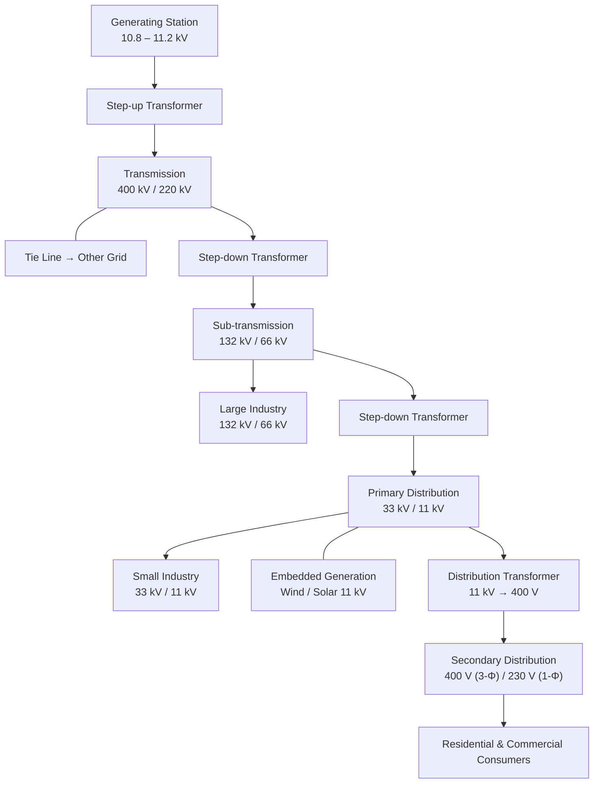

| Stage | Typical Voltage |
|-------|----------------|
| Generator terminals | 10.8 – 11.2 kV |
| Transmission | 400 kV, 220 kV |
| Sub-transmission | 132 kV, 66 kV |
| Primary distribution | 33 kV, 11 kV |
| Secondary distribution | 400 V (line-to-line), 230 V (line-to-neutral) |

> **Note on 433 V vs 400 V:** Some utilities specify 433 V at the transformer secondary so that the consumer receives ≈ 400 V after voltage drop in service lines. Line-to-neutral is always $V_{LL}/\sqrt{3}$.

Hill areas may use 6.6 kV or even 3.3 kV for primary distribution owing to shorter feeder lengths and lighter loads.

### 1.2 Distribution-System Protection

A typical 11 kV radial distribution feeder includes **reclosers** (auto-reclose after fault clearance), **sectionaliser** points, and a **normally open tie-switch** to an adjacent feeder. Under healthy conditions the tie-switch remains open; on a fault, the affected section is isolated and the tie-switch is closed to restore supply from the healthy side. This is the essence of **distribution automation**.

---

## 2. Interconnection and Spinning Reserve

### 2.1 Why Interconnect?

A **grid** is the transmission system of a given region; **regional grids** are linked by tie-lines to form a **national grid**. Interconnection offers two decisive advantages:

1. **Economy** — the total reserve capacity needed across all areas is less than the sum of individual reserves, because not all areas peak simultaneously.
2. **Reliability** — if one area suffers a generation loss or sudden load spike, neighbouring areas can supply the deficit.

### 2.2 Spinning Reserve

**Spinning reserve** is the generating capacity already synchronised to the grid and ready to pick up load within seconds. The preferred units for this role are:

| Unit Type | Why Preferred |
|-----------|--------------|
| **Hydro turbines** | Extremely fast ramp-up; can reach full load in seconds |
| **Gas turbines** | Can start and load within 3 minutes |
| **Steam (thermal) units** | Slow ramp rates, stringent minimum-loading constraints — **not** preferred |

---

## 3. Load Characteristics: Definitions and Factors

Electrical load is never constant; it fluctuates hour by hour, day by day, and season by season. A rich set of factors has been developed to describe this behaviour.

### 3.1 Connected Load, Demand, and Maximum Demand

- **Connected load** — the sum of the continuous rated capacities of all devices connected to the supply: lights, fans, motors, ACs, etc.
- **Demand** — the load at the receiving terminals, averaged over a specified **demand interval** (e.g. 15 min or 1 h), expressed in kW or kVA.
- **Maximum demand** — the greatest demand recorded over the billing or specified period.

### 3.2 Demand Factor (DF)

$$
\text{DF} = \frac{\text{Maximum demand}}{\text{Total connected load}}
$$

Because consumers do not operate all appliances simultaneously, $\text{DF}<1$ in practice. A low demand factor means most connected capacity sits idle at any given time.

### 3.3 Utilization Factor (UF)

$$
\text{UF} = \frac{\text{Maximum demand of the system}}{\text{Rated system capacity}}
$$

This tells you how heavily the plant's installed capacity is used at peak.

### 3.4 Plant Factor (Capacity Factor)

$$
\text{Plant Factor} = \frac{\text{Actual energy produced in period } T}{\text{Maximum plant rating} \times T}
$$

For a year, $T = 8760$ h. A plant factor below, say, 0.40 suggests significant idle capacity.

### 3.5 Coincident and Noncoincident Demand

- **Coincident (diversified) demand** $P_c$ — the maximum of the sum of all individual loads taken over each demand interval.
- **Noncoincident demand** — the sum of individual maximum demands without regard to when they occur.

### 3.6 Diversity Factor (FD)

$$
\text{FD} = \frac{\displaystyle\sum_{i=1}^{n} P_i}{P_c} \;\geq\; 1
$$

where $P_i$ is the maximum demand of the $i$-th consumer (or feeder, or area) and $P_c$ is the coincident maximum demand of the group.

> **Physical meaning:** A diversity factor of 1.4 means the individual peaks sum to 40 % more than the combined peak. This "diversity gain" is what allows a utility to serve more total connected load with less installed capacity.

### 3.7 Coincidence Factor (CF)

$$
\text{CF} = \frac{1}{\text{FD}} = \frac{P_c}{\sum P_i} \;\leq\; 1
$$

### 3.8 Load Diversity

$$
\text{Load Diversity} = \sum_{i=1}^{n} P_i \;-\; P_c
$$

This is an absolute quantity (kW), not a ratio, and is useful in substation transformer rating studies.

### 3.9 Contribution Factor

Each load $i$ contributes a fraction $C_i$ of its own peak to the coincident peak:

$$
P_c = \sum_{i=1}^{n} C_i\,P_i, \qquad 0 \le C_i \le 1
$$

When all $P_i$ are equal, $\text{CF}$ equals the **average** contribution factor. When all $C_i$ are equal, $\text{CF} = C_i$.

### 3.10 Load Factor (LF)

$$
\text{LF} = \frac{\text{Average load over period } T}{\text{Peak load in same period}} = \frac{\text{Energy served}}{P_{\max}\times T}
$$

A higher load factor means the plant is used more uniformly — desirable from an economic standpoint. LF $\leq$ 1 always.

### 3.11 Loss Factor (LLF)

$$
\text{LLF} = \frac{\text{Average } I^2R \text{ loss over period } T}{\text{Peak } I^2R \text{ loss}}
$$

Loss factor applies **only to copper (variable) losses**, not to iron (constant) losses.

---

## 4. Load Factor vs Loss Factor — Derivation and Limiting Cases

Consider an idealised two-level load curve over a period $T$:

| Quantity | Duration | Value |
|----------|----------|-------|
| Peak load | $t$ | $P_2$ |
| Off-peak load | $T - t$ | $P_1$ |

### 4.1 Load Factor

$$
\text{LF} = \frac{P_{\text{avg}}}{P_2} = \frac{P_2\,t + P_1\,(T-t)}{P_2\,T} = \frac{t}{T} + \frac{P_1}{P_2}\cdot\frac{T-t}{T}
$$

### 4.2 Loss Factor

Copper loss is proportional to $P^2$ (since loss $\propto I^2$ and $I\propto P$ at constant voltage). Write $L_1 = KP_1^2$, $L_2 = KP_2^2$:

$$
\text{LLF} = \frac{L_2\,t + L_1\,(T-t)}{L_2\,T} = \frac{t}{T} + \left(\frac{P_1}{P_2}\right)^{\!2}\!\cdot\frac{T-t}{T}
$$

### 4.3 Three Limiting Cases

| Case | Condition | Result |
|------|-----------|--------|
| 1. No off-peak load | $P_1 = 0$ | $\text{LF} = \text{LLF} = t/T$ |
| 2. Very short peak | $t \to 0$, so $(T-t)/T \to 1$ | $\text{LLF} = \text{LF}^2$ |
| 3. Steady (flat) load | $t \to T$ | $\text{LLF} = \text{LF}$ |

Hence the **general inequality**:

$$
\boxed{\;\text{LF}^2 \;<\; \text{LLF} \;<\; \text{LF}\;}
$$

### 4.4 Empirical Approximations

| Setting | Approximate formula |
|---------|-------------------|
| City (urban) feeders | $\text{LLF} = 0.3\,\text{LF} + 0.7\,\text{LF}^2$ |
| Rural feeders | $\text{LLF} = 0.2\,\text{LF} + 0.8\,\text{LF}^2$ |

---

## 5. Load Curves and Load Growth

### 5.1 Load Curve

A **load curve** plots demand (kW or MW) against time. The area under the curve gives the total energy delivered. Key uses:

- Determine **peak load** → size generating units.
- Determine **energy served** → compute load factor and plant factor.
- Plan **unit commitment** (which generators to start and when).

### 5.2 Load Duration Curve

A **load duration curve** rearranges the load curve so that the horizontal axis represents the number of hours at or above a given load level. It is particularly useful for deciding how much base-load, intermediate, and peaking capacity to install.

### 5.3 Load Growth

Load grows from year to year. If $P_0$ is the load at the base year and $g$ is the annual growth rate, the load at the end of year $m$ is:

$$
P_m = P_0\,(1 + g)^m
$$

For instance, at $g = 5\%$ and $P_0 = 100$ MW:

| Year $m$ | Load $P_m$ (MW) |
|-----------|-----------------|
| 0 | 100.0 |
| 1 | 105.0 |
| 2 | 110.25 |
| 3 | 115.76 |
| 5 | 127.63 |

---

## 6. Disadvantages of Low Power Factor

For a balanced three-phase load:

$$
I_L = \frac{P_L}{\sqrt{3}\;V\;\cos\varphi}
$$

If $P_L$ and $V$ are held fixed, the line current $I_L$ is **inversely proportional** to $\cos\varphi$. A low (lagging) power factor therefore has four serious consequences:

| # | Disadvantage | Mechanism |
|---|-------------|-----------|
| 1 | **Larger equipment ratings** | Generators and transformers must be rated in kVA; lower PF → higher kVA for the same kW → bigger, costlier machines |
| 2 | **Heavier conductors** | Higher current demands larger cross-section (or higher losses) in lines, feeders, and cables |
| 3 | **Greater $I^2R$ losses** | Loss $\propto I^2 \propto 1/\cos^2\!\varphi$; efficiency drops |
| 4 | **Poor voltage regulation** | Large reactive voltage drop $IX\sin\varphi$ causes voltage sag at the consumer end |

### Causes of Low Power Factor

- Induction motors operating at light load (PF falls as load drops).
- Over-excited transformers and high supply voltage during off-peak periods.
- Arc welders (PF as low as 0.35), discharge lamps, and induction furnaces.

Utilities typically mandate $\cos\varphi \geq 0.8$ for industrial consumers and impose tariff penalties for non-compliance. Power-factor correction capacitors are the standard remedy.

---

## 7. Transmission-Line Parameters

Every transmission line has four distributed parameters:

| Parameter | Physical origin | Significance |
|-----------|----------------|--------------|
| **Resistance** $R$ | Ohmic resistance of conductor material | Causes $I^2R$ real-power loss |
| **Inductance** $L$ | Magnetic flux linking the conductor | Dominates voltage drop and power-transfer limit ($X \gg R$) |
| **Capacitance** $C$ | Electric field between conductor and earth/other phases | Produces charging current; important for lines ≥ 66 kV and all cables |
| **Shunt conductance** $G$ | Leakage across insulators, corona | **Negligible** — ignored in most analyses |

> **When to include capacitance:**
>
> | System | Include $C$? |
> |--------|-------------|
> | Overhead line ≤ 33 kV | No |
> | Overhead line ≥ 66 kV | Yes |
> | Cable at 11 kV | **Yes** (significant even at low voltage) |

---

## 8. Conductor Resistance

### 8.1 DC Resistance

$$
R_{dc} = \frac{\rho\, l}{A}
$$

where $\rho$ is resistivity (Ω·m), $l$ is conductor length (m), and $A$ is cross-sectional area (m²).

### 8.2 Spiralling Effect

Practical conductors are **stranded** and spiralled for flexibility. The spiral path is longer than the geometric length. Resistance increases by roughly:

- **1 %** for three-strand conductors.
- **2 %** for concentrically stranded conductors.

### 8.3 Skin Effect

Under DC, current distributes uniformly over the cross-section. Under AC, the changing magnetic field induces eddy currents that push current toward the **surface** (skin effect). Consequences:

- Effective cross-section for current flow is reduced.
- AC resistance $R_{ac} > R_{dc}$.
- The effect increases with frequency and conductor diameter.

### 8.4 Temperature Correction

Resistance increases approximately linearly with temperature over moderate ranges:

$$
R_T = R_0\,(1 + \alpha_0\,T)
$$

where $R_0$ is the resistance at 0 °C and $\alpha_0$ is the temperature coefficient at 0 °C. For a **ratio** of resistances at two temperatures:

$$
\frac{R_2}{R_1} = \frac{T_2 + 1/\alpha_0}{T_1 + 1/\alpha_0}
$$

> **Common mistake:** Forgetting that $T_1$ and $T_2$ are in **degrees Celsius**, not kelvin, when using the ratio formula with $\alpha_0$.

### 8.5 Summary: Factors Affecting Resistance

| Factor | Effect | Typical magnitude |
|--------|--------|-------------------|
| Spiralling | $R_{\text{stranded}} > R_{\text{solid}}$ | +1–2 % |
| Skin effect | $R_{ac} > R_{dc}$ | Increases with $f$ and $d$ |
| Temperature | $R$ increases linearly with $T$ | $\alpha_0 \approx 0.00406$ /°C for Cu |

---

## 9. Inductance Derivation from First Principles

### 9.1 Foundational Relations

A conductor carrying current $i$ establishes flux linkages $\lambda$ (Wb-turns). The induced EMF is:

$$
e = \frac{d\lambda}{dt}
$$

In a linear magnetic circuit $\lambda = Li$, so:

$$
e = L\,\frac{di}{dt} \qquad\text{and in steady-state AC:}\qquad V = j\omega L\,I = j\omega\lambda
$$

**Ampere's circuital law:**

$$
\oint \mathbf{H}\cdot d\mathbf{l} = I_{\text{enclosed}}
$$

**Flux density:**

$$
B = \mu_0\,\mu_r\,H
$$

where $\mu_0 = 4\pi\times10^{-7}$ H/m is the permeability of free space.

### 9.2 Internal Inductance — Derivation

Consider a solid cylindrical conductor of radius $r$ carrying total current $I$ with **uniform current density**.

**Step 1 — Enclosed current at radius $x$.** By proportion of cross-sectional area:

$$
I_x = I\,\frac{\pi x^2}{\pi r^2} = I\,\frac{x^2}{r^2}
$$

**Step 2 — Magnetic field intensity** at radius $x$, applying Ampere's law to a circular path of radius $x$:

$$
2\pi x\,H_x = I_x = I\,\frac{x^2}{r^2} \qquad\Longrightarrow\qquad H_x = \frac{I\,x}{2\pi\,r^2}
$$

**Step 3 — Flux density** $B_x = \mu_0 H_x = \dfrac{\mu_0\,I\,x}{2\pi\,r^2}$.

**Step 4 — Differential flux** through an annular ring of width $dx$ and unit length:

$$
d\Phi_x = B_x\,(dx\times 1) = \frac{\mu_0\,I}{2\pi\,r^2}\,x\,dx
$$

**Step 5 — Fractional-turn linkage.** This internal flux links only a fraction of the total current. The fraction of the conductor area enclosed is $x^2/r^2$, so the effective flux linkage is:

$$
d\lambda_x = \frac{x^2}{r^2}\;d\Phi_x = \frac{\mu_0\,I}{2\pi\,r^4}\,x^3\,dx
$$

**Step 6 — Integrate from 0 to $r$:**

$$
\lambda_{\text{int}} = \int_0^{r}\frac{\mu_0\,I}{2\pi\,r^4}\,x^3\,dx = \frac{\mu_0\,I}{2\pi\,r^4}\cdot\frac{r^4}{4} = \frac{\mu_0\,I}{8\pi}
$$

Substituting $\mu_0 = 4\pi\times10^{-7}$:

$$
\lambda_{\text{int}} = \frac{4\pi\times10^{-7}}{8\pi}\;I = \frac{1}{2}\times10^{-7}\;I \quad \text{Wb-turns/m}
$$

**Step 7 — Internal inductance:**

$$
\boxed{L_{\text{int}} = \frac{\lambda_{\text{int}}}{I} = \frac{1}{2}\times10^{-7} \;\text{H/m}}
$$

> **Key result:** $L_{\text{int}}$ is **independent of conductor radius**. This is surprising but follows directly from the $x^3$ integration cancelling the $r^4$ denominator.

### 9.3 External Inductance — Derivation

Now consider the flux outside the conductor, between two points $P$ and $Q$ at distances $D_1$ and $D_2$ from the conductor centre ($D_2 > D_1 \geq r$).

**Step 1 — Field intensity** at distance $x > r$: all the current $I$ is enclosed.

$$
H_x = \frac{I}{2\pi\,x}
$$

**Step 2 — Flux density:** $B_x = \mu_0 H_x = \dfrac{\mu_0\,I}{2\pi\,x}$.

**Step 3 — Flux linkage.** External flux links the **entire** current — no fractional-turn factor.

$$
d\lambda_x = d\Phi_x = B_x\,dx = \frac{\mu_0\,I}{2\pi\,x}\,dx
$$

**Step 4 — Integrate from $D_1$ to $D_2$:**

$$
\lambda_{PQ} = \int_{D_1}^{D_2}\frac{\mu_0\,I}{2\pi\,x}\,dx = \frac{\mu_0\,I}{2\pi}\ln\!\frac{D_2}{D_1}
$$

**Step 5 — External inductance:**

$$
\boxed{L_{\text{ext}} = 2\times10^{-7}\,\ln\!\frac{D_2}{D_1} \;\text{H/m}}
$$

### 9.4 Total Inductance

For a single conductor, the total inductance between points $P$ and $Q$ is:

$$
L = L_{\text{int}} + L_{\text{ext}} = \frac{1}{2}\times10^{-7} + 2\times10^{-7}\,\ln\!\frac{D_2}{D_1} \quad \text{H/m}
$$

---

## 10. Worked Examples

### Example 1 — Power-Station Load Curve

**Given:** The 24-hour load profile of a station:

| Time block | Duration (h) | Load (MW) |
|------------|:-----------:|:---------:|
| 06:00 – 08:00 | 2 | 1.2 |
| 08:00 – 09:00 | 1 | 2.0 |
| 09:00 – 12:00 | 3 | 3.0 |
| 12:00 – 14:00 | 2 | 1.5 |
| 14:00 – 18:00 | 4 | 2.5 |
| 18:00 – 20:00 | 2 | 1.8 |
| 20:00 – 21:00 | 1 | 2.0 |
| 21:00 – 23:00 | 2 | 1.0 |
| 23:00 – 05:00 | 6 | 0.5 |
| 05:00 – 06:00 | 1 | 0.8 |

**Find:** (a) load factor, (b) number and size of generating units, (c) reserve capacity and plant factor, (d) unit operating schedule.

**Solution:**

**(a)** Energy served = sum of (duration × load):

$$
E = 2(1.2)+1(2)+3(3)+2(1.5)+4(2.5)+2(1.8)+1(2)+2(1)+6(0.5)+1(0.8) = 37.8 \;\text{MWh}
$$

$$
P_{\text{avg}} = \frac{37.8}{24} = 1.575\;\text{MW}, \qquad P_{\max} = 3\;\text{MW}
$$

$$
\boxed{\text{LF} = \frac{1.575}{3.0} = 0.525}
$$

Sanity check: LF is between 0 and 1 and well below 1 — reasonable for a variable daily profile. ✓

**(b)** Choose **four units of 1 MW each**. During peak (3 MW), three units run at full load and one stands by for reliability.

**(c)** Plant capacity = 4 MW; Reserve = $4 - 3 = 1$ MW.

$$
\text{Plant factor} = \frac{37.8}{4\times 24} = \frac{37.8}{96} = 0.394
$$

**(d)** Operating schedule:

| Unit | Runs during | Hours |
|------|------------|:-----:|
| 1 | 24 h (covers minimum load of 0.5 MW) | 24 |
| 2 | 06:00 – 21:00 (load > 1 MW) | 15 |
| 3 | 09:00 – 12:00 and 14:00 – 18:00 (load > 2 MW) | 7 |
| 4 | Standby (or maintenance window) | — |

---

### Example 2 — Annual Load Factor and Demand Factor

**Given:** Maximum demand = 80 MW, connected load = 150 MW, annual energy = $400\times10^3$ MWh.

**Find:** Load factor and demand factor.

**Solution:**

$$
P_{\text{avg}} = \frac{400\times10^{3}}{8760} = 45.66\;\text{MW}
$$

$$
\text{LF} = \frac{45.66}{80} = \boxed{0.571}
$$

$$
\text{DF} = \frac{80}{150} = \boxed{0.533}
$$

Sanity check: Both values are below 1 as expected. LF > DF is not required — they measure different things. ✓

---

### Example 3 — Diversity, Load Diversity, and Coincidence for Two Feeders

**Given:** Feeder A peak = 2 MW (industrial), Feeder B peak = 2 MW (residential). Combined peak = 3 MW.

**Find:** Diversity factor, load diversity, coincidence factor.

**Solution:**

$$
\text{FD} = \frac{2+2}{3} = \boxed{1.333}
$$

$$
\text{Load Diversity} = (2+2)-3 = \boxed{1\;\text{MW}}
$$

$$
\text{CF} = \frac{1}{\text{FD}} = \frac{1}{1.333} = \boxed{0.75}
$$

Sanity check: FD ≥ 1 and CF ≤ 1. The 1 MW load diversity quantifies how much the coincident peak is less than the arithmetic sum — useful for transformer sizing. ✓

---

### Example 4 — Multi-Feeder Diversity Factors

**Given:** A substation supplies four feeders.

| Feeder | Individual consumer peaks (kW) | Feeder peak (kW) |
|--------|-------------------------------|:----------------:|
| A | 70, 90, 20, 50, 10, 20 | 200 |
| B | 60, 40, 70, 30 | 160 |
| C | — | 150 |
| D | — | 200 |

Station coincident peak = 600 kW.

**Find:** Diversity factor for each feeder and for the station.

**Solution:**

Feeder A:

$$
\text{FD}_A = \frac{70+90+20+50+10+20}{200} = \frac{260}{200} = \boxed{1.30}
$$

Feeder B:

$$
\text{FD}_B = \frac{60+40+70+30}{160} = \frac{200}{160} = \boxed{1.25}
$$

Station (all four feeders):

$$
\text{FD}_{\text{station}} = \frac{200+160+150+200}{600} = \frac{710}{600} = \boxed{1.183}
$$

Sanity check: The station-level FD is lower than individual feeder FDs because there is already some diversity within each feeder. ✓

---

### Example 5 — Generating Station Design Parameters

**Given:** Peak demand = 90 MW, load factor = 0.60, plant capacity factor = 0.50, plant use factor = 0.80.

**Find:** (a) daily energy, (b) installed capacity, (c) reserve capacity, (d) utilization factor.

**Solution:**

**(a)** Average demand = $90\times0.60 = 54$ MW.

$$
E_{\text{daily}} = 54\times 24 = \boxed{1296\;\text{MWh}}
$$

**(b)** From the plant factor definition:

$$
0.50 = \frac{1296}{C_{\text{installed}}\times 24} \qquad\Longrightarrow\qquad C_{\text{installed}} = \frac{1296}{0.50\times 24} = \boxed{108\;\text{MW}}
$$

**(c)** Reserve = $108 - 90 = \boxed{18\;\text{MW}}$

**(d)** Utilization factor:

$$
\text{UF} = \frac{90}{108} = \boxed{0.833}
$$

Sanity check: UF < 1 (capacity exceeds peak) and plant factor < UF (plant does not run at peak all the time). ✓

---

### Example 6 — Loss Factor Estimation

**Given:** A distribution feeder has a load factor of 0.45 and serves an urban area.

**Estimate:** The loss factor.

**Solution:** Using the city-area approximation:

$$
\text{LLF} = 0.3\,\text{LF} + 0.7\,\text{LF}^2 = 0.3(0.45) + 0.7(0.45)^2
$$

$$
= 0.135 + 0.7(0.2025) = 0.135 + 0.14175 = \boxed{0.277}
$$

Sanity check: $\text{LF}^2 = 0.2025 < \text{LLF} = 0.277 < \text{LF} = 0.45$. The inequality $\text{LF}^2 < \text{LLF} < \text{LF}$ is satisfied. ✓

---

### Example 7 — Load Growth Forecast

**Given:** Current peak load $P_0 = 120$ MW, annual growth rate $g = 6\%$.

**Find:** Peak load after 4 years.

**Solution:**

$$
P_4 = 120\times(1.06)^4 = 120\times1.2625 = \boxed{151.5\;\text{MW}}
$$

Sanity check: 6 % compounded over 4 years gives roughly 26 % growth, and $120\times1.26 = 151$ — consistent. ✓

---

### Example 8 — Internal Inductance Verification

**Given:** A solid copper conductor of radius 5 mm carries 100 A DC.

**Find:** Internal flux linkage per metre and internal inductance.

**Solution:**

$$
\lambda_{\text{int}} = \frac{1}{2}\times10^{-7}\times 100 = 5\times10^{-6}\;\text{Wb-turns/m}
$$

$$
L_{\text{int}} = \frac{\lambda_{\text{int}}}{I} = \frac{5\times10^{-6}}{100} = \frac{1}{2}\times10^{-7}\;\text{H/m}
$$

Sanity check: The result is independent of the 5 mm radius — as predicted by the theory. ✓

---

## 11. Practical Calculation Workflows

### 11.1 From Load Data to System Sizing

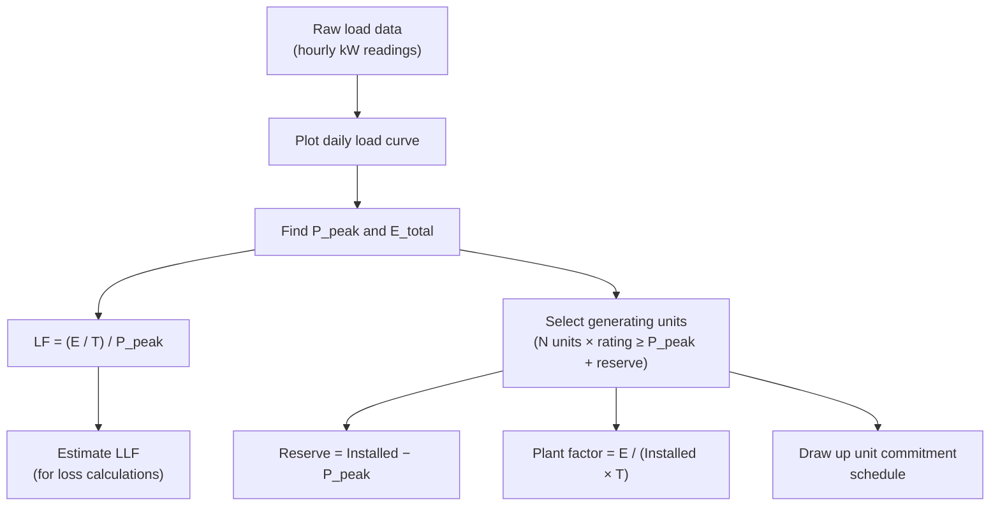

### 11.2 Resistance Correction Workflow

1. Start with DC resistance at 20 °C from manufacturer data.
2. Apply **spiralling factor** (+1–2 %) if using stranded conductor data not already corrected.
3. Apply **temperature correction** to the actual operating temperature using $R_2/R_1 = (T_2+1/\alpha_0)/(T_1+1/\alpha_0)$.
4. Apply **skin-effect ratio** $R_{ac}/R_{dc}$ (from tables, dependent on conductor size and frequency) to obtain the effective AC resistance.

---

## 12. Comparison Tables

### Load Factor — Loss Factor Relationships

| Case | Condition | Relationship |
|------|-----------|-------------|
| No off-peak load | $P_1 = 0$ | $\text{LF} = \text{LLF}$ |
| Very short peak | $t \to 0$ | $\text{LLF} = \text{LF}^2$ |
| Flat load | $t \to T$ | $\text{LLF} = \text{LF}$ |
| General (always) | — | $\text{LF}^2 < \text{LLF} < \text{LF}$ |
| Urban feeders | empirical | $\text{LLF} = 0.3\,\text{LF}+0.7\,\text{LF}^2$ |
| Rural feeders | empirical | $\text{LLF} = 0.2\,\text{LF}+0.8\,\text{LF}^2$ |

### Power Factor of Common Equipment

| Equipment | Typical PF range | Nature |
|-----------|:----------------:|--------|
| Induction motors | 0.60 – 0.85 | Lagging; falls at light load |
| Fractional-HP motors | 0.50 – 0.80 | Lagging |
| Fluorescent lamps | 0.55 – 0.90 | Lagging (with ballast) |
| Ceiling / desk fans | 0.55 – 0.85 | Lagging |
| Induction furnaces | 0.70 – 0.85 | Lagging |
| Arc welders | 0.35 – 0.50 | Very low, lagging |

### Inductance Formulas Summary

| Quantity | Formula | Unit |
|----------|---------|------|
| Internal flux linkage | $\lambda_{\text{int}} = \dfrac{\mu_0 I}{8\pi}$ | Wb·turns/m |
| Internal inductance | $L_{\text{int}} = \dfrac{1}{2}\times10^{-7}$ | H/m |
| External flux linkage ($D_1$ to $D_2$) | $\lambda_{\text{ext}} = \dfrac{\mu_0 I}{2\pi}\ln\dfrac{D_2}{D_1}$ | Wb·turns/m |
| External inductance | $L_{\text{ext}} = 2\times10^{-7}\ln\dfrac{D_2}{D_1}$ | H/m |
| Mutual inductance | $M_{21} = \lambda_{21}/I_1$ | H |

---

## 13. Common Mistakes

- **Confusing DF and FD:** Demand factor (DF ≤ 1) relates maximum demand to connected load. Diversity factor (FD ≥ 1) relates the sum of individual peaks to the coincident peak. They are not reciprocals.
- **Applying LLF to iron losses:** Loss factor is valid only for **copper** ($I^2R$) losses, which vary with load. Iron losses are essentially constant.
- **Using Celsius in ratio formula without care:** $R_2/R_1 = (T_2+1/\alpha_0)/(T_1+1/\alpha_0)$ uses Celsius and the coefficient $\alpha_0$ referenced to 0 °C. Mixing reference temperatures gives wrong answers.
- **Forgetting the fractional-turn factor in internal inductance:** Internal flux at radius $x$ links only the fraction $(x^2/r^2)$ of the total current. Omitting this leads to an incorrect derivation.
- **Assuming internal inductance depends on radius:** It does not — the $r^4$ in the denominator cancels during integration. This is a frequent exam trap.
- **Ignoring spiralling when using solid-conductor resistivity:** Stranded conductors are always slightly longer than their geometric length; always apply the spiralling correction.

---

## 14. Rapid-Revision Checklist

- [ ] Three subsystems: generation → transmission → distribution; voltage steps at each stage
- [ ] Interconnection reduces total reserve requirement; spinning reserve = synchronised, ready-to-load capacity (hydro / gas preferred)
- [ ] **DF** = Max demand / Connected load (≤ 1)
- [ ] **UF** = Max demand / Rated capacity (≤ 1)
- [ ] **Plant factor** = Energy / (Rating × T) (≤ 1)
- [ ] **FD** = Σ individual peaks / Coincident peak (≥ 1); **CF** = 1/FD (≤ 1)
- [ ] **Load diversity** = Σ individual peaks − Coincident peak (kW)
- [ ] **LF** = Avg load / Peak load = Energy / ($P_{\max}T$) (≤ 1)
- [ ] **LLF** = Avg $I^2R$ loss / Peak $I^2R$ loss; applies to copper loss only
- [ ] $\text{LF}^2 < \text{LLF} < \text{LF}$; empirical: urban $\text{LLF}=0.3\,\text{LF}+0.7\,\text{LF}^2$, rural $\text{LLF}=0.2\,\text{LF}+0.8\,\text{LF}^2$
- [ ] Load growth: $P_m = P_0(1+g)^m$
- [ ] Low PF → higher current → larger equipment, more losses, worse voltage regulation
- [ ] Four line parameters: $R$, $L$, $C$, $G$ ($G$ negligible); include $C$ for overhead ≥ 66 kV and all cables
- [ ] $R_{dc}=\rho l/A$; correct for spiralling (+1–2 %), skin effect ($R_{ac}>R_{dc}$), temperature
- [ ] Temperature correction: $R_2/R_1 = (T_2+1/\alpha_0)/(T_1+1/\alpha_0)$
- [ ] Internal inductance: $L_{\text{int}}=\tfrac{1}{2}\times10^{-7}$ H/m — **independent of radius**
- [ ] External inductance: $L_{\text{ext}}=2\times10^{-7}\ln(D_2/D_1)$ H/m
- [ ] Internal derivation: uniform current density → fractional-turn factor $(x^2/r^2)$ → integrate $x^3$ from 0 to $r$
- [ ] External derivation: full current enclosed for all $x>r$ → integrate $1/x$ from $D_1$ to $D_2$

---

## Assignment Questions and Worked Solutions

### Assignment Q1
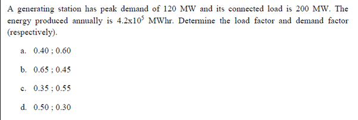

Worked solution

**Given:** Connected load = $200 \text{ MW}$, Maximum demand = $120 \text{ MW}$, Annual energy generated = $4.2 \times 10^5 \text{ MWhr}$.

**Average load:**

$$P_{\text{avg}} = \frac{4.2 \times 10^5}{8760} = 47.945 \text{ MW}$$

**Load factor:**

$$\text{LF} = \frac{P_{\text{avg}}}{\text{Maximum demand}} = \frac{47.945}{120} \approx 0.40$$

**Demand factor:**

$$\text{DF} = \frac{\text{Maximum demand}}{\text{Connected load}} = \frac{120}{200} = 0.60$$

**Correct option: (a)**

> **Exam trap:** The load factor and demand factor are easy to swap. Remember: load factor uses *average load / maximum demand*, while demand factor uses *maximum demand / connected load*. They are never the same unless coincidentally equal.

---

### Assignment Q2
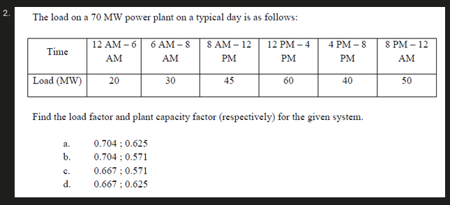

Worked solution

**Given:** Plant rated capacity = $70 \text{ MW}$. Hourly loads: $20 \text{ MW}$ (6 h), $30 \text{ MW}$ (2 h), $45 \text{ MW}$ (4 h), $60 \text{ MW}$ (4 h), $40 \text{ MW}$ (4 h), $50 \text{ MW}$ (4 h).

**Average load:**

$$P_{\text{avg}} = \frac{20 \times 6 + 30 \times 2 + 45 \times 4 + 60 \times 4 + 40 \times 4 + 50 \times 4}{24} = \frac{960}{24} = 40 \text{ MW}$$

**Maximum demand** from the load profile $= 60 \text{ MW}$.

**Load factor:**

$$\text{LF} = \frac{P_{\text{avg}}}{\text{Max demand}} = \frac{40}{60} = 0.667$$

**Plant capacity factor:**

$$\text{PCF} = \frac{P_{\text{avg}}}{\text{Plant rated capacity}} = \frac{40}{70} = 0.571$$

**Correct option: (c)**

> **Exam trap:** Do not confuse plant capacity factor (average / rated capacity) with load factor (average / maximum demand). When maximum demand < rated capacity, plant capacity factor < load factor.

---

### Assignment Q3
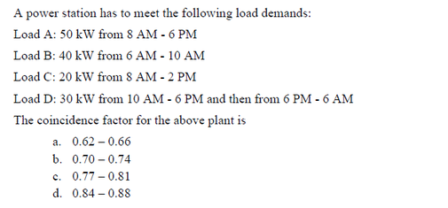

Worked solution

**Given load schedule:**

| Time | 6 AM – 8 AM | 8 AM – 10 AM | 10 AM – 2 PM | 2 PM – 6 PM | 6 PM – 6 AM |
|---|---|---|---|---|---|
| Load (kW) | 40 | 110 | 100 | 80 | 30 |

**Peak load demand on the power plant** = $110 \text{ kW}$.

**Sum of individual maximum demands** = $50 + 40 + 20 + 30 = 140 \text{ kW}$.

**Diversity factor:**

$$\text{DF}_{\text{div}} = \frac{\sum \text{Individual max demands}}{\text{Peak of all loads}} = \frac{140}{110} = 1.2727$$

**Coincident factor:**

$$\text{CF} = \frac{1}{\text{Diversity factor}} = \frac{1}{1.2727} = 0.7857$$

**Correct option: (c)**

> **Exam trap:** The coincidence factor is the *reciprocal* of the diversity factor, not the other way around. Diversity factor $\geq 1$, while coincidence factor $\leq 1$.

---

### Assignment Q4
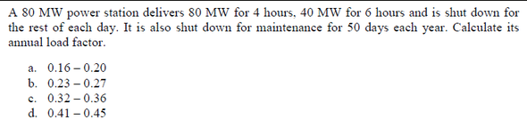

Worked solution

**Given:** Peak demand = $80 \text{ MW}$. Operating days = $365 - 50 = 315$ days. Load: $80 \text{ MW}$ for 4 h and $40 \text{ MW}$ for 6 h each working day.

**Energy supplied per working day:**

$$E_{\text{day}} = (80 \times 4) + (40 \times 6) = 320 + 240 = 560 \text{ MWhr}$$

**Energy supplied per year:**

$$E_{\text{year}} = 560 \times 315 = 176{,}400 \text{ MWhr}$$

**Annual load factor:**

$$\text{LF} = \frac{E_{\text{year}}}{\text{Max demand} \times 8760} = \frac{176{,}400}{80 \times 8760} = \frac{176{,}400}{700{,}800} = 0.2517$$

**Correct option: (b)**

> **Exam trap:** Remember to subtract the 50 idle days from 365, and use the *maximum demand* (not average) in the denominator. Units check: MWh / (MW × h) = dimensionless. ✓

---

### Assignment Q5
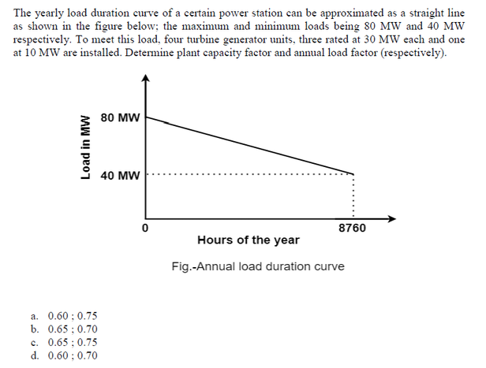

Worked solution

**Given:** Three $30 \text{ MW}$ units and one $10 \text{ MW}$ unit. Annual load duration curve is a trapezoid with peak = $80 \text{ MW}$ and minimum = $40 \text{ MW}$ over $8760$ h.

**Installed plant capacity:**

$$P_{\text{rated}} = 30 \times 3 + 10 \times 1 = 100 \text{ MW}$$

**MWh generated per annum** (area under load duration curve):

$$E = \frac{1}{2} \times (80 + 40) \times 8760 = 60 \times 8760 = 525{,}600 \text{ MWhr}$$

**Average load:**

$$P_{\text{avg}} = \frac{525{,}600}{8760} = 60 \text{ MW}$$

**Annual load factor:**

$$\text{LF} = \frac{P_{\text{avg}}}{P_{\text{peak}}} = \frac{60}{80} = 0.75$$

**Plant capacity factor:**

$$\text{PCF} = \frac{P_{\text{avg}}}{P_{\text{rated}}} = \frac{60}{100} = 0.60$$

**Correct option: (a)**

> **Exam trap:** The area of a trapezoid is $\frac{1}{2}(b_1 + b_2) \times h$, not simply the product of peak and time. Using $80 \times 8760$ would overestimate the energy and give a load factor of 1.0.

---

### Assignment Q6
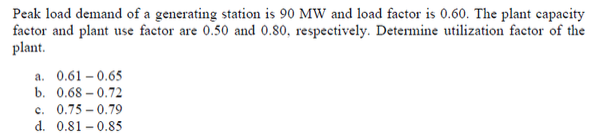

Worked solution

**Given:** Maximum demand = $90 \text{ MW}$, Load factor = $0.60$, Plant capacity factor = $0.50$, Plant use factor = $0.80$.

**Utilization factor:**

$$\text{UF} = \frac{\text{Maximum demand}}{\text{Plant capacity}} = \frac{\text{Plant capacity factor}}{\text{Load factor}} = \frac{0.50}{0.60} = 0.833$$

**Correct option: (d)**

> **Exam trap:** Utilization factor = maximum demand / plant capacity. This is *not* the same as plant capacity factor (= average load / plant capacity). Since average load < maximum demand always, utilization factor > plant capacity factor.

---

### Assignment Q7
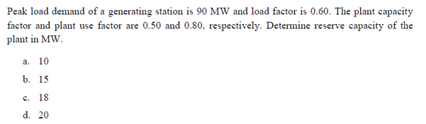

Worked solution

**Given:** Maximum demand = $90 \text{ MW}$, Load factor = $0.60$, Plant capacity factor = $0.50$.

**Average load:**

$$P_{\text{avg}} = \text{LF} \times \text{Max demand} = 0.60 \times 90 = 54 \text{ MW}$$

**Rated capacity of the plant:**

$$P_{\text{rated}} = \frac{P_{\text{avg}}}{\text{PCF}} = \frac{54}{0.50} = 108 \text{ MW}$$

**Reserve capacity:**

$$\text{Reserve} = P_{\text{rated}} - \text{Max demand} = 108 - 90 = 18 \text{ MW}$$

**Correct option: (c)**

> **Exam trap:** Reserve capacity is the difference between rated capacity and maximum demand, *not* between rated capacity and average load. Units check: MW − MW = MW. ✓

---

### Assignment Q8
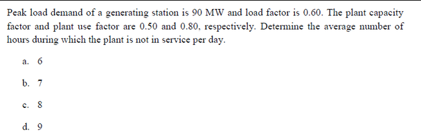

Worked solution

**Given:** Maximum demand = $90 \text{ MW}$, Load factor = $0.60$, Plant capacity factor = $0.50$, Plant use factor = $0.80$.

**Average load:**

$$P_{\text{avg}} = 0.60 \times 90 = 54 \text{ MW}$$

**Rated capacity:**

$$P_{\text{rated}} = \frac{54}{0.50} = 108 \text{ MW}$$

**Maximum energy that could be produced daily** (when plant is in operation and fully loaded):

$$E_{\text{max}} = \frac{P_{\text{avg}} \times 24}{\text{Use factor}} = \frac{54 \times 24}{0.80} = 1620 \text{ MWhr}$$

**Number of hours of operation per day:**

$$t_{\text{on}} = \frac{54 \times 24}{108 \times 0.80} = \frac{1296}{86.4} = 15 \text{ hours}$$

**Hours NOT in service per day:**

$$t_{\text{off}} = 24 - 15 = 9 \text{ hours}$$

**Correct option: (d)**

> **Exam trap:** Plant use factor involves *actual* energy produced vs. *maximum possible* energy when running at full capacity. The denominator is rated capacity × operating hours, not average load × 24. Getting this backwards gives the wrong number of operating hours.

---

### Assignment Q9
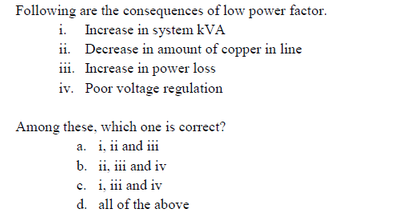

Worked solution

The consequences of a low power factor include:

1. **Increased system kVA** — for a given real power $P$, the apparent power $S = P / \cos\phi$ rises as $\cos\phi$ drops.
2. **Increased copper losses** — higher current $I = S / (\sqrt{3}\, V)$ leads to greater $I^2 R$ losses in lines.
3. **Poor voltage regulation** — larger voltage drops across line impedance.
4. **Increased amount of copper** — conductors must be sized for the higher current.

**Correct option: (c)**

> **Exam trap:** Low power factor does *not* increase the real power consumed by the load. It increases the *apparent power* and *current*, which causes secondary effects (losses, voltage drop, larger equipment ratings).

---

### Assignment Q10
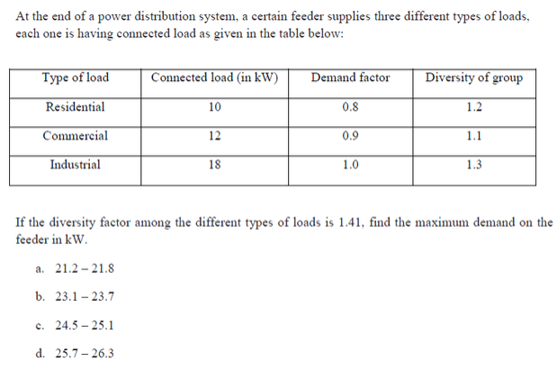

Worked solution

**Residential consumers:** Connected load = $10 \text{ kW}$, Demand factor = $0.8$, Diversity factor = $1.2$.

$$\text{Sum of individual max demands} = 10 \times 0.8 = 8 \text{ kW}$$

$$\text{Max residential load} = \frac{8}{1.2} = 6.667 \text{ kW}$$

**Commercial consumers:** Connected load = $12 \text{ kW}$, Demand factor = $0.9$, Diversity factor = $1.1$.

$$\text{Max commercial load} = \frac{12 \times 0.9}{1.1} = \frac{10.8}{1.1} = 9.818 \text{ kW}$$

**Industrial consumers:** Connected load = $18 \text{ kW}$, Demand factor = $1.0$, Diversity factor = $1.3$.

$$\text{Max industrial load} = \frac{18 \times 1.0}{1.3} = \frac{18}{1.3} = 13.846 \text{ kW}$$

**Maximum demand on the feeder** (diversity factor among different types = $1.41$):

$$MD = \frac{6.667 + 9.818 + 13.846}{1.41} = \frac{30.331}{1.41} = 21.511 \text{ kW}$$

**Correct option: (a)**

> **Exam trap:** Diversity factor is always $\geq 1$ and appears in the *denominator*. Dividing by it always *reduces* the peak — never multiply by it. The sum of individual max demands is always *greater than or equal to* the system peak.

---

### Assignment Q11
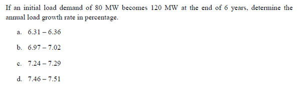

Worked solution

**Given:** Initial load $P_0 = 80 \text{ MW}$, Final load $P_m = 120 \text{ MW}$, Time period $m = 6$ years, Rate of growth = $g\%$ per annum.

**Compound growth formula:**

$$P_m = P_0 \left(1 + \frac{g}{100}\right)^m$$

$$120 = 80 \left(1 + \frac{g}{100}\right)^6$$

$$\left(1 + \frac{g}{100}\right)^6 = \frac{120}{80} = 1.5$$

$$1 + \frac{g}{100} = (1.5)^{1/6} = 1.0699$$

$$g = 6.99\%$$

**Correct option: (b)**

> **Exam trap:** This is a *compound* (geometric) growth, not simple interest. Using $g = \frac{120 - 80}{80 \times 6} = 8.33\%$ would be the simple-growth approximation and is incorrect here.

---

### Assignment Q12
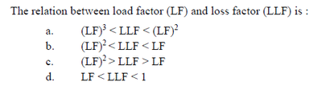

Worked solution

The relationship between the load factor (LF) and the loss factor (LLF) is:

$$(\text{LF})^2 < \text{LLF} < \text{LF}$$

This holds because the loss factor is related to the square of the load, and the average of squares is always greater than the square of the average (by Jensen's inequality), but less than the square of the maximum. Specifically:

- **LLF < LF**: losses do not scale linearly with load duration; the time-weighted average of squared load is less than the linear load factor.
- **LLF > (LF)²**: by Jensen's inequality, $E[X^2] > (E[X])^2$ for any non-constant random variable $X$.

**Correct option: (b)**

> **Exam trap:** Do not confuse loss factor with load factor. The loss factor is always *between* the square of the load factor and the load factor itself — never equal to either (unless load is perfectly constant).

