# Week 11 - Symmetrical Components and Stability Foundations

## Orientation

Welcome to Week 11. This week completes our study of symmetrical components and applies them to the analysis of unbalanced faults. We then transition into the foundations of power system stability. The material is dense, but the logical structure is clear: we first understand how to represent transformers and rotating machines in sequence networks, then we use those networks to analyze various fault types, and finally we begin to explore how systems behave dynamically after disturbances.

The week is built around five lectures that progress from transformer zero-sequence modeling through detailed fault analysis to the first steps of stability studies. We will work through several complete numerical examples, including a large per-unit system with multiple machines, transformers, and transmission lines. By the end of this week, you should be able to construct sequence networks for arbitrary system configurations and compute fault currents for the major unbalanced fault types.

The intellectual thread connecting all five lectures is the method of symmetrical components itself. This method, first proposed by C.L. Fortescue in 1918, transforms an unbalanced three-phase system into three balanced systems: positive-sequence, negative-sequence, and zero-sequence. Each sequence network is a single-phase representation of the three-phase system under that particular sequence excitation. The power of the method lies in the fact that generators produce only positive-sequence voltages, and the three sequence networks are independent except at the point of unbalance (the fault). By connecting the sequence networks in a manner dictated by the fault boundary conditions, we can compute fault currents and voltages with remarkable efficiency.

## Learning Outcomes

After completing this week's material, you will be able to:

1. **Construct zero-sequence networks** for all five standard transformer connections (Y-Δ, Y-grounded/Δ, Δ-Δ, Y-Y grounded, and combinations), correctly identifying where zero-sequence current can and cannot flow.

2. **Derive sequence impedances** for balanced loads with mutual coupling, obtaining Z₁ = Z₂ = Zₛ − Zₘ and Z₀ = Zₛ + 2Zₘ.

3. **Compute symmetrical components** of currents and voltages for unbalanced systems, including delta-connected loads and systems with open conductors.

4. **Convert per-unit quantities** across transformer boundaries using proper base selection, handling both positive/negative and zero-sequence impedances.

5. **Draw complete sequence networks** (positive, negative, and zero) for multi-machine systems with transformers, transmission lines, and grounding impedances.

6. **Analyze single line-to-ground (L-G) faults**, deriving the series connection of sequence networks and computing fault currents and voltages.

7. **Analyze line-to-line (L-L) faults**, deriving the parallel connection of positive and negative sequence networks with zero-sequence absent.

8. **Analyze double line-to-ground (L-L-G) faults**, deriving the parallel connection of negative and zero sequence networks in series with positive sequence.

9. **Analyze open conductor faults** (one and two conductors open) and simultaneous faults, constructing appropriate sequence network connections.

10. **Compute fault currents and voltages** in per-unit systems, including current distribution through parallel paths and conversion to actual amperes and kilovolts.

11. **Begin stability studies** by understanding the fundamental concepts of steady-state, transient, and dynamic stability, and the swing equation.

## Syllabus Map

| Lecture | Topic | Physical PDF Pages |
|---------|-------|-------------------|
| Lecture 51 | Symmetrical Components (Contd.): Transformer Zero-Sequence Networks, Sequence Impedance Examples | 906-925 |
| Lecture 52 | Symmetrical Components (Contd.): Sequence Network Construction Examples, Introduction to Unbalanced Faults | 926-941 |
| Lecture 53 | Symmetrical Components (Contd.): Fault Analysis - L-G and L-L Faults | 942-957 |
| Lecture 54 | Symmetrical Components (Contd.): L-L-G Fault Analysis, Open Conductor Faults | 958-976 |
| Lecture 55 | Power System Stability (Beginning): Numerical Examples, Simultaneous Faults, Stability Introduction | 977-993 |

**Source-page provenance:** Lecture 51: physical PDF pages 906-925; Lecture 52: physical PDF pages 926-941; Lecture 53: physical PDF pages 942-957; Lecture 54: physical PDF pages 958-976; Lecture 55: physical PDF pages 977-993.

---

## Lecture 51: Transformer Zero-Sequence Networks and Sequence Impedance Examples

### 5.1 Physical Intuition: Why Zero-Sequence Behavior Depends on Transformer Connections

Before diving into the five transformer configurations, let us build the physical intuition that makes all the rules obvious rather than memorized.

Zero-sequence currents are **equal in magnitude and phase** in all three phases. For them to flow, there must be a **return path** through ground or a neutral conductor. This is the fundamental constraint that determines everything about zero-sequence networks.

Consider what happens in different winding configurations:

- **Grounded Y winding:** Zero-sequence current can enter the winding from the line, flow through the winding, and return through the ground connection. The path is complete.

- **Ungrounded Y winding:** Zero-sequence current has no return path. Even if the line voltage contains zero-sequence components, no zero-sequence current can flow. The winding appears as an open circuit to zero-sequence.

- **Delta winding:** Zero-sequence currents can **circulate within the delta** (all three phases carry the same current, so they add up around the loop), but they **cannot leave the delta terminals**. From the outside, the delta appears as an open circuit to zero-sequence, but internally there is a circulating current path.

This is why the zero-sequence network for a transformer depends critically on the winding connections and grounding arrangement. The transformer is a gateway for zero-sequence current: it either provides a path (grounded Y), blocks the path entirely (ungrounded Y), or traps the current in an internal loop (delta).

### 5.2 The Five Transformer Configurations

#### Configuration 1: Y-Δ (Star Ungrounded, Delta Secondary)

**Analysis:**
- The star side has an **isolated neutral** (ungrounded)
- Therefore, zero-sequence current **cannot flow** on the star side
- The delta side has no neutral at all
- **Zero-sequence network:** Both sides remain **open**

The lecturer notes that this diagram and the next one share the same negative-sequence diagram. He also remarks: "this will remain open because no negative sequence current can flow." This is a forward reference to the fact that negative-sequence networks are topologically identical to positive-sequence networks but without sources.

**Key point:** When the neutral is ungrounded, the zero-sequence network is open on that side regardless of what is connected on the other side. Even though the delta side could theoretically support a circulating current, without a source of zero-sequence current from the star side, no current flows.

#### Configuration 2: Y-Grounded / Δ (Grounded Primary, Delta Secondary)

**Analysis:**
- The primary neutral is **grounded**
- Therefore, primary zero-sequence current **can flow**
- A **zero-sequence circulating current** exists in the Δ-connected secondary
- **Critical constraint:** The circulating current in the delta **cannot leave the delta terminals** — it merely circulates internally

**Zero-sequence network construction:**
1. Connect the transformer zero-sequence reactance to the reference bus (ground) on the primary side
2. The delta side remains **open** (no connection to reference)

The instructor's explanation: "this side is grounded. So, primary circulating current will flow in delta because in delta also zero sequence circulating current will be there, but it cannot leave the Δ- to your terminal, but it will be inside it will be in circulating one that's why, but primary current can flow because this side is grounded."

**Physical meaning:** The grounded Y provides a path for zero-sequence current from the line, through the winding, and back through ground. This current induces a circulating current in the delta, but that current stays within the delta loop. The delta winding acts as a trap: it allows the magnetic flux to circulate but prevents any electrical connection to the external circuit.

#### Configuration 3: Δ-Δ Connection

**Analysis:**
- Zero-sequence current will circulate within each Δ
- **Cannot leave the terminals** of either delta

**Zero-sequence network construction:**
1. Both line sides remain **open**
2. Make a **small closed loop** containing the transformer zero-sequence impedance
3. This loop is isolated from both sides

The instructor's description: "this loop itself is isolated from this side or this side because it is a circulated your circulating current. So, for Δ-Δ it will be a simply that you make it to the reference, make it to the reference, but this will remain open."

**Physical meaning:** The circulating currents in the two deltas are magnetically coupled through the transformer core, but neither can interact with the external circuit. The zero-sequence network captures this as an isolated loop. This configuration is essentially a dead-end for zero-sequence current from the system perspective.

#### Configuration 4: Y-Grounded / Y-Grounded

For this configuration, both neutrals are grounded. Zero-sequence current can flow through both windings. The zero-sequence network connects the transformer reactance between the two buses, with both sides connected to the reference bus.

**Physical meaning:** This configuration provides a complete path for zero-sequence current from one side through the transformer to the other side. Both windings participate in the zero-sequence current flow, and the transformer appears as a simple series impedance in the zero-sequence network.

#### Configuration 5: Y-Grounded / Y-Ungrounded

Here, one side is grounded and the other is not. Zero-sequence current can flow on the grounded side but not on the ungrounded side. The zero-sequence network connects the transformer reactance to the reference bus on the grounded side only, with the ungrounded side open.

**Physical meaning:** This is an asymmetric configuration. The grounded side can source or sink zero-sequence current, but the ungrounded side cannot. The transformer appears as an impedance to ground on the grounded side, with the ungrounded side floating.

### 5.3 Summary Table: Zero-Sequence Networks for Transformer Connections

| Connection | Primary Side | Secondary Side | Zero-Sequence Network |
|------------|-------------|---------------|----------------------|
| Y-Δ (ungrounded Y) | Open | Open | Both sides open |
| Y-grounded/Δ | Connected to reference | Open | Reactance to ground on primary |
| Δ-Δ | Open | Open | Isolated loop with reactance |
| Y-grounded/Y-grounded | Connected to reference | Connected to reference | Reactance between buses, both grounded |
| Y-grounded/Y-ungrounded | Connected to reference | Open | Reactance to ground on grounded side only |

**The lecturer's summary:** "whatever we have said the symmetrical component positive, negative and zero sequence right. So, all this things more or less we have discussed nothing has been left out actually."

### 5.4 Worked Example 1: Balanced Y-Connected Load with Mutual Coupling

**Problem Statement:**
A three-phase balanced Y-connected load has self and mutual elements as shown. The load neutral is grounded with Zₙ = 0. Phase voltages are Vₐ, Vᵦ, V꜀ and phase currents are Iₐ, Iᵦ, I꜀. Self impedance per phase is Zₛ (same for all phases). Mutual impedance between phases is Zₘ (between a-b, b-c, and a-c). Determine the sequence impedances.

**Step 1: Write the voltage equations**

From circuit theory for coupled circuits, the line-to-ground voltages are:

$$V_a = Z_s I_a + Z_m I_b + Z_m I_c$$

$$V_b = Z_m I_a + Z_s I_b + Z_m I_c$$

$$V_c = Z_m I_a + Z_m I_b + Z_s I_c$$

**Step 2: Matrix form**

$$\begin{pmatrix} V_a \\ V_b \\ V_c \end{pmatrix} = \begin{pmatrix} Z_s & Z_m & Z_m \\ Z_m & Z_s & Z_m \\ Z_m & Z_m & Z_s \end{pmatrix} \begin{pmatrix} I_a \\ I_b \\ I_c \end{pmatrix}$$

Define the impedance matrix as **Z_abc**.

**Step 3: Transform to sequence components**

Using the standard relations:
- **V_p = Z_abc I_p**
- **V_p = [V_a V_b V_c]ᵀ**
- **I_p = [I_a I_b I_c]ᵀ**

Recall from earlier: **V_p = A V_s** and **I_p = A I_s**

**Step 4: Substitute and multiply**

Substitute V_p = A V_s and I_p = A I_s into V_p = Z_abc I_p:

$$A V_s = Z_{abc} \cdot A I_s$$

Multiply both sides by A⁻¹:

$$\begin{pmatrix} V_{a1} \\ V_{a2} \\ V_{a0} \end{pmatrix} = \frac{1}{3} \begin{pmatrix} 1 & \beta & \beta^2 \\ 1 & \beta^2 & \beta \\ 1 & 1 & 1 \end{pmatrix} \mathbf{Z}_{abc} \mathbf{A} \begin{pmatrix} I_{a1} \\ I_{a2} \\ I_{a0} \end{pmatrix}$$

**Step 5: Resulting sequence impedance matrix**

$$\begin{pmatrix} V_{a1} \\ V_{a2} \\ V_{a0} \end{pmatrix} = \begin{pmatrix} Z_s - Z_m & 0 & 0 \\ 0 & Z_s - Z_m & 0 \\ 0 & 0 & Z_s + 2Z_m \end{pmatrix} \begin{pmatrix} I_{a1} \\ I_{a2} \\ I_{a0} \end{pmatrix}$$

**Therefore:**
- **Positive-sequence impedance:** Z₁ = Zₛ − Zₘ
- **Negative-sequence impedance:** Z₂ = Zₛ − Zₘ
- **Zero-sequence impedance:** Z₀ = Zₛ + 2Zₘ

**Physical interpretation:**
- For positive and negative sequence, the mutual impedances cancel because the phase currents are balanced and shifted by 120°
- For zero sequence, all phase currents are equal, so the mutual couplings add constructively, giving Zₛ + 2Zₘ

**Instructor's Caution:** "this multiplication you have to make it in correct way because 3 three matrix multiplications are there and this β operation β operation you have to manipulate in better way such that you will get this correct answer."

### 5.5 Worked Example 2: Δ-Connected Resistive Load with Unbalanced Supply

**Problem Statement:**
A Δ-connected resistive load is connected across an unbalanced three-phase supply. Each branch resistance is 3R. Tasks:
1. Find the symmetrical components of **line currents**
2. Find the symmetrical components of the **delta currents**

**Given:**
- Iₐ = 15∠−60° A
- Iᵦ = 10∠30° A

**Step 1: Compute I_c**

Since Iₐ + Iᵦ + I꜀ = 0 (delta connection):

$$15\angle-60^\circ + 10\angle30^\circ + I_c = 0$$

$$\mathbf{I}_c = 18\angle154^\circ \text{ A}$$

**Step 2: Positive-sequence component of line current**

$$\mathbf{I}_{a1} = \frac{1}{3}(\mathbf{I}_a + \beta \mathbf{I}_b + \beta^2 \mathbf{I}_c)$$

$$= \frac{1}{3}(15\angle-60^\circ + 10\angle(30^\circ+120^\circ) + 18\angle(154^\circ+240^\circ))$$

**Result:** **Iₐ₁ = 4.64∠8.5° A**

**Step 3: Negative-sequence component of line current**

$$\mathbf{I}_{a2} = \frac{1}{3}(\mathbf{I}_a + \beta^2 \mathbf{I}_b + \beta \mathbf{I}_c)$$

$$= \frac{1}{3}(15\angle-60^\circ + 10\angle(30^\circ+240^\circ) + 18\angle(154^\circ+120^\circ))$$

**Result:** **Iₐ₂ = 13.96∠−77.2° A**

**Step 4: Zero-sequence component of line current**

$$\mathbf{I}_{a0} = \frac{1}{3}(\mathbf{I}_a + \mathbf{I}_b + \mathbf{I}_c) = 0 \text{ A}$$

(Since Iₐ + Iᵦ + I꜀ = 0 for delta connection)

**Step 5: Remaining line current sequence components**

Using the standard phase-shift relations:
- **I_b1 = β²I_a1 = 4.64∠248.5° A**
- **I_b2 = βI_a2 = 13.96∠42.1° A**
- **I_b0 = I_a0 = 0 A**
- **I_c1 = βI_a1 = 4.64∠128.5° A**
- **I_c2 = β²I_a2 = 13.96∠162.1° A**
- **I_c0 = I_a0 = 0 A**

**Step 6: Delta-to-Wye conversion**

Convert the Δ load (3R per branch) to Y: each branch becomes R since:

$$\frac{3R \cdot 3R}{3R + 3R + 3R} = R$$

From KVL: **V_ab = R(I_a − I_b)**

Therefore: **I_ab = V_ab/(3R) = R(I_a − I_b)/(3R) = (1/3)(I_a − I_b)**

**Step 7: Compute delta currents**

$$\mathbf{I}_{ab} = \frac{1}{3}(15\angle-60^\circ - 10\angle30^\circ) = 6.01\angle-266.3^\circ \text{ A}$$

$$\mathbf{I}_{bc} = \frac{1}{3}(\mathbf{I}_b - \mathbf{I}_c) = \frac{1}{3}(10\angle30^\circ - 18\angle154^\circ) = 8.33\angle-6.64^\circ \text{ A}$$

$$\mathbf{I}_{ca} = \frac{1}{3}(\mathbf{I}_c - \mathbf{I}_a) = \frac{1}{3}(18\angle154^\circ - 15\angle-60^\circ) = 10.52\angle138.6^\circ \text{ A}$$

**Step 8: Sequence components of delta currents**

$$\mathbf{I}_{ab1} = \frac{1}{3}(\mathbf{I}_{ab} + \beta\mathbf{I}_{bc} + \beta^2\mathbf{I}_{ca})$$

$$= \frac{1}{3}(6.01\angle-266.3^\circ + 8.33\angle(-6.64^\circ+120^\circ) + 10.52\angle(138.6^\circ+240^\circ))$$

**Result:** **I_ab1 = 2.67∠38.5° A**

$$\mathbf{I}_{ab2} = \frac{1}{3}(\mathbf{I}_{ab} + \beta^2\mathbf{I}_{bc} + \beta\mathbf{I}_{ca})$$

**Result:** **I_ab2 = 8.06∠−107.9° A**

$$\mathbf{I}_{ab0} = \frac{1}{3}(\mathbf{I}_{ab} + \mathbf{I}_{bc} + \mathbf{I}_{ca}) = 0 \text{ A}$$

**Step 9: Verification relationships**

The instructor states the following verification relationships:
- **I_ab1 = I_a1/√3 ∠30°** (verification holds)
- **I_ab2 = I_a2/√3 ∠−30°** (verification holds)

Let me verify the first one:
- I_a1/√3 = 4.64/√3 = 2.68 A
- Angle: 8.5° + 30° = 38.5°
- This matches I_ab1 = 2.67∠38.5° A ✓

This relationship is a fundamental property of delta-connected systems: the positive-sequence delta current is the line current divided by √3 and shifted by +30°, while the negative-sequence delta current is the line current divided by √3 and shifted by −30°.

### 5.6 Worked Example 3: Delta Load with One Line Fuse Melted

**Problem Statement:**
A delta-connected load is supplied from a three-phase supply (a, b, c). The supply current is 15 A. The fuse in one of the lines melts (line b opens). Compute the symmetrical components of the current.

**Step 1: Establish the currents**

With fuse in line b melted: **I_b = 0**

Take Iₐ = 15∠0° A as reference.

Since Iₐ + I꜀ = 0 (path through the delta): **I꜀ = 15∠180° A**

**Step 2: Positive sequence**

$$\mathbf{I}_{a1} = \frac{1}{3}(\mathbf{I}_a + \beta\mathbf{I}_c + \beta^2\mathbf{I}_b) = \frac{1}{3}(15\angle0^\circ + 15\angle(180^\circ+120^\circ) + 0)$$

**Result:** **Iₐ₁ = 7.5 + j4.33 A**

**Step 3: Negative sequence**

$$\mathbf{I}_{a2} = \frac{1}{3}(\mathbf{I}_a + \beta^2\mathbf{I}_c + \beta\mathbf{I}_b)$$

**Result:** **Iₐ₂ = 7.5 − j4.33 A**

**Step 4: Zero sequence**

$$\mathbf{I}_{a0} = \frac{1}{3}(\mathbf{I}_a + \mathbf{I}_c + \mathbf{I}_b) = 0 \text{ A}$$

**Step 5: Cross-check**

Iₐ = Iₐ₁ + Iₐ₂ + Iₐ₀ = (7.5 + j4.33) + (7.5 − j4.33) + 0 = 15∠0° ✓

**Instructor's comment:** "this is a simple problem, but it is a good problem."

**Physical insight:** When one line opens in a delta-connected load, the current in the remaining two lines must be equal and opposite (since there is no neutral return). This creates both positive and negative sequence components but no zero-sequence component. The positive and negative sequence components are complex conjugates of each other, which is characteristic of a single-phase load condition.

### 5.7 Worked Example 4: Per-Unit System with Sequence Networks

**Problem Statement:**
> "A 50 MVA 11 kV synchronous generator has a sub transient reactance of 20%. The generator supplies two motors over a transmission line with transformers at both ends as shown in figure 9. The motors have rated inputs of 30 and 15 MVA both 10 kV with 25% subtransient reactance. The three phase transformers are both rated 60 MVA, 10.8/121 kV, with leakage reactance of 10% each. Assume zero-sequence reactances for the generator and motors of 6% each. Current limiting reactors of 2.5Ω each are connected in the neutral of the generator and motor number 2. The zero sequence reactance of both transmission line is 300 Ω. The series reactance of the line is 100 Ω. Draw the positive negative and zero sequence network."

**Additional assumption:** "assume that the negative sequence reactance of each machine is equal to its sub transient reactance."

**System configuration:**
- Generator: grounded Y-connected
- Transformer T₁: Δ-Y (Y-side grounded)
- Transformer T₂: Y-Δ (Y-side grounded)
- Motor-1: Y-connected, **ungrounded**
- Motor-2: Y-connected, **grounded**

**Step 1: Base selection**

- **Base power:** 50 MVA
- **Base voltage (generator side):** 11 kV
- **Base voltage (transmission line):** 11 × (121/10.8) = **123.2 kV**
- **Base voltage (motor side):** 123.2 × (10.8/121) = **11 kV**

**Step 2: Transformer reactance computation**

$$X_{T1} = X_{T2} = 0.1 \times \frac{50}{60} \times \left(\frac{10.8}{11}\right)^2 = 0.0805 \text{ p.u.}$$

**Step 3: Line reactances**

$$\text{Line reactance (positive and negative sequence)} = 100 \times \frac{50}{(123.2)^2} = 0.33 \text{ p.u.}$$

$$\text{Line reactance (zero sequence)} = \frac{300 \times 50}{(123.2)^2} = 0.99 \text{ p.u.}$$

**Step 4: Motor-1 reactances**

$$\text{Reactance of motor-1 (positive and negative sequence)} = 0.25 \times \left(\frac{50}{30}\right) \times \left(\frac{10}{11}\right)^2 = 0.345 \text{ p.u.}$$

$$\text{Zero sequence reactance of motor-1} = 0.06 \times \left(\frac{50}{30}\right) \times \left(\frac{10}{11}\right)^2 = 0.082 \text{ p.u.}$$

**Step 5: Motor-2 reactances**

$$\text{Reactance of motor-2 (positive and negative sequence)} = 0.25 \times \left(\frac{50}{15}\right) \times \left(\frac{10}{11}\right)^2 = 0.69 \text{ p.u.}$$

$$\text{Zero sequence reactance of motor-2} = 0.06 \times \left(\frac{50}{15}\right) \times \left(\frac{10}{11}\right)^2 = 0.164 \text{ p.u.}$$

**Step 6: Neutral reactors**

$$\text{Reactance of reactors} = 2.5 \times \frac{50}{11^2} = 1.033 \text{ p.u.}$$

In the zero-sequence diagram, this appears as **3Zₙ = 3.10 p.u.**

### 5.8 Mermaid Diagram: Transformer Zero-Sequence Network Decision Tree

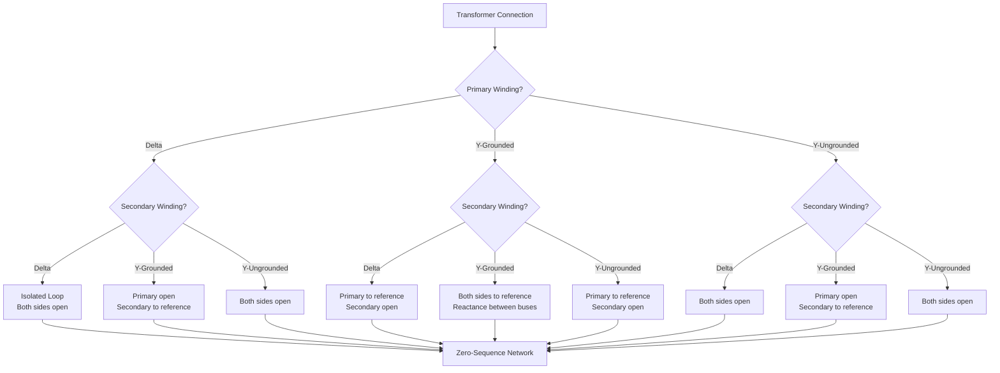

### 5.9 Lecture 51 Recap

- Zero-sequence networks for transformers depend critically on winding connections and grounding
- Grounded Y provides a zero-sequence path; ungrounded Y and Δ do not
- For a balanced Y-load with mutual coupling: Z₁ = Z₂ = Zₛ − Zₘ, Z₀ = Zₛ + 2Zₘ
- Delta currents are related to line currents by I_delta = (1/3)(I_line1 − I_line2)
- Per-unit conversion requires careful base selection across transformer boundaries
- Neutral reactors appear as 3Zₙ in zero-sequence networks

---

## Lecture 52: Sequence Network Construction Examples

### 6.1 Physical Intuition: Building Sequence Networks

The key insight from Lecture 51 is that sequence networks are not arbitrary constructions — they follow directly from the physical behavior of each component. The positive-sequence network is just the normal circuit diagram with voltage sources. The negative-sequence network is identical but without sources. The zero-sequence network requires careful attention to grounding and winding connections.

When constructing sequence networks for a complete power system, we must:
1. Identify all components (generators, transformers, transmission lines, motors, loads)
2. Determine the sequence impedances for each component
3. Connect the components according to the system topology
4. Apply the special rules for zero-sequence (grounding, delta connections, neutral impedance)

The systematic approach ensures that no path is missed and no incorrect connection is made.

### 6.2 Positive-Sequence Network Construction

**Construction details:**
- Reference bus established
- Generator: E_g'' with j0.20 p.u. reactance
- Transformer T₁ (d to e): j0.0805 p.u.
- Transmission line (e to f): j0.33 p.u.
- Transformer T₂ (f to g): j0.0805 p.u.
- Motor-1: j0.345 p.u. with E_m1''
- Motor-2: j0.69 p.u. with E_m2''
- Motors connected in parallel at common bus (points p and q)

The positive-sequence network is essentially the one-line diagram redrawn as a three-phase equivalent, with each component represented by its positive-sequence impedance. Voltage sources are included for all rotating machines (generator and motors), representing their internal EMFs.

### 6.3 Negative-Sequence Network Construction

**Key points:**
- **No voltage sources** in negative-sequence network
- All impedances identical to positive-sequence network
- Same topology, same parameter values

The negative-sequence network represents how the system responds to negative-sequence currents. Since generators produce only positive-sequence voltages, there are no negative-sequence sources. The network is passive, consisting only of impedances. For most components, the negative-sequence impedance equals the positive-sequence impedance. For rotating machines, the negative-sequence reactance is typically assumed equal to the subtransient reactance, as stated in the problem.

### 6.4 Zero-Sequence Network Construction

**Key construction decisions:**
- **Generator side:** Y-grounded, Δ on transformer side → connect generator zero-sequence reactance (j0.06) and 3Zₙ (j3.10) to reference bus; **open** at Δ side
- **Transmission line section:** Both transformer Y-sides grounded → zero-sequence current path exists; connect to reference bus
  - Transformer T₁: j0.0805
  - Line zero-sequence: j0.99
  - Transformer T₂: j0.0805
- **Motor-1:** Ungrounded → zero-sequence reactance (j0.082) **not connected** to reference bus
- **Motor-2:** Grounded → connect zero-sequence reactance (j0.164) and 3Zₙ (j3.10) to reference bus

**Instructor's emphasis:** "Only zero sequence is the major issue positive and negative is simple as same as before."

The zero-sequence network is the most challenging to construct because it requires careful attention to:
1. Which components provide a path to ground
2. Which components are isolated from ground
3. The factor of 3 for neutral impedances
4. The open-circuit behavior at delta windings

### 6.5 Zero-Sequence Network Drawing Exercises

#### Exercise 1: System with Ungrounded Motor (Figure 11)

**System configuration:**
- Generator: grounded (with Zₙ)
- Transformer: Δ-Y (Y grounded)
- Second transformer: Y-Δ (Y grounded)
- Motor: Y-connected, **ungrounded**

**Zero-sequence network construction:**
- Generator: 3Zₙ + Z_g0 connected to reference
- Open at Δ side (isolation)
- Transformer T₁: Z_T1
- Line: Z_L0
- Transformer T₂: Z_T2
- Motor: Z_m0 **not connected** to reference (ungrounded)

The key feature here is that the motor, being ungrounded, does not provide a zero-sequence path to ground. The zero-sequence current path ends at the motor terminals.

#### Exercise 2: System with Grounded Motor (Figure 13)

**Difference from previous:** Motor is now **grounded**.

**Zero-sequence network construction:**
- Generator: Z_g0 (no Zₙ assumed, Zₙ = 0)
- Open at Δ side
- Transformer T₁: Z_T1
- Line: Z_L0
- Transformer T₂: Z_T2
- Motor: Z_m0 **connected** to reference bus

**Point labeling:** p, q, r marked for clarity (q and r on transmission line)

The grounded motor provides a complete zero-sequence path from the generator through the transformers and line to the motor and ground.

#### Exercise 3: Double-Circuit Line System (Figure 15)

**Given data:**
- G₁: 100 MVA, 11 kV, X_g10 = 0.05 p.u.
- G₂: 100 MVA, 11 kV, X_g20 = 0.05 p.u.
- T₁: 100 MVA, 11/220 kV, X_T1 = 0.06 p.u.
- T₂: 100 MVA, 220/11 kV, X_T2 = 0.07 p.u.
- Line-1: X_L10 = 0.3 p.u.
- Line-2: X_L20 = 0.3 p.u.
- Both generators have Zₙ = j0.02 p.u. (so 3Zₙ = j0.06)

**Zero-sequence network construction:**
- Generator-1: 3Zₙ (j0.06) + X_g10 (j0.05) connected to reference
- Open at Δ side
- Transformer T₁: j0.06
- Double-circuit line: two parallel branches, each j0.3
- Transformer T₂: j0.07
- Generator-2: 3Zₙ (j0.06) + X_g20 (j0.05) connected to reference

The double-circuit line creates two parallel paths for zero-sequence current. The equivalent reactance of the two parallel lines is j0.15 p.u.

**Instructor's exercise suggestion:** "instead of Δ-Y you take Y-Y transformer, but Y-grounded both this side primary side, you take Y and Y-grounded and please draw the zero sequence network of your own."

#### Exercise 4: All-Grounded System with Ungrounded Motor (Figure 17)

**Given data:**
- Generator: X_g0 given
- Motor: X_m0 given
- Transformer T₁: X_T1 given
- Transformer T₂: X_T2 given
- Line-1 = Line-2: X_L10 = X_L20 (equal reactances)

**Zero-sequence network construction:**
- Generator: j0.05 connected to reference (no Zₙ given)
- Transformer T₁: j0.12
- Double-circuit line: two parallel branches, each j0.7
- Transformer T₂: j0.10
- Motor: j0.03 **not connected** to reference (ungrounded) — **open at this point**

**Instructor's caution:** "don't make the mistake, suppose you will come up to this after that you will make connection like this and this is ungrounded you will make isolation it is not like that."

The instructor emphasizes that even though the transformers are all grounded, the ungrounded motor still creates an open circuit in the zero-sequence network. The zero-sequence current cannot flow into the motor because there is no return path.

#### Exercise 5: Complex Multi-Transformer System (Figure 19)

**System configuration:**
- Generator-1: star grounded (with Z_g, so 3Z_g appears)
- Transformer: Δ-Y (Y grounded)
- Second transformer: Y-Δ (ungrounded Δ)
- Third transformer: Δ-Y (Y grounded)
- Fourth transformer: Y-Δ (Y not grounded on one side)
- Generator-2: Y-connected, **ungrounded**

**Zero-sequence network construction:**
- Generator-1: 3Z_g + X_g10 connected to reference
- Open at Δ side (isolation at points l, m)
- Transformer T₁: X_T1
- Line-1: X_L10
- Transformer T₂: X_T2 — **open** (Y not grounded)
- Generator-2: X_g20 **not connected** to reference (ungrounded)
- Transformer T₃: X_T3
- Line-2: X_L20
- Transformer T₄: X_T4 — connected to reference (Y grounded)

**Point labeling:** p, l, m, n, e, q, g, a, f, u marked for clarity

This complex example demonstrates how the zero-sequence network can split into multiple isolated sections. The ungrounded Y on transformer T₂ and the ungrounded generator-2 create breaks in the zero-sequence path, isolating different sections of the network.

### 6.6 Summary of Sequence Network Construction Rules

The instructor provides a clear summary:

- **Positive sequence:** Draw as the normal circuit diagram with voltage sources.
- **Negative sequence:** Same as positive sequence but **without voltage sources** (all impedances identical).
- **Zero sequence:** Must be drawn carefully considering:
  - Grounded vs. ungrounded Y connections
  - Δ connections (circulating current, cannot leave terminals → open)
  - 3Zₙ for neutral grounding impedances

**Instructor's summary:** "positive sequence when you are drawing the positive sequences same as is the way you draw the circuit diagram with voltage sources. So, that is very simple. And for negative sequence actually almost say it is same all the positive negative sequence impedance as for all the components more or less same it is same. So, only voltage sources should not be there."

### 6.7 Introduction to Unbalanced Faults

**Key points:**
- Three-phase faults are **rare** in occurrence
- **Shunt-type faults** (common):
  1. Single line-to-ground (L-G)
  2. Line-to-line (L-L)
  3. Double line-to-ground (L-L-G)
- **Series-type faults** (rare): open conductor faults
- Single line-to-ground fault near generator terminals can be **as severe as three-phase fault**
- Simultaneous occurrence of two different fault types is **very rare** (probability negligible)

**Importance of unbalanced fault analysis:**
- Relay setting
- Single-phase switching
- System stability studies

The classification of faults is essential for protection engineers. While three-phase faults are the most severe in terms of fault current magnitude, single line-to-ground faults are the most common. The analysis of unbalanced faults using symmetrical components allows protection engineers to set relays correctly and ensure that the system can withstand and clear faults safely.

### 6.8 Mermaid Diagram: Sequence Network Construction Workflow

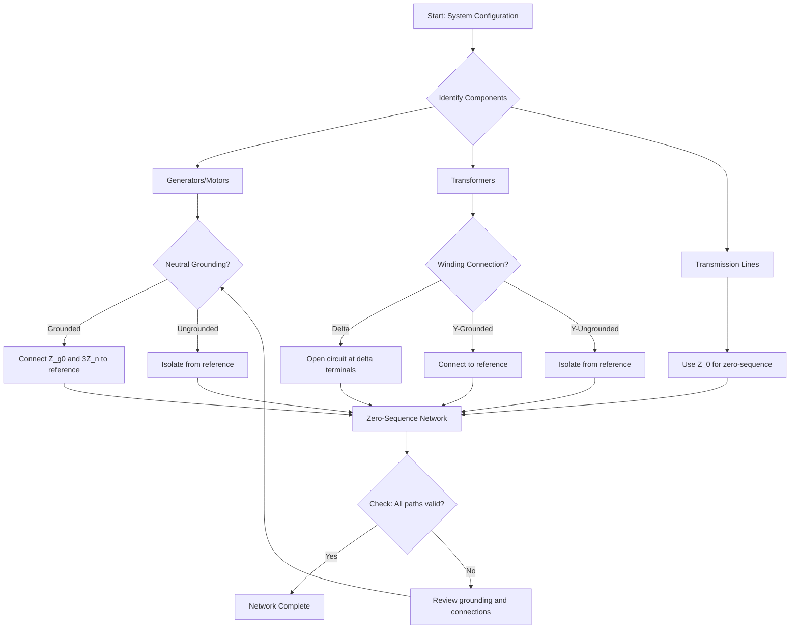

### 6.9 Lecture 52 Recap

- Positive-sequence networks are identical to the normal circuit diagram with sources
- Negative-sequence networks have the same topology but no sources
- Zero-sequence networks require careful attention to:
  - Grounded Y: connect to reference
  - Ungrounded Y: isolate from reference
  - Delta: open circuit at terminals
  - Neutral impedance: multiply by 3
- Unbalanced faults are more common than three-phase faults
- L-G faults can be as severe as three-phase faults near generator terminals

---

## Lecture 53: Fault Analysis - L-G and L-L Faults

### 7.1 Physical Intuition: Why Sequence Networks Connect the Way They Do

The beauty of symmetrical components is that unbalanced faults can be analyzed by connecting the sequence networks in specific configurations. The connection pattern is determined entirely by the boundary conditions at the fault point. Once we understand this, we can analyze any fault type.

The general procedure for fault analysis using symmetrical components is:
1. Write the boundary conditions at the fault point (in terms of phase quantities)
2. Transform the boundary conditions to sequence quantities
3. Determine the sequence network connection that satisfies the sequence boundary conditions
4. Solve the resulting circuit for sequence currents and voltages
5. Transform back to phase quantities

This procedure is systematic and can be applied to any fault type, including simultaneous faults.

### 7.2 Review of Fault Types

- **Shunt faults:** L-G, L-L, L-L-G (all common in transmission systems)
- **Series faults:** Open conductor (one or two conductors broken) — rare but will be analyzed

### 7.3 Single Line-to-Ground (L-G) Fault Analysis

#### System Configuration and Boundary Conditions

**Assumptions:**
- Generator initially on no-load
- Fault at phase a through impedance Z_f

**Boundary conditions:**

$$I_b = 0 \quad \dots (1)$$

$$I_c = 0 \quad \dots (2)$$

$$V_a = Z_f I_a \quad \dots (3)$$

These boundary conditions state that phases b and c are open (no current flows), and the voltage of phase a at the fault point equals the fault impedance times the fault current.

#### Symmetrical Components of Fault Currents

$$\begin{pmatrix} I_{a1} \\ I_{a2} \\ I_{a0} \end{pmatrix} = \frac{1}{3} \begin{pmatrix} 1 & \beta & \beta^2 \\ 1 & \beta^2 & \beta \\ 1 & 1 & 1 \end{pmatrix} \begin{pmatrix} I_a \\ 0 \\ 0 \end{pmatrix}$$

**Result:**

$$I_{a1} = I_{a2} = I_{a0} = \frac{1}{3} I_a$$

**Physical meaning:** For an L-G fault on phase a, all three sequence currents are equal. This means the sequence networks must be connected in **series**.

#### Voltage Equation

$$V_a = V_{a1} + V_{a2} + V_{a0} = Z_f I_a = 3Z_f I_{a1}$$

(Since Iₐ = 3Iₐ₁ from the current relation)

**Key insight:** All sequence currents are equal → **series connection** of sequence networks through impedance 3Z_f.

**Special cases:**
- If generator is solidly grounded: Zₙ = 0
- If bolted fault: Z_f = 0

#### Equivalent Circuit Connection

**Construction:**
- Positive sequence: E_a, Z₁, Iₐ₁, Vₐ₁
- Negative sequence: Z₂, Iₐ₂, Vₐ₂ (no source)
- Zero sequence: Z₀, Iₐ₀, Vₐ₀ (no source)
- Connected in **series** with 3Z_f completing the loop

**From the figure:**

$$I_{a1} = \frac{E_a}{Z_1 + Z_2 + Z_0 + 3Z_f}$$

**Fault current:**

$$I_a = 3I_{a1} = \frac{3E_a}{Z_1 + Z_2 + Z_0 + 3Z_f}$$

The series connection means that the same current flows through all three sequence networks. The total impedance seen by the positive-sequence source is the sum of all three sequence impedances plus the fault impedance (multiplied by 3).

#### Voltage of Line b to Ground Under L-G Fault

$$V_b = \beta^2 V_{a1} + \beta V_{a2} + V_{a0}$$

**From sequence networks (KVL):**
- Vₐ₁ = Eₐ − Z₁Iₐ₁
- Vₐ₂ = −Z₂Iₐ₂
- Vₐ₀ = −Z₀Iₐ₀

**Substituting:**

$$V_b = \beta^2(E_a - Z_1 \cdot \frac{1}{3}I_a) + \beta(-Z_2 \cdot \frac{1}{3}I_a) + (-Z_0 \cdot \frac{1}{3}I_a)$$

**After simplification:**

$$V_b = E_a \cdot \frac{[3\beta^2 Z_f + Z_2(\beta^2 - \beta) + Z_0(\beta^2 - 1)]}{Z_1 + Z_2 + Z_0 + 3Z_f}$$

#### Voltage of Line c to Ground Under L-G Fault

$$V_c = \beta V_{a1} + \beta^2 V_{a2} + V_{a0}$$

**After substitution and simplification:**

$$V_c = E_a \cdot \frac{[3\beta Z_f + Z_2(\beta - \beta^2) + Z_0(\beta - 1)]}{Z_1 + Z_2 + Z_0 + 3Z_f}$$

**Special case:** If Z_f = 0, the 3βZ_f and 3β²Z_f terms drop out.

These voltage expressions are important for determining the insulation requirements and for setting protective relays. The healthy phase voltages can rise significantly during an L-G fault, potentially stressing insulation.

### 7.4 Line-to-Line (L-L) Fault Analysis

#### System Configuration and Boundary Conditions

**Boundary conditions at fault point:**
- Iₐ = 0
- I_b + I_c = 0 (currents in opposite directions)
- V_b − V_c = Z_f I_b (from KVL)

The L-L fault involves only phases b and c. Phase a is unaffected (no current flows). The voltage difference between phases b and c equals the fault impedance times the current flowing through it.

#### Symmetrical Components of Fault Currents

$$\begin{pmatrix} I_{a1} \\ I_{a2} \\ I_{a0} \end{pmatrix} = \frac{1}{3} \begin{pmatrix} 1 & \beta & \beta^2 \\ 1 & \beta^2 & \beta \\ 1 & 1 & 1 \end{pmatrix} \begin{pmatrix} 0 \\ I_b \\ -I_b \end{pmatrix}$$

**Results:**
- Iₐ₁ = (1/3)(β − β²)I_b
- Iₐ₂ = (1/3)(β² − β)I_b = −Iₐ₁
- **Iₐ₀ = 0** (no zero-sequence current for L-L fault)

**Physical meaning:** The L-L fault has no zero-sequence component. The positive and negative sequence currents are equal in magnitude but opposite in sign.

#### Symmetrical Components of Voltages

$$\begin{pmatrix} V_{a1} \\ V_{a2} \\ V_{a0} \end{pmatrix} = \frac{1}{3} \begin{pmatrix} 1 & \beta & \beta^2 \\ 1 & \beta^2 & \beta \\ 1 & 1 & 1 \end{pmatrix} \begin{pmatrix} V_a \\ V_b \\ V_b - Z_f I_b \end{pmatrix}$$

#### Derivation of Key Relations

From the voltage equations:

$$3V_{a1} = V_a + (\beta + \beta^2)V_b - \beta^2 Z_f I_b \quad \dots (21)$$

$$3V_{a2} = V_a + (\beta + \beta^2)V_b - \beta Z_f I_b \quad \dots (22)$$

**Subtracting:**

$$3(V_{a1} - V_{a2}) = (\beta - \beta^2)Z_f I_b$$

**Using the identity:** β − β² = j√3

**From the current relation:**

$$I_{a1} = \frac{1}{3}(\beta - \beta^2)I_b = \frac{j\sqrt{3}}{3}I_b$$

**Therefore:**

$$I_b = -j\sqrt{3} I_{a1}$$

**Substituting into the voltage difference:**

$$V_{a1} - V_{a2} = Z_f I_{a1}$$

#### Equivalent Circuit Connection

**Key relations:**
- Iₐ₂ = −Iₐ₁ (opposition)
- Vₐ₁ − Vₐ₂ = Z_f Iₐ₁
- Iₐ₀ = 0 (zero-sequence network does not appear)

**Connection:** Positive and negative sequence networks connected **in opposition** (plus to plus, minus to minus) through Z_f.

**From the figure:**

$$I_{a1} = \frac{E_a}{Z_1 + Z_2 + Z_f}$$

#### Fault Current

$$I_b = -I_c = \frac{-j\sqrt{3}E_a}{Z_1 + Z_2 + Z_f}$$

The L-L fault current is √3 times the positive-sequence current, reflecting the phase relationship between the sequence and phase quantities.

### 7.5 Double Line-to-Ground (L-L-G) Fault - Introduction

#### System Configuration

**Boundary conditions:**
- Iₐ = 0
- V_b = V_c (phases b and c at same potential)
- V_b = V_c = Z_f(I_b + I_c)

#### Key Relation

$$V_b = V_c = (I_b + I_c)Z_f = 3Z_f I_{a0} \quad \dots (31)$$

(Since I_b + I_c = 3Iₐ₀ from the transformation matrix with Iₐ = 0)

This relation will be used in Lecture 54 to derive the complete sequence network connection for the L-L-G fault.

### 7.6 Mermaid Diagram: Fault Type to Sequence Network Connection

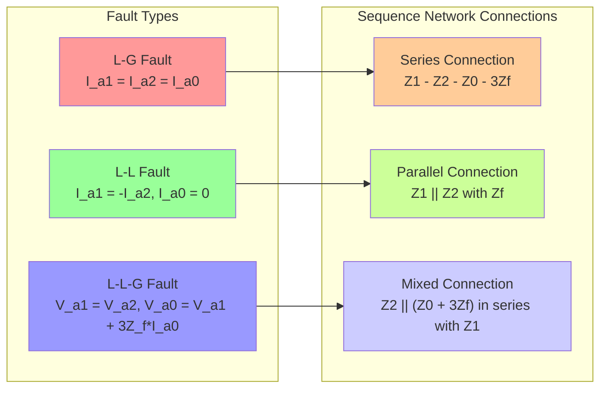

### 7.7 Lecture 53 Recap

- L-G fault: All sequence currents equal → series connection of sequence networks
- L-G fault current: Iₐ = 3Eₐ/(Z₁ + Z₂ + Z₀ + 3Z_f)
- L-L fault: No zero-sequence current → zero-sequence network absent
- L-L fault: Positive and negative networks in opposition through Z_f
- L-L fault current: I_b = −j√3·Eₐ/(Z₁ + Z₂ + Z_f)
- L-L-G fault: V_b = V_c = 3Z_f·Iₐ₀ (key relation for further analysis)

---

## Lecture 54: L-L-G Fault Analysis and Open Conductor Faults

### 8.1 Physical Intuition: Completing the L-L-G Fault Analysis

In Lecture 53, we established the boundary conditions for the L-L-G fault. Now we need to derive the sequence network connection. The key insight is that the boundary conditions determine how the sequence networks connect.

For the L-L-G fault:
- The fault involves phases b and c shorted together and then to ground through Z_f
- Phase a is open (no current)
- The voltage of phases b and c at the fault point are equal
- The fault current to ground is the sum of the b and c phase currents

### 8.2 L-L-G Fault - Voltage Relations

#### Verification of I_b + I_c = 3Iₐ₀

$$\begin{pmatrix} I_{a1} \\ I_{a2} \\ I_{a0} \end{pmatrix} = \frac{1}{3} \begin{pmatrix} 1 & \beta & \beta^2 \\ 1 & \beta^2 & \beta \\ 1 & 1 & 1 \end{pmatrix} \begin{pmatrix} 0 \\ I_b \\ I_c \end{pmatrix}$$

From the third row: Iₐ₀ = (1/3)(I_b + I_c), therefore **I_b + I_c = 3Iₐ₀**

#### Symmetrical Components of Voltages

$$\begin{pmatrix} V_{a1} \\ V_{a2} \\ V_{a0} \end{pmatrix} = \frac{1}{3} \begin{pmatrix} 1 & \beta & \beta^2 \\ 1 & \beta^2 & \beta \\ 1 & 1 & 1 \end{pmatrix} \begin{pmatrix} V_a \\ V_b \\ V_c \end{pmatrix}$$

With V_c = V_b:

$$V_{a1} = V_{a2} = \frac{1}{3}[V_a + (\beta^2 + \beta)V_b]$$

$$V_{a0} = \frac{1}{3}(V_a + 2V_b)$$

#### Derivation of V_a0 - V_a1

**Subtracting the equations for V_a1 and V_a0:**

$$V_{a0} - V_{a1} = \frac{1}{3}(2 - \beta + \beta^2)V_b$$

**Using the identity:** 1 + β + β² = 0

$$V_{a0} - V_{a1} = \frac{1}{3}(3 - (1 + \beta + \beta^2))V_b = \frac{1}{3} \cdot 3V_b = V_b$$

**Therefore:**

$$V_{a0} = V_{a1} + 3Z_f I_{a0}$$

(Since V_b = 3Z_f Iₐ₀ from the boundary condition)

### 8.3 Sequence Network Connection for L-L-G Fault

**Governing equations:**
- **Vₐ₁ = Vₐ₂** (positive and negative sequence voltages equal)
- **Vₐ₀ = Vₐ₁ + 3Z_f·Iₐ₀** (zero sequence voltage relation)
- **Iₐ₁ + Iₐ₂ + Iₐ₀ = 0** (sum of sequence currents equals zero)

**Physical intuition for circuit construction:**
- Vₐ₁ = Vₐ₂ suggests positive and negative sequence networks are connected **in parallel**
- Iₐ₁ + Iₐ₂ + Iₐ₀ = 0 requires a junction point where all three sequence currents meet (KCL)
- Vₐ₀ = Vₐ₁ + 3Z_f·Iₐ₀ places the **3Z_f** impedance in the zero sequence path

**Circuit construction logic:**
1. Draw positive sequence network with Eₐ and Z₁
2. Draw negative sequence network with Z₂
3. Draw zero sequence network with Z₀
4. Connect all three at a common junction point where Iₐ₁ + Iₐ₂ + Iₐ₀ = 0
5. Insert 3Z_f in the zero sequence path because Vₐ₀ = Vₐ₁ + 3Z_f·Iₐ₀
6. If Z_f = 0, the connection reduces to the simpler case

**KVL verification:**
- Loop through positive and negative networks: −Vₐ₁ + Vₐ₂ = 0, confirming Vₐ₁ = Vₐ₂
- Loop through zero and positive networks: Vₐ₀ − 3Z_f·Iₐ₀ − Vₐ₁ = 0, confirming Vₐ₀ = Vₐ₁ + 3Z_f·Iₐ₀
- At junction points: Iₐ₁ + Iₐ₂ + Iₐ₀ = 0

**Lecturer's guidance:** "From your intuition only you have to make the circuit connection correct. So from this condition different type of faults will be there, so accordingly you have to make it. Suppose all the conditions you have to make and accordingly you have to this thing. Different places, different way this diagram is given, but I prefer always this way. Make positive negative zero, after that look into the equation and accordingly you try to make it."

### 8.4 Equivalent Circuit for L-L-G Fault

**Equivalent impedance of parallel branches:**
- Negative sequence (Z₂) and zero sequence (Z₀ + 3Z_f) are in parallel
- Equivalent impedance: **Z₂(Z₀ + 3Z_f) / (Z₂ + Z₀ + 3Z_f)**

**Derived current expressions:**

$$\mathbf{I_{a1}} = \frac{\mathbf{E_a}}{Z_1 + \frac{Z_2(Z_0 + 3Z_f)}{Z_2 + Z_0 + 3Z_f}}$$

$$\mathbf{I_{a2}} = -\left(\frac{\mathbf{E_a} - \mathbf{Z_1}\mathbf{I_{a1}}}{\mathbf{Z_2}}\right)$$

$$\mathbf{I_{a0}} = -\left(\frac{\mathbf{E_a} - \mathbf{Z_1}\mathbf{I_{a1}}}{\mathbf{Z_0} + 3\mathbf{Z_f}}\right)$$

**Derivation via KVL:**
- KVL in loop: Z₁Iₐ₁ − Z₂Iₐ₂ − Eₐ = 0 → Iₐ₂ = −(Eₐ − Z₁Iₐ₁)/Z₂
- KVL in second loop: Z₁Iₐ₁ − Iₐ₀(Z₀ + 3Z_f) − Eₐ = 0 → Iₐ₀ = −(Eₐ − Z₁Iₐ₁)/(Z₀ + 3Z_f)

**Note:** Since Vₐ₁ = Vₐ₂, we can also write Vₐ₀ = Vₐ₂ + 3Z_f·Iₐ₀, confirming that negative and zero sequence networks are in parallel with fault impedance in the zero sequence path.

### 8.5 Open Conductor Faults

#### One Conductor Open

**Physical scenario:** Phase a conductor is open (broken); phases b and c remain continuous.

**Boundary conditions:**
- V_bb′ = V_cc′ = 0 (b and b′ are common points; c and c′ are common points)
- Iₐ = 0 (phase a conductor is broken)

**In terms of symmetrical components:**

$$\begin{bmatrix} V_{aa'1} \\ V_{aa'2} \\ V_{aa'0} \end{bmatrix} = \frac{1}{3} \begin{bmatrix} 1 & \beta & \beta^2 \\ 1 & \beta^2 & \beta \\ 1 & 1 & 1 \end{bmatrix} \begin{bmatrix} V_{aa'} \\ V_{bb'} \\ V_{cc'} \end{bmatrix} = \frac{1}{3} \begin{bmatrix} 1 & \beta & \beta^2 \\ 1 & \beta^2 & \beta \\ 1 & 1 & 1 \end{bmatrix} \begin{bmatrix} V_{aa'} \\ 0 \\ 0 \end{bmatrix}$$

$$\therefore V_{aa'1} = V_{aa'2} = V_{aa'0} = \frac{1}{3} V_{aa'}$$

$$I_{a1} + I_{a2} + I_{a0} = 0$$

**Circuit interpretation:** Equations suggest a **parallel connection** of sequence networks.

**Key insight:** All sequence voltages are equal (parallel connection), and the sum of sequence currents is zero (KCL at the junction point).

#### Two Conductors Open

**Physical scenario:** Phases b and c conductors are open; phase a remains continuous.

**Boundary conditions:**
- V_aa′ = 0 (a and a′ are common points)
- I_b = 0, I_c = 0

**In terms of symmetrical components:**

$$V_{aa'1} + V_{aa'2} + V_{aa'0} = 0$$

$$I_{a1} = I_{a2} = I_{a0} = \frac{1}{3} I_a$$

**Circuit interpretation:** Equal currents suggest a **series connection** of sequence networks.

**Connection pattern:** Positive to negative, negative to zero sequence — all in series with F-F′ terminals connected accordingly.

**Lecturer's note:** "Although there are very rare phenomena right there are very rare phenomena, and but for the sake of completeness I took this one."

### 8.6 Worked Example: Line-to-Ground Fault on the Example-4 System

**Problem setup:**
- Same problem as 'Example-4' of the symmetrical component topic
- Same diagram and all data remain same
- Fault at point 'g' — solid line to ground fault (fault impedance = 0)
- Motor terminal voltage was 10 kV
- Fault occurred on the motor side

**Given data (from Example-4 of symmetrical components):**
- Base voltage: 11 kV
- Pre-fault voltage: V_f⁰ = 10/11 = 0.909 p.u.
- Pre-fault currents neglected
- E_g″ = E_m1″ = E_m2″ = V_f⁰ = 0.909 p.u.

**Sequence network parameters (computed in Example-4):**
- Positive sequence Thevenin equivalent: Z₁ = j0.172 p.u.
- Negative sequence: Z₂ = Z₁ = j0.172 p.u.
- Zero sequence: Z₀ = j3.264 p.u.

**Computation of Z₁:**

$$Z_1 = \frac{j(0.491+0.20) \times 0.23}{(0.491+0.20) + 0.23} = j0.172 \text{ p.u.}$$

**Key observation about zero sequence current path:**
- Generator side has isolation (Δ winding) — no zero sequence current flows from generator
- Motor side provides a path for zero sequence current (motor-2 is grounded)
- "All of Iₐ₀ flows towards 'g' from motor-2 side. Therefore, no part of Iₐ₀ flows towards 'g' from the generator side, i.e. 0.0."

### 8.7 Mermaid Diagram: L-G Fault Analysis Workflow

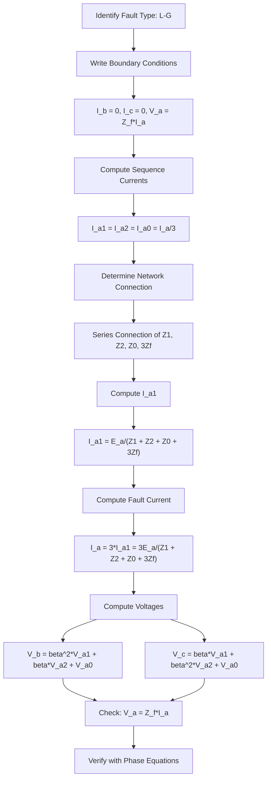

### 8.8 Lecture 54 Recap

- L-L-G fault: Vₐ₁ = Vₐ₂ and Vₐ₀ = Vₐ₁ + 3Z_f·Iₐ₀
- L-L-G fault: Negative and zero sequence networks in parallel, then in series with positive
- L-L-G fault current: Iₐ₁ = Eₐ/[Z₁ + Z₂(Z₀ + 3Z_f)/(Z₂ + Z₀ + 3Z_f)]
- One conductor open: Parallel connection of sequence networks
- Two conductors open: Series connection of sequence networks
- The L-G fault example shows how to apply sequence networks to a complete system

---

## Lecture 55: Numerical Examples and Stability Foundations

### 9.1 Continuation of the L-G Fault Example

**Fault current calculation:**

$$\mathbf{I_{a1}} = \frac{V_f^0}{Z_1 + Z_2 + Z_0} = \frac{0.909\angle 0°}{j(0.172+0.172+3.264)} = -j0.252 \text{ p.u.}$$

Since it is a series circuit: Iₐ₁ = Iₐ₂ = Iₐ₀ = −j0.252 p.u.

**Fault current:**

$$\text{Fault current} = 3I_{a0} = 3 \times (-j0.252) = -j0.756 \text{ p.u.}$$

### 9.2 Current Distribution in the Network

**Component of Iₐ₁ flowing towards 'g' from generator side:**

$$= -j0.252 \times \frac{0.23}{0.94} = -j0.063 \text{ p.u.}$$

**Component of Iₐ₁ flowing towards 'g' from motor side:**

$$= -j0.252 \times \frac{0.691}{0.921} = -j0.189 \text{ p.u.}$$

**Component of Iₐ₂ from generator side:** −j0.063 p.u. (same as Iₐ₁ because negative sequence network has same impedances)

**Component of Iₐ₂ from motor side:** −j0.189 p.u.

**Component of Iₐ₀:** All flows from motor-2 side; generator side contribution = 0

### 9.3 Fault Currents from Generator Side

Using the transformation:

$$\begin{pmatrix} I_a \\ I_b \\ I_c \end{pmatrix} = \begin{pmatrix} 1 & \beta^2 & \beta \\ 1 & \beta & \beta^2 \\ 1 & 1 & 1 \end{pmatrix} \begin{pmatrix} I_{a1} \\ I_{a2} \\ I_{a0} \end{pmatrix}$$

With Iₐ₁ = −j0.063, Iₐ₂ = −j0.063, Iₐ₀ = 0 (generator side):

- **Iₐ = −j0.126 p.u.** (since Iₐ₀ = 0)
- **I_b = −j0.063(β² + β) = −j0.063(−1) = j0.063 p.u.** (using β² + β = −1)
- **I_c = −j0.063(β² + β) = j0.063 p.u.**

### 9.4 Fault Currents from Motor Side

With Iₐ₁ = −j0.189, Iₐ₂ = −j0.189, Iₐ₀ = −j0.252:

- **Iₐ = −j0.63 p.u.**
- **I_b = −j0.189(β² + β) − j0.252 = −j0.189(−1) − j0.252 = j0.189 − j0.252 = −j0.063 p.u.**
- **I_c = −j0.189(β² + β) − j0.252 = −j0.063 p.u.**

**Physical interpretation:** The fault current flows predominantly from the motor side because the generator side is isolated from zero-sequence by the Δ winding of transformer T₁.

### 9.5 Exercise Given in Lecture

**Exercise:** Take the same diagram and same parameters as 'Example-4' of the previous topic. Take a fault at point near 'e' (not at 'g'). Draw the circuit connection and compute:
- Iₐ₁, Iₐ₂, Iₐ₀
- Fault current from generator side
- Fault current from motor side

**Note:** At that time, do not consider the fault at 'g'.

### 9.6 Worked Example 2: Two Generators in Parallel - Line-to-Ground Fault

**Problem Statement:**
Two 11 kV, 12 MVA, three-phase Y-connected generators operate in parallel. The positive, negative, and zero sequence reactances of each are j0.09, j0.05, and j0.04 p.u. respectively. A single line-to-ground fault occurs at the terminals of one of the generators. Find:
- (i) The fault current
- (ii) Current in the grounding resistor
- (iii) Voltage across the grounding resistor

**Given:**
- Rₙ = 1 Ω (grounding resistance)
- Generator rating: 11 kV, 12 MVA

**Step 1: Per-unit calculations**

Since generators are identical and in parallel:
- X₁ = j0.09/2 = j0.045 p.u.
- X₂ = j0.05/2 = j0.025 p.u.
- Z₀ = j0.04 + 3Rₙ (converted to p.u.)

**Step 2: Zero sequence impedance with grounding resistance**

$$Z_0 = j0.04 + 3R_n = j0.04 + \frac{3 \times 1}{(11^2/12)}$$

$$\therefore Z_0 = (0.297 + j0.04) \text{ p.u.}$$

**Step 3: Fault current calculation**

$$I_f = I_a = 3I_{a1} = \frac{3E_a}{(Z_1 + Z_2 + Z_0)} \quad [\text{eqn. 7, } Z_f = 0]$$

$$\therefore I_f = \frac{3 \times 1\angle 0°}{(j0.045 + j0.025 + 0.297 + j0.04)}$$

$$\therefore I_f = 9.472\angle -23.32° \text{ p.u.}$$

**Step 4: Current in grounding resistor**

$$|I_f| = 9.472 \times \frac{12}{\sqrt{3} \times 11} \text{ kA} = 5.96 \text{ kA}$$

**Step 5: Voltage across grounding resistor**

$$= R_n|I_f| = \frac{1}{(11^2/12)} \times 9.472 = 0.939 \text{ p.u.}$$

$$= 0.939 \times \frac{11}{\sqrt{3}} \text{ kV} = 5.96 \text{ kV}$$

**Physical interpretation:** The grounding resistor limits the fault current and creates a voltage drop that can be used for protection purposes.

### 9.7 Worked Example 3: Double Line-to-Ground Fault (Rₙ = 0)

**Problem Statement (Ex-3):** For Example-2, assume that Rₙ = 0. Find the fault current in each phase and voltage of the healthy phase for a L-L-G fault on terminals of the generator.

**Given parameters (from Example-2 with Rₙ = 0):**
- Z₁ = X₁ = j0.045 p.u.
- Z₂ = X₂ = j0.025 p.u.
- Z₀ = j0.04 p.u. (since Rₙ = 0)
- Z_f = Rₙ = 0

**Step 1: Positive sequence current**

$$\mathbf{I_{a1}} = \frac{E_a}{Z_1 + \frac{Z_2(Z_0 + 3Z_f)}{Z_2 + Z_0 + 3Z_f}}$$

With Z_f = 0:

$$\mathbf{I_{a1}} = \frac{1\angle 0°}{j0.045 + \frac{j0.025 \times j0.04}{j0.025 + j0.04}} = -j16.56 \text{ p.u.}$$

**Step 2: Voltage calculations**

Since Z_f = 0, from the L-L-G fault relations:
- Vₐ₁ = Vₐ₂
- Vₐ₀ = Vₐ₁ + 3Z_f·Iₐ₀ = Vₐ₁ (since Z_f = 0)

Therefore: **Vₐ₁ = Vₐ₂ = Vₐ₀**

**Step 3: Computing Vₐ₁**

$$V_{a1} = E_a - I_{a1} \times Z_1 = 1\angle 0° - (-j16.56)(j0.045) = 0.2548 \text{ p.u.}$$

**Step 4: Negative sequence current**

$$I_{a2} = -\frac{V_{a2}}{Z_2} = -\frac{0.2548}{j0.025} = j10.192 \text{ p.u.}$$

**Step 5: Zero sequence current**

$$I_{a0} = -\frac{V_{a0}}{Z_0} = -\frac{0.2548}{j0.04} = j6.37 \text{ p.u.}$$

**Verification:** Iₐ₁ + Iₐ₂ + Iₐ₀ = −j16.56 + j10.192 + j6.37 = 0 ✓

**Step 6: Phase currents**

For I_b:

$$I_b = \beta^2 I_{a1} + \beta I_{a2} + I_{a0}$$

$$= (-0.5-j0.866)(-j16.56) + (-0.5+j0.866)(j10.192) + j6.37$$

$$\therefore I_b = 25.05\angle 157.6° \text{ p.u.}$$

For I_c:

$$I_c = \beta I_{a1} + \beta^2 I_{a2} + I_{a0}$$

$$\therefore I_c = 25.05\angle 22.4° \text{ p.u.}$$

**Step 7: Healthy phase voltage**

From the L-L-G fault relation: V_b = V_c = 3Z_f·Iₐ₀ = 0 (since Z_f = 0)

From the voltage transformation: Vₐ₀ = (1/3)(Vₐ + V_b + V_c) = (1/3)(Vₐ) since V_b = V_c = 0

Therefore: **Vₐ = 3Vₐ₀ = 3 × 0.2548 = 0.7644 p.u.**

**Lecturer's note:** "No need to recall these formulas or put it in your memories, but you have to little bit practice."

### 9.8 Simultaneous Faults: Line-to-Ground + Line-to-Line

**Problem Statement:**
A 3-phase synchronous generator with solidly grounded neutral is subjected to a line-to-line fault on phases 'b' and 'c', accompanied by a line-to-ground fault on phase 'a'. Assume the synchronous generator was running on no load. Develop and draw the sequence network simulating the above fault condition.

**Boundary conditions:**
- Vₐ = 0 (line-to-ground fault on phase a)
- V_b = V_c (line-to-line fault on phases b and c)
- I_b = −I_c (line-to-line fault condition)

**Step 1: Derivation of sequence relations**

From V_b = V_c:

$$\beta^2 V_{a1} + \beta V_{a2} + V_{a0} = \beta V_{a1} + \beta^2 V_{a2} + V_{a0}$$

$$(\beta^2 - \beta)V_{a1} = (\beta^2 - \beta)V_{a2}$$

$$\therefore V_{a1} = V_{a2}$$

From Vₐ = 0:

$$V_{a1} + V_{a2} + V_{a0} = 0$$

Substituting Vₐ₂ = Vₐ₁:

$$2V_{a1} + V_{a0} = 0$$

$$\therefore V_{a1} = V_{a2} = -\frac{V_{a0}}{2}$$

From I_b = −I_c:

$$\beta^2 I_{a1} + \beta I_{a2} + I_{a0} = -(\beta I_{a1} + \beta^2 I_{a2} + I_{a0})$$

$$(\beta^2 + \beta)I_{a1} + (\beta^2 + \beta)I_{a2} = -2I_{a0}$$

Using β² + β = −1:

$$-I_{a1} - I_{a2} = -2I_{a0}$$

$$\therefore I_{a1} + I_{a2} = 2I_{a0}$$

**Step 2: Sequence network connection**

- Vₐ₁ = Vₐ₂ → positive and negative sequence networks connected **in parallel**
- Iₐ₁ + Iₐ₂ = 2Iₐ₀ → zero sequence network connected **in series** with the parallel combination
- At the junction: Iₐ₁ and Iₐ₂ leave the terminal, 2Iₐ₀ enters (KCL)

**Circuit configuration:**
- Positive sequence network: Eₐ with Z₁
- Negative sequence network: Z₂
- Zero sequence network: Z₀
- Positive and negative in parallel (Vₐ₁ = Vₐ₂)
- Zero sequence in series with the parallel combination
- Current relation: Iₐ₁ + Iₐ₂ = 2Iₐ₀ at both junction points

**Lecturer's closing remark:** "With this we will close that unbalanced fault analysis."

### 9.9 Introduction to Power System Stability

The lecturer now transitions to power system stability. While the detailed stability analysis will be covered in subsequent weeks, the foundations are established here.

**Key concepts:**
- Stability refers to the ability of a power system to maintain synchronism after a disturbance
- The swing equation describes the rotor dynamics of synchronous machines
- Stability studies are essential for system planning and operation

**Types of stability:**
1. **Steady-state stability:** The ability of the system to maintain synchronism under small, gradual changes in load or generation
2. **Transient stability:** The ability of the system to maintain synchronism after a severe disturbance such as a fault, loss of generation, or loss of a major transmission line
3. **Dynamic stability:** The ability of the system to maintain synchronism under small disturbances with the action of automatic control devices (e.g., voltage regulators, governor systems)

**The swing equation:**
The swing equation describes the rotor dynamics of a synchronous machine:

$$M \frac{d^2\delta}{dt^2} = P_m - P_e$$

Where:
- M = inertia constant of the machine
- δ = rotor angle (electrical radians)
- P_m = mechanical power input
- P_e = electrical power output

This equation is fundamental to transient stability analysis. When a disturbance occurs, the electrical power output changes instantaneously, but the mechanical power input changes slowly (due to governor action). This imbalance causes the rotor to accelerate or decelerate, changing the rotor angle. If the rotor angle exceeds a critical value, the machine may lose synchronism.

### 9.10 Mermaid Diagram: Fault Analysis Summary

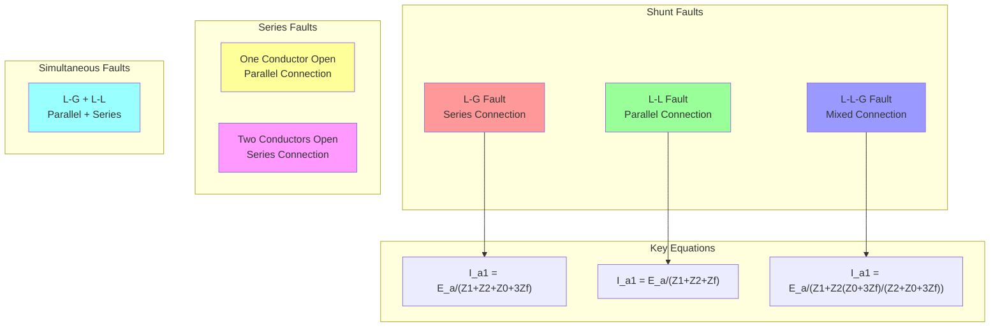

### 9.11 Lecture 55 Recap

- The L-G fault example demonstrates how to compute fault currents and their distribution in a complete system
- For the Example-4 system, the fault current flows predominantly from the motor side due to Δ isolation on the generator side
- Two generators in parallel: sequence impedances divide by 2
- Grounding resistance appears as 3Rₙ in the zero-sequence network
- L-L-G fault with Z_f = 0: Vₐ₁ = Vₐ₂ = Vₐ₀
- Simultaneous faults require careful derivation of boundary conditions and sequence relations
- Power system stability studies begin with understanding rotor dynamics

---

## Additional Comparison and Revision Tables

### Table 1: Sequence Network Connections for Different Fault Types

| Fault Type | Sequence Current Relation | Sequence Voltage Relation | Network Connection | Zero-Sequence Participation |
|---|---|---|---|---|
| Line-to-Ground (L-G) | Iₐ₁ = Iₐ₂ = Iₐ₀ = Iₐ/3 | Vₐ₁ + Vₐ₂ + Vₐ₀ = 3Z_f·Iₐ₀ | Series connection of all three networks | Yes — full participation |
| Line-to-Line (L-L) | Iₐ₁ = −Iₐ₂; Iₐ₀ = 0 | Vₐ₁ − Vₐ₂ = Z_f·Iₐ₁ | Positive and negative networks in opposition (parallel) | No — zero-sequence network absent |
| Double Line-to-Ground (L-L-G) | Iₐ₁ + Iₐ₂ + Iₐ₀ = 0 | Vₐ₁ = Vₐ₂; Vₐ₀ = Vₐ₁ + 3Z_f·Iₐ₀ | Z₂ in parallel with (Z₀ + 3Z_f), then in series with Z₁ | Yes — via Z₀ + 3Z_f path |
| One Conductor Open | Iₐ₁ + Iₐ₂ + Iₐ₀ = 0 | Vₐₐ′₁ = Vₐₐ′₂ = Vₐₐ′₀ | Parallel connection of all three networks | Yes — all networks in parallel |
| Two Conductors Open | Iₐ₁ = Iₐ₂ = Iₐ₀ = Iₐ/3 | Vₐₐ′₁ + Vₐₐ′₂ + Vₐₐ′₀ = 0 | Series connection of all three networks | Yes — full participation |

**Interpretation:** The fault type determines which sequence networks are interconnected and how. L-G faults force equal sequence currents (series connection), L-L faults eliminate zero-sequence current entirely, and L-L-G faults place the fault impedance 3Z_f in the zero-sequence path. Open-conductor faults follow dual patterns: one conductor open gives parallel connection (equal voltages), while two conductors open gives series connection (equal currents). Recognizing these patterns from boundary conditions is the key skill — the lecturer emphasises deriving connections from equations rather than memorising diagrams.

---

### Table 2: Transformer Zero-Sequence Network Construction Rules

| Transformer Connection | Zero-Sequence Current Path | Zero-Sequence Network Representation | Connection to Reference Bus |
|---|---|---|---|
| Y (ungrounded) – Δ | Cannot flow on star side; no neutral exists | Open on both sides | No connection on either side |
| Y (grounded) – Δ | Flows on grounded Y side; circulates in Δ but cannot leave terminals | Reactance connected on Y side; Δ side open | Y side connected to reference; Δ side open |
| Δ – Δ | Circulates within each Δ; cannot leave terminals | Small closed loop containing transformer zero-sequence impedance | Isolated loop — no connection to either side |
| Y (grounded) – Y (grounded) | Flows through both windings | Reactance connected on both sides | Both sides connected to reference |
| Y (grounded) – Y (ungrounded) | Flows only on grounded side | Reactance connected on grounded side only | Grounded side connected; ungrounded side open |

**Interpretation:** The critical physical fact is that zero-sequence current cannot leave Δ terminals — it merely circulates internally. This means Δ windings always create an "open" in the zero-sequence network at that point. Grounded Y windings provide a path to ground and connect to the reference bus; ungrounded Y windings provide no path and remain open. When neutral impedance Zₙ exists, it appears as 3Zₙ in the zero-sequence network — a factor of 3 that students frequently forget. These rules apply regardless of transformer rating or voltage level.

---

### Table 3: Per-Unit Conversion Checks and Common Errors

| Quantity | Correct Conversion | Common Error | Consequence of Error |
|---|---|---|---|
| Transformer reactance on new base | X_pu_new = X_pu_old × (S_new/S_old) × (V_old/V_new)² | Using only MVA ratio, forgetting voltage ratio | Wrong impedance value in sequence networks |
| Line reactance to per-unit | X_pu = X_Ω × S_base / V_base² | Using kV instead of kV² in denominator | Order-of-magnitude error in line impedance |
| Neutral impedance in zero-sequence | 3Zₙ appears in zero-sequence network | Using Zₙ instead of 3Zₙ | Underestimates zero-sequence impedance by factor of 3 |
| Grounding resistance to per-unit | R_pu = R_Ω / (V_base²/S_base) | Forgetting to convert ohms to per-unit | Mixing units in fault current calculations |
| Base voltage across transformer | V_base(new side) = V_base(old side) × turns ratio | Using nominal voltage instead of transformer ratio | Incorrect per-unit values on that side |
| Phase voltage from line voltage | V_phase = V_line/√3 | Using line voltage directly | Overestimates voltage by √3 |

**Interpretation:** Per-unit conversions are the most common source of numerical errors in fault calculations. The transformer reactance conversion requires both MVA and voltage ratios squared. Neutral impedance must be tripled in zero-sequence networks because all three phase currents return through the same neutral path. When converting grounding resistance to per-unit, use the base impedance V_base²/S_base. Finally, when converting per-unit voltages to actual kV, remember that per-unit values typically refer to phase voltages — use V_phase = V_line/√3 for line-to-line measurements.

---

### Table 4: Fault Current Formulas and Sequence Impedance Requirements

| Fault Type | Positive-Sequence Current Iₐ₁ | Fault Current I_f | Sequence Impedances Required | Special Conditions |
|---|---|---|---|---|
| Three-Phase (balanced) | Eₐ/Z₁ | Iₐ₁ = Eₐ/Z₁ | Z₁ only | No negative or zero-sequence involvement |
| Line-to-Ground (L-G) | Eₐ/(Z₁ + Z₂ + Z₀ + 3Z_f) | 3Eₐ/(Z₁ + Z₂ + Z₀ + 3Z_f) | Z₁, Z₂, Z₀ | All three networks in series; Iₐ₁ = Iₐ₂ = Iₐ₀ |
| Line-to-Line (L-L) | Eₐ/(Z₁ + Z₂ + Z_f) | I_b = −j√3·Eₐ/(Z₁ + Z₂ + Z_f) | Z₁, Z₂ only | Zero-sequence network does not appear; Iₐ₀ = 0 |
| Double Line-to-Ground (L-L-G) | Eₐ/[Z₁ + Z₂(Z₀+3Z_f)/(Z₂+Z₀+3Z_f)] | I_b + I_c = 3Iₐ₀ | Z₁, Z₂, Z₀ | Z₂ in parallel with (Z₀ + 3Z_f); Vₐ₁ = Vₐ₂ |

**Interpretation:** The fault current magnitude depends on which sequence impedances are in the path. L-G faults involve all three sequence impedances in series, making them potentially severe — the lecturer notes an L-G fault near generator terminals can be as severe as a three-phase fault. L-L faults bypass the zero-sequence network entirely. For L-L-G faults, the negative and zero-sequence networks combine in parallel, and the fault impedance 3Z_f appears only in the zero-sequence path. When Z_f = 0 (bolted faults), the expressions simplify considerably — for example, Vₐ₀ = Vₐ₁ in L-L-G faults. The negative-sequence reactance is typically assumed equal to the subtransient reactance for machines, as stated in the worked examples.

## Verified Source Visual Atlas

### Lecture 51 — Y–Δ zero-sequence network
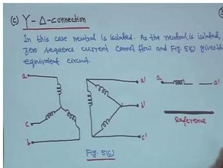
**Provenance:** Lecture 51; physical PDF page 906 (from `data/psa-ocr/week-11/images.json`).
**How to read it:** The board compares a star winding with an isolated neutral to a delta winding and shows the corresponding zero-sequence equivalent as open from the system terminals. The isolated neutral is the decisive cue; do not infer a zero-sequence path through the star side.

### Lecture 51 — Sequence impedances from self and mutual impedance
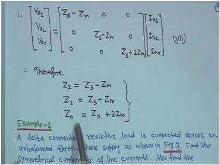
**Provenance:** Lecture 51; physical PDF page 913 (from `data/psa-ocr/week-11/images.json`).
**How to read it:** The diagonal sequence matrix yields `Z1 = Z2 = Zs − Zm` and `Z0 = Zs + 2Zm`. Read the first two entries as the positive/negative sequence result and the third as the zero-sequence result; the handwritten example below is separate from the general relationship.

### Lecture 52 — Negative-sequence network for a generator–transformer–line system
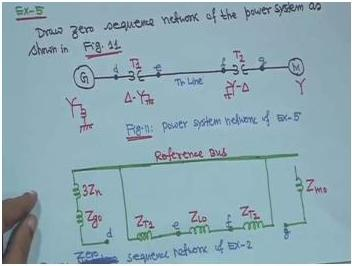
**Provenance:** Lecture 52; physical PDF page 932 (from `data/psa-ocr/week-11/images.json`).
**How to read it:** The upper sketch identifies the generator, transformer, line, and motor, while the lower drawing assembles the negative-sequence network against a reference bus. Follow the series impedances from the source-side machine toward the load-side machine; the small handwritten labels should be verified against the equations nearby.

### Lecture 52 — Single-line-to-ground fault connection
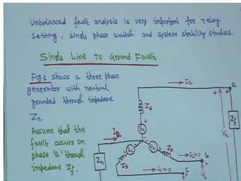
**Provenance:** Lecture 52; physical PDF page 941 (from `data/psa-ocr/week-11/images.json`).
**How to read it:** The diagram places the fault impedance `Zf` on phase `a` and shows the grounded generator neutral impedance `Zn`. Read the current arrows and ground reference first, then connect the positive-, negative-, and zero-sequence networks at the fault as derived in the text.

### Lecture 53 — Line-to-line fault equations
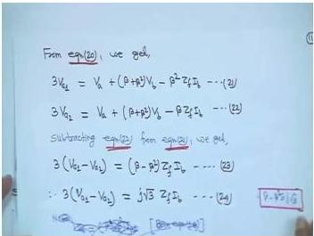
**Provenance:** Lecture 53; physical PDF page 952 (from `data/psa-ocr/week-11/images.json`).
**How to read it:** The board derives the line-to-line fault relations by combining phase-voltage/current constraints with the sequence transformation. Several handwritten symbols and coefficients are too small to read with certainty; use the OCR equations and the surrounding derivation for exact algebra rather than copying an uncertain digit.

### Lecture 54 — Phase/sequence transformation equations
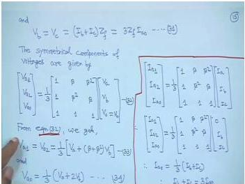
**Provenance:** Lecture 54; physical PDF page 958 (from `data/psa-ocr/week-11/images.json`).
**How to read it:** The board places the inverse transformation matrices for phase voltages and currents side by side. Track the common `1/3` factor and the `1, β, β²` ordering; this is the map used to impose fault constraints in sequence coordinates.

### Lecture 54 — Zero-sequence machine equation with neutral grounding
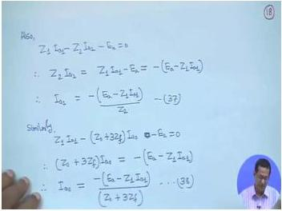
**Provenance:** Lecture 54; physical PDF page 964 (from `data/psa-ocr/week-11/images.json`).
**How to read it:** The derivation shows the zero-sequence current term entering through `Z0 + 3Zn`. Read the grounding factor as a current-sum effect, not as a new physical winding impedance; the handwritten intermediate algebra should be cross-checked with the OCR context.

### Lecture 55 — Worked sequence-network example for an L–G fault
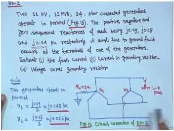
**Provenance:** Lecture 55; physical PDF page 983 (from `data/psa-ocr/week-11/images.json`).
**How to read it:** The board introduces the worked example of two parallel generators and sketches their grounded connections for an L–G fault. The example data and small reactance values are handwritten; where a digit is unclear, rely on the adjacent worked solution rather than guessing from the photograph.

## Common Mistakes and Engineering Checks

### Common Mistakes

1. **Forgetting the factor of 3 for neutral impedance:** In zero-sequence networks, a neutral impedance Zₙ always appears as 3Zₙ. This is because all three phase currents (equal in zero-sequence) flow through the same neutral impedance.

2. **Connecting zero-sequence networks through Δ windings:** Zero-sequence current cannot leave Δ terminals. The zero-sequence network must be open at Δ sides.

3. **Assuming zero-sequence current flows in ungrounded Y windings:** Without a ground path, zero-sequence current cannot flow. The network must be isolated.

4. **Incorrect matrix multiplication in sequence impedance derivation:** The A⁻¹Z_abcA multiplication requires careful handling of β operations. Use the identity 1 + β + β² = 0 to simplify.

5. **Forgetting that Iₐ₁ = Iₐ₂ = Iₐ₀ for L-G faults:** This equality is what determines the series connection of sequence networks.

6. **Including zero-sequence network for L-L faults:** For L-L faults, Iₐ₀ = 0, so the zero-sequence network does not appear in the connection.

7. **Incorrect current division:** When computing current distribution in parallel branches, use the correct impedance ratios. The current divides inversely proportional to impedance.

8. **Confusing line and phase quantities:** When converting per-unit voltages to kV, use V_phase = V_line/√3 for Y-connected systems.

9. **Not recognizing when Z_f = 0 simplifies connections:** For bolted faults, many terms drop out and the sequence network connections simplify.

10. **Forgetting that β² + β = −1:** This identity is used repeatedly in phase current calculations.

### Engineering Checks

1. **Verify sequence network connections:** For any fault type, check that the boundary conditions are satisfied by the connection. For example, for L-G fault, verify Iₐ₁ = Iₐ₂ = Iₐ₀.

2. **Check current conservation:** At any junction in the sequence networks, KCL must hold. For L-L-G fault, verify Iₐ₁ + Iₐ₂ + Iₐ₀ = 0.

3. **Verify voltage relations:** For L-L-G fault, check that Vₐ₁ = Vₐ₂ and Vₐ₀ = Vₐ₁ + 3Z_f·Iₐ₀.

4. **Sanity check fault current magnitude:** Fault currents should be reasonable. For a solid L-G fault, the current is typically 1-3 times the rated current.

5. **Check zero-sequence paths:** Trace the zero-sequence current path from the fault to ground. If there is no path (all Δ or ungrounded Y), then Iₐ₀ = 0.

6. **Verify per-unit conversions:** Always check that base voltages are consistent across transformer boundaries.

7. **Cross-check with phase equations:** After computing sequence quantities, transform back to phase quantities and verify the boundary conditions.

---

## Quick Revision Sheet

### Transformer Zero-Sequence Networks

| Connection | Zero-Sequence Network |
|------------|----------------------|
| Y-Δ (ungrounded Y) | Both sides open |
| Y-grounded/Δ | Reactance to ground on Y side, Δ open |
| Δ-Δ | Isolated loop with reactance |
| Y-grounded/Y-grounded | Reactance between buses, both grounded |
| Y-grounded/Y-ungrounded | Reactance to ground on grounded side only |

### Sequence Impedances for Balanced Y-Load with Mutual Coupling

- Z₁ = Z₂ = Zₛ − Zₘ
- Z₀ = Zₛ + 2Zₘ

### Key Identities

- β = e^(j120°) = 1∠120°
- β² = e^(j240°) = 1∠240°
- 1 + β + β² = 0
- β − β² = j√3
- β² − β = −j√3
- β² + β = −1

### Fault Type Summary

| Fault Type | Key Relations | Network Connection | Fault Current |
|------------|--------------|-------------------|---------------|
| L-G | Iₐ₁ = Iₐ₂ = Iₐ₀ | Series: Z₁-Z₂-Z₀-3Z_f | Iₐ = 3Eₐ/(Z₁+Z₂+Z₀+3Z_f) |
| L-L | Iₐ₁ = −Iₐ₂, Iₐ₀ = 0 | Parallel: Z₁ with Z₂ through Z_f | I_b = −j√3Eₐ/(Z₁+Z₂+Z_f) |
| L-L-G | Vₐ₁ = Vₐ₂, Vₐ₀ = Vₐ₁+3Z_f·Iₐ₀ | Z₂ parallel with (Z₀+3Z_f), in series with Z₁ | Iₐ₁ = Eₐ/[Z₁+Z₂(Z₀+3Z_f)/(Z₂+Z₀+3Z_f)] |
| One conductor open | Vₐₐ′₁ = Vₐₐ′₂ = Vₐₐ′₀ | Parallel connection | — |
| Two conductors open | Iₐ₁ = Iₐ₂ = Iₐ₀ | Series connection | — |
| Simultaneous L-G+L-L | Vₐ₁ = Vₐ₂ = −Vₐ₀/2, Iₐ₁+Iₐ₂ = 2Iₐ₀ | Parallel of Z₁,Z₂ in series with Z₀ | — |

### Per-Unit Conversion Formulas

- X_pu_new = X_pu_old × (S_base_new/S_base_old) × (V_base_old/V_base_new)²
- Z_base = V_base²/S_base
- Neutral impedance in zero-sequence: 3Zₙ

### Sequence Network Construction Rules

1. **Positive sequence:** Normal circuit diagram with voltage sources
2. **Negative sequence:** Same topology, no sources
3. **Zero sequence:** Consider grounding and Δ connections carefully

### Worked Example Results

**Example 1 (Y-load with mutual coupling):**
- Z₁ = Z₂ = Zₛ − Zₘ, Z₀ = Zₛ + 2Zₘ

**Example 2 (Δ-load, unbalanced supply):**
- Iₐ₁ = 4.64∠8.5° A, Iₐ₂ = 13.96∠−77.2° A, Iₐ₀ = 0
- I_ab1 = 2.67∠38.5° A, I_ab2 = 8.06∠−107.9° A

**Example 3 (Δ-load, one fuse melted):**
- Iₐ₁ = 7.5 + j4.33 A, Iₐ₂ = 7.5 − j4.33 A, Iₐ₀ = 0

**Example 4 (L-G fault on motor side):**
- Z₁ = Z₂ = j0.172 p.u., Z₀ = j3.264 p.u.
- Iₐ₁ = Iₐ₂ = Iₐ₀ = −j0.252 p.u.
- Fault current = −j0.756 p.u.

**Example 2 (Two generators, L-G fault):**
- Z₁ = j0.045, Z₂ = j0.025, Z₀ = 0.297 + j0.04 p.u.
- I_f = 9.472∠−23.32° p.u. = 5.96 kA
- V_Rn = 0.939 p.u. = 5.96 kV

**Example 3 (Two generators, L-L-G fault, Rₙ = 0):**
- Iₐ₁ = −j16.56 p.u., Iₐ₂ = j10.192 p.u., Iₐ₀ = j6.37 p.u.
- I_b = 25.05∠157.6° p.u., I_c = 25.05∠22.4° p.u.
- Vₐ = 0.7644 p.u.

---

## Practice Quiz

### Question 1 (MCQ)

For a Y-Δ transformer with the Y side ungrounded, the zero-sequence network is:

Options:
(a) Connected to ground on both sides
(b) Open on both sides
(c) Connected to ground on the Y side only
(d) Connected to ground on the Δ side only

> Answer and explanation
> The correct answer is (b). For a Y-Δ transformer with ungrounded Y side, zero-sequence current cannot flow on the Y side because there is no return path through ground. On the Δ side, zero-sequence current can circulate within the delta but cannot leave the terminals. Therefore, the zero-sequence network is open on both sides. This is Configuration 1 from Lecture 51.

### Question 2 (MCQ)

For a balanced Y-connected load with self impedance Zₛ and mutual impedance Zₘ between phases, the zero-sequence impedance is:

Options:
(a) Zₛ − Zₘ
(b) Zₛ + Zₘ
(c) Zₛ + 2Zₘ
(d) Zₛ − 2Zₘ

> Answer and explanation
> The correct answer is (c). From the derivation in Lecture 51, the sequence impedance matrix is diagonal with entries Zₛ − Zₘ for positive and negative sequence, and Zₛ + 2Zₘ for zero sequence. The zero-sequence impedance is larger because all three phase currents are equal and in phase, so the mutual couplings add constructively: Z₀ = Zₛ + 2Zₘ.

### Question 3 (MCQ)

For a single line-to-ground fault on phase a, the relationship between sequence currents is:

Options:
(a) Iₐ₁ = −Iₐ₂, Iₐ₀ = 0
(b) Iₐ₁ = Iₐ₂ = Iₐ₀
(c) Iₐ₁ = Iₐ₂ = −Iₐ₀
(d) Iₐ₁ + Iₐ₂ + Iₐ₀ = 0

> Answer and explanation
> The correct answer is (b). For an L-G fault on phase a with I_b = I_c = 0, the sequence currents are all equal: Iₐ₁ = Iₐ₂ = Iₐ₀ = Iₐ/3. This equality is what determines the series connection of sequence networks for the L-G fault analysis.

### Question 4 (MCQ)

For a line-to-line fault between phases b and c, the zero-sequence current Iₐ₀ is:

Options:
(a) Equal to Iₐ₁
(b) Equal to −Iₐ₁
(c) Zero
(d) Equal to Iₐ/3

> Answer and explanation
> The correct answer is (c). For an L-L fault, the boundary conditions give Iₐ = 0 and I_b = −I_c. From the transformation, Iₐ₀ = (1/3)(Iₐ + I_b + I_c) = (1/3)(0 + I_b − I_b) = 0. The zero-sequence network does not appear in the L-L fault analysis.

### Question 5 (MCQ)

In the zero-sequence network, a neutral grounding impedance Zₙ appears as:

Options:
(a) Zₙ
(b) 2Zₙ
(c) 3Zₙ
(d) Zₙ/3

> Answer and explanation
> The correct answer is (c). In zero-sequence, all three phase currents are equal and flow through the same neutral impedance. The voltage drop across the neutral impedance is 3Iₐ₀Zₙ, so the effective impedance in the zero-sequence network is 3Zₙ. This is why the neutral reactors in Example 4 appear as 3Zₙ = 3.10 p.u.

### Question 6 (MCQ)

For a double line-to-ground fault with fault impedance Z_f, the sequence network connection is:

Options:
(a) All three networks in series
(b) Positive and negative in parallel, zero in series
(c) Negative and zero in parallel, then in series with positive
(d) All three networks in parallel

> Answer and explanation
> The correct answer is (c). For the L-L-G fault, the boundary conditions give Vₐ₁ = Vₐ₂ (parallel connection of positive and negative) and Vₐ₀ = Vₐ₁ + 3Z_f·Iₐ₀ (zero sequence in series with the parallel combination through 3Z_f). The equivalent impedance is Z₂(Z₀ + 3Z_f)/(Z₂ + Z₀ + 3Z_f) in series with Z₁.

### Question 7 (MSQ)

Which of the following statements about zero-sequence networks are correct?

Options:
(a) Zero-sequence current can flow through a grounded Y winding
(b) Zero-sequence current can leave the terminals of a Δ winding
(c) An ungrounded Y winding provides no path for zero-sequence current
(d) A Δ-Δ transformer has an isolated zero-sequence loop

> Answer and explanation
> The correct answers are (a), (c), and (d). (a) is correct: a grounded Y provides a return path for zero-sequence current. (b) is incorrect: zero-sequence current circulates within the Δ but cannot leave the terminals. (c) is correct: without a ground path, zero-sequence current cannot flow in an ungrounded Y. (d) is correct: for Δ-Δ, the zero-sequence network is an isolated loop containing the transformer reactance.

### Question 8 (MSQ)

For the L-G fault analysis, which of the following are true?

Options:
(a) The sequence networks are connected in series
(b) The fault current is 3Eₐ/(Z₁ + Z₂ + Z₀ + 3Z_f)
(c) The zero-sequence network is not involved
(d) Vₐ = Z_f·Iₐ is a boundary condition

> Answer and explanation
> The correct answers are (a), (b), and (d). (a) is correct: Iₐ₁ = Iₐ₂ = Iₐ₀ implies series connection. (b) is correct: this is the standard L-G fault current formula. (c) is incorrect: the zero-sequence network is an essential part of the series connection. (d) is correct: this is one of the boundary conditions for the L-G fault.

### Question 9 (MSQ)

Which of the following identities are correct for β = e^(j120°)?

Options:
(a) 1 + β + β² = 0
(b) β − β² = j√3
(c) β² + β = −1
(d) β² − β = j√3

> Answer and explanation
> The correct answers are (a), (b), and (c). (a) is the fundamental identity for symmetrical components. (b) is correct: β − β² = j√3. (c) follows directly from (a): β² + β = −1. (d) is incorrect: β² − β = −j√3, not +j√3.

### Question 10 (Short Answer)

Why does the zero-sequence network for a Δ-connected winding appear as an open circuit at its terminals?

> Answer and explanation
> In a Δ-connected winding, zero-sequence currents are equal in magnitude and phase in all three branches. At each terminal, two branch currents meet: one entering and one leaving. Since the currents are equal and in phase, they cancel at the terminal, meaning no zero-sequence current can enter or leave the Δ from the external circuit. However, the currents do circulate within the delta loop, creating a closed path for zero-sequence current flow inside the winding. From the external circuit's perspective, the Δ appears as an open circuit for zero-sequence, but internally there is a circulating current path.

### Question 11 (Short Answer)

What is the significance of the identity 1 + β + β² = 0 in symmetrical components?

> Answer and explanation
> The identity 1 + β + β² = 0 is fundamental to symmetrical components. It arises because the three sequence components are separated by 120° in phase, and the sum of three phasors separated by 120° is zero. This identity is used extensively in:
> 1. Deriving the inverse transformation matrix A⁻¹
> 2. Simplifying expressions involving β and β²
> 3. Computing phase currents from sequence components (e.g., I_b = β²Iₐ₁ + βIₐ₂ + Iₐ₀)
> 4. Verifying that balanced three-phase quantities have no zero-sequence component
> Without this identity, many of the simplifications in fault analysis would not be possible.

### Question 12 (Short Answer)

Explain why the negative-sequence network has the same topology as the positive-sequence network but without voltage sources.

> Answer and explanation
> The negative-sequence network represents the response of the system to negative-sequence currents. Since the system is designed to generate positive-sequence voltages (the internal EMFs of generators are positive-sequence), there are no negative-sequence sources. However, the impedances of all static components (transformers, transmission lines) are the same for positive and negative sequence because they are frequency-dependent, not sequence-dependent. For rotating machines, the negative-sequence impedance may differ slightly from positive-sequence, but in many analyses (as stated in the lectures), the negative-sequence reactance is assumed equal to the subtransient reactance. Therefore, the negative-sequence network has the same topology and impedance values as the positive-sequence network, but with all voltage sources removed (short-circuited).

### Question 13 (Short Answer)

What is the physical meaning of the factor 3 in the term 3Z_f that appears in the L-G fault analysis?

> Answer and explanation
> The factor 3 in 3Z_f arises because the fault current Iₐ = 3Iₐ₁ flows through the fault impedance Z_f. The voltage drop across the fault impedance is V_a = Z_f·Iₐ = Z_f·3Iₐ₁ = 3Z_f·Iₐ₁. In the sequence network, this voltage drop must be represented in terms of the sequence current Iₐ₁, so the effective impedance in the sequence network is 3Z_f. Physically, this means that the fault impedance appears three times larger in the sequence network because the sequence current is only one-third of the actual fault current.

### Question 14 (Numerical)

A balanced Y-connected load has self impedance Zₛ = 10 + j20 Ω and mutual impedance Zₘ = 2 + j4 Ω. Calculate the positive, negative, and zero-sequence impedances.

> Answer and explanation
> For a balanced Y-load with mutual coupling:
> - Z₁ = Z₂ = Zₛ − Zₘ = (10 + j20) − (2 + j4) = 8 + j16 Ω
> - Z₀ = Zₛ + 2Zₘ = (10 + j20) + 2(2 + j4) = 10 + j20 + 4 + j8 = 14 + j28 Ω
> 
> The positive and negative sequence impedances are equal because the load is symmetric. The zero-sequence impedance is larger because the mutual couplings add constructively when all phase currents are equal.

### Question 15 (Numerical)

A 50 MVA, 11 kV generator has a subtransient reactance of 20%. The generator supplies a motor through a transformer rated 60 MVA, 10.8/121 kV with 10% leakage reactance. Calculate the transformer reactance in per-unit on the 50 MVA, 11 kV base.

> Answer and explanation
> The transformer reactance conversion uses:
> 
> X_pu_new = X_pu_old × (S_base_new/S_base_old) × (V_base_old/V_base_new)²
> 
> X_T = 0.1 × (50/60) × (10.8/11)²
> 
> X_T = 0.1 × 0.8333 × (0.9818)²
> 
> X_T = 0.1 × 0.8333 × 0.9640
> 
> X_T = 0.0803 p.u.
> 
> This matches the value computed in Lecture 51 (0.0805 p.u., with slight rounding differences). The voltage ratio correction accounts for the difference between the transformer rated voltage (10.8 kV) and the system base voltage (11 kV).

### Question 16 (Numerical)

For a single line-to-ground fault with Eₐ = 1∠0° p.u., Z₁ = j0.2 p.u., Z₂ = j0.2 p.u., Z₀ = j0.1 p.u., and Z_f = 0, calculate the fault current in per-unit.

> Answer and explanation
> For an L-G fault with Z_f = 0:
> 
> Iₐ₁ = Eₐ/(Z₁ + Z₂ + Z₀) = 1∠0°/(j0.2 + j0.2 + j0.1) = 1/(j0.5) = −j2.0 p.u.
> 
> Fault current: Iₐ = 3Iₐ₁ = 3 × (−j2.0) = −j6.0 p.u.
> 
> The fault current is purely reactive (imaginary) because all impedances are reactive. The magnitude is 6.0 p.u., which is quite high — this is why L-G faults can be severe, especially near generator terminals.

### Question 17 (Scenario)

A delta-connected load has a fuse in line b that melts, opening that line. The supply current in line a is 15 A. What are the symmetrical components of the line currents?

> Answer and explanation
> With the fuse in line b melted, I_b = 0. Taking Iₐ = 15∠0° A as reference, and since Iₐ + I꜀ = 0 (path through the delta), I꜀ = 15∠180° A.
> 
> Positive sequence:
> Iₐ₁ = (1/3)(Iₐ + βI_b + β²I_c) = (1/3)(15∠0° + 0 + 15∠(180°+240°))
> = (1/3)(15∠0° + 15∠60°) = (1/3)(15 + 7.5 + j12.99) = (1/3)(22.5 + j12.99)
> = 7.5 + j4.33 A
> 
> Negative sequence:
> Iₐ₂ = (1/3)(Iₐ + β²I_b + βI_c) = (1/3)(15∠0° + 0 + 15∠(180°+120°))
> = (1/3)(15∠0° + 15∠300°) = (1/3)(15 + 7.5 − j12.99) = (1/3)(22.5 − j12.99)
> = 7.5 − j4.33 A
> 
> Zero sequence:
> Iₐ₀ = (1/3)(Iₐ + I_b + I_c) = (1/3)(15∠0° + 0 + 15∠180°) = (1/3)(15 − 15) = 0 A
> 
> Verification: Iₐ = Iₐ₁ + Iₐ₂ + Iₐ₀ = (7.5 + j4.33) + (7.5 − j4.33) + 0 = 15∠0° ✓
> 
> This matches the result from Lecture 51, Example 3.

### Question 18 (Scenario)

A fault occurs at point 'g' in the Example-4 system. The positive sequence Thevenin impedance is Z₁ = j0.172 p.u. and the zero-sequence impedance is Z₀ = j3.264 p.u. Why does all the zero-sequence current flow from the motor side and none from the generator side?

> Answer and explanation
> The key reason is the transformer connection. Transformer T₁ is Δ-Y with the Y side grounded. The Δ winding on the generator side provides isolation for zero-sequence current — zero-sequence current cannot pass through the Δ winding to reach the generator. Therefore, the generator side of the zero-sequence network is open at the Δ winding.
> 
> On the motor side, transformer T₂ is Y-Δ with the Y side grounded. Motor-2 is grounded, providing a path for zero-sequence current. Therefore, the zero-sequence current path exists only from the fault point 'g' through transformer T₂ to motor-2 and ground.
> 
> This is why the instructor notes: "All of Iₐ₀ flows towards 'g' from motor-2 side. Therefore, no part of Iₐ₀ flows towards 'g' from the generator side, i.e. 0.0."
> 
> This is a critical insight for fault analysis: the zero-sequence current distribution depends entirely on the grounding and transformer connections in the system.

---

## Source Exercise Coverage

The following exercises from the source lectures are covered in this document:

1. **Lecture 51, Example 1:** Balanced Y-connected load with mutual coupling — sequence impedances (Section 5.4)
2. **Lecture 51, Example 2:** Δ-connected resistive load with unbalanced supply — symmetrical components of line and delta currents (Section 5.5)
3. **Lecture 51, Example 3:** Delta load with one line fuse melted — symmetrical components of current (Section 5.6)
4. **Lecture 51, Example 4:** 50 MVA generator supplying two motors — draw positive, negative, and zero sequence networks (Section 5.7)
5. **Lecture 52, Exercises 1-5:** Zero-sequence network drawing exercises (Figures 11, 13, 15, 17, 19) (Section 6.5)
6. **Lecture 52, Exercise:** Draw zero-sequence network for Y-Y grounded transformer instead of Δ-Y (Section 6.5, Exercise 3)
7. **Lecture 54, Worked Example:** L-G fault on the Example-4 system (Section 8.6)
8. **Lecture 54, Exercise:** Fault at point near 'e' instead of 'g' — compute sequence currents and fault currents (Section 9.5)
9. **Lecture 55, Example 2:** Two generators in parallel — L-G fault (Section 9.6)
10. **Lecture 55, Example 3:** Two generators — L-L-G fault with Rₙ = 0 (Section 9.7)
11. **Lecture 55, Simultaneous Faults:** L-G + L-L fault on synchronous generator (Section 9.8)

**Unreadable or omitted items:** No source exercises were unreadable or omitted. All exercises from the evidence digest have been included.

---

## Source Provenance

- **Course:** NPTEL Power System Analysis
- **Instructor:** Prof. Debapriya Das, Department of Electrical Engineering, IIT Kharagpur
- **Extraction:** Mistral OCR 4 extraction
- **Drafting:** DeepSeek V4 Flash drafting
- **Review:** Locally reviewed and generated on 2026-08-05

*Note: The AI models listed above were used as drafting and extraction tools. They are not authoritative sources for the technical content. All technical content is based on the NPTEL lecture materials as extracted and reviewed.*
