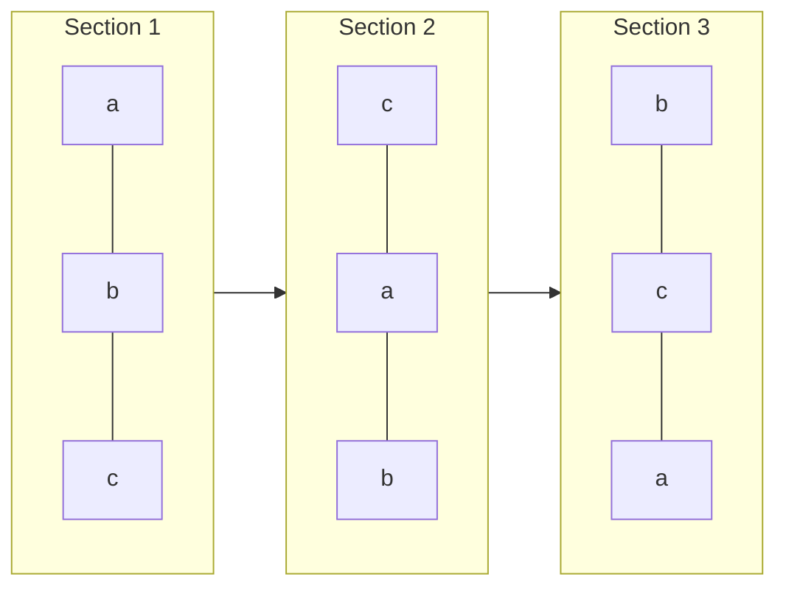
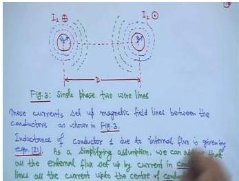
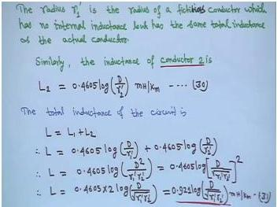
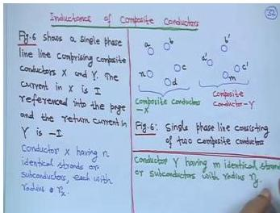
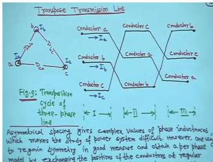
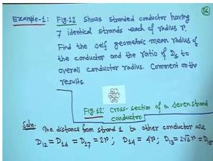
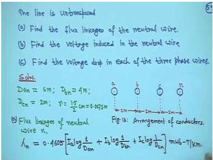
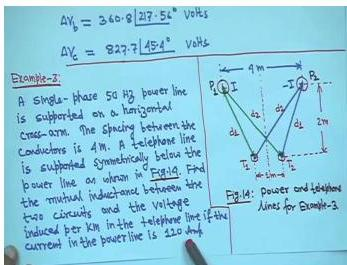
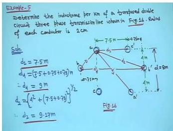

# Week 2 - Transmission-Line Inductance and Capacitance

## Orientation

Welcome to Week 2 of the Power System Analysis journey. This week, we dive deep into the heart of transmission-line modeling—specifically, how inductance and capacitance arise in overhead lines and how we quantify them. If Week 1 was about understanding the big picture of power systems, this week is about the nuts and bolts: the physical geometry of conductors, the magnetic fields they create, and the electric fields they sustain.

This material is foundational but dense. The concepts of geometric mean distance (GMD) and geometric mean radius (GMR) are the workhorses of every inductance and capacitance calculation we will do for the rest of the course. Getting comfortable with these tools now will pay dividends when we tackle load-flow, fault analysis, and stability later.

The lectures this week are structured as follows:

- **Lecture 6** builds the theory from first principles: starting with a single conductor, moving to a two-wire line, and then generalizing to n conductors.
- **Lecture 7** extends the theory to composite conductors (stranded and bundled) and introduces the powerful GMD/GMR method.
- **Lecture 8** applies these methods to three-phase lines, both symmetrically and asymmetrically spaced, and introduces transposition.
- **Lecture 9** tackles double-circuit lines and works through detailed numerical examples, including a 7-strand conductor and a 4-wire line with a neutral.
- **Lecture 10** is a problem-solving session covering mutual inductance between power and telephone lines, hollow conductors, and a full double-circuit transposed line example.

By the end of this week, we should be able to calculate the inductance of any practical transmission line configuration—single-phase, three-phase, transposed, untransposed, bundled, or composite—and understand the physical reasoning behind every formula.

## Learning Outcomes

After completing this week's lectures and independent study, the learner will be able to:

1. **Derive** the inductance of a single-phase two-wire line from first principles, starting with Ampère's law and flux linkage concepts.
2. **Explain** the physical meaning of the fictitious radius (GMR) $r' = 0.7788r$ and why it appears in inductance formulas.
3. **Apply** the generalized flux linkage equation for n conductors to compute self and mutual inductances.
4. **Calculate** the inductance of composite conductors (stranded, bundled) using the GMD/GMR method.
5. **Determine** the inductance of three-phase lines with symmetrical and asymmetrical spacing.
6. **Justify** the need for transposition and compute the average inductance of a transposed line.
7. **Analyze** double-circuit three-phase lines and compute their equivalent GMD and GMR.
8. **Solve** numerical problems involving flux linkages, induced voltages, and mutual inductance between parallel circuits.
9. **Derive** the internal inductance of hollow conductors and understand when to use natural log vs. common log.
10. **Identify** common pitfalls in inductance calculations, including unit conversions and power-sum verification in GMR formulas.

## Syllabus Map

This week covers five lectures from the NPTEL Power System Analysis course by Prof. Debapriya Das, IIT Kharagpur. The source-page provenance for each lecture is as follows:

| Lecture | Topic | Source Pages (Physical PDF) |
|---------|-------|----------------------------|
| Lecture 6 | Resistance & Inductance (Contd.): Single-phase two-wire line, self and mutual inductance, n-conductor generalization | 1067-1084 |
| Lecture 7 | Resistance & Inductance (Contd.): Composite conductors, GMD/GMR method, symmetrical 3-phase lines | 1108-1126 |
| Lecture 8 | Resistance & Inductance (Contd.): Asymmetrical spacing, transposition, double-circuit lines | 1127-1142 |
| Lecture 9 | Resistance & Inductance (Contd.): 7-strand conductor example, 4-wire line with neutral, flux linkages | 1143-1164 |
| Lecture 10 | Resistance & Inductance (Contd.): Power-telephone mutual inductance, hollow conductors, double-circuit example | 22-42 |

---

## Lecture 6: Inductance of a Single-Phase Two-Wire Line

### Physical Intuition

The simplest possible transmission line consists of two parallel conductors: one carrying current $I_1$ into the page and the other carrying equal current $I_2$ out of the page. This is a single-phase line where one conductor is the "go" path and the other is the "return" path.


The current in conductor 1 creates a magnetic field that encircles it. Some of this field links conductor 1 itself (internal and nearby external flux), and some of it extends outward to link conductor 2. The key insight is that the total flux linkage of conductor 1 determines its inductance.

### Key Assumption for External Flux

The critical assumption in this derivation is:

> All external flux set up by current in conductor 1 links all current up to the center of conductor 2.

Flux beyond the center of conductor 2 does not link any current. This assumption gives quite accurate results when $D \gg r_1$ and $D \gg r_2$, where $D$ is the distance between conductor centers, and $r_1$, $r_2$ are the radii of conductors 1 and 2.

Why is this accurate? Because the magnetic field intensity falls off as $1/x$ from the conductor center. Most of the flux is concentrated near the conductor, and the flux that extends far beyond the center of the return conductor links almost no net current (the return current cancels it out).

### Derivation of External Inductance

From the previous week's work (Equation 26), the external flux linkage of a conductor due to flux between distances $D_1$ and $D_2$ is:

$$\lambda_{ext} = 2 \times 10^{-7} I \ln\left(\frac{D_2}{D_1}\right) \text{ Wb/m}$$

For conductor 1 in our two-wire line, the external flux extends from the surface of conductor 1 ($D_1 = r_1$) to the center of conductor 2 ($D_2 = D$). Therefore:

$$L_{1\text{ external}} = 2 \times 10^{-7} \ln\left(\frac{D}{r_1}\right) \text{ Henry/meter}$$

This is Equation 27 in the lecture.

### Total Inductance of Conductor 1

The total inductance of conductor 1 is the sum of its internal inductance (due to flux inside the conductor) and its external inductance:

$$L_1 = L_{\text{internal}} + L_{1\text{ external}}$$

From Week 1, the internal inductance of a solid cylindrical conductor is $L_{\text{internal}} = \frac{1}{2} \times 10^{-7}$ H/m. Therefore:

$$L_1 = \frac{1}{2} \times 10^{-7} + 2 \times 10^{-7} \ln\left(\frac{D}{r_1}\right)$$

Now comes the clever algebraic manipulation. Factor out $2 \times 10^{-7}$:

$$L_1 = 2 \times 10^{-7}\left[\frac{1}{4} + \ln\left(\frac{D}{r_1}\right)\right]$$

Since $\ln(e) = 1$, we can write $\frac{1}{4} = \ln(e^{1/4})$:

$$L_1 = 2 \times 10^{-7}\left[\ln(e^{1/4}) + \ln\left(\frac{D}{r_1}\right)\right]$$

Using the logarithm property $\ln(a) + \ln(b) = \ln(ab)$:

$$L_1 = 2 \times 10^{-7} \ln\left(\frac{D}{r_1 e^{-1/4}}\right) \text{ Henry/meter}$$

### Conversion to Common Logarithm Form

The lecturer set this as an exercise: convert from natural log to common log, Henry to milliHenry, and meter to kilometer.

**Step 1:** Convert natural log to common log using $\ln(x) = 2.3026 \log_{10}(x)$:

$$L_1 = 2 \times 10^{-7} \times 2.3026 \log_{10}\left(\frac{D}{r_1 e^{-1/4}}\right)$$

$$L_1 = 4.6052 \times 10^{-7} \log_{10}\left(\frac{D}{r_1 e^{-1/4}}\right) \text{ H/m}$$

**Step 2:** Convert Henry to milliHenry ($1 \text{ H} = 10^3 \text{ mH}$):

$$L_1 = 4.6052 \times 10^{-4} \log_{10}\left(\frac{D}{r_1 e^{-1/4}}\right) \text{ mH/m}$$

**Step 3:** Convert meter to kilometer ($1 \text{ m} = 10^{-3} \text{ km}$, so per meter becomes per kilometer by multiplying by $10^3$):

$$L_1 = 4.6052 \times 10^{-1} \log_{10}\left(\frac{D}{r_1 e^{-1/4}}\right) \text{ mH/km}$$

$$L_1 = 0.4605 \log_{10}\left(\frac{D}{r_1'}\right) \text{ milliHenry/kilometer}$$

Where we define:

$$r_1' = r_1 e^{-1/4} = 0.7788 r_1$$

### The Fictitious Radius (GMR)

The quantity $r_1'$ is called the **fictitious radius** or **geometric mean radius (GMR)** of the conductor. Its physical meaning is profound:

> $r_1'$ is the radius of a fictitious conductor which has no internal inductance but has the same total inductance as the actual conductor.

In other words, if we replace the actual conductor (with its internal flux) by a hollow conductor of radius $r_1' = 0.7788r_1$ (with no internal flux), the total inductance remains the same. This is why the factor 0.7788 appears everywhere in transmission line calculations.


### Inductance of Conductor 2

By symmetry, the inductance of conductor 2 is:

$$L_2 = 0.4605 \log\left(\frac{D}{r_2'}\right) \text{ milliHenry/kilometer}$$

Where $r_2' = 0.7788 r_2$.

### Loop Inductance

The **loop inductance** is the total inductance of the complete circuit (one conductor going, another returning). It is the sum of the individual conductor inductances:

$$L = L_1 + L_2$$

$$L = 0.4605 \log\left(\frac{D}{r_1'}\right) + 0.4605 \log\left(\frac{D}{r_2'}\right)$$

$$L = 0.4605 \log\left(\frac{D^2}{r_1' r_2'}\right)$$

$$L = 0.4605 \log\left(\frac{D}{\sqrt{r_1' r_2'}}\right)^2$$

$$L = 2 \times 0.4605 \log\left(\frac{D}{\sqrt{r_1' r_2'}}\right)$$

$$L = 0.921 \log\left(\frac{D}{\sqrt{r_1' r_2'}}\right) \text{ milliHenry/kilometer}$$

This is Equation 31.

### Identical Conductors Case

If both conductors are identical ($r_1 = r_2 = r$), then $r_1' = r_2' = r' = 0.7788r$, and:

$$L = 0.921 \log\left(\frac{D}{r'}\right) \text{ milliHenry/kilometer}$$

This is Equation 32, giving the loop inductance of a 2-wire line with identical conductors.

### Reformulation for Generalization

The lecturer reformulated Equation 32 to prepare for the generalization to n conductors. For conductor 1 (with $r_1 = r_2 = r$):

$$L_1 = 0.4605 \log\left(\frac{1}{r'}\right) + 0.4605 \log\left(\frac{D}{1}\right) \text{ milliHenry/kilometer}$$

This is Equation 33. The first term, $0.4605 \log(1/r')$, represents the inductance due to both internal flux and external flux up to a radius of 1 meter. The second term, $0.4605 \log(D/1)$, depends only on the conductor spacing $D$ and is called the **inductance spacing factor**.

### Self and Mutual Inductance

Now let us view the two-wire line as two magnetically coupled coils, as shown in Figure 4:


Using the dot convention (current entering a dot is positive), with both dots at the same end and $I_1 = -I_2$:

$$\lambda_1 = L_{11} I_1 + M_{12} I_2$$

$$\lambda_2 = M_{21} I_1 + L_{22} I_2$$

Substituting $I_2 = -I_1$:

$$\lambda_1 = (L_{11} - M_{12}) I_1$$

$$\lambda_2 = (-M_{21} + L_{22}) I_2$$

Therefore:

$$L_1 = L_{11} - M_{12}$$

$$L_2 = -M_{21} + L_{22}$$

Comparing with Equations 33 and 34:

$$L_{11} = L_{22} = 0.4605 \log\left(\frac{1}{r'}\right) \text{ milliHenry/kilometer}$$

$$M_{12} = M_{21} = 0.4605 \log\left(\frac{1}{D}\right) \text{ milliHenry/kilometer}$$

This is a beautiful result: the self-inductance depends only on the conductor's own GMR, while the mutual inductance depends only on the distance between conductors.

### Extension to n Conductors

The generalization to n conductors is straightforward. Consider n conductors carrying phasor currents $I_1, I_2, \ldots, I_n$ such that:

$$I_1 + I_2 + \cdots + I_n = 0$$

The flux linkage of conductor $i$ is:

$$\lambda_i = L_{ii} I_i + \sum_{\substack{j=1 \\ j \neq i}}^{n} M_{ij} I_j$$

This is Equation 45, and the lecturer emphasized it is a very important formula that will be used repeatedly.

Expanding with the 0.4605 factor:

$$\lambda_i = 0.4605 \left[ I_i \log\left(\frac{1}{r_i'}\right) + \sum_{\substack{j=1 \\ j \neq i}}^{n} I_j \log\left(\frac{1}{D_{ij}}\right) \right] \text{ milli weber-turns/kilometer}$$

This is Equation 46, the workhorse formula for all subsequent inductance calculations.

### Types of Conductors

Before moving to composite conductors, the lecture covered practical conductor types:

1. **Stranded copper conductors**: Used for flexibility
2. **Hollow copper conductors**: Used in special applications
3. **ACSR (Aluminium Conductor Steel Reinforced)**: The most common for overhead transmission lines


**ACSR advantages:**
1. Cheaper than copper conductors of equal resistance
2. Corona losses reduced due to larger conductor diameter
3. Superior mechanical strength, allowing larger spans and fewer supports

### Number of Strands Formula

For a stranded conductor with $y$ layers:

$$S = 3y^2 - 3y + 1$$

Where $S$ is the total number of strands. Verification:
- $y = 1$: $S = 1$
- $y = 2$: $S = 1 + 6 = 7$
- $y = 3$: $S = 1 + 6 + 12 = 19$
- $y = 4$: $S = 1 + 6 + 12 + 18 = 37$

The overall diameter of the stranded conductor is:

$$D' = (2y - 1)D$$

Where $D$ is the diameter of an individual strand.

**⚠️ Important Warning:** The lecturer explicitly noted that the figure showing strand counting (Figure 5) is **incorrect**. For $y = 3$, there should be 12 conductors in the third layer (total 19), but the figure shows fewer. We must rely on the formula, not the figure.

### Modelling Assumptions

Let us summarize the key assumptions in this lecture:

1. **Uniform current density** within each conductor
2. **$D \gg r$**: Conductor spacing is much larger than conductor radius
3. **External flux links all current** up to the center of the return conductor
4. **Balanced currents**: $I_1 + I_2 + \cdots + I_n = 0$
5. **Constant permeability**: $\mu = \mu_0$ (non-magnetic conductors)

### Exam Traps

1. **Forgetting the 0.4605 multiplier**: Every inductance formula in mH/km has this factor. It comes from $2 \times 10^{-7} \times 2.3026 \times 10^3 \times 10^3 = 0.4605$.
2. **Using $r$ instead of $r'$**: The fictitious radius $r' = 0.7788r$ must be used in the log term.
3. **Natural log vs. common log**: The 0.4605 formulas use $\log_{10}$, not $\ln$.
4. **Unit confusion**: The 0.4605 formulas give mH/km. If we need H/m, we must convert back.
5. **Loop vs. per-conductor inductance**: The loop inductance is $2 \times$ the per-conductor inductance for identical conductors.

### Lecture 6 Recap

- The inductance of a single conductor in a two-wire line is $L_1 = 0.4605 \log(D/r_1')$ mH/km.
- The fictitious radius $r' = 0.7788r$ accounts for internal flux.
- The loop inductance of identical conductors is $L = 0.921 \log(D/r')$ mH/km.
- Self-inductance depends on GMR; mutual inductance depends on distance.
- The generalized flux linkage formula for n conductors is $\lambda_i = 0.4605[I_i \log(1/r_i') + \sum_{j \neq i} I_j \log(1/D_{ij})]$ mWb/km.
- ACSR is the most common conductor; strand count follows $S = 3y^2 - 3y + 1$.

---

## Lecture 7: Composite Conductors and the GMD/GMR Method

### Physical Intuition

Real transmission lines do not use solid conductors—they use stranded conductors for flexibility, and at EHV levels, they use bundled conductors to reduce corona and inductance. Each strand or sub-conductor carries only a fraction of the total current. The question is: how do we compute the inductance of such a composite conductor?

The answer is the **GMD/GMR method**. Instead of computing flux linkages for every strand individually, we replace the entire group of strands with an equivalent single conductor that has the same inductance. This equivalent conductor has a "geometric mean radius" (GMR) that captures the average effect of all the internal distances within the group.

### Expanded ACSR and Bundle Conductors

For extra high voltage (EHV) transmission lines, two special conductor types are used:

**Expanded ACSR**: Fillers (paper or hessian) are placed between layers of strands to:
- Increase overall conductor diameter
- Reduce corona loss
- Reduce electrical stress at the conductor surface


**Bundle Conductors**: Multiple conductors per phase, used to:
- Reduce corona loss
- Reduce radio interference with communication circuits

### Inductance of Composite Conductors

Consider a single-phase line with two composite conductors:

- **Composite conductor X**: $n$ sub-conductors (a, b, c, d, ..., n), each with radius $r_x$
- **Composite conductor Y**: $m$ sub-conductors (a', b', c', ..., m), each with radius $r_y$


The total current in group X is $I$ (entering the page), and in group Y is $-I$ (leaving the page).

**Key assumption**: Current is equally divided among sub-conductors. Each sub-conductor of X carries $I/n$, and each sub-conductor of Y carries $-I/m$.

### Applying the Generalized Formula to Sub-conductor 'a'

Using Equation 46 for sub-conductor 'a':

$$\lambda_a = 0.4605 \frac{I}{n} \left[ \log\left(\frac{1}{r_x'}\right) + \log\left(\frac{1}{D_{ab}}\right) + \log\left(\frac{1}{D_{ac}}\right) + \cdots + \log\left(\frac{1}{D_{an}}\right) \right]$$

$$- 0.4605 \frac{I}{m} \left[ \log\left(\frac{1}{D_{aa'}}\right) + \log\left(\frac{1}{D_{ab'}}\right) + \cdots + \log\left(\frac{1}{D_{am}}\right) \right]$$

The first bracket contains distances within group X (self terms), and the second bracket contains distances between groups (mutual terms).

Using logarithm properties, this simplifies to:

$$\lambda_a = 0.4605 I \log\left[ \frac{(D_{aa'} \cdot D_{ab'} \cdots D_{am})^{1/m}}{(r_x' \cdot D_{ab} \cdot D_{ac} \cdots D_{an})^{1/n}} \right]$$

This is Equation 49.

### Inductance of Sub-conductor 'a'

The inductance of sub-conductor 'a' is its flux linkage divided by its current ($I/n$):

$$L_a = \frac{\lambda_a}{(I/n)} = n \times 0.4605 \log\left[ \frac{(D_{aa'} \cdot D_{ab'} \cdots D_{am})^{1/m}}{(r_x' \cdot D_{ab} \cdot D_{ac} \cdots D_{an})^{1/n}} \right]$$

This is Equation 50.

### Average Inductance and Group Inductance

The average inductance of all sub-conductors in group X is:

$$L_{\text{avg}} = \frac{L_a + L_b + \cdots + L_n}{n}$$

Since the $n$ sub-conductors are electrically in parallel, the inductance of the composite conductor X is:

$$L_X = \frac{L_{\text{avg}}}{n} = \frac{L_a + L_b + \cdots + L_n}{n^2}$$

This is Equation 52.

### The GMD/GMR Result

After substituting all the $L_a, L_b, \ldots, L_n$ values and simplifying (the algebra is tedious but straightforward), we get the beautiful result:

$$L_X = 0.4605 \log\left(\frac{D_m}{D_{sx}}\right) \text{ milliHenry/kilometer}$$

This is Equation 55.

### Mutual GMD ($D_m$)

$$D_m = (D_{aa'} \cdot D_{ab'} \cdots D_{am} \cdot D_{ba'} \cdot D_{bb'} \cdots D_{bm} \cdots D_{na'} \cdot D_{nb'} \cdots D_{nm})^{1/(mn)}$$

$D_m$ is the $mn$-th root of the product of all $mn$ possible mutual distances from the $n$ sub-conductors of X to the $m$ sub-conductors of Y. It is called the **mutual geometric mean distance (mutual GMD)**.

### Self GMD ($D_{sx}$)

$$D_{sx} = (D_{aa} \cdot D_{ab} \cdots D_{an} \cdot D_{ba} \cdot D_{bb} \cdots D_{bn} \cdots D_{na} \cdot D_{nb} \cdots D_{nn})^{1/n^2}$$

$D_{sx}$ is the $n^2$-th root of the product of $n^2$ terms. It consists of $r_x'$ (the fictitious radius of each strand) times the distances from each strand to all other strands within group X. It is called the **self geometric mean distance (self GMD)**.

**Important**: In the product for $D_{sx}$, the diagonal terms $D_{aa}, D_{bb}, \ldots, D_{nn}$ are replaced by the fictitious radii $r_x'$ of the respective strands.

### Inductance of Composite Conductor Y

The inductance of group Y is determined similarly:

$$L_Y = 0.4605 \log\left(\frac{D_m}{D_{sy}}\right) \text{ milliHenry/kilometer}$$

The mutual GMD $D_m$ is the same, but the self GMD $D_{sy}$ is different (calculated for group Y's geometry).

### Inductance of 3-Phase Line with Symmetrical Spacing

Now let us apply these tools to a three-phase line. Consider a 3-phase transmission line with phases a, b, c arranged in an equilateral triangle with spacing $D$ between all conductors, all having the same radius $r$.


The flux linkage of phase a is:

$$\lambda_a = 0.4605 \left[ I_a \log\left(\frac{1}{r'}\right) + I_b \log\left(\frac{1}{D}\right) + I_c \log\left(\frac{1}{D}\right) \right]$$

For balanced 3-phase currents, $I_a + I_b + I_c = 0$, so $I_b + I_c = -I_a$:

$$\lambda_a = 0.4605 \left[ I_a \log\left(\frac{1}{r'}\right) + (I_b + I_c) \log\left(\frac{1}{D}\right) \right]$$

$$\lambda_a = 0.4605 \left[ I_a \log\left(\frac{1}{r'}\right) - I_a \log\left(\frac{1}{D}\right) \right]$$

$$\lambda_a = 0.4605 I_a \left[ \log\left(\frac{1}{r'}\right) + \log(D) \right]$$

$$\lambda_a = 0.4605 I_a \log\left(\frac{D}{r'}\right) \text{ milli weber-turns/kilometer}$$

This is Equation 58. The inductance of phase a is:

$$L_a = \frac{\lambda_a}{I_a} = 0.4605 \log\left(\frac{D}{r'}\right) \text{ milliHenry/kilometer}$$

By symmetry, $L_a = L_b = L_c$.

### Inductance of 3-Phase Line with Asymmetrical Spacing

With asymmetrical spacing, even with balanced currents, the flux linkages and inductances of each phase are **not the same**. This is a crucial point.

Consider phases a, b, c with distances $D_{ab}$, $D_{bc}$, $D_{ca}$ all different.


The flux linkage equations are:

$$\lambda_a = 0.4605 \left[ I_a \log\left(\frac{1}{r'}\right) + I_b \log\left(\frac{1}{D_{ab}}\right) + I_c \log\left(\frac{1}{D_{ca}}\right) \right]$$

$$\lambda_b = 0.4605 \left[ I_a \log\left(\frac{1}{D_{ab}}\right) + I_b \log\left(\frac{1}{r'}\right) + I_c \log\left(\frac{1}{D_{bc}}\right) \right]$$

$$\lambda_c = 0.4605 \left[ I_a \log\left(\frac{1}{D_{ca}}\right) + I_b \log\left(\frac{1}{D_{bc}}\right) + I_c \log\left(\frac{1}{r'}\right) \right]$$

In matrix form:

$$\begin{bmatrix} \lambda_a \\ \lambda_b \\ \lambda_c \end{bmatrix} = 0.4605 \begin{bmatrix} \log\frac{1}{r'} & \log\frac{1}{D_{ab}} & \log\frac{1}{D_{ca}} \\ \log\frac{1}{D_{ab}} & \log\frac{1}{r'} & \log\frac{1}{D_{bc}} \\ \log\frac{1}{D_{ca}} & \log\frac{1}{D_{bc}} & \log\frac{1}{r'} \end{bmatrix} \begin{bmatrix} I_a \\ I_b \\ I_c \end{bmatrix}$$

The inductance matrix is:

$$L = 0.4605 \begin{bmatrix} \log\frac{1}{r'} & \log\frac{1}{D_{ab}} & \log\frac{1}{D_{ca}} \\ \log\frac{1}{D_{ab}} & \log\frac{1}{r'} & \log\frac{1}{D_{bc}} \\ \log\frac{1}{D_{ca}} & \log\frac{1}{D_{bc}} & \log\frac{1}{r'} \end{bmatrix} \text{ milliHenry/kilometer}$$

### Modelling Assumptions

1. **Equal current division** among sub-conductors in a composite conductor
2. **Balanced 3-phase currents** ($I_a + I_b + I_c = 0$)
3. **Transposition** (for the average inductance formula)
4. **$D \gg r$** for all distances

### Exam Traps

1. **Confusing $D_m$ and $D_s$**: $D_m$ is the mutual GMD (between groups), $D_s$ is the self GMD (within a group).
2. **Forgetting the $1/n^2$ factor**: The group inductance is the average divided by $n$, not just the average.
3. **Using $r$ instead of $r'$** in the self GMD product.
4. **Not checking the power sum**: The exponents in the GMR product must sum to $n^2$.

### Lecture 7 Recap

- Composite conductors use the GMD/GMR method: $L_X = 0.4605 \log(D_m/D_{sx})$ mH/km.
- $D_m$ is the $mn$-th root of all mutual distances between groups.
- $D_{sx}$ is the $n^2$-th root of all self and mutual distances within group X.
- Symmetrical 3-phase spacing gives equal inductances: $L = 0.4605 \log(D/r')$ mH/km.
- Asymmetrical spacing gives unequal, complex inductances—this motivates transposition.

---

## Lecture 8: Transposition and Double-Circuit Lines

### Physical Intuition

When a three-phase line has asymmetrical spacing, the three phases have different inductances. This creates unbalanced voltage drops and makes power system analysis difficult. The solution is **transposition**: physically exchanging the positions of conductors at regular intervals so that each conductor occupies each position for an equal fraction of the line length.

For double-circuit lines (two parallel three-phase circuits on the same tower), the GMD/GMR method extends naturally, but the geometry is more complex.

### Balanced Currents with Asymmetrical Spacing

With $I_a$ as reference, balanced currents are:

$$I_b = \alpha^2 I_a, \quad I_c = \alpha I_a$$

Where $\alpha = 1\angle 120°$, $\alpha^2 = 1\angle 240°$, and $\alpha^3 = 1$.

The phase inductances become:

$$L_a = \frac{\lambda_a}{I_a} = 0.4605 \left[ \log\left(\frac{1}{r'}\right) + \alpha^2 \log\left(\frac{1}{D_{ab}}\right) + \alpha \log\left(\frac{1}{D_{ca}}\right) \right]$$

$$L_b = \frac{\lambda_b}{I_b} = 0.4605 \left[ \alpha \log\left(\frac{1}{D_{ab}}\right) + \log\left(\frac{1}{r'}\right) + \alpha^2 \log\left(\frac{1}{D_{bc}}\right) \right]$$

$$L_c = \frac{\lambda_c}{I_c} = 0.4605 \left[ \alpha^2 \log\left(\frac{1}{D_{ca}}\right) + \alpha \log\left(\frac{1}{D_{bc}}\right) + \log\left(\frac{1}{r'}\right) \right]$$

**Key observation**: These inductances are not equal, and due to the mutual inductance terms, they contain **imaginary parts**. This makes power system study difficult.

### Transposition of Transmission Lines

The purpose of transposition is to make the inductance of phases a, b, c more or less the same.


**How it works**: Conductors exchange positions at regular intervals along the line. Each conductor occupies the original position of every other conductor. A complete cycle consists of 3 sections (for 3 phases):

- Section 1: a b c
- Section 2: c a b (rotated clockwise)
- Section 3: b c a (rotated clockwise again)

Transposition is usually carried out at **switching stations** (substations).

### Average Inductance

The average inductance over a transposition cycle is:

$$L = \frac{1}{3}(L_a + L_b + L_c)$$

After substituting and simplifying:

$$L = 0.4605 \log\left(\frac{D_m}{D_s}\right) \text{ milliHenry/kilometer}$$

Where:
- $D_m = (D_{ab} \cdot D_{bc} \cdot D_{ca})^{1/3}$ (geometric mean distance)
- $D_s = r'$ (fictitious radius)

**Advantage**: All phases have the same average inductance over the transposition cycle.

### Inductance of 3-Phase Double Circuit Line

A double circuit line has two parallel conductors per phase. This provides:
1. **Greater reliability** (if one circuit fails, the other continues)
2. **Higher transmission capacity** (resistance is halved, inductance/reactance is halved)


### Distance Notation for Double Circuit Lines

For the standard double-circuit configuration:

- $d_1$ = distance between a-c', b-b', c-a' (also c-c')
- $d_2$ = distance between a-b', b-a'
- $d_3$ = distance between a-a', c-c'
- $D$ = distance between a-b, b-c, c'-b'
- $2D$ = distance between a-c

### GMD Calculation for Double Circuit Line

The equivalent GMD is:

$$D_{eq} = (D_{ab} \cdot D_{bc} \cdot D_{ca})^{1/3}$$

**Calculation of $D_{ab}$**: Considering all 4 mutual distances between conductors of phase a and phase b:

$$D_{ab} = (D \cdot d_2 \cdot d_2 \cdot D)^{1/4} = (D d_2)^{1/2}$$

**Calculation of $D_{bc}$**: By symmetry, same as $D_{ab}$:

$$D_{bc} = (D d_2)^{1/2}$$

**Calculation of $D_{ca}$**:

$$D_{ca} = (2D \cdot d_1 \cdot d_1 \cdot 2D)^{1/4} = (2D d_1)^{1/2}$$

**Final equivalent GMD**:

$$D_{eq} = \left[ (D d_2)^{1/2} \cdot (D d_2)^{1/2} \cdot (2D d_1)^{1/2} \right]^{1/3}$$

$$D_{eq} = 2^{1/6} D^{1/2} d_2^{1/3} d_1^{1/6}$$

$D_{eq}$ remains the same for all 3 transposition sections.

### Self GMD Calculation for Double Circuit Line

The equivalent self GMD is:

$$D_s = (D_{sa} \cdot D_{sb} \cdot D_{sc})^{1/3}$$

**Calculation of $D_{sa}$** (self GMD of phase a):

$$D_{sa} = (r' \cdot d_3 \cdot d_3 \cdot r')^{1/4} = (r' d_3)^{1/2}$$

**Calculation of $D_{sb}$**:

$$D_{sb} = (r' d_1)^{1/2}$$

**Calculation of $D_{sc}$**:

$$D_{sc} = (r' d_3)^{1/2}$$

**Final self GMD**:

$$D_s = \left[ (r' d_3)^{1/2} \cdot (r' d_1)^{1/2} \cdot (r' d_3)^{1/2} \right]^{1/3}$$

$$D_s = r'^{1/2} d_1^{1/6} d_3^{1/3}$$

$D_s$ remains the same in each transposition cycle.

### Inductance of Double Circuit Line

$$L = 0.4605 \log\left(\frac{D_{eq}}{D_s}\right) \text{ milliHenry/kilometer}$$

Substituting:

$$L = 0.4605 \log\left[ \frac{2^{1/6} D^{1/2} d_2^{1/3} d_1^{1/6}}{r'^{1/2} d_1^{1/6} d_3^{1/3}} \right]$$

$$L = 0.4605 \log\left[ 2^{1/6} \left(\frac{D}{r'}\right)^{1/2} \left(\frac{d_2}{d_3}\right)^{1/3} \right] \text{ milliHenry/kilometer}$$

This can be rewritten as:

$$L = \frac{1}{2}(L_s - M)$$

Where:
- $L_s = 0.4605 \log\left(2^{1/3} \cdot \frac{D}{r'}\right)$ mH/km (self inductance of each circuit)
- $M = 0.4605 \log\left(\frac{d_3}{d_2}\right)^{2/3}$ mH/km (mutual inductance between circuits)

### Design Objective

To enhance maximum transmission capability, we desire **minimum inductance per phase**. This is achieved when:
- **Mutual GMD is low**
- **Self GMD is high**

### Modelling Assumptions

1. **Transposition** is assumed (each conductor occupies each position equally)
2. **Balanced currents** in all phases
3. **Equal current division** between the two conductors of each phase
4. **$D \gg r$** for all distances

### Exam Traps

1. **Confusing $D$ and $d$ notation**: $D$ = phase spacing, $d$ = inter-circuit distances
2. **Forgetting the ½ factor** in double circuit inductance $L = \frac{1}{2}(L_s - M)$
3. **Using $r$ instead of $r'$** in self GMD calculations
4. **Not recognizing that $D_{eq}$ and $D_s$ are the same for all transposition sections**

### Lecture 8 Recap

- Asymmetrical spacing gives complex, unequal phase inductances.
- Transposition equalizes inductances: $L = 0.4605 \log(D_m/D_s)$ mH/km.
- Double-circuit lines halve resistance and reactance, improving reliability and capacity.
- $D_{eq} = 2^{1/6} D^{1/2} d_2^{1/3} d_1^{1/6}$ for the standard configuration.
- $D_s = r'^{1/2} d_1^{1/6} d_3^{1/3}$ for the standard configuration.
- $L = \frac{1}{2}(L_s - M)$ where $L_s$ involves $D$ and $r'$, and $M$ involves $d_2$ and $d_3$.

---

## Lecture 9: Worked Examples - Stranded Conductors and 4-Wire Lines

### Physical Intuition

This lecture is all about applying the theory to concrete numerical problems. The two main examples are:
1. Computing the GMR of a 7-strand conductor
2. Computing flux linkages and induced voltages in a 4-wire line (3 phases + neutral)

These examples test the ability to identify distances correctly, apply the power-sum verification, and handle complex arithmetic.

### Example 1: Self GMD of a 7-Strand Conductor

**Problem**: A stranded conductor has 7 identical strands (1 central + 6 surrounding), each having radius $r$. Find:
1. The self geometric mean radius of the conductor
2. The ratio of $D_s$ to overall conductor radius
3. Comment on the results


#### Configuration and Distances

The central strand is numbered 7, and the surrounding strands are numbered 1 through 6. The key distances are:

| Distance | Value | Occurrences |
|----------|-------|-------------|
| $D_{12} = D_{16} = D_{17}$ | $2r$ | Adjacent strands and center-to-outer |
| $D_{14}$ | $4r$ | Opposite strand through center |
| $D_{13} = D_{15}$ | $2\sqrt{3}r$ | Strands with one between them |

**Derivation of $D_{13}$**: In triangle 1-2-3, $D_{12} = 2r$, $D_{23} = 2r$, and the angle is 30°. The projection gives:
$$D_{13} = 2r\cos(30°) + 2r\cos(30°) = 2 \times 2r \times \frac{\sqrt{3}}{2} = 2\sqrt{3}r$$

#### Self GMD Calculation

With 7 conductors, we need the 49th root ($n^2 = 49$ possibilities):

$$D_s = \left[ (r')^7 \cdot (D_{12}^2)^6 \cdot (D_{13}^2)^6 \cdot (D_{14})^6 \cdot (D_{17})^6 \right]^{1/49}$$

**Explanation of terms:**
- $(r')^7$: fictitious radius of all 7 conductors
- $(D_{12}^2)^6$: $D_{12}$ appears twice per conductor (e.g., $D_{12} = D_{16}$), repeating for all 6 outer conductors
- $(D_{13}^2)^6$: $D_{13}$ appears twice per conductor (e.g., $D_{13} = D_{15}$), repeating for all 6 outer conductors
- $(D_{14})^6$: $D_{14}$ appears once per conductor (only one opposite strand)
- $(D_{17})^6$: $D_{17}$ appears once per conductor (each outer to center)

#### Power Verification

The lecturer emphasized checking that the powers sum to 49:

- 7 (from $r'^7$)
- 12 (from $D_{12}^2$ raised to 6th power: $2 \times 6$)
- 12 (from $D_{13}^2$ raised to 6th power: $2 \times 6$)
- 6 (from $D_{14}$ raised to 6th power: $1 \times 6$)
- 6 (from $D_{17}$ raised to 6th power: $1 \times 6$)
- 6 (from $(2r)^6$: $1 \times 6$)
- **Total**: $7 + 12 + 12 + 6 + 6 + 6 = 49$ ✓

> "If you add it has to be 49. If you say this is not matching, that means your computation is somewhere wrong."

#### Substituting Values

$$D_s = \left[ (r')^7 \cdot (2r)^{12} \cdot (2\sqrt{3}r)^{12} \cdot (4r)^6 \cdot (2r)^6 \right]^{1/49}$$

After substitution and simplification (which the lecturer left as an exercise):

$$D_s = 2.177r$$

#### Ratio to Overall Radius

The overall conductor radius is $3r$ (from center to outermost edge). Therefore:

$$\frac{D_s}{\text{overall radius}} = \frac{2.177r}{3r} = 0.7257$$

#### Comment on Results

The self GMD is less than the overall conductor radius. This is expected because the fictitious radius accounts for internal flux effects. As the number of strands increases, this ratio approaches 0.7788 (the value for a solid conductor).

### Example 2: Flux Linkages and Induced Voltages in a 4-Wire Line

**Problem**: A three-phase, 50 Hz, 30 km long line has four No. 4/0 wires (1.5 cm diameter) spaced horizontally 2 m apart in a plane. The wires carry currents $I_a$, $I_b$, $I_c$, and the fourth wire is a neutral carrying zero current.

**Given**:
- Frequency: 50 Hz
- Length: 30 km
- Wire diameter: 1.5 cm
- Spacing: 2 m apart horizontally
- Line is **un-transposed**

**Phase currents**:
- $I_a = (-30 + j24)$ A
- $I_b = (-20 + j26)$ A
- $I_c = (50 - j50)$ A


#### Configuration Distances

| Distance | Value | Derivation |
|----------|-------|------------|
| $D_{an}$ | 6 m | 2 + 2 + 2 |
| $D_{bn}$ | 4 m | 2 + 2 |
| $D_{cn}$ | 2 m | direct |
| $r$ | 0.0075 m | 1.5/2 cm converted to meters |

**Approximation**: Since the spacing between phases is much larger than the conductor radius, $d - r \approx d$.

#### Part (a): Flux Linkages of Neutral Wire

$$\lambda_n = 0.4605 \left[ I_a \log\left(\frac{1}{D_{an}}\right) + I_b \log\left(\frac{1}{D_{bn}}\right) + I_c \log\left(\frac{1}{D_{cn}}\right)\right] \text{ mWb/km}$$

Substituting distances:

$$\lambda_n = 0.4605 \left[ I_a \log\left(\frac{1}{6}\right) + I_b \log\left(\frac{1}{4}\right) + I_c \log\left(\frac{1}{2}\right)\right] \text{ mWb/km}$$

Evaluating logarithms:

$$\lambda_n = -0.4605 \left[ 0.778 I_a + 0.602 I_b + 0.301 I_c \right] \text{ mWb/km}$$

Substituting current values:

$$\lambda_n = 0.4605 \left[ 20.33 - j19.274 \right] \text{ mWb/km}$$

#### Part (b): Voltage Induced in Neutral Wire

$$V_n = j\omega \lambda_n \times 30$$

$$V_n = j(2\pi \times 50) \times 30 \times 0.4605 \times 10^{-3} \times (20.33 - j19.234)$$

**Final result**:
$$V_n = 121.58 \angle -43.5° \text{ volts}$$

#### Part (c): Voltage Drop in Each Phase Wire

**For conductor a** (using Equation 60):

$$\lambda_a = 0.4605 \left[ I_a \log\left(\frac{1}{r'}\right) + I_b \log\left(\frac{1}{D}\right) + I_c \log\left(\frac{1}{2D}\right)\right] \text{ mWb/km}$$

Using $I_a + I_b + I_c = 0$, so $I_c = -(I_a + I_b)$:

After substitution and simplification:
$$\lambda_a = 0.4605 \left[ I_a \log\left(\frac{2D}{r'}\right) + I_b \log 2 \right] \text{ mWb/km}$$

**For conductor b**:

$$\lambda_b = 0.4605 \left[ I_a \log\left(\frac{1}{D}\right) + I_b \log\left(\frac{1}{r'}\right) + I_c \log\left(\frac{1}{D}\right)\right] \text{ mWb/km}$$

After eliminating $I_c$:
$$\lambda_b = 0.4605 \left[ I_b \log\left(\frac{D}{r'}\right) \right] \text{ mWb/km}$$

**For conductor c**:

$$\lambda_c = 0.4605 \left[ I_a \log\left(\frac{1}{2D}\right) + I_b \log\left(\frac{1}{D}\right) + I_c \log\left(\frac{1}{r'}\right)\right] \text{ mWb/km}$$

After eliminating $I_a$ (using $I_a = -(I_b + I_c)$):
$$\lambda_c = 0.4605 \left[ I_b \log 2 + I_c \log\left(\frac{2}{r'}\right) \right] \text{ mWb/km}$$

**Voltage calculations**:

$$V_a = 0.4605 \times j\omega \times 10^{-3} \times 30 \times \left[ I_a \log\left(\frac{2D}{r'}\right) + I_b \log 2 \right]$$

**Results**:
- $V_a = 514.4 \angle 230.2°$ volts
- $V_b = 360.8 \angle 217.56°$ volts (given as answer; calculation left as exercise)
- $V_c = 827.7 \angle 45.4°$ volts (given as answer; calculation left as exercise)

> "This you please calculate of your own, but this answers hopefully it is correct."

### Modelling Assumptions

1. **Balanced currents**: $I_a + I_b + I_c = 0$
2. **Neutral carries zero current**
3. **$D \gg r$**: Spacing much larger than radius
4. **Un-transposed line** (so individual phase inductances differ)

### Exam Traps

1. **Power verification for GMR**: Always check that exponents sum to $n^2$ (49 for 7-strand, 9 for 3-conductor group).
2. **Dimensional consistency**: "In terms of power those things have to match."
3. **Distance identification**: Be careful to identify all unique distances and their multiplicities.
4. **Current elimination strategy**: Choose which current to eliminate strategically for each phase.
5. **Unit conversions**: Convert cm to m for radii, apply $10^{-3}$ for mWb to Wb.

### Lecture 9 Recap

- The GMR of a 7-strand conductor is $D_s = 2.177r$, giving a ratio of 0.7257 to the overall radius.
- Power verification ensures the GMR calculation is correct.
- For a 4-wire line, flux linkages are computed using the generalized formula.
- Induced voltage is $V = j\omega\lambda \times \text{length}$.
- Strategic current elimination simplifies flux linkage expressions.

---

## Lecture 10: Mutual Inductance, Hollow Conductors, and Double-Circuit Examples

### Physical Intuition

This lecture covers three important applications:
1. **Mutual inductance between power and telephone lines**: A practical EMC (electromagnetic compatibility) problem
2. **Internal inductance of hollow conductors**: Important for special conductor designs
3. **Transposed double-circuit line**: A complete worked example

### Example 3: Mutual Inductance Between Power Line and Telephone Line

**Problem**: A single-phase 50 Hz power line is supported on a horizontal cross-arm with 4 m spacing between conductors. A telephone line is supported symmetrically below the power line. Find the mutual inductance between the two circuits and the voltage induced per kilometer in the telephone line if the current in the power line is 120 A.


#### Configuration Details

- Power line conductors $P_1$ and $P_2$: 4 m apart horizontally
- Telephone line conductors $T_1$ and $T_2$: 1 m apart, positioned symmetrically below
- Vertical distance from power line to telephone line: 2 m
- Current in power line: $I = 120$ A (one conductor carries $+I$, other carries $-I$)

#### Distance Calculations

**For $d_1$ (distance from $P_1$ to $T_1$)**:
- Horizontal offset: 1.5 m (from center: 2 m - 0.5 m)
- Vertical: 2 m
- $d_1 = \sqrt{2^2 + 1.5^2} = \sqrt{6.25} = 2.5$ m

**For $d_2$ (distance from $P_1$ to $T_2$)**:
- Horizontal offset: 2.5 m (from $P_1$ to $T_2$: 2 m + 0.5 m)
- Vertical: 2 m
- $d_2 = \sqrt{2^2 + 2.5^2} = \sqrt{10.25} \approx 3.2$ m

#### Flux Linkage Calculations

**For telephone conductor $T_1$**:
$$\lambda_{T1} = 0.4605 \left[ I \log\left(\frac{1}{d_1}\right) - I \log\left(\frac{1}{d_2}\right) \right] \text{ mWb/km}$$

**For telephone conductor $T_2$**:
$$\lambda_{T2} = 0.4605 \left[ I \log\left(\frac{1}{d_2}\right) - I \log\left(\frac{1}{d_1}\right) \right] \text{ mWb/km}$$

#### Total Flux Linkages

$$\lambda_T = \lambda_{T1} - \lambda_{T2}$$

> "This is leaving up to you that why minus. You think about these two equations, but you think total one in another way."

The minus sign arises because the two telephone conductors form a loop, and the flux linkages oppose each other.

**Result**:
$$\lambda_T = 0.921 I \log\left(\frac{d_2}{d_1}\right) \text{ mWb/km}$$

#### Mutual Inductance

$$M = \frac{\lambda_T}{I} = 0.921 \log\left(\frac{d_2}{d_1}\right) \text{ mH/km}$$

Substituting values:
$$M = 0.921 \log\left(\frac{3.2}{2.5}\right) = 0.0987 \text{ mH/km}$$

#### Induced Voltage in Telephone Circuit

$$V_T = j\omega M I$$

**Magnitude**:
$$|V_T| = 2\pi \times 50 \times 0.0987 \times 10^{-3} \times 120$$

$$|V_T| = 3.72 \text{ volts/km}$$

### Example 4: Internal Inductance of Hollow Conductor

**Problem**: Derive the formula for the internal inductance of a hollow conductor having inside radius $r_1$ and outside radius $r_2$. Also determine the expression for the inductance of a single-phase line consisting of hollow conductors with conductor spacing $D$.


#### Derivation Steps

**Step 1: Magnetic Field Intensity** (using Ampère's Law, Equation 14):

$$H_x = \frac{I_x}{2\pi x}$$

**Step 2: Current Density Assumption** (using Equation 15):

$$\frac{I_x}{\pi(x^2 - r_1^2)} = \frac{I}{\pi(r_2^2 - r_1^2)}$$

Therefore:
$$I_x = \frac{x^2 - r_1^2}{r_2^2 - r_1^2} \times I$$

**Step 3: Substitute $I_x$ into $H_x$**:

$$H_x = \left(\frac{x^2 - r_1^2}{r_2^2 - r_1^2}\right) \times \frac{1}{2\pi x} \times I$$

**Step 4: Differential Flux** (using Equations 18 and 19):

$$d\phi_x = \mu_0 H_x dx$$

**Step 5: Differential Flux Linkages** (with fractional turns ratio):

$$d\lambda_x = \left(\frac{x^2 - r_1^2}{r_2^2 - r_1^2}\right) d\phi_x$$

$$d\lambda_x = \mu_0 \left(\frac{x^2 - r_1^2}{r_2^2 - r_1^2}\right)^2 \frac{I}{2\pi x} dx$$

**Step 6: Integration from $r_1$ to $r_2$**:

$$\lambda_{int} = \frac{\mu_0 I}{2\pi(r_2^2 - r_1^2)^2} \left[ \frac{1}{4}(r_2^4 - r_1^4) - r_1^2(r_2^2 - r_1^2) + r_1^4 \ln\left(\frac{r_2}{r_1}\right) \right] \text{ Wb/m}$$

**Step 7: Internal Inductance**:

$$L_{int} = \frac{\lambda_{int}}{I}$$

$$L_{int} = \frac{1}{2} \times 10^{-7} \times \frac{1}{(r_2^2 - r_1^2)^2} \left[ (r_2^4 - r_1^4) - 4r_1^2(r_2^2 - r_1^2) + 4r_1^4 \ln\left(\frac{r_2}{r_1}\right) \right] \text{ H/m}$$

**In mH/km**:
$$L_{int} = \frac{0.05}{(r_2^2 - r_1^2)^2} \left[ (r_2^4 - r_1^4) - 4r_1^2(r_2^2 - r_1^2) + 4r_1^4 \ln\left(\frac{r_2}{r_1}\right) \right] \text{ mH/km}$$

#### External Inductance

Using Equation 27 with the outer radius $r_2$:

$$L_{ext} = 2 \times 10^{-7} \ln\left(\frac{D}{r_2}\right) \text{ H/m}$$

> "This portion, this portion will not use here, right. Only this natural log will use."

#### Total Inductance of Single Hollow Conductor (1 km length)

$$L = L_{int} + L_{ext}$$

$$L = 0.20 \left[ \frac{(r_2^2 + r_1^2)}{4(r_2^2 - r_1^2)} - \frac{r_1^2}{(r_2^2 - r_1^2)} + \frac{r_1^4}{(r_2^2 - r_1^2)^2} \ln\left(\frac{r_2}{r_1}\right) + \ln\left(\frac{D}{r_2}\right) \right] \text{ mH/km}$$

**Key observation**: "When conductor is hollow, naturally the expressions are also totally different."

### Example 5: Transposed Double-Circuit Three-Phase Line

**Problem**: Determine the inductance per kilometer of a transposed double-circuit three-phase transmission line. The radius of each conductor is 2 cm.


#### Configuration Details

- Two circuits: a, b, c and a', b', c'
- Distance between a and c' (and a' and c): 7.5 m
- Vertical spacing: 4 m between levels (total 8 m)
- Conductor radius: 2 cm = 0.02 m

#### Distance Computations

| Distance | Value | Derivation |
|----------|-------|------------|
| $d_1$ | 7.5 m | given |
| $d_4$ | 9 m | 7.5 + 0.75 + 0.75 |
| $d_2$ | 9.17 m | $\sqrt{4^2 + (7.5+0.75)^2}$ |
| $d_3$ | 10.96 m | $\sqrt{8^2 + 7.5^2}$ |
| $D$ | 4.07 m | $\sqrt{4^2 + 0.75^2}$ |

#### GMD Calculations

**$D_{ab}$**:
$$D_{ab} = (D \times d_2 \times D \times d_2)^{1/4} = (D \times d_2)^{1/2}$$

$$D_{ab} = (4.07 \times 9.17)^{1/2} = 6.11 \text{ m}$$

**$D_{bc}$**: By symmetry, same as $D_{ab}$:
$$D_{bc} = 6.11 \text{ m}$$

**$D_{ca}$**:
$$D_{ca} = (D \times d_1 \times D \times d_1)^{1/4} = (D \times d_1)^{1/2}$$

$$D_{ca} = (4.07 \times 7.5)^{1/2} = 7.74 \text{ m}$$

**Equivalent GMD**:
$$D_{eq} = (D_{ab} \times D_{bc} \times D_{ca})^{1/3}$$

$$D_{eq} = (6.11 \times 6.11 \times 7.74)^{1/3} = 6.611 \text{ m}$$

#### GMR Calculations

**For phase a**:
$$D_{sa} = (r' \times d_3)^{1/2}$$

**For phase b**:
$$D_{sb} = (r' \times d_4)^{1/2}$$

**For phase c**:
$$D_{sc} = (r' \times d_3)^{1/2}$$

**Combined**:
$$D_s = (D_{sa} \times D_{sb} \times D_{sc})^{1/3}$$

$$D_s = \left[ (r' d_3)(r' d_4)(r' d_3) \right]^{1/6}$$

Where $r' = 0.7788 \times 0.02 = 0.015576$ m.

$$D_s = \left[ (0.015576 \times 10.96)(0.015576 \times 9)(0.015576 \times 10.96) \right]^{1/6}$$

$$D_s = 0.4 \text{ m}$$

#### Final Inductance Calculation

$$L = 0.4605 \log\left(\frac{D_{eq}}{D_s}\right) \text{ mH/km}$$

$$L = 0.4605 \log\left(\frac{6.611}{0.4}\right)$$

$$L = 0.6098 \text{ mH/km}$$

### Example 6: Composite Conductors (Single-Phase Line)

**Problem**: Determine the inductance of a single-phase transmission line consisting of 3 conductors of 2 cm radii in the go conductor and 2 conductors of 4 cm radii in the return conductor.


#### Configuration

- **Group X (go conductor)**: 3 conductors (a, b, c), each with radius 2 cm, $n = 3$
- **Group Y (return conductor)**: 2 conductors (a', b'), each with radius 4 cm, $m = 2$
- Mutual possibilities: $m \times n = 6$

#### Distance Calculations

| Distance | Value | Derivation |
|----------|-------|------------|
| a to a' | 6 m | given |
| a to b' | 6 m | given |
| b to a' | 6 m | given |
| b to b' | 6 m | given |
| a to b | 4 m | given |
| b to c | 4 m | given |
| c to a' | 10 m | $\sqrt{8^2 + 6^2}$ |
| c to b' | 7.21 m | $\sqrt{4^2 + 6^2}$ |

#### Mutual GMD

$$D_m = \left[ (D_{aa'})(D_{ab'})(D_{ba'})(D_{bb'})(D_{ca'})(D_{cb'}) \right]^{1/(mn)}$$

$$D_m = \left[ (6)(6)(6)(6)(10)(7.21) \right]^{1/6}$$

$$D_m = 7.162 \text{ m}$$

#### GMR of Group X

$$D_{sx} = \left[ (D_{aa})(D_{ab})(D_{ac})(D_{ba})(D_{bb})(D_{bc})(D_{ca})(D_{cb})(D_{cc}) \right]^{1/9}$$

Where:
- $D_{aa} = D_{bb} = D_{cc} = r'_x = 0.7788 \times 0.02 = 0.015576$ m
- $D_{ab} = D_{bc} = 4$ m
- $D_{ac} = 8$ m

$$D_{sx} = \left[ (0.015576)^3 \times (4)^4 \times (8)^2 \right]^{1/9}$$

**Power check**: $3 + 4 + 2 = 9$ ✓

$$D_{sx} = 0.734 \text{ m}$$

#### Inductance of Group X

$$L_x = 0.4605 \log\left(\frac{D_m}{D_{sx}}\right) \text{ mH/km}$$

$$L_x = 0.4605 \log\left(\frac{7.162}{0.734}\right) = 0.45 \text{ mH/km}$$

#### GMR of Group Y

$$D_{sy} = \left[ (D_{a'a'})(D_{a'b'})(D_{b'a'})(D_{b'b'}) \right]^{1/4}$$

Where:
- $D_{a'a'} = D_{b'b'} = r'_y = 0.7788 \times 0.04 = 0.03152$ m
- $D_{a'b'} = D_{b'a'} = 4$ m

$$D_{sy} = \left[ (0.03152)^2 \times (4)^2 \right]^{1/4} = (0.03152 \times 4)^{1/2}$$

$$D_{sy} = 0.353 \text{ m}$$

#### Inductance of Group Y

$$L_y = 0.4605 \log\left(\frac{D_m}{D_{sy}}\right) \text{ mH/km}$$

$$L_y = 0.4605 \log\left(\frac{7.162}{0.353}\right) = 0.602 \text{ mH/km}$$

#### Total Inductance

$$L = L_x + L_y = 0.45 + 0.602 = 1.057 \text{ mH/km}$$

**Physical Insight**: "When the number of conductors is more in a group, that inductance is less (0.45). Because here 3 conductors are there and group Y has 2 conductors. So, if you put more conductors, inductance will become less, hence the reactance."

### Modelling Assumptions

1. **Equal current division** among sub-conductors
2. **Transposition** for the double-circuit line
3. **Uniform current density** in hollow conductors
4. **$D \gg r$** for all distances

### Exam Traps

1. **Natural log vs. common log**: The hollow conductor derivation uses $\ln$, not $\log_{10}$.
2. **Power verification**: Always check that exponents sum to $n^2$.
3. **Unit conversions**: cm to m for radii, $10^{-3}$ for mWb to Wb.
4. **Strategic current elimination**: Choose which current to eliminate based on the phase being analyzed.
5. **Sign conventions**: The minus sign in $\lambda_T = \lambda_{T1} - \lambda_{T2}$ for the telephone line.

### Lecture 10 Recap

- Mutual inductance between power and telephone lines: $M = 0.921 \log(d_2/d_1)$ mH/km.
- Induced voltage: $|V_T| = 2\pi f M I$ volts/km.
- Hollow conductor internal inductance has a complex expression involving $\ln(r_2/r_1)$.
- Double-circuit transposed line: $L = 0.4605 \log(D_{eq}/D_s)$ mH/km.
- Composite conductors: more sub-conductors means lower inductance.

---

## Mermaid Diagrams

### Network Modelling Workflow

```mermaid
graph TD
    A[Physical Line Configuration] --> B[Identify Conductor Types]
    B --> C[Solid / Stranded / Bundled / Hollow]
    C --> D[Compute GMR r' = 0.7788r]
    D --> E[Identify Distances]
    E --> F{Line Type?}
    F -->|Single-phase| G[Loop Inductance L = 0.921 log(D/r')]
    F -->|3-phase Symmetrical| H[L = 0.4605 log(D/r')]
    F -->|3-phase Asymmetrical| I[Transpose?]
    I -->|Yes| J[L = 0.4605 log(Dm/Ds)]
    I -->|No| K[Complex Inductances]
    F -->|Double-circuit| L[Compute Deq and Ds]
    L --> M[L = 0.4605 log(Deq/Ds)]
    F -->|Composite| N[Compute Dm and Dsx]
    N --> O[L = 0.4605 log(Dm/Dsx)]
```

### Inductance Calculation Algorithm

```mermaid
graph TD
    A[Start] --> B[Define conductor geometry]
    B --> C[Compute r' = 0.7788r]
    C --> D[Identify all distances]
    D --> E[Group distances by type]
    E --> F[Compute GMD Dm]
    E --> G[Compute GMR Ds]
    F --> H[Apply L = 0.4605 log(Dm/Ds)]
    G --> H
    H --> I{Check units}
    I -->|mH/km| J[Final answer]
    I -->|H/m| K[Convert: multiply by 10^-6]
    K --> J
```

### Transposition Cycle



### Flux Linkage Computation for 4-Wire Line

```mermaid
graph TD
    A[Given: Ia, Ib, Ic, geometry] --> B[Verify Ia + Ib + Ic = 0]
    B --> C[Compute distances Dan, Dbn, Dcn]
    C --> D[Apply lambda_n = 0.4605 sum(I log(1/D))]
    D --> E[Compute Vn = j*omega*lambda_n*L]
    E --> F[For each phase: apply lambda_i formula]
    F --> G[Eliminate one current using balance condition]
    G --> H[Compute Vi = j*omega*lambda_i*L]
```

### GMD/GMR Method for Composite Conductors

```mermaid
graph TD
    A[Composite Conductor X: n sub-conductors] --> B[Identify all mutual distances to group Y]
    A --> C[Identify all self distances within group X]
    B --> D[Compute Dm = product of all mutual distances ^ 1/(mn)]
    C --> E[Compute Dsx = product of all self distances ^ 1/n^2]
    D --> F[Lx = 0.4605 log(Dm/Dsx)]
    E --> F
```

### Double-Circuit Line Distance Relationships

```mermaid
graph TD
    A[Double-Circuit Configuration] --> B[Identify D: phase spacing]
    A --> C[Identify d1: a-c', b-b', c-a']
    A --> D[Identify d2: a-b', b-a']
    A --> E[Identify d3: a-a', c-c']
    B --> F[Deq = 2^(1/6) * D^(1/2) * d2^(1/3) * d1^(1/6)]
    C --> F
    D --> F
    E --> G[Ds = r'^(1/2) * d1^(1/6) * d3^(1/3)]
    F --> H[L = 0.4605 log(Deq/Ds)]
    G --> H
```

---

## Key Formulas Summary Table

| Quantity | Formula | Units | Lecture |
|----------|---------|-------|---------|
| Internal inductance (solid) | $\frac{1}{2} \times 10^{-7}$ | H/m | 6 |
| External inductance (single conductor) | $2 \times 10^{-7} \ln(D/r_1)$ | H/m | 6 |
| Inductance per conductor | $0.4605 \log(D/r')$ | mH/km | 6 |
| Fictitious radius | $r' = 0.7788r$ | m | 6 |
| Loop inductance (identical conductors) | $0.921 \log(D/r')$ | mH/km | 6 |
| Self-inductance (per conductor) | $0.4605 \log(1/r')$ | mH/km | 6 |
| Mutual inductance (between conductors) | $0.4605 \log(1/D)$ | mH/km | 6 |
| Generalized flux linkage | $\lambda_i = 0.4605[I_i \log(1/r_i') + \sum_{j \neq i} I_j \log(1/D_{ij})]$ | mWb/km | 6 |
| Number of strands | $S = 3y^2 - 3y + 1$ | - | 6 |
| Overall diameter | $D' = (2y - 1)D$ | m | 6 |
| Composite conductor inductance | $0.4605 \log(D_m/D_{sx})$ | mH/km | 7 |
| Mutual GMD | $D_m = (\prod D_{ij})^{1/(mn)}$ | m | 7 |
| Self GMD | $D_s = (\prod D_{ii} \cdot D_{ij})^{1/n^2}$ | m | 7 |
| Symmetrical 3-phase inductance | $0.4605 \log(D/r')$ | mH/km | 7 |
| Transposed line inductance | $0.4605 \log(D_m/D_s)$ | mH/km | 8 |
| Double-circuit equivalent GMD | $2^{1/6} D^{1/2} d_2^{1/3} d_1^{1/6}$ | m | 8 |
| Double-circuit self GMD | $r'^{1/2} d_1^{1/6} d_3^{1/3}$ | m | 8 |
| Double-circuit inductance | $\frac{1}{2}(L_s - M)$ | mH/km | 8 |
| 2-conductor bundle GMR | $(r'd)^{1/2}$ | m | 9 |
| 3-conductor bundle GMR | $(r'd^2)^{1/3}$ | m | 9 |
| 4-conductor bundle GMR | $(r'\sqrt{2}d^3)^{1/4}$ | m | 9 |
| 7-strand conductor GMR | $2.177r$ | m | 9 |
| Mutual inductance (power/telephone) | $0.921 \log(d_2/d_1)$ | mH/km | 10 |
| Induced voltage | $j\omega M I$ | V/km | 10 |

---

## Worked Examples

### Worked Example 1: Loop Inductance of a Two-Wire Line

**Problem**: A single-phase transmission line consists of two solid cylindrical conductors, each with a radius of 1 cm, spaced 2 m apart. Calculate the loop inductance per kilometer.

**Solution**:

**Step 1**: Compute the fictitious radius.
$$r' = 0.7788 \times r = 0.7788 \times 0.01 = 0.007788 \text{ m}$$

**Step 2**: Apply the loop inductance formula.
$$L = 0.921 \log\left(\frac{D}{r'}\right) = 0.921 \log\left(\frac{2}{0.007788}\right)$$

$$L = 0.921 \log(256.8) = 0.921 \times 2.4096 = 2.219 \text{ mH/km}$$

**Answer**: The loop inductance is 2.219 mH/km.

### Worked Example 2: Inductance of a Transposed 3-Phase Line

**Problem**: A 3-phase, 50 Hz transmission line has conductors of radius 1.5 cm spaced at the vertices of an equilateral triangle with 3 m sides. Calculate the inductance per phase per kilometer.

**Solution**:

**Step 1**: Compute the fictitious radius.
$$r' = 0.7788 \times 0.015 = 0.011682 \text{ m}$$

**Step 2**: For symmetrical spacing, the inductance per phase is:
$$L = 0.4605 \log\left(\frac{D}{r'}\right) = 0.4605 \log\left(\frac{3}{0.011682}\right)$$

$$L = 0.4605 \log(256.8) = 0.4605 \times 2.4096 = 1.110 \text{ mH/km}$$

**Answer**: The inductance per phase is 1.110 mH/km.

### Worked Example 3: Inductance of a 2-Conductor Bundle

**Problem**: A 3-phase line uses 2-conductor bundles with each conductor having a radius of 1.5 cm. The bundle spacing is 40 cm, and the phase spacing (GMD) is 8 m. Calculate the inductance per phase per kilometer.

**Solution**:

**Step 1**: Compute the fictitious radius of each conductor.
$$r' = 0.7788 \times 0.015 = 0.011682 \text{ m}$$

**Step 2**: Compute the GMR of the bundle.
$$D_s = (r' \times d)^{1/2} = (0.011682 \times 0.4)^{1/2}$$

$$D_s = (0.004673)^{1/2} = 0.06836 \text{ m}$$

**Step 3**: Apply the inductance formula.
$$L = 0.4605 \log\left(\frac{D_m}{D_s}\right) = 0.4605 \log\left(\frac{8}{0.06836}\right)$$

$$L = 0.4605 \log(117.0) = 0.4605 \times 2.0684 = 0.9525 \text{ mH/km}$$

**Answer**: The inductance per phase is 0.9525 mH/km.

**Comparison**: Without bundling, $L = 0.4605 \log(8/0.011682) = 0.4605 \times 2.8356 = 1.306$ mH/km. The bundle reduces inductance by about 27%.

### Worked Example 4: Mutual Inductance Between Power and Telephone Lines

**Problem**: A single-phase 50 Hz power line carries 150 A. A telephone line runs parallel below it. The distances from power conductor 1 to telephone conductors are $d_1 = 3$ m and $d_2 = 4$ m. Calculate the mutual inductance and the induced voltage per kilometer.

**Solution**:

**Step 1**: Compute the mutual inductance.
$$M = 0.921 \log\left(\frac{d_2}{d_1}\right) = 0.921 \log\left(\frac{4}{3}\right)$$

$$M = 0.921 \times 0.1249 = 0.115 \text{ mH/km}$$

**Step 2**: Compute the induced voltage magnitude.
$$|V_T| = 2\pi f M I = 2\pi \times 50 \times 0.115 \times 10^{-3} \times 150$$

$$|V_T| = 5.42 \text{ volts/km}$$

**Answer**: The mutual inductance is 0.115 mH/km, and the induced voltage is 5.42 V/km.

### Worked Example 5: Inductance of a Double-Circuit Line

**Problem**: A double-circuit 3-phase line has the following parameters: $D = 5$ m, $d_1 = 8$ m, $d_2 = 10$ m, $d_3 = 12$ m, and conductor radius $r = 1.5$ cm. Calculate the inductance per phase per kilometer.

**Solution**:

**Step 1**: Compute the fictitious radius.
$$r' = 0.7788 \times 0.015 = 0.011682 \text{ m}$$

**Step 2**: Compute the equivalent GMD.
$$D_{eq} = 2^{1/6} D^{1/2} d_2^{1/3} d_1^{1/6}$$

$$D_{eq} = 2^{1/6} \times 5^{1/2} \times 10^{1/3} \times 8^{1/6}$$

$$D_{eq} = 1.1225 \times 2.2361 \times 2.1544 \times 1.4142 = 7.65 \text{ m}$$

**Step 3**: Compute the self GMD.
$$D_s = r'^{1/2} d_1^{1/6} d_3^{1/3}$$

$$D_s = (0.011682)^{1/2} \times 8^{1/6} \times 12^{1/3}$$

$$D_s = 0.1081 \times 1.4142 \times 2.2894 = 0.350 \text{ m}$$

**Step 4**: Apply the inductance formula.
$$L = 0.4605 \log\left(\frac{D_{eq}}{D_s}\right) = 0.4605 \log\left(\frac{7.65}{0.350}\right)$$

$$L = 0.4605 \log(21.86) = 0.4605 \times 1.3397 = 0.617 \text{ mH/km}$$

**Answer**: The inductance per phase is 0.617 mH/km.

---

## Additional Comparison and Revision Tables

### Table 1: Inductance Formulas — Configuration, Formula, and Key Assumptions

| Configuration | Inductance Formula (mH/km) | Key Assumptions & Notes |
|---|---|---|
| Single-phase two-wire line (identical conductors) | \(L = 0.921 \log(D/r')\) | Loop inductance; \(r' = 0.7788r\); assumes \(D \gg r\) |
| Single-phase two-wire line (per conductor) | \(L_1 = 0.4605 \log(D/r_1')\) | External flux links up to centre of conductor 2; accurate when \(D \gg r_1, r_2\) |
| 3-phase line, symmetrical spacing | \(L_a = 0.4605 \log(D/r')\) | All phases equal; balanced currents \(I_a + I_b + I_c = 0\) |
| 3-phase line, asymmetrical spacing (untransposed) | \(L_a = 0.4605[\log(1/r') + \alpha^2\log(1/D_{ab}) + \alpha\log(1/D_{ca})]\) | Inductances are **complex** and unequal; transposition required for equal per-phase values |
| 3-phase line, transposed | \(L = 0.4605 \log(D_m/D_s)\) | \(D_m = (D_{ab}D_{bc}D_{ca})^{1/3}\); \(D_s = r'\); average over transposition cycle |
| 3-phase double-circuit line, transposed | \(L = \frac{1}{2}(L_s - M)\) | \(L_s = 0.4605\log(2^{1/3}D/r')\); \(M = 0.4605\log(d_3/d_2)^{2/3}\); minus sign accounts for mutual coupling |
| Composite conductor (group X) | \(L_X = 0.4605 \log(D_m/D_{sx})\) | \(D_m\) = mutual GMD (mn-th root); \(D_{sx}\) = self GMD (n²-th root); current equally divided among sub-conductors |
| Bundled conductors (2-conductor) | \(D_s = (r'd)^{1/2}\) | Increases self GMD → reduces inductance; also reduces corona loss and surge impedance |

**Interpretation:** This table consolidates the progression from simple two-wire lines to complex bundled and double-circuit configurations. The recurring \(0.4605\log(\cdot)\) structure shows that all inductance calculations reduce to a ratio of geometric mean distances — the mutual GMD in the numerator and self GMD in the denominator. The key modelling distinction is between transposed and untransposed lines: transposition replaces complex, unequal phase inductances with a single average value, while untransposed asymmetrical lines require complex-number inductance matrices.

---

### Table 2: Common Exam Traps and Verification Checks

| Trap / Check | Description | Verification Method |
|---|---|---|
| **Using \(r\) instead of \(r'\)** | Fictitious radius \(r' = 0.7788r\) accounts for internal flux; using actual radius gives wrong inductance | Always substitute \(r' = 0.7788r\) in the 0.4605 formulas |
| **Natural log vs common log** | The 0.4605 formulas use \(\log_{10}\); the hollow conductor derivation uses \(\ln\) | Check formula source: 0.4605 formulas → common log; \(2\times10^{-7}\ln(\cdot)\) → natural log |
| **Unit conversion** | Final answers expected in mH/km; intermediate steps may be in H/m or Wb/m | Convert: H → mH (×10³), m → km (×10⁻³); mWb → Wb (×10⁻³) |
| **Power sum check for GMR** | Exponents in GMR product must sum to \(n^2\) (e.g., 49 for 7-strand, 9 for 3-conductor group) | Add all exponents: 7 + 12 + 12 + 6 + 6 + 6 = 49 ✓; if not 49, computation is wrong |
| **Dimensional consistency** | Final \(D_s\) must have units of metres | Check that all distance terms combine to give metre units after applying the root |
| **Confusing \(D\) and \(d\) in double-circuit lines** | \(D\) = phase spacing; \(d\) = inter-circuit distances (d₁, d₂, d₃) | Identify each distance from the configuration diagram before substituting |
| **Forgetting the ½ factor** | Double-circuit inductance: \(L = \frac{1}{2}(L_s - M)\) | The ½ arises because two circuits are in parallel per phase |
| **Strand counting errors** | Textbook figure has errors; use \(S = 3y^2 - 3y + 1\) | For y = 3: S = 19 (1 + 6 + 12); verify with formula, not figure |
| **Current elimination strategy** | When using \(I_a + I_b + I_c = 0\), choose which current to eliminate per phase | For \(\lambda_a\), eliminate \(I_c\); for \(\lambda_b\), eliminate \(I_c\); for \(\lambda_c\), eliminate \(I_a\) |
| **Complex inductances in untransposed lines** | Asymmetrical spacing gives imaginary parts in \(L_a, L_b, L_c\) | If result is purely real for asymmetrical spacing, check the \(\alpha\) and \(\alpha^2\) terms |

**Interpretation:** These verification techniques are essential for avoiding common calculation errors in inductance problems. The power-sum check is particularly powerful — it provides an independent validation of GMR computations without re-deriving the entire product. The distinction between natural and common logarithms is a frequent source of errors, especially when switching between the hollow conductor derivation (which uses \(\ln\)) and the standard 0.4605 formulas (which use \(\log_{10}\)). The current elimination strategy in 4-wire line problems requires careful selection to simplify each phase's flux linkage expression correctly.

## Verified Source Visual Atlas

These eight source visuals were selected by direct visual inspection of the local images and cross-checked against `data/psa-ocr/week-02/images.json`. The descriptions focus on the geometry or calculation that is actually visible; small handwritten labels are not treated as verified data.

### Lecture 6 — Single-phase two-wire magnetic field (physical PDF page 1067)



The sketch shows two parallel conductors carrying oppositely directed currents, circular magnetic-field lines around them, and the centre spacing \(D\). Read it as the physical setup for the go-and-return line inductance derivation; the small current-direction annotations are handwritten.

### Lecture 6 — Fictitious-radius and loop-inductance derivation (physical PDF page 1072)



The board explains that the fictitious radius represents a conductor with no internal inductance but the same total inductance, then combines the two conductor contributions into a loop-inductance expression. Read the boxed final expression after following the two logarithmic terms; do not infer any cropped unit text beyond what is written.

### Lecture 7 — Composite-conductor geometry (physical PDF page 1109)



Two groups of sub-conductors are drawn side by side, with group X carrying \(I\) and group Y carrying the return current. The visual establishes the self and mutual-distance bookkeeping used by the GMD/GMR method; several individual sub-conductor labels are small but the group geometry is clear.

### Lecture 8 — Three-phase transposition cycle (physical PDF page 1130)



The diagram shows conductors exchanging physical positions through sections I, II, and III. Read each column as one section of the line and follow the conductor labels across the crossings; the purpose is to average the phase inductances despite asymmetric spacing.

### Lecture 9 — Seven-strand conductor GMR example (physical PDF page 1149)



The board states the seven-identical-strand problem, shows a small cross-section with one central and six outer strands, and begins listing centre-to-centre distances. Use the image for the geometry and distance pattern; the smallest distance labels are handwritten and should be checked against the typeset worked example.

### Lecture 9 — Three-phase line with neutral example (physical PDF page 1158)



The sketch places three phase conductors and a neutral in a horizontal arrangement, with spacing annotations and the opening flux-linkage expression below. Read the conductor order and the structure of the logarithmic terms; some numerical spacing annotations are small, so do not add values that are not reproduced in the note.

### Lecture 10 — Power-line/telephone-line mutual-inductance problem (physical PDF page 23)



The right-hand sketch places the power conductors above the telephone conductors and marks the distances used to form the required right triangles. The written problem gives a 50 Hz line and a 120 A current; read the geometry first, then use the note’s distance substitutions rather than estimating from the drawing.

### Lecture 10 — Double-circuit transposed-line example (physical PDF page 33)



The board presents a double-circuit arrangement with a 7.5 m horizontal dimension and a 4 m vertical dimension, then starts calculating distances such as \(d_1\) and \(d_2\). Read the labelled geometry before applying the geometric-mean products; the smallest conductor labels are not fully legible.

## Common Mistakes and Engineering Checks

### Common Mistakes

1. **Forgetting the 0.4605 multiplier** when writing inductance matrices or formulas.
2. **Confusing $D$ and $d$ notation** in double-circuit lines ($D$ = phase spacing, $d$ = inter-circuit distances).
3. **Using $r$ instead of $r'$** (fictitious radius) in inductance formulas.
4. **Forgetting that asymmetrical spacing gives complex inductances**—transposition is needed.
5. **Incorrect strand counting**—the textbook figure has errors; use $S = 3y^2 - 3y + 1$.
6. **Not converting units**—Henry to milliHenry, meter to kilometer in final answers.
7. **Forgetting the ½ factor** in double-circuit inductance $L = \frac{1}{2}(L_s - M)$.
8. **Using natural log instead of common log** in the 0.4605 formulas.
9. **Not checking the power sum** in GMR calculations (must equal $n^2$).
10. **Incorrect distance identification** in composite conductors—be systematic.

### Engineering Checks

1. **Power verification**: For any GMR calculation, verify that the exponents sum to $n^2$.
2. **Dimensional consistency**: The final GMR must have units of length (meters).
3. **Physical plausibility**: GMR should be less than the overall conductor radius (typically 0.7-0.8 times).
4. **Inductance magnitude**: Typical overhead line inductance is 0.5-1.5 mH/km. Values outside this range warrant checking.
5. **Bundle effect**: Adding conductors to a bundle should decrease inductance.
6. **Transposition effect**: Transposed lines have real, equal inductances; untransposed lines have complex, unequal inductances.

---

## Quick Revision Sheet

### Lecture 6: Single-Phase Two-Wire Line

- $L_1 = 0.4605 \log(D/r_1')$ mH/km (per conductor)
- $r' = 0.7788r$ (fictitious radius / GMR)
- $L = 0.921 \log(D/r')$ mH/km (loop inductance, identical conductors)
- $L_{11} = 0.4605 \log(1/r')$, $M_{12} = 0.4605 \log(1/D)$
- $\lambda_i = 0.4605[I_i \log(1/r_i') + \sum_{j \neq i} I_j \log(1/D_{ij})]$ mWb/km
- $S = 3y^2 - 3y + 1$ strands, $D' = (2y-1)D$ overall diameter

### Lecture 7: Composite Conductors

- $L_X = 0.4605 \log(D_m/D_{sx})$ mH/km
- $D_m = (\prod_{i=1}^{n} \prod_{j=1}^{m} D_{ij})^{1/(mn)}$ (mutual GMD)
- $D_{sx} = (\prod_{i=1}^{n} \prod_{j=1}^{n} D_{ij})^{1/n^2}$ (self GMD, with $D_{ii} = r_i'$)
- Symmetrical 3-phase: $L = 0.4605 \log(D/r')$ mH/km

### Lecture 8: Transposition and Double-Circuit

- Transposed: $L = 0.4605 \log(D_m/D_s)$ mH/km, $D_m = (D_{ab}D_{bc}D_{ca})^{1/3}$
- Double-circuit: $D_{eq} = 2^{1/6} D^{1/2} d_2^{1/3} d_1^{1/6}$
- Double-circuit: $D_s = r'^{1/2} d_1^{1/6} d_3^{1/3}$
- $L = \frac{1}{2}(L_s - M)$, $L_s = 0.4605 \log(2^{1/3}D/r')$, $M = 0.4605 \log(d_3/d_2)^{2/3}$

### Lecture 9: Worked Examples

- 7-strand GMR: $D_s = 2.177r$, ratio to overall radius = 0.7257
- 4-wire line: $\lambda_n = 0.4605 \sum I \log(1/D)$, $V = j\omega\lambda \times L$
- Strategic current elimination: $I_c = -(I_a + I_b)$, etc.

### Lecture 10: Applications

- Power-telephone: $M = 0.921 \log(d_2/d_1)$ mH/km, $|V_T| = 2\pi f M I$
- Hollow conductor: $L_{int} = \frac{0.05}{(r_2^2-r_1^2)^2}[(r_2^4-r_1^4) - 4r_1^2(r_2^2-r_1^2) + 4r_1^4\ln(r_2/r_1)]$ mH/km
- Bundle GMR: 2-conductor $(r'd)^{1/2}$, 3-conductor $(r'd^2)^{1/3}$, 4-conductor $(r'\sqrt{2}d^3)^{1/4}$

---

## Practice Quiz

### Question 1 (MCQ)

The fictitious radius (GMR) of a solid cylindrical conductor of radius $r$ is:

Options: (a) $r$ (b) $0.7788r$ (c) $0.5r$ (d) $2r$

> Answer and explanation
> The fictitious radius is $r' = r e^{-1/4} = 0.7788r$. This accounts for the internal flux of the conductor. The factor $e^{-1/4} \approx 0.7788$ arises from converting the internal inductance term $\frac{1}{4}$ into a logarithmic form. Option (b) is correct.

### Question 2 (MCQ)

The loop inductance of a single-phase two-wire line with identical conductors of radius $r$ spaced $D$ apart is:

Options: (a) $0.4605 \log(D/r')$ mH/km (b) $0.921 \log(D/r')$ mH/km (c) $0.4605 \ln(D/r')$ mH/km (d) $0.921 \ln(D/r')$ mH/km

> Answer and explanation
> The loop inductance is the sum of the inductances of both conductors: $L = L_1 + L_2 = 0.4605 \log(D/r') + 0.4605 \log(D/r') = 0.921 \log(D/r')$ mH/km. The factor 2 comes from having two conductors in series. Option (b) is correct.

### Question 3 (MCQ)

For a 3-phase line with symmetrical spacing $D$ and conductor radius $r$, the inductance per phase is:

Options: (a) $0.921 \log(D/r')$ mH/km (b) $0.4605 \log(D/r')$ mH/km (c) $0.4605 \log(D/r)$ mH/km (d) $0.921 \log(D/r)$ mH/km

> Answer and explanation
> For symmetrical spacing, each phase sees the same geometry. Using the balanced current condition $I_a + I_b + I_c = 0$, the flux linkage simplifies to $\lambda_a = 0.4605 I_a \log(D/r')$. Therefore, $L_a = 0.4605 \log(D/r')$ mH/km. Option (b) is correct.

### Question 4 (MCQ)

The purpose of transposition in a 3-phase transmission line is to:

Options: (a) Reduce the resistance of the line (b) Increase the capacitance of the line (c) Make the inductances of all phases equal (d) Reduce the corona loss

> Answer and explanation
> Transposition exchanges conductor positions so that each conductor occupies each position for an equal fraction of the line length. This makes the average inductance of all phases equal. It does not directly reduce resistance or corona loss. Option (c) is correct.

### Question 5 (MCQ)

The number of strands in a stranded conductor with 3 layers is:

Options: (a) 7 (b) 19 (c) 37 (d) 61

> Answer and explanation
> Using the formula $S = 3y^2 - 3y + 1$ with $y = 3$: $S = 3(9) - 3(3) + 1 = 27 - 9 + 1 = 19$. The layers contain 1 + 6 + 12 = 19 strands. Option (b) is correct.

### Question 6 (MCQ)

The mutual GMD ($D_m$) for a composite conductor with $n$ sub-conductors in group X and $m$ sub-conductors in group Y is:

Options: (a) The $n^2$-th root of the product of all distances within group X (b) The $m^2$-th root of the product of all distances within group Y (c) The $mn$-th root of the product of all mutual distances between groups (d) The $(m+n)$-th root of all distances

> Answer and explanation
> The mutual GMD is defined as the $mn$-th root of the product of all $mn$ possible mutual distances from the $n$ sub-conductors of X to the $m$ sub-conductors of Y. This captures the average mutual distance between the two groups. Option (c) is correct.

### Question 7 (MSQ)

Which of the following are advantages of bundle conductors? (Select all that apply)

Options: (a) Reduced corona loss (b) Reduced line inductance (c) Increased surge impedance (d) Reduced radio interference

> Answer and explanation
> Bundle conductors reduce corona loss (a) because the larger effective diameter reduces the electric field at the conductor surface. They reduce line inductance (b) because the self GMD increases, making the denominator in the log term larger. They reduce surge impedance (not increase it), so (c) is incorrect. They reduce radio interference (d) because corona is reduced. Correct answers: (a), (b), (d).

### Question 8 (MSQ)

For a double-circuit 3-phase line, which of the following statements are true? (Select all that apply)

Options: (a) The resistance per phase is halved compared to a single circuit (b) The inductance per phase is halved compared to a single circuit (c) The reliability is improved (d) The equivalent GMD $D_{eq}$ changes with each transposition section

> Answer and explanation
> With two parallel conductors per phase, the resistance is halved (a). The inductance/reactance is also halved (b). Reliability is improved because if one circuit fails, the other continues (c). The equivalent GMD $D_{eq}$ remains the same for all transposition sections (d is false). Correct answers: (a), (b), (c).

### Question 9 (MSQ)

Which of the following are valid methods to verify a GMR calculation? (Select all that apply)

Options: (a) Check that the exponents sum to $n^2$ (b) Check that the final GMR has units of length (c) Check that the GMR is greater than the overall conductor radius (d) Check that the GMR is less than the overall conductor radius

> Answer and explanation
> The exponents in a GMR product must sum to $n^2$ (a). The final GMR must have units of length (b). The GMR should be less than the overall conductor radius because it accounts for internal flux effects (d is correct, c is false). Correct answers: (a), (b), (d).

### Question 10 (Short Answer)

Why does the inductance of a conductor depend on the fictitious radius $r' = 0.7788r$ rather than the actual radius $r$?

> Answer and explanation
> The fictitious radius accounts for the internal flux of the conductor. The internal inductance contributes $\frac{1}{4}$ to the logarithmic term, which is equivalent to $\ln(e^{1/4})$. This shifts the effective radius from $r$ to $r e^{-1/4} = 0.7788r$. A fictitious conductor with radius $r'$ and no internal flux has the same total inductance as the actual conductor with internal flux.

### Question 11 (Short Answer)

What is the physical meaning of the "inductance spacing factor" $0.4605 \log(D/1)$?

> Answer and explanation
> The inductance spacing factor represents the contribution to the conductor's inductance from external flux extending from a radius of 1 meter to the distance $D$ (the conductor spacing). It depends only on the conductor spacing $D$, not on the conductor's own properties. Combined with the first term $0.4605 \log(1/r')$ (which accounts for internal flux and external flux up to 1 meter), it gives the total inductance per conductor.

### Question 12 (Short Answer)

Why do asymmetrically spaced 3-phase lines give complex-valued inductances?

> Answer and explanation
> With asymmetrical spacing, the mutual inductances between phases are different ($M_{ab} \neq M_{bc} \neq M_{ca}$). When balanced currents ($I_b = \alpha^2 I_a$, $I_c = \alpha I_a$) are substituted into the flux linkage equations, the complex rotation operators $\alpha$ and $\alpha^2$ multiply the different mutual inductance terms. Since these terms do not cancel out (because the distances are unequal), the resulting inductance contains imaginary parts.

### Question 13 (Short Answer)

What is the key assumption about current distribution in a composite conductor, and why is it reasonable?

> Answer and explanation
> The key assumption is that current is equally divided among all sub-conductors in a composite conductor. Each sub-conductor carries $I/n$ where $I$ is the total current and $n$ is the number of sub-conductors. This is reasonable because the sub-conductors are electrically in parallel and have nearly identical impedances (same material, same radius, similar proximity to other conductors). The small differences due to unequal spacing are neglected for practical calculations.

### Question 14 (Numerical)

A single-phase transmission line has two conductors, each with a radius of 2 cm, spaced 3 m apart. Calculate the loop inductance in mH/km.

> Answer and explanation
> **Step 1**: Compute the fictitious radius.
> $$r' = 0.7788 \times 0.02 = 0.015576 \text{ m}$$
> 
> **Step 2**: Apply the loop inductance formula.
> $$L = 0.921 \log\left(\frac{D}{r'}\right) = 0.921 \log\left(\frac{3}{0.015576}\right)$$
> 
> $$L = 0.921 \log(192.6) = 0.921 \times 2.2846 = 2.104 \text{ mH/km}$$
> 
> The loop inductance is 2.104 mH/km.

### Question 15 (Numerical)

A 3-phase line uses 3-conductor bundles with each conductor having a radius of 1.2 cm. The bundle spacing is 30 cm, and the phase spacing (GMD) is 6 m. Calculate the inductance per phase in mH/km.

> Answer and explanation
> **Step 1**: Compute the fictitious radius of each conductor.
> $$r' = 0.7788 \times 0.012 = 0.009346 \text{ m}$$
> 
> **Step 2**: Compute the GMR of the 3-conductor bundle.
> $$D_s = (r' d^2)^{1/3} = (0.009346 \times 0.3^2)^{1/3}$$
> 
> $$D_s = (0.009346 \times 0.09)^{1/3} = (0.000841)^{1/3} = 0.0944 \text{ m}$$
> 
> **Step 3**: Apply the inductance formula.
> $$L = 0.4605 \log\left(\frac{D_m}{D_s}\right) = 0.4605 \log\left(\frac{6}{0.0944}\right)$$
> 
> $$L = 0.4605 \log(63.56) = 0.4605 \times 1.8032 = 0.830 \text{ mH/km}$$
> 
> The inductance per phase is 0.830 mH/km.

### Question 16 (Numerical)

A single-phase 60 Hz power line carries 200 A. A telephone line runs parallel below it with $d_1 = 2.5$ m and $d_2 = 3.5$ m. Calculate the induced voltage per kilometer in the telephone line.

> Answer and explanation
> **Step 1**: Compute the mutual inductance.
> $$M = 0.921 \log\left(\frac{d_2}{d_1}\right) = 0.921 \log\left(\frac{3.5}{2.5}\right)$$
> 
> $$M = 0.921 \times 0.1461 = 0.1346 \text{ mH/km}$$
> 
> **Step 2**: Compute the induced voltage magnitude.
> $$|V_T| = 2\pi f M I = 2\pi \times 60 \times 0.1346 \times 10^{-3} \times 200$$
> 
> $$|V_T| = 10.15 \text{ volts/km}$$
> 
> The induced voltage is 10.15 V/km.

### Question 17 (Scenario)

A 3-phase transmission line has asymmetrical spacing. An engineer computes the phase inductances and finds they are complex numbers with different magnitudes. What should the engineer do to make the line easier to analyze?

> Answer and explanation
> The engineer should recommend transposing the line. Transposition involves exchanging conductor positions at regular intervals so that each conductor occupies each position for an equal fraction of the line length. After transposition, the average inductance of each phase becomes equal and real: $L = 0.4605 \log(D_m/D_s)$ mH/km, where $D_m = (D_{ab}D_{bc}D_{ca})^{1/3}$. This simplifies power system analysis because the line can be modeled as a balanced element with equal per-phase impedances. Transposition is typically carried out at switching stations.

### Question 18 (Scenario)

During a GMR calculation for a 7-strand conductor, a student obtains $D_s = 1.5r$ and notes that the ratio $D_s/(3r) = 0.5$. Is this result plausible? What check should the student perform?

> Answer and explanation
> The result is not plausible. The standard result for a 7-strand conductor is $D_s = 2.177r$, giving a ratio of $0.7257$ to the overall radius. A ratio of 0.5 is too low. The student should perform the power verification check: the exponents in the GMR product must sum to $n^2 = 49$. For the 7-strand conductor: 7 (from $r'^7$) + 12 (from $D_{12}^2$ raised to 6) + 12 (from $D_{13}^2$ raised to 6) + 6 (from $D_{14}$ raised to 6) + 6 (from $D_{17}$ raised to 6) + 6 (from $(2r)^6$) = 49. If the powers do not sum to 49, the calculation is wrong. The student should also check that all unique distances and their multiplicities are correctly identified.

---

## Source Exercise Coverage

The following exercises were posed by the lecturer during the lectures:

1. **Conversion exercise** (Lecture 6): Convert $L_1 = 2 \times 10^{-7} \ln(D/(r_1 e^{-1/4}))$ from natural log to common log, Henry to milliHenry, meter to kilometer. Result: $0.4605 \log(D/r_1')$ mH/km. **Covered in full in Lecture 6 section.**

2. **Self-study** (Lecture 7): Compute $L_b$, $L_c$ for composite conductors following the same procedure as $L_a$. **The procedure is identical; the lecturer noted this is mechanical substitution.**

3. **Self-study** (Lecture 7): Calculate $D_{sy}$ (self GMD of composite conductor Y) following the same procedure as for group X. **Covered in Example 6 of Lecture 10.**

4. **Worked Example 1** (Lecture 9): Find self GMD of 7-strand conductor and ratio of $D_s$ to overall conductor radius. **Covered in full in Lecture 9 section.**

5. **Example 2, parts b and c** (Lecture 9): Calculate $V_b$ and $V_c$ for the 4-wire line. **The lecturer provided the answers ($V_b = 360.8 \angle 217.56°$ V, $V_c = 827.7 \angle 45.4°$ V) but left the detailed calculation as an exercise.**

6. **Example 3** (Lecture 10): Explain why $\lambda_T = \lambda_{T1} - \lambda_{T2}$ for the telephone line. **The minus sign arises because the two telephone conductors form a loop, and the flux linkages through the loop oppose each other.**

7. **Example 4 integration** (Lecture 10): Perform the integration for the hollow conductor internal inductance. **The lecturer noted: "This integration you can do it a simply integration... you just break it in the square term and just divide this by x then integrate."**

8. **General note** (Lecture 10): "1 or 2 things I will skip; for example: this example one particular thing I will just leave it to you that you find out that what is the reason." **This refers to the physical reasoning behind certain simplifications, which have been addressed in the physical intuition sections.**

No separate assignment screenshots were supplied for this week, so all exercises come from the lecture content itself.

---

## Source Provenance

- **Course**: NPTEL Power System Analysis
- **Instructor**: Prof. Debapriya Das, IIT Kharagpur
- **Extraction**: Mistral OCR 4 extraction
- **Drafting**: DeepSeek V4 Flash drafting
- **Review**: Locally reviewed and generated on 2026-08-05

**Note**: The models used for extraction and drafting are tools, not authoritative sources. All technical content has been verified against the lecture material and standard power system analysis references.
