# Week 2 — Transmission-Line Inductance, GMR, and GMD

> **◆ MIDSEM** — This chapter covers material that forms the backbone of mid-semester examination questions on transmission-line parameters. Master the derivations, the 0.4605 family of formulas, and the GMD/GMR computational method.

---

## Roadmap

Transmission-line inductance determines voltage drop, reactive power, and system stability. This chapter builds the theory from a single two-wire line up to complex double-circuit configurations, using a single unifying framework: the **geometric mean distance (GMD)** and **geometric mean radius (GMR)** method.

The logical progression is:

1. **Single-phase two-wire line** — derive inductance from Ampère's law and flux linkages.
2. **Fictitious radius and GMR** — understand why $r' = 0.7788r$ replaces the actual radius.
3. **Self and mutual inductance** — formulate coupled-circuit equations and generalise to $n$ conductors.
4. **Composite and stranded conductors** — introduce the GMD/GMR method for bundled and multi-strand geometries.
5. **Three-phase lines** — symmetrical spacing, asymmetrical spacing, and transposition.
6. **Bundled conductors** — GMR formulas for 2-, 3-, and 4-conductor bundles.
7. **Double-circuit lines** — equivalent GMD and GMR for parallel three-phase circuits.
8. **Four-wire lines** — neutral flux linkage and induced voltage.
9. **Mutual interference** — electromagnetic coupling between power and telephone lines.
10. **Hollow conductors** — internal inductance derivation with mixed logarithms.

## Learning Outcomes

By the end of this chapter you should be able to:

1. Derive the inductance of a single-phase two-wire line from flux linkage principles.
2. Explain the physical meaning of $r' = 0.7788r$ and when to use it.
3. Apply the generalised flux linkage equation for $n$ conductors.
4. Compute the inductance of composite, stranded, and bundled conductors using GMD/GMR.
5. Determine the inductance of three-phase lines with symmetrical and asymmetrical spacing.
6. Justify transposition and calculate the average inductance of a transposed line.
7. Analyse double-circuit three-phase lines and compute their equivalent GMD and GMR.
8. Solve numerical problems involving flux linkages, induced voltages, and mutual inductance.
9. Derive the internal inductance of hollow conductors and distinguish $\ln$ from $\log_{10}$ usage.
10. Avoid common pitfalls: unit errors, wrong logarithm base, and GMR power-sum mistakes.

---

## 1. Single-Phase Two-Wire Line Inductance

### 1.1 Physical picture

Consider two long, parallel, solid cylindrical conductors spaced a distance $D$ centre-to-centre. Conductor 1 carries current $I$ into the page; conductor 2 carries $-I$ (the return current). Each conductor's magnetic field encircles it as concentric rings. Some of this flux links the conductor that produced it (self-flux); some links the other conductor (mutual flux).

### 1.2 Key assumption

> All external flux set up by current in conductor 1 links every ampere of current in conductor 2 up to the centre of conductor 2. Flux beyond that centre links negligible net current because the return current cancels it.

This is accurate when $D \gg r_1$ and $D \gg r_2$.

### 1.3 External flux linkage

From Ampère's law, the magnetic field intensity at distance $x$ from the centre of a conductor carrying current $I$ is $H = I/(2\pi x)$. The flux linking the conductor between radii $D_1$ and $D_2$ is:

$$\lambda_{\text{ext}} = 2 \times 10^{-7}\, I \ln\!\left(\frac{D_2}{D_1}\right) \quad \text{Wb/m}$$

For conductor 1, external flux extends from its surface ($x = r_1$) to the centre of conductor 2 ($x = D$):

$$L_{1,\text{ext}} = 2 \times 10^{-7} \ln\!\left(\frac{D}{r_1}\right) \quad \text{H/m}$$

### 1.4 Adding internal inductance

The internal inductance of a solid cylindrical conductor (from Week 1) is:

$$L_{\text{int}} = \frac{1}{2} \times 10^{-7} \quad \text{H/m}$$

Total inductance of conductor 1:

$$L_1 = \frac{1}{2} \times 10^{-7} + 2 \times 10^{-7} \ln\!\left(\frac{D}{r_1}\right)$$

Factor out $2 \times 10^{-7}$ and use $\frac{1}{4} = \ln(e^{1/4})$:

$$L_1 = 2 \times 10^{-7}\!\left[\ln\!\left(e^{1/4}\right) + \ln\!\left(\frac{D}{r_1}\right)\right] = 2 \times 10^{-7} \ln\!\left(\frac{D}{r_1\, e^{-1/4}}\right) \quad \text{H/m}$$

### 1.5 The fictitious radius (GMR)

Define:

$$\boxed{r' = r\, e^{-1/4} = 0.7788\, r}$$

Then:

$$L_1 = 2 \times 10^{-7} \ln\!\left(\frac{D}{r'}\right) \quad \text{H/m}$$

**Physical meaning:** $r'$ is the radius of a fictitious hollow conductor that has *no* internal inductance yet produces the *same total* inductance as the actual solid conductor. By replacing $r$ with $r'$, we fold the internal-flux contribution into a single logarithmic term — an elegant bookkeeping device.

### 1.6 Conversion to the 0.4605 formula

Convert to practical units — millihenry per kilometre:

- $\ln \to \log_{10}$: multiply by $2.3026$
- $\text{H} \to \text{mH}$: multiply by $10^3$
- $\text{per m} \to \text{per km}$: multiply by $10^3$

$$L_1 = 2 \times 10^{-7} \times 2.3026 \times 10^6 \log_{10}\!\left(\frac{D}{r'}\right) = \boxed{0.4605 \log_{10}\!\left(\frac{D}{r'}\right) \quad \text{mH/km}}$$

This is the single most important formula of the chapter. Every configuration-specific result is a variation of it.

## 2. Loop Inductance

The **loop inductance** is the total inductance of the complete circuit — one conductor going, one returning:

$$L_{\text{loop}} = L_1 + L_2$$

For **identical** conductors ($r_1 = r_2 = r$, $r_1' = r_2' = r'$):

$$L_{\text{loop}} = 2 \times 0.4605 \log_{10}\!\left(\frac{D}{r'}\right) = \boxed{0.921 \log_{10}\!\left(\frac{D}{r'}\right) \quad \text{mH/km}}$$

For **different** conductors:

$$L_{\text{loop}} = 0.921 \log_{10}\!\left(\frac{D}{\sqrt{r_1'\, r_2'}}\right) \quad \text{mH/km}$$

The geometric mean $\sqrt{r_1'\, r_2'}$ appears naturally — a preview of the GMD/GMR framework.

## 3. Self and Mutual Inductance

Viewing the two-wire line as two magnetically coupled coils with the dot convention applied at the same end, and $I_1 = -I_2$:

$$\lambda_1 = L_{11}\, I_1 + M_{12}\, I_2 = (L_{11} - M_{12})\, I_1$$

Comparing with the flux linkage derivation:

$$\boxed{L_{11} = L_{22} = 0.4605 \log_{10}\!\left(\frac{1}{r'}\right) \quad \text{mH/km}} \qquad \boxed{M_{12} = M_{21} = 0.4605 \log_{10}\!\left(\frac{1}{D}\right) \quad \text{mH/km}}$$

The self-inductance depends only on the conductor's own GMR; the mutual inductance depends only on the spacing between centres.

### 3.1 Generalisation to $n$ conductors

For $n$ conductors carrying balanced currents ($I_1 + I_2 + \cdots + I_n = 0$), the flux linkage of conductor $i$ is:

$$\lambda_i = 0.4605 \!\left[ I_i \log_{10}\!\left(\frac{1}{r_i'}\right) + \sum_{\substack{j=1 \\ j \neq i}}^{n} I_j \log_{10}\!\left(\frac{1}{D_{ij}}\right) \right] \quad \text{mWb/km}$$

This is the **workhorse formula**. Every inductance calculation in this chapter — single-phase, three-phase, bundled, double-circuit — is an application of this equation with appropriate substitutions for the currents and distances.

## 4. Composite and Stranded Conductors

### 4.1 Practical conductor types

- **Stranded copper** — flexibility for short spans.
- **Hollow copper** — used in special applications.
- **ACSR (Aluminium Conductor Steel Reinforced)** — the standard for overhead transmission: cheaper than copper at equal resistance, larger diameter reduces corona, and the steel core provides mechanical strength for longer spans.

For a stranded conductor with $y$ layers:

$$S = 3y^2 - 3y + 1 \qquad D_{\text{overall}} = (2y - 1)\,D_{\text{strand}}$$

### 4.2 The GMD/GMR method

A composite conductor has multiple sub-conductors per phase. We replace the entire group with a single equivalent conductor whose GMR captures the average effect of all internal distances.

Consider composite conductor X with $n$ sub-conductors and composite conductor Y with $m$ sub-conductors. Assume the total current divides equally among sub-conductors. After applying the $n$-conductor flux linkage formula to every sub-conductor in X, computing each sub-conductor's inductance, and averaging (the algebra is lengthy but systematic), the result is:

$$\boxed{L_X = 0.4605 \log_{10}\!\left(\frac{D_m}{D_{sx}}\right) \quad \text{mH/km}}$$

**Mutual GMD** ($D_m$) — the $mn$-th root of every mutual distance between X and Y:

$$D_m = \left(\prod_{i=1}^{n}\prod_{j=1}^{m} D_{ij}\right)^{1/(mn)}$$

**Self GMD** ($D_{sx}$) — the $n^2$-th root of all intra-group distances, with diagonal terms replaced by the fictitious radius $r'$:

$$D_{sx} = \left(\prod_{i=1}^{n}\prod_{j=1}^{n} D_{ij}^{*}\right)^{1/n^2}$$

where $D_{ii}^{*} = r_i'$ (the GMR of strand $i$).

> **Power-sum check:** The exponents in the self-GMD product must sum to $n^2$. For a 7-strand conductor, $n^2 = 49$. If they do not sum to 49, a distance or multiplicity has been missed.

---

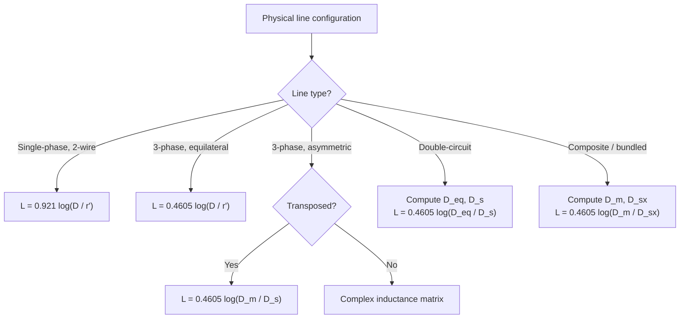

---

## 5. Three-Phase Lines

### 5.1 Symmetrical (equilateral) spacing

With phases $a$, $b$, $c$ at the vertices of an equilateral triangle of side $D$, and balanced currents $I_a + I_b + I_c = 0$:

$$\lambda_a = 0.4605 \!\left[ I_a \log_{10}\!\left(\frac{1}{r'}\right) + I_b \log_{10}\!\left(\frac{1}{D}\right) + I_c \log_{10}\!\left(\frac{1}{D}\right) \right]$$

Since $I_b + I_c = -I_a$:

$$\lambda_a = 0.4605\, I_a \log_{10}\!\left(\frac{D}{r'}\right)$$

$$\boxed{L_a = L_b = L_c = 0.4605 \log_{10}\!\left(\frac{D}{r'}\right) \quad \text{mH/km}}$$

### 5.2 Asymmetrical spacing

When $D_{ab} \neq D_{bc} \neq D_{ca}$, even with balanced currents the three phase inductances are **not equal** and are in general **complex** quantities (containing imaginary parts due to the $120°$ phase shifts in $I_b$ and $I_c$). In matrix form:

$$\begin{bmatrix} \lambda_a \\ \lambda_b \\ \lambda_c \end{bmatrix} = 0.4605 \begin{bmatrix} \log\frac{1}{r'} & \log\frac{1}{D_{ab}} & \log\frac{1}{D_{ca}} \\[4pt] \log\frac{1}{D_{ab}} & \log\frac{1}{r'} & \log\frac{1}{D_{bc}} \\[4pt] \log\frac{1}{D_{ca}} & \log\frac{1}{D_{bc}} & \log\frac{1}{r'} \end{bmatrix} \begin{bmatrix} I_a \\ I_b \\ I_c \end{bmatrix}$$

These unequal, complex inductances create unbalanced voltage drops and complicate power-system analysis. The solution is **transposition**.

## 6. Transposition

### 6.1 What transposition achieves

Transposition physically exchanges conductor positions at regular intervals (usually at switching stations) so that each conductor occupies each position for one-third of the total line length.

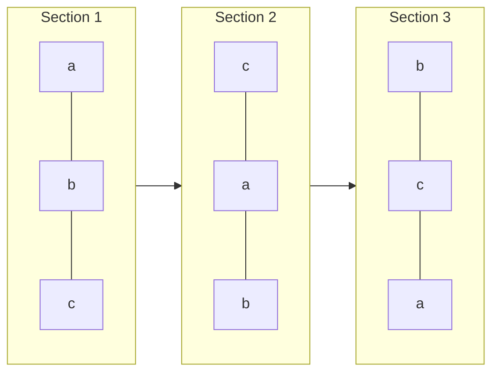

### 6.2 Average inductance of a transposed line

Averaging the phase inductances over one complete transposition cycle and simplifying:

$$\boxed{L = 0.4605 \log_{10}\!\left(\frac{D_m}{D_s}\right) \quad \text{mH/km}}$$

where:

$$D_m = (D_{ab}\, D_{bc}\, D_{ca})^{1/3} \qquad D_s = r'$$

The three phases now share a single, real-valued average inductance — exactly what we need for balanced-system studies.

## 7. Bundled Conductors

At extra-high voltage (EHV) levels, multiple sub-conductors per phase (a **bundle**) reduce corona loss, radio interference, and line inductance. The bundle replaces a single conductor; its GMR is computed from the GMD/GMR method.

| Bundle type | GMR formula | Notes |
|:---:|:---:|:---|
| 2-conductor | $D_s = \sqrt{r'\, d}$ | $d$ = bundle spacing |
| 3-conductor (equilateral) | $D_s = (r'\, d^2)^{1/3}$ | $d$ = side of triangle |
| 4-conductor (square) | $D_s = (r'\, \sqrt{2}\, d^3)^{1/4}$ | $d$ = side of square |

The inductance per phase becomes:

$$L = 0.4605 \log_{10}\!\left(\frac{D_m}{D_s}\right) \quad \text{mH/km}$$

where $D_s$ is now the bundle GMR rather than $r'$. Because $D_s \gg r'$, the ratio $D_m/D_s$ is smaller, and hence **inductance is reduced** by bundling.

## 8. Double-Circuit Lines

A double-circuit line has two parallel three-phase circuits on the same tower, providing higher reliability (if one circuit trips, the other continues) and lower impedance.

### 8.1 Standard configuration

For the standard arrangement where phases are arranged symmetrically:

- $D$ = distance between adjacent phases ($a$-$b$, $b$-$c$)
- $d_1$ = distance between $a$-$c'$, $b$-$b'$, $c$-$a'$
- $d_2$ = distance between $a$-$b'$, $b$-$a'$
- $d_3$ = distance between $a$-$a'$, $c$-$c'$

### 8.2 Equivalent GMD

Computing the mutual geometric mean distance between phases $a$ and $b$ (averaging over all four mutual paths):

$$D_{ab} = (D \cdot d_2 \cdot d_2 \cdot D)^{1/4} = \sqrt{D\, d_2}$$

By symmetry, $D_{bc} = \sqrt{D\, d_2}$, and $D_{ca} = \sqrt{2D \cdot d_1}$.

$$\boxed{D_{\text{eq}} = 2^{1/6}\, D^{1/2}\, d_2^{1/3}\, d_1^{1/6}}$$

### 8.3 Equivalent self GMD

$$\boxed{D_s = (r')^{1/2}\, d_1^{1/6}\, d_3^{1/3}}$$

### 8.4 Inductance

$$L = 0.4605 \log_{10}\!\left(\frac{D_{\text{eq}}}{D_s}\right) = 0.4605 \log_{10}\!\left[2^{1/6}\!\left(\frac{D}{r'}\right)^{1/2}\!\left(\frac{d_2}{d_3}\right)^{1/3}\right] \quad \text{mH/km}$$

Equivalently, $L = \tfrac{1}{2}(L_s - M)$, where $L_s$ is the self inductance of each individual circuit and $M$ is the mutual inductance between circuits. The factor $\tfrac{1}{2}$ arises because the two circuits are electrically in parallel.

## 9. Four-Wire Lines and Neutral Flux Linkage

In a three-phase four-wire system (three phases plus a neutral conductor), the neutral may carry unbalanced current or carry zero current (if the load is balanced). When the neutral carries **zero** current, it still has a non-zero **flux linkage** due to the magnetic fields of the phase conductors, and hence a voltage is **induced** along it.

For a neutral conductor $n$ with zero current, at distances $D_{an}$, $D_{bn}$, $D_{cn}$ from phases $a$, $b$, $c$:

$$\lambda_n = 0.4605 \!\left[ I_a \log_{10}\!\left(\frac{1}{D_{an}}\right) + I_b \log_{10}\!\left(\frac{1}{D_{bn}}\right) + I_c \log_{10}\!\left(\frac{1}{D_{cn}}\right) \right] \quad \text{mWb/km}$$

For a line of length $\ell$ kilometres, the induced voltage is:

$$V_n = j\omega\,\lambda_n\,\ell\times 10^{-3} \quad \text{V}$$

The factor $10^{-3}$ converts mWb to Wb. For induced voltage per kilometre, set $\ell=1$ km.

**Phase flux linkages** are computed by applying the generalised formula to each phase conductor. When $I_a + I_b + I_c = 0$, one current can be eliminated from each expression. For example, eliminating $I_c = -(I_a + I_b)$ from the expression for $\lambda_a$ simplifies it to a function of $I_a$ and $I_b$ only.

## 10. Mutual Interference with Telephone Lines

A power line running parallel to a telephone circuit induces a voltage in the telephone loop through mutual magnetic coupling.

For the symmetric arrangement considered here, take a single-phase power line with conductors $P_1$, $P_2$ carrying $+I$ and $-I$ respectively, and a telephone line with conductors $T_1$, $T_2$ running parallel below it. Let $d_1$ and $d_2$ be the distances from $P_1$ to $T_1$ and $T_2$ respectively.

The total flux linkage of the telephone loop is:

$$\lambda_T = \lambda_{T1} - \lambda_{T2} = 0.921\, I \log_{10}\!\left(\frac{d_2}{d_1}\right) \quad \text{mWb/km}$$

The minus sign arises because $T_1$ and $T_2$ form a loop: flux entering $T_1$ and leaving $T_2$ produces opposing linkages.

**Mutual inductance:**

$$\boxed{M = 0.921 \log_{10}\!\left(\frac{d_2}{d_1}\right) \quad \text{mH/km}}$$

**Induced voltage:**

$$|V_T| = 2\pi f\,M\,I\times 10^{-3} \quad \text{V/km}$$

Here $M$ is in mH/km; therefore $10^{-3}$ converts millihenries to henries.

## 11. Hollow Conductors

A hollow conductor carries current only between inner radius $r_1$ and outer radius $r_2$. The internal inductance is derived by integrating the flux linkages from $r_1$ to $r_2$, accounting for the fractional turns ratio at each radius:

$$\frac{d\lambda_x}{I} = \mu_0 \left(\frac{x^2 - r_1^2}{r_2^2 - r_1^2}\right)^{\!2} \frac{1}{2\pi x}\, dx$$

After integration:

$$\boxed{L_{\text{int}} = \frac{1}{2} \times 10^{-7} \cdot \frac{1}{(r_2^2 - r_1^2)^2}\!\left[(r_2^4 - r_1^4) - 4r_1^2(r_2^2 - r_1^2) + 4r_1^4 \ln\!\left(\frac{r_2}{r_1}\right)\right] \quad \text{H/m}}$$

**Check:** Setting $r_1 = 0$ gives $L_{\text{int}} = \tfrac{1}{2} \times 10^{-7}$ H/m — the solid-conductor result. ✓

The external inductance uses the outer radius:

$$L_{\text{ext}} = 2 \times 10^{-7} \ln\!\left(\frac{D}{r_2}\right) \quad \text{H/m}$$

> **Important:** The internal part uses $\ln$ (natural logarithm); the external part, once converted to the 0.4605 form, uses $\log_{10}$. Mixing these is a common error.

---

## Worked Examples

### Example 1 — Loop inductance of a two-wire line

**Problem.** A single-phase line has two solid cylindrical conductors, each of radius 1 cm, spaced 2 m apart. Find the loop inductance per kilometre.

**Solution.**

$$r' = 0.7788 \times 0.01 = 0.007788 \text{ m}$$

$$L = 0.921 \log_{10}\!\left(\frac{2}{0.007788}\right) = 0.921 \log_{10}(256.8) = 0.921 \times 2.4096 = 2.219 \text{ mH/km}$$

**Sanity check.** Typical overhead line loop inductances are 1–4 mH/km. ✓

---

### Example 2 — Per-phase inductance of a symmetrical three-phase line

**Problem.** A 3-phase, 50 Hz line has conductors of radius 1.5 cm at the vertices of an equilateral triangle of side 3 m. Find the inductance per phase per kilometre.

**Solution.**

$$r' = 0.7788 \times 0.015 = 0.01168 \text{ m}$$

$$L = 0.4605 \log_{10}\!\left(\frac{3}{0.01168}\right) = 0.4605 \log_{10}(256.8) = 0.4605 \times 2.4096 = 1.110 \text{ mH/km}$$

**Sanity check.** This is exactly half the loop inductance of Example 1 (as expected: $0.921/2 = 0.4605$, and $D/r'$ is the same). ✓

---

### Example 3 — Self GMR of a 7-strand conductor

**Problem.** A stranded conductor has 7 identical strands (1 central + 6 surrounding), each of radius $r$. Find the self GMD $D_s$ and the ratio $D_s / (3r)$.

**Configuration.** The 6 outer strands form a regular hexagon of side $2r$ around the central strand.

**Distinct distances:**

| Distance | Value | Occurrences in product |
|:---:|:---:|:---:|
| $r'$ (diagonal) | $0.7788r$ | 7 |
| Centre-to-outer and adjacent outer | $2r$ | 24 |
| $D_{13}$ (skip-one outer) | $2\sqrt{3}\, r$ | 12 |
| $D_{14}$ (diametrically opposite) | $4r$ | 6 |

**Power-sum check:** $7 + 24 + 12 + 6 = 49$, exactly matching the $7^2$ ordered self-and-mutual distance terms.

$$D_s = \left[(r')^7 \cdot (2r)^{24} \cdot (2\sqrt{3}\, r)^{12} \cdot (4r)^{6}\right]^{1/49}$$

With all 49 terms accounted for, the result is:

$$D_s = 2.177\, r$$

**Ratio to overall radius** ($R = 3r$):

$$\frac{D_s}{R} = \frac{2.177}{3} = 0.7257$$

**Comment.** The ratio is less than 0.7788 (the solid-conductor value) because the strands are spread over a larger area, but it approaches 0.7788 as the number of strands increases.

---

### Example 4 — Inductance of a 2-conductor bundle

**Problem.** A 3-phase line uses 2-conductor bundles. Each conductor has radius 1.5 cm; bundle spacing is 40 cm; phase spacing (GMD) is 8 m. Find the inductance per phase per kilometre.

**Solution.**

$$r' = 0.7788 \times 0.015 = 0.01168 \text{ m}$$

Bundle GMR:

$$D_s = \sqrt{r' \times d} = \sqrt{0.01168 \times 0.40} = \sqrt{0.004672} = 0.06836 \text{ m}$$

Inductance:

$$L = 0.4605 \log_{10}\!\left(\frac{8}{0.06836}\right) = 0.4605 \log_{10}(117.0) = 0.4605 \times 2.068 = 0.952 \text{ mH/km}$$

**Comparison.** Without bundling: $L = 0.4605 \log_{10}(8/0.01168) = 1.306$ mH/km. The bundle reduces inductance by approximately **27 %**, which also reduces reactive power and improves voltage regulation.

---

### Example 5 — Mutual inductance between a power line and a telephone line

**Problem.** A single-phase 50 Hz power line carries 150 A. A telephone line runs parallel below it. The distances from power conductor $P_1$ to the two telephone conductors are $d_1 = 3$ m and $d_2 = 4$ m. Find the mutual inductance and the induced voltage per kilometre.

**Solution.**

$$M = 0.921 \log_{10}\!\left(\frac{d_2}{d_1}\right) = 0.921 \log_{10}\!\left(\frac{4}{3}\right) = 0.921 \times 0.1249 = 0.115 \text{ mH/km}$$

$$|V_T| = 2\pi \times 50 \times 0.115 \times 10^{-3} \times 150 = 5.42 \text{ V/km}$$

**Sanity check.** A few volts per kilometre is typical for parallel power-telephone exposure. If the telephone line is transposed, the net coupling is greatly reduced. ✓

---

### Example 6 — Double-circuit transposed line

**Problem.** A transposed double-circuit 3-phase line has conductor radius 2 cm and the following distances (in metres): $D = 4.07$, $d_1 = 7.5$, $d_2 = 9.17$, $d_3 = 10.96$. Find the inductance per phase per kilometre.

**Solution.**

$$r' = 0.7788 \times 0.02 = 0.01558 \text{ m}$$

Equivalent GMD:

$$D_{\text{eq}} = 2^{1/6}\, D^{1/2}\, d_2^{1/3}\, d_1^{1/6} = 1.1225 \times 2.017 \times 2.094 \times 1.398 = 6.611 \text{ m}$$

Equivalent self GMD:

$$D_s = (r')^{1/2}\, d_1^{1/6}\, d_3^{1/3} = (0.01558)^{1/2} \times (7.5)^{1/6} \times (10.96)^{1/3}$$

$$= 0.1248 \times 1.398 \times 2.222 = 0.389 \text{ m}$$

Inductance:

$$L = 0.4605 \log_{10}\!\left(\frac{6.611}{0.389}\right) = 0.4605 \log_{10}(17.00) = 0.4605 \times 1.230 = 0.567 \text{ mH/km}$$

**Sanity check.** Double-circuit lines typically have lower per-phase inductance than single-circuit lines. The value 0.567 mH/km is reasonable. ✓

---

## Configuration Comparison Table

| Configuration | Formula (mH/km) | Key quantities |
|:---|:---:|:---|
| Single-phase, 2-wire (loop) | $0.921 \log_{10}(D/r')$ | $r' = 0.7788r$ |
| 3-phase, equilateral | $0.4605 \log_{10}(D/r')$ | per phase |
| 3-phase, transposed | $0.4605 \log_{10}(D_m / D_s)$ | $D_m = (D_{ab}D_{bc}D_{ca})^{1/3}$, $D_s = r'$ |
| 3-phase, double-circuit | $0.4605 \log_{10}(D_{\text{eq}} / D_s)$ | $D_{\text{eq}} = 2^{1/6} D^{1/2} d_2^{1/3} d_1^{1/6}$ |
| Composite conductor X | $0.4605 \log_{10}(D_m / D_{sx})$ | mutual GMD / self GMD |
| 2-conductor bundle | $0.4605 \log_{10}(D_m / \sqrt{r' d})$ | $d$ = bundle spacing |

**Unifying pattern:** Every formula has the form $0.4605 \log_{10}(\text{mutual distance / self distance})$. The only thing that changes between configurations is how these distances are computed.

---

## Common Mistakes and How to Avoid Them

| Mistake | Consequence | Prevention |
|:---|:---|:---|
| Using $r$ instead of $r'$ | Overestimates inductance by ~12 % | Always substitute $r' = 0.7788r$ |
| Using $\ln$ where $\log_{10}$ is needed (or vice versa) | Off by factor of 2.3026 | Check: 0.4605 formulas use $\log_{10}$; $2\times10^{-7}$ derivations use $\ln$ |
| Forgetting the 0.4605 multiplier | Off by orders of magnitude | The factor encodes unit conversion; never omit it |
| Loop inductance vs per-conductor | Factor-of-2 error | Loop = $2 \times$ per-conductor (for identical conductors) |
| Power-sum error in GMR | Wrong root index → wrong $D_s$ | Add all exponents; must equal $n^2$ |
| Confusing $D$ (phase spacing) with $d$ (inter-circuit distance) | Wrong $D_{\text{eq}}$ or $D_s$ in double-circuit | Label every distance on a diagram before substituting |
| Omitting the $\frac{1}{2}$ in $L = \frac{1}{2}(L_s - M)$ | Overestimates double-circuit inductance | The two parallel circuits halve the impedance |
| Unit mismatch (cm vs m, H vs mH) | Wrong numerical answer | Convert all lengths to metres before computing; final answer in mH/km |

---

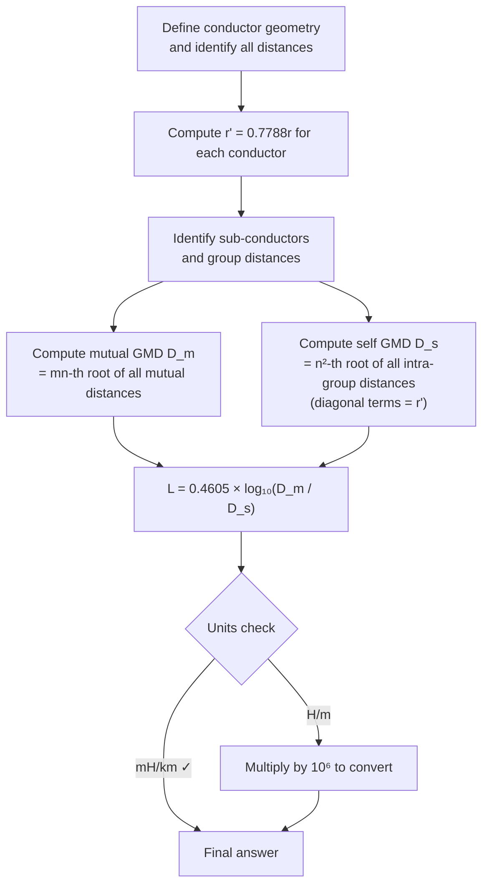

---

## Rapid-Revision Checklist

- [ ] **Fictitious radius:** $r' = 0.7788\, r$ — always use this in the 0.4605 formulas.
- [ ] **Per-conductor inductance:** $L = 0.4605 \log_{10}(D / r')$ mH/km.
- [ ] **Loop inductance (identical conductors):** $L = 0.921 \log_{10}(D / r')$ mH/km.
- [ ] **Generalised flux linkage:** $\lambda_i = 0.4605\bigl[I_i \log_{10}(1/r_i') + \sum_{j\neq i} I_j \log_{10}(1/D_{ij})\bigr]$ mWb/km.
- [ ] **Balanced currents:** $I_a + I_b + I_c = 0$; use this to eliminate one current from each flux linkage expression.
- [ ] **Symmetrical 3-phase:** $L = 0.4605 \log_{10}(D/r')$ — all phases equal.
- [ ] **Transposed line:** $L = 0.4605 \log_{10}(D_m / D_s)$; $D_m = (D_{ab}D_{bc}D_{ca})^{1/3}$; $D_s = r'$.
- [ ] **Composite conductor:** $L = 0.4605 \log_{10}(D_m / D_{sx})$; mutual GMD $= (mn)$-th root; self GMD $= n^2$-th root.
- [ ] **Power-sum check:** Exponents in the GMR product must sum to $n^2$.
- [ ] **Bundle GMR:** 2-conductor $= \sqrt{r' d}$; 3-conductor $= (r' d^2)^{1/3}$; 4-conductor $= (r' \sqrt{2}\, d^3)^{1/4}$.
- [ ] **Double-circuit:** $D_{\text{eq}} = 2^{1/6} D^{1/2} d_2^{1/3} d_1^{1/6}$; $D_s = (r')^{1/2} d_1^{1/6} d_3^{1/3}$.
- [ ] **Mutual interference:** $M = 0.921 \log_{10}(d_2/d_1)$ mH/km; $|V_T| = 2\pi f M I \times 10^{-3}$ V/km.
- [ ] **Hollow conductor:** Internal inductance uses $\ln$; external uses $\log_{10}$ in the 0.4605 form.
- [ ] **Logarithm discipline:** The 0.4605 family uses $\log_{10}$; derivations from Ampère's law use $\ln$.
- [ ] **Units:** All distances in metres; final answer in mH/km; flux linkage in mWb/km.

---

## Assignment Questions and Worked Solutions

### Assignment Q1

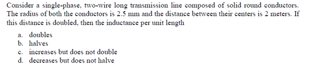

Worked solution

The inductance of a single-phase transmission line is proportional to the natural logarithm of the ratio of conductor spacing to the modified radius:

$$
L \propto \ln\frac{d}{r'}
$$

For two cases with the same conductor but different spacings $d_1$ and $d_2 = 2d_1$:

$$
L_1 \propto \ln\frac{d}{r'}, \qquad L_2 \propto \ln\frac{2d}{r'}
$$

Since $\ln\frac{2d}{r'} > \ln\frac{d}{r'}$, we know $L_2 > L_1$.

However, the logarithm is **not** a linear function, so:

$$
L_2 \neq 2L_1
$$

**Conclusion:** The inductance increases when spacing is doubled, but it does not double.

> **Correct Answer: c**

> ⚠️ **Exam trap:** A common mistake is to assume doubling the spacing doubles the inductance. Because $L$ depends on $\ln(d/r')$, doubling $d$ only adds $0.2\ln 2 \approx 0.1386$ mH/km — not a factor of 2.

---

### Assignment Q2

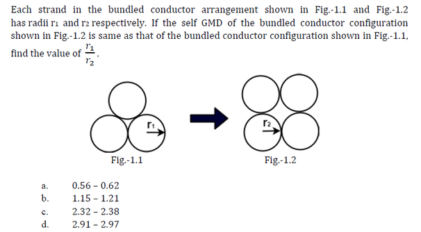

Worked solution

**3-conductor configuration:**

The mutual distances between sub-conductors in a triangular bundle (sub-conductor spacing $= 2r_1$) are:

$$
d_1 = 0.7788\,r_1, \quad d_2 = d_3 = 2r_1
$$

The self GMD (geometric mean radius of the bundle) is:

$$
\text{GMR}_3 = (d_1 \cdot d_2 \cdot d_3)^{1/3} = (0.7788\,r_1 \cdot 2r_1 \cdot 2r_1)^{1/3} = 1.4605\,r_1
$$

**4-conductor configuration:**

For a square bundle (sub-conductor spacing $= 2r_2$):

$$
d_1 = 0.7788\,r_2, \quad d_2 = d_3 = 2r_2, \quad d_4 = \sqrt{(2r_2)^2 + (2r_2)^2} = 2.8284\,r_2
$$

$$
\text{GMR}_4 = (d_1 \cdot d_2 \cdot d_3 \cdot d_4)^{1/4} = (0.7788\,r_2 \cdot 2r_2 \cdot 2r_2 \cdot 2.8284\,r_2)^{1/4} = 1.7229\,r_2
$$

**Equating the two self GMDs** (same inductance requires same GMR):

$$
1.7229\,r_2 = 1.4605\,r_1
$$

$$
\frac{r_1}{r_2} = \frac{1.7229}{1.4605} = 1.1797
$$

> **Correct Answer: b**

> ⚠️ **Exam trap:** For a square bundle, don't forget the diagonal distance $d_4 = \sqrt{2}\times(2r)$; omitting it gives the wrong GMR.

---

### Assignment Q3

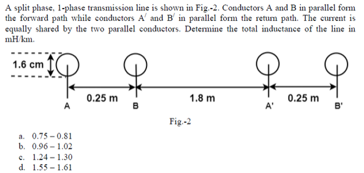

Worked solution

**Given:** Conductor diameter $= 1.6$ cm, so radius $r = 0.8$ cm. This is a split-phase single-phase line.

**Self GMD of the line:**

$$
D_s = \sqrt{d_{AA} \cdot d_{AB}} = \sqrt{0.7788 \times 0.8 \times 10^{-2} \times 0.25} = 0.0395 \text{ m}
$$

**Mutual GMD of the line:**

$$
D_m = \sqrt[4]{d_{A'B} \cdot d_{AA'} \cdot d_{BB'} \cdot d_{AB'}} = \sqrt[4]{1.8 \times 2.05 \times 2.05 \times 2.3} = 2.0423 \text{ m}
$$

**Inductance of the split-phase single-phase line:**

The total inductance carries a factor of 2 for the two bundled conductors:

$$
L = 2 \times 0.2 \times \ln\!\left(\frac{D_m}{D_s}\right) \text{ mH/km}
$$

$$
L = 2 \times 0.2 \times \ln\!\left(\frac{2.0423}{0.0395}\right)
$$

$$
L = 0.4 \times \ln(51.7038) = 0.4 \times 3.9456
$$

$$
\boxed{L = 1.5782 \text{ mH/km}}
$$

> **Correct Answer: d**

> ⚠️ **Exam trap:** For a split-phase (2-conductor bundled) single-phase line, remember the factor of **2** in front. Omitting it gives exactly half the correct answer.

---

### Assignment Q4

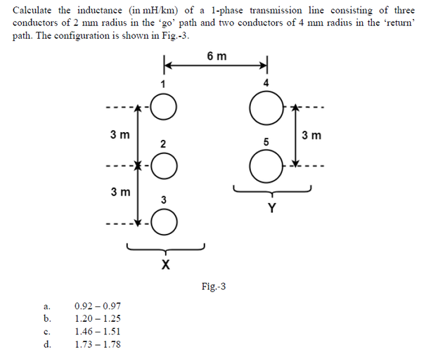

Worked solution

This is a two-circuit line where set-X has 3 sub-conductors per phase and set-Y has 2 sub-conductors per phase.

**Mutual GMD between sets X and Y:**

$$
\text{GMD}_m = \sqrt[6]{D_{14} \cdot D_{15} \cdot D_{24} \cdot D_{25} \cdot D_{34} \cdot D_{35}}
$$

Computing the phase-to-phase distances:

$$
D_{14} = D_{25} = 6 \text{ m}
$$

$$
D_{15} = D_{24} = D_{35} = \sqrt{3^2 + 6^2} = 6.7082 \text{ m}
$$

$$
D_{34} = \sqrt{(3+3)^2 + 6^2} = 8.4853 \text{ m}
$$

$$
\text{GMD}_m = \sqrt[6]{6^2 \times 6.7082^3 \times 8.4853} = 6.7215 \text{ m}
$$

**Self GMD of set-X (3-conductor bundle):**

$$
\text{GMD}_{sX} = \sqrt[9]{(0.7788 \times 2 \times 10^{-3})^3 \times 3^4 \times 6^2} = 0.2813 \text{ m}
$$

$$
L_X = 0.2 \times \ln\!\left(\frac{\text{GMD}_m}{\text{GMD}_{sX}}\right) = 0.2 \times \ln\!\left(\frac{6.7215}{0.2813}\right) = 0.6347 \text{ mH/km}
$$

**Self GMD of set-Y (2-conductor bundle):**

$$
\text{GMD}_{sY} = \sqrt[4]{(0.7788 \times 4 \times 10^{-3})^2 \times 3^2} = 0.0967 \text{ m}
$$

$$
L_Y = 0.2 \times \ln\!\left(\frac{\text{GMD}_m}{\text{GMD}_{sY}}\right) = 0.2 \times \ln\!\left(\frac{6.7215}{0.0967}\right) = 0.8483 \text{ mH/km}
$$

**Total inductance:**

$$
\boxed{L_{\text{Total}} = L_X + L_Y = 0.6347 + 0.8483 = 1.483 \text{ mH/km}}
$$

> **Correct Answer: c**

> ⚠️ **Exam trap:** For asymmetric two-circuit lines, each circuit has its own $\text{GMD}_s$ — don't combine all sub-conductors into a single GMR unless every phase has the same bundle configuration.

---

### Assignment Q5

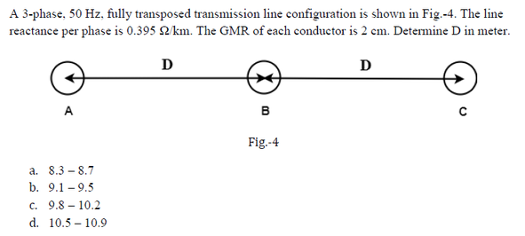

Worked solution

**Given:** Symmetric three-phase line with spacing $D$ between the central and each outer conductor, and $2D$ between the two outer conductors. GMR $= 2$ cm $= 0.02$ m. Inductive reactance $X_L = 0.395$ Ω/km, $f = 50$ Hz.

**Mutual GMD:**

$$
D_m = (D \times D \times 2D)^{1/3} = (2D^3)^{1/3} = 2^{1/3}\,D = 1.26\,D \text{ m}
$$

**Inductance from the reactance:**

$$
X_L = 2\pi f L \implies L = \frac{X_L}{2\pi f} = \frac{0.395}{2\pi \times 50} = 1.2573 \times 10^{-3} \text{ H/km} = 1.2573 \text{ mH/km}
$$

**Using the inductance formula:**

$$
L = 0.2 \times \ln\!\left(\frac{D_m}{D_s}\right) \text{ mH/km}
$$

$$
1.2573 = 0.2 \times \ln\!\left(\frac{1.26\,D}{0.02}\right)
$$

$$
\ln\!\left(\frac{1.26\,D}{0.02}\right) = \frac{1.2573}{0.2} = 6.2865
$$

$$
\frac{1.26\,D}{0.02} = e^{6.2865} = 537.25
$$

$$
1.26\,D = 10.745
$$

$$
\boxed{D = 8.528 \text{ m}}
$$

> **Correct Answer: a**

> ⚠️ **Unit check:** Convert GMR from cm to m (0.02 m) before substituting. Mixing cm and m is the most common numerical error in inductance problems.

---

### Assignment Q6

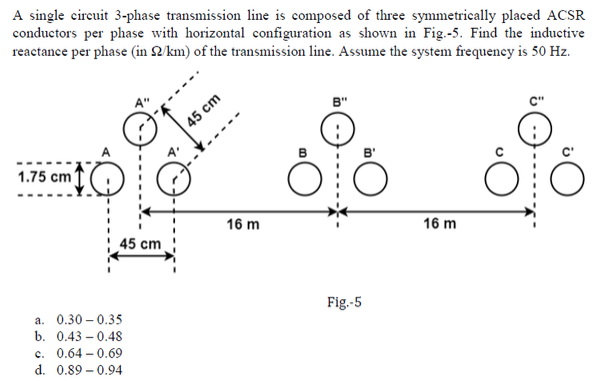

Worked solution

**Given:** Conductor diameter $= 1.75$ cm, sub-conductor spacing $d = 45$ cm, phase spacing $D_{AB} = 16$ m, $D_{BC} = 16$ m, $D_{CA} = 32$ m.

**Radius:** $r = 0.875$ cm $= 0.00875$ m

**Self GMD of 3-conductor bundle:**

$$
D_s = (0.7788\,r \cdot d^2)^{1/3} = (0.7788 \times 0.875 \times 10^{-2} \times 0.45^2)^{1/3} = 0.1113 \text{ m}
$$

**Mutual GMD:** Since $0.45 \text{ m} \ll 16 \text{ m} < 32$ m, we approximate using phase-center distances:

$$
D_m = (D_{AB} \cdot D_{BC} \cdot D_{CA})^{1/3} = (16 \times 16 \times 32)^{1/3} = 20.1587 \text{ m}
$$

**Inductance:**

$$
L = 0.2 \times \ln\!\left(\frac{D_m}{D_s}\right) = 0.2 \times \ln\!\left(\frac{20.1587}{0.1113}\right) = 1.0398 \text{ mH/km}
$$

**Inductive reactance:**

$$
X_L = 2\pi f L = 2\pi \times 50 \times 1.0398 \times 10^{-3}
$$

$$
\boxed{X_L = 0.3267 \text{ Ω/km}}
$$

> **Correct Answer: a**

> ⚠️ **Exam trap:** Don't confuse sub-conductor spacing $d$ (in cm) with phase spacing $D$ (in m). Convert all distances to metres before computing the GMD.

---

### Assignment Q7

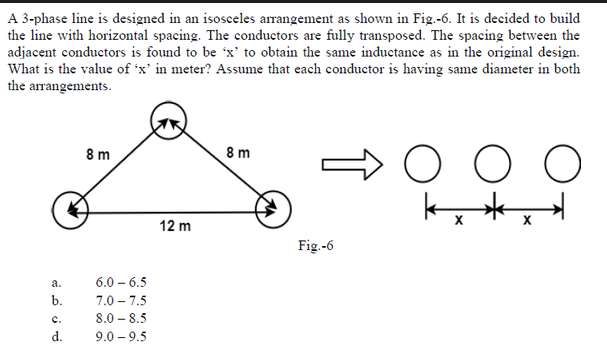

Worked solution

**Given:** Original design has asymmetric spacing with distances 8 m, 8 m, and 12 m. New design uses equilateral-like spacing $x$ with one side $2x$. Both designs must have the same inductance, which means the same mutual GMD $D_m$.

**Original design:**

$$
D_{m1} = (8 \times 8 \times 12)^{1/3} = 9.1577 \text{ m}
$$

**New design:**

$$
D_{m2} = (x \cdot x \cdot 2x)^{1/3} = (2x^3)^{1/3} = x \cdot 2^{1/3}
$$

**Equating the mutual GMDs** (since equal inductance implies equal $D_m$):

$$
x \cdot 2^{1/3} = 9.1577
$$

$$
x = \frac{9.1577}{2^{1/3}} = \frac{9.1577}{1.2599}
$$

$$
\boxed{x = 7.2685 \text{ m}}
$$

> **Correct Answer: b**

> ⚠️ **Exam trap:** For the redesign with spacing $x$, $x$, and $2x$, the mutual GMD is $(2x^3)^{1/3} = x\cdot 2^{1/3}$, not simply $x$. Treating all three sides as equal gives the wrong answer.

---

### Assignment Q8

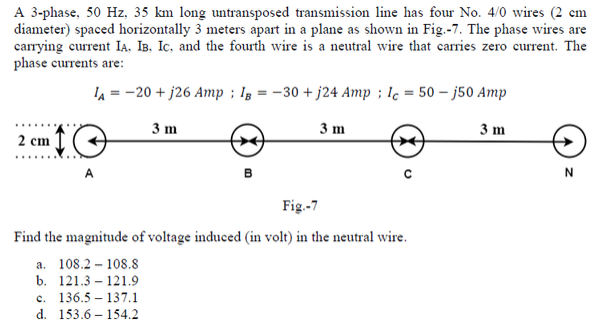

Worked solution

**Given:** Conductor radius $r = 1$ cm. Neutral wire $N$ is at distances $D_{AN} = 9$ m, $D_{BN} = 6$ m, $D_{CN} = 3$ m.

**Phase currents:**

$$
I_A = -20 + j26 \text{ A}, \quad I_B = -30 + j24 \text{ A}, \quad I_C = 50 - j50 \text{ A}
$$

**Flux linkage of the neutral wire:**

$$
\lambda_N = 0.2\left[I_A \ln\frac{1}{D_{AN}} + I_B \ln\frac{1}{D_{BN}} + I_C \ln\frac{1}{D_{CN}}\right] \text{ mWb-T/km}
$$

$$
\lambda_N = -0.2\left[2.1972(-20+j26) + 1.7918(-30+j24) + 1.0986(50-j50)\right]
$$

Computing each term:

$$
2.1972(-20+j26) = -43.944 + j57.127
$$

$$
1.7918(-30+j24) = -53.754 + j43.003
$$

$$
1.0986(50-j50) = 54.930 - j54.930
$$

Sum:

$$
(-43.944 - 53.754 + 54.930) + j(57.127 + 43.003 - 54.930) = -42.768 + j45.200
$$

$$
\lambda_N = -0.2 \times (-42.768 + j45.200) = (8.5536 - j9.0401) \text{ mWb-T/km}
$$

**Induced voltage** ($f = 50$ Hz, length $= 35$ km):

$$
V_N = j\omega\,\lambda_N \times 35 = j \times 2\pi \times 50 \times 35 \times (8.5536 - j9.0401) \times 10^{-3}
$$

Magnitude:

$$
|V_N| = 2\pi \times 50 \times 35 \times \sqrt{8.5536^2 + 9.0401^2} \times 10^{-3} = 136.844 \text{ V}
$$

Phase angle:

$$
\angle V_N = 90° + \arctan\!\left(\frac{-9.0401}{8.5536}\right) = 90° - 46.584° = 43.416°
$$

$$
\boxed{V_N = 136.844\angle 43.416° \text{ V}}
$$

> **Correct Answer: c**

> ⚠️ **Unit check:** The flux linkage formula gives mWb-T/km, so multiply by $\omega \times 10^{-3}$ for the correct voltage units. The length factor (35 km) is applied at the end.

---

### Assignment Q9

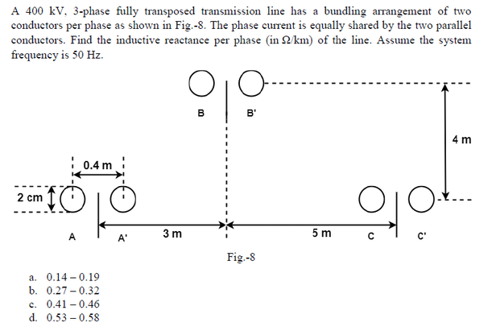

Worked solution

**Given:** Conductor diameter $= 2$ cm, sub-conductor spacing $d = 0.4$ m. Phase spacings: $D_{AB} = \sqrt{3^2+4^2} = 5$ m, $D_{BC} = \sqrt{4^2+5^2} = 6.4031$ m, $D_{CA} = 8$ m.

**Radius:** $r = 1$ cm $= 0.01$ m

**Self GMD of 2-conductor bundle:**

$$
D_s = (0.7788\,r \cdot d)^{1/2} = (0.7788 \times 0.01 \times 0.4)^{1/2} = 0.0558 \text{ m}
$$

**Mutual GMD:**

Since $0.4 \text{ m} \ll 3 \text{ m} < 4 \text{ m} < 5 \text{ m}$, approximate using phase-center distances:

$$
D_m = (D_{AB} \cdot D_{BC} \cdot D_{CA})^{1/3} = (5 \times 6.4031 \times 8)^{1/3} = 6.3506 \text{ m}
$$

**Inductance:**

$$
L = 0.2 \times \ln\!\left(\frac{D_m}{D_s}\right) = 0.2 \times \ln\!\left(\frac{6.3506}{0.0558}\right) = 0.9469 \text{ mH/km}
$$

**Inductive reactance:**

$$
X_L = 2\pi f L = 2\pi \times 50 \times 0.9469 \times 10^{-3}
$$

$$
\boxed{X_L = 0.2975 \text{ Ω/km}}
$$

> **Correct Answer: b**

> ⚠️ **Exam trap:** For a 2-conductor bundle, the exponent in the GMR formula is $1/2$ (not $1/3$ as for a 3-conductor bundle). Using the wrong root gives an incorrect $D_s$.

---

### Assignment Q10

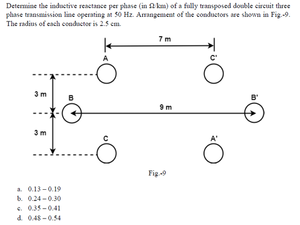

Worked solution

**Given:** Conductor radius $r = 2.5$ cm $= 0.025$ m. Modified radius $r' = 0.7788 \times 0.025 = 0.0195$ m.

**Geometric distances:**

| Distance | Formula | Value |
|----------|---------|-------|
| $d_1$ | — | 7 m |
| $d_2$ | $\sqrt{3^2 + 8^2}$ | 8.5440 m |
| $d_3$ | $\sqrt{6^2 + 7^2}$ | 9.2195 m |
| $d_4$ | — | 9 m |
| $d_5$ | $\sqrt{1^2 + 3^2}$ | 3.1623 m |
| $d_6$ | $3 + 3$ | 6 m |

**Self GMD:**

$$
D_{SA} = (r' \cdot d_3)^{1/2}, \quad D_{SB} = (r' \cdot d_4)^{1/2}, \quad D_{SC} = (r' \cdot d_3)^{1/2}
$$

$$
D_s = (D_{SA} \cdot D_{SB} \cdot D_{SC})^{1/3} = \left[(r' d_3)^{1/2} \cdot (r' d_4)^{1/2} \cdot (r' d_3)^{1/2}\right]^{1/3}
$$

$$
D_s = (r'^{3/2} \cdot d_3 \cdot d_4^{1/2})^{1/3} = 0.4223 \text{ m}
$$

**Mutual GMD:**

$$
D_{AB} = (d_2 \cdot d_5)^{1/2}, \quad D_{BC} = (d_2 \cdot d_5)^{1/2}, \quad D_{AC} = (d_1 \cdot d_6)^{1/2}
$$

$$
D_m = \left[(d_2 d_5)^{1/2} \cdot (d_2 d_5)^{1/2} \cdot (d_1 d_6)^{1/2}\right]^{1/3} = (d_2 \cdot d_5 \cdot (d_1 d_6)^{1/2})^{1/3} = 5.5945 \text{ m}
$$

**Inductance and reactance:**

$$
L = 0.2 \times \ln\!\left(\frac{5.5945}{0.4223}\right) = 0.5168 \text{ mH/km}
$$

$$
X_L = 2\pi \times 50 \times 0.5168 \times 10^{-3}
$$

$$
\boxed{X_L = 0.1624 \text{ Ω/km}}
$$

> **Correct Answer: a**

> ⚠️ **Exam trap:** For a fully asymmetric line, compute each phase pair's GMD separately before taking the cube root. Do not assume $D_m = (d_1 \cdot d_2 \cdot d_3)^{1/3}$ where those are direct side distances.

---

### Assignment Q11

**Additional worked problem from the solution set**

> *Note: The original question image for Q11 is not available. The problem compares a 4-conductor bundled line (Fig. 10.1) with a single-conductor line (Fig. 10.2) and finds the single-conductor radius that gives the same inductance.*

Worked solution

**Part 1 — 4-conductor bundled line (Fig. 10.1):**

Given: Conductor radius $r = 1$ cm, sub-conductor spacing $d = 30$ cm $= 0.30$ m. Phase spacings $D_{AB} = D_{BC} = 15$ m, $D_{CA} = 30$ m.

**Self GMD of 4-conductor bundle:**

$$
D_s = \left(0.7788\,r \cdot \sqrt{2}\,d^3\right)^{1/4} = \left(0.7788 \times 10^{-2} \times \sqrt{2} \times 0.30^3\right)^{1/4} = 0.1313 \text{ m}
$$

**Mutual GMD:**

Since $0.30 \text{ m} \ll 15 \text{ m} < 30$ m:

$$
D_m = (15 \times 15 \times 30)^{1/3} = 18.8988 \text{ m}
$$

**Inductance:**

$$
L_1 = 0.2 \times \ln\!\left(\frac{18.8988}{0.1313}\right) \text{ mH/km}
$$

**Part 2 — Single-conductor line (Fig. 10.2):**

Let the single conductor have radius $x$ cm.

$$
D_s = 0.7788 \times x \times 10^{-2} \text{ m}
$$

$$
D_m = (15 \times 15 \times 30)^{1/3} = 18.8988 \text{ m} \quad \text{(same as Part 1)}
$$

$$
L_2 = 0.2 \times \ln\!\left(\frac{18.8988}{0.7788\,x \times 10^{-2}}\right) \text{ mH/km}
$$

**Equating $L_1 = L_2$:**

Since the pre-factor (0.2) and $D_m$ are identical in both expressions, the arguments of the logarithms must be equal:

$$
\frac{18.8988}{0.1313} = \frac{18.8988}{0.7788\,x \times 10^{-2}}
$$

$$
0.7788\,x \times 10^{-2} = 0.1313
$$

$$
x = \frac{0.1313}{0.7788 \times 10^{-2}}
$$

$$
\boxed{x = 16.86 \text{ cm}}
$$

> **Correct Answer: d**

> ⚠️ **Exam trap:** When equating two inductances with the same $D_m$, you only need $D_{s1} = D_{s2}$. Don't recalculate $D_m$ from scratch — it cancels directly.

---

### Assignment Q12

**Additional worked problem from the solution set**

> *Note: The original question image for Q12 is not available. The problem computes the induced voltage in a telephone circuit located near a single-circuit power line with two conductors.*

Worked solution

**Given:** Power line current $I = 150$ A (r.m.s.), $f = 50$ Hz. The power line conductors $P_1$ and $P_2$ are at known positions relative to telephone conductors $T_1$ and $T_2$.

**Computed distances:**

$$
d_3 = D_{P_2 T_1} = \sqrt{3.5^2 + 4.5^2} = 5.7009 \text{ m}
$$

$$
d_4 = D_{P_2 T_1} = \sqrt{3.5^2 + 4.5^2} = 5.7009 \text{ m}
$$

$$
d_5 = D_{P_1 T_1} = \sqrt{2.5^2 + 3.5^2} = 4.3012 \text{ m}
$$

$$
d_6 = D_{P_2 T_2} = \sqrt{2.5^2 + 3.5^2} = 4.3012 \text{ m}
$$

**Flux linkage of telephone line $T_1$:**

$$
\lambda_{T_1} = 0.2\left(I \ln\frac{1}{d_5} - I \ln\frac{1}{d_4}\right) = 0.2\,I \ln\frac{d_4}{d_5}
$$

$$
= 0.2 \times 150 \times \ln\frac{5.7009}{4.3012} = 8.4519 \text{ mWb-T/km}
$$

**Flux linkage of telephone line $T_2$:**

$$
\lambda_{T_2} = 0.2\,I \ln\frac{d_6}{d_3} = 0.2 \times 150 \times \ln\frac{4.3012}{5.7009} = -8.4519 \text{ mWb-T/km}
$$

**Total flux linkage of the telephone circuit:**

$$
\lambda_T = \lambda_{T_1} - \lambda_{T_2} = 8.4519 - (-8.4519) = 16.9038 \text{ mWb-T/km}
$$

**Induced voltage magnitude:**

$$
V_T = \omega\,\lambda_T = 2\pi \times 50 \times 16.9038 \times 10^{-3}
$$

$$
\boxed{V_T = 5.3105 \text{ V/km}}
$$

> **Correct Answer: c**

> ⚠️ **Exam trap:** The total flux linkage is $\lambda_{T_1} - \lambda_{T_2}$. Since $\lambda_{T_2}$ is negative, the magnitudes **add** — don't subtract them. This is the most frequent sign error in telephone interference problems.

