# Week 3 - Capacitance, Components, and the Per-Unit System

## Orientation

Welcome to Week 3 of our Power System Analysis journey. This week marks a significant transition: we complete our study of transmission line parameters by diving deep into **capacitance**, then shift our focus to the **components** that make up power systems, and finally introduce the **per-unit system** that will be our working language for the rest of the course.

In Week 2, we established the foundations of resistance and inductance. We learned about GMR, GMD, transposition, and the flux linkage approach. Now, in Week 3, we apply similar mathematical machinery to capacitance, but with a crucial twist: **for capacitance, we use the actual radius r, not r′**. This distinction is fundamental and will appear repeatedly in exams.

The week is structured across five lectures (Lectures 11-15). The first four lectures (11-14) are dedicated entirely to capacitance calculations—from basic single-phase lines to complex bundled double-circuit configurations. The fifth lecture (15) pivots to power system components: we examine transformer connections, understand why certain configurations are preferred, and then introduce the per-unit system that simplifies our calculations dramatically.

As I work through these notes, I'm struck by how the lecturer emphasizes physical intuition alongside mathematical rigor. For instance, when deriving the capacitance of a 3-phase transposed line, he encourages us to write equations "from your imagination" rather than memorizing diagrams. This is the level of understanding we should aim for.

Let me give you a roadmap of what we'll cover:

1. **Lecture 11**: GMR examples for stranded conductors, induced voltage in telephone lines, and the introduction to capacitance concepts
2. **Lecture 12**: Capacitance of single-phase and 3-phase lines, bundled conductors
3. **Lecture 13**: Double circuit lines, effect of earth on capacitance, and a comprehensive worked example
4. **Lecture 14**: More worked examples including earth effects, double circuit lines, and bundled configurations
5. **Lecture 15**: Power system components, transformer connections, and the per-unit system

By the end of this week, you should be able to calculate capacitance for any transmission line configuration, understand why bundled conductors are used, and begin working with per-unit quantities.

## Learning Outcomes

After completing this week's material, you will be able to:

1. **Calculate GMR for stranded conductors** with 3-strand and 4-strand configurations, understanding why r′ appears only once in the calculation.

2. **Compute induced voltage in nearby circuits** (such as telephone lines) due to power line currents, using flux linkage and phasor analysis.

3. **Explain the physical basis of capacitance** in transmission lines, including the role of electric fields, equipotential surfaces, and Gauss's theorem.

4. **Derive and apply the capacitance formulas** for single-phase lines, including line-to-line and line-to-neutral capacitance, in both F/m and μF/km units.

5. **Calculate capacitance for 3-phase transposed lines** using the concept of equivalent GMD (D_eq) and understand why transposition averaging is necessary.

6. **Apply bundled conductor formulas** for 2, 3, and 4 conductor arrangements, remembering that capacitance uses actual radius r (not r′).

7. **Analyze double circuit 3-phase lines**, computing both D_eq and D_s for complex configurations with multiple transposition sections.

8. **Quantify the effect of earth on capacitance** using the method of image charges, and justify why this effect is typically negligible.

9. **Calculate charging current and reactive power** supplied by line capacitance for practical transmission lines.

10. **Describe power system components** including synchronous generators, loads, and transformer connections, understanding the advantages and disadvantages of each configuration.

11. **Explain the per-unit system** and its advantages for power system analysis, including how different voltage levels disappear in per-unit representation.

12. **Construct single-phase equivalent circuits** for balanced 3-phase systems, recognizing when neutral impedance matters and when it doesn't.

## Syllabus Map

This week covers Lectures 11 through 15 from the NPTEL Power System Analysis course by Prof. Debapriya Das, IIT Kharagpur.

| Lecture | Topic | Source Pages |
|---------|-------|--------------|
| Lecture 11 | Resistance and Inductance (Contd.): GMR examples, telephone line induction, introduction to capacitance | Physical PDF pages 43-59 |
| Lecture 12 | Capacitance of Transmission Lines: single-phase, 3-phase, bundled conductors | Physical PDF pages 60-77 |
| Lecture 13 | Capacitance of Transmission Lines (Contd.): double circuit lines, earth effect, worked examples | Physical PDF pages 78-96 |
| Lecture 14 | Capacitance of Transmission Lines (Contd.): bundled conductor examples, composite conductors | Physical PDF pages 97-113 |
| Lecture 15 | Power System Components and Per-Unit System: transformer connections, per-unit basics | Physical PDF pages 114-132 |

**Source provenance**: These page numbers refer to the physical PDF pages of the NPTEL course materials as extracted via Mistral OCR 4.

---

## Lecture 11: Resistance and Inductance (Contd.)

### 11.1 Physical Intuition: Why We Continue with GMR

Before diving into capacitance, we need to complete our understanding of GMR (Geometric Mean Radius) for stranded conductors. The physical intuition here is that stranded conductors are not solid—they consist of multiple individual strands arranged in specific patterns. The GMR accounts for how the magnetic flux linkages (for inductance) or electric field distributions (for capacitance) are affected by this composite structure.

Think of it this way: when current flows through a stranded conductor, each strand carries a portion of the total current. The magnetic field around the conductor is the superposition of fields from all strands. The GMR is a mathematical device that replaces the complex multi-strand geometry with an equivalent single conductor that produces the same inductance.

The key insight is that the GMR calculation is fundamentally a geometric mean of distances. For a group of conductors, we compute the geometric mean of all distances from each conductor to every other conductor (including itself). For self-distances, we use the GMR of the individual conductor (r′ for inductance), while for mutual distances, we use the actual center-to-center spacing.

### 11.2 GMR of 3-Equal Strand Configuration

**Problem Statement**: Determine the geometric mean radius of a conductor in terms of the radius *r* of an individual strand for:
- 3 equal strands as shown in Figure 19(a)
- 4 equal strands as shown in Figure 19(b)


**Solution for 3-Strand Configuration**:

For the 3-strand configuration, all conductors have the same radius *r*. Considering one conductor:

$$D_s = (r' \cdot 2r \cdot 2r \cdot 2\sqrt{2}r \cdot r)^{1/4}$$

Where:
- *r′* = 0.7788*r* (the GMR of a single solid conductor)
- Distances between adjacent strands = 2*r*
- Diagonal distance = 2√2*r*

**Simplification**:
$$D_s = 1.46r$$

**Important Caution from Lecturer**: "Please do not make it 2r′ into 2r′ then it will be wrong" — the GMR *r′* appears only once; the other distances use the actual radius *r*.

The reasoning behind this: when we compute the GMD from one strand to all others (including itself), we use the self-distance r′ for the strand itself, but the actual center-to-center distances (2r, 2r, 2√2r) for the other strands. The fourth root comes from having 4 distances total (self + 3 others).

Let me walk through the complete derivation to make this crystal clear. Consider conductor 1 in the 3-strand configuration. We need to find the geometric mean of all distances from conductor 1 to every conductor in the group (including itself):

- Distance from conductor 1 to itself: r′ (the GMR of a single solid conductor)
- Distance from conductor 1 to conductor 2: 2r (center-to-center)
- Distance from conductor 1 to conductor 3: 2r (center-to-center)
- Distance from conductor 1 to conductor 4: 2√2r (diagonal)

The geometric mean is:
$$D_{s1} = (r' \cdot 2r \cdot 2r \cdot 2\sqrt{2}r)^{1/4}$$

Since the configuration is symmetric, all four conductors have the same self-GMD, so:
$$D_s = D_{s1} = (r' \cdot 2r \cdot 2r \cdot 2\sqrt{2}r)^{1/4}$$

Substituting r′ = 0.7788r:
$$D_s = (0.7788r \cdot 2r \cdot 2r \cdot 2\sqrt{2}r)^{1/4}$$
$$D_s = (0.7788 \times 2 \times 2 \times 2\sqrt{2})^{1/4} \cdot r$$
$$D_s = (0.7788 \times 8\sqrt{2})^{1/4} \cdot r$$
$$D_s = (8.809)^{1/4} \cdot r$$
$$D_s = 1.46r$$

### 11.3 Solution for 4-Strand Configuration

For the 4-strand configuration with all conductors having the same radius *r*:

$$D_s = (r' \cdot 2r \cdot 2r \cdot 2\sqrt{2}r)^{1/4}$$

Where:
- *r′* = 0.7788*r*
- Adjacent distances = 2*r*
- Diagonal distance = 2√2*r* (from Pythagorean theorem: √(2r)² + (2r)²)

**Simplification**:
$$D_s = (0.7788 \times 8\sqrt{2})^{1/4} \cdot r = 1.722r$$

**Physical Interpretation**: The 4-strand configuration has a higher GMR (1.722r vs 1.46r) because the strands are spread further apart, increasing the effective radius of the conductor. This means lower inductance for the same strand radius.

To understand why the 4-strand configuration has a higher GMR, consider the geometry. In the 3-strand configuration, the strands form an equilateral triangle with side 2r. In the 4-strand configuration, the strands form a square with side 2r. The diagonal distance in the square is 2√2r ≈ 2.83r, which is larger than any distance in the triangle configuration. This larger spread means the magnetic field lines have more space, resulting in a larger effective radius and thus lower inductance.

### 11.4 Induced Voltage in Telephone Line Due to Power Line

**Problem Statement** (Figure 20): A 3-phase untransposed transmission line and a telephone line are supported on the same tower. The power line carries a 50 Hz balanced current of 150 amperes per phase. The telephone line is located directly below phase C.


**Given Configuration**:
- Horizontal configuration: phases A, B, C
- Distance between A and B = 4 m
- Distance between B and C = 4 m
- Distance between A and C = 8 m
- Telephone lines T₁ and T₂ are 1.2 m apart (0.6 m each side of center)
- Telephone line is directly below phase C

**Distance Calculations**:

| Distance | Formula | Value |
|----------|---------|-------|
| D_b2 | √(4.6² + 4²) | 6.096 m |
| D_b1 | √(3.4² + 4²) | 5.25 m |
| D_a2 | √(8.6² + 4²) | 9.484 m |
| D_a1 | √(7.4² + 4²) | 8.41 m |

**Reasoning for distances**:
- D_b2: horizontal distance from B to T₂ = 4 + 0.6 = 4.6 m; vertical = 4 m
- D_b1: horizontal distance from B to T₁ = 4 − 0.6 = 3.4 m; vertical = 4 m
- D_a2: horizontal distance from A to T₂ = 8 + 0.6 = 8.6 m; vertical = 4 m
- D_a1: horizontal distance from A to T₁ = 8 − 0.6 = 7.4 m; vertical = 4 m

These distances are computed using the Pythagorean theorem. For example, D_b2 is the hypotenuse of a right triangle with horizontal leg 4.6 m (from B to T₂) and vertical leg 4 m (the height difference). Similarly, D_a1 uses horizontal distance 7.4 m (from A to T₁) and vertical distance 4 m.

**Flux Linkage Calculations**:

**Due to current I_a**:
$$\lambda_{12}(I_a) = 0.4605 \cdot I_a \cdot \log\left(\frac{D_{a2}}{D_{a1}}\right) \text{ mWb-T/km}$$

**Due to current I_b**:
$$\lambda_{12}(I_b) = 0.4605 \cdot I_b \cdot \log\left(\frac{D_{b2}}{D_{b1}}\right) \text{ mWb-T/km}$$

**Due to current I_c**:
Since D_c1 = D_c2 (telephone line is directly below phase C), by symmetry:
$$\lambda_{12}(I_c) = 0$$

The constant 0.4605 comes from the flux linkage formula derived in Week 2. It incorporates the permeability of free space and the conversion from natural logarithm to base-10 logarithm, along with the milli-unit conversion.

**Total Flux Linkage**:

$$\lambda_{12} = \lambda_{12}(I_a) + \lambda_{12}(I_b) + \lambda_{12}(I_c)$$

$$\lambda_{12} = 0.4605\left[I_a \log\left(\frac{D_{a2}}{D_{a1}}\right) + I_b \log\left(\frac{D_{b2}}{D_{b1}}\right)\right] \text{ mWb-T/km}$$

**Positive Phase Sequence Application**:

Taking I_a as reference:
$$I_b = I_a \angle -120^\circ$$

$$\lambda_{12} = 0.4605 I_a \left[\log\left(\frac{D_{a2}}{D_{a1}}\right) + 1\angle -120^\circ \log\left(\frac{D_{b2}}{D_{b1}}\right)\right] \text{ mWb-T/km}$$

**Numerical Substitution**:

$$\lambda_{12} = 0.4605 \times 150\angle 0^\circ \left[\log\left(\frac{9.484}{8.41}\right) + 1\angle -120^\circ \log\left(\frac{6.096}{5.25}\right)\right] \text{ mWb-T/km}$$

Let me compute each logarithm:
- log(9.484/8.41) = log(1.1277) = 0.0522
- log(6.096/5.25) = log(1.1611) = 0.0649

So:
$$\lambda_{12} = 0.4605 \times 150 \left[0.0522 + 0.0649\angle -120^\circ\right]$$

Converting to rectangular form:
- 0.0522 + 0.0649(cos(-120°) + j·sin(-120°))
- = 0.0522 + 0.0649(-0.5 - j·0.866)
- = 0.0522 - 0.03245 - j·0.0562
- = 0.01975 - j·0.0562

Magnitude: √(0.01975² + 0.0562²) = √(0.00039 + 0.00316) = √0.00355 = 0.0596

Phase angle: tan⁻¹(-0.0562/0.01975) = tan⁻¹(-2.846) = -70.6°

So:
$$\lambda_{12} = 0.4605 \times 150 \times 0.0596 \angle -70.6^\circ$$
$$\lambda_{12} = 4.112 \angle -70.6^\circ \text{ mWb-T/km}$$

**Result**:
$$\lambda_{12} = 4.112 \angle -70.6^\circ \text{ mWb-T/km}$$

**Induced Voltage Calculation**:

**Instantaneous flux linkage**:
$$\lambda_{12}(t) = \sqrt{2}|\lambda_{12}|\cos(\omega t + \alpha)$$

**Induced voltage** (from Faraday's law):
$$V = \frac{d}{dt}\lambda_{12}(t) = -\sqrt{2}\omega|\lambda_{12}|\sin(\omega t + \alpha)$$

**Alternative form**:
$$V = \sqrt{2}\omega|\lambda_{12}|\cos(\omega t + \alpha + 90^\circ) \text{ V/km}$$

**RMS voltage**:
$$V_{rms} = \omega|\lambda_{12}| \angle(\alpha + 90^\circ) \text{ V/km}$$

**Numerical evaluation**:
- α = −70.6°
- |λ₁₂| = 4.112 mWb-T/km
- ω = 2π × 50

$$V_{rms} = 2\pi \times 50 \times 4.112 \times 10^{-3} \angle(-70.6^\circ + 90^\circ)$$

$$V_{rms} = 314.16 \times 4.112 \times 10^{-3} \angle 19.4^\circ$$

$$V_{rms} = 1.291 \angle 19.4^\circ \text{ V/km}$$

**Final Answer**:
$$V_{rms} = 1.291 \angle 19.4^\circ \text{ V/km}$$

### 11.5 Introduction to Transmission Line Capacitance

**Key Physical Concepts**:

1. **Capacitance exists** between transmission line conductors due to potential difference between them
2. **Shunt admittance** consists of capacitance and conductance
3. **Conductance** results from leakage over insulator surfaces — "very much negligible" and will not be considered
4. **Leading current**: When alternating voltage is applied, line capacitance draws a leading current
5. **Reactive power injection**: Shunt capacitors inject reactive power into the transmission line

**Factors Affecting Capacitance**:

The amount of capacitance between conductors is a function of:
- Conductor radius
- Spacing between conductors
- Height above the ground

**Electric Field Fundamentals**:

- Electric field exists around a current-carrying conductor
- Electric charge is the source of electric field
- Electric field lines originate from positive charges and terminate at negative charges
- For an isolated conductor with uniform positive charge:
  - Electric flux lines are radial
  - Equipotential surfaces are concentric cylinders surrounding the conductor


**Gauss's Theorem Application**:

**Electric field intensity at distance y from conductor axis**:
$$E_y = \frac{q}{2\pi\epsilon_0 y} \text{ V/m} \quad \cdots (1)$$

Where:
- *q* = charge on conductor per meter length (C/m)
- *y* = distance from conductor center (m)
- *ε₀* = permittivity of free space = 8.854 × 10⁻¹² F/m

This formula comes from applying Gauss's law to a cylindrical Gaussian surface of radius y and length 1 m surrounding the conductor. The total electric flux through this surface equals the enclosed charge divided by ε₀. Since the field is radial and uniform around the cylinder, the flux is simply E_y × 2πy × 1, giving us E_y = q/(2πε₀y).

**Potential Difference Between Two Points**:

**Definition**: The potential difference between cylinders from position X₁ to X₂ is numerically equal to the work done in moving a unit charge of 1 coulomb from X₂ to X₁ through the electric field produced by the charge on the conductor.

$$V_{12} = \int_{D_1}^{D_2} E_y \, dy = \int_{D_1}^{D_2} \frac{q}{2\pi\epsilon_0 y} \, dy$$

$$V_{12} = \frac{q}{2\pi\epsilon_0} \ln\left(\frac{D_2}{D_1}\right) \text{ volts} \quad \cdots (2)$$

**Sign convention**: V₁₂ is positive when q is positive and D₂ > D₁ (X₁ is at higher potential than X₂)

**Potential Difference in an Array of Solid Cylindrical Conductors**:

**Assumptions**:
- Neglect distortion effect
- Charge is uniformly distributed around each conductor
- Sum of all charges = 0: q₁ + q₂ + ... + qₙ = 0 ... (3)

**For conductor m with charge q_m**:
$$V_{ki}(q_m) = \frac{q_m}{2\pi\epsilon_0} \ln\left(\frac{D_{im}}{D_{km}}\right) \text{ volts} \quad \cdots (4)$$

**Special case**: When k = m or i = m, then D_mm = r_m (radius of the m-th conductor)

**Using superposition for all charges**:
$$V_{ki} = \frac{1}{2\pi\epsilon_0} \sum_{m=1}^{N} q_m \ln\left(\frac{D_{im}}{D_{km}}\right) \text{ volts} \quad \cdots (5)$$

This superposition principle is the foundation for all capacitance calculations in this course. It says that the potential difference between any two points in a multi-conductor system is the sum of contributions from each conductor's charge. The key insight is that each conductor's contribution depends only on the distances from that conductor to the two points of interest.

### 11.6 Modelling Assumptions for Capacitance

1. **Uniform charge distribution**: We assume charge is uniformly distributed around each conductor, neglecting the distortion effect that nearby conductors would cause.

2. **Charge neutrality**: The sum of all charges in the system equals zero (equation 3). This is physically required since charge cannot be created or destroyed.

3. **Conductance neglected**: The shunt conductance due to insulator leakage is "very much negligible" and will not be considered in our calculations.

4. **Ground effects initially neglected**: For the basic derivations, we assume conductors are far enough from ground that its effect can be ignored. We'll revisit this in Lecture 13.

### 11.7 Algorithm: Computing Induced Voltage in Nearby Circuits

```mermaid
flowchart TD
    A[Identify conductor configuration] --> B[Calculate distances from each power conductor to each telephone conductor]
    B --> C[Compute flux linkage contribution from each phase current]
    C --> D[Sum contributions: lambda_12 = sum of individual flux linkages]
    D --> E{Is the system balanced?}
    E -->|Yes| F[Express currents as phasors with 120-degree separation]
    E -->|No| G[Use actual current values]
    F --> H[Substitute numerical values]
    G --> H
    H --> I[Compute magnitude and phase angle of total flux linkage]
    I --> J[Apply Faraday's law: V = omega * |lambda| angle(alpha + 90)]
    J --> K[Final induced voltage per km]
```

### 11.8 Practical Engineering Context

The telephone line induction problem is not just an academic exercise. In real power systems, communication lines sharing towers with power lines experience induced voltages that can:

1. **Cause noise** in telephone communications
2. **Create safety hazards** for personnel working on communication lines
3. **Damage sensitive equipment** connected to the communication circuit

The calculation we performed shows that even with balanced 3-phase currents, the induced voltage is about 1.29 V/km. For a 10 km telephone line, this would be about 13 V—enough to cause noticeable interference.

Modern practice often involves:
- Transposing power lines to reduce induction
- Using fiber optic cables (immune to electromagnetic induction)
- Maintaining minimum separation distances

### 11.9 Exam Traps

1. **r′ appears only once in GMR calculations**: When computing GMR for stranded conductors, the self-distance r′ = 0.7788r appears only for the conductor itself. All other distances use the actual radius r.

2. **Don't confuse r and r′**: For inductance calculations, we use r′ for self-distances. For capacitance (coming next lecture), we use r. This is a critical distinction.

3. **Sign conventions in flux linkage**: The flux linkage formula uses log(D_a2/D_a1). Make sure you identify which distance is in the numerator and which is in the denominator.

4. **Phase angle of induced voltage**: The induced voltage leads the flux linkage by 90°. Don't forget to add 90° to the phase angle of λ₁₂.

5. **Units**: The flux linkage is in mWb-T/km (milliweber-turns per kilometer). When computing voltage, convert to webers: multiply by 10⁻³.

### 11.10 Lecture 11 Recap

- GMR for 3-strand configuration: D_s = 1.46r
- GMR for 4-strand configuration: D_s = 1.722r
- Induced voltage in telephone line: V_rms = 1.291∠19.4° V/km
- Electric field intensity: E_y = q/(2πε₀y)
- Potential difference: V₁₂ = (q/2πε₀)ln(D₂/D₁)
- Superposition for multiple conductors: V_ki = (1/2πε₀)Σq_m·ln(D_im/D_km)

---

## Lecture 12: Capacitance of Transmission Lines

### 12.1 Physical Intuition: Capacitance vs. Inductance

The key physical insight for capacitance is that **there is no internal capacitance** in a conductor. Unlike inductance, which involves internal flux linkages (hence r′ = 0.7788r), capacitance depends only on the external electric field. This is why we use the actual radius r for capacitance calculations.

**Critical Note from Lecturer**: "For the capacitance case there is no question of r′ — this should be in your mind."

Think of it this way:
- **Inductance**: Current creates magnetic field → energy stored in magnetic field → involves both internal and external flux
- **Capacitance**: Charge creates electric field → energy stored in electric field → only external field matters (charge resides on the surface)

The physical reason for this distinction is that charge resides on the surface of a conductor (due to electrostatic repulsion), while current flows through the entire cross-section. Therefore, the electric field outside the conductor depends only on the surface geometry (radius r), while the magnetic field inside the conductor depends on the internal flux linkages (which give rise to r′ = 0.7788r).

### 12.2 Capacitance of a Single-Phase Line

**Configuration** (Figure 3):
- Two conductors with radii r₁ and r₂ (may be different)
- Center-to-center distance = D
- D >> r₁, r₂
- Conductor 1 carries charge q₁ = q (positive)
- Conductor 2 carries charge q₂ = −q
- Height above ground h >> D


**Derivation of Potential Difference**:

Using equation (5) with k = 1, i = 2, and m = 1, 2:

$$V_{12} = \frac{1}{2\pi\epsilon_0}\left(q_1 \ln\frac{D_{21}}{D_{11}} + q_2 \ln\frac{D_{22}}{D_{12}}\right)$$

**Substitutions**:
- q₂ = −q₁
- D₂₁ = D₁₂ = D
- D₁₁ = r₁
- D₂₂ = r₂

$$V_{12} = \frac{1}{2\pi\epsilon_0}\left(q_1 \ln\frac{D}{r_1} - q_1 \ln\frac{r_2}{D}\right)$$

**Simplification**:
$$V_{12} = \frac{2q_1}{2\pi\epsilon_0} \ln\left(\frac{D}{\sqrt{r_1 r_2}}\right) \text{ volts}$$

Let me verify this simplification step by step:
$$V_{12} = \frac{q_1}{2\pi\epsilon_0}\left[\ln\left(\frac{D}{r_1}\right) - \ln\left(\frac{r_2}{D}\right)\right]$$
$$V_{12} = \frac{q_1}{2\pi\epsilon_0}\left[\ln\left(\frac{D}{r_1}\right) + \ln\left(\frac{D}{r_2}\right)\right]$$
$$V_{12} = \frac{q_1}{2\pi\epsilon_0}\ln\left(\frac{D^2}{r_1 r_2}\right)$$
$$V_{12} = \frac{2q_1}{2\pi\epsilon_0} \ln\left(\frac{D}{\sqrt{r_1 r_2}}\right)$$

**Line-to-Line Capacitance**:

$$C_{12} = \frac{q_1}{V_{12}} = \frac{\pi\epsilon_0}{\ln\left(\frac{D}{\sqrt{r_1 r_2}}\right)} \text{ F/m} \quad \cdots (7)$$

**For equal conductor radii (r₁ = r₂ = r)**:
$$C_{12} = \frac{\pi\epsilon_0}{\ln\left(\frac{D}{r}\right)} \text{ F/m} \quad \cdots (8)$$

**In practical units**:
$$C_{12} = \frac{0.0121}{\log\left(\frac{D}{r}\right)} \text{ μF/km} \quad \cdots (9)$$

The conversion from F/m to μF/km involves multiplying by 10⁶ (for μF) and 10³ (for km), giving a factor of 10⁹. The constant 0.0121 comes from πε₀ × 10⁹ / ln(10) = π × 8.854 × 10⁻¹² × 10⁹ / 2.3026 = 0.0121.

**Line-to-Neutral Capacitance**:

**Configuration**: With a neutral point n between conductors 1 and 2:
- C₁ₙ and C₂ₙ are in series
- C₁ₙ = C₂ₙ = 2C₁₂

$$C_{1n} = C_{2n} = \frac{0.0242}{\log\left(\frac{D}{r}\right)} \text{ μF/km} \quad \cdots (10)$$

The factor of 2 arises because when two equal capacitances are in series, the equivalent capacitance is half of each individual capacitance. Since C₁₂ is the series combination of C₁ₙ and C₂ₙ, and C₁ₙ = C₂ₙ, we have C₁₂ = C₁ₙ/2, so C₁ₙ = 2C₁₂.

**Line Charging Current**:

$$I_C = j\omega C_{12} V_{12} \text{ A/km}$$

**Physical interpretation**: The charging current is a leading current (90° leading due to the j operator)

$$I_C = \omega C_{12} V_{12} \angle 90^\circ \text{ A/km}$$

### 12.3 Capacitance of a 3-Phase Transmission Line

**Configuration** (Figure 5):
- Fully transposed line with three sections:
  - Section 1: a, b, c
  - Section 2: c, a, b
  - Section 3: b, c, a
- Distances: D₁₂ = D_ab, D₂₃ = D_bc, D₃₁ = D_ca


**For balanced 3-phase system**:
$$q_a + q_b + q_c = 0 \quad \cdots (12)$$

**Potential Difference for Each Transposition Section**:

**Section 1 (V_ab(1))**:
$$V_{ab}(1) = \frac{1}{2\pi\epsilon_0}\left(q_a \ln\frac{D_{12}}{r} + q_b \ln\frac{r}{D_{12}} + q_c \ln\frac{D_{23}}{D_{31}}\right) \quad \cdots (13)$$

**Section 2 (V_ab(2))**:
$$V_{ab}(2) = \frac{1}{2\pi\epsilon_0}\left(q_a \ln\frac{D_{23}}{r} + q_b \ln\frac{r}{D_{23}} + q_c \ln\frac{D_{31}}{D_{12}}\right) \quad \cdots (14)$$

**Section 3 (V_ab(3))**:
$$V_{ab}(3) = \frac{1}{2\pi\epsilon_0}\left(q_a \ln\frac{D_{31}}{r} + q_b \ln\frac{r}{D_{31}} + q_c \ln\frac{D_{12}}{D_{23}}\right) \quad \cdots (15)$$

**Lecturer's Note**: "From your imagination also you can write this equation without looking into that diagram — if you understood then no need to look into the diagram, from your intuition you can write it."

The pattern is: for each section, the conductor that is at position 1 (where 'a' would be in an untransposed line) has its distance to 'b' in the numerator, and the conductor at position 2 has its distance to 'b' in the denominator.

Let me explain this pattern more carefully. In each transposition section, we need to track where each phase conductor physically sits. The voltage V_ab is the potential difference between the physical positions of conductors a and b. For each section:

- Section 1: a is at position 1, b is at position 2, c is at position 3
  - V_ab(1) = (1/2πε₀)[q_a·ln(D₁₂/r) + q_b·ln(r/D₁₂) + q_c·ln(D₂₃/D₃₁)]
  
- Section 2: c is at position 1, a is at position 2, b is at position 3
  - V_ab(2) = (1/2πε₀)[q_a·ln(D₂₃/r) + q_b·ln(r/D₂₃) + q_c·ln(D₃₁/D₁₂)]
  
- Section 3: b is at position 1, c is at position 2, a is at position 3
  - V_ab(3) = (1/2πε₀)[q_a·ln(D₃₁/r) + q_b·ln(r/D₃₁) + q_c·ln(D₁₂/D₂₃)]

**Average Value of V_ab**:

$$V_{ab} = \frac{1}{3}[V_{ab}(1) + V_{ab}(2) + V_{ab}(3)]$$

$$V_{ab} = \frac{1}{2\pi\epsilon_0}\left[q_a \ln\left(\frac{D_{eq}}{r}\right) + q_b \ln\left(\frac{r}{D_{eq}}\right)\right] \quad \cdots (16)$$

**Where**:
$$D_{eq} = (D_{12}D_{23}D_{31})^{1/3} = (D_{ab}D_{bc}D_{ca})^{1/3} \quad \cdots (17)$$

Let me verify this averaging. For the q_a terms:
- Section 1: ln(D₁₂/r)
- Section 2: ln(D₂₃/r)
- Section 3: ln(D₃₁/r)
Average: (1/3)[ln(D₁₂/r) + ln(D₂₃/r) + ln(D₃₁/r)] = (1/3)ln(D₁₂·D₂₃·D₃₁/r³) = ln[(D₁₂·D₂₃·D₃₁)^(1/3)/r] = ln(D_eq/r)

For the q_b terms:
- Section 1: ln(r/D₁₂)
- Section 2: ln(r/D₂₃)
- Section 3: ln(r/D₃₁)
Average: (1/3)[ln(r/D₁₂) + ln(r/D₂₃) + ln(r/D₃₁)] = (1/3)ln(r³/(D₁₂·D₂₃·D₃₁)) = ln[r/(D₁₂·D₂₃·D₃₁)^(1/3)] = ln(r/D_eq)

For the q_c terms:
- Section 1: ln(D₂₃/D₃₁)
- Section 2: ln(D₃₁/D₁₂)
- Section 3: ln(D₁₂/D₂₃)
Average: (1/3)[ln(D₂₃/D₃₁) + ln(D₃₁/D₁₂) + ln(D₁₂/D₂₃)] = (1/3)ln[(D₂₃·D₃₁·D₁₂)/(D₃₁·D₁₂·D₂₃)] = (1/3)ln(1) = 0

So the q_c terms cancel out, giving us equation (16).

**Average Value of V_ac**:

By inspection (analogous to V_ab with c replacing b):
$$V_{ac} = \frac{1}{2\pi\epsilon_0}\left[q_a \ln\left(\frac{D_{eq}}{r}\right) + q_c \ln\left(\frac{r}{D_{eq}}\right)\right] \quad \cdots (18)$$

**Adding Equations (16) and (18)**:

$$V_{ab} + V_{ac} = \frac{1}{2\pi\epsilon_0}\left[2q_a \ln\left(\frac{D_{eq}}{r}\right) + (q_b + q_c) \ln\left(\frac{r}{D_{eq}}\right)\right] \quad \cdots (19)$$

**Using q_b + q_c = −q_a from equation (12)**:
$$V_{ab} + V_{ac} = \frac{3q_a}{2\pi\epsilon_0} \ln\left(\frac{D_{eq}}{r}\right) \quad \cdots (20)$$

**Phasor Relationships** (Figure 6):


**From the phasor diagram for balanced 3-phase system**:
$$V_{ab} = V_{an} - V_{bn} \quad \cdots (21)$$
$$V_{ac} = V_{an} - V_{cn} \quad \cdots (22)$$

**Phase relationships**:
$$V_{bn} = V_{an} \angle -120^\circ \quad \cdots (23)$$
$$V_{cn} = V_{an} \angle -240^\circ \quad \cdots (24)$$

**Adding equations (21) and (22) with substitutions**:
$$V_{ab} + V_{ac} = 3V_{an} \quad \cdots (25)$$

Let me verify this. We have:
V_ab + V_ac = (V_an - V_bn) + (V_an - V_cn) = 2V_an - (V_bn + V_cn)

Since V_bn = V_an∠-120° and V_cn = V_an∠-240°:
V_bn + V_cn = V_an(∠-120° + ∠-240°) = V_an(cos(-120°) + j·sin(-120°) + cos(-240°) + j·sin(-240°))
= V_an(-0.5 - j·0.866 + (-0.5) + j·0.866) = V_an(-1 + j·0) = -V_an

Therefore: V_ab + V_ac = 2V_an - (-V_an) = 3V_an

**Equating Results**:

From equations (20) and (25):
$$\frac{3q_a}{2\pi\epsilon_0} \ln\left(\frac{D_{eq}}{r}\right) = 3V_{an}$$

$$\frac{q_a}{2\pi\epsilon_0} \ln\left(\frac{D_{eq}}{r}\right) = V_{an} \quad \cdots (26)$$

**Capacitance to Neutral**:

$$C_{an} = \frac{q_a}{V_{an}} = \frac{2\pi\epsilon_0}{\ln\left(\frac{D_{eq}}{r}\right)} \text{ F/m} \quad \cdots (27)$$

**In practical units**:
$$C_{an} = \frac{0.0242}{\log\left(\frac{D_{eq}}{r}\right)} \text{ μF/km} \quad \cdots (28)$$

**Special Case: Equilateral Spacing**:

If D₁₂ = D₂₃ = D₃₁ = D, then D_eq = D:

$$C_{an} = \frac{0.0242}{\log\left(\frac{D}{r}\right)} \text{ μF/km} \quad \cdots (29)$$

**Line Charging Current for 3-Phase Line**:

$$I_{charging} = j\omega C_{an} V_{LN} \text{ A/phase/km} \quad \cdots (30)$$

Where V_LN = line-to-neutral voltage

### 12.4 Bundled Conductors

**Key Difference from Inductance**:

**For capacitance**: Use actual radius *r* (not r′ as in inductance calculations)
- No internal capacitance exists
- Only external field matters

**GMR for Bundled Conductors**:

**2-conductor arrangement**:
$$D_s = (r \cdot d)^{1/2} \quad \cdots (31)$$

**3-conductor arrangement** (equilateral triangle):
$$D_s = (r \cdot d^2)^{1/3} \quad \cdots (32)$$

**4-conductor arrangement** (quadruplex):
$$D_s = (\sqrt{2} \cdot r \cdot d^3)^{1/4} \quad \cdots (33)$$

**General Formula for Transposed Line with Bundled Conductors**:

$$C_{an} = \frac{0.0242}{\log\left(\frac{D_{eq}}{D_s}\right)} \text{ μF/km} \quad \cdots (34)$$

### 12.5 Modelling Assumptions for Capacitance Calculations

1. **Uniform charge distribution**: We assume charge is uniformly distributed around each conductor. This neglects the "proximity effect" where nearby conductors distort the charge distribution.

2. **D >> r**: The spacing between conductors is much larger than the conductor radius. This justifies using the center-to-center distance for calculations.

3. **Transposition**: For 3-phase lines, we assume complete transposition over three sections. This makes the line electrically balanced.

4. **Ground neglected**: Initially, we assume the ground has no effect. This is justified because h >> D in most practical cases.

5. **Conductance neglected**: Shunt conductance is negligible compared to capacitance.

### 12.6 Algorithm: Computing Capacitance of a 3-Phase Transposed Line

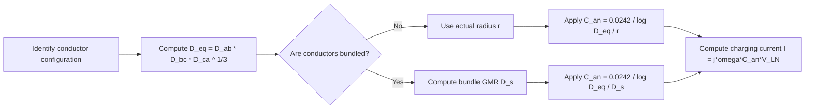

### 12.7 Practical Engineering Context

**Why capacitance matters**:

1. **Charging current**: Long transmission lines draw significant charging current even when unloaded. This affects voltage profiles and protection settings.

2. **Reactive power**: Line capacitance generates reactive power (MVAR), which helps support voltage but can cause overvoltage at light loads (Ferranti effect).

3. **Surge impedance loading**: The capacitance and inductance together determine the surge impedance of the line, which sets the natural loading level.

**Bundled conductors** are used primarily to:
- Reduce corona loss (by increasing effective radius)
- Reduce inductance (improving power transfer capability)
- Increase capacitance (providing more reactive power support)

### 12.8 Worked Example: Deriving V_ac for 3-Phase Transposed Line

**Exercise from Lecture 12**: Derive the average value of V_ac for the 3-phase transposed line (analogous to V_ab derivation).

**Solution**:

For V_ac, we follow the same pattern as V_ab but with conductor c instead of b.

**Section 1** (positions: a, b, c):
$$V_{ac}(1) = \frac{1}{2\pi\epsilon_0}\left(q_a \ln\frac{D_{13}}{r} + q_b \ln\frac{D_{23}}{D_{12}} + q_c \ln\frac{r}{D_{13}}\right)$$

Where D₁₃ = D_ca, D₂₃ = D_bc, D₁₂ = D_ab.

**Section 2** (positions: c, a, b):
$$V_{ac}(2) = \frac{1}{2\pi\epsilon_0}\left(q_a \ln\frac{D_{23}}{r} + q_b \ln\frac{D_{31}}{D_{12}} + q_c \ln\frac{r}{D_{23}}\right)$$

**Section 3** (positions: b, c, a):
$$V_{ac}(3) = \frac{1}{2\pi\epsilon_0}\left(q_a \ln\frac{D_{31}}{r} + q_b \ln\frac{D_{12}}{D_{23}} + q_c \ln\frac{r}{D_{31}}\right)$$

**Average**:
$$V_{ac} = \frac{1}{3}[V_{ac}(1) + V_{ac}(2) + V_{ac}(3)]$$

$$V_{ac} = \frac{1}{2\pi\epsilon_0}\left[q_a \ln\left(\frac{D_{eq}}{r}\right) + q_c \ln\left(\frac{r}{D_{eq}}\right)\right]$$

This matches equation (18) as expected.

### 12.9 Exam Traps

1. **r vs r′**: For capacitance, always use actual radius r. Using r′ = 0.7788r is a common mistake.

2. **Units**: The formula C = 0.0242/log(D/r) gives capacitance in μF/km. Don't forget to convert to F/m when computing charging current in SI units.

3. **Line-to-line vs line-to-neutral**: C₁₂ (line-to-line) = 0.0121/log(D/r) μF/km, while C₁ₙ (line-to-neutral) = 0.0242/log(D/r) μF/km. The factor of 2 difference is critical.

4. **Charging current voltage**: Use line-to-neutral voltage V_LN, not line-to-line voltage, when computing charging current per phase.

5. **D_eq for transposed lines**: D_eq = (D_ab × D_bc × D_ca)^(1/3). Don't forget the cube root.

### 12.10 Lecture 12 Recap

- Single-phase line-to-line capacitance: C₁₂ = πε₀/ln(D/√(r₁r₂)) F/m
- Single-phase line-to-neutral capacitance: C₁ₙ = 0.0242/log(D/r) μF/km
- 3-phase transposed line capacitance: C_an = 0.0242/log(D_eq/r) μF/km
- Bundle GMR: D_s = (r·d)^(1/2) for 2 conductors, (r·d²)^(1/3) for 3, (√2·r·d³)^(1/4) for 4
- Charging current: I = jωC_an·V_LN A/phase/km

---

## Lecture 13: Capacitance of Transmission Lines (Contd.)

### 13.1 Physical Intuition: Double Circuit Lines

Double circuit lines are used for:
1. **Reliability**: If one circuit fails, the other can still carry power
2. **Right-of-way efficiency**: Two circuits on one tower save land
3. **Economic benefits**: Sharing tower and foundation costs

The capacitance calculation for double circuit lines is more complex because we have 6 conductors (a, b, c, a′, b′, c′) instead of 3. However, the fundamental approach remains the same: compute D_eq (mutual GMD) and D_s (self-GMD), then apply the standard formula.

### 13.2 Capacitance of 3-Phase Double Circuit Lines

**Configuration** (Figure 9):

Three transposition sections with conductors a, b, c and a′, b′, c′:


**Distance definitions**:
- d₁ = d_ac′
- d₂ = d_ab′
- d₃ = d_aa′
- d₄ = d_bb′
- d₅ = d_ac
- D = d_ab = d_bc

**General Formula**:

$$C_{an} = \frac{0.0242}{\log\left(\frac{D_{eq}}{D_s}\right)} \text{ μF/km} \quad \cdots (35)$$

**Calculation of D_eq**:

$$D_{eq} = (D_{ab} \cdot D_{bc} \cdot D_{ca})^{1/3} \quad \cdots (36)$$

**For D_ab** (all four distance combinations):
$$D_{ab} = (d_{ab} \cdot d_{ab'} \cdot d_{a'b} \cdot d_{a'b'})^{1/4} = (D \cdot d_2 \cdot D \cdot d_2)^{1/4} = (D \cdot d_2)^{1/2}$$

**Similarly**:
$$D_{bc} = (D \cdot d_2)^{1/2}$$

**For D_ca**:
$$D_{ca} = (d_{ca} \cdot d_{ca'} \cdot d_{c'a} \cdot d_{c'a'})^{1/4} = (d_5 \cdot d_1 \cdot d_5 \cdot d_1)^{1/4} = (d_1 \cdot d_5)^{1/2}$$

**Final expression**:
$$D_{eq} = D^{1/3} \cdot d_2^{1/3} \cdot d_1^{1/6} \cdot d_5^{1/6} \quad \cdots (38)$$

Let me verify this. We have:
D_eq = (D_ab · D_bc · D_ca)^(1/3)
= [(D·d₂)^(1/2) · (D·d₂)^(1/2) · (d₁·d₅)^(1/2)]^(1/3)
= [(D·d₂) · (d₁·d₅)^(1/2)]^(1/3)
= D^(1/3) · d₂^(1/3) · d₁^(1/6) · d₅^(1/6)

**Calculation of D_s**:

$$D_s = (D_{sa} \cdot D_{sb} \cdot D_{sc})^{1/3} \quad \cdots (37)$$

**Individual self-GMDs**:
- D_sa = (r · d₃)^(1/2)
- D_sb = (r · d₄)^(1/2)
- D_sc = (r · d₃)^(1/2)

**Final expression**:
$$D_s = r^{1/2} \cdot d_3^{1/3} \cdot d_4^{1/6} \quad \cdots (39)$$

Let me verify this:
D_s = [(r·d₃)^(1/2) · (r·d₄)^(1/2) · (r·d₃)^(1/2)]^(1/3)
= [(r·d₃) · (r·d₄)^(1/2)]^(1/3)
= r^(1/3) · d₃^(1/3) · r^(1/6) · d₄^(1/6)
= r^(1/2) · d₃^(1/3) · d₄^(1/6)

**Final Capacitance Expression**:

$$C_{an} = \frac{0.0242}{\log\left(\frac{D^{1/3} d_2^{1/3} d_1^{1/6} d_5^{1/6}}{r^{1/2} d_3^{1/3} d_4^{1/6}}\right)} \text{ μF/km} \quad \cdots (40)$$

**Important Note from Lecturer**: "You need not remember anything because it is almost impossible to remember... Better is that you have to derive that and then you find out what is the value of this capacitance."

**Key Insight**: D_eq and D_s remain the same for all three transposition sections since only conductor positions change, not the configuration.

### 13.3 Effect of Earth on Capacitance

**Method of Image Charges** (Kelvin's Method):

**Figure 8(a)**: Single conductor with uniform charge distribution at height h above a perfectly conducting earth plane

**Figure 8(b)**: Earth replaced by image conductor:
- Image conductor lies directly below the original conductor
- If original charge is +q, image charge is −q
- Distance between conductor and image = 2h
- Electric field above the plane is the same in both cases


The method of images works because a perfectly conducting plane is an equipotential surface. By placing an image charge of opposite sign at the mirror position, we ensure that the potential at the plane is zero, which is exactly what a conducting plane would do.

**Application to Single-Phase Line**:

**Configuration**:
- Conductors 1 and 2 with radius r
- q₁ = q, q₂ = −q
- Image charges: q₃ = −q₁ = −q, q₄ = −q₂ = +q
- Distance between conductors = D
- Height above ground = h

**Distance relationships**:
- D₁₁ = D₂₂ = r
- D₁₂ = D₂₁ = D
- D₂₃ = D₁₄ = √(D² + 4h²)
- D₁₃ = D₂₄ = 2h

**Potential Difference with Earth Effect**:

Applying equation (5) with 4 conductors (including images):

$$V_{12} = \frac{1}{2\pi\epsilon_0}\left(q_1 \ln\frac{D_{21}}{D_{11}} + q_2 \ln\frac{D_{22}}{D_{12}} + q_3 \ln\frac{D_{23}}{D_{13}} + q_4 \ln\frac{D_{24}}{D_{14}}\right) \quad \cdots (41)$$

**After substitution and simplification**:
$$V_{12} = \frac{q}{\pi\epsilon_0} \ln\left[\frac{2Dh}{r\sqrt{4h^2 + D^2}}\right]$$

**Alternative form**:
$$V_{12} = \frac{q}{\pi\epsilon_0} \ln\left[\frac{D}{r\left(1 + \frac{D^2}{4h^2}\right)^{1/2}}\right] \text{ volts} \quad \cdots (42)$$

Let me verify this simplification. Substituting the charges and distances:
- q₁ = q, q₂ = −q, q₃ = −q, q₄ = +q
- D₂₁/D₁₁ = D/r
- D₂₂/D₁₂ = r/D
- D₂₃/D₁₃ = √(D²+4h²)/(2h)
- D₂₄/D₁₄ = 2h/√(D²+4h²)

V₁₂ = (1/2πε₀)[q·ln(D/r) + (−q)·ln(r/D) + (−q)·ln(√(D²+4h²)/(2h)) + q·ln(2h/√(D²+4h²))]

= (q/2πε₀)[ln(D/r) − ln(r/D) − ln(√(D²+4h²)/(2h)) + ln(2h/√(D²+4h²))]

= (q/2πε₀)[ln(D/r) + ln(D/r) + ln(2h/√(D²+4h²)) + ln(2h/√(D²+4h²))]

= (q/2πε₀)[2·ln(D/r) + 2·ln(2h/√(D²+4h²))]

= (q/πε₀)[ln(D/r) + ln(2h/√(D²+4h²))]

= (q/πε₀)·ln(D·2h/(r·√(D²+4h²)))

= (q/πε₀)·ln(2Dh/(r·√(4h²+D²)))

This matches the given expression.

**Capacitance with Earth Effect**:

$$C_{12} = \frac{\pi\epsilon_0}{\ln\left(\frac{D}{r\left(1 + \frac{D^2}{4h^2}\right)^{1/2}}\right)} \text{ F/m} \quad \cdots (43)$$

**In practical units**:
$$C_{12} = \frac{0.0121}{\log\left(\frac{D}{r\left(1 + \frac{D^2}{4h^2}\right)^{1/2}}\right)} \text{ μF/km} \quad \cdots (44)$$

**Physical Interpretation**:

**Key observation**: The presence of earth modifies the ratio from D/r to D/[r(1 + D²/4h²)^(1/2)]

**Negligibility argument**:
- D²/4h² is very small because conductors lie much above the ground compared to conductor spacing
- Hence, the effect of earth on line capacitance is negligible

**Exercise for students**: Derive the 3-phase case with earth effect (suggested by lecturer)

### 13.4 Worked Example: 3-Phase Bundled Conductor Line

**Problem Statement** (Figure 10):

A completely transposed 50 Hz, 250 km long 3-phase line has flat horizontal phase spacing with 10 m between adjacent conductors. Outside radius = 1.2 cm. Line voltage = 220 kV.

**Determine**: Charging current per phase and total reactive power in MVAR supplied by line capacitance.


**Given Data**:
- Outside radius, r₀ = 1.2 cm = 0.012 m
- Bundle spacing, d = 0.4 m
- Line length = 250 km
- Frequency = 50 Hz
- Line voltage = 220 kV

**Solution Steps**:

**Step 1: Calculate D_s (bundle GMR)**

$$D_s = (r_0 \cdot d \cdot r_0 \cdot d)^{1/4} = (r_0 \cdot d)^{1/2}$$

$$D_s = \sqrt{0.012 \times 0.4} = 0.0693 \text{ m}$$

**Step 2: Calculate D_eq**

$$D_{eq} = (D_{ab} \cdot D_{bc} \cdot D_{ca})^{1/3}$$

**For D_ab**:
$$D_{ab} = (d_{ab} \cdot d_{ab'} \cdot d_{a'b} \cdot d_{a'b'})^{1/4} = (20 \times 10.4 \times 9.6 \times 10)^{1/4} = 9.995 \text{ m}$$

Let me verify these distances. The line has flat horizontal spacing with 10 m between adjacent conductors. Each phase has 2 conductors in a bundle with 0.4 m spacing.

For D_ab (between phases a and b):
- d_ab: distance from conductor a to conductor b = 10 + 10 = 20 m (the center of phase a to center of phase b)
- d_ab′: distance from conductor a to conductor b′ = √(10² + 0.4²) = √(100 + 0.16) = √100.16 ≈ 10.008 m

Wait, let me reconsider. The problem states "flat horizontal phase spacing with 10 m between adjacent conductors." This means the distance between the centers of adjacent phases is 10 m. With 2 conductors per bundle spaced 0.4 m apart:

For phase a at position 0, phase b at position 10, phase c at position 20:
- Conductor a at position 0, conductor a′ at position 0.4
- Conductor b at position 10, conductor b′ at position 10.4
- Conductor c at position 20, conductor c′ at position 20.4

D_ab = (d_ab · d_ab′ · d_a′b · d_a′b′)^(1/4)
- d_ab = 10 m (from a at 0 to b at 10)
- d_ab′ = √(10² + 0.4²) = √(100 + 0.16) = 10.008 m (from a at 0 to b′ at 10.4)

Hmm, but the given solution uses different values. Let me reconsider the configuration. Perhaps the bundle spacing is vertical rather than horizontal. If the bundle conductors are stacked vertically:

- Conductor a at position (0, 0), conductor a′ at position (0, 0.4)
- Conductor b at position (10, 0), conductor b′ at position (10, 0.4)
- Conductor c at position (20, 0), conductor c′ at position (20, 0.4)

D_ab = (d_ab · d_ab′ · d_a′b · d_a′b′)^(1/4)
- d_ab = 10 m (horizontal)
- d_ab′ = √(10² + 0.4²) = 10.008 m
- d_a′b = √(10² + 0.4²) = 10.008 m
- d_a′b′ = 10 m (horizontal)

D_ab = (10 × 10.008 × 10.008 × 10)^(1/4) = (10016)^(1/4) ≈ 10.004 m

But the given solution says D_ab = (20 × 10.4 × 9.6 × 10)^(1/4) = 9.995 m. This suggests a different configuration where the bundle conductors are horizontally displaced. Let me reconsider:

If the bundle conductors are horizontally displaced:
- Conductor a at position 0, conductor a′ at position 0.4
- Conductor b at position 10, conductor b′ at position 10.4
- Conductor c at position 20, conductor c′ at position 20.4

D_ab = (d_ab · d_ab′ · d_a′b · d_a′b′)^(1/4)
- d_ab = 10 m (from a at 0 to b at 10)
- d_ab′ = 10.4 m (from a at 0 to b′ at 10.4)
- d_a′b = 9.6 m (from a′ at 0.4 to b at 10)
- d_a′b′ = 10 m (from a′ at 0.4 to b′ at 10.4)

D_ab = (10 × 10.4 × 9.6 × 10)^(1/4) = (9984)^(1/4) ≈ 9.996 m ≈ 9.995 m ✓

This matches the given solution. So the bundle conductors are horizontally displaced.

**For D_bc**: D_bc = D_ab = 9.995 m (by symmetry)

**For D_ca**:
D_ca = (d_ca · d_ca′ · d_c′a · d_c′a′)^(1/4)
- d_ca = 20 m (from c at 20 to a at 0)
- d_ca′ = 19.6 m (from c at 20 to a′ at 0.4)
- d_c′a = 20.4 m (from c′ at 20.4 to a at 0)
- d_c′a′ = 20 m (from c′ at 20.4 to a′ at 0.4)

D_ca = (20 × 19.6 × 20.4 × 20)^(1/4) = (159936)^(1/4) ≈ 19.997 m ✓

**Therefore**:
$$D_{eq} = (9.995 \times 9.995 \times 19.997)^{1/3} = 12.534 \text{ m}$$

**Approximate check**:
$$D_{eq}(approx) = (10 \times 10 \times 20)^{1/3} = 12.599 \text{ m} \text{ vs } 12.6 \text{ m}$$

**Lecturer's Note**: "From the classroom purpose or the numerical purpose you have to solve this, but from the research purpose you can take this one... approximately they are same."

**Step 3: Calculate C_an**

$$C_{an} = \frac{0.0242}{\log\left(\frac{D_{eq}}{D_s}\right)} = \frac{0.0242}{\log\left(\frac{12.6}{0.0693}\right)} \text{ μF/km}$$

$$C_{an} = 0.0107096 \text{ μF/km}$$

**Total capacitance for 250 km**:
$$C_{an} = 0.0107096 \times 250 = 2.677 \times 10^{-6} \text{ F}$$

**Step 4: Calculate Charging Current**

$$|I_{chg}| = \omega C_{an} |V_{LN}|$$

$$|V_{LN}| = |V_{an}| = \frac{220}{\sqrt{3}} \text{ kV}$$

$$|I_{chg}| = 2\pi \times 50 \times 2.677 \times 10^{-6} \times \frac{220}{\sqrt{3}}$$

$$|I_{chg}| = 0.1068 \text{ kA/phase}$$

**Step 5: Calculate Reactive Power**

$$Q_{c,3-phase} = \omega C_{an} V_{LL}^2$$

$$Q_{c,3-phase} = 2\pi \times 50 \times 2.677 \times 10^{-6} \times (220)^2$$

$$Q_{c,3-phase} = 40.70 \text{ MVAR}$$

### 13.5 Modelling Assumptions for Double Circuit Lines

1. **Complete transposition**: We assume all three transposition sections are equal in length and the line is perfectly transposed.

2. **Symmetric configuration**: The double circuit is assumed to be symmetric, so D_ab = D_bc and D_sa = D_sc.

3. **Ground neglected**: For the basic double circuit derivation, we neglect earth effects.

4. **Uniform charge distribution**: Same assumption as before—charge is uniformly distributed around each conductor.

### 13.6 Algorithm: Computing Capacitance of Double Circuit Lines

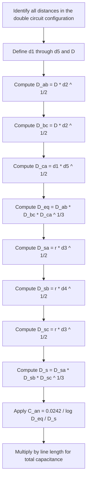

### 13.7 Practical Engineering Context

**Why double circuit lines matter**:

1. **Urban areas**: Limited right-of-way makes double circuit towers essential
2. **Critical loads**: Hospitals, industrial plants need redundant supply
3. **Economic efficiency**: Sharing infrastructure reduces per-circuit cost

**Earth effect considerations**:
- For most practical lines, the earth effect on capacitance is less than 0.5%
- However, for very low-height lines or unusual configurations, it may need consideration
- The method of images provides a systematic way to account for earth effects

### 13.8 Exam Traps

1. **Don't memorize the final formula**: The lecturer explicitly says "You need not remember anything because it is almost impossible to remember." Instead, understand the derivation process.

2. **D_eq and D_s are the same for all sections**: Since transposition only changes conductor positions, not the geometry, D_eq and D_s remain constant.

3. **Earth effect sign**: The earth effect increases capacitance slightly (by about 0.42% in the example). It doesn't decrease it.

4. **Charging current units**: The result 0.1068 kA/phase means 106.8 A/phase. Don't confuse kA with A.

5. **Reactive power formula**: Q = ωC_an·V_LL² uses line-to-line voltage squared, not line-to-neutral.

### 13.9 Lecture 13 Recap

- Double circuit D_eq: D_eq = D^(1/3)·d₂^(1/3)·d₁^(1/6)·d₅^(1/6)
- Double circuit D_s: D_s = r^(1/2)·d₃^(1/3)·d₄^(1/6)
- Earth effect: C₁₂ = 0.0121/log(D/[r(1+D²/4h²)^(1/2)]) μF/km
- Earth effect is negligible (< 0.5% increase)
- Worked example: Charging current = 0.1068 kA/phase, Q = 40.70 MVAR

---

## Lecture 14: Capacitance of Transmission Lines (Contd.)

### 14.1 Physical Intuition: More Complex Configurations

Lecture 14 extends our capacitance toolkit to handle increasingly complex configurations:
1. Effect of earth on capacitance (worked example)
2. Double circuit 3-phase lines (worked example)
3. Bundled single overhead transmission lines
4. Composite conductor lines

The key skill here is **systematic distance calculation**. As the lecturer emphasizes: "Only thing is that calculation should be careful of calculating all the distances correctly."

### 14.2 Worked Example: Effect of Earth on Capacitance

**Problem Statement**:

Calculate the capacitance to neutral per kilometer with and without considering the effect of earth. Radius of conductor = 0.01 m, spaced 3.5 m apart, and 8 m above the ground. Compare the results.

**Given Data**:
- r = 0.01 m
- D = 3.5 m
- h = 8 m

**Solution with Earth Effect**:

Using equation (44):

$$C_{12}(earth) = \frac{0.0121}{\log\left(\frac{D}{r\left(1 + \frac{D^2}{4h^2}\right)^{1/2}}\right)}$$

$$C_{12}(earth) = \frac{0.0121}{\log\left(\frac{3.5}{0.01\left(1 + \frac{3.5^2}{4 \times 8^2}\right)^{1/2}}\right)}$$

Let me compute the correction factor:
D²/(4h²) = 3.5²/(4 × 8²) = 12.25/(4 × 64) = 12.25/256 = 0.04785

(1 + 0.04785)^(1/2) = (1.04785)^(1/2) = 1.02365

r × (1.02365) = 0.01 × 1.02365 = 0.0102365

D/(r × 1.02365) = 3.5/0.0102365 = 341.91

log(341.91) = 2.5340

C₁₂(earth) = 0.0121/2.5340 = 0.004775 μF/km

$$C_{12}(earth) = 0.00477 \text{ μF/km}$$

**Line-to-neutral capacitance with earth effect**:
$$C_{1n}(earth) = C_{2n}(earth) = 2C_{12}(earth) = 0.00955 \text{ μF/km}$$

**Solution without Earth Effect**:

Using equation (10):

$$C_{1n} = C_{2n} = \frac{0.0242}{\log\left(\frac{D}{r}\right)} = \frac{0.0242}{\log\left(\frac{3.5}{0.01}\right)}$$

log(350) = 2.5441

C₁ₙ = 0.0242/2.5441 = 0.00951 μF/km

$$C_{1n} = 0.00951 \text{ μF/km}$$

**Comparison**:

$$\frac{C_{1n}(earth)}{C_{1n}} = \frac{0.00955}{0.00951} = 1.0042$$

**Conclusion**: Presence of earth increases the capacitance by 0.42%, which is negligible.

**Lecturer's Note**: "For all practical purposes for computing capacitance one can ignore that effect of earth... perhaps you will find similar findings for the 3 phase also."

### 14.3 Worked Example: Double Circuit 3-Phase Line

**Problem Statement** (Figure 11):

Determine the capacitance and charging current of a 200 km long transposed double circuit 3-phase line. The line operates at 220 kV and conductor radius = 2 cm.


**Given Data**:
- d₁ = 7.5 m
- d₄ = 9 m
- r = 0.02 m
- Vertical spacing = 4 m between levels
- Line length = 200 km
- Voltage = 220 kV
- Frequency = 50 Hz

**Distance Calculations**:

$$d_2 = \sqrt{4^2 + 8.25^2} = 9.168 \text{ m}$$

$$d_3 = \sqrt{8^2 + 7.5^2} = 10.965 \text{ m}$$

$$d_5 = 8 \text{ m} \text{ (vertical distance)}$$

$$D = 4.07 \text{ m}$$

Let me verify these distances. The configuration has two circuits vertically stacked with 4 m between levels. The horizontal offset between the two circuits creates the various distances.

For d₂: This is the distance between a and b′. With 4 m vertical and 8.25 m horizontal offset:
d₂ = √(4² + 8.25²) = √(16 + 68.06) = √84.06 = 9.168 m ✓

For d₃: This is the distance between a and a′. With 8 m vertical and 7.5 m horizontal offset:
d₃ = √(8² + 7.5²) = √(64 + 56.25) = √120.25 = 10.965 m ✓

For D: This is the distance between adjacent conductors in the same circuit. Given as 4.07 m.

**Calculation of D_eq**:

Using equation (38):
$$D_{eq} = D^{1/3} \cdot d_2^{1/3} \cdot d_1^{1/6} \cdot d_5^{1/6}$$

$$D_{eq} = 4.07^{1/3} \times 9.168^{1/3} \times 7.5^{1/6} \times 8^{1/6}$$

Let me compute each term:
- 4.07^(1/3) = 1.596
- 9.168^(1/3) = 2.093
- 7.5^(1/6) = 1.401
- 8^(1/6) = 1.414

D_eq = 1.596 × 2.093 × 1.401 × 1.414 = 6.61 m ✓

**Calculation of D_s**:

Using equation (39):
$$D_s = r^{1/2} \cdot d_3^{1/3} \cdot d_4^{1/6}$$

$$D_s = (0.02)^{1/2} \times (10.965)^{1/3} \times (9)^{1/6} = 0.453 \text{ m}$$

Let me verify:
- (0.02)^(1/2) = 0.1414
- (10.965)^(1/3) = 2.221
- (9)^(1/6) = 1.442

D_s = 0.1414 × 2.221 × 1.442 = 0.453 m ✓

**Capacitance Calculation**:

$$C_{an} = \frac{0.0242}{\log\left(\frac{6.61}{0.453}\right)} = 0.02078 \text{ μF/km}$$

log(6.61/0.453) = log(14.59) = 1.1641

C_an = 0.0242/1.1641 = 0.02079 μF/km ≈ 0.02078 μF/km ✓

**Total capacitance for 200 km**:
$$C_{an} = 0.02078 \times 200 = 4.157 \text{ μF}$$

**Charging Current**:

$$|I_{chg}| = \omega C_{an} |V_{LN}|$$

$$|V_{LN}| = \frac{220}{\sqrt{3}} \text{ kV}$$

$$|I_{chg}| = 2\pi \times 50 \times 4.157 \times 10^{-6} \times \frac{220}{\sqrt{3}}$$

$$|I_{chg}| = 0.1658 \text{ kA/phase} = 165.8 \text{ A/phase}$$

**Lecturer's Note**: "Charging current actually is not very small — that is equal to 0.1658 kilo ampere per phase means 165.8 ampere per phase."

### 14.4 Worked Example: Bundled Single Overhead Transmission Line

**Problem Statement** (Figure 12):

Figure 12 shows the conductor configuration of a bundled single overhead transmission line. The line operates at 132 kV and 50 Hz. Radius of each conductor = 0.67 cm.

**Find**: The equivalent representation of the line and capacitance between the line.


**Configuration Details**:
- Phase A: 3 conductors (a₁, a₂, a₃) in triangular arrangement
- Phase B: 3 conductors (b₁, b₂, b₃) in horizontal arrangement
- D = 6 m (distance between a₂ and b₁)
- d = 0.1 m (bundle spacing)
- r = 0.67 cm = 0.0067 m

**Height Calculation for Triangular Bundle**:

$$h = \sqrt{d^2 - \left(\frac{d}{2}\right)^2} = \sqrt{0.1^2 - 0.05^2}$$

$$h = 0.0866 \text{ m}$$

This is the height of the equilateral triangle formed by the three conductors in phase A. The base is d = 0.1 m, and the height is found using the Pythagorean theorem.

**Self-GMD Calculation for Symmetrical Arrangement (D_SA)**:

For a single conductor in the equilateral arrangement:
$$D_{SA} = (r \cdot d \cdot d)^{1/3} = (r d^2)^{1/3}$$

The derivation considers the three distances from conductor a₁ to itself (r), to a₂ (d), and to a₃ (d).

For all three conductors combined:
$$D_{SA} = [(r d^2) \cdot (r d^2) \cdot (r d^2)]^{1/9} = (r d^2)^{1/3}$$

**Worked Numerical Example**:
- Given: r = 0.0670067 m, d = 0.9 m
- $D_{SA} = (0.0670067 \times 0.9^2)^{1/3} = 0.0406$ meter

**Self-GMD for Non-Symmetrical Arrangement (D_SB)**:

For the horizontal configuration with three conductors:
- Conductor b₁: distances to b₁ (r), to b₂ (d), to b₃ (2d)
- Conductor b₂: distances to b₁ (d), to b₂ (r), to b₃ (d)
- Conductor b₃: distances to b₁ (2d), to b₂ (d), to b₃ (r)

$$D_{SB} = (r \cdot d \cdot 2d \cdot r \cdot d \cdot d \cdot r \cdot d \cdot 2d)^{1/9}$$

After simplification:
$$D_{SB} = (r)^{1/3} \cdot (d)^{2/3} \cdot (4)^{1/9}$$

**Worked Numerical Example**:
- Given: r = 0.0067 m, d = 0.1 m
- $D_{SB} = (0.0067)^{1/3} \times (0.1)^{2/3} \times (4)^{1/9} = 0.0473$ meter

**Mutual GMD Calculation (D_eq)**:

With 3 conductors in each group, there are 3 × 3 = 9 distance combinations:
$$D_{eq} = (d_{a1b1} \cdot d_{a1b2} \cdot d_{a1b3} \cdot d_{a2b1} \cdot d_{a2b2} \cdot d_{a2b3} \cdot d_{a3b1} \cdot d_{a3b2} \cdot d_{a3b3})^{1/9}$$

**Distance Computations** (from diagram):
- $d_{a1b1} = 6.1$ m
- $d_{a1b2} = 6.2$ m
- $d_{a1b3} = 6.3$ m
- $d_{a2b1} = 6.0$ m
- $d_{a2b2} = 6.1$ m
- $d_{a2b3} = 6.2$ m

For the third conductor using right-angle triangles:
- $d_{a3b2} = \{(0.0866)^2 + (6.15)^2\}^{1/2} = 6.1506$ m
- $d_{a3b1} = \{(0.0866)^2 + (6.05)^2\}^{1/2} = 6.05606$ m
- $d_{a3b3} = \{(0.0866)^2 + (6.25)^2\}^{1/2} = 6.2506$ m

**Result**: $D_{eq} = 6.15$ meter


**Equivalent Configuration Concept**:
- The bundled conductor group can be replaced by a single equivalent conductor
- $D_{SA} = 0.0406$ m represents the equivalent radius of the first group
- $D_{SB} = 0.0473$ m represents the equivalent radius of the second group
- $D_{eq} = 6.15$ m is the equivalent distance between groups


**Instructor Question to Students**:
"Although we are using bundled conductor it is radius is very... if you take its radius is 0.67 meter right and here if you take of course, you can see that here it is 0.0 this thing what you call 0.067 and it is 0.4 radius has increased, but instead of using this equivalent thing we use this one there must be some advantages right. What are those advantages instead of making this kind of single conductor configuration?"

**Capacitance Formula Application** (Equation 7):

$$C_{AB} = \frac{\pi \epsilon_0}{\ln \frac{D_{eq}}{\sqrt{D_{SA} D_{SB}}}}$$

Where:
- $\epsilon_0 = 8.854 \times 10^{-12}$ F/m (permittivity of free space)
- $D_{eq}$ = equivalent mutual GMD (m)
- $D_{SA}$, $D_{SB}$ = self-GMD of each group (m)

**Result**: $C_{AB} = 0.00562$ μF/km

**Key Reminder**: "Only thing is that calculation should be careful of calculating all the distances correctly"

### 14.5 Worked Example: Capacitance of Line in Figure 15

**Given Configuration**:
- Phase conductors: a, a′; b, b′; c, c′ (2 conductors per phase)
- Radius of each sub-conductor: r = 1 cm = 0.01 m
- Spacing between sub-conductors in each phase: 0.6 m
- Spacing between phase groups: 6 m (between a′b′ or b′c′)


**Calculations**:

1. **Self-GMD**:
$$D_s = (r \cdot d)^{1/2} = (0.01 \times 0.6)^{1/2} = 0.07746 \text{ m}$$

2. **Mutual GMD between phases**:
$$D_{ab} = (d_{ab} \cdot d_{ab'} \cdot d_{a'b} \cdot d_{a'b'})^{1/4}$$

Distances:
- $d_{ab} = 6$ m
- $d_{a'b'} = 6$ m
- $d_{ab'} = \sqrt{6^2 + 0.6^2} = 6.03$ m
- $d_{a'b} = 6.03$ m

$$D_{ab} = 6.015 \text{ m}$$

By symmetry: $D_{ab} = D_{bc} = 6.015$ m

3. **For phase a to c**:
- $d_{ac} = d_{a'c'} = 12$ m
- $d_{ac'} = d_{a'c} = \sqrt{12^2 + 0.6^2} = 12.015$ m

$$D_{ca} = (12 \times 12.015 \times 12.015 \times 12)^{1/4} = 12.0075 \text{ m}$$

4. **Equivalent GMD**:
$$D_{eq} = (D_{ab} \cdot D_{bc} \cdot D_{ca})^{1/3} = (6.015 \times 6.015 \times 12.0075)^{1/3} = 7.573 \text{ m}$$

5. **Capacitance** (Equation 34):
$$C_{an} = \frac{0.0242}{\log \frac{D_{eq}}{D_s}} \text{ μF/km}$$

$$C_{an} = 0.01216 \text{ μF/km}$$


### 14.6 Worked Example: Charge on Conductor 'a' of Un-Transposed 3-Phase Line

**Problem Statement**:
"Derive an expression for the charge value per meter length of conductor 'a' of an un-transposed 3 phase line as shown in figure-16, the applied voltage is balanced 3 phase. Also find out the charging current of phase a."


**Configuration**:
- Horizontal arrangement: a, b, c
- Equal spacing D between adjacent conductors
- Radius of each conductor: r

**Phasor Relationships** (with $V_{an}$ as reference):
- $V_{an} = \frac{V}{\sqrt{3}} \angle 0°$
- $V_{ab} = V \angle 30°$ (line-to-line voltage leading $V_{an}$ by 30°)
- $V_{bc} = V \angle -90°$
- $V_{ca} = V \angle 150°$
- $V_{ac} = V \angle -30°$ (opposite of $V_{ca}$)


**Derivation Using Equation 5**:

For $V_{ab}$:
$$V_{ab} = \frac{1}{2\pi\epsilon_0} \left[ q_a \ln\left(\frac{D}{r}\right) + q_b \ln\left(\frac{r}{d}\right) + q_c \ln\left(\frac{D}{2D}\right) \right] = V \angle 30° \quad \text{...(i)}$$

For $V_{ac}$:
$$V_{ac} = \frac{1}{2\pi\epsilon_0} \left[ q_a \ln\left(\frac{2D}{r}\right) + q_b \ln\left(\frac{D}{D}\right) + q_c \ln\left(\frac{r}{2D}\right) \right] = V \angle -30° \quad \text{...(ii)}$$

Note: The middle term $\ln(D/D) = 0$, so it vanishes.

**Charge Balance**:
$$q_a + q_b + q_c = 0$$
$$\therefore q_b = -(q_a + q_c) \quad \text{...(iii)}$$

**Substitution and Simplification**:

From equations (i) and (iii):
$$2q_a \ln\left(\frac{D}{r}\right) + q_c \ln\left(\frac{D}{2r}\right) = 2\pi\epsilon_0 \cdot V \angle -30° \quad \text{...(iv)}$$

**Solving for $q_a$**:

$$q_a = \frac{2\pi\epsilon_0 \left[ \ln\left(\frac{r}{d}\right) \angle 30° - \ln\left(\frac{D}{2r}\right) \angle -30° \right]}{\left[ 2 \cdot \ln\left(\frac{D}{r}\right) \cdot \ln\left(\frac{r}{D}\right) - \ln\left(\frac{2D}{r}\right) \cdot \ln\left(\frac{r}{2D}\right) \right]} \text{ coulomb/meter}$$

**Key Insight**: "If the line is untransposed the charge actually coulomb per meter is a complex quantity"

**Charging Current of Phase a**:
$$I_{ca} = \omega \cdot q_a \angle 90°$$

Or equivalently:
$$I_{ca} = 2\pi f \cdot q_a \angle 90° \text{ ampere}$$

The charging current leads the voltage by 90°.


### 14.7 Worked Example: Line-to-Line Capacitance of Composite Conductor Line

**Problem Statement**:
"Determine the line to line capacitance of a single phase line having the following arrangement of conductors. One circuit consists of 3 wires of 0.2 centimeter dia each and other circuit of 2 wires of 0.4 centimeter dia each."


**Configuration**:
- Group X: 3 conductors (m = 3), diameter = 0.2 cm
- Group Y: 2 conductors (n = 2), diameter = 0.4 cm
- Total combinations: m × n = 6

**Mutual GMD**:
$$D_{eq} = (D_{aa'} \cdot D_{ab'} \cdot D_{ba'} \cdot D_{bb'} \cdot D_{ca'} \cdot D_{cb'})^{1/6}$$

Given distances:
- $D_{aa'} = 6$ m
- $D_{ab'} = 7.11$ m
- $D_{ba'} = 7.11$ m
- $D_{bb'} = 6$ m
- $D_{ca'} = 10$ m
- $D_{cb'} = 7.11$ m

$$D_{eq} = (6 \times 7.11 \times 7.11 \times 6 \times 10 \times 7.11)^{1/6} = 7.162 \text{ m}$$

**Radii**:
- Group X: $r_x = 0.2/2 = 0.001$ m (0.1 cm)
- Group Y: $r_y = 0.4/2 = 0.002$ m (0.2 cm)

**Self-GMD for Group X**:
$$D_{sx} = (D_{aa} \cdot D_{ab} \cdot D_{ac} \cdot D_{ba} \cdot D_{bb} \cdot D_{bc} \cdot D_{ca} \cdot D_{cb} \cdot D_{cc})^{1/9}$$

Where $D_{aa} = D_{bb} = D_{cc} = r_x$

$$D_{sx} = (0.001 \times 0.4^4 \times 8^2)^{1/9} = 0.294 \text{ m}$$

**Self-GMD for Group Y**:
$$D_{sy} = (d_{a'a'} \cdot d_{a'b'})^{1/2} = 0.0894 \text{ m}$$

**Capacitance** (Equation 7):
$$C_{xy} = \frac{\pi \epsilon_0}{\ln \frac{D_{eq}}{\sqrt{D_{sx} D_{sy}}}} \text{ farad/meter}$$

$$C_{xy} = 0.00734 \text{ μF/km}$$


**Instructor's Closing Remark**: "With this, the capacitance calculation of transmission line now it is over, but when we will come to the characteristic or performance of the transmission line 3 phase transmission line at that time we will see again this charging capacitance and its effect."

### 14.8 Modelling Assumptions for Complex Configurations

1. **All sub-conductors in a bundle are identical**: Same radius and material.

2. **Bundle spacing is small compared to phase spacing**: This allows us to treat the bundle as a single equivalent conductor.

3. **Charge distribution is uniform**: Even for bundled conductors, we assume uniform charge distribution around each sub-conductor.

4. **For un-transposed lines**: The charge becomes a complex quantity, reflecting the asymmetry of the configuration.

### 14.9 Algorithm: Computing Capacitance for General Conductor Groups

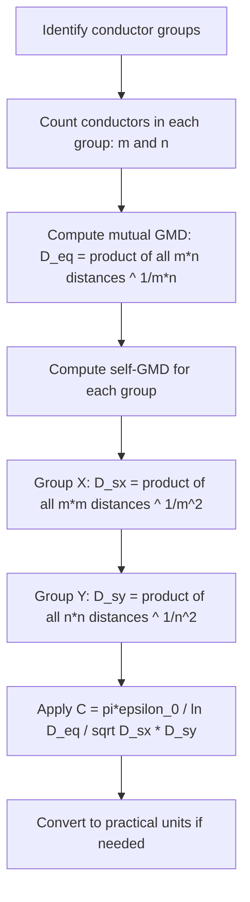

### 14.10 Practical Engineering Context

**Advantages of bundled conductors** (answering the instructor's question):

1. **Reduced corona loss**: The larger effective radius reduces the electric field at the conductor surface, reducing corona discharge.

2. **Reduced inductance**: Lower inductance means higher power transfer capability and lower voltage drop.

3. **Increased capacitance**: Higher capacitance provides more reactive power support, helping voltage regulation.

4. **Reduced radio interference**: Less corona means less radio frequency interference.

5. **Economic benefits**: For EHV lines, bundled conductors are often more economical than a single large conductor.

**Composite conductors** (multiple conductors per phase in a group) are used when:
- Current carrying capacity requires multiple conductors
- Mechanical considerations favor smaller conductors
- Corona performance needs improvement

### 14.11 Exam Traps

1. **Exponent in GMD**: For m conductors in one group and n in another, use power 1/(mn), not 1/(m+n).

2. **Self-GMD includes all pairs**: For self-GMD of a group with m conductors, you need m² distances (including self-distances r for each conductor).

3. **Un-transposed lines have complex charges**: The charge per meter is a complex quantity, not a real number.

4. **Charging current leads by 90°**: I_ca = ω·q_a∠90°, not lagging.

5. **Distance calculation errors**: "Only thing is that calculation should be careful of calculating all the distances correctly."

### 14.12 Lecture 14 Recap

- Earth effect on capacitance: 0.42% increase (negligible)
- Double circuit line: C_an = 0.02078 μF/km, I_chg = 165.8 A/phase
- Bundled conductors: D_SA = (r·d²)^(1/3) for triangular, D_SB = r^(1/3)·d^(2/3)·4^(1/9) for horizontal
- Un-transposed lines: charge is complex, I_ca = ω·q_a∠90°
- Composite conductors: C_xy = πε₀/ln(D_eq/√(D_sx·D_sy))

---

## Lecture 15: Power System Components and Per-Unit System

### 15.1 Physical Intuition: Why We Need the Per-Unit System

Power systems span multiple voltage levels. A typical system might have:
- Generation at 11 kV
- Transmission at 220 kV or 400 kV
- Sub-transmission at 66 kV or 33 kV
- Distribution at 11 kV
- Utilization at 415 V

When we analyze such a system, we need to account for transformer ratios at every step. This is tedious and error-prone. The per-unit system solves this problem by normalizing all quantities to chosen base values.

**Key Warning**: "Sometimes students they make some silly mistakes for per unit system... conversion"

### 15.2 Single-Line Diagrams and Their Limitations

**Motivation for Single-Line Diagrams**:
- Power systems are balanced 3-phase systems
- Can be represented by single-line diagrams
- For unbalanced systems (e.g., distribution at 11 kV), mutual coupling between phases and neutral must be considered—cannot use single-line representation


**Advantages of Per-Unit System**:
1. Different physical quantities (current, voltage, power, impedance) expressed as decimal fractions or multiples of base quantities
2. Different voltage levels disappear
3. Power network reduces to simple impedances
4. Dimensionless quantities result


### 15.3 Single-Phase Representation of Balanced 3-Phase System

**Figure 1 Configuration**:
- 3-phase synchronous generator with impedance $Z_g$ per phase
- 3-phase star-connected load with impedance $Z_L$ per phase
- Neutral impedance $Z_n$ (has no effect in balanced operation)


**Key Principle**: "As it is a balanced system, no current is flowing through the neutral therefore, this neutral impedance $Z_n$ will have no effect"

**Single-Phase Equivalent** (Figure 2):
$$E_a = (Z_g + Z_L) \cdot I_a \quad \text{...(1)}$$


**Property of Balanced Systems**: "The voltage and currents in other phases have the same magnitude but are shifted in phase by 120°"

### 15.4 Three-Phase Transformer Connections

**Physical Arrangement**:
- Large EHV transformers use banks of 3 single-phase transformers connected in 3-phase arrangement
- Reasons: insulation clearances, shipping/transportation limitations
- Single unit would be too heavy and difficult to transport


**Four Possible Connection Combinations**:
1. Star-Star (Y-Y)
2. Delta-Delta (Δ-Δ)
3. Star-Delta (Y-Δ)
4. Delta-Star (Δ-Y)


**Star-Star Connection**:
- Advantages: decreased insulation cost, availability of neutral for grounding
- Each winding experiences only phase voltage (line-to-neutral), not line-to-line voltage
- **Disadvantage**: Problems with third harmonics and unbalanced operation
- No path for third harmonic current circulation
- **Rarely used** for high-voltage transmission


**Tertiary Winding**:
- Third set of windings connected in delta
- Fitted on the core to provide path for third harmonic current
- Creates "3-winding transformers"
- Can be loaded with switched reactors or capacitors for reactive power compensation


**Delta-Delta Connection**:
- No neutral connection available
- Each transformer must withstand full line-to-line voltage
- Provides path for third harmonic currents
- **Advantage**: If one unit is removed for repair, remaining two can operate as V-connection (open delta)
- Rating derated to approximately 57.7% (≈58%) of original bank capacity


**Star-Delta and Delta-Star Connections**:
- Most common connections
- More stable with respect to unbalanced loads
- Star side used on high-voltage side to reduce insulation costs
- For step-down transformers: star-delta (HV star, LV delta)
- For step-up transformers: delta-star (LV delta, HV star)
- Neutral point on star side should be grounded


**Phase Relationships**:
- Star-Star and Delta-Delta: No phase shift between corresponding line voltages on HV and LV sides
- Star-Delta and Delta-Star: 30° phase shift between primary and secondary line-to-line voltages

**Phasor Analysis for Star-Delta (30° Shift)**:
- Delta side: $V_{ab}$, $V_{bc}$, $V_{ca}$ are 120° apart
- Star side: $V_{An}$ as reference, then $V_{Bn}$, $V_{Cn}$ each 120° apart
- $V_{AB} = V_{An} + V_{nB}$ (where $V_{nB}$ is 180° opposite to $V_{Bn}$)
- Result: $V_{AB}$ leads $V_{ab}$ by 30°


### 15.5 Per-Unit System Fundamentals

**Definition**: In the per-unit system, each physical quantity is expressed as a ratio to a chosen base value:

$$\text{Per-unit value} = \frac{\text{Actual value}}{\text{Base value}}$$

**Base Quantities**:
- Base voltage (V_base)
- Base current (I_base)
- Base impedance (Z_base)
- Base power (S_base or VA_base)

**Relationships between base quantities**:

For single-phase systems:
$$S_{base} = V_{base} \cdot I_{base}$$
$$Z_{base} = \frac{V_{base}}{I_{base}} = \frac{V_{base}^2}{S_{base}}$$

For 3-phase systems:
$$S_{base,3\phi} = \sqrt{3} \cdot V_{base,LL} \cdot I_{base}$$
$$Z_{base} = \frac{V_{base,LL}^2}{S_{base,3\phi}}$$

**Per-Unit Impedance**:
$$Z_{pu} = \frac{Z_{actual}}{Z_{base}} = \frac{Z_{actual} \cdot S_{base}}{V_{base}^2}$$

**Advantages of Per-Unit System**:

1. **Voltage levels disappear**: When we convert to per-unit, transformer ratios become 1:1 (assuming base voltages match transformer ratios)

2. **Simplified calculations**: Impedances from different voltage levels can be added directly

3. **Dimensionless**: Per-unit values are dimensionless, making it easier to spot errors

4. **Equipment data**: Most equipment is rated in per-unit or percentage values (e.g., transformer impedance is given as a percentage)

### 15.6 Modelling Assumptions for Per-Unit System

1. **Balanced 3-phase operation**: The per-unit system assumes balanced operation. For unbalanced systems, we need symmetrical components (covered later in the course).

2. **Base voltage selection**: Base voltages should match transformer turns ratios to eliminate ideal transformers from the circuit.

3. **Single base power**: A common base power (S_base) is chosen for the entire system, even when base voltages differ.

4. **Neutral impedance neglected**: In balanced systems, Z_n has no effect and can be omitted from the single-phase equivalent.

### 15.7 Algorithm: Constructing a Per-Unit System

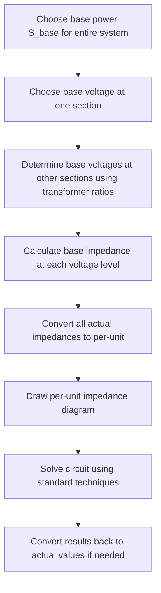

### 15.8 Practical Engineering Context

**Why transformer connections matter**:

1. **Star-Star**: Rarely used for transmission due to third harmonic issues. The tertiary winding provides a path for third harmonic currents.

2. **Delta-Delta**: Useful for industrial loads where no neutral is needed. The V-connection (open delta) provides emergency operation capability.

3. **Star-Delta / Delta-Star**: Most common for transmission. The star side provides a grounded neutral, while the delta side provides a path for third harmonics.

**Per-unit system in practice**:
- All commercial power system analysis software (ETAP, PSS/E, PowerWorld) uses per-unit internally
- Relay settings are often specified in per-unit or percentage
- Transformer impedances are always given in per-unit on the transformer's own base

### 15.9 Exam Traps

1. **Base voltage selection**: Base voltages must match transformer ratios. If a transformer has ratio 220/66 kV, and you choose 220 kV on one side, the other side must be 66 kV.

2. **Single-phase vs 3-phase base**: For 3-phase systems, S_base is the 3-phase power and V_base is the line-to-line voltage. Don't mix them up.

3. **Transformer phase shift**: Star-delta and delta-star connections introduce 30° phase shift. This matters for parallel operation and protection.

4. **Neutral impedance**: Z_n has no effect only in perfectly balanced systems. In unbalanced systems, it plays a crucial role.

5. **Per-unit conversion**: When converting impedance from one base to another:
$$Z_{pu,new} = Z_{pu,old} \cdot \frac{S_{base,new}}{S_{base,old}} \cdot \left(\frac{V_{base,old}}{V_{base,new}}\right)^2$$

### 15.10 Lecture 15 Recap

- Single-line diagrams represent balanced 3-phase systems
- Single-phase equivalent: E_a = (Z_g + Z_L)·I_a
- Transformer connections: Y-Y, Δ-Δ, Y-Δ, Δ-Y
- Star-delta/delta-star have 30° phase shift
- Per-unit system: value = actual/base
- Base impedance: Z_base = V_base²/S_base
- Per-unit impedance: Z_pu = Z_actual·S_base/V_base²

---

## Additional Comparison and Revision Tables

### Capacitance vs. Inductance Calculation Differences

| Aspect | Inductance (Week 2) | Capacitance (Week 3) |
|--------|---------------------|----------------------|
| Conductor radius used | GMR *r′* = 0.7788*r* | Actual radius *r* only |
| Reason for radius difference | Internal flux linkage exists within conductor | No internal capacitance; only external field matters |
| Bundle GMR formula (2-conductor) | *D*ₛ = (*r′d*)¹ᐟ² | *D*ₛ = (*rd*)¹ᐟ² |
| Bundle GMR formula (3-conductor) | *D*ₛ = (*r′d*²)¹ᐟ³ | *D*ₛ = (*rd*²)¹ᐟ³ |
| Bundle GMR formula (4-conductor) | *D*ₛ = (√2·*r′·d*³)¹ᐟ⁴ | *D*ₛ = (√2·*r·d*³)¹ᐟ⁴ |
| Single conductor GMR | *D*ₛ = 0.7788*r* | *D*ₛ = *r* |
| Earth effect | Not considered in Week 3 inductance coverage | Negligible (<0.5% increase); typically ignored |
| Charging current phase | N/A | Leads voltage by 90° (due to *j* operator) |
| Common exam trap | Using *r* instead of *r′* | Using *r′* instead of *r* |

**Interpretation:** The single most important distinction between inductance and capacitance calculations is the conductor radius used. For inductance, the geometric mean radius *r′* = 0.7788*r* accounts for internal flux linkage. For capacitance, only the external electric field matters, so the actual radius *r* is used throughout. This difference propagates into all bundle GMR formulas. Students frequently err by carrying the *r′* convention from inductance problems into capacitance problems—the lecturer explicitly warns: "For the capacitance case there is no question of r′ — this should be in your mind." When computing charging current, remember to use line-to-neutral voltage (V_LN), not line-to-line voltage, and the current leads the voltage by 90°.

## Verified Source Visual Atlas

These eight source visuals were selected by direct visual inspection of the local images and cross-checked against `data/psa-ocr/week-03/images.json`. They retain the source geometry and derivation boards without relying on the earlier, unverified image pairings in the note.

### Lecture 11 — GMR of three- and four-strand conductors (physical PDF page 43)

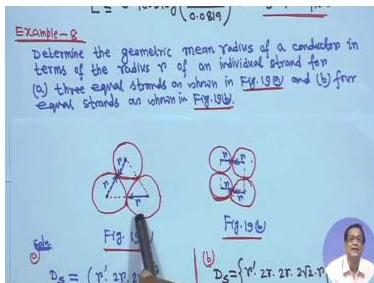

The board states the GMR problem and draws the three-strand and four-strand arrangements, including the self-radius and inter-strand spacing pattern. Read the distance products from the geometry; the smallest handwritten symbols are compact, so use the typeset derivation for exact exponents.

### Lecture 11 — Telephone-line induction geometry (physical PDF page 45)

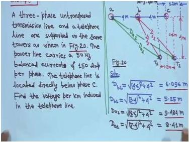

The sketch places a, b, and c phase conductors above a two-wire telephone line and shows the distance triangles used to calculate \(D_{a1}\), \(D_{a2}\), \(D_{b1}\), and \(D_{b2}\). The 4 m and 1.2 m dimensions are visible; read any smaller distance values from the note’s worked calculation rather than measuring the photograph.

### Lecture 12 — Line-to-line and line-to-neutral capacitance (physical PDF page 65)

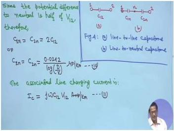

The board draws the two equivalent capacitance arrangements and writes \(C_{1n}=C_{2n}=2C_{12}\), followed by the practical line-to-neutral expression and the charging-current relation. Read the factor-of-two relationship before applying the logarithmic formula.

### Lecture 12 — Bundle self-GMD formulas for capacitance (physical PDF page 76)

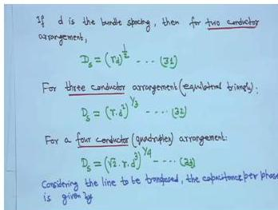

The board lists the equivalent self-GMD expressions for two-conductor, three-conductor, and four-conductor bundles. The visual is a formula reference: identify the bundle count first, then substitute the actual conductor radius and sub-conductor spacing as required for capacitance.

### Lecture 13 — Double-circuit capacitance expression (physical PDF page 81)

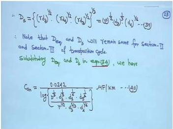

The board combines self-GMD terms for a double-circuit arrangement and then writes the practical \(C_{an}\) expression in terms of equivalent distance and self-GMD. The lower product is dense handwriting; its structure is visible, but exact small subscripts should be taken from the typeset derivation.

### Lecture 14 — Bundled-line capacitance numerical example (physical PDF page 107)

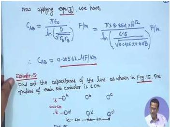

The board substitutes an equivalent distance of 6.15 m and bundle dimensions into the line-to-line capacitance formula, with an intermediate numerical result shown before the next example begins. Read the substitution chain from top to bottom; the smallest decimal annotations are not fully legible.

### Lecture 15 — Balanced three-phase network and single-phase equivalent (physical PDF page 122)

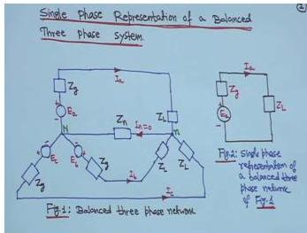

The left drawing shows a balanced three-phase source/load network with neutral impedance, while the right drawing reduces it to the reference-phase equivalent. Read the phase-a branch and note why the neutral branch can be omitted under balanced operation, as explained in the surrounding text.

### Lecture 15 — Three-phase transformer connection sketches (physical PDF page 124)

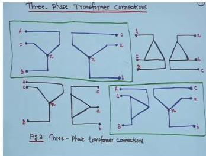

Four connection sketches are arranged as a comparison board for the standard star/delta combinations. Read each small network as a winding connection rather than as a complete power-system circuit; terminal labels are handwritten and some are too small to verify from the image alone.

## Common Mistakes and Engineering Checks

### Common Mistakes

| # | Mistake | Consequence | How to Avoid |
|---|---------|-------------|--------------|
| 1 | Using r′ instead of r for capacitance | Wrong capacitance value (too low) | Remember: no internal capacitance, use actual radius |
| 2 | Using line-to-line voltage for charging current | Charging current too high by √3 | Always use V_LN for per-phase charging current |
| 3 | Forgetting the cube root in D_eq | D_eq too large | D_eq = (D_ab·D_bc·D_ca)^(1/3) |
| 4 | Wrong exponent in GMD for composite conductors | Wrong D_eq | Use 1/(mn) for mutual GMD, 1/m² for self-GMD |
| 5 | Neglecting 30° phase shift in Y-Δ transformers | Wrong phase angles in analysis | Always check transformer connection type |
| 6 | Mixing single-phase and 3-phase base quantities | Wrong per-unit values | Use S_base,3φ and V_base,LL consistently |
| 7 | Assuming Z_n has effect in balanced systems | Unnecessary complexity | Z_n = 0 in balanced operation |
| 8 | Not converting base when combining impedances | Wrong total impedance | Use Z_pu,new = Z_pu,old·(S_new/S_old)·(V_old/V_new)² |

### Engineering Checks

1. **Sanity check for capacitance**: Typical values are 0.005-0.025 μF/km. If you get something wildly different, check your distances.

2. **Charging current magnitude**: For a 220 kV line, expect charging current in the range of 100-200 A per phase for 200-250 km. Values outside this range warrant checking.

3. **Earth effect**: Should be less than 1% for practical lines. If more, check your height above ground.

4. **Per-unit impedance**: Transformer impedances are typically 5-15% (0.05-0.15 pu). Generator impedances are typically 10-25% (0.1-0.25 pu). Line impedances vary but are usually less than 0.5 pu for reasonable line lengths.

5. **D_eq vs D_s**: D_eq should always be larger than D_s. If not, you've made an error.

6. **Units consistency**: Always verify that you're using consistent units (meters, farads, henries, etc.) throughout your calculations.

---

## Quick Revision Sheet

### Key Formulas

| Quantity | Formula | Units |
|----------|---------|-------|
| Electric field intensity | E_y = q/(2πε₀y) | V/m |
| Potential difference | V₁₂ = (q/2πε₀)ln(D₂/D₁) | V |
| Potential (array) | V_ki = (1/2πε₀)Σq_m·ln(D_im/D_km) | V |
| Line-to-line capacitance | C₁₂ = πε₀/ln(D/√(r₁r₂)) | F/m |
| Line-to-line capacitance | C₁₂ = 0.0121/log(D/r) | μF/km |
| Line-to-neutral capacitance | C₁ₙ = 0.0242/log(D/r) | μF/km |
| 3-phase capacitance | C_an = 0.0242/log(D_eq/r) | μF/km |
| Bundle GMR (2 conductors) | D_s = (r·d)^(1/2) | m |
| Bundle GMR (3 conductors) | D_s = (r·d²)^(1/3) | m |
| Bundle GMR (4 conductors) | D_s = (√2·r·d³)^(1/4) | m |
| General capacitance | C_an = 0.0242/log(D_eq/D_s) | μF/km |
| Double circuit D_eq | D_eq = D^(1/3)·d₂^(1/3)·d₁^(1/6)·d₅^(1/6) | m |
| Double circuit D_s | D_s = r^(1/2)·d₃^(1/3)·d₄^(1/6) | m |
| Earth effect capacitance | C₁₂ = 0.0121/log(D/[r(1+D²/4h²)^(1/2)]) | μF/km |
| Charging current | I_chg = jωC_an·V_LN | A/phase/km |
| Reactive power | Q = ωC_an·V_LL² | VAR |
| Single-phase equivalent | E_a = (Z_g + Z_L)·I_a | V |
| Per-unit value | pu = actual/base | - |
| Base impedance | Z_base = V_base²/S_base | Ω |
| Per-unit impedance | Z_pu = Z_actual·S_base/V_base² | - |

### Transformer Connections Summary

| Connection | Phase Shift | Third Harmonic | Neutral Available | V-Connection | Usage |
|------------|-------------|----------------|-------------------|--------------|-------|
| Y-Y | 0° | Problematic | Yes | No | Rarely used |
| Δ-Δ | 0° | Handled | No | Yes (58%) | Industrial |
| Y-Δ | 30° | Handled | Yes (Y side) | No | Step-down |
| Δ-Y | 30° | Handled | Yes (Y side) | No | Step-up |

### GMR/GMD Quick Reference

| Configuration | Formula | Example Value |
|---------------|---------|---------------|
| 3-strand | D_s = 1.46r | r = 1 cm → 1.46 cm |
| 4-strand | D_s = 1.722r | r = 1 cm → 1.722 cm |
| 2-conductor bundle | D_s = (r·d)^(1/2) | r = 1 cm, d = 40 cm → 20 cm |
| 3-conductor bundle | D_s = (r·d²)^(1/3) | r = 1 cm, d = 40 cm → 25.2 cm |
| 4-conductor bundle | D_s = (√2·r·d³)^(1/4) | r = 1 cm, d = 40 cm → 29 cm |

### Per-Unit Conversion

$$Z_{pu,new} = Z_{pu,old} \cdot \frac{S_{base,new}}{S_{base,old}} \cdot \left(\frac{V_{base,old}}{V_{base,new}}\right)^2$$

---

## Practice Quiz

### Question 1 (MCQ)

For capacitance calculations in transmission lines, the GMR of a solid conductor is:

Options: (a) r′ = 0.7788r (b) r (c) 2r (d) √(r·d)

> Answer and explanation
> The correct answer is (b) r. For capacitance calculations, we use the actual radius r, not r′ = 0.7788r. The lecturer emphasized: "For the capacitance case there is no question of r′ — this should be in your mind." This is because there is no internal capacitance in a conductor; only the external electric field matters, which depends on the actual surface radius.

### Question 2 (MCQ)

The line-to-neutral capacitance of a single-phase line with conductor radius r and spacing D is:

Options: (a) 0.0121/log(D/r) μF/km (b) 0.0242/log(D/r) μF/km (c) 0.0242/log(D/r′) μF/km (d) 0.0121/log(D/r′) μF/km

> Answer and explanation
> The correct answer is (b) 0.0242/log(D/r) μF/km. The line-to-neutral capacitance is twice the line-to-line capacitance: C₁ₙ = 2C₁₂ = 2 × 0.0121/log(D/r) = 0.0242/log(D/r) μF/km. Note that we use the actual radius r, not r′.

### Question 3 (MCQ)

For a 3-phase transposed line, the equivalent GMD (D_eq) is:

Options: (a) (D_ab + D_bc + D_ca)/3 (b) (D_ab × D_bc × D_ca)^(1/3) (c) (D_ab × D_bc × D_ca)/3 (d) √(D_ab × D_bc)

> Answer and explanation
> The correct answer is (b) (D_ab × D_bc × D_ca)^(1/3). The equivalent GMD is the geometric mean of the three phase spacings. This arises from averaging the potential differences over the three transposition sections, as shown in the derivation of equation (17).

### Question 4 (MCQ)

The charging current of a transmission line:

Options: (a) Lags the voltage by 90° (b) Leads the voltage by 90° (c) Is in phase with the voltage (d) Leads the voltage by 30°

> Answer and explanation
> The correct answer is (b) Leads the voltage by 90°. The charging current is given by I_C = jωC·V, where the j operator indicates a 90° leading phase shift. This is because the capacitor current leads the voltage across it by 90°.

### Question 5 (MCQ)

Which transformer connection provides a path for third harmonic currents?

Options: (a) Star-Star (b) Star-Star with isolated neutral (c) Delta-Delta (d) Star-Star with floating neutral

> Answer and explanation
> The correct answer is (c) Delta-Delta. The delta connection provides a closed path for third harmonic currents to circulate. Star-Star connections have no such path, which is why they are rarely used for high-voltage transmission. A tertiary delta winding can be added to a star-star transformer to provide this path.

### Question 6 (MCQ)

In a balanced 3-phase system, the neutral impedance Z_n:

Options: (a) Has maximum effect (b) Has no effect (c) Doubles the current (d) Causes phase shift

> Answer and explanation
> The correct answer is (b) Has no effect. As the lecturer stated: "As it is a balanced system, no current is flowing through the neutral therefore, this neutral impedance Z_n will have no effect." The neutral current is zero in a perfectly balanced system.

### Question 7 (MSQ)

Which of the following are advantages of the per-unit system? (Select all that apply)

Options: (a) Different voltage levels disappear (b) Power network reduces to simple impedances (c) Quantities become dimensionless (d) It eliminates the need for complex numbers

> Answer and explanation
> The correct answers are (a), (b), and (c). The per-unit system makes different voltage levels disappear (when base voltages match transformer ratios), reduces the network to simple impedances, and produces dimensionless quantities. However, it does NOT eliminate complex numbers—impedances and powers are still complex quantities in per-unit.

### Question 8 (MSQ)

Which of the following statements about bundled conductors are correct? (Select all that apply)

Options: (a) They reduce corona loss (b) They increase the effective radius (c) They use r′ for capacitance calculations (d) They reduce inductance

> Answer and explanation
> The correct answers are (a), (b), and (d). Bundled conductors reduce corona loss by increasing the effective radius, which reduces the electric field at the conductor surface. They also reduce inductance. However, for capacitance calculations, we still use the actual radius r, not r′.

### Question 9 (MSQ)

For the star-delta transformer connection: (Select all that apply)

Options: (a) There is a 30° phase shift (b) The star side is typically on the HV side (c) The delta side provides a path for third harmonics (d) There is no phase shift

> Answer and explanation
> The correct answers are (a), (b), and (c). Star-delta connections introduce a 30° phase shift between primary and secondary line-to-line voltages. The star side is typically on the HV side to reduce insulation costs. The delta side provides a path for third harmonic currents. Statement (d) is incorrect—star-delta connections DO have a phase shift.

### Question 10 (Short Answer)

Why do we use the actual radius r instead of r′ = 0.7788r for capacitance calculations?

> Answer and explanation
> We use the actual radius r for capacitance calculations because there is no internal capacitance in a conductor. The r′ = 0.7788r factor arises from internal flux linkages in inductance calculations. Since capacitance depends only on the external electric field, and the charge resides on the conductor surface, the actual radius r is the correct parameter. The lecturer emphasized: "For the capacitance case there is no question of r′ — this should be in your mind."

### Question 11 (Short Answer)

What is the physical significance of D_eq in 3-phase transposed line calculations?

> Answer and explanation
> D_eq = (D_ab × D_bc × D_ca)^(1/3) is the equivalent equilateral spacing that would give the same capacitance as the actual (possibly unsymmetrical) configuration. It represents the geometric mean of the three phase spacings. By using D_eq, we can treat the transposed line as if it had equilateral spacing, which simplifies calculations significantly. The transposition ensures that each phase occupies each position for one-third of the line length, making the line electrically balanced.

### Question 12 (Short Answer)

What is the effect of earth on transmission line capacitance, and when can it be neglected?

> Answer and explanation
> The presence of earth increases the capacitance slightly. For a single-phase line, the capacitance with earth effect is C₁₂ = 0.0121/log(D/[r(1+D²/4h²)^(1/2)]) μF/km, compared to C₁₂ = 0.0121/log(D/r) without earth. The ratio is typically about 1.0042, meaning earth increases capacitance by about 0.42%. Since D²/4h² is very small (conductors are much higher above ground than their spacing), the earth effect can be neglected for all practical purposes. The lecturer noted: "For all practical purposes for computing capacitance one can ignore that effect of earth."

### Question 13 (Short Answer)

Explain why star-star connections are rarely used for high-voltage transmission.

> Answer and explanation
> Star-star connections are rarely used for high-voltage transmission because they have problems with third harmonics and unbalanced operation. In a star-star connection, there is no path for third harmonic currents to circulate. Third harmonic currents are needed to maintain sinusoidal flux in the transformer core. Without a delta winding, the third harmonic flux can cause distorted voltages and excessive heating. Additionally, star-star connections are unstable with unbalanced loads. A tertiary delta winding can be added to mitigate these issues, creating a 3-winding transformer.

### Question 14 (Numerical)

A 3-phase, 50 Hz, 200 km transmission line has conductors with radius 1.5 cm spaced 5 m apart in equilateral configuration. Calculate the capacitance to neutral per phase and the total charging current if the line voltage is 132 kV.

> Answer and explanation
> **Step 1: Calculate capacitance per km**
> 
> For equilateral spacing, D_eq = D = 5 m
> 
> C_an = 0.0242/log(D/r) μF/km
> 
> C_an = 0.0242/log(5/0.015) μF/km
> 
> C_an = 0.0242/log(333.33) μF/km
> 
> C_an = 0.0242/2.5229 = 0.00959 μF/km
> 
> **Step 2: Total capacitance for 200 km**
> 
> C_total = 0.00959 × 200 = 1.918 μF = 1.918 × 10⁻⁶ F
> 
> **Step 3: Calculate charging current**
> 
> V_LN = 132/√3 = 76.21 kV
> 
> |I_chg| = ωC·V_LN = 2π × 50 × 1.918 × 10⁻⁶ × 76.21 × 10³
> 
> |I_chg| = 2π × 50 × 1.918 × 10⁻⁶ × 76.21 × 10³ = 45.9 A/phase
> 
> The charging current is approximately 45.9 A per phase.

### Question 15 (Numerical)

A double circuit 3-phase line has the following parameters: D = 5 m, d₁ = 6 m, d₂ = 8 m, d₃ = 10 m, d₄ = 7 m, d₅ = 9 m, and conductor radius r = 1.2 cm. Calculate the capacitance to neutral per km.

> Answer and explanation
> **Step 1: Calculate D_eq**
> 
> D_eq = D^(1/3) · d₂^(1/3) · d₁^(1/6) · d₅^(1/6)
> 
> D_eq = 5^(1/3) × 8^(1/3) × 6^(1/6) × 9^(1/6)
> 
> D_eq = 1.710 × 2.000 × 1.348 × 1.442 = 6.65 m
> 
> **Step 2: Calculate D_s**
> 
> D_s = r^(1/2) · d₃^(1/3) · d₄^(1/6)
> 
> D_s = (0.012)^(1/2) × 10^(1/3) × 7^(1/6)
> 
> D_s = 0.1095 × 2.154 × 1.383 = 0.326 m
> 
> **Step 3: Calculate capacitance**
> 
> C_an = 0.0242/log(D_eq/D_s) μF/km
> 
> C_an = 0.0242/log(6.65/0.326) μF/km
> 
> C_an = 0.0242/log(20.40) = 0.0242/1.3096 = 0.01848 μF/km
> 
> The capacitance to neutral is approximately 0.0185 μF/km.

### Question 16 (Numerical)

A transformer has an impedance of 0.08 pu on its own base of 50 MVA, 220/66 kV. Calculate the new per-unit impedance on a base of 100 MVA, 220 kV.

> Answer and explanation
> **Step 1: Identify the base change**
> 
> Old base: S_old = 50 MVA, V_old = 220 kV (HV side)
> New base: S_new = 100 MVA, V_new = 220 kV
> 
> **Step 2: Apply the conversion formula**
> 
> Z_pu,new = Z_pu,old × (S_new/S_old) × (V_old/V_new)²
> 
> Z_pu,new = 0.08 × (100/50) × (220/220)²
> 
> Z_pu,new = 0.08 × 2 × 1 = 0.16 pu
> 
> The new per-unit impedance is 0.16 pu on the 100 MVA, 220 kV base.

### Question 17 (Scenario)

A 220 kV transmission line is found to have a charging current of 150 A per phase. The line is 250 km long with bundled conductors (2 conductors per bundle, spacing 0.4 m). The conductor radius is 1.2 cm. Is this charging current reasonable? What would happen if the line were operated at 132 kV instead?

> Answer and explanation
> **Step 1: Check the charging current**
> 
> From the worked example in Lecture 13, a similar line (220 kV, 250 km, 2-conductor bundle with 0.4 m spacing, r = 1.2 cm) had a charging current of 0.1068 kA = 106.8 A/phase. A charging current of 150 A is somewhat higher but not unreasonable—it could be due to a different configuration (e.g., larger conductor radius, closer spacing, or double circuit).
> 
> **Step 2: Effect of reducing voltage to 132 kV**
> 
> The charging current is proportional to voltage: I_chg = ωC·V_LN
> 
> If voltage is reduced from 220 kV to 132 kV, the ratio is 132/220 = 0.6
> 
> New charging current ≈ 150 × 0.6 = 90 A/phase
> 
> **Step 3: Engineering implications**
> 
> The charging current at 132 kV would be about 90 A/phase. This is still significant and must be considered in protection settings and reactive power studies. The reactive power generated would also decrease proportionally to V².

### Question 18 (Scenario)

A power system engineer is analyzing a system with a Y-Δ transformer. The per-unit impedance diagram shows no phase shift between the primary and secondary sides. What error has been made, and what are the consequences?

> Answer and explanation
> **Step 1: Identify the error**
> 
> The engineer has neglected the 30° phase shift introduced by the Y-Δ transformer connection. In a Y-Δ (or Δ-Y) transformer, the line-to-line voltages on the primary and secondary sides are shifted by 30°.
> 
> **Step 2: Consequences**
> 
> 1. **Incorrect power flow calculations**: The phase angles of voltages and currents will be wrong, leading to incorrect power flow results.
> 2. **Protection miscoordination**: Relay settings based on phase angles will be incorrect, potentially causing nuisance trips or failure to trip.
> 3. **Parallel operation issues**: If two transformers are operated in parallel, the phase shift must match, or circulating currents will flow.
> 4. **Incorrect fault analysis**: The phase relationships of fault currents will be wrong, affecting fault calculations.
> 
> **Step 3: Correct approach**
> 
> The phase shift must be included in the analysis. For a Y-Δ transformer, if the primary (Y side) voltage V_AB is the reference, the secondary (Δ side) voltage V_ab lags by 30° (or leads, depending on the connection). This phase shift must be accounted for in the per-unit impedance diagram and all subsequent calculations.

---

## Source Exercise Coverage

The following exercises from the lectures have been covered in this document:

| Exercise | Source | Coverage |
|----------|--------|----------|
| GMR of 3-strand configuration | Lecture 11, Figure 19(a) | Section 11.2 |
| GMR of 4-strand configuration | Lecture 11, Figure 19(b) | Section 11.3 |
| Telephone line induced voltage | Lecture 11, Figure 20 | Section 11.4 |
| Derive V_ac for 3-phase transposed line | Lecture 12 | Section 12.8 |
| Derive 3-phase capacitance with earth effect | Lecture 13 | Suggested exercise (not fully worked) |
| Bundled conductor line charging current | Lecture 13, Figure 10 | Section 13.4 |
| Effect of earth on capacitance | Lecture 14 | Section 14.2 |
| Double circuit line capacitance | Lecture 14, Figure 11 | Section 14.3 |
| Bundled single overhead line | Lecture 14, Figure 12 | Section 14.4 |
| Capacitance of line in Figure 15 | Lecture 14 | Section 14.5 |
| Charge on conductor 'a' of un-transposed line | Lecture 14, Figure 16 | Section 14.6 |
| Composite conductor line capacitance | Lecture 15 | Section 14.7 |

**Unreadable or omitted items**: The derivation of 3-phase capacitance with earth effect was suggested as an exercise by the lecturer but not fully worked in the source material. Students are encouraged to attempt this derivation independently using the method of images extended to three conductors.

---

## Source Provenance

- **Course**: NPTEL Power System Analysis
- **Instructor**: Prof. Debapriya Das, IIT Kharagpur
- **Extraction**: Mistral OCR 4 extraction
- **Drafting**: DeepSeek V4 Flash drafting
- **Review**: Locally reviewed and generated on 2026-08-05

*Note: The AI models listed above were used as drafting and extraction tools only. They are not authoritative sources for the technical content. All technical content is based on the NPTEL course materials as extracted and reviewed.*
