# Week 4 - Power-System Components and Per-Unit Networks

## Orientation

Welcome to Week 4 of our Power System Analysis journey. This week, we dive deep into the fundamental building blocks that make power system analysis tractable: the per-unit system and the component models that populate our network diagrams. If Weeks 1-3 gave you the mathematical tools (complex numbers, phasors, and three-phase circuits), this week we learn how to represent real power system equipment—transformers, generators, transmission lines, and loads—in a unified framework that makes load flow, stability, and fault studies computationally manageable.

The per-unit system is not just a mathematical convenience; it is the universal language of power engineering. When you hear a colleague say "this generator has a 0.2 p.u. reactance" or "the transformer impedance is 10% on its own base," you are hearing per-unit values. Understanding how to convert between different bases, how to represent transformers without ideal transformer ratios cluttering your circuit, and how to build complete per-unit networks is essential for everything that follows in this course—load flow analysis, economic dispatch, and fault studies.

This week's material spans five lectures (16-20) that build progressively:

1. **Lecture 16** introduces the Y-Δ transformer voltage relationships and the fundamental concepts of the per-unit system.
2. **Lecture 17** develops the per-unit representation of transformers, showing how the ideal transformer disappears from equivalent circuits.
3. **Lecture 18** works through detailed examples of building per-unit circuits for realistic power systems.
4. **Lecture 19** continues with more complex examples, including three-phase transformer banks and multi-bus systems.
5. **Lecture 20** shifts to voltage control methods, particularly tap-changing transformers and booster transformers.

By the end of this week, you should be able to take any realistic power system—with multiple voltage levels, various equipment ratings, and different connection types—and produce a clean per-unit reactance diagram ready for analysis.

### Learning Outcomes

After completing this week's material, you will be able to:

1. **Analyze Y-Δ transformer connections** and derive the equivalent turns ratio relationships, understanding why the Δ side is represented as an equivalent Y with turns $N_2/\sqrt{3}$.

2. **Define and apply the per-unit system**, including the four fundamental per-unit quantities ($S_{pu}$, $V_{pu}$, $I_{pu}$, $Z_{pu}$) and the relationships between base quantities.

3. **Convert impedances between different bases** using the base change formula, recognizing that manufacturer-provided per-unit values are on equipment ratings and must be converted to a common system base.

4. **Represent transformers in per-unit**, proving that the per-unit impedance is identical whether computed from the primary or secondary side, and that per-unit currents are equal on both sides.

5. **Construct per-unit reactance diagrams** for multi-voltage-level power systems, correctly transforming base voltages across transformers and calculating per-unit values for all components.

6. **Model loads in per-unit**, distinguishing between series and parallel representations and correctly handling lagging power factor loads.

7. **Analyze tap-changing transformers**, deriving the tap ratio formulas for voltage regulation and solving numerical problems for both off-load and on-load tap changers.

8. **Understand booster and regulating transformers**, including in-phase boosters and phase-shifting transformers, and their role in voltage magnitude and phase angle control.

---

## Syllabus Map

| Lecture | Topics Covered | Source Pages |
|---------|----------------|--------------|
| Lecture 16 | Y-Δ Transformer Voltage Relationships; Notation (H, X, L, P); Equivalent Y Representation; Introduction to Per-Unit System; Base Quantity Selection; Load Impedance in Per-Unit | Physical PDF pages 133-152 |
| Lecture 17 | Base Change for Impedances; Per-Unit Representation of Transformer; Single-Phase Transformer Equivalent Circuit; Derivation of Per-Unit Equations; Worked Example 1 (25 KVA Transformer) | Physical PDF pages 153-173 |
| Lecture 18 | Correction to Example 1; Worked Example 2 (Single-Phase Circuit with Two Transformers); Worked Example 3 (Three-Generator Power System) | Physical PDF pages 174-192 |
| Lecture 19 | Continuation of Example 3; Worked Example 4 (Generator with Three Motors); Worked Example 5 (Three Single-Phase Transformers); Worked Example 6 (Three-Bus System); Worked Example 7 (Multi-Transformer System) | Physical PDF pages 193-213 |
| Lecture 20 | Methods of Voltage Control; Tap Changing Transformers (Off-Load and TCUL); Radial Line Tap Ratio Derivation; Worked Examples 8-9 (Tap Setting Calculations); Booster Transformers; Phase-Shifting Transformers | Physical PDF pages 231-251 |

---

## Lecture 16: Y-Δ Transformer Relationships and Per-Unit Fundamentals

### 16.1 Physical Intuition: Why Transformer Connections Matter

Before we dive into the mathematics, let's build intuition about why transformer connections matter in power systems. A three-phase transformer can be connected in Y-Y, Y-Δ, Δ-Y, or Δ-Δ configurations. Each connection has different characteristics regarding voltage transformation, harmonic suppression, and grounding. For our purposes in this course, the key insight is that the **turns ratio alone does not determine the line-to-line voltage ratio**—the connection type introduces a $\sqrt{3}$ factor.

The lecturer establishes a critical convention at the start: **the Y-side is always the high voltage side**. This is not a physical law but a pedagogical choice that simplifies our analysis. The letter 'L' is reserved for line quantities, so the low voltage side is designated 'X'. This convention will be used consistently throughout the course.

### 16.2 Notation and Fundamental Relationships

Let's establish the notation that will be used throughout:

| Symbol | Meaning |
|--------|---------|
| **H** | High voltage side (always the Y-side) |
| **X** | Low voltage side (always the Δ-side) |
| **L** (subscript) | Line quantities |
| **P** (subscript) | Phase quantities |
| **N₁** | Turns on one phase of the high voltage (Y) winding |
| **N₂** | Turns on one phase of the low voltage (Δ) winding |
| **a** | Transformer turns ratio = N₁/N₂ |

The fundamental transformer relationship is:

$$a = \frac{N_1}{N_2} = \frac{V_{HP}}{V_{XP}}$$

where $V_{HP}$ is the high voltage side phase voltage (e.g., $V_{An}$, $V_{Bn}$, or $V_{Cn}$) and $V_{XP}$ is the low voltage side phase voltage (e.g., $V_{AB}$, $V_{BC}$, or $V_{CA}$).

For the Y (high voltage) side, the line-to-phase voltage relationship is:

$$V_{HL} = \sqrt{3} \cdot V_{HP}$$

For the Δ (low voltage) side, line and phase voltages are equal:

$$V_{XL} = V_{XP}$$

Therefore, the ratio of line voltage magnitudes for a Y-Δ transformer is:

$$\frac{V_{HL}}{V_{XL}} = \sqrt{3} \cdot \frac{V_{HP}}{V_{XP}} = \sqrt{3} \cdot a = \sqrt{3} \cdot \frac{N_1}{N_2}$$

This can be rewritten in an alternative form that will become useful:

$$\frac{V_{HL}}{V_{XL}} = \frac{N_1}{\left(\frac{N_2}{\sqrt{3}}\right)}$$

### 16.3 Equivalent Y Representation of Δ Connection

Here's where the mathematical convenience comes in. For balanced three-phase systems, we can replace the Δ connection with an equivalent Y connection. The physical intuition is that in a balanced system, the neutral of the equivalent Y is at the same potential as the Y-side neutral, so they can be connected together.

For a Y-Δ transformer, the key result is:

$$\frac{V_{HL}}{V_{XL}} = \frac{V_{An}}{V_{an}} = \sqrt{3} \cdot \frac{N_1}{N_2}$$

This leads to the equivalent turns relationship:

$$V_{An} : V_{an} = N_1 : \frac{N_2}{\sqrt{3}}$$

The lecturer's physical interpretation is illuminating: "As if this turn was N₂... as if after converting into Y-connection instead of N₂ it has become N₂/√3." This is purely a mathematical convenience—"Reality it is not there, but from mathematical point of view it is like."


### 16.4 Transformer Connection Diagrams

The lecture presents three representations for each transformer connection:

1. **Schematic representation** showing the full three-phase connection
2. **Single-phase equivalent** showing only phase 'a'
3. **Single-line diagram** showing the simplified one-line representation

For the Y-Y connection (Figure 4 in the source), the key features are:
- Polarity marks (plus/minus) on each winding
- Primary side: $V_{AN}$, $V_{BN}$, $V_{CN}$ with currents $I_A$, $I_B$, $I_C$
- Secondary side: $V_{an}$, $V_{bn}$, $V_{cn}$ with currents $I_a$, $I_b$, $I_c$
- Y-side is always grounded
- Magnetizing component is neglected


For the Y-Δ connection, the Δ side is first replaced by its equivalent Y, then the single-phase equivalent is drawn. The primary (Y side) has turns $N_1$, voltage $V_{An}$, current $I_A$. The secondary (equivalent Y of Δ) has turns $N_2/\sqrt{3}$, voltage $V_{an}$, current $I_a$.


### 16.5 Introduction to the Per-Unit System

The per-unit system is the single most important computational tool in power system analysis. The fundamental definition is:

$$\text{Per-unit quantity} = \frac{\text{actual quantity}}{\text{base value of quantity}}$$

More specifically:

$$S_{pu} = \frac{S}{S_B}, \quad V_{pu} = \frac{V}{V_B}, \quad I_{pu} = \frac{I}{I_B}, \quad Z_{pu} = \frac{Z}{Z_B}$$

**Critical distinction**: $S$, $V$, $I$, $Z$ are phasor or complex quantities, but the base values $S_B$, $V_B$, $I_B$, $Z_B$ are always **real numbers**. This is a common source of confusion—you cannot have a complex base value.


### 16.6 Advantages of the Per-Unit System

The lecturer emphasizes three key advantages:

1. **Transformer equivalent circuit simplification**: "By properly specifying base quantities, the equivalent circuit of transformer can be simplified. If you choose the proper base quantities which express in per unit values, the equivalent impedance of transformer whether referred to primary or secondary is the same."

2. **Comparison facilitation**: "The comparison of the characteristic of the various electrical quantities of different type and ratings is facilitated by expressing the impedances in per unit base on their ratings."

3. **Voltage level elimination**: Different voltage levels disappear in the circuit diagram when all quantities are converted to per-unit values. A chain like 10.6 kV → 220 kV → 132 kV → 66 kV → 33 kV can be represented by simple impedances without the clutter of ideal transformers.

### 16.7 Base Quantity Selection

We need four base quantities: voltage, current, impedance, and power. However, only **two independent base values** can be arbitrarily selected at one point in a power system. The usual choices are:

- Three-phase base volt-ampere: $(MVA)_B$
- Line-to-line base voltage: $(KV)_B$

From these, the derived base quantities are:

**Base current:**
$$I_B = \frac{(MVA)_B}{\sqrt{3}(KV)_B}$$

**Base impedance (first form):**
$$Z_B = \frac{(KV)_B}{\sqrt{3} \cdot I_B}$$

**Base impedance (second form, after substituting $I_B$):**
$$Z_B = \frac{(KV)_B^2}{(MVA)_B}$$

The units are Ω (ohms). Note that $(KV)_B$ is in kilovolts and $(MVA)_B$ is in megavolt-amperes.


### 16.8 Circuit Laws in Per-Unit

The circuit laws we know and love take on a particularly clean form in per-unit:

**Complex power:**
$$S_{pu} = V_{pu} \cdot I_{pu}^*$$

where $S_{pu} = P_{pu} + jQ_{pu}$. The conjugate appears "to capture the power factor angle, when voltage and currents are purely sinusoidal"—this is essential for load flow studies.

**Ohm's law:**
$$V_{pu} = Z_{pu} \cdot I_{pu}$$

### 16.9 Load Impedance in Per-Unit

A particularly important derivation is the load impedance in per-unit. We start with the three-phase complex load power:

$$S_{load(3\phi)} = 3V_{phase} \cdot I_L^*$$

where $V_{phase}$ is the phase voltage and $I_L$ is the per-phase load current. The phase load current is:

$$I_L = \frac{V_{phase}}{Z_L}$$

Substituting:

$$S_{load(3\phi)} = 3 \cdot V_{phase} \left(\frac{V_{phase}}{Z_L}\right)^* = \frac{3|V_{phase}|^2}{Z_L^*}$$

Taking the conjugate on both sides:

$$Z_L = \frac{3|V_{phase}|^2}{S_{load(3\phi)}^*}$$

Now, the per-unit load impedance is:

$$Z_{pu} = \frac{Z_L}{Z_B}$$

Substituting the expressions for $Z_L$ and $Z_B$:

$$Z_{pu} = \frac{3|V_{phase}|^2}{S_{load(3\phi)}^*} \cdot \frac{(MVA)_B}{(KV)_B^2}$$

Using the line-to-line voltage relationship $3|V_{phase}|^2 = |V_{L-L}|^2$:

$$Z_{pu} = \frac{|V_{L-L}|^2}{(KV)_B^2} \cdot \frac{(MVA)_B}{S_{load(3\phi)}^*} = \frac{|V_{L-L}|^2}{(KV)_B^2} \cdot \frac{1}{\frac{S_{load(3\phi)}^*}{(MVA)_B}}$$

This simplifies to the elegant final result:

$$Z_{pu} = \frac{|V_{pu}|^2}{S_{load(pu)}^*}$$

This is a powerful formula: given the per-unit voltage magnitude and the per-unit complex power of a load, we can directly compute the per-unit load impedance.


### 16.10 Lecture 16 Recap

In this lecture, we established:
- The Y-Δ transformer voltage relationships, including the $\sqrt{3}$ factor
- The equivalent Y representation of Δ connections with turns $N_2/\sqrt{3}$
- The fundamental per-unit definitions and base quantity selection
- The derived base relationships: $I_B = (MVA)_B / (\sqrt{3} \cdot KV_B)$ and $Z_B = (KV)_B^2 / (MVA)_B$
- Circuit laws in per-unit: $S_{pu} = V_{pu} \cdot I_{pu}^*$ and $V_{pu} = Z_{pu} \cdot I_{pu}$
- The load impedance formula: $Z_{pu} = |V_{pu}|^2 / S_{load(pu)}^*$

---

## Lecture 17: Base Change and Per-Unit Transformer Representation

### 17.1 Physical Intuition: Why Base Change Matters

When manufacturers provide equipment ratings, they give per-unit values on the equipment's own rating. A generator might have a reactance of 0.2 p.u. on its own 25 MVA, 6.6 kV rating. But when we build a system model, we need all impedances on a **common base**. This is like converting currencies—you can't add dollars and euros directly, but once converted to a common currency, arithmetic works.

The lecturer's advice is practical: "Actually no need to remember anything, no need to put it in your memory. Just old impedance you convert and that corresponding base is given for that... and divided by the new base impedance."

### 17.2 Base Change Formula

The base change formula is:

$$Z_{pu,new} = Z_{pu,old} \cdot \frac{(KV)_{B,old}^2}{(MVA)_{B,old}} \cdot \frac{(MVA)_{B,new}}{(KV)_{B,new}^2}$$

The derivation logic is straightforward:

1. Old base impedance: $Z_{B,old} = \frac{(KV)_{B,old}^2}{(MVA)_{B,old}}$
2. Convert old per-unit to ohmic: $Z(\Omega) = Z_{pu,old} \cdot Z_{B,old}$
3. New base impedance: $Z_{B,new} = \frac{(KV)_{B,new}^2}{(MVA)_{B,new}}$
4. New per-unit: $Z_{pu,new} = \frac{Z(\Omega)}{Z_{B,new}}$


### 17.3 Per-Unit Representation of Transformer

Now we come to the heart of why the per-unit system is so powerful. Consider a single-phase transformer with:
- $Z_p$: primary leakage reactance
- $Z_s$: secondary leakage reactance
- $V_p$: primary terminal voltage
- $V_s$: secondary terminal voltage
- $E_p$: voltage across primary winding
- $E_s$: voltage across secondary winding
- Turns ratio: $1 : a$

**Important**: In this section, the turns ratio is defined as $a = N_2/N_1$, which is the **reciprocal** of the earlier definition. The lecturer explicitly states: "a = N₂/N₁."


### 17.4 Base Quantity Relationships

The key to eliminating the ideal transformer is choosing base quantities that satisfy specific ratios:

**Voltage base ratio:**
$$\frac{V_{pB}}{V_{sB}} = \frac{1}{a}$$

**Current base ratio:**
$$\frac{I_{pB}}{I_{sB}} = a$$

**Primary base impedance:**
$$Z_{pB} = \frac{V_{pB}}{I_{pB}}$$

**Secondary base impedance:**
$$Z_{sB} = \frac{V_{sB}}{I_{sB}}$$


### 17.5 Voltage Equations and Per-Unit Conversion

From the equivalent circuit, we can write the voltage equations. Starting with the secondary side KVL:

$$V_s = E_s - Z_s \cdot I_s$$

The primary side KVL gives:

$$E_p = V_p - Z_p \cdot I_p$$

The winding voltage relationship is:

$$\frac{E_p}{E_s} = \frac{V_{pB}}{V_{sB}} = \frac{1}{a}$$

**Correction noted by lecturer**: "Actually it should have been E_p/E_s... it is not V_p/V_s, it should be E_p/E_s." This is an important distinction—the winding voltages $E_p$ and $E_s$ are related by the turns ratio, not the terminal voltages.

Therefore:

$$E_s = a \cdot E_p$$

Substituting:

$$V_s = a \cdot E_p - Z_s \cdot I_s$$

And further:

$$V_s = a(V_p - Z_p I_p) - Z_s I_s$$


Now we convert to per-unit. The substitutions are:

- $V_s = V_s(pu) \times V_{sB}$
- $V_p = V_p(pu) \times V_{pB}$
- $Z_p = Z_p(pu) \times Z_{pB}$
- $I_p = I_p(pu) \times I_{pB}$
- $Z_s = Z_s(pu) \times Z_{sB}$
- $I_s = I_s(pu) \times I_{sB}$

Dividing the voltage equation by $V_{sB}$ and using the base relationships:

$$V_s(pu) = V_p(pu) - I_p(pu) \cdot Z_p(pu) - I_s(pu) \cdot Z_s(pu)$$


### 17.6 Current Equality in Per-Unit

From the current base ratio:

$$\frac{I_p}{I_s} = \frac{I_{pB}}{I_{sB}} = a$$

Therefore:

$$\frac{I_p}{I_{pB}} = \frac{I_s}{I_{sB}}$$

This gives the key result:

$$I_p(pu) = I_s(pu) = I(pu)$$

**Physical meaning**: In per-unit, primary and secondary currents are the same for a transformer. This is the mathematical manifestation of the ideal transformer disappearing from the circuit.

### 17.7 Final Per-Unit Equation

Using the current equality:

$$V_s(pu) = V_p(pu) - I(pu) \cdot Z(pu)$$

where:

$$Z(pu) = Z_p(pu) + Z_s(pu)$$

The per-unit equivalent circuit is simply a series impedance $Z(pu)$ between $V_p(pu)$ and $V_s(pu)$—no ideal transformer!


### 17.8 Verification: Per-Unit Impedance is Same from Either Side

Let's verify this crucial property. From the primary side:

$$Z_1(pu) = \frac{Z_p}{Z_{pB}} + \frac{Z_s}{Z_{pB} \cdot a^2}$$

Using the relationship derived from the base impedances:

$$\frac{Z_{pB}}{Z_{sB}} = \frac{V_{pB}}{I_{pB}} \cdot \frac{I_{sB}}{V_{sB}} = \frac{1}{a^2}$$

Therefore:

$$Z_{sB} = a^2 \cdot Z_{pB}$$

Substituting:

$$Z_1(pu) = Z_p(pu) + \frac{Z_s}{Z_{sB}} = Z_p(pu) + Z_s(pu) = Z(pu)$$

Similarly from the secondary side:

$$Z_2(pu) = Z_s(pu) + Z_p(pu) = Z(pu)$$

**Key conclusion**: "Per-unit impedance of a transformer is the same whether computed from primary or secondary side."


### 17.9 Worked Example 1: Single-Phase Transformer

**Problem**: A single-phase two-winding transformer is rated **25 KVA, 1100/440 Volts, 50 Hz**. The equivalent leakage impedance of the transformer referred to the low voltage side is **0.06∠78° Ω**. Using the transformer rating as base values, determine the per-unit leakage impedance referred to:
1. Low voltage winding
2. High voltage winding

**Solution**:

**Step 1: Convert to consistent units**

The lecturer advises: "My suggestion is everything you... convert it to kilovolt and whatever may be the base volt ampere all that I have converted to MVA. Then things will be easier for you to calculate."

- Base MVA: $(MVA)_B = 25/1000 = 0.025$ MVA
- Primary base voltage: $V_{pB} = 1100$ V $= 1.1$ kV
- Secondary base voltage: $V_{sB} = 440$ V $= 0.44$ kV

**Step 2: Secondary side base impedance**

$$Z_{sB} = \frac{V_{sB}^2}{(MVA)_B} = \frac{(0.44)^2}{0.025} = 7.744 \Omega$$

**Step 3: Per-unit leakage impedance (low voltage side)**

$$Z_s(pu) = \frac{Z_{s,eq}}{Z_{sB}} = \frac{0.06\angle 78°}{7.744} = 7.74 \times 10^{-3} \angle 78° \text{ p.u.}$$

**Step 4: Refer impedance to primary side**

$$Z_{p,eq} = \left(\frac{N_1}{N_2}\right)^2 \cdot Z_{s,eq} = \left(\frac{1.1}{0.44}\right)^2 \times 0.06\angle 78° = 0.375\angle 78° \Omega$$

**Step 5: Primary side base impedance**

$$Z_{pB} = \frac{V_{pB}^2}{(MVA)_B} = \frac{(1.1)^2}{0.025} = 48.4 \Omega$$

**Step 6: Per-unit leakage impedance (high voltage side)**

$$Z_p(pu) = \frac{Z_{p,eq}}{Z_{pB}} = \frac{0.375\angle 78°}{48.4} = 7.74 \times 10^{-3} \angle 78° \text{ p.u.}$$

**Result**: Both sides give the same per-unit impedance: **7.74 × 10⁻³ ∠78° p.u.**

This is achieved by specifying $V_{pB}/V_{sB} = 1.1/0.44 = 2.5$ (the rated voltage ratio).


### 17.10 Lecture 17 Recap

In this lecture, we established:
- The base change formula for converting per-unit impedances between different bases
- The per-unit representation of a transformer as a simple series impedance
- The current equality in per-unit: $I_p(pu) = I_s(pu) = I(pu)$
- The invariance of per-unit impedance from either side of the transformer
- Worked Example 1 demonstrating these principles

---

## Lecture 18: Building Per-Unit Circuits

### 18.1 Correction to Example 1

At the start of Lecture 18, the lecturer makes an important correction: "One small correction you make... actually this one actually it will be divided by a², right, when I was going through it by mistake I multiplied a², it should be divided a² then this is correct."

The correct formula for referring impedance from secondary to primary is:

$$Z_{p,eq} = \frac{Z_{s,eq}}{a^2} = \left(\frac{N_1}{N_2}\right)^2 \cdot Z_{s,eq}$$

This is a classic trap—when referring impedance from low voltage to high voltage side, you **divide** by the turns ratio squared (or multiply by the inverse ratio squared).

### 18.2 Worked Example 2: Single-Phase Circuit with Two Transformers

**Problem**: Figure 10 shows the single-line diagram of a single-phase circuit. Using base values of **3 KVA and 230 Volts**:
1. Draw the per-unit circuit diagram
2. Determine the per-unit impedances and per-unit source voltage
3. Calculate the load current both in per-unit and in Amperes

**Circuit Description**:
- Source voltage: 220∠0° V
- Three sections: Section 1, Section 2, Section 3
- Transformer T₁: 3 KVA, 230/433 V, $X_{eq}$ = 0.1 p.u.
- Line: reactance = 3 Ω
- Transformer T₂: 2 KVA, 440/120 V, $X_{eq}$ = 0.1 p.u.
- Load: $Z_L$ = 0.8 + j0.3 Ω


**Solution**:

**Step 1: Base values**

- $(MVA)_B = 3/1000 = 0.003$ MVA (constant throughout network)
- Section 1 base voltage: $V_{B1} = 230$ V $= 0.23$ kV

**Step 2: Transform base voltages across transformers**

"When moving across a transformer the voltage base is changed in proportion to the transformer voltage rating."

- Section 2: $V_{B2} = (433/230) \times 230 = 433$ V $= 0.433$ kV
- Section 3: $V_{B3} = (120/440) \times 433 = 118.09$ V $= 0.11809$ kV


**Step 3: Base impedances for each section**

$$Z_{B1} = \frac{(0.23)^2}{0.003} = 17.63 \Omega$$

$$Z_{B2} = \frac{(0.433)^2}{0.003} = 62.5 \Omega$$

$$Z_{B3} = \frac{(0.11809)^2}{0.003} = 4.64 \Omega$$


**Step 4: Base current in Section 3**

$$I_{B3} = \frac{(MVA)_B}{V_{B3}} = \frac{0.003}{0.11809} \text{ kA} = 25.4 \text{ A}$$


**Step 5: Transformer T₁ reactance**

- $X_{1,old} = X_{eq} = 0.10$ p.u.
- $X_{1,new} = 0.10$ p.u. (no change—transformer rating matches base values)

**Step 6: Transformer T₂ reactance**

Transformer T₂ own base impedance:

$$Z_{BT2} = \frac{(0.44)^2}{(2/1000)} = 96.8 \Omega$$

Ohmic value:

$$X_2(\Omega) = X_2(pu) \times Z_{BT2} = 0.1 \times 96.8 = 9.68 \Omega$$

New per-unit value (using section 2 base impedance):

$$X_{2,new} = \frac{9.68}{62.5} = 0.1548 \text{ p.u.}$$


**Step 7: Line reactance**

$$X_{Line}(pu) = \frac{X_{Line}(\Omega)}{Z_{B2}} = \frac{3}{62.5} = 0.048 \text{ p.u.}$$

**Step 8: Load impedance**

$$Z_L(pu) = \frac{Z_L(\Omega)}{Z_{B3}} = \frac{0.8 + j0.3}{4.64} = 0.1724 + j0.0646 \text{ p.u.}$$


**Step 9: Source voltage in per-unit**

$$V_s(pu) = \frac{220\angle 0°}{230} = 0.956\angle 0° \text{ p.u.}$$

**Step 10: Per-unit circuit**

The per-unit circuit consists of series elements:
- $V_s$ = 0.956∠0° p.u.
- $X_{T1}$ = j0.10 p.u.
- $X_{line}$ = j0.048 p.u.
- $X_{T2}$ = j0.1548 p.u.
- $Z_{load}$ = 0.1724 + j0.0646 p.u.

**Step 11: Total impedance**

$$Z_T(pu) = 0.4058\angle 64.86° \text{ p.u.}$$

**Step 12: Load current in per-unit**

$$I_L(pu) = \frac{V_s}{Z_T} = \frac{0.956\angle 0°}{0.4058\angle 64.86°} = 2.355\angle -64.86° \text{ p.u.}$$

**Step 13: Load current in Amperes**

$$I_L = I_L(pu) \times I_{B3} = 2.355 \times 25.4 = 59.83\angle -64.86° \text{ A}$$

**Physical interpretation**: "Current is lagging because load is inductive."


### 18.3 Worked Example 3: Three-Generator Power System

**Problem**: Figure 12 shows the single-line diagram of a power system. Draw the per-unit reactance diagram using base values of **30 MVA and 6.6 kV** in the generator-1 circuit.

**System Data**:

| Component | Rating | Reactance |
|-----------|--------|-----------|
| G₁ | 25 MVA, 6.6 kV | 0.2 p.u. |
| G₂ | 15 MVA, 6.6 kV | 0.15 p.u. |
| G₃ | 30 MVA, 13.2 kV | 0.15 p.u. |
| T₁ | 30 MVA, 6.6 kV Δ / 115 kV Y | 0.10 p.u. |
| T₂ | 15 MVA, 6.6 kV Δ / 115 kV Y | 0.10 p.u. |
| T₃ | Three single-phase units, each 10 MVA, 6.9/69 kV | 0.10 p.u. |
| Line 1 | — | j120 Ω |
| Line 2 | — | j90 Ω |

**Connection details**:
- G₁: Y-connected, grounded
- G₂: Y-connected, grounded
- G₃: Y-connected (not grounded)
- T₁: Δ-Y (Y grounded)
- T₂: Δ-Y
- T₃: Y-Y (secondary grounded), formed from three single-phase transformers


**Solution**:

**Step 1: Base voltage determination**

Chosen bases: 30 MVA, 6.6 kV in generator-1 circuit.

- Transmission line base voltage (Line 1): 115 kV (since T₁ secondary is 115 kV)
- Generator-2 base voltage: 6.6 kV
- Transformer T₃: rated 6.9 kV and 69 kV per phase

**Line voltage ratio for T₃**:

$$\frac{6.9\sqrt{3}}{69\sqrt{3}} = \frac{12}{120} \text{ kV}$$

**Generator-3 circuit base voltage**:

$$V_{B3} = \frac{12}{120} \times 115 = 11.5 \text{ kV}$$

**Note**: "Line KV base on H.V. side of transformer T₃ is the same as that of transmission line i.e., 115 KV."

**Step 2: Per-unit reactance calculations**

**Generator G₁**:

$$X_{g1} = 0.2 \times \frac{30}{25} = 0.24 \text{ p.u.}$$

**Generator G₂**:

$$X_{g2} = 0.15 \times \frac{30}{15} = 0.30 \text{ p.u.}$$

**Generator G₃**:

$$X_{g3} = 0.15 \times \left(\frac{13.2}{11.5}\right)^2 = 0.20 \text{ p.u.}$$

The MVA base cancels since both are 30 MVA.

**Transformer T₁**:

$$X_{T1} = 0.10 \text{ p.u. (no change)}$$

(Base MVA = 30 = transformer rating; base voltage = 6.6 kV = transformer rating)

**Transformer T₂**:

$$X_{T2} = 0.10 \times \frac{30}{15} = 0.20 \text{ p.u.}$$

**Transformer T₃**:

$$X_{T3} = 0.10 \times \left(\frac{120}{115}\right)^2 = 0.11 \text{ p.u.}$$

**Important note on T₃**: "If it is 3 remember listen one thing that for single phase or three-phase does not matter even it is given per unit means you have to take 0.10 as it is as it is three-phase, please do not multiply by 3 or √3."

**Line reactances**:

Base impedance for lines:

$$Z_{B-line} = \frac{(115)^2}{30} = 440 \Omega$$

$$X_{line-1} = \frac{120}{440} = 0.27 \text{ p.u.}$$

$$X_{line-2} = \frac{90}{440} = 0.205 \text{ p.u.}$$

**Step 3: Per-unit circuit diagram**

The topology is:
- G₁ (j0.24) in series with T₁ (j0.10), then Line 1 (j0.27)
- G₂ (j0.30) in series with T₂ (j0.20), connected in parallel at the line bus
- Line 2 (j0.205) connects to T₃ (j0.11) in series with G₃ (j0.20)

**Key observation**: "G₁ and G₂, G₃ are in parallel that's why it is in parallel."

### 18.4 Mermaid Diagram: Per-Unit Network Construction Workflow

```mermaid
flowchart TD
    A[Start: System Data] --> B[Choose Base MVA and Base KV at Reference Bus]
    B --> C[Transform Base Voltage Across Each Transformer]
    C --> D[Calculate Base Impedance for Each Voltage Zone]
    D --> E{For Each Component}
    E --> F[Generator/Motor: Use Base Change Formula]
    E --> G[Transformer: Convert if Rating ≠ Base]
    E --> H[Line: Divide Ohmic Value by Zone Base Impedance]
    E --> I[Load: Use Z_pu = |V_pu|² / S_load(pu)*]
    F --> J[Assemble Per-Unit Network]
    G --> J
    H --> J
    I --> J
    J --> K[Verify: No Ideal Transformers Remain]
    K --> L[Ready for Load Flow / Fault Analysis]
```

### 18.5 Lecture 18 Recap

In this lecture, we established:
- The correction to Example 1: divide by $a^2$ when referring impedance from secondary to primary
- Worked Example 2: complete per-unit circuit for a single-phase system with two transformers
- Worked Example 3: per-unit reactance diagram for a three-generator power system
- The principle that base voltage transforms across transformers in proportion to the voltage rating
- The caution against multiplying per-unit values by 3 or √3 for three-phase transformers

---

## Lecture 19: Advanced Per-Unit Examples

### 19.1 Continuation of Example 3

The lecture begins with a recap of previous results:

$$(KV)_{B,line} = 33 \times \frac{110}{32} = 113.43 \text{ kV}$$

$$Z_B = \frac{(33)^2}{100} = 10.89 \Omega$$

$$Z_{B,T1} = Z_{B,T2} = \frac{(32)^2}{110} = 9.309 \Omega$$

$$X_{T1}(\Omega) = X_{T2}(\Omega) = 0.08 \times 9.309 = 0.744 \Omega$$

$$X_{T1,new} = X_{T2,new} = \frac{0.744}{10.89} = 0.0683 \text{ p.u.}$$

### 19.2 Worked Example 4: Generator with Three Motors

**Problem**: A **100 MVA, 33 kV, three-phase generator** has a reactance of **15%** (0.15 p.u.). The generator is connected to motors through a transmission line and transformers. Motors have rated inputs of **40 MVA, 30 MVA, and 20 MVA at 33, 30 kV with 20% reactance** each. Draw the per-unit circuit diagram.

**System Data**:

| Component | Rating | Reactance |
|-----------|--------|-----------|
| Generator | 100 MVA, 33 kV | 0.15 p.u. |
| T₁ | 110 MVA, 32 kV Δ / 110 kV Y | 0.08 p.u. |
| Transmission line | — | 60 Ω |
| T₂ | 110 MVA, 110 kV Y / 32 kV Δ | 0.08 p.u. |
| Motor 1 | 40 MVA, 30 kV | 0.20 p.u. |
| Motor 2 | 30 MVA, 30 kV | 0.20 p.u. |
| Motor 3 | 20 MVA, 30 kV | 0.20 p.u. |


**Solution**:

**Step 1: Base values**

- MVA base: 100 (assumed, since not specified)
- KV base: 33 kV in generator circuit

**Note**: "From generator side we have taken generator rating is given 100 MVA, 33 KV base, 33 KV. So, this 33 KV voltage base voltage and 100 MVA this thing we are choosing as base. Such that Xg you will never change."

Therefore: $X_g = 0.15$ p.u. (unchanged)

**Step 2: Line base voltage**

$$(KV)_{B,line} = 33 \times \frac{110}{32} = 113.43 \text{ kV}$$

**Step 3: Base impedance in generator circuit**

$$Z_B = \frac{(33)^2}{100} = 10.89 \Omega$$

**Step 4: Transformer base impedances (on own ratings)**

$$Z_{B,T1} = Z_{B,T2} = \frac{(32)^2}{110} = 9.309 \Omega$$

**Step 5: Transformer ohmic values**

$$X_{T1}(\Omega) = X_{T2}(\Omega) = 0.08 \times 9.309 = 0.744 \Omega$$

**Step 6: Transformer per-unit values on new base**

$$X_{T1,new} = X_{T2,new} = \frac{0.744}{10.89} = 0.0683 \text{ p.u.}$$

**Step 7: Line base impedance**

$$Z_{B,line} = \frac{(113.43)^2}{100} = 128.66 \Omega$$

**Step 8: Line reactance in per-unit**

$$X_{line} = \frac{X_{line}(\Omega)}{Z_{B,line}} = \frac{60}{128.66} = 0.466 \text{ p.u.}$$

**Step 9: Motor 1 reactance**

Motor 1 own base impedance:

$$Z_{B,m1} = \frac{(30)^2}{40} \Omega$$

Ohmic value:

$$X_{m1}(\Omega) = 0.20 \times \frac{(30)^2}{40} = 4.5 \Omega$$

New per-unit value:

$$X_{m1,new} = \frac{4.5}{10.89} = 0.413 \text{ p.u.}$$

**Step 10: Motor 2 reactance**

$$X_{m2,new} = 0.2 \times \left(\frac{100}{30}\right) \times \left(\frac{30}{33}\right)^2 = 0.551 \text{ p.u.}$$

**Step 11: Motor 3 reactance**

$$X_{m3,new} = 0.2 \times \left(\frac{100}{20}\right) \times \left(\frac{30}{33}\right)^2 = 0.826 \text{ p.u.}$$

**Note on motor voltage**: Motors are rated at 30 kV but the base voltage in the motor circuit is 33 kV (same as generator circuit, since T₂ steps down to 32 kV which is close to 33 kV base). The voltage correction factor $(30/33)^2$ accounts for this difference.


### 19.3 Worked Example 5: Three Single-Phase Transformers as Three-Phase Bank

**Problem**: Three single-phase transformers, each rated **1000 KVA, 12.66/66 KV**, with leakage reactance **0.10 p.u.** and magnetizing reactance **50 p.u.**, are connected as a three-phase bank. Determine the reactance diagram.


**Solution**:

**Single-Phase Analysis**:

Base values:
- $(KV)_{B1} = 12.66$ KV
- $(KV)_{B2} = 66$ KV
- $(MVA)_{Base} = 1000$ KVA $= 1$ MVA


$$Z_{B1} = \frac{(KV)_{B1}^2}{(MVA)_{Base}} = \frac{12.66^2}{1} = 160.27 \Omega$$

$$Z_{B2} = \frac{(KV)_{B2}^2}{(MVA)_{Base}} = \frac{66^2}{1} = 4356 \Omega$$

Actual reactances referred to primary:

$$X_1 = 0.1 \times 160.27 = 16.027 \Omega$$

$$X_m = 50 \times 160.27 = 8013.5 \Omega$$

**Three-Phase Connection Analysis**:


For 3-phase bank:
- $(MVA)_{B,3\Phi} = 3 \times 1 = 3$
- $(KV)_{B,Line-line} = \sqrt{3} \times 12.66$ KV

$$Z_{B1} = \frac{(KV)_{B,ll}^2}{(MVA)_{B,3\Phi}} = \frac{(\sqrt{3} \times 12.66)^2}{3} = 160.27 \Omega$$

**Key result**: The base impedance is the same whether computed on single-phase or three-phase basis.

$$X_1(pu) = \frac{16.027}{160.27} = 0.1 \text{ p.u.}$$

$$X_m(pu) = \frac{8013.5}{160.27} = 50 \text{ p.u.}$$


**Conclusion**: "whether it is a single phase or 3 phase this per unit values remain same right."

The reactance diagram shows magnetizing reactance j50 in parallel, leakage reactance j0.10, with $V_1$ and $V_2$ labeled on primary and secondary sides respectively, and current directions $I_1$ and $I_2$ indicated.

**Note**: "reactance diagram for Δ-Y or Δ-Δ will also be same"


### 19.4 Worked Example 6: Three-Bus Power System

**Problem**: Draw the per-unit diagram for a three-bus power system.

**System Configuration**:

| Component | Rating | Reactance |
|-----------|--------|-----------|
| Generator G₁ | 50 MVA, 12.2 KV | $X_{g1} = 0.10$ p.u. |
| Generator G₂ | 20 MVA, 13.8 KV | $X_{g2} = 0.10$ p.u. |
| Transformer T₁ | 80 MVA, 12.2/132 KV | $X_{T1} = 0.10$ p.u. |
| Transformer T₂ | 40 MVA, 13.8/132 KV | $X_{T2} = 0.10$ p.u. |
| Line 1-2 | — | $Z = 4 + j16\ \Omega$ |
| Line 1-3 | — | $Z = 2 + j8\ \Omega$ |
| Line 2-3 | — | $Z = 2 + j8\ \Omega$ |
| Load | 50 MVA, 0.8 lagging pf | Operating at 124 KV |


**Solution**:

**Step 1: Base voltage selection**

Base KV in transmission line: **100 KV** (chosen arbitrarily)

The instructor explains: "Whatever whatever your base voltage you say whatever answer you get in per unit when it will converted to real unit at the ten you will see the same thing is coming right. I have taken here 100 KV when you will solve this problem you take base voltage is 130 KV and solve it right whatever per unit values you get, but if you try to convert into the real quantities you will find the same values"

Generator circuit base voltages:

$$V_{B,G1} = 100 \times \frac{12.2}{132} = 9.24 \text{ KV}$$

$$V_{B,G2} = 100 \times \frac{13.8}{132} = 10.45 \text{ KV}$$


**Step 2: Per-unit values using Equation 16**

The base change formula:

$$X_{new} = X_{old} \times \frac{(MVA)_{B,new}}{(MVA)_{B,old}} \times \frac{(KV)_{B,old}^2}{(KV)_{B,new}^2}$$

**Instructor clarification on old values**: "old MVA or old KV means it is the rated voltage of the generator or transformer or motor right. And old MVA means it is the rating of the generator, transformer MVA rating of the generator, transformer or motor. These are always your old values right."


$$X_{g1,new} = 0.10 \times \left(\frac{100}{50}\right) \times \left(\frac{12.2}{9.24}\right)^2 = 0.3486 \text{ pu}$$

$$X_{g2,new} = 0.10 \times \left(\frac{100}{20}\right) \times \left(\frac{13.8}{10.48}\right)^2 = 0.8719 \text{ pu}$$

$$X_{T1,new} = 0.1 \times \left(\frac{100}{80}\right) \times \left(\frac{12.2}{9.24}\right)^2 = 0.2179 \text{ pu}$$

$$X_{T2,new} = 0.1 \times \left(\frac{100}{40}\right) \times \left(\frac{13.8}{10.48}\right)^2 = 0.33 \text{ pu}$$

**Instructor note**: "this intentionally I have taken this such that in one problem all sort of conversation to per unit can be shown right"

**Step 3: Transmission line per-unit values**

$$Z_{B,line} = \frac{(100)^2}{100} = 100 \Omega$$

$$Z_{12}(pu) = \frac{Z_{12}(\Omega)}{Z_{B,line}} = \frac{(4 + j16)}{100} = (0.04 + j0.16) \text{ pu}$$

$$Z_{13}(pu) = Z_{23}(pu) = \frac{(2 + j8)}{100} = (0.02 + j0.08) \text{ pu}$$

**Step 4: Load representation**

$$S = 50(0.8 + j0.6) = (40 + j30) \text{ MVA}$$

**Instructor note on sign convention**: "If lagging power factor is given right for the load that mean load actually is load means its consuming power right is consuming power from the source right. So, whenever load is lagging power factor means it will be $0.8 + j0.6$ right. So, I suggest they do not take it minus then, then it will be mistake because load consume powers of convention is that load always consume power and generator it actually injects power into the line right."

**Series combination of resistance and reactance**:

$$Z_{Load}^{*}(\Omega) = \frac{(124)^2}{(40 + j30)} = 307.52 \angle -36.87^\circ \Omega$$


Per-unit value:

$$(Z_{Load})^{*}(pu) = \frac{307.52 \angle -36.87^\circ}{100} = 2.46 + j1.84 \text{ pu}$$

Taking conjugate on both sides:

$$Z_{Load}(pu) = 2.46 + j1.845 \text{ pu}$$

Therefore:
- $R_{series} = 2.46$ p.u.
- $X_{series} = 1.845$ p.u.

**Parallel combination (for reference)**:

$$R_{parallel} = \frac{124^2}{40} = 384.4 \Omega$$

$$R_{parallel}(pu) = \frac{384.4}{100} = 3.844 \text{ pu}$$

$$X_{parallel} = \frac{124^2}{30} = 512.5 \Omega$$

$$X_{parallel}(pu) = \frac{512.5}{100} = 5.125 \text{ pu}$$

**Instructor note**: "Upto this I have shown rest for parallel part you will do it right, but I will I will show you only the series connection right, only the series connection."

**Step 5: Final per-unit diagram**


Components:
- Generator-1: j0.3486 p.u.
- Transformer T₁: j0.2179 p.u.
- Three lines: 0.04 + j0.16, 0.02 + j0.08, 0.02 + j0.08 p.u.
- Transformer T₂: j0.33 p.u.
- Generator-2: j0.8719 p.u.
- Load: 2.46 (resistive) + j1.845 (series reactance)

**Key insight**: "if you instead of 100 KV base voltage if you choose some other base voltage also this parameters will be different because thing will be different, but ultimately when you solve the network and you will convert them all the values voltage current power and impedance in the real values you will find the same values right."

### 19.5 Worked Example 7: Multi-Transformer System with Two Transmission Lines

**Problem**: Draw the per-unit impedance diagram for a system with a generator, four transformers, two transmission lines, a motor, and a load.

**System Configuration**:

| Component | Rating | Reactance |
|-----------|--------|-----------|
| Generator | 90 MVA, 13.8 KV | $X_g$ given |
| Transformer T₁ | 50 MVA, 13.8/220 KV | 10% reactance |
| Transformer T₂ | 50 MVA, 220/11 KV | 10% reactance |
| Transformer T₃ | 50 MVA, 13.8/132 KV | 10% reactance |
| Motor | 80 MVA, 10.45 KV | 10% reactance |
| Load | 57 MVA, 0.8 pf lagging | at 10.45 KV |
| Line-1 | 220 KV line | reactance = 50 Ω |
| Line-2 | 132 KV line | reactance = 70 Ω |


**Solution**:

**Step 1: Base voltage selection**

"the generator rated voltage is given as the base voltage at bus-1 right. So, right this fixes the voltage bases for other buses in accordance to the transformer turns ratio."

- $V_{B1} = 13.8$ KV (generator side)
- $V_{B2} = 13.8 \times \frac{220}{13.8} = 220$ KV (line-1 side)
- $V_{B3} = 220$ KV (high voltage side of T₂)
- $V_{B4} = 220 \times \frac{11}{220} = 11$ KV (low voltage side of T₂)
- $V_{B5} = V_{B6} = 13.8 \times \frac{132}{13.8} = 132$ KV (line-2 side)


**Step 2: Per-unit conversions**

New base MVA = 100

$$X_{g1} = 0.18 \times \frac{100}{90} = 0.20 \text{ pu}$$

$$X_{T1} = X_{T2} = X_{T3} = X_{T4} = 0.10 \times \left(\frac{100}{50}\right) = 0.20 \text{ pu}$$

**Step 3: Motor reactance**

$$X_{m,new}(pu) = X_{m,old}(pu) \times \frac{(MVA)_{b,new}}{(MVA)_{b,old}} \times \frac{(KV)_{b,old}^2}{(KV)_{b,new}^2}$$

Given:
- $X_{m,old}(pu) = 0.20$ pu
- $(MVA)_{b,old} = 80$
- $(KV)_{b,old} = 10.45$ KV
- $(MVA)_{b,new} = 100$
- $(KV)_{b,new} = 11$ KV

$$X_{m,new}(pu) = 0.2 \times \frac{100}{80} \times \left(\frac{10.45}{11}\right)^2 = 0.2256 \text{ pu}$$

**Step 4: Line base impedances**

$$Z_{B,2-3} = \frac{(V_{B2})^2}{(MVA)_B} = \frac{(220)^2}{100} = 484 \Omega$$

$$Z_{B,5-6} = \frac{(V_{B5})^2}{(MVA)_B} = \frac{(132)^2}{100} = 174.24 \Omega$$

$$X_{line-1} = \frac{50}{484} = 0.1033 \text{ pu}$$

$$X_{line-2} = \frac{70}{174.24} = 0.4017 \text{ pu}$$

**Step 5: Load impedance calculation**

$$S_L(3\Phi) = 57 \angle 36.87^\circ \text{ MVA}$$

$$Z_L = \frac{(V_{LL})^2}{S_{L(3\Phi)}} = \frac{(10.45)^2}{57 \angle -36.87^\circ} = 1.532 + j1.1495 \Omega$$


Base impedance of load circuit:

$$Z_{B,load} = \frac{11^2}{100} = 1.21 \Omega$$

$$Z_L(pu) = \frac{1.532 + j1.1495}{1.21} = 1.266 + j0.95 \text{ pu}$$


**Step 6: Final per-unit diagram**


Components:
- Generator: j0.20 p.u.
- Transformer T₁: j0.20 p.u.
- Line-1: j0.1033 p.u.
- Line-2: j0.4017 p.u.
- Transformers T₂, T₃, T₄: each j0.20 p.u.
- Motor: j0.2256 p.u.
- Load: 1.266 + j0.95 p.u. (in parallel with motor)

**Instructor summary**: "for this your per unit per unit some 7 different type of problems I have shown you right. And next next time we will take that method of voltage control and you will find that your your what you call your tap changing transformer right off and on load right, at the same time different type of method of voltage control we will find things are interesting."

### 19.6 Mermaid Diagram: Per-Unit Network for Example 7

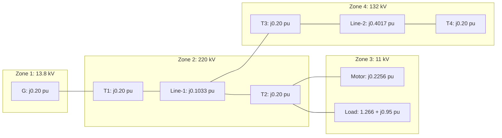

### 19.7 Lecture 19 Recap

In this lecture, we established:
- Worked Example 4: generator with three motors, showing motor reactance conversion
- Worked Example 5: three single-phase transformers as a three-phase bank, proving per-unit values are identical
- Worked Example 6: three-bus system with load representation (series and parallel)
- Worked Example 7: multi-transformer system with two transmission lines
- The sign convention for lagging power factor loads: $S = P + jQ$ (positive reactive power)
- The invariance of real quantities regardless of base voltage choice

---

## Lecture 20: Voltage Control Methods and Tap-Changing Transformers

### 20.1 Physical Intuition: Why Voltage Control Matters

Voltage control is one of the most practical aspects of power system operation. Loads are designed to operate at specific voltage levels—motors, lighting, and electronic equipment all have voltage tolerances. When voltage drops too low, motors draw excessive current, lights dim, and equipment can malfunction. When voltage rises too high, insulation stress increases and equipment life is shortened.

The lecturer introduces the topic with a clear list of methods:

1. Tap changing transformer
2. Regulating transformer or booster transformer
3. Shunt capacitor
4. Series capacitor
5. FACTS devices

**Note**: "in this course we will not discuss about FACTS devices right because it is a it is a very big topic. So, we will not discuss, but we will discuss on tap changing transformers regulators or boosters shunt capacitors and series capacitors just tell some ideas you will get right."


### 20.2 Tap Changing Transformers

**Definition and Purpose**: "main purpose of all power or distribution transformer basically the transform electrical energy from one voltage level to another voltage level right. So, practically all power all power and many distribution transformer they have the you know they you have the taps for changing the turns ratio."

**Key principle**: "voltage magnitude is altered by changing the your tap setting and affects the distribution of VARs that is the volt amperes and may be used to control the flow of reactive power"


**Two types of tap changing transformers**:

1. **Off-load tap changing transformers**: "you have to disconnect the load from the transformer then you have to change the tap"
2. **Tap changing under load (TCUL) transformers**: "all line you can change the tap right"

### 20.3 Off-Load Tap Changing Transformer

"the off load tap changing transformer requires the disconnection of the transformer from the supply or when the tap setting is to be changed right you have to disconnect the transformer from the supply right."


The connection shows four taps (2 on each side) with a switching mechanism. The operation: "if you the switch position is here that is full voltage is applied to that otherwise the voltage thing you are what you call if it is coming here means that voltage we will reduce to this side"

**Limitation**: "when you want to change the tap ratio very frequently this is not very frequently because every time you have to switch on or switch off right"

### 20.4 Tap Changing Under Load (TCUL) Transformer

"tap changing underload when it is necessary that you have to change the you have to change the tap very frequently that side is at the time you have to do it on line right. So, it can change while that the supply power is connected to the transformer."


**Typical tap range**: "generally in a transformer power transformer you will find that tap changing we will start from 5 or you're your your point 0.6 to 5 % to your point your what you call that ±10% right. So, one side if it is .6 to 5 pa your percent if you take then I lowering or higher side totals taps will be may be 32 right I mean voltage can vary from 0.9 to your what you call that 1.1 right, but it depends on the design."

**Operating sequence for one tap change**:


1. Open $A_1$
2. Move selector switch $P_1$ to the next contact
3. Close $A_1$
4. Open $A_2$
5. Move selector switch $P_2$ to the next contact
6. Close $A_2$

**Placement convention**: "step down units usually I have TCUL that is on the low voltage side and the de-energized taps in the high voltage side"

### 20.5 Radial Transmission Line with Tap Changing Transformers

Now we develop the mathematical framework for tap ratio calculation.


**System Configuration**:
- Sending end transformer: $1 : t_S$
- Receiving end transformer: $1 : t_R$
- Line impedance: $Z = R + jX$
- Sending end voltage: $V_S$
- Receiving end voltage: $V_R$
- Bus 1 (sending end), Bus 2 (receiving end)

**Objective**: "to find out the tap changing ratios required to completely compensate for the voltage drop in the line right"

### 20.6 Voltage Phasor Diagram Analysis


Taking receiving end voltage as reference:
- Current $I$ lags $V_R$ by angle $\Phi$
- $IR$ drop in phase with current
- $jIX$ drop at 90° to current
- Sending end voltage $V_S$ completes the phasor diagram
- Angle between $V_S$ and $V_R$ is $\delta$

From the phasor diagram:
- AB = $|I|R\cos\phi$
- BC = $|I|X\sin\phi$

$$|V_S|\cos\delta = |V_R| + |I|R\cos\phi + |I|X\sin\phi$$

**Simplification for small phase angle**:

"this phase angle δ between your sending end and receiving end with very your negligible very small right, so usually δ we can take it say as approximately as '0'"

With $\delta = 0$:

$$|V_S| = |V_R| + |I|R\cos\phi + |I|X\sin\phi$$


**Power relationships**:

$$P = |V_R||I|\cos\phi$$

$$Q = |V_R||I|\sin\phi$$

From these:

$$|I|\cos\phi = \frac{P}{|V_R|}$$

$$|I|\sin\phi = \frac{Q}{|V_R|}$$


Substituting:

$$|V_S| = |V_R| + \frac{PR + QX}{|V_R|}$$

### 20.7 Transformer Ratio Relationships

From the transformer connections:
- $V_S = t_S \times V_1$ (magnitude-wise)
- $V_R = t_R \times V_2$ (magnitude-wise)

Substituting into the voltage equation:

$$t_S|V_1| = t_R|V_2| + \frac{PR + QX}{t_R|V_2|}$$


Solving for $t_S$:

$$t_S = \frac{1}{|V_1|}\left(t_R|V_2| + \frac{PR + QX}{t_R|V_2|}\right)$$

**Assumption**: $t_S \times t_R = 1$

"this ensures that the overall voltage level remains the same order and that the minimum range of taps on both transformer is used"

Substituting $t_R = \frac{1}{t_S}$:

$$t_S = \left[\frac{|V_2|}{|V_1|}\left(1 - \frac{PR + QX}{|V_1||V_2|}\right)^{-1}\right]^{1/2}$$

### 20.8 Worked Example 8: Tap Setting Calculation

**Problem**: "A three-phase transmission line is feeding from a 13.8/220KV transformer at its sending end. The line is supplying a 105 MVA, 0.8 pf (lag) load through a step-down transformer of 220/13.8 KV. Total impedance of the line and transformers at 220KV is (20+j120)Ω. The sending end transformer is energized from a 13.8 KV supply. Find out the tap setting for each transformer to maintain the voltage of the 13.8 KV."


**Solution**:

**Important note**: "when you draw the phasor diagram or those equation or P, Q, $V_S$, $V_R$ that $V_S$, $V_R$ all are per phase quantity. So, it is not a line to line quantity $V_S$ and $V_R$ actually it is a per phase voltage right line to neutral right. And at the time P and Q also you have to find out that per phase that is why it is divided by 3 divided by 3 right"


Per-phase power:

$$P = \frac{1}{3} \times 105 \times 0.8 = 28 \text{ MW}$$

$$Q = \frac{1}{3} \times 105 \times 0.6 = 21 \text{ MVAR}$$

(Since $\cos\phi = 0.8$, $\sin\phi = 0.6$)

Source and load phase voltages referred to high voltage side:

$$|V_1| = |V_2| = \frac{220}{\sqrt{3}} = 127.017 \text{ KV}$$


Since $|V_1| = |V_2|$, the ratio $\frac{|V_2|}{|V_1|} = 1$.

Given: $R = 20 \Omega$, $X = 120 \Omega$

Using the tap ratio formula:

$$t_S = \left[1 \times \left(1 - \frac{28 \times 20 + 21 \times 120}{127.017 \times 127.017}\right)^{-1}\right]^{1/2} = 1.11$$

$$t_R = \frac{1}{t_S} = \frac{1}{1.11} = 0.90$$


### 20.9 Worked Example 9: Tap Ratios for Equal Sending and Receiving Voltages

**Problem**: "Determine the transformer tap ratios when the receiving end voltage is equal to the sending end voltage. The high voltage line operates at 220 KV and transmit 80 megawatt at 0.8 power factor lag and the impedance of the line is $40 + j140 \Omega$. Assume $t_S \times t_R = 1$"


**Solution**:


$$|V_1| = |V_2| = \frac{220}{\sqrt{3}} = 127.017 \text{ KV}$$

$$\frac{|V_2|}{|V_1|} = 1$$

Per-phase power:

$$P = \frac{1}{3} \times 80 \times 0.8 = 21.33 \text{ MW}$$

$$Q = \frac{1}{3} \times 80 \times 0.6 = 16 \text{ MVAR}$$

Given: $R = 40 \Omega$, $X = 140 \Omega$

Using the tap ratio formula:

$$t_S = 1.11$$

$$t_R = \frac{1}{t_S} = 0.90$$


### 20.10 Booster Transformer / Regulating Transformer

**Definition and Purpose**: "booster transformer or regulating transformer are these are this thing what you call it is same thing sometimes we call regulating transformer sometimes we call booster transformer. These are actually used to change the voltage magnitude and phase angle right, at an intermediate point in a line rather than at the ends right."

**Key difference from tap changing transformers**: "tap changing transformer what you do? We make it either this sending end side or receiving end side right or the system in our warrant the expense of tap changing, but in this case we can we can put it in this somewhere intermediate position of the line."

**Capabilities**: "one is voltage magnitude can be control, phase angle also can be controlled"

### 20.11 In-Phase Booster Transformer


For phase 'a' (line to neutral):
- Exciting transformer with tap positions
- Series transformer with one winding in series with phase 'a' line
- Switches $S_1$ and $S_2$

**Operation**: "the secondary of the exciting transformer is tapped and the voltage obtained from it is applied to the primary of the series transformer"

Output voltage:

$$V_{an}' = V_{an} + \Delta V_{an}$$

**Polarity reversal**: "if you interchange the position of $S_1$ and $S_2$ right then what we will happen this will be a subtraction right... at that time this voltage will be less than this one"


**Key Characteristics**:

"this type of booster transformer is called an in phase booster because the voltage are in phase"

- $V_{an}'$ can be adjusted by changing taps of excitation transformer
- Polarity can be reversed by changing switch positions
- $\Delta V_{an}$ can be made negative

### 20.12 Phase Angle Control with Booster Transformer


For phase 'a' (line to neutral):
- Exciting transformer connected to $V_{bc}$ (line-to-line voltage)
- Series transformer in phase 'a'
- Tap settings and switches $S_1$, $S_2$

Output voltage:

$$V_{an}' = V_{an} + \Delta V_{bc}$$

**Key point**: "$\Delta V_{bc}$ is anyway not in phase not in phase with your with phase 'a' voltage that is $V_{an}$"

### 20.13 Phasor Analysis of Phase-Shifting Transformer


Taking $V_{an}$ as reference:
- $V_{bn}$ at 120° lag
- $V_{cn}$ at 120° lead
- $V_{bc}$ lags $V_{an}$ by 90°


**Mathematical Derivation**:

Let $\Delta V_{bc} = a \times V_{bc}$ where $a$ is a fraction.

For balanced system:

$$V_{bc} = \sqrt{3} \times V_{an} \angle -90^\circ$$

Therefore:

$$\Delta V_{bc} = a\sqrt{3}V_{an} \angle -90^\circ = -ja\sqrt{3}V_{an}$$

Substituting:

$$V_{an}' = (1 - ja\sqrt{3})V_{an}$$

**Result**: "$V_{an}'$ is lagging from $V_{an}$ by an phase shifting angle $\alpha$"

**Key insight**: "this injected voltage $\Delta V_{bc}$ is in quadrature with the voltage $V_{an}$ and thus the resultant voltage $V_{an}'$ goes through a phase shift $\alpha$ as shown in figure-27"

**Three-phase application**: "similar connections for your $\alpha$ made for the remaining phases also because three-phase balance, you have to make the same connection for the other 2 phases like b and c right resulting in a balance 3 phase output voltage."

### 20.14 Mermaid Diagram: Voltage Control Methods Classification

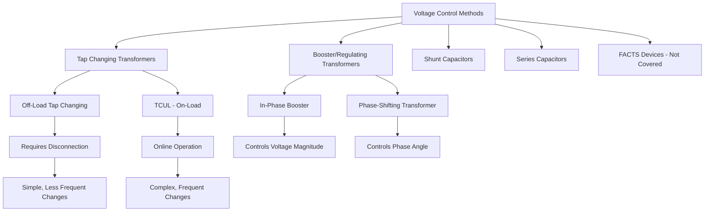

### 20.15 Lecture 20 Recap

In this lecture, we established:
- The five methods of voltage control (tap changing, regulating/booster, shunt capacitor, series capacitor, FACTS)
- Off-load vs. on-load tap changing transformers and their operating sequences
- The radial line tap ratio derivation: $t_S = \left[\frac{|V_2|}{|V_1|}\left(1 - \frac{PR + QX}{|V_1||V_2|}\right)^{-1}\right]^{1/2}$
- Worked Examples 8 and 9 for tap setting calculations
- In-phase booster transformers for voltage magnitude control
- Phase-shifting transformers for phase angle control

---

## Summary of Key Equations

| Equation | Description | Expression |
|----------|-------------|------------|
| (2) | Per-unit definition | $\text{Per-unit} = \frac{\text{actual}}{\text{base}}$ |
| (3) | Per-unit quantities | $S_{pu} = \frac{S}{S_B}$, $V_{pu} = \frac{V}{V_B}$, $I_{pu} = \frac{I}{I_B}$, $Z_{pu} = \frac{Z}{Z_B}$ |
| (4) | Base current | $I_B = \frac{(MVA)_B}{\sqrt{3}(KV)_B}$ |
| (5) | Base impedance (form 1) | $Z_B = \frac{(KV)_B}{\sqrt{3} \cdot I_B}$ |
| (6) | Base impedance (form 2) | $Z_B = \frac{(KV)_B^2}{(MVA)_B}$ |
| (7) | Complex power in pu | $S_{pu} = V_{pu} \cdot I_{pu}^*$ |
| (8) | Ohm's law in pu | $V_{pu} = Z_{pu} \cdot I_{pu}$ |
| (11) | Load impedance | $Z_L = \frac{3|V_{phase}|^2}{S_{load(3\phi)}^*}$ |
| (15) | Load impedance in pu | $Z_{pu} = \frac{|V_{pu}|^2}{S_{load(pu)}^*}$ |
| (16) | Base change | $Z_{pu,new} = Z_{pu,old} \cdot \frac{(KV)_{B,old}^2}{(MVA)_{B,old}} \cdot \frac{(MVA)_{B,new}}{(KV)_{B,new}^2}$ |
| (17) | Voltage base ratio | $\frac{V_{pB}}{V_{sB}} = \frac{1}{a}$ |
| (18) | Current base ratio | $\frac{I_{pB}}{I_{sB}} = a$ |
| (28) | Current equality | $I_p(pu) = I_s(pu) = I(pu)$ |
| (29) | Transformer pu equation | $V_s(pu) = V_p(pu) - I(pu) \cdot Z(pu)$ |
| (30) | Transformer pu impedance | $Z(pu) = Z_p(pu) + Z_s(pu)$ |
| (34) | Sending end voltage | $\|V_S\|\cos\delta = \|V_R\| + \|I\|R\cos\phi + \|I\|X\sin\phi$ |
| (35) | Simplified voltage equation | $\|V_S\| = \|V_R\| + \|I\|R\cos\phi + \|I\|X\sin\phi$ |
| (40) | Voltage drop equation | $\|V_S\| = \|V_R\| + \frac{PR + QX}{\|V_R\|}$ |
| (43) | Tap ratio formula | $t_S = \left[\frac{\|V_2\|}{\|V_1\|}\left(1 - \frac{PR + QX}{\|V_1\|\|V_2\|}\right)^{-1}\right]^{1/2}$ |
| (44) | In-phase booster | $V_{an}' = V_{an} + \Delta V_{an}$ |
| (45) | Phase-shifting booster | $V_{an}' = V_{an} + \Delta V_{bc}$ |
| (46) | Quadrature injection | $\Delta V_{bc} = -ja\sqrt{3}V_{an}$ |
| (47) | Phase-shifted output | $V_{an}' = (1 - ja\sqrt{3})V_{an}$ |

---

## Mermaid Diagram: Per-Unit Analysis Workflow

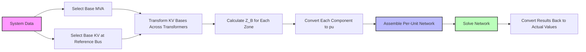

---

## Mermaid Diagram: Fault Analysis with Per-Unit Networks

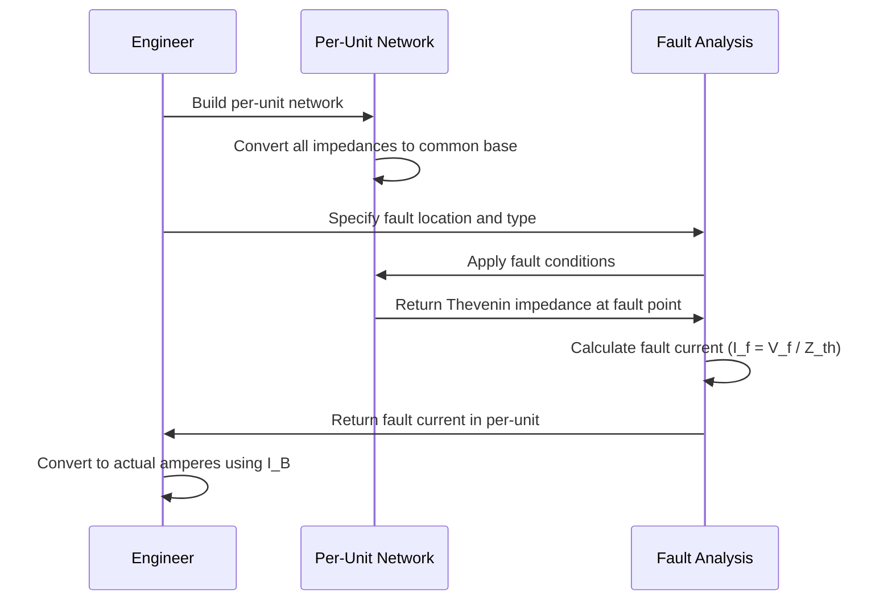

---

## Verified Source Visual Atlas

The descriptions below are based on direct inspection of the selected source crops and the local `images.json` manifest. Small handwritten labels or numerical values that are not fully legible at this resolution are intentionally left untranscribed; use the surrounding derivation for exact values.

### Lecture 16 — Y–Y transformer connection and single-phase equivalent (physical PDF page 138)

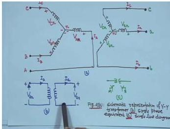

The visual shows three representations of a balanced Y–Y transformer: a three-phase winding sketch at the top, a single-phase equivalent below, and a single-line symbol at right. Read the polarity marks and current arrows before carrying a phase relationship into a per-unit circuit.

### Lecture 16 — Per-unit load-impedance relation (physical PDF page 152)

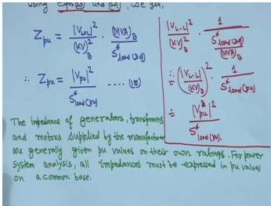

The board presents equivalent forms of the per-unit load-impedance equation, including the voltage-squared form divided by conjugate per-unit apparent power. The boxed/underlined result is the part to reuse; the handwritten explanatory note connects the result to generators, transformers, and motors on a common base.

### Lecture 17 — Transformer equivalent circuit with turns ratio (physical PDF page 156)

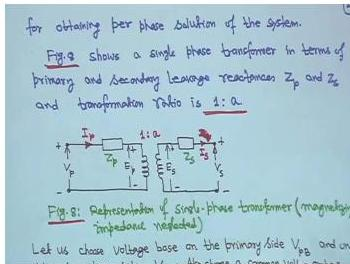

The source drawing places the primary and secondary leakage impedances on either side of a transformer marked with turns ratio $1:a$, with primary and secondary voltages and the magnetizing branch omitted for the simplified representation. Follow the polarity marks and side labels when deciding which impedance is being referred across the ratio.

### Lecture 17 — Worked base-impedance calculation (physical PDF page 171)

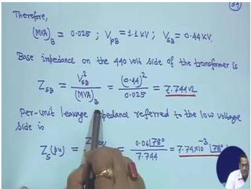

This worked board substitutes a transformer base voltage and base apparent power into $Z_B=V_B^2/S_B$, then refers the result to the other side. The underlined arithmetic is visible, but some small handwritten digits are not fully legible; the visual should be read as a calculation sequence rather than as an authoritative transcription of every number.

### Lecture 18 — Three-generator single-line system (physical PDF page 183)

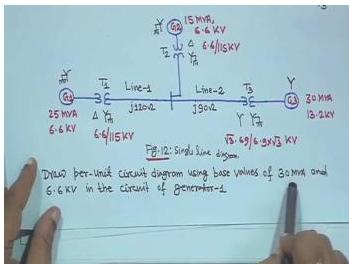

The visual is a system-level single-line diagram with three generators, transformers, and two transmission-line sections. Trace the voltage-level and MVA labels from the chosen base through each transformer before converting each element to per-unit reactance; several small labels are too fine to read reliably here.

### Lecture 19 — Generator, line, transformer, and motor reactance network (physical PDF page 195)

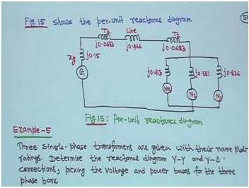

The hand-drawn network replaces the physical system with series reactance elements and machine branches. Read it from the generator around the top line toward the transformer and motor branches, retaining each $jX$ label as a separate element; the small numeric reactances should be verified from the worked text.

### Lecture 19 — Final per-unit equivalent circuit (physical PDF page 213)

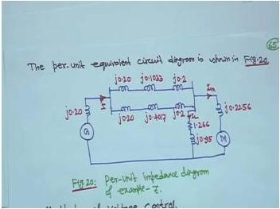

This visual is the completed reduced per-unit circuit for the multi-transformer example, with the generator, series line/transformer impedances, and motor/load branches shown in one network. It is useful as a topology check after base conversion; the handwritten values are not all legible enough to reproduce safely.

### Lecture 20 — Voltage phase-shift phasor diagram (physical PDF page 250)

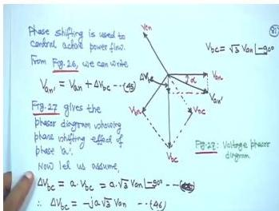

The board shows a phasor construction for the voltage change produced by a phase-shifting transformer, with the original and shifted voltage vectors and an indicated angle. Read the diagram geometrically—identify the reference vector, the added increment, and the resulting phase angle—before applying the nearby algebraic relations.

## Common Mistakes and Engineering Checks

### Common Mistakes

1. **Multiplying instead of dividing by $a^2$** when referring impedance across a transformer. The correct formula is $Z_{p,eq} = Z_{s,eq}/a^2$ where $a = N_1/N_2$.

2. **Using 'L' for low voltage** — must use 'X' since 'L' stands for line.

3. **Multiplying per-unit values by 3 or √3 for three-phase transformers** — "Please do not multiply by 3 or √3, it is per unit given."

4. **Forgetting that base MVA remains constant** throughout the network; only base voltage changes across transformers.

5. **Not converting all quantities to a common base** — manufacturer per-unit values are on their own ratings and must be converted.

6. **Confusing the two definitions of 'a'** — in the transformer equivalent circuit section, $a = N_2/N_1$ (not $N_1/N_2$ as in the earlier section).

7. **Forgetting the conjugate in complex power expressions** — $S = VI^*$ is essential for capturing power factor angle.

8. **Using line-to-line vs. phase quantities inconsistently** — base voltage is line-to-line, but some formulas require phase quantities.

9. **Wrong sign for lagging power factor load** — "whenever load is lagging power factor means it will be $0.8 + j0.6$ right. So, I suggest they do not take it minus then, then it will be mistake because load consume powers of convention is that load always consume power"

10. **Using three-phase power instead of per-phase** in tap ratio calculations — "P and Q also you have to find out that per phase that is why it is divided by 3 divided by 3 right and $V_S$ $V_R$ magnitude also per phase basis"

### Engineering Checks

1. **Sanity check on per-unit values**: Generator and transformer reactances typically range from 0.05 to 0.30 p.u. If you get values outside this range, check your base conversion.

2. **Base voltage consistency**: When moving across a transformer, the base voltage must change in proportion to the transformer turns ratio. Verify each zone's base voltage.

3. **Per-unit impedance invariance**: For a transformer, the per-unit impedance should be the same whether computed from primary or secondary side. Use this as a verification.

4. **Load impedance sign**: For a lagging power factor load, the impedance should have a positive imaginary part (inductive). If you get a negative imaginary part, check your conjugate operations.

5. **Tap ratio bounds**: Typical tap ranges are ±10%. If your calculated tap ratio is far outside this range, check your calculations.

6. **Per-unit vs. actual values**: Always verify that converting per-unit results back to actual values gives physically reasonable numbers (e.g., currents in hundreds of amperes, not millions).

---

## Quick Revision Sheet

### Per-Unit Fundamentals

- Per-unit quantity = actual quantity / base quantity
- Base values are always real numbers; actual quantities can be complex
- Two independent base values: $(MVA)_B$ and $(KV)_B$ (line-to-line)
- $I_B = \frac{(MVA)_B}{\sqrt{3}(KV)_B}$
- $Z_B = \frac{(KV)_B^2}{(MVA)_B}$
- $S_{pu} = V_{pu} \cdot I_{pu}^*$
- $V_{pu} = Z_{pu} \cdot I_{pu}$
- $Z_{pu} = \frac{|V_{pu}|^2}{S_{load(pu)}^*}$

### Base Change

- $Z_{pu,new} = Z_{pu,old} \cdot \frac{(KV)_{B,old}^2}{(MVA)_{B,old}} \cdot \frac{(MVA)_{B,new}}{(KV)_{B,new}^2}$
- Old values = equipment ratings; new values = system base

### Transformer in Per-Unit

- $a = N_2/N_1$ (in this section)
- $\frac{V_{pB}}{V_{sB}} = \frac{1}{a}$, $\frac{I_{pB}}{I_{sB}} = a$
- $I_p(pu) = I_s(pu) = I(pu)$
- $Z(pu) = Z_p(pu) + Z_s(pu)$
- Per-unit impedance is same from either side

### Y-Δ Relationships

- Y-side is always high voltage (convention)
- $\frac{V_{HL}}{V_{XL}} = \sqrt{3} \cdot \frac{N_1}{N_2}$
- Equivalent Y of Δ has turns $N_2/\sqrt{3}$

### Tap Changing Transformers

- $|V_S| = |V_R| + \frac{PR + QX}{|V_R|}$ (per-phase quantities)
- $t_S = \left[\frac{|V_2|}{|V_1|}\left(1 - \frac{PR + QX}{|V_1||V_2|}\right)^{-1}\right]^{1/2}$
- Assumption: $t_S \times t_R = 1$
- P and Q are per-phase values (divide three-phase by 3)

### Booster Transformers

- In-phase booster: $V_{an}' = V_{an} + \Delta V_{an}$ (magnitude control)
- Phase-shifting: $V_{an}' = V_{an} + \Delta V_{bc}$ (phase angle control)
- $\Delta V_{bc} = -ja\sqrt{3}V_{an}$ (quadrature injection)

---

## Practice Quiz

### Question 1 (MCQ)

For a Y-Δ transformer where the Y-side is the high voltage side, the ratio of line-to-line voltages $\frac{V_{HL}}{V_{XL}}$ is:

Options:
(a) $\frac{N_1}{N_2}$
(b) $\sqrt{3} \cdot \frac{N_1}{N_2}$
(c) $\frac{N_1}{\sqrt{3} \cdot N_2}$
(d) $\frac{\sqrt{3} \cdot N_2}{N_1}$

> Answer and explanation
> The correct answer is (b). For a Y-Δ transformer, the line voltage on the Y side is $\sqrt{3}$ times the phase voltage, while on the Δ side line voltage equals phase voltage. Therefore:
> $$\frac{V_{HL}}{V_{XL}} = \frac{\sqrt{3} \cdot V_{HP}}{V_{XP}} = \sqrt{3} \cdot \frac{N_1}{N_2}$$
> The $\sqrt{3}$ factor arises because the Y connection multiplies phase voltage by $\sqrt{3}$ to get line voltage, while the Δ connection does not.

### Question 2 (MCQ)

In the per-unit system, which of the following statements is TRUE?

Options:
(a) Base values can be complex numbers
(b) The base MVA changes when moving across a transformer
(c) The base voltage changes in proportion to the transformer turns ratio when moving across a transformer
(d) The per-unit impedance of a transformer is different when computed from primary vs. secondary side

> Answer and explanation
> The correct answer is (c). When moving across a transformer, the voltage base changes in proportion to the transformer voltage rating. The base MVA remains constant throughout the network (eliminating (b)). Base values are always real numbers (eliminating (a)). The per-unit impedance of a transformer is the same whether computed from primary or secondary side (eliminating (d)).

### Question 3 (MCQ)

A generator has a reactance of 0.2 p.u. on its own rating of 25 MVA, 6.6 kV. What is its reactance on a base of 30 MVA, 6.6 kV?

Options:
(a) 0.167 p.u.
(b) 0.24 p.u.
(c) 0.20 p.u.
(d) 0.30 p.u.

> Answer and explanation
> The correct answer is (b). Using the base change formula:
> $$X_{new} = X_{old} \times \frac{(MVA)_{B,new}}{(MVA)_{B,old}} \times \frac{(KV)_{B,old}^2}{(KV)_{B,new}^2}$$
> Since the KV base is the same (6.6 kV), the voltage ratio is 1:
> $$X_{new} = 0.2 \times \frac{30}{25} = 0.24 \text{ p.u.}$$
> The MVA ratio increases the reactance because a larger MVA base means a smaller base impedance, making the same ohmic value appear larger in per-unit.

### Question 4 (MCQ)

For a single-phase transformer with turns ratio $1:a$ (where $a = N_2/N_1$), the relationship between primary and secondary base currents is:

Options:
(a) $\frac{I_{pB}}{I_{sB}} = \frac{1}{a}$
(b) $\frac{I_{pB}}{I_{sB}} = a$
(c) $\frac{I_{pB}}{I_{sB}} = a^2$
(d) $\frac{I_{pB}}{I_{sB}} = \frac{1}{a^2}$

> Answer and explanation
> The correct answer is (b). The current base ratio is the reciprocal of the voltage base ratio. Since $\frac{V_{pB}}{V_{sB}} = \frac{1}{a}$, and the power base is the same on both sides ($V_{pB} \cdot I_{pB} = V_{sB} \cdot I_{sB}$), we get:
> $$\frac{I_{pB}}{I_{sB}} = \frac{V_{sB}}{V_{pB}} = a$$
> This ensures that the per-unit currents are equal on both sides of the transformer.

### Question 5 (MCQ)

For a lagging power factor load of 50 MVA at 0.8 pf, the complex power in MVA is:

Options:
(a) $40 - j30$
(b) $40 + j30$
(c) $30 + j40$
(d) $50 + j0$

> Answer and explanation
> The correct answer is (b). For a lagging power factor load, the load consumes reactive power, so the reactive component is positive:
> $$S = P + jQ = 50(0.8) + j50(0.6) = 40 + j30 \text{ MVA}$$
> The instructor emphasizes: "whenever load is lagging power factor means it will be $0.8 + j0.6$ right. So, I suggest they do not take it minus then, then it will be mistake because load consume powers of convention is that load always consume power"

### Question 6 (MCQ)

In the TCUL (tap changing under load) transformer operating sequence, what is the correct order for one tap change?

Options:
(a) Open A₁, move P₁, close A₁, open A₂, move P₂, close A₂
(b) Move P₁, open A₁, close A₁, move P₂, open A₂, close A₂
(c) Open A₁, close A₁, move P₁, open A₂, close A₂, move P₂
(d) Move P₁, move P₂, open A₁, close A₁, open A₂, close A₂

> Answer and explanation
> The correct answer is (a). The sequence is:
> 1. Open $A_1$
> 2. Move selector switch $P_1$ to the next contact
> 3. Close $A_1$
> 4. Open $A_2$
> 5. Move selector switch $P_2$ to the next contact
> 6. Close $A_2$
> This sequence ensures that the load current is never interrupted and the transformer is never short-circuited during the tap change.

### Question 7 (MSQ)

Which of the following are advantages of the per-unit system? (Select all that apply)

Options:
(a) The equivalent circuit of a transformer is simplified
(b) Different voltage levels disappear from the circuit diagram
(c) Comparison of equipment characteristics is facilitated
(d) Actual quantities are always easier to work with

> Answer and explanation
> The correct answers are (a), (b), and (c). The lecturer lists three key advantages:
> 1. "By properly specifying base quantities, the equivalent circuit of transformer can be simplified"
> 2. "The comparison of the characteristic of the various electrical quantities of different type and ratings is facilitated"
> 3. Different voltage levels disappear in the circuit diagram
> Option (d) is incorrect—per-unit quantities are often easier to work with than actual quantities, which is the whole point of the system.

### Question 8 (MSQ)

Which of the following are methods of voltage control discussed in Lecture 20? (Select all that apply)

Options:
(a) Tap changing transformer
(b) Regulating transformer or booster transformer
(c) Shunt capacitor
(d) FACTS devices

> Answer and explanation
> The correct answers are (a), (b), (c), and (d). All four are listed as methods of voltage control. However, the instructor notes: "in this course we will not discuss about FACTS devices right because it is a it is a very big topic. So, we will not discuss, but we will discuss on tap changing transformers regulators or boosters shunt capacitors and series capacitors just tell some ideas you will get right." So while FACTS is a valid method, it is not covered in detail.

### Question 9 (MSQ)

For the per-unit representation of a transformer, which of the following statements are TRUE? (Select all that apply)

Options:
(a) $I_p(pu) = I_s(pu) = I(pu)$
(b) $Z(pu) = Z_p(pu) + Z_s(pu)$
(c) The ideal transformer disappears from the equivalent circuit
(d) The per-unit impedance is different when computed from primary vs. secondary side

> Answer and explanation
> The correct answers are (a), (b), and (c). The key results from Lecture 17 are:
> - $I_p(pu) = I_s(pu) = I(pu)$ (current equality)
> - $Z(pu) = Z_p(pu) + Z_s(pu)$ (series impedance)
> - The per-unit equivalent circuit is a simple series impedance with no ideal transformer
> Option (d) is false—the per-unit impedance is the same whether computed from primary or secondary side, which is one of the key advantages of the per-unit system.

### Question 10 (Short Answer)

Why is the Δ connection replaced by an equivalent Y connection in the analysis of Y-Δ transformers?

> Answer and explanation
> The Δ connection is replaced by an equivalent Y connection for mathematical convenience in balanced three-phase systems. Since the system is balanced, the Y-neutral and the neutral of the equivalent Y of the Δ-connection are at the same potential. They can be connected together and represented by a neutral conductor, allowing a single-line diagram representation. The equivalent Y has each phase turns = $N_2/\sqrt{3}$. The lecturer emphasizes this is purely mathematical: "Reality it is not there, but from mathematical point of view it is like."

### Question 11 (Short Answer)

What is the significance of the conjugate in the complex power expression $S_{pu} = V_{pu} \cdot I_{pu}^*$?

> Answer and explanation
> The conjugate appears "to capture the power factor angle, when voltage and currents are purely sinusoidal." In AC circuits, the power factor angle is the phase difference between voltage and current. Using the conjugate of current ensures that:
> - For a lagging power factor (inductive load), the reactive power Q is positive
> - For a leading power factor (capacitive load), the reactive power Q is negative
> This is essential for load flow studies where we need to track both real and reactive power.

### Question 12 (Short Answer)

What is the assumption $t_S \times t_R = 1$ in the tap ratio derivation, and why is it made?

> Answer and explanation
> The assumption $t_S \times t_R = 1$ ensures that "the overall voltage level remains the same order and that the minimum range of taps on both transformer is used." This means that if the sending end transformer steps up by a factor $t_S$, the receiving end transformer steps down by the reciprocal $1/t_S$, maintaining the overall voltage level. This is a practical design choice that minimizes the tap range needed on each transformer.

### Question 13 (Short Answer)

For a three-phase transformer bank formed from three single-phase transformers, why do the per-unit values remain the same whether computed on single-phase or three-phase basis?

> Answer and explanation
> The per-unit values remain the same because the base impedance is invariant. For single-phase: $Z_{B1} = \frac{(KV)_{B1}^2}{(MVA)_{Base}}$. For three-phase: $Z_{B1} = \frac{(KV)_{B,ll}^2}{(MVA)_{B,3\Phi}} = \frac{(\sqrt{3} \times 12.66)^2}{3} = \frac{3 \times 12.66^2}{3} = \frac{12.66^2}{1}$. The $\sqrt{3}$ factor in the voltage and the factor of 3 in the MVA cancel out, giving the same base impedance. Therefore, the per-unit values are identical.

### Question 14 (Numerical)

A single-phase transformer is rated 25 KVA, 1100/440 V. The equivalent leakage impedance referred to the low voltage side is $0.06\angle 78° \Omega$. What is the per-unit leakage impedance?

Options:
(a) $7.74 \times 10^{-3} \angle 78°$ p.u.
(b) $7.74 \times 10^{-2} \angle 78°$ p.u.
(c) $0.774 \angle 78°$ p.u.
(d) $77.4 \angle 78°$ p.u.

> Answer and explanation
> The correct answer is (a).
> Step 1: Convert to consistent units: $(MVA)_B = 25/1000 = 0.025$ MVA, $V_{sB} = 440$ V $= 0.44$ kV
> Step 2: Secondary base impedance: $Z_{sB} = \frac{(0.44)^2}{0.025} = 7.744 \Omega$
> Step 3: Per-unit impedance: $Z_s(pu) = \frac{0.06\angle 78°}{7.744} = 7.74 \times 10^{-3} \angle 78°$ p.u.
> The same value is obtained from the primary side, demonstrating the invariance of per-unit impedance.

### Question 15 (Numerical)

For the tap ratio problem in Example 8, with $P = 28$ MW, $Q = 21$ MVAR, $R = 20 \Omega$, $X = 120 \Omega$, and $|V_1| = |V_2| = 127.017$ kV, what is the sending end tap ratio $t_S$?

Options:
(a) 0.90
(b) 1.00
(c) 1.11
(d) 1.21

> Answer and explanation
> The correct answer is (c).
> Using the tap ratio formula:
> $$t_S = \left[\frac{|V_2|}{|V_1|}\left(1 - \frac{PR + QX}{|V_1||V_2|}\right)^{-1}\right]^{1/2}$$
> Since $|V_1| = |V_2|$, the ratio is 1:
> $$t_S = \left[1 \times \left(1 - \frac{28 \times 20 + 21 \times 120}{127.017 \times 127.017}\right)^{-1}\right]^{1/2}$$
> $$t_S = \left[\left(1 - \frac{560 + 2520}{16133.3}\right)^{-1}\right]^{1/2} = \left[\left(1 - 0.1909\right)^{-1}\right]^{1/2}$$
> $$t_S = \left[\frac{1}{0.8091}\right]^{1/2} = [1.236]^{1/2} = 1.11$$
> Then $t_R = 1/t_S = 1/1.11 = 0.90$.

### Question 16 (Numerical)

In Example 2, the load current was calculated as $I_L = 2.355\angle -64.86°$ p.u. with a base current of 25.4 A. What is the load current in Amperes?

Options:
(a) $59.83\angle -64.86°$ A
(b) $2.355\angle -64.86°$ A
(c) $25.4\angle -64.86°$ A
(d) $0.0927\angle -64.86°$ A

> Answer and explanation
> The correct answer is (a).
> To convert from per-unit to actual amperes, multiply by the base current:
> $$I_L = I_L(pu) \times I_{B3} = 2.355 \times 25.4 = 59.83\angle -64.86° \text{ A}$$
> The angle remains the same because the base current is a real number. The current is lagging because the load is inductive, as noted by the lecturer.

### Question 17 (Scenario)

A power system has a generator rated 100 MVA, 33 kV with 15% reactance connected to three motors through transformers and a transmission line. The motors are rated 40 MVA, 30 MVA, and 20 MVA at 30 kV with 20% reactance each. The base values chosen are 100 MVA and 33 kV in the generator circuit. What is the per-unit reactance of Motor 1?

Options:
(a) 0.413 p.u.
(b) 0.551 p.u.
(c) 0.826 p.u.
(d) 0.20 p.u.

> Answer and explanation
> The correct answer is (a).
> Step 1: Convert Motor 1's reactance to ohmic value on its own rating:
> $$X_{m1}(\Omega) = 0.20 \times \frac{(30)^2}{40} = 4.5 \Omega$$
> Step 2: The base impedance in the generator circuit is:
> $$Z_B = \frac{(33)^2}{100} = 10.89 \Omega$$
> Step 3: Convert to per-unit on the system base:
> $$X_{m1,new} = \frac{4.5}{10.89} = 0.413 \text{ p.u.}$$
> Note that the motor is rated at 30 kV but the base voltage in the motor circuit is 33 kV. The voltage correction factor $(30/33)^2$ is applied for Motors 2 and 3 using the base change formula, but for Motor 1 the ohmic conversion method gives the same result.

### Question 18 (Scenario)

A three-phase transmission line feeds a 105 MVA, 0.8 pf lagging load through transformers. The total impedance of the line and transformers at 220 kV is $(20 + j120) \Omega$. The sending end transformer is energized from a 13.8 kV supply. What are the tap settings $t_S$ and $t_R$ to maintain the voltage at 13.8 kV?

Options:
(a) $t_S = 0.90$, $t_R = 1.11$
(b) $t_S = 1.11$, $t_R = 0.90$
(c) $t_S = 1.00$, $t_R = 1.00$
(d) $t_S = 1.11$, $t_R = 1.11$

> Answer and explanation
> The correct answer is (b).
> Step 1: Calculate per-phase power:
> $$P = \frac{1}{3} \times 105 \times 0.8 = 28 \text{ MW}$$
> $$Q = \frac{1}{3} \times 105 \times 0.6 = 21 \text{ MVAR}$$
> Step 2: Calculate phase voltages:
> $$|V_1| = |V_2| = \frac{220}{\sqrt{3}} = 127.017 \text{ kV}$$
> Step 3: Apply the tap ratio formula:
> $$t_S = \left[1 \times \left(1 - \frac{28 \times 20 + 21 \times 120}{127.017 \times 127.017}\right)^{-1}\right]^{1/2} = 1.11$$
> Step 4: Using the assumption $t_S \times t_R = 1$:
> $$t_R = \frac{1}{t_S} = \frac{1}{1.11} = 0.90$$
> The sending end transformer steps up (t_S > 1) and the receiving end steps down (t_R < 1) to compensate for the line voltage drop.

---

## Source Exercise Coverage

The following exercises from the source lectures have been covered in this document:

| Exercise | Lecture | Status |
|----------|---------|--------|
| Example 1: Single-phase transformer 25 KVA, 1100/440 V | Lecture 17 | Fully worked in Section 17.9 |
| Example 2: Single-phase circuit with two transformers | Lecture 18 | Fully worked in Section 18.2 |
| Example 3: Three-generator power system | Lecture 18 | Fully worked in Section 18.3 |
| Example 4: Generator with three motors | Lecture 19 | Fully worked in Section 19.2 |
| Example 5: Three single-phase transformers as three-phase bank | Lecture 19 | Fully worked in Section 19.3 |
| Example 6: Three-bus power system | Lecture 19 | Fully worked in Section 19.4 |
| Example 7: Multi-transformer system with two lines | Lecture 19 | Fully worked in Section 19.5 |
| Example 8: Tap setting calculation | Lecture 20 | Fully worked in Section 20.8 |
| Example 9: Tap ratios for equal voltages | Lecture 20 | Fully worked in Section 20.9 |
| Parallel load representation exercise | Lecture 19 | Partially covered; instructor showed series only, students to complete parallel |
| Alternative base voltage exercise (130 kV) | Lecture 19 | Mentioned as exercise; instructor notes results will be same in actual values |

**Unreadable or omitted items**: No source questions or exercises were found to be unreadable. The parallel load representation exercise was intentionally left for students to complete, as noted by the instructor: "Upto this I have shown rest for parallel part you will do it right, but I will I will show you only the series connection right, only the series connection."

---

## Source Provenance

- **Course**: NPTEL Power System Analysis
- **Instructor**: Prof. Debapriya Das, IIT Kharagpur
- **Lectures covered**: 16-20 (Week 4)
- **Extraction**: Mistral OCR 4 extraction
- **Drafting**: DeepSeek V4 Flash drafting
- **Review**: Locally reviewed and generated on 2026-08-05

**Note**: The models used for extraction and drafting are not authoritative sources. All technical content is derived from the NPTEL lecture materials by Prof. Debapriya Das.
