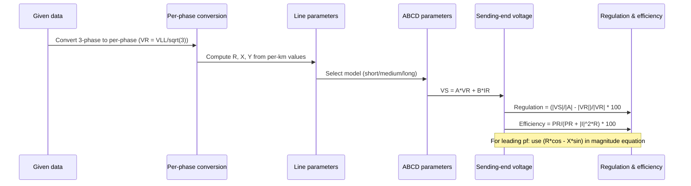
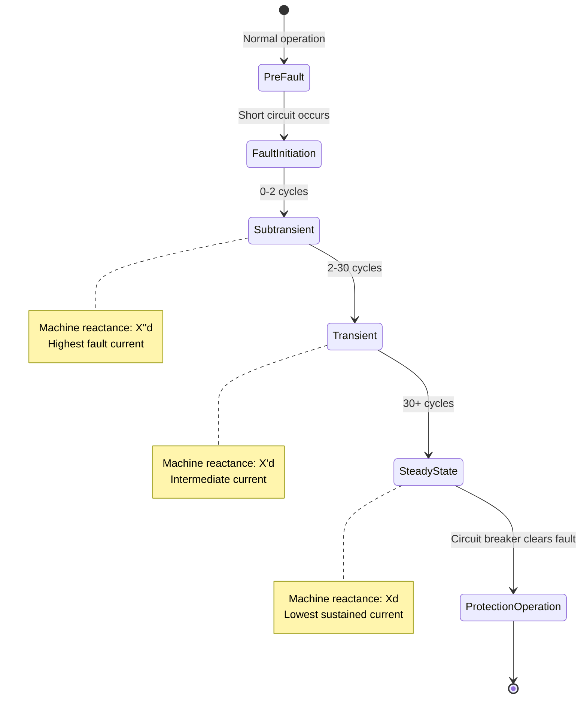
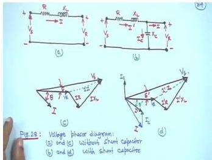
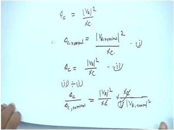
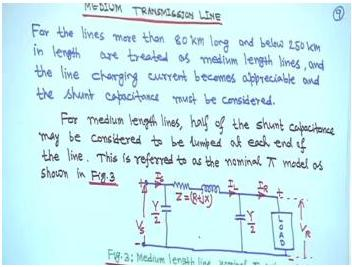
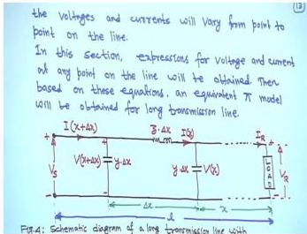
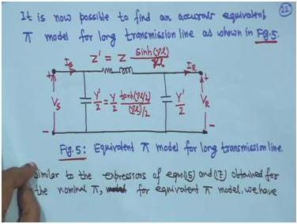
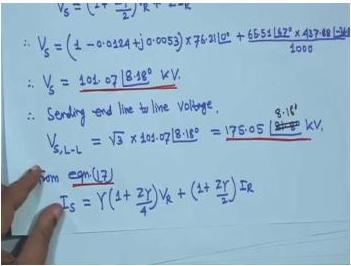
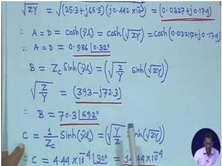
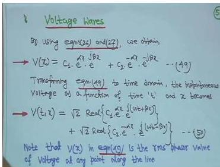

# Week 5 - Transmission-Line Models and Performance

## Orientation

Welcome to Week 5 of Power System Analysis. This week, we transition from the study of individual line parameters (resistance, inductance, and capacitance) to the **system-level performance** of transmission lines. We will learn how to represent an entire transmission line as a two-port network using ABCD parameters, and how to compute the key performance indicators: **voltage regulation** and **efficiency**.

The week is structured around five lectures that build progressively:

1. **Lecture 21** introduces the fundamental concepts of shunt and series capacitors for compensation, and establishes the two-port network representation of a line, starting with the simplest model: the short transmission line.
2. **Lecture 22** defines voltage regulation and derives its formula. We then extend our modeling capability to medium-length lines using the nominal π model, and finally introduce the distributed-parameter model for long lines, leading to the wave equation and hyperbolic solutions.
3. **Lecture 23** shows how to represent the exact distributed-parameter long line with an equivalent π model, making it compatible with standard power-flow analysis tools. We also work through a comprehensive example involving a shunt capacitor.
4. **Lecture 24** is dedicated to applying our models to solve numerical problems. We work through detailed examples for short lines and medium lines using the nominal π method, paying close attention to conventions and units.
5. **Lecture 25** tackles the most complex examples: a long transmission line using the exact equations, and a comparative study of all three models. The week concludes with a theoretical exploration of voltage waves, propagation velocity, and surge impedance.

By the end of this week, you will be able to select the appropriate line model, compute its ABCD parameters, and analyze its voltage profile and efficiency under various loading conditions. This foundational knowledge is critical for the upcoming topics of load-flow analysis and system stability.

### Learning Outcomes

After completing this week's lectures and this study guide, you will be able to:

- **Distinguish** between the primary objectives of shunt and series capacitors and analyze their impact on voltage and losses.
- **Represent** any transmission line as a two-port network using ABCD parameters and verify the identity $AD - BC = 1$.
- **Select and apply** the appropriate transmission line model (short, medium, or long) based on line length and operating voltage.
- **Derive** the ABCD parameters for the short line, nominal π, and exact distributed-parameter models.
- **Calculate** voltage regulation and transmission efficiency for various load conditions (lagging, leading, unity power factor).
- **Solve** numerical problems involving sending-end voltage, current, power factor, and power for all three line models.
- **Explain** the physical significance of the propagation constant, characteristic impedance, and the equivalent π model for long lines.
- **Analyze** voltage and current as travelling waves, and compute the velocity of propagation, wavelength, and surge impedance for lossless lines.

---

## Syllabus Map

This week's material is covered in five lectures. The source material for this guide is drawn from the following physical PDF pages:

| Lecture | Topic | Physical PDF Pages |
| :--- | :--- | :--- |
| **Lecture 21** | Characteristic and Performance of Transmission Lines (Introduction): Shunt/Series Capacitors, Two-Port Network, Short Line | 252-269 |
| **Lecture 22** | Characteristic and Performance of Transmission Lines (Contd.): Voltage Regulation, Medium Line (Nominal π), Long Line (Distributed Parameters) | 270-292 |
| **Lecture 23** | Characteristic and Performance of Transmission Lines (Contd.): Equivalent π Model for Long Line, Worked Example 1 | 293-311 |
| **Lecture 24** | Characteristic and Performance of Transmission Lines (Contd.): Worked Examples 2, 3, and 4 | 312-335 |
| **Lecture 25** | Characteristic and Performance of Transmission Lines (Contd.): Worked Examples 5 and 6, Voltage Waves, Velocity of Propagation | 336-359 |

---

## Lecture 21: Introduction, Compensation, and the Short Line Model

### 21.1 Physical Intuition: Why Compensate?

Before we dive into the mathematical models, we must understand the practical problems we are trying to solve. A transmission line has both series impedance (R + jX) and shunt admittance (jC). The series impedance causes a voltage drop and power loss when current flows. The shunt capacitance, on the other hand, generates reactive power.

The core issue is that loads are often inductive, drawing lagging currents. This lagging current causes a significant voltage drop across the line's series reactance. To mitigate this, we use capacitors. There are two fundamental ways to connect a capacitor: in **shunt** (parallel) or in **series** with the line.


**Shunt Capacitors:**
- **Primary Objective:** Reduce power loss. By supplying the lagging reactive power locally, the current flowing through the line decreases, thereby reducing the $I^2R$ losses.
- **Secondary Effect:** Improves the voltage magnitude at the load bus.
- **Physical Intuition:** Think of it as a local reactive power source. The capacitor injects reactive power, which "satisfies" the load's demand without it having to be shipped over the line.

**Series Capacitors:**
- **Primary Objective:** Improve voltage magnitude. By connecting a capacitor in series, its capacitive reactance ($-jX_C$) directly cancels a portion of the line's inductive reactance ($+jX_L$).
- **Secondary Effect:** Reduces power losses. Since the effective line reactance is lower, the voltage drop is lower, and for a given receiving-end voltage, the required sending-end voltage is lower, which can indirectly reduce losses.
- **Physical Intuition:** Think of it as a "negative reactance" that partially cancels the line's inductive voltage drop.

> **Memorize this distinction:** Shunt capacitor = loss reduction (primary), voltage support (secondary). Series capacitor = voltage improvement (primary), loss reduction (secondary).

### 21.2 Capacitor as a Constant Impedance Load

A capacitor is a constant impedance device. This means its impedance, $X_C = 1/(\omega C)$, is constant if the frequency is constant. The reactive power it generates is therefore proportional to the square of the voltage across it.

**Derivation:**
Given a capacitor with capacitance $C$ connected to a bus with voltage $V_R$, the current through it is:
$$|I_C| = \frac{|V_R|}{X_C}$$

The reactive power generated is:
$$Q_C = |I_C|^2 X_C = \frac{|V_R|^2}{X_C^2} \cdot X_C = \frac{|V_R|^2}{X_C}$$

Since $X_C = 1/(\omega C)$, we can write:
$$Q_C = \omega C |V_R|^2 = 2\pi f C |V_R|^2$$

**Nominal vs. Actual Reactive Power Injection:**
Capacitors are rated at a nominal voltage and reactive power (e.g., 5 MVAR at 33 kV). If the actual bus voltage deviates from the nominal, the injected reactive power changes.

Let $Q_{C,\text{nominal}} = |V_{R,\text{nominal}}|^2 / X_C$. Then, at any other voltage $V_R$:
$$Q_C = Q_{C,\text{nominal}} \times \left( \frac{|V_R|}{|V_{R,\text{nominal}}|} \right)^2$$

**Worked Illustration:**
A capacitor is rated at 5 MVAR at 33 kV. If the bus voltage drops to 30 kV, the actual reactive power injected is:
$$Q_C = 5 \times \left( \frac{30}{33} \right)^2 = 5 \times \frac{100}{121} \approx 4.13 \text{ MVAR}$$

**Key Insight:** This is a critical drawback. When the system voltage is low (and reactive power is needed most), the shunt capacitor's output falls. This is a fundamental characteristic of constant impedance devices.

### 21.3 The Two-Port Network Representation

To analyze the performance of a transmission line, it is convenient to treat it as a two-port network. The sending-end voltage and current ($V_S, I_S$) can be expressed as a function of the receiving-end voltage and current ($V_R, I_R$).


The general equations are:
$$V_s = A V_R + B I_R \quad \text{(volts)} \quad \cdots (1)$$
$$I_s = C V_R + D I_R \quad \text{(Amp)} \quad \cdots (2)$$

In matrix form:
$$\begin{bmatrix} V_s \\ I_s \end{bmatrix} = \begin{bmatrix} A & B \\ C & D \end{bmatrix} \begin{bmatrix} V_R \\ I_R \end{bmatrix} \quad \cdots (3)$$

**Properties of ABCD Parameters:**
- They depend on the line's constants: R, L, C (and G, which is usually neglected).
- They are generally complex numbers.
- **Units:**
  - A and D: dimensionless.
  - B: ohms (Ω).
  - C: siemens (S) or mho.
- **Identity:** For a passive, reciprocal network, the parameters satisfy:
$$AD - BC = 1 \quad \cdots (4)$$

**Notation:**
To avoid confusion, we must distinguish between total and per-unit-length parameters.

| Symbol | Meaning | Units |
| :--- | :--- | :--- |
| $z$ | Series impedance per unit length: $z = r + j\omega L$ | Ω/m |
| $y$ | Shunt admittance per unit length: $y = G + j\omega C$ | S/m |
| $Z$ | Total series impedance: $Z = z \cdot l$ | Ω |
| $Y$ | Total shunt admittance: $Y = y \cdot l$ | S |
| $l$ | Line length | m |

### 21.4 The Short Transmission Line Model

**Applicability:**
The shunt capacitance can be ignored without significant error if:
- The overhead line is less than 80 km long, OR
- The voltage is not over 66 kV.

**Exception:** For underground cables, shunt capacitance is significant even at short lengths and cannot be ignored.

**Model:**
Since there is no shunt admittance, the sending-end and receiving-end currents are identical ($I_S = I_R$). The line is simply a series impedance $Z = R + jX$.


**Equations:**
Applying KVL:
$$V_S = V_R + Z I_R$$

**ABCD Parameters:**
By comparing with the general two-port equations:
- $A = 1$
- $B = Z$
- $C = 0$
- $D = 1$

**Verification:** $AD - BC = (1)(1) - (0)(Z) = 1$. ✓

**Phasor Diagram and Voltage Drop:**
Taking $V_R$ as the reference phasor, the phasor diagram is shown in Figure 21.4. The angle between $I$ and $V_R$ is $\delta_R$. The angle between $V_S$ and $I$ is $\delta_S$.

From the geometry of the phasor diagram, we can derive an expression for the magnitude of $V_S$. The projection of $V_S$ onto the reference axis is:
$$|V_S| \cos(\delta_S - \delta_R) = |V_R| + |I|R \cos \delta_R + |I|X \sin \delta_R \quad \cdots (5)$$

Since the angle $\delta_S - \delta_R$ is typically very small, we can approximate $\cos(\delta_S - \delta_R) \approx 1$. This gives us a very useful and accurate approximation for the normal range of load:

$$|V_S| \approx |V_R| + |I|(R \cos \delta_R + X \sin \delta_R) \quad \cdots (6)$$

**Important:** This equation is for a **lagging** power factor load, where $\delta_R$ is positive. For a **leading** power factor load, $\delta_R$ is negative, and the equation becomes:
$$|V_S| \approx |V_R| + |I|(R \cos \delta_R - X \sin \delta_R)$$

> **Exercise (Assigned in Lecture 21):** Redraw the phasor diagram for the short line taking the current $I$ as the reference phasor. This is often easier and provides a different perspective on the voltage drops.

### 21.5 Merits and Demerits of Series vs. Shunt Capacitors

The choice between series and shunt compensation depends on the specific system limitation being addressed. The following table summarizes the key considerations:

| Condition | Recommendation | Physical Reason |
| :--- | :--- | :--- |
| Load VAR requirement is small | Series capacitors are of little use | Series capacitors primarily reduce line reactance, not supply VARs directly |
| Voltage drop is a limiting factor | Series capacitors are very effective | They directly reduce the $IX_L$ component of voltage drop |
| Thermal considerations limit current | Shunt compensation should be used | Shunt capacitors reduce the current magnitude directly; series capacitors give only a small current reduction |
| Power factor improvement needed | Shunt capacitors improve power factor | Series capacitors have little effect on the load power factor |
| Transmission line with high total reactance | Series capacitors are effective for stability improvement | Reducing effective reactance improves the steady-state stability limit |

**Important notes:**
- With a series capacitor, the net line impedance becomes $Z = R + j(X_L - X_C)$. We cannot make $(X_L - X_C) = 0$ due to resonance and other design problems.
- Thermal limit: every conductor has a maximum current-carrying capability. Shunt compensation is the direct way to reduce current.
- For long transmission lines, series capacitors are very effective for stability improvement, a topic covered in higher-level courses.

### 21.6 Lecture 21 Recap

- Shunt capacitors primarily reduce power loss; series capacitors primarily improve voltage.
- A capacitor is a constant impedance device; its reactive power output is proportional to $V^2$.
- A transmission line can be modeled as a two-port network with ABCD parameters, satisfying $AD - BC = 1$.
- The short line model ($l < 80$ km) neglects shunt capacitance and has parameters $A=D=1$, $B=Z$, $C=0$.
- The approximate voltage drop equation $|V_S| \approx |V_R| + |I|(R \cos \delta_R \pm X \sin \delta_R)$ is a powerful tool for quick calculations.

---

## Lecture 22: Voltage Regulation, Medium Line, and Long Line Models

### 22.1 Voltage Regulation

Voltage regulation is a key performance metric for a transmission line. It quantifies the change in receiving-end voltage magnitude from a no-load condition to a full-load condition.

**Definition:**
The voltage regulation of a transmission line is the percentage change in voltage at the receiving end in going from no load to full load, expressed as a percentage of the full-load voltage.

$$\text{Regulation} = \frac{|V_R^{NL}| - |V_R^{FL}|}{|V_R^{FL}|} \times 100 \quad \cdots (7)$$

Where:
- $V_R^{NL}$ = receiving-end voltage at no load (magnitude).
- $V_R^{FL}$ = receiving-end voltage at full load (magnitude).

**Derivation Using ABCD Parameters:**
At no load, the receiving-end current is zero ($I_R = 0$). From the two-port equation (1):
$$V_S = A V_R^{NL}$$
Therefore, the no-load receiving-end voltage is:
$$V_R^{NL} = \frac{V_S}{A} \quad \cdots (8)$$

Substituting this into the definition of regulation (Equation 7):
$$\text{Regulation} = \frac{|V_S/A| - |V_R^{FL}|}{|V_R^{FL}|} \times 100 = \frac{|V_S| - |A||V_R^{FL}|}{|A||V_R^{FL}|} \times 100 \quad \cdots (9)$$

**Voltage Regulation for a Short Line:**
For a short line, $A = 1$. Therefore, Equation (9) simplifies to:
$$\text{Regulation} = \frac{|V_S| - |V_R|}{|V_R|} \times 100 \quad \cdots (10)$$

Using the approximate voltage drop equation (6), $|V_S| - |V_R| = |I|(R \cos \delta_R + X \sin \delta_R)$, we get:

**For lagging power factor:**
$$\text{Percentage Voltage Regulation} = \frac{|I|(R \cos \delta_R + X \sin \delta_R)}{|V_R|} \times 100 \quad \cdots (11)$$

**For leading power factor:**
$$\text{Percentage Voltage Regulation} = \frac{|I|(R \cos \delta_R - X \sin \delta_R)}{|V_R|} \times 100 \quad \cdots (12)$$

**Key Insight:** Voltage regulation is a measure of line voltage drop and depends heavily on the load power factor. For a leading power factor, the regulation can be negative, meaning the receiving-end voltage at full load is higher than at no load.

### 22.2 The Medium Transmission Line: Nominal π Model

**Applicability:**
For lines longer than 80 km but less than 250 km, the line charging current becomes appreciable, and the shunt capacitance must be considered.

**Model:**
The most common representation is the **nominal π model**, where the total shunt admittance $Y$ is split into two equal halves, $Y/2$, placed at each end of the line. The series impedance $Z$ is lumped in the middle.


**Derivation of ABCD Parameters:**
Let $I_L$ be the current through the series impedance $Z$.

**KCL at the receiving end:**
$$I_L = I_R + \frac{Y}{2} V_R \quad \cdots (13)$$

**KVL around the loop:**
$$V_S = V_R + Z I_L \quad \cdots (14)$$

Substituting (13) into (14):
$$V_S = V_R + Z \left( I_R + \frac{Y}{2} V_R \right) = \left(1 + \frac{ZY}{2}\right)V_R + Z I_R \quad \cdots (15)$$

**KCL at the sending end:**
$$I_S = I_L + \frac{Y}{2} V_S \quad \cdots (16)$$

Substituting (13) and (15) into (16):
$$I_S = \left( I_R + \frac{Y}{2} V_R \right) + \frac{Y}{2} \left[ \left(1 + \frac{ZY}{2}\right)V_R + Z I_R \right]$$
$$I_S = Y\left(1 + \frac{ZY}{4}\right)V_R + \left(1 + \frac{ZY}{2}\right)I_R \quad \cdots (17)$$

**ABCD Parameters for the Nominal π Model:**
From Equations (15) and (17), we can extract the parameters:
- $A = 1 + \frac{ZY}{2}$
- $B = Z$
- $C = Y\left(1 + \frac{ZY}{4}\right)$
- $D = A = 1 + \frac{ZY}{2}$

**Why Not a T-Network?**
A T-network would have $Z/2$ on each side with $Y$ in the middle. This creates an additional node (bus bar) in the middle of the line. In a power system with many lines, this would significantly increase the dimension of the problem (the size of the bus admittance matrix). Therefore, the π model is universally preferred for line modeling in power-flow studies.

### 22.3 The Long Transmission Line: Distributed Parameters

**Applicability:**
For lines longer than 250 km, the lumped parameter models are no longer accurate. The parameters must be considered as **distributed uniformly** along the line's length. This means voltage and current vary continuously from point to point.

**Distributed Parameter Model:**
Consider a small segment of the line of length $\Delta x$ at a distance $x$ from the receiving end.


The series impedance of the segment is $z \cdot \Delta x$, and the shunt admittance is $y \cdot \Delta x$, where $z$ and $y$ are the per-unit-length impedance and admittance, respectively.

**Derivation of Differential Equations:**
**KVL for the segment:**
$$V(x + \Delta x) = z \cdot \Delta x \cdot I(x) + V(x)$$
Rearranging and taking the limit as $\Delta x \to 0$:
$$\frac{dV(x)}{dx} = z \cdot I(x) \quad \cdots (20)$$

**KCL for the segment:**
$$I(x + \Delta x) = I(x) + y \cdot \Delta x \cdot V(x + \Delta x)$$
Rearranging and taking the limit as $\Delta x \to 0$:
$$\frac{dI(x)}{dx} = y \cdot V(x) \quad \cdots (22)$$

**The Wave Equation:**
Differentiating Equation (20) with respect to $x$ and substituting from Equation (22):
$$\frac{d^2V(x)}{dx^2} = z \cdot \frac{dI(x)}{dx} = z \cdot y \cdot V(x)$$
$$\frac{d^2V(x)}{dx^2} - zy \cdot V(x) = 0 \quad \cdots (23)$$

**Propagation Constant:**
We define the **propagation constant** $\gamma$ such that:
$$\gamma^2 = zy \quad \cdots (24)$$
$$\gamma = \alpha + j\beta = \sqrt{zy} \quad \cdots (27)$$

Where:
- $\alpha$ = attenuation constant (real part), representing the decay of the wave.
- $\beta$ = phase constant (imaginary part), representing the phase shift, measured in radians per unit length.

The general solution to the second-order differential equation (23) is:
$$V(x) = C_1 e^{\gamma x} + C_2 e^{-\gamma x} \quad \cdots (26)$$

**Characteristic Impedance:**
From Equation (20), we can find the current:
$$I(x) = \frac{1}{z} \cdot \frac{dV(x)}{dx} = \frac{\gamma}{z}(C_1 e^{\gamma x} - C_2 e^{-\gamma x})$$

Since $\gamma = \sqrt{zy}$, we have $\gamma/z = \sqrt{y/z} = 1/Z_C$, where $Z_C$ is the **characteristic impedance**:
$$Z_C = \sqrt{\frac{z}{y}} = \sqrt{\frac{Z}{Y}} \quad \cdots (29)$$

Therefore, the current is:
$$I(x) = \frac{1}{Z_C}(C_1 e^{\gamma x} - C_2 e^{-\gamma x}) \quad \cdots (28)$$

**Boundary Conditions:**
At the receiving end ($x = 0$), $V(0) = V_R$ and $I(0) = I_R$. Substituting into Equations (26) and (28):
$$V_R = C_1 + C_2 \quad \cdots (30)$$
$$I_R = \frac{1}{Z_C}(C_1 - C_2) \quad \cdots (31)$$

Solving for $C_1$ and $C_2$:
$$C_1 = \frac{V_R + Z_C I_R}{2} \quad \cdots (32)$$
$$C_2 = \frac{V_R - Z_C I_R}{2} \quad \cdots (33)$$

**Voltage and Current at Any Point:**
Substituting $C_1$ and $C_2$ back into Equations (26) and (28), we get:
$$V(x) = \frac{(V_R + Z_C I_R)}{2} e^{\gamma x} + \frac{(V_R - Z_C I_R)}{2} e^{-\gamma x} \quad \cdots (34)$$
$$I(x) = \frac{(V_R + Z_C I_R)}{2Z_C} e^{\gamma x} - \frac{(V_R - Z_C I_R)}{2Z_C} e^{-\gamma x} \quad \cdots (35)$$

These can be rearranged into a more elegant form using hyperbolic functions:
$$V(x) = \cosh(\gamma x) V_R + Z_C \sinh(\gamma x) I_R \quad \cdots (38)$$
$$I(x) = \frac{1}{Z_C} \sinh(\gamma x) V_R + \cosh(\gamma x) I_R \quad \cdots (39)$$

**Sending-End Relations:**
At the sending end ($x = l$), $V(l) = V_S$ and $I(l) = I_S$. Therefore:
$$V_S = \cosh(\gamma l) V_R + Z_C \sinh(\gamma l) I_R \quad \cdots (40)$$
$$I_S = \frac{1}{Z_C} \sinh(\gamma l) V_R + \cosh(\gamma l) I_R \quad \cdots (41)$$

**ABCD Parameters for the Long Line (Exact):**
- $A = \cosh(\gamma l)$
- $B = Z_C \sinh(\gamma l)$
- $C = \frac{1}{Z_C} \sinh(\gamma l)$
- $D = A = \cosh(\gamma l)$

### 22.4 Lecture 22 Recap

- Voltage regulation is the percentage change in receiving-end voltage from no-load to full-load.
- For a short line, regulation is $\frac{|V_S| - |V_R|}{|V_R|} \times 100$, which depends on the load power factor.
- The medium line (80-250 km) is modeled using the nominal π model with $A = D = 1 + ZY/2$, $B = Z$, $C = Y(1 + ZY/4)$.
- The long line (>250 km) requires a distributed parameter model, leading to the wave equation.
- The solution involves the propagation constant $\gamma = \sqrt{zy}$ and characteristic impedance $Z_C = \sqrt{z/y}$.
- The exact ABCD parameters for a long line are hyperbolic functions of $\gamma l$.

---

## Lecture 23: Equivalent π Model for Long Lines and Worked Example 1

### 23.1 Equivalent π Model for a Long Transmission Line

While the exact equations (40) and (41) are accurate, they are not in a form that is directly compatible with standard power-flow analysis software, which typically uses lumped element models. To bridge this gap, we can represent the exact distributed-parameter line with an **equivalent π model**.


The equivalent π model has the same structure as the nominal π model, but with modified parameters $Z'$ and $Y'$:
- Series impedance: $Z' = Z \cdot \frac{\sinh(\gamma l)}{\gamma l}$
- Shunt admittance (each half): $\frac{Y'}{2} = \frac{Y}{2} \cdot \frac{\tanh(\gamma l/2)}{(\gamma l/2)}$

**Derivation of $Z'$:**
For a π model, the B parameter is simply the series impedance. For the exact line, $B = Z_C \sinh(\gamma l)$. Therefore:
$$Z' = Z_C \sinh(\gamma l)$$

We know $Z_C = \sqrt{z/y}$. We can also express this as $Z_C = z/\gamma$. Multiplying numerator and denominator by $l$, we get $Z_C = Z/(\gamma l)$. Substituting this back:
$$Z' = \frac{Z}{\gamma l} \cdot \sinh(\gamma l) = Z \cdot \frac{\sinh(\gamma l)}{\gamma l} \quad \cdots (47)$$

**Derivation of $Y'/2$:**
For a π model, the A parameter is $A = 1 + Z'Y'/2$. For the exact line, $A = \cosh(\gamma l)$. Equating these:
$$1 + \frac{Z'Y'}{2} = \cosh(\gamma l)$$
$$\frac{Y'}{2} = \frac{\cosh(\gamma l) - 1}{Z'}$$

Using the hyperbolic identity $\tanh(\gamma l/2) = \frac{\cosh(\gamma l) - 1}{\sinh(\gamma l)}$, and substituting $Z' = Z_C \sinh(\gamma l)$:
$$\frac{Y'}{2} = \frac{\cosh(\gamma l) - 1}{Z_C \sinh(\gamma l)} = \frac{1}{Z_C} \cdot \frac{\cosh(\gamma l) - 1}{\sinh(\gamma l)} = \frac{1}{Z_C} \tanh\left(\frac{\gamma l}{2}\right)$$

Since $1/Z_C = Y/(\gamma l)$, we get:
$$\frac{Y'}{2} = \frac{Y}{\gamma l} \cdot \tanh\left(\frac{\gamma l}{2}\right) = \frac{Y}{2} \cdot \frac{\tanh(\gamma l/2)}{(\gamma l/2)} \quad \cdots (48)$$

**Key Observation:** The correction factors $\frac{\sinh(\gamma l)}{\gamma l}$ and $\frac{\tanh(\gamma l/2)}{(\gamma l/2)}$ are approximately equal to unity for lines up to a few hundred kilometers. This is why the nominal π model is often accurate enough. However, for very long lines, these corrections become significant.

### 23.2 Worked Example 1: Single-Phase Line with Shunt Capacitor

This example, solved in Lecture 23, demonstrates the application of the short line model and the impact of a shunt capacitor.

**Problem Statement:**
A single-phase, 60 Hz generator supplies an inductive load of 4500 kW at 0.8 power factor lagging through a 20 km long overhead transmission line. The line has a resistance of 0.0195 Ω/km and an inductance of 0.60 mH/km. The receiving-end voltage is kept constant at 10.2 kV.

**Tasks:**
(a) Find the sending-end voltage and voltage regulation.
(b) Find the capacitor value (placed in parallel with the load) such that regulation is reduced to 60% of that in part (a).
(c) Compare the transmission line efficiencies in parts (a) and (b).

**Solution:**

**Part (a):**
1. **Line Constants:**
   $$R = 0.0195 \times 20 = 0.39 \ \Omega$$
   $$X = 2\pi \times 60 \times 0.60 \times 10^{-3} \times 20 = 4.52 \ \Omega$$

2. **Load Current:**
   $$|I| = \frac{P}{V_R \cos \delta_R} = \frac{4500 \times 10^3}{10.2 \times 10^3 \times 0.8} = 551.47 \ \text{A}$$

3. **Sending-End Voltage (using Equation 6):**
   Given $\cos \delta_R = 0.8$ and $\sin \delta_R = 0.6$:
   $$|V_S| = |V_R| + |I|(R \cos \delta_R + X \sin \delta_R)$$
   $$|V_S| = 10200 + 551.47(0.39 \times 0.8 + 4.52 \times 0.6)$$
   $$|V_S| = 10200 + 551.47(0.312 + 2.712) = 10200 + 1667.6 = 11867.6 \ \text{V} = 11.867 \ \text{kV}$$

4. **Voltage Regulation:**
   $$\text{Regulation} = \frac{|V_S| - |V_R|}{|V_R|} \times 100 = \frac{11.867 - 10.2}{10.2} \times 100 = 16.34\%$$

**Part (b):**
1. **Target Regulation:**
   $$\text{Regulation}_{\text{new}} = 16.34\% \times 0.6 = 9.804\%$$

2. **Required Sending-End Voltage:**
   $$\frac{|V_S| - 10.2}{10.2} = 0.09804 \implies |V_S| = 11.2 \ \text{kV}$$

3. **Circuit with Capacitor:**
   When the capacitor is connected, the current flowing through the line is no longer the load current $I$, but a new receiving-end current $I_R$. The load current is now the sum of the line current and the capacitor current ($I = I_R + I_C$).

   **Critical Warning:** We must use $I_R$ (the line current) in the voltage equation, not the load current $I$.

   The voltage equation becomes:
   $$|V_S| - |V_R| = |I_R|(R \cos \delta_R^1 + X \sin \delta_R^1)$$
   $$11200 - 10200 = |I_R|(0.39 \cos \delta_R^1 + 4.52 \sin \delta_R^1) \quad \cdots (1)$$

   Since the capacitor draws no real power, the real power delivered to the load is still 4500 kW, but now at a new power factor angle $\delta_R^1$:
   $$|I_R| = \frac{4500 \times 10^3}{10200 \cos \delta_R^1} \quad \cdots (2)$$

4. **Solving for the New Power Factor:**
   Substituting (2) into (1):
   $$1000 = \frac{4500 \times 10^3}{10200 \cos \delta_R^1} (0.39 \cos \delta_R^1 + 4.52 \sin \delta_R^1)$$
   $$1000 = \frac{4500 \times 10^3}{10200} (0.39 + 4.52 \tan \delta_R^1)$$
   $$1000 = 441.18 (0.39 + 4.52 \tan \delta_R^1)$$
   $$2.267 = 0.39 + 4.52 \tan \delta_R^1$$
   $$4.52 \tan \delta_R^1 = 1.877$$
   $$\tan \delta_R^1 = 0.415 \implies \delta_R^1 = 22.5^\circ$$
   $$\cos \delta_R^1 = 0.9238$$

5. **New Line Current:**
   $$|I_R| = \frac{4500 \times 10^3}{10200 \times 0.9238} = 477.56 \ \text{A}$$

6. **Capacitor Current:**
   We can find the capacitor current using phasors.
   - Load current: $I = 551.47 \angle -\cos^{-1}(0.8) = 551.47 \angle -36.87^\circ \ \text{A}$
   - Line current: $I_R = 477.56 \angle -22.5^\circ \ \text{A}$
   - Capacitor current: $I_C = I - I_R = 551.47\angle -36.87^\circ - 477.56\angle -22.5^\circ$
   - Converting to rectangular form:
     - $I = 441.18 - j330.88$
     - $I_R = 441.18 - j182.78$
     - $I_C = 0 - j148.10 = j148.13 \ \text{A}$ (leading $V_R$ by 90°)

7. **Capacitance Value:**
   The capacitive reactance is:
   $$X_C = \frac{|V_R|}{|I_C|} = \frac{10200}{148.13} = 68.86 \ \Omega$$
   Since $X_C = 1/(\omega C)$:
   $$C = \frac{1}{2\pi \times 60 \times 68.86} = 38.5 \ \mu\text{F}$$

**Part (c): Efficiency Comparison**
1. **Case (a) - Without Capacitor:**
   Line losses are $I^2R$.
   $$\eta = \frac{P_{\text{out}}}{P_{\text{out}} + P_{\text{loss}}} = \frac{4500}{4500 + (551.47)^2 \times 0.39 \times 10^{-3}} = \frac{4500}{4500 + 118.6} = 97.43\%$$

2. **Case (b) - With Capacitor:**
   $$\eta = \frac{4500}{4500 + (477.56)^2 \times 0.39 \times 10^{-3}} = \frac{4500}{4500 + 88.9} = 98.06\%$$

**Conclusion:** Connecting the shunt capacitor improves the power factor, reduces the line current, and consequently improves the transmission line efficiency from 97.43% to 98.06%.

### 23.3 Reactive Power Verification for Worked Example 1

To further validate the capacitor calculation, we can cross-check using reactive power balances.

**Load reactive power (before capacitor):**
$$Q_L = P_L \tan \varphi = 4500 \times \frac{0.6}{0.8} = 4500 \times 0.75 = 3375 \ \text{kVAR}$$

**Combined reactive power (load + capacitor):**
$$Q_L^1 = 4500 \times \tan \delta_R^1 = 4500 \times 0.415 = 1867.7 \ \text{kVAR}$$

**Capacitor reactive power:**
$$Q_C = Q_L - Q_L^1 = 3375 - 1867.7 = 1507.3 \ \text{kVAR}$$

**Verification using $Q_C = I_C^2 X_C$:**
$$X_C = \frac{Q_C}{I_C^2} = \frac{1507.3 \times 10^3}{(148.13)^2} = 68.7 \ \Omega$$

**Verification using $X_C = \frac{V_R}{I_C}$:**
$$X_C = \frac{10200}{148.13} = 68.8 \ \Omega$$

**Note:** The small difference (0.1 Ω) is due to rounding; with more decimal places the results would match exactly. This cross-check confirms the correctness of the capacitor value.

### 23.4 Lecture 23 Recap

- The exact long line model can be represented by an equivalent π model with modified parameters $Z'$ and $Y'/2$.
- The correction factors $\sinh(\gamma l)/(\gamma l)$ and $\tanh(\gamma l/2)/(\gamma l/2)$ account for the distributed nature of the line.
- When a shunt capacitor is added, the current in the line ($I_R$) is different from the load current ($I$). Always use the line current in the voltage drop equation.
- Shunt capacitors improve voltage regulation and efficiency by reducing the line current.

---

## Lecture 24: Worked Examples - Short Line and Nominal π Methods

This lecture is dedicated to applying the models we have learned to solve numerical problems. We will work through three examples in detail.

### 24.1 Worked Example 2: Short Line Model (3-Phase)

**Problem Statement:**
A 220 kV, three-phase transmission line is 60 km long. The resistance is 0.15 Ω/km and the inductance is 1.4 mH/km. Use the short line model to find the voltage and power at the sending end, and the voltage regulation and efficiency when the line is supplying a three-phase load of:
(a) 300 MVA at 0.8 pf lagging at 220 kV.
(b) 300 MVA at 0.8 pf leading at 220 kV.

**Given Data:**
| Parameter | Value | Units |
| :--- | :--- | :--- |
| Line voltage | 220 kV (3-phase) | kV |
| Line length | 60 km | km |
| Resistance per km | 0.15 Ω/km | Ω/km |
| Inductance per km | 1.4 mH/km | mH/km |
| Frequency (assumed) | 50 Hz | Hz |
| Load (a) | 300 MVA, 0.8 pf lagging | — |
| Load (b) | 300 MVA, 0.8 pf leading | — |

**Solution:**

**Step 1: Compute Total Line Parameters**
$$R = 0.15 \times 60 = 9 \ \Omega$$
$$X = 2\pi \times 50 \times 1.4 \times 10^{-3} \times 60 = 26.39 \ \Omega$$

**Note on frequency:** The lecturer explicitly states: "f is 50 hertz right as nowhere it is mention the frequency is not mentioned. So, I have taken the frequency is 50 hertz right." This is a standard assumption when frequency is not specified.

**Step 2: Part (a) - Lagging Power Factor Load**

1. **Receiving End Voltage (per phase, reference):**
   $$V_R = \frac{220}{\sqrt{3}} \angle 0^\circ = 127 \angle 0^\circ \ \text{kV}$$

2. **Power Factor Angle:**
   $$\cos\varphi = 0.8 \implies \varphi = 36.87^\circ$$

3. **Complex Power (3-phase):**
   For a lagging load, $Q > 0$.
   $$S = 300 \angle 36.87^\circ \ \text{MVA} = 240 + j180 \ \text{MVA}$$

   **Critical convention note from lecturer:**
   > "when you are writing current at that time it is minus, but when you write power it is actually it is actually convention that it should be P + j Q means that you have to write that this indicate this plus angle with power indicates lagging"

   **Load convention (as stated by lecturer):**
   - If $Q > 0$: **lagging load**
   - If $Q = 0$: **unity power factor load**
   - If $Q < 0$: **leading power factor load**

   > "So, this is the convention so, generator just opposite because generating in power right. So, when $Q > 0$ that is Q is positive, that means, it is lagging load that is why here 240 + j 180. So, Q is your what you call positive. So, it is a lagging load right. So, don't put negative, if you put negative it will be mistake it will be leading load then right."

4. **Receiving End Current:**
   Using the formula $I_R = \frac{S^*}{3V_R^*}$:
   $$I_R = \frac{300 \times 10^6 \angle -36.87^\circ}{3 \times 127 \times 10^3 \angle 0^\circ} = 787.4 \angle -36.87^\circ \ \text{A}$$

   **Derivation of the conjugate relationship (lecturer's explanation):**
   The lecturer provides a detailed pedagogical example:
   > "suppose you have been given $V$ is equal to say 50 angle say 15 degree volt right it is leading and say suppose $I$ is equal to given say some 5 angle minus 30 degree ampere suppose this is given to you. Now you have to find out $P$ and $Q$."

   **Worked mini-example:**
   - $V = 50\angle 15^\circ$ V
   - $I = 5\angle -30^\circ$ A
   - Angle between V and I: $15^\circ + 30^\circ = 45^\circ$
   - Using $P - jQ = V^*I$:
     - $V^* = 50\angle -15^\circ$
     - $V^*I = (50\angle -15^\circ)(5\angle -30^\circ) = 250\angle -45^\circ$
     - $P = 250\cos 45^\circ = \frac{250}{\sqrt{2}}$ W
     - $Q = 250\sin 45^\circ = \frac{250}{\sqrt{2}}$ VAR

   **Key insight from lecturer:**
   > "this conjugate comes to capture the power factor angle actually that means the angle between voltage and current right"

   **Derivation chain:**
   - $S = P + jQ = VI^*$
   - Taking conjugate: $S^* = P - jQ = V^*I$
   - Therefore: $I = \frac{S^*}{V^*}$

5. **Sending End Voltage (using Equation 6):**
   $$|V_S| = |V_R| + |I|(R\cos\delta_R + X\sin\delta_R)$$
   $$|V_S| = 127 + 0.7874(9 \times 0.8 + 26.39 \times 0.6) = 127 + 0.7874(7.2 + 15.83)$$
   $$|V_S| = 127 + 18.13 = 145.13 \ \text{kV (phase)}$$
   **Line-to-line:**
   $$|V_S|_{L-L} = \sqrt{3} \times 145.13 = 251.37 \ \text{kV}$$

6. **Voltage Regulation:**
   $$\text{VR} = \frac{|V_S| - |V_R|}{|V_R|} \times 100 = \frac{251.37 - 220}{220} \times 100 = 14.26\%$$

   **Lecturer's note:** "you can use 3-phase you can convert it to per phase also answer will remain same if you divide by $\sqrt{3}$, this one divided by $\sqrt{3}$, this one also will be divide by $\sqrt{3}$, this one also divided by $\sqrt{3}$. So, it will be your same answer"

7. **Power Loss and Efficiency:**
   - Per-phase real power loss: $P_{\text{Loss}} = |I|^2 R = (787.4)^2 \times 9 \times 10^{-6} = 5.58 \ \text{MW}$
   - Per-phase receiving end power: $P_R = \frac{300}{3} \times 0.8 = 80 \ \text{MW}$
   - Per-phase sending end power: $P_S = P_R + P_{\text{Loss}} = 80 + 5.58 = 85.58 \ \text{MW}$
   - Efficiency: $\eta = \frac{P_R}{P_S} \times 100 = \frac{80}{85.58} \times 100 = 93.47\%$

**Step 3: Part (b) - Leading Power Factor Load**

1. **Receiving End Current:**
   The magnitude is the same, but the angle is now positive.
   $$I_R = 787.4 \angle +36.87^\circ \ \text{A}$$

2. **Sending End Voltage (using modified Equation 6 for leading pf):**
   $$|V_S| = |V_R| + |I|(R\cos\delta_R - X\sin\delta_R)$$
   $$|V_S| = 127 + 0.7874(9 \times 0.8 - 26.39 \times 0.6) = 127 + 0.7874(7.2 - 15.83)$$
   $$|V_S| = 127 - 6.79 = 120.2 \ \text{kV (phase)}$$
   **Line-to-line:**
   $$|V_S|_{L-L} = \sqrt{3} \times 120.2 = 208.2 \ \text{kV}$$

3. **Voltage Regulation:**
   $$\text{VR} = \frac{208.2 - 220}{220} \times 100 = -5.36\%$$

   **Physical interpretation from lecturer:**
   > "for leading power factor regulation is negative that means, you can find out the receiving end voltage actually greater than the sending end voltage"

4. **Power Loss and Efficiency:**
   Since the current magnitude is the same, the losses and efficiency are identical to part (a).
   - $P_{\text{Loss}} = 5.58 \ \text{MW}$
   - $P_S = 85.58 \ \text{MW}$
   - $\eta = 93.47\%$

**Key Takeaways from Example 2:**
- The short line model neglects charging admittance.
- For a lagging load, $Q > 0$ in the complex power expression.
- The sign of the $X\sin\delta_R$ term in the voltage equation changes for leading power factor loads.
- Negative voltage regulation is possible with leading power factor loads.
- Efficiency is the same for both cases because the current magnitude is the same.

### 24.2 Worked Example 3: Nominal π Method (Medium Line)

**Problem Statement:**
Determine the efficiency and regulation of a 3-phase, 150 km long, 50 Hz transmission line delivering 20 MW at a power factor of 0.8 lagging and 66 kV to a balanced load. The resistance of the line is 0.075 Ω/km, and the conductor has a 1.5 cm outside diameter, spaced equilaterally 2 meters between centers. Use the nominal π method.

**Given Data:**
| Parameter | Value | Units |
| :--- | :--- | :--- |
| Line length | 150 km | km |
| Frequency | 50 Hz | Hz |
| Load | 20 MW, 0.8 pf lagging | — |
| Receiving end voltage | 66 kV | kV |
| Resistance per km | 0.075 Ω/km | Ω/km |
| Conductor diameter | 1.5 cm | cm |
| Spacing (equilateral) | 2 m between centers | m |

**Solution:**

**Step 1: Line Parameters**
1. **Resistance:**
   $$R = 0.075 \times 150 = 11.25 \ \Omega$$

2. **Inductance:**
   Conductor radius: $r = 1.5/2 = 0.75 \ \text{cm} = 0.0075 \ \text{m}$.
   Using the formula from the inductance chapter:
   $$L = 2 \times 10^{-7} \times \ln\left(\frac{d}{r}\right) \times \text{length}$$
   $$L = 2 \times 10^{-7} \times \ln\left(\frac{2}{0.0075}\right) \times 150 \times 1000 = 0.1675 \ \text{H}$$

3. **Inductive Reactance:**
   $$X = 2\pi f L = 2\pi \times 50 \times 0.1675 = 52.62 \ \Omega$$

4. **Capacitance:**
   Using the formula from the capacitance chapter:
   $$C = \frac{2\pi\varepsilon_0}{\ln(d/r)} \times \text{length}$$
   $$C = \frac{2\pi \times 8.854 \times 10^{-12}}{\ln(2/0.0075)} \times 150 \times 1000 = 1.49 \ \mu\text{F}$$

5. **Charging Admittance:**
   $$Y = j\omega C = j(2\pi \times 50)(1.49 \times 10^{-6}) = j468 \times 10^{-6} \ \text{mho}$$
   $$\frac{Y}{2} = j234 \times 10^{-6} \ \text{mho}$$

6. **Series Impedance:**
   $$Z = R + jX = 11.25 + j52.62 = 53.809\angle 77.9^\circ \ \Omega$$

**Step 2: Receiving End Quantities**
1. **Load Current:**
   $$I_R = \frac{P}{\sqrt{3} V_R \cos\varphi} = \frac{20 \times 10^6}{\sqrt{3} \times 66 \times 10^3 \times 0.8} = 218.7 \ \text{A}$$
   $$I_R = 218.7\angle -36.86^\circ \ \text{A}$$

2. **Receiving End Phase Voltage:**
   $$V_R = \frac{66}{\sqrt{3}}\angle 0^\circ = 38.104\angle 0^\circ \ \text{kV}$$

**Step 3: Sending End Voltage Using Equation (15)**
$$V_S = \left(1 + \frac{ZY}{2}\right)V_R + ZI_R$$

1. **Compute $\frac{ZY}{2}$:**
   $$\frac{ZY}{2} = \frac{(11.25 + j52.62)(j468 \times 10^{-6})}{2} = \frac{-0.0246 + j0.0053}{2} = -0.0123 + j0.00264$$

2. **Substitution:**
   $$V_S = (1 - 0.0123 + j0.00264)(38.104\angle 0^\circ) + (53.809\angle 77.9^\circ)(0.2187\angle -36.86^\circ)$$
   $$V_S = (0.9877 + j0.00264)(38.104) + (11.77\angle 41.04^\circ)$$
   $$V_S = 37.63 + j0.10 + 8.88 + j7.73 = 46.51 + j7.83$$
   $$V_S = 47.15\angle 9.54^\circ \ \text{kV (phase)}$$

3. **Line-to-line:**
   $$V_{S,L-L} = \sqrt{3} \times 47.15 = 81.66 \ \text{kV}$$

**Step 4: Voltage Regulation Using Equation (9)**
Since $A \neq 1$, we must use the general formula:
$$\text{VR} = \frac{\frac{|V_S|}{|A|} - |V_R|}{|V_R|} \times 100$$

1. **Compute |A|:**
   $$A = 1 + \frac{ZY}{2} = 0.9877 + j0.00264$$
   $$|A| = \sqrt{0.9877^2 + 0.00264^2} = 0.9877$$

2. **Substitution:**
   $$\text{VR} = \frac{\frac{81.66}{0.9877} - 66}{66} \times 100 = \frac{82.68 - 66}{66} \times 100 = 25.26\%$$

**Step 5: Power Loss and Efficiency**
1. **Per-phase power loss:**
   $$P_{\text{Loss}} = |I|^2 R = (218.7)^2 \times 11.25 \times 10^{-6} = 0.538 \ \text{MW}$$

2. **Per-phase receiving end power:**
   $$P_R = \frac{20}{3} = 6.667 \ \text{MW}$$

3. **Per-phase sending end power:**
   $$P_S = P_R + P_{\text{Loss}} = 6.667 + 0.538 = 7.205 \ \text{MW}$$

4. **Efficiency:**
   $$\eta = \frac{P_R}{P_S} \times 100 = \frac{6.667}{7.205} \times 100 = 92.54\%$$

**Key Takeaways from Example 3:**
- The nominal π method is used for medium lines.
- Charging capacitance must be included.
- The voltage regulation formula must use $|V_S|/|A|$ when $A \neq 1$.
- We need to recall inductance and capacitance formulas from previous chapters.

### 24.3 Worked Example 4: Nominal π Method (Another Worked Example)

**Problem Statement:**
Determine the voltage, current, and power factor at the sending end of a 3-phase, 50 Hz overhead transmission line 160 km long, delivering a load of 100 MVA at 0.8 power factor lagging and 132 kV to a balanced load. Resistance per km is 0.16 Ω, inductance per km is 1.2 mH, and capacitance per km per conductor is 0.0082 μF. Use the nominal π method.

**Given Data:**
| Parameter | Value | Units |
| :--- | :--- | :--- |
| Line length | 160 km | km |
| Frequency | 50 Hz | Hz |
| Load | 100 MVA, 0.8 pf lagging | — |
| Receiving end voltage | 132 kV | kV |
| Resistance per km | 0.16 Ω/km | Ω/km |
| Inductance per km | 1.2 mH/km | mH/km |
| Capacitance per km | 0.0082 μF/km | μF/km |

**Solution:**

**Step 1: Line Parameters**
$$R = 0.16 \times 160 = 25.6 \ \Omega$$
$$X = 2\pi \times 50 \times 1.2 \times 10^{-3} \times 160 = 60.3 \ \Omega$$
$$Y = j(2\pi \times 50)(0.0082 \times 10^{-6} \times 160) = j4.12 \times 10^{-4} \ \text{mho}$$
$$Z = R + jX = 25.6 + j60.3 = 65.51\angle 67^\circ \ \Omega$$

**Step 2: Receiving End Quantities**
1. **Phase Voltage:**
   $$V_R = \frac{132}{\sqrt{3}}\angle 0^\circ = 76.21\angle 0^\circ \ \text{kV}$$

2. **Receiving End Current:**
   $$|I_R| = \frac{100 \times 10^6}{\sqrt{3} \times 132 \times 10^3} = 437.38 \ \text{A}$$
   $$I_R = 437.38\angle -36.87^\circ \ \text{A}$$

**Step 3: ABCD Parameters**
1. **Compute $\frac{ZY}{2}$:**
   $$\frac{ZY}{2} = \frac{(65.51\angle 67^\circ)(4.12 \times 10^{-4}\angle 90^\circ)}{2} = \frac{0.027\angle 157^\circ}{2} = -0.0124 + j0.0053$$

2. **Parameters:**
   - $A = D = 1 + \frac{ZY}{2} = 0.9876 + j0.0053$
   - $B = Z = 65.51\angle 67^\circ \ \Omega$
   - $C = Y(1 + \frac{ZY}{4}) \approx j4.12 \times 10^{-4} \ \text{mho}$

**Step 4: Sending End Voltage**
$$V_S = AV_R + BI_R$$
$$V_S = (0.9876 + j0.0053)(76.21\angle 0^\circ) + \frac{(65.51\angle 67^\circ)(437.38\angle -36.87^\circ)}{1000}$$
$$V_S = 75.26 + j0.40 + 28.66\angle 30.13^\circ$$
$$V_S = 75.26 + j0.40 + 24.78 + j14.38 = 100.04 + j14.78$$
$$V_S = 101.07\angle 8.18^\circ \ \text{kV (phase)}$$

**Line-to-line:**
$$V_{S,L-L} = \sqrt{3} \times 101.07 = 175.05 \ \text{kV}$$

**Step 5: Sending End Current**
$$I_S = CV_R + DI_R$$
$$I_S = (j4.12 \times 10^{-4})(76.21\angle 0^\circ) + (0.9876 + j0.0053)(437.38\angle -36.87^\circ)$$
$$I_S = 0.0314\angle 90^\circ + 431.9\angle -36.56^\circ$$
$$I_S = j0.0314 + 346.9 - j257.2 = 346.9 - j257.2$$
$$I_S = 431.9\angle -36.56^\circ \ \text{A}$$

**Step 6: Sending End Power Factor**
The angle between $V_S$ and $I_S$ is:
$$\theta = 8.18^\circ - (-36.56^\circ) = 44.74^\circ$$
$$\text{PF} = \cos(44.74^\circ) = 0.71 \ \text{(lagging)}$$

**Lecturer's advice on phasor diagrams:**
> "if you make it like these and draw it there will be no mistake"

**Key Takeaways from Example 4:**
- A systematic approach is essential: compute Z, Y, then ABCD parameters, then use the equations.
- The power factor angle is the angle between the sending-end voltage and current phasors.
- Drawing a phasor diagram helps avoid sign errors.

---

## Lecture 25: Long Line Examples and Voltage Waves

### 25.1 Worked Example 5: Long Transmission Line (Exact Method)

**Problem Statement:**
A long transmission line delivers a load of 60 MVA at 124 kV, 50 Hz, at 0.8 pf lagging. The resistance of the line is 25.3 Ω, reactance is 66.5 Ω, and admittance due to charging capacitance is $0.442 \times 10^{-3}$ mho. Find (a) A, B, C, D constants (b) sending end voltage, current and power factor (c) regulation (d) efficiency of the line.

**Given Data:**
| Parameter | Value | Units |
| :--- | :--- | :--- |
| Load | 60 MVA | MVA |
| Receiving end voltage | 124 kV | kV |
| Frequency | 50 Hz | Hz |
| Power factor | 0.8 lagging | — |
| Resistance | 25.3 Ω | Ω |
| Reactance | 66.5 Ω | Ω |
| Charging admittance | $0.442 \times 10^{-3}$ | mho |

**Solution:**

**Step 1: Given Parameters**
$$Z = 25.3 + j66.5 \ \Omega$$
$$Y = j0.442 \times 10^{-3} \ \text{mho}$$

**Step 2: Part (a) - ABCD Constants for Long Line**
1. **Propagation Constant times Length:**
   $$\gamma l = \sqrt{ZY} = \sqrt{(25.3 + j66.5)(j0.442 \times 10^{-3})}$$
   $$\gamma l = \sqrt{-0.0294 + j0.0112} = 0.0327 + j0.174$$

   **Derivation note from lecturer:**
   > "$\gamma l$ actually $\sqrt{ZY}$ in this is a, this is actually small small z right. So, small $zy * l$ is equal to you can write root over it is actually inside if you bring $l^2$. So, $zl * \gamma l$ that is actually $\gamma l = \sqrt{capital\ Z\ capital\ Y}$"

2. **ABCD Parameters:**
   - $A = D = \cosh(\gamma l) = \cosh(0.0327 + j0.174) = 0.986\angle 0.32^\circ$
   - $Z_C = \sqrt{\frac{Z}{Y}} = \sqrt{\frac{25.3 + j66.5}{j0.442 \times 10^{-3}}} = 393 - j72.3 \ \Omega$
   - $B = Z_C \sinh(\gamma l) = 70.3\angle 69.2^\circ \ \Omega$
   - $C = \frac{1}{Z_C} \sinh(\gamma l) = j0.44 \times 10^{-4} \ \text{mho}$

**Step 3: Part (b) - Sending End Voltage, Current, and Power Factor**
1. **Load Current:**
   $$|I_R| = \frac{60 \times 10^6}{\sqrt{3} \times 124 \times 10^3} = 279.36 \ \text{A}$$
   $$I_R = 279.36\angle -36.87^\circ \ \text{A}$$

2. **Receiving End Phase Voltage:**
   $$V_R = \frac{124}{\sqrt{3}}\angle 0^\circ = 71.6\angle 0^\circ \ \text{kV}$$

3. **Sending End Voltage:**
   $$V_S = AV_R + BI_R$$
   $$V_S = (0.986\angle 0.32^\circ)(71.6\angle 0^\circ) + \frac{(70.3\angle 69.2^\circ)(279.36\angle -36.87^\circ)}{1000}$$
   $$V_S = 70.6\angle 0.32^\circ + 19.64\angle 32.33^\circ$$
   $$V_S = 70.6 + j0.39 + 16.59 + j10.50 = 87.19 + j10.89$$
   $$V_S = 87.84\angle 7.1^\circ \ \text{kV (phase)}$$

   **Line-to-line:**
   $$V_{S,L-L} = \sqrt{3} \times 87.84 = 152.14 \ \text{kV}$$

4. **Sending End Current:**
   $$I_S = CV_R + DI_R$$
   $$I_S = (j0.44 \times 10^{-4})(71.6\angle 0^\circ) + (0.986\angle 0.32^\circ)(279.36\angle -36.87^\circ)$$
   $$I_S = 0.00315\angle 90^\circ + 275.4\angle -36.55^\circ$$
   $$I_S = j0.00315 + 221.2 - j164.1 = 221.2 - j164.1$$
   $$I_S = 257.78\angle -30.86^\circ \ \text{A}$$

5. **Sending End Power Factor:**
   Angle between $V_S$ and $I_S$: $7.1^\circ + 30.86^\circ = 37.96^\circ$.
   $$\text{PF} = \cos(37.96^\circ) = 0.788 \ \text{(lagging)}$$

**Step 4: Part (c) - Regulation**
1. **Sending End Power:**
   $$P_S = \sqrt{3} \times 152.14 \times \frac{257.78}{1000} \times 0.788 = 53.52 \ \text{MW}$$

2. **Receiving End Power:**
   $$P_R = 60 \times 0.8 = 48 \ \text{MW}$$

3. **Voltage Regulation:**
   $$\text{VR} = \frac{\frac{|V_S|}{|A|} - |V_R|}{|V_R|} \times 100 = \frac{\frac{152.14}{0.986} - 124}{124} \times 100 = \frac{154.3 - 124}{124} \times 100 = 24.43\%$$

**Step 5: Part (d) - Efficiency**
$$\eta = \frac{P_R}{P_S} \times 100 = \frac{48}{53.52} \times 100 = 89.68\%$$

**Key Takeaways from Example 5:**
- The long line model uses hyperbolic functions.
- $\gamma l = \sqrt{ZY}$ where Z and Y are total series impedance and total shunt admittance.
- The characteristic impedance $Z_C = \sqrt{Z/Y}$.
- Voltage regulation uses the general formula with |A| in the denominator.

### 25.2 Worked Example 6: Comparison of Short Line, Nominal π, and Exact Methods

**Problem Statement:**
A 60 Hz, 250 km long transmission line has an impedance of $(33 + j104) \ \Omega$ and a total shunt admittance of $10^{-3}$ mho. The receiving end load is 50 MW at 208 kV with 0.80 pf lagging. Find the sending end voltage, current, power factor and power using (a) short line approximation (b) nominal π method (c) exact transmission line equations.

**Given Data:**
| Parameter | Value | Units |
| :--- | :--- | :--- |
| Frequency | 60 Hz | Hz |
| Line length | 250 km | km |
| Series impedance | $33 + j104$ | Ω |
| Total shunt admittance | $10^{-3}$ | mho |
| Load | 50 MW, 0.8 pf lagging | — |
| Receiving end voltage | 208 kV | kV |

**Solution:**

**Step 1: Given Parameters**
$$Z = 33 + j104 = 109.11\angle 72.4^\circ \ \Omega$$
$$Y = j10^{-3} \ \text{mho}$$

**Receiving end current:**
$$I_R = \frac{50 \times 10^6}{\sqrt{3} \times 208 \times 10^3 \times 0.8}\angle -36.87^\circ = 0.173\angle -36.87^\circ \ \text{kA}$$

**Receiving end phase voltage:**
$$V_R = \frac{208}{\sqrt{3}}\angle 0^\circ = 120.08\angle 0^\circ \ \text{kV}$$

**Step 2: Part (a) - Short Line Approximation**
1. **Sending End Voltage:**
   $$V_S = V_R + I_RZ = 120.08\angle 0^\circ + (0.173\angle -36.87^\circ)(109.11\angle 72.4^\circ)$$
   $$V_S = 120.08 + 18.88\angle 35.53^\circ = 120.08 + 15.36 + j10.98 = 135.44 + j10.98$$
   $$V_S = 135.87\angle 4.62^\circ \ \text{kV (phase)}$$

   **Line-to-line:**
   $$V_{S,L-L} = \sqrt{3} \times 135.87 = 235.33 \ \text{kV}$$

2. **Sending End Current:**
   $$I_S = I_R = 0.173\angle -36.87^\circ \ \text{kA}$$

3. **Power Factor:**
   Angle between $V_S$ and $I_S$: $4.62^\circ + 36.87^\circ = 41.49^\circ$.
   $$\text{PF} = \cos(41.49^\circ) = 0.75 \ \text{(lagging)}$$

4. **Sending End Power:**
   $$P_S = \sqrt{3} \times 235.33 \times 0.173 \times 0.75 = 52.88 \ \text{MW}$$

**Step 3: Part (b) - Nominal π Method**
1. **ABCD Parameters:**
   - $A = D = 1 + \frac{YZ}{2} = 1 + \frac{(j10^{-3})(109.11\angle 72.4^\circ)}{2} = 1 + 0.0545\angle 162.4^\circ = 1 - 0.0519 + j0.0165 = 0.9481\angle 1^\circ$
   - $B = Z = 109.11\angle 72.4^\circ$
   - $C = Y(1 + \frac{YZ}{4}) \approx j10^{-3}$

2. **Sending End Voltage:**
   $$V_S = AV_R + BI_R = (0.9481\angle 1^\circ)(120.08\angle 0^\circ) + (109.11\angle 72.4^\circ)(0.173\angle -36.87^\circ)$$
   $$V_S = 113.85\angle 1^\circ + 18.88\angle 35.53^\circ = 113.83 + j1.99 + 15.36 + j10.98 = 129.19 + j12.97$$
   $$V_S = 129.84\angle 5.72^\circ \ \text{kV (phase)}$$

   **Line-to-line:**
   $$V_{S,L-L} = \sqrt{3} \times 129.84 = 224.85 \ \text{kV}$$

3. **Sending End Current:**
   $$I_S = CV_R + DI_R = (j10^{-3})(120.08\angle 0^\circ) + (0.9481\angle 1^\circ)(0.173\angle -36.87^\circ)$$
   $$I_S = 0.120\angle 90^\circ + 0.164\angle -35.87^\circ = j0.120 + 0.133 - j0.096 = 0.133 + j0.024$$
   $$I_S = 0.135\angle 10.23^\circ \ \text{kA}$$

4. **Power Factor:**
   Angle between $V_S$ and $I_S$: $10.23^\circ - 5.72^\circ = 4.51^\circ$.
   $$\text{PF} = \cos(4.51^\circ) = 0.997 \ \text{(leading)}$$

   **Key observation from lecturer:**
   > "current $I_S$ actually leading the voltage right. Previous case you have seen that it is it is lagging current is lagging right from $V_S$ it is lagging right, but that is for short line and for this one you have seen that current sending end actually leading the your voltage"

5. **Sending End Power:**
   $$P_S = \sqrt{3} \times 224.85 \times 0.135 \times 0.997 = 52.4 \ \text{MW}$$

**Step 4: Part (c) - Exact Transmission Line Equations**
1. **Propagation Constant and Characteristic Impedance:**
   $$\gamma l = \sqrt{ZY} = \sqrt{(109.11\angle 72.4^\circ)(10^{-3}\angle 90^\circ)} = \sqrt{0.1091\angle 162.4^\circ} = 0.33\angle 81.2^\circ$$
   $$Z_C = \sqrt{\frac{Z}{Y}} = \sqrt{\frac{109.11\angle 72.4^\circ}{10^{-3}\angle 90^\circ}} = \sqrt{109110\angle -17.6^\circ} = 330.31\angle -8.8^\circ$$

2. **ABCD Parameters:**
   - $A = D = \cosh(\gamma l) = \cosh(0.33\angle 81.2^\circ) = 0.9481\angle 1^\circ$
   - $\sinh(\gamma l) = 0.33\angle 81.2^\circ$
   - $B = Z_C\sinh(\gamma l) = (330.31\angle -8.8^\circ)(0.33\angle 81.2^\circ) = 109\angle 72.4^\circ$
   - $C = \frac{\sinh(\gamma l)}{Z_C} = \frac{0.33\angle 81.2^\circ}{330.31\angle -8.8^\circ} \approx j10^{-3}$

3. **Sending End Voltage:**
   $$V_S = AV_R + BI_R = 129.81\angle 5.72^\circ \ \text{kV (phase)}$$
   **Line-to-line:**
   $$V_{S,L-L} = \sqrt{3} \times 129.81 = 224.83 \ \text{kV}$$

4. **Sending End Current:**
   $$I_S = CV_R + DI_R = 0.135\angle 10.23^\circ \ \text{kA}$$

5. **Power Factor:**
   $$\text{PF} = \cos(10.23^\circ - 5.72^\circ) = 0.997 \ \text{(leading)}$$

6. **Sending End Power:**
   $$P_S = \sqrt{3} \times 224.83 \times 0.135 \times 0.997 = 52.4 \ \text{MW}$$

**Step 5: Comparison Table**

| Quantity | Short Line | Nominal π | Exact |
| :--- | :--- | :--- | :--- |
| $V_{S,L-L}$ | 235.33 kV | 224.85 kV | 224.83 kV |
| $I_S$ | 0.173 kA | 0.135 kA | 0.135 kA |
| Power factor | 0.75 (lagging) | 0.997 (leading) | 0.997 (leading) |
| $P_S$ | 52.88 MW | 52.4 MW | 52.4 MW |

**Physical Interpretation:**
- The short line model overestimates the sending-end voltage and current because it neglects the charging capacitance.
- The charging capacitance injects reactive current, which reduces the line current and improves the power factor.
- The nominal π and exact methods give nearly identical results, confirming that the nominal π model is highly accurate for lines up to 250 km.
- This is why the nominal π model is universally used in load-flow studies.

**Lecturer's detailed explanation of the comparison:**

**On voltage comparison:**
> "for the short line case that your sending end line to line voltage is 235.33 KV, but for nominal π method sending end voltage is 224.85 KV and for exact method also 224.83. So, nominal π and exact both both are more or less same, but but for short line your this is actually 235.33 KV"

**On current comparison:**
> "when you have your considering the shunt capacitor right... basically it injects your what you call in the line that your reactive current right. So, in that case what happen that to some extent that current has 2 component right your this thing that is one in real component another is your reactive component. So, when you are in that capacitance charging capacitance actually injecting reactive current. So, the reactive component of the current will be slightly less right. So, and in that case when you take the magnitude of the current. So, that is why this this current will be less than this one because here no charging no charging admittance is consider for short line"

**On power factor improvement:**
> "if you consider nominal $\pi$ or exact method the power factor is much improve 0.997 and both are same this is again the same philosophy this is happening due to consideration of charging admittance"

**On power comparison:**
> "for the short line case that your sending end power 52.88 megawatt, but in the case of nominal $\pi$ your exact method it is slightly less 52.4 here also 52.4 because of that reactive current injection I told you the current magnitude is less"

**On line losses:**
> "line loss will be for the nominal $\pi$ or exact will be slightly less compared to the short line"

**On the practical significance of nominal π:**
> "nominal $\pi$ almost act as accurate as exact method. So, that is why you will find for all transmission line load flow studies charging admittance they are considering basically nominal $\pi$ method right, if line is too long"

### 25.3 Voltage Waves and Velocity of Propagation

The final part of Lecture 25 returns to the theory of the long line to understand the physical nature of voltage and current along the line.

**From Phasor to Time Domain:**
Recall the general solution for voltage along the line:
$$V(x) = C_1 e^{\gamma x} + C_2 e^{-\gamma x} \quad \cdots (26)$$

Where $\gamma = \alpha + j\beta$. Substituting:
$$V(x) = C_1 e^{\alpha x} e^{j\beta x} + C_2 e^{-\alpha x} e^{-j\beta x} \quad \cdots (49)$$

This is a phasor (RMS value). To get the instantaneous value, we multiply by $\sqrt{2}$ and take the real part after multiplying by $e^{j\omega t}$:
$$v(t,x) = \sqrt{2}\,\text{Re}\{C_1 e^{\alpha x} e^{j(\omega t + \beta x)}\} + \sqrt{2}\,\text{Re}\{C_2 e^{-\alpha x} e^{j(\omega t - \beta x)}\} \quad \cdots (50)$$

**Incident and Reflected Waves:**
The two terms represent two travelling waves:
1. **Incident Wave:** $V_1(t,x) = \sqrt{2}\,C_1 e^{\alpha x}\cos(\omega t + \beta x)$. This wave travels from the sending end to the receiving end. As $x$ increases (moving towards the sending end), its magnitude increases.
2. **Reflected Wave:** $V_2(t,x) = \sqrt{2}\,C_2 e^{-\alpha x}\cos(\omega t - \beta x)$. This wave travels from the receiving end to the sending end. As $x$ increases, its magnitude decreases.

The total voltage at any point is the sum of these two waves.

**Key definitions from the lecturer:**
> "note that V(x) in equation 49 is the RMS phasor value of voltage at any point along the line... and is the distant that is measured from the receiving end"

**Direction of x:** "x increases that is moving from the receiving end to sending end"

**First term behavior:** "the first term becomes larger" as x increases (due to $e^{\alpha x}$) — this is the **incident wave**

**Second term behavior:** "the second term $e^{-\alpha x}$ becomes smaller as x is increasing" — this is the **reflected wave**

**Explicit expressions:**
$$V_1(t,x) = \sqrt{2}\,C_1 e^{\alpha x}\cos(\omega t + \beta x) \quad \cdots (52)$$
$$V_2(t,x) = \sqrt{2}\,C_2 e^{-\alpha x}\cos(\omega t - \beta x) \quad \cdots (53)$$

**Physical meaning:**
> "at any point along that line voltage is the sum of two components"

**Velocity of Propagation:**
To find the velocity of the reflected wave, we track a point of constant phase, e.g., the peak. The condition for a peak is $\omega t - \beta x = 2k\pi$. Solving for $x$:
$$x = \frac{\omega}{\beta}t - \frac{2k\pi}{\beta} \quad \cdots (54)$$

Taking the derivative with respect to time gives the velocity:
$$v = \frac{dx}{dt} = \frac{\omega}{\beta} = \frac{2\pi f}{\beta} \quad \cdots (56)$$

**Wavelength:**
The wavelength $\lambda$ is the distance over which the phase changes by $2\pi$ radians. Therefore, $\beta\lambda = 2\pi$, which gives:
$$\lambda = \frac{2\pi}{\beta}$$

**Units note:** "$\beta$ you expressed in radian per meter"

**Lossless Line and Surge Impedance:**
For a lossless line, $r = 0$ and $g = 0$. The propagation constant becomes:
$$\gamma = \sqrt{(j\omega L)(j\omega C)} = j\omega\sqrt{LC}$$
This means $\alpha = 0$ and $\beta = \omega\sqrt{LC}$.

The characteristic impedance becomes:
$$Z_C = \sqrt{\frac{j\omega L}{j\omega C}} = \sqrt{\frac{L}{C}}$$

This is a purely resistive quantity, commonly referred to as the **surge impedance**.

**Key property from lecturer:**
> "$Z_C$ actually is a pure resistive it is purely resistive right there is no complex part here $\sqrt{\frac{L}{C}}$ is a purely your resistive"

**Typical values:**
> "its value varies between 250 ohm and 400 ohm in the case of overhead transmission line and between 40 and 60 ohm in case of underground cables"

### 25.4 Lecture 25 Recap

- The exact long line model uses hyperbolic functions and is the most accurate.
- The nominal π model provides results nearly identical to the exact model for lines up to 250 km and is preferred for load-flow studies.
- The short line model overestimates sending-end voltage and current when applied to long lines.
- Voltage and current on a long line are composed of incident and reflected travelling waves.
- The velocity of propagation is $v = \omega/\beta$, and the wavelength is $\lambda = 2\pi/\beta$.
- For a lossless line, the characteristic impedance is purely resistive and is called the surge impedance.

---

## Analysis Logic Diagrams

### Network Modelling Decision Flow

```mermaid
flowchart TD
    A[Line length and voltage known] --> B{Length < 80 km?}
    B -->|Yes| C{Voltage <= 66 kV?}
    B -->|No| D{Length 80-250 km?}
    C -->|Yes| E[Short line model]
    C -->|No| F{Underground cable?}
    F -->|Yes| G[Medium line model - nominal pi]
    F -->|No| E
    D -->|Yes| G
    D -->|No| H[Long line model - distributed parameters]
    E --> I[ABCD: A=1, B=Z, C=0, D=1]
    G --> J[ABCD: A=1+ZY/2, B=Z, C=Y(1+ZY/4), D=A]
    H --> K[ABCD: A=cosh(gamma*l), B=Zc*sinh(gamma*l), C=sinh(gamma*l)/Zc, D=A]
    I --> L[Compute VS, IS, regulation, efficiency]
    J --> L
    K --> L
```

This flowchart captures the decision process for selecting the appropriate transmission line model based on line length and voltage level. The short line model neglects shunt capacitance entirely, while the nominal π model lumps half the total charging admittance at each end. For lines exceeding 250 km, distributed parameters are required, leading to hyperbolic function representations. In exams, correctly identifying the model is the first step — applying the wrong ABCD parameters invalidates all subsequent calculations.

### Load-Flow Calculation Sequence



This sequence diagram shows the systematic procedure for transmission line calculations. The critical step is the per-phase conversion — all formulas use line-to-neutral voltages. The regulation formula must include division by |A| when A ≠ 1 (medium and long lines), a common source of error. The sign change in the voltage magnitude equation for leading power factor loads (from +X sin δ to −X sin δ) directly affects regulation results, which can become negative.

### Fault Analysis Sequence



This state diagram illustrates the temporal evolution of fault current following a short circuit. The subtransient period has the highest current magnitude due to the smallest reactance (X″d), while the steady-state period has the lowest. Protection systems must operate during the subtransient or transient periods to minimize equipment damage. Understanding this sequence is essential for selecting circuit breaker ratings and coordination studies.

### Stability Reasoning Flow

```mermaid
flowchart LR
    A[Power balance: Pm = Pe] --> B{Disturbance occurs?}
    B -->|No| A
    B -->|Yes| C[Rotor accelerates or decelerates]
    C --> D[Power angle delta changes]
    D --> E{New equilibrium found?}
    E -->|Yes| F[Stable: system returns to synchronism]
    E -->|No| G[Unstable: loss of synchronism]
    G --> H[Protection relays trip generators]
    F --> A
    note right of C
        Accelerating power: Pa = Pm - Pe
    end note
    note right of D
        Swing equation: M*d2(delta)/dt2 = Pa
    end note
```

This flowchart represents the equal-area criterion reasoning used in transient stability analysis. When a disturbance shifts the electrical power output, the rotor accelerates or decelerates according to the swing equation. Stability is maintained if the accelerating area equals the decelerating area before the angle exceeds the critical clearing angle. Series capacitors improve stability by reducing the effective line reactance (X_L − X_C), which increases the power transfer capability and the stability margin — a key reason they are used on long transmission lines.

## Verified Source Visual Atlas

The descriptions below are based on direct inspection of the selected source crops and the local `images.json` manifest. Small handwritten labels or numerical values that are not fully legible at this resolution are intentionally left untranscribed; use the surrounding derivation for exact values.

### Lecture 21 — Shunt-capacitor circuit and phasor comparison (physical PDF page 254)



The visual compares the series line circuit without compensation against the same receiving-end circuit with a shunt capacitor, then places the corresponding phasors below. The key reading is that the capacitor current leads the receiving voltage and changes the resultant line current and power-factor angle.

### Lecture 21 — Shunt-capacitor reactive-power relation (physical PDF page 257)



The board derives capacitor reactive power from the current magnitude and reactance, ending at the voltage-squared dependence and a nominal-to-operating-voltage ratio. The fraction structure is clear, while small handwritten equation numbers are not needed to use the result.

### Lecture 22 — Medium-line nominal-π model (physical PDF page 275)



The visual shows a sending end and receiving end joined by a series $Z$, with the total shunt admittance split as $Y/2$ at each end. Read it as a two-port approximation: the split shunts model charging while the central series element models the line impedance.

### Lecture 22 — Distributed-parameter line segment (physical PDF page 280)



The board isolates a small length $\Delta x$ and labels the changing voltage/current, series impedance $z\,\Delta x$, and shunt admittance $y\,\Delta x$. This is the local element from which the long-line differential equations are formed; the exact small terminal labels should be read from the nearby derivation.

### Lecture 23 — Exact equivalent-π long-line model (physical PDF page 294)



The source visual replaces the distributed long line with an equivalent $\pi$ network: a modified series impedance $Z'$ and two equal shunt branches $Y'/2$. Use the topology to distinguish this exact long-line equivalent from the nominal-$\pi$ approximation in the preceding lecture.

### Lecture 24 — Nominal-π sending-end equations (physical PDF page 334)



The board works through the sending-end voltage/current relations for the nominal-$\pi$ model, showing the $A,B,C,D$-style combinations multiplying receiving-end voltage and current. The handwriting is an equation derivation rather than a circuit picture; read each coefficient with the definitions immediately above it.

### Lecture 25 — Long-line ABCD-parameter calculation (physical PDF page 337)



The visual evaluates the propagation quantity $\sqrt{ZY}$ and then computes the hyperbolic-function expressions for $A=D$, $B$, and $C$. Some intermediate handwritten digits are small, so the image is best used to follow the order of substitutions, not to copy an unverified numeric result.

### Lecture 25 — Voltage-wave solution along a line (physical PDF page 352)



The board writes the voltage as the sum of forward and backward exponential waves and then relates the phasor form to the time-domain waveform. Read the signs in the exponentials together with the direction convention; do not infer an unlabeled sign from the crop alone.

## Common Mistakes and Engineering Checks

Based on the lectures and common student errors, here are critical points to watch out for:

1. **Using Load Current Instead of Line Current:** When a shunt capacitor is connected, the current flowing through the line ($I_R$) is different from the load current ($I$). Always use the line current in the voltage drop equation $|V_S| = |V_R| + |I|(R \cos \delta_R \pm X \sin \delta_R)$.
2. **Forgetting Per-Phase vs. Three-Phase:** The equations for $V_S$, $V_R$, $I$, and $Z$ are all in per-phase quantities. Ensure you convert line-to-line voltages to phase voltages by dividing by $\sqrt{3}$ before using them in the equations.
3. **Incorrect Sign for Leading Power Factor:** The sign of the $X \sin \delta_R$ term in the voltage equation is positive for lagging and negative for leading power factor loads. Getting this wrong will lead to a completely incorrect result.
4. **Using the Wrong Regulation Formula:** For short lines, $A=1$, so $\text{VR} = (|V_S| - |V_R|)/|V_R| \times 100$. For medium and long lines, $A \neq 1$, so you must use the general formula $\text{VR} = (|V_S|/|A| - |V_R|)/|V_R| \times 100$.
5. **Incorrect Complex Power Convention:** For a lagging load, the reactive power $Q$ is positive ($S = P + jQ$). For a leading load, $Q$ is negative ($S = P - jQ$). This is the opposite of the generator convention.
6. **Unit Inconsistency:** When using the formula $I_R = S^*/(3V_R^*)$, ensure $S$ is in VA, $V_R$ is in V, and $I_R$ will be in A. When voltages are in kV and currents in A, be careful with the factor of 1000 in calculations.
7. **Rounding Too Early:** In multi-step calculations, rounding intermediate results to too few significant figures can lead to significant errors in the final answer, as seen in the verification of $X_C$ in Worked Example 1.
8. **Assuming Frequency:** If the frequency is not specified in a problem, it is standard practice to assume 50 Hz (as stated by the lecturer).
9. **Neglecting Charging Admittance:** For lines over 80 km, the charging admittance must be included. Using the short line model for a 250 km line will significantly overestimate the sending-end voltage and current.
10. **Sign of Q in complex power:** "don't put negative, if you put negative it will be mistake it will be leading load then right" — for lagging load, $Q > 0$.
11. **Power factor angle calculation:** Draw the phasor diagram to correctly determine whether to add or subtract angles.
12. **Conjugate in current formula:** $I_R = \frac{S^*}{V_R^*}$ — the conjugate captures the power factor angle.

---

## Quick Revision Sheet

**1. ABCD Parameters (Two-Port Network)**
- $V_s = A V_R + B I_R$
- $I_s = C V_R + D I_R$
- Identity: $AD - BC = 1$

**2. Line Models**

| Model | Length | A | B | C | D |
| :--- | :--- | :--- | :--- | :--- | :--- |
| **Short** | < 80 km | 1 | Z | 0 | 1 |
| **Medium (Nominal π)** | 80-250 km | $1 + \frac{ZY}{2}$ | Z | $Y(1 + \frac{ZY}{4})$ | $1 + \frac{ZY}{2}$ |
| **Long (Exact)** | > 250 km | $\cosh(\gamma l)$ | $Z_C \sinh(\gamma l)$ | $\frac{1}{Z_C}\sinh(\gamma l)$ | $\cosh(\gamma l)$ |

**3. Key Parameters for Long Lines**
- Propagation constant: $\gamma = \alpha + j\beta = \sqrt{zy}$
- Characteristic impedance: $Z_C = \sqrt{\frac{z}{y}} = \sqrt{\frac{Z}{Y}}$

**4. Equivalent π Model for Long Lines**
- $Z' = Z \cdot \frac{\sinh(\gamma l)}{\gamma l}$
- $\frac{Y'}{2} = \frac{Y}{2} \cdot \frac{\tanh(\gamma l/2)}{(\gamma l/2)}$

**5. Voltage Regulation**
- General: $\text{Regulation} = \frac{|V_R^{NL}| - |V_R^{FL}|}{|V_R^{FL}|} \times 100$
- Using ABCD: $\text{Regulation} = \frac{|V_S| - |A||V_R^{FL}|}{|A||V_R^{FL}|} \times 100$
- Short Line (Lagging pf): $\frac{|I|(R \cos \delta_R + X \sin \delta_R)}{|V_R|} \times 100$
- Short Line (Leading pf): $\frac{|I|(R \cos \delta_R - X \sin \delta_R)}{|V_R|} \times 100$

**6. Efficiency**
- $\eta = \frac{P_{\text{out}}}{P_{\text{out}} + P_{\text{loss}}} = \frac{P_R}{P_S} \times 100$
- Line loss: $P_{\text{loss}} = 3|I|^2R$ (3-phase)

**7. Voltage Waves**
- $V(x) = C_1 e^{\gamma x} + C_2 e^{-\gamma x}$
- Incident wave: $C_1 e^{\alpha x} e^{j\beta x}$ (travels S→R)
- Reflected wave: $C_2 e^{-\alpha x} e^{-j\beta x}$ (travels R→S)
- Velocity: $v = \frac{\omega}{\beta}$
- Wavelength: $\lambda = \frac{2\pi}{\beta}$
- Lossless line: $\alpha = 0$, $Z_C = \sqrt{L/C}$ (surge impedance)

**8. Capacitor Compensation**
- Shunt capacitor: Primary = reduce losses, Secondary = improve voltage
- Series capacitor: Primary = improve voltage, Secondary = reduce losses
- Capacitor reactive power: $Q_C = \omega C |V_R|^2 \propto V^2$

---

## Practice Quiz

**Q1. What is the primary objective of connecting a shunt capacitor in a power system?**
(a) To improve the voltage magnitude at the load bus
(b) To reduce the power loss in the transmission line
(c) To increase the power transfer capability of the line
(d) To protect the line from overvoltages

> Answer and explanation
> The correct answer is (b). As stated in Lecture 21, the primary objective of a shunt capacitor is to reduce power loss by supplying reactive power locally, which reduces the line current. While it also improves voltage magnitude, this is a secondary effect. Series capacitors are primarily used for voltage improvement.

---

**Q2. A shunt capacitor is rated at 10 MVAR at 33 kV. If the bus voltage drops to 30 kV, what is the approximate reactive power injected by the capacitor?**
(a) 10 MVAR
(b) 9.09 MVAR
(c) 8.26 MVAR
(d) 11 MVAR

> Answer and explanation
> The correct answer is (c). The reactive power injected by a capacitor is proportional to the square of the voltage: $Q_C = Q_{C,\text{nominal}} \times (V/V_{\text{nominal}})^2$. Therefore, $Q_C = 10 \times (30/33)^2 = 10 \times (900/1089) \approx 8.26 \text{ MVAR}$.

---

**Q3. For a short transmission line, which of the following is the correct set of ABCD parameters?**
(a) A=1, B=0, C=Z, D=1
(b) A=1, B=Z, C=0, D=1
(c) A=Z, B=1, C=1, D=0
(d) A=1, B=Y, C=Z, D=1

> Answer and explanation
> The correct answer is (b). A short line is modeled as a single series impedance Z. Therefore, $V_S = V_R + Z I_R$ and $I_S = I_R$. Comparing with the general two-port equations, we get A=1, B=Z, C=0, and D=1.

---

**Q4. What is the voltage regulation of a short transmission line with a leading power factor load?**
(a) Always positive
(b) Always zero
(c) Can be negative
(d) Always equal to the efficiency

> Answer and explanation
> The correct answer is (c). For a leading power factor load, the voltage drop equation becomes $|V_S| = |V_R| + |I|(R \cos \delta_R - X \sin \delta_R)$. If the $X \sin \delta_R$ term is larger than the $R \cos \delta_R$ term, then $|V_S| < |V_R|$, resulting in a negative voltage regulation. This means the receiving-end voltage at full load is higher than at no load.

---

**Q5. Which of the following is the correct expression for the characteristic impedance $Z_C$ of a transmission line?**
(a) $Z_C = \sqrt{zy}$
(b) $Z_C = \sqrt{z/y}$
(c) $Z_C = \sqrt{y/z}$
(d) $Z_C = zy$

> Answer and explanation
> The correct answer is (b). The characteristic impedance is defined as $Z_C = \sqrt{z/y}$, where $z$ is the series impedance per unit length and $y$ is the shunt admittance per unit length. It can also be expressed as $Z_C = \sqrt{Z/Y}$ using total quantities.

---

**Q6. Why is the nominal π model preferred over the T-network model for representing a medium transmission line?**
(a) The π model is more accurate than the T model
(b) The T model creates an additional node, increasing the problem dimension
(c) The π model is easier to derive
(d) The T model cannot be used for load flow studies

> Answer and explanation
> The correct answer is (b). As explained in Lecture 22, the T-network has a central node (bus bar) which would increase the size of the bus admittance matrix in a power system with many lines. The π model, with its shunt elements at the terminals, does not introduce any new nodes and is therefore preferred for system-level analysis.

---

**Q7. (MSQ) Which of the following statements are true regarding the ABCD parameters of a transmission line?**
(a) A and D are dimensionless.
(b) B has units of ohms.
(c) C has units of siemens.
(d) The identity $AD - BC = 1$ holds for all passive lines.

> Answer and explanation
> The correct answer is (a), (b), (c), and (d). These are fundamental properties of the ABCD parameters. A and D are dimensionless ratios, B is the series impedance (Ω), C is the shunt admittance (S), and the identity $AD - BC = 1$ is a property of passive, reciprocal two-port networks.

---

**Q8. (MSQ) For a long transmission line, which of the following are correct?**
(a) The propagation constant $\gamma = \sqrt{zy}$.
(b) The voltage and current are constant along the line.
(c) The sending-end voltage is given by $V_S = \cosh(\gamma l) V_R + Z_C \sinh(\gamma l) I_R$.
(d) The parameters are considered to be lumped at one point.

> Answer and explanation
> The correct answer is (a) and (c). For a long line, parameters are distributed, not lumped (d is false), and voltage and current vary from point to point (b is false). The propagation constant is $\gamma = \sqrt{zy}$ (a is true), and the sending-end voltage is indeed given by the hyperbolic equation in (c).

---

**Q9. (MSQ) Which of the following factors affect the voltage regulation of a transmission line?**
(a) The magnitude of the load current.
(b) The power factor of the load.
(c) The line resistance and reactance.
(d) The frequency of the system.

> Answer and explanation
> The correct answer is (a), (b), (c), and (d). Voltage regulation is a measure of the voltage drop, which depends on the current magnitude (a), the power factor angle (b), and the line impedance R and X (c). The frequency affects the line reactance X and the charging admittance, thus indirectly affecting regulation (d).

---

**Q10. (Short Answer) State the condition under which the short transmission line model is applicable. What is the exception?**

> Answer and explanation
> The short line model is applicable for overhead lines less than 80 km long, or when the voltage is not over 66 kV. The exception is for underground cables, where the shunt capacitance is significant even at short lengths and cannot be ignored.

---

**Q11. (Short Answer) What is the significance of the identity $AD - BC = 1$?**

> Answer and explanation
> The identity $AD - BC = 1$ is a fundamental property of a passive, reciprocal two-port network. It serves as a useful check for the correctness of the calculated ABCD parameters for any transmission line model. If the calculated parameters do not satisfy this identity, there is an error in the derivation or calculation.

---

**Q12. (Short Answer) Define the propagation constant $\gamma$ and its components.**

> Answer and explanation
> The propagation constant $\gamma$ is a complex quantity that describes how a wave propagates along a transmission line. It is defined as $\gamma = \sqrt{zy}$, where $z$ is the series impedance per unit length and $y$ is the shunt admittance per unit length. It has two components: the real part $\alpha$ is the attenuation constant (in nepers per unit length), and the imaginary part $\beta$ is the phase constant (in radians per unit length).

---

**Q13. (Short Answer) What is the surge impedance of a lossless line? What are its typical values for overhead lines and cables?**

> Answer and explanation
> The surge impedance of a lossless line is the characteristic impedance when the line resistance and conductance are zero. It is given by $Z_C = \sqrt{L/C}$ and is purely resistive. For overhead lines, it typically ranges from 250 to 400 Ω. For underground cables, it is much lower, typically ranging from 40 to 60 Ω.

---

**Q14. (Numerical) A 3-phase, 50 Hz, 100 km long transmission line has a total series impedance of $(10 + j40) \ \Omega$ and a total shunt admittance of $j10^{-3}$ S. It delivers a load of 50 MW at 0.8 pf lagging and 132 kV. Using the nominal π model, calculate the sending-end voltage (line-to-line).**

> Answer and explanation
> 1. **Receiving end quantities:**
>    - $V_R = 132/\sqrt{3} = 76.21 \angle 0^\circ \text{ kV}$
>    - $I_R = \frac{50 \times 10^6}{\sqrt{3} \times 132 \times 10^3 \times 0.8} = 273.36 \text{ A} = 0.273 \angle -36.87^\circ \text{ kA}$
> 2. **ABCD parameters:**
>    - $Z = 10 + j40 = 41.23 \angle 75.96^\circ \ \Omega$
>    - $Y = j10^{-3} \text{ S}$
>    - $A = 1 + \frac{ZY}{2} = 1 + \frac{(10+j40)(j10^{-3})}{2} = 1 + \frac{-0.04 + j0.01}{2} = 0.98 + j0.005$
> 3. **Sending end voltage (phase):**
>    - $V_S = A V_R + Z I_R$
>    - $V_S = (0.98 + j0.005)(76.21) + (41.23 \angle 75.96^\circ)(0.273 \angle -36.87^\circ)$
>    - $V_S = 74.69 + j0.38 + 11.26 \angle 39.09^\circ = 74.69 + j0.38 + 8.74 + j7.10 = 83.43 + j7.48$
>    - $V_S = 83.76 \angle 5.12^\circ \text{ kV}$
> 4. **Sending end voltage (line-to-line):**
>    - $V_{S,L-L} = \sqrt{3} \times 83.76 = 145.08 \text{ kV}$

---

**Q15. (Numerical) For the transmission line in Q14, calculate the voltage regulation.**

> Answer and explanation
> 1. **Magnitude of A:**
>    - $|A| = |0.98 + j0.005| = \sqrt{0.98^2 + 0.005^2} = 0.980$
> 2. **Voltage regulation:**
>    - $\text{VR} = \frac{|V_S|/|A| - |V_R|}{|V_R|} \times 100$
>    - $\text{VR} = \frac{145.08/0.980 - 132}{132} \times 100 = \frac{148.04 - 132}{132} \times 100 = 12.15\%$

---

**Q16. (Numerical) A long transmission line has a characteristic impedance $Z_C = 400 \angle -10^\circ \ \Omega$ and $\gamma l = 0.1 + j0.5$. The receiving end is terminated with $V_R = 200 \angle 0^\circ \text{ kV}$ (phase) and $I_R = 500 \angle -30^\circ \text{ A}$. Calculate the sending-end voltage (phase).**

> Answer and explanation
> 1. **Calculate hyperbolic functions:**
>    - $\gamma l = 0.1 + j0.5$
>    - $\cosh(\gamma l) = \cosh(0.1)\cos(0.5) + j\sinh(0.1)\sin(0.5) = (1.005)(0.8776) + j(0.1002)(0.4794) = 0.882 + j0.048$
>    - $\sinh(\gamma l) = \sinh(0.1)\cos(0.5) + j\cosh(0.1)\sin(0.5) = (0.1002)(0.8776) + j(1.005)(0.4794) = 0.088 + j0.482$
> 2. **Calculate sending-end voltage:**
>    - $V_S = \cosh(\gamma l) V_R + Z_C \sinh(\gamma l) I_R$
>    - $V_S = (0.882 + j0.048)(200) + (400 \angle -10^\circ)(0.5 \angle -30^\circ)$
>    - $V_S = 176.4 + j9.6 + 200 \angle -40^\circ = 176.4 + j9.6 + 153.2 - j128.6$
>    - $V_S = 329.6 - j119.0 = 350.4 \angle -19.86^\circ \text{ kV}$

---

**Q17. (Scenario) A 200 km, 220 kV line is supplying a load of 200 MVA at 0.9 pf lagging. The load flow study shows that the sending-end voltage is 245 kV, but the voltage regulation is calculated to be 15%. A colleague suggests that the short line model was used. Is this a plausible explanation for the high regulation?**

> Answer and explanation
> Yes, this is a very plausible explanation. A 200 km line is a medium-length line, and its shunt capacitance cannot be neglected. The short line model neglects this charging capacitance. The charging capacitance injects reactive power into the line, which helps support the voltage and reduces the current magnitude. By neglecting this, the short line model overestimates the voltage drop and hence the voltage regulation. Using the nominal π model would account for the charging current and likely result in a lower, more accurate regulation value.

---

**Q18. (Scenario) In a load flow study, you are modeling a 300 km long transmission line. You decide to use the nominal π model for simplicity. A senior engineer points out that this might not be accurate enough. Why is the nominal π model potentially inaccurate for a 300 km line, and what is the correct approach?**

> Answer and explanation
> The nominal π model is a lumped-parameter model that is quite accurate for lines up to about 250 km. For a 300 km line, the distributed nature of the parameters becomes more significant, and the lumped approximation of the nominal π model can introduce errors. The correct approach is to use the equivalent π model for a long line. This model uses the same π structure but with modified parameters $Z' = Z \cdot \frac{\sinh(\gamma l)}{\gamma l}$ and $\frac{Y'}{2} = \frac{Y}{2} \cdot \frac{\tanh(\gamma l/2)}{(\gamma l/2)}$, which accurately account for the distributed effects. This ensures the model is compatible with the load flow software while maintaining accuracy.

---

## Source Exercise Coverage

The following exercises were explicitly assigned in the lectures and are covered in this guide:

1. **Lecture 21 Exercise:** Redraw the phasor diagram for the short transmission line taking the current $I$ as the reference phasor. (Covered in Section 21.4)
2. **Lecture 21 Exercise:** Investigate why series capacitors are analogous to voltage regulators. (Covered in Section 21.1)
3. **Worked Example 1 (Lecture 23):** Single-phase line with shunt capacitor. (Covered in Section 23.2)
4. **Worked Example 2 (Lecture 24):** Short line model for a 3-phase line. (Covered in Section 24.1)
5. **Worked Example 3 (Lecture 24):** Nominal π method for a medium line. (Covered in Section 24.2)
6. **Worked Example 4 (Lecture 24):** Nominal π method for another medium line. (Covered in Section 24.3)
7. **Worked Example 5 (Lecture 25):** Long transmission line using the exact method. (Covered in Section 25.1)
8. **Worked Example 6 (Lecture 25):** Comparison of short line, nominal π, and exact methods. (Covered in Section 25.2)

All other source material, including theoretical derivations and the voltage waves section, has been fully integrated into the main text of this guide. No source exercises were omitted or unreadable.

---

## Source Provenance

- **Course:** NPTEL Power System Analysis
- **Instructor:** Prof. Debapriya Das, Department of Electrical Engineering, IIT Kharagpur
- **Extraction:** Mistral OCR 4 extraction
- **Drafting:** DeepSeek V4 Flash drafting
- **Review:** Locally reviewed and generated on 2026-08-05

*Note: The models mentioned above are tools used in the drafting and extraction process. They are not authoritative sources. All technical content is derived from the lectures of Prof. Debapriya Das.*
