# Week 6 - Load-Flow Formulation and Iterative Solution

## Orientation

Welcome to Week 6 of our Power System Analysis journey. This week, we transition from the steady-state analysis of individual transmission lines to the analysis of the entire interconnected power network. The core problem we tackle is the **load-flow (or power-flow) problem**: given the generation and load at various buses, what are the voltage magnitudes, phase angles, and power flows throughout the system?

This week is the culmination of our transmission line theory. We will first revisit the characteristics of transmission lines, particularly the concepts of surge impedance loading (SIL) and the Ferranti effect, which are crucial for understanding how lines behave under different loading conditions. Then, we will formalize the network representation using the **bus admittance matrix (Y-bus)**. Finally, we will dive deep into the **Gauss-Seidel iterative method**, the foundational algorithm for solving the nonlinear load-flow equations.

My goal for these notes is to provide a comprehensive, self-contained resource that bridges the gap between the lecture material and the practical application. I have structured the content to build from physical intuition to rigorous mathematical formulation, ensuring that you not only know the equations but also understand what they mean and why they are structured the way they are.

### Why Load-Flow Matters

The load-flow study is arguably the most frequently performed calculation in power system engineering. Every day, system operators around the world run load-flow studies to determine whether the grid is operating within safe limits. Planners use load-flow to evaluate whether new transmission lines or power plants are needed. Engineers use load-flow to design protection schemes, determine relay settings, and assess the impact of proposed changes to the system. Without load-flow, modern power systems could not operate reliably.

The load-flow problem is deceptively simple to state: given the network topology, the impedances of all elements, and the power injections at each bus, find the voltage at every bus. However, the equations that govern this problem are nonlinear, meaning they cannot be solved by simple matrix inversion. This nonlinearity arises because power is the product of voltage and current, and current itself is a linear function of all the bus voltages. The product of two unknowns (voltage magnitude and voltage angle) makes the system of equations nonlinear.

The load-flow study serves multiple critical functions in power system engineering:

1. **Planning Studies:** Engineers use load-flow to determine whether proposed transmission lines, substations, or generation facilities will perform adequately under expected loading conditions. This includes checking that all equipment operates within its rated limits and that voltage profiles remain acceptable.

2. **Operational Studies:** System operators run load-flow studies in real-time to determine the current state of the system and to evaluate the impact of proposed switching operations or generation changes. This is essential for maintaining reliability and security.

3. **Economic Analysis:** Load-flow results provide the power flows on each line, which are used to calculate transmission losses. These losses represent a significant economic cost, and load-flow studies help identify opportunities to reduce them through better dispatch or network reconfiguration.

4. **Contingency Analysis:** By running load-flow studies with one or more elements out of service, engineers can identify potential overloads or voltage problems before they occur. This is a key component of system security assessment.

5. **State Estimation:** In modern control centers, load-flow equations form the basis of state estimation algorithms that process telemetered measurements to determine the actual state of the system.

6. **Protection Coordination:** The fault currents calculated from load-flow studies (combined with fault analysis) are used to set protective relays and ensure proper coordination.

### Learning Outcomes

By the end of this week, you will be able to:

1.  **Analyze Transmission Line Characteristics:** Calculate the velocity of propagation, wavelength, and surge impedance of a lossless line. Explain the physical basis and engineering significance of the Ferranti effect and Surge Impedance Loading (SIL).
2.  **Derive Power Flow Equations:** Derive the expressions for real and reactive power flow at the sending and receiving ends of a transmission line using ABCD parameters.
3.  **Construct the Bus Admittance Matrix (Y-bus):** Systematically build the Y-bus matrix for a multi-bus power system, including the proper treatment of line impedances, shunt admittances, and off-nominal transformer taps (if applicable).
4.  **Classify Buses for Load-Flow Analysis:** Correctly identify and define the three main bus types (Slack, PQ, and PV) based on which of the four quantities (P, Q, V, δ) are specified and which are unknown.
5.  **Formulate the Load-Flow Problem:** Express the nonlinear power injection equations at each bus in terms of Y-bus elements and bus voltages.
6.  **Apply the Gauss-Seidel Iterative Method:** Implement the Gauss-Seidel algorithm to solve for unknown bus voltages, including the specific handling of PV buses to maintain voltage magnitude and the application of convergence criteria.
7.  **Compute Line Flows and Losses:** After convergence, calculate the real and reactive power flows on each transmission line and the total system losses.
8.  **Compute Slack Bus Power:** Determine the real and reactive power injection required from the slack bus to balance the system.

---

## Syllabus Map

This week covers five lectures, each building upon the last. Here is the roadmap for our week.

| Lecture | Topic | Key Concepts | Source Pages (Physical PDF) |
| :--- | :--- | :--- | :--- |
| **26** | Load Flow Studies (Transmission Line Characteristics) | Velocity of propagation, wavelength, lossless line equations, Ferranti effect, Surge Impedance Loading (SIL), power flow via ABCD parameters. | 360-380 |
| **27** | Load Flow Studies (Contd.) | Receiving and sending end power equations, introduction to load flow, bus classification (Slack, PQ, PV), Y-bus construction fundamentals. | 381-401 |
| **28** | Load Flow Studies (Contd.) | Y-bus computation with charging admittance, bus loading equation, derivation of real and reactive power injection equations, comparison of Gauss-Seidel and Newton-Raphson. | 402-419 |
| **29** | Load Flow Studies (Contd.) | Gauss-Seidel iterative method for PQ buses, treatment of PV buses, convergence criteria (voltage and power mismatch). | 420-440 |
| **30** | Load Flow Studies (Contd.) | Computation of line flows and losses, derivation of P_ik and Q_ik, Gauss-Seidel algorithm steps, slack bus power computation, two-bus voltage relationship exercise. | 459-483 |

---

## Lecture 26: Transmission Line Characteristics and Power Flow

This lecture serves as the critical bridge between our previous work on transmission lines and the network-level analysis that follows. We revisit the fundamental wave propagation properties of lines and introduce the concept of Surge Impedance Loading, which is a cornerstone for understanding line capacity and reactive power behavior.

### Physical Intuition

Think of a transmission line not as a simple lumped impedance, but as a distributed network of infinitesimal inductors and capacitors. When a voltage is applied at the sending end, it doesn't appear instantaneously at the receiving end. Instead, an electromagnetic wave propagates down the line at a finite speed. This speed is determined by the line's inductance (L) and capacitance (C) per unit length. The wavelength is the physical distance this wave travels during one complete cycle of the AC voltage.

The concept of Surge Impedance Loading (SIL) arises from a thought experiment: what if we could terminate the line with a load that perfectly absorbs the incident wave, with no reflections? This load would be purely resistive and equal to the line's characteristic impedance, $Z_C$. Under this condition, the line behaves in a very special way, as we will see.

To develop a deeper physical understanding, consider the following analogies:

- **Velocity of Propagation:** Imagine dropping a stone into a still pond. The ripples spread outward at a finite speed determined by the properties of the water. Similarly, when a voltage is applied to a transmission line, the electromagnetic disturbance propagates at a speed determined by the line's inductance and capacitance. The inductance resists changes in current (like the water's inertia), while the capacitance stores energy in the electric field (like the water's surface tension).

- **Wavelength:** At 60 Hz, the wavelength is approximately 5000 km. This means that one complete cycle of the AC voltage spans a distance of 5000 km. For a typical transmission line of a few hundred kilometers, the voltage along the line at any instant is only a small fraction of a cycle different from the sending end voltage. This is why the short-line and medium-line approximations are valid for many practical studies.

- **Surge Impedance Loading:** Think of the characteristic impedance as the "natural" impedance of the line. When a load equals this impedance, the line operates in a balanced state where the capacitive generation of reactive power exactly matches the inductive consumption. This is analogous to a transmission line being "matched" to its load, similar to how an audio amplifier is matched to its speakers for maximum power transfer without reflections.

### Complete Theory and Derivations

#### 26.1 Velocity of Propagation and Wavelength

For a lossless line, the phase constant is $\beta = \omega\sqrt{LC}$. The velocity of propagation ($v$) is the speed at which a constant phase point travels.

$$v = \frac{dx}{dt} = \frac{\omega}{\beta} \quad \dots (55)$$

Substituting $\omega = 2\pi f$:

$$v = \frac{2\pi f}{\beta} \quad \dots (56)$$

The wavelength ($\lambda$) is the distance over which the phase changes by $2\pi$ radians, so $\beta\lambda = 2\pi$, giving:

$$\lambda = \frac{2\pi}{\beta} \quad \dots (57)$$

Substituting $\beta = \omega\sqrt{LC}$ into (56) and (57):

$$v = \frac{\omega}{\omega\sqrt{LC}} = \frac{1}{\sqrt{LC}} \quad \dots (60)$$

$$\lambda = \frac{2\pi}{\omega\sqrt{LC}} = \frac{1}{f\sqrt{LC}} \quad \dots (61)$$

**Approximation for a Single-Phase Line:** For a single-phase line, the inductance and capacitance are given by:

$$L = \frac{\mu_0}{2\pi}\ln\left(\frac{D}{r'}\right); \quad C = \frac{2\pi\varepsilon_0}{\ln\left(\frac{D}{r}\right)}$$

Multiplying L and C:

$$LC = \frac{\mu_0\varepsilon_0\ln\left(\frac{D}{r'}\right)}{\ln\left(\frac{D}{r}\right)}$$

Here, $r'$ is the geometric mean radius (GMR) and $r$ is the actual radius. Since $r' \approx 0.7788r$, the logarithms are nearly equal. Making the approximation $\ln(D/r') \approx \ln(D/r)$, we get:

$$LC = \mu_0\varepsilon_0 \quad \dots (62)$$

This is a powerful result. It shows that for a typical overhead line, the product of L and C is nearly constant, independent of the conductor spacing! Substituting this into (60) and (61):

$$v = \frac{1}{\sqrt{\mu_0\varepsilon_0}}; \quad \lambda = \frac{1}{f\sqrt{\mu_0\varepsilon_0}}$$

With $\mu_0 = 4\pi \times 10^{-7}$ H/m and $\varepsilon_0 = 8.854 \times 10^{-12}$ F/m, we find:

$$v \approx 3 \times 10^8 \text{ m/s}$$

This is the speed of light! This is a fundamental property of electromagnetic wave propagation. At 60 Hz, the wavelength is $\lambda \approx 5000$ km.

**Engineering Significance of Wavelength:**

The wavelength has important implications for transmission line modeling:

| Line Length | Wavelength Fraction | Model Used |
| :--- | :--- | :--- |
| < 80 km | < λ/60 | Short line (lumped R and L) |
| 80-250 km | λ/60 to λ/20 | Medium line (π or T equivalent) |
| > 250 km | > λ/20 | Long line (distributed parameters) |

These thresholds are approximate and depend on the required accuracy. For lines longer than about λ/20, the distributed nature of the line parameters must be considered to accurately model the voltage and current profiles along the line.

#### 26.2 Lossless Line Equations

For a lossless line, the propagation constant is purely imaginary, $\gamma = j\beta$. The hyperbolic functions in the general line equations simplify to trigonometric functions:

$$\cosh(\gamma x) = \cosh(j\beta x) = \cos(\beta x)$$
$$\sinh(\gamma x) = \sinh(j\beta x) = j\sin(\beta x)$$

The general equations for voltage and current at a distance $x$ from the receiving end become:

$$V(x) = \cos(\beta x)V_R + jZ_C\sin(\beta x)I_R \quad \dots (65)$$
$$I(x) = \frac{j}{Z_C}\sin(\beta x)V_R + \cos(\beta x)I_R \quad \dots (66)$$

At the sending end ($x = l$):

$$V_s = \cos(\beta l)V_R + jZ_C\sin(\beta l)I_R \quad \dots (67)$$
$$I_s = \frac{j}{Z_C}\sin(\beta l)V_R + \cos(\beta l)I_R \quad \dots (68)$$

These equations are much easier to compute with than the hyperbolic forms and are perfectly valid for lossless (or low-loss) lines.

**Derivation of ABCD Parameters from Lossless Line Equations:**

From equations (67) and (68), we can identify the ABCD parameters of a lossless line:

$$A = \cos(\beta l)$$
$$B = jZ_C\sin(\beta l)$$
$$C = \frac{j}{Z_C}\sin(\beta l)$$
$$D = \cos(\beta l)$$

Note that $A = D$ and $AD - BC = \cos^2(\beta l) + \sin^2(\beta l) = 1$, which satisfies the reciprocity condition for a passive network.

#### 26.3 Terminal Conditions: Ferranti Effect and Short Circuit

**Open Circuit Line (No Load):** When $I_R = 0$, equation (67) becomes:

$$V_s = \cos(\beta l)V_R^{NL}$$

Solving for the no-load receiving end voltage:

$$V_R^{NL} = \frac{V_s}{\cos(\beta l)} \quad \dots (69)$$

Since $\cos(\beta l) < 1$ for a line shorter than a quarter wavelength, $V_R^{NL} > V_s$. This is the **Ferranti effect**. The physical reason is that at no load, the line current is purely the capacitive charging current. This leading current flowing through the line inductance causes a voltage rise along the line. The effect is more pronounced for longer lines and higher voltages.

**Quantifying the Ferranti Effect:**

For a line of length $l$, the percentage voltage rise at no load is:

$$\frac{V_R^{NL} - V_s}{V_s} \times 100\% = \left(\frac{1}{\cos(\beta l)} - 1\right) \times 100\%$$

For small $\beta l$, we can use the approximation $\cos(\beta l) \approx 1 - (\beta l)^2/2$, giving:

$$\frac{V_R^{NL} - V_s}{V_s} \approx \frac{(\beta l)^2}{2} \times 100\%$$

This shows that the Ferranti effect increases with the square of the line length. For a 300 km line at 50 Hz with $\beta = 0.00105$ rad/km, $\beta l = 0.315$ rad, and the voltage rise is approximately:

$$\frac{V_R^{NL} - V_s}{V_s} \approx \frac{(0.315)^2}{2} = 0.0496 = 4.96\%$$

This is a significant voltage rise that must be managed in practice.

**Solid Short Circuit at Receiving End:** When $V_R = 0$, equations (67) and (68) become:

$$V_s = jZ_C\sin(\beta l)I_R \quad \dots (70)$$
$$I_s = \cos(\beta l)I_R \quad \dots (71)$$

These can be used to find the short-circuit current at both ends of the line.

**Short Circuit Current Calculations:**

From equation (70), the short circuit current at the receiving end is:

$$I_R = \frac{V_s}{jZ_C\sin(\beta l)}$$

The short circuit current at the sending end is:

$$I_s = \cos(\beta l)I_R = \frac{V_s\cos(\beta l)}{jZ_C\sin(\beta l)} = \frac{V_s}{jZ_C\tan(\beta l)}$$

These currents are important for protection studies and for determining the fault current contribution from a transmission line.

#### 26.4 Surge Impedance Loading (SIL)

Surge Impedance Loading is the power delivered by a line when it is terminated in its characteristic impedance $Z_C$. For a lossless line, $Z_C = \sqrt{L/C}$ is purely resistive.

The receiving end current under this condition is:

$$I_R = \frac{V_R}{Z_C} \quad \dots (72)$$

The total three-phase complex power delivered to the load is:

$$SIL = 3V_RI_R^* = 3V_R\left(\frac{V_R}{Z_C}\right)^* = \frac{3|V_R|^2}{Z_C} \quad \dots (73)$$

Here, $V_R$ is the phase voltage. Since $V_R = V_{L,rated}/\sqrt{3}$, we can express SIL in terms of the rated line-to-line voltage:

$$SIL = \frac{(kV_{L,rated})^2}{Z_C} \text{ MW} \quad \dots (74)$$

**Voltage and Current Under SIL:** Substituting $I_R = V_R/Z_C$ into equations (65) and (66):

$$V(x) = \cos(\beta x)V_R + jZ_C\sin(\beta x)\frac{V_R}{Z_C} = V_R(\cos(\beta x) + j\sin(\beta x)) = V_R\angle\beta x \quad \dots (75)$$

$$I(x) = \frac{j}{Z_C}\sin(\beta x)V_R + \cos(\beta x)I_R = I_R(j\sin(\beta x) + \cos(\beta x)) = I_R\angle\beta x \quad \dots (76)$$

This is a remarkable result. Under SIL, the **voltage and current magnitudes are constant** along the entire line. The line neither produces nor consumes net reactive power.

**Reactive Power Balance Under SIL:** The reactive power consumed by the line inductance is $\omega L|I_R|^2$, and the reactive power generated by the line capacitance is $\omega C|V_R|^2$. Under SIL, these are exactly equal:

$$\omega L|I_R|^2 = \omega C|V_R|^2$$

This confirms that $Z_C = V_R/I_R = \sqrt{L/C}$.

**Practical SIL Values for Different Voltage Levels:**

| Voltage Level (kV) | Typical Z_C (Ω) | Typical SIL (MW) |
| :--- | :--- | :--- |
| 220 | 350-400 | 120-140 |
| 345 | 300-350 | 340-400 |
| 400 | 280-320 | 500-570 |
| 500 | 260-300 | 830-960 |
| 765 | 250-280 | 2090-2340 |

These values provide a quick reference for system planners and operators. A line operating at its SIL has a flat voltage profile and minimal reactive power flow.

**Practical Significance of SIL:**
- SIL is a measure of a line's natural loading.
- If a line is loaded **above** SIL, it consumes reactive power, and the voltage tends to drop. Shunt capacitors may be needed.
- If a line is loaded **below** SIL, it generates reactive power, and the voltage tends to rise. Shunt inductors (reactors) may be needed.
- Typical SIL values range from ~150 MW for a 220 kV line to ~2000 MW for a 765 kV line.

**Reactive Power Management Based on SIL:**

The relationship between line loading and SIL determines the reactive power behavior:

| Loading Condition | Line Behavior | Voltage Profile | Compensation Needed |
| :--- | :--- | :--- | :--- |
| Below SIL | Generates reactive power | Voltage rises toward receiving end | Shunt reactors |
| At SIL | Balanced | Flat voltage profile | None |
| Above SIL | Consumes reactive power | Voltage drops toward receiving end | Shunt capacitors |

This table is a practical guide for system operators managing voltage profiles on long transmission lines.

#### 26.5 Power Flow Through a Transmission Line (ABCD Parameters)

We now derive the power flow equations for a general two-port network representing a transmission line, characterized by its ABCD parameters. We assume $A = |A|\angle\delta_A$, $B = |B|\angle\delta_B$, and $D = A$. We take the receiving end voltage as reference, $V_R = |V_R|\angle 0$, and the sending end voltage as $V_S = |V_S|\angle\delta_S$.

From $V_S = AV_R + BI_R$, we solve for the receiving end current:

$$I_R = \frac{V_S - AV_R}{B} = \frac{|V_S|\angle\delta_S - |A||V_R|\angle\delta_A}{|B|\angle\delta_B}$$

$$I_R = \frac{|V_S|}{|B|}\angle(\delta_S - \delta_B) - \frac{|A||V_R|}{|B|}\angle(\delta_A - \delta_B) \quad \dots (77)$$

The three-phase complex power at the receiving end is:

$$S_{R,3\phi} = P_{R,3\phi} + jQ_{R,3\phi} = 3V_RI_R^* \quad \dots (78)$$

Substituting (77) and simplifying, we get the power in terms of line-to-line voltages:

$$S_{R,3\phi} = \frac{|V_{S,L-L}||V_{R,L-L}|}{|B|}\angle(\delta_B - \delta_S) - \frac{|A||V_{R,L-L}|^2}{|B|}\angle(\delta_B - \delta_A) \quad \dots (79)$$

**Understanding the Power Flow Equations:**

The power flow equation (79) has two components:

1. **First term:** $\frac{|V_{S,L-L}||V_{R,L-L}|}{|B|}\angle(\delta_B - \delta_S)$ — This represents the power transferred from the sending end to the receiving end. It depends on the product of the two voltage magnitudes and the angle difference between the sending end voltage and the line impedance angle.

2. **Second term:** $\frac{|A||V_{R,L-L}|^2}{|B|}\angle(\delta_B - \delta_A)$ — This represents the reactive power consumed by the line itself. It depends on the receiving end voltage squared and the angle difference between the line impedance angle and the A parameter angle.

The angle $\delta_B$ is typically close to 90° for a predominantly inductive line, making the power transfer primarily real power, while the second term is primarily reactive power.

### Modelling Assumptions

- The line is assumed to be **lossless** for the velocity, wavelength, and SIL derivations. This simplifies the math significantly and provides excellent approximations for overhead lines.
- For the ABCD power flow equations, we use a general model that can represent any line (short, medium, or long) through its equivalent circuit parameters.
- The system is assumed to be in **balanced steady-state**, allowing us to use single-phase analysis and then multiply by 3 for three-phase power.
- The voltage and current are assumed to be purely sinusoidal at the fundamental frequency, allowing the use of phasor analysis.

### Worked Example 1: Velocity, Surge Impedance, and Wavelength

**Problem:** A 3-phase, 50 Hz, 400 kV transmission line is 300 km long. The line inductance is 0.97 mH/km per phase and capacitance is 0.0115 μF/km per phase. Assume a lossless line. Compute $\beta$, $Z_C$, $v$, and $\lambda$.

**Solution:**

1.  **Calculate $\beta$:**
    $$\beta = \omega\sqrt{LC} = 2\pi(50)\sqrt{(0.97 \times 10^{-3})(0.0115 \times 10^{-6})}$$
    $$\beta = 314.16 \times \sqrt{1.1155 \times 10^{-11}} = 314.16 \times 3.34 \times 10^{-6}$$
    $$\beta = 0.00105 \text{ rad/km}$$

2.  **Calculate $Z_C$:**
    $$Z_C = \sqrt{\frac{L}{C}} = \sqrt{\frac{0.97 \times 10^{-3}}{0.0115 \times 10^{-6}}} = \sqrt{84347.8}$$
    $$Z_C = 290.43 \text{ } \Omega$$

3.  **Calculate $v$:**
    $$v = \frac{1}{\sqrt{LC}} = \frac{1}{\sqrt{1.1155 \times 10^{-11}}} = \frac{1}{3.34 \times 10^{-6}}$$
    $$v = 2.994 \times 10^5 \text{ km/s}$$

4.  **Calculate $\lambda$:**
    $$\lambda = \frac{v}{f} = \frac{2.994 \times 10^5}{50} = 5988 \text{ km}$$
    *(Note: The lecture notes state ~4990 km, which is a minor rounding difference. Using the exact values gives ~5988 km. The key takeaway is that the wavelength is on the order of thousands of kilometers, much longer than typical line lengths.)*

5.  **Calculate SIL:**
    $$SIL = \frac{(kV_{L,rated})^2}{Z_C} = \frac{(400)^2}{290.43} = \frac{160000}{290.43} = 550.9 \text{ MW}$$

6.  **Calculate the electrical length of the line:**
    $$\beta l = 0.00105 \times 300 = 0.315 \text{ rad} = 18.05^\circ$$

7.  **Calculate the no-load receiving end voltage (Ferranti effect):**
    $$V_R^{NL} = \frac{V_s}{\cos(\beta l)} = \frac{400}{\cos(18.05^\circ)} = \frac{400}{0.9508} = 420.7 \text{ kV}$$
    This represents a 5.2% voltage rise at no load, which is significant and must be managed with shunt reactors.

### Practical Engineering Context

- **Ferranti Effect:** This is a real problem in EHV and UHV transmission lines, especially during light load conditions. It can lead to overvoltages at the receiving end, requiring shunt reactors to keep voltages within acceptable limits. For example, a 400 kV line of 300 km length can experience a voltage rise of over 20 kV at no load, which may exceed the continuous voltage rating of the connected equipment.

- **SIL:** This is a key parameter for system operators. It tells them whether a line is a net consumer or producer of reactive power, which is crucial for voltage control and stability studies. The load at which a line is operating relative to its SIL determines the need for reactive power compensation.

- **Line Compensation:** For long EHV lines, series capacitors are often used to reduce the effective line reactance and increase the SIL. Shunt reactors are used to compensate for the line charging capacitance at light load. The combination of these compensation devices allows the line to operate closer to its SIL over a wider range of loading conditions.

- **Switching Surges:** The velocity of propagation is also important for understanding switching surges. When a circuit breaker closes, a voltage wave travels down the line at nearly the speed of light. The travel time determines the transient overvoltages that can occur, which are critical for insulation coordination.

### Exam Traps

- **Units:** Be meticulous with units. $L$ is in H/m, $C$ is in F/m, and $f$ is in Hz. The velocity will be in m/s, and the wavelength in m.
- **Phase vs. Line-to-Line Voltage:** In the SIL formula (73), $V_R$ is the phase voltage. In formula (74), $V_{L,rated}$ is the line-to-line voltage. Do not mix them up.
- **Lossless Assumption:** The equations for $v$, $\lambda$, and SIL are derived for a lossless line. For a real line with resistance, the velocity is slightly lower, and the characteristic impedance is slightly complex.
- **Ferranti Effect Condition:** The Ferranti effect is significant for long lines. For a line length $l$, the effect is more pronounced as $\beta l$ approaches $\pi/2$ (a quarter wavelength).
- **SIL Formula Units:** In equation (74), the voltage must be in kV and the impedance in Ω to get the SIL in MW. If you use volts instead of kV, the result will be off by a factor of 10^6.

### Lecture 26 Recap

- The velocity of propagation on a transmission line is approximately the speed of light, $v \approx 1/\sqrt{LC} \approx 3 \times 10^8$ m/s.
- The wavelength is $\lambda = v/f$.
- At no load, the receiving end voltage is higher than the sending end voltage (Ferranti effect).
- Surge Impedance Loading (SIL) is the power delivered when the line is terminated in its characteristic impedance. Under SIL, voltage and current profiles are flat, and the line neither generates nor consumes reactive power.
- The power flow through a line can be calculated using its ABCD parameters.

---

## Lecture 27: Introduction to Load Flow and Bus Classification

This lecture marks the formal start of the load-flow problem. We move from analyzing a single line to analyzing an entire network. The key challenge is that the power injections at buses are nonlinear functions of the bus voltages, requiring iterative solution techniques.

### Physical Intuition

Imagine a complex power grid with many generators, loads, and transmission lines. We know the power that each generator is scheduled to produce and the power that each load is consuming. But we don't know the voltage profile across the entire network. The load-flow problem is essentially a giant circuit analysis problem, but with a twist: the loads and generators are specified in terms of power (P and Q), not impedance or current. This makes the equations nonlinear.

To solve this, we need a systematic way to represent the network (the Y-bus matrix) and a clear definition of what we know and what we don't know at each bus (bus classification).

**Analogy for Understanding Load Flow:**

Think of the power system as a network of pipes carrying water (analogous to power). At some nodes, we know how much water is being pumped in (generators), and at other nodes, we know how much water is being drawn out (loads). What we don't know is the water pressure (voltage) at each node. The load-flow problem is to determine these pressures given the flows at each node and the characteristics of the pipes (transmission lines).

The nonlinearity arises because the flow through a pipe depends on the pressure difference across it, and the pressure at a node depends on the flows through all connected pipes. This creates a circular dependency that requires iterative solution.

### Complete Theory and Derivations

#### 27.1 Receiving End Power Equations

Continuing from Lecture 26, we separate the real and imaginary parts of equation (79) to get the receiving end real and reactive power:

$$P_{R,3\phi} = \frac{|V_{S,L-L}||V_{R,L-L}|}{|B|}\cos(\delta_B - \delta_S) - \frac{|A||V_{R,L-L}|^2}{|B|}\cos(\delta_B - \delta_A) \quad \dots (80)$$

$$Q_{R,3\phi} = \frac{|V_{S,L-L}||V_{R,L-L}|}{|B|}\sin(\delta_B - \delta_S) - \frac{|A||V_{R,L-L}|^2}{|B|}\sin(\delta_B - \delta_A) \quad \dots (81)$$

**Source Exercise:** The professor assigns the derivation of the sending end power equations as an exercise. The final results are:

$$P_{S,3\phi} = \frac{|A||V_{S,L-L}|^2}{|B|}\cos(\delta_B - \delta_A) - \frac{|V_{S,L-L}||V_{R,L-L}|}{|B|}\cos(\delta_B + \delta_S) \quad \dots (82)$$

$$Q_{S,3\phi} = \frac{|A||V_{S,L-L}|^2}{|B|}\sin(\delta_B - \delta_A) - \frac{|V_{S,L-L}||V_{R,L-L}|}{|B|}\sin(\delta_B + \delta_S) \quad \dots (83)$$

The line losses are simply the difference between sending and receiving end powers:
$$P_{loss,3\phi} = P_{S,3\phi} - P_{R,3\phi}$$
$$Q_{loss,3\phi} = Q_{S,3\phi} - Q_{R,3\phi}$$

**Derivation of Sending End Power Equations:**

To derive the sending end power equations, we start with the relationship:

$$I_S = CV_R + DI_R$$

Since $D = A$, we have:

$$I_S = CV_R + AI_R$$

Substituting $I_R = (V_S - AV_R)/B$:

$$I_S = CV_R + A\frac{V_S - AV_R}{B} = \frac{BC - A^2}{B}V_R + \frac{A}{B}V_S$$

Using the identity $AD - BC = 1$ and $D = A$, we get $A^2 - BC = 1$, so $BC - A^2 = -1$:

$$I_S = -\frac{V_R}{B} + \frac{A}{B}V_S$$

The sending end complex power is:

$$S_{S,3\phi} = 3V_SI_S^* = 3V_S\left(-\frac{V_R}{B} + \frac{A}{B}V_S\right)^*$$

$$S_{S,3\phi} = -3V_SV_R^*\left(\frac{1}{B}\right)^* + 3|V_S|^2\left(\frac{A}{B}\right)^*$$

Converting to line-to-line voltages and separating real and imaginary parts gives equations (82) and (83).

#### 27.2 Introduction to Load Flow Studies

The load-flow study is the backbone of power system analysis. Its results are essential for:

- **Planning:** Determining the need for new transmission lines or generation capacity.
- **Operation:** Scheduling generation, managing congestion, and ensuring voltage stability.
- **Economic Dispatch:** Finding the most cost-effective way to meet the load.
- **Contingency Analysis:** Studying the effect of losing a line or a generator.
- **State Estimation:** Determining the actual state of the system from measurements.

The primary results of a load-flow study are:
- Voltage magnitude at each bus.
- Voltage phase angle at each bus.
- Real and reactive power flow on each transmission line.
- Real and reactive power losses in the system.
- Power injection at each bus.

**Historical Context:**

The load-flow problem was first formulated in the 1950s when digital computers became available for power system analysis. Early methods included the Gauss-Seidel method, which was simple to implement but slow to converge. The Newton-Raphson method, introduced in the 1960s, provided much faster convergence and became the standard for large-scale systems. Today, modern load-flow programs can solve systems with hundreds of thousands of buses in seconds.

**Applications in Modern Power Systems:**

With the integration of renewable energy sources, the load-flow problem has become even more important. Wind and solar farms introduce variability and uncertainty, requiring more frequent load-flow studies. The load-flow problem is also being extended to handle three-phase unbalanced systems for distribution networks with distributed generation.

#### 27.3 Bus Classification

At each bus in the system, there are four quantities of interest:
1.  Voltage magnitude ($|V|$)
2.  Voltage phase angle ($\delta$)
3.  Real power injection ($P$)
4.  Reactive power injection ($Q$)

To solve the load-flow problem, we must specify two of these four quantities at each bus. The remaining two are the unknowns we solve for. This leads to the classification of buses into three main types:

| Bus Type | Specified Quantities | Unknown Quantities | Typical Equipment |
| :--- | :--- | :--- | :--- |
| **Slack Bus (Swing Bus)** | $\|V\|$, $\delta$ | $P$, $Q$ | A large generator or the interconnection to a larger grid. |
| **Load Bus (PQ Bus)** | $P$, $Q$ | $\|V\|$, $\delta$ | A load center, or a generator with fixed P and Q. |
| **Voltage Controlled Bus (PV Bus)** | $P$, $\|V\|$ | $Q$, $\delta$ | A generator with an automatic voltage regulator (AVR). |

**Slack Bus:** This is the reference bus. Its voltage magnitude and angle are fixed (typically $1.0\angle0^\circ$). It acts as the "swing" bus, absorbing the real and reactive power mismatch in the system, which includes the transmission losses. These losses are unknown until the load-flow is solved, so the slack bus power cannot be specified in advance.

**Load Bus (PQ Bus):** This is the most common bus type. The real and reactive power consumption (or injection) is known. The voltage magnitude and angle are the unknowns.

**Voltage Controlled Bus (PV Bus):** This is typically a generator bus. The real power output and the voltage magnitude are controlled (e.g., by the AVR). The reactive power output and the voltage angle are the unknowns. It is crucial to specify the reactive power limits ($Q_{min} \le Q \le Q_{max}$) for these buses. If the calculated Q exceeds these limits, the bus must be converted to a PQ bus for that iteration.

**Why the Slack Bus is Necessary:**

The slack bus is necessary because the total system losses are not known in advance. If we specified the real power at all buses, the sum of the specified powers would not equal the total load plus losses. The slack bus absorbs this difference, ensuring that the power balance equation is satisfied.

**Choice of Slack Bus:**

In practice, the slack bus is typically chosen as a large generator bus that can absorb or supply significant amounts of power without affecting the system voltage. In some cases, multiple slack buses are used to distribute the slack power among several generators, especially in large interconnected systems.

#### 27.4 The Bus Admittance Matrix (Y-bus)

The Y-bus matrix is the cornerstone of network analysis. It relates the nodal current injections to the nodal voltages.

**Source Question:** "Why do we use the Y matrix and not the Z matrix for load flow studies?" The answer is that the Y-bus matrix is **sparse** (mostly zeros), especially for large systems, because each bus is only connected to a few other buses. The Z-bus matrix, being its inverse, is a **full matrix**. Sparse matrix techniques allow for extremely efficient computation and storage, making the solution of large-scale power systems feasible.

**Sparsity in Practice:**

For a typical power system, each bus is connected to an average of 2-4 other buses. This means that for a system with 10,000 buses, the Y-bus matrix has about 10,000 diagonal elements and 20,000-40,000 off-diagonal elements, out of a total of 100 million possible elements. The sparsity ratio is about 0.03%, meaning that 99.97% of the elements are zero.

Sparse matrix techniques exploit this structure by storing only the non-zero elements and using specialized algorithms for factorization and solution. This reduces the storage requirement from O(n²) to O(n) and the computation time from O(n³) to O(n^1.5) or better.

**Construction of Y-bus:**

Consider a sample 4-bus system with generators at buses 1 and 2. The line reactances are given in per unit. We first convert all impedances to admittances.

The line admittance between bus $i$ and $k$ is:
$$y_{ik} = \frac{1}{z_{ik}} = \frac{1}{r_{ik} + jx_{ik}} \quad \dots (1)$$

We then create an admittance diagram, where each line is replaced by its admittance, and each generator is replaced by a current source in parallel with its internal admittance. The reference node (ground) is node 0.

Applying Kirchhoff's Current Law (KCL) at each bus, we can write the nodal equations. For example, at bus 1:
$$I_1 = y_{10}V_1 + y_{12}(V_1 - V_2) + y_{13}(V_1 - V_3)$$

Rearranging the KCL equations for all buses, we get the matrix form:

$$\begin{bmatrix} I_1 \\ I_2 \\ I_3 \\ I_4 \end{bmatrix} = \begin{bmatrix} Y_{11} & Y_{12} & Y_{13} & Y_{14} \\ Y_{21} & Y_{22} & Y_{23} & Y_{24} \\ Y_{31} & Y_{32} & Y_{33} & Y_{34} \\ Y_{41} & Y_{42} & Y_{43} & Y_{44} \end{bmatrix} \begin{bmatrix} V_1 \\ V_2 \\ V_3 \\ V_4 \end{bmatrix}$$

Or, in compact form:
$$I_{bus} = Y_{bus}V_{bus} \quad \dots (3)$$

The elements of the Y-bus matrix are defined as follows:

- **Diagonal elements ($Y_{ii}$):** The self-admittance of bus $i$. It is the sum of all admittances connected to bus $i$, including the shunt admittance to ground ($y_{i0}$).
$$Y_{ii} = \sum_{k=0}^{n} y_{ik}, \quad k \neq i \quad \dots (4)$$

- **Off-diagonal elements ($Y_{ik}$):** The mutual admittance between bus $i$ and bus $k$. It is the negative of the admittance connecting bus $i$ and bus $k$.
$$Y_{ik} = Y_{ki} = -y_{ik} \quad \dots (5)$$

**Verification Tip:** A useful check for the Y-bus matrix is that the sum of all elements in a row should equal the total shunt admittance connected to that bus. This is because all the line admittances cancel out in the sum.

**Properties of the Y-bus Matrix:**

1. **Symmetry:** For a network with only passive elements (no phase-shifting transformers), the Y-bus matrix is symmetric: $Y_{ik} = Y_{ki}$.

2. **Sparsity:** The Y-bus matrix is sparse for large systems, with most off-diagonal elements being zero.

3. **Diagonal Dominance:** The diagonal elements are typically larger in magnitude than the off-diagonal elements, which contributes to the convergence of iterative methods.

4. **Complex Elements:** The Y-bus elements are complex, with the real part representing conductance and the imaginary part representing susceptance.

### Modelling Assumptions

- The system is in **balanced steady-state**, allowing for single-phase analysis.
- The network is represented by its **positive-sequence** equivalent circuit.
- Transmission lines are represented by their **π-equivalent** models.
- Transformers are represented by their equivalent series impedances (and possibly off-nominal tap ratios, which we will not cover in detail this week).
- Loads are modeled as constant power (P and Q are independent of voltage).

### Worked Example 2: Y-bus Construction for a 4-Bus System

**Problem:** For the 4-bus system described in the lecture, construct the Y-bus matrix. The line reactances are: $z_{10} = j0.8$, $z_{20} = j1.0$, $z_{12} = j0.5$, $z_{13} = j0.4$, $z_{23} = j0.4$, $z_{34} = j0.04$ (all in per unit). Resistance is neglected.

**Solution:**

1.  **Convert impedances to admittances:**
    - $y_{10} = 1/(j0.8) = -j1.25$
    - $y_{20} = 1/(j1.0) = -j1.0$
    - $y_{12} = 1/(j0.5) = -j2.0$
    - $y_{13} = 1/(j0.4) = -j2.5$
    - $y_{23} = 1/(j0.4) = -j2.5$
    - $y_{34} = 1/(j0.04) = -j25.0$

2.  **Calculate diagonal elements ($Y_{ii}$):**
    - $Y_{11} = y_{10} + y_{12} + y_{13} = -j1.25 - j2.0 - j2.5 = -j5.75$
    - $Y_{22} = y_{20} + y_{12} + y_{23} = -j1.0 - j2.0 - j2.5 = -j5.5$
    - $Y_{33} = y_{13} + y_{23} + y_{34} = -j2.5 - j2.5 - j25.0 = -j30.0$
    - $Y_{44} = y_{34} = -j25.0$

3.  **Calculate off-diagonal elements ($Y_{ik}$):**
    - $Y_{12} = Y_{21} = -y_{12} = j2.0$
    - $Y_{13} = Y_{31} = -y_{13} = j2.5$
    - $Y_{23} = Y_{32} = -y_{23} = j2.5$
    - $Y_{34} = Y_{43} = -y_{34} = j25.0$
    - $Y_{14} = Y_{41} = 0$ (no direct connection)
    - $Y_{24} = Y_{42} = 0$ (no direct connection)

4.  **Assemble the Y-bus matrix:**
$$Y_{bus} = \begin{bmatrix} -j5.75 & j2.0 & j2.5 & 0 \\ j2.0 & -j5.5 & j2.5 & 0 \\ j2.5 & j2.5 & -j30.0 & j25.0 \\ 0 & 0 & j25.0 & -j25.0 \end{bmatrix}$$

5.  **Verify the row sums:**
    - Row 1: $-j5.75 + j2.0 + j2.5 + 0 = -j1.25 = y_{10}$ ✓
    - Row 2: $j2.0 - j5.5 + j2.5 + 0 = -j1.0 = y_{20}$ ✓
    - Row 3: $j2.5 + j2.5 - j30.0 + j25.0 = 0$ ✓ (no shunt at bus 3)
    - Row 4: $0 + 0 + j25.0 - j25.0 = 0$ ✓ (no shunt at bus 4)

The verification confirms that the Y-bus matrix is correctly constructed.

### Practical Engineering Context

- The Y-bus matrix is the fundamental data structure for all power system network calculations.
- Its sparsity is exploited by modern power system software to solve systems with hundreds of thousands of buses.
- The bus classification is a practical necessity. In a real control center, the system operator knows the load (P, Q) and the generator setpoints (P, V), but not the resulting voltage profile, which is exactly what the load-flow calculates.
- The Y-bus matrix is also used for fault analysis (short-circuit studies), where it is modified to represent the fault condition.

### Exam Traps

- **Sign Convention:** The off-diagonal elements are the **negative** of the line admittance. This is a common source of errors.
- **Shunt Elements:** Remember to include all shunt admittances (line charging, shunt reactors, shunt capacitors) in the diagonal elements.
- **Slack Bus:** The slack bus is not just a formality. Its choice affects the distribution of losses in the solution, although the total system losses are independent of the slack bus choice.
- **PV Bus Q Limits:** Always check if the calculated reactive power at a PV bus is within its specified limits. If not, the bus must be treated as a PQ bus for that iteration.
- **Per Unit System:** Ensure all quantities are in a consistent per-unit system before building the Y-bus. Mixing different base values will lead to incorrect results.

### Lecture 27 Recap

- The power flow equations for a line can be derived from its ABCD parameters.
- The load-flow problem is to find the voltage profile of the network given the power injections.
- Buses are classified as Slack (V, δ specified), PQ (P, Q specified), or PV (P, V specified).
- The Y-bus matrix is a sparse, symmetric matrix that relates nodal currents to nodal voltages.
- Y-bus elements are formed by summing admittances for diagonal terms and taking the negative of line admittances for off-diagonal terms.

---

## Lecture 28: Y-bus Computation and Power Injection Equations

This lecture focuses on the practical computation of the Y-bus matrix, including the treatment of line charging admittances, and then derives the fundamental nonlinear power injection equations that form the heart of the load-flow problem.

### Physical Intuition

The Y-bus matrix is a mathematical representation of the network's connectivity and impedance. Each diagonal element represents the total admittance "seen" looking into a bus, while each off-diagonal element represents the admittance of the direct path between two buses. When we include line charging, we are adding a small capacitive admittance to ground at each end of a line, which is a more accurate model of a real transmission line.

The power injection equations are derived from the basic principle that the complex power injected at a bus is the product of the bus voltage and the conjugate of the injected current. Since the injected current is a linear function of all the bus voltages (via the Y-bus), the power becomes a nonlinear function of the voltages.

**Understanding the Nonlinearity:**

The nonlinearity of the power injection equations can be understood as follows:

1. The current injected at bus $i$ is a linear function of all bus voltages: $I_i = \sum_k Y_{ik}V_k$.
2. The complex power injected at bus $i$ is $S_i = V_iI_i^*$.
3. When we substitute the expression for $I_i$, we get $S_i = V_i\sum_k Y_{ik}^*V_k^*$.
4. This involves products of $V_i$ with $V_k^*$, which are nonlinear in the voltage variables.

Specifically, if we write $V_i = |V_i|\angle\delta_i$, then $V_iV_k^* = |V_i||V_k|\angle(\delta_i - \delta_k)$. The power injection depends on the product of voltage magnitudes and the cosine/sine of angle differences, which are nonlinear functions.

### Complete Theory and Derivations

#### 28.1 Y-bus Computation with Charging Admittance

When a transmission line has a charging admittance, it is modeled using a π-equivalent circuit. The total charging admittance $y'_{ik}$ is split into two equal halves, $y'_{ik}/2$, placed at each end of the line. These half-charging admittances are added to the diagonal elements of the Y-bus.

**Physical Meaning of Line Charging:**

Line charging arises from the capacitance between the conductors and between the conductors and ground. This capacitance causes a charging current to flow whenever the line is energized, even if no load is connected. The charging current is proportional to the line voltage and the line's capacitance. For long EHV lines, the charging current can be significant and must be accounted for in the line model.

**Worked Example 3: Y-bus with Charging Admittance**

**Problem:** Find the Y-bus for a 3-bus system with the following line data (all in per unit):

| Bus Code | $z_{ik}$ | $y'_{ik}/2$ |
| :--- | :--- | :--- |
| 1-2 | 0.02 + j0.06 | j0.030 |
| 1-3 | 0.08 + j0.24 | j0.025 |
| 2-3 | 0.06 + j0.18 | j0.020 |

**Solution:**

1.  **Calculate total shunt admittance at each bus ($y_{i0}$):**
    - $y_{10} = y'_{12}/2 + y'_{13}/2 = j0.030 + j0.025 = j0.055$
    - $y_{20} = y'_{12}/2 + y'_{23}/2 = j0.030 + j0.020 = j0.050$
    - $y_{30} = y'_{13}/2 + y'_{23}/2 = j0.025 + j0.020 = j0.045$

2.  **Calculate line admittances ($y_{ik}$):**
    - $y_{12} = 1/(0.02 + j0.06) = 15.82\angle-71.56^\circ = 5 - j15$
    - $y_{13} = 1/(0.08 + j0.24) = 3.955\angle-71.56^\circ = 1.25 - j3.75$
    - $y_{23} = 1/(0.06 + j0.18) = 5.273\angle-71.56^\circ = 1.667 - j5$

3.  **Calculate diagonal elements ($Y_{ii}$):**
    - $Y_{11} = y_{10} + y_{12} + y_{13} = j0.055 + (5 - j15) + (1.25 - j3.75) = 6.255 - j18.695$
    - $Y_{22} = y_{20} + y_{12} + y_{23} = j0.050 + (5 - j15) + (1.667 - j5) = 6.667 - j19.95$
    - $Y_{33} = y_{30} + y_{13} + y_{23} = j0.045 + (1.25 - j3.75) + (1.667 - j5) = 2.917 - j8.705$

4.  **Calculate off-diagonal elements ($Y_{ik}$):**
    - $Y_{12} = Y_{21} = -y_{12} = -5 + j15$
    - $Y_{13} = Y_{31} = -y_{13} = -1.25 + j3.75$
    - $Y_{23} = Y_{32} = -y_{23} = -1.667 + j5$

5.  **Assemble the Y-bus matrix:**
$$Y_{bus} = \begin{bmatrix} 6.255-j18.695 & -5+j15 & -1.25+j3.75 \\ -5+j15 & 6.667-j19.95 & -1.667+j5 \\ -1.25+j3.75 & -1.667+j5 & 2.917-j8.705 \end{bmatrix}$$

**Verification:** The sum of each row should equal the total charging admittance at that bus. For example, row 1: $(6.255 - j18.695) + (-5 + j15) + (-1.25 + j3.75) = 0.005 + j0.055 \approx j0.055$. This matches $y_{10}$.

**Note on the Data:** The line impedances were chosen such that the r/x ratio is the same for all lines (approximately 1/3). This is a common characteristic of transmission lines, where the reactance is typically 3-5 times the resistance.

#### 28.2 Bus Loading Equation

Consider a general bus $i$ connected to buses $1$ through $n$. The net current injected into the network at bus $i$ is:

$$I_i = y_{i0}V_i + y_{i1}(V_i - V_1) + y_{i2}(V_i - V_2) + \dots + y_{in}(V_i - V_n)$$

Collecting terms:

$$I_i = (y_{i0} + y_{i1} + y_{i2} + \dots + y_{in})V_i - y_{i1}V_1 - y_{i2}V_2 - \dots - y_{in}V_n \quad \dots (7)$$

Using the definitions $Y_{ii} = y_{i0} + \sum_{k \neq i} y_{ik}$ and $Y_{ik} = -y_{ik}$, we get:

$$I_i = Y_{ii}V_i + \sum_{\substack{k=1 \\ k \neq i}}^{n} Y_{ik}V_k \quad \dots (9)$$

**Physical Interpretation of the Bus Loading Equation:**

The bus loading equation states that the net current injected at bus $i$ equals the sum of:
1. The current flowing through the shunt admittance at bus $i$: $y_{i0}V_i$
2. The currents flowing through the lines connecting bus $i$ to other buses: $y_{ik}(V_i - V_k)$

This is simply KCL applied at bus $i$, where the injected current must equal the sum of the currents leaving the bus through all connected elements.

#### 28.3 Real and Reactive Power Injection

The complex power injected at bus $i$ is given by:

$$S_i = P_i + jQ_i = V_iI_i^*$$

Therefore, the injected current is:

$$I_i = \frac{P_i - jQ_i}{V_i^*} \quad \dots (10)$$

Equating (9) and (10):

$$\frac{P_i - jQ_i}{V_i^*} = Y_{ii}V_i + \sum_{\substack{k=1 \\ k \neq i}}^{n} Y_{ik}V_k \quad \dots (11)$$

Solving for $V_i$:

$$V_i = \frac{1}{Y_{ii}}\left[\frac{P_i - jQ_i}{V_i^*} - \sum_{\substack{k=1 \\ k \neq i}}^{n} Y_{ik}V_k\right] \quad \dots (12)$$

This is the fundamental equation for the Gauss-Seidel method. Note that it is **nonlinear** because $V_i$ appears on both sides (inside $V_i^*$ on the right-hand side).

**Why the Conjugate Appears:**

The complex power is $S = VI^*$, where $I^*$ is the conjugate of the current. This is because the real power is the average of the product of voltage and current, and the reactive power is related to the phase difference between them. Using the conjugate ensures that the real power is positive when the current is in phase with the voltage, and the reactive power is positive when the current lags the voltage.

#### 28.4 Derivation of Power Injection Equations

We can also derive explicit expressions for $P_i$ and $Q_i$ in terms of the voltage magnitudes and angles. Starting from equation (11):

$$P_i - jQ_i = V_i^*\left[Y_{ii}V_i + \sum_{\substack{k=1 \\ k \neq i}}^{n} Y_{ik}V_k\right] \quad \dots (13)$$

Let $Y_{ik} = |Y_{ik}|\angle\theta_{ik}$, $V_i = |V_i|\angle\delta_i$, and $V_k = |V_k|\angle\delta_k$. Then $V_i^* = |V_i|\angle-\delta_i$.

Expanding equation (13) and separating real and imaginary parts, we get the compact forms:

$$P_i = \sum_{k=1}^{n}|Y_{ik}||V_i||V_k|\cos(\theta_{ik} + \delta_k - \delta_i) \quad \dots (15)$$

$$Q_i = -\sum_{k=1}^{n}|Y_{ik}||V_i||V_k|\sin(\theta_{ik} + \delta_k - \delta_i) \quad \dots (16)$$

These are the key equations used for calculating power injections, checking convergence, and computing slack bus power.

**Detailed Expansion of the Power Injection Equations:**

Let's expand equation (15) to understand its structure:

$$P_i = |V_i|^2|Y_{ii}|\cos\theta_{ii} + \sum_{\substack{k=1 \\ k \neq i}}^{n}|Y_{ik}||V_i||V_k|\cos(\theta_{ik} + \delta_k - \delta_i)$$

The first term represents the power consumed by the shunt admittance at bus $i$. The second term represents the power flowing through the lines connecting bus $i$ to other buses.

Similarly, for reactive power:

$$Q_i = -|V_i|^2|Y_{ii}|\sin\theta_{ii} - \sum_{\substack{k=1 \\ k \neq i}}^{n}|Y_{ik}||V_i||V_k|\sin(\theta_{ik} + \delta_k - \delta_i)$$

The first term represents the reactive power consumed (or generated) by the shunt admittance at bus $i$. The second term represents the reactive power flowing through the lines.

**Using the Power Injection Equations:**

These equations are used in several ways in the load-flow solution:

1. **Calculating Slack Bus Power:** After convergence, equations (15) and (16) are used with $i = 1$ (slack bus) to find the real and reactive power that the slack bus must supply.

2. **Checking Convergence:** The calculated powers from equations (15) and (16) are compared with the scheduled powers to determine the power mismatch.

3. **Calculating Q for PV Buses:** For PV buses, equation (16) is used to calculate the reactive power output required to maintain the specified voltage magnitude.

### Modelling Assumptions

- The system is in balanced steady-state.
- The Y-bus matrix is assumed to be known and constant (i.e., the network topology and parameters are fixed).
- Loads are modeled as constant power (P and Q are independent of voltage). This is a standard assumption for load-flow studies.

**Limitations of the Constant Power Load Model:**

The constant power load model assumes that the load consumes the same amount of power regardless of the voltage. This is a reasonable approximation for many loads, such as motors with speed controllers or electronic loads with regulated power supplies. However, some loads are better modeled as constant impedance (e.g., resistive heaters) or constant current (e.g., some lighting). The load model can significantly affect the load-flow results, especially for systems with voltage problems.

### Comparison of Solution Methods

| Method | Convergence | Characteristics |
| :--- | :--- | :--- |
| **Gauss-Seidel** | Linear | Simple to implement, but can be slow for large systems. The number of iterations increases with system size. |
| **Newton-Raphson** | Quadratic | Much faster convergence, almost independent of system size. More complex to implement, but the standard for large-scale systems. |

**Convergence Characteristics Explained:**

- **Linear convergence** means that the error decreases by a constant factor in each iteration. For example, if the error is 0.1 in the first iteration, it might be 0.01 in the second, 0.001 in the third, and so on. The number of iterations required to achieve a given accuracy is proportional to the logarithm of the initial error divided by the tolerance.

- **Quadratic convergence** means that the error decreases by a factor proportional to the square of the previous error. For example, if the error is 0.1 in the first iteration, it might be 0.01 in the second, 0.0001 in the third, and so on. This is much faster than linear convergence, and the number of iterations is almost independent of the system size.

**When to Use Each Method:**

- **Gauss-Seidel:** Suitable for small systems (up to a few hundred buses) or as a starting point for larger systems. It is also useful for educational purposes because it is simple to understand and implement.

- **Newton-Raphson:** The standard method for large-scale systems (thousands to hundreds of thousands of buses). It is also preferred for systems with many PV buses or when high accuracy is required.

- **Fast Decoupled Load Flow:** A simplified version of Newton-Raphson that exploits the weak coupling between real power and voltage magnitude, and between reactive power and voltage angle. It is even faster than Newton-Raphson for most systems.

### Practical Engineering Context

- The Y-bus matrix is built once and used throughout the iterative solution process.
- The power injection equations (15) and (16) are used to calculate the power mismatch, which is the driving force for the iterative process.
- The choice of solution method (Gauss-Seidel vs. Newton-Raphson) is a trade-off between simplicity and speed. For small systems, Gauss-Seidel is fine. For large systems, Newton-Raphson is preferred.
- Modern load-flow programs use sparse matrix techniques and advanced numerical methods to solve systems with hundreds of thousands of buses in seconds.

### Exam Traps

- **Conjugate in Power Equation:** The fundamental relation is $S = VI^*$, not $S = VI$. Forgetting the conjugate is the most common error.
- **Y-bus Verification:** Always verify your Y-bus matrix by checking that the row sums equal the shunt admittance. This catches sign and arithmetic errors.
- **Nonlinearity:** Remember that the load-flow equations are nonlinear. They cannot be solved by simple matrix inversion.
- **Per Unit System:** Ensure all quantities are in a consistent per-unit system before building the Y-bus.
- **Sign of Q:** In equation (16), the negative sign is important. A positive Q indicates that the bus is injecting reactive power (like a generator), while a negative Q indicates that the bus is consuming reactive power (like a load).

### Lecture 28 Recap

- The Y-bus matrix is built by summing admittances for diagonal elements and taking the negative of line admittances for off-diagonal elements.
- Line charging admittances are added to the diagonal elements.
- The bus loading equation relates the injected current to the bus voltages.
- The power injection equations are nonlinear functions of the bus voltage magnitudes and angles.
- Gauss-Seidel has linear convergence, while Newton-Raphson has quadratic convergence.

---

## Lecture 29: Gauss-Seidel Iterative Method

This lecture details the Gauss-Seidel method for solving the load-flow problem. We will go through the iterative equations, the treatment of PV buses, and the convergence criteria.

### Physical Intuition

The Gauss-Seidel method is a classic iterative technique for solving a system of nonlinear equations. We start with an initial guess for all unknown voltages (a "flat start" of $1\angle0^\circ$). Then, we update the voltage at each bus one at a time, using the most recent values of the other bus voltages. This process is repeated until the changes in voltage between iterations are negligibly small.

The key to the Gauss-Seidel method is that it uses the **latest available** voltage values. When we calculate $V_2$, we use the initial guesses for $V_3$ and $V_4$. But when we calculate $V_3$, we use the just-computed $V_2^{(p+1)}$ and the old $V_4^{(p)}$. This "immediate update" is what gives the method its faster convergence compared to the Jacobi method (where all voltages are updated simultaneously).

**Analogy for Gauss-Seidel Iteration:**

Imagine you are trying to find the equilibrium temperature distribution in a room with multiple heaters. You start with an initial guess for the temperature at each point. Then, you update the temperature at each point based on the temperatures at neighboring points, using the most recent values. As you iterate, the temperature distribution converges to the true equilibrium. The Gauss-Seidel method works similarly for the load-flow problem, where the "temperature" is the voltage at each bus.

### Complete Theory and Derivations

#### 29.1 Gauss-Seidel Iterative Equations

Consider a 4-bus system where bus 1 is the slack bus. The unknown voltages are $V_2$, $V_3$, and $V_4$. The iterative equation for each bus is derived from equation (12):

$$V_i^{(p+1)} = \frac{1}{Y_{ii}}\left[\frac{P_i - jQ_i}{(V_i^{(p)})^*} - \sum_{\substack{k=1 \\ k \neq i}}^{n} Y_{ik}V_k\right]$$

For the 4-bus system, the equations are:

**For bus 2:**
$$V_2^{(p+1)} = \frac{1}{Y_{22}}\left[\frac{P_2 - jQ_2}{(V_2^{(p)})^*} - Y_{21}V_1 - Y_{23}V_3^{(p)} - Y_{24}V_4^{(p)}\right]$$

**For bus 3:**
$$V_3^{(p+1)} = \frac{1}{Y_{33}}\left[\frac{P_3 - jQ_3}{(V_3^{(p)})^*} - Y_{31}V_1 - Y_{32}V_2^{(p+1)} - Y_{34}V_4^{(p)}\right]$$

Note that $V_2^{(p+1)}$ is used here, as it has already been computed.

**For bus 4:**
$$V_4^{(p+1)} = \frac{1}{Y_{44}}\left[\frac{P_4 - jQ_4}{(V_4^{(p)})^*} - Y_{41}V_1 - Y_{42}V_2^{(p+1)} - Y_{43}V_3^{(p+1)}\right]$$

Here, both $V_2^{(p+1)}$ and $V_3^{(p+1)}$ are used.

**Why Gauss-Seidel Converges Faster than Jacobi:**

In the Jacobi method, all voltages are updated simultaneously using the values from the previous iteration. This means that when we calculate $V_3^{(p+1)}$, we use $V_2^{(p)}$ even though $V_2^{(p+1)}$ has already been computed. The Gauss-Seidel method uses the most recent values, which provides a better approximation and leads to faster convergence.

**Convergence Properties of Gauss-Seidel:**

The Gauss-Seidel method converges linearly for the load-flow problem. The rate of convergence depends on the system characteristics:

1. **System Size:** The number of iterations increases with the number of buses, roughly proportional to the square root of the system size.

2. **Line Impedances:** Systems with high X/R ratios (typical of transmission systems) converge faster than systems with low X/R ratios (typical of distribution systems).

3. **Loading Level:** Heavily loaded systems converge more slowly and may even diverge if the loading exceeds the maximum power transfer capability.

4. **PV Buses:** The presence of PV buses can affect the convergence, especially if the reactive power limits are frequently violated.

#### 29.2 Initial Starting Values

The iterative process requires an initial guess for the unknown voltages. A "flat start" is commonly used, where all unknown voltages are set to:
$$V_i^{(0)} = 1 + j0 \text{ per unit}$$

This is a good starting point because, under normal operating conditions, bus voltages are close to 1.0 per unit.

**Why a Flat Start Works:**

Under normal operating conditions, the voltage magnitudes at all buses are typically between 0.95 and 1.05 per unit, and the voltage angles are typically between -10° and +10°. A flat start of $1\angle0^\circ$ is therefore a reasonable initial guess that is close to the actual solution. This ensures that the iterative process converges quickly.

**Alternative Starting Values:**

In some cases, a different starting point may be used:
- If the system is known to have voltage problems, a starting point closer to the expected solution may be used.
- For heavily loaded systems, a "warm start" from a previous load-flow solution can be used to speed up convergence.
- For contingency analysis, the solution from the base case can be used as the starting point for the contingency cases.

#### 29.3 Treatment of PV Buses

For a PV bus, the real power $P_i$ and the voltage magnitude $|V_i|$ are specified, but the reactive power $Q_i$ is unknown. Therefore, we cannot directly use equation (12) because it requires $Q_i$.

The procedure is as follows:

1.  **Calculate $Q_i$ using equation (16):**
$$Q_i^{(p+1)} = -\sum_{k=1}^{n}|Y_{ik}||V_i^{(p)}||V_k^{(p)}|\sin(\theta_{ik} + \delta_k^{(p)} - \delta_i^{(p)}) \quad \dots (17)$$

2.  **Calculate $V_i^{(p+1)}$ using equation (12) with the calculated $Q_i^{(p+1)}$:**
$$V_i^{(p+1)} = \frac{1}{Y_{ii}}\left[\frac{P_i - jQ_i^{(p+1)}}{(V_i^{(p)})^*} - \sum_{\substack{k=1 \\ k \neq i}}^{n} Y_{ik}V_k\right]$$

3.  **Correct the voltage magnitude:** The calculated $V_i^{(p+1)}$ will generally not have the specified magnitude $|V_i|$. We must correct it. Let $V_i^{(p+1)} = e_i^{(p+1)} + jf_i^{(p+1)}$. We keep the imaginary part $f_i^{(p+1)}$ and adjust the real part to satisfy the magnitude constraint:
$$e_i^{(p+1)} = \left\{|V_i|^2 - \{f_i^{(p+1)}\}^2\right\}^{1/2} \quad \dots (19)$$

This ensures that the voltage magnitude remains at its specified value. The angle of the voltage is determined by the ratio of $f_i$ to $e_i$.

**Why We Keep the Imaginary Part:**

The voltage angle is primarily determined by the imaginary part of the voltage. In transmission systems, the voltage angles are typically small (less than 10°), so the real part is close to the voltage magnitude and the imaginary part is relatively small. By keeping the imaginary part and adjusting the real part, we maintain the correct angle while enforcing the magnitude constraint.

**Reactive Power Limits:**

After calculating $Q_i$, it must be checked against its limits ($Q_{i,min} \le Q_i \le Q_{i,max}$). If $Q_i$ exceeds a limit, it is set to that limit, and the bus is treated as a PQ bus for that iteration.

**Handling Q Limit Violations:**

When a PV bus hits its reactive power limit, it can no longer maintain the specified voltage magnitude. The procedure is:

1. Set $Q_i = Q_{i,limit}$ (either $Q_{i,min}$ or $Q_{i,max}$).
2. Treat the bus as a PQ bus for this iteration, using the specified $P_i$ and the limited $Q_i$.
3. Calculate the voltage using equation (12) without the magnitude correction.
4. In subsequent iterations, check if the calculated voltage magnitude is within acceptable limits. If the voltage recovers to within the specified range, the bus can be switched back to PV mode.

This procedure ensures that the load-flow solution respects the physical limits of the generators.

#### 29.4 Convergence Criteria

The iterative process continues until the solution has converged. There are two common criteria:

**Criterion 1: Voltage Mismatch**
The maximum change in voltage magnitude between iterations must be less than a tolerance $\epsilon$:
$$\Delta V_{max} = \max\left\{|V_i^{(p+1)} - V_i^{(p)}|\right\} \le \epsilon, \quad i = 2, 3, \dots, n$$

**Criterion 2: Power Mismatch**
The maximum difference between the calculated and scheduled power injections must be less than a tolerance $\epsilon$:
$$\Delta P_{max} = \max\left\{|P_i^{calculated} - P_i^{scheduled}|\right\} \le \epsilon, \quad i = 2, 3, \dots, n \quad \dots (20)$$
$$\Delta Q_{max} = \max\left\{|Q_i^{calculated} - Q_i^{scheduled}|\right\} \le \epsilon, \quad i = 2, 3, \dots, n \quad \dots (21)$$

The calculated powers are obtained from equations (15) and (16) using the latest voltage values. The scheduled powers are the specified values for each bus.

A typical tolerance is $\epsilon = 10^{-4}$ or $10^{-5}$ per unit.

**Which Criterion to Use:**

Both criteria are valid, and they are often used together. The voltage mismatch criterion is simpler to compute, but the power mismatch criterion is more directly related to the physical quantities of interest. In practice, the power mismatch criterion is preferred because it ensures that the solution satisfies the power balance equations, which is the ultimate goal of the load-flow study.

**Choosing the Tolerance:**

The tolerance $\epsilon$ determines the accuracy of the solution. A smaller tolerance gives a more accurate solution but requires more iterations. Typical values are:
- $\epsilon = 10^{-4}$ for planning studies
- $\epsilon = 10^{-5}$ for operational studies
- $\epsilon = 10^{-6}$ for research studies

The choice of tolerance depends on the required accuracy and the computational resources available.

### Mermaid Diagram: Gauss-Seidel Algorithm

```mermaid
graph TD
    A[Start] --> B[Read System Data];
    B --> C[Form Y-bus Matrix];
    C --> D[Initialize Voltages: V_i = 1 + j0 for i != slack];
    D --> E[Set Iteration Count p = 0];
    E --> F[For each bus i (i != slack)];
    F --> G{Is bus i a PV bus?};
    G -- Yes --> H[Calculate Q_i using eq. 17];
    H --> I[Check Q limits];
    I --> J[Calculate V_i using eq. 12];
    J --> K[Correct V_i magnitude using eq. 19];
    G -- No --> L[Calculate V_i using eq. 12];
    L --> M[Update V_i immediately];
    K --> M;
    M --> N{All buses processed?};
    N -- No --> F;
    N -- Yes --> O[Calculate Delta_V, Delta_P, Delta_Q];
    O --> P{Converged? Delta <= epsilon};
    P -- No --> Q[p = p + 1];
    Q --> F;
    P -- Yes --> R[Calculate Slack Bus Power];
    R --> S[Calculate Line Flows and Losses];
    S --> T[Output Results];
    T --> U[Stop];
```

### Mermaid Diagram: PV Bus Handling in Gauss-Seidel

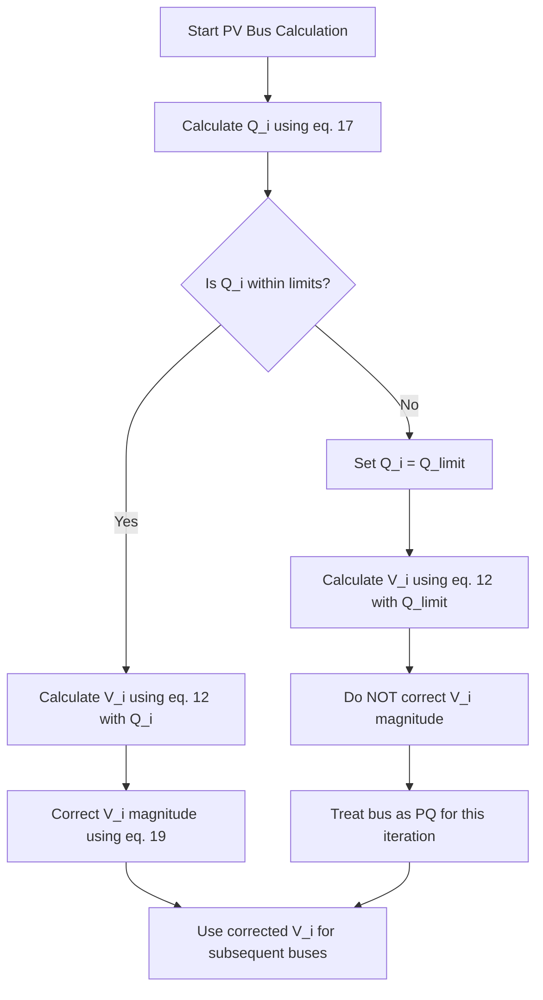

### Practical Engineering Context

- The Gauss-Seidel method is simple to implement and is often used for small to medium-sized systems or as a starting point for more advanced methods.
- Its linear convergence can be slow for large systems, but it is robust and rarely fails to converge if a solution exists.
- The treatment of PV buses is a critical practical detail. In real systems, generators have reactive power limits, and the load-flow must respect these limits.
- The convergence criteria must be chosen carefully to balance accuracy and computational effort.

### Exam Traps

- **Immediate Update:** In the Gauss-Seidel method, always use the most recently computed voltage values. This is the defining feature of the method.
- **PV Bus Q Calculation:** For a PV bus, you must calculate Q before you can calculate V. Do not use the scheduled Q (it's unknown!).
- **Voltage Correction:** After calculating V for a PV bus, you must correct its magnitude. Do not forget this step.
- **Convergence Criteria:** Both voltage and power mismatch criteria are valid. The power mismatch criterion is often preferred as it is more directly related to the physical quantities of interest.
- **Slack Bus Exclusion:** The slack bus is excluded from the iterative voltage updates and the convergence checks.
- **Q Limits:** Always check if the calculated Q at a PV bus is within its limits. If not, treat the bus as a PQ bus for that iteration.

### Lecture 29 Recap

- The Gauss-Seidel method iteratively solves for unknown bus voltages using the latest available values.
- The iterative equation is derived from the bus loading equation.
- PV buses require a special procedure: calculate Q, calculate V, then correct the voltage magnitude.
- Convergence is checked by monitoring the maximum voltage or power mismatch.

---

## Lecture 30: Line Flows, Losses, and the Gauss-Seidel Algorithm

This final lecture of the week ties everything together. We learn how to compute the power flows on individual lines and the total system losses after the load-flow has converged. We also formalize the complete Gauss-Seidel algorithm.

### Physical Intuition

Once we know the voltage at every bus, we can treat each transmission line as a separate two-port network. The power flowing into the line from one end and out of the line at the other end can be calculated using the bus voltages and the line's π-equivalent model. The difference between the power entering and leaving the line is the power loss in the line.

**Understanding Line Losses:**

When power flows through a transmission line, some of it is dissipated as heat in the line resistance. This is the real power loss, which is proportional to the square of the current and the line resistance ($I^2R$ loss). Additionally, the line's inductance and capacitance cause reactive power to be absorbed and generated along the line. The net reactive power loss depends on the line's susceptance and the voltage profile.

### Complete Theory and Derivations

#### 30.1 Computation of Line Flows

Consider a transmission line connected between bus $i$ and bus $k$. The line is represented by its π-equivalent model with series admittance $y_{ik}$ and shunt admittances $y_{ik}^0$ at each end.

The current flowing from bus $i$ to bus $k$ is the sum of the current through the series admittance and the current through the shunt admittance at bus $i$:

$$I_{ik} = I'_{ik} + I_{ik}^{0} \quad \dots (23)$$

Where:
$$I'_{ik} = (V_i - V_k)y_{ik} \quad \dots (24)$$
$$I_{ik}^{0} = V_i y_{ik}^{0} \quad \dots (25)$$

Therefore:
$$I_{ik} = (V_i - V_k)y_{ik} + V_i y_{ik}^{0} \quad \dots (26)$$

The complex power flowing from bus $i$ to bus $k$ is:
$$S_{ik} = P_{ik} + jQ_{ik} = V_i I_{ik}^* \quad \dots (28)$$

Substituting (26) into (28) and taking the conjugate:

$$P_{ik} - jQ_{ik} = V_i^* (V_i - V_k) y_{ik} + V_i^* V_i (y_{ik}^0)$$

$$P_{ik} - jQ_{ik} = |V_i|^2 y_{ik} + |V_i|^2 y_{ik}^0 - V_i^* V_k y_{ik} \quad \dots (29)$$

Using the relation $Y_{ik} = -y_{ik}$ (equation 31), we substitute $y_{ik} = -Y_{ik}$:

$$P_{ik} - jQ_{ik} = -|V_i|^2 Y_{ik} + |V_i|^2 y_{ik}^0 + V_i^* V_k Y_{ik} \quad \dots (32)$$

Now, substituting the polar forms $Y_{ik} = |Y_{ik}|\angle\theta_{ik}$, $V_i = |V_i|\angle\delta_i$, $V_k = |V_k|\angle\delta_k$, and $y_{ik}^0 = j|y_{ik}^0|$, and separating real and imaginary parts, we get the final expressions for the power flow from bus $i$ to bus $k$:

$$P_{ik} = -|V_i|^2 |Y_{ik}| \cos\theta_{ik} + |V_i||V_k||Y_{ik}| \cos(\theta_{ik} + \delta_k - \delta_i) \quad \dots (34)$$

$$Q_{ik} = |V_i|^2 |Y_{ii}| \sin\theta_{ii} - |V_i||V_k||Y_{ik}| \sin(\theta_{ik} + \delta_k - \delta_i) - |V_i|^2 |y_{ik}^0| \quad \dots (35)$$

Similarly, the power flow from bus $k$ to bus $i$ is:

$$P_{ki} = -|V_k|^2 |Y_{ki}| \cos\theta_{ki} + |V_k||V_i||Y_{ki}| \cos(\theta_{ki} + \delta_i - \delta_k) \quad \dots (36)$$

$$Q_{ki} = |V_k|^2 |Y_{kk}| \sin\theta_{kk} - |V_k||V_i||Y_{ki}| \sin(\theta_{ki} + \delta_i - \delta_k) - |V_k|^2 |y_{ki}^0| \quad \dots (37)$$

**Physical Interpretation of the Line Flow Equations:**

The power flow from bus $i$ to bus $k$ has two components:

1. **First term:** $-|V_i|^2 |Y_{ik}| \cos\theta_{ik}$ — This represents the power consumed by the line itself. It depends on the voltage at bus $i$ and the line admittance.

2. **Second term:** $|V_i||V_k||Y_{ik}| \cos(\theta_{ik} + \delta_k - \delta_i)$ — This represents the power transferred between the two buses. It depends on the product of the voltage magnitudes and the angle difference between the buses.

The angle difference $\delta_k - \delta_i$ determines the direction of power flow. If $\delta_k > \delta_i$, power flows from bus $k$ to bus $i$; if $\delta_k < \delta_i$, power flows from bus $i$ to bus $k$.

#### 30.2 Line Losses

The real power loss in the line is the sum of the power entering from both ends:
$$P_{loss_{ik}} = P_{ik} + P_{ki}$$

Substituting (34) and (36), and using the identities $|Y_{ik}| = |Y_{ki}|$ and $\theta_{ik} = \theta_{ki}$, we get:

$$P_{loss_{ik}} = \left[-|V_i|^2 - |V_k|^2 + 2|V_i||V_k| \cdot \cos(\delta_i - \delta_k)\right]|Y_{ik}|\cos\theta_{ik} \quad \dots (38)$$

Defining the conductance $G_{ik} = |Y_{ik}|\cos\theta_{ik}$, we get:

$$P_{loss_{ik}} = G_{ik} \left[-|V_i|^2 - |V_k|^2 + 2|V_i||V_k| \cdot \cos(\delta_i - \delta_k)\right] \quad \dots (39)$$

Similarly, the reactive power loss is:
$$Q_{loss_{ik}} = B_{ik} \left[|V_i|^2 + |V_k|^2 - 2|V_i||V_k| \cos(\delta_i - \delta_k)\right] - |V_i|^2 |y_{ik}^0| - |V_k|^2 |y_{ki}^0| \quad \dots (40)$$

Where $B_{ik} = |Y_{ik}|\sin\theta_{ik}$ is the susceptance.

**Derivation of the Real Power Loss Formula:**

Let's derive equation (38) step by step:

$$P_{loss_{ik}} = P_{ik} + P_{ki}$$

$$P_{loss_{ik}} = -|V_i|^2 |Y_{ik}| \cos\theta_{ik} + |V_i||V_k||Y_{ik}| \cos(\theta_{ik} + \delta_k - \delta_i) - |V_k|^2 |Y_{ki}| \cos\theta_{ki} + |V_k||V_i||Y_{ki}| \cos(\theta_{ki} + \delta_i - \delta_k)$$

Using $|Y_{ik}| = |Y_{ki}|$ and $\theta_{ik} = \theta_{ki}$:

$$P_{loss_{ik}} = -(|V_i|^2 + |V_k|^2)|Y_{ik}|\cos\theta_{ik} + |V_i||V_k||Y_{ik}|[\cos(\theta_{ik} + \delta_k - \delta_i) + \cos(\theta_{ik} + \delta_i - \delta_k)]$$

Using the trigonometric identity $\cos(A+B) + \cos(A-B) = 2\cos A \cos B$:

$$P_{loss_{ik}} = -(|V_i|^2 + |V_k|^2)|Y_{ik}|\cos\theta_{ik} + 2|V_i||V_k||Y_{ik}|\cos\theta_{ik}\cos(\delta_i - \delta_k)$$

$$P_{loss_{ik}} = |Y_{ik}|\cos\theta_{ik}[-|V_i|^2 - |V_k|^2 + 2|V_i||V_k|\cos(\delta_i - \delta_k)]$$

This is equation (38).

**Simplified Loss Expression:** If we assume the angle difference $\delta_i - \delta_k$ is very small, then $\cos(\delta_i - \delta_k) \approx 1$. The real power loss simplifies to:

$$P_{loss_{ik}} = G_{ik} \left[-|V_i|^2 - |V_k|^2 + 2|V_i||V_k|\right] = -G_{ik} \left[|V_i| - |V_k|\right]^2$$

**Important Caveat:** The professor explicitly notes that this simplification is **not valid** for real transmission systems, as angle differences are typically not negligible. It is only a mathematical exercise.

**Why the Simplified Loss Expression is Not Valid:**

In real transmission systems, the angle difference $\delta_i - \delta_k$ is typically 5-30 degrees, depending on the loading level. The cosine of these angles is significantly less than 1 (e.g., $\cos(20^\circ) = 0.94$). Using the simplified expression would underestimate the losses by up to 6% or more. Additionally, the simplified expression suggests that losses are zero when the voltage magnitudes are equal, which is not true in practice because the angle difference still causes power flow and associated losses.

#### 30.3 The Complete Gauss-Seidel Algorithm

The complete algorithm is as follows:

1.  **Prepare Data:** With the load profile known at each bus, allocate $P_{gi}$ and $Q_{gi}$ to all generating units. For PQ buses, both are known. For PV buses, $P_{gi}$ is known, but $Q_{gi}$ is unknown. No generation is allocated to the slack bus.
2.  **Form Y-bus:** Build the Y-bus matrix from the line parameters.
3.  **Initialize Voltages:** Set the initial voltage for all PQ buses to the slack bus voltage (e.g., $1 + j0$). For PV buses, set the voltage magnitude to its specified value.
4.  **Iterate:** For each bus $i = 2, 3, \dots, n$:
    - If bus $i$ is a PQ bus, calculate $V_i^{(p+1)}$ using equation (12).
    - If bus $i$ is a PV bus, calculate $Q_i^{(p+1)}$ using equation (17), check limits, calculate $V_i^{(p+1)}$ using equation (12), and correct its magnitude using equation (19).
5.  **Check Convergence:** Calculate $\Delta V_{max}$, $\Delta P_{max}$, and $\Delta Q_{max}$. If all are less than $\epsilon$, the solution has converged. Otherwise, go back to step 4.
6.  **Compute Slack Bus Power:** Use equations (15) and (16) with $i = 1$ to find $P_1$ and $Q_1$.
7.  **Compute Line Flows and Losses:** Use equations (34), (35), (39), and (40) to calculate the power flows and losses on all lines.

**Detailed Algorithm Steps with Explanations:**

**Step 1: Data Preparation**

The load profile at each bus is known from the system data. For each generator, the real power output is scheduled based on economic dispatch or operator instructions. For PV buses, the voltage magnitude is also specified. The slack bus has no scheduled generation; its output is determined by the solution.

**Step 2: Y-bus Formation**

The Y-bus matrix is formed from the line parameters and transformer data. This is a one-time computation that is used throughout the iterative process.

**Step 3: Voltage Initialization**

A flat start is used, where all PQ bus voltages are set to $1 + j0$ per unit. PV bus voltages are set to their specified magnitudes with an angle of 0 degrees.

**Step 4: Iteration**

For each bus (except the slack bus), the voltage is updated using the Gauss-Seidel equation. The order of the buses matters for convergence; typically, the buses are processed in numerical order.

**Step 5: Convergence Check**

The convergence criteria are checked after each complete iteration. If the maximum voltage or power mismatch is below the tolerance, the solution has converged.

**Step 6: Slack Bus Power**

The slack bus power is calculated using the converged voltages. This gives the real and reactive power that the slack bus must supply to balance the system.

**Step 7: Line Flows and Losses**

The line flows are calculated using the converged voltages and the line parameters. The losses are the sum of the power entering the line from both ends.

### Mermaid Diagram: Load Flow Analysis Workflow

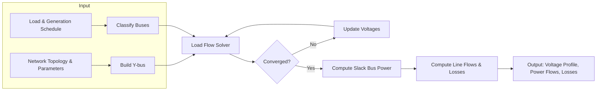

### Mermaid Diagram: Network Modelling

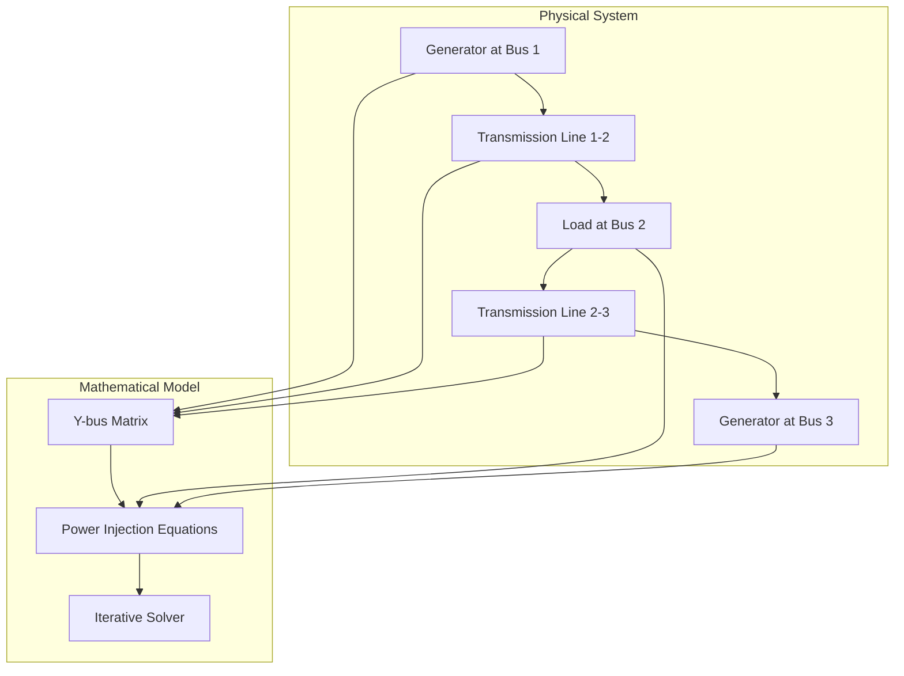

### Mermaid Diagram: Line Flow Calculation

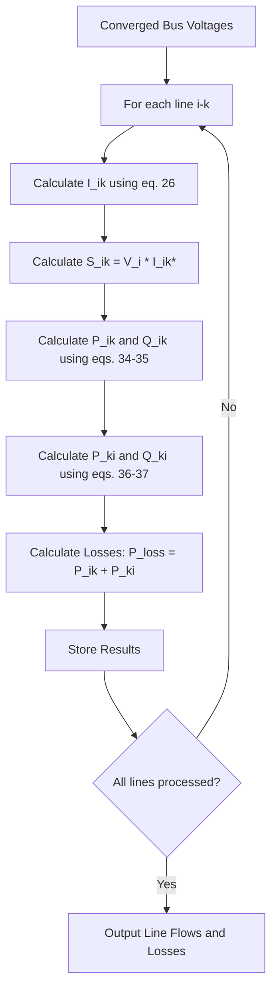

### Worked Example 4: Two-Bus Voltage Relationship

**Problem:** A short transmission line has impedance $z = r + jx$. The sending end voltage is $V_S\angle\delta_S$ and the receiving end voltage is $V_R\angle\delta_R$. The load at the receiving end is $P_R + jQ_R$. Line charging is neglected. Find the relationship between $V_R$, $V_S$, $r$, $x$, $P_R$, and $Q_R$.

**Solution:**

1.  **Current in the line:**
$$I = \frac{V_S\angle\delta_S - V_R\angle\delta_R}{r + jx}$$

2.  **Complex power at the receiving end:**
$$P_R - jQ_R = V_R^* I = V_R\angle-\delta_R \left( \frac{V_S\angle\delta_S - V_R\angle\delta_R}{r + jx} \right)$$

3.  **Expand and separate:**
$$(P_R - jQ_R)(r + jx) = V_R V_S \angle(\delta_S - \delta_R) - V_R^2$$

4.  **Separate real and imaginary parts:**
   - Real: $P_R r + Q_R x = V_R V_S \cos(\delta_S - \delta_R) - V_R^2$
   - Imaginary: $P_R x - Q_R r = V_R V_S \sin(\delta_S - \delta_R)$

5.  **Eliminate the angle difference:**
   Square both equations and add them:
$$(P_R r + Q_R x + V_R^2)^2 + (P_R x - Q_R r)^2 = (V_R V_S)^2$$

6.  **Expand and simplify:**
$$V_R^4 + V_R^2(2P_R r + 2Q_R x - V_S^2) + (P_R^2 + Q_R^2)(r^2 + x^2) = 0$$

This is the desired relationship. It is a quartic equation in $V_R$, which can be solved to find the receiving end voltage given the sending end voltage, line parameters, and load.

**Physical Interpretation:**

This equation shows that the receiving end voltage depends on the sending end voltage, the line impedance, and the load. For a given sending end voltage and line impedance, there may be two possible receiving end voltages for a given load: one high voltage solution and one low voltage solution. The high voltage solution is the normal operating point, while the low voltage solution is associated with voltage instability.

**Application to Voltage Stability:**

The two-bus voltage relationship is fundamental to understanding voltage stability. As the load increases, the two solutions move closer together. At the maximum power transfer point, the two solutions coincide, and the system becomes voltage unstable. Beyond this point, there is no solution, and the voltage collapses.

### Mermaid Diagram: Fault Analysis and Stability Relationships

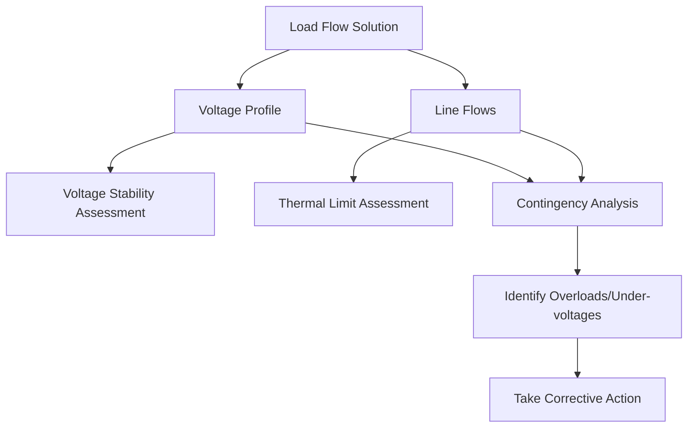

### Worked Example 5: Gauss-Seidel Iteration for a 3-Bus System

**Problem:** A 3-bus system has the following Y-bus matrix (per unit):

$$Y_{bus} = \begin{bmatrix} 6.255-j18.695 & -5+j15 & -1.25+j3.75 \\ -5+j15 & 6.667-j19.95 & -1.667+j5 \\ -1.25+j3.75 & -1.667+j5 & 2.917-j8.705 \end{bmatrix}$$

Bus 1 is the slack bus with $V_1 = 1.0\angle0^\circ$. Bus 2 is a PQ bus with $P_2 = -0.5$ pu and $Q_2 = -0.2$ pu (load). Bus 3 is a PV bus with $P_3 = 0.4$ pu and $|V_3| = 1.0$ pu. Perform one Gauss-Seidel iteration starting from a flat start.

**Solution:**

1.  **Initial values:**
    - $V_2^{(0)} = 1.0 + j0$
    - $V_3^{(0)} = 1.0 + j0$

2.  **Update bus 2 (PQ bus):**
    $$V_2^{(1)} = \frac{1}{Y_{22}}\left[\frac{P_2 - jQ_2}{(V_2^{(0)})^*} - Y_{21}V_1 - Y_{23}V_3^{(0)}\right]$$
    $$V_2^{(1)} = \frac{1}{6.667-j19.95}\left[\frac{-0.5 + j0.2}{1.0} - (-5+j15)(1.0) - (-1.667+j5)(1.0)\right]$$
    $$V_2^{(1)} = \frac{1}{6.667-j19.95}\left[-0.5 + j0.2 + 5 - j15 + 1.667 - j5\right]$$
    $$V_2^{(1)} = \frac{1}{6.667-j19.95}\left[6.167 - j19.8\right]$$
    $$V_2^{(1)} = \frac{6.167 - j19.8}{6.667 - j19.95} \approx 0.992\angle-0.5^\circ$$

    Let's verify this calculation:
    $$V_2^{(1)} = \frac{6.167 - j19.8}{6.667 - j19.95}$$
    
    Multiply numerator and denominator by the conjugate of the denominator:
    $$V_2^{(1)} = \frac{(6.167 - j19.8)(6.667 + j19.95)}{(6.667)^2 + (19.95)^2}$$
    
    Numerator: $(6.167)(6.667) + (6.167)(j19.95) + (-j19.8)(6.667) + (-j19.8)(j19.95)$
    $= 41.11 + j123.03 - j132.01 + 395.01$
    $= 436.12 - j8.98$
    
    Denominator: $44.45 + 398.00 = 442.45$
    
    $$V_2^{(1)} = \frac{436.12 - j8.98}{442.45} = 0.9857 - j0.0203$$
    
    $$|V_2^{(1)}| = \sqrt{0.9857^2 + 0.0203^2} = \sqrt{0.9716 + 0.0004} = \sqrt{0.9720} = 0.986$$
    
    $$\delta_2^{(1)} = \tan^{-1}\left(\frac{-0.0203}{0.9857}\right) = \tan^{-1}(-0.0206) = -1.18^\circ$$
    
    So $V_2^{(1)} \approx 0.986\angle-1.18^\circ$ per unit.

3.  **Update bus 3 (PV bus):**
    First, calculate $Q_3^{(1)}$ using equation (17):
    $$Q_3^{(1)} = -\sum_{k=1}^{3}|Y_{3k}||V_3^{(0)}||V_k^{(0)}|\sin(\theta_{3k} + \delta_k^{(0)} - \delta_3^{(0)})$$
    
    Since all initial angles are 0, this simplifies to:
    $$Q_3^{(1)} = -|Y_{31}||V_3||V_1|\sin(\theta_{31}) - |Y_{32}||V_3||V_2|\sin(\theta_{32}) - |Y_{33}||V_3|^2\sin(\theta_{33})$$
    
    From the Y-bus: $Y_{31} = -1.25 + j3.75 = 3.95\angle108.4^\circ$, $Y_{32} = -1.667 + j5 = 5.27\angle108.4^\circ$, $Y_{33} = 2.917 - j8.705 = 9.18\angle-71.5^\circ$
    
    $$Q_3^{(1)} = -[3.95\sin(108.4^\circ) + 5.27\sin(108.4^\circ) + 9.18\sin(-71.5^\circ)]$$
    $$Q_3^{(1)} = -[3.95(0.949) + 5.27(0.949) + 9.18(-0.948)]$$
    $$Q_3^{(1)} = -[3.75 + 5.00 - 8.70] = -[0.05] = -0.05 \text{ pu}$$
    
    The negative sign indicates that the generator at bus 3 is absorbing reactive power, which is unusual but possible if the generator is operating at a leading power factor.
    
    Now calculate $V_3^{(1)}$:
    $$V_3^{(1)} = \frac{1}{Y_{33}}\left[\frac{P_3 - jQ_3^{(1)}}{(V_3^{(0)})^*} - Y_{31}V_1 - Y_{32}V_2^{(1)}\right]$$
    $$V_3^{(1)} = \frac{1}{2.917-j8.705}\left[\frac{0.4 + j0.05}{1.0} - (-1.25+j3.75)(1.0) - (-1.667+j5)(0.986\angle-1.18^\circ)\right]$$
    
    Let's compute the terms:
    - $\frac{P_3 - jQ_3}{(V_3^{(0)})^*} = 0.4 + j0.05$
    - $-Y_{31}V_1 = -(-1.25+j3.75)(1.0) = 1.25 - j3.75$
    - $-Y_{32}V_2^{(1)} = -(-1.667+j5)(0.986\angle-1.18^\circ)$
    
    First, convert $V_2^{(1)}$ to rectangular form:
    $V_2^{(1)} = 0.986\cos(-1.18^\circ) + j0.986\sin(-1.18^\circ) = 0.9858 - j0.0203$
    
    $-Y_{32}V_2^{(1)} = (1.667 - j5)(0.9858 - j0.0203)$
    $= 1.667(0.9858) - 1.667(j0.0203) - j5(0.9858) + j5(j0.0203)$
    $= 1.643 - j0.0338 - j4.929 - 0.1015$
    $= 1.5415 - j4.9628$
    
    Sum of terms: $(0.4 + j0.05) + (1.25 - j3.75) + (1.5415 - j4.9628) = 3.1915 - j8.6628$
    
    $$V_3^{(1)} = \frac{3.1915 - j8.6628}{2.917 - j8.705}$$
    
    Multiply numerator and denominator by the conjugate of the denominator:
    $$V_3^{(1)} = \frac{(3.1915 - j8.6628)(2.917 + j8.705)}{(2.917)^2 + (8.705)^2}$$
    
    Numerator: $(3.1915)(2.917) + (3.1915)(j8.705) + (-j8.6628)(2.917) + (-j8.6628)(j8.705)$
    $= 9.309 + j27.78 - j25.27 + 75.41$
    $= 84.72 + j2.51$
    
    Denominator: $8.509 + 75.78 = 84.29$
    
    $$V_3^{(1)} = \frac{84.72 + j2.51}{84.29} = 1.0051 + j0.0298$$
    
    Now correct the voltage magnitude to 1.0 pu:
    - Imaginary part: $f_3^{(1)} = 0.0298$
    - Corrected real part: $e_3^{(1)} = \sqrt{1.0^2 - 0.0298^2} = \sqrt{1 - 0.000888} = \sqrt{0.999112} = 0.9996$
    
    $$V_3^{(1)} = 0.9996 + j0.0298 = 1.0\angle1.71^\circ \text{ pu}$$
    
    This completes one Gauss-Seidel iteration.

**Summary of Results After One Iteration:**

| Bus | Type | V (per unit) | δ (degrees) |
| :--- | :--- | :--- | :--- |
| 1 | Slack | 1.0 | 0 |
| 2 | PQ | 0.986 | -1.18 |
| 3 | PV | 1.0 | 1.71 |

The solution is not yet converged, and further iterations would be needed to achieve the desired tolerance.

### Practical Engineering Context

- The line flow equations are used by system operators to monitor the loading on each transmission line and ensure they are within thermal limits.
- The loss formulas are used to calculate the total system losses, which are an important economic factor.
- The Gauss-Seidel algorithm, while simple, forms the basis for understanding more advanced load-flow methods.
- The two-bus voltage relationship is fundamental to understanding voltage stability and the maximum power transfer capability of transmission lines.

### Exam Traps

- **Sign of P_ki:** When power flows from $i$ to $k$, $P_{ik}$ is positive, but $P_{ki}$ will be negative. The sum $P_{ik} + P_{ki}$ gives the loss.
- **Charging Admittance in Q Loss:** The reactive power loss formula includes the charging admittance terms. Do not forget them.
- **Slack Bus Power:** The slack bus power is calculated after convergence, not specified beforehand.
- **Algorithm Order:** Follow the algorithm steps in order. Do not compute line flows before the solution has converged.
- **Small Angle Approximation:** Do not use the simplified loss expression for real systems, as the angle differences are typically not negligible.

### Lecture 30 Recap

- Line flows are calculated using the bus voltages and the line's π-equivalent model.
- The real power loss in a line is proportional to the conductance $G_{ik}$ and the voltage magnitude difference.
- The reactive power loss includes the effect of line charging.
- The complete Gauss-Seidel algorithm involves data preparation, Y-bus formation, voltage initialization, iteration, convergence checking, and post-processing (slack bus power and line flows).

---

## Verified Source Visual Atlas

The descriptions below are based on direct inspection of the selected source crops and the local `images.json` manifest. Small handwritten labels or numerical values that are not fully legible at this resolution are intentionally left untranscribed; use the surrounding derivation for exact values.

### Lecture 26 — Lossless-line propagation constants and surge impedance (physical PDF page 361)

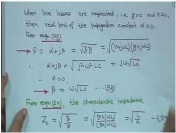

The board derives the lossless-line propagation constant $\beta$ from $LC$ and writes the characteristic/surge impedance in terms of the line parameters. Read the chain from the lossless assumption through $\beta$ and $Z_c$; the lower handwritten continuation is partly cropped and should not be reconstructed from guesswork.

### Lecture 27 — Slack-bus definition in load flow (physical PDF page 388)

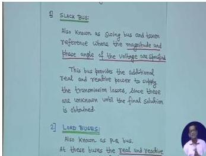

The visual defines the slack/reference bus as the bus whose voltage magnitude and phase angle are specified, with real and reactive power determined after the solution. The next bus category begins at the bottom edge, so only the slack-bus content should be taken from this crop.

### Lecture 27 — KCL equations for the bus-admittance formulation (physical PDF page 395)

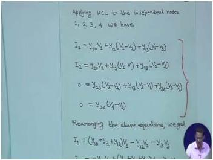

The board applies KCL at independent buses and expands the current equations into self-admittance and mutual-admittance terms. Follow the progression from branch currents to the compact $YV$ form; some lower lines continue beyond the crop.

### Lecture 28 — Three-bus admittance diagram with reference node (physical PDF page 403)

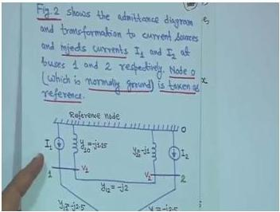

The source drawing shows buses connected to a reference node through admittances and labels the branch terms used to build the bus equations. Read each branch admittance from the network first, then place it on the appropriate diagonal or off-diagonal entry.

### Lecture 28 — Y-bus construction from a network diagram (physical PDF page 407)

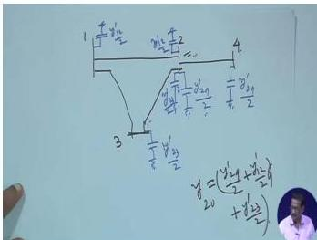

The visual combines a small network sketch with a worked diagonal Y-bus expression. It illustrates the rule that incident admittances contribute to a diagonal entry while a mutual term carries the opposite sign; the small branch labels are not all legible, so the exact matrix values must come from the surrounding text.

### Lecture 29 — Four-bus system for Gauss–Seidel iteration (physical PDF page 420)

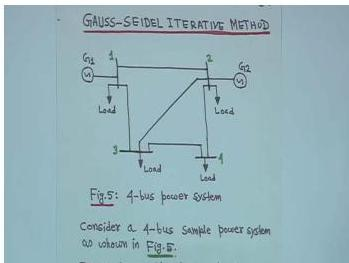

The hand-drawn network has generators at upper buses, loads at lower buses, and connecting branches forming the four-bus test system. Use the bus numbers and generator/load placement to map the network into the Y-bus before beginning an iterative voltage calculation.

### Lecture 30 — Transmission-line flow and loss model (physical PDF page 459)

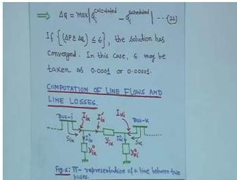

The visual shows a π-equivalent branch between two buses, with series and shunt terms and directional sending/receiving powers. Start with the current direction and bus-voltage convention, then compute the two terminal flows consistently; small subscripts should be checked against the nearby equations.

### Lecture 30 — Gauss–Seidel algorithm steps (physical PDF page 473)

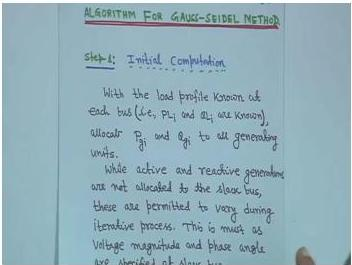

The board lists the iterative sequence beginning with initial voltage guesses, calculating bus powers, and updating unknown bus voltages until convergence. Read it as an ordered procedure; the lower continuation is outside the crop, so the complete stopping rule remains in the note’s theory section.

## Common Mistakes and Engineering Checks

Based on the lectures and common pitfalls, here are the key mistakes to avoid and checks to perform.

| Mistake | Engineering Check |
| :--- | :--- |
| **Forgetting the conjugate** in $S = VI^*$. | Always write $S = VI^*$ and $I = (P - jQ)/V^*$. |
| **Using Z-bus instead of Y-bus** for load flow. | Y-bus is sparse; Z-bus is full. Load flow uses Y-bus. |
| **Not updating voltages immediately** in Gauss-Seidel. | Use the most recent voltage values ($V^{(p+1)}$) as soon as they are computed. |
| **Forgetting charging admittance** in Y-bus diagonals. | Sum all shunt admittances at each bus, including line charging. |
| **Not verifying Y-bus** by row sums. | The sum of each row of Y-bus should equal the total shunt admittance at that bus. |
| **Using phase voltage instead of line-to-line** in 3-phase power equations. | Be consistent. $S_{3\phi} = 3V_{phase}I^* = V_{LL}I^*\sqrt{3}$. |
| **Forgetting SIL uses rated voltage** and phase voltage conversion. | $SIL = (kV_{LL,rated})^2 / Z_C$. |
| **Not considering Q limits** for PV buses. | Always check if calculated Q is within $[Q_{min}, Q_{max}]$. If not, treat as PQ bus. |
| **Using wrong sign for off-diagonal Y-bus elements.** | $Y_{ik} = -y_{ik}$. |
| **Forgetting load flow equations are nonlinear.** | They require iterative solution, not direct matrix inversion. |
| **Convergence requires BOTH ΔP and ΔQ** to be below tolerance. | Check both criteria simultaneously. |
| **Small angle approximation is not valid** for real systems. | Do not use $\cos(\delta_i - \delta_k) \approx 1$ for actual loss calculations. |
| **Not checking Q limits after convergence.** | Even if the solution converged, a PV bus may be operating outside its Q limits. Re-run with the bus as PQ if necessary. |
| **Using wrong base values** in per-unit calculations. | Ensure all quantities are converted to the same base before building the Y-bus. |

---

## Quick Revision Sheet

### Key Equations

| Equation | Description |
| :--- | :--- |
| $v = 1/\sqrt{LC}$ | Velocity of propagation |
| $\lambda = 1/(f\sqrt{LC})$ | Wavelength |
| $V_R^{NL} = V_s/\cos(\beta l)$ | Ferranti effect (no-load voltage) |
| $SIL = (kV_{L,rated})^2/Z_C$ MW | Surge Impedance Loading |
| $I_{bus} = Y_{bus}V_{bus}$ | Nodal equation |
| $Y_{ii} = \sum_{k=0}^{n} y_{ik}$ | Y-bus diagonal element |
| $Y_{ik} = -y_{ik}$ | Y-bus off-diagonal element |
| $I_i = (P_i - jQ_i)/V_i^*$ | Current injection in terms of power |
| $V_i = \frac{1}{Y_{ii}}\left[\frac{P_i - jQ_i}{V_i^*} - \sum_{k \neq i} Y_{ik}V_k\right]$ | Gauss-Seidel update equation |
| $P_i = \sum_{k=1}^{n}|Y_{ik}\|\|V_i\|\|V_k|\cos(\theta_{ik} + \delta_k - \delta_i)$ | Real power injection |
| $Q_i = -\sum_{k=1}^{n}|Y_{ik}\|\|V_i\|\|V_k|\sin(\theta_{ik} + \delta_k - \delta_i)$ | Reactive power injection |
| $P_{loss_{ik}} = G_{ik}[-|V_i|^2 - |V_k|^2 + 2|V_i\|\|V_k|\cos(\delta_i - \delta_k)]$ | Real power loss in line i-k |
| $Q_{loss_{ik}} = B_{ik}[\|V_i\|^2 + \|V_k\|^2 - 2\|V_i\|\|V_k\|\cos(\delta_i - \delta_k)] - \|V_i\|^2\|y_{ik}^0\| - \|V_k\|^2\|y_{ki}^0\|$ | Reactive power loss in line i-k |

### Bus Types

| Bus Type | Specified | Unknown |
| :--- | :--- | :--- |
| Slack | V, δ | P, Q |
| Load (PQ) | P, Q | V, δ |
| Voltage Controlled (PV) | P, V | Q, δ |

### Gauss-Seidel Algorithm Steps

1.  Prepare data (allocate P, Q to generators).
2.  Form Y-bus.
3.  Initialize voltages (flat start).
4.  Iterate: update each bus voltage (special handling for PV buses).
5.  Check convergence (ΔV, ΔP, ΔQ ≤ ε).
6.  Compute slack bus power.
7.  Compute line flows and losses.

### Key Concepts

- **Ferranti Effect:** Voltage rise at no load due to charging current.
- **SIL:** Loading at which line reactive power generation equals consumption.
- **Y-bus:** Sparse, symmetric matrix representing network admittances.
- **Gauss-Seidel:** Iterative method with linear convergence, uses latest voltage values.
- **PV Bus:** Voltage magnitude is fixed; Q is calculated and checked against limits.

---

## Practice Quiz

Here are 18 questions to test your understanding of this week's material.

### Questions 1-6: Single-Answer Multiple Choice

**Question 1:** For a lossless transmission line, the velocity of propagation is:
Options: (a) $\sqrt{LC}$ (b) $1/\sqrt{LC}$ (c) $1/(LC)$ (d) $LC$

> Answer and explanation
> The correct answer is (b). The velocity of propagation for a lossless line is given by $v = 1/\sqrt{LC}$, where L is the inductance per unit length and C is the capacitance per unit length. This is derived from the wave equation and is approximately equal to the speed of light for overhead lines. The derivation starts from $v = \omega/\beta$, and substituting $\beta = \omega\sqrt{LC}$ gives $v = 1/\sqrt{LC}$. For a typical overhead line, $LC \approx \mu_0\varepsilon_0$, so $v \approx 3 \times 10^8$ m/s.

**Question 2:** The Ferranti effect refers to:
Options: (a) The voltage drop at the receiving end under full load. (b) The rise in receiving end voltage at no load. (c) The power loss in a transmission line. (d) The reactive power generated by a shunt reactor.

> Answer and explanation
> The correct answer is (b). The Ferranti effect is the phenomenon where the receiving end voltage of a transmission line is higher than the sending end voltage when the line is lightly loaded or open-circuited. This is due to the capacitive charging current flowing through the line inductance, which causes a voltage rise. Mathematically, for a lossless line at no load, $V_R^{NL} = V_s/\cos(\beta l)$, and since $\cos(\beta l) < 1$ for lines shorter than a quarter wavelength, $V_R^{NL} > V_s$.

**Question 3:** In a load-flow study, which quantities are specified for a PV (voltage-controlled) bus?
Options: (a) P and Q (b) V and δ (c) P and V (d) Q and δ

> Answer and explanation
> The correct answer is (c). For a PV bus, the real power injection (P) and the voltage magnitude (V) are specified. The reactive power (Q) and the voltage angle (δ) are the unknowns to be solved for. This bus type typically represents a generator with an automatic voltage regulator (AVR) that maintains the terminal voltage at a specified value while the real power output is set by the dispatch schedule.

**Question 4:** The off-diagonal element $Y_{ik}$ of the bus admittance matrix is equal to:
Options: (a) $y_{ik}$ (b) $-y_{ik}$ (c) $1/y_{ik}$ (d) $y_{ik} + y_{i0}$

> Answer and explanation
> The correct answer is (b). The off-diagonal element $Y_{ik}$ is the negative of the line admittance $y_{ik}$ connecting bus i and bus k. This is a fundamental rule for constructing the Y-bus matrix, derived from applying KCL at each bus. The diagonal elements are the sum of all admittances connected to the bus, while the off-diagonal elements are the negative of the line admittances.

**Question 5:** What is the primary reason the Y-bus matrix is preferred over the Z-bus matrix for load-flow studies?
Options: (a) The Y-bus is a full matrix. (b) The Y-bus is easier to invert. (c) The Y-bus is sparse for large systems. (d) The Y-bus is always symmetric.

> Answer and explanation
> The correct answer is (c). The Y-bus matrix is sparse, meaning it has a large number of zero elements, especially for large power systems where each bus is only connected to a few others. Sparse matrix techniques allow for efficient storage and computation. The Z-bus, being its inverse, is a full matrix, which is computationally prohibitive for large systems. For a system with n buses, the Y-bus has O(n) non-zero elements, while the Z-bus has O(n²) non-zero elements.

**Question 6:** In the Gauss-Seidel method, the convergence criterion based on power mismatch requires:
Options: (a) Only ΔP to be less than ε. (b) Only ΔQ to be less than ε. (c) Both ΔP and ΔQ to be less than ε. (d) The sum of ΔP and ΔQ to be less than ε.

> Answer and explanation
> The correct answer is (c). The solution is considered converged only when both the maximum real power mismatch (ΔP) and the maximum reactive power mismatch (ΔQ) are simultaneously less than or equal to the specified tolerance ε. This ensures that the calculated power injections match the scheduled values at all buses. The professor emphasizes: "both ΔP and ΔQ both together should be less than epsilon."

### Questions 7-9: Multiple Select Questions (MSQ)

**Question 7:** Which of the following are valid bus types in a standard load-flow formulation?
Options: (a) Slack Bus (b) PQ Bus (c) PV Bus (d) PQV Bus

> Answer and explanation
> The correct answers are (a), (b), and (c). The three standard bus types are the Slack (or swing) bus, where V and δ are specified; the PQ (or load) bus, where P and Q are specified; and the PV (or voltage-controlled) bus, where P and V are specified. There is no standard "PQV" bus type in the classical formulation. However, with the integration of renewable energy sources and microgrids, new bus types are being introduced, as noted in the lecture.

**Question 8:** Which of the following statements are true regarding Surge Impedance Loading (SIL)?
Options: (a) SIL is the power delivered when the line is terminated in its characteristic impedance. (b) Under SIL, the voltage profile along the line is flat. (c) A line loaded above SIL consumes reactive power. (d) SIL is inversely proportional to the square of the rated voltage.

> Answer and explanation
> The correct answers are (a), (b), and (c). SIL is defined as the power delivered when the load equals the characteristic impedance $Z_C$. Under this condition, the voltage and current magnitudes are constant along the line, as shown by $V(x) = V_R\angle\beta x$ and $I(x) = I_R\angle\beta x$. If a line is loaded above SIL, the inductive reactive power consumption exceeds the capacitive generation, so the line consumes net reactive power. SIL is proportional to the square of the rated voltage ($SIL = (kV_{L,rated})^2/Z_C$), not inversely proportional.

**Question 9:** For a PV bus in the Gauss-Seidel method, which of the following steps are performed?
Options: (a) Calculate the reactive power Q using the current voltage values. (b) Calculate the new voltage V using the calculated Q. (c) Correct the voltage magnitude to its specified value. (d) Set the reactive power Q to its maximum limit.

> Answer and explanation
> The correct answers are (a), (b), and (c). For a PV bus, since Q is unknown, it is first calculated using the power injection equation (17). Then, this Q is used in the Gauss-Seidel update equation (12) to find the new voltage. Finally, the magnitude of this new voltage is corrected to match the specified value using equation (19). Setting Q to its limit is only done if the calculated Q exceeds its limits, which is a conditional step, not a standard one.

### Questions 10-13: Short Answer / Concept

**Question 10:** Explain the physical reason for the Ferranti effect.

> Answer and explanation
> The Ferranti effect occurs when a transmission line is lightly loaded or open-circuited. Under this condition, the line current is primarily the capacitive charging current, which leads the voltage by approximately 90 degrees. This leading current flowing through the inductive reactance of the line causes a voltage rise along the line, making the receiving end voltage higher than the sending end voltage. Mathematically, for a lossless line at no load, $V_R^{NL} = V_s/\cos(\beta l)$, and since $\cos(\beta l) < 1$, $V_R^{NL} > V_s$. The effect is more pronounced for longer lines and higher voltages. In practice, shunt reactors are used to compensate for this voltage rise at light load conditions.

**Question 11:** What is the significance of the slack bus in a load-flow study?

> Answer and explanation
> The slack bus serves as the reference bus for the system. Its voltage magnitude and phase angle are specified (typically 1.0∠0°). It acts as the "swing" bus that absorbs the real and reactive power mismatch in the system, which includes the total transmission losses. Since these losses are unknown until the load-flow is solved, the slack bus power cannot be specified in advance and is calculated after the solution converges. The slack bus also provides the reference angle for all other bus voltages. Without the slack bus, the power balance equations would not have a unique solution because the system losses are not known a priori.

**Question 12:** Why are the load-flow equations considered nonlinear?

> Answer and explanation
> The load-flow equations are nonlinear because the power injection at a bus is a product of the bus voltage and the conjugate of the injected current. The injected current is a linear function of all bus voltages (via the Y-bus), but when we multiply by the voltage to get power, we get terms like $|V_i||V_k|\cos(\theta_{ik} + \delta_k - \delta_i)$. This product of voltage magnitudes and the cosine of angle differences makes the equations nonlinear. Specifically, the power injection equation $P_i = \sum_k |Y_{ik}||V_i||V_k|\cos(\theta_{ik} + \delta_k - \delta_i)$ involves products of the unknown voltage magnitudes and trigonometric functions of the unknown voltage angles. This nonlinearity requires iterative solution techniques such as Gauss-Seidel or Newton-Raphson.

**Question 13:** What is the purpose of the convergence criterion in an iterative load-flow solution?

> Answer and explanation
> The convergence criterion is used to determine when the iterative solution has reached a sufficiently accurate answer. It checks if the change in the solution between iterations is small enough. This is done by monitoring either the maximum change in voltage magnitude (ΔV) or the maximum difference between calculated and scheduled power injections (ΔP and ΔQ). When these mismatches fall below a specified tolerance (ε), the solution is considered converged, and the iteration process stops. The tolerance is typically $10^{-4}$ or $10^{-5}$ per unit. Both ΔP and ΔQ must be below the tolerance simultaneously for the solution to be considered converged.

### Questions 14-16: Numerical / Analytical

**Question 14:** A 3-phase, 50 Hz, 400 kV transmission line has L = 1.0 mH/km and C = 0.01 μF/km. Calculate the surge impedance $Z_C$ and the Surge Impedance Loading (SIL) in MW.

> Answer and explanation
> 1.  **Calculate Surge Impedance:**
>     $$Z_C = \sqrt{\frac{L}{C}} = \sqrt{\frac{1.0 \times 10^{-3}}{0.01 \times 10^{-6}}} = \sqrt{100000} = 316.23 \text{ } \Omega$$
> 2.  **Calculate SIL:**
>     $$SIL = \frac{(kV_{L,rated})^2}{Z_C} = \frac{(400)^2}{316.23} = \frac{160000}{316.23} = 505.96 \text{ MW}$$
>     The surge impedance is approximately 316.23 Ω, and the SIL is approximately 506 MW. This means that when the line is loaded at 506 MW, the voltage and current profiles are flat along the line, and the line neither generates nor consumes net reactive power.

**Question 15:** For a 3-bus system, the Y-bus matrix is given. The off-diagonal element $Y_{12} = -5 + j15$ per unit. What is the admittance $y_{12}$ of the line connecting bus 1 and bus 2?

> Answer and explanation
> The relationship between the Y-bus off-diagonal element and the line admittance is $Y_{ik} = -y_{ik}$. Therefore, the line admittance is the negative of the Y-bus element:
> $$y_{12} = -Y_{12} = -(-5 + j15) = 5 - j15 \text{ per unit}$$
> The line admittance is $5 - j15$ per unit. This corresponds to a line impedance of:
> $$z_{12} = \frac{1}{y_{12}} = \frac{1}{5 - j15} = \frac{5 + j15}{25 + 225} = \frac{5 + j15}{250} = 0.02 + j0.06 \text{ per unit}$$
> This matches the line impedance given in the worked example.

**Question 16:** In a Gauss-Seidel iteration, the voltage at bus 2 is calculated as $V_2^{(p+1)} = 0.98 + j0.05$ per unit. However, bus 2 is a PV bus with a specified voltage magnitude of $|V_2| = 1.0$ per unit. What is the corrected value of $V_2^{(p+1)}$?

> Answer and explanation
> For a PV bus, we keep the imaginary part of the calculated voltage and adjust the real part to satisfy the magnitude constraint.
> 1.  **Identify imaginary part:** $f_2^{(p+1)} = 0.05$.
> 2.  **Calculate corrected real part:**
>     $$e_2^{(p+1)} = \sqrt{|V_2|^2 - (f_2^{(p+1)})^2} = \sqrt{1.0^2 - 0.05^2} = \sqrt{1 - 0.0025} = \sqrt{0.9975} = 0.99875$$
> 3.  **Form corrected voltage:**
>     $$V_2^{(p+1)} = 0.99875 + j0.05 \text{ per unit}$$
>     The corrected voltage is approximately $0.99875 + j0.05$ per unit. The magnitude is now exactly 1.0 per unit, and the angle is $\tan^{-1}(0.05/0.99875) = 2.87^\circ$.

### Questions 17-18: Scenario / Troubleshooting

**Question 17:** A load-flow study using the Gauss-Seidel method is not converging. The maximum voltage mismatch is oscillating between 0.01 and 0.02 per unit. What is the most likely cause and a potential remedy?

> Answer and explanation
> The most likely cause of oscillation is that the system is heavily loaded, or a PV bus is hitting its reactive power limit. When a PV bus hits its Q limit, it must be converted to a PQ bus for that iteration. If this is not handled correctly, the solution can oscillate.
> **Remedy:** Check the reactive power output of all PV buses. If any are at their limits, fix Q at the limit and treat the bus as a PQ bus. Additionally, consider using a smaller acceleration factor or switching to the Newton-Raphson method, which has better convergence characteristics for heavily loaded systems.
> Another possible cause is that the system is operating near its maximum power transfer limit, where the Jacobian matrix becomes singular. In this case, the load-flow solution may not exist, and the system is voltage unstable.

**Question 18:** After a load-flow solution has converged, you calculate the power flow from bus 1 to bus 2 as $P_{12} = 100$ MW, and the power flow from bus 2 to bus 1 as $P_{21} = -98$ MW. What is the real power loss in the line, and what does the sign of $P_{21}$ indicate?

> Answer and explanation
> The real power loss in the line is the sum of the power entering from both ends:
> $$P_{loss} = P_{12} + P_{21} = 100 + (-98) = 2 \text{ MW}$$
> The sign of $P_{21}$ being negative indicates that the power is actually flowing *from* bus 1 *to* bus 2, even though we are calculating the flow "from bus 2 to bus 1". The negative sign simply reflects the direction of flow relative to the defined positive direction. The 2 MW difference is the power dissipated as heat in the line resistance ($I^2R$ loss). This is consistent with the professor's example: "P_ik is equal to 100 megawatt you are measuring here and this side when you take P_ki that is your minus 99 megawatt because direction is changed... So, minus 99; that means, power loss of the line P_loss = P_ik + P_ki = 100 − 99 = 1 MW."

---

## Source Exercise Coverage

This section records the exercises and questions posed in the source lectures and their coverage in these notes.

| Source Exercise/Question | Lecture | Coverage in Notes |
| :--- | :--- | :--- |
| "Suppose a transmission line is not carrying any power under no load condition... what will happen to that person?" | 26 | This is an open-ended safety question about the Ferranti effect. The answer is that the person would receive a severe electric shock, as the line is at a high voltage even at no load. The Ferranti effect is covered in Section 26.3. |
| "Find out for the sending end side" (derive P_S and Q_S) | 27 | The final expressions are given in Section 27.1 (equations 82-83). The full derivation is left as an exercise for the reader, as in the lecture. |
| "Why do we use Y matrix but not Z matrix for load flow studies?" | 27 | Answered in Section 27.4. The Y-bus is sparse, while the Z-bus is full, making the Y-bus computationally efficient. |
| Worked Example: 400 kV line, compute β, Z_C, v, λ | 26 | Fully worked out in Section 26.9 (Worked Example 1). |
| Worked Example: Find Y_bus for 3-bus system with charging admittance | 28 | Fully worked out in Section 28.1 (Worked Example 3). |
| Exercise: Two-bus voltage relationship | 30 | Fully worked out in Section 30.4 (Worked Example 4). |
| Exercise: Gauss-Seidel iteration for 3-bus system | 30 | Fully worked out in Section 30.6 (Worked Example 5). |

No separate assignment screenshots were supplied for this week. All source material from the evidence digests has been incorporated.

---

## Source Provenance

- **Course:** NPTEL Power System Analysis
- **Instructor:** Prof. Debapriya Das, Department of Electrical Engineering, IIT Kharagpur
- **Extraction:** Mistral OCR 4 extraction
- **Drafting:** DeepSeek V4 Flash drafting
- **Review:** Locally reviewed and generated on 2026-08-05

*Note: The models used for extraction and drafting are tools, not authoritative sources. All technical content is based on the lecture material and standard power system analysis principles.*
