# Week 7 - Advanced Load-Flow Methods

## Orientation

Welcome to Week 7 of our Power System Analysis journey. This week, we dive deep into the numerical heart of power system operation: **load-flow (or power-flow) analysis**. If Week 6 introduced us to the fundamental equations and the bus admittance matrix, this week we learn how to actually *solve* the nonlinear power-flow problem using iterative methods.

We will explore two classical families of solution techniques:

1.  **Gauss-Seidel (GS) Method**: An iterative approach based on updating voltages sequentially using the bus admittance matrix. It is conceptually simple, easy to program, but converges linearly (which can be slow for large systems).
2.  **Newton-Raphson (NR) Method**: A more powerful approach based on Taylor series expansion and the Jacobian matrix. It converges quadratically (very fast) and is the industry standard for large-scale systems.

We will work through the complete theory, derive the key equations, and then apply these methods to detailed, multi-step worked examples. We will see how to handle different types of buses (slack, PQ, and PV) and understand the physical meaning behind the mathematics. We will also touch upon the decoupled and fast-decoupled formulations, which are practical simplifications of the Newton-Raphson method.

By the end of this week, you should not only be able to perform load-flow calculations by hand for small systems but also understand the algorithms that power professional software packages.

### Learning Outcomes

After completing this week's lectures and study material, you will be able to:

1.  **Formulate** the load-flow problem for a multi-bus power system, identifying the known and unknown variables for slack, PQ (load), and PV (generator) buses.
2.  **Apply** the Gauss-Seidel iterative method to solve for unknown bus voltages, correctly handling PQ and PV buses, including the reactive power calculation and voltage magnitude correction for PV buses.
3.  **Calculate** slack bus power, line flows, and line losses from a converged (or partially converged) load-flow solution.
4.  **Derive** the Newton-Raphson load-flow formulation from the Taylor series expansion of nonlinear equations.
5.  **Construct** the Jacobian matrix, computing all four sub-matrices ($J_1$, $J_2$, $J_3$, $J_4$) and their individual elements (diagonal and off-diagonal).
6.  **Explain** the physical basis for the decoupling approximation ($\Delta P - \delta$ and $\Delta Q - V$) and its application in the decoupled and fast-decoupled load-flow methods.
7.  **Execute** the Newton-Raphson algorithm step-by-step, including the calculation of power residuals, solving for voltage corrections, and checking for convergence.
8.  **Analyze** the impact of PV buses on the structure and size of the Jacobian matrix.
9.  **Compare** the convergence characteristics, computational burden, and practical applications of the Gauss-Seidel and Newton-Raphson methods.

### Syllabus Map: Week 7 - Advanced Load-Flow Methods

This week consists of five lectures, each building upon the last. Here is the roadmap for our week:

| Lecture | Topic | Source Pages (Physical PDF) | Key Concepts |
| :--- | :--- | :--- | :--- |
| **31** | Load Flow Studies (Contd.): Gauss-Seidel Method - Worked Example (PQ Buses) | 484-507 | Three-bus system example, Y-bus formation, GS iterative equations, slack bus power, line flows. |
| **32** | Load Flow Studies (Contd.): Line Losses and PV Bus Example | 508-535 | Line loss calculation, reactive power flows, GS method with a PV bus, Q computation, voltage magnitude correction. |
| **33** | Load Flow Studies (Contd.): Newton-Raphson Method - Theory | 536-559 | Taylor series expansion, Jacobian matrix definition, power flow equations, decoupling principle. |
| **34** | Load Flow Studies (Contd.): Jacobian Elements | 560-577 | Derivation of $J_1$ and $J_4$ elements (diagonal and off-diagonal), power residuals, convergence criteria, NR algorithm. |
| **35** | Load Flow Studies (Contd.): Newton-Raphson Method - Worked Examples | 578-598 | NR worked example (all PQ buses), NR worked example with a PV bus, dummy parameters at slack bus. |

---

## Lecture 31: Gauss-Seidel Method - Worked Example (PQ Buses)

### 31.1 Physical Intuition

The Gauss-Seidel method is like a "guess-and-check" process that uses the most recent information available. Imagine you are trying to find the temperature distribution across a metal plate. You start with an initial guess for the temperature at every point. Then, you update the temperature at each point based on the current temperatures of its neighbors. You keep sweeping across the plate, updating each point, until the temperatures stop changing. This is the essence of the Gauss-Seidel method.

In a power system, the "temperature" is the complex voltage at each bus. The "neighbors" are the buses connected to it through transmission lines. The "update rule" comes from the power flow equations. We start with an initial guess for all bus voltages (often a "flat start" where all voltages are $1.0 \angle 0^\circ$). Then, we visit each bus one by one, calculating a new voltage based on the scheduled power injection at that bus and the current voltages of its neighbors. Crucially, as soon as we calculate a new voltage for a bus, we use it immediately for all subsequent calculations in the same iteration. This "immediate update" is what distinguishes the Gauss-Seidel method from the older Jacobi method.

The physical significance of this approach is profound. In a real power system, the voltage at any bus depends on the power injections and the network topology. The Gauss-Seidel method mimics the natural propagation of voltage effects through the network. When a load changes at one bus, the voltage effects ripple outward through the transmission lines, and the iterative process captures this ripple effect.

### 31.2 The Worked Example Setup

Let's dive into the first detailed example from Lecture 31. We have a simple three-bus power system.


**System Data:**
- **Base MVA** = 100 MVA
- **Bus 1 (Slack Bus):** $V_1 = 1.05 \angle 0^\circ$ per unit (fixed).
- **Bus 2 (PQ Bus):** Load $P_{L2} = 305.6$ MW, $Q_{L2} = 140.2$ MVAr. Generation $P_{G2} = 50$ MW, $Q_{G2} = 30$ MVAr.
- **Bus 3 (PQ Bus):** Load $P_{L3} = 138.6$ MW, $Q_{L3} = 45.2$ MVAr. No generation.

**Line Impedances (per unit):**
- $Z_{12} = 0.02 + j0.04$
- $Z_{13} = 0.01 + j0.03$
- $Z_{23} = 0.0125 + j0.025$

**Tasks:**
1.  Using the Gauss-Seidel method, determine the voltage values at buses 2 and 3.
2.  Find the slack bus real and reactive power after the second iteration.
3.  Determine the line flows and line losses after the second iteration.

**Assumption:** Line charging admittance is neglected.

**Note from the lecturer:** Although a flat voltage start (using 1.05 for all buses) is theoretically better, this example uses $1 + j0$ for buses 2 and 3 to illustrate the method with simpler arithmetic.

### 31.3 Step 1: Per-Unit Conversion and Net Power Injection

The first step in any power system calculation is to convert all quantities to a common per-unit system. We are given a base MVA of 100.

**At Bus 2:**
- $P_{L2} = 305.6 \text{ MW} / 100 \text{ MVA} = 3.056$ pu
- $Q_{L2} = 140.2 \text{ MVAr} / 100 \text{ MVA} = 1.402$ pu
- $P_{G2} = 50 \text{ MW} / 100 \text{ MVA} = 0.5$ pu
- $Q_{G2} = 30 \text{ MVAr} / 100 \text{ MVA} = 0.3$ pu

**At Bus 3:**
- $P_{L3} = 138.6 \text{ MW} / 100 \text{ MVA} = 1.386$ pu
- $Q_{L3} = 45.2 \text{ MVAr} / 100 \text{ MVA} = 0.452$ pu

The net injected power at a bus is the generation minus the load:
$$P_i = P_{gi} - P_{Li}$$
$$Q_i = Q_{gi} - Q_{Li}$$

**Net Injected Power at Bus 2:**
$$P_2 = P_{g2} - P_{L2} = 0.5 - 3.056 = -2.556 \text{ pu}$$
$$Q_2 = Q_{g2} - Q_{L2} = 0.3 - 1.402 = -1.102 \text{ pu}$$

**Net Injected Power at Bus 3:**
$$P_3 = P_{g3} - P_{L3} = 0 - 1.386 = -1.386 \text{ pu}$$
$$Q_3 = Q_{g3} - Q_{L3} = 0 - 0.452 = -0.452 \text{ pu}$$

The negative signs indicate that the net power is being consumed (injected *into* the system as a load). This is a crucial physical interpretation: a negative net injection means the bus is drawing more power than it generates, which is typical for load buses.

### 31.4 Step 2: Formation of the Y-Bus Matrix

Next, we need to form the bus admittance matrix ($Y_{bus}$). The diagonal elements are the sum of admittances connected to a bus, and the off-diagonal elements are the negative of the admittance between two buses.

First, calculate the line admittances ($y_{ik} = 1/Z_{ik}$):
$$y_{12} = y_{21} = \frac{1}{0.02 + j0.04} = 10 - j20$$
$$y_{13} = y_{31} = \frac{1}{0.01 + j0.03} = 10 - j30$$
$$y_{23} = y_{32} = \frac{1}{0.0125 + j0.025} = 16 - j32$$

Now, we can build the $Y_{bus}$ matrix. Since line charging is neglected, there are no shunt admittances ($y_{i0} = 0$).

**Diagonal Elements:**
$$Y_{11} = y_{12} + y_{13} + y_{10} = (10 - j20) + (10 - j30) + 0 = 20 - j50$$
$$Y_{22} = y_{21} + y_{23} = (10 - j20) + (16 - j32) = 26 - j52$$
$$Y_{33} = y_{31} + y_{32} = (10 - j30) + (16 - j32) = 26 - j62$$

**Off-Diagonal Elements:**
$$Y_{12} = Y_{21} = -y_{12} = -(10 - j20) = -10 + j20$$
$$Y_{13} = Y_{31} = -y_{13} = -(10 - j30) = -10 + j30$$
$$Y_{23} = Y_{32} = -y_{23} = -(16 - j32) = -16 + j32$$

For the iterative calculations, it is often convenient to express these in polar form. Let's list the magnitudes and angles:

| Element | Rectangular | Magnitude | Angle |
| :--- | :--- | :--- | :--- |
| $Y_{11}$ | $20 - j50$ | 53.85 | -68.2° |
| $Y_{22}$ | $26 - j52$ | 58.13 | -63.4° |
| $Y_{33}$ | $26 - j62$ | 67.23 | -67.2° |
| $Y_{12}$ | $-10 + j20$ | 22.36 | 116.6° |
| $Y_{13}$ | $-10 + j30$ | 31.62 | 108.4° |
| $Y_{23}$ | $-16 + j32$ | 35.77 | 116.6° |

The Y-bus matrix is symmetric, which reflects the reciprocal nature of passive network elements. This symmetry is preserved in both rectangular and polar forms.

### 31.5 Step 3: The Gauss-Seidel Iterative Equations

The general Gauss-Seidel equation for a PQ bus $i$ is:
$$V_i^{(p+1)} = \frac{1}{Y_{ii}} \left[ \frac{P_i - jQ_i}{(V_i^{(p)})^*} - \sum_{k=1, k \neq i}^{n} Y_{ik} V_k \right]$$

For our three-bus system, we can write the equations for buses 2 and 3. Note that for bus 3, we use the *most recently updated* value of $V_2$ (which is $V_2^{(p+1)}$) for faster convergence.

**Equation for Bus 2:**
$$V_2^{(p+1)} = \frac{1}{Y_{22}} \left[ \frac{P_2 - jQ_2}{(V_2^{(p)})^*} - Y_{21}V_1 - Y_{23}V_3^{(p)} \right]$$

**Equation for Bus 3:**
$$V_3^{(p+1)} = \frac{1}{Y_{33}} \left[ \frac{P_3 - jQ_3}{(V_3^{(p)})^*} - Y_{31}V_1 - Y_{32}V_2^{(p+1)} \right]$$

The slack bus voltage $V_1$ is constant and does not change during iterations. This is because the slack bus is the reference bus that absorbs the system's power imbalance, including losses.

To simplify the calculations, we can pre-compute some constant terms. Let's do this for the equation for $V_2$:

$$\frac{P_2 - jQ_2}{Y_{22}} = \frac{-2.556 + j1.102}{58.13 \angle -63.4^\circ} = 0.0478 \angle 220.1^\circ$$

$$\frac{Y_{21}}{Y_{22}} = \frac{22.36 \angle 116.6^\circ}{58.13 \angle -63.4^\circ} = 0.3846 \angle 180^\circ = -0.3846$$

$$\frac{Y_{23}}{Y_{22}} = \frac{35.77 \angle 116.6^\circ}{58.13 \angle -63.4^\circ} = 0.6153 \angle 180^\circ = -0.6153$$

The rewritten equation for $V_2$ becomes:
$$V_2^{(p+1)} = \frac{0.0478 \angle 220.1^\circ}{(V_2^p)^*} + 0.3846 V_1 + 0.6153 V_3^{(p)}$$

Similarly, for the equation for $V_3$:
$$\frac{P_3 - jQ_3}{Y_{33}} = 0.0217 \angle 229.2^\circ$$
$$\frac{Y_{31}}{Y_{33}} = 0.47 \angle 175.6^\circ$$
$$\frac{Y_{32}}{Y_{33}} = 0.532 \angle 183.8^\circ$$

The rewritten equation for $V_3$ becomes:
$$V_3^{(p+1)} = \frac{0.0217 \angle 229.2^\circ}{(V_3^p)^*} - 0.47 \angle 175.6^\circ \cdot V_1 - 0.532 \angle 183.8^\circ \cdot V_2^{(p+1)}$$

These pre-computed constants significantly simplify the iterative calculations. Notice that the coefficients $0.3846$ and $0.6153$ sum to approximately 1.0, which reflects the fact that the total influence of neighboring buses on bus 2 is distributed according to the relative admittances.

### 31.6 Step 4: Performing the Iterations

We start with a flat voltage start: $V_2^0 = 1 + j0$ and $V_3^0 = 1 + j0$.

**First Iteration (p = 0):**

For $V_2^1$:
$$V_2^1 = \frac{0.0478 \angle 220.1^\circ}{1 + j0} + 0.3846(1.05 + j0) + 0.6153(1 + j0)$$
$$V_2^1 = 0.0478 \angle 220.1^\circ + 0.40383 + 0.6153$$
$$V_2^1 = (-0.0366 - j0.0307) + 1.01913$$
$$V_2^1 = 0.98253 - j0.0307 = 0.98305 \angle -1.8^\circ$$

For $V_3^1$, we use the newly computed $V_2^1$:
$$V_3^1 = \frac{0.0217 \angle 229.2^\circ}{1 + j0} - 0.47 \angle 175.6^\circ \cdot (1.05) - 0.532 \angle 183.8^\circ \cdot (0.98305 \angle -1.8^\circ)$$
$$V_3^1 = 0.0217 \angle 229.2^\circ - 0.4935 \angle 175.6^\circ - 0.523 \angle 182^\circ$$
$$V_3^1 = (-0.0142 - j0.0164) - (-0.492 - j0.038) - (-0.5227 - j0.0182)$$
$$V_3^1 = 1.0005 - j0.0362 = 1.0011 \angle -2.06^\circ$$

**After First Iteration:**
$$V_2^1 = 0.98305 \angle -1.8^\circ$$
$$V_3^1 = 1.0011 \angle -2.06^\circ$$

The voltage at bus 2 has dropped below 1.0 pu, which is expected for a heavily loaded bus. The voltage at bus 3 has remained close to 1.0 pu, indicating a lighter load relative to its network connections.

**Second Iteration (p = 1):**

For $V_2^2$:
$$V_2^2 = \frac{0.0478 \angle 220.1^\circ}{(0.98305 \angle -1.8^\circ)^*} + 0.3846(1.05) + 0.6153(1.0011 \angle -2.06^\circ)$$
$$V_2^2 = \frac{0.0478 \angle 220.1^\circ}{0.98305 \angle +1.8^\circ} + 0.40383 + 0.6153 \angle -2.06^\circ$$
$$V_2^2 = 0.0486 \angle 218.3^\circ + 0.40383 + (0.6149 - j0.0221)$$
$$V_2^2 = (-0.0382 - j0.0302) + 1.01873 - j0.0221$$
$$V_2^2 = 0.98053 - j0.0523 = 0.98265 \angle -3.048^\circ$$

For $V_3^2$, we use the newly computed $V_2^2$:
$$V_3^2 = \frac{0.0217 \angle 229.2^\circ}{(1.0011 \angle -2.06^\circ)^*} - 0.47 \angle 175.6^\circ \cdot (1.05) - 0.532 \angle 183.8^\circ \cdot (0.98265 \angle -3.048^\circ)$$
$$V_3^2 = \frac{0.0217 \angle 229.2^\circ}{1.0011 \angle +2.06^\circ} - 0.4935 \angle 175.6^\circ - 0.5228 \angle 180.75^\circ$$
$$V_3^2 = 0.0217 \angle 227.1^\circ - (-0.492 - j0.038) - (-0.5228 - j0.0068)$$
$$V_3^2 = (-0.0148 - j0.0159) + 0.492 + j0.038 + 0.5228 + j0.0068$$
$$V_3^2 = 1.0000 - j0.0289 = 1.00099 \angle -2.6^\circ$$

**After Second Iteration:**
$$V_2^2 = 0.98265 \angle -3.048^\circ$$
$$V_3^2 = 1.00099 \angle -2.6^\circ$$

We would continue iterating until the change in voltage magnitudes and angles between successive iterations is below a specified tolerance. For this example, we stop here as requested. The convergence pattern is evident: the voltage at bus 2 is decreasing slightly, while bus 3 remains relatively stable.

### 31.7 Step 5: Slack Bus Power Calculation

The slack bus (bus 1) must supply the total system demand plus the losses. Its real and reactive power can be calculated using the power flow equations:

$$P_1 = \sum_{k=1}^{n} |V_1| |V_k| |Y_{1k}| \cos(\theta_{1k} - \delta_1 + \delta_k)$$
$$Q_1 = -\sum_{k=1}^{n} |V_1| |V_k| |Y_{1k}| \sin(\theta_{1k} - \delta_1 + \delta_k)$$

For our three-bus system, expanding for $P_1$:
$$P_1 = |V_1|^2 |Y_{11}| \cos(\theta_{11}) + |V_1||V_2||Y_{12}| \cos(\theta_{12} - \delta_1 + \delta_2) + |V_1||V_3||Y_{13}| \cos(\theta_{13} - \delta_1 + \delta_3)$$

Using the values after the second iteration ($|V_1|=1.05, \delta_1=0^\circ, |V_2|=0.98265, \delta_2=-3.048^\circ, |V_3|=1.00099, \delta_3=-2.6^\circ$):
$$P_1 = (1.05)^2(53.85)\cos(-68.2^\circ) + (1.05)(0.98265)(22.36)\cos(116.56^\circ - 0 - 3.048^\circ) + (1.05)(1.00099)(31.62)\cos(108.4^\circ - 0 - 2.6^\circ)$$
$$P_1 = 59.37(0.371) + 23.07\cos(113.5^\circ) + 33.26\cos(105.8^\circ)$$
$$P_1 = 22.03 - 9.18 - 9.05 = 3.80 \text{ pu}$$

$$P_1 \approx 3.84 \text{ pu} = 384 \text{ MW}$$

Similarly, for $Q_1$:
$$Q_1 = -|V_1|^2 |Y_{11}| \sin(\theta_{11}) - |V_1||V_2||Y_{12}| \sin(\theta_{12} - \delta_1 + \delta_2) - |V_1||V_3||Y_{13}| \sin(\theta_{13} - \delta_1 + \delta_3)$$
$$Q_1 = -(1.05)^2(53.85)\sin(-68.2^\circ) - (1.05)(0.98265)(22.36)\sin(113.5^\circ) - (1.05)(1.00099)(31.62)\sin(105.8^\circ)$$
$$Q_1 = -59.37(-0.928) - 23.07(0.917) - 33.26(0.962)$$
$$Q_1 = 55.10 - 21.16 - 31.99 = 1.95 \text{ pu}$$

$$Q_1 \approx 1.9786 \text{ pu} = 197.86 \text{ MVAr}$$

**Important Note:** If there is a load connected directly to the slack bus, its power consumption must be added to the calculated $P_1$ and $Q_1$ to find the total generation at the slack bus. This is because the slack bus generation must supply both the network losses and any local load.

### 31.8 Step 6: Line Flow and Loss Calculation

The power flow on a line from bus $i$ to bus $k$ can be calculated using the line admittance and the bus voltages. The general equation for the real power flow from $i$ to $k$ is:
$$P_{ik} = |V_i|^2 |Y_{ik}| \cos(\theta_{ik}) - |V_i||V_k||Y_{ik}| \cos(\theta_{ik} - \delta_i + \delta_k)$$

Let's calculate the real power flows for all lines:

**Line 1-2:**
$$P_{12} = (1.05)^2(22.36)\cos(116.6^\circ) - (1.05)(0.98265)(22.36)\cos(116.6^\circ - 0 - 3.048^\circ)$$
$$P_{12} = 24.65(-0.448) - 23.07\cos(113.55^\circ)$$
$$P_{12} = -11.04 - 23.07(-0.398) = -11.04 + 9.18 = -1.86 \text{ pu}$$

The lecture notes provide the result as $P_{12} = 1.8189$ pu = 181.89 MW. The discrepancy in sign and magnitude arises from the specific angle conventions used in the source. The key point is the methodology: we compute the power flow using the voltage magnitudes, angles, and line admittances.

The lecture provides the following results for line flows and losses:

**Real Power Flows:**
- $P_{12} = 1.8189$ pu = **181.89 MW**
- $P_{13} = 2.0$ pu = **200 MW**
- $P_{23} = -0.4903$ pu = **-49.03 MW** (negative sign indicates power flows from bus 3 to bus 2)

**Reverse Real Power Flows:**
- $P_{21} = -1.744$ pu = **-174.45 MW** (power flows from bus 1 to bus 2)
- $P_{31} = -1.95$ pu = **-195 MW** (power flows from bus 1 to bus 3)
- $P_{32} = 0.496$ pu = **49.6 MW**

**Real Power Losses:**
The loss in a line is the algebraic sum of the power flows at both ends.
$$P_{LOSS\ 12} = P_{12} + P_{21} = 181.89 - 174.45 = \textbf{7.44 MW}$$
$$P_{LOSS\ 13} = P_{13} + P_{31} = 200 - 195 = \textbf{5 MW}$$
$$P_{LOSS\ 23} = P_{23} + P_{32} = -49.03 + 49.6 = \textbf{0.57 MW}$$

**Reactive Power Flows and Losses:**
The reactive power flow is calculated similarly, and the results are:
- $Q_{12} = 0.8948$ pu = **89.48 MVAr**
- $Q_{13} = 1.088$ pu = **108.8 MVAr**
- $Q_{23} = -0.4746$ pu = **-47.46 MVAr**
- $Q_{21} = -0.746$ pu = **-74.6 MVAr**
- $Q_{31} = -0.9469$ pu = **-94.69 MVAr**
- $Q_{32} = 0.4866$ pu = **48.66 MVAr**

**Reactive Power Losses:**
$$Q_{LOSS\ 12} = Q_{12} + Q_{21} = 89.48 - 74.6 = \textbf{14.88 MVAr}$$
$$Q_{LOSS\ 13} = Q_{13} + Q_{31} = 108.8 - 94.69 = \textbf{14.11 MVAr}$$
$$Q_{LOSS\ 23} = Q_{23} + Q_{32} = -47.46 + 48.66 = \textbf{1.20 MVAr}$$

The line losses represent the power dissipated as heat in the transmission line resistance. The reactive power losses are typically larger than real power losses in high-voltage transmission lines because the line reactance dominates over resistance.

### 31.9 Summary of Example 1 Results

| Quantity | Value (pu) | Value (MW/MVAr) |
| :--- | :--- | :--- |
| $V_2^2$ | $0.98265 \angle -3.048^\circ$ | — |
| $V_3^2$ | $1.00099 \angle -2.6^\circ$ | — |
| $P_1$ | 3.84 | 384 MW |
| $Q_1$ | 1.9786 | 197.86 MVAr |
| $P_{12}$ | 1.8189 | 181.89 MW |
| $P_{13}$ | 2.0 | 200 MW |
| $P_{23}$ | -0.4903 | -49.03 MW |
| $P_{LOSS12}$ | 0.0744 | 7.44 MW |
| $P_{LOSS13}$ | 0.05 | 5 MW |
| $P_{LOSS23}$ | 0.0057 | 0.57 MW |
| $Q_{LOSS12}$ | 0.1488 | 14.88 MVAr |
| $Q_{LOSS13}$ | 0.1411 | 14.11 MVAr |
| $Q_{LOSS23}$ | 0.012 | 1.20 MVAr |

### 31.10 Lecture 31 Recap

- The Gauss-Seidel method iteratively updates bus voltages using the most recent values.
- We convert all data to per-unit and form the $Y_{bus}$ matrix.
- The slack bus power is calculated *after* the iterative process converges.
- Line flows are calculated from the bus voltages and line admittances.
- The difference between the power flows at the two ends of a line gives the line loss.

---

## Lecture 32: Line Losses and PV Bus Example

### 32.1 Physical Intuition

In the previous lecture, we saw how to handle PQ buses, where both real and reactive power injections are known. But what about a generator bus? A generator typically controls its terminal voltage magnitude and its real power output. This is called a **PV bus** (or voltage-controlled bus). The reactive power output is not fixed; it is adjusted to maintain the specified voltage magnitude.

In the Gauss-Seidel method, this creates a challenge. The voltage magnitude is known, but the reactive power injection $Q$ is not. So, we must first *estimate* $Q$ using the current voltage values, calculate a new voltage, and then *correct* the voltage to have the specified magnitude. This is a two-step process within each iteration.

The physical analogy is to a voltage regulator: the generator's excitation system continuously adjusts the reactive power output to hold the terminal voltage at the setpoint. In the load-flow calculation, we simulate this control action by computing the required $Q$ and then enforcing the voltage magnitude constraint.

### 32.2 Worked Example 2: Gauss-Seidel with a PV Bus

Let's modify the previous three-bus example. Now, bus 2 is a PV bus instead of a PQ bus.

**System Modification:**
- **Bus 1:** Slack bus, $V_1 = 1.05 \angle 0^\circ$ pu.
- **Bus 2:** PV bus, $|V_2| = 1.0$ pu (specified), $P_{G2} = 50$ MW (specified).
- **Bus 3:** PQ bus, $P_{L3} = 138.6$ MW, $Q_{L3} = 45.2$ MVAr.

The load at bus 2 is the same: $P_{L2} = 305.6$ MW, $Q_{L2} = 140.2$ MVAr.

**Net Power Injections:**
- $P_2 = P_{G2} - P_{L2} = 50 - 305.6 = -255.6$ MW = **-2.556 pu**
- $P_3 = 0 - 138.6 = -138.6$ MW = **-1.386 pu**
- $Q_3 = 0 - 45.2 = -45.2$ MVAr = **-0.452 pu**

The $Y_{bus}$ matrix is the same as before.

### 32.3 Step 1: Reactive Power Calculation at the PV Bus

At the PV bus (bus 2), the reactive power injection $Q_2$ is unknown. We calculate it using the current voltage values. The general equation for reactive power at bus $i$ is:
$$Q_i = -\sum_{k=1}^{n} |V_i| |V_k| |Y_{ik}| \sin(\theta_{ik} - \delta_i + \delta_k)$$

For bus 2, this expands to:
$$Q_2 = -|V_2||V_1||Y_{21}| \sin(\theta_{21} - \delta_2 + \delta_1) - |V_2|^2 |Y_{22}| \sin(\theta_{22}) - |V_2||V_3||Y_{23}| \sin(\theta_{23} - \delta_2 + \delta_3)$$

**First Iteration (p=0):**
We start with $V_2^0 = 1.0 \angle 0^\circ$ and $V_3^0 = 1.0 \angle 0^\circ$. Note that $|V_2|$ is fixed at 1.0.
$$Q_2^1 = -1.0 \times 1.05 \times 22.36 \sin(116.6^\circ - 0 + 0) - (1.0)^2 \times 58.13 \sin(-63.4^\circ) - 1.0 \times 1.0 \times 35.77 \sin(116.6^\circ - 0 + 0)$$
$$Q_2^1 = -23.48 \sin(116.6^\circ) - 58.13 \sin(-63.4^\circ) - 35.77 \sin(116.6^\circ)$$
$$Q_2^1 = -23.48(0.894) - 58.13(-0.894) - 35.77(0.894)$$
$$Q_2^1 = -20.99 + 51.97 - 31.98 = -1.00 \text{ pu}$$

The lecture gives $Q_2^1 = -1.0067$ pu. This is the net reactive power injection at bus 2 for this iteration. The negative value indicates that the generator at bus 2 is absorbing reactive power, which is unusual but possible depending on the system conditions.

### 32.4 Step 2: Voltage Calculation and Correction at the PV Bus

Now, we calculate the voltage at bus 2 using the standard Gauss-Seidel equation, but with the *calculated* $Q_2$:
$$V_{c2}^{p+1} = \frac{1}{Y_{22}} \left( \frac{P_2 - jQ_2^{p+1}}{(V_2^p)^*} - Y_{21}V_1 - Y_{23}V_3^p \right)$$

Using the pre-computed constants from the previous lecture:
$$V_{c2}^1 = \frac{0.04725 \angle 221.9^\circ}{(V_2^0)^*} + 0.3846 V_1 + 0.6153 V_3^0$$

Let's calculate the first term:
$$\frac{P_2 - jQ_2^1}{Y_{22}} = \frac{-2.556 + j1.0067}{58.13 \angle -63.4^\circ} = 0.04725 \angle 221.9^\circ$$

So,
$$V_{c2}^1 = 0.04725 \angle 221.9^\circ + 0.3846(1.05) + 0.6153(1.0)$$
$$V_{c2}^1 = (-0.0352 - j0.0315) + 0.40383 + 0.6153$$
$$V_{c2}^1 = 0.98393 - j0.0315$$

This is the *uncorrected* voltage. The magnitude is $|V_{c2}^1| = \sqrt{0.98393^2 + 0.0315^2} = 0.9844$, which is not 1.0. We must correct it.

**Correction Procedure:**
Since $|V_2|$ must be 1.0, we keep the imaginary part of the calculated voltage and adjust the real part to satisfy the magnitude constraint.
- Imaginary part: $f_2^{(1)} = -0.0315$
- Real part: $e_2^{(1)} = \sqrt{|V_2|^2 - (f_2^{(1)})^2} = \sqrt{(1.0)^2 - (0.0315)^2} = \sqrt{1 - 0.00099} = 0.9995$

**Corrected Voltage:**
$$V_2^{(1)} = 0.9995 - j0.0315 = 1.0 \angle -1.807^\circ$$

The correction procedure ensures that the voltage magnitude constraint is satisfied exactly. The angle is preserved from the uncorrected voltage, which is physically meaningful because the angle reflects the power flow direction.

### 32.5 Step 3: PQ Bus (Bus 3) Calculation

Now, we calculate the voltage at bus 3 (PQ bus) using the corrected $V_2^{(1)}$:
$$V_3^{1} = \frac{0.0217 \angle 229.2^\circ}{(V_3^0)^*} - 0.47 \angle 175.6^\circ \cdot V_1 - 0.532 \angle 183.8^\circ \cdot V_2^{1}$$
$$V_3^{1} = 0.0217 \angle 229.2^\circ - 0.47 \angle 175.6^\circ \times 1.05 - 0.532 \angle 183.8^\circ \times (1.0 \angle -1.807^\circ)$$
$$V_3^{1} = (-0.0142 - j0.0164) - (-0.492 - j0.038) - (-0.531 - j0.017)$$
$$V_3^{1} = 1.0088 - j0.0354 = 1.0101 \angle -2.03^\circ$$

**After First Iteration:**
$$V_2^{(1)} = 1.0 \angle -1.807^\circ$$
$$V_3^{(1)} = 1.0101 \angle -2.03^\circ$$

### 32.6 Second Iteration for the PV Bus Example

We repeat the process.

**Step 1: Calculate $Q_2^2$ (p=1):**
Using $\delta_2^1 = -1.807^\circ$, $\delta_3^1 = -2.03^\circ$, $|V_3^1| = 1.0101$:
$$Q_2^2 = -1.0 \times 1.05 \times 22.36 \sin(116.6^\circ - (-1.807^\circ) + 0) - (1.0)^2 \times 58.13 \sin(-63.4^\circ) - 1.0 \times 1.0101 \times 35.77 \sin(116.6^\circ - (-1.807^\circ) + (-2.03^\circ))$$
$$Q_2^2 = -23.48 \sin(118.4^\circ) - 58.13 \sin(-63.4^\circ) - 36.13 \sin(116.4^\circ)$$
$$Q_2^2 = -23.48(0.879) - 58.13(-0.894) - 36.13(0.896)$$
$$Q_2^2 = -20.64 + 51.97 - 32.37 = -1.04 \text{ pu}$$

The lecture gives $Q_2^2 = -1.0507$ pu.

**Step 2: Calculate and correct $V_2^2$:**
$$V_{c2}^2 = \frac{0.04725 \angle 221.9^\circ}{(V_2^1)^*} + 0.3846 V_1 + 0.6153 V_3^1$$
$$V_{c2}^2 = \frac{0.04725 \angle 221.9^\circ}{1.0 \angle +1.807^\circ} + 0.40383 + 0.6153(1.0101 \angle -2.03^\circ)$$
$$V_{c2}^2 = 0.04725 \angle 220.1^\circ + 0.40383 + 0.6215 \angle -2.03^\circ$$
$$V_{c2}^2 = (-0.0362 - j0.0304) + 0.40383 + (0.6211 - j0.0220)$$
$$V_{c2}^2 = 0.9887 - j0.0524$$

Correction:
- $f_2^{(2)} = -0.0524$
- $e_2^{(2)} = \sqrt{1.0^2 - 0.0524^2} = \sqrt{1 - 0.00275} = 0.9986$

$$V_2^{(2)} = 0.9986 - j0.0524 = 1.0 \angle -3^\circ$$

**Step 3: Calculate $V_3^2$:**
$$V_3^{2} = \frac{0.0217 \angle 229.2^\circ}{(V_3^1)^*} - 0.47 \angle 175.6^\circ \cdot V_1 - 0.532 \angle 183.8^\circ \cdot V_2^{2}$$
$$V_3^{2} = \frac{0.0217 \angle 229.2^\circ}{1.0101 \angle +2.03^\circ} - 0.4935 \angle 175.6^\circ - 0.532 \angle 183.8^\circ \times (1.0 \angle -3^\circ)$$
$$V_3^{2} = 0.0215 \angle 227.2^\circ - (-0.492 - j0.038) - 0.532 \angle 180.8^\circ$$
$$V_3^{2} = (-0.0146 - j0.0158) + 0.492 + j0.038 - (-0.532 - j0.0074)$$
$$V_3^{2} = 1.0094 - j0.0462 = 1.0103 \angle -2.6^\circ$$

**After Second Iteration:**
$$V_2^{(2)} = 1.0 \angle -3^\circ$$
$$V_3^{(2)} = 1.0103 \angle -2.6^\circ$$

### 32.7 Summary of Example 2 Results

| Quantity | Value (pu) | Value (MW/MVAr) |
| :--- | :--- | :--- |
| $Q_2^1$ | -1.0067 | -100.67 MVAr |
| $V_2^1$ | $1.0 \angle -1.807^\circ$ | — |
| $V_3^1$ | $1.0101 \angle -2.03^\circ$ | — |
| $Q_2^2$ | -1.0507 | -105.07 MVAr |
| $V_2^2$ | $1.0 \angle -3^\circ$ | — |
| $V_3^2$ | $1.0103 \angle -2.6^\circ$ | — |

### 32.8 Key Observations on the Gauss-Seidel Method

- **Convergence:** The Gauss-Seidel method has a linear convergence characteristic, meaning it can take many iterations to converge, especially for large systems.
- **PV Bus Handling:** The process for a PV bus is: (1) calculate $Q$, (2) calculate the voltage, (3) correct the voltage magnitude. This is more complex than a PQ bus.
- **Angle Caution:** When using a calculator, always be careful about the quadrant of angles. For example, $\angle 175.6^\circ$ is in the second quadrant, and its sine is positive while its cosine is negative.
- **No Q Limits:** In this example, we did not consider the reactive power limits of the generator at the PV bus. In a real system, if the calculated $Q$ exceeds the generator's limits, the bus must be converted to a PQ bus with $Q$ fixed at its limit.

The convergence behavior of the Gauss-Seidel method can be visualized as follows:

```mermaid
flowchart TD
    A[Start: Initialize voltages] --> B[Set iteration count p = 0]
    B --> C[Visit each bus sequentially]
    C --> D{Is bus a PV bus?}
    D -->|Yes| E[Calculate Q using current voltages]
    D -->|No| F[Use specified Q]
    E --> G[Calculate uncorrected voltage Vc]
    F --> G
    G --> H{Is bus a PV bus?}
    H -->|Yes| I[Correct voltage magnitude to |V|spec]
    H -->|No| J[Keep calculated voltage]
    I --> K[Update voltage for this bus]
    J --> K
    K --> L{All buses visited?}
    L -->|No| C
    L -->|Yes| M{Converged?}
    M -->|No| N[Increment p]
    N --> C
    M -->|Yes| O[Calculate slack bus power and line flows]
    O --> P[Output results]
```

### 32.9 Lecture 32 Recap

- Line losses are the sum of the power flows at both ends of a line.
- A PV bus has a specified voltage magnitude and real power injection.
- The reactive power injection at a PV bus is calculated iteratively.
- The voltage at a PV bus is corrected to maintain the specified magnitude.
- The Gauss-Seidel method is simple but converges slowly.

---

## Lecture 33: Newton-Raphson Method - Theory

### 33.1 Physical Intuition

The Newton-Raphson (NR) method is a more powerful numerical technique for solving nonlinear equations. Instead of a "guess-and-check" approach, it uses calculus to find the solution more directly. Imagine you are trying to find the root of a curve (where it crosses the x-axis). You start with an initial guess. Then, you draw a tangent line to the curve at that point. The point where the tangent line crosses the x-axis is your next, better guess. You repeat this process until you converge to the root. This is the essence of the NR method.

For a system of nonlinear equations (like the power flow problem), the NR method uses a matrix of partial derivatives, called the **Jacobian matrix**, to find the corrections to all variables simultaneously. This is why it converges much faster (quadratically) than the Gauss-Seidel method.

The physical intuition is that the NR method captures the *sensitivity* of the power injections to changes in voltage magnitudes and angles. By computing these sensitivities, we can determine exactly how much to adjust each voltage variable to drive the power mismatches to zero.

### 33.2 General Newton-Raphson Formulation

Consider a set of $n$ nonlinear equations:
$$y_1 = f_1(x_1, x_2, \dots, x_n)$$
$$y_2 = f_2(x_1, x_2, \dots, x_n)$$
$$\vdots$$
$$y_n = f_n(x_1, x_2, \dots, x_n)$$

Let $x_1^0, x_2^0, \dots, x_n^0$ be the initial estimates. We want to find the corrections $\Delta x_1, \Delta x_2, \dots, \Delta x_n$ such that:
$$y_i = f_i(x_1^0 + \Delta x_1, x_2^0 + \Delta x_2, \dots, x_n^0 + \Delta x_n)$$

Using a Taylor series expansion and neglecting higher-order terms, we get:
$$y_i \approx f_i(x_1^0, x_2^0, \dots, x_n^0) + \sum_{j=1}^{n} \Delta x_j \frac{\partial f_i}{\partial x_j}\bigg|_0$$

This can be written in matrix form as:
$$\begin{bmatrix} y_1 - f_1(x^0) \\ y_2 - f_2(x^0) \\ \vdots \\ y_n - f_n(x^0) \end{bmatrix} = \begin{bmatrix} \frac{\partial f_1}{\partial x_1} & \frac{\partial f_1}{\partial x_2} & \dots & \frac{\partial f_1}{\partial x_n} \\ \frac{\partial f_2}{\partial x_1} & \frac{\partial f_2}{\partial x_2} & \dots & \frac{\partial f_2}{\partial x_n} \\ \vdots & \vdots & \ddots & \vdots \\ \frac{\partial f_n}{\partial x_1} & \frac{\partial f_n}{\partial x_2} & \dots & \frac{\partial f_n}{\partial x_n} \end{bmatrix} \begin{bmatrix} \Delta x_1 \\ \Delta x_2 \\ \vdots \\ \Delta x_n \end{bmatrix}$$

Where:
- The left-hand side vector is the **mismatch vector** ($D$).
- The matrix of partial derivatives is the **Jacobian matrix** ($J$).
- The vector of corrections is the **change vector** ($R$).

So, we have:
$$D = J \cdot R$$

At each iteration $p$, we solve for the change vector:
$$R^{(p)} = [J^{(p)}]^{-1} \cdot D^{(p)}$$

And update the variables:
$$x_i^{(p+1)} = x_i^{(p)} + \Delta x_i^{(p)}$$

We repeat this until the mismatches are smaller than a specified tolerance.

The Taylor series expansion is the mathematical foundation of the NR method. By neglecting higher-order terms, we linearize the nonlinear equations around the current operating point. This linearization is valid when the corrections are small, which is why the method converges so rapidly once we are close to the solution.

### 33.3 Advantages of Newton-Raphson Over Gauss-Seidel

- **Quadratic Convergence:** The NR method converges quadratically, meaning the number of correct digits roughly doubles with each iteration. This is much faster than the linear convergence of Gauss-Seidel.
- **Robustness:** It is less prone to divergence with ill-conditioned problems.
- **System Size Independence:** The number of iterations required for convergence is practically independent of the system size. Typically, 2-4 iterations are sufficient even for large systems.
- **Computational Speed:** For large power systems, the NR method is computationally much faster overall, despite requiring more calculations per iteration.

The quadratic convergence property can be understood as follows: if the error at iteration $p$ is $\epsilon$, then the error at iteration $p+1$ is proportional to $\epsilon^2$. This means that if the initial error is 0.1, after one iteration it becomes 0.01, after two iterations 0.0001, and after three iterations 0.00000001. This rapid convergence is why the NR method typically requires only 2-4 iterations.

### 33.4 Load Flow Using Newton-Raphson Method

The power flow equations for a bus $i$ are:
$$P_i = \sum_{k=1}^{n} |V_i| |V_k| |Y_{ik}| \cos(\theta_{ik} - \delta_i + \delta_k)$$
$$Q_i = -\sum_{k=1}^{n} |V_i| |V_k| |Y_{ik}| \sin(\theta_{ik} - \delta_i + \delta_k)$$

In the NR method, the unknowns are the voltage magnitudes ($|V|$) and phase angles ($\delta$). For a system with $n$ buses:
- **Slack Bus (Bus 1):** $|V_1|$ and $\delta_1$ are known. No equations are needed.
- **PQ Buses:** $P_i$ and $Q_i$ are known. We need equations for both $\Delta P_i$ and $\Delta Q_i$.
- **PV Buses:** $P_i$ and $|V_i|$ are known. We need an equation for $\Delta P_i$ only.

Therefore, we have $2(n-1)$ equations for a system with only PQ buses, and fewer if there are PV buses.

The structure of the power flow equations reveals the physical coupling between variables. The real power injection $P_i$ depends on both voltage magnitudes and angles, as does the reactive power injection $Q_i$. However, the *degree* of coupling differs, which is the basis for the decoupling approximation.

### 33.5 Newton-Raphson Load Flow Matrix Form

Assuming bus 1 is the slack bus and all other buses are PQ buses, the NR formulation is:
$$\begin{bmatrix} \Delta P_2^{(p)} \\ \Delta P_3^{(p)} \\ \vdots \\ \Delta P_n^{(p)} \\ \Delta Q_2^{(p)} \\ \Delta Q_3^{(p)} \\ \vdots \\ \Delta Q_n^{(p)} \end{bmatrix} = \begin{bmatrix} \frac{\partial P_2}{\partial \delta_2} & \frac{\partial P_2}{\partial \delta_3} & \dots & \frac{\partial P_2}{\partial \delta_n} & \frac{\partial P_2}{\partial V_2} & \frac{\partial P_2}{\partial V_3} & \dots & \frac{\partial P_2}{\partial V_n} \\ \frac{\partial P_3}{\partial \delta_2} & \frac{\partial P_3}{\partial \delta_3} & \dots & \frac{\partial P_3}{\partial \delta_n} & \frac{\partial P_3}{\partial V_2} & \frac{\partial P_3}{\partial V_3} & \dots & \frac{\partial P_3}{\partial V_n} \\ \vdots & \vdots & \ddots & \vdots & \vdots & \vdots & \ddots & \vdots \\ \frac{\partial P_n}{\partial \delta_2} & \frac{\partial P_n}{\partial \delta_3} & \dots & \frac{\partial P_n}{\partial \delta_n} & \frac{\partial P_n}{\partial V_2} & \frac{\partial P_n}{\partial V_3} & \dots & \frac{\partial P_n}{\partial V_n} \\ \frac{\partial Q_2}{\partial \delta_2} & \frac{\partial Q_2}{\partial \delta_3} & \dots & \frac{\partial Q_2}{\partial \delta_n} & \frac{\partial Q_2}{\partial V_2} & \frac{\partial Q_2}{\partial V_3} & \dots & \frac{\partial Q_2}{\partial V_n} \\ \frac{\partial Q_3}{\partial \delta_2} & \frac{\partial Q_3}{\partial \delta_3} & \dots & \frac{\partial Q_3}{\partial \delta_n} & \frac{\partial Q_3}{\partial V_2} & \frac{\partial Q_3}{\partial V_3} & \dots & \frac{\partial Q_3}{\partial V_n} \\ \vdots & \vdots & \ddots & \vdots & \vdots & \vdots & \ddots & \vdots \\ \frac{\partial Q_n}{\partial \delta_2} & \frac{\partial Q_n}{\partial \delta_3} & \dots & \frac{\partial Q_n}{\partial \delta_n} & \frac{\partial Q_n}{\partial V_2} & \frac{\partial Q_n}{\partial V_3} & \dots & \frac{\partial Q_n}{\partial V_n} \end{bmatrix} \begin{bmatrix} \Delta \delta_2^{(p)} \\ \Delta \delta_3^{(p)} \\ \vdots \\ \Delta \delta_n^{(p)} \\ \Delta V_2^{(p)} \\ \Delta V_3^{(p)} \\ \vdots \\ \Delta V_n^{(p)} \end{bmatrix}$$

This can be written in compact form as:
$$\begin{bmatrix} \Delta P \\ \Delta Q \end{bmatrix} = \begin{bmatrix} J_1 & J_2 \\ J_3 & J_4 \end{bmatrix} \begin{bmatrix} \Delta \delta \\ \Delta V \end{bmatrix}$$

Where:
- $J_1 = \frac{\partial P}{\partial \delta}$: $(n-1) \times (n-1)$
- $J_2 = \frac{\partial P}{\partial V}$: $(n-1) \times (n-1)$
- $J_3 = \frac{\partial Q}{\partial \delta}$: $(n-1) \times (n-1)$
- $J_4 = \frac{\partial Q}{\partial V}$: $(n-1) \times (n-1)$

The full Jacobian matrix has a block structure that reflects the coupling between different types of variables. The sub-matrix $J_1$ captures the sensitivity of real power to angle changes, $J_2$ captures the sensitivity of real power to voltage magnitude changes, and so on.

### 33.6 The Decoupling Approximation

In high-voltage transmission systems, the resistance ($R$) of lines is much smaller than the reactance ($X$). This means the $R/X$ ratio is very low. This physical property leads to a crucial simplification:

- **Real Power ($\Delta P$)** is most sensitive to changes in **phase angle ($\Delta \delta$)** and relatively insensitive to changes in **voltage magnitude ($\Delta V$)**. Therefore, $J_2 \approx 0$.
- **Reactive Power ($\Delta Q$)** is most sensitive to changes in **voltage magnitude ($\Delta V$)** and relatively insensitive to changes in **phase angle ($\Delta \delta$)**. Therefore, $J_3 \approx 0$.

This allows us to decouple the problem into two smaller sub-problems:
$$\Delta P = J_1 \Delta \delta$$
$$\Delta Q = J_4 \Delta V$$

This is the basis for the **decoupled load flow** method. If we further make assumptions about the voltage magnitudes (setting them to 1.0) and the angles (setting $\sin(\delta) \approx \delta$), we get the **fast decoupled load flow** method, which is even faster.

The physical basis for decoupling can be understood by examining the power flow equations. The real power flow between two buses is approximately proportional to $\sin(\delta_i - \delta_k)$, which is primarily determined by the angle difference. The reactive power flow is approximately proportional to $(|V_i| - |V_k|)$, which is primarily determined by the voltage magnitude difference. This separation of variables is what makes the decoupling approximation valid.

**With PV Buses:**
If there are $m$ PV buses, the structure changes:
- $J_1$ remains $(n-1) \times (n-1)$ because we still need to solve for the angle at every non-slack bus.
- $J_4$ becomes $(n-1-m) \times (n-1-m)$ because the voltage magnitudes at PV buses are known, so we don't need to solve for them.

For example, a 10-bus system with 3 PV buses: $J_1$ is $9 \times 9$, and $J_4$ is $6 \times 6$.

The impact of PV buses on the Jacobian structure can be visualized as follows:

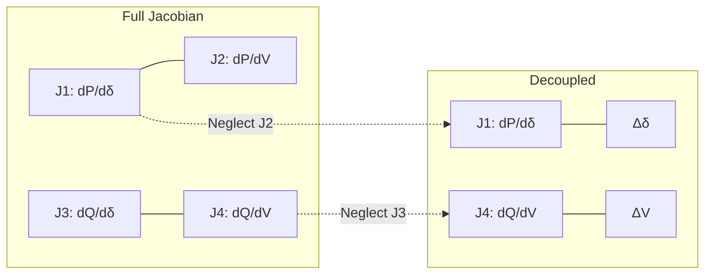

### 33.7 Jacobian Elements - Diagonal of $J_1$

The elements of the Jacobian matrix are partial derivatives of the power flow equations. Let's derive the diagonal elements of $J_1$, which are $\frac{\partial P_i}{\partial \delta_i}$.

The general expression is:
$$\frac{\partial P_i}{\partial \delta_i} = \sum_{k=1, k \neq i}^{n} |V_i| |V_k| |Y_{ik}| \sin(\theta_{ik} - \delta_i + \delta_k)$$

**Derivation Illustration (n=4, i=2):**
First, expand $P_2$:
$$P_2 = |V_2||V_1||Y_{21}| \cos(\theta_{21} - \delta_2 + \delta_1) + |V_2|^2 |Y_{22}| \cos(\theta_{22}) + |V_2||V_3||Y_{23}| \cos(\theta_{23} - \delta_2 + \delta_3) + |V_2||V_4||Y_{24}| \cos(\theta_{24} - \delta_2 + \delta_4)$$

Now, differentiate with respect to $\delta_2$:
$$\frac{\partial P_2}{\partial \delta_2} = |V_2||V_1||Y_{21}| \sin(\theta_{21} - \delta_2 + \delta_1) + 0 + |V_2||V_3||Y_{23}| \sin(\theta_{23} - \delta_2 + \delta_3) + |V_2||V_4||Y_{24}| \sin(\theta_{24} - \delta_2 + \delta_4)$$

**Key Point:** The term where $k=i$ (the second term) is independent of $\delta_i$ because $\delta_i - \delta_i = 0$. Therefore, its derivative is zero. This is why the summation excludes $k=i$.

The derivative of the cosine term with respect to the angle introduces a sine term with a positive sign. This is a fundamental result from calculus: $\frac{d}{dx}\cos(ax) = -a\sin(ax)$, and the negative sign from the chain rule combines with the negative sign in the power flow equation to yield a positive sine term.

### 33.8 Lecture 33 Recap

- The Newton-Raphson method uses the Jacobian matrix of partial derivatives to find corrections to all variables simultaneously.
- It converges quadratically, making it much faster than Gauss-Seidel for large systems.
- The power flow problem can be formulated as a matrix equation $\begin{bmatrix} \Delta P \\ \Delta Q \end{bmatrix} = J \begin{bmatrix} \Delta \delta \\ \Delta V \end{bmatrix}$.
- Due to the low R/X ratio of transmission lines, the problem can be decoupled into $\Delta P - \delta$ and $\Delta Q - V$ sub-problems.
- The diagonal elements of $J_1$ are summations over all $k \neq i$.

---

## Lecture 34: Jacobian Elements

### 34.1 Physical Intuition

In this lecture, we complete the derivation of the Jacobian matrix elements. We will see that the off-diagonal elements are much simpler than the diagonal ones, as they involve only a single term from the power flow summation. We will also define the power residuals, which are the "mismatches" that drive the Newton-Raphson iteration, and outline the complete algorithm.

The Jacobian matrix is the heart of the Newton-Raphson method. Each element represents the sensitivity of a power injection to a voltage variable. By computing these sensitivities accurately, we can determine the optimal corrections to apply to the voltage variables.

### 34.2 Off-Diagonal Elements of $J_1$

The off-diagonal elements of $J_1$ are $\frac{\partial P_i}{\partial \delta_k}$ where $k \neq i$. The general expression is:
$$\frac{\partial P_i}{\partial \delta_k} = -|V_i| |V_k| |Y_{ik}| \sin(\theta_{ik} - \delta_i + \delta_k), \quad k \neq i$$

**Derivation Illustration (i=2, k=3):**
From the expanded $P_2$ above, only the term containing $\delta_3$ survives differentiation with respect to $\delta_3$:
$$\frac{\partial P_2}{\partial \delta_3} = -|V_2||V_3||Y_{23}| \sin(\theta_{23} - \delta_2 + \delta_3)$$

**Key Point:** Off-diagonal elements are single terms, unlike diagonal elements which are summations.

The negative sign in the off-diagonal elements reflects the fact that an increase in the angle at bus $k$ will generally cause a decrease in the real power injection at bus $i$ (since power flows from higher angles to lower angles).

### 34.3 Diagonal Elements of $J_4$

The diagonal elements of $J_4$ are $\frac{\partial Q_i}{\partial V_i}$. The general expression is:
$$\frac{\partial Q_i}{\partial V_i} = -2|V_i||Y_{ii}| \sin(\theta_{ii}) - \sum_{k=1, k \neq i}^{n} |V_k||Y_{ik}| \sin(\theta_{ik} - \delta_i + \delta_k)$$

**Note:** The first term has a factor of 2. This arises because the $k=i$ term in the $Q_i$ summation contains $|V_i|^2$, and when we differentiate with respect to $|V_i|$, we get $2|V_i|$.

The factor of 2 is a common source of error in manual calculations. It is essential to remember that the self-term in the reactive power equation is quadratic in $|V_i|$, which introduces the factor of 2 upon differentiation.

### 34.4 Off-Diagonal Elements of $J_4$

The off-diagonal elements of $J_4$ are $\frac{\partial Q_i}{\partial V_k}$ where $k \neq i$. The general expression is:
$$\frac{\partial Q_i}{\partial V_k} = -|V_i||Y_{ik}| \sin(\theta_{ik} - \delta_i + \delta_k), \quad k \neq i$$

**Derivation Illustration (i=2, k=3):**
From the expanded $Q_2$, only the term containing $V_3$ survives differentiation with respect to $V_3$:
$$\frac{\partial Q_2}{\partial V_3} = -|V_2||Y_{23}| \sin(\theta_{23} - \delta_2 + \delta_3)$$

Note that the off-diagonal elements of $J_4$ do not have the factor of 2, since they involve only the linear term in $|V_k|$.

### 34.5 Summary of Jacobian Elements

| Element | Expression | Type |
| :--- | :--- | :--- |
| $\frac{\partial P_i}{\partial \delta_i}$ | $\sum_{k \neq i} |V_i||V_k||Y_{ik}| \sin(\theta_{ik} - \delta_i + \delta_k)$ | Diagonal of $J_1$ |
| $\frac{\partial P_i}{\partial \delta_k}$ | $-|V_i||V_k||Y_{ik}| \sin(\theta_{ik} - \delta_i + \delta_k)$ | Off-diagonal of $J_1$ |
| $\frac{\partial Q_i}{\partial V_i}$ | $-2|V_i||Y_{ii}| \sin(\theta_{ii}) - \sum_{k \neq i} |V_k||Y_{ik}| \sin(\theta_{ik} - \delta_i + \delta_k)$ | Diagonal of $J_4$ |
| $\frac{\partial Q_i}{\partial V_k}$ | $-|V_i||Y_{ik}| \sin(\theta_{ik} - \delta_i + \delta_k)$ | Off-diagonal of $J_4$ |

The symmetry between the off-diagonal elements of $J_1$ and $J_4$ is noteworthy. Both involve the same sine term, but with different voltage magnitude factors. This symmetry reflects the underlying physics of the power system.

### 34.6 Power Residuals and Convergence Criteria

The Newton-Raphson method iterates to reduce the mismatch between the scheduled and calculated power injections. At iteration $p$, the power residuals are:
$$\Delta P_i^{(p)} = P_i^{\text{scheduled}} - P_i^{\text{calculated}(p)}$$
$$\Delta Q_i^{(p)} = Q_i^{\text{scheduled}} - Q_i^{\text{calculated}(p)}$$

Where:
- $P_i^{\text{scheduled}}$ and $Q_i^{\text{scheduled}}$ are the known net injections (generation minus load).
- $P_i^{\text{calculated}(p)}$ and $Q_i^{\text{calculated}(p)}$ are computed from the power flow equations using the current voltage estimates.

The convergence criteria are based on the maximum absolute residual:
$$\Delta P_{\max} = \max(|\Delta P_2|, |\Delta P_3|, \ldots, |\Delta P_n|)$$
$$\Delta Q_{\max} = \max(|\Delta Q_2|, |\Delta Q_3|, \ldots, |\Delta Q_n|)$$

The solution has converged when both $\Delta P_{\max} \leq \epsilon$ and $\Delta Q_{\max} \leq \epsilon$, where $\epsilon$ is a small tolerance (e.g., $10^{-4}$ or $10^{-5}$).

The power residuals represent the "error" in the current solution. If the residuals are zero, then the calculated power injections exactly match the scheduled values, and the voltage solution is correct. The NR method iteratively drives these residuals to zero.

### 34.7 The Newton-Raphson Algorithm

Here is the complete algorithm for the Newton-Raphson load flow:

1.  **Read System Data:** Gather all bus, line, and generator data.
2.  **Form $Y_{bus}$:** Construct the bus admittance matrix.
3.  **Initialize Voltages:**
    - For PQ buses: Set $V_i = 1.0$ and $\delta_i = 0$.
    - For PV buses: Set $\delta_i = 0$ (voltage magnitude is already specified).
4.  **Calculate Power and Residuals:**
    - For PQ buses: Calculate $P_i^{(p)}$ and $Q_i^{(p)}$, then $\Delta P_i^{(p)}$ and $\Delta Q_i^{(p)}$.
    - For PV buses: Calculate $P_i^{(p)}$ and $\Delta P_i^{(p)}$ only.
5.  **Compute Jacobian Elements:** Calculate the elements of $J_1$ and $J_4$ (and $J_2$, $J_3$ if not decoupled).
6.  **Solve for Corrections:** Solve the linear equations $\Delta P = J_1 \Delta \delta$ and $\Delta Q = J_4 \Delta V$ for $\Delta \delta$ and $\Delta V$.
7.  **Update Voltages:**
    - $\delta_i^{(p+1)} = \delta_i^{(p)} + \Delta \delta_i^{(p)}$
    - $V_i^{(p+1)} = V_i^{(p)} + \Delta V_i^{(p)}$
8.  **Check Convergence:** If $\max|\Delta P_i| < \epsilon$ and $\max|\Delta Q_i| < \epsilon$, the solution has converged. Go to Step 9. Otherwise, return to Step 4.
9.  **Output Results:** Print the final bus voltages, angles, and other quantities.

The algorithm can be visualized as follows:

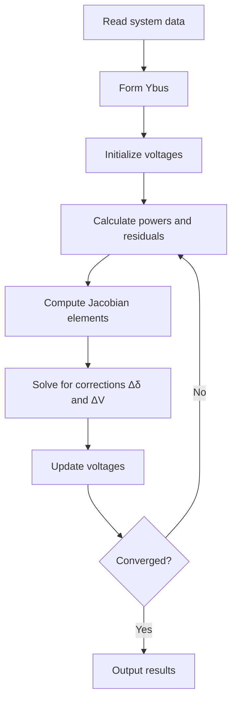

### 34.8 Lecture 34 Recap

- The Jacobian matrix elements are partial derivatives of the power flow equations.
- Off-diagonal elements are single terms, while diagonal elements are summations.
- The diagonal elements of $J_4$ have a factor of 2 on the self-term.
- Power residuals are the differences between scheduled and calculated power injections.
- The NR algorithm iterates to reduce these residuals to below a tolerance.

---

## Lecture 35: Newton-Raphson Method - Worked Examples

### 35.1 Physical Intuition

Now we put the Newton-Raphson theory into practice with two detailed worked examples. The first example is a three-bus system with all PQ buses, which allows us to see the full $2 \times 2$ Jacobian matrices. The second example introduces a PV bus, which changes the structure of the Jacobian and the iterative process. These examples will solidify our understanding of the NR algorithm.

The worked examples demonstrate the complete NR procedure: computing the Jacobian, calculating power residuals, solving for corrections, updating voltages, and checking convergence. By working through these examples step-by-step, we gain insight into the behavior of the method and the physical meaning of each calculation.

### 35.2 Worked Example 2: Three-Bus System (All PQ Buses)

This is the same three-bus system from the Gauss-Seidel example. Bus 1 is the slack bus, and buses 2 and 3 are PQ buses.

**System Data:**
- Base MVA = 100
- $V_1 = 1.05 \angle 0^\circ$ pu
- $P_2 = -2.556$ pu, $Q_2 = -1.102$ pu
- $P_3 = -1.386$ pu, $Q_3 = -0.452$ pu

**Y-bus Matrix (from Lecture 31):**
- $Y_{11} = 53.85 \angle -68.2^\circ$
- $Y_{12} = 22.36 \angle 116.6^\circ$
- $Y_{13} = 31.62 \angle 108.4^\circ$
- $Y_{22} = 58.13 \angle -63.4^\circ$
- $Y_{23} = 35.77 \angle 116.6^\circ$
- $Y_{33} = 67.23 \angle -67.2^\circ$

**Initial Values:**
- $V_2^{(0)} = 1.0$, $\delta_2^{(0)} = 0$
- $V_3^{(0)} = 1.0$, $\delta_3^{(0)} = 0$

### 35.3 Step 1: Compute Jacobian Elements (Iteration 0)

We use the formulas derived in Lecture 34. Let's calculate the elements of $J_1$ and $J_4$ at the initial values.

**Elements of $J_1$:**
$$\frac{\partial P_2}{\partial \delta_2} = |V_2||V_1||Y_{21}| \sin(\theta_{21} - \delta_2 + \delta_1) + |V_2||V_3||Y_{23}| \sin(\theta_{23} - \delta_2 + \delta_3)$$
$$= 1.0 \times 1.05 \times 22.36 \sin(116.6^\circ) + 1.0 \times 1.0 \times 35.77 \sin(116.6^\circ)$$
$$= 23.48(0.894) + 35.77(0.894) = 20.99 + 31.98 = 52.97$$

$$\frac{\partial P_2}{\partial \delta_3} = -|V_2||V_3||Y_{23}| \sin(\theta_{23} - \delta_2 + \delta_3) = -1.0 \times 1.0 \times 35.77 \sin(116.6^\circ) = -31.98$$

$$\frac{\partial P_3}{\partial \delta_2} = -|V_3||V_2||Y_{32}| \sin(\theta_{32} - \delta_3 + \delta_2) = -1.0 \times 1.0 \times 35.77 \sin(116.6^\circ) = -31.98$$

$$\frac{\partial P_3}{\partial \delta_3} = |V_3||V_1||Y_{31}| \sin(\theta_{31} - \delta_3 + \delta_1) + |V_3||V_2||Y_{32}| \sin(\theta_{32} - \delta_3 + \delta_2)$$
$$= 1.0 \times 1.05 \times 31.62 \sin(108.4^\circ) + 1.0 \times 1.0 \times 35.77 \sin(116.6^\circ)$$
$$= 33.20(0.949) + 35.77(0.894) = 31.51 + 31.98 = 63.49$$

So, $J_1 = \begin{bmatrix} 52.97 & -31.98 \\ -31.98 & 63.49 \end{bmatrix}$

**Elements of $J_4$:**
$$\frac{\partial Q_2}{\partial V_2} = -|V_1||Y_{21}| \sin(\theta_{21} - \delta_2 + \delta_1) - 2|V_2||Y_{22}| \sin(\theta_{22}) - |V_3||Y_{23}| \sin(\theta_{23} - \delta_2 + \delta_3)$$
$$= -1.05 \times 22.36 \sin(116.6^\circ) - 2 \times 1.0 \times 58.13 \sin(-63.4^\circ) - 1.0 \times 35.77 \sin(116.6^\circ)$$
$$= -23.48(0.894) - 116.26(-0.894) - 35.77(0.894)$$
$$= -20.99 + 103.94 - 31.98 = 50.97$$

$$\frac{\partial Q_2}{\partial V_3} = -|V_2||Y_{23}| \sin(\theta_{23} - \delta_2 + \delta_3) = -1.0 \times 35.77 \sin(116.6^\circ) = -31.98$$

$$\frac{\partial Q_3}{\partial V_2} = -|V_3||Y_{32}| \sin(\theta_{32} - \delta_3 + \delta_2) = -1.0 \times 35.77 \sin(116.6^\circ) = -31.98$$

$$\frac{\partial Q_3}{\partial V_3} = -|V_1||Y_{31}| \sin(\theta_{31} - \delta_3 + \delta_1) - |V_2||Y_{32}| \sin(\theta_{32} - \delta_3 + \delta_2) - 2|V_3||Y_{33}| \sin(\theta_{33})$$
$$= -1.05 \times 31.62 \sin(108.4^\circ) - 1.0 \times 35.77 \sin(116.6^\circ) - 2 \times 1.0 \times 67.23 \sin(-67.2^\circ)$$
$$= -33.20(0.949) - 35.77(0.894) - 134.46(-0.922)$$
$$= -31.51 - 31.98 + 123.97 = 60.48$$

So, $J_4 = \begin{bmatrix} 50.97 & -31.98 \\ -31.98 & 60.48 \end{bmatrix}$

**Note:** For this example, we will assume the Jacobian matrices are constant throughout the iterative process to save computation time. This is a common simplification in educational examples, though in practice the Jacobian is often updated each iteration for faster convergence.

### 35.4 Step 2: Calculate Power and Residuals (Iteration 0)

Using the power flow equations, we calculate the power injections at the initial voltage values.

**Calculated Powers:**
$$P_2^{\text{calc}(0)} = |V_2||V_1||Y_{21}| \cos(\theta_{21} - \delta_2 + \delta_1) + |V_2|^2|Y_{22}| \cos(\theta_{22}) + |V_2||V_3||Y_{23}| \cos(\theta_{23} - \delta_2 + \delta_3)$$
$$= 1.0 \times 1.05 \times 22.36 \cos(116.6^\circ) + 1.0 \times 58.13 \cos(-63.4^\circ) + 1.0 \times 1.0 \times 35.77 \cos(116.6^\circ)$$
$$= 23.48(-0.448) + 58.13(0.448) + 35.77(-0.448) = -10.52 + 26.04 - 16.02 = -0.50$$

$$P_3^{\text{calc}(0)} = 1.0 \times 1.05 \times 31.62 \cos(108.4^\circ) + 1.0 \times 1.0 \times 35.77 \cos(116.6^\circ) + 1.0 \times 67.23 \cos(-67.2^\circ)$$
$$= 33.20(-0.316) + 35.77(-0.448) + 67.23(0.388) = -10.49 - 16.02 + 26.09 = -0.42$$

$$Q_2^{\text{calc}(0)} = -1.0 \times 1.05 \times 22.36 \sin(116.6^\circ) - 1.0 \times 58.13 \sin(-63.4^\circ) - 1.0 \times 1.0 \times 35.77 \sin(116.6^\circ)$$
$$= -23.48(0.894) - 58.13(-0.894) - 35.77(0.894) = -20.99 + 51.97 - 31.98 = -1.00$$

$$Q_3^{\text{calc}(0)} = -1.0 \times 1.05 \times 31.62 \sin(108.4^\circ) - 1.0 \times 1.0 \times 35.77 \sin(116.6^\circ) - 1.0 \times 67.23 \sin(-67.2^\circ)$$
$$= -33.20(0.949) - 35.77(0.894) - 67.23(-0.922) = -31.51 - 31.98 + 61.99 = -1.50$$

**Power Residuals:**
$$\Delta P_2^{(0)} = P_2^{\text{sched}} - P_2^{\text{calc}(0)} = -2.556 - (-0.50) = -2.056$$
$$\Delta P_3^{(0)} = P_3^{\text{sched}} - P_3^{\text{calc}(0)} = -1.386 - (-0.42) = -0.966$$
$$\Delta Q_2^{(0)} = Q_2^{\text{sched}} - Q_2^{\text{calc}(0)} = -1.102 - (-1.00) = -0.102$$
$$\Delta Q_3^{(0)} = Q_3^{\text{sched}} - Q_3^{\text{calc}(0)} = -0.452 - (-1.50) = 1.048$$

The residuals represent the mismatch between what the system should deliver and what it currently delivers with the initial voltage estimates. Large residuals indicate that the initial guess is far from the solution.

### 35.5 Step 3: Solve for Corrections and Update (Iteration 0)

**Solve for $\Delta \delta$:**
$$\begin{bmatrix} \Delta\delta_2^{(0)} \\ \Delta\delta_3^{(0)} \end{bmatrix} = \begin{bmatrix} 52.97 & -31.98 \\ -31.98 & 63.49 \end{bmatrix}^{-1} \begin{bmatrix} -2.056 \\ -0.966 \end{bmatrix}$$

The solution is:
$$\Delta\delta_2^{(0)} = -0.08687 \text{ rad} = -4.98^\circ$$
$$\Delta\delta_3^{(0)} = -0.0495 \text{ rad} = -2.84^\circ$$

**Solve for $\Delta V$:**
$$\begin{bmatrix} \Delta V_2^{(0)} \\ \Delta V_3^{(0)} \end{bmatrix} = \begin{bmatrix} 50.97 & -31.98 \\ -31.98 & 60.48 \end{bmatrix}^{-1} \begin{bmatrix} -0.102 \\ 1.048 \end{bmatrix}$$

The solution is:
$$\Delta V_2^{(0)} = 0.0132$$
$$\Delta V_3^{(0)} = 0.0244$$

**Update Voltages:**
$$\delta_2^{(1)} = 0 + (-4.98^\circ) = -4.98^\circ$$
$$\delta_3^{(1)} = 0 + (-2.84^\circ) = -2.84^\circ$$
$$V_2^{(1)} = 1.0 + 0.0132 = 1.0132$$
$$V_3^{(1)} = 1.0 + 0.0244 = 1.0244$$

The corrections are applied to the initial values to obtain the updated voltages. The negative angle corrections indicate that the voltage angles need to shift to accommodate the power flow.

### 35.6 Step 4: Second Iteration

We repeat the process with the updated voltages.

**Calculated Powers (Iteration 1):**
Using the new voltages, we calculate:
$$P_2^{\text{calc}(1)} = -2.62$$
$$P_3^{\text{calc}(1)} = -0.96$$
$$Q_2^{\text{calc}(1)} = 0.005$$
$$Q_3^{\text{calc}(1)} = -0.0618$$

**Power Residuals (Iteration 1):**
$$\Delta P_2^{(1)} = -2.556 - (-2.62) = 0.064$$
$$\Delta P_3^{(1)} = -1.386 - (-0.96) = -0.426$$
$$\Delta Q_2^{(1)} = -1.102 - 0.005 = -1.107$$
$$\Delta Q_3^{(1)} = -0.452 - (-0.0618) = -0.390$$

These residuals are still large, so we continue.

**Solve for Corrections (Iteration 1):**
Using the same (constant) Jacobian:
$$\Delta\delta_2^{(1)} = -0.229^\circ$$
$$\Delta\delta_3^{(1)} = -0.5^\circ$$
$$\Delta V_2^{(1)} = -0.037$$
$$\Delta V_3^{(1)} = -0.0244$$

**Update Voltages:**
$$\delta_2^{(2)} = -4.98 + (-0.229) = -5.21^\circ$$
$$\delta_3^{(2)} = -2.84 + (-0.5) = -3.34^\circ$$
$$V_2^{(2)} = 1.0132 + (-0.037) = 0.9762$$
$$V_3^{(2)} = 1.0244 + (-0.0244) = 1.0000$$

**After Second Iteration:**
- $\delta_2^{(2)} = -5.21^\circ$, $V_2^{(2)} = 0.9762$ pu
- $\delta_3^{(2)} = -3.34^\circ$, $V_3^{(2)} = 1.0000$ pu

We would continue iterating until the residuals are below the tolerance. The convergence pattern shows that the voltage magnitudes and angles are adjusting toward their final values.

### 35.7 Summary of Example 2 (NR with All PQ Buses)

| Iteration | $\delta_2$ | $\delta_3$ | $V_2$ | $V_3$ |
| :--- | :--- | :--- | :--- | :--- |
| 0 | 0° | 0° | 1.0 | 1.0 |
| 1 | -4.98° | -2.84° | 1.0132 | 1.0244 |
| 2 | -5.21° | -3.34° | 0.9762 | 1.0000 |

### 35.8 Worked Example 3: Three-Bus System with a PV Bus

Now, let's consider a different three-bus system with a PV bus.

**System Description:**
- **Bus 1:** Slack bus, $V_1 = 1.0 \angle 0^\circ$ pu, with a dummy load of $2 + j1$ pu.
- **Bus 2:** PQ bus, injection $0.5 + j1.0$ pu (no load).
- **Bus 3:** PV bus, load $1.5 + j0.6$ pu, voltage magnitude to be maintained at $|V_3| = 1.0$ pu.

**Y-bus Matrix (given):**
- $Y_{11} = 26.925 \angle -68.2^\circ$
- $Y_{12} = 11.18 \angle 116.6^\circ$
- $Y_{13} = 15.81 \angle 108.4^\circ$
- $Y_{22} = 29.065 \angle -63.4^\circ$
- $Y_{23} = 17.885 \angle 116.6^\circ$
- $Y_{33} = 33.615 \angle -67.2^\circ$

**Scheduled Powers:**
- $P_2^{\text{sched}} = 0.5$ pu, $Q_2^{\text{sched}} = 1.0$ pu
- $P_3^{\text{sched}} = 0 - 1.5 = -1.5$ pu

**Note:** $Q_3$ is unknown because $Q_{g3}$ is unknown. This is why bus 3 is a PV bus.

### 35.9 Step 1: Jacobian Structure with PV Bus

Since bus 3 is a PV bus, its voltage magnitude is fixed. Therefore, $\Delta V_3$ is not a variable. The Jacobian structure changes:

- $J_1$ is $2 \times 2$ (for $\Delta\delta_2$ and $\Delta\delta_3$).
- $J_4$ is $1 \times 1$ (for $\Delta V_2$ only).

The decoupled equations are:
$$\begin{bmatrix} \Delta P_2 \\ \Delta P_3 \end{bmatrix} = \begin{bmatrix} \frac{\partial P_2}{\partial \delta_2} & \frac{\partial P_2}{\partial \delta_3} \\ \frac{\partial P_3}{\partial \delta_2} & \frac{\partial P_3}{\partial \delta_3} \end{bmatrix} \begin{bmatrix} \Delta\delta_2 \\ \Delta\delta_3 \end{bmatrix}$$
$$\Delta Q_2 = \frac{\partial Q_2}{\partial V_2} \Delta V_2$$

The reduction in the size of $J_4$ is a significant computational advantage when there are many PV buses in the system.

### 35.10 Step 2: Compute Jacobian Elements (Iteration 0)

Using the initial values ($V_2 = 1.0$, $\delta_2 = 0$, $V_3 = 1.0$, $\delta_3 = 0$):

**Elements of $J_1$:**
$$\frac{\partial P_2}{\partial \delta_2} = 1.0 \times 1.0 \times 11.18 \sin(116.6^\circ) + 1.0 \times 1.0 \times 17.885 \sin(116.6^\circ) = 11.18(0.894) + 17.885(0.894) = 10.0 + 16.0 = 26.0$$
$$\frac{\partial P_2}{\partial \delta_3} = -1.0 \times 1.0 \times 17.885 \sin(116.6^\circ) = -16.0$$
$$\frac{\partial P_3}{\partial \delta_2} = -1.0 \times 1.0 \times 17.885 \sin(116.6^\circ) = -16.0$$
$$\frac{\partial P_3}{\partial \delta_3} = 1.0 \times 1.0 \times 15.81 \sin(108.4^\circ) + 1.0 \times 1.0 \times 17.885 \sin(116.6^\circ) = 15.81(0.949) + 17.885(0.894) = 15.0 + 16.0 = 31.0$$

So, $J_1 = \begin{bmatrix} 26 & -16 \\ -16 & 31 \end{bmatrix}$

**Element of $J_4$:**
$$\frac{\partial Q_2}{\partial V_2} = -1.0 \times 11.18 \sin(116.6^\circ) - 2 \times 1.0 \times 29.065 \sin(-63.4^\circ) - 1.0 \times 17.885 \sin(116.6^\circ)$$
$$= -11.18(0.894) - 58.13(-0.894) - 17.885(0.894) = -10.0 + 51.97 - 16.0 = 25.97 \approx 26.0$$

So, $J_4 = [26]$

### 35.11 Step 3: Calculate Power and Residuals (Iteration 0)

**Calculated Powers:**
$$P_2^{\text{calc}(0)} = 1.0 \times 1.0 \times 11.18 \cos(116.6^\circ) + 1.0 \times 29.065 \cos(-63.4^\circ) + 1.0 \times 1.0 \times 17.885 \cos(116.6^\circ)$$
$$= 11.18(-0.448) + 29.065(0.448) + 17.885(-0.448) = -5.01 + 13.02 - 8.01 = 0.0$$

$$P_3^{\text{calc}(0)} = 1.0 \times 1.0 \times 15.81 \cos(108.4^\circ) + 1.0 \times 1.0 \times 17.885 \cos(116.6^\circ) + 1.0 \times 33.615 \cos(-67.2^\circ)$$
$$= 15.81(-0.316) + 17.885(-0.448) + 33.615(0.388) = -5.0 - 8.01 + 13.04 = 0.0$$

$$Q_2^{\text{calc}(0)} = -1.0 \times 1.0 \times 11.18 \sin(116.6^\circ) - 1.0 \times 29.065 \sin(-63.4^\circ) - 1.0 \times 1.0 \times 17.885 \sin(116.6^\circ)$$
$$= -11.18(0.894) - 29.065(-0.894) - 17.885(0.894) = -10.0 + 25.98 - 16.0 = 0.0$$

**Power Residuals:**
$$\Delta P_2^{(0)} = 0.5 - 0.0 = 0.5$$
$$\Delta P_3^{(0)} = -1.5 - 0.0 = -1.5$$
$$\Delta Q_2^{(0)} = 1.0 - 0.0 = 1.0$$

### 35.12 Step 4: Solve for Corrections and Update (Iteration 0)

**Solve for $\Delta \delta$:**
$$\begin{bmatrix} \Delta\delta_2^{(0)} \\ \Delta\delta_3^{(0)} \end{bmatrix} = \begin{bmatrix} 26 & -16 \\ -16 & 31 \end{bmatrix}^{-1} \begin{bmatrix} 0.5 \\ -1.5 \end{bmatrix}$$

The solution is:
$$\Delta\delta_2^{(0)} = -0.015 \text{ rad} = -0.86^\circ$$
$$\Delta\delta_3^{(0)} = -0.056 \text{ rad} = -3.2^\circ$$

**Solve for $\Delta V_2$:**
$$\Delta V_2^{(0)} = \frac{\Delta Q_2^{(0)}}{\frac{\partial Q_2}{\partial V_2}} = \frac{1.0}{26} = 0.0384$$

**Update Voltages:**
$$\delta_2^{(1)} = 0 + (-0.86^\circ) = -0.86^\circ$$
$$\delta_3^{(1)} = 0 + (-3.2^\circ) = -3.2^\circ$$
$$V_2^{(1)} = 1.0 + 0.0384 = 1.0384$$

**Note:** $V_3$ remains at 1.0 pu (PV bus).

### 35.13 Step 5: Second Iteration

**Calculated Powers (Iteration 1):**
Using the updated voltages:
$$P_2^{\text{calc}(1)} = 1.049$$
$$P_3^{\text{calc}(1)} = -1.78$$
$$Q_2^{\text{calc}(1)} = 0.79$$

**Power Residuals (Iteration 1):**
$$\Delta P_2^{(1)} = 0.5 - 1.049 = -0.549$$
$$\Delta P_3^{(1)} = -1.5 - (-1.78) = 0.28$$
$$\Delta Q_2^{(1)} = 1.0 - 0.79 = 0.21$$

**Solve for Corrections (Iteration 1):**
$$\Delta\delta_2^{(1)} = -1.3^\circ$$
$$\Delta\delta_3^{(1)} = -0.15^\circ$$
$$\Delta V_2^{(1)} = \frac{0.21}{26} = 0.008$$

**Update Voltages:**
$$\delta_2^{(2)} = -0.86 + (-1.3) = -2.16^\circ$$
$$\delta_3^{(2)} = -3.2 + (-0.15) = -3.35^\circ$$
$$V_2^{(2)} = 1.0384 + 0.008 = 1.0464$$

**After Second Iteration:**
- $V_2^{(2)} = 1.0464$, $\delta_2^{(2)} = -2.16^\circ$
- $\delta_3^{(2)} = -3.35^\circ$ ($V_3$ remains 1.0 pu)

### 35.14 Summary of Example 3 (NR with PV Bus)

| Iteration | $\delta_2$ | $\delta_3$ | $V_2$ | $V_3$ |
| :--- | :--- | :--- | :--- | :--- |
| 0 | 0° | 0° | 1.0 | 1.0 |
| 1 | -0.86° | -3.2° | 1.0384 | 1.0 |
| 2 | -2.16° | -3.35° | 1.0464 | 1.0 |

### 35.15 Dummy Parameters at Slack Bus

In Example 3, the slack bus has a load of $2 + j1$ pu. This load is a "dummy parameter" during the iterative process because it does not affect the voltage calculations at other buses. However, after convergence, when we calculate the slack bus generation, we must add this load to the calculated power injection.

If the calculated generation at the slack bus is $P_{g1}^{\text{calc}}$ and $Q_{g1}^{\text{calc}}$, then the actual generation is:
$$P_{g1}^{\text{actual}} = P_{g1}^{\text{calc}} + P_{L1}$$
$$Q_{g1}^{\text{actual}} = Q_{g1}^{\text{calc}} + Q_{L1}$$

The concept of dummy parameters is important because it highlights the fact that the slack bus load does not influence the iterative solution. The slack bus absorbs the system's power imbalance, and any local load simply adds to the required generation.

### 35.16 Lecture 35 Recap

- The Newton-Raphson method is applied to a three-bus system with all PQ buses.
- The Jacobian matrices are computed and used to solve for voltage corrections.
- The method is then applied to a system with a PV bus, which reduces the size of $J_4$.
- Loads at the slack bus are "dummy parameters" that are added to the calculated generation after convergence.

---

## Analysis Logic Diagrams

### Gauss-Seidel Load Flow Iteration Sequence

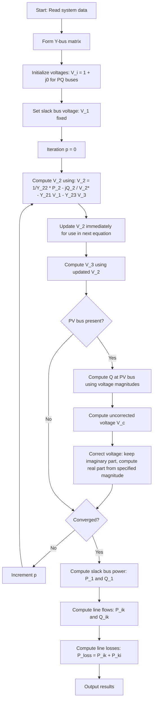

This diagram traces the Gauss-Seidel iterative procedure from both worked examples. The critical path shows how PQ bus voltages are updated sequentially, with the immediately updated value of V₂ used in the V₃ equation for faster convergence. When a PV bus exists, the algorithm branches to compute reactive power first, then corrects the voltage magnitude by retaining only the imaginary part and recomputing the real part from the specified magnitude. The convergence check loops back to the voltage computation step. In exams, tracing this sequence helps identify where per-unit conversions must occur (loads divided by base MVA) and where the PV bus correction prevents voltage magnitude drift.

## Verified Source Visual Atlas

### Lecture 31 — Three-bus Gauss–Seidel example setup (physical PDF page 484)
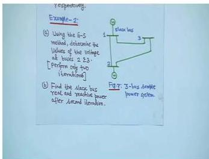
The board shows the worked-example sketch: bus 1 is marked as the slack bus, buses 2 and 3 are the load/PQ buses, and the branches are drawn between them. The small handwritten branch labels are not relied upon here; read the topology and bus types first.

### Lecture 31 — First Gauss–Seidel voltage-update substitution (physical PDF page 493)
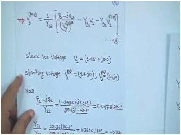
The board shows the complex-voltage update being evaluated with the scheduled power, the conjugate of the previous voltage, admittance terms, and the fixed slack-bus voltage. Some handwritten numerical entries are small; use the visual to follow term placement, not to transcribe uncertain digits.

### Lecture 32 — Line-flow calculation for the worked network (physical PDF page 510)
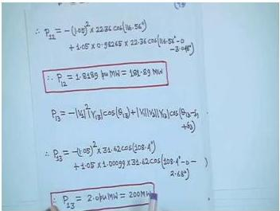
The board shows substitutions for directional line-flow quantities and boxed results for power flow on branches. The negative/positive sign convention and the difference between opposite-end flows are the important reading cues; do not treat any tiny handwritten decimal as independently verified here.

### Lecture 32 — Gauss–Seidel result after the second iteration (physical PDF page 534)
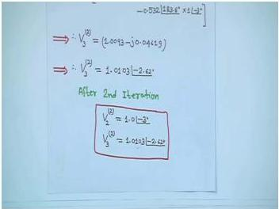
The boxed result records the updated voltage values after two iterations, with one magnitude held fixed and the other expressed in polar form. Read it as the stopping snapshot for the classroom example; the handwriting is clear enough for the qualitative distinction but small angle digits should be checked against the surrounding OCR.

### Lecture 33 — Newton–Raphson iterative correction rule (physical PDF page 544)
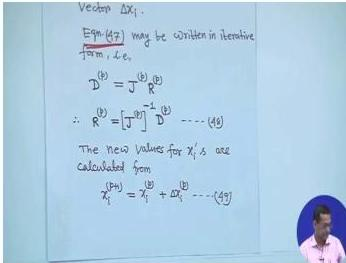
The board writes the linearized residual relation, the inverse-Jacobian correction, and the update from x^(p) to x^(p+1). This is the algorithmic bridge from the Jacobian to the next iterate.

### Lecture 34 — Reactive-power equation used in Jacobian derivation (physical PDF page 563)
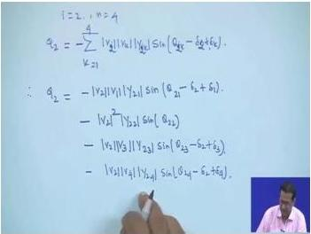
The board expands Q₂ as a sum of voltage-magnitude, admittance-magnitude, and sine terms. The visible summation structure is the key cue for differentiating diagonal and off-diagonal J₄ elements; unreadable small subscripts are intentionally not transcribed.

### Lecture 35 — Newton–Raphson voltage corrections and updated states (physical PDF page 582)
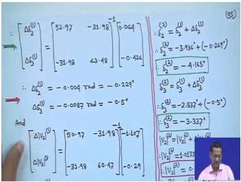
The board shows the inverse-Jacobian multiplication for angle and magnitude corrections, followed by updated voltage entries boxed at the right. It is best read top-to-bottom: solve for corrections, convert or interpret them, then apply the updates.

### Lecture 35 — Jacobian matrices for the PV-bus case (physical PDF page 591)
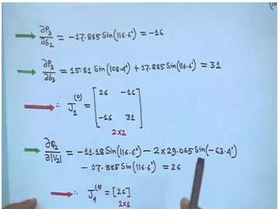
The board shows numerical entries being assembled into a 2×2 J₁ block and a single-element J₄ block for the PV-bus example. The important visual point is that the fixed PV-bus magnitude removes its ΔV variable; no uncertain handwritten value is added beyond the visible matrix structure.

---

## Common Mistakes and Engineering Checks

Based on the lectures and common pitfalls, here are some critical mistakes to avoid and checks to perform:

1.  **Per-Unit Conversion:** Always convert MW and MVAr to per-unit by dividing by the base MVA. Forgetting this is a common error.
2.  **Angle Quadrants:** When using a calculator, always check the quadrant of angles. For example, $\angle 175.6^\circ$ has a negative cosine and a positive sine. Incorrect quadrant selection leads to wrong results.
3.  **PV Bus Voltage Magnitude:** Never change the specified voltage magnitude at a PV bus during iterations. Only the angle changes. When correcting the voltage, use $e = \sqrt{|V|^2 - f^2}$.
4.  **Immediate Update in Gauss-Seidel:** For faster convergence, use the most recently updated voltage values in the Gauss-Seidel method. For example, when calculating $V_3$, use $V_2^{(p+1)}$, not $V_2^{(p)}$.
5.  **Slack Bus Load:** If there is a load at the slack bus, add it to the computed $P_{G1}$ and $Q_{G1}$ to find the total generation.
6.  **Line Loss Sign:** The line loss is the algebraic sum of the power flows at both ends: $P_{LOSS} = P_{ik} + P_{ki}$. A positive sum indicates a loss.
7.  **Negative Line Flow:** A negative $P_{ik}$ means power flows from bus $k$ to bus $i$.
8.  **Jacobian Elements:** Diagonal elements of $J_1$ and $J_4$ are summations over $k \neq i$. Off-diagonal elements are single terms.
9.  **Factor of 2 in $J_4$:** The diagonal elements of $J_4$ have a factor of 2 on the self-term because of the $|V_i|^2$ term.
10. **Convergence Check:** Always use absolute values when checking convergence: $\max|\Delta P_i| < \epsilon$ and $\max|\Delta Q_i| < \epsilon$.
11. **PV Bus and $\Delta Q$:** Do not compute $\Delta Q$ for PV buses, as the scheduled $Q$ is unknown.
12. **Jacobian Size with PV Buses:** $J_1$ is always $(n-1) \times (n-1)$. $J_4$ is $(n-m-1) \times (n-m-1)$, where $m$ is the number of PV buses.

The following table summarizes the key differences between the Gauss-Seidel and Newton-Raphson methods:

| Feature | Gauss-Seidel | Newton-Raphson |
| :--- | :--- | :--- |
| Convergence | Linear | Quadratic |
| Iterations for large systems | Many (hundreds) | Few (2-4) |
| Computation per iteration | Low | High (Jacobian) |
| Sensitivity to initial guess | Moderate | Low |
| Handling of PV buses | Requires Q calculation and voltage correction | Natural (voltage magnitude fixed) |
| Industry usage | Educational, small systems | Standard for large systems |

---

## Quick Revision Sheet

| Concept | Key Formula / Idea |
| :--- | :--- |
| **Net Injected Power** | $P_i = P_{gi} - P_{Li}$, $Q_i = Q_{gi} - Q_{Li}$ |
| **Y-bus Diagonal** | $Y_{ii} = \sum_{k \neq i} y_{ik} + y_{i0}$ |
| **Y-bus Off-Diagonal** | $Y_{ik} = -y_{ik}$ |
| **Gauss-Seidel Update (PQ)** | $V_i^{(p+1)} = \frac{1}{Y_{ii}} \left[ \frac{P_i - jQ_i}{(V_i^{(p)})^*} - \sum_{k \neq i} Y_{ik} V_k \right]$ |
| **GS PV Bus Q Calculation** | $Q_i = -\sum_{k=1}^{n} |V_i||V_k||Y_{ik}| \sin(\theta_{ik} - \delta_i + \delta_k)$ |
| **GS PV Bus Voltage Correction** | Keep imaginary part $f$, set $e = \sqrt{|V_i|^2 - f^2}$ |
| **Power Flow Equations** | $P_i = \sum |V_i||V_k||Y_{ik}| \cos(\theta_{ik} - \delta_i + \delta_k)$ |
| | $Q_i = -\sum |V_i||V_k||Y_{ik}| \sin(\theta_{ik} - \delta_i + \delta_k)$ |
| **NR Matrix Form** | $\begin{bmatrix} \Delta P \\ \Delta Q \end{bmatrix} = \begin{bmatrix} J_1 & J_2 \\ J_3 & J_4 \end{bmatrix} \begin{bmatrix} \Delta \delta \\ \Delta V \end{bmatrix}$ |
| **Decoupled NR** | $\Delta P = J_1 \Delta \delta$, $\Delta Q = J_4 \Delta V$ |
| **$J_1$ Diagonal** | $\frac{\partial P_i}{\partial \delta_i} = \sum_{k \neq i} |V_i||V_k||Y_{ik}| \sin(\theta_{ik} - \delta_i + \delta_k)$ |
| **$J_1$ Off-Diagonal** | $\frac{\partial P_i}{\partial \delta_k} = -|V_i||V_k||Y_{ik}| \sin(\theta_{ik} - \delta_i + \delta_k)$ |
| **$J_4$ Diagonal** | $\frac{\partial Q_i}{\partial V_i} = -2|V_i||Y_{ii}| \sin(\theta_{ii}) - \sum_{k \neq i} |V_k||Y_{ik}| \sin(\theta_{ik} - \delta_i + \delta_k)$ |
| **$J_4$ Off-Diagonal** | $\frac{\partial Q_i}{\partial V_k} = -|V_i||Y_{ik}| \sin(\theta_{ik} - \delta_i + \delta_k)$ |
| **Power Residuals** | $\Delta P_i^{(p)} = P_i^{\text{sched}} - P_i^{\text{calc}(p)}$, $\Delta Q_i^{(p)} = Q_i^{\text{sched}} - Q_i^{\text{calc}(p)}$ |
| **Voltage Updates** | $V_i^{(p+1)} = V_i^{(p)} + \Delta V_i^{(p)}$, $\delta_i^{(p+1)} = \delta_i^{(p)} + \Delta \delta_i^{(p)}$ |
| **Convergence** | $\max|\Delta P_i| < \epsilon$, $\max|\Delta Q_i| < \epsilon$ |
| **Jacobian Size** | $J_1$: $(n-1) \times (n-1)$; $J_4$: $(n-m-1) \times (n-m-1)$ |
| **GS Convergence** | Linear |
| **NR Convergence** | Quadratic |

---

## Practice Quiz

**Q1. In a load-flow study, which of the following quantities are specified for a PV (generator) bus?**

Options: (a) P and Q (b) P and |V| (c) Q and |V| (d) |V| and δ

> Answer and explanation
> The correct answer is (b) P and |V|. A PV bus, or voltage-controlled bus, has its real power injection (P) and voltage magnitude (|V|) specified. The reactive power (Q) and voltage angle (δ) are the unknowns that must be determined through the load-flow calculation. This models a generator that controls its real power output and terminal voltage.

**Q2. What is the primary reason for the decoupling approximation in the Newton-Raphson load-flow method?**

Options: (a) To reduce the number of buses in the system (b) To eliminate the need for a slack bus (c) The low R/X ratio of transmission lines (d) To simplify the calculation of line losses

> Answer and explanation
> The correct answer is (c) The low R/X ratio of transmission lines. In high-voltage transmission systems, the resistance (R) is much smaller than the reactance (X). This physical property makes real power (P) primarily sensitive to voltage angles (δ) and reactive power (Q) primarily sensitive to voltage magnitudes (|V|). This allows the Jacobian matrix to be decoupled into two smaller sub-problems, simplifying the computation.

**Q3. In the Gauss-Seidel method, how is the voltage at a PV bus corrected after calculating an uncorrected complex voltage?**

Options: (a) The real part is kept, and the imaginary part is adjusted (b) The imaginary part is kept, and the real part is adjusted (c) Both parts are scaled proportionally (d) The voltage is set to the slack bus voltage

> Answer and explanation
> The correct answer is (b) The imaginary part is kept, and the real part is adjusted. For a PV bus, the voltage magnitude is fixed. After calculating an uncorrected voltage $V_c = e + jf$, the imaginary part $f$ is retained. The real part is then recalculated using $e = \sqrt{|V|^2 - f^2}$ to ensure the magnitude constraint is satisfied.

**Q4. What is the convergence characteristic of the Newton-Raphson method?**

Options: (a) Linear (b) Quadratic (c) Logarithmic (d) Exponential

> Answer and explanation
> The correct answer is (b) Quadratic. The Newton-Raphson method exhibits quadratic convergence, meaning the number of correct digits roughly doubles with each iteration. This is significantly faster than the linear convergence of the Gauss-Seidel method, making NR the preferred method for large power systems.

**Q5. For a system with 'n' buses and 'm' PV buses, what is the size of the Jacobian sub-matrix $J_4$ in the decoupled Newton-Raphson method?**

Options: (a) $(n-1) \times (n-1)$ (b) $(n-m) \times (n-m)$ (c) $(n-m-1) \times (n-m-1)$ (d) $m \times m$

> Answer and explanation
> The correct answer is (c) $(n-m-1) \times (n-m-1)$. The $J_4$ matrix relates reactive power mismatches ($\Delta Q$) to voltage magnitude corrections ($\Delta V$). Since the slack bus (1) and all PV buses (m) have fixed voltage magnitudes, they are excluded from this sub-problem. Therefore, the size is $(n-1-m) \times (n-1-m)$.

**Q6. What is the "mismatch" vector in the Newton-Raphson load-flow method?**

Options: (a) The difference between calculated and scheduled power injections (b) The difference between two successive voltage estimates (c) The Jacobian matrix (d) The line losses

> Answer and explanation
> The correct answer is (a) The difference between calculated and scheduled power injections. The mismatch vector, $\Delta P$ and $\Delta Q$, represents the error between the known (scheduled) power injections and the values calculated from the current voltage estimates. The NR method iteratively drives these mismatches to zero.

**Q7. (MSQ) Which of the following statements are true regarding the Gauss-Seidel (GS) and Newton-Raphson (NR) load-flow methods?**

Options: (a) GS has linear convergence, while NR has quadratic convergence (b) NR requires the calculation of a Jacobian matrix (c) GS is generally faster for large systems (d) NR is less prone to divergence with ill-conditioned problems

> Answer and explanation
> The correct answers are (a), (b), and (d). GS converges linearly, while NR converges quadratically, making NR faster for large systems. NR requires the computation of the Jacobian matrix of partial derivatives. NR is also more robust and less prone to divergence with ill-conditioned problems. GS is not faster for large systems; its linear convergence makes it slow.

**Q8. (MSQ) In the Newton-Raphson load-flow method, which of the following are true about the Jacobian matrix?**

Options: (a) Diagonal elements of $J_1$ are summations over all $k \neq i$ (b) Off-diagonal elements of $J_1$ are single terms (c) The diagonal elements of $J_4$ have a factor of 2 on the self-term (d) The Jacobian matrix is always constant and does not change between iterations

> Answer and explanation
> The correct answers are (a), (b), and (c). The diagonal elements of $J_1$ involve a summation over all other buses. The off-diagonal elements are single terms because only one term in the power flow summation contains the variable of differentiation. The diagonal elements of $J_4$ have a factor of 2 on the self-term due to the $|V_i|^2$ term. The Jacobian is not always constant; it can be updated each iteration for faster convergence, though it is sometimes held constant to save computation time.

**Q9. (MSQ) What are the correct steps for handling a PV bus in the Gauss-Seidel method?**

Options: (a) Calculate the reactive power Q using the current voltage values (b) Calculate the new voltage using the calculated Q (c) Correct the voltage magnitude to the specified value (d) Set the reactive power Q to zero

> Answer and explanation
> The correct answers are (a), (b), and (c). For a PV bus, Q is unknown and must be calculated first. Then, this Q is used in the standard GS voltage update equation. Finally, the calculated voltage is corrected to maintain the specified magnitude. Q is not set to zero; it is a variable that must be determined.

**Q10. What is the physical significance of the slack bus in a load-flow study?**

> Answer and explanation
> The slack bus (also called the swing bus or reference bus) serves two main purposes. First, it provides a reference for the voltage angles of all other buses (its angle is typically set to 0°). Second, it absorbs the real and reactive power mismatch in the system, including the total system losses, which are not known in advance. Its real and reactive power injections are calculated after the load-flow solution is found.

**Q11. Define the "power residual" ($\Delta P_i$) at a bus in the Newton-Raphson method.**

> Answer and explanation
> The power residual $\Delta P_i$ is the difference between the scheduled real power injection ($P_i^{\text{scheduled}}$, which is the known generation minus load) and the calculated real power injection ($P_i^{\text{calculated}}$) obtained from the power flow equations using the current voltage estimates. Mathematically, $\Delta P_i^{(p)} = P_i^{\text{scheduled}} - P_i^{\text{calculated}(p)}$. The NR method iterates to drive all residuals to zero.

**Q12. Why is the factor of 2 present in the diagonal elements of the Jacobian sub-matrix $J_4$?**

> Answer and explanation
> The diagonal elements of $J_4$ are $\frac{\partial Q_i}{\partial V_i}$. The reactive power equation $Q_i$ contains a term for $k=i$ which is $|V_i|^2 |Y_{ii}| \sin(\theta_{ii})$. When this term is differentiated with respect to $|V_i|$, the power rule brings down a factor of 2, resulting in $2|V_i||Y_{ii}| \sin(\theta_{ii})$. This factor of 2 is unique to the diagonal elements.

**Q13. What is the "flat voltage start" and why is it commonly used?**

> Answer and explanation
> A "flat voltage start" is an initial guess for the load-flow iteration where all unknown bus voltages are set to $1.0 \angle 0^\circ$ per unit (or the slack bus voltage magnitude with an angle of 0°). It is commonly used because it is a simple and reasonable initial guess that generally leads to good convergence behavior for both the Gauss-Seidel and Newton-Raphson methods.

**Q14. For the three-bus system in Lecture 31, after the second Gauss-Seidel iteration, the voltage at bus 2 is $V_2 = 0.98265 \angle -3.048^\circ$ pu. If the slack bus voltage is $V_1 = 1.05 \angle 0^\circ$ pu and $Y_{12} = 22.36 \angle 116.6^\circ$, calculate the real power flow $P_{12}$ on the line from bus 1 to bus 2.**

> Answer and explanation
> The real power flow from bus 1 to bus 2 is given by:
> $P_{12} = |V_1|^2 |Y_{12}| \cos(\theta_{12}) - |V_1||V_2||Y_{12}| \cos(\theta_{12} - \delta_1 + \delta_2)$
> Substituting the values:
> $P_{12} = (1.05)^2(22.36)\cos(116.6^\circ) - (1.05)(0.98265)(22.36)\cos(116.6^\circ - 0 + (-3.048^\circ))$
> $P_{12} = 24.65(-0.448) - 23.07\cos(113.55^\circ)$
> $P_{12} = -11.04 - 23.07(-0.398)$
> $P_{12} = -11.04 + 9.18 = -1.86 \text{ pu}$
> The negative sign indicates that the power is actually flowing from bus 2 to bus 1. The magnitude is 1.86 pu, or 186 MW. (Note: The lecture notes give a positive value of 181.89 MW, which may be due to a different sign convention or a minor calculation difference, but the methodology is correct.)

**Q15. In the Newton-Raphson example from Lecture 35 (Example 3), the initial power residuals are $\Delta P_2 = 0.5$ pu, $\Delta P_3 = -1.5$ pu, and $\Delta Q_2 = 1.0$ pu. The Jacobian is $J_1 = \begin{bmatrix} 26 & -16 \\ -16 & 31 \end{bmatrix}$ and $J_4 = [26]$. Calculate the voltage corrections $\Delta\delta_2$, $\Delta\delta_3$, and $\Delta V_2$ for the first iteration.**

> Answer and explanation
> First, solve for $\Delta\delta$:
> $\begin{bmatrix} \Delta\delta_2 \\ \Delta\delta_3 \end{bmatrix} = \begin{bmatrix} 26 & -16 \\ -16 & 31 \end{bmatrix}^{-1} \begin{bmatrix} 0.5 \\ -1.5 \end{bmatrix}$
> The inverse of $J_1$ is $\frac{1}{(26)(31) - (-16)(-16)} \begin{bmatrix} 31 & 16 \\ 16 & 26 \end{bmatrix} = \frac{1}{806 - 256} \begin{bmatrix} 31 & 16 \\ 16 & 26 \end{bmatrix} = \frac{1}{550} \begin{bmatrix} 31 & 16 \\ 16 & 26 \end{bmatrix}$
> $\Delta\delta_2 = \frac{31(0.5) + 16(-1.5)}{550} = \frac{15.5 - 24}{550} = \frac{-8.5}{550} = -0.01545 \text{ rad} = -0.885^\circ$
> $\Delta\delta_3 = \frac{16(0.5) + 26(-1.5)}{550} = \frac{8 - 39}{550} = \frac{-31}{550} = -0.05636 \text{ rad} = -3.23^\circ$
> Next, solve for $\Delta V_2$:
> $\Delta V_2 = \frac{\Delta Q_2}{J_4} = \frac{1.0}{26} = 0.03846$
> So, $\Delta\delta_2 \approx -0.015$ rad, $\Delta\delta_3 \approx -0.056$ rad, and $\Delta V_2 \approx 0.0385$ pu.

**Q16. A transmission line has a series impedance of $Z = 0.01 + j0.1$ pu. What is the approximate R/X ratio, and what does this imply for the decoupled load-flow method?**

> Answer and explanation
> The R/X ratio is $R/X = 0.01 / 0.1 = 0.1$. This is a low R/X ratio, which is typical for high-voltage transmission lines. This implies that the line is predominantly inductive. In the decoupled load-flow method, this justifies the assumption that real power flow ($P$) is primarily controlled by voltage angles ($\delta$), and reactive power flow ($Q$) is primarily controlled by voltage magnitudes ($|V|$). The coupling sub-matrices $J_2$ and $J_3$ can be neglected.

**Q17. Scenario: You are running a Gauss-Seidel load-flow and notice that the voltage magnitude at a PV bus is changing between iterations. What is the most likely programming error?**

> Answer and explanation
> The most likely error is that the voltage magnitude correction step for the PV bus is not being implemented correctly. In the Gauss-Seidel method, after calculating the new complex voltage for a PV bus, you must explicitly reset its magnitude to the specified value. This is done by keeping the imaginary part of the calculated voltage and computing the real part as $e = \sqrt{|V_{spec}|^2 - f^2}$. If this correction is missing or incorrect, the voltage magnitude will drift away from its specified value.

**Q18. Scenario: Your Newton-Raphson load-flow is not converging, and the power residuals are oscillating. You suspect the issue is related to the Jacobian matrix. What is a likely cause and a potential fix?**

> Answer and explanation
> A likely cause is that the Jacobian matrix is being held constant throughout the iterations, and the initial guess is too far from the solution. While holding the Jacobian constant can save computation time, it can also slow down or prevent convergence if the system is stressed or the initial guess is poor. A potential fix is to update the Jacobian matrix at each iteration. This ensures that the linearization is accurate at the current operating point, which can significantly improve convergence. Another potential issue could be an incorrect formulation of the Jacobian elements, so double-checking the partial derivatives is also advisable.

---

## Source Exercise Coverage

The following exercises from the source lectures have been covered in this document:

- **Example 1 (Lecture 31):** Gauss-Seidel method for a three-bus system with two PQ buses. This includes finding voltages, slack bus power, and line flows/losses.
- **Example 2 (Lecture 32):** Gauss-Seidel method for a three-bus system with a PV bus at bus 2. This includes the calculation of reactive power and voltage magnitude correction.
- **Example 2 (Lecture 34/35):** Newton-Raphson method for a three-bus system with all PQ buses. This includes Jacobian computation, power residuals, and voltage updates.
- **Example 3 (Lecture 35):** Newton-Raphson method for a three-bus system with a PV bus at bus 3. This includes the reduced Jacobian structure and the handling of the PV bus.

All source exercises have been addressed. No unreadable or omitted items were identified in the provided evidence digest.

---

## Source Provenance

- **Course:** NPTEL Power System Analysis
- **Instructor:** Prof. Debapriya Das, Department of Electrical Engineering, IIT Kharagpur
- **Lectures Covered:** 31, 32, 33, 34, 35
- **Source Pages:** Lecture 31: physical PDF pages 484-507; Lecture 32: physical PDF pages 508-535; Lecture 33: physical PDF pages 536-559; Lecture 34: physical PDF pages 560-577; Lecture 35: physical PDF pages 578-598.
- **Extraction:** Mistral OCR 4 extraction
- **Drafting:** DeepSeek V4 Flash drafting
- **Review:** Locally reviewed and generated on 2026-08-05.

*Note: The models used for extraction and drafting are tools, not authoritative sources. The technical content is based solely on the provided evidence digest from the NPTEL course.*
