# Week 8 - Load Flow and Optimal System Operation

## Orientation

Welcome to Week 8 of Power System Analysis. This week, we transition from the foundational load flow techniques (Gauss-Seidel and Newton-Raphson) to advanced topics that bridge numerical analysis and economic operation. We will explore the **fast decoupled load flow**—a computationally efficient approximation of the Newton-Raphson method—and then pivot to **optimal system operation**, where we determine the most economical way to dispatch generating units to meet system demand.

The week is structured around five lectures. Lectures 36 and 37 focus on completing our load flow toolkit: the fast decoupled method, transformer π-equivalent circuits, and the specialized P and PQV bus formulations used for remote voltage control. Lectures 38 through 40 shift to economic dispatch, starting with the classical equal-incremental-cost rule (neglecting losses) and culminating in the penalty factor method that accounts for transmission losses.

By the end of this week, you will not only understand the mathematical derivations but also appreciate the engineering judgment required to select appropriate models and algorithms for real-world power system studies.

### Learning Outcomes

After completing this week's material, you will be able to:

1.  **Derive** the fast decoupled load flow equations from the Newton-Raphson Jacobian, justifying each approximation with physical reasoning.
2.  **Construct** the π-equivalent circuit for a transformer with off-nominal tap ratios and integrate it into the bus admittance matrix.
3.  **Explain** the purpose and mathematical formulation of P buses and PQV buses for remote voltage control, and correctly assemble the Jacobian matrix for a system containing these bus types.
4.  **Formulate** the economic dispatch problem, including the objective function, equality constraints (power balance), and inequality constraints (generator limits).
5.  **Apply** the Lagrange multiplier method to derive the coordination equation (equal incremental cost rule) for economic dispatch neglecting losses.
6.  **Implement** the iterative algorithm for economic dispatch, handling generator limits correctly by identifying distinct operating regions.
7.  **Derive** the penalty factor method for economic dispatch considering transmission losses, and explain the physical significance of each term.
8.  **Calculate** fuel costs, incremental costs, and savings from optimal dispatch using given heat rate data and cost functions.

---

## Syllabus Map

| Lecture | Topic | Source Pages (Physical PDF) |
|---------|-------|-----------------------------|
| Lecture 36 | Fast Decoupled Load Flow & Transformer π-Equivalent | 599-616 |
| Lecture 37 | P Bus/PQV Bus Jacobian & Introduction to Optimal System Operation | 617-634 |
| Lecture 38 | Optimal System Operation: Worked Example & Problem Formulation | 635-656 |
| Lecture 39 | Optimal System Operation: Generator Limits & Worked Example | 657-672 |
| Lecture 40 | Economic Dispatch Considering Line Losses | 689-708 |

---

## Lecture 36: Fast Decoupled Load Flow & Transformer π-Equivalent

### 36.1 Physical Intuition

The Newton-Raphson (NR) load flow method is powerful but computationally expensive because the Jacobian matrix must be recalculated and inverted at every iteration. For large power systems with hundreds or thousands of buses, this becomes a significant computational burden. The **fast decoupled load flow (FDLF)** method exploits the physical properties of power transmission systems to dramatically simplify the problem.

In a well-designed power system, two key observations hold:

1.  **Real power (P) is primarily influenced by voltage angles (δ), not voltage magnitudes (|V|).** This is because the inductive reactance of transmission lines dominates their resistance, making the line primarily reactive. Real power flow is driven by the angular difference across the line.
2.  **Reactive power (Q) is primarily influenced by voltage magnitudes (|V|), not voltage angles (δ).** Reactive power flow is driven by the voltage magnitude difference across the line.

These observations allow us to decouple the P-δ problem from the Q-V problem, solving them separately. Furthermore, with additional approximations, the resulting matrices become constant, requiring only a single factorization.

### 36.2 Complete Theory: Derivation of FDLF

We begin with the Newton-Raphson power flow equations. The Jacobian matrix relates the power mismatches to the voltage corrections:

$$
\begin{bmatrix} \Delta P \\ \Delta Q \end{bmatrix} = \begin{bmatrix} J_1 & J_2 \\ J_3 & J_4 \end{bmatrix} \begin{bmatrix} \Delta \delta \\ \Delta |V| \end{bmatrix}
$$

where $J_1 = \partial P / \partial \delta$, $J_2 = \partial P / \partial |V|$, $J_3 = \partial Q / \partial \delta$, and $J_4 = \partial Q / \partial |V|$.

#### 36.2.1 Derivation of Diagonal Elements of J₁

The diagonal elements of $J_1$ are given by (Equation 57):

$$
\frac{\partial P_i}{\partial \delta_i} = \sum_{k=1}^{n} |V_i| |V_k| |Y_{ik}| \sin(\theta_{ik} - \delta_i + \delta_k) - |V_i|^2 |Y_{ii}| \sin \theta_{ii}
$$

**Symbol meanings:**
- $P_i$: real power injection at bus $i$ (per unit)
- $\delta_i$: voltage angle at bus $i$ (radians)
- $|V_i|$: voltage magnitude at bus $i$ (per unit)
- $|Y_{ik}|$: magnitude of bus admittance matrix element between buses $i$ and $k$
- $\theta_{ik}$: angle of the admittance $Y_{ik}$
- $n$: total number of buses

We can manipulate this expression by adding and subtracting the $i$-th term:

$$
\frac{\partial P_i}{\partial \delta_i} = \sum_{k=1, k \neq i}^{n} |V_i| |V_k| |Y_{ik}| \sin(\theta_{ik} - \delta_i + \delta_k)
$$

Then, adding and subtracting the $i$-th term back:

$$
\frac{\partial P_i}{\partial \delta_i} = \sum_{k=1}^{n}|V_i||V_k||Y_{ik}|\sin(\theta_{ik}-\delta_i+\delta_k) - |V_i|^2|Y_{ii}|\sin\theta_{ii}
$$

This is **equation 65**.

Now, recall the expression for reactive power at bus $i$ (Equation 51):

$$
Q_i = -\sum_{k=1}^{n}|V_i||V_k||Y_{ik}|\sin(\theta_{ik}-\delta_i+\delta_k)
$$

Substituting this into equation 65:

$$
\frac{\partial P_i}{\partial \delta_i} = -Q_i - |V_i|^2 |Y_{ii}| \sin \theta_{ii}
$$

Using the convention $Y = G + jB$ (where $G$ is conductance, $B$ is susceptance), we have:

$$
|Y_{ii}| \sin \theta_{ii} = B_{ii}
$$

Therefore:

$$
\frac{\partial P_i}{\partial \delta_i} = -Q_i - |V_i|^2 B_{ii}
$$

This is **equation 66**.

#### 36.2.2 Approximations for FDLF

**Approximation 1:** In a practical power system, the shunt susceptance $B_{ii}$ is much larger than the reactive power injection $Q_i$ (both in per unit). Hence, $Q_i$ may be neglected in equation 66.

**Approximation 2:** $|V_i|^2 \cong |V_i|$ because voltages are very close to $1.0$ p.u. (the slack bus voltage is taken as 1).

Result:

$$
\frac{\partial P_i}{\partial \delta_i} = -|V_i| B_{ii}
$$

This is **equation 67**.

#### 36.2.3 Off-Diagonal Elements of J₁

Under normal operating conditions, the angular difference $\delta_k - \delta_i$ is quite small. Therefore:

$$
\theta_{ik} - \delta_i + \delta_k \approx \theta_{ik}
$$

In the expression for the off-diagonal elements of $J_1$, we substitute:

$$
\sin(\theta_{ik} - \delta_i + \delta_k) \approx \sin(\theta_{ik})
$$

With this assumption:

$$
\frac{\partial P_i}{\partial \delta_k} = -|V_i||V_k| B_{ik}
$$

where $|Y_{ik}| \sin(\theta_{ik}) = B_{ik}$.

Further assuming $|V_k| \approx 1.0$:

$$
\frac{\partial P_i}{\partial \delta_k} = -|V_i| B_{ik}
$$

This is **equation 68**.

#### 36.2.4 Diagonal Elements of J₄

The diagonal elements of $J_4$ (Equation 59) may be written as:

$$
\frac{\partial Q_i}{\partial V_i} = -2|V_i||Y_{ii}|\sin\theta_{ii} - \sum_{k=1,k\neq i}^{n}|V_i||V_k||Y_{ik}|\sin(\theta_{ik}-\delta_i+\delta_k)
$$

This is **equation 69**.

Using equation 51 again:

$$
Q_i = -\sum_{k=1,k\neq i}^{n}|V_i||V_k||Y_{ik}|\sin(\theta_{ik}-\delta_i+\delta_k)
$$

Substituting into equation 69:

$$
\frac{\partial Q_i}{\partial V_i} = -|V_i||Y_{ii}| \sin \theta_{ii} + Q_i
$$

Since $|Y_{ii}| \sin \theta_{ii} = B_{ii}$:

$$
\frac{\partial Q_i}{\partial V_i} = -|V_i| B_{ii} + Q_i
$$

With the assumption $B_{ii} \gg Q_i$ (both in per unit), $Q_i$ may be neglected:

$$
\frac{\partial Q_i}{\partial V_i} = -|V_i| B_{ii}
$$

This is **equation 71**.

#### 36.2.5 Off-Diagonal Elements of J₄

Assuming again $\theta_{ik} - \delta_i + \delta_k \approx \theta_{ik}$, the off-diagonal elements of $J_4$ can be written as:

$$
\frac{\partial Q_i}{\partial V_k} = -|V_i| B_{ik}
$$

This is **equation 72**.

#### 36.2.6 Matrix Form of FDLF

Combining all these results, the fast decoupled load flow equations are:

$$
\frac{\Delta P}{|V_i|} = -B' \Delta \delta
$$

This is **equation 73** (matrix form).

$$
\frac{\Delta Q}{|V_i|} = -B'' |\Delta V|
$$

This is **equation 74** (matrix form).

**Key properties of $B'$ and $B''$:**
- These two matrices are independent of any variables (they are constant).
- They need not be evaluated in every iteration.
- They need only be inverted once.
- The Jacobian matrix need not be evaluated.

### 36.3 Modelling Assumptions

The FDLF method rests on several critical assumptions:

1.  **High X/R ratio:** Transmission lines are predominantly inductive. This justifies the decoupling of P-δ and Q-V.
2.  **Small angular differences:** $\delta_k - \delta_i$ is small, allowing $\sin(\theta_{ik} - \delta_i + \delta_k) \approx \sin(\theta_{ik})$.
3.  **Flat voltage profile:** $|V_i| \approx 1.0$ p.u., justifying $|V_i|^2 \cong |V_i|$.
4.  **$B_{ii} \gg Q_i$:** The shunt susceptance dominates the reactive power injection.

### 36.4 Algorithm

The FDLF algorithm proceeds as follows:

1.  **Initialize:** Assume a flat voltage profile ($|V_i| = 1.0$, $\delta_i = 0$ for all buses except slack).
2.  **Form $B'$ and $B''$:** Construct the constant matrices from the bus admittance matrix.
3.  **Iterate:**
    a.  Calculate $\Delta P / |V_i|$ and solve for $\Delta \delta$ using equation 73.
    b.  Update $\delta = \delta + \Delta \delta$.
    c.  Calculate $\Delta Q / |V_i|$ and solve for $\Delta |V|$ using equation 74.
    d.  Update $|V| = |V| + \Delta |V|$.
4.  **Check convergence:** If the mismatches are below a tolerance, stop; otherwise, return to step 3.

### 36.5 Comparison: Fast Decoupled vs. Decoupled Newton-Raphson

| Feature | Fast Decoupled | Decoupled Newton-Raphson |
|---------|---------------|------------------------|
| Computation speed | Very fast | Slower |
| Number of iterations | Takes more iterations | Fewer iterations |
| Computational efficiency | Very appreciable for transmission lines | Less efficient |
| Matrix updates | Constant matrices, inverted once | Jacobian updated each iteration |

**Historical note:** The fast decoupled load flow was proposed by **Stott and Alsac** in approximately **1974**.

**Important caveat:** For small examples or some other types of problems, fast decoupled may not converge. But for high-power transmission lines it is very efficient, and commercial packages are available.

### 36.6 Transformer Representation in Load Flow Studies — π-Equivalent

#### 36.6.1 Basic Transformer Representation

When the tap ratio is at the nominal value ($a = 1$), the transformer is represented by series admittance $y_{pq}$.

**Key elements:**
- Bus $p$: voltage $V_p$
- Bus $q$: voltage $V_q$
- Fictitious bus $t$: between ideal transformer and admittance
- Transformer admittance: $y_{pq}$
- Ideal transformer ratio: $1:a$
- Currents: $I_p$ entering at bus $p$, $I_q$ entering at bus $q$

#### 36.6.2 Turn Ratio Relationships

The turns are $N_t$ on one side and $N_q$ on the other:

$$
1 : \frac{N_q}{N_t} = 1 : a
$$

Therefore:

$$
a = \frac{N_q}{N_t}
$$

From the figure:

$$
\frac{V_q}{V_t} = \frac{N_q}{N_t} = a
$$

Therefore:

$$
V_t = \frac{V_q}{a}
$$

This is **equation 75**.

#### 36.6.3 Current Relationships

From the direction of currents:

$$
N_t I_p = -N_q I_q
$$

Therefore:

$$
I_p = -\frac{N_q}{N_t} I_q = -a I_q
$$

This is **equation 76**.

#### 36.6.4 Deriving the Admittance Matrix

From the diagram:

$$
I_p = y_{pq}(V_p - V_t)
$$

This is **equation 77**.

Using equation 75 ($V_t = V_q/a$) in equation 77:

$$
I_p = y_{pq} V_p - \frac{y_{pq}}{a} V_q
$$

This is **equation 78**.

From equation 76:

$$
I_q = -\frac{I_p}{a}
$$

This is **equation 79**.

From equations 79 and 78:

$$
I_q = -\frac{1}{a}\left(y_{pq} V_p - \frac{y_{pq}}{a} V_q\right)
$$

Upon substitution:

$$
I_q = -\frac{y_{pq}}{a} V_p + \frac{y_{pq}}{a^2} V_q
$$

This is **equation 80**.

#### 36.6.5 Matrix Form

Equations 78 and 80 in matrix form:

$$
\begin{bmatrix} I_p \\ I_q \end{bmatrix} = \begin{bmatrix} y_{pq} & -\frac{y_{pq}}{a} \\ -\frac{y_{pq}}{a} & \frac{y_{pq}}{a^2} \end{bmatrix} \begin{bmatrix} V_p \\ V_q \end{bmatrix}
$$

This is **equation 81**.

#### 36.6.6 Deriving the π-Equivalent Model

To obtain the π-equivalent model, we manipulate the diagonal elements:

**For $Y_{pp}$:**

$$
Y_{pp} = y_{pq} = \frac{y_{pq}}{a} + \left(\frac{a-1}{a}\right) y_{pq}
$$

This is **equation 82**.

**For $Y_{qq}$:**

$$
Y_{qq} = \frac{y_{pq}}{a^2} = \frac{y_{pq}}{a} + \left(\frac{1-a}{a^2}\right) y_{pq}
$$

**Interpretation:**
- $P$ side is the **non-tap side**
- $Q$ side is the **tap side**
- The series branch is $\frac{y_{pq}}{a}$
- The shunt branch on the $P$ side is $\left(\frac{a-1}{a}\right) y_{pq}$
- The shunt branch on the $Q$ side is $\left(\frac{1-a}{a^2}\right) y_{pq}$

**Special case:** When tap ratio is nominal ($a = 1$):
- The shunt branches become zero.
- The transformer is represented simply as series admittance $y_{pq}$.

#### 36.6.7 Practical Application Example

**System configuration described:**
- Generator (e.g., 11 kV)
- Step-up transformer
- Transmission line (e.g., 220 kV)
- Step-down transformer
- Load side (e.g., 66 kV)

**Representation:**
- The transformer is represented with series branch $\frac{y_{pq}}{a}$.
- Shunt branches: $\left(\frac{a-1}{a}\right) y_{pq}$ on one side and $\left(\frac{1-a}{a^2}\right) y_{pq}$ on the other side.
- Line charging admittance may also be present.
- If $a = 1$: simply $y_{pq}$.
- If $a \neq 1$: the shunt branches must be considered.

### 36.7 P Bus and PQV Bus Concepts

#### 36.7.1 Definitions

**PQV Bus:**
- $P$ is known (real power)
- $Q$ is known (reactive power)
- Voltage magnitude $|V|$ is known
- Only unknown: voltage angle $\delta$

**P Bus:**
- Only $P$ is known
- $Q$, $V$, and $\delta$ are all unknown

#### 36.7.2 Purpose of P Bus and PQV Bus

The PQV bus is used when wanting to control a **remotely located bus voltage** from another bus.

**Example network (16-bus system described):**
- Bus 1: slack bus
- Bus 8: PQV bus (voltage to be maintained at 1.0 p.u.)
- Candidate P buses: bus 2, bus 3, etc.

**Procedure:**
1.  Choose a P bus (e.g., bus 2).
2.  Inject $Q$ at that bus to maintain the PQV bus voltage at the specified value.
3.  Calculate system losses.
4.  Test each candidate bus as the P bus.
5.  Select the P bus giving minimum system loss.

**Key insight:** If the PQV bus is in a radial network, it cannot control its own voltage (no connectivity). The P bus provides the reactive power injection needed.

### 36.8 Exam Traps

1.  **Units consistency for $B_{ii} \gg Q_i$:** Both $Q_i$ and $B_{ii}$ must be in per unit values for this approximation to hold.
2.  **$|V_i|^2 \cong |V_i|$ approximation:** Valid only because voltages are close to 1.0 p.u. (slack bus voltage taken as 1).
3.  **Fast decoupled convergence:** May not converge for small examples or some problem types; efficient for high-power transmission lines.
4.  **Transformer π-equivalent:** When $a = 1$, shunt branches vanish; when $a \neq 1$, shunt branches must be included.

### 36.9 Lecture-End Recap

- The FDLF method decouples the P-δ and Q-V problems, using constant matrices $B'$ and $B''$.
- The key approximations are: $B_{ii} \gg Q_i$, $|V_i|^2 \cong |V_i|$, and small angular differences.
- The transformer π-equivalent circuit has a series branch $y_{pq}/a$ and shunt branches that vanish when $a = 1$.
- P buses and PQV buses enable remote voltage control, with the P bus injecting reactive power to maintain the PQV bus voltage.

---

## Lecture 37: P Bus/PQV Bus Jacobian & Introduction to Optimal System Operation

### 37.1 Physical Intuition

In Lecture 36, we introduced the concepts of P and PQV buses. Now we need to understand how to incorporate them into the Newton-Raphson load flow algorithm. The key challenge is that a P bus has unknown voltage magnitude, angle, and reactive power, while a PQV bus has unknown angle but known voltage magnitude. This changes the structure of the Jacobian matrix and the mismatch equations.

The second half of this lecture introduces the economic dispatch problem. The fundamental question is: given a set of generating units with different cost characteristics, how should we allocate the total load among them to minimize the total fuel cost?

### 37.2 Complete Theory: Jacobian Matrix with P and PQV Buses

#### 37.2.1 Review of P Bus and PQV Bus Definitions

**P Bus:**
- Generation bus with no reactive power specified.
- Only $P$ is specified (known).
- Unknown: voltage magnitude, angle, and reactive power.

**PQV Bus:**
- Remotely voltage-controlled bus.
- Real power, reactive power, and voltage magnitude all specified.
- $P$ and $\delta$ are unknown at PQV bus.

The voltage magnitude of the PQV bus is controlled by the P bus.

#### 37.2.2 Example: 4-Bus Radial Network

**System configuration:**
- Bus 1: slack bus
- Bus 2: P bus
- Bus 3: PQ bus
- Bus 4: PQV bus

**Known quantities:**
- Bus 4 voltage magnitude is specified (it is a PQV bus, not a PV bus).
- All three quantities ($P$, $Q$, $V$) are specified at bus 4.
- From the P bus (bus 2), the voltage magnitude of bus 4 is controlled.
- $P$ is known at bus 2, $Q$ is unknown (must inject sufficient $Q$ to maintain voltage).

#### 37.2.3 Augmented Set of Equations

**Equation 84:**

$$
\Delta V = \begin{bmatrix} \Delta V_2 \\ \Delta V_3 \end{bmatrix}
$$

(Since slack bus voltage is known and PQV bus voltage magnitude is known)

**Equation 85:**

$$
\Delta Q = \begin{bmatrix} \Delta Q_3 \\ \Delta Q_4 \end{bmatrix}
$$

(At P bus, $Q$ is unknown; at buses 3 and 4, $Q$ is known)

**Unknown $\delta$:** Buses 2, 3, and 4 all have unknown $\delta$.

#### 37.2.4 Jacobian Matrix (5×5)

$$
\begin{bmatrix} \Delta P_2 \\ \Delta P_3 \\ \Delta P_4 \\ \Delta Q_3 \\ \Delta Q_4 \end{bmatrix} = \begin{bmatrix} \partial P_2 / \partial \delta_2 & \partial P_2 / \partial \delta_3 & \partial P_2 / \partial \delta_4 & \partial P_2 / \partial V_2 & \partial P_2 / \partial V_3 \\ \partial P_3 / \partial \delta_2 & \partial P_3 / \partial \delta_3 & \partial P_3 / \partial \delta_4 & \partial P_3 / \partial V_2 & \partial P_3 / \partial V_3 \\ \partial P_4 / \partial \delta_2 & \partial P_4 / \partial \delta_3 & \partial P_4 / \partial \delta_4 & \partial P_4 / \partial V_2 & \partial P_4 / \partial V_3 \\ \partial Q_3 / \partial \delta_2 & \partial Q_3 / \partial \delta_3 & \partial Q_3 / \partial \delta_4 & \partial Q_3 / \partial V_2 & \partial Q_3 / \partial V_3 \\ \partial Q_4 / \partial \delta_2 & \partial Q_4 / \partial \delta_3 & \partial Q_4 / \partial \delta_4 & \partial Q_4 / \partial V_2 & \partial Q_4 / \partial V_3 \end{bmatrix} \begin{bmatrix} \Delta \delta_2 \\ \Delta \delta_3 \\ \Delta \delta_4 \\ \Delta V_2 \\ \Delta V_3 \end{bmatrix}
$$

**Order of Jacobian matrix:** $5 \times 5$

#### 37.2.5 Post-Load-Flow Calculation of Q₂

After the Newton-Raphson load flow converges:

1.  All bus voltages and angles are known.
2.  The reactive power injection at bus 2 ($Q_2$) can be calculated.

**Physical interpretation:**
- Bus 2 has a load $P_{L2} + jQ_{L2}$.
- A shunt capacitor $Q_{C2}$ is connected at bus 2.
- The relationship: $Q_2 = Q_{C2} - Q_{L2}$.
- Therefore: $Q_{C2} = Q_2 + Q_{L2}$.

**Procedure:**
1.  Run load flow with P bus and PQV bus.
2.  Obtain $Q_2$ from converged solution.
3.  Calculate required shunt capacitance: $Q_{C2} = Q_2 + Q_{L2}$.
4.  Run a normal load flow (without P/PQV bus formulation) with this capacitor connected.
5.  Verify the PQV bus voltage is maintained.

**Selection criterion for P bus:** Test each candidate bus as the P bus; select the one giving minimum network loss.

### 37.3 Introduction to Optimal System Operation

#### 37.3.1 Scope of Optimal System Operation

**Topics covered in this course:**
- Economic load dispatch (basic)
- Classical optimization methods

**Topics NOT covered (postgraduate/research level):**
- System security considerations
- Emissions from fossil fuel plants
- Hydrothermal coordination

#### 37.3.2 Factors Influencing Minimum Cost Generation

1.  **Transmission loss:** The most efficient generator does not guarantee minimum cost if located far from the load center.
2.  **Fuel cost location:** A plant may be efficient but located where fuel cost is high.
3.  **Transmission losses:** If a plant is far from the load center, transmission losses may be higher, making the plant uneconomical.

#### 37.3.3 Cost Components

**Total cost of operation includes:**
- Fuel cost
- Labor cost
- Maintenance cost

**For simplicity, only variable cost (fuel cost) is considered.**

### 37.4 Fuel Cost Curves

**Input energy rate:** $F_i(P_{gi})$ — units: MKcal/hr (mega kilo calories per hour)

**Cost of fuel used per hour:** $C_i(P_{gi})$ — units: Rs/hr (rupees per hour)

Both are functions of generator power output $P_{gi}$.

**Assumptions:**
- Fuel cost curves for each generating unit are given (by manufacturer).
- Each generating unit consists of generator, turbine, steam generating unit (boiler, furnace, and associated auxiliary equipment).

#### 37.3.4 Fuel Cost Curve Characteristics

- X-axis: $P_{gi}$ (MW)
- Y-axis: $C_i(P_{gi})$ (Rs/hr) or $F_i(P_{gi})$ (MKcal/hr)
- $P_g^{min}$: minimum loading limit (below which it is uneconomical or technically infeasible)
- $P_g^{max}$: maximum output limit

**Shape:** Concave upward

### 37.5 Heat Rate Curve

- X-axis: $P_{gi}$ (MW)
- Y-axis: $H_i(P_{gi})$ (MKcal/MWhr)

**Definition:** $H_i(P_{gi})$ is the mega kilo calories of heat energy supplied by burning fuel per mega watt hour of electrical energy.

**Key points:**
- The generating unit is most efficient at the minimum point of this curve.
- Typical maximum overall efficiency: 34–39%.
- For 100% conversion, heat rate ≈ 0.86 MKcal/MWhr.
- 1 MKcal = 1.164 MWh (equivalent heat).

**Worked example (100 MW unit):**
- $P_g = 100$ MW for 1 hour
- $MWh = 100 \times 1 = 100$ MWh
- Heat rate = 0.86 MKcal/MWhr
- Heat input = $0.86 \times 100 = 86$ MKcal
- Heat input energy rate of 86 MKcal/hr is required to sustain 100 MW

### 37.6 Mathematical Relationships

**Heat input energy rate:**

$$
F_i(P_{gi}) = P_{gi} \cdot H_i(P_{gi})
$$

Where:
- $P_{gi}$: three-phase power (MW)
- $H_i(P_{gi})$: heat rate (MKcal/MWhr)
- $F_i(P_{gi})$: input energy rate (MKcal/hr)

**Input fuel cost (Equation 2):**

$$
C_i(P_{gi}) = kF_i(P_{gi}) = kP_{gi} \cdot H_i(P_{gi})
$$

Where $k$ = cost of fuel (Rs/MKcal)

**Heat rate approximation (Equation 3):**

$$
H_i(P_{gi}) = \frac{\alpha_i'}{P_{gi}} + \beta_i' + \gamma_i' P_{gi}
$$

Where $\alpha_i'$, $\beta_i'$, and $\gamma_i'$ are positive coefficients.

### 37.7 Fuel Cost Function

From equations 2 and 3:

$$
C_i(P_{gi}) = k\alpha_i' + k\beta_i' P_{gi} + k\gamma_i' P_{gi}^2
$$

Or:

$$
C_i(P_{gi}) = a_i + b_i P_{gi} + d_i P_{gi}^2
$$

Where:
- $a_i = k\alpha_i'$
- $b_i = k\beta_i'$
- $d_i = k\gamma_i'$

**Incremental fuel cost (Equation 5):**

$$
\frac{dC_i}{dP_{gi}} = IC_i = b_i + 2d_i P_{gi}
$$

- Units: Rs/MWh
- Linear because of quadratic approximation of fuel cost curve.
- If cubic approximation used, incremental cost would be quadratic.
- Quadratic approximation is generally accurate enough.

### 37.8 Worked Example (Lecture 37, Example 1)

**Given data:**
- 50 MW fuel-fired generating unit
- At 25% rating: heat rate = 10 MKcal/MWhr
- At 40% rating: heat rate = 8.6 MKcal/MWhr
- At 100% rating: heat rate = 8 MKcal/MWhr
- Cost of fuel: Rs 4 per MKcal

**Tasks:**
a) Find $C(P_g)$
b) Find fuel cost at 100%, 40%, and 25% loading
c) Find incremental cost $\frac{dC_i}{dP_{gi}}$
d) Find cost of fuel to deliver 51 MW

*(Solution continues in Lecture 38)*

### 37.9 Exam Traps

1.  **P bus selection:** Must test each candidate bus; select based on minimum network loss criterion.
2.  **$Q_2$ calculation:** After load flow converges, $Q_{C2} = Q_2 + Q_{L2}$ (must add the load reactive power to the injection).
3.  **Heat rate units:** $H_i(P_{gi})$ is in MKcal/MWhr; $F_i(P_{gi})$ is in MKcal/hr; $C_i(P_{gi})$ is in Rs/hr.
4.  **100% conversion heat rate:** 0.86 MKcal/MWhr; 1 MKcal = 1.164 MWh.

### 37.10 Lecture-End Recap

- The Jacobian matrix for a system with P and PQV buses has a modified structure, with the P bus contributing an unknown voltage magnitude and the PQV bus contributing a known voltage magnitude.
- After convergence, the required shunt capacitance at the P bus is calculated as $Q_{C2} = Q_2 + Q_{L2}$.
- Economic dispatch aims to minimize total fuel cost, which is a quadratic function of generator output.
- The incremental cost is linear for a quadratic cost function.

---

## Lecture 38: Optimal System Operation (Contd.) — Worked Example & Problem Formulation

### 38.1 Physical Intuition

This lecture completes the worked example from Lecture 37, demonstrating how to fit a quadratic cost function to heat rate data. We then formulate the general economic dispatch problem, introducing the Lagrange multiplier method to handle the power balance constraint. The key insight is the **coordination equation**: for optimal dispatch, all generators must operate at the same incremental cost.

### 38.2 Complete Theory: Solution of Example 1

#### 38.2.1 Setting Up the Three Equations

From equation 3: $H(P_g) = \frac{\alpha'}{P_g} + \beta' + \gamma' P_g$

**Data points:**
- 25% of $P_g = \frac{25}{100} \times 50 = 12.5$ MW, $H(P_g) = 10$ MKcal/MWhr
- 40% of $P_g = \frac{40}{100} \times 50 = 20$ MW, $H(P_g) = 8.6$ MKcal/MWhr
- 100% of $P_g = 50$ MW, $H(P_g) = 8$ MKcal/MWhr

**Three linear equations:**

$$
\frac{\alpha'}{12.5} + \beta' + 12.5\gamma' = 10 \quad \text{(Equation 2)}
$$

$$
\frac{\alpha'}{20} + \beta' + 20\gamma' = 8.6 \quad \text{(Equation 3)}
$$

$$
\frac{\alpha'}{50} + \beta' + 50\gamma' = 8 \quad \text{(Equation 4)}
$$

#### 38.2.2 Solution of Coefficients

Solving the three linear equations:

$$
\alpha' = 55.56, \quad \beta' = 5.11, \quad \gamma' = 0.0355
$$

**Cost of fuel:** $k = 4$ Rs/MKcal

**Derived coefficients:**
- $a = k\alpha' = 4 \times 55.56 = 222.24$
- $b = k\beta' = 4 \times 5.11 = 20.44$
- $d = k\gamma' = 4 \times 0.0355 = 0.142$

**Fuel cost function:**

$$
C(P_g) = 222.24 + 20.44 P_g + 0.142 P_g^2
$$

#### 38.2.3 Fuel Cost at Various Loadings

**At 25% rating ($P_g = 12.5$ MW):**

$$
C(P_g) = 222.24 + 20.44 \times 12.5 + 0.142 \times (12.5)^2 = 500 \text{ Rs/hr}
$$

**At 40% rating ($P_g = 20$ MW):**

$$
C(P_g) = 222.24 + 20.44 \times 20 + 0.142 \times (20)^2 = 688 \text{ Rs/hr}
$$

**At 100% rating ($P_g = 50$ MW):**

$$
C(P_g) = 222.24 + 20.44 \times 50 + 0.142 \times (50)^2 = 1599 \text{ Rs/hr}
$$

#### 38.2.4 Incremental Cost

$$
\frac{dC}{dP_g} = 20.44 + 0.284 P_g \text{ Rs/hr}
$$

**At 100% rating ($P_g = 50$ MW):**

$$
IC = 20.44 + 0.284 \times 50 = 34.64 \text{ Rs/hr}
$$

**Exact cost for 51 MW:**

$$
C(P_g = 51) = 222.24 + 20.44 \times 51 + 0.142 \times (51)^2 = 1634 \text{ Rs/hr}
$$

### 38.3 General Problem Formulation

#### 38.3.1 Problem Statement

Consider a system with $m$ generators committed and all loads $PL_i$ given.

**Objective:** Find $P_{gi}$ and voltage magnitude $|V_i|$ for $i = 1, 2, \ldots, m$ to minimize total fuel cost.

**Note:** The voltage magnitude determination requires detailed load flow (large problem, requires computer).

**Total fuel cost (Equation 6):**

$$
C_T = \sum_{i=1}^{m} C_i(P_{gi})
$$

#### 38.3.2 Constraints

**Equality constraints (load flow equations):**

The power flow/load flow equations must be satisfied.

**Inequality constraints:**

1.  **Generator power limits:**
    $$
    P_{gi}^{min} \leq P_{gi} \leq P_{gi}^{max} \quad \text{for } i = 1,2,\ldots,m
    $$

2.  **Voltage magnitude limits:**
    $$
    |V_i|^{min} \leq |V_i| \leq |V_i|^{max} \quad \text{for } i = 1,2,\ldots,m
    $$

3.  **Line power flow limits:**
    $$
    |P_{ij}| \leq |P_{ij}|^{max} \quad \text{for all lines}
    $$

#### 38.3.3 Explanation of Constraints

1.  **Load flow equations:** Equality constraints in the optimization process (must be satisfied).
2.  **Lower limit on $P_{gi}$:** Due to boiler and/or other thermodynamic considerations. **Upper limit on $P_{gi}$:** Set by thermal limits on the turbine generator unit.
3.  **Voltage constraint:** Keeps system voltages near rated/nominal values; voltage should be neither too high nor too low; objective is to maintain consumer's voltage.
4.  **Transmission line power constraints:** Relate to stability and thermal limits.

#### 38.3.4 Solution Methods

**Non-linear programming:**
- Minimization of $C_T$ subject to equality and inequality constraints.
- Does not easily give insight into nature of optimal solution.
- Computationally very expensive.
- Strong possibility of converging to local optima (local minima or maxima).

**Soft computing techniques:**
- Give global optimum value.
- Take more time than non-linear programming.
- Not covered in this course.

**Approach for this course:** Classical optimization method with approximations to simplify the problem and give physical insight.

### 38.4 Classical Economic Dispatch Neglecting Losses

#### 38.4.1 Problem Formulation

**Assumption:** Which generators are to run to meet a particular load demand are known a priori.

**Objective (Equation 7):**

$$
C_T = \sum_{i=1}^{m} C_i(P_{gi})
$$

**Subject to (Equation 8):**

$$
\sum_{i=1}^{m} P_{gi} = PL = \sum_{i=1}^{n} PL_i
$$

**Generator limits (Equation 9):**

$$
P_{gi}^{min} \leq P_{gi} \leq P_{gi}^{max} \quad \text{for } i = 1, 2, \ldots, m
$$

**Equation 10 (rearranged):**

$$
\sum_{i=1}^{m} P_{gi} - P_L = 0
$$

**For the time being:** Generator power limits (equation 9) are not considered.

#### 38.4.2 Lagrange Multiplier Method

**Augmented cost function (Equation 11):**

$$
\widetilde{C_T} = C_T - \lambda\left(\sum_{i=1}^{m} P_{gi} - P_L\right)
$$

Or:

$$
\widetilde{C_T} = \sum_{i=1}^{m} C_i(P_{gi}) - \lambda\left(\sum_{i=1}^{m} P_{gi} - P_L\right)
$$

Where $\lambda$ is the Lagrange multiplier.

**Minimization condition:**

$$
\frac{d\widetilde{C_T}}{dP_{gi}} = 0
$$

This gives:

$$
\frac{dC_i}{dP_{gi}} - \lambda = 0
$$

Therefore:

$$
\frac{dC_i}{dP_{gi}} = \lambda \quad \text{for } i = 1,2,\ldots,m
$$

This is **equation 13**.

#### 38.4.3 Coordination Equation

$\frac{dC_i}{dP_{gi}} = IC_i$ is called the **incremental cost** of the $i$-th generator.

Equation 13 can be written as:

$$
\frac{dC_1}{dP_{g1}} = \frac{dC_2}{dP_{g2}} = \frac{dC_3}{dP_{g3}} = \ldots = \frac{dC_m}{dP_{gm}} = \lambda
$$

This is **equation 14**, called the **coordination equation**.

**Physical meaning:** Optimal loading of generators occurs at equal incremental cost for all generators.

**Solution:** $m$ equations solved simultaneously with the generation-load balance (equation 10) to give $\lambda$ and optimal generation of $m$ generators.

### 38.5 Algorithm for Economic Dispatch (Neglecting Losses)

**Step 1:** Choose an initial value of $\lambda$ (i.e., $IC = IC_0$)

**Step 2:** Solve for $P_{gi}$ using equation 14 (coordination equation)

**Step 3:** Check convergence:
$$
\left|\sum_{i=1}^m P_{gi} - P_L\right| < \epsilon
$$
where $\epsilon$ is a small specified value. If satisfied, optimal solution reached. Otherwise, go to Step 4.

**Step 4:** Adjust $\lambda$:
- If $\left(\sum_{i=1}^m P_{gi} - P_L\right) < 0$: increase $IC = IC_0 + \Delta IC$ (increase generation)
- If $\left(\sum_{i=1}^m P_{gi} - P_L\right) > 0$: decrease $IC = IC_0 - \Delta IC$ (decrease generation)

Return to Step 2.

**Justification:** $P_{gi}$ is a monotonically increasing function of $IC$.

### 38.6 Physical Significance of λ

#### 38.6.1 Derivation

**Given:** For a given demand $PL^0$, optimal generations are $P_{gi}^0$ and corresponding cost is $C_T^0$.

**Load increases:** $PL = PL^0 + \Delta PL$

**New cost using two-term Taylor series (Equation 15):**

$$
C_T = \sum_{i=1}^{m} \left[ C_i(P_{gi}^0) + \frac{dC_i(P_{gi}^0)}{dP_{gi}} \Delta P_{gi} \right]
$$

**Change in cost (Equation 16):**

$$
\Delta C_T = \sum_{i=1}^{m} \frac{dC_i(P_{gi}^0)}{dP_{gi}} \Delta P_{gi}
$$

**Since $\lambda = \frac{dC_i(P_{gi}^0)}{dP_{gi}}$ (Equation 17):**

$$
\Delta C_T = \lambda \sum_{i=1}^{m} \Delta P_{gi}
$$

**Since $\Delta PL = \sum_{i=1}^{m} \Delta P_{gi}$ (losses ignored):**

$$
\Delta C_T = \lambda \Delta PL
$$

#### 38.6.2 Physical Significance of λ

**λ is the constant of proportionality relating the cost rate increase (Rs/hr) to the increase in system power demand (MW).**

### 38.7 Exam Traps

1.  **Incremental cost linearity:** Linear only because of quadratic approximation of fuel cost curve; cubic approximation gives quadratic incremental cost.
2.  **Generator limits in dispatch:** When a generator hits a limit, it is fixed at that limit; remaining generators operate on equal-λ basis.
3.  **λ significance:** λ is the constant of proportionality relating cost rate increase (Rs/hr) to increase in system power demand (MW).

### 38.8 Lecture-End Recap

- The quadratic cost function coefficients are derived from heat rate data.
- The economic dispatch problem minimizes total fuel cost subject to power balance and generator limits.
- The Lagrange multiplier method yields the coordination equation: all generators operate at equal incremental cost.
- λ represents the marginal cost of supplying an additional MW of load.

---

## Lecture 39: Optimal System Operation (Contd.) — Generator Limits & Worked Example

### 39.1 Physical Intuition

In practice, generators have minimum and maximum output limits. When a generator reaches a limit, it can no longer participate in equal-λ dispatch. This creates distinct operating regions, each with its own λ-versus-load relationship. Understanding these regions is crucial for correctly dispatching generators across the full range of load conditions.

### 39.2 Complete Theory: Generator Power Limits

#### 39.2.1 Behavior with Generator Limits

**Figure 5 description (three generating units):**
- Three incremental cost curves: $IC_1$, $IC_2$, $IC_3$.
- Each has minimum limit ($P_{gi}^{min}$) and maximum limit ($P_{gi}^{max}$).
- All generators operate on equal-λ basis.

**Sequence of events as load increases:**

1.  **Initial state:** All generators operate at equal λ (e.g., $\lambda_1$), all within limits.
2.  **Load increases:** λ line slides upward; generators increase output on equal-λ basis.
3.  **First limit reached:** At $\lambda_2$, generator 3 reaches $P_{g3}^{max}$. Set $P_{g3} = P_{g3}^{max}$ (cannot increase further).
4.  **Further load increase:** Generators 1 and 2 operate on equal-λ basis (e.g., $\lambda_3$); generator 3 stays fixed at $P_{g3}^{max}$.
5.  **Second limit reached:** At $\lambda_4$, generator 2 reaches $P_{g2}^{max}$. Set $P_{g2} = P_{g2}^{max}$.
6.  **Further load increase:** Only generator 1 takes the load until it reaches $P_{g1}^{max}$.

**Maximum total load (losses neglected):** $P_{g1}^{max} + P_{g2}^{max} + P_{g3}^{max}$

#### 39.2.2 Formal Statement

Suppose total power demand is $PL$ and corresponding system $\lambda = \lambda_1$. All three generators (Fig. 5) are operating in accordance with the optimal dispatch rule and generator limits are not violated since each generator is operating away from its limiting value.

Now suppose $PL$ increases and hence to provide more generation, $\lambda$ is also increased and continuing this process in this way, incremental cost value is reached to $\lambda_2$. Therefore, $P_{g3}$ has reached to its upper limit and cannot be increased further, i.e., $P_{g3} = P_{g3}^{max}$.

### 39.3 Worked Example 2 — Two Generating Units with Limits

#### 39.3.1 Problem Statement (EX-2)

**Incremental fuel costs (Rs/MWhr) for a power plant considering two generating units:**

$$
\frac{dC_1}{dP_{g1}} = 0.18 P_{g1} + 41
$$

$$
\frac{dC_2}{dP_{g2}} = 0.36 P_{g2} + 32
$$

**Generator limits:**

$$
32 \text{ MW} \le P_{g1} \le 180 \text{ MW}
$$

$$
22 \text{ MW} \le P_{g2} \le 130 \text{ MW}
$$

**Task:** Determine $P_{g1}$, $P_{g2}$, and values of $\lambda$ for the variation of load from 54 MW to 310 MW. Assume both generating units are operating at all times.

#### 39.3.2 Computing λ Limits for Unit 1

**Given:** $P_{g1}^{min} = 32$ MW, $P_{g1}^{max} = 180$ MW

$$
\lambda_1 = \frac{dC_1}{dP_{g1}} = 0.18 P_{g1} + 41
$$

**At minimum:**

$$
\lambda_1^{min} = 0.18 \times 32 + 41 = 46.76 \text{ Rs/MWhr}
$$

**At maximum:**

$$
\lambda_1^{max} = 0.18 \times 180 + 41 = 73.40 \text{ Rs/MWhr}
$$

#### 39.3.3 Computing λ Limits for Unit 2

**Given:** $P_{g2}^{min} = 22$ MW, $P_{g2}^{max} = 130$ MW

$$
\lambda_2 = \frac{dC_2}{dP_{g2}} = 0.36 P_{g2} + 32
$$

**At minimum:**

$$
\lambda_2^{min} = 0.36 \times 22 + 32 = 39.92 \text{ Rs/MWhr}
$$

**At maximum:**

$$
\lambda_2^{max} = 0.36 \times 130 + 32 = 78.8 \text{ Rs/MWhr}
$$

#### 39.3.4 Summary Table

| Unit | $P_g^{min}$ (MW) | $P_g^{max}$ (MW) | $\lambda^{min}$ (Rs/MWhr) | $\lambda^{max}$ (Rs/MWhr) |
|------|------------------|------------------|--------------------------|--------------------------|
| 1    | 32               | 180              | 46.76                    | 73.40                    |
| 2    | 22               | 130              | 39.92                    | 78.80                    |

#### 39.3.5 Initial Operating Point

**At minimum load:**
- $P_{g1}$ fixed at 32 MW
- $P_{g2}$ fixed at 22 MW
- Total load: $PL = 32 + 22 = 54$ MW

**Comparison of minimum λ values:**
$$
\lambda_2^{min} = 39.92 < \lambda_1^{min} = 46.76
$$

**Conclusion:** As plant load increases beyond 54 MW, the load increment will be taken up by generator 2 until both units have $\lambda = 46.76$.

#### 39.3.6 Region 1: $39.92 \le \lambda \le 46.76$

**At $\lambda = 46.76$:**

$$
0.36 P_{g2} + 32 = 46.76
$$

$$
P_{g2} = 41 \text{ MW}
$$

**Total load at this point:** $PL = 32 + 41 = 73$ MW

**For this region:** $\lambda = 0.36 P_{g2} + 32$

Since $P_{g1}^{min} = 32$ MW and $P_{g2} = PL - 32$:

$$
\lambda = 0.36 (PL - 32) + 32 = 0.36 PL + 20.48
$$

This is **equation 3**, valid for $54 \le PL \le 73$ MW.

#### 39.3.7 Region 2: Load Sharing Beyond 73 MW

**When $\lambda > 46.76$:** Load sharing is carried out on equal-λ basis until generator 1 reaches its upper limit of 180 MW.

**At $P_{g1} = P_{g1}^{max} = 180$ MW:**

$$
\lambda = \lambda_1^{max} = 73.40 \text{ Rs/MWhr}
$$

**Summary table — regions of operation:**

| Load Range (MW) | Operating Condition | λ Expression |
|-----------------|--------------------|--------------|
| 54–73 | $P_{g1}$ fixed at 32 MW; $P_{g2}$ varies | $\lambda = 0.36 PL + 20.48$ |
| 73–(to be determined) | Both units on equal-λ basis | $\lambda = 0.18 P_{g1} + 41 = 0.36 P_{g2} + 32$ |
| Beyond $P_{g1}^{max}$ | $P_{g1}$ fixed at 180 MW; $P_{g2}$ varies | $\lambda = 0.36 P_{g2} + 32$ |

### 39.4 Continuation: Deriving the Complete Piecewise Function

#### 39.4.1 Combining the Two IC Equations

The lecturer combines the two IC equations by multiplying the first by 2 and adding the second:

**Step 1:** 2 × (Equation for Unit 1): $2\lambda = 0.36\cdot P_{g1} + 82$

**Step 2:** Add Equation for Unit 2: $2\lambda + \lambda = 3\lambda = 0.36\cdot P_{g1} + 82 + 0.36\cdot P_{g2} + 32$

**Step 3:** $3\lambda = 0.36\cdot(P_{g1} + P_{g2}) + 114$

**Step 4:** Since losses are ignored, the power balance is: $P_{g1} + P_{g2} = P_L$ (total load)

**Step 5:** Substituting and dividing by 3:
$$
\lambda = 0.12\cdot P_L + 38 \quad \text{(Equation 8)}
$$

#### 39.4.2 Determining the Load Range Boundaries

**Upper boundary of this regime:** The maximum IC for unit 1 is $\lambda = 73.4$ (corresponding to $P_{g1} = 180$ MW).

Substituting $\lambda = 73.4$ into Equation 8:
$$
73.4 = 0.12\cdot P_L + 38
$$
$$
P_L = (73.4 - 38)/0.12 = 295 \text{ MW}
$$

**Load range for equal-λ operation:** $73 \text{ MW} \le P_L \le 295 \text{ MW}$

**Verification of generator outputs at the boundary:**
- At $\lambda = 73.4$: $P_{g1} = 180$ MW (at its maximum)
- $P_{g2} = P_L - P_{g1} = 295 - 180 = 115$ MW

#### 39.4.3 Beyond the Limit: Single-Generator Operation

**Regime 3 ($295 \text{ MW} \le P_L \le 310 \text{ MW}$):**

When $P_{g1}$ is fixed at 180 MW (its maximum), the power balance becomes:
$$
P_{g2} + P_{g1}^{max} = P_L
$$
$$
P_{g2} = P_L - 180
$$

Substituting into the IC equation for Unit 2 ($\lambda = 0.36\cdot P_{g2} + 32$):
$$
\lambda = 0.36\cdot(P_L - 180) + 32
$$
$$
\lambda = 0.36\cdot P_L - 64.8 + 32
$$
$$
\lambda = 0.36\cdot P_L - 32.8 \quad \text{(Equation 9)}
$$

**Upper boundary:** $P_{g2}$ reaches its maximum of 130 MW at:
$$
P_L = 180 + 130 = 310 \text{ MW}
$$

**Load range:** $295 \text{ MW} \le P_L \le 310 \text{ MW}$

### 39.5 Summary of All Load Ranges

The complete λ-versus-P_L relationship is:

| Load Range (MW) | λ Expression | Operating Condition |
|-----------------|--------------|---------------------|
| 54 ≤ P_L ≤ 73 | λ = 0.36·P_L + 20.48 | Only generator 2 responds; generator 1 at minimum (32 MW) |
| 73 ≤ P_L ≤ 295 | λ = 0.12·P_L + 38 | Both generators on equal-λ basis |
| 295 ≤ P_L ≤ 310 | λ = 0.36·P_L − 32.80 | Generator 1 at maximum (180 MW); only generator 2 responds |

### 39.6 Tabulated Solution

The lecturer presents a table showing $P_{g1}$, $P_{g2}$, and $P_L$ at various λ values:

| λ (Rs/MWhr) | P_g1 (MW) | P_g2 (MW) | P_L (MW) | Operating Condition |
|-------------|-----------|-----------|----------|---------------------|
| 39.92 | 32 (fixed, minimum) | 22 | 54 | Generator 1 at minimum |
| 42 | 32 (fixed) | 27.78 | 59.778 | Generator 1 at minimum |
| 46.76 | 32 (fixed) | 41 | 73 | Generator 1 at minimum; transition point |
| 50 | 50 | 50 | 100 | Equal-λ operation |
| 70 | 161.1 | 105.55 | 266.66 | Equal-λ operation |
| 73.4 | 180 (fixed, maximum) | 115 | 295 | Generator 1 at maximum; transition point |
| 75 | 180 (fixed) | 119.44 | 299.44 | Generator 2 alone responds |
| 77 | 180 (fixed) | 125 | 305 | Generator 2 alone responds |
| 78.8 | 180 (fixed) | 130 (maximum) | 310 | Both at maximum |

**Verification calculations:**
- At λ = 42: $P_{g2} = (42 - 32)/0.36 = 27.78$ MW; $P_L = 32 + 27.78 = 59.78$ MW
- At λ = 50: $P_{g1} = (50 - 41)/0.18 = 50$ MW; $P_{g2} = (50 - 32)/0.36 = 50$ MW
- At λ = 70: $P_{g1} = (70 - 41)/0.18 = 161.1$ MW; $P_{g2} = (70 - 32)/0.36 = 105.55$ MW
- At λ = 75: $P_{g2} = (75 - 32)/0.36 = 119.44$ MW; $P_L = 180 + 119.44 = 299.44$ MW
- At λ = 77: $P_{g2} = (77 - 32)/0.36 = 125$ MW; $P_L = 180 + 125 = 305$ MW
- At λ = 78.8: $P_{g2} = (78.8 - 32)/0.36 = 130$ MW; $P_L = 180 + 130 = 310$ MW

### 39.7 Key Teaching Points

1.  **Graphical construction:** The lecturer emphasizes drawing the IC curves first, then constructing the λ-versus-P_L relationship piecewise.
2.  **Generator 1 behavior:** $P_{g1}$ remains fixed at 32 MW (minimum) until λ reaches 46.76; then it participates in equal-λ dispatch until reaching 180 MW (maximum) at λ = 73.4.
3.  **Generator 2 behavior:** $P_{g2}$ takes all load increases while generator 1 is at its minimum, then shares on equal-λ basis, then takes all load increases after generator 1 reaches its maximum.
4.  **Iterative techniques:** The lecturer notes that for systems with more than two generators, iterative numerical techniques are needed rather than closed-form solutions.

### 39.8 Exam Traps

1.  **Load range boundaries:** Students may confuse the boundaries between operating regimes (54, 73, 295, 310 MW) and the corresponding λ values (39.92, 46.76, 73.4, 78.8).
2.  **Which generator responds first:** The generator with the lower minimum λ takes load increments first. In this example, generator 2 has the lower minimum λ.
3.  **Slope changes:** The slope of the λ-versus-P_L curve changes at each regime boundary, reflecting which generator(s) are responding.

### 39.9 Lecture-End Recap

- Generator limits create distinct operating regions in economic dispatch.
- The generator with the lower minimum λ takes load increments first.
- The λ-versus-P_L relationship is piecewise linear, with slopes determined by the responding generators.
- For systems with more than two generators, iterative numerical techniques are required.

---

## Lecture 40: Economic Dispatch Considering Line Losses

### 40.1 Physical Intuition

In the previous lectures, we neglected transmission losses. In reality, losses are significant and depend on the generator dispatch. A generator located far from the load center will incur higher losses, making it less attractive economically. The **penalty factor method** accounts for this by modifying the coordination equation: instead of equal incremental costs, we require equal **incremental costs multiplied by penalty factors**.

### 40.2 Review: λ-versus-P_L Graph

The lecturer reviews the graphical representation of the previous example:

- **Segment AB:** $39.92 \le \lambda \le 46.76$, load 54 to 73 MW (generator 1 at minimum)
- **Segment BC:** $\lambda = 0.12\cdot P_L + 38$, load 73 to 295 MW (equal-λ operation)
- **Segment CD:** $\lambda = 0.36\cdot P_L - 32.8$, load 295 to 310 MW (generator 1 at maximum)

### 40.3 Worked Example: Savings from Optimal Dispatch

#### 40.3.1 Problem Statement (Example 2)

For the previous example, compute the saving for the optimum scheduling of a total load of 266.66 MW as compared to equal sharing of the same load between the two generating units.

**Given data:**
- Total load: $P_L = 266.66$ MW
- Optimal dispatch (from previous table): $P_{g1} = 161.11$ MW, $P_{g2} = 105.55$ MW
- Equal sharing: $P_{g1} = 133.33$ MW, $P_{g2} = 133.33$ MW

**Cost functions (obtained by integrating the IC functions):**

For generator 1:
$$
C_1 = \int(dC_1/dP_{g1})\cdot dP_{g1} = \int(0.18\cdot P_{g1} + 41)\cdot dP_{g1}
$$
$$
C_1 = 0.09\cdot P_{g1}^2 + 41\cdot P_{g1} + K_1
$$

For generator 2:
$$
C_2 = \int(dC_2/dP_{g2})\cdot dP_{g2} = \int(0.36\cdot P_{g2} + 32)\cdot dP_{g2}
$$
$$
C_2 = 0.18\cdot P_{g2}^2 + 32\cdot P_{g2} + K_2
$$

**Symbol meanings:**
- $C_1$, $C_2$ = fuel costs of generators 1 and 2 (Rs/hr)
- $K_1$, $K_2$ = integration constants (Rs/hr)

**Physical intuition:** The integration constants represent fixed costs (e.g., no-load fuel costs) that do not affect the dispatch decision.

#### 40.3.2 Cost Calculation: Optimal Dispatch

For optimal dispatch ($P_{g1} = 161.11$ MW, $P_{g2} = 105.55$ MW):

$$
C_{total\_optimal} = C_1(P_{g1} = 161.11) + C_2(P_{g2} = 105.55)
$$
$$
= [0.09 \times (161.11)^2 + 41 \times 161.11 + K_1] + [0.18 \times (105.55)^2 + 32 \times 105.55 + K_2]
$$
$$
= 14,324 + K_1 + K_2 \text{ Rs/hr}
$$

#### 40.3.3 Cost Calculation: Equal Sharing

For equal sharing ($P_{g1} = 133.33$ MW, $P_{g2} = 133.33$ MW):

$$
C_{total\_equal} = C_1(P_{g1} = 133.33) + C_2(P_{g2} = 133.33)
$$
$$
= [0.09 \times (133.33)^2 + 41 \times 133.33 + K_1] + [0.18 \times (133.33)^2 + 32 \times 133.33 + K_2]
$$
$$
= 14,533 + K_1 + K_2 \text{ Rs/hr}
$$

#### 40.3.4 Savings Calculation

**Net saving** = $C_{total\_equal} - C_{total\_optimal}$
$$
= (14,533 + K_1 + K_2) - (14,324 + K_1 + K_2)
$$
$$
= 209 \text{ Rs/hr}
$$

**Annual saving** (assuming no outage throughout the year):
$$
= 8,760 \times 209 = 1,830,840 \text{ Rs}
$$

**Physical intuition:** The integration constants $K_1$ and $K_2$ cancel in the savings calculation, confirming that only the variable costs matter for dispatch decisions.

**Likely mistake:** Students may forget that the constants cancel and incorrectly include them in the savings calculation.

### 40.4 Economic Dispatch Considering Line Losses: Problem Formulation

#### 40.4.1 Power Balance with Losses

From the law of conservation of power:

$$
P_{Loss} = \sum_{i=1}^{n} P_i = \sum_{i=1}^{m} P_{gi} - \sum_{i=1}^{n} P_{Li} \quad \text{(Equation 23)}
$$

**Symbol meanings:**
- $P_i$ = net injected power at bus i (MW)
- $P_{Loss}$ = total line loss (MW)
- $P_{gi}$ = power generated by i-th generator (MW)
- $P_{Li}$ = load at bus i (MW)
- $n$ = total number of buses
- $m$ = number of generators ($m \le n$)

**Physical intuition:** The total line loss equals the sum of all net injected powers at all buses. For buses without generators, $P_{gi} = 0$, so the net injection is negative (load only).

**Key assumption:** $P_{Li}$ are specified and fixed; $P_{gi}$ are variables. Therefore, $P_{Loss}$ depends only on the $P_{gi}$ values.

#### 40.4.2 Slack Bus and Independent Variables

**Slack bus treatment:** Bus 1 is the slack bus. The slack bus power is:
$$
P_{g1} = P_1 + P_{L1}
$$
where $P_1$ is the net injected power at the slack bus (determined by load flow solution).

**Key insight:** $P_{g1}$ is a dependent variable found by solving the load flow equations. Therefore, only $(m - 1)$ of the $P_{gi}$ are independent variables.

**Functional dependence of losses:**
$$
P_{Loss} = P_{Loss}(P_{g2}, P_{g3}, \ldots, P_{gm}) \quad \text{(Equation 24)}
$$

**Physical intuition:** The slack bus absorbs the power mismatch, so its generation is determined by the other generators' outputs and the load flow solution.

#### 40.4.3 Total Fuel Cost

$$
C_T = \sum_{i=1}^{m} C_i(P_{gi}) \quad \text{(Equation 24a)}
$$

**Physical intuition:** Total fuel cost is the sum of individual generator costs.

#### 40.4.4 Power Balance Constraint

$$
\sum_{i=1}^{m} P_{gi} - P_{Loss}(P_{g2}, P_{g3}, \ldots, P_{gm}) - P_L = 0 \quad \text{(Equation 25)}
$$

**Physical intuition:** Total generation minus losses must equal total load.

#### 40.4.5 Generator Limits

$$
P_{gi}^{min} \le P_{gi} \le P_{gi}^{max} \quad \text{(Equation 26)}
$$

### 40.5 Lagrangian Multiplier Formulation

**Augmented cost function:**
$$
\tilde{C}_T = \sum_{i=1}^{m} C_i(P_{gi}) - \lambda\left[\sum_{i=1}^{m} P_{gi} - P_{Loss}(P_{g2}, P_{g3}, \ldots, P_{gm}) - P_L\right] \quad \text{(Equation 27)}
$$

**Symbol meanings:**
- $\tilde{C}_T$ = augmented cost function (Rs/hr)
- $\lambda$ = Lagrangian multiplier (Rs/MWhr)

**Physical intuition:** The Lagrangian multiplier λ represents the marginal cost of supplying an additional MW of load, accounting for losses.

### 40.6 Optimality Conditions

**Derivative with respect to λ:**
$$
\frac{\partial \tilde{C}_T}{\partial \lambda} = \sum_{i=1}^{m} P_{gi} - P_{Loss} - P_L = 0 \quad \text{(Equation 28)}
$$

This recovers the power balance constraint.

**Derivative with respect to $P_{g1}$ (slack bus generator):**
$$
\frac{\partial \tilde{C}_T}{\partial P_{g1}} = \frac{dC_1}{dP_{g1}} - \lambda = 0 \quad \text{(Equation 29)}
$$
Therefore:
$$
\frac{dC_1}{dP_{g1}} = \lambda
$$

**Physical intuition:** For the slack bus generator, the loss term does not appear in the derivative because $P_{Loss}$ does not depend on $P_{g1}$ (it depends only on $P_{g2}$ through $P_{gm}$).

**Derivative with respect to $P_{gi}$ (i = 2, 3, ..., m):**
$$
\frac{\partial \tilde{C}_T}{\partial P_{gi}} = \frac{dC_i(P_{gi})}{dP_{gi}} - \lambda\left[1 - \frac{\partial P_{Loss}}{\partial P_{gi}}\right] = 0 \quad \text{(Equation 30)}
$$

**Physical intuition:** For non-slack generators, increasing $P_{gi}$ affects both the generation cost and the losses. The term $[1 - \partial P_{Loss}/\partial P_{gi}]$ accounts for the fact that part of the increased generation is consumed by additional losses.

### 40.7 Penalty Factor Derivation

**Rearranging Equation 30:**
$$
\lambda = \frac{dC_i(P_{gi})/dP_{gi}}{1 - \partial P_{Loss}/\partial P_{gi}}
$$

**Defining the penalty factor:**
$$
L_i = \frac{1}{1 - \partial P_{Loss}/\partial P_{gi}} \quad \text{for } i = 2, 3, \ldots, m
$$

**Coordination equation:**
$$
L_i \cdot \frac{dC_i}{dP_{gi}} = \lambda \quad \text{for } i = 2, 3, \ldots, m
$$

**For the slack bus generator:**
From Equation 29: $L_1 \cdot dC_1/dP_{g1} = \lambda$ with $L_1 = 1$

**Complete coordination equation:**
$$
L_1\cdot\frac{dC_1}{dP_{g1}} = L_2\cdot\frac{dC_2}{dP_{g2}} = L_3\cdot\frac{dC_3}{dP_{g3}} = \ldots = L_m\cdot\frac{dC_m}{dP_{gm}} = \lambda \quad \text{(Equation 34)}
$$

**Symbol meanings:**
- $L_i$ = penalty factor for generator i (dimensionless)

**Physical intuition:** The penalty factor accounts for the fact that increasing a non-slack generator's output increases line losses, so a larger fraction of the increased generation is "wasted." A generator with a high penalty factor (large $\partial P_{Loss}/\partial P_{gi}$) is less attractive because its effective cost contribution is higher.

### 40.8 Key Properties of Penalty Factors

1.  **$L_1 = 1$** for the slack bus generator (since $P_{Loss}$ does not depend on $P_{g1}$).
2.  **$L_i > 1$** for non-slack generators when $\partial P_{Loss}/\partial P_{gi} > 0$ (the usual case).
3.  **$L_i < 1$** is possible if $\partial P_{Loss}/\partial P_{gi} < 0$ (unusual, but theoretically possible in some network configurations).

**Physical intuition:** A large penalty factor makes a plant less attractive economically, requiring a smaller incremental cost from that plant to justify its dispatch.

### 40.9 Worked Example Setup (Example 4)

#### 40.9.1 Problem Statement

**System configuration:**
- Bus 1: Generator $P_{g1}$, load $P_{L1} = 300$ MW
- Bus 2: Generator $P_{g2}$, load $P_{L2} = 70$ MW
- Transmission line connecting buses 1 and 2

**Incremental cost functions:**
- $IC_1 = 0.35\cdot P_{g1} + 41$ Rs/MWhr
- $IC_2 = 0.35\cdot P_{g2} + 41$ Rs/MWhr

**Loss expression:**
$$
P_{Loss} = 0.001\cdot(P_{g2} - 70)^2 \text{ MW}
$$

**Objective:** Determine the optimal scheduling and power loss of the transmission link.

**Physical intuition:** The loss expression indicates that losses are minimized when $P_{g2} = 70$ MW (matching the local load at bus 2), and increase quadratically as $P_{g2}$ deviates from this value.

**Solution approach:** The lecturer notes that this problem leads to nonlinear equations that cannot be solved directly. A trial-and-error or iterative approach is required. The lecturer indicates that the full iterative solution will be presented in a subsequent lecture, and this example serves as an exercise for students.

### 40.10 Exam Traps

1.  **Forgetting $L_1 = 1$:** Students may incorrectly apply the penalty factor formula to the slack bus generator. The slack bus has $L_1 = 1$ because $P_{Loss}$ does not depend on $P_{g1}$.
2.  **Confusing the sign in the Lagrangian:** The augmented cost function uses a minus sign before λ. When taking derivatives, students may get confused about signs, but setting the derivative to zero eliminates the sign issue.
3.  **Incorrect penalty factor interpretation:** A large penalty factor makes a plant less attractive, not more attractive. Students sometimes reverse this relationship.
4.  **Forgetting that $P_{Loss}$ depends only on non-slack generators:** The functional dependence $P_{Loss} = P_{Loss}(P_{g2}, \ldots, P_{gm})$ is crucial for the derivation.
5.  **Constants in cost functions:** The integration constants $K_1$ and $K_2$ cancel in savings calculations but students may incorrectly include them.

### 40.11 Lecture-End Recap

- The penalty factor method modifies the coordination equation to account for transmission losses.
- The penalty factor for the slack bus is always 1.
- A generator with a high penalty factor is less attractive economically.
- The savings from optimal dispatch can be substantial, as demonstrated by the worked example.

---

## Analysis Logic Diagrams

### Network Modelling: Transformer π-Equivalent Construction

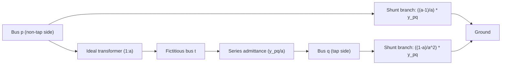

This diagram shows how an off-nominal tap-ratio transformer is converted into a π-equivalent circuit for load-flow studies. The ideal transformer with ratio 1:a is separated from the series admittance, and the resulting two-port equations are rearranged into a series branch plus two shunt branches. The shunt branch on the non-tap side (bus p) has admittance ((a−1)/a)·y_pq, while the tap side (bus q) has ((1−a)/a²)·y_pq. When the tap ratio a = 1, both shunt branches vanish and the transformer reduces to its nominal series admittance. In examinations, you must remember which side is the tap side and which is the non-tap side, since swapping them changes the shunt-branch expressions. This model is essential for correctly building the bus admittance matrix when transformers have off-nominal taps.

### Load-Flow Algorithms: Newton-Raphson vs. Fast Decoupled

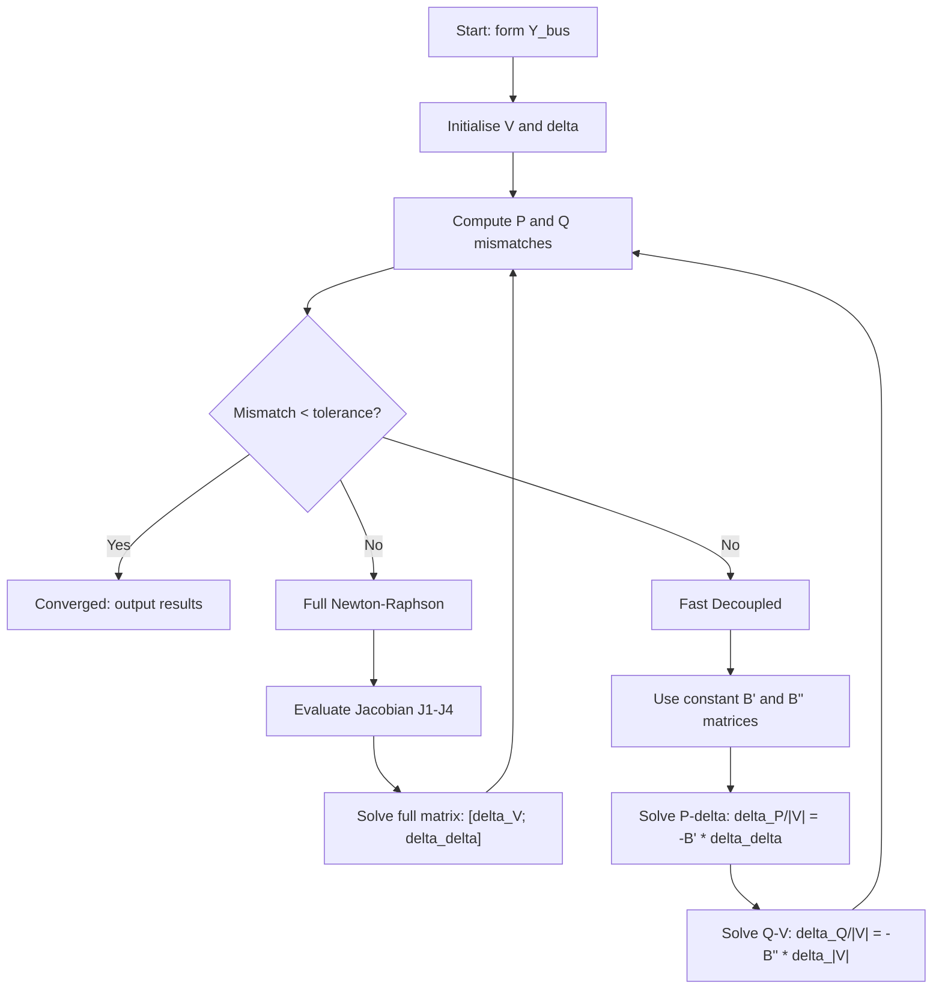

This flowchart contrasts the two load-flow algorithms presented in Lecture 36. The Newton-Raphson method evaluates the full Jacobian matrix at every iteration, requiring more computation per iteration but converging in fewer iterations. The fast decoupled method exploits the approximations that B_ii >> Q_i and |V_i|² ≈ |V_i| to construct constant matrices B′ and B″, which are inverted only once before iteration begins. The decoupled approach alternates between solving the P-δ equation and the Q-|V| equation. For examinations, note that the fast decoupled method may fail to converge on small or unusual systems, but is highly efficient for large transmission networks. The constant matrices B′ and B″ are the key advantage since they eliminate repeated Jacobian evaluations.

### Fault-Analysis Sequence: P Bus and PQV Bus Load Flow

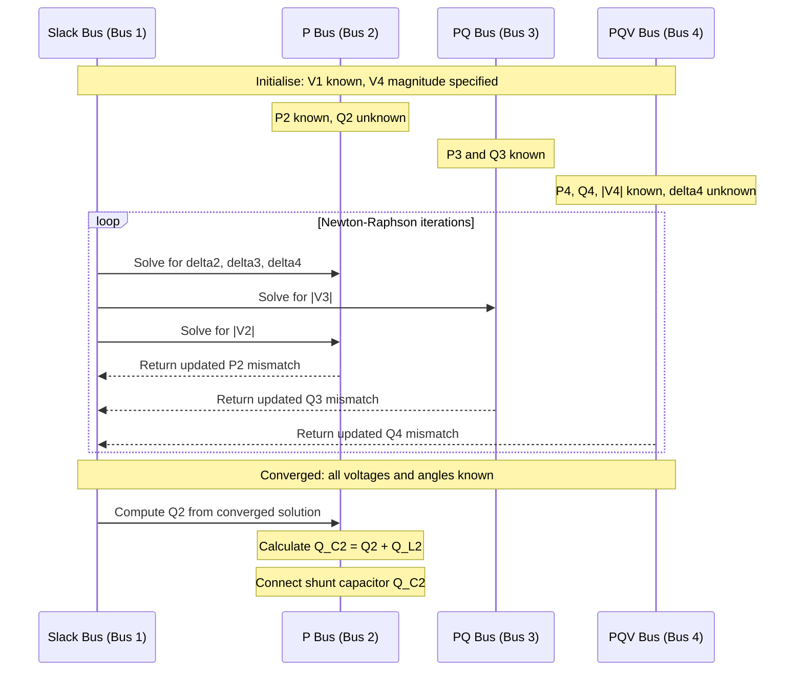

This sequence diagram illustrates the augmented Jacobian procedure for a 4-bus radial network containing a P bus and a PQV bus. The P bus (bus 2) has only real power specified, with reactive power unknown; the PQV bus (bus 4) has P, Q, and voltage magnitude all specified, with only the angle unknown. The resulting Jacobian is 5×5, with unknowns Δδ₂, Δδ₃, Δδ₄, Δ|V₂|, and Δ|V₃|. After convergence, the reactive power injection Q₂ at the P bus is computed, and the required shunt capacitance is found from Q_C2 = Q₂ + Q_L2. The engineering significance is that this procedure allows voltage control of a remote bus by injecting reactive power at a selected generator bus. In practice, each candidate P bus must be tested, and the one giving minimum system loss is selected.

### Stability Reasoning: Economic Dispatch with Generator Limits

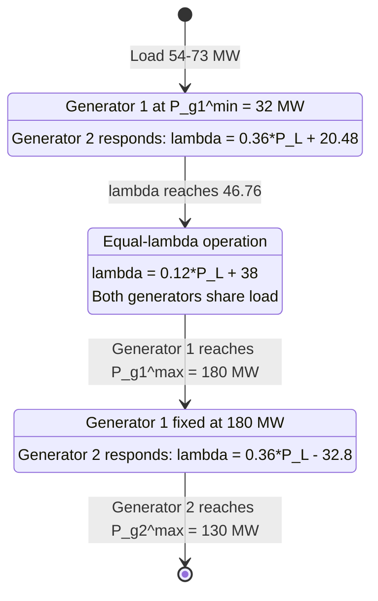

This state diagram captures the piecewise operating regimes for the two-generator economic dispatch example from Lecture 39. The system transitions through three distinct regions as load increases from 54 MW to 310 MW. In Region 1, generator 1 is pinned at its minimum output of 32 MW while generator 2 takes all load increments. Region 2 is the equal-λ regime where both generators share load according to the coordination equation, with system λ given by 0.12·P_L + 38. Region 3 begins when generator 1 hits its maximum of 180 MW at λ = 73.4, after which only generator 2 responds until it reaches its own maximum. The engineering significance is that generator limits fundamentally change the optimal dispatch pattern, and the λ-versus-load curve becomes piecewise linear with slopes determined by whichever generator is free to respond. For the exam, you must be able to identify the transition points (73 MW and 295 MW) and the corresponding λ values (46.76 and 73.4 Rs/MWhr).

## Verified Source Visual Atlas

### Lecture 36 — Off-nominal transformer representation (physical PDF page 607)
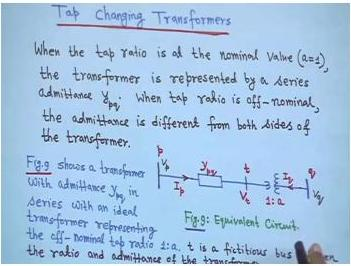
The board shows the transformer represented by a series admittance together with an ideal transformer for an off-nominal tap ratio. The bus labels, fictitious intermediate bus, and ratio 1:a are the main reading cues; small handwritten subscripts are not expanded beyond what is clear.

### Lecture 36 — Transformer π-equivalent model (physical PDF page 612)
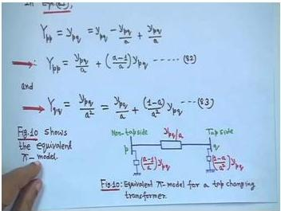
The visual pairs the diagonal-admittance expressions with the equivalent T/π-style network, including the series branch and tap-dependent shunt terms. Use it to see why the shunts vanish at a nominal tap ratio; do not infer any additional numerical parameter not visibly written.

### Lecture 37 — P/PQV Jacobian variable structure (physical PDF page 619)
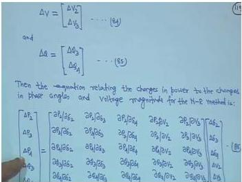
The board lays out the ΔV and Δδ correction vectors and the corresponding block of partial derivatives for the augmented load-flow problem. Read the matrix by matching each mismatch row to its correction column; the small individual derivative labels are not treated as independently verified.

### Lecture 38 — Heat-rate fit converted to a fuel-cost function (physical PDF page 638)
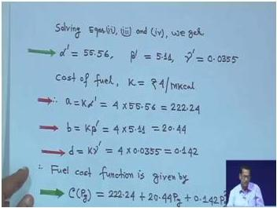
The board shows the solved coefficients from the three-point heat-rate fit, conversion using the fuel price, and the resulting quadratic cost function. The visual supports the sequence fit → convert → write C(Pg); tiny coefficient digits should be cross-checked with the surrounding OCR before numerical reuse.

### Lecture 38 — Equal incremental-cost coordination equation (physical PDF page 648)
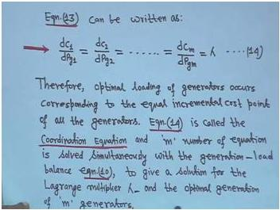
The board states that the incremental costs of the committed generators are equal to the common Lagrange multiplier λ and identifies this as the coordination equation. This is the central optimal-dispatch condition when transmission losses are neglected.

### Lecture 39 — Generator operating limits on incremental-cost curves (physical PDF page 657)
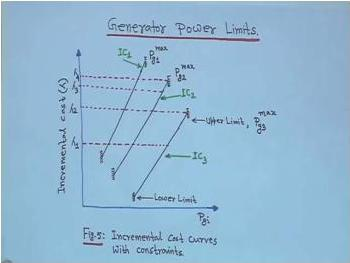
The graph places generator incremental-cost curves against lower and upper real-power limits. Read horizontal λ levels together with each unit’s feasible interval; the exact handwritten axis values are not relied upon where they are too small.

### Lecture 40 — Piecewise λ versus total-load curve (physical PDF page 689)
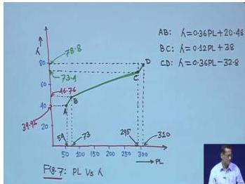
The graph shows the dispatch changing in segments as total load increases: the slope changes when a generator reaches a limit. The segment structure and transition points are the important visual information; verify any small axis annotation from the text before using it as a number.

### Lecture 40 — Lossy economic-dispatch problem statement (physical PDF page 708)
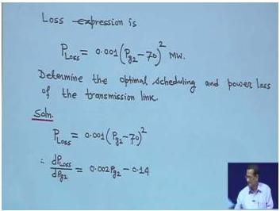
The board introduces a two-bus dispatch example, writes the transmission-loss expression, and asks for optimal scheduling and link loss. It is a useful visual checkpoint that losses make the dispatch nonlinear; the small handwritten constants should not be treated as authoritative without the OCR context.

---

## Common Mistakes and Engineering Checks

### Common Mistakes

1.  **Applying FDLF approximations indiscriminately:** The FDLF method relies on high X/R ratios and small angular differences. For systems with significant resistance (e.g., distribution networks), the method may not converge.

2.  **Misidentifying the tap side in the π-equivalent:** The shunt branch on the tap side is $\left(\frac{1-a}{a^2}\right) y_{pq}$, while on the non-tap side it is $\left(\frac{a-1}{a}\right) y_{pq}$. These are not symmetric.

3.  **Incorrect Jacobian structure for P/PQV buses:** The P bus contributes an unknown voltage magnitude, while the PQV bus does not. The Jacobian must be assembled accordingly.

4.  **Forgetting to add load reactive power:** When calculating the required shunt capacitance at a P bus, use $Q_{C2} = Q_2 + Q_{L2}$, not just $Q_2$.

5.  **Ignoring generator limits in dispatch:** The equal-λ rule applies only when all generators are within their limits. When a generator hits a limit, it is fixed, and the remaining generators operate on equal-λ basis.

6.  **Confusing heat rate units:** $H_i(P_{gi})$ is in MKcal/MWhr, $F_i(P_{gi})$ is in MKcal/hr, and $C_i(P_{gi})$ is in Rs/hr. Always check units.

7.  **Applying penalty factors to the slack bus:** The slack bus penalty factor is always 1. Only non-slack generators have penalty factors computed from the loss formula.

8.  **Misinterpreting λ:** λ is the marginal cost of supplying an additional MW of load, not the average cost.

### Engineering Checks

1.  **Check voltage profile:** After a load flow solution, verify that all bus voltages are within acceptable limits (typically 0.95–1.05 p.u.).

2.  **Check generator limits:** After an economic dispatch, verify that all generator outputs are within their minimum and maximum limits.

3.  **Check power balance:** Total generation must equal total load plus losses. This is a fundamental conservation check.

4.  **Check λ consistency:** In an optimal dispatch, all generators (within limits) should have the same value of $L_i \cdot IC_i$.

5.  **Check loss formula:** The loss formula should be non-negative and should increase as generation moves away from the load center.

---

## Quick Revision Sheet

### Fast Decoupled Load Flow

| Equation | Expression | Key Assumption |
|----------|------------|----------------|
| $\frac{\Delta P}{\|V_i\|} = -B' \Delta \delta$ | P-δ problem | $B_{ii} \gg Q_i$, $\|V_i\|^2 \cong \|V_i\|$ |
| $\frac{\Delta Q}{\|V_i\|} = -B'' \|\Delta V\|$ | Q-V problem | Small angular differences |

- $B'$ and $B''$ are constant matrices, inverted once.
- Proposed by Stott and Alsac (1974).
- May not converge for small systems or high-resistance networks.

### Transformer π-Equivalent

| Element | Value |
|---------|-------|
| Series branch | $y_{pq}/a$ |
| Shunt branch (non-tap side) | $\left(\frac{a-1}{a}\right) y_{pq}$ |
| Shunt branch (tap side) | $\left(\frac{1-a}{a^2}\right) y_{pq}$ |

- When $a = 1$: shunt branches vanish, transformer is just $y_{pq}$.

### P and PQV Buses

| Bus Type | Known | Unknown |
|----------|-------|---------|
| P | $P$ | $Q$, $\|V\|$, $\delta$ |
| PQV | $P$, $Q$, $\|V\|$ | $\delta$ |

- PQV bus voltage controlled by P bus.
- After load flow: $Q_{C2} = Q_2 + Q_{L2}$.

### Economic Dispatch (Neglecting Losses)

- **Objective:** Minimize $C_T = \sum C_i(P_{gi})$
- **Constraint:** $\sum P_{gi} = P_L$
- **Coordination equation:** $\frac{dC_1}{dP_{g1}} = \frac{dC_2}{dP_{g2}} = \ldots = \lambda$
- **λ significance:** $\Delta C_T = \lambda \Delta P_L$

### Economic Dispatch (With Losses)

- **Power balance:** $\sum P_{gi} - P_{Loss} - P_L = 0$
- **Penalty factor:** $L_i = \frac{1}{1 - \partial P_{Loss}/\partial P_{gi}}$
- **Coordination equation:** $L_1 \cdot IC_1 = L_2 \cdot IC_2 = \ldots = \lambda$
- **Slack bus:** $L_1 = 1$

### Fuel Cost Functions

| Quantity | Expression | Units |
|----------|------------|-------|
| Heat rate | $H_i(P_{gi}) = \frac{\alpha_i'}{P_{gi}} + \beta_i' + \gamma_i' P_{gi}$ | MKcal/MWhr |
| Input energy rate | $F_i(P_{gi}) = P_{gi} \cdot H_i(P_{gi})$ | MKcal/hr |
| Fuel cost | $C_i(P_{gi}) = a_i + b_i P_{gi} + d_i P_{gi}^2$ | Rs/hr |
| Incremental cost | $IC_i = b_i + 2d_i P_{gi}$ | Rs/MWhr |

---

## Practice Quiz

**Question 1 (MCQ):** In the fast decoupled load flow, the approximation $|V_i|^2 \cong |V_i|$ is justified because:
(a) The voltage magnitudes are exactly 1.0 p.u. at all buses.
(b) The voltage magnitudes are close to 1.0 p.u. in a well-designed power system.
(c) The reactive power injections are negligible.
(d) The angular differences are small.

> Answer and explanation
> The correct answer is (b). The approximation $|V_i|^2 \cong |V_i|$ is valid because in a well-designed power system, bus voltages are maintained close to the nominal value of 1.0 p.u. The slack bus voltage is taken as exactly 1.0 p.u., and other buses are typically within ±5% of this value. This makes the square of the voltage magnitude approximately equal to the voltage magnitude itself. Option (a) is incorrect because voltages are not exactly 1.0 p.u. at all buses. Option (c) relates to a different approximation ($B_{ii} \gg Q_i$). Option (d) relates to the off-diagonal element approximation.

---

**Question 2 (MCQ):** For a transformer with off-nominal tap ratio $a$, the shunt branch on the tap side of the π-equivalent circuit is:
(a) $\left(\frac{a-1}{a}\right) y_{pq}$
(b) $\left(\frac{1-a}{a^2}\right) y_{pq}$
(c) $\frac{y_{pq}}{a}$
(d) $y_{pq}$

> Answer and explanation
> The correct answer is (b). The π-equivalent circuit has a series branch $y_{pq}/a$, a shunt branch $\left(\frac{a-1}{a}\right) y_{pq}$ on the non-tap side, and a shunt branch $\left(\frac{1-a}{a^2}\right) y_{pq}$ on the tap side. Option (a) is the shunt branch on the non-tap side. Option (c) is the series branch. Option (d) is the simple transformer admittance when $a = 1$.

---

**Question 3 (MCQ):** In a system with a P bus and a PQV bus, which of the following is true?
(a) The P bus has known reactive power.
(b) The PQV bus has unknown voltage magnitude.
(c) The P bus injects reactive power to control the PQV bus voltage.
(d) The PQV bus is always the slack bus.

> Answer and explanation
> The correct answer is (c). The P bus has only real power specified, with reactive power, voltage magnitude, and angle unknown. The P bus injects reactive power to maintain the PQV bus voltage at its specified value. Option (a) is incorrect because the P bus has unknown reactive power. Option (b) is incorrect because the PQV bus has known voltage magnitude. Option (d) is incorrect because the PQV bus is a separate bus type, distinct from the slack bus.

---

**Question 4 (MCQ):** The coordination equation for economic dispatch neglecting losses states that:
(a) All generators operate at the same power output.
(b) All generators operate at the same incremental cost.
(c) All generators operate at the same efficiency.
(d) The generator with the lowest cost operates at maximum output.

> Answer and explanation
> The correct answer is (b). The coordination equation is $\frac{dC_1}{dP_{g1}} = \frac{dC_2}{dP_{g2}} = \ldots = \lambda$, which states that all generators operate at the same incremental cost. Option (a) is incorrect because generators with different cost characteristics will have different optimal outputs. Option (c) is incorrect because efficiency is not the optimization criterion. Option (d) is incorrect because the optimal dispatch depends on incremental costs, not just total costs.

---

**Question 5 (MCQ):** The physical significance of the Lagrange multiplier λ in economic dispatch is:
(a) The average cost of generating one MWh of electricity.
(b) The total fuel cost of the system.
(c) The rate of change of total cost with respect to total load.
(d) The efficiency of the most efficient generator.

> Answer and explanation
> The correct answer is (c). λ is the constant of proportionality relating the cost rate increase (Rs/hr) to the increase in system power demand (MW), i.e., $\Delta C_T = \lambda \Delta P_L$. It represents the marginal cost of supplying an additional MW of load. Option (a) is incorrect because λ is a marginal cost, not an average cost. Option (b) is incorrect because λ is a derivative, not the total cost itself. Option (d) is incorrect because λ relates to cost, not efficiency.

---

**Question 6 (MCQ):** In economic dispatch considering losses, the penalty factor for the slack bus generator is:
(a) Always greater than 1.
(b) Always less than 1.
(c) Always equal to 1.
(d) Dependent on the loss formula.

> Answer and explanation
> The correct answer is (c). The penalty factor for the slack bus is always 1 because the loss function $P_{Loss}$ does not depend on the slack bus generation $P_{g1}$. The slack bus absorbs the power mismatch, so its output is determined by the load flow solution. Options (a) and (b) are incorrect because the slack bus penalty factor is fixed at 1. Option (d) is incorrect because the loss formula does not affect the slack bus penalty factor.

---

**Question 7 (MSQ):** Which of the following are valid approximations used in the fast decoupled load flow?
(a) $B_{ii} \gg Q_i$ (both in per unit)
(b) $|V_i|^2 \cong |V_i|$
(c) $\sin(\theta_{ik} - \delta_i + \delta_k) \approx \sin(\theta_{ik})$
(d) $G_{ii} \gg B_{ii}$

> Answer and explanation
> The correct answers are (a), (b), and (c). The fast decoupled load flow uses three key approximations: (a) the shunt susceptance dominates the reactive power injection, (b) voltage magnitudes are close to 1.0 p.u., and (c) angular differences are small, allowing the sine approximation. Option (d) is incorrect because in power transmission systems, the susceptance $B$ dominates the conductance $G$, not the other way around.

---

**Question 8 (MSQ):** Which of the following statements about the transformer π-equivalent circuit are correct?
(a) When $a = 1$, the shunt branches vanish.
(b) The series branch is $y_{pq}/a$.
(c) The shunt branch on the non-tap side is $\left(\frac{a-1}{a}\right) y_{pq}$.
(d) The shunt branch on the tap side is $\left(\frac{a-1}{a}\right) y_{pq}$.

> Answer and explanation
> The correct answers are (a), (b), and (c). When the tap ratio is nominal ($a = 1$), the shunt branches become zero, and the transformer is simply represented by its series admittance. The series branch is $y_{pq}/a$. The shunt branch on the non-tap side is $\left(\frac{a-1}{a}\right) y_{pq}$. Option (d) is incorrect because the shunt branch on the tap side is $\left(\frac{1-a}{a^2}\right) y_{pq}$, not $\left(\frac{a-1}{a}\right) y_{pq}$.

---

**Question 9 (MSQ):** In economic dispatch with generator limits, which of the following statements are correct?
(a) When a generator reaches its maximum limit, it is fixed at that limit.
(b) The remaining generators continue to operate on an equal-λ basis.
(c) The generator with the lower minimum λ takes load increments first.
(d) The maximum total load is the sum of all generator maximum limits.

> Answer and explanation
> The correct answers are (a), (b), (c), and (d). When a generator reaches its maximum limit, it cannot increase further and is fixed at that limit. The remaining generators continue to operate on an equal-λ basis. The generator with the lower minimum λ takes load increments first, as demonstrated in the worked example where generator 2 (with $\lambda_2^{min} = 39.92$) took load increments before generator 1 (with $\lambda_1^{min} = 46.76$). The maximum total load, neglecting losses, is indeed the sum of all generator maximum limits.

---

**Question 10 (Short Answer):** Define the heat rate $H_i(P_{gi})$ and state its units.

> Answer and explanation
> The heat rate $H_i(P_{gi})$ is the mega kilo calories of heat energy supplied by burning fuel per mega watt hour of electrical energy. Its units are MKcal/MWhr. The heat rate curve is typically U-shaped (concave upward), with the minimum point indicating the most efficient operating point. The typical maximum overall efficiency of a generating unit is 34-39%. For 100% conversion efficiency, the heat rate would be approximately 0.86 MKcal/MWhr, since 1 MKcal = 1.164 MWh.

---

**Question 11 (Short Answer):** What is the purpose of a P bus in a power system with a PQV bus?

> Answer and explanation
> The P bus is a generation bus where only the real power $P$ is specified, while the reactive power $Q$, voltage magnitude $|V|$, and voltage angle $\delta$ are unknown. Its purpose is to control the voltage magnitude of a remotely located PQV bus. The P bus injects reactive power to maintain the PQV bus voltage at its specified value. After the load flow converges, the required shunt capacitance at the P bus is calculated as $Q_{C2} = Q_2 + Q_{L2}$, where $Q_2$ is the reactive power injection at the P bus and $Q_{L2}$ is the load reactive power at that bus. The selection of which bus serves as the P bus is based on minimizing system losses.

---

**Question 12 (Short Answer):** State the coordination equation for economic dispatch considering transmission losses.

> Answer and explanation
> The coordination equation for economic dispatch considering transmission losses is:
> $$
> L_1\cdot\frac{dC_1}{dP_{g1}} = L_2\cdot\frac{dC_2}{dP_{g2}} = \ldots = L_m\cdot\frac{dC_m}{dP_{gm}} = \lambda
> $$
> where $L_i$ is the penalty factor for generator $i$, defined as:
> $$
> L_i = \frac{1}{1 - \partial P_{Loss}/\partial P_{gi}}
> $$
> For the slack bus generator, $L_1 = 1$ because the loss function does not depend on the slack bus generation. The penalty factor accounts for the fact that increasing a non-slack generator's output affects transmission losses.

---

**Question 13 (Short Answer):** Explain why the incremental cost is linear for a quadratic fuel cost function.

> Answer and explanation
> The fuel cost function is typically approximated as a quadratic function of generator output:
> $$
> C_i(P_{gi}) = a_i + b_i P_{gi} + d_i P_{gi}^2
> $$
> The incremental cost is the derivative of the cost function with respect to power output:
> $$
> IC_i = \frac{dC_i}{dP_{gi}} = b_i + 2d_i P_{gi}
> $$
> Since the derivative of a quadratic function is linear, the incremental cost is a linear function of $P_{gi}$. If a cubic approximation were used for the cost function, the incremental cost would be quadratic. The quadratic approximation is generally accurate enough for practical purposes.

---

**Question 14 (Numerical):** A 50 MW generating unit has the following heat rate data: 10 MKcal/MWhr at 25% rating, 8.6 MKcal/MWhr at 40% rating, and 8 MKcal/MWhr at 100% rating. The cost of fuel is Rs 4 per MKcal. Calculate the incremental cost at 100% loading.

> Answer and explanation
> First, convert the percentages to MW:
> - 25% of 50 MW = 12.5 MW
> - 40% of 50 MW = 20 MW
> - 100% of 50 MW = 50 MW
>
> Using the heat rate approximation $H(P_g) = \frac{\alpha'}{P_g} + \beta' + \gamma' P_g$, we set up three equations:
> $$
> \frac{\alpha'}{12.5} + \beta' + 12.5\gamma' = 10
> $$
> $$
> \frac{\alpha'}{20} + \beta' + 20\gamma' = 8.6
> $$
> $$
> \frac{\alpha'}{50} + \beta' + 50\gamma' = 8
> $$
>
> Solving these equations gives:
> $$
> \alpha' = 55.56, \quad \beta' = 5.11, \quad \gamma' = 0.0355
> $$
>
> With fuel cost $k = 4$ Rs/MKcal:
> $$
> a = k\alpha' = 222.24, \quad b = k\beta' = 20.44, \quad d = k\gamma' = 0.142
> $$
>
> The incremental cost is:
> $$
> IC = \frac{dC}{dP_g} = b + 2dP_g = 20.44 + 2 \times 0.142 \times 50 = 20.44 + 14.2 = 34.64 \text{ Rs/MWhr}
> $$

---

**Question 15 (Numerical):** Two generators have incremental cost functions $IC_1 = 0.18 P_{g1} + 41$ and $IC_2 = 0.36 P_{g2} + 32$ Rs/MWhr. The generator limits are $32 \le P_{g1} \le 180$ MW and $22 \le P_{g2} \le 130$ MW. For a total load of 100 MW, determine the optimal dispatch.

> Answer and explanation
> For a load of 100 MW, both generators are within their limits and operate on an equal-λ basis:
> $$
> 0.18 P_{g1} + 41 = 0.36 P_{g2} + 32 = \lambda
> $$
>
> From the power balance: $P_{g1} + P_{g2} = 100$
>
> From the equal-λ condition:
> $$
> 0.18 P_{g1} + 41 = 0.36 P_{g2} + 32
> $$
> $$
> 0.18 P_{g1} - 0.36 P_{g2} = -9
> $$
>
> Substituting $P_{g2} = 100 - P_{g1}$:
> $$
> 0.18 P_{g1} - 0.36(100 - P_{g1}) = -9
> $$
> $$
> 0.18 P_{g1} - 36 + 0.36 P_{g1} = -9
> $$
> $$
> 0.54 P_{g1} = 27
> $$
> $$
> P_{g1} = 50 \text{ MW}
> $$
>
> Therefore:
> $$
> P_{g2} = 100 - 50 = 50 \text{ MW}
> $$
>
> The system λ is:
> $$
> \lambda = 0.18 \times 50 + 41 = 50 \text{ Rs/MWhr}
> $$
>
> Both generators are within their limits, so this dispatch is valid.

---

**Question 16 (Numerical):** For the two-generator system in Question 15, calculate the saving per hour from optimal dispatch compared to equal sharing for a total load of 266.66 MW.

> Answer and explanation
> From the tabulated solution, the optimal dispatch at $P_L = 266.66$ MW is $P_{g1} = 161.11$ MW and $P_{g2} = 105.55$ MW.
>
> The cost functions are obtained by integrating the IC functions:
> $$
> C_1 = 0.09 P_{g1}^2 + 41 P_{g1} + K_1
> $$
> $$
> C_2 = 0.18 P_{g2}^2 + 32 P_{g2} + K_2
> $$
>
> **Optimal dispatch cost:**
> $$
> C_{opt} = [0.09(161.11)^2 + 41(161.11)] + [0.18(105.55)^2 + 32(105.55)] + K_1 + K_2
> $$
> $$
> C_{opt} = [2336.2 + 6605.5] + [2005.3 + 3377.6] + K_1 + K_2
> $$
> $$
> C_{opt} = 14324 + K_1 + K_2 \text{ Rs/hr}
> $$
>
> **Equal sharing cost** ($P_{g1} = P_{g2} = 133.33$ MW):
> $$
> C_{eq} = [0.09(133.33)^2 + 41(133.33)] + [0.18(133.33)^2 + 32(133.33)] + K_1 + K_2
> $$
> $$
> C_{eq} = [1600 + 5466.5] + [3200 + 4266.6] + K_1 + K_2
> $$
> $$
> C_{eq} = 14533 + K_1 + K_2 \text{ Rs/hr}
> $$
>
> **Saving:**
> $$
> \text{Saving} = C_{eq} - C_{opt} = 14533 - 14324 = 209 \text{ Rs/hr}
> $$
>
> The integration constants $K_1$ and $K_2$ cancel in the savings calculation.

---

**Question 17 (Scenario):** A power system engineer runs a fast decoupled load flow on a distribution network with predominantly resistive lines (low X/R ratio). The algorithm fails to converge. Explain why and suggest an alternative.

> Answer and explanation
> The fast decoupled load flow relies on the assumption that transmission lines are predominantly inductive (high X/R ratio). This assumption justifies the decoupling of the P-δ and Q-V problems. In a distribution network with predominantly resistive lines, this assumption breaks down:
>
> 1. Real power flow is no longer primarily determined by voltage angles; voltage magnitudes also play a significant role.
> 2. Reactive power flow is no longer primarily determined by voltage magnitudes; voltage angles also play a significant role.
>
> As a result, the decoupled equations $\frac{\Delta P}{|V_i|} = -B' \Delta \delta$ and $\frac{\Delta Q}{|V_i|} = -B'' |\Delta V|$ do not accurately represent the system behavior, and the algorithm may fail to converge.
>
> **Alternative:** The engineer should use the full Newton-Raphson method, which does not rely on the decoupling assumptions. The Newton-Raphson method updates the full Jacobian matrix at each iteration, accounting for all couplings between P, Q, δ, and |V|. While computationally more expensive, it is more robust and will converge for systems where the FDLF assumptions are violated.

---

**Question 18 (Scenario):** In an economic dispatch study, a generator located far from the load center has a high penalty factor. The system operator proposes to increase its output to meet a load increase. Is this economically sound? Explain.

> Answer and explanation
> No, this is not economically sound. A high penalty factor means that increasing this generator's output significantly increases transmission losses. The coordination equation for economic dispatch considering losses is:
> $$
> L_i \cdot IC_i = \lambda
> $$
> where $L_i$ is the penalty factor. A high penalty factor means that the effective cost contribution of this generator is high. To maintain the equality $L_i \cdot IC_i = \lambda$, the generator with a high penalty factor must have a lower incremental cost $IC_i$ compared to generators with lower penalty factors.
>
> In practical terms, when a load increase occurs, the system operator should first increase the output of generators with lower penalty factors (i.e., generators located closer to the load center). These generators will have a smaller impact on transmission losses. The generator with the high penalty factor should only be increased after other, more favorably located generators have reached their limits.
>
> The penalty factor method ensures that the total cost, including the cost of losses, is minimized. Ignoring the penalty factor and increasing the output of the distant generator would result in higher total operating costs due to increased losses.

---

## Source Exercise Coverage

The following source exercises and worked examples were covered in this week's notes:

| Source Exercise | Coverage Status |
|-----------------|-----------------|
| Example 1 (Lecture 37-38): Heat rate and fuel cost calculation | Fully covered in Lectures 37 and 38 |
| Example 2 (Lecture 39): Two-generator dispatch with limits | Fully covered in Lecture 39 |
| Example 2 (Lecture 40): Savings from optimal dispatch | Fully covered in Lecture 40 |
| Example 4 (Lecture 40): Two-bus system with losses | Setup provided; iterative solution deferred to subsequent lecture |

No separate assignment screenshots were supplied for this week. All source questions and exercises that were materially recoverable from the evidence digest have been included.

---

## Source Provenance

- **Course:** NPTEL Power System Analysis
- **Instructor:** Prof. Debapriya Das, IIT Kharagpur
- **Extraction:** Mistral OCR 4 extraction
- **Drafting:** DeepSeek V4 Flash drafting
- **Review:** Locally reviewed and generated on 2026-08-05

*Note: The AI models listed above were used as drafting and extraction tools. They are not authoritative sources for the technical content. All technical material is derived from the NPTEL course lectures by Prof. Debapriya Das.*
