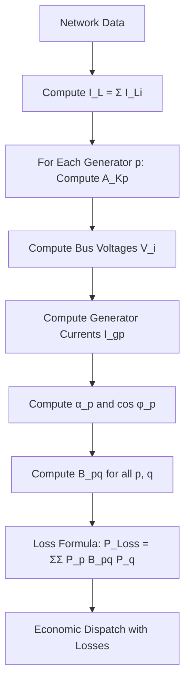
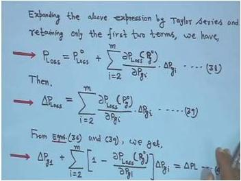
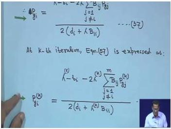
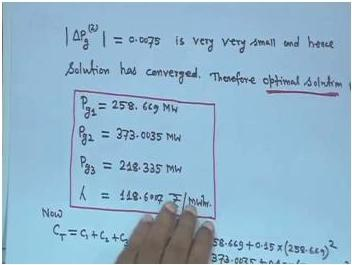
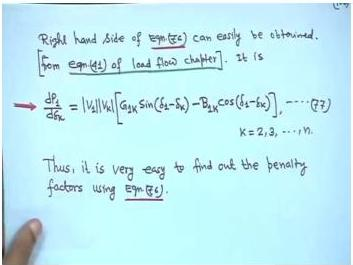
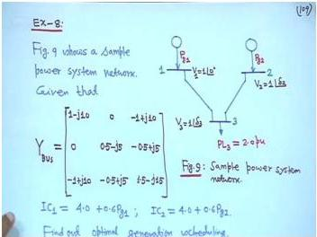
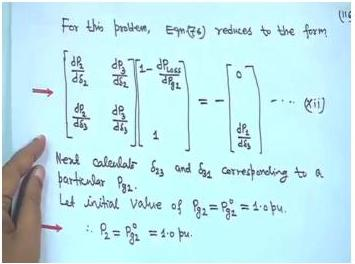
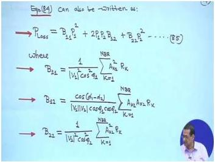
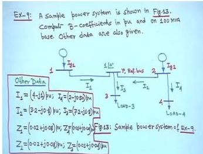

# Week 9 - Economic Operation and Three-Phase Faults

## Orientation

Welcome to Week 9 of my Power System Analysis journey. This week, we dive deep into the **economic operation of power systems** — the problem of deciding how much power each generating unit should produce to serve the load at minimum cost while respecting physical constraints. This is the heart of what makes power systems economically viable: we cannot simply run every generator at full output; we must find the optimal operating point that balances fuel costs, transmission losses, and generator limits.

The week is structured around five lectures that build on each other. We start with the fundamental coordination equations that define economic dispatch, then progressively add complexity: first transmission losses, then iterative solution techniques (gradient methods), then the general method for computing penalty factors using load flow results, and finally the derivation of the B-coefficient loss formula itself.

The second major theme of this week is **three-phase fault studies** — the analysis of what happens when a symmetrical fault occurs in a power system. This is critical for designing protection systems and ensuring that equipment can withstand fault currents.

Let me be honest about the difficulty: this week's material is mathematically intensive. The derivations require careful attention to notation, and the numerical examples require meticulous arithmetic. But the reward is a deep understanding of how modern energy management systems actually solve the economic dispatch problem in real time.

---

## Learning Outcomes

By the end of this week, I will be able to:

1. **Formulate the economic dispatch problem** as a constrained optimization problem using Lagrange multipliers, and derive the coordination equations for both lossless and lossy systems.

2. **Compute optimal generation schedules** using the lambda-iteration method and the gradient method, including handling generator limits correctly.

3. **Explain the physical significance of λ** (the incremental cost of delivered power) and why it remains the same whether or not transmission losses are considered.

4. **Apply penalty factors** to modify incremental costs when transmission losses are present, and compute them using the B-coefficient method.

5. **Derive the B-coefficient loss formula** from first principles using current distribution factors, including the key assumptions about load current phase angles and X/R ratios.

6. **Compute B-coefficients numerically** for a small power system, including bus voltages, generator currents, power factors, and the resulting loss coefficients.

7. **Use the gradient method** to iteratively solve the economic dispatch problem, both with and without losses, and verify convergence.

8. **Analyze three-phase faults** in power systems, computing fault currents and understanding their impact on system protection.

---

## Syllabus Map

| Lecture | Topic | Physical PDF Pages |
|---------|-------|-------------------|
| Lecture 41 | Optimal System Operation (Contd.): Losses, Penalty Factors, Physical Significance of λ, Gradient Method Introduction | 709-723 |
| Lecture 42 | Optimal System Operation (Contd.): B-Coefficient Method, Iterative Solution with Losses, Worked Examples | 724-747 |
| Lecture 43 | Optimal System Operation (Contd.): Convergence of Lossy Dispatch, General Penalty Factor Method via Load Flow | 748-760 |
| Lecture 44 | Optimal System Operation (Contd.): 3-Bus Example, Transmission Loss Formula Derivation | 761-773 |
| Lecture 45 | Three-Phase Fault Studies: Loss Formula Derivation Continued, B-Coefficient Computation | 774-786 |

---

## Lecture 41: Optimal System Operation (Contd.) — Losses and Penalty Factors

### Physical Intuition

When I studied economic dispatch without losses in Week 8, the coordination equation was beautifully simple: every generator operates at the same incremental cost λ. But real power systems have transmission losses — power is lost as heat in the lines. This means that if I increase generation at a distant plant by 1 MW, only a fraction of that MW actually reaches the load; the rest is dissipated in the transmission network.

The key insight is that **generators that are "closer" to the load (electrically speaking) should be favored** because they cause fewer losses. This is captured by the **penalty factor**: a generator that causes more losses gets a higher penalty factor, which effectively increases its incremental cost, making it less attractive to dispatch.

Think of it like this: if I have two suppliers, one next door and one across town, and both charge the same price per unit, I would prefer the one next door because I save on delivery costs. The penalty factor is the mathematical way of encoding this preference in the economic dispatch problem.

### Complete Theory

#### Problem Setup

We have $m$ generating units. The total fuel cost is:

$$C_T = \sum_{i=1}^{m} C_i(P_{gi})$$

where $C_i(P_{gi})$ is the fuel cost of unit $i$ in ₹/hr, and $P_{gi}$ is the real power generation of unit $i$ in MW.

The power balance equation with losses is:

$$\sum_{i=1}^{m} P_{gi} - P_{Loss} = P_L$$

where $P_L$ is the total load and $P_{Loss}$ is the total transmission loss.

#### Derivation of Coordination Equations with Losses

Using the method of Lagrange multipliers, we form:

$$\mathcal{L} = C_T + \lambda(P_L + P_{Loss} - \sum_{i=1}^{m} P_{gi})$$

Taking the partial derivative with respect to each $P_{gi}$:

$$\frac{\partial \mathcal{L}}{\partial P_{gi}} = \frac{dC_i}{dP_{gi}} + \lambda\left(\frac{\partial P_{Loss}}{\partial P_{gi}} - 1\right) = 0$$

This gives the **coordination equation**:

$$\frac{dC_i}{dP_{gi}} + \lambda \frac{dP_{Loss}}{dP_{gi}} = \lambda, \quad i = 1, 2, \dots, m$$

Rearranging:

$$\frac{dC_i}{dP_{gi}} = \lambda\left(1 - \frac{dP_{Loss}}{dP_{gi}}\right)$$

$$\lambda = \frac{\frac{dC_i}{dP_{gi}}}{1 - \frac{dP_{Loss}}{dP_{gi}}}$$

#### Penalty Factors

Define the **penalty factor** for unit $i$ as:

$$L_i = \frac{1}{1 - \frac{dP_{Loss}}{dP_{gi}}}$$

Then the coordination equation becomes:

$$L_i \cdot \frac{dC_i}{dP_{gi}} = \lambda$$

For the slack/reference generator (say unit 1), we typically have $L_1 = 1$ because the slack generator absorbs the imbalance, and its generation does not directly appear in the loss formula (or we define it that way).

#### Physical Significance of λ with Losses

The professor derives an important result showing that λ retains its physical meaning even with losses. Starting from:

$$\Delta C_T = \sum_{i=1}^{m} \frac{dC_i(P_{gi}^0)}{dP_{gi}} \Delta P_{gi}$$

and the power balance:

$$\sum_{i=1}^{m} \Delta P_{gi} - \Delta P_{Loss} = \Delta P_L$$

Using the Taylor series expansion of the loss:

$$P_{Loss} = P_{Loss}^0 + \sum_{i=2}^{m} \frac{\partial P_{Loss}(P_g^0)}{\partial P_{gi}} \cdot \Delta P_{gi}$$

we get:

$$\Delta P_{Loss} = \sum_{i=2}^{m} \frac{\partial P_{Loss}(P_g^0)}{\partial P_{gi}} \cdot \Delta P_{gi}$$

Substituting into the power balance:

$$\Delta P_{g1} + \sum_{i=2}^{m}\left[1 - \frac{\partial P_{Loss}(P_g^0)}{\partial P_{gi}}\right]\Delta P_{gi} = \Delta P_L$$

The terms in brackets are the reciprocals of penalty factors:

$$1 - \frac{\partial P_{Loss}(P_g^0)}{\partial P_{gi}} = L_i^{-1}$$

Since $L_1 = 1.0$:

$$\sum_{i=1}^{m} L_i^{-1} \Delta P_{gi} = \Delta P_L$$

Using the coordination condition $L_i \times IC_i = \lambda$:

$$\Delta C_T = \lambda \sum_{i=1}^{m} L_i^{-1} \Delta P_{gi} = \lambda \Delta P_L$$

**Physical interpretation:** λ represents the increment in cost (₹/hr) per increment in load demand (MW). This is identical to the lossless case — λ is the marginal cost of serving an additional MW of load, regardless of whether losses are considered.

### Worked Example: Optimal Scheduling with Transmission Loss (Example 4 Continuation)

**Given:**
- Loss expression: $P_{Loss} = 0.001(P_{g2} - 70)^2$ MW
- Loads: $PL_1 = 300$ MW, $PL_2 = 70$ MW, total $= 370$ MW
- Cost functions: $C_1 = 500 + 41P_{g1} + 0.175P_{g1}^2$, $C_2 = 500 + 41P_{g2} + 0.175P_{g2}^2$

**Step 1 — Derivative of loss:**

$$\frac{dP_{Loss}}{dP_{g2}} = 0.002P_{g2} - 0.14$$

**Step 2 — Penalty factors:**
- $L_1 = 1$ (slack/reference generator)
- $L_2 = \frac{1}{1 - \frac{dP_{Loss}}{dP_{g2}}} = \frac{1}{1.14 - 0.002P_{g2}}$

**Step 3 — Coordination equations:**
- Unit 1: $L_1 \frac{dC_1}{dP_{g1}} = 0.35P_{g1} + 41 = \lambda$
- Unit 2: $L_2 \frac{dC_2}{dP_{g2}} = \frac{0.35P_{g2} + 41}{1.14 - 0.002P_{g2}} = \lambda$

**Step 4 — Solving for generations:**
- From unit 1: $P_{g1} = \frac{\lambda - 41}{0.35}$
- From unit 2: $P_{g2} = \frac{1.14\lambda - 41}{0.35 + 0.002\lambda}$

**Key observation:** $P_{g1}$ vs λ is linear (since $L_1 = 1$), but $P_{g2}$ vs λ is **non-linear** (λ appears in both numerator and denominator). Therefore, **iterative solution is required**.

**Given optimal solution (obtained iteratively):**
- λ = 117.6 Rs/MWhr
- $P_{g1}$ = 218.857 MW
- $P_{g2}$ = 159.029 MW

**Step 5 — Power loss verification:**

$$P_{Loss} = 0.001(159.029 - 70)^2 = 7.926 \text{ MW}$$

**Step 6 — Check power balance:**

$$P_{g1} + P_{g2} - P_{Loss} = 218.857 + 159.029 - 7.926 = 369.96 \text{ MW} \approx 370 \text{ MW} = PL_1 + PL_2$$

**Conclusion:** λ = 117.6 is the correct solution.

### Gradient Method for λ Determination (Without Losses)

When losses are neglected, we can solve for λ directly, but the professor introduces the gradient method as a systematic iterative approach.

**Starting from the coordination equation:**

$$\frac{dC_i}{dP_{gi}} = \lambda$$

With quadratic cost $C_i = a_i + b_i P_{gi} + d_i P_{gi}^2$:

$$b_i + 2d_i P_{gi} = \lambda$$

Therefore:

$$P_{gi} = \frac{\lambda - b_i}{2d_i}$$

**Power balance (no losses):**

$$\sum_{i=1}^{m} P_{gi} = P_L$$

**Define the function:**

$$f(\lambda) = \sum_{i=1}^{m} P_{gi} = \sum_{i=1}^{m} \frac{\lambda - b_i}{2d_i}$$

**Gradient method formulation:**
- Expand $f(\lambda)$ in Taylor series about operating point $\lambda^K$ (first two terms only):

$$f(\lambda)^K + \left(\frac{df(\lambda)}{d\lambda}\right)^K \Delta\lambda^K = P_L$$

- **Correction formula:**

$$\Delta\lambda^K = \frac{P_L - f(\lambda)^K}{\left(\frac{df(\lambda)}{d\lambda}\right)^K}$$

- **Mismatch definition:**

$$\Delta P_g^K = P_L - \sum_{i=1}^{m} P_{gi}^K$$

- **Derivative:**

$$\frac{df(\lambda)}{d\lambda} = \sum_{i=1}^{m} \frac{1}{2d_i}$$

- **Combining:**

$$\Delta \lambda^{(K)} = \frac{\Delta P_g^{(K)}}{\sum_{i=1}^{m} \frac{1}{2d_i}}$$

- **Update rule:**

$$\lambda^{(K+1)} = \lambda^{(K)} + \Delta \lambda^{(K)}$$

**Convergence criterion:** Continue until $\Delta P_g^{(K)}$ is less than a specified accuracy.

### Loss Formula and Coordination with B Coefficients

The professor introduces the quadratic loss formula:

$$P_{Loss} = \sum_{i=1}^{m} \sum_{j=1}^{m} P_{gi} B_{ij} P_{gj}$$

This formula will be derived later in the course (Lecture 45). For now, it is assumed as given.

**Coordination equation with losses:**

$$\frac{dC_i}{dP_{gi}} + \lambda \frac{dP_{Loss}}{dP_{gi}} = \lambda, \quad i=1,2,\dots,m$$

**Alternative form:**

$$\frac{dC_i}{dP_{gi}} = \lambda - \lambda \frac{dP_{Loss}}{dP_{gi}} = \lambda \left(1 - \frac{dP_{Loss}}{dP_{gi}}\right)$$

$$\lambda = \frac{\frac{dC_i}{dP_{gi}}}{1 - \frac{dP_{Loss}}{dP_{gi}}}$$

### Modelling Assumptions

1. **Quadratic cost functions:** $C_i = a_i + b_i P_{gi} + d_i P_{gi}^2$ — this is a standard approximation that captures the convex nature of fuel costs.

2. **Loss formula:** The B-coefficient formula $P_{Loss} = \sum_i \sum_j P_{gi} B_{ij} P_{gj}$ is assumed valid. Its derivation (Lecture 45) requires:
   - All load currents have the same phase angle
   - The X/R ratio is the same for all network branches

3. **Slack bus convention:** $L_1 = 1$ for the reference generator. This is a modeling choice — the slack generator absorbs the imbalance.

4. **Generator limits:** Initially neglected, but handled by fixing generators at their limits when violated.

### Algorithm: Gradient Method for Economic Dispatch (No Losses)

```
1. Initialize: Choose λ⁽¹⁾ (e.g., 50 Rs/MWhr), set K = 1
2. Compute generations: P_gi⁽ᴷ⁾ = (λ⁽ᴷ⁾ - b_i) / (2d_i) for all i
3. Compute mismatch: ΔP_g⁽ᴷ⁾ = P_L - Σ P_gi⁽ᴷ⁾
4. If |ΔP_g⁽ᴷ⁾| < ε, STOP — solution converged
5. Compute correction: Δλ⁽ᴷ⁾ = ΔP_g⁽ᴷ⁾ / Σ(1/(2d_i))
6. Update: λ⁽ᴷ⁺¹⁾ = λ⁽ᴷ⁾ + Δλ⁽ᴷ⁾
7. Set K = K + 1, go to step 2
```

### Practical Engineering Context

The gradient method (also called the λ-iteration method) is the foundation of **economic dispatch** in energy management systems (EMS). In real power systems, this calculation runs every few minutes to determine the optimal set points for all generators. The method is fast, reliable, and easy to implement in real-time systems.

The penalty factor concept is crucial for **locational marginal pricing** (LMP) in electricity markets. Generators at different locations have different effective costs because of transmission losses and congestion. The penalty factor is a simplified version of this concept.

### Exam Traps

1. **Non-linearity trap:** When losses are present, $P_{g2}$ vs λ is non-linear. Do NOT try to solve directly — you must iterate.

2. **Slack bus penalty factor:** $L_1 = 1$ always for the slack generator. Do not compute it from the formula.

3. **Sign of loss derivative:** $\frac{dP_{Loss}}{dP_{gi}}$ can be positive or negative. A negative derivative means the penalty factor is less than 1, which would encourage more generation from that unit.

4. **Units:** λ is in Rs/MWhr (or USD/MWhr). Ensure all costs are in consistent units.

### Lecture-End Recap

- The coordination equation with losses is $\frac{dC_i}{dP_{gi}} + \lambda \frac{dP_{Loss}}{dP_{gi}} = \lambda$
- Penalty factors modify incremental costs: $L_i \cdot IC_i = \lambda$
- λ represents the marginal cost of serving additional load, whether or not losses are considered
- The gradient method iteratively updates λ based on the power mismatch
- The B-coefficient loss formula is introduced but derived later

---

## Lecture 42: Optimal System Operation (Contd.) — B-Coefficient Method

### Physical Intuition

Now we get into the practical implementation of economic dispatch with losses. The B-coefficient method provides a systematic way to account for transmission losses. The key mathematical step is differentiating the quadratic loss formula to get the incremental loss — this tells us how much additional loss is caused by increasing generation at each plant.

The iterative solution method works like this: we guess a value of λ, compute the corresponding generations, check if the power balance is satisfied (generation = load + loss), and if not, adjust λ. The adjustment is proportional to the mismatch, scaled by how sensitive the total generation is to λ.

### Complete Theory

#### Derivative of Loss with Respect to Generation

From the quadratic loss formula:

$$P_{Loss} = \sum_{i=1}^{m} \sum_{j=1}^{m} P_{gi} B_{ij} P_{gj}$$

The derivative with respect to $P_{gi}$ is:

$$\frac{dP_{Loss}}{dP_{gi}} = 2 \sum_{j=1}^{m} B_{ij} P_{gj}$$

**Illustrative example (m = 2):**

$$P_{Loss} = P_{g1}B_{11}P_{g1} + P_{g1}B_{12}P_{g2} + P_{g2}B_{21}P_{g1} + P_{g2}B_{22}P_{g2}$$

$$= P_{g1}^{2}B_{11} + B_{12}P_{g1}P_{g2} + B_{21}P_{g1}P_{g2} + B_{22}P_{g2}^{2}$$

If $B_{12} = B_{21}$:

$$P_{Loss} = P_{g1}^{2}B_{11} + 2B_{12}P_{g1}P_{g2} + B_{22}P_{g2}^{2}$$

**Derivative with respect to $P_{g1}$:**

$$\frac{dP_{Loss}}{dP_{g1}} = 2P_{g1}B_{11} + 2B_{12}P_{g2}$$

This confirms the factor of 2 in the general formula.

#### Iterative Solution with Losses

Combining the coordination equation with the loss derivative:

$$b_i + 2d_iP_{gi} + 2\lambda \sum_{j=1}^{m} B_{ij}P_{gj} = \lambda$$

Separating the $j = i$ term:

$$b_i + 2d_iP_{gi} + 2\lambda B_{ii}P_{gi} + 2\lambda \sum_{\substack{j=1 \\ j \neq i}}^{m} B_{ij}P_{gj} = \lambda$$

**Solving for $P_{gi}$:**

$$P_{gi} = \frac{\lambda - b_i - 2\lambda \sum_{\substack{j=1 \\ j \neq i}}^{m} B_{ij}P_{gj}}{2(d_i + \lambda B_{ii})}$$

**At the $k^{th}$ iteration:**

$$P_{gi}^{(K)} = \frac{\lambda^{(K)} - b_i - 2\lambda^{(K)} \sum_{\substack{j=1 \\ j \neq i}}^{m} B_{ij}P_{gj}^{(K)}}{2(d_i + \lambda^{(K)} B_{ii})}$$

**Power balance with losses:**

$$\sum_{i=1}^{m} P_{gi}^{(K)} = P_L + P_{Loss}^{(K)}$$

**Define:**

$$f(\lambda)^{(K)} = P_L + P_{Loss}^{(K)}$$

**Taylor series expansion about operating point $\lambda^K$:**

$$f(\lambda)^{(K)} + \frac{df(\lambda)^{(K)}}{d\lambda}\Delta\lambda^{(K)} = P_L + P_{Loss}^{(K)}$$

**Correction formula:**

$$\Delta\lambda^{(k)} = \frac{\Delta P_g^{(k)}}{\sum_{i=1}^m \left(\frac{dP_{gi}}{d\lambda}\right)^{(k)}}$$

**Mismatch:**

$$\Delta P_g^{(k)} = P_L + P_{Loss}^{(k)} - f(\lambda)^{(k)}$$

**Derivative expression:**

$$\sum_{i=1}^m \left(\frac{dP_{gi}}{d\lambda}\right)^{(k)} = \sum_{i=1}^m \left[ \frac{d_i + B_{ii}b_i - 2d_i \sum_{\substack{j=1 \\ j \neq i}}^{m} B_{ij}P_{gj}^{(k)}}{2(d_i + \lambda^{(k)}B_{ii})^2} \right]$$

**Update rule:**

$$\lambda^{(K+1)} = \lambda^{(K)} + \Delta\lambda^{(K)}$$

**Alternative mismatch form:**

$$\Delta P_g^{(K)} = P_L + P_{Loss}^{(K)} - \sum_{i=1}^{m} P_{gi}^{(K)}$$

**Convergence:** Continue until the absolute difference is less than ε.

#### Special Case: Approximate Loss Formula (Diagonal Only)

**Approximate loss formula:**

$$P_{Loss} = \sum_{i=1}^{m} B_{ii} P_{gi}^2$$

This corresponds to setting $B_{ij} = 0.0$ for $i \neq j$.

**Generation formula reduces to:**

$$P_{gi}^{(K)} = \frac{\lambda^{(K)} - b_i}{2(d_i + \lambda^{(K)}B_{ii})}$$

**Derivative sum reduces to:**

$$\sum_{i=1}^{m} \left( \frac{dP_{gi}}{d\lambda} \right)^{(K)} = \sum_{i=1}^{m} \frac{d_i + B_{ii}b_i}{2(d_i + \lambda^{(K)}B_{ii})^2}$$

### Worked Example 5: Gradient Method Without Losses

**Problem statement:**
Fuel cost functions for three thermal plants (₹/hr):

$$C_1 = 500 + 41 P_{g1} + 0.15 P_{g1}^2$$
$$C_2 = 400 + 44 P_{g2} + 0.1 P_{g2}^2$$
$$C_3 = 300 + 40 P_{g3} + 0.18 P_{g3}^2$$

Neglect line losses and generator limits. Find optimal dispatch and total fuel cost by iterative technique using gradient method. Total load = 850 MW.

**Data extraction:**
$$a_1 = 500, \quad b_1 = 41, \quad d_1 = 0.15$$
$$a_2 = 400, \quad b_2 = 44, \quad d_2 = 0.10$$
$$a_3 = 300, \quad b_3 = 40, \quad d_3 = 0.18$$

**Using the generation formula:**

$$P_{gi}^{(K)} = \frac{\lambda^{(K)} - b_i}{2d_i}$$

**Initial value:** $\lambda^{(1)} = 50$

**Iteration 1:**

$$P_{g1}^{(1)} = \frac{50 - 41}{2 \times 0.15} = 30 \text{ MW}$$

$$P_{g2}^{(1)} = \frac{50 - 44}{2 \times 0.1} = 30 \text{ MW}$$

$$P_{g3}^{(1)} = \frac{50 - 40}{2 \times 0.18} = 27.77 \text{ MW}$$

**Mismatch:**

$$\Delta P_g^{(1)} = 850 - (30 + 30 + 27.77) = 762.23 \text{ MW}$$

**Using the correction formula:**

$$\Delta \lambda^{(1)} = \frac{762.23}{\frac{1}{2\times0.15} + \frac{1}{2\times0.10} + \frac{1}{2\times0.18}} = 68.007$$

**Iteration 2:**

$$\lambda^{(2)} = 50 + 68.007 = 118.6007$$

$$P_{g1}^{(2)} = \frac{118.6007 - 41}{2 \times 0.15} = 258.669 \text{ MW}$$

$$P_{g2}^{(2)} = \frac{118.6007 - 44}{2 \times 0.10} = 373.0035 \text{ MW}$$

$$P_{g3}^{(2)} = \frac{118.6007 - 40}{2 \times 0.18} = 218.335 \text{ MW}$$

**Mismatch:**

$$\Delta P_g^{(2)} = 850 - (258.669 + 373.0035 + 218.335) = -0.0075$$

**Convergence achieved** (absolute value very small).

**Final solution:**
- $P_{g1}$ = 258.669 MW
- $P_{g2}$ = 373.0035 MW
- $P_{g3}$ = 218.335 MW
- λ = 118.6007 Rs/MW/hr

**Total cost:**

$$C_T = C_1 + C_2 + C_3$$

$$= 500 + 41 \times 258.669 + 0.15 \times (258.669)^2 + 400 + 44 \times 373.0035 + 0.10 \times (373.0035)^2 + 300 + 40 \times 218.335 + 0.18 \times (218.335)^2$$

$$= 69481 \text{ Rs/hr}$$

### Worked Example 5 with Generator Limits

**Generator limits:**
$$125 \leq P_{g1} \leq 300$$
$$175 \leq P_{g2} \leq 350$$
$$100 \leq P_{g3} \leq 300$$

**Issue:** After second iteration of Example 5, $P_{g2} = 373.0035$ MW exceeds the upper limit of 350 MW.

**Action:** Fix $P_{g2} = 350$ MW (at its upper limit) and keep it constant.

**New mismatch at iteration 2:**

$$\Delta P_g^{(2)} = 850 - (258.669 + 350 + 218.335) = 23 \text{ MW}$$

**Note:** Since $P_{g2}$ is fixed, it is excluded from the denominator sum:

$$\Delta \lambda^{(2)} = \frac{23}{\frac{1}{2 \times 0.15} + \frac{1}{2 \times 0.18}} = 3.763$$

**Iteration 3:**

$$\lambda^{(3)} = 118.6007 + 3.763 = 122.3637$$

$$P_{g1}^{(3)} = \frac{122.3637 - 41}{2 \times 0.15} = 271.21 \text{ MW} \quad \text{(within limits)}$$

$$P_{g2} = 350 \text{ MW} \quad \text{(fixed at limit)}$$

$$P_{g3}^{(3)} = \frac{122.3637 - 40}{2 \times 0.18} = 228.79 \text{ MW} \quad \text{(within limits)}$$

**Mismatch check:**

$$\Delta P_g^{(3)} = 850 - (271.21 + 350 + 228.79) = 0.0$$

**Converged after third iteration.**

**Final solution with limits:**
- $P_{g1}$ = 271.21 MW
- $P_{g2}$ = 350 MW (at upper limit)
- $P_{g3}$ = 228.79 MW
- λ = 122.3637 Rs/hr

### Worked Example 4 with Losses (B Coefficient Method)

**Given (from Example 4):**
- $b_1 = 41$, $d_1 = \frac{0.35}{2} = 0.175$
- $b_2 = 41$, $d_2 = \frac{0.35}{2} = 0.175$
- $P_L = 370$ MW
- Loss expression: $P_{Loss} = 0.0005P_{g1}^2 + 0.00008P_{g2}^2$
- Therefore: $B_{11} = 0.0005$, $B_{22} = 0.0008$

**Using the diagonal-only generation formula:**

$$P_{gi}^{(K)} = \frac{\lambda^{(K)} - b_i}{2(d_i + \lambda^{(K)}B_{ii})}$$

**Initial value:** $\lambda^{(1)} = 60$

**Iteration 1:**

$$P_{g1}^{(1)} = \frac{60-41}{2(0.175+60\times0.00005)} = 53.37 \text{ MW}$$

$$P_{g2}^{(1)} = \frac{60-41}{2(0.175+60\times0.00008)} = 52.83 \text{ MW}$$

**Power loss:**

$$P_{Loss}^{(1)} = 0.00005 \times (53.37)^2 + 0.00008 \times (52.83)^2 = 0.3657 \text{ MW}$$

**Mismatch:**

$$\Delta P_g^{(1)} = 370 + 0.3657 - (53.37 + 52.83) = 264.1657 \text{ MW}$$

**Derivative sum (m = 2):**

$$\sum_{i=1}^{2} \left( \frac{dP_{gi}}{d\lambda} \right)^{(1)} = \frac{0.175 + 41 \times 0.00005}{2(0.175 + 60 \times 0.00005)^2} + \frac{0.175 + 41 \times 0.00008}{2(0.175 + 60 \times 0.00008)^2} = 5.551$$

**Correction:**

$$\Delta\lambda^{(1)} = \frac{264.1657}{5.551} = 47.59$$

**Iteration 2:**

$$\lambda^{(2)} = 60 + 47.59 = 107.59$$

$$P_{g1}^{(2)} = \frac{107.59 - 41}{2(0.175 + 107.59 \times 0.00005)} = 184.58 \text{ MW}$$

$$P_{g2}^{(2)} = \frac{107.59 - 41}{2(0.175 + 107.59 \times 0.00008)} = 181.34 \text{ MW}$$

**Power loss:**

$$P_{Loss}^{(2)} = 0.00005 \times (184.58)^2 + 0.00008 \times (181.34)^2 = 4.334 \text{ MW}$$

### Modelling Assumptions

1. **Symmetric B matrix:** $B_{ij} = B_{ji}$ — this is valid because the loss formula is a quadratic form.

2. **Diagonal approximation:** In many practical studies, off-diagonal B coefficients are neglected ($B_{ij} = 0$ for $i \neq j$). This simplifies the computation significantly.

3. **Fixed B coefficients:** The B coefficients are assumed constant, computed at a reference operating point. In reality, they vary with the operating point.

4. **Generator limits:** When a generator hits a limit, it is fixed at that limit and removed from the optimization (its generation is no longer a decision variable).

### Algorithm: Gradient Method with Losses (Diagonal B)

```
1. Initialize: Choose λ⁽¹⁾, set K = 1
2. Compute generations: P_gi⁽ᴷ⁾ = (λ⁽ᴷ⁾ - b_i) / (2(d_i + λ⁽ᴷ⁾B_ii)) for all i
3. Compute losses: P_Loss⁽ᴷ⁾ = Σ B_ii (P_gi⁽ᴷ⁾)²
4. Compute mismatch: ΔP_g⁽ᴷ⁾ = P_L + P_Loss⁽ᴷ⁾ - Σ P_gi⁽ᴷ⁾
5. If |ΔP_g⁽ᴷ⁾| < ε, STOP
6. Compute derivative sum: S = Σ (d_i + B_ii·b_i) / (2(d_i + λ⁽ᴷ⁾B_ii)²)
7. Compute correction: Δλ⁽ᴷ⁾ = ΔP_g⁽ᴷ⁾ / S
8. Update: λ⁽ᴷ⁺¹⁾ = λ⁽ᴷ⁾ + Δλ⁽ᴷ⁾
9. Set K = K + 1, go to step 2
```

### Practical Engineering Context

The B-coefficient method was the standard approach for economic dispatch with losses for decades. Modern energy management systems use more sophisticated methods (such as optimal power flow), but the B-coefficient method remains important for understanding the fundamentals and for small-system studies.

The handling of generator limits is crucial in practice. In real systems, generators frequently hit their limits, and the dispatch algorithm must correctly identify which generators are binding and remove them from the optimization.

### Exam Traps

1. **Fixed generator exclusion:** When a generator is fixed at its limit, it must be excluded from the denominator sum in the Δλ calculation. Including it will give a wrong correction.

2. **Loss computation:** Always compute the loss using the current iteration's generation values, not the previous iteration's values.

3. **Convergence check:** The mismatch $\Delta P_g$ should be computed as load + loss - generation. A negative mismatch means we have over-generated.

4. **B coefficient units:** B coefficients have units of MW⁻¹. Ensure consistency when using them in formulas.

### Lecture-End Recap

- The derivative of the quadratic loss formula is $\frac{dP_{Loss}}{dP_{gi}} = 2\sum_j B_{ij}P_{gj}$
- The iterative solution for generation with losses is $P_{gi}^{(K)} = \frac{\lambda^{(K)} - b_i - 2\lambda^{(K)}\sum_{j\neq i} B_{ij}P_{gj}^{(K)}}{2(d_i + \lambda^{(K)}B_{ii})}$
- The gradient method updates λ based on the power mismatch and the sensitivity of generation to λ
- Generator limits are handled by fixing the generator at its limit and excluding it from the optimization
- The diagonal-only approximation simplifies the computation significantly

---

## Lecture 43: Optimal System Operation (Contd.) — Convergence and General Penalty Factors

### Physical Intuition

This lecture continues the numerical example from Lecture 42, showing how the iterative process converges to the optimal solution. The key observation is that with losses, more iterations are needed compared to the lossless case. This is because the loss term couples the generations together — changing one generator affects the losses, which affects the required total generation.

The second half of the lecture addresses a fundamental question: how do we compute penalty factors in a general power system? The B-coefficient method requires knowing the B coefficients, which depend on the network. The general method uses load flow results to compute the penalty factors directly from the system Jacobian matrix.

### Complete Theory

#### Continuation of Example 4 with Losses

**Mismatch at iteration 2:**

$$\Delta P_g^{(2)} = 370 + 4.334 - (184.58 + 181.34) = 8.414 \text{ MW}$$

**Derivative sum at iteration 2:**

$$\sum_{i=1}^{2} \left( \frac{dP_{gi}}{d\lambda} \right)^{(2)} = \frac{0.175 + 41 \times 0.00005}{2(0.175 + 107.59 \times 0.00005)^2} + \frac{0.175 + 41 \times 0.00008}{2(0.175 + 107.59 \times 0.00008)^2} = 5.364$$

**Correction:**

$$\Delta \lambda^{(2)} = \frac{8.414}{5.364} = 1.5686$$

**Iteration 3:**

$$\lambda^{(3)} = 107.59 + 1.5686 = 109.1586$$

$$P_{g1}^{(3)} = \frac{109.1586 - 41}{2(0.175 + 109.1586 \times 0.00005)} = 188.849 \text{ MW}$$

$$P_{g2}^{(3)} = \frac{109.1586 - 41}{2(0.175 + 109.1586 \times 0.00008)} = 185.483 \text{ MW}$$

**Power loss:**

$$P_{Loss}^{(3)} = 0.00005 \times (188.849)^2 + 0.00008 \times (185.483)^2 = 4.535 \text{ MW}$$

**Mismatch:**

$$\Delta P_g^{(3)} = 370 + 4.535 - (188.849 + 185.483) = 0.203 \text{ MW}$$

**Derivative sum at iteration 3:** $\sum_{i=1}^{2} \left( \frac{dP_{gi}}{d\lambda} \right)^{(3)} = 5.358$ (given as final answer; students should verify)

**Correction:**

$$\Delta\lambda^{(3)} = \frac{0.203}{5.358} = 0.03788$$

**Iteration 4:**

$$\lambda^{(4)} = 109.1586 + 0.03788 = 109.196$$

$$P_{g1}^{(4)} = 188.95 \text{ MW}$$

$$P_{g2}^{(4)} = 185.58 \text{ MW}$$

**Power loss:**

$$P_{Loss}^{(4)} = 0.00005 \times (188.95)^2 + 0.00008 \times (185.58)^2 = 4.54 \text{ MW}$$

**Mismatch:**

$$\Delta P_g^{(4)} = 370 + 4.54 - (188.95 + 185.58) = 0.01 \text{ MW}$$

**Converged** (0.01 MW is sufficiently small).

**Final solution:**
- $P_{g1}$ = 188.95 MW
- $P_{g2}$ = 185.58 MW
- $P_{Loss}$ = 4.54 MW
- λ = 109.196 Rs/MWhr

**Observation:** With losses, more iterations are needed (4 vs 2 without losses). The gradient method advantage is that Δλ is easily computed each iteration.

#### General Method for Finding Penalty Factors

The B-coefficient method requires knowing the B coefficients, which depend on the network configuration and operating point. The general method uses load flow results to compute penalty factors directly.

**Fundamental relationship:**

$$P_{Loss} = \sum_{i=1}^{n} P_i = \sum_{i=1}^{m} P_{gi} - \sum_{i=1}^{n} P_{Li}$$

**Nomenclature:**
- $n$ = total number of bus bars
- $m$ = total number of generator bus bars
- $P_{gi}$ = real power generation at bus $i$, $i = 1, 2, \dots, n$
- $P_{Li}$ = real power load at bus $i$, $i = 1, 2, \dots, n$
- $P_i$ = net real power injected at bus $i$, $i = 1, 2, \dots, n$

**Expanded form:**

$$P_{Loss} = P_1 + P_2 + \dots + P_m + P_{m+1} + P_{m+2} + \dots + P_n$$

**Derivative with respect to δ:**

$$\frac{dP_{Loss}}{d\delta_K} = \frac{dP_1}{d\delta_K} + \frac{dP_2}{d\delta_K} + \dots + \frac{dP_m}{d\delta_K} + \frac{dP_{m+1}}{d\delta_K} + \dots + \frac{dP_n}{d\delta_K}$$

for $k = 2, 3, \dots, n$

**Key point:** For a given set of $\delta_2, \delta_3, \dots, \delta_n$, the derivatives $\frac{dP_i}{d\delta_K}$ can be computed explicitly from load flow equations.

**Relationship:**

$$P_i = P_{gi} - P_{Li}$$

Since $P_{Li}$ is constant:

$$\frac{dP_i}{d\delta_K} = \frac{dP_{gi}}{d\delta_K}$$

**Chain rule of differentiation:**

$$\frac{dP_{Loss}}{d\delta_K} = \frac{dP_{Loss}}{dP_{g2}} \frac{dP_{g2}}{d\delta_K} + \frac{dP_{Loss}}{dP_{g3}} \frac{dP_{g3}}{d\delta_K} + \dots + \frac{dP_{Loss}}{dP_{gm}} \frac{dP_{gm}}{d\delta_K}$$

for $k = 2, 3, \dots, n$

**Note:** $P_{Loss}$ does not include $P_{g1}$ (slack bus generation), so $\frac{dP_{Loss}}{dP_{g1}} = 0$.

**Using the relationship to substitute:**

$$\frac{dP_{gi}}{d\delta_K} = \frac{dP_i}{d\delta_K}$$

**Subtracting the equations:**

$$\frac{dP_1}{d\delta_K} + \frac{dP_2}{d\delta_K}\left(1 - \frac{dP_{Loss}}{dP_{g2}}\right) + \dots + \frac{dP_m}{d\delta_K}\left(1 - \frac{dP_{Loss}}{dP_{gm}}\right) + \frac{dP_{m+1}}{d\delta_K} + \dots + \frac{dP_n}{d\delta_K} = 0$$

**Rearranging:**

$$\frac{dP_2}{d\delta_K}\left(1 - \frac{dP_{Loss}}{dP_{g2}}\right) + \dots + \frac{dP_m}{d\delta_K}\left(1 - \frac{dP_{Loss}}{dP_{gm}}\right) + \frac{dP_{m+1}}{d\delta_K} + \dots + \frac{dP_n}{d\delta_K} = -\frac{dP_1}{d\delta_K}$$

**Matrix form:**

$$\begin{bmatrix} \frac{dP_2}{d\delta_2} & \dots & \frac{dP_m}{d\delta_2} & \dots & \frac{dP_n}{d\delta_2} \\ \vdots & \ddots & \vdots & \vdots & \vdots \\ \frac{dP_2}{d\delta_n} & \dots & \frac{dP_m}{d\delta_n} & \dots & \frac{dP_n}{d\delta_n} \end{bmatrix} \begin{bmatrix} 1 - \frac{dP_{Loss}}{dP_{g2}} \\ \vdots \\ 1 - \frac{dP_{Loss}}{dP_{gm}} \\ 1 \\ \vdots \\ 1 \end{bmatrix} = - \begin{bmatrix} \frac{dP_1}{d\delta_2} \\ \vdots \\ \frac{dP_1}{d\delta_n} \end{bmatrix}$$

**Key identification:** The matrix is the **J₁ transpose** from load flow studies.

**Derivative formula:**

$$\frac{dP_1}{d\delta_K} = |V_1||V_K|[G_{1K}\sin(\delta_1 - \delta_k) - B_{1K}\cos(\delta_1 - \delta_K)]$$

for $k = 2, 3, \dots, n$

**Procedure:**
1. Perform load flow studies to obtain all voltages and angles
2. Compute the J₁ matrix and its transpose
3. Compute the right-hand side vector
4. Solve the matrix equation for the vector containing $(1 - \frac{dP_{Loss}}{dP_{gi}})$ terms
5. Take reciprocals to obtain penalty factors $L_i$

**Classroom limitation:** Only 2-bus or small 3-bus examples are feasible by hand; larger systems require coding.

### Modelling Assumptions

1. **Load flow solution available:** The method requires a converged load flow solution to compute the Jacobian matrix and the derivatives.

2. **Slack bus convention:** Bus 1 is the slack/reference bus. Its generation does not appear in the loss formula's derivative with respect to generation.

3. **Constant loads:** Loads $P_{Li}$ are assumed constant, so $\frac{dP_i}{d\delta_K} = \frac{dP_{gi}}{d\delta_K}$.

4. **Small perturbation:** The chain rule assumes small perturbations around the operating point.

### Algorithm: General Penalty Factor Computation

```
1. Run load flow to obtain V and δ at all buses
2. Compute the J₁ matrix (∂P/∂δ) from load flow
3. Form the matrix equation: J₁ᵀ · x = -b
   where x = [1 - ∂P_Loss/∂P_g2, ..., 1 - ∂P_Loss/∂P_gm, 1, ..., 1]ᵀ
   and b = [∂P_1/∂δ_2, ..., ∂P_1/∂δ_n]ᵀ
4. Solve for x
5. Extract the first (m-1) components: (1 - ∂P_Loss/∂P_gi) for i = 2, ..., m
6. Compute penalty factors: L_i = 1 / (1 - ∂P_Loss/∂P_gi)
7. L_1 = 1 (slack bus)
```

### Practical Engineering Context

The general penalty factor method is important because it does not require the B-coefficient approximation. It uses the actual load flow Jacobian, which captures the true network behavior. This method is used in modern optimal power flow (OPF) implementations.

The connection to the load flow Jacobian is elegant: the same matrix used for Newton-Raphson load flow also provides the information needed for penalty factor computation.

### Exam Traps

1. **J₁ transpose:** The matrix in the penalty factor equation is the transpose of the J₁ submatrix from load flow. Do not use J₁ itself.

2. **Slack bus exclusion:** The slack bus generation does not appear in the loss derivative. $L_1 = 1$ always.

3. **Load bus entries:** For load buses (non-generator), the entries in the solution vector are simply 1 (since there is no generation to penalize).

4. **Sign conventions:** The right-hand side is negative of the derivative of $P_1$ with respect to δ.

### Lecture-End Recap

- The gradient method converges in 4 iterations for the lossy case (vs 2 for lossless)
- The general penalty factor method uses load flow results
- The key matrix is the J₁ transpose from load flow
- The procedure involves solving a linear system for the penalty factor terms
- This method is more general than the B-coefficient method

---

## Lecture 44: Optimal System Operation (Contd.) — 3-Bus Example and Loss Formula

### Physical Intuition

This lecture has two main parts. First, we work through a complete 3-bus example showing how to compute penalty factors using the general method. This ties together the load flow concepts from earlier weeks with the economic dispatch problem.

Second, we begin the derivation of the B-coefficient loss formula. The key idea is to express the total transmission loss in terms of generator powers using current distribution factors. The derivation requires two key assumptions: (1) all load currents have the same phase angle, and (2) the X/R ratio is the same for all branches. These assumptions allow us to treat the current distribution factors as real quantities.

### Complete Theory

#### Worked Example: 3-Bus System with 2 Generators

**System description:**
- 3 buses, 2 generators
- $V_1 = 1\angle 0^\circ$ (slack/reference bus)
- $V_2 = 1\angle \delta_2$
- $V_3 = 1\angle \delta_3$
- $P_{L3} = 2.0$ p.u. (load at bus 3)
- Line 1-2 is **not connected**
- Incremental costs: $IC_1 = 4 + 0.6P_{g1}$, $IC_2 = 4 + 0.6P_{g2}$

**Y_BUS matrix:**

$$Y_{BUS} = \begin{bmatrix} 1 - j10 & 0 & -1 + j10 \\ 0 & 0.5 - j5 & -0.5 + j5 \\ -1 + j10 & -0.5 + j5 & 1.5 - j15 \end{bmatrix}$$

**Objective:** Find optimal generation scheduling $P_{g1}$ and $P_{g2}$.

**Step 1 — Power injection formula:**

$$P_i = \sum_{k=1}^{n}|V_i||V_k||Y_{ik}|\cos(\theta_{ik} - \delta_i + \delta_k)$$

$$P_i = \sum_{k=1}^{n}|V_i||V_k||Y_{ik}|[\cos\theta_{ik}\cos(\delta_i-\delta_k) + \sin\theta_{ik}\sin(\delta_i-\delta_k)]$$

**Let $\delta_{ik} = \delta_i - \delta_k$:**

$$P_i = \sum_{k=1}^{n}|V_i||V_k|[G_{ik}\cos(\delta_{ik}) + B_{ik}\sin(\delta_{ik})]$$

where:

$$|Y_{ik}|\cos\theta_{ik} = G_{ik}; \quad |Y_{ik}|\sin\theta_{ik} = B_{ik}; \quad Y_{ik} = G_{ik} + jB_{ik}$$

**Step 2 — Apply to system:**
Since $|V_1| = |V_2| = |V_3| = 1.0$ p.u. and $n = 3$:

$$P_i = \sum_{k=1}^{3} [G_{ik} \cos(\delta_{ik}) + B_{ik} \sin(\delta_{ik})]$$

**For $i = 1$:**

$$P_1 = G_{11} + G_{12} \cos \delta_{12} + B_{12} \sin \delta_{12} + G_{13} \cos \delta_{13} + B_{13} \sin \delta_{13}$$

**For $i = 2$:**

$$P_2 = G_{21} \cos \delta_{21} + B_{21} \sin \delta_{21} + G_{22} + G_{23} \cos \delta_{23} + B_{23} \sin \delta_{23}$$

**For $i = 3$:**

$$P_3 = G_{31} \cos \delta_{31} + B_{31} \sin \delta_{31} + G_{32} \cos \delta_{32} + B_{32} \sin \delta_{32} + G_{33}$$

**Step 3 — Simplify using angle relationships:**
- $\delta_{12} = -\delta_{21} = 0$ (line 1-2 not connected)
- $\delta_{32} = -\delta_{23}$
- $\delta_{13} = -\delta_{31}$

**Simplified equations:**

$$P_1 = G_{11} + G_{13} \cos \delta_{31} - B_{13} \sin \delta_{31}$$

$$P_2 = G_{22} + G_{23} \cos \delta_{23} + B_{23} \sin \delta_{23}$$

$$P_3 = G_{33} + G_{31} \cos \delta_{31} + B_{31} \sin \delta_{31} + G_{32} \cos \delta_{23} - B_{32} \sin \delta_{23}$$

**Step 4 — Extract G and B from Y_BUS:**
- $G_{11} = 1.0$, $G_{22} = 0.5$, $G_{33} = 1.5$
- $G_{13} = G_{31} = -1.0$, $G_{23} = G_{32} = -0.5$
- $B_{13} = B_{31} = 10.0$, $B_{23} = B_{32} = 5.0$

**Step 5 — Substitute values:**

$$P_1 = 1.0 - \cos \delta_{31} - 10 \sin \delta_{31}$$

$$P_2 = 0.5 - 0.5 \cos \delta_{23} + 5 \sin \delta_{23}$$

$$P_3 = 1.50 - \cos \delta_{31} + 10 \sin \delta_{31} - 0.5 \cos \delta_{23} - 5 \sin \delta_{23}$$

**Step 6 — Power loss:**

$$P_{Loss} = \sum_{i=1}^{3} P_i = P_1 + P_2 + P_3 = 3 - 2 \cos \delta_{31} - \cos \delta_{23}$$

$$= 3 - 2\cos(\delta_3 - \delta_1) - \cos(\delta_2 - \delta_3)$$

**Step 7 — Derivatives:**

$$\frac{dP_2}{d\delta_2} = 0.5 \sin \delta_{23} + 5 \cos \delta_{23}$$

$$\frac{dP_2}{d\delta_3} = -0.5 \sin \delta_{23} - 5 \cos \delta_{23}$$

$$\frac{dP_3}{d\delta_2} = 0.5 \sin \delta_{23} - 5 \cos \delta_{23}$$

$$\frac{dP_3}{d\delta_3} = \sin \delta_{31} + 10 \cos \delta_{31} - 0.5 \sin \delta_{23} + 5 \cos \delta_{23}$$

$$\frac{dP_1}{d\delta_2} = 0.0 \quad \text{(P₁ not a function of δ₂)}$$

$$\frac{dP_1}{d\delta_3} = \sin \delta_{31} - 10 \cos \delta_{31}$$

**Step 8 — Matrix equation:**

$$\begin{bmatrix} \frac{dP_2}{d\delta_2} & \frac{dP_3}{d\delta_2} \\ \frac{dP_2}{d\delta_3} & \frac{dP_3}{d\delta_3} \end{bmatrix} \begin{bmatrix} 1 - \frac{dP_{Loss}}{dP_{g2}} \\ 1 \end{bmatrix} = - \begin{bmatrix} 0 \\ \frac{dP_1}{d\delta_3} \end{bmatrix}$$

**Step 9 — Iterative solution:**

Assume initial $P_{g2}^0 = 1.0$ p.u.

Since bus 2 is a generator bus: $P_2 = P_{g2}^0 = 1.0$ p.u.

From the equation for $P_2$:

$$5 \sin \delta_{23} - 0.5 \cos \delta_{23} = 0.5$$

**Solving iteratively (trial and error):** $\delta_{23} = 11.5^\circ$

At bus 3 (load only): $P_3 = -2.0$

From the equation for $P_3$ with $\delta_{23} = 11.5^\circ$:

$$10 \sin \delta_{31} - \cos \delta_{31} = -2.0132$$

**Solving iteratively:** $\delta_{31} = -5.85^\circ$

**Step 10 — Slack bus power:**

$$P_1 = P_{g1} = 1 - \cos(-5.85^\circ) - 10 \sin(-5.85^\circ) = 1.024 \text{ p.u.}$$

**Incremental costs:**

$$IC_1 = 4 + 0.6 \times 1.024 = 4.6144$$

$$IC_2 = 4 + 0.6 \times 1.0 = 4.60$$

**Step 11 — Solve the matrix equation for penalty factor:**

$$L_2 = \frac{1}{1 - \frac{dP_{Loss}}{dP_{g2}}} = 1.0203$$

**Step 12 — Check coordination:**

$$L_1 IC_1 = 4.6144 \quad (L_1 = 1.0)$$

$$L_2 IC_2 = 1.0203 \times 4.60 = 4.6933$$

**Since $L_2 IC_2 > L_1 IC_1$:** Need to **decrease** $P_{g2}$.

**After further iterations (final converged result):**
- $\delta_{23} = 11^\circ$
- $\delta_{31} = -6^\circ$
- $P_{g1} = 1.05$ p.u.
- $P_{g2} = 0.963$ p.u.
- $L_2 = 1.01792$
- $L_1 IC_1 = L_2 IC_2 = 4.63$

**Note from lecturer:** This demonstrates the procedure; full iteration is not feasible in classroom/exam setting.

#### Transmission Loss Formula Derivation

**System setup:**
- 2 generating units connected to a transmission network
- Total load current: $I_L$
- Branch $K$ current: $I_K$
- Generator currents: $I_{g1}$, $I_{g2}$

**Step 1 — Define current distribution factors:**

When generator 1 alone supplies all load (generator 2 off):

$$A_{K1} = \frac{I_{K1}}{I_L}$$

When generator 2 alone supplies all load (generator 1 off):

$$A_{K2} = \frac{I_{K2}}{I_L}$$

**Step 2 — Superposition:**

When both generators supply current:

$$I_K = A_{K1}I_{g1} + A_{K2}I_{g2}$$

**Step 3 — Assumptions:**

1. **Assumption 1:** For all network branches, ratio $\frac{X}{R}$ is the same
2. **Assumption 2:** All load currents have the same phase angle

**Justification for assumptions:**

From the load at bus $i$:

$$P_{Li} - jQ_{Li} = V_i^* I_{Li}$$

$$I_{Li} = \frac{P_{Li} - jQ_{Li}}{V_i^*}$$

$$I_{Li} = \frac{\sqrt{P_{Li}^2 + Q_{Li}^2}\angle-\phi_i}{|V_i|\angle-\delta_i} = \frac{\sqrt{P_{Li}^2 + Q_{Li}^2}\angle(\delta_i - \phi_i)}{|V_i|}$$

**Key assumption:** $(\delta_i - \phi_i) = \beta_i$ is the same for all load currents.

**Consequence:** $I_{K1}$ and $I_L$ have the same phase angle; $I_{K2}$ and $I_L$ have the same phase angle. Therefore, **$A_{K1}$ and $A_{K2}$ are real quantities.**

### Modelling Assumptions

1. **Two-generator system:** The derivation starts with 2 generators but generalizes to $m$ generators.

2. **Same X/R ratio:** All branches have the same X/R ratio. This ensures that the current distribution factors are real.

3. **Same load current phase angle:** All load currents have the same phase angle $(\delta_i - \phi_i) = \beta_i$. This is an approximation that holds when loads have similar power factors and voltage angles.

4. **Superposition applies:** The network is linear, so superposition of generator currents is valid.

### Algorithm: 3-Bus Penalty Factor Computation

```
1. Set up Y_BUS and extract G and B matrices
2. Write power injection equations P_i(δ) for all buses
3. Compute power loss: P_Loss = Σ P_i
4. Compute derivatives ∂P_i/∂δ_k for all i, k
5. Form the matrix equation: J₁ᵀ · x = -b
6. Solve for x to get (1 - ∂P_Loss/∂P_g2)
7. Compute L_2 = 1 / (1 - ∂P_Loss/∂P_g2)
8. Check coordination: L_1·IC_1 = L_2·IC_2
9. If not equal, adjust P_g2 and repeat
```

### Practical Engineering Context

The 3-bus example demonstrates the complete procedure for computing penalty factors from load flow data. In practice, this is done numerically for systems with hundreds of buses. The connection between economic dispatch and load flow is fundamental: we need to know the network state (voltages and angles) to compute the penalty factors, but the network state depends on the generation schedule. This is why the full optimal power flow problem is solved iteratively.

### Exam Traps

1. **Angle sign conventions:** Be careful with $\delta_{ik} = \delta_i - \delta_k$ vs $\delta_{ki} = \delta_k - \delta_i$. The trigonometric functions are odd/even, so signs matter.

2. **Line not connected:** When a line is not connected, the corresponding Y_BUS entries are zero. This simplifies the power injection equations.

3. **Load bus:** At a load bus, $P_i = -P_{Li}$ (negative because power is consumed).

4. **Coordination check:** After computing penalty factors, always verify that $L_i \cdot IC_i$ is the same for all generators. If not, adjust the generation schedule.

### Lecture-End Recap

- The 3-bus example shows the complete penalty factor computation procedure
- The power injection formula uses G and B from Y_BUS
- The matrix equation uses the J₁ transpose from load flow
- The loss formula derivation uses current distribution factors
- Two key assumptions make the distribution factors real: same X/R ratio and same load current phase angle

---

## Lecture 45: Three-Phase Fault Studies — Loss Formula Derivation Continued

### Physical Intuition

This lecture completes the B-coefficient derivation and provides a complete numerical example. The key steps are: (1) express branch currents in terms of generator currents using distribution factors, (2) compute the total loss as the sum of $I^2R$ losses in all branches, and (3) express the result in terms of generator powers to obtain the B coefficients.

The numerical example is particularly instructive because it shows all the intermediate steps: computing bus voltages from branch currents, determining generator currents via KCL, computing power factors, and finally evaluating the B coefficients.

### Complete Theory

#### Magnitude of Branch Current

**Let:**

$$I_{g1} = |I_{g1}| \angle \alpha_1, \quad I_{g2} = |I_{g2}| \angle \alpha_2$$

**Substituting into the superposition equation:**

$$I_K = A_{K1}|I_{g1}|\angle\alpha_1 + A_{K2}|I_{g2}|\angle\alpha_2$$

**Expanding into real and imaginary parts:**

$$I_K = (A_{K1}|I_{g1}|\cos\alpha_1 + A_{K2}|I_{g2}|\cos\alpha_2) + j(A_{K1}|I_{g1}|\sin\alpha_1 + A_{K2}|I_{g2}|\sin\alpha_2)$$

**Magnitude squared:**

$$|I_K|^2 = A_{K1}^2|I_{g1}|^2 + A_{K2}^2|I_{g2}|^2 + 2A_{K1}A_{K2}|I_{g1}||I_{g2}|\cos(\alpha_1 - \alpha_2)$$

#### Generator Currents in Terms of Power

$$|I_{g1}| = \frac{P_1}{\sqrt{3}|V_1|\cos\phi_1}$$

$$|I_{g2}| = \frac{P_2}{\sqrt{3}|V_2|\cos\phi_2}$$

where:
- $P_1$, $P_2$ = 3-phase real power injected at plants 1 and 2
- $\cos\phi_1$, $\cos\phi_2$ = power factors
- $V_1$, $V_2$ = bus voltages of the plants

#### Total Real Power Loss

$$P_{Loss} = \sum_{K=1}^{NBR} 3|I_K|^2 R_K$$

where NBR = total number of branches, $R_K$ = resistance of branch $K$.

**Substituting the expressions:**

$$P_{Loss} = \left( \frac{P_1^2}{|V_1|^2 \cos^2 \phi_1} \right) \sum_{K=1}^{NBR} A_{K1}^2 R_K + \left( \frac{2P_1 P_2 \cos(\alpha_1 - \alpha_2)}{|V_1| |V_2| \cos \phi_1 \cos \phi_2} \right) \sum_{K=1}^{NBR} A_{K1} A_{K2} R_K + \left( \frac{P_2^2}{|V_2|^2 \cos^2 \phi_2} \right) \sum_{K=1}^{NBR} A_{K2}^2 R_K$$

#### B Coefficients

**The loss expression can be written as:**

$$P_{Loss} = B_{11}P_1^2 + 2P_1P_2B_{12} + B_{22}P_2^2$$

where:

$$B_{11} = \left( \frac{1}{|V_1|^2 \cos^2 \phi_1} \right) \sum_{K=1}^{NBR} A_{K1}^2 R_K$$

$$B_{12} = \left( \frac{\cos(\alpha_1 - \alpha_2)}{|V_1| |V_2| \cos \phi_1 \cos \phi_2} \right) \sum_{K=1}^{NBR} A_{K1} A_{K2} R_K$$

$$B_{22} = \left( \frac{1}{|V_2|^2 \cos^2 \phi_2} \right) \sum_{K=1}^{NBR} A_{K2}^2 R_K$$

**Units of B coefficients:** Since $P_{Loss}$ is in MW, the B coefficients have units of $\text{MW}^{-1}$.

**General form:**

$$B_{pq} = \left( \frac{\cos(\alpha_p - \alpha_q)}{|V_p||V_q| \cos \phi_p \cos \phi_q} \right) \sum_{K=1}^{NBR} A_{Kp} A_{Kq} R_K$$

**General loss formula:**

$$P_{Loss} = \sum_{p=1}^{m} \sum_{q=1}^{m} P_p B_{pq} P_q$$

This is the quadratic loss formula used earlier.

#### Worked Example: Computing B Coefficients

**System description:**
- 4-bus system with 2 generators
- Bus 1: reference bus, $V_1 = 1\angle 0^\circ$, generator current $I_{g1}$
- Bus 2: generator current $I_{g2}$
- Buses 3 and 4: load buses

**Given data (per unit):**
- $I_1 = (4 - j1)$ p.u.
- $I_4 = (2 - j0.5)$ p.u.
- $I_2 = (3.2 - j0.8)$ p.u.
- $I_3 = (7.2 - j1.8)$ p.u.
- $Z_1 = (0.02 + j0.08)$ p.u.
- $Z_4 = (0.01 + j0.04)$ p.u.
- $Z_2 = (0.02 + j0.08)$ p.u.
- $Z_3 = (0.01 + j0.04)$ p.u.

**Objective:** Compute B coefficients in per unit on 100 MVA base.

**Step 1 — Total load current:**

$$I_L = I_3 + I_4 = (7.2 - j1.8) + (2 - j0.5) = (9.2 - j2.3) \text{ p.u.}$$

**Step 2 — Plant 2 off (Figure 14):**
- Direction of current in branch 2 changes
- $I_1 = I_3 + I_2 = I_3 + I_4 = I_L = (9.2 - j2.3)$ p.u.
- $I_2 = I_4 = (2 - j0.50)$ p.u.

**Using the distribution factor formula ($A_{K1} = \frac{I_{K1}}{I_L}$):**

$$A_{11} = \frac{I_1}{I_L} = \frac{I_L}{I_L} = 1.0$$

$$A_{21} = \frac{-I_2}{I_L} = \frac{-(2-j0.5)}{(9.2-j2.3)} = -0.2174$$

$$A_{31} = \frac{I_3}{I_L} = \frac{(7.2-j1.8)}{(9.2-j2.3)} = 0.7826$$

$$A_{41} = \frac{I_4}{I_L} = \frac{(2-j0.50)}{(9.2-j2.3)} = 0.2174$$

**Step 3 — Plant 1 off (student exercise):**

Given final answers:

$$A_{12} = 0$$

$$A_{22} = 0.7826$$

$$A_{32} = 0.7826$$

$$A_{42} = 0.2174$$

**Note:** The lecturer states that the remaining computations (B coefficients) are left as an exercise for students, with the first part demonstrated in class.

#### Bus Voltage Computations

**Bus 1 Voltage:**
- Given: $V_r = 1\angle 0^\circ$, $I_1 = 4 - j1$, $Z_1 = 0.02 + j0.08$
- Formula: $V_1 = V_r + I_1 Z_1$
- Computation: $V_1 = 1\angle 0^\circ + (4 - j1)(0.02 + j0.08)$
- Result: $V_1 = 1.198\angle 14.5^\circ$
- Conclusion: $\delta_1 = 14.5^\circ$ (voltage angle at bus 1)

**Bus 2 Voltage:**
- Given: $V_r = 1\angle 0^\circ$, $I_2 = 3.2 - j0.8$, $Z_2 = 0.02 + j0.08$
- Formula: $V_2 = V_r + I_2 Z_2$
- Computation: $V_2 = 1\angle 0^\circ + (3.2 - j0.8)(0.02 + j0.08)$
- Result: $V_2 = 1.153\angle 12^\circ$
- Conclusion: $\delta_2 = 12^\circ$ (voltage angle at bus 2)

#### Generator Currents and Angles

**Generator 1 Current:**
- Given: $I_{g1} = 4 - j1$
- Magnitude-angle form: $I_{g1} = 4.123\angle -14^\circ$
- Conclusion: $\alpha_1 = -14^\circ$ (current angle for generator 1)

**Generator 2 Current (via Kirchhoff's First Law):**
- Given: $I_2 = 3.2 - j0.8$, $I_4 = 2 - j0.5$
- Formula (KCL at bus): $I_{g2} = I_2 + I_4$
- Computation: $I_{g2} = (3.2 - j0.8) + (2 - j0.5) = 5.2 - j1.3$
- Magnitude-angle form: $I_{g2} = 5.36\angle -14^\circ$
- Conclusion: $\alpha_2 = -14^\circ$ (current angle for generator 2)

#### Generating Station Power Factors

**Angle Difference Between Generator Currents:**
- Given: $\alpha_1 = -14^\circ$, $\alpha_2 = -14^\circ$
- Computation: $\alpha_1 - \alpha_2 = 0^\circ$
- Result: $\cos(\alpha_1 - \alpha_2) = \cos 0^\circ = 1.0$

**Power Factor for Generator 1:**
- Formula: $\cos \phi_1 = \cos(\delta_1 + \alpha_1)$
- Given: $\delta_1 = 14.5^\circ$, $\alpha_1 = -14^\circ$
- Computation: $\cos \phi_1 = \cos(14.5^\circ + 14^\circ) = \cos(28.5^\circ)$
- Result: $\cos \phi_1 = 0.8788$

**Power Factor for Generator 2:**
- Formula: $\cos \phi_2 = \cos(\delta_2 + \alpha_2)$
- Given: $\delta_2 = 12^\circ$, $\alpha_2 = -14^\circ$
- Computation: $\cos \phi_2 = \cos(12^\circ + 14^\circ) = \cos(26^\circ)$
- Result: $\cos \phi_2 = 0.8988$

**Physical Interpretation:** Using the reference line, $V_1$ has angle $14.5^\circ$; $I_{g1}$ lags by $14^\circ$. The angle between $V_1$ and $I_{g1}$ is $14.5^\circ + 14^\circ = 28.5^\circ$. This yields $\cos \phi_1 = \cos(28.5^\circ) = 0.8788$.

#### Computation of $B_{11}$

**Formula (Specialized for $p = q = 1$):**

$$B_{11} = \frac{\sum_{K=1}^{4} A_{K1}^{2} R_{K}}{|V_1|^{2} \cos^{2} \phi_1}$$

**Expanded Form:**

$$B_{11} = \frac{R_1 A_{11}^{2} + R_2 A_{21}^{2} + R_3 A_{31}^{2} + R_4 A_{41}^{2}}{|V_1|^{2} \cos^{2} \phi_1}$$

**Substitution:**
- $A_{11} = 1$
- $A_{21} = -0.2174$
- $A_{31} = 0.7826$
- $A_{41} = 0.2174$
- $|V_1| = 1.198$
- $\cos \phi_1 = 0.8788$

$$B_{11} = \frac{0.02(1)^{2} + 0.02(-0.2174)^{2} + 0.01(0.7826)^{2} + 0.01(0.2174)^{2}}{|1.198|^{2}(0.8788)^{2}}$$

**Result:**

$$B_{11} = 0.02485 \text{ p.u.}$$

#### Computation of $B_{22}$

**Formula (Specialized for $p = q = 2$):**

$$B_{22} = \frac{\sum_{K=1}^{4} A_{K2}^{2} R_{K}}{|V_2|^{2} \cos^{2} \phi_2}$$

**Expanded Form:**

$$B_{22} = \frac{R_1 A_{12}^{2} + R_2 A_{22}^{2} + R_3 A_{32}^{2} + R_4 A_{42}^{2}}{|V_2|^{2} \cos^{2} \phi_2}$$

**Substitution:**
- $A_{12} = 0$
- $A_{22} = 0.7826$
- $A_{32} = 0.7826$
- $A_{42} = 0.2174$
- $|V_2| = 1.153$
- $\cos \phi_2 = 0.8988$

$$B_{22} = \frac{0.02(0)^{2} + 0.02(0.7826)^{2} + 0.01(0.7826)^{2} + 0.01(0.2174)^{2}}{|1.153|^{2}(0.8988)^{2}}$$

**Result:**

$$B_{22} = 0.01755 \text{ p.u.}$$

### Modelling Assumptions

1. **Same X/R ratio:** All branches have the same X/R ratio. This ensures that the current distribution factors are real quantities.

2. **Same load current phase angle:** All load currents have the same phase angle $(\delta_i - \phi_i) = \beta_i$.

3. **Linear network:** Superposition applies for computing branch currents from generator currents.

4. **Constant voltage magnitudes:** The bus voltages are assumed constant at their load flow values.

### Algorithm: B-Coefficient Computation

```
1. Compute total load current: I_L = Σ I_Li
2. For each generator p:
   a. Set all other generators to zero (open circuit)
   b. Compute branch currents I_Kp
   c. Compute distribution factors: A_Kp = I_Kp / I_L
3. Compute bus voltages: V_i = V_r + I_i·Z_i
4. Compute generator currents: I_gp (via KCL if needed)
5. Compute current angles: α_p = angle(I_gp)
6. Compute power factors: cos φ_p = cos(δ_p + α_p)
7. For each pair (p, q):
   a. Compute numerator: Σ_K A_Kp·A_Kq·R_K
   b. Compute denominator: |V_p|·|V_q|·cos φ_p·cos φ_q
   c. B_pq = cos(α_p - α_q) · numerator / denominator
```

### Practical Engineering Context

The B-coefficient computation is a fundamental tool in power system economics. While modern systems use more sophisticated methods, the B-coefficient approach provides valuable insight into how transmission losses depend on the generation pattern. The numerical example shows the complete procedure, from network data to loss coefficients.

The instructor's note about verifying calculations is important: numerical errors in B coefficients can lead to suboptimal dispatch decisions, which translate directly to higher operating costs.

### Exam Traps

1. **Sign convention in power factor calculation:** The angle between voltage and current is $\delta + \alpha$ (not $\delta - \alpha$) when the current angle is negative (lagging). The instructor emphasizes: $\cos \phi_1 = \cos(14.5^\circ + 14^\circ)$, not $\cos(14.5^\circ - 14^\circ)$.

2. **KCL application:** For $I_{g2}$, both $I_2$ and $I_4$ must be summed at the bus — omitting either branch current gives an incorrect generator current.

3. **Distribution factors:** The $A_{kp}$ values must be squared for diagonal terms ($p = q$); forgetting the square leads to incorrect $B_{pp}$ values.

4. **Units consistency:** All quantities must be in p.u. — mixing p.u. resistances with actual ohms will produce incorrect loss coefficients.

5. **Angle difference:** When $\alpha_1 = \alpha_2$, $\cos(\alpha_1 - \alpha_2) = 1$; this simplification is valid only when the current angles are identical.

### Lecture-End Recap

- The branch current magnitude squared involves cross-terms with $\cos(\alpha_1 - \alpha_2)$
- Generator currents are expressed in terms of power, voltage, and power factor
- The total loss is the sum of $3|I_K|^2R_K$ over all branches
- B coefficients are computed from distribution factors, resistances, voltages, and power factors
- The complete numerical example shows all steps: voltages, currents, power factors, and B coefficients

---

## Mermaid Diagrams

### Diagram 1: Economic Dispatch Problem Structure

```mermaid
graph TD
    A[Economic Dispatch Problem] --> B[Objective: Minimize Total Fuel Cost]
    A --> C[Constraints]
    
    C --> D[Power Balance: ΣP_gi = P_L + P_Loss]
    C --> E[Generator Limits: P_gi^min ≤ P_gi ≤ P_gi^max]
    C --> F[Loss Formula: P_Loss = ΣΣ P_gi B_ij P_gj]
    
    B --> G[Lagrange Multiplier Method]
    G --> H[Coordination Equations]
    H --> I[Without Losses: IC_i = λ]
    H --> J[With Losses: L_i · IC_i = λ]
    
    J --> K[Penalty Factors]
    K --> L[L_i = 1 / (1 - ∂P_Loss/∂P_gi)]
    
    I --> M[Direct Solution or Gradient Method]
    J --> N[Iterative Solution Required]
```

### Diagram 2: Gradient Method Workflow

```mermaid
flowchart TD
    A[Start: Choose λ⁽¹⁾, K = 1] --> B[Compute P_gi⁽ᴷ⁾ from λ⁽ᴷ⁾]
    B --> C[Compute P_Loss⁽ᴷ⁾ from P_gi⁽ᴷ⁾]
    C --> D[Compute Mismatch: ΔP_g⁽ᴷ⁾ = P_L + P_Loss⁽ᴷ⁾ - ΣP_gi⁽ᴷ⁾]
    D --> E{Is |ΔP_g⁽ᴷ⁾| < ε?}
    E -->|Yes| F[Solution Converged]
    E -->|No| G[Compute Δλ⁽ᴷ⁾ = ΔP_g⁽ᴷ⁾ / Σ(dP_gi/dλ)⁽ᴷ⁾]
    G --> H[Update: λ⁽ᴷ⁺¹⁾ = λ⁽ᴷ⁾ + Δλ⁽ᴷ⁾]
    H --> I[K = K + 1]
    I --> B
```

### Diagram 3: Penalty Factor Computation via Load Flow

```mermaid
flowchart LR
    A[Load Flow Solution] --> B[Compute J₁ Matrix]
    B --> C[Form J₁ᵀ]
    C --> D[Compute RHS: -dP₁/dδ]
    D --> E[Solve J₁ᵀ · x = -b]
    E --> F[Extract 1 - ∂P_Loss/∂P_gi]
    F --> G[Compute L_i = 1 / (1 - ∂P_Loss/∂P_gi)]
    G --> H[Check: L_i · IC_i = λ for all i]
    H --> I{Converged?}
    I -->|No| A
    I -->|Yes| J[Optimal Dispatch]
```

### Diagram 4: B-Coefficient Derivation Structure



---

## Verified Source Visual Atlas

### Lecture 41 — First-order loss expansion and penalty-factor balance (physical PDF page 713)

The board expands the loss function about the operating point, retains the first-order terms, and rearranges the incremental power balance into penalty-factor form. The visual is most useful for the derivation flow; no uncertain handwritten coefficient is transcribed here.

### Lecture 42 — Iterative generation formula with B coefficients (physical PDF page 727)

The board isolates the j = i term in the loss derivative and writes the generator-output expression at the kth iteration. Read the numerator, cross-generator summation, and denominator as one update rule; small superscript details should be checked against the OCR.

### Lecture 42 — Converged lossless-limit dispatch example (physical PDF page 738)

The visual shows the small final mismatch and a boxed solution listing the generator outputs and λ for the worked example. It is a worked-answer checkpoint; the handwritten digits are intentionally not retyped when they are too small or partially obscured.

### Lecture 43 — Penalty factor from load-flow derivatives (physical PDF page 759)

The board gives the derivative of the reference-bus real-power injection with respect to voltage angles and points back to the matrix equation used to obtain penalty factors. The key reading cue is the connection between the post-load-flow derivative and the penalty-factor calculation.

### Lecture 44 — Three-bus penalty-factor example network (physical PDF page 761)

The board shows the three-bus network with two generators, a load bus, voltage-angle labels, the Y-bus matrix, and incremental-cost expressions. Use the topology and data layout to orient the subsequent calculation; verify small matrix entries from the OCR before copying them.

### Lecture 44 — Matrix equation for the penalty-factor solve (physical PDF page 766)

The board writes the reduced derivative matrix equation and states an initial generator-output assumption for the iterative example. Read the left-hand matrix, penalty-factor column, and right-hand derivative vector as the solve structure; tiny entries are not independently asserted.

### Lecture 45 — B-coefficient loss formula definitions (physical PDF page 777)

The board expresses total loss as a quadratic form in generator powers and defines the diagonal and cross B coefficients using current-distribution factors, resistance, voltage, and power-factor terms. The formula structure is clear even where individual handwritten subscripts are small.

### Lecture 45 — Four-bus B-coefficient example network (physical PDF page 779)

The board shows the sample four-bus network with two generator currents, load branches, current directions, impedances, and reference-bus notation. Read the branch topology and variable roles first; use the OCR context to verify any small numerical datum.

---

## Additional Comparison and Revision Tables

### Table 1: Coordination Equations — With and Without Transmission Losses

| Aspect | Without Losses | With Losses (B-Coefficient Method) |
|--------|----------------|-------------------------------------|
| Coordination equation | $\frac{dC_i}{dP_{gi}} = \lambda$ | $\frac{dC_i}{dP_{gi}} + \lambda \frac{dP_{Loss}}{dP_{gi}} = \lambda$ |
| Generation formula | $P_{gi} = \frac{\lambda - b_i}{2d_i}$ | $P_{gi} = \frac{\lambda - b_i - 2\lambda \sum_{j \neq i} B_{ij}P_{gj}}{2(d_i + \lambda B_{ii})}$ |
| Power balance | $\sum P_{gi} = P_L$ | $\sum P_{gi} = P_L + P_{Loss}$ |
| Gradient correction | $\Delta \lambda = \frac{\Delta P_g}{\sum \frac{1}{2d_i}}$ | $\Delta \lambda = \frac{\Delta P_g}{\sum \frac{dP_{gi}}{d\lambda}}$ |
| Mismatch definition | $\Delta P_g = P_L - \sum P_{gi}$ | $\Delta P_g = P_L + P_{Loss} - \sum P_{gi}$ |
| Iterations needed (Example 4) | 2 iterations | 4 iterations |

**Interpretation:** The inclusion of transmission losses fundamentally changes the coordination equations. Without losses, generation is a linear function of λ, allowing direct solution. With losses, λ appears in both numerator and denominator of the generation formula, making the relationship non-linear and requiring iterative solution. The gradient method's correction formula must also be modified to account for the loss term in the power balance, and the derivative $\frac{dP_{gi}}{d\lambda}$ becomes more complex, involving B coefficients and cross-coupling between generators.

---

### Table 2: Gradient Method Iteration — Worked Example 5 Comparison

| Iteration | λ (Rs/MWhr) | $P_{g1}$ (MW) | $P_{g2}$ (MW) | $P_{g3}$ (MW) | Mismatch (MW) | Δλ (Rs/MWhr) |
|-----------|-------------|---------------|---------------|---------------|---------------|--------------|
| 1 | 50.000 | 30.000 | 30.000 | 27.777 | 762.230 | 68.007 |
| 2 | 118.601 | 258.669 | 373.004 | 218.335 | −0.0075 | — |
| 2 (with limits) | 118.601 | 258.669 | 350.000 (fixed) | 218.335 | 23.000 | 3.763 |
| 3 (with limits) | 122.364 | 271.210 | 350.000 (fixed) | 228.790 | 0.000 | — |

**Interpretation:** This table illustrates the critical role of generator limits in the gradient method. Without limits, convergence is achieved in just 2 iterations with $P_{g2}$ = 373 MW. However, when the 350 MW upper limit is enforced, $P_{g2}$ must be fixed at its limit and excluded from the denominator of the Δλ calculation. This forces additional iterations, with the remaining generators (1 and 3) absorbing the 23 MW mismatch. The final λ increases from 118.60 to 122.36 Rs/MWhr, reflecting the higher marginal cost of the constrained dispatch.

---

### Table 3: B-Coefficient Computation — Key Quantities and Values

| Quantity | Symbol | Value | Units | Formula Used |
|----------|--------|-------|-------|--------------|
| Bus 1 voltage | $V_1$ | 1.198∠14.5° | p.u. | $V_1 = V_r + I_1 Z_1$ |
| Bus 2 voltage | $V_2$ | 1.153∠12° | p.u. | $V_2 = V_r + I_2 Z_2$ |
| Generator 1 current | $I_{g1}$ | 4.123∠−14° | p.u. | Given |
| Generator 2 current | $I_{g2}$ | 5.36∠−14° | p.u. | $I_{g2} = I_2 + I_4$ (KCL) |
| Power factor 1 | $\cos \phi_1$ | 0.8788 | — | $\cos(\delta_1 + \alpha_1)$ |
| Power factor 2 | $\cos \phi_2$ | 0.8988 | — | $\cos(\delta_2 + \alpha_2)$ |
| Current angle difference | $\cos(\alpha_1 - \alpha_2)$ | 1.0 | — | Both angles = −14° |
| Loss coefficient | $B_{11}$ | 0.02485 | p.u. | $\frac{\sum A_{K1}^2 R_K}{|V_1|^2 \cos^2 \phi_1}$ |
| Loss coefficient | $B_{22}$ | 0.01755 | p.u. | $\frac{\sum A_{K2}^2 R_K}{|V_2|^2 \cos^2 \phi_2}$ |

**Interpretation:** The B-coefficient computation requires careful attention to sign conventions and angle relationships. The power factor is calculated as $\cos(\delta + \alpha)$, not $\cos(\delta - \alpha)$, because the current angle is negative (lagging). The current distribution factors must be squared for diagonal terms, and all quantities must remain in per unit. The fact that both generator currents have the same angle (−14°) simplifies the cross-term calculation since $\cos(\alpha_1 - \alpha_2) = 1$. The diagonal coefficients $B_{11}$ and $B_{22}$ differ because of different voltage magnitudes, power factors, and distribution factor patterns at the two generator buses.

---

### Table 4: Common Exam Traps and Verification Checks

| Trap / Check | Description | Correct Approach |
|--------------|-------------|------------------|
| Slack bus penalty factor | $L_1 = 1$ always for the reference/slack generator | Do not compute $L_1$; it is always unity |
| Generator limit violation | $P_{g2}$ = 373 MW exceeds 350 MW limit in Example 5 | Fix at limit, exclude from Δλ denominator, redistribute mismatch |
| Power factor sign | $\cos \phi_1 = \cos(14.5° + 14°)$, not $\cos(14.5° − 14°)$ | Use $\cos(\delta + \alpha)$ when current lags (α negative) |
| Loss verification | Check $P_{g1} + P_{g2} − P_{Loss} = P_L$ | Always verify power balance after convergence (Example 4: 369.96 ≈ 370 MW) |
| B-coefficient units | B coefficients have units of MW⁻¹ | Do not treat as dimensionless; check units in loss formula |
| Distribution factor signs | $A_{21} = −0.2174$ (negative due to current direction change) | Track current direction when one plant is off |
| Convergence criterion | $\Delta P_g$ ≤ 0.01 MW (Example 4 with losses) | Continue iterating until absolute mismatch is sufficiently small |
| Diagonal-only approximation | $B_{ij} = 0$ for $i \neq j$ simplifies Equation 58 to Equation 68 | Verify whether cross-terms are negligible before using simplified form |

**Interpretation:** These traps highlight the most common sources of error in optimal dispatch problems. The slack bus penalty factor is frequently miscomputed, and generator limits are often overlooked until a violation occurs mid-iteration. The power factor sign convention is particularly subtle — the angle between voltage and current is the sum of the voltage angle and the magnitude of the (negative) current angle. Verification checks such as power balance and convergence tolerance are essential to confirm that the iterative solution is correct. The B-coefficient units and distribution factor signs are critical for accurate loss calculations, especially when deriving coefficients from load flow data.

## Common Mistakes and Engineering Checks

### Common Mistakes

1. **Non-linearity trap:** When losses are present, $P_{g2}$ vs λ is non-linear (λ appears in both numerator and denominator). Direct solution is not possible; iteration is required.

2. **Generator limits:** When a generator hits a limit, it must be fixed at that limit and excluded from the gradient calculation denominator. Including it gives a wrong correction.

3. **Sign conventions:** When computing current distribution factors, pay attention to current direction changes when one plant is off (the minus sign in $A_{21} = -0.2174$).

4. **Units:** B coefficients have units of $\text{MW}^{-1}$. Ensure consistency when using them in formulas.

5. **Power factor sign:** The angle between voltage and current is $\delta + \alpha$ (not $\delta - \alpha$) when the current angle is negative (lagging). The instructor emphasizes: $\cos \phi_1 = \cos(14.5^\circ + 14^\circ)$, not $\cos(14.5^\circ - 14^\circ)$.

6. **KCL application:** For $I_{g2}$, both $I_2$ and $I_4$ must be summed at the bus — omitting either branch current gives an incorrect generator current.

7. **Distribution factor squaring:** The $A_{kp}$ values must be squared for diagonal terms ($p = q$); forgetting the square leads to incorrect $B_{pp}$ values.

8. **Convergence tolerance:** The solution is considered converged when $\Delta P_g$ is sufficiently small (e.g., 0.01 MW in Example 4 with losses).

### Engineering Checks

1. **Power balance check:** Always verify that $\sum P_{gi} - P_{Loss} = P_L$ at the converged solution.

2. **Coordination check:** Verify that $L_i \cdot IC_i$ is the same for all generators at the optimal solution.

3. **Limit check:** Verify that all generators are within their limits. If any generator is at a limit, verify that it was correctly excluded from the optimization.

4. **Loss positivity:** The computed loss should always be positive. A negative loss indicates an error in the B coefficients or the computation.

5. **B coefficient symmetry:** For the quadratic loss formula, $B_{ij} = B_{ji}$. Verify symmetry in computed B coefficients.

6. **Angle consistency:** The voltage angles and current angles should be consistent with the power factor calculations.

---

## Quick Revision Sheet

### Key Equations

| Equation | Formula | Description |
|----------|---------|-------------|
| Coordination (no losses) | $\frac{dC_i}{dP_{gi}} = \lambda$ | All generators at same incremental cost |
| Coordination (with losses) | $\frac{dC_i}{dP_{gi}} + \lambda \frac{dP_{Loss}}{dP_{gi}} = \lambda$ | Modified by loss derivative |
| Penalty factor | $L_i = \frac{1}{1 - \frac{dP_{Loss}}{dP_{gi}}}$ | Modifies incremental cost |
| Generation from λ (no losses) | $P_{gi} = \frac{\lambda - b_i}{2d_i}$ | For quadratic cost |
| Generation from λ (with losses) | $P_{gi}^{(K)} = \frac{\lambda^{(K)} - b_i - 2\lambda^{(K)}\sum_{j\neq i} B_{ij}P_{gj}^{(K)}}{2(d_i + \lambda^{(K)}B_{ii})}$ | Iterative formula |
| Gradient correction (no losses) | $\Delta \lambda^{(K)} = \frac{\Delta P_g^{(K)}}{\sum_{i=1}^{m} \frac{1}{2d_i}}$ | Simple denominator |
| Gradient correction (with losses) | $\Delta \lambda^{(k)} = \frac{\Delta P_g^{(k)}}{\sum_{i=1}^m \left(\frac{dP_{gi}}{d\lambda}\right)^{(k)}}$ | Complex denominator |
| Loss derivative | $\frac{dP_{Loss}}{dP_{gi}} = 2 \sum_{j=1}^{m} B_{ij} P_{gj}$ | From quadratic loss formula |
| Quadratic loss formula | $P_{Loss} = \sum_{i=1}^{m} \sum_{j=1}^{m} P_{gi} B_{ij} P_{gj}$ | B-coefficient form |
| Loss from bus injections | $P_{Loss} = \sum_{i=1}^{n} P_i = \sum_{i=1}^{m} P_{gi} - \sum_{i=1}^{n} P_{Li}$ | Alternative form |
| General B coefficient | $B_{pq} = \left( \frac{\cos(\alpha_p - \alpha_q)}{|V_p||V_q| \cos \phi_p \cos \phi_q} \right) \sum_{K=1}^{NBR} A_{Kp} A_{Kq} R_K$ | From distribution factors |

### Key Concepts

1. **λ (lambda):** The incremental cost of delivered power. Same physical meaning with or without losses.

2. **Penalty factor:** $L_i = 1/(1 - \partial P_{Loss}/\partial P_{gi})$. Generators causing more losses have higher penalty factors.

3. **Gradient method:** Iteratively updates λ based on power mismatch. Fast convergence (2-4 iterations typically).

4. **Generator limits:** Fix at limit and exclude from optimization when violated.

5. **B coefficients:** Capture transmission losses in a quadratic form. Units: MW⁻¹.

6. **Current distribution factors:** $A_{Kp} = I_{Kp}/I_L$ — fraction of load current flowing in branch K when only generator p supplies the load.

7. **Key assumptions for B coefficients:** Same X/R ratio for all branches; same load current phase angle.

### Worked Example Results

| Example | λ (Rs/MWhr) | P_g1 (MW) | P_g2 (MW) | P_g3 (MW) | P_Loss (MW) | Notes |
|---------|-------------|-----------|-----------|-----------|-------------|-------|
| Ex 4 (with losses) | 117.6 | 218.857 | 159.029 | - | 7.926 | Non-linear in λ |
| Ex 5 (no losses) | 118.6007 | 258.669 | 373.0035 | 218.335 | 0 | Converged in 2 iterations |
| Ex 5 (with limits) | 122.3637 | 271.21 | 350 (fixed) | 228.79 | 0 | P_g2 at upper limit |
| Ex 4 (B-coeff, losses) | 109.196 | 188.95 | 185.58 | - | 4.54 | Converged in 4 iterations |

### B Coefficient Example Results

| Quantity | Value |
|----------|-------|
| $V_1$ | $1.198\angle 14.5^\circ$ p.u. |
| $V_2$ | $1.153\angle 12^\circ$ p.u. |
| $I_{g1}$ | $4.123\angle -14^\circ$ p.u. |
| $I_{g2}$ | $5.36\angle -14^\circ$ p.u. |
| $\cos \phi_1$ | 0.8788 |
| $\cos \phi_2$ | 0.8988 |
| $B_{11}$ | 0.02485 p.u. |
| $B_{22}$ | 0.01755 p.u. |
| $B_{12}$ | Pending (next lecture) |

---

## Practice Quiz

### Question 1 (MCQ)

In economic dispatch with transmission losses, the coordination equation for generator $i$ is:

(a) $\frac{dC_i}{dP_{gi}} = \lambda$

(b) $\frac{dC_i}{dP_{gi}} + \lambda \frac{dP_{Loss}}{dP_{gi}} = \lambda$

(c) $\frac{dC_i}{dP_{gi}} - \lambda \frac{dP_{Loss}}{dP_{gi}} = \lambda$

(d) $\frac{dC_i}{dP_{gi}} \cdot \lambda \frac{dP_{Loss}}{dP_{gi}} = \lambda$

> Answer and explanation
The correct answer is (b). The coordination equation with losses is derived from the Lagrangian: $\mathcal{L} = C_T + \lambda(P_L + P_{Loss} - \sum P_{gi})$. Taking the partial derivative with respect to $P_{gi}$ and setting to zero gives $\frac{dC_i}{dP_{gi}} + \lambda \frac{dP_{Loss}}{dP_{gi}} = \lambda$. Option (a) is the lossless case. Option (c) has the wrong sign on the loss term. Option (d) is dimensionally incorrect.

---

### Question 2 (MCQ)

The penalty factor $L_i$ for generator $i$ is defined as:

(a) $L_i = 1 - \frac{dP_{Loss}}{dP_{gi}}$

(b) $L_i = \frac{1}{1 - \frac{dP_{Loss}}{dP_{gi}}}$

(c) $L_i = 1 + \frac{dP_{Loss}}{dP_{gi}}$

(d) $L_i = \frac{1}{1 + \frac{dP_{Loss}}{dP_{gi}}}$

> Answer and explanation
The correct answer is (b). The penalty factor is defined as $L_i = \frac{1}{1 - \frac{dP_{Loss}}{dP_{gi}}}$. This comes from rearranging the coordination equation: $\frac{dC_i}{dP_{gi}} = \lambda(1 - \frac{dP_{Loss}}{dP_{gi}})$, which gives $\lambda = \frac{dC_i/dP_{gi}}{1 - dP_{Loss}/dP_{gi}} = L_i \cdot IC_i$. Option (a) is the reciprocal of the penalty factor. Options (c) and (d) have incorrect signs.

---

### Question 3 (MCQ)

In the gradient method for economic dispatch without losses, the correction to λ at iteration K is:

(a) $\Delta \lambda^{(K)} = \frac{\Delta P_g^{(K)}}{\sum_{i=1}^{m} \frac{1}{2d_i}}$

(b) $\Delta \lambda^{(K)} = \Delta P_g^{(K)} \cdot \sum_{i=1}^{m} \frac{1}{2d_i}$

(c) $\Delta \lambda^{(K)} = \frac{\sum_{i=1}^{m} \frac{1}{2d_i}}{\Delta P_g^{(K)}}$

(d) $\Delta \lambda^{(K)} = \Delta P_g^{(K)} \cdot \sum_{i=1}^{m} 2d_i$

> Answer and explanation
The correct answer is (a). The gradient method expands $f(\lambda) = \sum P_{gi}$ in a Taylor series: $f(\lambda)^K + \frac{df}{d\lambda}\Delta\lambda^K = P_L$. Solving for $\Delta\lambda^K$: $\Delta\lambda^K = \frac{P_L - f(\lambda)^K}{df/d\lambda} = \frac{\Delta P_g^K}{\sum 1/(2d_i)}$. The derivative $df/d\lambda = \sum 1/(2d_i)$ because $P_{gi} = (\lambda - b_i)/(2d_i)$.

---

### Question 4 (MCQ)

When a generator hits its upper limit during the gradient method iteration, the correct procedure is:

(a) Allow it to exceed the limit temporarily and correct later

(b) Fix it at the limit and exclude it from the denominator sum in the Δλ calculation

(c) Fix it at the limit but keep it in the denominator sum

(d) Reduce the load to bring it back within limits

> Answer and explanation
The correct answer is (b). When a generator hits its limit, it is fixed at that limit and kept constant. Since its generation is no longer a decision variable, it must be excluded from the denominator sum $\sum 1/(2d_i)$ in the Δλ calculation. Including it would give an incorrect correction. This is demonstrated in Example 5 with limits, where $P_{g2}$ is fixed at 350 MW and excluded from the denominator.

---

### Question 5 (MCQ)

The physical significance of λ in economic dispatch with transmission losses is:

(a) The total fuel cost of all generators

(b) The incremental cost of delivered power per MW of load increase

(c) The average cost of generation

(d) The transmission loss per MW of generation

> Answer and explanation
The correct answer is (b). The professor derives that $\Delta C_T = \lambda \Delta P_L$, which means λ represents the increment in cost (₹/hr) per increment in load demand (MW). This is identical to the lossless case. λ is the marginal cost of serving an additional MW of load, not the total cost (a), average cost (c), or loss (d).

---

### Question 6 (MCQ)

In the B-coefficient loss formula $P_{Loss} = \sum_i \sum_j P_{gi} B_{ij} P_{gj}$, the units of B coefficients are:

(a) MW

(b) MW⁻¹

(c) MW²

(d) Dimensionless

> Answer and explanation
The correct answer is (b). Since $P_{Loss}$ is in MW and $P_{gi} \cdot P_{gj}$ is in MW², the B coefficients must have units of MW⁻¹ to make the product dimensionally consistent. This is explicitly stated in the lecture notes.

---

### Question 7 (MSQ)

Which of the following are required assumptions for the B-coefficient loss formula derivation?

(a) All load currents have the same phase angle

(b) The X/R ratio is the same for all network branches

(c) All generators have the same incremental cost

(d) The network is linear (superposition applies)

> Answer and explanation
The correct answers are (a), (b), and (d). The derivation requires: (a) all load currents have the same phase angle $(\delta_i - \phi_i) = \beta_i$, (b) the X/R ratio is the same for all branches (this ensures the current distribution factors are real), and (d) the network is linear so superposition applies. Option (c) is NOT an assumption — generators have different incremental costs, and the whole point of economic dispatch is to find the optimal λ where $L_i \cdot IC_i = \lambda$ for all generators.

---

### Question 8 (MSQ)

In the gradient method for economic dispatch with losses, which of the following statements are correct?

(a) The generation formula is $P_{gi}^{(K)} = \frac{\lambda^{(K)} - b_i}{2(d_i + \lambda^{(K)}B_{ii})}$ for the diagonal-only case

(b) The mismatch is $\Delta P_g^{(K)} = P_L + P_{Loss}^{(K)} - \sum_{i=1}^{m} P_{gi}^{(K)}$

(c) More iterations are typically needed compared to the lossless case

(d) The derivative sum $\sum (dP_{gi}/d\lambda)$ is constant across iterations

> Answer and explanation
The correct answers are (a), (b), and (c). (a) is correct for the diagonal-only approximation where $B_{ij} = 0$ for $i \neq j$. (b) is the correct mismatch definition including losses. (c) is correct — Example 4 with losses converges in 4 iterations vs 2 without losses. (d) is incorrect — the derivative sum changes with λ and the generation values, as shown in the example where it changes from 5.551 to 5.364 to 5.358 across iterations.

---

### Question 9 (MSQ)

Which of the following are true about the general penalty factor method using load flow?

(a) The matrix equation uses the J₁ transpose from load flow

(b) The slack bus generation does not appear in the loss derivative

(c) The right-hand side vector contains derivatives of $P_1$ with respect to δ

(d) The method requires the B coefficients to be known in advance

> Answer and explanation
The correct answers are (a), (b), and (c). (a) The matrix in Equation 76 is the J₁ transpose from load flow studies. (b) Since $P_{Loss}$ does not include $P_{g1}$ (slack bus generation), $\frac{dP_{Loss}}{dP_{g1}} = 0$ and $L_1 = 1$. (c) The right-hand side is $-\begin{bmatrix} dP_1/d\delta_2 \\ \vdots \\ dP_1/d\delta_n \end{bmatrix}$. (d) is incorrect — this method does NOT require B coefficients; it computes penalty factors directly from load flow results.

---

### Question 10 (Short Answer)

What is the physical meaning of the penalty factor $L_i$?

> Answer and explanation
The penalty factor $L_i = \frac{1}{1 - \frac{dP_{Loss}}{dP_{gi}}}$ represents how much additional generation is needed at plant $i$ to supply one additional MW of load, accounting for the incremental transmission loss caused by that generation. If $\frac{dP_{Loss}}{dP_{gi}} = 0.1$, then $L_i = 1/0.9 = 1.111$, meaning 1.111 MW of additional generation is needed at plant $i$ to deliver 1 MW more to the load. Generators that cause more losses have higher penalty factors, making them less economically attractive.

---

### Question 11 (Short Answer)

Why is the gradient method necessary for solving economic dispatch with losses, rather than solving directly?

> Answer and explanation
When losses are present, the generation formula $P_{gi} = \frac{\lambda - b_i - 2\lambda\sum_{j\neq i} B_{ij}P_{gj}}{2(d_i + \lambda B_{ii})}$ is non-linear in λ because λ appears in both the numerator and denominator. Additionally, the loss term $P_{Loss}$ depends on the generations, which in turn depend on λ. This creates a coupled, non-linear system that cannot be solved directly. The gradient method linearizes the problem at each iteration using a Taylor series expansion, providing a systematic way to converge to the solution.

---

### Question 12 (Short Answer)

What are the two key assumptions in the B-coefficient loss formula derivation, and why are they needed?

> Answer and explanation
The two key assumptions are: (1) all load currents have the same phase angle $(\delta_i - \phi_i) = \beta_i$, and (2) the X/R ratio is the same for all network branches. These assumptions ensure that the current distribution factors $A_{K1}$ and $A_{K2}$ are real quantities (not complex). This is needed because the derivation expresses branch currents as $I_K = A_{K1}I_{g1} + A_{K2}I_{g2}$, and if the distribution factors were complex, the magnitude squared $|I_K|^2$ would involve additional cross-terms that complicate the loss formula.

---

### Question 13 (Short Answer)

In the 3-bus example, why is $L_2 IC_2 > L_1 IC_1$ at the initial guess, and what adjustment is needed?

> Answer and explanation
At the initial guess $P_{g2}^0 = 1.0$ p.u., the computed penalty factors give $L_1 IC_1 = 4.6144$ and $L_2 IC_2 = 4.6933$. Since $L_2 IC_2 > L_1 IC_1$, generator 2's effective incremental cost is higher than generator 1's. To restore the optimality condition $L_1 IC_1 = L_2 IC_2$, we need to decrease $P_{g2}$ (which decreases $IC_2$) and increase $P_{g1}$ (which increases $IC_1$). The final converged solution has $P_{g1} = 1.05$ p.u. and $P_{g2} = 0.963$ p.u. with $L_1 IC_1 = L_2 IC_2 = 4.63$.

---

### Question 14 (Numerical)

For the system in Example 5 (no losses), with cost functions $C_1 = 500 + 41P_{g1} + 0.15P_{g1}^2$, $C_2 = 400 + 44P_{g2} + 0.1P_{g2}^2$, $C_3 = 300 + 40P_{g3} + 0.18P_{g3}^2$ and total load 850 MW, compute the generations at λ = 118.6007 Rs/MWhr.

> Answer and explanation
Using the formula $P_{gi} = \frac{\lambda - b_i}{2d_i}$:

$P_{g1} = \frac{118.6007 - 41}{2 \times 0.15} = \frac{77.6007}{0.3} = 258.669$ MW

$P_{g2} = \frac{118.6007 - 44}{2 \times 0.10} = \frac{74.6007}{0.2} = 373.0035$ MW

$P_{g3} = \frac{118.6007 - 40}{2 \times 0.18} = \frac{78.6007}{0.36} = 218.335$ MW

Check: $258.669 + 373.0035 + 218.335 = 850.0075 \approx 850$ MW ✓

The small mismatch of 0.0075 MW is within the convergence tolerance.

---

### Question 15 (Numerical)

For the system in Example 4 with losses, given $B_{11} = 0.0005$, $B_{22} = 0.0008$, $b_1 = b_2 = 41$, $d_1 = d_2 = 0.175$, and $P_L = 370$ MW, compute $P_{g1}$ and $P_{g2}$ at λ = 109.196 Rs/MWhr using the diagonal-only formula.

> Answer and explanation
Using the formula $P_{gi} = \frac{\lambda - b_i}{2(d_i + \lambda B_{ii})}$:

$P_{g1} = \frac{109.196 - 41}{2(0.175 + 109.196 \times 0.00005)} = \frac{68.196}{2(0.175 + 0.00546)} = \frac{68.196}{2 \times 0.18046} = \frac{68.196}{0.36092} = 188.95$ MW

$P_{g2} = \frac{109.196 - 41}{2(0.175 + 109.196 \times 0.00008)} = \frac{68.196}{2(0.175 + 0.008736)} = \frac{68.196}{2 \times 0.183736} = \frac{68.196}{0.367472} = 185.58$ MW

Loss: $P_{Loss} = 0.00005(188.95)^2 + 0.00008(185.58)^2 = 1.785 + 2.755 = 4.54$ MW

Check: $188.95 + 185.58 - 4.54 = 369.99 \approx 370$ MW ✓

---

### Question 16 (Numerical)

In the B-coefficient example, compute $\cos \phi_1$ given $\delta_1 = 14.5^\circ$ and $\alpha_1 = -14^\circ$.

> Answer and explanation
The power factor angle is the angle between the voltage and current phasors. Since the current lags the voltage (negative angle), the angle between them is:

$\phi_1 = \delta_1 + \alpha_1$ (taking absolute values since both are measured from the reference)

$\phi_1 = 14.5^\circ + 14^\circ = 28.5^\circ$

$\cos \phi_1 = \cos(28.5^\circ) = 0.8788$

The key point is that we ADD the magnitudes of the angles because the current lags the voltage. Using $\cos(14.5^\circ - 14^\circ) = \cos(0.5^\circ) \approx 1$ would be incorrect — it would give a power factor of essentially 1, which is wrong for this lagging load.

---

### Question 17 (Scenario)

An engineer runs the gradient method for economic dispatch with losses and finds that the mismatch $\Delta P_g$ oscillates between positive and negative values without converging. What could be the cause, and how should it be fixed?

> Answer and explanation
This oscillation typically indicates one of several issues:

1. **Step size too large:** The gradient correction $\Delta\lambda = \Delta P_g / \sum(dP_{gi}/d\lambda)$ may be overcorrecting. This can happen if the derivative sum is computed incorrectly (e.g., using the wrong formula or including fixed generators).

2. **Generator limit not handled:** If a generator exceeds its limit but is not fixed at the limit, the algorithm will try to push it further, causing oscillation. Fix the generator at its limit and exclude it from the optimization.

3. **Incorrect B coefficients:** If the B coefficients are wrong (e.g., wrong units or sign errors), the loss computation will be incorrect, leading to wrong mismatches.

4. **Convergence tolerance too tight:** If ε is too small, the algorithm may oscillate around the solution. Relax the tolerance slightly.

The fix is to check each of these: verify the derivative sum formula, ensure generator limits are enforced, verify B coefficients, and check the convergence tolerance.

---

### Question 18 (Scenario)

In the 3-bus penalty factor example, after computing $L_2 = 1.0203$ at the initial guess, the coordination check shows $L_2 IC_2 > L_1 IC_1$. The engineer decides to increase $P_{g2}$ to reduce the difference. Is this correct?

> Answer and explanation
No, this is incorrect. When $L_2 IC_2 > L_1 IC_1$, it means generator 2's effective incremental cost is too high. To restore the optimality condition $L_1 IC_1 = L_2 IC_2$, we need to DECREASE $P_{g2}$ (which decreases $IC_2$ since $IC_2 = 4 + 0.6P_{g2}$) and INCREASE $P_{g1}$ (which increases $IC_1$). The final converged solution confirms this: $P_{g2}$ decreases from 1.0 to 0.963 p.u., while $P_{g1}$ increases from 1.024 to 1.05 p.u. Increasing $P_{g2}$ would make the inequality worse, moving further from the optimum.

---

## Source Exercise Coverage

### Recoverable Exercises

1. **Example 4 continuation (Lecture 41):** Optimal scheduling with transmission loss $P_{Loss} = 0.001(P_{g2} - 70)^2$. Fully worked: penalty factors, coordination equations, iterative solution, verification.

2. **Example 5 (Lecture 42):** Gradient method without losses for 3 generators. Fully worked: iterations 1-2, convergence, total cost.

3. **Example 5 with limits (Lecture 42):** Same system with generator limits. Fully worked: limit violation handling, iterations 2-3, final solution.

4. **Example 4 with losses (Lectures 42-43):** B-coefficient method with diagonal-only loss formula. Fully worked: iterations 1-4, convergence, final solution.

5. **3-bus penalty factor example (Lecture 44):** Complete procedure demonstrated: power equations, derivatives, matrix equation, initial guess, coordination check, final converged result.

6. **B-coefficient computation example (Lecture 45):** Distribution factors for plant 1 computed; plant 2 factors given as answers. Bus voltages, generator currents, power factors, $B_{11}$ and $B_{22}$ computed.

### Partially Recoverable Exercises

1. **Plant 1 off distribution factors (Lecture 45):** The lecturer states these are a student exercise. Final answers given: $A_{12} = 0$, $A_{22} = 0.7826$, $A_{32} = 0.7826$, $A_{42} = 0.2174$. The intermediate steps are not shown in the source.

2. **$B_{12}$ computation (Lecture 45):** The lecture ends with "Thank you for B 12 we will come again," indicating the cross-term loss coefficient computation is deferred to the next lecture.

### Unreadable or Omitted Items

- No separate assignment screenshots were supplied for this week.
- The derivative sum at iteration 3 of Example 4 with losses is given as 5.358 without showing the intermediate calculation. Students are expected to verify this value.
- The full iterative procedure for the 3-bus example is not shown beyond the initial guess and final result, as the lecturer notes that full iteration is not feasible in a classroom/exam setting.

---

## Source Provenance

- **Course:** NPTEL Power System Analysis
- **Instructor:** Prof. Debapriya Das, IIT Kharagpur
- **Lectures covered:** 41-45 (physical PDF pages 709-786)
- **Extraction:** Mistral OCR 4
- **Drafting assistance:** DeepSeek V4 Flash
- **Review:** Locally reviewed and generated on 2026-08-05

*Note: The AI models listed above were used as drafting and extraction tools. They are not authoritative sources for the technical content. All technical content is based on the NPTEL lecture materials by Prof. Debapriya Das.*
