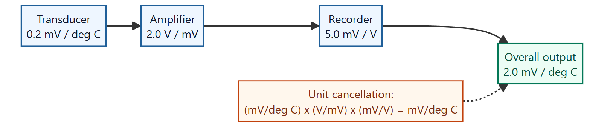
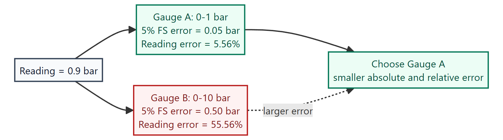
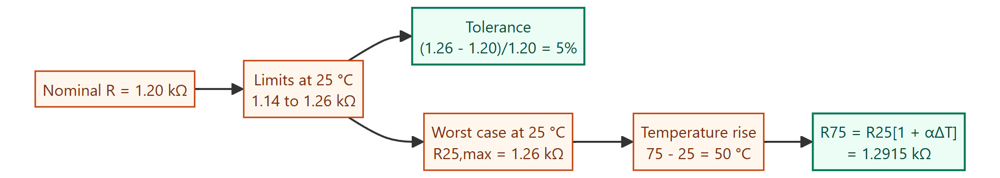
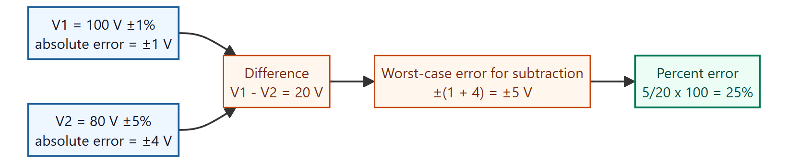
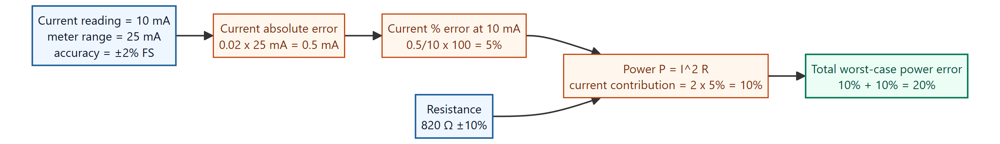
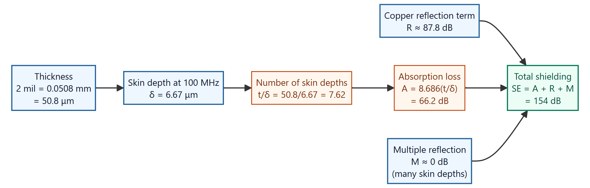
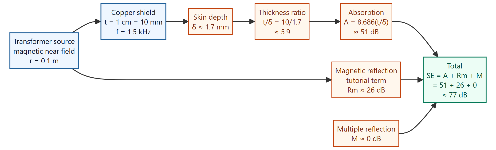
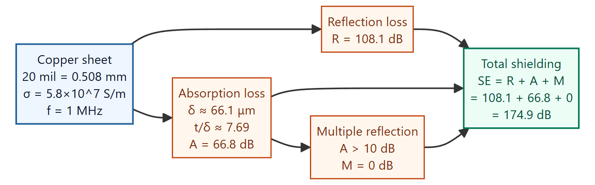
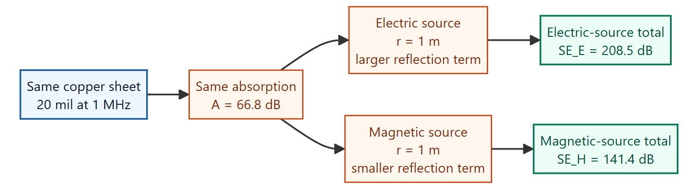
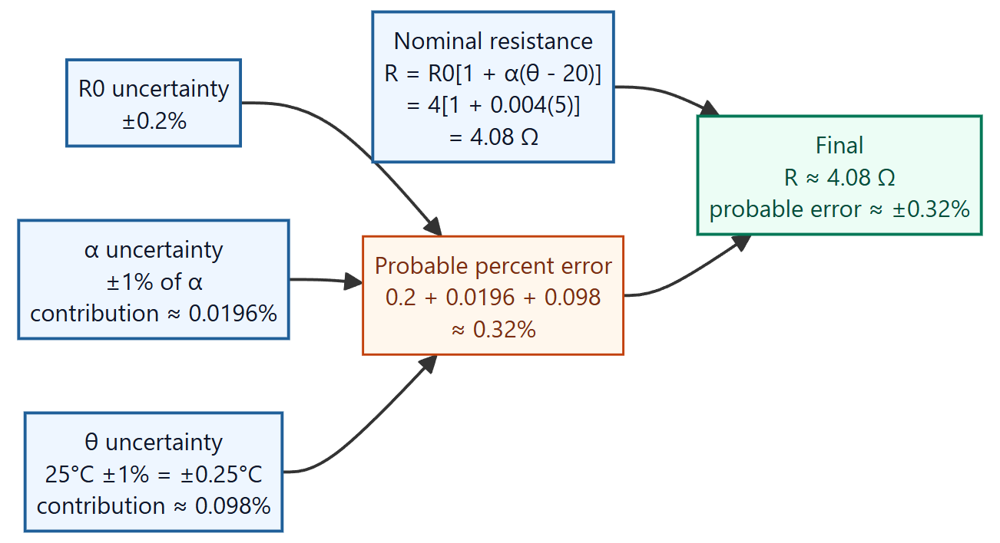

Generated from the tutorial PDF in `C:\Users\arzva\Downloads\MI`.

Each section is written as a learning note: concept first, marked visual where useful, then the worked answer and verification note.

## Question 1

Consider a measuring system consisting of a transducer, amplifier, and recorder. Sensitivities are: transducer 0.2 mV/°C, amplifier gain 2.0 V/mV, recorder sensitivity 5.0 mV/V. Determine the overall sensitivity.

### Learn the idea

Overall sensitivity of cascaded measurement stages is the product of the individual stage sensitivities. The safest way to do it is to multiply the numbers and cancel the units at the same time.

### Given and target

- Known values: transducer sensitivity $S_t=0.2\,\mathrm{mV}/^\circ\mathrm{C}$; amplifier gain $S_a=2.0\,\mathrm{V}/\mathrm{mV}$; recorder sensitivity $S_r=5.0\,\mathrm{mV}/\mathrm{V}$.
- Target: determine the overall chain sensitivity in $\mathrm{mV}/^\circ\mathrm{C}$.

### Annotated visual

Marked visual: the three measurement stages are shown in order, with the unit cancellation called out separately.

### Governing relation

- $S_{overall}=S_tS_aS_r$
- $S_{overall}=(0.2\,\mathrm{mV}/^\circ\mathrm{C})(2.0\,\mathrm{V}/\mathrm{mV})(5.0\,\mathrm{mV}/\mathrm{V})$

### Work it through

Step 1: write the cascade relation.

$S_{overall}=S_tS_aS_r$.

Step 2: substitute each stage sensitivity with units attached.

$S_{overall}=(0.2\,\mathrm{mV}/^\circ\mathrm{C})(2.0\,\mathrm{V}/\mathrm{mV})(5.0\,\mathrm{mV}/\mathrm{V})$.

Step 3: cancel intermediate units.

$\mathrm{mV}$ in the transducer output cancels with $\mathrm{mV}$ in the amplifier gain denominator, and $\mathrm{V}$ in the amplifier output cancels with $\mathrm{V}$ in the recorder sensitivity denominator.

Step 4: multiply the numeric factors.

$0.2\times2.0\times5.0=2.0$.

So the remaining unit is $\mathrm{mV}/^\circ\mathrm{C}$ and

$S_{overall}=2.0\,\mathrm{mV}/^\circ\mathrm{C}$.

### Final answer

Final answer: **overall sensitivity $S_{overall}=2.0\,\mathrm{mV}/^\circ\mathrm{C}$**.

### Common trap

Do not multiply only the numbers. The unit cancellation proves the result is a sensitivity in $\mathrm{mV}/^\circ\mathrm{C}$, not a voltage or a dimensionless gain.

## Question 2

Two pressure gauges A and B have full-scale accuracy of ±5%. Gauge A range is 0-1 bar and gauge B range is 0-10 bar. Which is more suitable for a reading of 0.9 bar?

### Learn the idea

Tolerance is found from the largest deviation from the nominal value. The maximum high-temperature resistance comes from taking the largest allowed room-temperature resistance and then applying the positive temperature coefficient.

### Given and target

- Known values: full-scale accuracy $=\pm5\%$; Gauge A range $0$-$1\,\mathrm{bar}$; Gauge B range $0$-$10\,\mathrm{bar}$; reading $=0.9\,\mathrm{bar}$.
- Target: compare the absolute full-scale errors at a 0.9 bar reading and select the lower-error gauge.

### Annotated visual

Marked visual: the same full-scale accuracy produces very different absolute errors because the gauges have different ranges.

### Governing relation

- Absolute error $=(\%\,\mathrm{full\ scale})(\mathrm{range})$
- Percent-of-reading error $=(\mathrm{absolute\ error}/\mathrm{reading})\times100$

### Work it through

Step 1: compute Gauge A absolute error.

$\Delta_A=0.05\times1\,\mathrm{bar}=0.05\,\mathrm{bar}$.

Step 2: convert Gauge A error into percent of the actual reading.

$\%e_A=\frac{0.05}{0.9}\times100=5.56\%$.

Step 3: compute Gauge B absolute error.

$\Delta_B=0.05\times10\,\mathrm{bar}=0.50\,\mathrm{bar}$.

Step 4: convert Gauge B error into percent of the actual reading.

$\%e_B=\frac{0.50}{0.9}\times100=55.56\%$.

Step 5: compare.

Gauge B has ten times the range, so its full-scale error is ten times larger. For a $0.9\,\mathrm{bar}$ reading, Gauge A gives the smaller absolute error and the smaller percent-of-reading error.

### Final answer

Final answer: **Gauge A is more suitable; its error is $\pm0.05\,\mathrm{bar}$ or $5.56\%$ of reading, compared with Gauge B's $\pm0.50\,\mathrm{bar}$ or $55.56\%$ of reading**.

### Common trap

Do not confuse percent of full-scale with percent of the actual reading.

## Question 3

A resistance manufacturer constructs resistors anywhere between 1.14 kΩ and 1.26 kΩ and classifies them as 1.2 kΩ. Determine the tolerance. If specified at 25 °C, determine maximum resistance possible at 75 °C for temperature coefficient +500 ppm/°C.

### Learn the idea

When a result is formed by subtraction, the nominal values subtract but the worst-case absolute errors add. Convert percent errors to absolute volts before combining them.

### Given and target

- Known values: resistance limits $1.14$-$1.26\,\mathrm{k}\Omega$ around nominal $1.2\,\mathrm{k}\Omega$; reference temperature $25^\circ\mathrm{C}$; final temperature $75^\circ\mathrm{C}$; temperature coefficient $+500\,\mathrm{ppm}/^\circ\mathrm{C}$.
- Target: Determine the tolerance. If specified at 25 °C, determine maximum resistance possible at 75 °C for temperature coefficient +500 ppm/°C.

### Annotated visual

Marked visual: first find the tolerance from the 25 °C limits, then apply the temperature rise to the worst-case high resistance.

### Governing relation

- $\mathrm{Tolerance}=\frac{R_{max}-R_{nom}}{R_{nom}}\times100$
- $R_T=R_{25}[1+\alpha(T-25^\circ\mathrm{C})]$

### Work it through

Step 1: identify the maximum deviation from nominal.

$R_{max}-R_{nom}=1.26-1.20=0.06\,\mathrm{k}\Omega$.

Step 2: convert that deviation to percentage tolerance.

$\mathrm{Tolerance}=\frac{0.06}{1.20}\times100=5\%$.

The lower limit also confirms the same magnitude:

$\frac{1.20-1.14}{1.20}\times100=5\%$.

Worst resistance at 25 °C is $1.26\,\mathrm{k}\Omega$. Temperature rise is $50\,^\circ\mathrm{C}$.

Step 3: convert ppm to a multiplier.

$500\,\mathrm{ppm}/^\circ\mathrm{C}=500\times10^{-6}/^\circ\mathrm{C}$.

Step 4: apply the temperature rise to the worst-case resistance.

$R_{75}=1.26[1+(500\times10^{-6})(50)]$.

$R_{75}=1.26(1+0.025)=1.2915\,\mathrm{k}\Omega$.

### Final answer

Final answer: **tolerance is $\pm5\%$; maximum resistance at $75^\circ\mathrm{C}$ is $1.2915\,\mathrm{k}\Omega$, about $1.29\,\mathrm{k}\Omega$**.

### Common trap

Do not confuse percent of full-scale with percent of the actual reading.

## Question 4

Calculate the maximum percent error in determining voltage difference V1 - V2, given V1 = 100 V ±1% and V2 = 80 V ±5%.

### Learn the idea

Keep absolute error and percentage-of-reading error separate. Instruments with the same full-scale accuracy can behave very differently at a small reading.

### Given and target

- Known values: $V_1=100\,\mathrm{V}\pm1\%$; $V_2=80\,\mathrm{V}\pm5\%$; required quantity $V_1-V_2$.
- Target: Calculate the maximum percent error in determining voltage difference V1 - V2, given V1 = 100 V ±1% and V2 = 80 V ±5%.

### Annotated visual

Marked visual: the voltage readings subtract, but their worst-case absolute errors add.

### Governing relation

- $V_d=V_1-V_2$
- $\Delta V_d=\Delta V_1+\Delta V_2$ for worst-case subtraction error
- $\%e=(\Delta V_d/V_d)\times100$

### Work it through

Step 1: calculate the nominal difference.

$V_d=100-80=20\,\mathrm{V}$.

Step 2: convert the percent errors to absolute voltage errors.

$\Delta V_1=1\%\times100=1\,\mathrm{V}$.

$\Delta V_2=5\%\times80=4\,\mathrm{V}$.

Step 3: combine worst-case errors for subtraction.

$\Delta V_d=\Delta V_1+\Delta V_2=1+4=5\,\mathrm{V}$.

Step 4: express this error as a percentage of the difference.

$\%e=\frac{5}{20}\times100=25\%$.

### Final answer

Final answer: **$V_1-V_2=20\,\mathrm{V}$ with maximum error $\pm5\,\mathrm{V}$, so the maximum percent error is $\pm25\%$**.

### Common trap

Do not subtract percentage errors directly. Convert them to absolute voltage errors first, then combine.

## Question 5

An 820 Ω resistance with accuracy ±10% carries 10 mA. Current is measured on a 25 mA analog ammeter range with accuracy ±2% of full scale. Calculate power and accuracy.

### Learn the idea

For $P=I^2R$, current error is doubled because current is squared. Also, an analog meter's percent full-scale accuracy must be converted to percent of the actual reading.

### Given and target

- Known values: resistor $R=820\,\Omega\pm10\%$; current range $10$-$25\,\mathrm{mA}$; current accuracy $\pm2\%$.
- Target: Calculate power and accuracy.

### Annotated visual

Marked visual: the current measurement error is first converted from full-scale error to reading error, then doubled because $P=I^2R$.

### Governing relation

- $P=I^2R=(0.01)^2(820)=0.082 W=82\,\mathrm{mW}$
- $0.02\times25\,\mathrm{mA}=0.5\,\mathrm{mA}$
- $\frac{\Delta P}{P}=2\frac{\Delta I}{I}+\frac{\Delta R}{R}$

### Work it through

Step 1: calculate nominal power.

$P=I^2R=(0.010)^2(820)=0.082\,\mathrm{W}=82\,\mathrm{mW}$.

Step 2: convert meter full-scale accuracy into absolute current error.

$\Delta I=(2\%)(25\,\mathrm{mA})=0.5\,\mathrm{mA}$.

Step 3: convert absolute current error into percent of actual current.

$\frac{\Delta I}{I}\times100=\frac{0.5}{10}\times100=5\%$.

Step 4: propagate error through $P=I^2R$.

Because $P$ depends on $I^2$, current contributes $2(5\%)=10\%$.

Step 5: add the resistor error for worst-case accuracy.

$\frac{\Delta P}{P}=10\%+10\%=20\%$.

Absolute power uncertainty:

$\Delta P=0.20(82\,\mathrm{mW})=16.4\,\mathrm{mW}$.

### Final answer

Final answer: **$P=82\,\mathrm{mW}$ with worst-case accuracy $\pm20\%$, i.e. about $\pm16.4\,\mathrm{mW}$**.

### Common trap

Do not confuse percent of full-scale with percent of the actual reading.

## Question 6

Calculate shielding effectiveness of a 2 mil copper foil, sigma = $5.7\times10^{7}\,\mathrm{S/m}$, at 100 MHz. 1 mil = 0.0254 mm.

### Learn the idea

Shielding effectiveness is the sum of absorption loss, reflection loss, and the multiple-reflection correction. For a good conductor several skin depths thick, the multiple-reflection term is negligible.

### Given and target

- Known values: thickness $t=2\,\mathrm{mil}=0.0508\,\mathrm{mm}=5.08\times10^{-5}\,\mathrm{m}$, conductivity $\sigma=5.7\times10^{7}\,\mathrm{S/m}$, frequency $f=100\,\mathrm{MHz}$.
- Target: calculate total shielding effectiveness in dB.

### Annotated visual

### Governing relation

- $SE=A+R+M$
- $\delta=\sqrt{1/(\pi f\mu_0\sigma)}$
- $A=8.686(t/\delta)$
- For this worked example, the tutorial/PDF reflection term for copper at the stated condition is $R\approx87.8\,\mathrm{dB}$.

### Work it through

Step 1: Convert thickness into metres and micrometres.

$t=2\,\mathrm{mil}\times0.0254\,\mathrm{mm/mil}=0.0508\,\mathrm{mm}$

$0.0508\,\mathrm{mm}=5.08\times10^{-5}\,\mathrm{m}=50.8\,\mu\mathrm{m}$

Step 2: Calculate skin depth for copper at $100\,\mathrm{MHz}$.

$\delta=\sqrt{1/[\pi(100\times10^6)(4\pi\times10^{-7})(5.7\times10^7)]}=6.67\,\mu\mathrm{m}$.

Step 3: Express the foil thickness as a number of skin depths.

$t/\delta=50.8/6.67=7.62$

The copper foil is therefore about $7.62$ skin depths thick.

Step 4: Calculate absorption loss.

$A=8.686(7.62)=66.2\,\mathrm{dB}$.

Step 5: Add the reflection and multiple-reflection terms.

Using the tutorial/PDF copper reflection term for this case:

$R\approx87.8\,\mathrm{dB}$

Since the shield is more than several skin depths thick, the internal repeated-reflection correction is negligible:

$M\approx0\,\mathrm{dB}$

Step 6: Add the shielding-effectiveness components.

$SE=66.2+87.8+0=154.0\,\mathrm{dB}$.

### Final answer

Final answer: **shielding effectiveness $SE\approx154\,\mathrm{dB}$**.

### Common trap

Do not leave conductivity as raw scientific notation; $5.7\times10^7\,\mathrm{S/m}$ controls the skin-depth calculation.

## Question 7

A transformer generating primarily a magnetic field is 10 cm from a copper shielding structure made from 1 cm thick copper. Estimate shielding effectiveness at 1.5 kHz.

### Learn the idea

For a nearby transformer, treat the source as magnetic near-field shielding. The total shielding still adds reflection and absorption terms, but the magnetic near-field reflection term is much smaller than for an electric field source.

### Given and target

- Known values: source distance $r=10\,\mathrm{cm}=0.1\,\mathrm{m}$, copper thickness $t=1\,\mathrm{cm}=0.01\,\mathrm{m}=10\,\mathrm{mm}$, frequency $f=1.5\,\mathrm{kHz}$, copper conductivity $\sigma\approx5.8\times10^{7}\,\mathrm{S/m}$.
- Target: estimate magnetic-field shielding effectiveness in dB.

### Annotated visual

### Governing relation

- $SE=A+R_m+M$
- $\delta=\sqrt{1/(\pi f\mu_0\sigma)}$
- $A=8.686(t/\delta)$
- For this tutorial example, the magnetic near-field reflection term at $r=0.1\,\mathrm{m}$ and $f=1.5\,\mathrm{kHz}$ is $R_m\approx26\,\mathrm{dB}$.

### Work it through

Step 1: Convert the copper thickness.

$t=1\,\mathrm{cm}=10\,\mathrm{mm}=0.01\,\mathrm{m}$

Step 2: Calculate copper skin depth at $1.5\,\mathrm{kHz}$.

$\delta=\sqrt{1/[\pi(1.5\times10^3)(4\pi\times10^{-7})(5.8\times10^7)]}$

$\delta=1.71\,\mathrm{mm}\approx1.7\,\mathrm{mm}$

Step 3: Express the shield as a number of skin depths.

$t/\delta=10/1.7=5.9$

Step 4: Calculate absorption loss.

$A=8.686(5.9)=51\,\mathrm{dB}$.

Step 5: Use the magnetic near-field reflection term.

For a transformer source at $r=0.1\,\mathrm{m}$ and $f=1.5\,\mathrm{kHz}$:

$R_m\approx26\,\mathrm{dB}$

The shield is several skin depths thick, so the multiple-reflection correction is negligible:

$M\approx0\,\mathrm{dB}$

Step 6: Add the shielding components.

$SE=51+26+0=77\,\mathrm{dB}$.

### Final answer

Final answer: **magnetic-field shielding effectiveness $SE\approx77\,\mathrm{dB}$**.

### Common trap

Do not use the electric-field reflection term for a nearby transformer; the source is magnetic near-field dominated.

## Question 8

Practice: Determine shielding effectiveness for a 20 mil copper sheet, sigma = $5.8\times10^{7}\,\mathrm{S/m}$, at 1 MHz due to reflection loss, multiple reflections, absorption loss, and all mechanisms.

### Learn the idea

Compute each shielding component separately, then add the dB terms. Multiple reflection can be taken as zero when absorption loss is large.

### Given and target

- Known values: $t=20\,\mathrm{mil}=0.508\,\mathrm{mm}=5.08\times10^{-4}\,\mathrm{m}$, $\sigma=5.8\times10^{7}\,\mathrm{S/m}$, $f=1\,\mathrm{MHz}$.
- Target: find $R$, $A$, $M$, and total $SE$.

### Annotated visual

### Governing relation

- $SE=R+A+M$
- $\delta=\sqrt{1/(\pi f\mu_0\sigma)}$
- $A=8.686(t/\delta)$
- For this tutorial copper-sheet case, $R=108.1\,\mathrm{dB}$.

### Work it through

Step 1: Convert thickness.

$t=20(0.0254\,\mathrm{mm})=0.508\,\mathrm{mm}$.

$0.508\,\mathrm{mm}=5.08\times10^{-4}\,\mathrm{m}$

Step 2: Calculate copper skin depth at $1\,\mathrm{MHz}$.

$\delta=\sqrt{1/[\pi(1\times10^6)(4\pi\times10^{-7})(5.8\times10^7)]}$

$\delta=6.61\times10^{-5}\,\mathrm{m}=66.1\,\mu\mathrm{m}$

Step 3: Express the sheet thickness as skin depths.

$t/\delta=(0.508\,\mathrm{mm})/(0.0661\,\mathrm{mm})=7.69$

Step 4: Calculate absorption loss.

$A=8.686(7.69)=66.8\,\mathrm{dB}$

Step 5: Use the tutorial reflection loss.

$R=108.1\,\mathrm{dB}$.

Step 6: Decide the multiple-reflection correction.

Since $A=66.8\,\mathrm{dB}$ is much larger than $10\,\mathrm{dB}$, internal multiple reflections are negligible:

$M=0\,\mathrm{dB}$

Step 7: Add the components.

$SE=108.1+66.8+0=174.9\,\mathrm{dB}$.

### Final answer

Final answer: **$R=108.1\,\mathrm{dB}$, $A=66.8\,\mathrm{dB}$, $M=0\,\mathrm{dB}$, so $SE=174.9\,\mathrm{dB}$**.

### Common trap

Do not report only reflection or only absorption; total shielding effectiveness is the dB sum of the applicable terms.

## Question 9

Practice: Determine shielding effectiveness for a 20 mil copper sheet at 1 MHz for (a) electric source at 1 m and (b) magnetic source at 1 m.

### Learn the idea

The sheet and frequency are unchanged from the previous problem, so absorption stays the same. The difference is the source impedance correction: electric near-field sources get a larger reflection term than magnetic near-field sources.

### Given and target

- Known values: $t=20\,\mathrm{mil}=0.508\,\mathrm{mm}$, $f=1\,\mathrm{MHz}$, source distance $r=1\,\mathrm{m}$.
- Target: compare electric-source and magnetic-source shielding effectiveness.

### Annotated visual

### Governing relation

- $SE=R_{\text{source}}+A+M$
- The sheet is the same as Question 8, so $A=66.8\,\mathrm{dB}$ and $M=0\,\mathrm{dB}$ stay unchanged.
- The source type changes the reflection/source-impedance term.

### Work it through

Step 1: Carry over the absorption term from Question 8.

$A=66.8\,\mathrm{dB}$.

Step 2: Carry over the multiple-reflection decision.

$M=0\,\mathrm{dB}$

Step 3: Apply the electric-source correction.

For the electric-field source at $1\,\mathrm{m}$, the tutorial/PDF near-field calculation gives:

$SE_E=208.5\,\mathrm{dB}$.

This corresponds to a much larger source reflection contribution:

$R_E=SE_E-A-M=208.5-66.8-0=141.7\,\mathrm{dB}$

Step 4: Apply the magnetic-source correction.

For the magnetic-field source at $1\,\mathrm{m}$, the tutorial/PDF near-field calculation gives:

$SE_H=141.4\,\mathrm{dB}$.

This corresponds to a lower magnetic-source reflection contribution:

$R_H=SE_H-A-M=141.4-66.8-0=74.6\,\mathrm{dB}$

Step 5: Compare the results.

The electric-source shielding effectiveness is larger because the source reflection term is larger for this case.

### Final answer

Final answer: **electric source $SE=208.5\,\mathrm{dB}$; magnetic source $SE=141.4\,\mathrm{dB}$**.

### Common trap

Do not reuse the same reflection term for electric and magnetic near-field sources; only the absorption term is unchanged.

## Question 10

Practice: Copper wire resistance is $R=R_0[1+\alpha(\theta-20)]$. Resistance measured at $20^\circ\mathrm{C}$ is $4\,\Omega\pm0.2\%$. $\alpha=0.004/^\circ\mathrm{C}\pm1\%$ and $\theta=25^\circ\mathrm{C}\pm1\%$. Find resistance and probable error.

### Learn the idea

The nominal resistance comes from substituting the temperature into the resistance-temperature equation. The probable percentage error comes from adding the individual percentage contributions from $R_0$, $\alpha$, and $\theta$.

### Given and target

- Known values: $R=R_0[1+\alpha(\theta-20)]$; $R_0=4\,\Omega\pm0.2\%$ at $20^\circ\mathrm{C}$; $\alpha=0.004/^\circ\mathrm{C}\pm1\%$; $\theta=25^\circ\mathrm{C}\pm1\%$.
- Target: Find resistance and probable error.

### Annotated visual

### Governing relation

- $R=R_0[1+\alpha(\theta-20)]$
- $\Delta\theta=\theta-20$
- Percentage contribution from $R_0$: $0.2\%$
- Percentage contribution from $\alpha$: $\frac{\alpha\Delta\theta}{1+\alpha\Delta\theta}\times(\alpha\text{ percent error})$
- Percentage contribution from $\theta$: $\frac{\alpha\,\Delta\theta_{\text{error}}}{1+\alpha\Delta\theta}\times100$

### Work it through

Step 1: Calculate the temperature rise above the reference temperature.

$\Delta\theta=25-20=5^\circ\mathrm{C}$

Step 2: Calculate nominal resistance.

$R=4[1+0.004(5)]$

$R=4(1.02)=4.08\,\Omega$

The PDF also lists a measured corrected resistance of about $4.093\,\Omega$; the direct formula substitution gives $4.08\,\Omega$.

Step 3: Write the $R_0$ error contribution.

$R_0$ is already stated as $\pm0.2\%$, so:

$e_{R_0}=0.2\%$

Step 4: Calculate the $\alpha$ error contribution.

Only the temperature-correction factor $\alpha\Delta\theta$ is affected by $\alpha$ error:

$\frac{\alpha\Delta\theta}{1+\alpha\Delta\theta}=\frac{0.004(5)}{1+0.004(5)}=\frac{0.02}{1.02}=0.0196$

Since $\alpha$ has $\pm1\%$ uncertainty:

$e_\alpha=0.0196(1\%)=0.0196\%$

Step 5: Calculate the temperature reading error contribution.

$1\%$ of $25^\circ\mathrm{C}$ is:

$\Delta\theta_{\text{error}}=0.01(25)=0.25^\circ\mathrm{C}$

The corresponding percentage contribution to resistance is:

$e_\theta=\frac{0.004(0.25)}{1.02}\times100=0.098\%$

Step 6: Add probable percentage errors.

$e_R=e_{R_0}+e_\alpha+e_\theta$

$e_R=0.2+0.0196+0.098=0.3176\%\approx0.32\%$

Step 7: Convert to absolute error if required.

$\Delta R=0.003176(4.08)=0.01296\,\Omega\approx0.013\,\Omega$

### Final answer

Final answer: **$R\approx4.08\,\Omega$ with probable error $\pm0.32\%$, or about $\pm0.013\,\Omega$**.

### Common trap

Keep units attached through the substitution; most wrong answers here come from losing scale factors.
